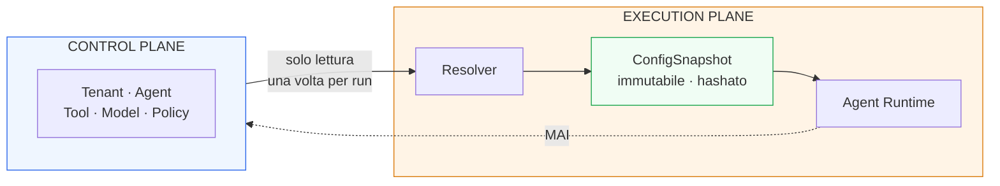
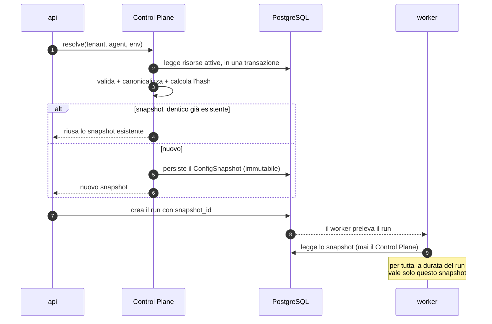
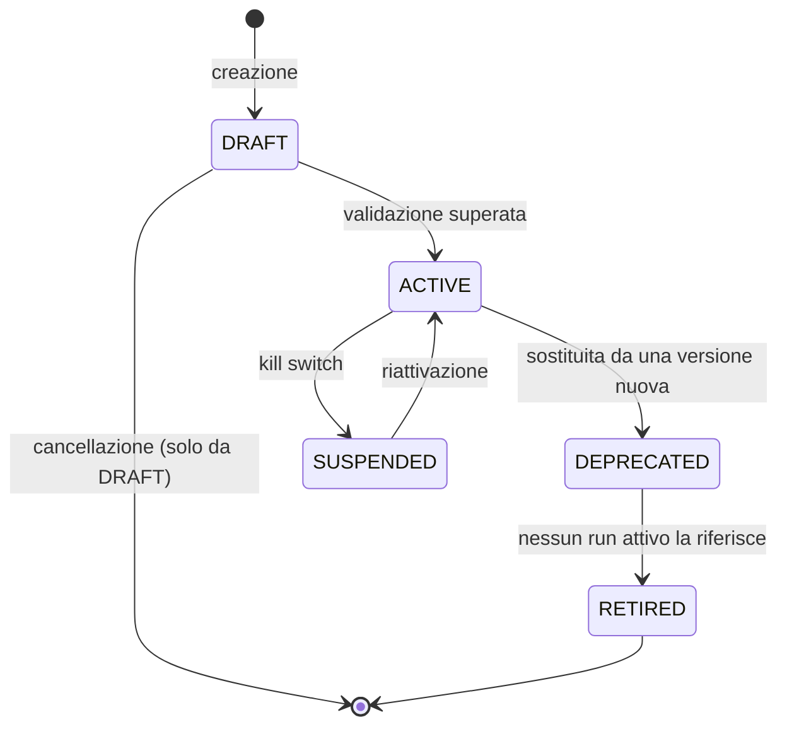
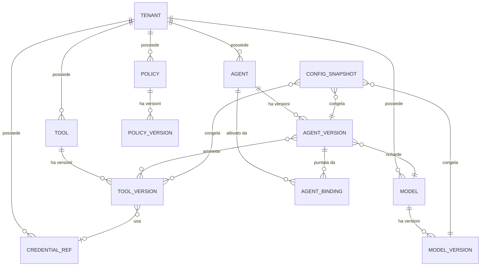
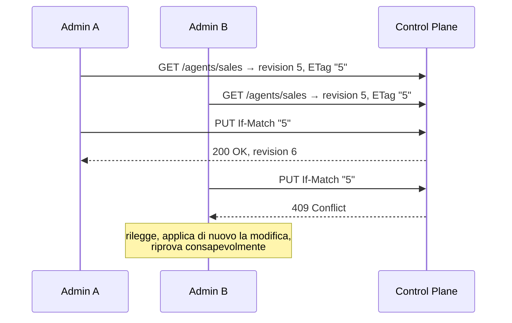

# 02 — CONTROL PLANE ARCHITECTURE

> **Livello:** A (Core Day 1)
> **Dipende da:** `01_ARCHITECTURE_PRINCIPLES.md` — in particolare `ADR-001` (deployment),
> `ADR-003` (PostgreSQL), `ADR-004` (policy come dato), `ADR-009` (`tenant_id`),
> `AR-006`/`AR-008` (il runtime legge il Control Plane, non lo scrive).
> **Vincola:** `A03` (governance), `A04` (runtime), `A05` (model), `A06` (tool), `A15` (deployment).

---

## 1. In breve

### L'analogia

Il Control Plane è il **regolamento aziendale scritto e firmato**.

Dice chi può fare cosa, con quali strumenti, seguendo quali regole. È un documento: non
esegue niente, non prende decisioni sul momento, non parla con i clienti. Sta in un
raccoglitore, ha una data, una versione e una firma.

L'Execution Plane è il **lavoro che si svolge davvero**. Legge il regolamento e agisce di
conseguenza.

Le due cose non vanno confuse, e soprattutto: **chi lavora non può riscrivere il
regolamento mentre lavora**. È la regola `AR-006`, e da sola chiude un'intera classe di
escalation di privilegi.

### La decisione

> **Un Control Plane embedded — un modulo dentro lo stesso artefatto — con la superficie
> API e il modello dati di un servizio separato, e la forma `spec`/`status` dei sistemi
> dichiarativi, ma senza il loro loop di riconciliazione.**

Detto in modo più diretto: prendiamo di Kubernetes il **modello delle risorse** (versioni
immutabili, concorrenza ottimistica, separazione fra intento e osservazione) e rifiutiamo
la sua **macchina** (controller, watch, riconciliazione continua), perché quella macchina
serve a governare una flotta e noi non abbiamo una flotta.

### Il meccanismo centrale: il Config Snapshot

È l'idea più importante di questo documento.

Quando un run parte, il runtime **non consulta il Control Plane a ogni passo**. Risolve una
volta sola l'intera configurazione applicabile, la congela in uno **snapshot** con un hash,
lo attacca al run, e usa quello per tutta la durata dell'esecuzione.

```text
avvio del run
     ↓
resolve(tenant, agent, environment)
     ↓
ConfigSnapshot { agent_version, tool_versions[], model_version,
                 policy_bundle_version, prompt_hash, capability_set }
     ↓
hash + persistito + agganciato al run
     ↓
il run usa SOLO questo, fino alla fine
```

Da questa singola scelta discendono quattro proprietà che altrimenti costerebbero
sottosistemi separati:

| Proprietà | Perché segue dallo snapshot |
|---|---|
| **Riproducibilità** | il run registra *esattamente* con quale configurazione è stato eseguito |
| **Il Control Plane non è critico** | se cade, i run in corso proseguono; solo i run *nuovi* non partono |
| **Nessun comportamento che cambia a metà** | una modifica alla configurazione non altera un run già avviato |
| **Rollback banale** | tornare indietro significa cambiare un puntatore, non migrare stato |

C'è una sola eccezione, deliberata, ed è spiegata in §12.3: le **revoche** di policy hanno
effetto immediato anche sui run in corso. Una revoca che aspetta la fine del run non è una
revoca.

---

## 2. Che cos'è un Control Plane

Il prompt chiede di non dare per scontata la risposta. Giusto: "control plane" è uno di
quei termini che tutti usano e ognuno intende diversamente.

### Definizione operativa

> Il **Control Plane** è il componente che possiede l'**intento dichiarato** sul
> comportamento del sistema, sotto forma di dati tipizzati, versionati e validati, e lo
> rende disponibile all'Execution Plane in modo consultabile.
>
> Non esegue lavoro. Non prende decisioni contestuali. Non sta sul percorso dei dati.

Tre parole di quella definizione fanno tutto il lavoro:

| Parola | Cosa esclude |
|---|---|
| **intento** | esclude lo stato di ciò che sta accadendo: quello è dell'Execution Plane |
| **dichiarato** | esclude la logica: il Control Plane contiene dati, non comportamento |
| **versionato** | esclude la configurazione mutabile senza storia |

### In cosa differisce da sette cose con cui viene confuso

| Non è un… | Differenza essenziale | Conseguenza pratica |
|---|---|---|
| **Runtime** | il Runtime possiede *cosa sta succedendo*; il Control Plane *cosa dovrebbe succedere* | tabelle diverse, volumi di scrittura diversi di ordini di grandezza |
| **API Gateway** | il gateway sta **sul percorso dei dati** di ogni richiesta; il Control Plane no | se il Control Plane cade, le richieste in corso non si fermano |
| **Configuration Service** | un config service serve coppie chiave-valore; il Control Plane possiede un **modello di risorse tipizzato** con relazioni, lifecycle e validazione | non si può sostituire con un file `.env` o un key-value store |
| **Sistema di deployment** | il deployment **sposta artefatti**; il Control Plane **dichiara quale versione deve essere attiva** | il Control Plane può registrare un deployment senza eseguirlo |
| **Policy Engine** | il Control Plane possiede la **definizione** della policy; il motore ne fa la **valutazione** | è la separazione PDP/PEP di `A01` §15.3 |
| **Orchestration Engine** | l'orchestratore **sequenzia lavoro**; il Control Plane non sequenzia niente | nessuna coda, nessuna macchina a stati di esecuzione qui dentro |
| **Admin Console** | la console è una **interfaccia utente**; il Control Plane è l'**API** dietro di essa | la console è un consumer come un altro, senza privilegi speciali |

### Il test per capire se qualcosa appartiene al Control Plane

Tre domande. Se una sola risposta è "no", non ci appartiene.

```text
1. È una dichiarazione di intento, non un'osservazione di fatto?
2. Cambia raramente rispetto al volume di esecuzione?
3. Ha senso versionarla e chiedersi "chi l'ha cambiata e quando"?
```

Esempio applicato:

| Cosa | D1 | D2 | D3 | Verdetto |
|---|---|---|---|---|
| Definizione di un agent | sì | sì | sì | **Control Plane** |
| Stato di un run | no | no | no | Execution Plane |
| Elenco dei worker attivi | no | no | no | né l'uno né l'altro: è telemetria |
| Policy di autorizzazione | sì | sì | sì | **Control Plane** |
| Decisione di autorizzazione su una singola chiamata | no | no | — | Execution Plane (è un fatto, va nell'Evidence Plane) |
| Endpoint dell'inference server | sì | sì | sì | **Control Plane** |
| Pesi del modello | — | — | — | né l'uno né l'altro: è un artefatto esterno, il Control Plane ne tiene il **riferimento** |

L'ultima riga è il pattern che si ripete: **il Control Plane possiede i riferimenti, non le
cose**. Vale per i pesi del modello, per i segreti, per i documenti della knowledge base.

---

## 3. Il problema architetturale

> Progettare il posto in cui vive la configurazione della piattaforma, in modo che sia
> versionata, auditabile, isolata per tenant e sostituibile, **senza** costruire una
> replica in miniatura di Kubernetes e **senza** che il runtime dipenda da esso per
> continuare a funzionare.

Quattro sotto-problemi:

| # | Domanda |
|---|---|
| CP1 | Il Control Plane è un modulo o un servizio? |
| CP2 | Serve un modello dichiarativo con riconciliazione, o basta configurazione validata e persistita? |
| CP3 | Quali risorse esistono davvero — e quali sembrano necessarie ma non lo sono? |
| CP4 | Come fa il runtime a ottenere la configurazione senza dipendere dalla disponibilità del Control Plane? |

`CP4` è quello che quasi tutte le architetture sbagliano, e la risposta è §12.

---

## 4. Vincoli ereditati da `01_ARCHITECTURE_PRINCIPLES.md`

Non sono negoziabili qui. Se questo documento avesse bisogno di violarli, servirebbe un ADR
che superi quello originale.

| Vincolo | Da dove | Conseguenza per il Control Plane |
|---|---|---|
| Un artefatto, più ruoli | `ADR-001` | il Control Plane è un **modulo**, non un container in più |
| PostgreSQL unico system of record | `ADR-003` | le risorse sono tabelle, non file YAML né un etcd |
| Le policy sono dati versionati | `ADR-004` | il Policy Registry vive qui |
| `tenant_id` ovunque | `ADR-009` | ogni risorsa è scopata per tenant, incluse quelle "globali" |
| Il runtime legge, non scrive | `AR-006`, `AR-008` | permessi a livello di database, non convenzione di codice |
| Un piano è una responsabilità, non un processo | `AR-004` | "Control Plane" non implica "servizio separato" |
| Niente astrazioni senza seconda implementazione | `AR-020` | niente `ConfigProvider` generico |
| Niente registry che non serve | `AR-019` in spirito | ogni risorsa va giustificata individualmente |

---

## 5. Alternative architetturali

### Opzione A — Control Plane embedded (modulo nel monolite)

Un modulo `control_plane` dentro lo stesso artefatto. Espone API amministrative attraverso
il ruolo `api`. Le risorse sono tabelle PostgreSQL.

| Dimensione | Valutazione |
|---|---|
| Complessità Day-1 | **Forte** — nessun processo in più |
| Complessità operativa | **Forte** |
| Isolamento dei guasti | **Debole** — condivide il processo con il resto dell'`api` |
| Sicurezza | **Moderato** — la separazione dei permessi è a livello di database e di ruolo, non di processo |
| Multi-tenancy | **Forte** — è una colonna |
| Scalabilità | **Forte** per il volume atteso: le letture sono cacheabili, le scritture rarissime |
| Migrazione verso un servizio | **Moderato-Forte** se il modulo non viene bypassato |
| Esperienza di sviluppo | **Forte** — refactor atomici con il resto |

### Opzione B — Control Plane come servizio dedicato

Processo separato con API propria e database proprio (o schema proprio).

| Dimensione | Valutazione |
|---|---|
| Complessità Day-1 | **Debole** — un servizio in più da far partire, autenticare, monitorare |
| Isolamento dei guasti | **Forte** |
| Sicurezza | **Forte** — confine di processo reale fra chi definisce e chi esegue |
| **Disponibilità** | **Debole se fatto ingenuamente** — il runtime dipenderebbe da una chiamata di rete per partire |
| Coerenza transazionale | **Debole** — con database separati, non si può più creare un run e leggere la configurazione nella stessa transazione |

L'ultima riga è la più costosa e la meno evidente.

### Opzione C — Control Plane dichiarativo con riconciliazione

Modello Kubernetes completo: risorse con `spec` e `status`, controller che osservano e
convergono l'actual state verso il desired state.

| Dimensione | Valutazione |
|---|---|
| Potenza | **Forte** — gestisce flotte che vanno alla deriva |
| Complessità Day-1 | **Molto debole** — controller, watch, gestione della convergenza, casi limite |
| **Adatto al problema?** | **Debole** — vedi sotto |

**L'argomento decisivo.** La riconciliazione serve quando esiste una **flotta di entità con
stato proprio che può divergere** dall'intento, e qualcosa deve continuamente riportarla in
linea. Kubernetes riconcilia perché un nodo può morire, un pod può sparire, e nessuno lo
dice a nessuno.

Da noi, Day-1, **non c'è niente che diverge**: i worker non tengono configurazione, la
leggono all'avvio di ogni run. Non c'è deriva, quindi non c'è niente da riconciliare.

Costruire un motore di riconciliazione ora significherebbe costruire la soluzione a un
problema che non abbiamo — l'anti-pattern che il prompt chiama esplicitamente
"Kubernetes imitation".

### Opzione D — Ibrido: lettura embedded, gestione separata

Il percorso di lettura (risoluzione della configurazione) è embedded; le API di gestione
stanno in un servizio separato. Entrambi sullo stesso database.

| Dimensione | Valutazione |
|---|---|
| Complessità Day-1 | **Moderato** — un servizio in più, ma solo amministrativo |
| Sicurezza | **Forte** — la superficie amministrativa è isolata e può stare su una rete diversa |
| Disponibilità | **Forte** — se la gestione cade, l'esecuzione continua |
| Adatto Day-1? | **Prematuro** — il beneficio è reale ma arriva quando la superficie amministrativa è esposta a internet |

**Questa è l'opzione giusta al momento sbagliato.** La segno come destinazione naturale
dell'evoluzione, non come scelta Day-1.

---

## 6. Matrice di selezione

| Criterio | A — embedded | B — servizio | C — dichiarativo | D — ibrido |
|---|---|---|---|---|
| Fattibilità Day-1 | **Forte** | Debole | Molto debole | Moderato |
| Scalabilità futura | Forte | Forte | Forte | Forte |
| Complessità operativa | **Forte** | Debole | Molto debole | Moderato |
| Multi-tenancy | Forte | Forte | Forte | Forte |
| Gestione dei deployment | Moderato | Forte | Forte | Forte |
| Necessità di riconciliazione | non serve | non serve | risolve un problema assente | non serve |
| Complessità di migrazione | — | media da A | alta da A | **bassa da A** |
| Requisiti hardware | **Minimi** | +1 processo | +N processi | +1 processo |
| Vendor lock-in | Nullo | Nullo | Nullo | Nullo |
| Isolamento dei guasti | Debole | Forte | Forte | Forte |
| Coerenza transazionale con il runtime | **Forte** | Debole | Debole | Forte |
| **Raccomandato Day-1** | **Sì** | No | No | No — ma è la destinazione |

### Il risultato in prosa

Nessuna opzione domina le altre su tutto, e chi dicesse il contrario starebbe vendendo
qualcosa.

L'opzione **A** vince perché le due colonne in cui perde — isolamento dei guasti e sicurezza
di processo — riguardano problemi che **non abbiamo Day-1**: un solo team, una macchina, una
superficie amministrativa non esposta a internet. Le colonne in cui vince — semplicità
operativa e coerenza transazionale — riguardano problemi che abbiamo **tutti i giorni**.

La coerenza transazionale merita una frase in più, perché è il vantaggio meno visibile e
più concreto: con il Control Plane sullo stesso database, creare un run e risolvere la sua
configurazione avviene **in un'unica transazione**. Con un servizio separato servirebbe una
chiamata di rete, la gestione del suo fallimento, e una finestra in cui la configurazione
può cambiare fra la lettura e l'uso. Sono tre problemi che semplicemente non esistono
nell'opzione A.

---

## 7. Decisione

> **RACCOMANDATO: Opzione A — Control Plane embedded**, con tre prestiti espliciti dalle
> altre opzioni.

| Prestito | Da | Cosa prendiamo | Cosa **non** prendiamo |
|---|---|---|---|
| Superficie API | B | API amministrativa resource-oriented, versionata, con permessi separati — come se fosse un servizio | il processo separato |
| Forma dei dati | C | `spec` (intento) e `status` (osservato) separati; versioni immutabili; concorrenza ottimistica | i controller e il loop di riconciliazione |
| Percorso di evoluzione | D | il modulo è scritto per poter essere estratto | l'estrazione adesso |

### Perché non le altre

**Perché non B (servizio dedicato).** Il beneficio reale — isolamento della superficie
amministrativa — arriva quando quella superficie è raggiungibile da fuori. Day-1 non lo è.
Il costo — coerenza transazionale persa, un processo in più, autenticazione servizio-a-servizio
— si paga da subito. Ed è precisamente il tipo di separazione che `AR-004` mette in guardia:
un piano non è un processo.

**Perché non C (dichiarativo con riconciliazione).** Non c'è niente che diverge. La
riconciliazione è la risposta alla domanda "come faccio a sapere se la realtà corrisponde
all'intento, quando la realtà può cambiare da sola?". Da noi la realtà non cambia da sola:
la configurazione viene letta all'inizio di ogni run, ogni volta. Costruire il motore adesso
è l'anti-pattern §30.1.

**Perché non D (ibrido).** È l'architettura giusta, un passo troppo presto. Diventa la
scelta corretta al trigger `T-CP-02` (§32).

### Cosa dovrebbe cambiare perché invertiamo

| Se… | Allora si va verso… |
|---|---|
| la superficie amministrativa viene esposta a internet o a utenti non fidati | **D** |
| il Control Plane diventa un collo di bottiglia in lettura misurato | cache + eventualmente **B** |
| compaiono più nodi runtime che tengono configurazione in memoria | **C**, limitatamente alla propagazione |
| serve gestire una flotta di installazioni presso clienti diversi | **C** su scala di fleet management |

---

## 8. Responsabilità del Control Plane

Il prompt chiede di classificare ogni responsabilità candidata. Uso quattro livelli:
**MUST** · **SHOULD** · **MAY** · **SHOULD NOT**.

| Responsabilità | Verdetto | Motivazione |
|---|---|---|
| **Tenant Registry** | **MUST** | è la radice di ogni isolamento (`ADR-009`); senza, il `tenant_id` non ha referente |
| **Agent Registry** | **MUST** | la definizione di agent è l'intento per eccellenza |
| **Tool Registry** | **MUST** | lo schema, la `risk_class` e i permessi di un tool sono dichiarazioni, non comportamento |
| **Policy Registry** | **MUST** | imposto da `ADR-004` |
| **Model Registry** | **MUST**, ma **sottile** | possiede il *riferimento* a un modello (endpoint, digest, parametri di default), non i pesi |
| **Version Management** | **MUST** | senza versioni immutabili non c'è riproducibilità (`A01` §25) |
| **Configuration Management** | **MUST** | è la definizione stessa del Control Plane |
| **Credential references** | **MUST** | i *riferimenti* sì |
| **Secrets** (i valori) | **SHOULD NOT** | un segreto nel database applicativo è un segreto in ogni backup e in ogni dump |
| **Kill switch** | **MUST**, come campo | non merita una risorsa propria: è un flag sul binding e uno globale per tenant |
| **Deployment configuration** | **SHOULD**, in forma minima | come *binding* (quale versione è attiva), non come risorsa `Deployment` con lifecycle proprio — vedi §14.2 |
| **Environment Management** | **MAY** | Day-1 un campo `environment`, non una risorsa |
| **Feature flags** | **MAY** | sono configurazione; non serve un sottosistema |
| **Workflow Registry** | **SHOULD NOT** Day-1 | il workflow deterministico è parte della definizione dell'`AgentVersion`. Separarlo ora è registry explosion — vedi §14.2 |
| **Evaluation Registry** | **SHOULD NOT** Day-1 | rimandato a `A12`/`A17`; le traiettorie stanno già nello step journal |
| **Runtime / Worker Registration** | **SHOULD NOT** | vedi sotto — è la decisione meno ovvia di questo elenco |
| **Resource Metadata** | **MUST** | owner, timestamp, autore della modifica, revisione |
| **Audit configuration** | **SHOULD** | retention e regole di redazione sono policy versionate |
| **Lifecycle Management** | **MUST** | stati delle risorse e transizioni valide |
| **Rollout configuration** | **MAY** | Day-1 il rollout è "cambia il puntatore" |

### La decisione che merita una spiegazione: niente registrazione dei worker

Sembra naturale che il Control Plane sappia quali worker esistono. Kubernetes lo fa.

**Ma Kubernetes lo fa perché *assegna* lavoro ai nodi.** Deve sapere dove mandare un pod,
quindi deve sapere quali nodi ci sono e in che stato.

Il nostro modello è opposto: i worker **prendono** lavoro dalla coda (`SELECT … FOR UPDATE
SKIP LOCKED`). Nessuno assegna niente a nessuno. Un worker che non c'è più semplicemente
smette di prendere lavoro.

Registrarli introdurrebbe:

| Problema introdotto | Costo |
|---|---|
| heartbeat | scritture continue nel Control Plane, che per definizione ha scritture rare |
| rilevamento dei morti | timeout, falsi positivi, un altro loop |
| garbage collection dei record obsoleti | un altro job |
| uno stato che diverge dalla realtà | **e quindi la riconciliazione** — che stavamo evitando |

Zero benefici, quattro costi, e uno di essi ci riporta esattamente al problema che l'Opzione
C ci faceva evitare.

**Quello che serve davvero** — "quanti worker sono vivi adesso?" — è una domanda di
**observability**, non di configurazione. La risposta sta nelle metriche (`A12`), dove i
dati stantii sono normali e nessuno costruisce logica sopra.

Questo è il test di §2 applicato: *è una dichiarazione di intento?* No, è un'osservazione.
Quindi non appartiene qui.

---

## 9. Non-responsabilità

Cosa il Control Plane **non** deve fare, con la distinzione — richiesta dal prompt — fra
"non lo fa" e "non ne ha nemmeno l'interfaccia".

| Non deve… | Ha l'interfaccia? | Nota |
|---|---|---|
| eseguire task di agent | **No** | non conosce nemmeno il concetto di `run` |
| eseguire tool | **No** | possiede la *definizione* del tool, mai l'esecutore |
| eseguire inference | **No** | possiede l'*endpoint*, non lo chiama mai |
| custodire i pesi del modello | **No** | possiede un `weights_digest` e un URI |
| fare retrieval | **No** | possiede la *configurazione* del retrieval |
| prendere decisioni di autorizzazione | **No** | possiede le *policy*; il PDP le valuta (`A03`) |
| fare da workflow runtime | **No** | nessuna coda, nessuna macchina a stati di esecuzione |
| fare da message broker | **No** | — |
| fare da API gateway generico | **No** | non sta sul percorso dei dati |
| fare da backend di observability | **No** | consuma metriche per mostrarle, non le conserva |
| custodire valori di segreti | **Sì, per i riferimenti** | `credential_ref` sì, il valore no |
| eseguire deployment | **Sì, per la dichiarazione** | dichiara quale versione è attiva; muovere gli artefatti è di `A15`/`A16` |

Le ultime due righe sono il pattern ricorrente: **il Control Plane dichiara, qualcun altro
fa**. Le sue "interfacce di deployment" sono righe in una tabella, non chiamate a un
sistema di rilascio.

---

## 10. Control Plane e Governance: dove passa il confine

`01_ARCHITECTURE_PRINCIPLES.md` §22 ha già rifiutato l'idea di un Governance Plane
separato. Qui rispondo alle domande puntuali che il prompt pone.

| Domanda | Risposta | Perché |
|---|---|---|
| Le **definizioni** di policy vivono nel Control Plane? | **Sì** | sono intento dichiarato, versionato, auditabile: superano tutti e tre i test di §2 |
| La **valutazione** vive in un Governance Plane separato? | **No** | vive nell'Execution Plane, dentro il PDP, sul percorso obbligato. Un piano separato induce il bypass |
| Il **versioning** delle policy vive nel Control Plane? | **Sì** | insieme alla definizione |
| Dove avviene l'**authorization**? | nel PEP dell'Execution Plane, che interroga il PDP | è il punto in cui il pensiero diventa azione |
| Dove avviene la **valutazione del rischio**? | la `risk_class` è **dichiarata** nel Control Plane (sul tool); la sua **applicazione** è nel PDP | dichiarazione ≠ applicazione, di nuovo |
| Dove vive lo stato di **approval**? | **Execution Plane** | un'approvazione è un fatto accaduto su un run specifico, non una regola |
| Come ottiene il Runtime la policy applicabile? | attraverso il **Config Snapshot** (§12) | risolta una volta, all'avvio |
| Come si àncora la versione di policy a un'esecuzione? | il `policy_bundle_version` è dentro lo snapshot e viene registrato sul run | riproducibilità |

### La riga che va letta due volte

*"Dove vive lo stato di approval?"* → **Execution Plane**.

È un errore frequente e costoso metterlo nel Control Plane, perché "l'approvazione è
governance". Ma l'approvazione di una specifica azione di uno specifico run è un **evento**,
non una regola. La regola è "le email verso l'esterno richiedono approvazione" — quella sta
nel Control Plane. Il fatto che Maria abbia approvato l'email numero 4 del run 8293 alle
14:32 è un evento, e appartiene all'Execution Plane e all'Evidence Plane.

Confonderli significa avere scritture ad alto volume nel Control Plane, che per definizione
ne ha poche — e perdere la distinzione di §2.

---

## 11. Control Plane e Runtime: il contratto

### Il confine



#### Come leggerlo

La freccia tratteggiata è la parte importante: **non esiste**. Il runtime non scrive mai nel
Control Plane. Non è una convenzione: è applicato con permessi a livello di database
(`AR-006`, `AR-008`).

Il rettangolo verde è lo snapshot: fra il Control Plane e il runtime c'è **sempre** uno
snapshot immutabile, mai una lettura diretta durante l'esecuzione.

### Il contratto formale

Una sola operazione. Questo è deliberato: più operazioni significherebbero più modi di
dipendere dal Control Plane.

```python
# L'UNICO punto di contatto fra Control Plane ed Execution Plane.
def resolve(
    tenant_id: TenantId,
    agent_key: str,
    environment: str,
) -> ConfigSnapshot:
    """
    Risolve l'intera configurazione applicabile in una sola transazione.
    Fallisce interamente se qualcosa non è risolvibile: non esistono snapshot parziali.
    """
```

Cosa contiene lo snapshot:

| Campo | Contenuto | A cosa serve |
|---|---|---|
| `snapshot_hash` | hash del contenuto canonicalizzato | identità e confronto |
| `agent_version_id` + `prompt_hash` | la definizione dell'agent | riproducibilità |
| `tool_versions[]` | id e `schema_hash` di ogni tool disponibile | il modello vede schemi fissi |
| `model_binding` | endpoint, `model_id`, `weights_digest`, parametri di decoding | riproducibilità dell'inference |
| `policy_bundle_version` | l'insieme delle policy attive alla risoluzione | tracciabilità |
| `capability_set` | l'insieme congelato di `A01` `ADR-008` | sicurezza |
| `budgets` | step, chiamate al modello, token, tempo | `AR-028` |
| `resolved_at` | timestamp | audit |

### Perché una sola operazione, e non un'API di lettura ricca

Se il runtime potesse chiamare `get_tool(id)` a metà run, tornerebbero tre problemi che lo
snapshot elimina:

| Problema | Con letture continue | Con lo snapshot |
|---|---|---|
| Un tool cambia schema a metà run | il modello vede due schemi diversi nello stesso run | impossibile |
| Il Control Plane è lento o non disponibile | il run si blocca a metà | il run prosegue |
| Riproducibilità | serve ricostruire *quando* è stata letta ogni cosa | è tutto in una riga |

**Regola:** `AR-CP-01` — il runtime accede al Control Plane **solo** attraverso `resolve()`,
**solo** all'avvio di un run. Verificabile: nessun modulo runtime importa i repository del
Control Plane.

---

## 12. Il Config Snapshot

### 12.1 Ciclo di vita



Il ramo "riusa lo snapshot esistente" (passo 4) non è un'ottimizzazione secondaria: se la
configurazione non cambia, **migliaia di run condividono lo stesso snapshot**. Diventa quindi
economico conservarli a lungo, ed è ciò che rende il replay (`C29`) possibile senza costi di
storage assurdi.

### 12.2 Cosa succede quando la configurazione cambia

```text
snapshot A ← run 1, run 2, run 3   (in corso, continuano con A)
     │
  modifica alla configurazione
     ↓
snapshot B ← run 4, run 5, …       (nuovi, partono con B)
```

I run già avviati **non vengono toccati**. Nessuna migrazione, nessuna sorpresa a metà
esecuzione.

### 12.3 L'eccezione: le revoche

C'è una tensione apparente con `01_ARCHITECTURE_PRINCIPLES.md` §27, che dice che le policy
si applicano **immediatamente** anche ai run in corso. Se lo snapshot congela il
`policy_bundle_version`, come funziona una revoca?

**Risoluzione, ed è precisa:**

| Ruolo | Chi lo svolge |
|---|---|
| Cosa era autorizzato all'avvio | il `capability_set` dello **snapshot** |
| Cosa è autorizzato **adesso** | il **policy bundle corrente**, valutato dal PDP a ogni decisione |
| Cosa vince | l'**intersezione** dei due |

```text
autorizzato = capability_set(snapshot)  ∩  decisione(policy bundle corrente)
```

L'intersezione può solo **restringere**. Una policy nuova che *nega* ha effetto immediato.
Una policy nuova che *concede* non allarga un run già avviato.

Questo tiene insieme le due esigenze senza contraddizione:

- **sicurezza** — nessuna escalation a runtime (`ADR-008`);
- **controllo** — le revoche funzionano davvero.

Entrambe le versioni vengono registrate nell'audit: si può sempre distinguere "non era
autorizzato dall'inizio" da "è stato revocato durante l'esecuzione". Sono due incidenti
diversi e vanno indagati diversamente.

---

## 13. Desired state e actual state

Il prompt chiede di determinare la **forma minima utile**, non di implementare Kubernetes.

### Cosa prendiamo

La separazione fra `spec` e `status` su ogni risorsa. Costa una colonna JSON e chiarisce
una distinzione reale:

| Campo | Significato | Chi lo scrive |
|---|---|---|
| `spec` | l'intento: cosa deve essere vero | l'amministratore, via API |
| `status` | l'osservazione: cosa il sistema ha rilevato | il sistema stesso |

Esempio concreto su un `ModelVersion`:

```text
spec:    endpoint = http://inference:8000
         model_id = qwen3.5-9b-instruct
         quantization = Q4_K_M

status:  last_seen_healthy = 2026-08-22T10:14:00Z
         observed_weights_digest = sha256:...
         reachable = true
```

Il valore pratico: se `spec.model_id` e `status.observed_weights_digest` non corrispondono a
ciò che l'endpoint serve davvero, **lo si scopre**. Senza la separazione, si scoprirebbe da
un comportamento strano del modello, settimane dopo.

### Cosa NON prendiamo

| Meccanismo Kubernetes | Perché no |
|---|---|
| Controller e loop di riconciliazione | non c'è niente che diverge da solo (§5, Opzione C) |
| Watch / notifiche di cambiamento | la configurazione si legge all'avvio del run: le notifiche non servono |
| Finalizer | la cancellazione è una transizione di lifecycle, non un protocollo distribuito |
| Conditions con storia | `status` semplice basta; le conditions servono a controller che ragionano su di esse |

### Come si aggiorna `status` senza un controller

Con un job periodico banale, nel ruolo `scheduler`: qualche minuto di intervallo, scrive
`status`, non tenta di convergere niente.

La differenza rispetto a un controller è sostanziale:

| | Health check periodico | Controller |
|---|---|---|
| Cosa fa | **osserva** e registra | osserva **e agisce** per convergere |
| Se trova una discrepanza | la scrive in `status` | tenta di correggerla |
| Complessità | ~50 righe | casi limite, backoff, idempotenza, riconciliazione concorrente |

Osservare è utile e costa poco. Agire automaticamente su un sistema che non ha bisogno di
convergere è un rischio senza contropartita.

### Quando servirà davvero la riconciliazione

Trigger `T-CP-03`: quando esisteranno **istanze runtime di lunga durata che tengono la
configurazione in memoria** (per esempio un pool di inference con modelli pre-caricati, o
installazioni presso clienti da gestire da remoto). Lì esiste una deriva vera, e lì il loop
si giustifica.

---

## 14. Modello delle risorse

### 14.1 Le risorse che esistono

Dodici risorse. Ognuna ha superato i tre test di §2 e ha una ragione individuale.

| Risorsa | Mutabile? | Scopo | Perché esiste |
|---|---|---|---|
| **Tenant** | sì | il cliente | radice di ogni isolamento |
| **Agent** | sì | identità stabile di un agent (`agent_key`, descrizione) | dà un nome che sopravvive alle versioni |
| **AgentVersion** | **immutabile** | prompt, workflow, tool ammessi, budget di default | è ciò che il run riferisce |
| **Tool** | sì | identità stabile di un tool | idem |
| **ToolVersion** | **immutabile** | `inputSchema`, `outputSchema`, `risk_class`, permessi, idempotenza | il modello deve vedere uno schema fisso |
| **Model** | sì | identità logica ("il modello principale") | permette di sostituire il modello concreto sotto |
| **ModelVersion** | **immutabile** | endpoint, `model_id`, `weights_digest`, quantizzazione, parametri di default | riproducibilità dell'inference |
| **Policy** | sì | identità della regola | — |
| **PolicyVersion** | **immutabile** | la regola vera e propria | tracciabilità |
| **AgentBinding** | sì | *quale versione è attiva per questo tenant in questo environment* | è l'unico punto mutabile che governa il comportamento |
| **CredentialRef** | sì | nome logico → riferimento a un segreto esterno | i segreti non stanno qui |
| **ConfigSnapshot** | **immutabile** | il risultato di `resolve()` | §12 |

### La struttura ricorrente

Undici risorse su dodici seguono lo stesso schema, e vale la pena vederlo isolato perché
riduce moltissimo il carico cognitivo:

```text
X            → identità stabile, mutabile      "esiste un agent che si chiama sales_assistant"
XVersion     → contenuto, immutabile           "la versione 7 ha questo prompt"
Binding      → puntatore, mutabile             "per il tenant 3, la versione attiva è la 7"
```

Tre concetti, applicati uniformemente. Chi impara il modello per gli agent lo conosce già
per i tool, i modelli e le policy.

Il beneficio pratico più grande: **il rollback è cambiare un puntatore**. Non c'è nulla da
migrare, nulla da annullare, nessuno stato da riconciliare.

### 14.2 Le risorse che ho eliminato, e perché

Questa sezione è il contributo principale di §14: il prompt elencava diciotto risorse
candidate e chiedeva esplicitamente se andassero combinate, separate o rimosse.

| Risorsa candidata | Verdetto | Motivo |
|---|---|---|
| **Workflow / WorkflowVersion** | **assorbita in `AgentVersion`** | Day-1 un agent *ha* un workflow, non lo condivide. Una risorsa separata aggiungerebbe una relazione, un lifecycle e una gerarchia di versioni per un riuso che non esiste ancora. Si separa quando due agent condivideranno davvero lo stesso workflow |
| **Deployment** | **degradata ad `AgentBinding`** | una risorsa `Deployment` con lifecycle proprio (`PENDING → ROLLING → DONE`) modella un *processo*. Da noi il rollout è atomico: si aggiorna un puntatore in una transazione. Un processo che dura zero non ha bisogno di essere modellato |
| **Environment** | **degradata a campo** | con uno o due environment, una risorsa è sovrastruttura. Diventa una risorsa quando servono configurazioni per environment con ereditarietà |
| **Runtime / Worker** | **eliminata** | §8: nessuno assegna lavoro ai worker, quindi non serve sapere quali esistono. È una domanda di observability |
| **Evaluation** | **rimandata** | le traiettorie sono già nello step journal; la risorsa serve quando ci saranno suite di valutazione da versionare (`A17`) |
| **Configuration** (generica) | **eliminata** | una risorsa "configurazione" senza tipo è esattamente il *configuration sprawl* di §30.3. Ogni impostazione appartiene a una risorsa tipizzata |
| **FeatureFlag** | **eliminata** | è configurazione con un nome alla moda |
| **Secret** | **eliminata** | mai i valori nel Control Plane. Solo `CredentialRef` |

### Il ragionamento generale

> Una risorsa si giustifica se ha un **lifecycle proprio**, un **owner proprio** e viene
> **riferita da qualcosa**. Se le mancano due di questi tre, è un campo di un'altra risorsa.

Applicato a `Deployment`: lifecycle proprio? no, è atomico. Owner proprio? no, è dell'agent.
Riferita da qualcosa? no. Tre su tre mancanti → è un campo. Diventa `AgentBinding`.

Diventa la regola `AR-CP-02`.

### 14.3 Attributi comuni

Ogni risorsa porta gli stessi metadati. L'uniformità qui vale più dell'ottimizzazione.

| Attributo | Tipo | Nota |
|---|---|---|
| `id` | `uuidv7` | ordinato temporalmente (`A01` `DP-6`) |
| `tenant_id` | riferimento | **sempre**, anche per le risorse "di piattaforma" — vedi §20 |
| `revision` | intero | concorrenza ottimistica (§23) |
| `lifecycle_state` | enum | §16 |
| `spec` | JSON | l'intento |
| `status` | JSON | l'osservazione |
| `created_at` / `created_by` | | |
| `updated_at` / `updated_by` | | |
| `content_hash` | | solo sulle risorse immutabili |

---

## 15. Versioning delle risorse

### Le tre strategie, e quale si applica dove

| Strategia | Dove | Perché |
|---|---|---|
| **Versione immutabile con numero progressivo** | `AgentVersion`, `ToolVersion`, `ModelVersion`, `PolicyVersion` | ciò che un run riferisce non deve mai cambiare sotto i piedi |
| **`revision` per la concorrenza ottimistica** | tutte le risorse mutabili | impedisce che due amministratori si sovrascrivano |
| **Content hash** | versioni immutabili + `ConfigSnapshot` | deduplicazione e verifica di integrità |

**Niente versioni semantiche.** `MAJOR.MINOR.PATCH` codifica una promessa di compatibilità
fatta da un umano, ed è utile per una libreria pubblica. Qui la compatibilità di uno schema
è **verificabile automaticamente** confrontando gli schemi JSON. Un numero progressivo più
un flag `breaking` calcolato dice la verità; una versione semantica dice quello che qualcuno
si ricordava di scrivere.

### Cosa è immutabile e cosa no

```text
IMMUTABILE (mai UPDATE dopo la creazione)
  AgentVersion · ToolVersion · ModelVersion · PolicyVersion · ConfigSnapshot

MUTABILE (con revision e audit)
  Tenant · Agent · Tool · Model · Policy · AgentBinding · CredentialRef

MUTABILE senza revision (è osservazione, non intento)
  il campo `status` di qualunque risorsa
```

L'ultima riga evita un problema noioso ma reale: se `status` partecipasse alla concorrenza
ottimistica, un health check di background farebbe fallire le modifiche degli amministratori
con conflitti spurii.

### Come un run riferisce la configurazione

**Non riferisce le singole versioni. Riferisce lo snapshot.**

```text
run.config_snapshot_id  →  ConfigSnapshot  →  { agent_version_id, tool_versions[], … }
```

Un solo riferimento invece di sette. Un solo hash da confrontare per sapere se due run
hanno girato nelle stesse condizioni. È la base di `A12` (evaluation) e `C29` (replay): la
domanda "questi due run sono confrontabili?" diventa `snapshot_hash == snapshot_hash`.

---

## 16. Lifecycle delle risorse

Il prompt propone nove stati (`DRAFT`, `VALIDATING`, `ACTIVE`, `DEPLOYING`, `READY`,
`DEGRADED`, `SUSPENDED`, `DEPRECATED`, `RETIRED`) e chiede esplicitamente di non darli per
buoni.

**Non li do per buoni: ne servono quattro.**



### Perché ho eliminato cinque stati

| Stato scartato | Perché |
|---|---|
| `VALIDATING` | la validazione è **sincrona** e dura millisecondi: uno schema JSON e qualche riferimento. Uno stato per un'operazione istantanea è uno stato in cui nessuno si troverà mai, e che tutti dovranno comunque gestire |
| `DEPLOYING` | il rollout è l'aggiornamento atomico di un puntatore (§14.2) |
| `READY` | indistinguibile da `ACTIVE` senza un processo di deployment |
| `DEGRADED` | è **osservazione**, non lifecycle: va in `status`, non in `lifecycle_state`. Confonderli significa mettere un dato ad alta frequenza di scrittura in una colonna di intento |
| — | |

`DEGRADED` merita una riga in più perché l'errore è comune: uno stato di lifecycle risponde
a *"cosa vogliamo che sia questa risorsa"*; `status` risponde a *"come sta andando"*. Un
modello irraggiungibile non è una decisione amministrativa.

### Chi può fare cosa

| Transizione | Chi | Automatica? |
|---|---|---|
| `→ DRAFT` | tenant admin, platform admin | no |
| `DRAFT → ACTIVE` | tenant admin, platform admin | no — richiede validazione superata |
| `ACTIVE → DEPRECATED` | il sistema, quando il binding punta altrove | **sì** |
| `ACTIVE → SUSPENDED` | tenant admin, platform admin | no — è il kill switch |
| `SUSPENDED → ACTIVE` | tenant admin, platform admin | no |
| `DEPRECATED → RETIRED` | il sistema, quando nessun run attivo la riferisce | **sì** |
| qualunque `→` cancellazione fisica | **nessuno** | mai: si va in `RETIRED`, non si cancella |

L'ultima riga è vincolante. Cancellare una `AgentVersion` riferita da run storici
distruggerebbe la riproducibilità e la catena di audit. `RETIRED` significa "non
utilizzabile per nuovi run", mai "cancellata".

---

## 17. Gestione della configurazione

### Il principio: niente configurazione senza tipo

Ogni impostazione appartiene al `spec` di una risorsa tipizzata e validata. Non esiste una
tabella `settings` con `key` e `value`.

| Impostazione | Dove vive |
|---|---|
| temperatura di default del modello | `ModelVersion.spec.decoding_params` |
| numero massimo di step per run | `AgentVersion.spec.budgets` |
| se un tool richiede approvazione | `ToolVersion.spec.approval_policy` |
| retention dell'audit | `PolicyVersion` di tipo `retention` |
| endpoint dell'inference | `ModelVersion.spec.endpoint` |

Il costo è reale: aggiungere un'impostazione richiede di decidere a quale risorsa
appartiene, e a volte non è ovvio.

Il beneficio è che la domanda *"perché questo run si è comportato così?"* ha una risposta,
perché ogni impostazione era in una risorsa versionata dentro lo snapshot. Con una tabella
chiave-valore mutabile, quella domanda non ha risposta.

### I tre livelli di configurazione

```text
livello 3   configurazione dell'istanza    variabili d'ambiente, file    NON nel Control Plane
livello 2   configurazione di piattaforma  Model, Tool globali           Control Plane, tenant di sistema
livello 1   configurazione di tenant       Agent, Policy, Binding        Control Plane, tenant del cliente
```

Il livello 3 va tenuto **fuori** dal Control Plane. Sono cose come la stringa di connessione
al database e la porta di ascolto: servono **prima** che il Control Plane sia leggibile.
Metterle dentro creerebbe una dipendenza circolare.

Regola: **se serve per leggere il Control Plane, non può stare nel Control Plane.**

---

## 18. Registries

Un "registry" non è un componente: è la **vista di lettura** su una famiglia di risorse.
Non ci sono cinque registry come cinque servizi; ci sono cinque famiglie di tabelle e un
modulo che le legge.

| Registry | Risorse | Chi lo consuma | Frequenza di lettura |
|---|---|---|---|
| Tenant Registry | `Tenant` | `api` (autenticazione), tutti | ogni richiesta, cacheabile |
| Agent Registry | `Agent`, `AgentVersion`, `AgentBinding` | `resolve()` | una volta per run |
| Tool Registry | `Tool`, `ToolVersion` | `resolve()`, PEP | una volta per run |
| Model Registry | `Model`, `ModelVersion` | `resolve()` | una volta per run |
| Policy Registry | `Policy`, `PolicyVersion` | `resolve()`, PDP | una volta per run + a ogni decisione |

La riga del Policy Registry è l'unica con doppia frequenza, ed è la conseguenza diretta
della regola sulle revoche (§12.3). È anche l'unica candidata a una cache in-process, con
invalidazione sulla `revision` del bundle.

**Registry explosion evitata:** non esistono Workflow Registry, Prompt Registry, Environment
Registry, Worker Registry, Evaluation Registry. Le ragioni sono in §14.2.

---

## 19. Deployment: il binding

### Cosa significa "deployare" qui

```text
UPDATE agent_binding
SET active_version_id = :nuova, revision = revision + 1
WHERE tenant_id = :t AND agent_key = :a AND environment = :e AND revision = :attesa
```

Una riga. Atomica. Con concorrenza ottimistica.

| Operazione | Come si fa |
|---|---|
| Rollout | aggiorna il puntatore |
| **Rollback** | aggiorna il puntatore alla versione precedente |
| Kill switch di un agent | `enabled = false` sul binding |
| Kill switch di un tenant | `Tenant.spec.enabled = false` |
| Kill switch globale | flag di istanza (livello 3), perché deve funzionare anche se il database è in difficoltà |

Il rollback che è identico al rollout è una proprietà, non un caso fortunato: deriva dal
fatto che le versioni sono immutabili e coesistono. Non c'è nessuna "versione precedente da
ricostruire": c'è ancora lì.

### Cosa NON facciamo Day-1

| Non facciamo | Perché | Quando |
|---|---|---|
| Canary / rollout progressivo | richiede di dividere il traffico e misurare il confronto | quando ci sono più tenant e metriche di qualità (`A17`) |
| Rollout automatico su fallimento delle metriche | richiede metriche di qualità affidabili | dopo `A12` |
| Approval workflow sulle modifiche | il team è di tre persone | quando gli amministratori non sono gli sviluppatori |

Il **contratto** però è già pronto: `AgentBinding` ha `environment` e la struttura per
associare più di una versione. Passare a un canary significa aggiungere una colonna con una
percentuale, non ridisegnare il modello.

---

## 20. Multi-tenancy nel Control Plane

### Il principio

Ogni risorsa ha `tenant_id`. **Incluse quelle che sembrano globali.**

Le risorse di piattaforma appartengono a un **tenant di sistema** riservato (`tenant_id = 0`
o un UUID fisso). Non sono l'eccezione alla regola: sono un caso della regola.

### Perché è meglio della soluzione ovvia

L'alternativa naturale è un `tenant_id` nullable: `NULL` significa "globale". È peggio per
tre ragioni concrete:

| Problema | Con `NULL` | Con il tenant di sistema |
|---|---|---|
| Le query devono gestire il caso globale | `WHERE tenant_id = :t OR tenant_id IS NULL` — ovunque, e prima o poi qualcuno lo dimentica | `WHERE tenant_id IN (:t, :system)` |
| Row-level security | difficile da esprimere con i `NULL` | banale |
| Il vincolo `NOT NULL` | impossibile | **applicabile** |
| Un tenant può sovrascrivere una risorsa globale? | ambiguo | esplicito: la risoluzione preferisce il tenant al sistema |

L'ultima riga dà anche l'**override per tenant** gratuitamente: se `resolve()` cerca prima
nel tenant e poi nel sistema, un cliente può avere una policy propria che sostituisce quella
di default. Non è codice in più: è l'ordine di una query.

### Regola di risoluzione

```text
per ogni risorsa richiesta:
    1. cerca nel tenant richiesto        → se c'è, usala
    2. altrimenti cerca nel tenant di sistema → se c'è, usala
    3. altrimenti: errore, resolve() fallisce
```

`AR-CP-03`: la risoluzione non produce mai uno snapshot parziale. Se un tool riferito non è
risolvibile, `resolve()` fallisce interamente. Un run che parte con metà configurazione è
peggio di un run che non parte.

---

## 21. Architettura dell'API

### Superfici separate

| Superficie | Percorso | Chi | Autenticazione |
|---|---|---|---|
| **Runtime** | `/v1/runs`, `/v1/runs/{id}` | applicazioni, CRM | OIDC, scope utente |
| **Amministrazione** | `/v1/admin/...` | amministratori, CLI, console | OIDC, scope amministrativo |
| **Piattaforma** | `/v1/platform/...` | solo platform admin | scope dedicato |

Tre superfici, tre insiemi di permessi. **La separazione è nel percorso** perché così è
esprimibile a livello di reverse proxy e di rete: quando servirà (`T-CP-02`), esporre solo
`/v1/runs` a internet e tenere `/v1/admin` su rete interna sarà una regola di routing, non
un refactoring.

### Stile

Resource-oriented, come richiesto dal modello risorse.

```text
GET    /v1/admin/agents                        elenco
POST   /v1/admin/agents                        crea l'identità
GET    /v1/admin/agents/{key}/versions         elenco versioni
POST   /v1/admin/agents/{key}/versions         crea una versione (immutabile)
GET    /v1/admin/agents/{key}/binding          binding attivo
PUT    /v1/admin/agents/{key}/binding          rollout o rollback  ← richiede If-Match
```

### Le regole che contano

| Regola | Meccanismo | Perché |
|---|---|---|
| Concorrenza ottimistica | `ETag` in lettura, `If-Match` in scrittura; `409 Conflict` se non combacia | due amministratori non si sovrascrivono in silenzio |
| Nessun `PUT` sulle versioni | solo `POST` per crearne di nuove | l'immutabilità è applicata dall'API, non solo dalla convenzione |
| `tenant_id` mai nel body | viene dal token (`AR-018`) | altrimenti è un buco banale |
| Validazione prima della persistenza | schema + risoluzione dei riferimenti | una risorsa `ACTIVE` non valida è peggio di un errore |
| Anteprima di `resolve()` | `POST /v1/admin/resolve/preview` | permette di vedere l'effetto di una modifica **prima** di applicarla |

L'ultima riga vale l'implementazione: è economica (riusa `resolve()`) e trasforma "spero di
non aver rotto niente" in "ho visto cosa cambia".

---

## 22. Modello dati



### Come leggerlo

- La colonna verticale a sinistra è il **confine di tenant**: tutto discende da `TENANT`.
- Il pattern `X ||--o{ XVersion` si ripete quattro volte: è la struttura di §14.1.
- `AGENT_BINDING` è l'unico punto **mutabile** che decide il comportamento.
- `CONFIG_SNAPSHOT` è dove le linee convergono: è la fotografia che il run porta con sé.
- `AGENT_VERSION }o--|| MODEL` punta al `Model` **logico**, non a `ModelVersion`: l'agent
  dichiara *"mi serve il modello principale"*, e la versione concreta viene risolta al
  momento dello snapshot. Senza questa indirezione, aggiornare il modello richiederebbe una
  nuova versione di ogni agent.

### Indici e vincoli non ovvi

| Elemento | Perché |
|---|---|
| `UNIQUE (tenant_id, agent_key, environment)` su `AGENT_BINDING` | un solo binding attivo per combinazione |
| `UNIQUE (content_hash)` su `CONFIG_SNAPSHOT` | deduplicazione: migliaia di run condividono uno snapshot |
| `NOT NULL` su ogni `tenant_id` | possibile grazie al tenant di sistema (§20) |
| `CHECK` sulle transizioni di lifecycle | le transizioni invalide falliscono nel database, non solo nel codice |
| nessuna `FOREIGN KEY` da `RUN` verso il Control Plane | il run riferisce lo **snapshot**; se un domani il Control Plane si separasse, il vincolo sarebbe da rompere comunque |

L'ultima riga è una decisione consapevole: rinunciamo a un vincolo di integrità in cambio di
un confine pulito. Vale la pena, perché lo snapshot è comunque immutabile e non può sparire.

---

## 23. Consistenza e concorrenza

### Consistenza

Il Control Plane è **fortemente consistente**, perché sta in PostgreSQL e le sue operazioni
sono transazioni singole. Non c'è consistenza eventuale da gestire, e questo elimina
un'intera categoria di problemi che le architetture distribuite devono affrontare.

Il punto delicato è un altro: la **finestra fra risoluzione e uso**.

```text
t0   resolve() legge la configurazione
t1   la configurazione cambia
t2   il run usa la configurazione di t0
```

Non è un bug: è il comportamento voluto (§12.2). Lo snapshot **è** la garanzia di
consistenza per la durata del run. La deviazione voluta da questa regola è una sola, quella
delle revoche (§12.3), ed è esplicita.

### Concorrenza

Due amministratori che modificano la stessa risorsa: concorrenza ottimistica su `revision`.



**Perché ottimistica e non pessimistica.** Il conflitto è raro: le modifiche di
configurazione sono poche. Un lock pessimistico introdurrebbe lock da rilasciare, timeout e
lock orfani per un problema che si presenta di rado. E il `409` è informativo: dice a B che
qualcuno ha cambiato le stesse cose, cosa che un lock nasconderebbe.

**Il caso che va gestito con attenzione** è il binding, perché è l'unico dato mutabile che
governa il comportamento. Un rollout perso in silenzio significherebbe credere di aver
attivato una versione e averne attiva un'altra. Il `409` è obbligatorio lì: `AR-CP-04`.

### Le versioni immutabili non hanno concorrenza

Non si aggiornano mai. Due amministratori che creano una versione dello stesso agent creano
due versioni, entrambe valide. Solo il *binding* decide quale è attiva — e lì la concorrenza
è gestita.

---

## 24. Modi di guasto

| Guasto | Chi lo rileva | Comportamento | Cosa vede l'utente |
|---|---|---|---|
| `resolve()` non trova un tool riferito | il resolver | fallimento totale, nessuno snapshot parziale (`AR-CP-03`) | "configurazione non valida", con il riferimento mancante |
| Il binding punta a una versione `RETIRED` | il resolver, in validazione | fallimento con messaggio esplicito | idem |
| Due amministratori in conflitto | il database (`revision`) | `409 Conflict` | "qualcun altro ha modificato, ricarica" |
| Il Control Plane è lento | il chiamante | `resolve()` ha un timeout; il run non parte | "impossibile avviare adesso" |
| Configurazione valida ma sbagliata (l'agent non fa ciò che serve) | **nessuno automaticamente** | — | vedi sotto |
| PostgreSQL non disponibile | tutti | nessun run nuovo; quelli in corso proseguono finché non devono scrivere | errore chiaro |
| Un endpoint di modello nel `spec` non è raggiungibile | health check periodico → `status` | `resolve()` **riesce comunque**; il fallimento avviene alla prima chiamata | errore in fase di run |

### Le due righe che meritano commento

**"Configurazione valida ma sbagliata".** È il guasto più comune e il Control Plane non può
rilevarlo: uno schema JSON non sa se il prompt è scritto male. Le mitigazioni non stanno
qui:

| Mitigazione | Dove |
|---|---|
| anteprima di `resolve()` prima di applicare | §21, Day-1 |
| rollback immediato (un puntatore) | §19, Day-1 |
| suite di valutazione su una versione prima del rollout | `A17`, futuro |

**"Endpoint non raggiungibile: `resolve()` riesce comunque".** È deliberato. Se `resolve()`
verificasse la raggiungibilità, diventerebbe una dipendenza di rete: lento, non
deterministico, e con la strana proprietà che lo stesso snapshot a volte si risolve e a
volte no. Meglio uno snapshot deterministico e un fallimento onesto al momento dell'uso,
dove esiste già la logica di retry (`A01` §28).

---

## 25. Disponibilità del Control Plane

Il prompt lo chiede esplicitamente nella self-critique (#11, #12): il runtime dipende in
modo **sincrono** dal Control Plane?

**No, e in modo verificabile.**

| Situazione | Run in corso | Run nuovi | Perché |
|---|---|---|---|
| Control Plane non disponibile | **proseguono** | non partono | lo snapshot è già stato letto e persistito |
| Il modulo Control Plane ha un bug | **proseguono** | non partono | idem |
| PostgreSQL non disponibile | si fermano al primo passo che deve scrivere | non partono | il database è il system of record: non c'è modo onesto di continuare |

La distinzione fra la prima e la terza riga è il punto: **il Control Plane non è una
dipendenza critica; PostgreSQL sì.** Sono due livelli di criticità diversi, e Day-1
coincidono fisicamente solo perché stanno sulla stessa macchina.

Il beneficio si vede quando si separano: al trigger `T-CP-02`, la superficie amministrativa
può cadere, essere aggiornata o essere riavviata **senza toccare l'esecuzione**. Quella
proprietà esiste già oggi nel contratto, anche se oggi non è osservabile.

---

## 26. Modello di sicurezza

### Attori

| Attore | Chi è | Confine |
|---|---|---|
| **End user** | usa un agent tramite un'applicazione | esterno |
| **Tenant administrator** | configura agent e policy del proprio tenant | esterno, privilegiato |
| **Platform administrator** | gestisce tenant e risorse di piattaforma | interno |
| **Developer** | crea versioni in un environment di sviluppo | interno |
| **Agent Runtime** | legge tramite `resolve()` | interno, **sola lettura** |
| **Worker** | legge lo snapshot | interno, **sola lettura sul Control Plane** |
| **Policy Engine (PDP)** | legge il policy bundle | interno, **sola lettura** |
| **Identity Provider** | autentica gli umani | esterno, fidato per l'autenticazione |

### Matrice di autorizzazione

| Risorsa | End user | Tenant admin | Platform admin | Runtime / Worker / PDP |
|---|---|---|---|---|
| Tenant (proprio) | — | lettura | lettura, scrittura | lettura |
| Tenant (altri) | — | — | lettura, scrittura | — |
| Agent, AgentVersion (proprio tenant) | — | lettura, creazione | lettura, creazione | **lettura** |
| AgentBinding (proprio tenant) | — | lettura, scrittura | lettura, scrittura | **lettura** |
| Tool, ToolVersion di tenant | — | lettura, creazione | lettura, creazione | **lettura** |
| Tool di piattaforma | — | **solo lettura** | lettura, creazione | **lettura** |
| Policy (proprio tenant) | — | lettura, creazione | lettura, creazione | **lettura** |
| Policy di piattaforma | — | **solo lettura** | lettura, creazione | **lettura** |
| Model, ModelVersion | — | lettura | lettura, scrittura | **lettura** |
| CredentialRef | — | lettura, scrittura (solo il riferimento) | lettura, scrittura | **lettura del riferimento** |
| ConfigSnapshot | — | lettura | lettura | **lettura e creazione** |
| Avviare un run | **sì** | sì | sì | — |

### Le tre righe che portano il peso

1. **La colonna di destra è quasi tutta "lettura".** È `AR-006`/`AR-008` reso concreto. L'unica
   scrittura è `ConfigSnapshot`, che è immutabile e derivato — non può alterare l'intento.
2. **Un tenant admin non può modificare le risorse di piattaforma.** Solo leggerle e
   sovrascriverle nel proprio tenant (§20). Impedisce che un cliente cambi le regole per
   tutti.
3. **`CredentialRef`: si gestisce il riferimento, mai il valore.** Un tenant admin può dire
   "il tool email usa la credenziale `smtp_principale`", ma non può leggerne il segreto.

### Applicazione a livello di database

Non solo controlli nel codice. Il ruolo PostgreSQL usato dai worker ha `SELECT` sulle
tabelle del Control Plane e `INSERT` solo su `config_snapshot`. Se un bug del codice
tentasse una scrittura, il database la rifiuterebbe.

`AR-CP-05`: la separazione dei permessi fra Control Plane ed Execution Plane è applicata a
livello di database, non solo applicativo. È l'unica forma che sopravvive a un errore di
programmazione.

---

## 27. Observability

Il Control Plane ha volumi bassissimi, quindi le metriche interessanti non sono di
performance ma di **comportamento**.

| Metrica | Perché serve |
|---|---|
| `resolve()` — latenza p95, tasso di errore | è sul percorso di avvio di ogni run |
| `resolve()` — cache hit sugli snapshot | quanti run condividono uno snapshot: indica la stabilità della configurazione |
| modifiche alla configurazione per tenant/giorno | un picco improvviso è un segnale, di solito di un problema |
| conflitti `409` | frequenti → serve coordinamento fra amministratori, o l'API è scomoda |
| rollout e rollback per giorno | **molti rollback = qualità delle versioni bassa** |
| risorse per lifecycle state | molte `DRAFT` mai attivate = configurazione abbandonata |
| età dello snapshot più vecchio ancora in uso da un run attivo | se cresce, ci sono run bloccati |

### La metrica meno ovvia e più utile

**Il rapporto rollback / rollout.** Non è una metrica di sistema: è una metrica di
*processo*. Se un team fa dieci rollout e sei rollback, il problema non è il Control Plane —
è che manca la validazione prima del rollout. È il segnale che rende urgente la suite di
valutazione di `A17`.

---

## 28. Audit del Control Plane

### Cosa si audita

**Ogni modifica**, senza eccezioni. Il volume è basso, quindi non c'è alcun motivo di
campionare.

| Voce | Contenuto |
|---|---|
| chi | principal, tenant, ruolo |
| cosa | risorsa, id, tipo di operazione |
| quando | timestamp |
| da → a | `revision` precedente e successiva; per le versioni immutabili, `content_hash` |
| perché | campo opzionale `reason`, **obbligatorio** su rollout, rollback e kill switch |
| esito | successo, `409`, negato |

### Il campo `reason` obbligatorio sulle operazioni critiche

Sembra burocrazia. Non lo è: è la differenza fra un audit che risponde *"chi ha disattivato
l'agent alle 3 di notte"* e uno che risponde anche *"perché"*.

Tre operazioni lo richiedono: **rollout**, **rollback**, **kill switch**. Sono le tre
operazioni che qualcuno andrà a leggere durante un incidente.

### Dove vive

Nell'Evidence Plane, append-only, insieme all'audit di esecuzione — ma con un
`event_category` diverso (`control_plane` vs `execution`). Stesse regole `AU-1`…`AU-6` di
`A01` §30.

Sono nella stessa famiglia di tabelle perché durante un incidente si legge un'unica linea
del tempo: *"alle 14:30 la policy è cambiata, alle 14:31 il run 8293 ha fallito"*. Se
stessero in posti separati, quella correlazione sarebbe un lavoro manuale.

---

## 29. Implementazione Day-1

### Cosa si costruisce

```text
modulo control_plane/
  ├── resources/       12 entità, spec/status, lifecycle
  ├── repositories/    accesso a PostgreSQL, sempre filtrato per tenant
  ├── resolver/        resolve() → ConfigSnapshot          ← il cuore
  ├── validation/      JSON Schema + risoluzione dei riferimenti
  └── api/             /v1/admin/*, ETag/If-Match
```

Stima: **il resolver è il 20% del codice e il 80% del valore**. Il resto è CRUD.

### Cosa si costruisce senza interfaccia grafica

Day-1 non c'è console di amministrazione. Le risorse si gestiscono via API e via CLI, e i
file di configurazione iniziali si caricano con uno script idempotente (`seed`).

Non è una limitazione temporanea da giustificare: è coerente con §2 — **la console è un
consumer dell'API, non parte del Control Plane**. Costruire prima l'API significa che la
console, quando arriverà, non avrà bisogno di privilegi speciali.

### L'ordine di costruzione

```text
1. schema del database          ← con gli ADR di A01 chiusi
2. repository + tenant di sistema
3. le 4 famiglie X/XVersion
4. AgentBinding
5. resolve() + ConfigSnapshot   ← qui il Control Plane diventa utile
6. validazione
7. API amministrativa + ETag
8. audit delle modifiche
9. anteprima di resolve()
```

Dal punto 5 il resto della piattaforma può cominciare a lavorare. I punti 6-9 si possono
sovrapporre allo sviluppo del runtime.

---

## 30. Anti-pattern

Il prompt ne elenca otto e chiede di spiegare **perché sono pericolosi**, non solo di
nominarli.

### 30.1 Imitazione di Kubernetes

**Come si manifesta:** controller, riconciliazione, watch, finalizer, conditions.

**Perché è pericoloso:** ogni pezzo di quella macchina esiste per gestire uno stato che
diverge da solo. Se non c'è divergenza, si ottiene tutta la complessità (convergenza
concorrente, backoff, riconciliazione parziale, cicli infiniti fra controller) e nessuno dei
benefici. E la complessità non è statica: è complessità che va **debuggata in produzione**,
di solito quando qualcosa non converge e nessuno capisce perché.

**Come lo evitiamo:** prendiamo la forma dei dati (§13), rifiutiamo la macchina.

### 30.2 Registry explosion

**Come si manifesta:** Workflow Registry, Prompt Registry, Environment Registry, Worker
Registry, Evaluation Registry, Connector Registry…

**Perché è pericoloso:** ogni registry porta con sé lifecycle, versioning, API, permessi,
audit e *relazioni con gli altri registry*. Le relazioni crescono più che linearmente. Il
sintomo tipico: per creare un agent bisogna prima creare cinque risorse in un ordine
preciso, e l'onboarding diventa impraticabile.

**Come lo evitiamo:** §14.2, con il test delle tre proprietà (`AR-CP-02`).

### 30.3 Configuration sprawl

**Come si manifesta:** una tabella `settings(key, value)`, o impostazioni sparse fra
variabili d'ambiente, file e database.

**Perché è pericoloso:** rende impossibile rispondere a *"con quale configurazione ha girato
questo run?"*, perché una chiave-valore mutabile non ha storia. E distrugge la
riproducibilità richiesta da `A01` §25.

**Come lo evitiamo:** §17 — niente configurazione senza tipo, tutto dentro il `spec` di una
risorsa versionata.

### 30.4 Accoppiamento nascosto fra tenant

**Come si manifesta:** una risorsa "globale" con `tenant_id NULL`, una cache non scopata per
tenant, un default condiviso che un tenant può modificare.

**Perché è pericoloso:** è la classe di bug che produce fughe di dati fra clienti. E si
scopre nel modo peggiore: un cliente vede i dati di un altro.

**Come lo evitiamo:** §20 — tenant di sistema invece di `NULL`, `NOT NULL` applicabile, ogni
cache con il tenant nella chiave.

### 30.5 Nessuna concorrenza ottimistica

**Come si manifesta:** `PUT` che sovrascrive senza controllare.

**Perché è pericoloso:** l'aggiornamento perso è silenzioso. Sul binding significa credere
di aver attivato una versione mentre ne è attiva un'altra — con un comportamento in
produzione che nessuno riesce a spiegare.

**Come lo evitiamo:** §23, `AR-CP-04`.

### 30.6 Nessun rollback

**Come si manifesta:** le versioni si sovrascrivono; per tornare indietro bisogna
ricostruire la precedente a mano.

**Perché è pericoloso:** durante un incidente, il tempo di ripristino diventa il tempo di
ricostruire una configurazione a memoria, sotto pressione.

**Come lo evitiamo:** versioni immutabili + binding come puntatore. Il rollback dura quanto
un `UPDATE`.

### 30.7 Nessun audit

**Come si manifesta:** le modifiche si vedono solo dai timestamp `updated_at`.

**Perché è pericoloso:** non si può rispondere a "chi ha cambiato cosa e perché". Per un
Control Plane che governa azioni su dati di clienti, è una lacuna di compliance oltre che
operativa.

**Come lo evitiamo:** §28, volume basso quindi audit completo senza campionamento.

### 30.8 Nessuna distinzione desired/actual dove serve

**Come si manifesta:** un solo campo che mescola intento e osservazione — per esempio uno
stato `DEGRADED` accanto ad `ACTIVE` nella stessa colonna.

**Perché è pericoloso:** un dato ad alta frequenza di scrittura (l'osservazione) finisce in
una colonna di intento, con due conseguenze: la concorrenza ottimistica genera conflitti
spurii, e diventa impossibile distinguere "l'amministratore l'ha sospeso" da "il sistema non
lo raggiunge".

**Come lo evitiamo:** §13 e §16 — `spec`/`status` separati, `DEGRADED` fuori dal lifecycle.

---

## 31. ADR candidati

| ADR | Titolo | Problema | Alternative | Decisione | Reversibilità | Scadenza |
|---|---|---|---|---|---|---|
| **ADR-011** | Control Plane embedded | modulo o servizio | embedded · servizio · dichiarativo · ibrido | **embedded**, con superficie API da servizio | Moderata | prima del primo modulo |
| **ADR-012** | Config Snapshot | come il runtime ottiene la configurazione | lettura continua · **snapshot all'avvio** · cache con TTL | snapshot immutabile e hashato, pinnato al run | **Costosa** | prima dello schema |
| **ADR-013** | Nessuna riconciliazione Day-1 | serve un loop di convergenza? | controller completo · **health check + status** · niente | `spec`/`status` senza controller | Facile | prima del modulo |
| **ADR-014** | Modello a 12 risorse | quali risorse esistono | 18 candidate · **12** · meno | 12, con il test delle tre proprietà | Costosa (schema) | prima dello schema |
| **ADR-015** | Versioni immutabili + binding | come si versiona e si fa rollback | mutabile con storia · **immutabile + puntatore** · semver | immutabile, rollback = un `UPDATE` | **Costosa** | prima dello schema |
| **ADR-016** | Tenant di sistema invece di `NULL` | come si rappresentano le risorse globali | `tenant_id NULL` · **tenant di sistema** | tenant di sistema, `NOT NULL` applicabile | Costosa | prima dello schema |
| **ADR-017** | Niente registrazione dei worker | il Control Plane conosce i worker? | registrazione con heartbeat · **niente** | niente: è observability | Facile | prima del modulo |
| **ADR-018** | Concorrenza ottimistica | come si gestiscono modifiche concorrenti | ultimo vince · **ottimistica con `revision`** · lock | ottimistica, `409` obbligatorio sul binding | Facile | prima dell'API |

Sei ADR su otto hanno scadenza **"prima dello schema"**, coerentemente con la nota di `A01`
§45: il primo lavoro tecnico è lo schema del database, e va fatto con questi chiusi.

---

## 32. Tentativo di falsificazione

Provo a rompere l'architettura scelta, come richiede il prompt §45.

| Domanda | Risposta onesta |
|---|---|
| **Quale carico la rompe?** | Nessuno realistico sulle *scritture*: la configurazione cambia poche volte al giorno. Sulle *letture*, `resolve()` è nel percorso di avvio di ogni run: a migliaia di run al minuto servirebbe una cache. Non è una rottura, è una ottimizzazione nota |
| **Quale scala di tenant la rompe?** | Il modello regge migliaia di tenant. Il punto di rottura non è tecnico: è **operativo** — con centinaia di tenant che configurano da soli, servono console, permessi granulari e approval workflow. È organizzazione, non architettura |
| **Quale scala di deployment la rompe?** | **Questa sì.** Molte installazioni presso clienti diversi, da gestire centralmente, richiedono fleet management: sapere quale versione gira dove, propagare gli aggiornamenti, rilevare la deriva. È esattamente il problema che la riconciliazione risolve. Trigger `T-CP-03` |
| **Quale requisito di consistenza la rompe?** | Un requisito che imponesse a una modifica di applicarsi **istantaneamente a tutti i run in corso**. Lo snapshot lo impedisce per costruzione. Oggi l'unico caso è la revoca, ed è gestito (§12.3). Se emergessero altri casi, lo snapshot andrebbe ripensato |
| **Quale requisito di disponibilità la rompe?** | Nessuno che riguardi il Control Plane: già non è critico. La criticità è di PostgreSQL, ed è un problema di `A15` e `C24` |
| **Quale requisito di compliance la rompe?** | La separazione dei compiti spinta: se chi può creare una versione non dovesse poterla attivare, servirebbe un approval workflow sulle modifiche. È additivo, non una rottura |
| **Quale requisito di sicurezza la rompe?** | **Questo è il più serio.** L'API amministrativa nello stesso processo dell'API di runtime significa che una vulnerabilità di esecuzione di codice nell'`api` espone anche la superficie amministrativa. Non è mitigato dai permessi di database, perché il ruolo `api` deve poter scrivere. Trigger `T-CP-02` |
| **Quale requisito operativo la rompe?** | Amministratori non sviluppatori: servirebbe una console e una validazione molto più amichevole |

### Il primo trigger che scatterà

| Trigger | Condizione | Evoluzione |
|---|---|---|
| **T-CP-01** | `resolve()` p95 > 50 ms, o cache hit degli snapshot sotto il 50% | cache in-process del policy bundle e dei registry, invalidata su `revision` |
| **T-CP-02** | l'API amministrativa diventa raggiungibile da rete non fidata | **Opzione D**: gestione in un processo separato, su rete separata |
| **T-CP-03** | più installazioni da gestire centralmente, o istanze runtime che tengono configurazione in memoria | riconciliazione limitata alla propagazione |
| **T-CP-04** | più di ~5 amministratori concorrenti, o conflitti `409` frequenti | console + approval workflow sulle modifiche |

**La mia previsione:** scatterà per primo `T-CP-02`, e non per carico ma per esposizione —
appena il prodotto viene installato presso un cliente. Vale la pena tenerlo a mente adesso,
perché è la ragione per cui §21 separa le superfici **nel percorso**: quando servirà, sarà
una regola di reverse proxy.

---

## 33. Architectural Self-Critique

### Le domande del prompt

| Domanda | Risposta |
|---|---|
| Ho ricercato architetture di control plane reali? | **Parzialmente, e va detto.** Ho usato i pattern noti di Kubernetes, GitOps e dei control plane cloud, ma **non ho ispezionato documentazione primaria in questa sessione**. Vedi §35 |
| Ho confrontato almeno tre alternative? | Sì, quattro (§5) |
| Ne ho scelta una e spiegato perché? | Sì (§7) |
| Ho spiegato perché le altre perdono? | Sì, incluso perché D è giusta ma prematura |
| Ho sfidato la mia scelta? | Sì (§32), trovando un rischio di sicurezza reale |
| Ho riprodotto Kubernetes inutilmente? | **No, ed è stato lo sforzo principale.** Ho preso `spec`/`status`, versioni immutabili e concorrenza ottimistica; ho rifiutato controller, watch, finalizer e registrazione dei nodi |
| Ho introdotto infrastruttura distribuita inutile? | No: zero processi in più |
| Ho introdotto microservizi inutili? | No |
| Ho creato registry inutili? | **Ne ho eliminati sei** (§14.2). È possibile che `Model`/`ModelVersion` sia ancora troppo per un modello solo — vedi sotto |
| Il Runtime dipende sincronamente dal Control Plane? | **No** (§25) |
| Il runtime continua da uno snapshot valido se il Control Plane cade? | **Sì**, ed è il progetto centrale (§12) |
| La configurazione è versionata? | Sì, immutabile |
| Le modifiche sono auditabili? | Sì, tutte (§28) |
| Gli aggiornamenti concorrenti sono sicuri? | Sì (§23) |
| L'isolamento fra tenant è esplicito? | Sì (§20), incluse le risorse globali |
| L'implementazione Day-1 è realistica? | Sì: dodici tabelle, un resolver, CRUD |
| Può evolvere a più worker / più modelli / HA / multi-region? | Sì i primi tre; multi-region richiederebbe di ripensare la coerenza del Control Plane — non è affrontato qui |
| I componenti si possono estrarre dopo? | Sì, con `AR-CP-01` che vincola il punto di contatto a uno solo |
| I confini sono utili davvero? | Sì. Il confine `resolve()` è quello che porta il valore |
| Ci sono astrazioni non giustificate? | Vedi sotto |
| Ci sono contraddizioni irrisolte? | Una era apparente (snapshot vs revoche) ed è risolta in §12.3 |

### Le tre debolezze reali

#### 1. Non ho ispezionato fonti primarie in questa sessione

Ho usato i pattern di Kubernetes come **conoscenza di dominio**, non come ricerca fatta ora.
Per un documento che rifiuta esplicitamente di imitare Kubernetes, questo è un limite serio:
sto argomentando contro un sistema di cui non ho riletto la documentazione.

**Attenuante onesta:** l'argomento non dipende da dettagli di Kubernetes, ma da una
proprietà del *nostro* sistema — l'assenza di stato che diverge. Quella proprietà la conosco
per costruzione, non per lettura.

**Cosa faccio:** aggiungo al backlog di ricerca la voce `B-09` (pattern di control plane per
piattaforme di agent: AWS AgentCore, Microsoft Foundry) e la marco `RICHIEDE RICERCA` prima
del gate di Level A.

#### 2. `Model` / `ModelVersion` è forse ancora sovradimensionato

Con **un modello**, due risorse più un binding implicito sono più macchinario di quanto
serva. Applicando il mio stesso test di §14.2: `Model` ha lifecycle proprio? marginale. Ha
owner proprio? sì. È riferito da qualcosa? sì, da `AgentVersion`.

Due su tre, quindi sopravvive — ma di misura. Se la risposta a `Q-01` restringesse lo scopo,
`Model` potrebbe collassare in un campo di `ModelVersion`.

**Lo dichiaro invece di difenderlo.** L'indirezione ha però una giustificazione concreta:
senza `Model` logico, aggiornare la versione del modello richiederebbe una nuova
`AgentVersion` per ogni agent. È il caso in cui l'astrazione **è** esercitata (§22).

#### 3. L'assenza di validazione semantica è il buco più grande

Il Control Plane valida schemi e riferimenti. Non valida **se la configurazione ha senso**.
Un prompt scritto male passa tutti i controlli.

Le mitigazioni (anteprima, rollback) riducono il danno ma non lo prevengono. La prevenzione
vera è una suite di valutazione che gira su una `AgentVersion` prima del rollout — e sta in
`A17`, non qui.

**Conseguenza da segnalare a `A17`:** finché quella suite non esiste, il rapporto
rollback/rollout di §27 è l'unico segnale che abbiamo. Va guardato.

### Il contro-argomento più forte

> *"Hai costruito dodici tabelle, un resolver, un modello di snapshot e otto ADR per gestire
> la configurazione di un sistema che ha un agent, un modello e otto tool. Un file YAML
> caricato all'avvio farebbe lo stesso lavoro in cinquanta righe."*

**Ha ragione sul presente e torto sul futuro**, e vale la pena essere precisi su dove.

Cosa un file YAML **non** dà, e che serve dal primo giorno perché il sistema fa azioni reali
su dati reali:

| Requisito | YAML | Control Plane |
|---|---|---|
| Riproducibilità di un run | no: il file cambia senza storia | sì, lo snapshot è hashato |
| Rollback in un secondo | no: serve un deploy | sì, un `UPDATE` |
| Audit di chi ha cambiato cosa | solo se è in git, e solo per chi lo ha committato | sì |
| Configurazione per tenant | no | sì |
| Modifica senza riavvio | no | sì |

Le prime tre non sono funzionalità future: sono le proprietà che permettono di rispondere a
un cliente che chiede *"perché il vostro agent ha fatto questo?"*.

**Ma la critica sopravvive in forma più debole, e la accetto:** dodici risorse Day-1 sono
il limite superiore del ragionevole. Se dovessi tagliare, taglierei `Model` (assorbendolo in
`ModelVersion`) e `CredentialRef` (con i riferimenti come campo di `ToolVersion`). Le altre
dieci le difendo.

---

# 34. FINAL CONTROL PLANE RECOMMENDATION

## Che Control Plane deve costruire davvero questo progetto

**Un modulo embedded dentro l'artefatto unico, che possiede dodici risorse tipizzate in
PostgreSQL, con versioni immutabili, binding mutabili come unico punto di attivazione, e un
unico punto di contatto con l'Execution Plane: `resolve()`, che produce un ConfigSnapshot
immutabile e hashato, pinnato al run.**

| Aspetto | Decisione |
|---|---|
| **Stile** | modulo embedded, superficie API da servizio, forma dati dichiarativa senza riconciliazione |
| **Componenti** | `resources` · `repositories` · `resolver` · `validation` · `api` |
| **Responsabilità** | tenant, agent, tool, model, policy, binding, riferimenti a credenziali, snapshot, lifecycle, versioning, audit delle modifiche |
| **Non-responsabilità** | eseguire, decidere, custodire segreti o pesi, fare da gateway, da broker o da backend di observability |
| **Modello risorse** | 12 risorse, pattern `X` / `XVersion` / `Binding` |
| **Modello di stato** | `spec` (intento) + `status` (osservazione), senza controller |
| **Versioning** | numero progressivo immutabile + `content_hash`; `revision` per la concorrenza; niente semver |
| **Configurazione** | nessuna configurazione senza tipo; tre livelli, con quello di istanza fuori dal Control Plane |
| **Persistenza** | PostgreSQL, stesse tabelle del resto, permessi separati per ruolo |
| **API** | REST resource-oriented, tre superfici separate nel percorso, `ETag`/`If-Match`, anteprima di `resolve()` |
| **Security** | matrice di autorizzazione a quattro attori; runtime in sola lettura applicata dal database |
| **Tenancy** | `tenant_id NOT NULL` ovunque, tenant di sistema per le risorse globali, override per tenant gratuito |
| **Deployment** | il rollout è un `UPDATE` sul binding; il rollback è lo stesso `UPDATE` |
| **Audit** | ogni modifica, senza campionamento; `reason` obbligatorio su rollout, rollback e kill switch |
| **Observability** | latenza di `resolve()`, cache hit degli snapshot, rapporto rollback/rollout |
| **Day-1** | 12 tabelle, un resolver, CRUD, nessuna interfaccia grafica |
| **Evoluzione** | verso l'Opzione D (gestione separata) al primo cliente installato |

## Cosa NON costruire Day 1

| Non costruire | Perché |
|---|---|
| Controller e loop di riconciliazione | non c'è nulla che diverga da solo |
| Watch, finalizer, conditions | servono ai controller, che non esistono |
| Registrazione e heartbeat dei worker | nessuno assegna lavoro: i worker lo prendono |
| Workflow Registry, Prompt Registry, Environment Registry, Evaluation Registry | registry explosion (§30.2) |
| Risorsa `Deployment` con lifecycle proprio | il rollout è atomico |
| Canary e rollout progressivo | serve prima misurare la qualità |
| Approval workflow sulle modifiche | il team è di tre persone |
| Console di amministrazione | è un consumer dell'API; prima l'API |
| Un secondo datastore per la configurazione | `AR-019` |
| Segreti nel Control Plane | mai, nemmeno cifrati: solo riferimenti |

## Quale condizione futura innesca la prossima evoluzione

**`T-CP-02`: il momento in cui l'API amministrativa diventa raggiungibile da una rete non
fidata.**

È il trigger che scatterà per primo, e non per carico ma per **esposizione** — tipicamente
alla prima installazione presso un cliente. A quel punto si passa all'Opzione D: la gestione
in un processo separato su rete separata, mentre `resolve()` resta embedded.

È un'evoluzione preparata: le superfici sono già separate nel percorso (§21), il punto di
contatto è già uno solo (`AR-CP-01`), e i permessi sono già separati a livello di database
(`AR-CP-05`).

---

## 35. Fonti

### Dichiarazione di limite

Come già in `01_ARCHITECTURE_PRINCIPLES.md` §8: **in questa sessione non ho effettuato
ricerca esterna nuova**. Le architetture di control plane citate in §5 e §13 sono usate come
conoscenza di dominio consolidata, **non** come ricerca verificata ora.

Per un documento che argomenta contro l'imitazione di Kubernetes, è un limite che va
dichiarato e non aggirato. L'argomento però non poggia su dettagli di Kubernetes: poggia
sull'assenza, nel nostro sistema, di stato che diverge — che è una proprietà del nostro
progetto, non una lettura.

### Verificate alla fonte (`ai/state/research-log.md`)

| Rif. | Fonte | Uso in questo documento |
|---|---|---|
| R-05 | PostgreSQL 18 release notes — `https://www.postgresql.org/docs/release/18.0/` | `uuidv7()` per le chiavi (§14.3); `SKIP LOCKED` per il modello pull dei worker (§8) |
| R-03 | OPA e Cedar, con l'avvertenza sulla qualità delle fonti vendor | separazione fra definizione e valutazione delle policy (§10) |

### Da verificare — aggiunte al backlog

| ID | Cosa verificare | Serve a |
|---|---|---|
| **B-09** | pattern di control plane delle piattaforme di agent enterprise (AWS AgentCore, Microsoft Foundry, Google): come registrano gli agent, come rappresentano i deployment, come agganciano le policy | conferma o smentita di §8 e §14 prima del gate di Level A |
| **B-10** | Kubernetes: documentazione primaria su reconciliation e resource model, per verificare che il rifiuto in §5 sia argomentato correttamente | §5, §13, §30.1 |

### Riferimenti interni

| Documento | Cosa se ne eredita |
|---|---|
| `01_ARCHITECTURE_PRINCIPLES.md` | `ADR-001`, `ADR-003`, `ADR-004`, `ADR-009`; `AR-004`, `AR-006`, `AR-008`, `AR-018`, `AR-019`, `AR-020` |
| `ai/state/research-log.md` | R-03, R-05 |

### Nessuna citazione inventata

Dove non ho verificato, l'ho scritto. Le due voci di backlog `B-09` e `B-10` toccano
argomentazioni di questo documento, non decisioni costose: `ADR-012` (Config Snapshot) e
`ADR-015` (versioni immutabili) reggono indipendentemente da come Kubernetes o AWS
risolvano lo stesso problema, perché derivano da un requisito nostro — la riproducibilità di
`A01` §25.

---

**Fine del documento 02.**

Nuove regole introdotte: `AR-CP-01` … `AR-CP-05`.
Nuovi ADR: `ADR-011` … `ADR-018`.
Nuovi trigger: `T-CP-01` … `T-CP-04`.
Nuove voci di ricerca: `B-09`, `B-10`.
