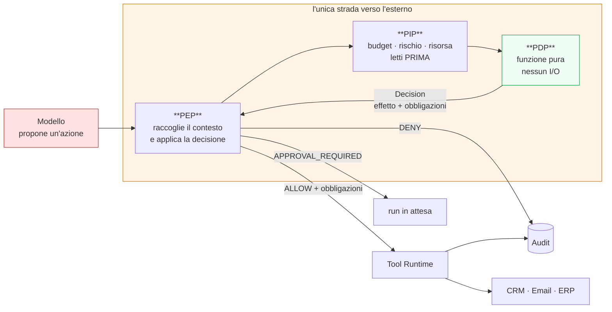
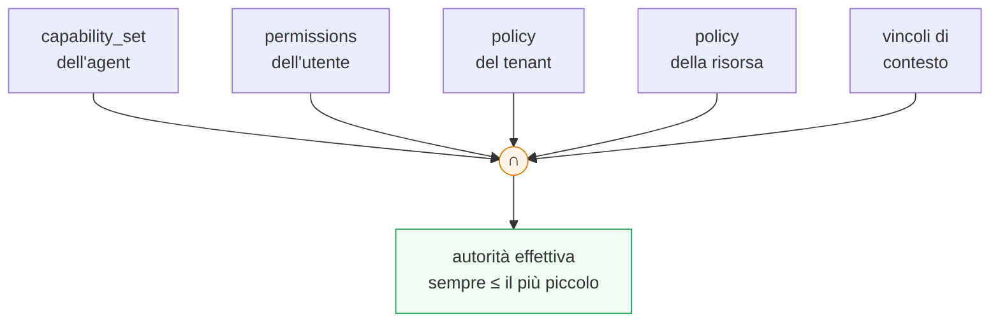
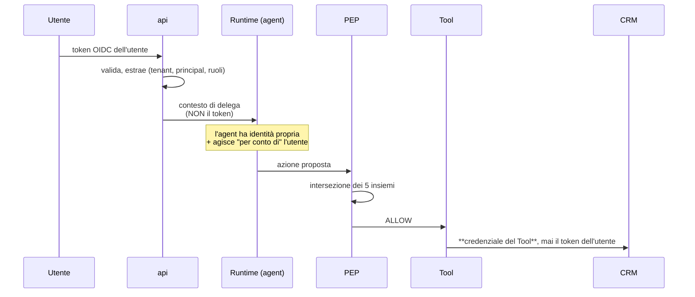
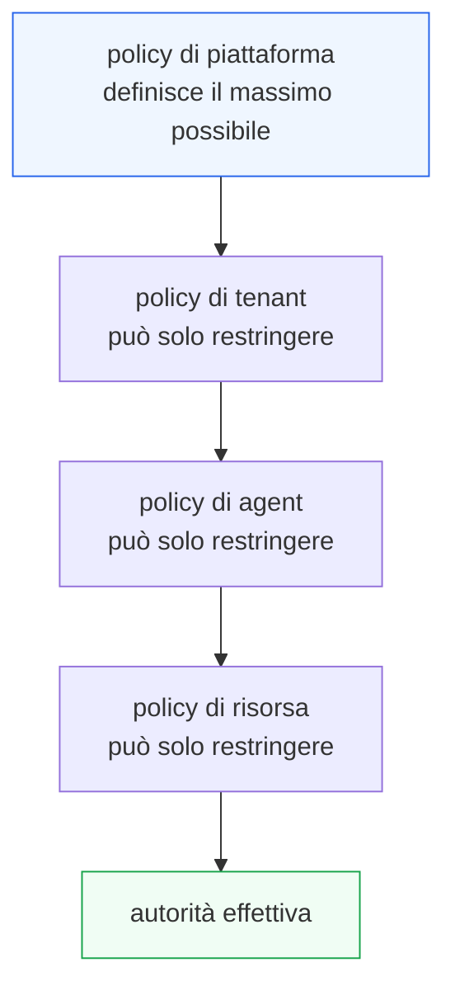
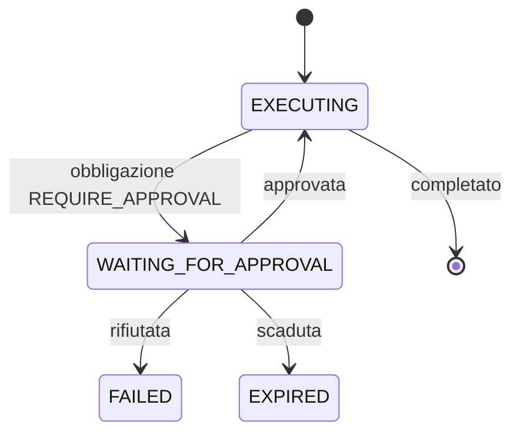
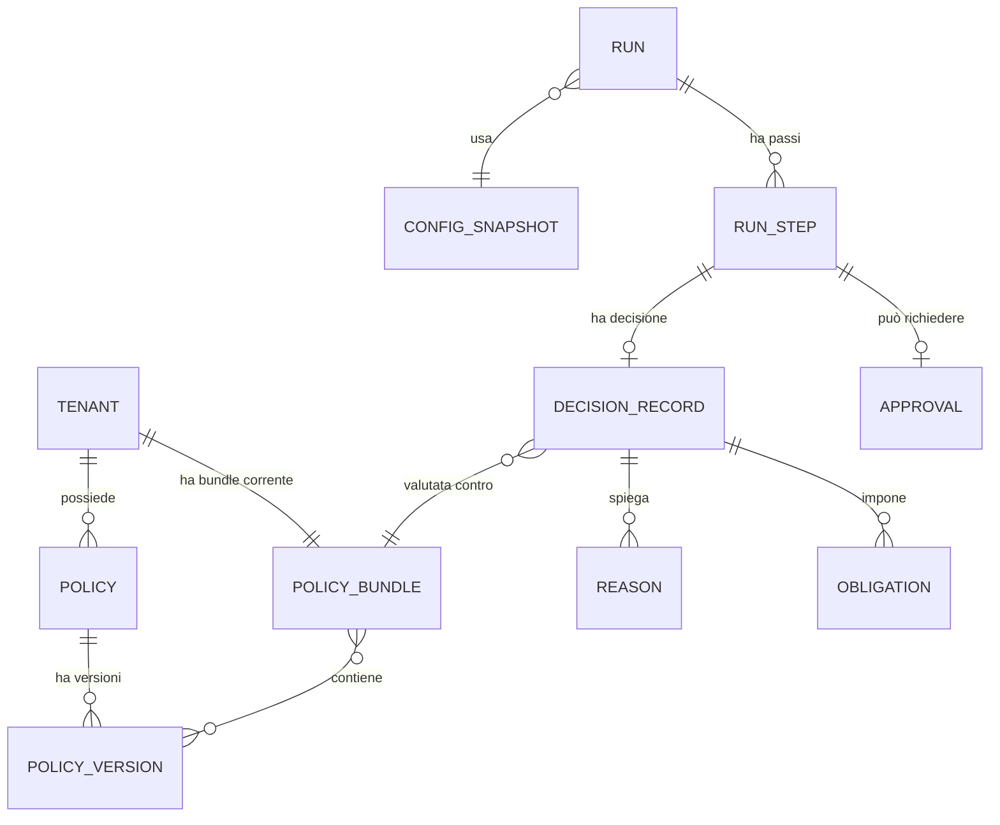

# 03 — GOVERNANCE E POLICY

> **Livello:** A (Core Day 1)
> **Dipende da:** `01_ARCHITECTURE_PRINCIPLES.md` (`ADR-004` policy come dato, `ADR-007`
> trust class, `ADR-008` capability congelato, `AR-013` `AR-015`), `02_CONTROL_PLANE.md`
> (`ADR-012` Config Snapshot, Policy Registry, §12.3 regola delle revoche).
> **Vincola:** `A04` (runtime), `A06` (tool), `A09` (identity), `A13` (security),
> `C28` (human-in-the-loop).

---

## 1. In breve

### L'analogia, ripresa e completata

In `A01` il modello era **un dipendente bravo a ragionare ma senza badge**. Questo documento
progetta il **controllo agli ingressi**.

Il controllo non guarda in faccia il dipendente e non ascolta le sue spiegazioni. Guarda
tre cose:

```text
1. il badge del dipendente          → cosa questo agent può fare in generale
2. la delega di chi lo ha mandato   → cosa la persona per cui lavora può fare
3. il regolamento di oggi           → cosa è permesso adesso, in questo contesto
```

E applica una regola sola, che è tutto il documento in una riga:

> **Passa solo ciò che è permesso da tutte e tre le cose insieme. Mai da una sola.**

È un'**intersezione**, non una somma. Un dipendente con badge da direttore mandato da un
tirocinante non entra nella stanza dei server. Un tirocinante mandato dal direttore neppure.

### Le tre decisioni di questo documento

| # | Decisione | Conseguenza |
|---|---|---|
| 1 | **L'autorità è un'intersezione di cinque insiemi**, mai un'eredità | l'agent non eredita mai i privilegi dell'utente |
| 2 | **Il PDP è una funzione pura** — nessun I/O, nessun effetto | rende possibili simulazione, replay, test e spiegazione, che altrimenti costerebbero quattro sottosistemi |
| 3 | **La decisione non è booleana**: `ALLOW` / `DENY` più **obbligazioni** | approvazione, redazione dei campi e scalo dei budget diventano casi della stessa cosa, non tre meccanismi separati |

La seconda è quella che porta più valore ed è la meno ovvia, quindi ha una sezione sua (§7).

### La cosa che si può fare grazie al PDP puro

Prima di attivare una policy nuova, si può chiedere:

> *"Se questa regola fosse stata attiva la settimana scorsa, cosa avrebbe bloccato?"*

E ottenere una risposta esatta, rigiocando le decisioni storiche contro la policy nuova.
Non è una funzionalità che abbiamo aggiunto: è una conseguenza gratuita del fatto che la
decisione è una funzione pura di input registrati.

Chi ha mai attivato una regola di autorizzazione in produzione sperando di non rompere
niente sa quanto valga.

---

## 2. L'ipotesi del progetto, validata e raffinata

### L'ipotesi

> **THE MODEL IS NOT THE AUTHORITY.**

Il prompt chiede di validarla contro zero-trust, NIST, OWASP e le architetture di
authorization moderne, e di raffinarla se serve.

### Verdetto: corretta ma incompleta, per tre motivi

#### Motivo 1 — dice cosa il modello *non è*, non cosa fare del suo output

Un sistema può rispettare la lettera del principio ed essere compromesso lo stesso. Basta
che l'insieme delle azioni possibili venga costruito leggendo qualcosa che un estraneo
controlla.

Esempio concreto: il modello non decide l'autorizzazione, ma il sistema costruisce la lista
dei tool disponibili includendo quelli "menzionati nel contesto del cliente". Il principio è
rispettato; il sistema è bucato.

**Raffinamento `SP-1` (già in `A01` §24):** l'output del modello attraversa lo stesso
trattamento del body di una richiesta HTTP arrivata da internet.

#### Motivo 2 — non dice niente su cosa *entra* nel modello

Questo è il punto in cui il principio originale è più debole, e in cui OWASP `ASI01` è più
esplicito: in un CRM, il testo che l'agent legge è **scritto da estranei**. Il campo note di
un lead, il corpo di un'email, la descrizione di un ticket.

Un principio che regola solo l'uscita del modello lascia aperto l'ingresso.

**Raffinamento `SP-2`:** ogni frammento di context ha una `trust_class`, e solo `system` può
definire capability (`ADR-007`).

#### Motivo 3 — non dice *quando* si stabilisce cosa è permesso

Se l'insieme delle azioni possibili si può negoziare durante l'esecuzione, allora un testo
persuasivo dentro il context può allargarlo. Il modello non "decide l'autorizzazione", ma la
influenza — che ai fini pratici è lo stesso.

**Raffinamento `SP-3`:** il capability set è congelato all'avvio del run e può solo
restringersi (`ADR-008`).

### La formulazione raffinata

> **Il modello propone; un componente fidato dispone; ciò che il modello legge non può
> cambiare ciò che gli è permesso.**

Tre proposizioni, tutte verificabili con un test:

| Proposizione | Test che la verifica |
|---|---|
| il modello propone | esiste un solo punto in cui una proposta diventa esecuzione |
| un componente fidato dispone | quel punto interroga sempre il PDP e registra la decisione |
| ciò che legge non cambia ciò che gli è permesso | un documento ostile nel retrieval produce un `DENY` in audit |

### Coerenza con i riferimenti esterni

| Riferimento | Cosa dice | Come ci allineiamo |
|---|---|---|
| **Zero Trust** | nessun componente è fidato per posizione; ogni accesso è verificato | il modello gira sulla nostra GPU e resta **non fidato**, perché il suo comportamento dipende da input di terzi |
| **OWASP `ASI01`** (prompt injection) | il contenuto esterno può dirottare il comportamento dell'agent | `trust_class` + capability congelato: l'iniezione può far *proporre*, mai far *ampliare* |
| **OWASP `ASI10`** (agent disallineato) | un agent può perseguire l'obiettivo dichiarato causando danni | approvazione umana obbligatoria sulle azioni distruttive, indipendentemente da quanto la proposta sembri sensata |
| **NIST — agent come non-human identity** | ogni agent è un'identità distinta, con owner, tipo di credenziale e scope | `A09` implementa; qui l'identità dell'agent è **uno dei cinque insiemi** dell'intersezione (§8) |
| **Least privilege** | si concede il minimo necessario | l'intersezione produce il minimo per costruzione, non per disciplina |

**Nota di onestà sulle fonti.** Il testo integrale di `ASI01`-`ASI10` è nel backlog `B-01`
del `research-log`: non l'ho letto per intero. Uso i due rischi citati perché sono
esplicitamente riportati nel log come verificati. Il threat model formale è responsabilità
di `A13`, e lì `B-01` va chiuso prima.

---

## 3. Il problema architetturale

> Progettare il sistema che decide se un'azione proposta è permessa, in modo che sia
> impossibile da aggirare, spiegabile a posteriori, modificabile senza rilascio, testabile
> prima dell'attivazione, e che non richieda un processo in più su una macchina sola.

Cinque sotto-problemi:

| # | Domanda |
|---|---|
| GP1 | Da dove arriva l'autorità: dall'utente, dall'agent, o da entrambi? |
| GP2 | Dove sta il punto di decisione e dove il punto di applicazione? |
| GP3 | Che forma ha una decisione — booleana o qualcosa di più? |
| GP4 | Come si cambia una policy senza rompere la produzione? |
| GP5 | Cosa succede quando il sistema di decisione non funziona? |

`GP3` è quello la cui risposta semplifica di più il resto del sistema (§12).

---

## 4. Vincoli ereditati

| Vincolo | Da dove | Conseguenza |
|---|---|---|
| Le policy sono dati versionati, non codice | `A01` `ADR-004` | il Policy Registry è nel Control Plane |
| L'evaluator è sostituibile dietro `PDP.decide()` | `A01` §15.3 | l'interfaccia conta più dell'implementazione |
| Il PEP sta nel percorso di esecuzione | `A01` §22 | non esiste un Governance Plane separato |
| Nessun tool si esegue senza decisione registrata | `AR-013` | il PEP è l'unico che importa l'esecutore |
| Se il PDP non risponde, si nega | `AR-015` | fail closed — con la precisazione di §14 |
| Il capability set è congelato all'avvio | `ADR-008` | il PDP lavora dentro un insieme già limitato |
| Regola dell'intersezione con le revoche | `A02` §12.3 | snapshot ∩ bundle corrente |
| Il runtime legge il Control Plane, non lo scrive | `AR-006` | il PDP non può modificare le policy che valuta |

---

## 5. Scelta del policy engine

La decisione è già stata presa in `A01` §15.3. Qui riporto solo il confronto in forma
compatta e aggiungo ciò che `A01` non poteva dire, non avendo ancora il modello di
decisione.

| | Codice applicativo | **Dato + evaluator interno** | OPA (Rego) | Cedar | OpenFGA |
|---|---|---|---|---|---|
| Policy modificabile senza rilascio | No | **Sì** | Sì | Sì | Sì |
| Policy per tenant | doloroso | **Sì** | Sì | Sì | Sì |
| Processi aggiuntivi | 0 | **0** | 1 | 0 | 1 |
| Linguaggi aggiuntivi | 0 | **0** | Rego | Cedar | DSL |
| Verifica formale | No | No | parziale | **Sì** | No |
| **Decisione come funzione pura** | dipende | **Sì per costruzione** | Sì | Sì | Sì |
| **Obbligazioni** (§12) | possibile | **Sì, nativo nel nostro modello** | esprimibili | limitate | No |
| Modello adatto al problema | — | **ABAC + capability** | general purpose | authorization | relazioni (ReBAC) |
| Fattibilità Day-1 | Forte | **Forte** | Moderata | Moderata | Debole |

### La colonna che decide, e che `A01` non aveva ancora

**Le obbligazioni.** Il nostro problema non è "sì o no": è "sì, ma con approvazione", "sì,
ma nascondendo il campo `codice_fiscale`", "sì, ma scalando 1 dal budget".

Cedar è progettato per authorization booleana ed esprime le obbligazioni in modo limitato.
OpenFGA risponde a *"chi è in relazione con cosa"*, che non è la nostra domanda principale.
OPA le esprime bene, ma al prezzo di un processo e di Rego.

Un evaluator interno, invece, restituisce la struttura che ci serve senza tradurla.

### Decisione

> **Confermata `A01` `ADR-004`: policy come dato versionato nel Control Plane; evaluator
> interno, deterministico, dietro `PDP.decide()`.**
>
> **Aggiunta di questo documento:** il modello di decisione è **effetto + obbligazioni**
> (§12), non booleano. Questo aumenta il valore dell'evaluator interno e alza l'asticella
> per un eventuale sostituto.

`DEF-01` (quale evaluator concreto) resta **rimandato**, ma con un criterio in più: il
sostituto deve saper esprimere le obbligazioni, non solo `permit`/`forbid`.

Debito `D-02` invariato, trigger `T-06` invariato.

---

## 6. PEP, PDP, PIP: l'architettura

Tre sigle standard nelle architetture di authorization. Le esplicito perché la distinzione
è tutto.

| Sigla | Nome per esteso | In italiano semplice | Da noi |
|---|---|---|---|
| **PEP** | Policy Enforcement Point | il **buttafuori**: sta sulla porta e blocca | funzione unica nel percorso di invocazione dei tool |
| **PDP** | Policy Decision Point | il **regolamento che risponde sì o no** | funzione pura, in-process |
| **PIP** | Policy Information Point | chi **fornisce i dati** per decidere | il chiamante, che pre-carica tutto |



### Come leggerlo

- **Rosso a sinistra:** non fidato. È l'output del modello.
- **Riquadro arancione:** l'unica strada. Non esiste un percorso alternativo verso il Tool
  Runtime — `AR-013`, verificato da un test architetturale.
- **Verde:** il PDP. È verde perché è **puro**: stessa domanda, stessa risposta, sempre.
- **Le tre frecce in uscita dal PEP** sono i tre esiti reali. Notare che non sono due: il
  terzo (`APPROVAL_REQUIRED`) è la ragione per cui la decisione non è booleana.

### Responsabilità e non-responsabilità

| Componente | È responsabile di | **Non** è responsabile di |
|---|---|---|
| **PEP** | raccogliere il contesto, chiamare il PDP, applicare la decisione, applicare le obbligazioni, auditare | decidere |
| **PDP** | valutare le policy e restituire effetto + obbligazioni + spiegazione | leggere il database, eseguire, conoscere il mondo |
| **PIP** | fornire gli attributi necessari alla decisione | decidere, o essere chiamato *dal* PDP |

L'ultima cella è la decisione tecnica più importante del documento, e ha una sezione sua.

---

## 7. Il PDP è una funzione pura

### Cosa significa

```python
def decide(request: DecisionRequest, bundle: PolicyBundle) -> Decision:
    """
    Funzione pura. Nessun accesso al database, nessuna chiamata di rete,
    nessun orologio, nessun numero casuale.
    Tutto ciò che serve per decidere è dentro `request` e `bundle`.
    """
```

La tentazione naturale è l'opposto: far sì che il PDP vada a prendersi ciò che gli serve
("controlla il budget residuo", "verifica se il cliente è nel segmento enterprise").
Sembrerebbe più comodo.

**Sarebbe l'errore più costoso di questo documento.** Ecco cosa si perde.

### Cosa si guadagna tenendolo puro

| Capacità | Perché richiede la purezza | Cosa costerebbe altrimenti |
|---|---|---|
| **Test unitari veri** | una funzione pura si testa con una tabella di input e output attesi | mock del database, fixture, test lenti e fragili |
| **Simulazione** (§22) | si rigiocano decisioni storiche contro un bundle nuovo | serve ricostruire lo stato del mondo di allora: praticamente impossibile |
| **Replay** (`C29`) | ripetere un run dà le stesse decisioni | il replay divergerebbe perché i dati letti sono cambiati |
| **Spiegazione** (§23) | la spiegazione è completa perché tutti gli input sono nella richiesta | "ha negato per via di qualcosa che ha letto, ma non sappiamo cosa" |
| **Latenza prevedibile** | nessun I/O, quindi microsecondi | ogni decisione paga query, e le decisioni sono molte |
| **Nessun deadlock, nessun timeout nel PDP** | non c'è niente da attendere | un PDP che va in timeout è un `DENY` di un'azione lecita |
| **Sostituibilità** | un evaluator esterno riceve la stessa richiesta autocontenuta | serve replicare l'accesso ai dati dentro il sostituto |

Sette proprietà da una sola scelta di design. Diventa `AR-GP-01`.

### Il prezzo, dichiarato

Il PEP deve **sapere in anticipo** quali attributi servono. Se una policy nuova richiede un
attributo che il PEP non raccoglie, la policy non è valutabile.

Mitigazione: il set di attributi raccolti è **dichiarato** e versionato insieme al bundle. Il
PDP restituisce `INDETERMINATE` con l'elenco degli attributi mancanti, e il PEP tratta
`INDETERMINATE` come `DENY` (`AR-015`), registrando *quale* attributo mancava.

Così un'estensione dimenticata si manifesta come un errore diagnosticabile in audit, non
come un permesso concesso per sbaglio.

### Cosa raccoglie il PIP, Day-1

| Attributo | Origine |
|---|---|
| identità dell'utente, ruoli, tenant | token OIDC, risolto in `api` |
| identità dell'agent, capability set | `ConfigSnapshot` (`A02` §11) |
| tool richiesto, `risk_class`, permessi richiesti | `ConfigSnapshot` |
| argomenti proposti, già validati sullo schema | il PEP |
| risorsa bersaglio, con il suo tenant e i suoi attributi | il Tool Runtime, in fase di risoluzione |
| budget residui del run | tabella `run` |
| conteggi per rate limiting | tabella dei contatori |
| momento logico (`now`) | **passato come attributo**, mai letto dal PDP |
| numero di step e storia delle decisioni del run | `run_step` |

L'ottava riga è piccola e conta: se il PDP leggesse l'orologio, non sarebbe più puro e il
replay divergerebbe su qualunque policy con una finestra temporale.

---

## 8. Modello di autorità

Il prompt pone la domanda centrale: **l'agent eredita l'autorità dell'utente, oppure ha
un'autorità propria?**

### La risposta: né l'una né l'altra

Entrambe le formulazioni sono pericolose.

| Modello | Problema |
|---|---|
| L'agent **eredita** l'autorità dell'utente | un utente amministratore rende l'agent amministratore. Un'iniezione riuscita su quell'utente ha i suoi poteri per intero |
| L'agent ha un'autorità **propria** | l'agent diventa un superuser che agisce per tutti; si perde il "per conto di chi", e con esso l'audit e il least privilege |

### Il modello raccomandato: intersezione di cinque insiemi

```text
autorità(azione) =    capability_set(agent version)     ← cosa questo agent può fare, mai
                    ∩ permissions(utente)               ← cosa questa persona può fare
                    ∩ policy(tenant)                    ← cosa questo cliente consente
                    ∩ policy(risorsa)                   ← cosa si può fare a QUESTO record
                    ∩ vincoli(contesto)                 ← budget, rate, rischio, orario
```

**Sempre intersezione. Mai unione.**



### Perché i due primi insiemi sono entrambi necessari

Sembra ridondante avere sia i permessi dell'utente sia le capability dell'agent. Non lo è:
sono **due soffitti indipendenti**, e servono in due scenari opposti.

| Scenario | Cosa lo ferma |
|---|---|
| Un **amministratore** usa un agent di assistenza vendite | il `capability_set` dell'agent: anche se l'utente potrebbe cancellare clienti, l'agent non ha quella capability |
| Un agent potente viene invocato da un **tirocinante** | i permessi dell'utente: l'agent potrebbe, la persona no |

Nessuno dei due da solo copre entrambi i casi. Insieme sì, e il costo è una `AND` in più.

### Le due proprietà che ne derivano

| Proprietà | Enunciato |
|---|---|
| **Monotonia decrescente** | aggiungere un vincolo non può mai aumentare l'autorità |
| **Nessuna escalation per composizione** | comporre due azioni permesse non produce un'autorità che nessuna delle due aveva |

La seconda va detta esplicitamente perché è il buco classico: se `export_report` è permesso
e `send_email` è permesso, l'agent può esportare i dati e mandarli fuori. Ciascuna azione è
lecita; la sequenza è un'esfiltrazione.

**L'intersezione non risolve questo caso da sola.** Serve una policy che ragiona sulla
sequenza — vedi §20 (data policies) e il rischio residuo dichiarato in `A01` §43 `R-01`.
Non fingo che il modello di autorità copra ciò che non copre.

---

## 9. Delega

### Il requisito critico posto dal prompt

> Un agent non deve acquisire più autorità solo perché il modello ha chiesto un'azione.

Con l'intersezione di §8 questo è vero **per costruzione**: la richiesta del modello non
compare in nessuno dei cinque insiemi. Il modello sceglie *dentro* l'intersezione, non la
modifica.

### Come funziona la delega



### Le regole di delega

| ID | Regola | Perché |
|---|---|---|
| `AR-GP-02` | Il token dell'utente non lascia mai il ruolo `api`. Oltre passa solo un **contesto di delega** (tenant, principal, ruoli, scadenza) | conferma e rafforza `AR-014`: nessun token passthrough |
| `AR-GP-03` | Il Tool usa la **propria** credenziale verso il sistema esterno | altrimenti il CRM vedrebbe l'utente, e l'audit perderebbe il "per conto di chi" |
| `AR-GP-04` | Il contesto di delega ha una scadenza non successiva a quella del token originale | un run lungo non deve sopravvivere alla sessione che lo ha autorizzato |
| `AR-GP-05` | Nessuna impersonation: l'audit riporta **sempre** entrambe le identità | "agent X per conto di utente Y", mai solo "utente Y" |

### Il caso scomodo: i run che partono da soli

Un run avviato da uno **schedule** o da un **evento** non ha un utente dietro.

È il caso in cui è più facile sbagliare, perché la tentazione è dare all'agent un'autorità
piena "visto che non c'è nessuno".

**Regola `AR-GP-06`:** un run senza utente ha come secondo insieme i permessi di un
**service principal dichiarato sul binding**, mai un insieme vuoto interpretato come "tutto".

```text
run interattivo  →  permissions(utente reale)
run schedulato   →  permissions(service principal del binding)
run da evento    →  permissions(service principal del binding)
```

Il service principal è configurato esplicitamente da un amministratore, è visibile nel
Control Plane, ed è soggetto alle stesse policy. Nessuna scorciatoia.

L'insieme vuoto trattato come "nessun limite" è un errore che compare in molti sistemi di
authorization, e produce esattamente il tipo di privilegio invisibile che nessuno rivede.

---

## 10. Identity e Authorization

Due cose che vengono confuse continuamente. La convenzione (§20) chiede di distinguerle.

| | Identity | Authorization |
|---|---|---|
| Domanda | **chi sei?** | **puoi farlo?** |
| Quando | una volta, all'ingresso | **a ogni azione** |
| Risultato | un insieme di claim | una decisione con obbligazioni |
| Dove | `api`, via OIDC (`A09`) | PEP + PDP, a ogni chiamata di tool |
| Se fallisce | `401 Unauthorized` | `403 Forbidden` o attesa di approvazione |
| Può cambiare durante un run? | no | **sì** — le revoche hanno effetto immediato (`A02` §12.3) |

### La riga che conta

L'ultima. L'identità è stabile per la durata del run; l'autorizzazione **no**.

Questo è il motivo per cui non si può "autorizzare una volta all'inizio e poi fidarsi". Il
capability set congelato dice cosa era *possibile* all'avvio; il PDP dice cosa è *permesso*
adesso. L'azione passa solo se entrambi sono d'accordo.

---

## 11. RBAC, ABAC e capability: quale modello

Il prompt li elenca separatamente, come se si dovesse sceglierne uno.

**Non si sceglie: rispondono a domande diverse.** Usarne uno solo significa deformare il
problema per farlo entrare nel modello.

| Modello | Domanda a cui risponde | Da noi |
|---|---|---|
| **RBAC** (Role-Based) | *quali sono i poteri di questa persona?* | il secondo insieme: i permessi dell'utente derivano dai ruoli |
| **Capability** | *quali sono i poteri di questo agent?* | il primo insieme: il `capability_set` congelato |
| **ABAC** (Attribute-Based) | *questa azione specifica, in questo contesto specifico, è ammessa?* | il modello di valutazione del PDP |

### Come stanno insieme senza diventare tre sistemi

Un solo motore di valutazione, ABAC, in cui RBAC e capability sono **fonti di attributi**:

```text
DecisionRequest
  subject:   { principal, roles: [...],           ← RBAC entra da qui
               agent_id, capability_set: [...] }  ← capability entra da qui
  action:    { tool, risk_class, permissions_required }
  resource:  { type, id, tenant_id, attributes }
  context:   { budgets, counters, now, step_index, prior_decisions }
                                                   ← ABAC valuta tutto insieme
```

Un motore, tre modelli concettuali, nessuna duplicazione. Il ruolo è un attributo del
soggetto; la capability è un attributo del soggetto; la policy ragiona su attributi.

### Perché non ReBAC (stile Zanzibar / OpenFGA)

ReBAC (Relationship-Based) risponde a *"Maria può vedere il documento perché è nel team che
possiede la cartella"*. È eccellente per gerarchie di condivisione profonde.

Il nostro dominio non è quello. In un CRM la domanda è quasi sempre *"questa azione, su
questo tipo di record, con questo importo, è consentita a questo ruolo?"* — che è ABAC.

Se emergessero requisiti di condivisione gerarchica profonda (`RICHIEDE RICERCA` in tal
caso), OpenFGA tornerebbe in gioco come **fonte di attributi** per il PDP, non come suo
sostituto.

---

## 12. Il modello di decisione

### La decisione non è booleana

È la scelta che semplifica di più il resto del sistema.

```python
@dataclass(frozen=True)
class Decision:
    effect: Effect                   # ALLOW | DENY | INDETERMINATE
    obligations: list[Obligation]    # cosa DEVE fare il PEP se procede
    reasons: list[Reason]            # la catena di spiegazione (§23)
    policy_bundle_version: int       # per l'audit e la riproducibilità
```

### Le obbligazioni

Un'**obbligazione** è una condizione che il PEP deve soddisfare perché l'`ALLOW` sia valido.
Se il PEP non sa applicare un'obbligazione, deve negare.

| Obbligazione | Significato | Chi la applica |
|---|---|---|
| `REQUIRE_APPROVAL` | serve un umano prima di procedere | PEP → il run va in attesa |
| `REDACT_FIELDS[...]` | questi campi non devono uscire | PEP, sull'output del tool |
| `MASK_FIELDS[...]` | questi campi escono offuscati | PEP |
| `CONSUME_BUDGET(tipo, n)` | scala un contatore | PEP, nella stessa transazione dello step |
| `RATE_LIMIT(chiave, finestra)` | conta questa azione | PEP |
| `AUDIT_LEVEL(full)` | audit esteso su questa azione | PEP |
| `CONSTRAIN_ARGS{...}` | restringi gli argomenti (per esempio `limit ≤ 100`) | PEP, prima di invocare |
| `NOTIFY(canale)` | avvisa qualcuno | PEP, in modo asincrono |

### Perché questo semplifica il sistema

Senza obbligazioni servirebbero **quattro meccanismi separati**, ciascuno con la propria
configurazione, il proprio audit e i propri casi limite:

```text
SENZA obbligazioni                        CON obbligazioni
──────────────────                        ────────────────
sistema di approvazione     ─┐
sistema di redazione PII    ─┼─→          un solo modello di decisione
sistema di budget           ─┤            + un elenco di obbligazioni
sistema di rate limiting    ─┘
```

Tutti e quattro diventano **casi della stessa cosa**: una policy che restituisce un'`ALLOW`
condizionata. Un solo punto di configurazione, un solo punto di audit, un solo punto in cui
si sbaglia.

Diventa `AR-GP-07`: **ogni condizione all'esecuzione si esprime come obbligazione, non come
meccanismo separato.**

### La regola sul PEP che non sa applicare un'obbligazione

`AR-GP-08`: se il PDP restituisce un'obbligazione che il PEP non riconosce, l'esito è
`DENY`, non `ALLOW` ignorando l'obbligazione.

Sembra ovvio; non lo è. È il caso in cui una policy nuova, scritta per una versione più
recente del PEP, verrebbe silenziosamente disapplicata durante un rilascio progressivo. Il
fallimento deve essere rumoroso.

---

## 13. Precedenza fra policy

Quando più policy si applicano alla stessa azione, serve una regola deterministica. Le
regole "quasi deterministiche" sono la fonte principale di sorprese nei sistemi di
authorization.

### La regola

```text
1. DENY esplicito              →  vince sempre, da qualunque livello provenga
2. ALLOW esplicito             →  vale solo se nessun DENY si applica
3. nessuna policy applicabile  →  DENY implicito (default deny)
```

E, trasversalmente:

```text
4. un tenant può SOLO restringere ciò che la piattaforma consente, mai ampliarlo
```

### La quarta regola, che è quella importante



Ogni livello è un imbuto. Un amministratore di tenant può vietare ai propri agent di mandare
email, ma non può concedersi un permesso che la piattaforma non prevede.

È l'unica struttura che rende un tenant configurabile **e** contenuto. Senza di essa, dare
ai clienti il controllo delle proprie policy significherebbe dargli il controllo dei propri
limiti.

`AR-GP-09`.

### Ordine di valutazione, e perché non conta

Il PDP valuta **tutte** le policy applicabili, non si ferma alla prima. Poi combina secondo
le regole di sopra.

Costa di più (poche decine di regole: irrilevante) e rende il risultato indipendente
dall'ordine. Con la valutazione a corto circuito, l'ordine delle righe nel database
diventerebbe semanticamente rilevante — e nessuno lo documenterebbe mai.

Beneficio collaterale: la spiegazione (§23) può elencare **tutte** le regole che hanno
partecipato, non solo la prima che ha risposto.

---

## 14. Fail-closed, con la distinzione che manca quasi sempre

`AR-015` dice: se il PDP non risponde, si nega.

**Corretto ma incompleto.** Bisogna distinguere due cose che vengono confuse:

| | `DENY` esplicito | Fallimento del sistema di decisione |
|---|---|---|
| Significato | "questa azione **non è permessa**" | "**non so** se sia permessa" |
| È un esito legittimo? | sì | no, è un guasto |
| Il run come finisce | `FAILED`, terminale | **`RETRYABLE`**, non terminale |
| Va ritentato? | **no**, mai | sì, con backoff |
| Chi va avvisato | l'utente | l'operatore |
| In audit | decisione di policy | **incidente** |

### Perché la distinzione conta

Trattare un guasto del PDP come un `DENY` terminale significa che **un bug di dieci minuti
fa fallire definitivamente tutti i run di quei dieci minuti**, e che l'audit si riempie di
finti dinieghi di policy che non sono mai stati decisi da nessuna policy.

Trattarlo come `RETRYABLE` significa che i run si mettono in attesa e riprendono da soli
quando il problema è risolto.

**In entrambi i casi l'azione non viene eseguita** — il fail-closed è rispettato. Cambia
solo cosa succede dopo.

`AR-GP-10`: `INDETERMINATE` non è mai `ALLOW` e non è mai un `DENY` terminale.

### Il caso limite onesto

Se il PDP fallisse **sempre** (policy corrotta, bug permanente), i run resterebbero in
attesa all'infinito. Serve un limite: dopo N tentativi, il run va in `FAILED` con causa
`policy_unavailable`, distinta da `policy_denied`.

Due cause distinte, due indagini diverse. È il tipo di distinzione che sembra pedanteria
finché non si legge un audit durante un incidente.

---

## 15. Autorizzazione basata sul rischio

### Il principio

Non tutte le azioni meritano lo stesso controllo. Leggere un cliente e cancellarlo non
possono avere la stessa autonomia.

`research/03` §22 e §27 propongono una classificazione che adotto, perché risolve un
problema reale: senza `risk_class`, ogni tool ha lo stesso peso e il sistema è costretto a
essere o troppo permissivo o troppo bloccante.

### Le tre classi di rischio

| `risk_class` | Cosa fa | Reversibile? | Visibile all'esterno? | Esempi |
|---|---|---|---|---|
| **READ** | legge | — | no | `search_customers`, `get_opportunity` |
| **WRITE** | modifica dati interni | sì, con storia | no | `create_task`, `update_opportunity` |
| **SIDE_EFFECT** | produce effetti fuori dal sistema | **no** | **sì** | `send_email`, `delete_record`, `refund` |

La colonna decisiva è la terza. `SIDE_EFFECT` non significa "importante": significa
**irreversibile**. Un'email mandata non si richiama. È questa proprietà, non l'importanza
percepita, che giustifica un trattamento diverso.

### I quattro livelli di autonomia

| Livello | Significato |
|---|---|
| `AUTONOMOUS` | l'agent procede da solo |
| `ASSISTED` | procede, ma con notifica a un umano |
| `APPROVAL_REQUIRED` | si ferma e attende un umano |
| `BLOCKED` | non è possibile in nessun caso |

### La matrice di default Day-1

| | READ | WRITE | SIDE_EFFECT |
|---|---|---|---|
| sotto soglia | `AUTONOMOUS` | `AUTONOMOUS` | `APPROVAL_REQUIRED` |
| sopra soglia | `AUTONOMOUS` | `APPROVAL_REQUIRED` | `APPROVAL_REQUIRED` |
| distruttivo (cancellazione, rimborso) | — | `APPROVAL_REQUIRED` | `APPROVAL_REQUIRED` |
| su dati particolari | `ASSISTED` | `APPROVAL_REQUIRED` | `BLOCKED` |

Questi sono **default della piattaforma**. Un tenant può solo restringerli (`AR-GP-09`).

### La decisione Day-1 su cui vale la pena essere netti

> **Ogni `SIDE_EFFECT` richiede approvazione Day-1. Senza eccezioni.**

Non perché sia la configurazione finale — sarà troppo rigido per molti casi d'uso, e i
tenant potranno allentarla man mano che si accumula fiducia misurata.

Ma perché il costo dei due errori è asimmetrico:

| Errore | Conseguenza |
|---|---|
| Troppo rigido all'inizio | qualcuno si annoia a cliccare "approva". Fastidioso, reversibile |
| Troppo permissivo all'inizio | email sbagliate a clienti veri. Non reversibile, e distrugge la fiducia nel prodotto |

Con un modello da 9B, un sistema nuovo e nessun dato storico sull'accuratezza, la scelta è
obbligata. La si allenta con i numeri di `A12` in mano, non con l'ottimismo.

### Il rischio è un attributo, non uno stato

`AR-GP-11`: il livello di rischio si **calcola** dagli attributi della richiesta a ogni
decisione. Non si memorizza sul run.

Se fosse memorizzato, una policy nuova non si applicherebbe ai run già avviati — cosa che
contraddirebbe la regola delle revoche (`A02` §12.3).

---

## 16. Approvazione umana

### Il flusso



Il punto operativo importante: in `WAITING_FOR_APPROVAL` **il worker si libera**. Il run non
occupa risorse. Un'approvazione può arrivare il giorno dopo. È la ragione per cui lo stato
sta nel database e non in memoria (`A01` §17).

### Cosa vede chi approva

Questa è la parte che si sbaglia più spesso: si mostra *cosa* si sta per fare e non *perché*
e *su cosa*.

| Deve vedere | Perché |
|---|---|
| l'azione proposta, con gli argomenti reali | il destinatario dell'email, non "invia email" |
| **l'anteprima dell'effetto** | il testo dell'email, il record che cambierà |
| il motivo per cui serve approvazione | quale policy, in italiano |
| il contesto: obiettivo del run, passi precedenti | permette di accorgersi di un dirottamento |
| chi ha avviato il run e quando | responsabilità |
| l'origine dei dati che hanno portato qui | **rileva la prompt injection** |

L'ultima riga è la difesa concreta contro `ASI01`. Se l'agent propone di mandare l'elenco
clienti a un indirizzo esterno, e la catena mostra che l'idea viene dal corpo di un'email
ricevuta, chi approva ha l'informazione per rifiutare.

Senza quella riga, l'approvazione umana è un pulsante che la gente impara a premere.

### Le regole

| ID | Regola |
|---|---|
| `AR-GP-12` | Chi approva non può essere chi ha avviato il run, se la policy lo richiede (separazione dei compiti) |
| `AR-GP-13` | L'approvazione è **per azione specifica**, non per run: approvare un'email non autorizza la successiva |
| `AR-GP-14` | L'approvazione ha una scadenza; oltre, il run va in `EXPIRED`, non procede |
| `AR-GP-15` | L'approvazione viene ri-verificata dal PDP al momento dell'esecuzione: se nel frattempo una policy ha negato, l'azione non parte |

`AR-GP-13` chiude una scorciatoia tentante ("approva tutto il run"), che trasformerebbe una
singola approvazione in una delega generica.

`AR-GP-15` chiude la finestra fra approvazione ed esecuzione. Senza, un'approvazione data
ieri autorizzerebbe un'azione oggi vietata.

---

## 17. Policy di budget

I budget sono un requisito di `A01` `AR-028`: un modello da 9B può ciclare all'infinito.

| Budget | Unità | Perché |
|---|---|---|
| step per run | numero | limita i cicli |
| chiamate al modello per run | numero | limita il costo diretto |
| token per run | numero | limita il costo in modo preciso |
| tempo di parete per run | secondi | limita l'attesa |
| chiamate a tool per run | numero | limita l'amplificazione |
| **costo in valuta per tenant/giorno** | valuta | limita il danno economico |
| azioni `SIDE_EFFECT` per run | numero | **limita il danno reale** |

Le ultime due sono le più importanti e le più spesso assenti.

### Come funzionano tecnicamente

Il budget è **stato di esecuzione** (Execution Plane), la soglia è **policy** (Control
Plane). Il PDP non legge i contatori: li riceve nel contesto dal PIP e restituisce
un'obbligazione `CONSUME_BUDGET`.

```text
PIP   → "budget step: 12 usati su 30"
PDP   → ALLOW + CONSUME_BUDGET(step, 1)
PEP   → esegue e scala il contatore NELLA STESSA TRANSAZIONE dello step
```

`AR-GP-16`: il consumo del budget e la registrazione dello step sono **atomici**. Altrimenti
un crash fra i due lascerebbe un budget non scalato, e i retry consumerebbero risorse senza
mai avvicinarsi al limite.

### Superare un budget non è un errore

Riprende `A01` `AR-029`: è un esito previsto, con uno stato terminale dedicato e un
messaggio comprensibile. Non un `500`, non un log silenzioso.

---

## 18. Policy di rate

Distinte dai budget: il budget limita **un run**, il rate limita **una frequenza nel tempo**.

| Limite | Contro cosa protegge |
|---|---|
| run avviati per utente/minuto | abuso e cicli accidentali dell'interfaccia |
| chiamate a tool per tenant/minuto | saturazione delle API esterne, e i loro rate limit |
| `SIDE_EFFECT` per tenant/ora | **il danno di massa**: mille email per un bug |
| chiamate al modello per tenant/minuto | contesa sulla GPU fra tenant |

La terza riga è la più preziosa. Un bug che manda un'email è un incidente; lo stesso bug che
ne manda diecimila è la fine del rapporto con il cliente. Un limite orario sui side effect
trasforma il secondo caso nel primo.

Day-1 i contatori sono righe in PostgreSQL con finestra temporale. Semplice, sufficiente per
il volume atteso, e senza Redis (`AR-019`).

---

## 19. Policy sui dati e autorizzazione a livello di campo

### Il problema

In un CRM i dati personali sono ovunque. E c'è un vincolo aggiuntivo che i sistemi
tradizionali non hanno: **ciò che entra nel context del modello è difficile da riprendere**.
Finisce nei log, nelle traiettorie salvate, potenzialmente in un dataset di training.

### I due punti di controllo

```text
1. INGRESSO   quali campi possono entrare nel context del modello   ← il più importante
2. USCITA     quali campi possono uscire verso l'utente             ← autorizzazione classica
```

Il primo è specifico dei sistemi agentici e viene dimenticato quasi sempre.

### Come si esprime

Con le obbligazioni di §12:

```text
policy: "il codice fiscale non entra mai nel context del modello"
  → su tool READ: ALLOW + REDACT_FIELDS[codice_fiscale]

policy: "l'IBAN è visibile solo al ruolo amministrazione"
  → ruolo amministrazione:  ALLOW
  → altri:                  ALLOW + MASK_FIELDS[iban]
```

Il PEP applica la redazione **sull'output del tool, prima che entri nel context**. Non è il
tool a doversene occupare: se lo fosse, ogni tool nuovo sarebbe un'occasione per
dimenticarsene.

`AR-GP-17`: la redazione è applicata dal PEP, mai dal Tool. Un solo punto, verificabile.

### Il limite dichiarato

La redazione a livello di campo funziona su output **strutturati**. Non funziona su testo
libero: se il numero di carta di credito è scritto nel campo note, la redazione per nome di
campo non lo trova.

Rilevare dati personali dentro testo libero richiede classificatori, ed è responsabilità di
`A14` (data governance). Qui lo dichiaro come **limite noto**, non come problema risolto.

---

## 20. Policy su tool e modelli

### Policy sui tool

| Cosa si può governare | Esempio |
|---|---|
| quali tool sono disponibili a un agent | l'agent vendite non ha `delete_record` |
| condizioni sugli argomenti | `send_email` solo verso domini nella lista consentita |
| soglie che cambiano il livello di autonomia | `update_opportunity` con importo > 50.000 → approvazione |
| vincoli sui risultati | `search_*` con `limit ≤ 100` |
| combinazioni vietate | `export_*` seguito da `send_email` nello stesso run |

L'ultima riga è la mitigazione parziale del problema di composizione di §8. È **parziale** e
va detto: copre le sequenze che qualcuno ha previsto, non quelle che nessuno ha immaginato.

### Policy sui modelli

| Cosa | Perché |
|---|---|
| quale modello può usare un agent | costo, qualità, residenza dei dati |
| se è ammesso un fallback cloud | **residenza dei dati**: un tenant può vietare che i suoi dati escano |
| limiti sui parametri di decoding | una temperatura alta su un agent che fa azioni è un rischio |
| lunghezza massima del context | costo e concorrenza (`research/04` §22-23) |

La seconda riga è una policy di **compliance**, non di sicurezza, ed è quella che rende
vendibile il prodotto a un cliente con requisiti di sovranità dei dati. Il contratto esiste
Day-1 anche se il fallback cloud non esiste ancora (`D-07`).

---

## 21. Isolamento fra tenant

Il caso in cui l'authorization è meno negoziabile.

| Livello | Meccanismo | Day-1 |
|---|---|---|
| 1 — dati | `tenant_id` su ogni riga, filtro in ogni query (`AR-017`) | Sì |
| 2 — risoluzione | `resolve()` scopa tutto per tenant (`A02` §20) | Sì |
| 3 — decisione | il PDP nega se `resource.tenant_id ≠ subject.tenant_id`, **prima di ogni altra policy** | Sì |
| 4 — audit e telemetria | ogni evento porta il tenant | Sì |
| 5 — isolamento fisico | — | No (`D-03`) |

### La regola del livello 3

`AR-GP-18`: la verifica di corrispondenza del tenant è la **prima** regola valutata dal PDP,
prima di qualunque policy configurabile, e **non è sovrascrivibile da nessuna policy**.

Non è una policy: è un invariante del motore. Una policy scritta male non deve poter
concedere accesso cross-tenant, nemmeno per errore.

È l'unica regola di questo documento che non passa dal meccanismo delle policy — ed è
proprio per questo che è affidabile.

---

## 22. Versioning, distribuzione, caching e simulazione

### Versioning

Le policy seguono il pattern di `A02` §15: `Policy` mutabile, `PolicyVersion` immutabile.

In più, un concetto proprio: il **Policy Bundle**.

```text
PolicyBundle = l'insieme di tutte le PolicyVersion attive per un tenant, in un istante
               + un numero di versione monotono
               + un content hash
```

Serve perché una decisione non dipende da una policy sola: dipende da **tutte quelle
applicabili** (§13). Registrare `policy_id + version` su una decisione non basta a
riprodurla; registrare `policy_bundle_version` sì.

### Distribuzione

Day-1 è banale: un processo, un database, il bundle si legge da PostgreSQL.

Ma il **contratto** è già quello che servirà dopo:

```text
Day-1     il worker legge il bundle corrente dal database
Futuro    ogni nodo ha una copia locale, invalidata sulla versione del bundle
```

Nessuna delle due opzioni richiede un sistema di distribuzione: la versione monotona basta a
sapere se la copia è vecchia.

### Caching, e la domanda sulla policy stantia

Il prompt chiede esplicitamente: **una policy stantia può causare un'escalation di
privilegi?**

**Sì, ed è asimmetrico.** La distinzione va fatta con precisione:

| Tipo di modifica | Se la cache è vecchia | Gravità |
|---|---|---|
| Una policy nuova **concede** | l'azione viene negata a torto | fastidio, non rischio |
| Una policy nuova **nega** (revoca) | **l'azione viene consentita a torto** | **rischio di sicurezza** |

Quindi la cache non può essere trattata in modo uniforme.

**La soluzione, che è economica:** la cache è valida solo se la sua `bundle_version`
coincide con quella corrente. La verifica è una lettura di un intero da una tabella con un
indice — costa microsecondi e si fa **a ogni decisione**.

```text
a ogni decisione:
    v = SELECT current_bundle_version FROM tenant WHERE id = :t     ← economico
    se cache.version ≠ v:  ricarica il bundle
```

Non si mette un TTL sulla cache delle policy. Un TTL significa "accetto di applicare regole
revocate per N secondi", e non esiste un valore di N che sia difendibile durante un
incidente.

`AR-GP-19`.

### Test e simulazione

Qui si raccoglie il dividendo del PDP puro (§7).

| Capacità | Come funziona | Valore |
|---|---|---|
| **Test unitari** | tabella di `(richiesta, bundle) → decisione attesa` | le policy diventano codice testato |
| **Test di regressione** | un insieme di casi che deve continuare a dare lo stesso esito | impedisce che una policy nuova rompa quelle vecchie |
| **Simulazione su storico** | si rigiocano le decisioni reali degli ultimi N giorni contro il bundle candidato | **si vede l'effetto prima di attivarlo** |
| **Modalità shadow** | il bundle nuovo valuta in parallelo senza applicare; si registrano le differenze | validazione in produzione a rischio zero |

### La simulazione in pratica

```text
POST /v1/admin/policies/simulate
{ "candidate_bundle": {...}, "against": "last_7_days" }

→ {
    "decisions_evaluated": 14203,
    "would_change": 38,
    "newly_denied": 31,      ← guardare qui prima di attivare
    "newly_allowed": 7,      ← e qui con ancora più attenzione
    "examples": [...]
  }
```

`newly_allowed` merita più attenzione di `newly_denied`, perché è la direzione in cui si
apre qualcosa. Sette autorizzazioni nuove che nessuno aveva previsto sono un problema
maggiore di trentuno dinieghi nuovi.

Questa funzionalità **non è costruita**: è la conseguenza del fatto che le decisioni sono
funzioni pure di input registrati. È il ritorno concreto di `AR-GP-01`.

---

## 23. Spiegazioni

### Il requisito

Ogni decisione deve poter rispondere a *"perché?"*, in una forma che una persona non tecnica
possa leggere.

### La struttura

```python
@dataclass(frozen=True)
class Reason:
    policy_id: str
    policy_version: int
    effect: Effect
    predicate: str        # "importo > 50000"
    evaluated: str        # "importo = 75000 → vero"
    message: str          # in italiano, per l'utente finale
```

Esempio di spiegazione completa restituita da una decisione:

```text
DENY — l'azione non è stata eseguita.

Regole che si applicano:
  ✗ pol_side_effect_approval (v3)   SIDE_EFFECT richiede approvazione
                                     risk_class = SIDE_EFFECT → vero
  ✓ pol_sales_can_email (v7)        il ruolo vendite può mandare email
                                     ruoli contengono "sales" → vero
  ✗ pol_domain_allowlist (v2)       destinatario fuori dai domini consentiti
                                     "@concorrente.example" ∉ lista → vero

Esito: un DENY esplicito prevale su un ALLOW (precedenza, regola 1).
```

### Perché conta più di quanto sembri

Tre motivi, in ordine crescente di importanza:

1. **Per l'utente:** "non posso farlo" senza motivo genera un ticket di supporto.
2. **Per l'amministratore:** senza spiegazione, capire perché una policy non funziona come
   previsto significa leggere il codice.
3. **Per la sicurezza:** durante un incidente, la domanda è *"cosa ha impedito il danno, e
   cosa invece l'ha lasciato passare?"*. Senza la catena delle regole, la risposta è
   un'ipotesi.

`AR-GP-20`: ogni decisione produce una spiegazione completa. Non è opzionale, non è
condizionata da un flag di debug. È possibile a costo zero perché il PDP valuta tutte le
regole (§13) e non fa I/O (§7).

---

## 24. Audit delle decisioni

### Cosa si registra

**Ogni decisione**, `ALLOW` e `DENY`. `A01` `AR-031`.

| Campo | Perché |
|---|---|
| `run_id`, `step_index`, `trace_id` | collega alla traiettoria |
| soggetto: utente, agent, tenant | chi, per conto di chi |
| azione: tool, argomenti (redatti) | cosa |
| risorsa | su cosa |
| effetto e obbligazioni | l'esito |
| `reasons[]` | perché (§23) |
| `policy_bundle_version` | riproducibilità |
| `capability_set_hash` dallo snapshot | cosa era possibile all'avvio |
| latenza della decisione | salute del sistema |

### I `DENY` sono il segnale più prezioso

Contro-intuitivo ma vero: gli `ALLOW` descrivono il funzionamento normale; i `DENY`
descrivono i **tentativi**.

| Cosa cercare | Cosa significa |
|---|---|
| picco di `DENY` su un agent | policy troppo stretta, oppure un agent che si comporta male |
| `DENY` per capability fuori dal set congelato | **possibile prompt injection in corso** |
| `DENY` cross-tenant | **sempre un incidente**, mai un caso normale |
| `DENY` seguito da un tentativo diverso sullo stesso obiettivo | il modello sta cercando un'alternativa: da guardare |

La terza riga merita un alert immediato: con `AR-GP-18` non dovrebbe mai accadere. Se accade,
o c'è un bug, o c'è un attacco.

### Distinguere le due categorie

`AR-GP-21`: l'audit distingue `policy_denied` (una regola ha negato) da `policy_unavailable`
(il sistema non ha potuto decidere). Riprende §14. Sono due indagini diverse e mescolarle
rende inutili entrambe.

---

## 25. Kill switch ed accesso di emergenza

### I livelli

Dal più fine al più grosso.

| Livello | Cosa ferma | Chi può | Dipende dal database? |
|---|---|---|---|
| Tool | un tool per un agent | tenant admin | sì |
| Agent | un agent per un tenant | tenant admin | sì |
| Tenant | tutti i run di un tenant | platform admin | sì |
| **Classe di rischio** | tutti i `SIDE_EFFECT`, ovunque | platform admin | sì |
| **Istanza (emergenza)** | tutto | operatore | **no** |

### Il livello di emergenza deve funzionare quando niente funziona

`AR-GP-22`: il kill switch di istanza è una **variabile d'ambiente o un file sul disco**,
letto a ogni decisione, e **non passa dal database**.

Il motivo è brutale: se il database o le policy sono compromessi o corrotti, un kill switch
che vive nel database non si può azionare. Un interruttore di emergenza che dipende dal
sistema che sta fallendo non è un interruttore di emergenza.

Costa: una lettura di file cacheata per un secondo. La si paga volentieri.

### Il livello che sarà usato più spesso

Il quarto: **fermare tutti i `SIDE_EFFECT` lasciando funzionare le letture**.

È la reazione giusta al dubbio più comune — *"l'agent sta facendo qualcosa di strano, ma non
so ancora cosa"*. Permette di fermare il danno senza fermare il servizio, e dà il tempo di
guardare i log invece di dover decidere subito fra spegnere tutto e non fare niente.

### Nessun bypass

`AR-GP-23`: **non esiste un accesso di emergenza che salti il PDP.** Un "break glass" che
disattiva l'authorization è la porta di servizio che qualcuno userà.

Se serve un'operazione eccezionale, si fa con una policy temporanea, versionata, con
scadenza e con `reason` obbligatorio (`A02` §28) — quindi visibile in audit come qualunque
altra modifica.

La differenza fra i due approcci è che il secondo lascia una traccia.

---

## 26. Modello dati e API

### Il modello dati



**Il confine è la linea di mezzo.** Sopra, il Control Plane (`POLICY`, `POLICY_VERSION`,
`POLICY_BUNDLE`): pochi record, scritture rare, versionati. Sotto, l'Execution Plane e
l'Evidence Plane (`DECISION_RECORD`, `REASON`, `OBLIGATION`, `APPROVAL`): molti record,
append-only.

Confondere i due lati significherebbe scrivere ad alto volume in tabelle di configurazione —
l'errore di `A02` §8 sui worker, in un'altra forma.

### La forma di una policy

```yaml
# Policy come dato. Non è codice: è una riga, versionata, nel Control Plane.
id: pol_side_effect_approval
version: 3
tenant_id: <sistema>          # policy di piattaforma
priority: platform            # non sovrascrivibile dai tenant (AR-GP-09)
effect: allow
target:
  action.risk_class: SIDE_EFFECT
condition:
  - always
obligations:
  - REQUIRE_APPROVAL
message: "Le azioni con effetti esterni richiedono l'approvazione di una persona."
```

Il campo `message` non è un commento: è ciò che l'utente finale legge (§23). Scriverlo in
italiano comprensibile è parte della definizione della policy, non un extra.

### L'API

| Endpoint | Chi | Cosa fa |
|---|---|---|
| `GET /v1/admin/policies` | tenant admin | elenco, con l'indicazione di quali sono ereditate dalla piattaforma |
| `POST /v1/admin/policies/{id}/versions` | tenant admin | crea una versione (immutabile) |
| `PUT /v1/admin/policies/bundle` | tenant admin | attiva un bundle — `If-Match` obbligatorio |
| `POST /v1/admin/policies/simulate` | tenant admin | §22 — simulazione su storico |
| `POST /v1/admin/policies/explain` | tenant admin | *"cosa succederebbe se l'utente X facesse Y?"* |
| `GET /v1/runs/{id}/decisions` | utente, con permesso | le decisioni di un run, con le spiegazioni |
| `POST /v1/approvals/{id}` | approvatore | approva o rifiuta |

`POST .../explain` è l'equivalente interattivo della simulazione: risponde a una domanda
puntuale invece che su tutto lo storico. Costa poco (una chiamata al PDP puro) ed è ciò che
un amministratore userà mentre scrive una policy.

---

## 27. Modi di guasto

| Guasto | Chi lo rileva | Comportamento | Categoria in audit |
|---|---|---|---|
| Policy nega l'azione | PDP | run `FAILED`, terminale, con spiegazione | `policy_denied` |
| PDP solleva un'eccezione | PEP | `INDETERMINATE` → azione negata, run `RETRYABLE` | `policy_unavailable` |
| Bundle corrotto o non caricabile | caricatore | come sopra; allarme all'operatore | `policy_unavailable` |
| Attributo mancante nella richiesta | PDP | `INDETERMINATE` con l'elenco dei mancanti (§7) | `policy_unavailable` |
| Obbligazione non riconosciuta dal PEP | PEP | `DENY` (`AR-GP-08`) | `policy_unavailable` |
| Approvazione non concessa in tempo | scheduler | run `EXPIRED` | `approval_expired` |
| Approvazione concessa ma policy cambiata nel frattempo | PEP, alla ri-verifica | azione negata (`AR-GP-15`) | `policy_denied` |
| Budget esaurito | PDP | esito terminale previsto, non un errore (`AR-029`) | `budget_exceeded` |
| Rate limit superato | PDP | azione negata, il run può ritentare più tardi | `rate_limited` |
| Tenant non corrispondente | PDP, prima regola | negato, **allarme immediato** | `tenant_violation` |
| PDP troppo lento | PEP, timeout | `INDETERMINATE` → negato, run `RETRYABLE` | `policy_unavailable` |

### L'ultima riga non dovrebbe esistere

Un PDP puro senza I/O non può essere lento: valuta poche decine di regole in memoria.

Il timeout esiste come rete di sicurezza contro un bug (una policy con un'espressione
patologica, un ciclo). Se scatta, è un incidente da indagare, non un caso normale da
gestire.

Il fatto che una funzione pura renda questa riga quasi impossibile è, di nuovo, il dividendo
di `AR-GP-01`.

---

## 28. Implementazione Day-1

### Cosa si costruisce

```text
modulo policy/
  ├── model/          DecisionRequest · Decision · Obligation · Reason
  ├── pdp/            decide() — funzione PURA          ← il cuore
  ├── pep/            l'unico punto di invocazione dei tool
  ├── pip/            raccolta degli attributi
  ├── bundle/         caricamento e cache con versione
  ├── obligations/    esecutori: approval, redaction, budget, rate
  └── simulate/       rigioco su storico
```

### Le policy Day-1

Otto policy di piattaforma coprono i casi essenziali:

| Policy | Effetto |
|---|---|
| `pol_tenant_isolation` | invariante del motore, non sovrascrivibile (`AR-GP-18`) |
| `pol_capability_set` | l'azione deve essere nel capability set congelato (`ADR-008`) |
| `pol_side_effect_approval` | ogni `SIDE_EFFECT` richiede approvazione (§15) |
| `pol_destructive_blocked` | cancellazioni e rimborsi: sempre approvazione, mai autonomia |
| `pol_run_budgets` | budget di step, chiamate, token, tempo |
| `pol_rate_side_effects` | limite orario per tenant sui side effect |
| `pol_pii_redaction` | i campi classificati come personali non entrano nel context |
| `pol_domain_allowlist` | `send_email` solo verso domini consentiti |

Otto righe di configurazione, non ottocento righe di codice. È il senso di `ADR-004`.

### L'ordine di costruzione

```text
1. modello di decisione (Decision, Obligation, Reason)
2. PDP puro + test a tabella                          ← prima di tutto il resto
3. PEP come unico punto di invocazione
4. PIP con gli attributi Day-1
5. obbligazioni: budget e rate (le più semplici)
6. obbligazione: approval  ← insieme agli stati del run in A04
7. obbligazione: redaction
8. audit delle decisioni con spiegazioni
9. bundle con versione e cache
10. simulazione                                       ← quando c'è storico da rigiocare
```

Il punto 2 prima del 3 è deliberato: un PDP puro si testa senza che esista nulla intorno.
È la parte del sistema che può essere corretta prima di avere un sistema.

---

## 29. Anti-pattern

| Anti-pattern | Come suona | Perché è pericoloso |
|---|---|---|
| **Il system prompt come policy** | "gli scriviamo nel prompt cosa non può fare" | è una richiesta, non un controllo. Un modello persuaso la ignora, e non lascia traccia |
| **PDP che legge il database** | "così la policy può controllare il budget da sola" | si perdono simulazione, replay, test e spiegazione completa (§7). Sette proprietà per una comodità |
| **Decisione booleana** | "allow o deny, il resto lo gestiamo altrove" | costringe a costruire quattro sottosistemi paralleli (§12) |
| **Fail-open sotto carico** | "se il PDP è lento, lasciamo passare" | il momento di massimo carico è il momento in cui si è sotto attacco |
| **Fail-terminal sui guasti** | "se il PDP non risponde, il run fallisce" | dieci minuti di bug distruggono ore di lavoro e sporcano l'audit (§14) |
| **Approvazione a livello di run** | "approvi una volta e poi va" | trasforma un consenso puntuale in una delega generica (`AR-GP-13`) |
| **TTL sulla cache delle policy** | "trenta secondi non fanno danno" | significa applicare regole revocate per trenta secondi (§22) |
| **Break glass che salta il PDP** | "serve per le emergenze" | è la porta di servizio che qualcuno userà, senza lasciare traccia (`AR-GP-23`) |
| **L'agent eredita l'utente** | "tanto agisce per suo conto" | un utente amministratore rende l'agent amministratore (§8) |
| **Insieme vuoto = nessun limite** | run senza utente trattato come illimitato | privilegio invisibile che nessuno rivede (`AR-GP-06`) |
| **Policy come codice applicativo** | "è più veloce da scrivere" | ogni modifica richiede un rilascio; nessuna versione, nessun audit, nessuna simulazione |
| **Un tenant può ampliare i propri limiti** | "è configurabile" | dare il controllo delle policy senza un tetto è dare il controllo dei limiti (`AR-GP-09`) |
| **Redazione dentro il tool** | "il tool sa quali campi sono sensibili" | ogni tool nuovo è un'occasione per dimenticarsene (`AR-GP-17`) |

---

## 30. ADR candidati

| ADR | Titolo | Problema | Alternative | Decisione | Reversibilità | Scadenza |
|---|---|---|---|---|---|---|
| **ADR-019** | Autorità come intersezione | l'agent eredita l'utente? | eredita · autorità propria · **intersezione di 5 insiemi** | intersezione, mai unione | **Costosa** | prima del PEP |
| **ADR-020** | PDP come funzione pura | il PDP può leggere dati? | legge da sé · **puro, attributi pre-caricati** | puro; il PIP pre-carica | **Costosa** | prima del PDP |
| **ADR-021** | Decisione con obbligazioni | booleana o strutturata? | booleana · **effetto + obbligazioni** | effetto + obbligazioni | Costosa | prima del PEP |
| **ADR-022** | `INDETERMINATE` ≠ `DENY` terminale | come si tratta un guasto del PDP | come deny terminale · **retryable** | negato ma retryable, categoria distinta | Facile | prima del PEP |
| **ADR-023** | Approvazione su ogni `SIDE_EFFECT` Day-1 | quanta autonomia dare | permissivo · **restrittivo, si allenta con i dati** | restrittivo | Facile | prima del primo tool `SIDE_EFFECT` |
| **ADR-024** | Cache di policy per versione, mai per TTL | come si invalida | TTL · **versione del bundle** | versione, controllata a ogni decisione | Facile | prima della cache |
| **ADR-025** | Precedenza a imbuto | i tenant possono ampliare? | livelli paritari · **solo restringere** | ogni livello può solo restringere | **Costosa** | prima delle policy di tenant |
| **ADR-026** | Isolamento tenant come invariante del motore | è una policy o una regola fissa? | policy · **invariante non sovrascrivibile** | invariante, prima regola valutata | Costosa | prima del PDP |

---

## 31. Tentativo di falsificazione

| Domanda | Risposta onesta |
|---|---|
| **Cosa rompe l'intersezione a cinque insiemi?** | Un requisito di **escalation legittima**: "l'agent deve poter fare qualcosa che l'utente non può" — per esempio leggere dati aggregati che il singolo utente non vedrebbe. L'intersezione lo impedisce per costruzione. Servirebbe un'eccezione esplicita e auditata, che è un buco progettato. **Non ho una soluzione elegante**, e lo dichiaro |
| **Cosa rompe il PDP puro?** | Una policy che richiede una decisione basata su dati che non si possono pre-caricare perché non si sa in anticipo quali serviranno — per esempio "nega se il cliente ha più di N ordini aperti", quando N dipende da un'altra policy. Mitigazione: il set di attributi è dichiarato col bundle, e il PDP restituisce `INDETERMINATE` con l'elenco dei mancanti. Funziona, ma richiede un giro in più |
| **Cosa rompe le obbligazioni?** | Un'obbligazione che il PEP non può applicare **atomicamente** con l'azione. Esempio: `NOTIFY` non può essere transazionale con l'invio di un'email a un sistema esterno. Sono obbligazioni *best effort* e vanno marcate come tali, altrimenti si crede in una garanzia che non c'è |
| **Cosa rompe il fail-closed?** | Un requisito di disponibilità che imponga di procedere quando il PDP è giù. Lo rifiuto: per un sistema che fa azioni reali, un sistema fermo è un incidente, un sistema che agisce senza controllo è un danno |
| **Che scala lo rompe?** | Il PDP puro non ha problemi di scala. Il PIP sì: pre-caricare attributi costa query. A volumi alti, il numero di query per decisione diventa il collo di bottiglia. Trigger `T-GP-01` |
| **Che requisito di compliance lo rompe?** | Una separazione dei compiti che richieda che chi scrive una policy non possa attivarla. È additivo (approval workflow su `A02`), non una rottura |
| **Qual è il buco di sicurezza residuo?** | **La composizione di azioni lecite** (§8). `export_report` + `send_email` = esfiltrazione, con entrambe le azioni permesse. Le policy sulle combinazioni (§20) coprono le sequenze previste, non quelle non immaginate. È il rischio `R-01` residuo di `A01`, e resta aperto |
| **Cosa lo rompe operativamente?** | Troppa approvazione. Se ogni azione richiede un umano, l'agent non fa risparmiare tempo e nessuno lo usa. `ADR-023` è deliberatamente restrittivo, ma va allentato con i dati di `A12`, non lasciato lì |

### I trigger

| ID | Condizione | Evoluzione |
|---|---|---|
| **T-GP-01** | le query del PIP superano il 30% della latenza di uno step | pre-caricamento in blocco, o attributi denormalizzati sul run |
| **T-GP-02** | il tasso di approvazione richiesta rende l'agent inutile (misurato: rapporto fra tempo di attesa e tempo di lavoro) | allentare `ADR-023` per classi di azione con accuratezza dimostrata |
| **T-GP-03** | le policy diventano troppe o troppo intrecciate perché una persona le legga | Cedar o OPA, con verifica formale (`T-06`) |
| **T-GP-04** | emergono requisiti di condivisione gerarchica profonda | OpenFGA come **fonte di attributi**, non come sostituto del PDP |

---

## 32. Architectural Self-Critique

### Le tre debolezze reali

#### 1. Il buco della composizione resta aperto, e non è piccolo

L'intersezione di §8 controlla ogni azione singolarmente. Non controlla le **sequenze**.

Un agent con `search_customers` e `send_email` — due permessi assolutamente ragionevoli —
può, sotto una prompt injection riuscita, cercare tutti i clienti e mandarli fuori. Ogni
singola decisione è corretta.

Le mitigazioni parziali che ho messo:

| Mitigazione | Quanto copre |
|---|---|
| approvazione su ogni `SIDE_EFFECT` (`ADR-023`) | **molto**: un umano vede il destinatario e il contenuto |
| policy sulle combinazioni (§20) | solo le sequenze previste |
| rate limit sui side effect (§18) | limita il volume, non impedisce il primo caso |
| origine dei dati nella schermata di approvazione (§16) | dà a chi approva l'informazione per accorgersene |

La prima è quella che funziona davvero, ed è la ragione per cui `ADR-023` è restrittivo. **È
anche un'ammissione**: sto compensando un limite architetturale con un umano.

Una soluzione strutturale — tracciare il flusso dei dati attraverso il run e negare le
azioni in uscita quando il contenuto proviene da fonti a bassa fiducia — esiste
concettualmente (taint tracking) ed è la direzione giusta. **Non la progetto qui** perché
richiederebbe di propagare etichette attraverso il modello, che le rimescola per natura. La
segnalo a `A13` e a `B12` (trust e provenance) come problema aperto reale.

#### 2. Ho progettato le policy senza sapere quali tool esistono

`Q-01` è ancora senza risposta: non so quale CRM. Ho scritto otto policy di piattaforma
basandomi sul catalogo di operazioni di `research/03`, che è verosimile ma non è
*il nostro*.

Conseguenza concreta: la classificazione `risk_class` (§15) è la struttura giusta, ma
l'assegnazione dei singoli tool alle classi è **da rifare** quando `A06` avrà l'elenco reale.

Non è grave — è esattamente il tipo di cosa che `A02` rende facile da cambiare, essendo dato
e non codice. Ma va detto invece di dare l'impressione che sia definitivo.

#### 3. Non ho letto il testo integrale di OWASP `ASI01`-`ASI10`

`B-01` è ancora aperto. Ho usato due rischi (`ASI01`, `ASI10`) che il `research-log` riporta
come verificati, e ho costruito le difese su quelli.

**Il rischio è di aver difeso bene due porte su dieci.** Il threat model completo è
responsabilità di `A13`, e `B-01` va chiuso **prima** di quel documento — non dopo, altrimenti
`A13` erediterebbe i miei punti ciechi invece di correggerli.

### Le domande dirette del prompt

| Domanda | Risposta |
|---|---|
| Ho validato l'ipotesi invece di accettarla? | Sì: corretta ma incompleta per tre motivi (§2) |
| Ho confrontato policy engine reali? | Sì (§5), con l'avvertenza sulla qualità delle fonti vendor del `research-log` R-03 |
| PDP e PEP sono distinti? | Sì, più il PIP (§6), con responsabilità e non-responsabilità esplicite |
| Il modello può fare escalation? | No per costruzione sulle azioni singole; **sì per composizione** — vedi debolezza 1 |
| Una policy stantia può causare escalation? | **Sì**, ed è asimmetrico: solo le revoche sono pericolose. Risolto con la versione del bundle invece del TTL (§22) |
| L'isolamento fra tenant è garantito? | Sì, come invariante del motore, non come policy (`AR-GP-18`) |
| Le policy sono testabili? | Sì, e simulabili su storico — conseguenza del PDP puro |
| Le decisioni sono spiegabili? | Sì, sempre, senza flag di debug (§23) |
| Il fail-closed è corretto? | Sì, con la distinzione fra `DENY` e `INDETERMINATE` che quasi tutti saltano (§14) |
| Ci sono contraddizioni con `A01`/`A02`? | No. La regola dell'intersezione di `A02` §12.3 è coerente con la precedenza a imbuto di §13 |

### Il contro-argomento più forte

> *"Hai messo un'approvazione umana su ogni azione con effetti esterni. Quindi l'agent non
> è autonomo: è un generatore di bozze con passaggi burocratici in mezzo. Il valore del
> prodotto era automatizzare il lavoro, e tu hai automatizzato la parte facile lasciando
> all'umano tutte le decisioni."*

**Ha ragione, e va guardato in faccia.**

La risposta non è che `ADR-023` sia giusto per sempre. È che **non abbiamo ancora il diritto
di essere permissivi**, perché non abbiamo nessun dato sull'accuratezza del sistema.

Il percorso corretto è misurabile, non ideologico:

```text
fase 1  approvazione su tutto ciò che ha effetti esterni
           ↓  si misura: quante approvazioni vengono concesse senza modifiche?
fase 2  autonomia sulle classi con accuratezza dimostrata sopra soglia
           ↓  si misura la stessa cosa, su un insieme più ampio
fase 3  approvazione solo su ciò che resta rischioso o raro
```

Il segnale è preciso: **se il 99% delle approvazioni viene concesso senza modifiche, quella
classe di azioni non ha bisogno di approvazione.** È il trigger `T-GP-02`, e la metrica che
lo alimenta è responsabilità di `A12`.

Chi salta la fase 1 non ha modo di sapere quando è pronto per la fase 2. Non è prudenza: è
l'unico modo di ottenere il dato.

---

# 33. FINAL GOVERNANCE RECOMMENDATION

## Che sistema di governance deve costruire questo progetto

**Un PDP puro in-process che valuta policy dichiarative versionate, invocato da un unico PEP
posto sull'unica strada verso l'esecuzione dei tool, che restituisce un effetto più
obbligazioni e una spiegazione completa, con l'autorità definita come intersezione di cinque
insiemi.**

| Aspetto | Decisione |
|---|---|
| **Modello di autorità** | intersezione: capability agent ∩ permessi utente ∩ policy tenant ∩ policy risorsa ∩ vincoli di contesto |
| **Delega** | l'agent ha identità propria e agisce per conto di; nessun token passthrough; run automatici con service principal dichiarato |
| **PDP** | funzione **pura**: nessun I/O, nessun orologio, nessuna casualità |
| **PEP** | unico punto di invocazione dei tool; applica le obbligazioni; audita sempre |
| **PIP** | il chiamante pre-carica gli attributi; il set è dichiarato col bundle |
| **Modello di decisione** | `ALLOW` / `DENY` / `INDETERMINATE` + obbligazioni + spiegazione |
| **Obbligazioni** | approval, redaction, masking, budget, rate, audit level, vincoli sugli argomenti, notifica |
| **Precedenza** | `DENY` esplicito > `ALLOW` esplicito > default deny; ogni livello può solo restringere |
| **Modelli** | ABAC come motore; RBAC e capability come fonti di attributi |
| **Rischio** | `READ` / `WRITE` / `SIDE_EFFECT`; autonomia `AUTONOMOUS` / `ASSISTED` / `APPROVAL_REQUIRED` / `BLOCKED` |
| **Approvazione** | ogni `SIDE_EFFECT` Day-1; per azione, non per run; ri-verificata all'esecuzione |
| **Fail** | closed sulla decisione; `INDETERMINATE` è retryable, non terminale |
| **Cache** | invalidata sulla **versione del bundle**, mai su TTL |
| **Tenant** | invariante del motore, prima regola, non sovrascrivibile |
| **Spiegazione** | sempre, completa, in italiano, senza flag di debug |
| **Simulazione** | rigioco su storico prima di attivare — gratuito grazie al PDP puro |
| **Kill switch** | cinque livelli; quello di emergenza **non passa dal database** |
| **Day-1** | 8 policy di piattaforma, un PDP testato a tabella, un PEP, quattro esecutori di obbligazioni |

## Cosa NON costruire Day 1

| Non costruire | Perché |
|---|---|
| OPA o Cedar | la decisione è facile da rimandare; e ora serve anche esprimere le obbligazioni (§5) |
| Un Governance Plane come processo separato | induce il bypass (`A01` §22) |
| Un PDP che legge il database | costa sette proprietà per una comodità (§7) |
| Sistemi separati per approval, redaction, budget, rate | sono obbligazioni della stessa decisione (§12) |
| Un accesso di emergenza che salta il PDP | è la porta di servizio che qualcuno userà |
| TTL sulla cache delle policy | significa applicare regole revocate per N secondi |
| Autonomia sui `SIDE_EFFECT` | non abbiamo ancora il diritto: manca il dato sull'accuratezza |
| ReBAC / OpenFGA | risponde a una domanda che non è la nostra |
| Taint tracking sul flusso dei dati | è la direzione giusta ma richiede ricerca (`A13`, `B12`) |

## Quale condizione futura innesca la prossima evoluzione

**`T-GP-02`: quando i dati mostreranno che una classe di azioni viene approvata quasi
sempre senza modifiche.**

È il trigger che trasforma il sistema da "generatore di bozze con controllo umano" a "agent
autonomo su ciò che ha dimostrato di saper fare". È anche l'unico modo onesto di arrivarci:
con una misura, non con una decisione di prodotto.

La metrica che lo alimenta — *tasso di approvazione concessa senza modifiche, per classe di
azione* — è un requisito che questo documento passa a `A12`.

---

## 34. Fonti

### Dichiarazione di limite

Come in `A01` §8 e `A02` §35: **nessuna ricerca esterna nuova in questa sessione**.

### Verificate alla fonte (`ai/state/research-log.md`)

| Rif. | Fonte | Uso |
|---|---|---|
| R-07 | OWASP Top 10 for Agentic Applications 2026 — `https://genai.owasp.org/resource/owasp-top-10-for-agentic-applications-for-2026/` | `ASI01` (prompt injection) e `ASI10` (agent disallineato) come base di §2. **Testo integrale non letto**: backlog `B-01` |
| R-07 | NIST — AI Agent Standards Initiative — `https://www.nist.gov/news-events/news/2026/02/announcing-ai-agent-standards-initiative` | l'agent come non-human identity distinta (§8, §9) |
| R-03 | OPA e Cedar, **con l'avvertenza esplicita** che gran parte dei confronti disponibili proviene da vendor in concorrenza con OPA | §5. La decisione **non** si appoggia a quei confronti, ma a un criterio nostro: quanti processi può gestire il team, e l'espressività delle obbligazioni |

### Riportate dai documenti di ricerca, non ispezionate

| Area | Fonte | Uso |
|---|---|---|
| Livelli di autonomia | `research/03` §27 | i quattro livelli di §15 |
| Classi di rischio | `research/03` §22 | `READ`/`WRITE`/`SIDE_EFFECT` |
| Capability model | `research/03` §42 | struttura del tool con permessi e approval policy |
| Token passthrough | `research/03` §26; RFC 9700, RFC 8707 | `AR-GP-02`, `AR-GP-03` |

### Da verificare — priorità

| ID | Cosa | Blocca |
|---|---|---|
| **B-01** | testo integrale `ASI01`-`ASI10` | **`A13`** — va chiuso prima, altrimenti `A13` eredita i punti ciechi di questo documento |
| **B-02** | maturità dei binding Python di Cedar | `DEF-01`, non urgente |
| **B-11** *(nuova)* | taint tracking / information flow control per sistemi LLM: esiste un approccio praticabile? | `A13`, `B12` — è il problema aperto della debolezza 1 |

### Nessuna citazione inventata

Le decisioni costose di questo documento — `ADR-019` (intersezione), `ADR-020` (PDP puro),
`ADR-021` (obbligazioni), `ADR-025` (precedenza a imbuto) — **non dipendono da fonti
esterne**. Derivano da requisiti nostri: least privilege, riproducibilità, e il fatto che il
sistema compie azioni irreversibili su dati di clienti reali.

---

**Fine del documento 03.**

Nuove regole: `AR-GP-01` … `AR-GP-23`.
Nuovi ADR: `ADR-019` … `ADR-026`.
Nuovi trigger: `T-GP-01` … `T-GP-04`.
Nuova voce di ricerca: `B-11`.
**Problema aperto dichiarato:** composizione di azioni lecite (§32, debolezza 1) → `A13`, `B12`.
