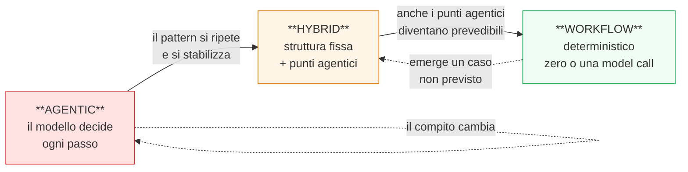
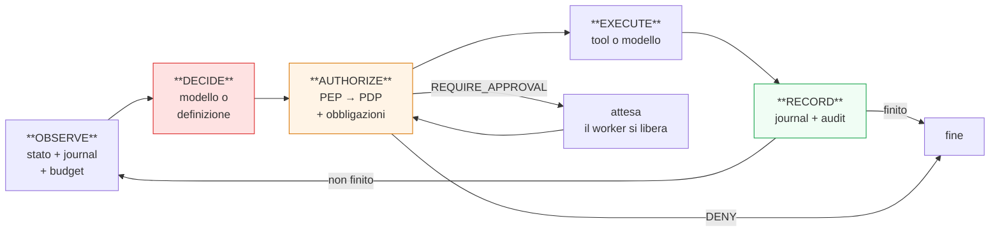
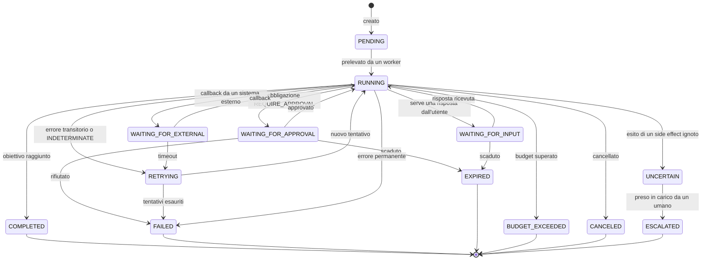
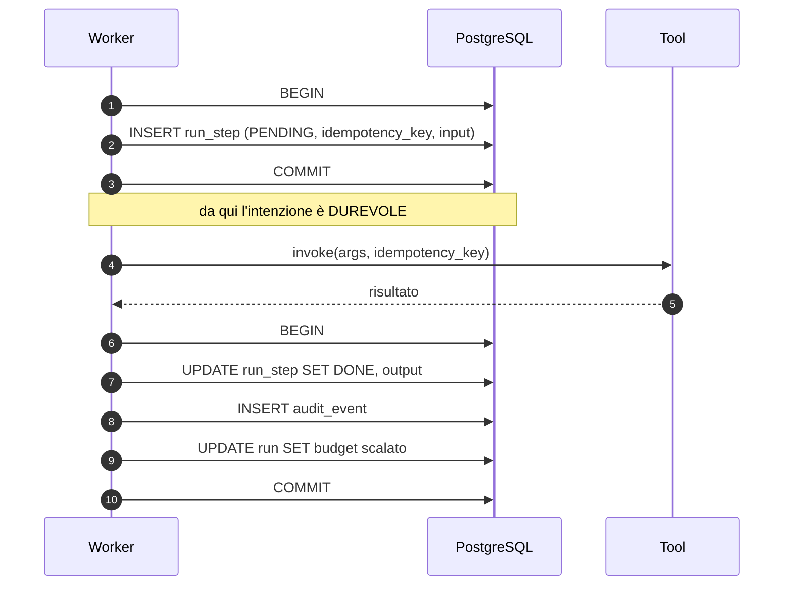
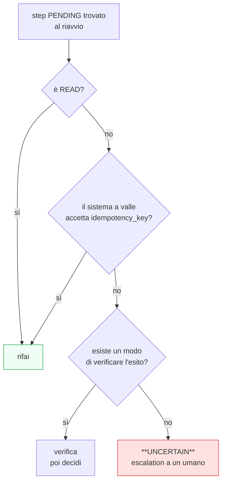
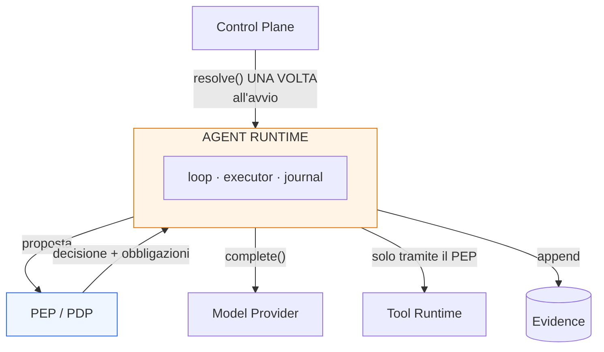

# 04 — AGENT RUNTIME

> **Livello:** A (Core Day 1)
> **Dipende da:** `01_ARCHITECTURE_PRINCIPLES.md` (`ADR-002` step journal, `AR-024`/`AR-025`
> passi puri, `AR-026` idempotenza, `AR-027` `UNCERTAIN`, `AR-028` budget),
> `02_CONTROL_PLANE.md` (`ADR-012` Config Snapshot), `03_GOVERNANCE_POLICY.md`
> (PEP/PDP, obbligazioni, stati di approvazione).
> **Vincola:** `A05` (model), `A06` (tool), `A08` (memory), `A11` (workflow), `A12`
> (observability), `C29` (replay).

---

## 1. In breve

### Che cosa fa questo componente

Riceve un obiettivo (*"trova i clienti fermi da 90 giorni e preparagli un follow-up"*) e lo
trasforma in una sequenza di azioni verificate, ognuna registrata, ognuna reversibile o
approvata.

È il pezzo che fa la differenza fra un chatbot e un sistema che lavora.

### L'analogia

Un **capocantiere**.

Non decide cosa costruire (quello è l'obiettivo). Non muove i mattoni (quelli sono i tool).
Non decide chi può entrare (quello è il PEP). Fa una cosa sola, e la fa bene:

> guarda a che punto siamo, decide qual è il prossimo passo, lo fa fare, **annota sul
> registro**, e ricomincia.

L'annotazione sul registro non è burocrazia: è ciò che permette di riprendere se il
capocantiere sviene, e di spiegare a posteriori perché il muro è storto.

### Le tre decisioni

| # | Decisione | Perché conta |
|---|---|---|
| 1 | **Loop agentico su passi deterministici**, non "pianifica poi esegui" | un piano fatto prima del primo risultato è obsoleto dopo il primo risultato |
| 2 | **Tre modi di esecuzione, un solo runtime**: `AGENTIC`, `WORKFLOW`, `HYBRID` | permette al sistema di diventare **più economico e più affidabile col tempo**, promuovendo a workflow i compiti che si ripetono |
| 3 | **Verifica strutturale ≠ verifica semantica** | il modello non può controllare il proprio lavoro in modo affidabile: è lo stesso componente non fidato |

La seconda è quella che porta più valore economico, e ha una sezione sua (§7).

### La cosa che si guadagna con i tre modi

Un agent che esegue un compito ricorrente costa 5-10 chiamate al modello ogni volta. Quando
lo stesso compito si ripete migliaia di volte, la sua traiettoria è sempre la stessa.

A quel punto la si **promuove a workflow**: stesso risultato, una chiamata al modello invece
di otto, comportamento deterministico, e la GPU libera per il lavoro che l'intelligenza la
richiede davvero.

```text
mese 1   l'agent scopre come si fa            8 model call/task
mese 3   il pattern si ripete, lo si promuove 1 model call/task
```

`research/04` §47 lo dice in modo diretto: ridurre da 8 a 3 chiamate al modello vale più che
comprare una GPU molto più costosa. I tre modi sono l'architettura che rende quella
riduzione possibile senza riscrivere niente.

---

## 2. Che cos'è l'Agent Runtime

### Definizione

> L'**Agent Runtime** è il componente che possiede l'**avanzamento** di un run: decide qual
> è il prossimo passo, lo fa autorizzare, lo fa eseguire, ne registra l'esito, e sa
> riprendere da dove era rimasto.
>
> Non decide se un'azione è permessa. Non esegue i tool. Non fa inference. Non definisce la
> configurazione.

### I 21 componenti candidati, e quali esistono davvero

Il prompt elenca ventuno componenti e chiede esplicitamente di determinare quali siano
responsabilità logiche, moduli, interfacce, processi o cose future.

**Applico `AR-020`** (niente astrazioni senza seconda implementazione identificata) e
`AR-004` (un piano è una responsabilità, non un processo).

| Componente candidato | Verdetto | Nota |
|---|---|---|
| **Run Manager** | **modulo** | crea, avanza, chiude i run. È il perimetro pubblico del runtime |
| **Orchestrator** | **modulo** — è il loop di §8 | il nome è pomposo per quello che è: un `while` con un journal |
| **State Manager** | **assorbito nel Run Manager** | separarlo significherebbe due componenti che scrivono le stesse tabelle |
| **Executor** | **modulo** | esegue un passo: chiama modello o tool, gestisce l'esito |
| **Planner** | **NON esiste come componente** | §9 — la pianificazione è una chiamata al modello, non un sottosistema |
| **Verifier** | **due funzioni distinte** | §10 — strutturale (fidata) e semantica (non fidata). Chiamarle con lo stesso nome è l'errore |
| **Retry Manager** | **funzione**, non componente | è una politica applicata dall'Executor |
| **Timeout Manager** | **funzione** | idem |
| **Cancellation Manager** | **funzione** | un flag controllato ai confini di passo |
| **Budget Manager** | **obbligazione del PDP** (`A03` §17) | non è del runtime: il runtime applica |
| **Approval Manager** | **stati + obbligazione** | non è un componente: è `WAITING_FOR_APPROVAL` più l'obbligazione `REQUIRE_APPROVAL` |
| **Recovery Manager** | **funzione all'avvio del worker** | §13 |
| **Compensation Manager** | **modulo minimo** | §19 — esiste ma fa meno di quanto il nome prometta |
| **Memory Manager** | **interfaccia**, implementata in `A08` | il runtime la consuma, non la possiede |
| **Model Router** | **NON esiste** (`A01` §15.5) | con un modello è una funzione |
| **Model Runtime** | **fuori dal runtime** | è l'inference server, processo separato |
| **Tool Router** | **NON esiste** | il registry risolve per nome: è una `dict` |
| **Tool Runtime** | **componente separato** (`A06`) | il runtime lo invoca **solo attraverso il PEP** |
| **Scheduler** | **ruolo di processo** (`A01` `ADR-001`) | avvia i run programmati; non schedula i passi |
| **Worker** | **ruolo di processo** | preleva dalla coda ed esegue |
| **Model Router / Tool Router** | eliminati | vedi sopra |

### Il risultato

**Sei moduli reali**, non ventuno componenti:

```text
runtime/
  ├── run_manager/     ciclo di vita del run, state machine, journal
  ├── loop/            OBSERVE → DECIDE → AUTHORIZE → EXECUTE → RECORD
  ├── executor/        esecuzione di un passo, retry, timeout
  ├── verification/    strutturale (fidata) + semantica (advisory)
  ├── recovery/        ripresa dopo un crash
  └── compensation/    annullamento di ciò che è annullabile
```

Quindici nomi eliminati non sono un dettaglio estetico. Ogni componente che non esiste è un
componente che nessuno deve capire, mantenere o riparare — e con un team di tre persone è la
risorsa più scarsa.

---

## 3. Il problema architetturale

> Progettare il motore che porta avanti un obiettivo espresso in linguaggio naturale usando
> un modello inaffidabile e strumenti che possono fallire, in modo che il risultato sia
> riproducibile, riprendibile dopo un crash, e che nessuna azione irreversibile avvenga due
> volte o senza autorizzazione.

| # | Domanda |
|---|---|
| RT1 | Chi decide qual è il prossimo passo: il modello, un piano, o una definizione di workflow? |
| RT2 | Cosa si registra, quando, e in che ordine rispetto all'effetto? |
| RT3 | Come si riprende dopo un crash senza rifare ciò che è già stato fatto? |
| RT4 | Come si impedisce a un modello da 9B di girare in tondo bruciando GPU? |
| RT5 | Cosa si può annullare, e cosa no? |

`RT2` è quello la cui risposta determina la correttezza di tutto il resto (§12).

---

## 4. Vincoli ereditati

| Vincolo | Da dove | Conseguenza |
|---|---|---|
| Step journal su PostgreSQL | `A01` `ADR-002` | il journal è la struttura portante, non un log accessorio |
| I passi sono funzioni pure | `AR-024`, `AR-025` | nessun effetto fuori da un passo dichiarato |
| Idempotency key da `(run_id, step_index)` | `AR-026` | il `step_index` deve essere deterministico |
| Esito ignoto → `UNCERTAIN` + escalation | `AR-027` | serve uno stato terminale che ammette l'incertezza |
| Budget espliciti | `AR-028` | il superamento è un esito previsto |
| `priority` sul run | `AR-030` | anche con un pool solo |
| Il capability set è congelato all'avvio | `ADR-008` | il runtime non lo ricalcola mai |
| Config Snapshot risolto una volta | `ADR-012` | il runtime non consulta il Control Plane durante il run |
| Nessun tool senza decisione del PDP | `AR-013` | l'Executor non può invocare direttamente il Tool Runtime |
| `INDETERMINATE` → retryable, non terminale | `ADR-022` | serve uno stato `RETRYING` distinto da `FAILED` |
| L'output del modello è non fidato | `AR-009` | ogni proposta è validata prima di diventare azione |

---

## 5. Modello di esecuzione: le alternative

Il prompt propone `PLAN → EXECUTE → VERIFY` e chiede se basti. **Non basta**, e le ragioni
sono tre.

### Perché `PLAN → EXECUTE → VERIFY` non funziona

| Problema | Spiegazione |
|---|---|
| **Il piano invecchia al primo risultato** | *"cerca i clienti fermi da 90 giorni"* → il piano dice "poi mandagli una mail". Ma se i clienti sono 4.000, il piano è sbagliato e nessuno se ne accorge finché non parte l'invio |
| **Non c'è posto per l'attesa** | l'approvazione umana, il retry, l'attesa di un sistema esterno non entrano in un modello a tre fasi |
| **"VERIFY" fatto dal modello non è verifica** | è lo stesso componente non fidato che si autocertifica (§10) |

Il primo problema è quello decisivo, ed è specifico dei sistemi agentici: **la conoscenza
arriva durante l'esecuzione**, non prima.

### I cinque candidati

| | Descrizione | Adatto a | Non adatto a |
|---|---|---|---|
| **A — Plan → Execute → Verify** | piano completo in anticipo | compiti noti e brevi | tutto ciò che dipende dai risultati intermedi |
| **B — Plan → Execute → Observe → Replan** | ripianifica dopo ogni osservazione | esplorazione | costoso: una ripianificazione completa a ogni passo |
| **C — State machine** | stati e transizioni definite | processi noti | obiettivi espressi in linguaggio naturale |
| **D — Graph execution** | DAG di passi con dipendenze | pipeline di dati | rami che dipendono dal contenuto dei risultati |
| **E — Workflow + agent loop** | ibrido: struttura fissa con punti agentici | **il nostro caso** | — |

### La decisione

> **`E`, in una forma precisa: un loop agentico che avanza su passi deterministici, dentro
> uno scheletro che può essere agentico, deterministico, o misto.**

La chiave è capire che `AGENTIC` e `WORKFLOW` non sono due architetture: sono **due risposte
alla stessa domanda**, *"qual è il prossimo passo?"*.

| Modo | Chi risponde a "qual è il prossimo passo?" |
|---|---|
| `AGENTIC` | il modello |
| `WORKFLOW` | la definizione, scritta da una persona |
| `HYBRID` | la definizione, tranne nei punti dove chiama il modello |

**Tutto il resto del runtime è identico.** Stessa state machine, stesso journal, stesso PEP,
stessi budget, stesso recovery. Cambia una funzione.

```python
def next_step(run, snapshot, journal) -> StepProposal:
    match snapshot.execution_mode:
        case AGENTIC:  return model_proposes(run, journal)      # il modello decide
        case WORKFLOW: return definition_dictates(run, journal) # la definizione decide
        case HYBRID:   return definition_or_model(run, journal) # dipende dal nodo
```

Questa è l'intera differenza fra "piattaforma di agent" e "motore di workflow": una `match`
di tre righe. Averlo capito adesso evita di costruire due sistemi.

---

## 6. Agent loop e workflow: dove passa il confine

Il prompt lo chiama la domanda critica. Lo è.

### Il criterio

> **Il modello decide solo ciò che richiede intelligenza. Tutto ciò che può essere
> deterministico è codice.**

È il principio di `research/02` §19, ed è particolarmente importante con un modello da 9B
(`A01` §6).

### Applicato in concreto

| Decisione | Chi | Perché |
|---|---|---|
| capire cosa vuole l'utente | **modello** | è linguaggio naturale |
| scegliere quale tool usare | **modello** | richiede giudizio |
| compilare gli argomenti di un tool | **modello** | dal linguaggio naturale ai parametri |
| scrivere il testo di un'email | **modello** | è generazione |
| classificare, prioritizzare, riassumere | **modello** | è giudizio |
| **se l'azione è permessa** | **codice** (PDP) | `A03` |
| **calcolare somme, medie, totali** | **codice** (tool) | un modello che fa aritmetica sbaglia |
| **decidere se ritentare** | **codice** | dipende dal tipo di errore, non dal giudizio |
| **mantenere lo stato** | **codice** | la state machine |
| **applicare regole di business** | **codice** | sono deterministiche per definizione |
| **transizioni di stato dei record** | **codice** | idem |
| **decidere quando fermarsi** | **codice** (budget) | un modello non sa di stare ciclando |

### La riga che si sbaglia più spesso

**"calcolare somme, medie, totali".** La tentazione è mostrare al modello mille record e
chiedergli il totale. Sembra funzionare, finché non sbaglia — e quando sbaglia, sbaglia in
modo plausibile.

La forma corretta è quella di `research/03` §3:

```text
modello → sceglie il tool di aggregazione e i suoi parametri
tool    → esegue la query, il database calcola
modello → legge il risultato strutturato e lo racconta
```

Il modello sta ai due estremi. Il numero lo produce il database.

---

## 7. I tre modi di esecuzione

### Il ciclo di vita di un compito



#### Come leggerlo

I colori indicano **costo e incertezza**, non qualità.

- **Rosso** (`AGENTIC`): massima flessibilità, massimo costo, esito meno prevedibile. È dove
  si comincia, perché non si sa ancora come si fa.
- **Verde** (`WORKFLOW`): minimo costo, esito prevedibile, nessuna flessibilità. È dove si
  arriva quando si è capito.

Le frecce tratteggiate indicano che il percorso è **bidirezionale**: un workflow che incontra
un caso non previsto può ricadere su un ramo agentico.

### Confronto

| | `AGENTIC` | `HYBRID` | `WORKFLOW` |
|---|---|---|---|
| Chiamate al modello per task | 5-10+ | 1-3 | 0-1 |
| Prevedibilità dell'esito | bassa | media | **alta** |
| Gestisce casi non previsti | **sì** | in parte | no |
| Testabile in CI | difficile | in parte | **sì** |
| Costo | alto | medio | **minimo** |
| Serve per | compiti nuovi, esplorativi | il caso comune | compiti ricorrenti e definiti |

### Perché questo è un vantaggio economico e non solo estetico

Il collo di bottiglia del sistema è la GPU (`research/04` §8). Ogni chiamata al modello
consuma KV cache e riduce la concorrenza disponibile per gli altri.

Promuovere i compiti ricorrenti a workflow **libera capacità**, e la libera esattamente dove
serve: sul lavoro che l'intelligenza la richiede davvero.

Ed è un vantaggio che **cresce con l'uso**: più il sistema lavora, più pattern si
stabilizzano, più diventa economico. È il contrario del comportamento tipico dei sistemi
agentici, che diventano più costosi man mano che si aggiungono capacità.

### Come si promuove un compito

Day-1 **manualmente**, e va bene così:

```text
1. si guardano le traiettorie dello step journal per un dato tipo di obiettivo
2. se la sequenza di tool è stabile, si scrive una definizione di workflow
3. si crea una AgentVersion nuova con execution_mode = HYBRID o WORKFLOW
4. si attiva con il binding (A02 §19)
5. si confronta il risultato con lo storico
```

Il passo 1 è possibile **solo perché lo step journal esiste** (`ADR-002`). È il quarto uso di
quella struttura, dopo durabilità, audit e replay — e non era stato previsto quando l'abbiamo
scelta. Vale la pena notarlo: le strutture giuste producono usi che non avevi progettato.

**Automatizzare la promozione** (riconoscere i pattern e generare il workflow) è una
direzione futura interessante e **deliberatamente non progettata qui**: richiede dati che non
abbiamo. Va in `DEF-11`.

---

## 8. Il ciclo di esecuzione

### Le cinque fasi



### Cosa fa ciascuna fase

| Fase | Cosa fa | Fidato? |
|---|---|---|
| **OBSERVE** | ricostruisce il contesto: stato del run, journal, budget residui, memoria | sì — è codice che legge il database |
| **DECIDE** | produce una **proposta** di passo | **no** se agentico: è il modello |
| **AUTHORIZE** | valida lo schema, chiama il PDP, riceve le obbligazioni | sì — è il PEP |
| **EXECUTE** | invoca il tool o il modello, con timeout e idempotency key | sì |
| **RECORD** | scrive esito, audit, consumo di budget — **atomicamente** | sì |

### La proprietà che tiene insieme tutto

> **Fra `DECIDE` e `EXECUTE` c'è sempre `AUTHORIZE`. Non esiste un percorso che li
> colleghi direttamente.**

È `AR-013` reso concreto nella struttura del ciclo, non lasciato alla disciplina di chi
scrive il codice. Il tipo restituito da `DECIDE` è `StepProposal`; il tipo accettato da
`EXECUTE` è `AuthorizedStep`; l'unico modo di ottenere il secondo dal primo è passare da
`AUTHORIZE`.

Il compilatore applica la regola. `AR-RT-01`.

### Il passo come funzione pura

`AR-024` chiede che ogni passo sia `(stato, input) → (nuovo stato, effetti)`. Nel ciclo si
traduce così:

```python
# OBSERVE + DECIDE + AUTHORIZE sono puri: leggono e producono una descrizione.
# Solo EXECUTE ha effetti, ed è isolato.
# RECORD scrive, ma solo ciò che EXECUTE ha restituito.

proposal   = decide(observe(run, journal), snapshot)   # puro
authorized = authorize(proposal, pip_context)          # puro (il PDP è puro, A03 §7)
effect     = execute(authorized)                       # ← l'UNICO punto con effetti
record(effect)                                         # scrive
```

Una riga su quattro ha effetti laterali. È ciò che rende possibili replay, simulazione e
test, ed è la stessa proprietà che `A03` ha ottenuto sul PDP.

---

## 9. Il Planner: perché non esiste

Il prompt lo elenca fra i componenti e chiede una rappresentazione e una validazione del
piano.

**La mia posizione: un Planner come componente separato è un errore per questo sistema**, e
spiego perché invece di ometterlo in silenzio.

### L'argomento

Un Planner produce un piano. Un piano è utile se **sopravvive all'esecuzione**. In un agent
CRM non sopravvive:

```text
piano:  1. cerca clienti inattivi
        2. per ciascuno, scrivi una mail
        3. crea un task di follow-up

realtà: al passo 1 escono 4.000 clienti
        → il passo 2 è sbagliato: 4.000 mail non si mandano
        → il piano va rifatto, e la ripianificazione costa quanto la pianificazione
```

Chi mantiene un piano esplicito finisce per ripianificare quasi a ogni passo, cioè per fare
il lavoro due volte: una volta per il piano e una volta per rifarlo.

### Cosa mettiamo al suo posto

| Invece di | Facciamo |
|---|---|
| un piano completo in anticipo | **una proposta per volta**, informata dal journal |
| ripianificazione esplicita | il journal *è* il piano, letto all'indietro |
| validazione del piano | validazione della **proposta**, che è più semplice e più utile |
| un componente Planner | una chiamata al modello dentro `DECIDE` |

### Quando un piano serve davvero

In un caso, e va riconosciuto: **quando il piano deve essere mostrato a un umano prima di
partire**.

*"Sto per mandare 4.000 email. Confermi?"* richiede di sapere in anticipo cosa si sta per
fare. Ma questo non è un Planner: è una **proposta di lavoro in blocco**, che passa dal
meccanismo di approvazione di `A03` §16.

La differenza è sostanziale: non è un piano che guida l'esecuzione. È una descrizione che
serve a chiedere il permesso.

`DEF-12`: la forma esatta di queste proposte in blocco dipende dai casi d'uso reali. Non la
progetto senza `Q-01`.

---

## 10. Verifica: due cose diverse con lo stesso nome

Il prompt chiede un `Verifier`. Ce ne sono **due**, e confonderli è pericoloso.

### Verifica strutturale — fidata

Deterministica, eseguita dal codice.

| Cosa verifica | Come |
|---|---|
| l'output del tool rispetta l'`outputSchema` | validazione JSON Schema |
| le postcondizioni dichiarate sono soddisfatte | il tool dichiara "dopo `create_task` esiste un task con questo id"; il codice controlla |
| gli invarianti del run reggono | budget non superati, tenant coerente, `step_index` progressivo |
| l'effetto atteso è avvenuto | rilettura di controllo dove il tool lo supporta |

Se fallisce, è un **errore reale**: il passo non è andato come doveva.

### Verifica semantica — non fidata, solo consultiva

Fatta dal modello: *"l'obiettivo è stato raggiunto?"*

| Proprietà | Valore |
|---|---|
| Affidabile? | **no** |
| Può decidere il successo di un run? | **no** |
| Può causare azioni correttive? | **solo se le azioni passano dal PEP come tutte le altre** |
| A cosa serve | fermarsi quando l'obiettivo sembra raggiunto; suggerire un passo di correzione |

### La regola

`AR-RT-02`: **la verifica semantica non è mai l'unica base di una decisione con
conseguenze.** Un run non è "completato con successo" perché il modello lo dice.

Il motivo è semplice e vale la pena essere espliciti: chiedere al modello di verificare il
proprio lavoro è chiedere allo stesso componente non fidato di certificarsi. È il problema
del `VERIFY` in `PLAN → EXECUTE → VERIFY`, e non si risolve usando un modello diverso —
perché la modalità di fallimento è correlata.

### Cosa determina davvero il successo di un run

```text
COMPLETED   se: tutti i passi previsti sono DONE
                + la verifica strutturale è passata
                + nessun budget superato
                + (agentico) il modello ha dichiarato di aver finito
                  ← quest'ultima è una condizione, non LA condizione
```

L'ultima riga contribuisce; non decide da sola.

---

## 11. State machine del run



### Gli stati e perché ciascuno esiste

| Stato | Perché esiste | Terminale? |
|---|---|---|
| `PENDING` | il run è creato ma nessun worker l'ha preso | no |
| `RUNNING` | in esecuzione | no |
| `WAITING_FOR_APPROVAL` | `A03` §16 — **il worker si libera** | no |
| `WAITING_FOR_INPUT` | serve un chiarimento dall'utente | no |
| `WAITING_FOR_EXTERNAL` | attesa di un callback (`A18`) | no |
| `RETRYING` | errore transitorio o `INDETERMINATE` (`ADR-022`) | no |
| `COMPLETED` | successo | **sì** |
| `FAILED` | errore permanente o `DENY` | **sì** |
| `EXPIRED` | un'attesa è scaduta | **sì** |
| `BUDGET_EXCEEDED` | esito previsto, non un errore (`AR-029`) | **sì** |
| `CANCELED` | fermato da una persona | **sì** |
| **`UNCERTAIN`** | **non sappiamo se un side effect è avvenuto** (`AR-027`) | no → `ESCALATED` |
| `ESCALATED` | un umano ha preso in carico un `UNCERTAIN` | **sì** |

### I due stati che quasi nessuno implementa

**`UNCERTAIN`.** È la conseguenza diretta di `AR-027` e la sezione §13 lo spiega. Un sistema
che non ha questo stato sta mentendo in uno dei due sensi: o dichiara un successo che non
conosce, o dichiara un fallimento su qualcosa che è avvenuto.

**`BUDGET_EXCEEDED` distinto da `FAILED`.** Perché sono due cose diverse per chi guarda: un
budget superato significa "il compito era troppo grande o l'agent ha girato in tondo"; un
`FAILED` significa "qualcosa si è rotto". Metterli insieme rende inutile la metrica di
entrambi.

---

## 12. Step journal e durabilità

È la struttura portante del sistema. `RT2` — *cosa si registra, quando, e in che ordine
rispetto all'effetto* — è la domanda che determina la correttezza di tutto.

### La regola: si scrive PRIMA di agire



**Perché prima e non dopo.** Se si scrivesse dopo, un crash fra l'effetto e la scrittura
lascerebbe un'azione avvenuta **senza traccia**. Al riavvio il sistema non saprebbe che è
successa, e la rifarebbe.

Scrivendo prima, un crash lascia uno step `PENDING`: il sistema sa che **stava per fare
qualcosa** e può ragionarci sopra (§13).

L'asimmetria è deliberata:

| Ordine | Cosa si rischia |
|---|---|
| scrivo prima, agisco dopo | uno step `PENDING` di cui non so l'esito → **gestibile** |
| agisco prima, scrivo dopo | un effetto senza traccia → **non rilevabile** |

Un problema che si sa di avere è infinitamente meglio di uno che non si può vedere.
`AR-RT-03`.

### La transazione finale è unica

Il secondo `COMMIT` contiene **tre** scritture: esito dello step, audit, consumo del budget.
Sono atomiche insieme perché:

- `AR-GP-16` lo richiede per il budget;
- `AR-032` lo richiede per l'audit (se l'audit fallisce, il side effect non procede);
- separarle creerebbe stati intermedi in cui il journal e l'audit non concordano.

### Struttura di uno step

| Campo | A cosa serve |
|---|---|
| `run_id`, `step_index` | identità; il `step_index` è **progressivo e deterministico** (`AR-026`) |
| `status` | `PENDING` / `DONE` / `FAILED` / `UNCERTAIN` |
| `kind` | `model_call` / `tool_call` / `verification` / `approval` |
| `idempotency_key` | derivata da `(run_id, step_index)` |
| `input_hash`, `output_hash` | confronto e deduplicazione |
| `input`, `output` | il contenuto, con i campi redatti secondo policy |
| `decision_id` | la decisione del PDP che l'ha autorizzato |
| `started_at`, `ended_at`, `attempt` | tempi e tentativi |
| `error_class`, `error_detail` | classificazione dell'errore (§21) |
| `tokens_in`, `tokens_out`, `model_version` | costo e riproducibilità |

### I quattro usi della stessa struttura

Vale la pena rivederli tutti insieme, perché è la semplificazione più grande
dell'architettura:

```text
                    ┌── durable execution   dove ripartire (§13)
                    ├── audit trail         cosa è successo e chi lo ha autorizzato
   run_step ────────┤
                    ├── replay              rieseguire con gli stessi input (C29)
                    └── evaluation          dataset di traiettorie (A12)
                        └── + promozione a workflow (§7)  ← quinto uso, non previsto
```

---

## 13. Recovery dopo un crash

### Il problema

Il worker muore. Al riavvio, un altro worker trova un run con uno step `PENDING`.

**Domanda: l'effetto è avvenuto o no?**

Nel caso generale **non si può sapere**. Il worker è morto fra l'invio della richiesta e la
ricezione della risposta. Il tool potrebbe aver fatto tutto, o niente, o essere ancora in
corso.

### La risposta dipende dalla natura del tool

| `risk_class` / proprietà | Comportamento al recovery | Motivazione |
|---|---|---|
| `READ` | **rifà** la chiamata | leggere due volte è innocuo |
| `WRITE` idempotente (il sistema a valle accetta `idempotency_key`) | **rifà** con la stessa chiave | il sistema a valle riconosce il duplicato |
| `WRITE` non idempotente ma **verificabile** (esiste un modo di controllare l'esito) | **verifica** poi decide | esempio: `get_task(id)` per sapere se il task esiste |
| `SIDE_EFFECT` non verificabile | **non rifà** → step `UNCERTAIN`, run `UNCERTAIN`, escalation | `AR-027` |



### Perché `UNCERTAIN` è la risposta giusta e non una resa

Le alternative sono peggiori, entrambe:

| Alternativa | Conseguenza |
|---|---|
| Rifare comunque | l'email parte due volte. Il cliente riceve due messaggi identici, e la fiducia nel sistema cade |
| Dare per fatto | l'email non è mai partita, nessuno lo sa, il cliente non riceve la risposta che aspettava |

`UNCERTAIN` dice la verità: *"un'email verso mario.rossi@example.com potrebbe essere partita
alle 14:32, oppure no. Controlla."*

Una persona ci mette trenta secondi a guardare la casella di posta inviata. Un sistema che
indovina crea un problema che nessuno cerca perché nessuno sa che esiste.

### Il costo, dichiarato

`UNCERTAIN` richiede un umano. Se fosse frequente, il sistema sarebbe inutilizzabile.

Non è frequente, perché richiede la coincidenza di tre condizioni: un crash, esattamente in
quella finestra, su un tool non verificabile. Ma la frequenza va **misurata**, non assunta:
è una metrica per `A12`, e se salisse indicherebbe un problema di stabilità da risolvere
prima di allentare l'approvazione (`T-GP-02`).

### Il modo migliore per non averne bisogno

`AR-RT-04`: **ogni tool con side effect deve dichiarare o l'idempotenza o un modo di
verificare l'esito.** Un tool che non dichiara né l'una né l'altro è un tool che genererà
`UNCERTAIN`, e questo va saputo quando lo si scrive, non quando succede.

È un requisito che questo documento impone a `A06`.

---

## 14. Retry, timeout, idempotenza

### Il retry dipende dalla classificazione dell'errore

Ritentare indiscriminatamente è un anti-pattern (`A01` §38): manda la stessa email tre
volte.

| Classe di errore | Ritentare? | Come |
|---|---|---|
| `VALIDATION` — argomenti sbagliati | **no** ritentare uguale; **sì** ridare al modello una volta con l'errore | ripetere identico dà lo stesso errore |
| `AUTHORIZATION` — negato dal PDP | **mai** | è una decisione, non un guasto |
| `BUSINESS` — regola di business violata | **no** | è un esito, non un errore |
| `TRANSIENT` — timeout, 5xx, rete | **sì** | backoff esponenziale con jitter |
| `RATE_LIMIT` | **sì** | attesa rispettando `Retry-After` se fornito |
| `PERMANENT` — 4xx del sistema esterno | no | |
| `INDETERMINATE` — il PDP non ha potuto decidere | **sì** (`ADR-022`) | backoff, poi `FAILED` con causa distinta |
| `UNKNOWN` | **no** | non si ritenta ciò che non si è capito |

L'ultima riga è una scelta prudente: un errore non classificato viene trattato come non
ritentabile. Se lo si trattasse come transitorio, un errore nuovo e sconosciuto verrebbe
amplificato dai retry.

### Il vincolo che li tiene insieme

`AR-RT-05`: **un retry riusa sempre lo stesso `step_index`, e quindi la stessa
`idempotency_key`.**

Se il retry incrementasse l'indice, la chiave cambierebbe, e il sistema a valle vedrebbe
due operazioni distinte invece di due tentativi della stessa. L'idempotenza smetterebbe di
funzionare esattamente nel caso per cui esiste.

Il campo `attempt` distingue i tentativi; il `step_index` no.

### Timeout: tre livelli

| Livello | Cosa limita | Al superamento |
|---|---|---|
| Chiamata singola | una chiamata a tool o modello | errore `TRANSIENT` → retry |
| Passo | tutti i tentativi di un passo | passo `FAILED` |
| Run | l'intero run (budget di tempo) | `BUDGET_EXCEEDED` |

I tre non sono ridondanti: senza il secondo, un passo con retry infiniti non finirebbe mai;
senza il terzo, un run con molti passi lenti resterebbe appeso.

---

## 15. Cancellazione

### Cooperativa, mai forzata

`AR-RT-06`: la cancellazione è un **flag controllato ai confini di passo**. Un passo in corso
non viene mai interrotto a metà.

```text
cancellazione richiesta
        ↓
flag sul run
        ↓
il worker lo controlla PRIMA di iniziare il passo successivo
        ↓
run → CANCELED
```

**Perché non forzare.** Interrompere durante `EXECUTE` produrrebbe esattamente la situazione
di §13: uno step `PENDING` di esito ignoto. Cancellare un run creando un `UNCERTAIN` sarebbe
un modo bizzarro di essere d'aiuto.

### Il caso di un passo lungo

Se un passo dura minuti (un tool lento), la cancellazione ha effetto solo al termine. È
accettabile e va comunicato: lo stato diventa `CANCELING`, non direttamente `CANCELED`.

Dire *"sto cancellando"* invece di *"cancellato"* evita che qualcuno creda che l'azione sia
già stata fermata quando non lo è.

### Cosa succede a ciò che è già stato fatto

**Niente, di default.** La cancellazione ferma il futuro, non annulla il passato.

Annullare è **compensazione** (§19), è una decisione diversa, e va chiesta esplicitamente.

---

## 16. Loop detection e budget

### Il problema

Un modello da 9B che non capisce un compito può provare, riprovare e cambiare strategia
all'infinito. Non "sa" di essere bloccato.

I budget di `AR-028` limitano il danno, ma intervengono tardi: dopo aver bruciato tutto il
budget. Serve accorgersene prima.

### Tre rilevatori, economici

| Rilevatore | Come funziona | Reazione |
|---|---|---|
| **Ripetizione esatta** | hash di `(tool, argomenti canonicalizzati)`; se lo stesso hash compare N volte | si segnala al modello: *"hai già provato questo, con questo esito"* |
| **Nessun progresso** | K passi consecutivi senza che nulla cambi nello stato del mondo (nessun `WRITE`, nessun `SIDE_EFFECT`, nessun dato nuovo) | avviso, poi terminazione |
| **Oscillazione** | alternanza fra due stati: A → B → A → B | terminazione |

Il primo è quello che scatta più spesso, ed è anche il più utile: riportare al modello che
ha già provato quella cosa e con che esito spesso lo sblocca. È informazione, non solo
controllo.

### Il budget resta la rete di sicurezza

`AR-028` definisce cinque budget. I rilevatori intervengono prima; i budget garantiscono che
comunque si finisca.

`AR-RT-07`: **il superamento di un budget produce `BUDGET_EXCEEDED` con un messaggio
comprensibile all'utente, mai un errore tecnico.**

```text
male:  "RuntimeError: max_steps exceeded"
bene:  "Il compito richiedeva più passaggi di quanti ne siano consentiti.
        Ho completato 12 passaggi su un massimo di 30. Ecco cosa ho fatto: ...
        Prova a dividere la richiesta in parti più piccole."
```

Il messaggio include **cosa è stato fatto**, perché i passi già eseguiti sono reali: hanno
modificato dati. Dire solo "non ce l'ho fatta" nasconderebbe che qualcosa è comunque
successo.

---

## 17. Concorrenza e parallelismo

Tre livelli distinti, che vengono spesso confusi.

| Livello | Cosa | Day-1 |
|---|---|---|
| 1 — fra run | più run in parallelo su più worker | **sì** |
| 2 — fra tool dentro un passo | più letture indipendenti insieme | **sì**, con il vincolo di sotto |
| 3 — fra rami di un workflow | rami indipendenti in parallelo | **no** — `A11` |

### Livello 1: run concorrenti

Un run è prelevato da un worker con `SELECT … FOR UPDATE SKIP LOCKED` e resta suo finché non
lo rilascia. Nessun coordinamento necessario.

`AR-RT-08`: **un run è eseguito da un solo worker per volta.** È l'invariante che rende
corretto il `step_index` progressivo e l'idempotenza.

Con più worker sullo stesso run, due passi potrebbero ricevere lo stesso indice, e quindi la
stessa `idempotency_key` per azioni diverse. Sarebbe la rottura più silenziosa possibile.

### Livello 2: tool in parallelo, con un limite netto

`research/04` §48 lo raccomanda: se le operazioni sono indipendenti, farle insieme riduce
molto la latenza.

```text
seriale:    get_customer → get_orders → get_cases      3 × latenza
parallelo:  get_customer ┐
            get_orders   ┼→ insieme                    1 × latenza
            get_cases    ┘
```

**Ma solo per le letture.** `AR-RT-09`:

> **Solo i tool `READ` possono essere eseguiti in parallelo dentro un passo. `WRITE` e
> `SIDE_EFFECT` sono sempre seriali.**

Il motivo è la correttezza, non la prudenza:

| Problema con le scritture parallele | Conseguenza |
|---|---|
| più effetti nello stesso `step_index` | la `idempotency_key` non identifica più una singola azione |
| esito parziale al crash | tre scritture, due andate a buon fine: lo step è `DONE` o `PENDING`? |
| ordine di autorizzazione non deterministico | il replay diverge |
| compensazione | in che ordine si annulla? |

Le letture non hanno nessuno di questi problemi: non hanno esito da compensare, non hanno
effetti, e ripeterle è innocuo.

Il beneficio si ottiene comunque, perché in un agent CRM la maggior parte delle chiamate
sono letture.

### Priorità

`AR-030` richiede una `priority` sul run già Day-1.

| Priorità | Uso |
|---|---|
| `realtime` | un utente sta aspettando davanti allo schermo |
| `interactive` | avviato da un utente, ma asincrono |
| `background` | schedulato o da evento |
| `batch` | analisi massive |

Day-1 la priorità determina **l'ordine di prelievo dalla coda** (`ORDER BY priority,
created_at`). È un `ORDER BY`, non un sistema di scheduling.

Quando ci saranno due pool di inference (`research/04` §30), la stessa colonna deciderà su
quale pool instradare. Nessun cambiamento al modello dati.

### Fair scheduling fra tenant

Con un solo tenant non serve. Ma un dettaglio Day-1 evita un problema dopo: la coda ordina
per `(priority, tenant_id, created_at)` con rotazione fra tenant, non solo per `created_at`.

Senza, un tenant che accoda diecimila run affamerebbe tutti gli altri. È un problema che si
scopre nel modo peggiore, e la prevenzione costa una clausola di ordinamento.

---

## 18. Approvazione umana nel runtime

`A03` §16 definisce le regole. Qui c'è la parte di runtime.

### Il worker si libera

```text
il PDP restituisce REQUIRE_APPROVAL
        ↓
il runtime scrive lo step come WAITING_FOR_APPROVAL
        ↓
il run va in WAITING_FOR_APPROVAL
        ↓
il worker RILASCIA il run e prende il successivo   ← la parte importante
        ↓
... può passare un giorno ...
        ↓
arriva l'approvazione → il run torna in coda come PENDING
        ↓
un worker (qualunque) lo riprende dal journal
```

`AR-RT-10`: **nessun run in attesa occupa un worker.** È il motivo per cui lo stato sta nel
database e non in memoria, ed è ciò che permette a un pool di worker piccolo di gestire molti
run in attesa.

### La ri-verifica

Quando il run riprende, `AR-GP-15` impone di richiamare il PDP prima di eseguire. Nel
frattempo una policy potrebbe aver negato.

Questo significa che il passo `AUTHORIZE` viene eseguito **due volte** per le azioni
approvate: una per scoprire che serve approvazione, una dopo averla ottenuta. È corretto e
costa poco, perché il PDP è puro (`AR-GP-01`).

---

## 19. Compensazione e transazioni

### Il limite da dichiarare subito

Non esistono transazioni distribuite fra la nostra piattaforma e il CRM, l'ERP e il provider
di posta. Il pattern disponibile è la **saga**: una sequenza di passi, ciascuno con un
possibile passo compensativo.

**Ma la compensazione non sempre esiste.** Questo va detto invece di far finta.

| Azione | Compensazione |
|---|---|
| `create_task` | `delete_task` — **funziona** |
| `update_opportunity` | ripristina i valori precedenti — **funziona**, se salvati prima |
| `create_contact` | `archive_contact` — **parziale**: resta traccia |
| **`send_email`** | **non esiste** |
| **`refund`** | non esiste; si può fare un movimento contrario, che è un'altra cosa |

### La conseguenza architetturale

`AR-RT-11`: **ogni tool dichiara la propria compensabilità.**

```text
COMPENSABLE       esiste un'operazione inversa che ripristina lo stato
PARTIAL           si può mitigare, ma resta traccia
IRREVERSIBLE      non si torna indietro
```

E da questo discende un principio di progettazione dei workflow che vale la pena isolare:

> **`AR-RT-12` — Le azioni irreversibili vanno il più tardi possibile nella sequenza.**

```text
sbagliato:  send_email → create_task → update_opportunity
                ↑ se create_task fallisce, l'email è già partita

giusto:     create_task → update_opportunity → send_email
                                                    ↑ tutto il resto è già riuscito
```

Costa niente e cambia molto: sposta il punto di non ritorno alla fine, dove il rischio di
fallimenti successivi è minimo.

È una regola per `A11` (workflow) e un criterio di revisione per chiunque scriva una
sequenza.

### Cosa fa il modulo di compensazione

Poco, deliberatamente:

1. quando un run fallisce, legge il journal all'indietro;
2. per ogni step `DONE` con compensazione dichiarata, la esegue **passando dal PEP** — una
   compensazione è un'azione come le altre;
3. per gli step `IRREVERSIBLE`, registra che non sono stati compensati e lo riporta
   nell'esito.

`AR-RT-13`: la compensazione **non è automatica per i `SIDE_EFFECT`**. Richiede una policy
esplicita o un'approvazione. Compensare automaticamente un'azione visibile all'esterno
significa fare un'altra azione visibile all'esterno, e non è ovvio che sia meglio.

---

## 20. Execution context e snapshot

### Cosa porta un run con sé

| Elemento | Origine | Immutabile? |
|---|---|---|
| `run_id`, `tenant_id`, `trace_id` | creazione | sì |
| identità dell'utente e dell'agent | delega (`A03` §9) | sì |
| `config_snapshot_id` | `resolve()` (`A02` §12) | sì |
| `capability_set` | dallo snapshot | **sì** (`ADR-008`) |
| budget: assegnati e residui | snapshot + consumo | i residui cambiano |
| `priority` | creazione | sì |
| journal degli step | accumulato | append-only |
| memoria di conversazione | `A08` | cresce |

### Cosa entra nel context del modello

Non tutto quanto sopra. Il context del modello è **costruito**, non "quello che c'è".

```text
system      istruzioni della piattaforma          trust_class = system
developer   prompt dell'AgentVersion               trust_class = developer
tool_spec   schemi dei tool disponibili            trust_class = tool_spec
user        l'obiettivo dell'utente                trust_class = user
history     riassunto del journal, non tutto       trust_class = tool_result
retrieved   frammenti dal RAG                      trust_class = retrieved  ← non fidato
```

Ogni frammento porta la sua `trust_class` (`ADR-007`). Il context non è mai una
concatenazione di testo indistinto.

### Il journal non entra tutto nel context

Un run da trenta passi non può mandare trenta risultati completi al modello: consumerebbe la
KV cache e ridurrebbe la concorrenza (`research/04` §22-23, §38).

`AR-RT-14`: **il context riceve un riassunto strutturato del journal, non il journal.** La
strategia di compattazione (quali passi in forma completa, quali riassunti) è responsabilità
di `A08`.

Il journal completo resta nel database e viene usato da recovery, audit e replay — che non
hanno limiti di context.

---

## 21. Modello degli errori

| Classe | Esempio | Ritentabile | Stato del run |
|---|---|---|---|
| `VALIDATION` | argomenti non conformi allo schema | una correzione dal modello | `RUNNING` |
| `AUTHORIZATION` | `DENY` del PDP | **mai** | `FAILED` |
| `BUSINESS` | "l'opportunità è già chiusa" | no | `RUNNING` — il modello può cambiare strategia |
| `TRANSIENT` | timeout, 5xx | sì | `RETRYING` |
| `RATE_LIMIT` | 429 | sì, con attesa | `RETRYING` |
| `PERMANENT` | 404, 400 dal sistema esterno | no | `FAILED` |
| `INDETERMINATE` | il PDP non ha potuto decidere | sì | `RETRYING` → `FAILED` con causa distinta |
| `BUDGET` | budget esaurito | no | `BUDGET_EXCEEDED` |
| `INTERNAL` | bug nostro | no | `FAILED` |
| `UNKNOWN` | non classificato | **no** | `FAILED` |

### La distinzione fra `BUSINESS` e gli altri

Un errore `BUSINESS` **non ferma il run**. È informazione per il modello: *"non puoi
aggiornare quell'opportunità perché è chiusa"* è un fatto su cui ragionare, non un guasto.

Trattarlo come errore renderebbe l'agent fragile su tutti i casi in cui la realtà non
corrisponde alle sue aspettative — che sono la maggioranza dei casi interessanti.

`AR-RT-15`: gli errori `BUSINESS` tornano al modello come osservazioni, non fanno fallire
il run.

---

## 22. I quattro confini del runtime



| Confine | Contratto | Regola |
|---|---|---|
| **↔ Control Plane** | `resolve()` all'avvio, poi mai più | `AR-CP-01`. Il runtime non legge il Control Plane durante il run |
| **↔ Governance** | `PDP.decide()` tramite il PEP, prima di ogni azione | `AR-013`, `AR-RT-01`. Applicato dai tipi |
| **↔ Model** | `ModelProvider.complete()` | il risultato è **non fidato** (`AR-009`) |
| **↔ Tool** | `ToolRuntime.invoke()` **solo attraverso il PEP** | il runtime non ha accesso diretto all'esecutore |

L'ultima riga è verificabile con un test architetturale: il modulo `runtime` non importa
`tool_runtime.execute`; solo `policy.pep` lo fa.

---

## 23. Identità dell'agent

`A03` §8-9 definisce il modello. Qui la parte di runtime.

| Elemento | Valore |
|---|---|
| Identità dell'agent | `agent_id` + `agent_version_id`, dallo snapshot |
| Per conto di chi | `principal` dal contesto di delega, oppure il service principal (`AR-GP-06`) |
| Nell'audit | **sempre entrambi** (`AR-GP-05`) |
| Verso i sistemi esterni | la credenziale del **Tool**, mai quella dell'utente (`AR-GP-03`) |
| Durata | il contesto di delega scade non dopo il token originale (`AR-GP-04`) |

### Il caso che va gestito: il run supera la sessione

Un run in `WAITING_FOR_APPROVAL` per un giorno sopravvive al token che lo ha autorizzato.

`AR-RT-16`: alla ripresa, il contesto di delega scaduto **non viene rinnovato
automaticamente**. Il run prosegue solo se la policy lo consente esplicitamente per quel tipo
di azione; altrimenti va in `EXPIRED`.

Rinnovare in automatico significherebbe che un run può agire per conto di un utente che si è
disconnesso, o che ha lasciato l'azienda. È una delega senza scadenza mascherata da comodità.

---

## 24. Observability del runtime

`A12` definisce l'architettura. Qui cosa il runtime deve emettere.

### Struttura del trace

```text
span: run                       run_id, tenant_id, agent_version, priority, execution_mode
 ├── span: step[0] model_call   tokens_in/out, model_version, latenza
 ├── span: step[1] authorize    decision_id, effetto, obbligazioni, latenza del PDP
 ├── span: step[1] tool_call    tool, versione, tentativo, esito
 └── span: step[2] ...
```

Un `trace_id` collega tutto, ed è lo stesso che sta nel journal e nell'audit. È ciò che
permette di passare dalla domanda *"perché è lento?"* alla domanda *"perché ha fatto
questo?"* senza cambiare strumento.

### Le metriche che il runtime deve produrre

| Metrica | Domanda a cui risponde |
|---|---|
| run per stato terminale | quanti funzionano |
| durata p50/p95/p99 per `execution_mode` | **quanto conviene promuovere a workflow** |
| chiamate al modello per run, per modo | idem, in termini di costo |
| passi per run | complessità reale dei compiti |
| tasso di `UNCERTAIN` | **stabilità**: se sale, c'è un problema prima di poter allentare l'approvazione |
| tasso di `BUDGET_EXCEEDED` | budget tarati male, o compiti troppo grandi |
| rilevamenti di loop | qualità del modello sui compiti reali |
| tempo in attesa di approvazione | **quanto l'approvazione rallenta il lavoro** (`T-GP-02`) |
| profondità della coda per priorità | capacità |
| tempo di ripresa dopo un crash | salute del recovery |

Le due righe in grassetto alimentano decisioni architetturali già identificate: la prima
guida la promozione a workflow (§7), l'ultima guida l'allentamento di `ADR-023`.

---

## 25. Implementazione Day-1

### I moduli

```text
runtime/
  ├── run_manager/      creazione, state machine, transizioni valide
  ├── loop/             OBSERVE → DECIDE → AUTHORIZE → EXECUTE → RECORD
  ├── executor/         retry, timeout, classificazione degli errori
  ├── verification/     strutturale (fidata) + semantica (advisory)
  ├── recovery/         all'avvio del worker: gestione degli step PENDING
  ├── compensation/     minimo, con dichiarazione di compensabilità
  ├── detection/        loop, assenza di progresso, oscillazione
  └── context/          costruzione del context con trust_class
```

### L'ordine di costruzione

```text
1. schema: run, run_step                    ← con gli ADR dello schema chiusi
2. state machine + transizioni valide       ← testabile senza modello e senza tool
3. il loop, con un DECIDE finto             ← si testa tutto il ciclo senza GPU
4. journal: scrivi-prima-di-agire           ← la parte critica per la correttezza
5. recovery + test che uccidono il worker   ← insieme al punto 4, mai dopo
6. executor con retry e classificazione errori
7. integrazione con il PEP
8. DECIDE reale con il modello
9. verifica strutturale
10. detection di loop e budget
11. compensazione
12. modo WORKFLOW e HYBRID                  ← quando ci saranno pattern da promuovere
```

### La nota sui punti 3 e 5

**Il punto 3** — costruire il loop con un `DECIDE` finto — permette di testare la state
machine, il journal, il recovery e i budget **senza GPU e senza tool**. È il modo di avere
un runtime corretto prima di avere un agent.

**Il punto 5 insieme al 4, mai dopo.** Il codice di recovery è quello che si scopre rotto in
produzione (rischio `R-06` di `A01`). Scriverlo insieme al journal, con i test che uccidono
il worker a metà, è l'unico momento in cui è economico farlo bene.

---

## 26. Anti-pattern

| Anti-pattern | Come suona | Perché è pericoloso |
|---|---|---|
| **Agire prima di registrare** | "scriviamo il risultato quando ce l'abbiamo" | un crash lascia un effetto senza traccia: non rilevabile, quindi rifatto (§12) |
| **Il modello verifica sé stesso** | "gli chiediamo se ha finito bene" | è lo stesso componente non fidato che si autocertifica (§10) |
| **Piano completo in anticipo** | "prima pianifica, poi esegue" | il piano è obsoleto dopo il primo risultato (§9) |
| **Retry indiscriminato** | "riproviamo, male non fa" | tre email identiche al cliente |
| **Retry che incrementa lo step_index** | "è un passo nuovo" | cambia l'`idempotency_key` e rompe l'idempotenza proprio quando serve (`AR-RT-05`) |
| **Cancellazione forzata** | "lo uccidiamo e basta" | crea un `UNCERTAIN` mentre si cercava di essere d'aiuto (§15) |
| **Scritture parallele in un passo** | "così è più veloce" | rompe idempotenza, recovery, ordine di autorizzazione e replay (`AR-RT-09`) |
| **Più worker sullo stesso run** | "parallelizziamo" | due passi con lo stesso indice: la rottura più silenziosa possibile |
| **Dare per fatto ciò che non si sa** | "sarà andata bene" | il caso `UNCERTAIN` risolto indovinando (§13) |
| **Tutto il journal nel context** | "così il modello ha il quadro completo" | consuma KV cache, riduce la concorrenza, peggiora la precisione |
| **Errore di business = run fallito** | "è un errore, quindi fallisce" | rende l'agent fragile su tutti i casi interessanti (`AR-RT-15`) |
| **Compensazione automatica dei side effect** | "annulliamo tutto" | annullare un'azione esterna è un'altra azione esterna, non ovviamente migliore (`AR-RT-13`) |
| **Azioni irreversibili all'inizio** | "l'email è la cosa importante, mandiamola subito" | se il resto fallisce, non si torna indietro (`AR-RT-12`) |
| **Occupare un worker durante l'attesa** | "teniamo lo stato in memoria" | un pugno di approvazioni pendenti blocca tutto il pool (`AR-RT-10`) |

---

## 27. ADR candidati

| ADR | Titolo | Alternative | Decisione | Reversibilità | Scadenza |
|---|---|---|---|---|---|
| **ADR-027** | Loop agentico su passi deterministici | plan-execute-verify · plan-observe-replan · state machine · graph · **ibrido** | ibrido: il loop decide, il passo è deterministico | Costosa | prima del loop |
| **ADR-028** | Tre modi di esecuzione, un runtime | solo agentico · solo workflow · **tre modi** | `AGENTIC` / `WORKFLOW` / `HYBRID`, stessa state machine | Facile | prima del loop |
| **ADR-029** | Scrivi prima di agire | scrivi dopo · **scrivi prima** | prima, sempre | **Costosa** | prima dello schema |
| **ADR-030** | Nessun componente Planner | Planner separato · **pianificazione come chiamata al modello** | nessun Planner | Facile | prima del loop |
| **ADR-031** | Verifica strutturale ≠ semantica | un Verifier · **due funzioni distinte** | la semantica è advisory, mai decisiva | Facile | prima della verifica |
| **ADR-032** | `UNCERTAIN` come stato reale | indovinare · **ammettere l'incertezza** | stato dedicato + escalation | Costosa (state machine) | prima dello schema |
| **ADR-033** | Parallelismo solo in lettura | parallelo libero · **solo `READ`** | scritture sempre seriali | Facile | prima del parallelismo |
| **ADR-034** | Cancellazione cooperativa | forzata · **ai confini di passo** | mai a metà passo | Facile | prima della cancellazione |
| **ADR-035** | Irreversibili in fondo | ordine libero · **irreversibili tardi** | principio di progettazione dei workflow | Facile | prima di `A11` |

---

## 28. Tentativo di falsificazione

| Domanda | Risposta onesta |
|---|---|
| **Cosa rompe il loop agentico?** | Un compito che richiede di **tornare indietro** su decisioni già prese con effetti già prodotti. Il loop avanza; non ha un backtracking vero. La compensazione (§19) è un surrogato parziale e su alcune azioni non esiste proprio |
| **Cosa rompe "scrivi prima di agire"?** | Un tool che il sistema a valle esegue in modo asincrono senza restituire un identificativo verificabile. Lì `UNCERTAIN` diventa frequente invece che raro. Mitigazione: `AR-RT-04` obbliga a dichiarare idempotenza o verificabilità — ma se il sistema esterno non le offre, non si può inventarle |
| **Cosa rompe i tre modi?** | Se i compiti reali non si stabilizzassero mai in pattern ricorrenti, `WORKFLOW` non verrebbe mai usato e resterebbe codice non esercitato. **È un rischio reale**: dipende dalla natura del lavoro CRM, che non conosciamo ancora (`Q-01`) |
| **Che carico lo rompe?** | Il numero di run concorrenti è limitato dai worker; i worker dalla GPU. Il runtime non è il collo di bottiglia. Il punto delicato è il polling della coda: a molti worker, la contesa su PostgreSQL cresce (`T-01`) |
| **Che requisito di latenza lo rompe?** | Una richiesta di risposta sotto il secondo. Il ciclo ha un giro di modello più un giro di database per passo. Non è progettato per quello, ed è dichiarato in `A01` `NG-05` |
| **Che requisito di sicurezza lo rompe?** | La composizione di azioni lecite (`A03` §32). Il runtime non traccia il flusso dei dati fra i passi: se il passo 3 legge dati sensibili e il passo 7 li manda fuori, entrambi sono autorizzati. **Resta aperto** |
| **Che requisito operativo lo rompe?** | `UNCERTAIN` frequente. Se ogni crash producesse escalation umane, il sistema diventerebbe un generatore di lavoro invece che un risparmiatore |
| **Il recovery è davvero corretto?** | **È la parte di cui sono meno sicuro.** La logica di §13 è corretta nel disegno; il codice che la implementa è il più difficile del sistema. Il rischio `R-06` di `A01` resta il più concreto |

### I trigger

| ID | Condizione | Evoluzione |
|---|---|---|
| **T-RT-01** | tasso di `UNCERTAIN` sopra una soglia da definire dopo il primo mese | indagine sulla stabilità prima di allentare l'approvazione |
| **T-RT-02** | un tipo di compito ha traiettoria stabile su N esecuzioni | promozione a `HYBRID` o `WORKFLOW` (§7) |
| **T-RT-03** | i rilevamenti di loop superano una soglia | il modello non regge quel compito: workflow deterministico o modello diverso |
| **T-RT-04** | il tempo in attesa di approvazione supera il tempo di lavoro | `T-GP-02`: allentare `ADR-023` sulle classi con accuratezza dimostrata |
| **T-RT-05** | serve backtracking vero su azioni con effetti | ripensare il modello di esecuzione: è la rottura più seria identificata |

---

## 29. Architectural Self-Critique

### Le tre debolezze reali

#### 1. Il recovery è il codice più rischioso e non posso testarlo su carta

§13 descrive la logica corretta. Ma la correttezza di un sistema di ripresa non si dimostra
con un diagramma: si dimostra uccidendo processi in punti diversi e verificando l'esito.

**Cosa faccio:** rendo il test parte della sequenza di costruzione (§25, punti 4-5 insieme) e
non un'attività successiva. E dichiaro che il rischio `R-06` di `A01` resta **il più
concreto dell'intera architettura**, più della sicurezza e più della scalabilità — perché è
l'unico che produce danni silenziosi.

#### 2. I tre modi potrebbero non servire mai

`ADR-028` è elegante e il ragionamento economico di §7 è solido *se* i compiti si
stabilizzano.

Ma non lo so. Non conosco il CRM (`Q-01`) né il mix di compiti reali. Se il lavoro fosse
sempre diverso, `WORKFLOW` resterebbe codice mai usato — cioè esattamente l'astrazione senza
seconda implementazione che `AR-020` vieta.

**Autocritica onesta:** sto violando il mio stesso `AR-020`, e la giustificazione è debole:
"la seconda implementazione è identificata" è vero solo in senso ipotetico.

**Mitigazione concreta:** Day-1 si costruisce **solo `AGENTIC`**. `WORKFLOW` e `HYBRID` sono
il punto 12 di §25, cioè l'ultimo, e si costruiscono **quando `T-RT-02` scatta**, non prima.
Ciò che facciamo adesso è solo non impedirlo: la `match` di tre righe e il campo
`execution_mode` sullo snapshot.

Il costo Day-1 è un campo e tre righe. Quello lo difendo.

#### 3. Il problema della composizione resta aperto anche qui

`A03` §32 lo aveva dichiarato per le policy. Il runtime avrebbe l'informazione per
affrontarlo — vede tutti i passi — ma non la usa.

Tracciare la provenienza dei dati attraverso i passi (il passo 7 sta mandando fuori dati letti
al passo 3?) è tecnicamente possibile **nel journal**, ed è la sede naturale.

**Non lo progetto qui** perché il modello rimescola i dati: se il passo 3 legge un cliente e
il modello scrive un'email che lo menziona, la propagazione dell'etichetta attraverso il
modello è il problema difficile.

Lo segnalo con più forza di quanto abbia fatto `A03`: **il journal è il posto giusto per una
soluzione futura**, e questo è un input per `B12` (trust e provenance) e `B-11`.

### Le domande del prompt

| Domanda | Risposta |
|---|---|
| Ho valutato se `PLAN → EXECUTE → VERIFY` bastasse? | Sì, e ho concluso di no, con tre motivi (§5) |
| Ho considerato modelli alternativi? | Sì, cinque, e ho scelto l'ibrido |
| Ho determinato quali dei 21 componenti esistono? | Sì: **sei moduli su ventuno nomi** (§2) |
| Il runtime dipende dal Control Plane durante il run? | No: `resolve()` una volta (`AR-CP-01`) |
| Il modello può bypassare la policy? | No: i tipi lo impediscono (`AR-RT-01`) |
| Un run interrotto riprende correttamente? | Sì nel disegno; il codice è il rischio (debolezza 1) |
| Un side effect può essere duplicato? | No, tranne nel caso `UNCERTAIN`, che è dichiarato e non nascosto |
| Il modello può ciclare all'infinito? | No: tre rilevatori più cinque budget |
| Il sistema può diventare più economico col tempo? | Sì, ed è `ADR-028` — se i pattern si stabilizzano |
| Ci sono contraddizioni con `A01`-`A03`? | No. `AR-RT-05` (retry con stesso indice) precisa `AR-026`; `AR-RT-10` implementa gli stati di `A03` §16 |

### Il contro-argomento più forte

> *"Hai progettato un motore di durable execution, una state machine a tredici stati, un
> sistema di recovery a quattro rami, rilevatori di loop, compensazione e tre modi di
> esecuzione. Per far girare un agent che chiama otto tool. Temporal fa tutto questo, l'ha
> già debuggato, e tu stai riscrivendo la parte difficile per risparmiare un container."*

**È l'argomento migliore contro questa architettura**, ed è più forte qui che in `A01`,
perché `A04` è precisamente il documento in cui si paga il conto di `ADR-002`.

Dove ha ragione:

- il recovery è codice difficile e lo scriveremo noi (debolezza 1);
- Temporal ha risolto casi limite che scopriremo uno alla volta;
- "risparmiare un container" è una motivazione debole se il prezzo è la correttezza.

Dove sbaglia, e sono due punti precisi:

1. **Temporal non elimina il journal applicativo.** La sua history è uno stato interno del
   motore, non un registro di business con `tenant_id`, `trust_class`, decisioni del PDP e
   retention policy. Avremmo comunque scritto le tabelle `run` e `run_step` — quindi il
   lavoro non è sostituito, è **aggiunto**.
2. **Il modello di programmazione di Temporal è un vincolo, non solo uno strumento.** Il
   determinismo richiesto ai workflow è esattamente ciò che `AR-024`/`AR-025` ci impongono
   comunque. Rispettando quelle regole, la migrazione resta possibile.

**Ma la critica sopravvive in una forma che accetto e che vale la pena scrivere:** se il
tasso di `UNCERTAIN` o di run bloccati risultasse significativo dopo il primo mese di uso
reale, la risposta giusta **non** è mettere toppe al nostro recovery. È rivalutare `ADR-002`
con i dati in mano.

Aggiungo il trigger `T-RT-06`: *anomalie di ripresa che richiedono più di due correzioni al
codice di recovery nel primo trimestre* → riaprire `ADR-002`. È una soglia bassa
deliberatamente, perché il costo dello sbaglio qui è alto e silenzioso.

---

# 30. FINAL AGENT RUNTIME RECOMMENDATION

## Che runtime deve costruire davvero questo progetto

**Un loop agentico che avanza su passi deterministici, ciascuno registrato prima di essere
eseguito, autorizzato dal PEP senza percorsi alternativi, con una state machine a tredici
stati che include l'ammissione dell'incertezza, e tre modi di esecuzione che permettono al
sistema di diventare più economico man mano che i compiti si stabilizzano.**

| Aspetto | Decisione |
|---|---|
| **Modello di esecuzione** | `OBSERVE → DECIDE → AUTHORIZE → EXECUTE → RECORD` |
| **Componenti** | **sei moduli**, non ventuno: run_manager, loop, executor, verification, recovery, compensation |
| **Modi** | `AGENTIC` Day-1; `HYBRID` e `WORKFLOW` come evoluzione a `T-RT-02` |
| **Planner** | non esiste: la pianificazione è una chiamata al modello |
| **Verifica** | strutturale (fidata, decisiva) + semantica (non fidata, advisory) |
| **State machine** | 13 stati, inclusi `UNCERTAIN`, `BUDGET_EXCEEDED`, `ESCALATED` |
| **Durabilità** | si scrive **prima** di agire; l'esito in una transazione unica con audit e budget |
| **Recovery** | quattro rami secondo idempotenza e verificabilità; `UNCERTAIN` quando non si sa |
| **Retry** | dipende dalla classe di errore; stesso `step_index`, quindi stessa chiave |
| **Cancellazione** | cooperativa, ai confini di passo |
| **Loop** | tre rilevatori più cinque budget |
| **Concorrenza** | un worker per run; parallelismo solo in lettura; priorità Day-1 |
| **Approvazione** | il worker si libera; ri-verifica del PDP alla ripresa |
| **Compensazione** | dichiarata per tool; mai automatica sui side effect; irreversibili in fondo |
| **Context** | riassunto del journal, mai il journal intero; ogni frammento con `trust_class` |
| **Errori** | dieci classi; `BUSINESS` torna al modello come osservazione |

## Cosa NON costruire Day 1

| Non costruire | Perché |
|---|---|
| Un componente Planner | il piano invecchia al primo risultato |
| Un Verifier unico | mescolerebbe una verifica fidata con una che non lo è |
| I modi `WORKFLOW` e `HYBRID` | si costruiscono a `T-RT-02`, con i pattern in mano. Day-1 solo il campo e la `match` |
| Backtracking | non esiste un modo onesto di tornare indietro su azioni già avvenute |
| Parallelismo in scrittura | rompe idempotenza, recovery e replay |
| Compensazione automatica dei side effect | annullare un'azione esterna è un'altra azione esterna |
| Cancellazione forzata | creerebbe `UNCERTAIN` mentre si cerca di aiutare |
| Promozione automatica a workflow | richiede dati che non abbiamo (`DEF-11`) |
| Proposte di lavoro in blocco elaborate | dipendono dai casi d'uso reali (`DEF-12`, `Q-01`) |

## Quale condizione futura innesca la prossima evoluzione

**`T-RT-02`: quando un tipo di compito mostra una traiettoria stabile su N esecuzioni.**

È il momento in cui il sistema smette di essere solo un agent e diventa un agent **che ha
imparato**, promuovendo a workflow ciò che ha capito. È l'evoluzione che riduce il costo per
task, che è il KPI che conta (`research/04` §46).

E se ne cerco una seconda, più scomoda: **`T-RT-06`** — se il codice di recovery richiedesse
più di due correzioni nel primo trimestre, la risposta giusta sarebbe riaprire `ADR-002`,
non continuare a rattoppare.

---

## 31. Fonti

### Dichiarazione di limite

Come nei documenti precedenti: **nessuna ricerca esterna nuova in questa sessione**.

### Verificate alla fonte (`ai/state/research-log.md`)

| Rif. | Fonte | Uso |
|---|---|---|
| R-04 | Durable execution: Temporal, DBOS, e la rubrica su quando conviene ciascuno | §5, §29 — il contro-argomento e la sua confutazione parziale |
| R-05 | PostgreSQL 18 — `https://www.postgresql.org/docs/release/18.0/` | `SKIP LOCKED` per il prelievo dei run; `uuidv7()` per `run` e `run_step` |
| R-02 | A2A v1.0 | il ciclo di vita del task: gli stati di §11 sono compatibili con quelli che A2A definisce, il che tiene aperta l'interoperabilità di `C31` |

### Riportate dai documenti di ricerca, non ispezionate

| Area | Fonte | Uso |
|---|---|---|
| Stati del task | `research/03` §44, `research/04` §16 | base della state machine di §11 |
| Riduzione delle chiamate al modello | `research/04` §47 | l'argomento economico di §7 |
| Parallelismo fra tool | `research/04` §48 | §17, con il vincolo di sola lettura che aggiungo io |
| Context corto + retrieval | `research/04` §23, §38 | `AR-RT-14` |
| Codice deterministico vs modello | `research/02` §19, `research/03` §41 | §6 |

### Aperte

| ID | Cosa | Blocca |
|---|---|---|
| `B-11` | taint tracking per sistemi LLM | il problema della composizione (§29, debolezza 3) — il journal è la sede naturale |
| `Q-01` | quale CRM | determina se i compiti si stabilizzano, e quindi se `ADR-028` serve davvero |

### Nessuna citazione inventata

Le decisioni costose — `ADR-029` (scrivi prima di agire), `ADR-032` (`UNCERTAIN`) — non
dipendono da fonti esterne. Derivano da un'analisi dei modi di guasto: sono le uniche
risposte che non producono danni silenziosi.

---

**Fine del documento 04.**

Nuove regole: `AR-RT-01` … `AR-RT-16`.
Nuovi ADR: `ADR-027` … `ADR-035`.
Nuovi trigger: `T-RT-01` … `T-RT-06`.
Nuove decisioni rimandate: `DEF-11` (promozione automatica a workflow), `DEF-12` (proposte di lavoro in blocco).
**Requisito imposto ad `A06`:** ogni tool con side effect dichiara idempotenza **o** verificabilità (`AR-RT-04`).
**Requisito imposto ad `A12`:** metriche di `UNCERTAIN`, tempo in attesa di approvazione, traiettorie per la promozione a workflow.
