# 05 — MODEL & INFERENCE ARCHITECTURE

> **Livello:** A (Core Day 1)
> **Dipende da:** `01_ARCHITECTURE_PRINCIPLES.md` (`ADR-005` contratto `ModelProvider`,
> `AR-009` output del modello non fidato, `AR-019` niente componenti nuovi senza una misura,
> `AR-020` niente interfacce con una sola implementazione non identificata, `AR-028` budget
> per run), `02_CONTROL_PLANE.md` (`ADR-012` Config Snapshot, risorse `Model`/`ModelVersion`,
> `AR-CP-02` test delle tre condizioni per una risorsa), `03_GOVERNANCE_POLICY.md` (PDP/PEP,
> obbligazioni, `AR-GP-08`), `04_AGENT_RUNTIME.md` (loop
> `OBSERVE → DECIDE → AUTHORIZE → EXECUTE → RECORD`, `AR-RT-14` riassunto del journal,
> `AR-RT-15` errori `BUSINESS` come osservazioni).
> **Vincola:** `A06` (tool: forma delle tool definition inviate al modello), `A07`
> (knowledge: il modello di embedding condivide o no la stessa GPU), `A08` (memory:
> compattazione del context sotto un budget di token), `A12` (observability: metriche di
> inference), `A15` (deployment: l'inference server è un processo separato), `A17` (testing:
> la eval suite agentica), `B05` (resource/GPU), `B20` (cost), `B21` (capacity planning),
> `C27` (multi-model fallback).

---

## 1. In breve

### Che cosa fa questo layer

Sta in mezzo fra due mondi che non devono conoscersi.

Da una parte l'`Agent Runtime`, che ragiona in termini di *"ho bisogno che qualcuno decida
qual è il prossimo passo, dandomi una risposta strutturata che posso validare"*.

Dall'altra una GPU (Graphics Processing Unit, la scheda grafica usata come acceleratore di
calcolo) con dentro un modello da 9 miliardi di parametri, un `KV cache` (Key-Value cache: la
memoria di lavoro dove il modello tiene tutto ciò che ha già letto o scritto in questa
richiesta) che si riempie, e un processo che può morire.

Questo documento decide **dov'è il confine**, **cosa attraversa il confine**, e **cosa
succede quando la parte sotto il confine si rompe**.

### L'analogia

La rete elettrica di casa.

Quando accendi la lampada non ti interessa se la corrente arriva da una centrale idroelettrica
o da un pannello solare sul tetto. Ti interessano tre cose: che arrivi, che sia a 230 volt, e
che il contatore registri quanto hai consumato.

Il `ModelProvider` è **la presa a muro**. L'inference server è la centrale. Il contratto è la
tensione standard. E il contatore — i token consumati, la versione dei pesi usata, i parametri
di decoding — è ciò che rende il consumo verificabile a posteriori.

L'analogia dice anche dove finisce: se la centrale si ferma, la lampada si spegne. Non esiste
una presa che generi corrente da sola. Day-1 **non c'è ridondanza**, e questo documento lo
dichiara invece di nasconderlo.

### Le cinque decisioni che contano

| # | Decisione | Perché conta |
|---|---|---|
| 1 | **Due `serving profile`, un contratto solo**: vLLM come profilo di produzione, llama.cpp come profilo di sopravvivenza | è ciò che soddisfa `AR-020` senza costruire nulla in più: l'interfaccia ha due implementazioni **reali e identificate**, non una sola |
| 2 | **`max_model_len` è una decisione di capacità, non una capability del modello** | è la leva più importante che abbiamo: ogni token di context massimo che dichiari è concorrenza che togli. Va scelto **per misura**, non per ambizione |
| 3 | **Structured output a doppio anello** | il constrained decoding riduce gli errori, non li elimina. Il runtime valida **sempre**, anche quando il serving giura di aver già validato |
| 4 | **Riproducibilità dell'evidenza, non dell'output** | promettere che due esecuzioni identiche producano gli stessi token è una bugia tecnica. Promettere di sapere *esattamente* con cosa è stata prodotta ogni risposta è mantenibile, e vale di più |
| 5 | **Il prompt reso è la somma di tre sorgenti versionate diversamente** | l'istruzione dell'agent, lo scaffolding del loop, il chat template del modello. Confonderle è la causa numero uno del lock-in su un modello (`R-05`) |

La quinta è quella che nessuno si aspetta e che costa di più se la si scopre tardi. Ha una
sezione sua (§14).

### Cosa questo documento *non* fa

Non sceglie il modello. `Qwen3.5-9B` è dato (`A01`). Questo documento decide l'architettura
che permetterebbe di cambiarlo, e **misura quanto costerebbe cambiarlo**.

---

## 2. Che cos'è il Model & Inference Layer

### Definizione

> Il **Model & Inference Layer** è il componente che trasforma una richiesta di ragionamento
> in una risposta strutturata e **completamente attribuita**: chi l'ha prodotta, con quali
> pesi, con quale quantizzazione, con quali parametri, a quale costo in token.
>
> Non decide cosa chiedere al modello. Non interpreta la risposta. Non esegue nulla di ciò che
> la risposta propone. Non costruisce il context.

### Il pezzo di frase che fa tutta la differenza

**"e completamente attribuita"**.

Un layer di inference che restituisce solo il testo è un layer inutile per una piattaforma
enterprise. La risposta senza l'identità di produzione è come una fattura senza partita IVA:
tecnicamente leggibile, giuridicamente inservibile.

Questo è già l'impianto di `A01` §25 e viene qui reso operativo: **una risposta priva
dell'identità completa di produzione è un errore, non una risposta** (`AR-MD-02`, §30).

### Responsabilità

| # | Responsabilità | Nota |
|---|---|---|
| MR-1 | Esporre un contratto `ModelProvider` stabile all'`Agent Runtime` | §12 |
| MR-2 | Tradurre il contratto nella chiamata concreta al serving runtime attivo | adapter sottile, non gateway |
| MR-3 | Dichiarare le **capability** del modello attivo (tool calling, structured output, `max_model_len`, streaming) | §16 |
| MR-4 | Applicare timeout, cancellazione e retry **sicuri** alla chiamata di inference | §20, §21 |
| MR-5 | Restituire l'identità completa di produzione e il consumo di token | `AR-MD-02` |
| MR-6 | Verificare **prima** dell'invio che il prompt stia nella finestra dichiarata | `AR-MD-07` |
| MR-7 | Emettere le metriche di inference (`TTFT`, token/s, `KV cache` usage, errori) | §26 |
| MR-8 | Verificare l'integrità dell'artifact caricato rispetto all'allowlist del Model Registry | §18 |

### Non responsabilità

| # | Non fa | Chi lo fa |
|---|---|---|
| MN-1 | **Non costruisce il context**: non decide cosa entra nel prompt, non riassume, non tronca semanticamente | `Agent Runtime` (`A04`) + `Memory` (`A08`) + `Knowledge` (`A07`) |
| MN-2 | **Non valida semanticamente** l'output: non giudica se la risposta è giusta | `Agent Runtime`, verifica semantica *advisory* (`ADR-031`) |
| MN-3 | **Non esegue tool**: un `tool_call` è una proposta, non un comando | `Tool Runtime` via `PEP` (`AR-013`) |
| MN-4 | **Non decide se un'azione è permessa** | `PDP` (`A03`) |
| MN-5 | **Non sceglie quale modello usare in base al costo o al carico**: Day-1 non c'è scelta da fare | nessuno — `ADR-005` |
| MN-6 | **Non fa fallback silenzioso** su un altro modello | `ADR-044` — è una decisione di policy |
| MN-7 | **Non scrive nel Control Plane** | `AR-006`/`AR-008` |
| MN-8 | **Non conserva stato fra due chiamate**: non ha memoria di conversazione propria | `Agent Runtime` (il journal) |

### La non responsabilità più importante

**MN-1**. È la tentazione più forte e l'errore più costoso.

Ogni serving runtime moderno offre qualche forma di gestione automatica del context: tronca
da sinistra, elimina i messaggi vecchi, comprime. Sembra comodo. È un disastro per una
piattaforma auditabile, perché significa che **il prompt effettivamente valutato dal modello
è diverso da quello che il runtime credeva di aver mandato**, e nessuno se ne accorge.

Se poi quell'esecuzione va in audit, il `prompt_hash` registrato nel journal non corrisponde
a ciò che il modello ha visto. L'evidenza è falsa.

> **DECISIONE ARCHITETTURALE.** Il troncamento automatico lato serving è **disabilitato**. Un
> prompt che eccede `max_model_len` è un errore restituito al runtime, non un prompt tagliato
> in silenzio (`AR-MD-07`).

---

## 3. Il problema architetturale

> Progettare il confine fra un runtime che ragiona per obiettivi e una GPU che ha una quantità
> finita di memoria, in modo che: (a) il runtime non sappia nulla della GPU, (b) ogni risposta
> sia attribuibile e contabilizzabile, (c) il modello e il motore di inference si possano
> sostituire senza riscrivere il runtime, e (d) tutto questo stia su **una** macchina con
> **una** GPU gestita da **tre** persone.

Le domande a cui il documento deve rispondere:

| # | Domanda | Sezione |
|---|---|---|
| MD1 | Dove passa il confine fra `Agent Runtime` e inference? | §5 |
| MD2 | Quale serving runtime, e il contratto lo isola davvero? | §9, §10 |
| MD3 | Quale quantizzazione, e con che metodo si decide? | §8 |
| MD4 | Quanto context possiamo permetterci, e quanta concorrenza ci resta? | §7 |
| MD5 | Come si garantisce che il modello produca JSON valido, e cosa si fa quando non lo fa? | §13 |
| MD6 | Dove vive il prompt, e come si versiona? | §14 |
| MD7 | Cosa serve per rieseguire un'inference fra sei mesi? | §15 |
| MD8 | Cosa succede quando il modello va in timeout, delira, o inventa un tool? | §21, §22 |
| MD9 | Come si arriva a più modelli e al cloud **senza costruirlo ora**? | §24 |
| MD10 | Quanto siamo agganciati a Qwen, e come lo misuriamo? | §25 |
| MD11 | Chi vede quale identità del modello, e chi può caricare pesi? | §18, §23 |
| MD12 | Cosa va misurato prima di considerare valida questa architettura? | §27 |

---

## 4. Cosa era già deciso, e cosa questo documento aggiunge

Per non ridiscutere ciò che è chiuso, e per rendere visibile cosa è nuovo.

| Fonte | Già deciso | Questo documento |
|---|---|---|
| `ADR-005` (`A01`) | contratto `ModelProvider` su API OpenAI-compatible; nessun Model Router Day-1 | **conferma** e riempie il contratto di campi obbligatori (§12); aggiunge il concetto di `serving profile` che dà al contratto la sua seconda implementazione |
| `A01` §25 | l'inference deve essere attribuibile: `model_id`, `model_version`, `weights_digest`, quantizzazione, `serving_runtime_version`, token, `finish_reason`, `decoding_params` | **rende obbligatori** quei campi nel tipo di ritorno (`AR-MD-02`) e spiega perché la riproducibilità *bit-a-bit* non è ottenibile (§15) |
| `AR-009` | l'output del modello è input non fidato | **operativizza**: doppio anello di validazione (§13), tool inesistenti come osservazione (`AR-MD-04`) |
| `ADR-012` (`A02`) | il `ConfigSnapshot` congela `model_binding` all'avvio del run | **estende** il contenuto del binding: `max_model_len` effettivo, `serving_profile`, `capabilities` (§17) |
| `AR-RT-14` (`A04`) | il context riceve un riassunto del journal | **fissa il vincolo quantitativo**: il budget di token è un numero derivato da `max_model_len`, e chi lo sfora prende un errore (§7.6) |
| `AR-019` | nessun componente nuovo senza una misura | **specializzato** in `AR-MD-11`: vale per gateway, router e scheduler di inference |
| `A02` §14 | esistono `Model` e `ModelVersion`, non esistono `Worker` né `Deployment` come risorse | **conferma entrambe** e chiude l'autocritica di `A02` (§17.4): con un modello solo la coppia `Model`/`ModelVersion` **non** è sovradimensionata, e la ragione è l'audit |

---

## 5. Il confine: Agent Runtime → Model Layer

### Il diagramma

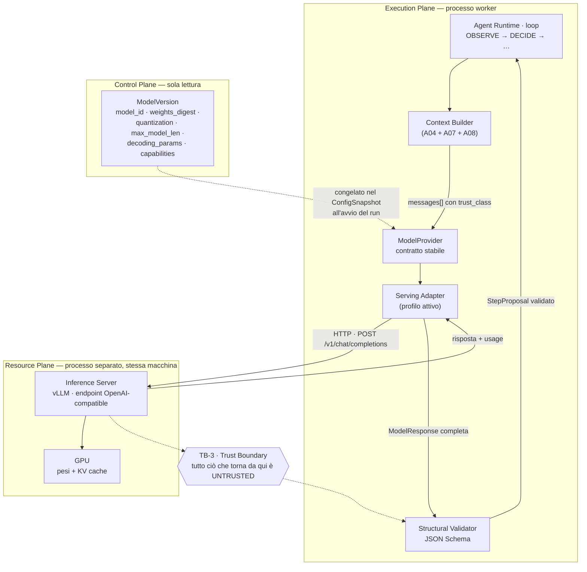

### Come leggerlo

Tre riquadri, tre piani diversi, e una linea tratteggiata che è la cosa più importante del
disegno.

**Il riquadro in alto (`Execution Plane`)** è un solo processo Python: il worker. Dentro ci
sono quattro pezzi che si passano dati in memoria, senza rete. `ModelProvider` è
l'interfaccia; `Serving Adapter` è l'unico punto del sistema che sa che dall'altra parte c'è
vLLM e non qualcos'altro.

**Il riquadro in mezzo (`Resource Plane`)** è un altro processo, sulla stessa macchina. Parla
HTTP. È l'unico componente che tocca la GPU.

**Il riquadro a destra (`Control Plane`)** non è nel flusso: la freccia tratteggiata dice che
la configurazione arriva **una volta sola**, congelata nel `ConfigSnapshot` all'avvio del run
(`AR-CP-01`). Durante il run nessuno rilegge il Control Plane. Se un amministratore cambia il
modello attivo mentre il run è in corso, quel run finisce con il modello con cui è iniziato.

**Il rombo `TB-3`** è il `Trust Boundary` già registrato in `A01`: tutto ciò che risale da
`Inference Server` è input non fidato. Il `Structural Validator` è il posto dove smette di
essere non fidato *nella forma* — ma resta non fidato *nel contenuto*, e per questo passa
comunque da `AUTHORIZE` prima di produrre qualsiasi effetto.

### Perché il confine è qui e non altrove

Il prompt di questo documento propone che l'`Agent Runtime` dica *"ho bisogno del modello X
per l'operazione Y"* e che il layer di inference decida dove gira, quale worker lo gestisce,
come viene schedulato.

**Metà di questa proposta è giusta e metà è prematura.**

| Parte della proposta | Verdetto | Motivo |
|---|---|---|
| il runtime non sa dove gira il modello | **giusta**, adottata | è esattamente ciò che il `ConfigSnapshot` + adapter garantiscono |
| il runtime non sa quale engine serve il modello | **giusta**, adottata | l'adapter è l'unico che lo sa |
| il runtime non sa quale quantizzazione è in uso | **parzialmente giusta** | non la usa per decidere, ma la **riceve nella risposta**, perché serve all'audit |
| il layer decide *quale worker* gestisce la richiesta | **prematura** | c'è un worker. Una funzione che sceglie fra un elemento non è un componente (`AR-019`) |
| il layer decide *come viene schedulato* | **già vera, ma non nostra** | lo scheduling lo fa vLLM internamente (continuous batching). Costruirne un secondo sopra sarebbe schedulare uno scheduler |

> **DECISIONE ARCHITETTURALE.** Il confine passa al `ModelProvider`, e il `ModelProvider`
> **non** contiene routing, scheduling né bilanciamento. Contiene: traduzione del contratto,
> timeout, cancellazione, retry sicuri, attribuzione della risposta, metriche.
>
> Quando il `ModelProvider` inizierà a contenere una scelta reale fra più destinazioni,
> quello sarà il momento del routing — e sarà `T-MD-04`, non prima.

---

## 6. Vocabolario: sei nomi, quanti ne esistono davvero

Il prompt propone questa gerarchia:

```text
Model → ModelVersion → ModelArtifact → ModelDeployment → InferenceWorker
```

Applico il test di `AR-CP-02` (una risorsa esiste solo se ha **lifecycle proprio** + **owner
proprio** + **è riferita da qualcosa**; due mancanti su tre e diventa un campo).

| Concetto candidato | Verdetto | Motivo |
|---|---|---|
| **Model** | **risorsa** (già in `A02`) | identità logica stabile: *"il modello principale della piattaforma"*. È ciò che l'`AgentVersion` riferisce, così l'agent non riferisce mai una versione concreta |
| **ModelVersion** | **risorsa immutabile** (già in `A02`) | è l'unità di riproducibilità. Ogni run congela un `model_version_id` e da lì si risale a tutto |
| **ModelArtifact** | **campi dentro `ModelVersion`** | ha lifecycle proprio? no: nasce e muore con la versione. Owner proprio? no. Riferito da altro? no. Tre su tre falliti. I campi (`artifact_uri`, `weights_digest`, `tokenizer_digest`, `quantization`, `format`) vivono nella `ModelVersion` |
| **ModelRuntime** / serving engine | **campo `serving_profile` + `serving_runtime_version` osservato** | il *profilo* desiderato è configurazione (campo); la *versione effettiva* è un fatto osservato che viaggia nella risposta, non nel Control Plane |
| **ModelDeployment** | **non esiste** | `A02` ha già degradato `Deployment` ad `AgentBinding`: un rollout atomico che dura zero non è un processo da modellare. Vale identico qui |
| **InferenceWorker** | **non esiste come risorsa; esiste come oggetto di observability** | `A02` §14.2 ha eliminato `Runtime`/`Worker` con l'argomento giusto: nessuno *assegna* lavoro a un worker, quindi non serve un registro di worker. Sapere quali processi di inference sono vivi è una domanda di `A12`, non di configurazione |

### La gerarchia che resta

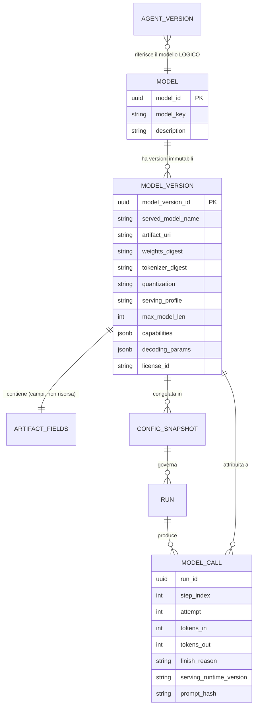

### Come leggerlo

Due livelli di configurazione (`MODEL`, `MODEL_VERSION`) e un livello di **evidenza**
(`MODEL_CALL`), che non sta nel Control Plane ma nell'`Evidence Store` (`A01`, `ADR-010`).

La freccia che conta è `AGENT_VERSION }o--|| MODEL`: l'agent punta al modello **logico**. È
questo che permette di cambiare la `ModelVersion` attiva senza toccare nessun agent.

La freccia `MODEL_CALL }o--|| MODEL_VERSION` è l'audit: da una risposta di sei mesi fa si
risale ai pesi esatti che l'hanno prodotta.

Nota che `MODEL_CALL` porta `serving_runtime_version` come **campo proprio** e non come
riferimento: la versione del motore di inference è un fatto osservato al momento della
chiamata, e può cambiare fra due chiamate della stessa `ModelVersion` (per esempio dopo un
upgrade di vLLM). Metterla nella configurazione la renderebbe una bugia.

### Risposta all'autocritica di `A02`

`A02` §17.4 si chiedeva se `Model`/`ModelVersion` fosse sovradimensionato con un modello solo,
e se `Model` potesse collassare in un campo di `ModelVersion`.

> **DECISIONE ARCHITETTURALE.** Non collassa. La ragione non è il numero di modelli: è che
> `AgentVersion` deve poter riferire un'identità **stabile**. Se l'agent riferisse una
> `ModelVersion`, ogni aggiornamento del modello richiederebbe una nuova `AgentVersion` per
> ogni agent esistente — cioè un rollout di configurazione al posto di un cambio di puntatore.
> Con tre agent è fastidioso; con trenta è ingestibile.
>
> Il costo di tenerla separata è una tabella con poche righe. Il costo di collassarla è un
> rollout N-a-1 al primo aggiornamento del modello. Non è vicino.

---

## 7. L'analisi hardware: dove finisce davvero la VRAM

Questa è la sezione che vincola tutte le altre. Ogni decisione successiva — quantizzazione,
context massimo, concorrenza, streaming — è una conseguenza di quanta memoria c'è sulla
scheda.

### 7.1 In breve

Su una GPU la memoria (`VRAM`, Video RAM) non è occupata solo dal modello. È divisa fra tre
inquilini che si contendono lo stesso spazio:

```text
VRAM totale
 ├── pesi del modello        fisso, dipende dalla quantizzazione
 ├── overhead del runtime    buffer, CUDA graphs, attivazioni — quasi fisso
 └── KV cache                TUTTO IL RESTO, e determina la concorrenza
```

Il terzo inquilino è quello interessante, perché **è variabile e determina quante richieste
puoi servire insieme**.

### 7.2 Che cos'è il KV cache, spiegato bene

Quando il modello legge un prompt, per ogni token calcola due vettori (chiamati *key* e
*value*) e li tiene da parte, perché gli serviranno per ogni token che genererà dopo. Senza
questa memoria dovrebbe rileggere tutto da capo a ogni token prodotto: sarebbe centinaia di
volte più lento.

L'analogia: stai leggendo un contratto lungo e prendi appunti a margine. Gli appunti ti fanno
risparmiare tempo, ma occupano margine. Se leggi dieci contratti insieme, servono dieci
margini.

Le due proprietà che contano architetturalmente:

1. **cresce con la lunghezza del testo** — prompt lungo, appunti lunghi;
2. **cresce con il numero di richieste in parallelo** — dieci richieste, dieci copie di
   appunti.

### 7.3 FATTI disponibili

**FATTO** (`research-log` R-08). `Qwen3.5-9B` quantizzato `Q4_K_M`: file ~5,24 GiB, ~5,83 GiB
di `VRAM` sopra l'idle, ~122,9 token/s in generazione su workload `tg128`, misurato su RTX
4090.
Fonte: https://huggingface.co/steven0226/Qwen3.5-9B-GGUF-Quant-Lab/blob/main/EVAL_REPORT.md

**FATTO** (stessa fonte, tabella completa riportata in `ai/research/04` §6):

| Quantizzazione | Dimensione file | token/s generazione | Picco VRAM sopra idle |
|---|---:|---:|---:|
| `F16` | 16,69 GiB | 211,9 | 16,2 GiB |
| `Q8_0` | 8,87 GiB | 85,1 | 9,1 GiB |
| `Q6_K` | 6,85 GiB | 99,35 | 7,24 GiB |
| `Q5_K_M` | 6,02 GiB | 113,97 | 6,52 GiB |
| **`Q4_K_M`** | **5,24 GiB** | **122,88** | **5,83 GiB** |
| `Q3_K_M` | 4,31 GiB | 140,83 | 5,01 GiB |

**FATTO.** Un altro benchmark pubblico sulla stessa quantizzazione `Q4` riporta ~61 token/s su
backend Apple/MTL. La variabilità per hardware e runtime è enorme.

**FATTO.** Questi numeri **non sono uno SLA** (Service Level Agreement, l'impegno formale su
un livello di servizio). Sono ordini di grandezza misurati altrove.

**FATTO** (`research-log` R-06). vLLM espone metriche Prometheus su `GPU cache usage`,
richieste running/waiting, `TTFT` (Time To First Token, il tempo che passa prima che arrivi il
primo token della risposta), tempo per token di output, profondità della coda.

**FATTO** (documentazione vLLM, riportata in `ai/research/04` §22). Esiste una relazione
esplicita e dichiarata fra capacità del `KV cache` e concorrenza massima a un dato
`max_model_len`. L'esempio della documentazione: con 15.728.640 token di `KV cache`, la
concorrenza massima a 8.192 token per richiesta è 1.920.
Quel numero è un esempio della documentazione, **non** una capacità attribuibile a
`Qwen3.5-9B` su una GPU qualsiasi.

**FATTO** (`research-log` R-08). L'hardware di riferimento economicamente plausibile è una
Hetzner GEX44: RTX 4000 SFF Ada, **20 GB** di VRAM, €232,30/mese.

**Anomalia da notare.** La tabella dei benchmark viene da una RTX 4090 (24 GB, architettura
Ada, banda di memoria molto alta). L'hardware candidato è una RTX 4000 SFF Ada (20 GB, stessa
generazione, ma scheda a basso consumo con banda inferiore). **I token/s misurati sulla 4090
non sono trasferibili.** Vale l'ordine di grandezza dell'occupazione di memoria, non la
velocità.

`DA VERIFICARE` — `B-14`: la finestra di context nominale di `Qwen3.5-9B` e quale
`max_model_len` è realistico entro 20 GB.

### 7.4 Il bilancio di memoria, in forma di ragionamento

**INFERENZA** (non FATTO: è aritmetica su fatti, con un'incognita dichiarata).

Su una scheda da 20 GB, con `Qwen3.5-9B` a 4 bit:

```text
20,0 GB     VRAM totale
- ~1,0 GB   riservata al driver / display / frammentazione   [ASSUNZIONE]
- ~5,5 GB   pesi del modello a 4 bit                          [FATTO, R-08]
- ~1,5 GB   overhead del runtime, buffer, CUDA graphs         [ASSUNZIONE, DA MISURARE]
──────────
≈ 12,0 GB   disponibili per il KV cache
```

Le due voci marcate `ASSUNZIONE` sono esattamente ciò che il piano di benchmark di §27 deve
misurare per primo. Il numero finale può facilmente essere 10 o 14: **la struttura del
ragionamento è il contributo, non la cifra**.

Quello che il ragionamento dice con certezza è la forma della curva:

> ogni GB che sposti dal `KV cache` ai pesi (quantizzazione più generosa) è concorrenza che
> perdi. Ogni token che aggiungi a `max_model_len` è concorrenza che perdi. **Sono la stessa
> risorsa.**

### 7.5 Il trade-off che nessuno vuole guardare in faccia

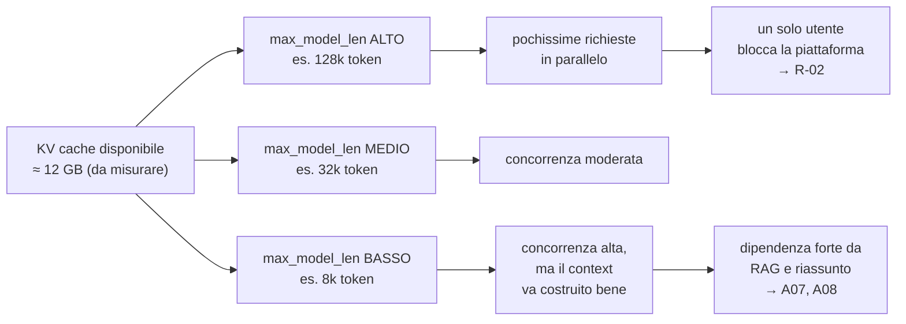

### Come leggerlo

Una risorsa sola in alto, tre modi di spenderla, e le conseguenze in fondo.

Il ramo di sinistra è la tentazione: *"il modello supporta un context enorme, usiamolo"*. La
conseguenza è in fondo, ed è già registrata come rischio `R-02` in `A01`: **un task pesante
satura la GPU e blocca le interazioni umane**. Con `max_model_len` altissimo non serve neanche
un task pesante: bastano due o tre richieste lunghe.

Il ramo di destra non è gratis: se il context è stretto, la qualità dipende da quanto bene
`A07` (retrieval) e `A08` (riassunto della memoria) scelgono *cosa* metterci dentro. Si sposta
il problema dalla GPU all'ingegneria del context.

Il ramo di mezzo è dove atterreremo, ma **il numero esatto lo decide la misura, non questo
documento**.

### 7.6 Decisione: `max_model_len` come parametro di capacità

## Decisione

`max_model_len` **non** è una proprietà del modello che si copia dalla scheda tecnica. È una
**decisione di capacità della piattaforma**, dichiarata sulla `ModelVersion`, congelata nel
`ConfigSnapshot`, e scelta con la procedura di §27.

Conseguenze operative immediate:

| Conseguenza | Chi la subisce |
|---|---|
| il budget di token del prompt è un numero **derivato**: `max_model_len` − `max_output_tokens` − margine | `A04` (context), `A08` (memory), `A07` (retrieval) |
| chi costruisce il context deve **contare i token prima di inviare** e fallire in modo pulito se sfora | `Agent Runtime`, `AR-MD-07` |
| `AR-RT-14` (il context riceve un riassunto del journal, mai il journal intero) smette di essere un principio e diventa un vincolo numerico | `A08` deve produrre riassunti sotto una soglia dichiarata |
| cambiare `max_model_len` è cambiare `ModelVersion` | `AR-MD-10` |

## Perché

Perché è l'unico modo di rendere la capacità **prevedibile**. Se `max_model_len` è alto "per
sicurezza" ma i prompt reali sono corti, si sta pagando una tassa invisibile: vLLM alloca il
`KV cache` in base alla finestra dichiarata, non a quella usata.

## Alternative considerate

| Alternativa | Perché perde |
|---|---|
| **usare il massimo supportato dal modello** | paga la tassa peggiore: concorrenza minima per una capacità che non si usa. È la scelta di default di chi non ha misurato |
| **finestra dinamica per richiesta** | il serving deve comunque riservare per il caso peggiore; la dinamicità è illusoria e complica il capacity planning |
| **due `ModelVersion` con finestre diverse (corta per interactive, lunga per background)** | tecnicamente sensata, **ma richiede due processi di inference o due pool di cache**: è la Fase 3. Registrata come evoluzione, non Day-1 |

## Trade-off

Guadagniamo concorrenza prevedibile e un errore chiaro quando il context è troppo grande.
Perdiamo la possibilità di gestire, Day-1, il compito raro che avrebbe davvero bisogno di
200.000 token di context — quel compito fallirà con `CONTEXT_TOO_LARGE` e dovrà essere
spezzato dal runtime.

**Accettiamo il compromesso** perché un fallimento esplicito e raro è preferibile a un
degrado silenzioso e continuo della concorrenza.

---

## 8. Quantizzazione: quale, e soprattutto con quale metodo

### 8.1 In breve

Quantizzare significa scrivere i numeri del modello con meno cifre. Un peso che occupava 16
bit ne occupa 4. Il modello diventa quattro volte più piccolo, gira più veloce, e **sbaglia
un po' di più**.

La domanda architetturale non è *"quale quantizzazione è la migliore"* — dipende dal compito.
È: **con quale procedura decidiamo, e come ci accorgiamo se abbiamo sbagliato.**

### 8.2 Il panorama, e perché non sono tutti alternative fra loro

Errore comune: mettere `GGUF`, `AWQ`, `GPTQ`, `INT8` nella stessa lista come se fossero sette
opzioni equivalenti. Non lo sono. Ci sono **tre assi diversi**.

| Asse | Cos'è | Esempi |
|---|---|---|
| **Precisione numerica** | quanti bit per peso e per attivazione | `FP16`, `BF16`, `INT8`, `INT4` |
| **Metodo di quantizzazione** | l'algoritmo che decide *come* comprimere minimizzando il danno | `AWQ` (Activation-aware Weight Quantization), `GPTQ`, `RTN` (round-to-nearest) |
| **Formato del file** | come i pesi compressi stanno su disco, e chi sa leggerli | `GGUF` (il formato di llama.cpp), `safetensors` (il formato dell'ecosistema Hugging Face / vLLM) |

Quindi `GGUF Q4_K_M` e `AWQ INT4` non sono due algoritmi rivali: sono **un formato con il suo
metodo** e **un metodo con il suo formato**. Il vero discrimine è: *quale serving runtime deve
leggerli*.

| Combinazione | Serving runtime che la legge | Nota |
|---|---|---|
| `GGUF` `Q4_K_M` / `Q5_K_M` / `Q6_K` | llama.cpp (e derivati: Ollama, LM Studio) | girano anche su CPU e su GPU non NVIDIA |
| `AWQ` `INT4` (`W4A16`) | vLLM, SGLang, TGI | pesi a 4 bit, attivazioni a 16 |
| `GPTQ` `INT4` | vLLM, SGLang, TGI | alternativa storica ad AWQ |
| `FP8` / `INT8` | vLLM su hardware recente | meno compressione, meno degrado |
| `BF16` / `FP16` (nessuna quantizzazione) | tutti | ~18 GB solo di pesi per un 9B: su 20 GB non resta `KV cache` utile |

### 8.3 Il fatto che rende la decisione facile

`FP16` è **fuori discussione** su questo hardware: **FATTO** (R-08), i pesi in `F16` occupano
16,69 GiB. Su una scheda da 20 GB restano ~2 GB per `KV cache`, overhead e frammentazione.
Significa una richiesta alla volta, con un context corto. Non è una piattaforma.

**INFERENZA:** su 20 GB, con un modello 9B, la quantizzazione a 4 bit non è
un'ottimizzazione: **è il requisito di ammissione.**

### 8.4 Decisione

## Decisione

Day-1: **quantizzazione a 4 bit**, con formato determinato dal `serving profile` attivo:

| Serving profile | Formato Day-1 | Motivo |
|---|---|---|
| `vllm` (produzione) | `AWQ INT4` (`W4A16`), in `safetensors` | è il formato nativo del motore che sceglieremo in §10 |
| `llamacpp` (sopravvivenza / sviluppo) | `GGUF Q4_K_M` | è il formato per cui esistono i benchmark che abbiamo (R-08) e gira ovunque |

Il formato è un **campo della `ModelVersion`**, non una decisione globale. Due
`ModelVersion` con lo stesso `model_key` e formati diversi sono due righe, e il binding sceglie.

## Perché il metodo conta più della scelta

Perché la scelta è quasi obbligata dall'hardware, mentre il metodo per accorgersi che ha
smesso di funzionare non esiste ancora e va costruito.

> **Il rischio reale della quantizzazione non è che il modello diventi "meno intelligente" in
> generale. È che degradi in modo asimmetrico proprio su ciò che ci serve: la produzione di
> JSON strutturalmente corretto e la scelta del tool giusto.**

Un modello quantizzato può conservare quasi intatta la capacità di scrivere prosa e perdere
qualche punto percentuale sulla precisione del tool calling. Con una metrica generica non lo
vedi. Con la metrica giusta lo vedi subito.

Questo diventa il rischio `R-15` (§32) e la regola procedurale seguente.

## La procedura di decisione (`AR-MD-14`)

Una quantizzazione si adotta solo dopo aver superato un **gate di qualità agentico**:

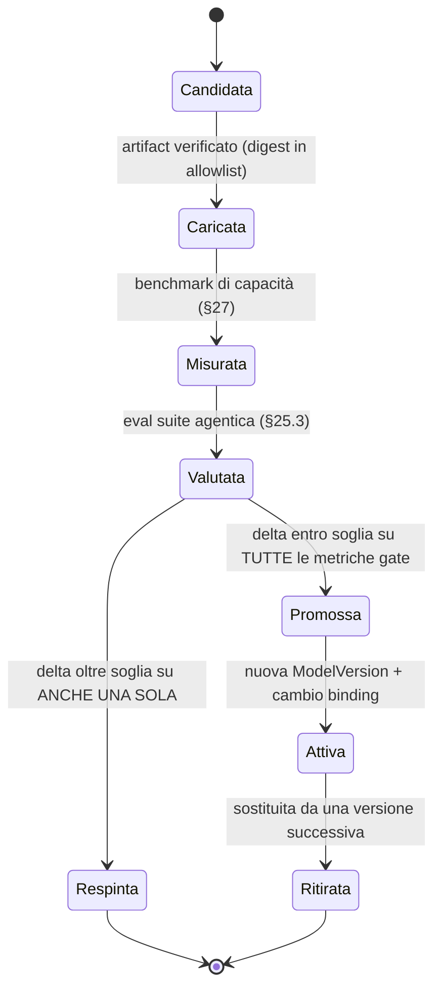

### Come leggerlo

Il passaggio che fa il lavoro è `Valutata → Respinta`: **basta una sola metrica gate fuori
soglia**. Non si fa una media pesata, perché una media permette a un crollo del tool calling
di nascondersi dietro un miglioramento della fluidità del testo.

Le metriche gate minime (definite in dettaglio in §25.3, di competenza `A17`):

| Metrica gate | Perché è gate |
|---|---|
| % di risposte che passano la validazione JSON Schema **al primo tentativo** | è la metrica che determina quante chiamate al modello costa ogni passo |
| % di tool selection corretta su un set di casi noti | è `R-03` di `A01`, già registrato |
| % di allucinazioni di tool inesistenti | segnale precoce di degrado |
| % di rispetto dei vincoli di formato negli argomenti (tipi, enum, date) | è dove la quantizzazione colpisce per prima |

## Alternative considerate

| Alternativa | Perché perde |
|---|---|
| **`FP16` / `BF16` senza quantizzazione** | impossibile su 20 GB (§8.3). Torna in gioco solo con una GPU da 48 GB o più |
| **`Q8_0` / `INT8`** | 8,87 GiB di pesi (R-08): resterebbero ~8 GB di `KV cache`, un terzo in meno di concorrenza. È la scelta giusta **se e solo se** il gate di qualità boccia il 4 bit. Va tenuta come **fallback di qualità documentato**, non scartata |
| **`Q3_K_M` o inferiore** | 4,31 GiB, guadagno di ~1 GB rispetto a `Q4_K_M`, con rischio di degrado molto più alto proprio sul structured output. Il rapporto beneficio/rischio è pessimo |
| **`GPTQ` invece di `AWQ`** | non ho evidenza verificata che uno domini l'altro su questo modello. `RICHIEDE RICERCA` (`B-15`). Se esiste solo un checkpoint affidabile dei due, la scelta la fa la disponibilità, non la teoria |

## Trade-off

Guadagniamo un modello che sta in memoria con ~12 GB liberi per il `KV cache`. Perdiamo una
quantità di qualità **che non conosciamo ancora** e che ci impegniamo a misurare prima di
andare in produzione.

## Reversibilità

**Facile**, e questo è il punto che rende la decisione accettabile con così poca evidenza:
cambiare quantizzazione è creare una nuova `ModelVersion` e spostare un puntatore. Nessuno
schema cambia, nessun codice cambia, nessun prompt cambia.

`RICHIEDE RICERCA` — `B-15`: esistono checkpoint `AWQ`/`GPTQ` affidabili e con provenance
verificabile per `Qwen3.5-9B`? Se non esistono, il profilo di produzione Day-1 diventa
`GGUF` su llama.cpp e vLLM slitta — il che rovescerebbe §10.

---

## 9. I serving runtime: cosa sono davvero, e dove differiscono

### 9.1 Prima di confrontarli: non sono tutti la stessa categoria

Il prompt chiede esplicitamente di non dare per scontato che siano concorrenti diretti. Non lo
sono, e metterli sulla stessa riga è l'errore che porta alla scelta sbagliata.

| Tecnologia | Che cosa **è** | Categoria |
|---|---|---|
| **vLLM** | inference server per GPU con continuous batching e `PagedAttention` (gestione del `KV cache` a pagine, come la memoria virtuale di un sistema operativo) | server di produzione |
| **SGLang** | inference server con enfasi su prefix caching aggressivo e programmi strutturati | server di produzione |
| **llama.cpp** | libreria di inference C++ portabile + un server HTTP minimale sopra | libreria con server |
| **Ollama** | *packaging* di llama.cpp: gestione modelli, pull, API semplificata | strumento di distribuzione |
| **NVIDIA Triton** | *framework di serving generico* — non sa nulla di LLM da solo, ospita backend (fra cui vLLM o TensorRT-LLM) | infrastruttura di serving |
| **Hugging Face TGI** | inference server per GPU, storicamente il concorrente diretto di vLLM | server di produzione |
| **Transformers diretto** | libreria di ricerca: carichi il modello in un processo Python e chiami `generate()` | non è un server |
| **server custom** | codice nostro sopra una libreria | non è una categoria, è una scelta di scrivere codice |

Quindi il confronto reale è a tre livelli:

1. **Server di produzione GPU**: vLLM vs SGLang vs TGI;
2. **Libreria portabile**: llama.cpp (con o senza il packaging di Ollama);
3. **Infrastruttura sopra**: Triton — che è una domanda diversa (*"serve un livello di serving
   generico?"*) e la risposta con un modello solo è ovviamente no.

### 9.2 Il confronto che conta

Criteri pesati per **questo** progetto: una macchina, una GPU da 20 GB, tre persone, nessun
SRE (`AS-04`).

| Criterio | vLLM | SGLang | llama.cpp | Ollama | TGI | Triton | Transformers |
|---|---|---|---|---|---|---|---|
| Continuous batching | sì | sì | limitato | eredita llama.cpp | sì | dipende dal backend | no |
| Gestione `KV cache` a pagine | sì (`PagedAttention`) | sì | più semplice | eredita | sì | dipende | no |
| Prefix caching | sì (FATTO, R-06/research 04) | sì, è il suo punto forte | parziale | eredita | sì | dipende | no |
| Structured output con JSON Schema | **sì** (FATTO, R-06) | sì | sì (grammar) `DA VERIFICARE` | parziale | sì | dipende | no |
| Tool calling con parser per modello | **sì** (FATTO, R-06) | sì | `DA VERIFICARE` (`B-18`) | parziale | sì | dipende | no |
| API OpenAI-compatible | sì | sì | sì (server incluso) | sì | sì | no (serve adapter) | no |
| Metriche Prometheus | **sì**, ricche (FATTO, R-06) | sì | minime | minime | sì | sì | no |
| Tracing OpenTelemetry | sì nel production-stack (FATTO, R-06) | `DA VERIFICARE` | no | no | `DA VERIFICARE` | sì | no |
| Gira su CPU / GPU non-NVIDIA | no | no | **sì** | **sì** | no | dipende | sì (lentissimo) |
| Quantizzazione a 4 bit | `AWQ`/`GPTQ` | `AWQ`/`GPTQ` | **`GGUF`** | `GGUF` | `AWQ`/`GPTQ` | dipende | sì, lento |
| Multi-GPU (tensor parallelism) | sì | sì | limitato | no | sì | sì | limitato |
| Complessità operativa Day-1 | **media** | media | **bassa** | **bassissima** | media | **alta** | bassa |
| Maturità dell'ecosistema per agent | **alta** | crescente | alta ma diversa | alta lato hobby | alta | alta ma generica | — |
| Licenza | Apache 2.0 | Apache 2.0 | MIT | MIT | permissiva con clausole | permissiva | Apache 2.0 |
| Adatto a produzione enterprise | **sì** | sì | sì con riserve | **no** | sì | sì | **no** |

`DA VERIFICARE` — `B-12`: la matrice di supporto autorevole vLLM × `Qwen3.5` × quantizzazione
× tool parser. **FATTO** (R-06): la documentazione vLLM avverte esplicitamente che prima di un
upgrade va testata la combinazione esatta di checkpoint, formato di quantizzazione, tokenizer,
context length, structured outputs, reasoning parser e tool calling — *il fatto che un modello
sia "supportato" non garantisce che ogni modalità di serving funzioni*.

Questo avvertimento è la cosa più importante di tutta la sezione, e diventa il rischio `R-13`
(§32).

### 9.3 "WHY NOT?" — il rifiuto motivato di ciascuno

Il prompt lo chiede esplicitamente. Rispondo uno per uno.

**Perché non Ollama.**
Non perché sia cattivo: perché è *packaging*. Nasconde i parametri di serving che noi dobbiamo
dichiarare e congelare (`max_model_len`, dimensione del `KV cache`, `serving_runtime_version`
esatta). Un layer che nasconde proprio le cose che l'audit richiede lavora contro
l'architettura. E la sua astrazione dei modelli — un nome, un tag — non porta il
`weights_digest` che `A01` §25 richiede.
**Verdetto:** ottimo per una demo sul portatile, **non** come `Resource Plane` di una
piattaforma auditabile.

**Perché non Triton.**
È un framework per ospitare **molti** backend e **molti** modelli con un livello di
configurazione proprio. Con un modello, aggiunge un livello di indirezione, un formato di
configurazione, un processo, e una superficie operativa — in cambio di zero funzionalità che
ci servano oggi. È esattamente il componente che `AR-019` vieta senza una misura.
**Verdetto:** rientra in gioco solo con un parco modelli eterogeneo su hardware eterogeneo,
cioè Fase 4.

**Perché non Transformers diretto.**
Non ha continuous batching, non ha gestione del `KV cache` condiviso, non ha un server. Servire
due richieste insieme significa scriverselo. Sarebbe scrivere vLLM peggio.
**Verdetto:** utile solo come strumento di test offline (per esempio per calcolare i token con
il tokenizer esatto), mai come serving.

**Perché non un server custom.**
Perché il valore di questa piattaforma non è nell'inference: è nel governo delle azioni. Con
tre persone, ogni ora spesa a scrivere uno scheduler di batch è un'ora non spesa sul `PDP` o
sul journal. E il rischio di sbagliare la gestione del `KV cache` è alto e silenzioso.
**Verdetto:** rifiutato senza esitazione.

**Perché non TGI.**
È un concorrente legittimo e tecnicamente vicino a vLLM. Perde per tre ragioni pratiche, non
teoriche: (a) l'evidenza verificata che abbiamo in `research-log` R-06 riguarda vLLM, non TGI —
scegliere TGI significherebbe decidere su fatti che non abbiamo raccolto; (b) il
`production-stack` vLLM porta già logging strutturato, tracing OTel e routing prefix-aware
(FATTO, R-06), che è precisamente il percorso di scaling che ci serve in Fase 3; (c) la sua
licenza ha avuto clausole non puramente permissive in passato, e con un possibile deployment
on-prem presso clienti (`Q-03` aperta) è un rischio che non serve correre.
**Verdetto:** alternativa reale, respinta per **evidenza asimmetrica**, non per inferiorità
tecnica. Se `B-12` dovesse rivelare che vLLM non supporta bene `Qwen3.5`, TGI è il primo posto
dove guardare.

**Perché non SGLang.**
Tecnicamente forse il candidato più interessante: il suo prefix caching aggressivo è
particolarmente adatto a un loop agentico, dove ogni chiamata ripete lo stesso prefisso (system
prompt + tool definition + storia) e cambia solo la coda. **INFERENZA:** in un loop di 8
chiamate con prefisso identico, il riuso del prefisso è il singolo risparmio più grande
ottenibile.
Perde per la stessa ragione di TGI — evidenza raccolta su vLLM — più una: la maturità
dell'ecosistema operativo (metriche, Helm, tracing) è meno documentata nelle fonti che abbiamo
verificato.
**Verdetto:** **il candidato numero uno per la sostituzione futura.** Registro esplicitamente
che il vantaggio di prefix caching in un carico agentico è un'ipotesi che vale la pena misurare
(`B-16`, `T-MD-09`). Non è un "no": è un "non con le informazioni di oggi".

**Perché non llama.cpp come profilo principale.**
Non perde. **Viene adottato come secondo profilo** (§10). Non è il principale perché sul
target di produzione (GPU NVIDIA, concorrenza multipla) il continuous batching e la gestione
del `KV cache` a pagine di vLLM sono un vantaggio strutturale, e perché le sue capability di
tool calling e structured output sul nostro modello sono `DA VERIFICARE` (`B-18`).

**Perché vLLM vince.**
Riassunto in una riga: *è l'unico candidato per cui abbiamo evidenza verificata su tutte e tre
le cose che ci servono davvero* — structured output con JSON Schema, tool calling con parser
per modello, e metriche operative ricche (FATTO, R-06) — *e il suo percorso di scaling
(production-stack, routing prefix-aware, tracing OTel) è documentato* (FATTO, R-06).

Non vince perché è il più popolare. Vince perché è quello su cui abbiamo fatti invece di
impressioni. Ed è un criterio di selezione che dichiaro apertamente come **debole ma onesto**:
la ricerca è stata fatta su vLLM, quindi vLLM parte avvantaggiato. `B-12` esiste proprio per
ridurre questa asimmetria prima di scrivere codice.

---

## 10. Le architetture candidate, e quale vince

### 10.1 I cinque candidati reali

Il prompt propone cinque opzioni. Le rendo concrete per questo progetto.

| # | Architettura | Come sarebbe davvero da noi |
|---|---|---|
| **A** | **Runtime locale diretto** | il modello caricato nello stesso processo Python del worker, via Transformers o binding llama.cpp |
| **B** | **Inference server dedicato** | vLLM in un container sulla stessa macchina; il worker parla HTTP su `localhost` |
| **C** | **Astrazione + worker di modello** | un nostro processo "inference worker" che possiede la GPU, con una coda propria, che il runtime alimenta |
| **D** | **Model Gateway + più backend** | un servizio di gateway (nostro o off-the-shelf) davanti a uno o più inference server |
| **E** | **Ibrido locale + cloud** | vLLM locale come primario, un provider cloud come fallback |

### 10.2 La matrice di selezione

Scala: ✅ buono · ⚠️ accettabile con riserve · ❌ inadeguato · — non applicabile Day-1.

| Criterio | A · in-process | **B · server dedicato** | C · worker nostro | D · gateway | E · ibrido cloud |
|---|---|---|---|---|---|
| Fattibilità Day-1 | ✅ | ✅ | ⚠️ | ❌ | ❌ |
| Latenza | ✅ (nessun hop) | ✅ (hop su loopback, trascurabile) | ⚠️ (due hop + coda) | ⚠️ | ❌ (rete pubblica) |
| Throughput con concorrenza | ❌ | ✅ | ✅ | ✅ | ✅ |
| Efficienza GPU | ❌ (nessun batching) | ✅ | ✅ | ✅ | — |
| Efficienza di memoria | ❌ (GPU + Python nello stesso processo) | ✅ | ✅ | ✅ | — |
| Streaming | ⚠️ | ✅ | ✅ | ✅ | ✅ |
| Tool calling | ⚠️ (a mano) | ✅ | ✅ | ✅ | ✅ |
| Structured output | ⚠️ (a mano) | ✅ | ✅ | ✅ | ✅ |
| Multi-GPU futuro | ❌ | ✅ | ✅ | ✅ | — |
| Multi-worker futuro | ❌ | ✅ | ✅ | ✅ | — |
| Multi-model futuro | ❌ | ⚠️ (un server per modello) | ✅ | ✅ | ✅ |
| Affidabilità | ❌ (un OOM della GPU uccide il worker e il run) | ✅ (fault isolation vera) | ✅ | ✅ | ✅ |
| Observability | ❌ (da scrivere) | ✅ (metriche pronte, FATTO R-06) | ⚠️ (da scrivere) | ✅ | ⚠️ |
| Security | ⚠️ | ✅ (confine di processo) | ✅ | ✅ | ❌ (egress dei dati) |
| Complessità operativa | ✅ (un processo) | ✅ (due processi, un compose) | ❌ (coda, health, lifecycle nostri) | ❌ | ❌ |
| Scalabilità futura | ❌ | ✅ | ✅ | ✅ | ✅ |
| Lock-in | ⚠️ | ✅ (basso: API standard) | ⚠️ (sul nostro codice) | ⚠️ | ❌ (sul provider) |
| **Raccomandazione** | no | **SÌ, Day-1** | Fase 3 se mai | Fase 4 | Fase 4 |

### 10.3 Perché A perde, e non di poco

Sembra la più semplice, e la semplicità è un valore che questa architettura difende ovunque.
Perde comunque, per una ragione che vale la pena isolare:

> **Caricare il modello nel processo del worker significa che la GPU e la logica di business
> condividono il destino.** Un `OOM` (Out Of Memory, esaurimento della memoria) della GPU non
> fa fallire una chiamata: fa morire il processo Python che stava anche portando avanti il run.
> E `A04` ha costruito un intero meccanismo di recovery proprio per non perdere run.

C'è di più: `ADR-001` prevede tre ruoli di processo (`api`, `worker`, `scheduler`) su un
artifact solo. Se il modello vive nel worker, **ogni replica di worker vuole la sua copia dei
pesi**. Con 5,5 GB per copia e una GPU sola, il numero massimo di worker diventa uno. La
scalabilità orizzontale del piano di esecuzione morirebbe per una scelta di packaging.

### 10.4 Perché C, D, E perdono oggi

**C (worker di modello nostro)** costruisce una coda, un health check, un lifecycle e uno
scheduler che vLLM ha già, meglio. Violerebbe `AR-019` e `AR-004` insieme.

**D (Model Gateway)** risolve problemi che non abbiamo: autenticazione fra molti consumer,
routing fra provider, rate limiting per tenant, normalizzazione di API diverse. Con un
consumer, un modello e una API, un gateway è un proxy che aggiunge un salto di rete, un punto
di guasto e un file di configurazione. → `ADR-043`.

**E (ibrido cloud)** ha un problema che non è tecnico: **fa uscire i dati del CRM dalla
macchina**. Questo richiede una decisione di governance (`A03`, `A14`) e probabilmente
contrattuale, che oggi non esiste. Il contratto lo prepara (§24.4); l'implementazione no.

### 10.5 Decisione

## Decisione

**Opzione B**: l'inference server è un **processo separato, containerizzato, sulla stessa
macchina**, che espone una API OpenAI-compatible su interfaccia locale. Il worker vi accede
solo tramite il `ModelProvider`. → `ADR-038`.

Il `serving profile` Day-1 è **vLLM**; esiste un secondo profilo **llama.cpp** dietro lo
stesso contratto. → `ADR-036`.

## Perché due profili e non uno

Non per gusto della simmetria. Per tre ragioni concrete:

| Ragione | Spiegazione |
|---|---|
| **`AR-020`** | *"nessuna interfaccia con una sola implementazione non identificata"*. Con un solo profilo, il contratto `ModelProvider` sarebbe un'astrazione non verificata: nessuno saprebbe se isola davvero finché non serve, cioè troppo tardi. Con due profili, **l'isolamento è testato dal primo giorno** |
| **sviluppo** | i tre sviluppatori non hanno tre GPU. Il profilo llama.cpp gira su un portatile e permette di lavorare sul runtime senza la macchina di produzione |
| **sopravvivenza** | se `B-12` o `B-15` rivelano che vLLM non serve bene `Qwen3.5` con la quantizzazione disponibile, il profilo alternativo non è un piano B da inventare: è codice già scritto e già testato |

## Il costo di questa decisione, dichiarato

I due profili **non sono equivalenti**. llama.cpp avrà probabilmente meno capability
(structured output e tool calling `DA VERIFICARE`, `B-18`), e questo va rappresentato: è
esattamente il motivo per cui il contratto espone `ModelCapabilities` (§16) invece di
assumere che ogni modello sappia fare tutto.

Il rischio da non ignorare: **due profili significano due matrici di compatibilità da
mantenere**. La mitigazione è che il profilo llama.cpp è dichiarato `best effort` e non ha
impegni di produzione — se una capability manca lì, il contratto lo dice e il runtime si
comporta di conseguenza, non si rompe.

## Trade-off

Guadagniamo fault isolation, batching gratis, metriche gratis, e un'astrazione verificata.
Perdiamo la semplicità di un processo solo e paghiamo un hop HTTP su loopback (`INFERENZA`:
trascurabile rispetto a centinaia di ms di generazione, ma `DA VERIFICARE` in §27).

## Reversibilità

**Facile**: cambiare profilo è cambiare un campo della `ModelVersion` e riavviare il container
di inference. Nessun dato migra.

---

## 11. Il deployment Day-1

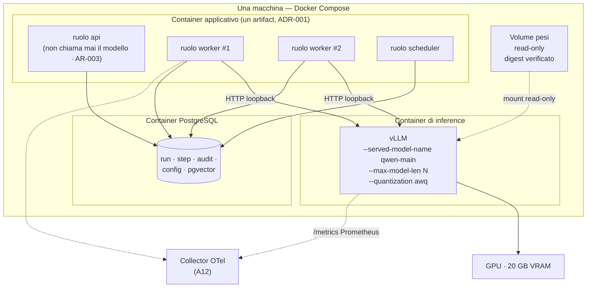

### Come leggerlo

Tre container, una GPU, un volume.

Il fatto più importante: **due worker parlano allo stesso inference server**. È questo che
rende possibile scalare il piano di esecuzione senza duplicare i pesi. Era impossibile con
l'Opzione A.

Il secondo fatto: `API` non ha alcuna freccia verso `VLLM`. È `AR-003` (*il ruolo `api` non
chiama mai il modello*) reso visibile nel disegno. Se un giorno comparisse quella freccia,
sarebbe una violazione architetturale rilevabile a occhio.

Il volume dei pesi è montato **read-only** e il suo contenuto è verificato per digest
all'avvio: il processo di inference non può riscrivere i pesi che sta servendo (§18).

Le linee tratteggiate verso il collector sono `A12`: le metriche di vLLM (FATTO, R-06) e
quelle del runtime finiscono nello stesso posto, che è l'unico modo per correlare *"il run è
lento"* con *"il `KV cache` era pieno"*.

### La cosa che manca, ed è voluta

**Non c'è ridondanza.** Un solo container di inference, una sola GPU. Se cade, tutti i run in
corso vanno in errore e i nuovi restano in coda.

Questo è accettabile Day-1 (`A01` dichiara che l'HA non è un requisito Day-1) ma va detto
chiaramente perché ha una conseguenza sul comportamento del runtime: **un errore di inference
per indisponibilità deve essere `RETRYABLE`, non terminale** (§21). Il run si mette in pausa e
riprende quando il server torna, invece di fallire definitivamente. Diventa il rischio `R-14`.

---

## 12. Il contratto `ModelProvider`

### 12.1 Che cosa deve garantire

`ADR-005` ha deciso che il contratto esiste. Qui si decide **cosa contiene**, ed è una
decisione più impegnativa di quanto sembri, perché il contratto è la superficie che non deve
cambiare quando cambia tutto il resto.

Il criterio di progetto: *ogni campo deve essere necessario a (a) fare la chiamata, (b)
attribuirla, oppure (c) fermarla*. Niente altro entra.

### 12.2 La richiesta

```python
# Forma concettuale. Il linguaggio è Python (A01), ma qui conta la struttura.

@dataclass(frozen=True)
class ModelRequest:
    # — identità: da dove viene la richiesta —
    tenant_id: TenantId              # AR-017: sempre presente, mai derivato qui
    run_id: RunId
    step_index: int                  # con run_id forma la chiave di correlazione
    attempt: int                     # AR-RT-05: il retry non cambia step_index

    # — cosa si chiede —
    messages: list[Message]          # ogni Message porta la sua trust_class (ADR-007)
    tools: list[ToolDefinition]      # JSON Schema, dal Tool Registry (A06)
    response_format: ResponseFormat  # TEXT | JSON_SCHEMA(schema) | TOOL_CALL

    # — come si vuole che risponda —
    decoding: DecodingParams         # temperature, top_p, seed, max_output_tokens, stop
    # NOTA: i default vengono dalla ModelVersion congelata; qui si può solo restringere

    # — quando smettere —
    deadline: Deadline               # istante assoluto, non durata (§20)
    cancel_token: CancelToken        # osservato ai confini di chunk (§19)

    # — cosa NON c'è, ed è voluto —
    # model_id:        NO. Viene dal ConfigSnapshot, non dal chiamante (ADR-012)
    # user_token:      NO. Il token dell'utente non lascia il ruolo api (AR-GP-02)
    # priority:        NO. La priorità è del run, non della chiamata (§23)
```

**Il campo assente più significativo è `model_id`.**

Un contratto che accetta `model_id` dal chiamante invita il chiamante a sceglierlo. E il
momento in cui l'`Agent Runtime` sceglie il modello è il momento in cui il modello diventa un
dettaglio sparso nel codice invece di una configurazione congelata. Il modello **viene sempre e
solo dal `ConfigSnapshot`** (`ADR-012`).

### 12.3 La risposta

```python
@dataclass(frozen=True)
class ModelResponse:
    # — il contenuto (UNTRUSTED, AR-009) —
    text: str | None
    structured: dict | None          # popolato solo se response_format lo chiedeva
    tool_calls: list[RawToolCall]    # "Raw": non validati, non risolti, non autorizzati
    finish_reason: FinishReason      # STOP | LENGTH | TOOL_CALL | CONTENT_FILTER | ERROR

    # — l'identità di produzione (OBBLIGATORIA, AR-MD-02) —
    model_id: str                    # identità logica
    model_version_id: ModelVersionId # la riga immutabile del Control Plane
    weights_digest: str              # i pesi esatti
    quantization: str                # es. "awq-int4"
    serving_runtime: str             # es. "vllm"
    serving_runtime_version: str     # OSSERVATA al momento della chiamata
    decoding_params_effective: DecodingParams  # ciò che è stato applicato davvero

    # — il consumo (A01 §25, base del cost model di B20) —
    tokens_in: int
    tokens_out: int
    tokens_cached: int | None        # prefix cache hit, se il serving lo riporta
    latency_ms: int
    ttft_ms: int | None              # solo in streaming

    # — la tracciabilità del prompt (§14) —
    prompt_hash: str                 # hash del prompt RESO, non del template
    prompt_sources: PromptSources    # i tre identificatori di §14.3
```

### 12.4 Il campo che merita una discussione: `decoding_params_effective`

Perché non basta registrare i parametri richiesti?

Perché il serving può non applicarli. Un esempio concreto: chiedi `seed=42` a un server che sta
facendo continuous batching; il server accetta il parametro ma il risultato dipende anche da
quali altre richieste erano nel batch. Oppure: chiedi `temperature=0` e il server applica un
minimo diverso da zero. Oppure: il constrained decoding modifica di fatto la distribuzione.

> **Registrare ciò che si è chiesto invece di ciò che è stato applicato produce un audit trail
> che sembra corretto ed è falso.** È peggio di non registrare niente, perché genera fiducia
> ingiustificata.

`DA VERIFICARE` — `B-17`: quali parametri vLLM riporta effettivamente come applicati, e con
quale fedeltà. Se non li riporta, `decoding_params_effective` va marcato `as_requested` con un
flag esplicito che dice *"il serving non ha confermato"*. Un'incertezza dichiarata è
accettabile; un'incertezza nascosta no.

### 12.5 Gli errori del contratto

Non tutti gli errori sono uguali, e il runtime deve poterli distinguere **senza leggere una
stringa**.

| Errore | Significato | Retryable? | Chi lo gestisce |
|---|---|---|---|
| `MODEL_UNAVAILABLE` | il server non risponde / non è pronto | **sì**, con backoff | runtime: run in `RETRYABLE` |
| `MODEL_TIMEOUT` | scaduta la deadline | **sì**, ma vedi §21.3 | runtime |
| `CONTEXT_TOO_LARGE` | il prompt eccede `max_model_len` | **no** | è un bug del context builder (`A08`) |
| `MALFORMED_OUTPUT` | la risposta non passa lo schema | **sì**, max N volte | §13.4 |
| `MODEL_REFUSAL` | il modello si rifiuta di rispondere | **no** | §22.3 |
| `CAPABILITY_UNSUPPORTED` | si è chiesto structured output a un profilo che non lo ha | **no** | è un errore di configurazione |
| `MODEL_OVERLOADED` | coda del serving piena | **sì**, con backoff | segnale di capacità (`T-MD-02`) |
| `MODEL_INTERNAL` | errore del serving (CUDA, OOM, crash) | **sì** una volta, poi escalation | §22 |

> **Nota di coerenza con `A03`.** Nessuno di questi errori è `INDETERMINATE`: una chiamata al
> modello non produce side effect, quindi il suo esito non è mai ambiguo nel senso di
> `AR-027`. L'ambiguità nasce dopo, nel `Tool Runtime`. Questo semplifica molto il recovery e
> vale la pena dirlo esplicitamente.

### 12.6 Streaming

## Decisione

Il contratto espone **due metodi**, non uno con un flag:

```python
class ModelProvider(Protocol):
    def complete(self, req: ModelRequest) -> ModelResponse: ...
    def stream(self, req: ModelRequest) -> Iterator[ModelChunk]: ...
```

Day-1 il loop agentico usa **solo `complete()`**. `stream()` esiste, è implementato, ed è usato
per un caso solo: mostrare all'utente che qualcosa sta succedendo mentre l'agent lavora.

## Perché due metodi e non un flag

Perché hanno tipi di ritorno diversi e failure mode diversi. Un flag `stream: bool` che cambia
il tipo di ritorno è un'API che mente sul proprio contratto, e obbliga ogni chiamante a un
`if`.

## Il vincolo che conta (`AR-MD-13`)

> **Lo streaming non produce mai effetti.** Nessun chunk parziale può innescare un `tool_call`,
> una scrittura o una decisione. Un `tool_call` esiste solo quando lo stream è **completo** e
> ha superato la validazione.

La ragione è ovvia una volta detta: un tool call parziale è sintatticamente incompleto, quindi
non validabile; agire su di esso significherebbe agire su un JSON troncato. E `AR-RT-03`
(*scrivi lo step `PENDING` prima dell'effetto*) non avrebbe nulla da scrivere.

Lo streaming Day-1 è quindi **puramente cosmetico**, ed è giusto che lo sia.

## Backpressure

`NON ANCORA DECISO`, e va bene così: con un consumer solo, la backpressure la fa il TCP. La
domanda diventa reale quando ci saranno molti stream verso molti client via `A18`.

---

## 13. Structured output e tool calling

### 13.1 Il problema, in una frase

Il modello deve produrre qualcosa che assomiglia a:

```json
{"tool": "search_customers", "arguments": {"region": "Lombardia", "days_since_contact": 90}}
```

e a volte produce:

```json
{"tool": "search_customers", "arguments": {"region": "Lombardia", "days_since_contact": "90 giorni"}}
```

oppure inventa `find_clients`, che non esiste. Oppure scrive tre paragrafi di spiegazione e poi
il JSON. Oppure il JSON si interrompe a metà perché ha esaurito i token.

Quattro modi di sbagliare, quattro conseguenze diverse.

### 13.2 I due anelli

## Decisione (`ADR-040`)

La correttezza strutturale dell'output si garantisce con **due anelli indipendenti**, e nessuno
dei due può essere rimosso.

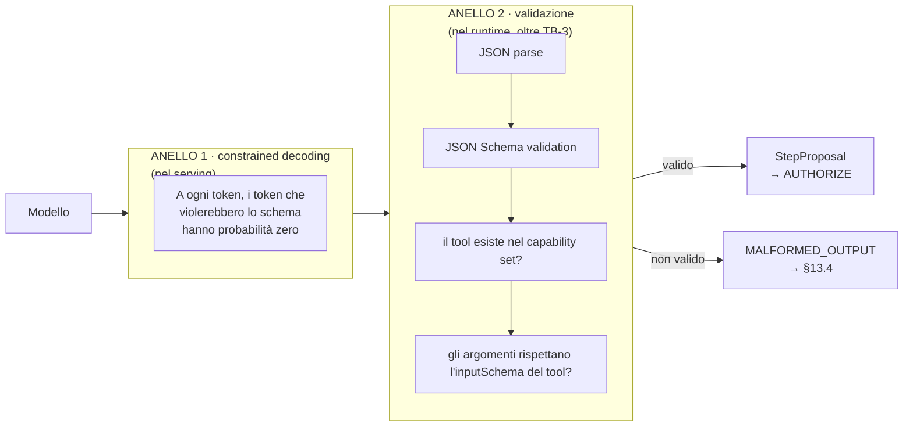

### Come leggerlo

L'anello 1 sta **sotto** il `Trust Boundary` `TB-3`; l'anello 2 sta **sopra**.

L'anello 1 è potente: agisce durante la generazione, quindi un JSON strutturalmente sbagliato
diventa quasi impossibile. **FATTO** (R-06): vLLM supporta guided decoding con enforcement di
JSON Schema.

L'anello 2 sembra ridondante e non lo è, per quattro ragioni:

| Ragione | Spiegazione |
|---|---|
| **il serving è codice di terzi** | un bug, un upgrade, un parser diverso, e l'enforcement salta. `AR-009` dice che l'output è non fidato: "non fidato" include "non fidato anche quando qualcun altro dice di averlo controllato" |
| **il profilo può cambiare** | llama.cpp potrebbe non avere lo stesso enforcement (`B-18`). Il runtime deve comportarsi allo stesso modo con entrambi |
| **lo schema JSON non copre la semantica** | `{"tool": "delete_all_customers"}` è JSON perfettamente valido. Solo l'anello 2 sa che quel tool non è nel capability set di **questo** run (`ADR-008`) |
| **la validazione è evidenza** | il risultato della validazione va nel journal. Se avviene solo dentro il serving, non lascia traccia auditabile |

> **`AR-MD-03`.** L'output del modello è validato contro uno schema **dal runtime**, sempre,
> anche quando il serving dichiara constrained decoding attivo.

### 13.3 Il costo dell'anello 1

Il constrained decoding non è gratis: costringe il motore a calcolare, a ogni passo, quali
token sono ammessi. `RICHIEDE RICERCA` — `B-16`: qual è l'impatto reale su throughput e `TTFT`.

`INFERENZA`: se il costo si rivelasse alto, l'anello 1 diventerebbe **opzionale per
capability**, mentre l'anello 2 resterebbe obbligatorio per sempre. Questa è precisamente la
ragione per cui i due anelli sono indipendenti: si può spegnere il primo senza toccare
l'architettura.

### 13.4 Cosa succede quando fallisce

Una tassonomia, perché i quattro modi di sbagliare hanno risposte diverse.

| Modo di fallire | Rilevato da | Risposta | Conta come |
|---|---|---|---|
| **JSON non parsabile / troncato** | anello 2, `V1` | retry con la stessa richiesta, max **2 volte**, poi `MALFORMED_OUTPUT` terminale sul passo | errore tecnico → metrica `malformed_rate` |
| **JSON valido, schema violato** | anello 2, `V2` | retry con l'errore di schema **aggiunto al context** come osservazione (`AR-RT-15`) | errore tecnico, ma recuperabile spesso al primo retry |
| **tool inesistente** (allucinazione) | anello 2, `V3` | **non è un errore di sistema**: è un'osservazione. Torna al modello *"il tool `find_clients` non esiste; i tool disponibili sono …"* | metrica `hallucinated_tool_rate` → alimenta `T-10` (QLoRA) |
| **argomenti semanticamente sbagliati** (tipo corretto, valore assurdo) | **non rilevabile qui** | passa ad `AUTHORIZE`; è il `PDP` e poi il tool a rifiutarlo | è il limite dichiarato di questa difesa |

### La riga più importante della tabella

La terza. `AR-MD-04`:

> **Un tool name prodotto dal modello che non esiste nel capability set del run non è un errore
> di sistema: è un'osservazione.**

Perché conta: se allucinare un tool facesse fallire il run, un modello 9B renderebbe la
piattaforma inutilizzabile — è il rischio `R-03` di `A01`. Restituendo al modello l'elenco dei
tool disponibili, l'errore si autocorregge nella maggior parte dei casi, e **il tasso di
allucinazione diventa una metrica di qualità del modello** invece che una causa di guasto.

È lo stesso principio di `AR-RT-15` (*gli errori `BUSINESS` tornano al modello come
osservazioni*), applicato al confine del modello.

### 13.5 Il budget dei retry

Un retry di inference costa GPU e token. Senza limite, un modello che sbaglia sistematicamente
brucia l'intero budget del run in tentativi.

| Limite | Valore Day-1 | Deriva da |
|---|---|---|
| retry per `MALFORMED_OUTPUT` sullo stesso passo | **2** | `ASSUNZIONE`, da tarare con `malformed_rate` reale |
| ogni retry consuma il budget di model call del run | sempre | `AR-028` |
| dopo l'ultimo retry | il passo fallisce, il run va in `FAILED` con causa leggibile | `AR-RT-07` |

**Nota importante sul retry:** un retry di inference è **sempre sicuro** perché la chiamata al
modello non ha side effect. Questa è l'unica categoria di retry veramente gratuita
dell'architettura — e va sfruttata, non evitata. → §21.

### 13.6 Tool calling: il confine

Il prompt propone questa catena e chiede di validarla:

```text
Model → structured tool call → Agent Runtime → Governance → Tool Runtime
```

> **La catena è corretta e la confermo senza modifiche.** È già l'impianto di `AR-RT-01`
> (*fra `DECIDE` e `EXECUTE` c'è sempre `AUTHORIZE`, applicato dai tipi*) e di `INV-01`
> (*nessun tool con side effect senza decisione del `PDP` registrata*).

L'unico rafforzamento che aggiungo è sui **tipi**, perché è ciò che rende la regola
inaggirabile invece che raccomandata:

```text
RawToolCall        ciò che esce dal modello. Nessuno può eseguirlo: non c'è un metodo che
                   lo accetti
       ↓ validazione strutturale (anello 2)
StepProposal       proposta validata nella forma. Ancora non eseguibile
       ↓ PEP → PDP.decide()
AuthorizedStep     l'UNICO tipo che ToolRuntime.invoke() accetta
```

Se qualcuno volesse eseguire un tool saltando l'autorizzazione, dovrebbe **costruire a mano un
`AuthorizedStep`**, che è un atto deliberato e visibile in code review — non una dimenticanza.

Il fatto che alcuni serving runtime offrano l'esecuzione automatica dei tool è irrilevante per
noi: quella funzione **non viene usata**, perché salterebbe `AUTHORIZE`. Il serving restituisce
la proposta; l'esecuzione è nostra. → è una configurazione da verificare esplicitamente al
setup del profilo.

---

## 14. Il prompt come artefatto versionato

### 14.1 Perché è una sezione e non una nota

Perché il prompt è **la parte del sistema che cambia più spesso e che è meno controllata**.

In quasi tutti i progetti LLM il prompt vive come stringa in un file `.py`. Le conseguenze si
vedono al primo incidente: *"perché l'agent ha fatto quella cosa il 14 marzo?"* — e la risposta
richiede di ritrovare il commit di quel giorno, sperando che il deploy corrispondesse.

E c'è una conseguenza peggiore, meno ovvia: **se il prompt vive nel codice, il lock-in sul
modello vive nel codice**. Un prompt scritto per Qwen contiene, senza che nessuno lo abbia
deciso, i tag di formattazione di Qwen, il suo stile di tool calling, il suo modo di gestire il
reasoning. Cambiare modello diventa un refactoring diffuso invece di una modifica di
configurazione. È il rischio `R-05` di `A01`.

### 14.2 Dove vive già il prompt (e perché non serve un Prompt Registry)

`A02` ha già deciso: il prompt è un campo di **`AgentVersion`**, che è **immutabile**. E `A02`
ha esplicitamente **respinto** un `Prompt Registry` separato come *registry explosion*.

Applico `AR-CP-02`: un `Prompt` avrebbe lifecycle proprio? No — nasce e muore con la versione
dell'agent. Owner proprio? No. È riferito da qualcosa? Solo dall'`AgentVersion`.

> **DECISIONE ARCHITETTURALE.** Nessun `Prompt Registry`. Il prompt dell'agent è un campo di
> `AgentVersion`, e la sua immutabilità è già garantita.
>
> **Confermo `A02` e non introduco risorse nuove.** Questo documento aggiunge però una cosa che
> `A02` non poteva vedere: il prompt dell'agent **non è tutto il prompt**.

### 14.3 La scoperta: tre sorgenti, tre lifecycle

Il testo che il modello riceve davvero non viene da un posto solo. Viene da tre, e hanno
frequenze di cambiamento e owner completamente diversi.

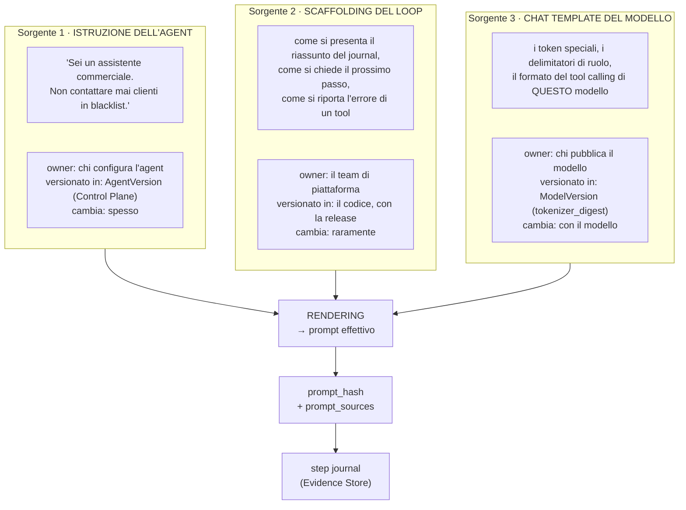

### Come leggerlo

Tre scatole, tre owner diversi, tre velocità diverse — e un solo punto in cui si fondono.

La scatola 3 è quella che tutti dimenticano ed è la causa tecnica del lock-in. Se lo scaffolding
(scatola 2) contiene i token speciali di Qwen, allora la scatola 3 è **entrata dentro** la
scatola 2, e cambiare modello significa riscrivere il codice del runtime.

> **La regola che tiene separate le scatole:** lo scaffolding parla in termini di `messages` con
> `role` e di `tools` con JSON Schema — cioè nel vocabolario **dell'API OpenAI-compatible**, che
> è comune a tutti i modelli. La traduzione nei token speciali del modello concreto avviene
> **dentro il serving**, non nel nostro codice.

Questo è il vero motivo per cui `ADR-005` sceglie un'API OpenAI-compatible: non perché sia
elegante, ma perché **è il confine dove il formato specifico del modello smette di essere un
problema nostro**.

### 14.4 Decisione (`ADR-041`)

## Decisione

Il prompt effettivo è il **rendering di tre sorgenti versionate separatamente**. Ogni chiamata
al modello registra nel journal:

| Campo | Cosa contiene | A cosa serve |
|---|---|---|
| `prompt_hash` | hash del testo **reso**, quello davvero inviato | verificare che due esecuzioni abbiano visto lo stesso testo |
| `agent_version_id` | la sorgente 1 | risalire all'istruzione di business |
| `scaffolding_version` | la sorgente 2 (versione del codice/template del runtime) | risalire a come il loop parlava al modello |
| `tokenizer_digest` | la sorgente 3, dalla `ModelVersion` | risalire al formato del modello |

`AR-MD-05`: **nessuna stringa di prompt vive nel codice come letterale sparso.** Lo scaffolding
vive in file di template versionati, caricati all'avvio e hashati.

## Perché registrare sia l'hash sia le tre sorgenti

L'hash da solo dice *"il testo era questo"* ma non permette di ricostruirlo. Le tre sorgenti da
sole permettono di ricostruirlo ma non provano che il rendering sia stato quello. Insieme
chiudono il cerchio: si ricostruisce e si verifica.

## Alternative considerate

| Alternativa | Perché perde |
|---|---|
| **salvare il prompt reso per intero nel journal** | è la soluzione più semplice e la più costosa: prompt da decine di migliaia di token × ogni step × ogni run = il database esplode. Diventa possibile solo con retention breve o storage separato. **Registrata come opzione per il debug**: attivabile per singolo agent in ambiente di test |
| **hash del solo prompt dell'agent** | non rileva un cambio di scaffolding, che è esattamente il tipo di cambiamento che modifica il comportamento senza che nessuno tocchi la configurazione |
| **Prompt Registry come risorsa** | respinto da `A02`, e il test `AR-CP-02` conferma |

## Trade-off

Guadagniamo la capacità di spiegare qualsiasi comportamento passato e di misurare il lock-in
(§25). Perdiamo la comodità di scrivere un prompt direttamente nel codice — il che, francamente,
è un beneficio travestito da costo.

---

## 15. Riproducibilità: cosa possiamo davvero promettere

### 15.1 La promessa che non si può mantenere

C'è una richiesta ricorrente che suona ragionevole: *"lo stesso input deve produrre lo stesso
output"*.

Con un LLM servito in continuous batching **questo non è ottenibile**, e prometterlo produrrebbe
un requisito che fallisce in produzione.

Le ragioni, in ordine di importanza:

| Ragione | Spiegazione |
|---|---|
| **il batching cambia l'aritmetica** | le operazioni in virgola mobile su GPU non sono associative. Se la tua richiesta viene batchata con altre due invece che con altre cinque, l'ordine delle riduzioni cambia, e a volte cambia l'ultimo bit. Un bit diverso nelle probabilità può cambiare il token scelto |
| **il seed non controlla tutto** | fissa il campionamento, non la numerica sottostante |
| **la versione del serving cambia** | un upgrade di vLLM può cambiare i kernel usati |
| **il modello può essere non deterministico per costruzione** | alcuni modelli usano MoE (Mixture of Experts, il routing a esperti) con selezione dipendente dal batch |

`DA VERIFICARE` — `B-17`: quanto è riproducibile in pratica un'inference con `seed` fissato e
`temperature=0` su vLLM con continuous batching attivo. Il risultato cambia quanto forte deve
essere l'avvertenza, non la decisione.

### 15.2 Decisione (`ADR-042`)

## Decisione

La piattaforma garantisce la **riproducibilità dell'evidenza**, non la riproducibilità
dell'output.

| Cosa garantiamo | Cosa NON garantiamo |
|---|---|
| sapere **esattamente** con quali pesi, quantizzazione, versione del serving, parametri e prompt è stata prodotta ogni risposta | che rieseguire produca gli stessi token |
| poter **rieseguire** una chiamata con la stessa configurazione | che il risultato sia identico |
| poter **confrontare** due esecuzioni e vedere cosa è cambiato nella configurazione | che una differenza di output implichi una differenza di configurazione |
| che una `ModelVersion` sia **immutabile** | — |

## Perché è la promessa giusta

Perché è quella che serve davvero. Le domande reali dell'audit non sono *"riesegui e dammi lo
stesso testo"*. Sono:

1. *"con quale modello è stata presa questa decisione?"* → `model_version_id` + `weights_digest`
2. *"il modello era cambiato rispetto alla settimana prima?"* → confronto di `model_version_id`
3. *"il prompt era cambiato?"* → `prompt_hash` + le tre sorgenti
4. *"quanto è costata?"* → `tokens_in`/`tokens_out`
5. *"perché si è fermata lì?"* → `finish_reason`

Tutte e cinque sono soddisfatte dall'identità di produzione di §12.3. Nessuna richiede
determinismo.

## Il campo minimo per la riproducibilità

Rispondo alla domanda del prompt (§44) in modo diretto — **cinque identificatori, non uno di
più**:

```text
1. model_version_id          → pesi, quantizzazione, artifact, capabilities
2. serving_runtime_version   → il motore effettivo (osservato, non configurato)
3. config_snapshot_id        → tutta la configurazione del run (ADR-012)
4. prompt_hash               → il testo esatto inviato
5. decoding_params_effective → seed, temperature, top_p applicati
```

`config_snapshot_id` da solo copre già `agent_version_id`, `tool_versions[]` e
`policy_bundle_version`: è il vantaggio di `ADR-012` che si paga qui.

## Conseguenza su `C29` (Replay)

**Va segnalata invece di lasciarla scoprire a `C29`.**

Il replay non potrà essere *"riesegui e confronta l'output"*. Dovrà essere una delle due:

| Forma di replay | Cosa fa | Fattibilità |
|---|---|---|
| **replay deterministico del journal** | ripercorre gli step registrati senza richiamare il modello: verifica che la logica di runtime, date le stesse osservazioni, produca le stesse transizioni | **fattibile e utile** — è il test del recovery di `A04` |
| **replay generativo** | richiama il modello con lo stesso prompt e confronta | **non deterministico**: utile come valutazione statistica su molti casi (`A17`), inutile come verifica puntuale |

Diventa il rischio `R-12` e un impatto dichiarato su `C29`.

---

## 16. Model capabilities: perché il runtime non deve indovinare

### 16.1 Il problema

Il runtime deve sapere alcune cose sul modello attivo per comportarsi correttamente:

- posso chiedergli structured output con JSON Schema, o devo chiedere JSON "per favore"?
- posso mandargli `tools` nella richiesta, o devo descriverli nel prompt?
- quanti token posso mandare?
- supporta lo streaming?

Se queste risposte sono `if model_id == "qwen..."` sparsi nel codice, il lock-in è tornato dalla
finestra dopo essere stato cacciato dalla porta.

### 16.2 Decisione

`ModelCapabilities` è un **campo dichiarativo della `ModelVersion`**, congelato nel
`ConfigSnapshot` e leggibile dal runtime.

```python
@dataclass(frozen=True)
class ModelCapabilities:
    max_model_len: int                  # decisione di capacità, §7.6
    max_output_tokens: int
    supports_tools: bool                # tool calling nativo via campo `tools`
    supports_json_schema: bool          # constrained decoding su schema
    supports_streaming: bool
    supports_seed: bool
    tool_call_style: str                # identificatore del parser lato serving
    modalities: list[str]               # ["text"] Day-1
```

### 16.3 Come si popola, e la trappola

**La trappola:** copiarle dalla scheda tecnica del modello. La scheda tecnica descrive il
*modello*; noi serviamo una *combinazione* di modello + quantizzazione + serving runtime +
versione. Ed è la combinazione che ha capability, non il modello.

**FATTO** (R-06): la documentazione vLLM avverte esattamente di questo — che un modello
"supportato" non garantisce che ogni modalità di serving funzioni.

> **DECISIONE ARCHITETTURALE.** Le `capabilities` sono **verificate, non dichiarate**. La
> creazione di una `ModelVersion` include un **capability probe**: una serie di chiamate reali
> che verificano ciascuna capability contro il serving attivo, e il risultato popola il campo.
> Una capability che il probe non conferma è `false`, anche se la documentazione dice il
> contrario.

Il probe è codice piccolo (una decina di chiamate) e ha un valore sproporzionato: **è il test
che intercetta la rottura descritta in `R-13`** prima che arrivi in produzione. Diventa parte
della validazione della `ModelVersion` (§19) e del gate di `A16`/`A17`.

### 16.4 Cosa fa il runtime quando una capability manca

| Capability assente | Comportamento del runtime |
|---|---|
| `supports_json_schema = false` | usa solo l'anello 2 (validazione) e alza il budget di retry. La qualità cala, il sistema funziona |
| `supports_tools = false` | i tool vengono descritti nel prompt di scaffolding e la risposta si parsa dall'anello 2. **Meno affidabile**, dichiaratamente |
| `supports_streaming = false` | `stream()` solleva `CAPABILITY_UNSUPPORTED`; la UI mostra uno spinner invece dei token |
| `supports_seed = false` | il campo `seed` viene registrato come non applicato (§12.4) |

Nessuna di queste rompe il runtime. È questo che rende il contratto un'astrazione vera invece di
una promessa.

---

## 17. Model Registry: cosa sta nel Control Plane e cosa no

Il criterio, ereditato da `A02`: nel Control Plane sta ciò che **si decide**; fuori sta ciò che
**si osserva**.

| Metadato | Dove vive | Perché |
|---|---|---|
| `model_key`, descrizione | **Control Plane** (`Model`) | identità logica, si decide |
| `served_model_name`, `endpoint` | **Control Plane** (`ModelVersion`) | configurazione di connessione |
| `artifact_uri`, `weights_digest`, `tokenizer_digest` | **Control Plane** (`ModelVersion`) | è ciò che rende la versione verificabile |
| `quantization`, `format`, `serving_profile` | **Control Plane** (`ModelVersion`) | si decide |
| `max_model_len`, `decoding_params` di default | **Control Plane** (`ModelVersion`) | decisione di capacità, §7.6 |
| `capabilities` | **Control Plane** (`ModelVersion`), ma **popolate dal probe** | si decide di registrarle, si osserva il valore |
| `license_id`, vincoli di deployment | **Control Plane** (`ModelVersion`) | §18.4 |
| `parameter_count`, `architecture` | **Control Plane**, informativi | utili all'operatore, non usati dal codice |
| `serving_runtime_version` effettiva | **NON nel Control Plane** — viaggia nella risposta | è osservata, e cambia senza che nessuno lo decida |
| GPU utilization, `KV cache` usage, coda | **NON nel Control Plane** — è `A12` | è telemetria |
| stato di salute del processo di inference | **NON nel Control Plane** — è `A12` | `A02` §14.2 ha già eliminato `Worker` per questa ragione |
| pesi del modello (i byte) | **NON nel Control Plane** — è un volume | il Control Plane porta il digest, non il contenuto |

### La riga che risponde alla domanda §29 del prompt

*"Il Control Plane dovrebbe conoscere i dettagli degli `InferenceWorker` (id, hardware,
capacità, salute, carico, stato)?"*

**No.** E la ragione è la stessa che `A02` ha già usato per eliminare la risorsa `Worker`:
**nessuno assegna lavoro a un worker di inference**. Il worker applicativo apre una connessione
HTTP a un endpoint; chi c'è dietro è un dettaglio di rete.

Quando ci saranno più processi di inference, davanti ci sarà un reverse proxy o il router del
`production-stack` vLLM (FATTO, R-06) — cioè **infrastruttura**, configurata in `A15`, non
risorse del Control Plane. La domanda *"quali processi di inference sono vivi?"* resta una
domanda di observability.

### Chi controlla quali parametri di decoding

Il prompt (§13) chiede di separare capability del modello da parametri di richiesta, e di dire
chi controlla cosa. Tabella diretta:

| Parametro | Livello di controllo | Chi può restringere |
|---|---|---|
| `max_model_len` | **piattaforma** (`ModelVersion`) | nessuno può alzarlo |
| `max_output_tokens` | default sulla `ModelVersion`, restringibile per agent | agent, runtime |
| `temperature`, `top_p` | default sulla `ModelVersion`, restringibile per `AgentVersion` | agent |
| `seed` | runtime (per step) | — |
| `stop` | scaffolding + agent | — |
| budget di token per run | **policy** (`AR-028`, obbligazione del `PDP`) | tenant, policy |
| `tools` disponibili | **capability set congelato** (`ADR-008`) | può solo restringersi |
| `response_format` | runtime (dipende dal passo) | — |

Il principio, coerente con `ADR-025` (*precedenza a imbuto*): **ogni livello può solo
restringere**. Un `AgentVersion` non può alzare `max_model_len` né chiedere più token di quanti
la policy consenta.

---

## 18. Artifact, supply chain e sicurezza del modello

### 18.1 Perché è un problema serio e non teorico

Un file di pesi è **codice eseguibile mascherato da dati**. Alcuni formati storici
dell'ecosistema Python (i checkpoint basati su `pickle`) permettono l'esecuzione di codice
arbitrario al caricamento. E i pesi si scaricano tipicamente da repository pubblici.

Concretamente: se qualcuno pubblica un checkpoint chiamato `Qwen3.5-9B-AWQ` e noi lo scarichiamo
al primo avvio, abbiamo eseguito codice di uno sconosciuto **sulla macchina che ha accesso al
database del CRM**.

**FATTO** (`research-log` R-07, NIST/NCCoE): la pratica raccomandata è trattare ogni agent come
identità non-umana distinta con owner definito, tipo di credenziale documentato e scope
autorizzato. Il principio si estende naturalmente agli artifact: **un artifact senza provenance
dichiarata non è deployabile**.

### 18.2 Il confine di sicurezza

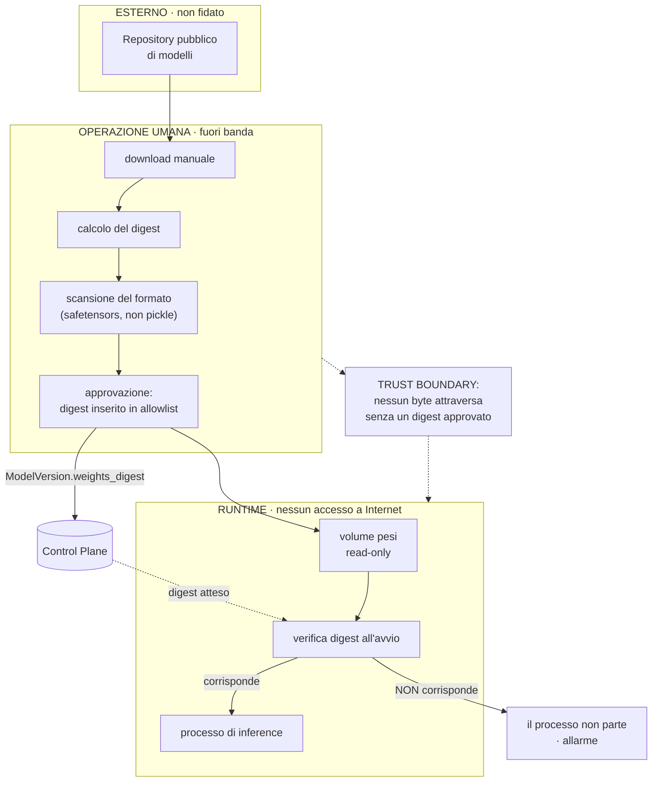

### Come leggerlo

Tre zone e un principio: **nessun byte di pesi entra nella zona di runtime senza essere passato
da una decisione umana registrata**.

La zona centrale è deliberatamente **fuori banda**: non è automatizzata Day-1. Con un modello e
tre persone, l'automazione della supply chain dei modelli è complessità senza beneficio. Ciò che
serve è che il *risultato* dell'operazione umana sia registrato: un digest nell'allowlist.

La zona di runtime ha una proprietà che vale la pena isolare: **non ha accesso a Internet**. Il
processo di inference non scarica nulla. Se il digest atteso non corrisponde, non parte — non
scarica la versione giusta.

### 18.3 Decisione (`ADR-046`)

## Decisione

`AR-MD-08`: **nessun artifact viene caricato se il suo digest non corrisponde a quello dichiarato
nella `ModelVersion`.** Il processo di inference non ha accesso a Internet e non scarica pesi a
runtime.

Day-1, in concreto:

| Controllo | Implementazione Day-1 | Costo |
|---|---|---|
| integrità | `sha256` del file dei pesi confrontato con `weights_digest` all'avvio | banale |
| formato sicuro | si accettano solo formati che non eseguono codice al caricamento (`safetensors`, `GGUF`) | vincolo di policy, verificato all'ingresso |
| provenance | campo testuale sulla `ModelVersion`: da dove viene, chi ha approvato, quando | una riga |
| allowlist | l'insieme delle `ModelVersion` registrate **è** l'allowlist | zero codice nuovo |
| quarantena | una `ModelVersion` può essere disattivata; i binding che la usano falliscono la `resolve()` | riusa `AR-CP-03` |
| assenza di rete | configurazione del container | zero codice |

## Cosa NON facciamo Day-1, e perché

| Controllo | Perché non ora | Quando |
|---|---|---|
| **firma crittografica degli artifact** (sigstore / model signing) | l'ecosistema è in movimento e non abbiamo verificato lo stato pratico. `RICHIEDE RICERCA`, `B-19` | quando la ricerca dice che è praticabile, oppure al primo requisito contrattuale |
| **scansione automatica dei modelli** | strumenti immaturi, e il volume è di un modello ogni tanto | con un parco modelli reale |
| **SBOM del modello** | è `A16` (supply chain), non qui | `A16` |

## Trade-off

Guadagniamo che un artifact sostituito o corrotto **non parte** invece di servire silenziosamente
pesi diversi. Perdiamo l'automazione: aggiungere un modello richiede un'operazione umana
deliberata. Con un modello ogni pochi mesi, è il compromesso giusto — e diventa sbagliato al
primo parco modelli, che è `T-MD-04`.

### 18.4 Licenza

Il prompt chiede di rappresentare la licenza **senza trarre conclusioni legali**. Giusto: non
siamo il posto dove si decide se una licenza è compatibile.

Il meccanismo tecnico:

| Campo su `ModelVersion` | Contenuto |
|---|---|
| `license_id` | identificatore della licenza (es. `apache-2.0`), testo non interpretato |
| `license_uri` | dove sta il testo |
| `deployment_constraints` | vincoli dichiarati dall'operatore, in forma di dato: `on_prem_allowed`, `saas_allowed`, `commercial_use_declared`, `attribution_required` |

`deployment_constraints` è **un input per le policy**, non una decisione automatica: il `PDP` può
avere una regola *"in un deployment SaaS, solo `ModelVersion` con `saas_allowed = true`"*. Chi
mette `true` in quel campo si assume la responsabilità; il sistema si limita a farlo rispettare.

Questo è coerente con `ADR-004` (le Policy sono dato) e non richiede nessun meccanismo nuovo.

---

## 19. Il lifecycle del modello

### 19.1 La state machine proposta, e quella che serve

Il prompt propone nove stati: `REGISTER → VALIDATE → DOWNLOAD/LOAD → WARM → READY → SERVING →
DRAINING → UNLOADING → RETIRED`.

Applico la stessa disciplina che `A02` ha applicato agli stati delle risorse: **uno stato esiste
solo se qualcuno lo osserva e qualcuno decide in base ad esso**.

| Stato proposto | Verdetto | Motivo |
|---|---|---|
| `REGISTER` | **sì**, ma è la creazione della `ModelVersion` | non è uno stato del serving: è una riga del Control Plane |
| `VALIDATE` | **sì, ed è importante** | digest + capability probe (§16.3). È il gate che intercetta `R-13` |
| `DOWNLOAD` | **no** | `AR-MD-08`: non si scarica a runtime. È un'operazione fuori banda |
| `LOAD` | **sì**, ma è interno al processo di inference | dura decine di secondi; il runtime lo vede come "non pronto" |
| `WARM` | **sì**, e vale la pena tenerlo distinto | il primo prompt è molto più lento (compilazione dei kernel, CUDA graphs) |
| `READY` | **fuso con `SERVING`** | non c'è differenza osservabile: se è pronto, serve |
| `DRAINING` | **sì**, ma solo con più di un processo di inference | con uno solo, drenare significa fermarsi. È **Fase 2** |
| `UNLOADING` | **no come stato** | è la terminazione del processo |
| `RETIRED` | **sì**, ma è uno stato della `ModelVersion` nel Control Plane | non del processo |

### 19.2 Le due state machine distinte

La confusione nasce dal mescolare due cose diverse. Le separo.

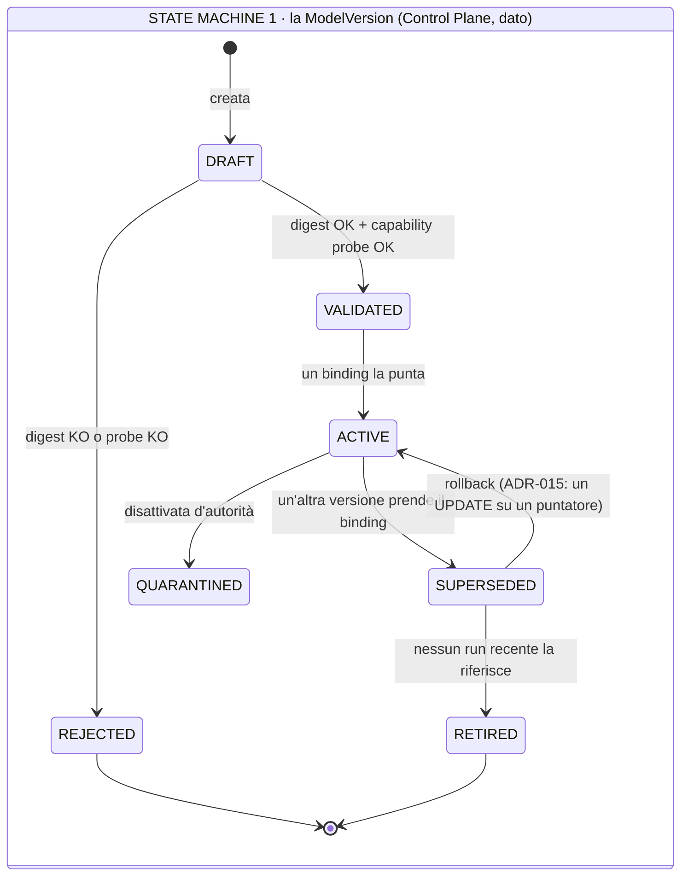

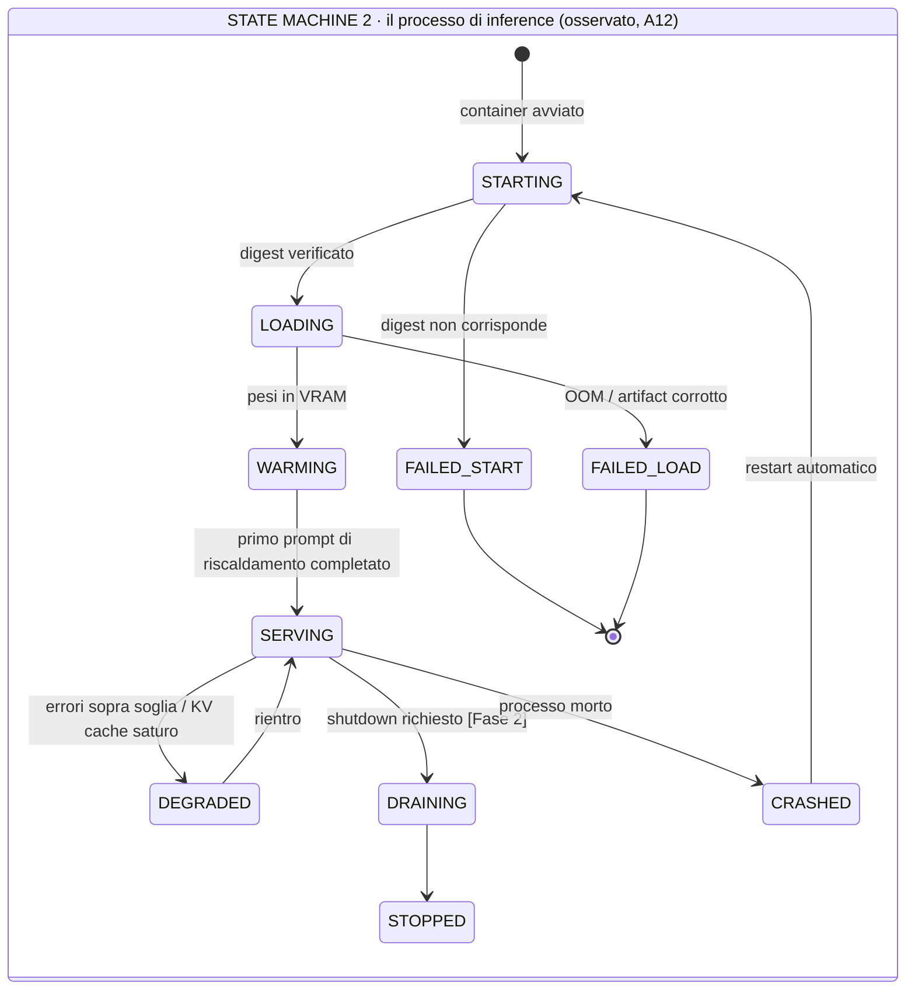

### Come leggerle

**Due macchine, due owner, due velocità.**

La prima è **dato**: vive nel Control Plane, cambia quando un umano decide, ed è auditata. Il
suo stato più interessante è `SUPERSEDED → ACTIVE`: è il rollback, ed è un `UPDATE` su un
puntatore (`ADR-015`). Non c'è nulla da migrare.

La seconda è **fatto osservato**: vive nella telemetria, cambia da sola, e nessuno la
persiste come configurazione. Il suo stato più interessante è `CRASHED → STARTING`: il
riavvio è automatico (restart policy del container) e il runtime lo vive come una serie di
`MODEL_UNAVAILABLE` retryable.

Mescolarle sarebbe l'errore che `A02` chiama riconciliazione: un controller che confronta lo
stato desiderato con quello osservato e agisce. `ADR-013` l'ha già rifiutato, e qui non serve
nemmeno: se il processo muore, lo riavvia Docker; se i pesi sono sbagliati, non parte.

### 19.3 Cold start e warm start

| Situazione | Cosa succede | Impatto |
|---|---|---|
| **cold start** (riavvio della macchina) | lettura dei pesi da disco + allocazione VRAM + compilazione | decine di secondi, `DA MISURARE` (§27) |
| **warm start** (restart del container, pesi in page cache) | più rapido | `DA MISURARE` |
| **primo prompt** dopo `LOADING` | compilazione dei kernel, CUDA graphs | il prompt di riscaldamento serve a **non far pagare questo costo al primo utente reale** |
| **model swapping** | `NON PREVISTO Day-1`: un modello, un processo | con più modelli si valuterà se caricare/scaricare (lento) o tenere processi separati (memoria) |

Il prompt di riscaldamento non è un dettaglio: senza, il primo run dopo ogni deploy ha una
latenza anomala che inquina le metriche e confonde chi le guarda.

---

## 20. Timeout: quattro livelli, nessun numero inventato

### 20.1 I livelli

```text
budget di tempo del RUN            (AR-028, obbligazione del PDP)
  └── deadline della CHIAMATA      (ModelRequest.deadline)
        ├── timeout di CONNESSIONE     il server risponde?
        ├── timeout di PRIMO TOKEN     il server sta generando o è in coda?
        └── timeout di GENERAZIONE     ha finito?
```

### 20.2 La regola che li tiene coerenti

`AR-MD-12`:

> **Il timeout della chiamata al modello è sempre minore del budget di tempo residuo del run.**

Sembra ovvio; non lo è. Il caso che rompe: un run con 60 secondi di budget residuo che fa una
chiamata con timeout di 120 secondi. Risultato: il budget del run scade **mentre** la chiamata
è in corso, e nessuno se ne accorge finché la chiamata non torna. Il run ha sforato il budget
di un minuto, e il messaggio di `AR-RT-07` (*cosa è già stato fatto*) arriva in ritardo.

La deadline si passa come **istante assoluto**, non come durata, proprio per rendere questo
calcolo impossibile da sbagliare in catena.

### 20.3 I valori

`NON ANCORA DECISO`, deliberatamente. Il prompt lo chiede esplicitamente: *non inventare SLA
numerici senza evidenza*.

Ciò che è deciso è **come si ricavano**:

| Timeout | Come si ricava | Da misurare in |
|---|---|---|
| connessione | fisso e piccolo: è una connessione su loopback | — |
| primo token | p99 del `TTFT` misurato sotto carico target × un fattore di sicurezza | §27 |
| generazione | (`max_output_tokens` ÷ token/s p99 misurato) × fattore | §27 |
| budget del run | decisione di prodotto, non di infrastruttura | `A03`, policy |

**FATTO** (R-06): vLLM espone già `TTFT` e tempo per token di output come metriche Prometheus.
Non serve strumentare nulla di nuovo per ricavare questi numeri: servono solo dati sotto carico
reale.

### 20.4 Cancellazione

La catena richiesta dal prompt, e come funziona davvero:

```text
utente annulla  →  Agent Runtime (AR-RT-06: cooperativa, ai confini di passo)
                →  ModelProvider (CancelToken)
                →  chiusura della connessione HTTP
                →  il serving abortisce la generazione e libera il KV cache
```

Il punto che vale la pena capire: **la cancellazione di un'inference è l'unica cancellazione
gratuita del sistema**, perché non c'è nulla da compensare (`AR-RT-13` non si applica: nessun
side effect). Chiudere la connessione libera immediatamente slot di `KV cache` per le altre
richieste.

`DA VERIFICARE`: che il serving liberi effettivamente le risorse alla disconnessione del client
e non continui a generare a vuoto. È una verifica di dieci minuti e va nel piano di §27.

I cinque motivi di cancellazione (`utente`, `timeout`, `budget esaurito`, `policy`, `shutdown`)
hanno tutti lo stesso meccanismo. Cambia solo cosa si registra nel journal.

---

## 21. Retry: quali sono sicuri, e perché qui è più facile che altrove

### 21.1 Il fatto che semplifica tutto

> **Una chiamata al modello non ha side effect.**

Questa singola proprietà rende il retry di inference qualitativamente diverso dal retry di un
tool. Non serve `idempotency_key`, non esiste `UNCERTAIN`, non serve compensazione. Se una
chiamata fallisce, la si rifà.

### 21.2 La tassonomia

| Fallimento | Sicuro? | Strategia | Nota |
|---|---|---|---|
| `MODEL_UNAVAILABLE` | **sicuro** | backoff esponenziale, poi run in `RETRYABLE` | il server sta riavviando |
| `MODEL_OVERLOADED` | **sicuro** | backoff | segnale di capacità → `T-MD-02` |
| rete/connessione | **sicuro** | retry immediato, poi backoff | su loopback è quasi sempre il server che riparte |
| `MODEL_TIMEOUT` | **sicuro, con cautela** | §21.3 | |
| `MALFORMED_OUTPUT` | **sicuro** | max 2, con l'errore aggiunto al context | §13.4 |
| `MODEL_INTERNAL` (CUDA/OOM lato server) | **sicuro una volta** | se si ripete: non è transitorio, è capacità | §22.2 |
| `CONTEXT_TOO_LARGE` | **inutile** | rifare produce lo stesso errore | è un bug del context builder |
| `MODEL_REFUSAL` | **inutile e dannoso** | rifare la stessa richiesta produce lo stesso rifiuto e brucia budget | §22.3 |
| `CAPABILITY_UNSUPPORTED` | **inutile** | è configurazione | — |

### 21.3 Il caso che merita attenzione: il timeout

Un timeout dice *"non ho ricevuto la risposta"*, non *"il modello non ha generato"*. Il server
potrebbe aver completato la generazione un istante dopo la scadenza.

Per un tool questo sarebbe `UNCERTAIN` (`AR-027`). Per il modello **non lo è**, perché una
generazione non consegnata non ha cambiato nulla nel mondo. L'unica conseguenza è che **abbiamo
pagato GPU per token che non useremo** — un costo, non un rischio di correttezza.

Va però registrato: il journal segna il tentativo scaduto con i token consumati se il serving li
riporta, altrimenti con `tokens_unknown = true`. Onestà nella contabilità.

### 21.4 Il vincolo che protegge dai doppioni

`AR-MD-06`:

> **Nessun retry di una chiamata al modello che ha già prodotto un side effect a valle. Il
> retry è consentito solo prima di `AUTHORIZE`.**

Il caso che la regola impedisce: il modello propone `send_email`, il tool la manda, il passo
fallisce **dopo** per un motivo qualsiasi, e un retry ingenuo richiama il modello, che ripropone
`send_email`. Due email.

La regola è già garantita strutturalmente da `A04` (`AR-RT-05`: il retry riusa lo stesso
`step_index`, quindi la stessa `idempotency_key`), ma la esplicito qui perché è **il posto dove
un'implementazione distratta la romperebbe**: mettendo il retry dentro il `ModelProvider` in
modo che riavvolga l'intero passo invece della sola chiamata.

> Il `ModelProvider` fa retry **della chiamata**, mai **del passo**. Il retry del passo è
> dell'`Agent Runtime`.

---

## 22. Failure mode: la tabella completa

### 22.1 Il diagramma del percorso di un fallimento

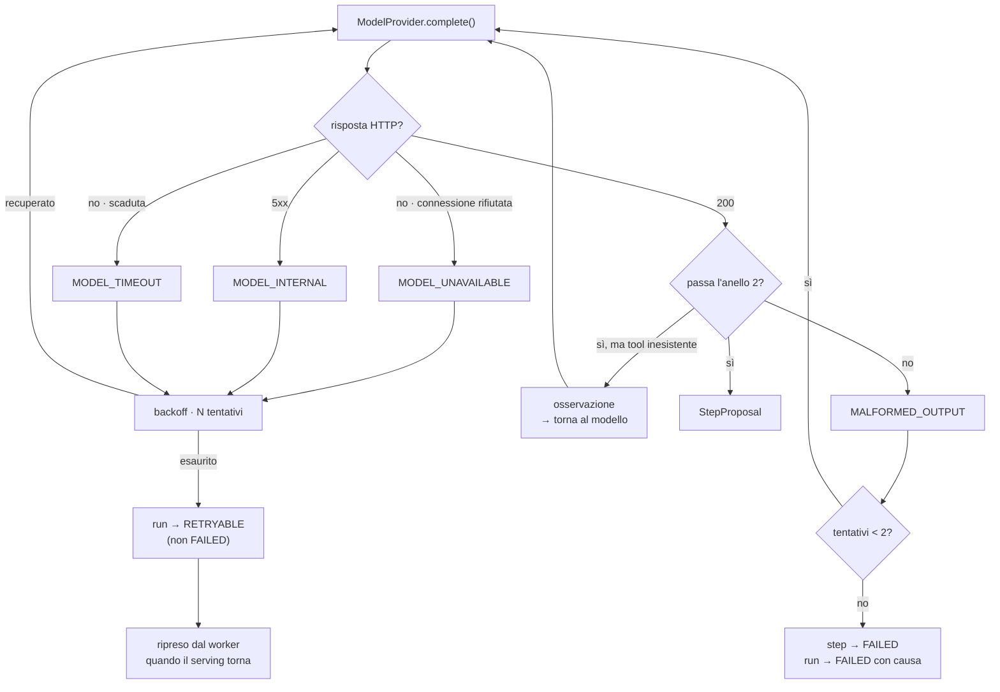

### Come leggerlo

Il percorso interessante è quello di sinistra, e finisce in `RETRYABLE` **non** in `FAILED`.

La distinzione è ereditata da `ADR-022` di `A03` (*guasto del `PDP` → azione negata ma run
retryable*) e applicata qui: **l'indisponibilità dell'infrastruttura non è un fallimento del
lavoro**. Se la GPU si riavvia, il run che stava lavorando non ha sbagliato niente: aspetta.

Il percorso di destra (`HALL`) è il ciclo di autocorrezione di §13.4: l'allucinazione di un tool
rientra nel loop invece di uscirne.

L'unico percorso che porta a `FAILED` per causa del modello è il centro: output malformato
ripetuto. Ed è giusto che sia l'unico, perché è l'unico che indica un problema reale di qualità
invece che di disponibilità.

### 22.2 La tabella

| Fallimento | Chi lo rileva | Retry | Fallback | Cosa vede l'utente | Cosa si registra | Escalation |
|---|---|---|---|---|---|---|
| **caricamento del modello fallito** | processo di inference | no | no | i run restano in coda | allarme di deployment | operatore: il container non parte |
| **digest non corrispondente** | verifica all'avvio (§18) | no | **mai** | come sopra | evento di sicurezza | **incidente di sicurezza**, non un bug |
| **crash del processo di inference** | Docker + healthcheck | restart automatico | no | latenza, poi ripresa | `MODEL_UNAVAILABLE` × N | se il restart si ripete: `T-MD-07` |
| **GPU OOM** | serving | sì una volta | no | come sopra | `MODEL_INTERNAL` + `KV cache` usage | se ripetuto: `max_model_len` o concorrenza sono troppo alti → `T-MD-02` |
| **errore CUDA / driver** | serving | sì una volta | no | come sopra | `MODEL_INTERNAL` | operatore: spesso richiede riavvio della macchina |
| **artifact corrotto** | verifica del digest | no | no | i run restano in coda | evento | operatore |
| **timeout** | `ModelProvider` | sì, §21.3 | no | attesa più lunga | tentativo con `tokens_unknown` | se il tasso sale: capacità |
| **output malformato** | anello 2 | sì × 2 | no | il run può fallire | `malformed_rate` | se il tasso sale: qualità del modello → `T-MD-03` |
| **tool allucinato** | anello 2 | ciclo di correzione | — | nulla | `hallucinated_tool_rate` | `T-10` (QLoRA) |
| **rifiuto del modello** | `finish_reason` / euristica | **no** | no | messaggio esplicito | `refusal_rate` | §22.3 |
| **serving saturo** | coda del serving | sì con backoff | no | attesa | profondità della coda | `T-MD-02` |
| **rete verso il serving** | `ModelProvider` | sì | no | attesa | — | su loopback è quasi sempre il serving |

### 22.3 Il rifiuto: il caso che le architetture dimenticano

Il modello può rifiutarsi. *"Non posso aiutarti con questa richiesta."* Non è un errore
tecnico: la risposta è arrivata, è ben formata, ed è inutile.

Tre trattamenti possibili, e perché ne scelgo uno:

| Trattamento | Verdetto |
|---|---|
| trattarlo come errore tecnico e ritentare | **sbagliato**: rifare la stessa richiesta produce lo stesso rifiuto e brucia budget |
| trattarlo come risposta valida e proseguire | **sbagliato**: il loop andrebbe avanti senza un passo, fino al rilevatore di loop di `A04` |
| **trattarlo come esito terminale del passo, con causa dichiarata** | **corretto** |

> **DECISIONE ARCHITETTURALE.** Un rifiuto del modello termina il passo con causa
> `MODEL_REFUSAL` e mette il run in uno stato che richiede intervento umano, con il testo del
> rifiuto visibile.

**Il motivo per cui non lo si nasconde:** un rifiuto è quasi sempre uno di due segnali utili —
o la richiesta dell'utente è davvero problematica (e l'umano deve vederla), oppure il prompt di
sistema è scritto male e induce il modello a credere che stia facendo qualcosa di vietato (e
allora è un bug di prompt engineering che va corretto). In entrambi i casi, silenziarlo perde
l'informazione.

`DA VERIFICARE`: come si rileva un rifiuto in modo affidabile. `finish_reason` potrebbe non
distinguerlo da una risposta normale. `INFERENZA`: con structured output attivo, un rifiuto si
manifesta spesso come `MALFORMED_OUTPUT` ripetuto — il che significa che i due casi vanno
distinti con cura per non confondere le metriche. Va nel piano di §27.

---

## 23. Batching, KV cache, prefix caching e priorità

### 23.1 Batching: cosa scegliamo e cosa non scegliamo

Tre modi di raggruppare le richieste:

| Modo | Come funziona | Verdetto |
|---|---|---|
| **static batching** | si aspetta di avere N richieste, poi si processano insieme; tutte finiscono quando finisce la più lunga | inadatto: latenza pessima per il primo arrivato |
| **dynamic batching** | si raggruppa ciò che è arrivato entro una finestra di tempo | meglio, ma soffre lo stesso problema di coda |
| **continuous batching** | le richieste entrano ed escono dal batch **mentre gira**: appena una finisce, il suo posto è preso da un'altra | **è quello che usiamo** |

> **DECISIONE ARCHITETTURALE.** Non scegliamo il batching: **lo eredita il serving**. vLLM fa
> continuous batching di suo (FATTO, `research/04` §9). Non c'è nulla da costruire e nulla da
> configurare in prima battuta.

Questa è la risposta corretta alla richiesta del prompt (*"non introdurre complessità di
batching se non ha beneficio Day-1"*): il beneficio c'è ed è grande, ma **il costo è zero
perché non è codice nostro**.

`INFERENZA` sul beneficio Day-1: anche con pochi utenti, un loop agentico genera più chiamate
concorrenti di quanto sembri — due worker × più run in parallelo × più passi. Il continuous
batching serve dal primo giorno, non dalla Fase 2.

### 23.2 Prefix caching: il risparmio più grande disponibile

**Il fatto strutturale del nostro carico:** in un loop agentico, ogni chiamata al modello ripete
quasi tutto il prompt precedente.

```text
chiamata 1:  [system + tool definitions + obiettivo]
chiamata 2:  [system + tool definitions + obiettivo] + osservazione 1
chiamata 3:  [system + tool definitions + obiettivo] + osservazione 1 + osservazione 2
```

La parte fra parentesi quadre è identica. Con le tool definition di un CRM (decine di schemi
JSON) può essere la maggior parte del prompt.

Il prefix caching riconosce il prefisso comune e **non lo ricalcola**: riusa il `KV cache` già
prodotto. **FATTO** (R-06, `research/04` §5): vLLM supporta prefix caching, e il
`production-stack` ha routing prefix-aware.

> **DECISIONE ARCHITETTURALE.** Il prefix caching si **abilita e si misura** Day-1. Non è un
> componente nuovo: è un'opzione del serving.
>
> **E ha una conseguenza sull'architettura del prompt che va dichiarata:** perché il prefisso
> sia riusabile, deve essere **stabile e in testa**. Un prompt che mette il timestamp corrente
> o l'`run_id` all'inizio distrugge il prefix caching senza che nessuno se ne accorga.

`AR-MD-15`: **le parti variabili del prompt vanno in coda, mai in testa.** L'ordine è: system →
tool definitions → istruzione dell'agent → context recuperato → storia → osservazione corrente.

Questa regola costa zero e vale, `INFERENZA`, una frazione importante del tempo di prefill.
Scoprirla dopo aver scritto lo scaffolding costerebbe un refactoring del prompt e
l'invalidazione di tutti i benchmark precedenti.

### 23.3 Priorità: due classi senza costruire uno scheduler

`R-02` di `A01`: *un task pesante satura la GPU e blocca le interazioni umane*. `AR-030`: ogni
run porta una `priority`.

Il problema concreto: un batch notturno che elabora 4.000 clienti e un utente che chiede una
cosa in chat competono per la stessa GPU. Senza intervento, l'utente aspetta.

Alternative:

| Alternativa | Verdetto |
|---|---|
| **scheduler di inference nostro davanti al serving** | viola `AR-019` e `AR-MD-11`: componente nuovo senza misura. E duplicherebbe lo scheduler del serving |
| **due processi di inference, uno per classe** | raddoppia la memoria dei pesi: impossibile su 20 GB |
| **priorità nella richiesta al serving** | `DA VERIFICARE` se il serving la supporta in modo utile (`B-12`) |
| **controllo a monte: limitare la concorrenza dei run background** | **scelto Day-1** |

> **DECISIONE ARCHITETTURALE (`ADR-047`).** La separazione fra interactive e background si fa
> **a monte, nel piano di esecuzione**, non nel piano di inference: i run `background` hanno un
> limite di concorrenza più basso, così lasciano sempre capacità libera per gli `interactive`.
>
> È una `WHERE` clause sulla query di prelievo della coda (`ADR-002`, `FOR UPDATE SKIP LOCKED`).
> Zero componenti nuovi.

**Trade-off dichiarato:** è una separazione **grossolana**. Non garantisce latenza
all'interactive: garantisce solo che il background non prenda tutti gli slot. Se non basta —
`T-MD-01` — la mossa successiva è la priorità nativa del serving, e solo dopo un secondo
processo di inference su una seconda GPU.

---

## 24. Il futuro: come ci si arriva senza costruirlo ora

Il principio che governa tutta questa sezione è `AR-019`/`AR-MD-11`: **nessun componente nuovo
senza una misura che dimostri il limite attuale**. Quindi qui non si progetta: si dichiara
*cosa* si costruirà, *quando*, e *cosa nel contratto di oggi lo rende possibile*.

### 24.1 La mappa dell'evoluzione

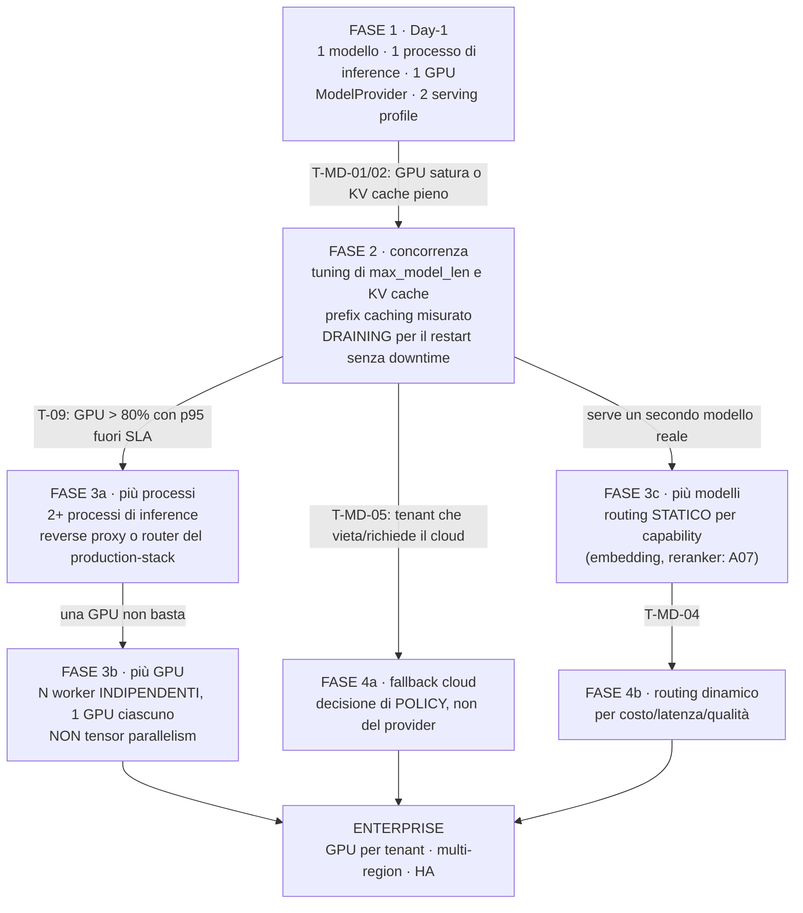

### Come leggerlo

Ogni freccia ha sopra una **condizione osservabile**, non una data. È il modo in cui questa
architettura evita di costruire il futuro: il futuro si costruisce quando una metrica lo
richiede.

La cosa da notare: **da Fase 1 non si passa direttamente a Fase 3**. Fase 2 è tuning e non
aggiunge componenti — ed è quasi sempre dove si trova il guadagno vero. Comprare una seconda GPU
prima di aver misurato l'effetto del prefix caching e di `max_model_len` è il modo più caro di
risolvere un problema di configurazione.

### 24.2 Multi-GPU: perché worker indipendenti e non tensor parallelism

Il prompt avverte giustamente di non assumere che multi-GPU significhi tensor parallelism.
Confronto:

| Strategia | Cosa fa | Quando serve davvero |
|---|---|---|
| **tensor parallelism** | spezza **un** modello su N GPU, che collaborano su ogni token | quando il modello **non ci sta** su una GPU sola |
| **pipeline parallelism** | spezza il modello per strati | stesso motivo, con topologie particolari |
| **worker indipendenti** | N copie complete del modello, una per GPU, richieste distribuite | quando il modello **ci sta**, e serve più throughput |

Il nostro modello a 4 bit occupa ~5,5 GB. **Ci sta ovunque.** Quindi:

> **DECISIONE ARCHITETTURALE (`ADR-045`).** La direzione multi-GPU è **N worker indipendenti**,
> non tensor parallelism. Tensor parallelism rientra in gioco **solo** se il modello attivo
> diventa troppo grande per una GPU (per esempio un 70B).

Perché conta dirlo ora anche se non lo si costruisce: il tensor parallelism impone vincoli
(GPU identiche, interconnessione veloce, un solo processo che le possiede) che condizionerebbero
l'acquisto dell'hardware. Sapere che non ci serve significa poter comprare **due macchine
economiche** invece di **una macchina con due GPU collegate bene**.

Vantaggio secondario, non banale: N worker indipendenti danno anche **fault isolation** e la
possibilità di fare upgrade progressivi (una replica alla volta). Il tensor parallelism no: un
guasto di una GPU ferma tutto.

### 24.3 Routing e fallback: due cose diverse che vanno tenute separate

**Routing** = scegliere il modello **prima** di chiamare, in base a qualcosa (capability, costo,
tenant, latenza).

**Fallback** = scegliere un altro modello **dopo** che il primo ha fallito.

Sembrano simili e hanno implicazioni opposte sull'audit.

#### Routing

`ADR-005` ha già deciso: nessun Model Router Day-1. Confermo, e aggiungo **quale forma avrà** la
prima volta che servirà:

> Il primo routing sarà **statico e per capability**, non dinamico e per costo. Cioè: *"per
> l'embedding usa il modello di embedding, per il ragionamento usa quello di ragionamento"*.
> È una `dict` con due chiavi, non un componente. → arriverà con `A07`, e questo documento lo
> anticipa perché `A07` ne avrà bisogno.

Il routing dinamico (costo, latenza, qualità) è Fase 4 e richiede dati che non abbiamo.

#### Fallback

## Decisione (`ADR-044`)

**Nessun fallback automatico e silenzioso fra modelli.** Se il modello primario fallisce, il run
va in `RETRYABLE` e aspetta. Il fallback, quando esisterà, sarà una **decisione di policy
esplicita**, valutata dal `PDP`, registrata nell'audit.

## Perché

Tre ragioni, in ordine di gravità:

| Ragione | Spiegazione |
|---|---|
| **l'audit diventa ambiguo** | *"quale modello ha preso questa decisione?"* diventa *"dipende da com'era la GPU quel giorno"*. La riproducibilità dell'evidenza (§15) sopravvive solo se la risposta porta l'identità reale — il che è garantito da `AR-MD-02`, ma il **comportamento** del sistema diventa non deterministico in un modo che l'utente non ha scelto |
| **la semantica non è compatibile** | due modelli diversi non producono lo stesso formato di tool call, non rispettano gli schemi allo stesso modo, non hanno lo stesso `max_model_len`. Un fallback che cambia modello a metà run cambia le regole a metà partita |
| **il fallback può essere vietato** | se il fallback è un modello cloud, il dato del CRM esce dalla macchina. Questa **deve** essere una decisione di governance, mai un comportamento di resilienza |

## Alternative considerate

| Alternativa | Perché perde |
|---|---|
| fallback automatico su un modello locale più piccolo | non abbiamo un secondo modello locale, e caricarne uno costerebbe VRAM sottratta al `KV cache`. Inoltre un modello più piccolo sbaglia di più proprio sul tool calling, quindi il "fallback" degraderebbe la sicurezza |
| fallback automatico su cloud | il problema di governance sopra. **Non è una decisione tecnica** |
| nessun fallback mai | è la posizione Day-1, ma dichiararla permanente sarebbe presuntuoso: con SLA contrattuali il fallback diventa necessario |

## Cosa nel contratto di oggi lo rende possibile domani

Tre cose, già presenti:

1. `ModelResponse` porta l'identità completa → un fallback resta auditabile;
2. `ModelCapabilities` è dichiarativo → il runtime sa già comportarsi con capability diverse;
3. `ADR-021` (decisione = effetto + obbligazioni) → *"puoi usare il cloud"* è già esprimibile
   come obbligazione, senza inventare un meccanismo.

### 24.4 Il confine locale/cloud

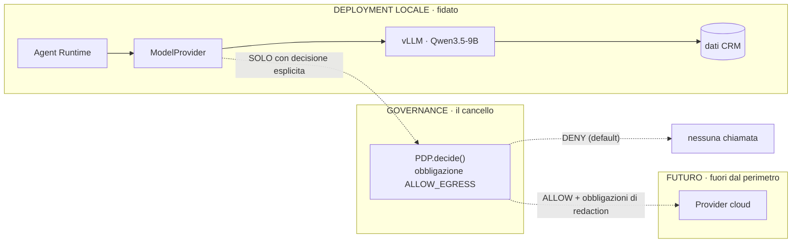

### Come leggerlo

La freccia continua è oggi. Le tratteggiate sono il futuro, e passano **tutte** dal riquadro
centrale.

Il punto architetturale: l'inference cloud **non è una questione di `ModelProvider`**, è una
questione di **egress di dati**. Il `ModelProvider` sarebbe capacissimo di chiamare un endpoint
remoto — è la stessa API. Ciò che manca non è il codice: è la decisione su **quali dati possono
uscire**.

Perciò il contratto lo prepara con una regola sola, oggi:

`AR-MD-09`: **nessuna inference verso una destinazione fuori dal perimetro del deployment senza
una decisione esplicita del `PDP`.** Day-1 non esiste nessuna destinazione remota, quindi la
regola non costa nulla — ma esiste, e chi aggiungerà la prima destinazione remota la troverà
sulla sua strada invece di scoprirla dopo.

Le implicazioni che `A14` (data governance) dovrà chiudere sono già identificabili: residenza
dei dati, redazione dei campi prima dell'invio (`AR-GP-17` esiste già come obbligazione),
retention lato provider, e il fatto che il `weights_digest` di un modello cloud **non esiste**
— il che indebolisce la riproducibilità dell'evidenza e va dichiarato.

---

## 25. Il lock-in su Qwen: come si misura

`R-05` di `A01`: *lock-in accidentale su Qwen tramite prompt e formati specifici*. Probabilità
media, impatto medio. La mitigazione registrata era *"`ModelProvider` + eval suite indipendente
dal modello"*.

Questo documento deve rendere quella mitigazione operativa, perché **un rischio senza una metrica
è un'opinione** (`AR-035`).

### 25.1 Le quattro superfici di lock-in

| # | Superficie | Dove si annida | Neutralizzata da |
|---|---|---|---|
| L1 | **formato del prompt** | token speciali, tag di reasoning, delimitatori | l'API OpenAI-compatible: la traduzione avviene nel serving (§14.3) |
| L2 | **formato del tool calling** | come il modello emette le chiamate | il parser sta nel serving; noi vediamo la forma normalizzata |
| L3 | **prompt engineering tarato** | frasi che funzionano *con questo modello* — la superficie più insidiosa perché è invisibile | **non neutralizzabile**: solo misurabile |
| L4 | **dipendenza dalle capability** | codice che assume structured output nativo | `ModelCapabilities` + comportamenti degradati (§16.4) |

**L1, L2 e L4 sono chiuse dall'architettura.** L3 no, e nessuna architettura può chiuderla: se
scrivi cento iterazioni di prompt provandoli su Qwen, il risultato è tarato su Qwen. È fisiologico.

Ciò che si può fare è **sapere quanto costa**.

### 25.2 La metrica del lock-in

> **`portability_delta`** — la differenza di prestazione della eval suite fra il modello attivo
> e un modello di riferimento diverso, a **prompt invariato**.

Procedura, che è deliberatamente povera perché deve essere sostenibile da tre persone:

| Passo | Cosa si fa | Frequenza |
|---|---|---|
| 1 | si tiene un modello di riferimento diverso (famiglia diversa, taglia simile) in formato `GGUF` | — |
| 2 | si esegue la eval suite agentica (§25.3) sul modello attivo → *baseline* | a ogni `ModelVersion` |
| 3 | si esegue la **stessa suite, con gli stessi prompt, senza adattarli** sul modello di riferimento | trimestrale |
| 4 | `portability_delta` = differenza sulle metriche gate | trimestrale |

**Come si legge il risultato:**

| `portability_delta` | Interpretazione |
|---|---|
| piccolo | i prompt sono generici. Il lock-in è basso, `R-05` è sotto controllo |
| grande | i prompt sono tarati su Qwen. Il lock-in è **reale e quantificato** |
| **in crescita nel tempo** | è il segnale che conta: significa che ogni iterazione di prompt engineering ci sta legando di più. → `T-MD-08` |

Il terzo caso è il vero valore della metrica. Nessuno noterà mai il lock-in guardando il codice;
lo si nota guardando una curva che sale.

### 25.3 La eval suite agentica

Serve a tre cose contemporaneamente — gate di quantizzazione (§8.4), baseline di portabilità
(§25.2), e regressione a ogni cambio di modello o prompt. La proprietà che la rende utile:
**non contiene niente di specifico di Qwen**.

| Contenuto | Forma |
|---|---|
| casi di tool selection | obiettivo → tool atteso, argomenti attesi |
| casi di structured output | richiesta → schema che deve essere rispettato |
| casi negativi | obiettivi per cui il tool giusto **non esiste**: il modello deve dirlo, non inventarlo |
| casi di aderenza al vincolo | *"non contattare clienti in blacklist"* → il modello lo rispetta? |
| casi di context lungo | il fatto rilevante è a metà di un context grande: lo trova? |

`NON ANCORA DECISO`: dimensione della suite, soglie, e chi la costruisce. È di competenza `A17`
(testing) e `A12` (evaluation). Questo documento fissa **che deve esistere prima di andare in
produzione** e **quali metriche deve produrre**, non come è fatta.

> **Dipendenza esplicita:** senza la eval suite, `ADR-037` (quantizzazione) non ha il suo gate,
> `R-05` non ha la sua metrica, e `R-15` non è rilevabile. È il prerequisito più importante che
> questo documento scarica su altri.

---

## 26. Observability e cost model

### 26.1 Il vantaggio di partenza

**FATTO** (R-06): vLLM espone già metriche Prometheus su `GPU cache usage`, richieste
running/waiting, `TTFT`, tempo per token di output, profondità della coda. Il `production-stack`
include logging strutturato JSON e tracing OpenTelemetry con propagazione del context W3C.

`INFERENZA`: metà dell'observability di inference **esiste già** e richiede solo di essere
raccolta. Il lavoro nostro è l'altra metà: correlare quelle metriche con i run.

### 26.2 Le metriche Day-1

| Metrica | Fonte | A cosa serve davvero |
|---|---|---|
| `TTFT` p50/p95/p99 | serving | percezione dell'utente; base del timeout di primo token |
| token/s in generazione | serving | capacità; base del timeout di generazione |
| `KV cache` utilization | serving | **la metrica di capacità più importante**: è il precursore di tutto |
| richieste running / waiting | serving | saturazione |
| preemption / richieste rimesse in coda | serving | segnale che `max_model_len` × concorrenza è troppo alto |
| GPU utilization, GPU memory | `nvidia-smi` / exporter | distinguere "GPU satura" da "GPU ferma ma coda piena" |
| `tokens_in` / `tokens_out` per run | **nostro**, dalla `ModelResponse` | costo, budget |
| model call per run | nostro | è la metrica economica di `A04` §1 (8 chiamate → 1) |
| `malformed_rate` | nostro, anello 2 | qualità del modello |
| `hallucinated_tool_rate` | nostro, anello 2 | qualità → `T-10` |
| `refusal_rate` | nostro | qualità del prompt |
| latenza di inference per step | nostro | correlazione con la durata del run |
| tempo di caricamento del modello | serving/startup | cold start |

### 26.3 La correlazione che fa la differenza

Una metrica di serving senza `run_id` risponde a *"il sistema è lento"*. Con `run_id` risponde a
*"questo run è lento perché il `KV cache` era all'88% e la sua richiesta è stata rimessa in coda
due volte"*.

> **DECISIONE ARCHITETTURALE.** Ogni chiamata al modello propaga `run_id`, `step_index` e
> `tenant_id` nel context di tracing (W3C trace context, supportato dal production-stack vLLM —
> FATTO, R-06). La metrica di inference e lo step journal si incontrano nello stesso trace.

Costo: qualche header. Beneficio: la differenza fra avere e non avere diagnosi.

`DA VERIFICARE` — `B-06` (già nel backlog): stato di stabilità delle OpenTelemetry GenAI
semantic conventions. Se sono stabili, usiamo i loro nomi di attributo invece di inventarne.

### 26.4 Cost model: cosa catturare oggi per poter contare domani

`B20` (cost) farà il modello di costo. Qui si decide **quale metadato deve esistere Day-1**,
perché un dato non catturato non si recupera.

| Dato | Catturato Day-1? | Perché |
|---|---|---|
| `tokens_in`, `tokens_out` per chiamata, con `run_id` e `tenant_id` | **sì** | è l'unità di costo di qualunque modello, locale o cloud |
| `tokens_cached` (prefix cache hit) | **sì se il serving lo riporta** | distingue il costo reale da quello nominale |
| durata di inference per chiamata | **sì** | su GPU propria il costo è **tempo**, non token |
| `model_version_id` per chiamata | **sì** | modelli diversi costeranno diversamente |
| GPU-secondi per tenant | **no, derivato** | si ricava da durata × attribuzione. Misurarlo direttamente richiederebbe isolamento che non abbiamo |
| costo in valuta | **no** | è `B20`: il prezzo è configurazione, non telemetria |

Il punto sottile e importante: **su GPU propria l'unità di costo è il tempo, non il token**. La
GPU costa €232/mese (FATTO, R-08) che tu la usi o no. Contare i token serve a (a) confrontarsi
con un'alternativa cloud, e (b) prepararsi al giorno in cui una parte del carico andrà davvero
in cloud. Ma per il costo reale di oggi, la metrica giusta è **utilizzo della GPU**.

---

## 27. Piano di validazione delle performance

Questa sezione è il debito che il documento contrae con sé stesso: **quasi tutte le decisioni
quantitative sono `ASSUNZIONE` finché questo piano non viene eseguito.**

### 27.1 Le variabili da registrare

Un benchmark senza queste è aneddoto:

```text
HARDWARE     modello GPU · VRAM · driver · CUDA · CPU · RAM · disco
SOFTWARE     serving runtime + versione ESATTA · quantizzazione · formato · tokenizer digest
CONFIG       max_model_len · gpu_memory_utilization · prefix caching on/off ·
             structured output on/off · max_num_seqs
CARICO       lunghezza prompt · lunghezza output · concorrenza · # tool definition ·
             % richieste con structured output
```

### 27.2 Le sette misure, in ordine di importanza

| # | Misura | Domanda a cui risponde | Sblocca |
|---|---|---|---|
| **M1** | VRAM occupata da pesi + overhead, a vuoto | quanto `KV cache` resta davvero? | §7.4, tutto il resto |
| **M2** | concorrenza massima utile a 3-4 valori di `max_model_len` | qual è il punto della curva context↔concorrenza? | `ADR-039`, il valore di `max_model_len` |
| **M3** | `TTFT` e token/s a concorrenza 1, 2, 4, 8, 16 | dove si degrada la latenza? | i timeout di §20.3, `AS-01` |
| **M4** | effetto del prefix caching sul carico agentico reale | quanto vale davvero il riuso del prefisso? | §23.2, e l'ipotesi SGLang |
| **M5** | costo del structured output su throughput e `TTFT` | l'anello 1 va tenuto sempre acceso? | §13.3, `B-16` |
| **M6** | tempo di cold start e di warm start | quanto dura un riavvio? | §19.3, healthcheck |
| **M7** | eval suite agentica: `Q4` vs `Q8` (e vs `FP16` se possibile su altra macchina) | la quantizzazione a 4 bit degrada il tool calling? | `ADR-037`, `R-15` |

### 27.3 Le due verifiche di correttezza, non di performance

Meno appariscenti, più importanti:

| Verifica | Perché |
|---|---|
| **la disconnessione del client libera davvero le risorse?** | se no, ogni cancellazione lascia una generazione zombie che consuma `KV cache` (§20.4) |
| **il capability probe rileva davvero una capability assente?** | si testa deliberatamente contro un profilo che non ha structured output, e si verifica che il campo risulti `false` (§16.3) |

### 27.4 Il criterio di validazione dell'architettura

L'architettura di questo documento si considera **validata** quando:

1. `M1` conferma che resta `KV cache` sufficiente per una concorrenza ≥ quella di `AS-01`
   (decine di run concorrenti, non migliaia);
2. `M2` produce un valore di `max_model_len` compatibile con i prompt reali di `A07`/`A08`;
3. `M7` mostra che il gate di qualità della quantizzazione a 4 bit passa;
4. le due verifiche di §27.3 passano.

**Se `M1` o `M2` falliscono, la decisione da riaprire non è il serving runtime: è l'hardware.**
Ed è una conclusione che vale la pena anticipare, perché la reazione istintiva a un benchmark
deludente è cambiare software.

---

## 28. Day-1 / Prepare / Scale / Enterprise

Legenda: **Day 1** = si costruisce ora · **Prepare** = il contratto lo permette, non si
costruisce · **Scale** = si costruisce a un trigger · **Enterprise** = richiede requisiti che
oggi non esistono.

| Capability | Day 1 | Prepare | Scale | Enterprise |
|---|---|---|---|---|
| Model Registry | `Model` + `ModelVersion` (già `A02`) | — | metadati per parco modelli | catalogo per tenant |
| Model versioning | versioni immutabili + binding | — | canary sul binding | promozione con approvazione |
| Model artifact | volume read-only + digest + allowlist | provenance come campo | firma crittografica (`B-19`) | SBOM, attestazioni |
| Inference server | vLLM in container, profilo llama.cpp | — | 2+ processi + proxy | fleet, autoscaling |
| `ModelProvider` | `complete()` + `stream()` | contratto già multi-destinazione | — | — |
| Streaming | implementato, uso cosmetico | tool-call streaming | backpressure | — |
| Structured output | doppio anello | — | ottimizzazione dell'anello 1 | — |
| Tool calling | nativo se `capabilities` lo conferma | fallback via prompt | — | — |
| Quantizzazione | 4 bit + gate di qualità | `Q8` come fallback documentato | per-modello | — |
| Batching | continuous, ereditato | — | tuning `max_num_seqs` | — |
| `KV cache` | prefix caching acceso e misurato | ordine del prompt già corretto | pool per classe di servizio | offload / disaggregazione |
| Model routing | **nessuno** | contratto pronto | statico per capability (`A07`) | dinamico costo/latenza |
| Fallback | **nessuno** | esprimibile come obbligazione | policy esplicita | multi-provider |
| Più worker di inference | **no** | contratto indifferente | `T-09` | pool per tenant |
| Più GPU | **no** | `ADR-045` dichiara la direzione | worker indipendenti | pool eterogenei |
| GPU scheduling | **no** — limite di concorrenza a monte | `priority` già sul run | priorità nativa del serving | scheduling per tenant |
| Cloud inference | **no** | `AR-MD-09` + obbligazione | `T-MD-05` | multi-region |
| Multi-tenancy dell'inference | `tenant_id` su ogni chiamata | metadati di costo pronti | quote di concorrenza | GPU dedicate, residenza |
| Cost tracking | token + durata + attribuzione | — | `B20` | chargeback |
| Model evaluation | eval suite come **prerequisito** | metriche gate definite | A/B sul binding | evaluation continua |
| HA | **no** — GPU singola dichiarata (`R-14`) | run `RETRYABLE` invece di `FAILED` | repliche | multi-region |

---

## 29. ADR candidati

### `ADR-036` — Serving runtime: due profili dietro un contratto

| Campo | Contenuto |
|---|---|
| **Problema** | quale motore di inference, e come si evita che la scelta si incolli al runtime |
| **Alternative** | vLLM solo · SGLang solo · llama.cpp solo · Ollama · TGI · Triton · Transformers · server custom (§9.3) |
| **Decisione** | `serving_profile` come campo della `ModelVersion`. Day-1 due profili implementati: `vllm` (produzione) e `llamacpp` (sviluppo/sopravvivenza) |
| **Conseguenze** | `AR-020` soddisfatta da subito; due matrici di compatibilità da mantenere; le `capabilities` diventano obbligatoriamente dichiarative |
| **Reversibilità** | **facile** — cambio di campo + riavvio del container |
| **Scadenza** | prima di scrivere il `ModelProvider`. Dipende da `B-12` e `B-15` |

### `ADR-037` — Quantizzazione a 4 bit con gate di qualità agentico

| Campo | Contenuto |
|---|---|
| **Problema** | quale precisione, e come accorgersi che degrada ciò che ci serve |
| **Alternative** | `FP16`/`BF16` (impossibile su 20 GB) · `Q8`/`INT8` · `Q4` (`AWQ` o `GGUF`) · `Q3` |
| **Decisione** | 4 bit, formato secondo il profilo; adozione subordinata al superamento di **tutte** le metriche gate, senza medie |
| **Conseguenze** | serve la eval suite **prima** della produzione; `Q8` resta fallback documentato |
| **Reversibilità** | **facile** — nuova `ModelVersion` |
| **Scadenza** | prima del primo deployment reale |

### `ADR-038` — Serving boundary: processo separato, stessa macchina

| Campo | Contenuto |
|---|---|
| **Problema** | il modello dentro o fuori il processo del worker |
| **Alternative** | in-process (A) · server dedicato (B) · worker nostro (C) · gateway (D) · ibrido cloud (E) |
| **Decisione** | Opzione B: container separato, API OpenAI-compatible su loopback |
| **Conseguenze** | fault isolation; più worker condividono una copia dei pesi; un hop HTTP |
| **Reversibilità** | **moderata** — cambiare significherebbe cambiare il modello di processo di `ADR-001` |
| **Scadenza** | prima del primo `docker-compose` |

### `ADR-039` — `max_model_len` come decisione di capacità

| Campo | Contenuto |
|---|---|
| **Problema** | quanto context dichiarare |
| **Alternative** | massimo supportato dal modello · finestra dinamica · due versioni con finestre diverse |
| **Decisione** | valore dichiarato sulla `ModelVersion`, scelto per misura (`M2`), congelato nel `ConfigSnapshot` |
| **Conseguenze** | `A07`/`A08` ereditano un budget di token numerico; prompt fuori finestra = errore esplicito |
| **Reversibilità** | **facile** sul valore, **costosa** se `A08` viene progettato per una finestra sbagliata |
| **Scadenza** | prima di `A08` (memory) |

### `ADR-040` — Structured output a doppio anello

| Campo | Contenuto |
|---|---|
| **Problema** | garantire JSON valido da un componente non fidato |
| **Alternative** | fidarsi del constrained decoding · validare solo · **entrambi** · parser tollerante |
| **Decisione** | constrained decoding nel serving (quando disponibile) **+** validazione nel runtime, sempre |
| **Conseguenze** | costo di validazione trascurabile; la validazione lascia evidenza; il sistema funziona anche su profili senza anello 1 |
| **Reversibilità** | **facile** per l'anello 1, **mai** per l'anello 2 |
| **Scadenza** | prima del loop |

### `ADR-041` — Il prompt reso è la somma di tre sorgenti versionate

| Campo | Contenuto |
|---|---|
| **Problema** | dove vive il prompt e come si versiona senza creare un registry |
| **Alternative** | stringa nel codice · Prompt Registry · campo di `AgentVersion` · **tre sorgenti separate** |
| **Decisione** | istruzione dell'agent (`AgentVersion`) + scaffolding (codice versionato) + chat template (`ModelVersion`); journal registra `prompt_hash` + i tre identificatori |
| **Conseguenze** | il lock-in di formato resta confinato nel serving; nessuna risorsa nuova nel Control Plane |
| **Reversibilità** | **moderata** — cambiarlo dopo significa perdere la comparabilità dello storico |
| **Scadenza** | prima dello schema del journal |

### `ADR-042` — Riproducibilità dell'evidenza, non dell'output

| Campo | Contenuto |
|---|---|
| **Problema** | cosa si può promettere sulla riesecuzione |
| **Alternative** | determinismo garantito (non ottenibile) · nessuna garanzia · **evidenza completa** |
| **Decisione** | cinque identificatori obbligatori; nessuna promessa di output identico |
| **Conseguenze** | `C29` (replay) va ridefinito; `A17` non può usare confronti di output esatti come test |
| **Reversibilità** | **facile** sulla promessa, **costosa** sui campi non catturati |
| **Scadenza** | prima dello schema del journal |

### `ADR-043` — Nessun Model Gateway

| Campo | Contenuto |
|---|---|
| **Problema** | serve un gateway davanti all'inference? |
| **Alternative** | nessun gateway · adapter leggero · gateway completo |
| **Decisione** | adapter leggero **dentro** il `ModelProvider`. Nessun processo di gateway |
| **Conseguenze** | un salto di rete e un punto di guasto in meno; con più backend servirà, e sarà `T-MD-04` |
| **Reversibilità** | **facile** — un gateway si inserisce dietro il contratto senza toccare il runtime |
| **Scadenza** | nessuna: è una non-costruzione |

### `ADR-044` — Nessun fallback automatico fra modelli

| Campo | Contenuto |
|---|---|
| **Problema** | cosa fare quando il modello primario non risponde |
| **Alternative** | fallback silenzioso locale · fallback cloud · **nessun fallback, run `RETRYABLE`** |
| **Decisione** | nessun fallback automatico; il fallback futuro è una decisione di policy auditata |
| **Conseguenze** | in caso di guasto i run aspettano invece di degradare; l'audit resta univoco |
| **Reversibilità** | **facile** ad aggiungere, difficile a togliere una volta che qualcuno ci conta |
| **Scadenza** | nessuna Day-1; si riapre a `T-MD-05` o con uno SLA contrattuale |

### `ADR-045` — Multi-GPU: worker indipendenti, non tensor parallelism

| Campo | Contenuto |
|---|---|
| **Problema** | come si usa una seconda GPU |
| **Alternative** | tensor parallelism · pipeline parallelism · **N worker indipendenti** |
| **Decisione** | N copie complete del modello, una per GPU. Tensor parallelism solo se il modello non ci sta su una GPU |
| **Conseguenze** | vincola l'acquisto hardware (due macchine economiche invece di una con NVLink); dà fault isolation e upgrade progressivi |
| **Reversibilità** | **facile** oggi (non si costruisce nulla), **costosa** se si è comprato hardware sbagliato |
| **Scadenza** | prima del primo acquisto di hardware aggiuntivo |

### `ADR-046` — Artifact allowlist per digest, nessun download a runtime

| Campo | Contenuto |
|---|---|
| **Problema** | supply chain dei pesi |
| **Alternative** | download automatico · digest + allowlist · firma crittografica |
| **Decisione** | digest verificato all'avvio, allowlist = insieme delle `ModelVersion`, nessun accesso a Internet dal processo di inference |
| **Conseguenze** | aggiungere un modello è un'operazione umana deliberata; un artifact sostituito non parte |
| **Reversibilità** | **facile** ad aggiungere firme sopra |
| **Scadenza** | prima del primo deployment fuori dal portatile di uno sviluppatore |

### `ADR-047` — Priorità come limite di concorrenza a monte

| Campo | Contenuto |
|---|---|
| **Problema** | impedire che il carico background affami quello interactive (`R-02`) |
| **Alternative** | scheduler nostro · due processi di inference · priorità nel serving · **limite di concorrenza sulla coda** |
| **Decisione** | i run `background` hanno un limite di concorrenza più basso, applicato nella query di prelievo |
| **Conseguenze** | zero componenti nuovi; separazione grossolana, nessuna garanzia di latenza |
| **Reversibilità** | **facile** |
| **Scadenza** | prima del primo carico batch reale |

---

## 30. Nuove regole architetturali (`AR-MD-*`)

| ID | Regola | Verificabile come |
|---|---|---|
| `AR-MD-01` | L'`Agent Runtime` non parla mai direttamente con l'inference server: solo tramite `ModelProvider` | test di dipendenza fra moduli in CI (`AR-005`) |
| `AR-MD-02` | Ogni risposta porta l'identità completa di produzione. Una risposta senza è un errore, non una risposta | tipo non costruibile senza i campi + test |
| `AR-MD-03` | L'output del modello è validato contro schema **dal runtime**, anche con constrained decoding attivo | test con serving simulato che restituisce JSON invalido |
| `AR-MD-04` | Un tool inesistente proposto dal modello è un'osservazione, non un errore di sistema | test del loop |
| `AR-MD-05` | Nessuna stringa di prompt come letterale sparso nel codice: template versionati e hashati | lint / grep in CI |
| `AR-MD-06` | Il `ModelProvider` fa retry della **chiamata**, mai del **passo** | code review + test che verifica lo `step_index` invariato |
| `AR-MD-07` | Il conteggio dei token del prompt avviene **prima** dell'invio; nessun troncamento automatico lato serving | configurazione del serving + test |
| `AR-MD-08` | Nessun artifact caricato se il digest non corrisponde all'allowlist; nessun download a runtime | script di avvio + container senza rete |
| `AR-MD-09` | Nessuna inference verso una destinazione fuori dal perimetro senza decisione esplicita del `PDP` | oggi vacua; test quando esisterà una destinazione remota |
| `AR-MD-10` | Cambiare quantizzazione, serving profile, `max_model_len` o `decoding_params` di default è creare una nuova `ModelVersion`, mai modificare in place | immutabilità già garantita da `A02` |
| `AR-MD-11` | Nessun componente nuovo nel layer di inference (gateway, router, scheduler) senza una misura del limite attuale | specializzazione di `AR-019`; gate di revisione |
| `AR-MD-12` | Il timeout della chiamata è sempre minore del budget di tempo residuo del run | deadline come istante assoluto + test |
| `AR-MD-13` | Lo streaming non produce mai effetti: nessun chunk parziale innesca un tool call | i tipi: `ModelChunk` non è convertibile in `RawToolCall` |
| `AR-MD-14` | Una quantizzazione si adotta solo dopo il gate di qualità agentico, e basta una metrica fuori soglia per respingerla | procedura di rilascio (`A16`) |
| `AR-MD-15` | Le parti variabili del prompt vanno in coda, mai in testa (prefix caching) | test sul rendering del prompt |

**Debito dichiarato**, coerente con l'autocritica di `A01` §46: di queste quindici, quelle
verificabili automaticamente con poco sforzo sono `AR-MD-01`, `02`, `03`, `05`, `06`, `12`,
`13`, `15`. Le altre sono `REVIEWED`, non `ENFORCED`, e vanno marcate come tali al gate di
Level A.

---

## 31. Nuovi trigger di revisione (`T-MD-*`)

| ID | Condizione osservabile | Riapre | Verso |
|---|---|---|---|
| `T-MD-01` | p95 di `TTFT` fuori soglia **con** GPU utilization bassa | scheduling | il collo di bottiglia non è la GPU: indagare coda, `max_num_seqs`, prefill |
| `T-MD-02` | `KV cache` utilization > 90% sostenuta, o preemption frequenti | capacità | ridurre `max_model_len`, o secondo processo di inference |
| `T-MD-03` | `malformed_rate` sopra soglia **dopo** che l'anello 1 è attivo | modello / formato | cambiare tool parser, formato di output, o modello |
| `T-MD-04` | serve un secondo modello realmente diverso (embedding, reranker, multimodale) | routing | routing **statico per capability**, non dinamico |
| `T-MD-05` | un tenant vieta l'inference locale o richiede un modello che non possiamo ospitare | confine locale/cloud | policy di egress + provider remoto |
| `T-MD-06` | due serving profile girano contemporaneamente in produzione | `AR-020` | l'astrazione è verificata sul campo: si può alzare la confidenza su `ADR-005` |
| `T-MD-07` | il processo di inference si riavvia più di N volte a settimana | affidabilità | indagine su OOM/driver; è il precursore di `R-14` |
| `T-MD-08` | `portability_delta` in crescita per due trimestri consecutivi | `R-05` | intervento sui prompt, o accettazione esplicita del lock-in |
| `T-MD-09` | il beneficio misurato del prefix caching supera una soglia rilevante | serving runtime | valutare SGLang, che ne fa il proprio punto di forza |

---

## 32. Nuovi rischi e nuove assunzioni

### Rischi

| ID | Rischio | Classe | Prob. | Impatto | Mitigazione |
|---|---|---|---|---|---|
| `R-12` | Il non-determinismo del serving rende impossibile il replay per confronto di output; `C29` potrebbe essere progettato su un'aspettativa sbagliata | Correttezza | **Alta** | Medio | `ADR-042` dichiara il limite ora; `C29` progetta il replay sul journal, non sulla generazione |
| `R-13` | Un upgrade del serving rompe il tool calling o il structured output senza rompere nient'altro — il fallimento è silenzioso e specifico (FATTO: la documentazione vLLM avverte esattamente di questo, R-06) | Operativo | **Alta** | Alto | capability probe alla creazione della `ModelVersion` (§16.3) + eval suite come gate di rilascio |
| `R-14` | GPU e processo di inference sono un singolo punto di guasto non ridondato | Availability | Media | Alto | run in `RETRYABLE` invece che `FAILED`; restart automatico; accettato Day-1 e dichiarato |
| `R-15` | La quantizzazione degrada il tool calling più di quanto degradi la qualità percepita del testo: senza una eval agentica il degrado passa inosservato | Quality | Media | **Alto** | `ADR-037`: gate su metriche agentiche, nessuna media |
| `R-16` | Il lock-in su Qwen si accumula per iterazione di prompt engineering, invisibile nel codice | Vendor | Media | Medio | `portability_delta` misurato trimestralmente (`T-MD-08`); aggrava e rende misurabile `R-05` |

### Assunzioni

| ID | Assunzione | Confidenza | Impatto se falsa | Validazione |
|---|---|---|---|---|
| `AS-06` | L'inference server sta sulla stessa macchina fidata del runtime, quindi un secret condiviso basta come autenticazione fra i due | Alta | se falsa (inference su rete condivisa) serve mTLS e il confine diventa un vero `Trust Boundary` di rete | decisione di deployment (`A15`, `Q-03`) |
| `AS-07` | Il carico è dominato da prompt lunghi e output brevi (tool call JSON), quindi è **prefill-bound** più che decode-bound | **Media** | se falsa, le priorità di ottimizzazione si invertono: conta il throughput di generazione, non il prefix caching | `M3`/`M4` di §27 |
| `AS-08` | Un solo modello copre tutti i compiti Day-1 | Media | `A07` (retrieval) avrà bisogno di un modello di embedding: se gira sulla stessa GPU, il budget VRAM di §7.4 va rifatto | **decisione di `A07`, da prendere presto** |

> **`AS-08` è la più urgente e la segnalo esplicitamente:** il bilancio di memoria di §7.4 assume
> che la GPU serva **un solo modello**. Se `A07` decide di ospitare anche l'embedding model sulla
> stessa scheda, quello spazio esce dal `KV cache`, cioè dalla concorrenza. `A07` deve dichiarare
> la scelta (stessa GPU / CPU / servizio separato) **prima** che `M1` e `M2` vengano eseguiti,
> altrimenti si misura la configurazione sbagliata.

---

## 33. Analisi di reversibilità

| Decisione | Classe | Cosa la rende reversibile (o no) |
|---|---|---|
| serving runtime (`ADR-036`) | **facilmente reversibile** | isolato dietro `ModelProvider`, e l'isolamento è **verificato** dal secondo profilo |
| quantizzazione (`ADR-037`) | **facilmente reversibile** | nuova `ModelVersion`, cambio di puntatore |
| formato dell'artifact | **facilmente reversibile** | conseguenza del profilo |
| serving boundary (`ADR-038`) | **moderatamente reversibile** | tornare in-process cambierebbe il modello di processo di `ADR-001` |
| API del modello (OpenAI-compatible) | **costosa da invertire** | è il confine che neutralizza L1 e L2 del lock-in (§25.1). Cambiarla significherebbe riscrivere l'adapter **e** riesaminare tutti i prompt |
| `ModelProvider` (forma del contratto) | **costosa da invertire** | ogni campo assente oggi è un dato non catturato, quindi non recuperabile |
| campi di evidenza nel journal | **effettivamente irreversibile** | ciò che non si registra oggi non esiste domani. È la decisione che merita più prudenza |
| model registry (`Model`/`ModelVersion`) | **costosa** | è schema di database (già `A02`) |
| worker abstraction (assente) | **facilmente reversibile** | non c'è nulla da disfare |
| routing (assente) | **facilmente reversibile** | il contratto lo permette |
| gateway (assente) | **facilmente reversibile** | si inserisce dietro il contratto |
| confine locale/cloud (`AR-MD-09`) | **facilmente reversibile** come regola, **costoso** come conseguenza | aprire l'egress è facile tecnicamente e difficile contrattualmente |

**La riga che richiede più evidenza è la settima**, e ha il livello di attenzione più alto in
questo documento: §12.3 esiste per questo.

---

## 34. Tentativo di falsificazione

Provo a rompere la raccomandazione, come richiede il prompt.

| Cosa la invaliderebbe | Quanto è vicino | Cosa succederebbe |
|---|---|---|
| **hardware**: la GPU disponibile ha meno di ~12 GB | **vicino** — è una decisione di acquisto | il 9B a 4 bit lascerebbe pochissimo `KV cache`: si passa a un modello più piccolo o si accetta concorrenza ~1. L'architettura regge, la capacità no |
| **hardware**: nessuna GPU, solo CPU | possibile in alcuni deployment on-prem | il profilo `llamacpp` diventa il primario. **L'architettura è già pronta**: è la ragione per cui esistono due profili |
| **concorrenza**: servono centinaia di run concorrenti | lontano (`AS-01`) | una GPU non basta, indipendentemente dal software. Si va in Fase 3 |
| **context**: un compito reale richiede 200k token | **plausibile** (documenti lunghi nel CRM) | `ADR-039` produce `CONTEXT_TOO_LARGE`. Il runtime deve spezzare il compito. Se questo diventa frequente, `A07`/`A08` hanno un problema di design, non l'inference |
| **taglia del modello**: serve un 70B | dipende dalla qualità misurata | tensor parallelism rientra, `ADR-045` si riapre, e l'hardware cambia categoria di costo |
| **tenant**: un cliente esige inference isolata | plausibile (`AS-05`, `T-05`) | serve un processo di inference per tenant: `AR-MD-11` è soddisfatta da un requisito contrattuale, non da una misura |
| **availability**: SLA con uptime contrattuale | plausibile a `Q-02` | `R-14` diventa inaccettabile: serve una seconda GPU o il fallback cloud, e `ADR-044` si riapre |
| **latenza**: SLA sub-secondo sulla prima risposta | poco probabile per un CRM agent | l'architettura regge, ma `max_model_len` e il prefill diventano il vincolo dominante |
| **diversità di modelli**: servono subito 4 modelli | improbabile Day-1, **certo entro `A07`** | il routing statico arriva prima del previsto. È `T-MD-04`, ed è già previsto |
| **compliance**: divieto di modelli con licenza non approvata | plausibile | `deployment_constraints` (§18.4) è già il meccanismo |

### Il primo trigger che scatterà

**Previsione:** `T-MD-04`, e non per carico ma per **necessità funzionale**.

Il ragionamento: `A07` (knowledge) ha bisogno di un modello di embedding per il retrieval su
pgvector. È un modello diverso, piccolo, con un ciclo di vita diverso, e probabilmente in
esecuzione sulla stessa macchina.

Non è un problema di capacità: è un fatto della roadmap che accadrà **due documenti più
avanti**. Il che significa che la frase *"con un modello solo il routing è una funzione"* di
`ADR-005` ha una scadenza breve — e la scadenza è nota.

`ADR-005` resta corretto: la funzione che sceglie fra "modello di ragionamento" e "modello di
embedding" **è ancora una funzione**, non un router. Ma è il momento in cui la distinzione va
guardata di nuovo, non dato per scontata.

---

## 35. Autocritica architetturale

Rispondo alle venti domande del prompt §57, senza addolcire.

| # | Domanda | Risposta onesta |
|---|---|---|
| 1 | Ho davvero fatto ricerca sulle architetture di inference? | **Parzialmente.** Ho usato i FATTI verificati in `research-log` (R-06, R-08) e i documenti `research/02` e `research/04` del progetto. Non ho fatto ricerca nuova: era il vincolo di esecuzione. Il **debito è dichiarato** in `B-12`…`B-19` |
| 2 | Ho confrontato almeno tre alternative? | **Sì**, cinque architetture (§10.2) e otto serving runtime (§9.2) |
| 3 | Ho confrontato i serving engine in modo equo? | **No, e lo dichiaro.** L'evidenza verificata riguarda vLLM. SGLang e TGI perdono per **asimmetria di evidenza**, non per inferiorità dimostrata. §9.3 lo dice esplicitamente e `B-12` esiste per correggerlo |
| 4 | Ho ottimizzato per la popolarità senza accorgermene? | **Rischio reale.** La mitigazione è la §9.3, dove il rifiuto di ciascuna alternativa è argomentato singolarmente, e il riconoscimento che SGLang ha un vantaggio strutturale plausibile sul nostro carico (`T-MD-09`) |
| 5 | Ho identificato cosa va misurato? | **Sì**, §27: sette misure e due verifiche di correttezza, con criterio di validazione |
| 6 | Ho separato identità del modello da implementazione? | **Sì**: `Model` (logico) / `ModelVersion` (concreto) / `serving profile` / artifact come campi |
| 7 | Ho separato runtime da inference? | **Sì**, ed è applicato dai tipi e dal confine di processo |
| 8 | Qwen può essere sostituito? | **Sì tecnicamente** (L1, L2, L4 chiusi). **Non gratuitamente**: L3 (prompt tarato) resta, e `portability_delta` serve proprio a sapere quanto costa |
| 9 | Si può introdurre un altro engine? | **Sì, ed è già fatto**: il secondo profilo esiste Day-1 |
| 10 | Si possono introdurre più worker? | **Sì**, senza toccare il contratto |
| 11 | Più GPU? | **Sì**, con `ADR-045` che dichiara la direzione prima dell'acquisto |
| 12 | Inference cloud? | **Sì**, ma passa dal `PDP`, non dal provider |
| 13 | Il contratto `ModelProvider` è sufficiente? | **Credo di sì, con un dubbio**: la gestione della backpressure in streaming è `NON ANCORA DECISO` e potrebbe richiedere un campo che oggi non c'è |
| 14 | Ho introdotto infrastruttura di gateway inutile? | **No** — `ADR-043` la rifiuta esplicitamente |
| 15 | Ho introdotto routing inutile? | **No** — `ADR-005` confermato, e §34 dichiara che ha una scadenza breve |
| 16 | Il Day-1 è davvero semplice? | **Quasi.** Due profili invece di uno è complessità aggiunta deliberatamente. La difendo con `AR-020` e con l'assenza di GPU sui portatili, ma è la decisione più contestabile del documento |
| 17 | La supply chain degli artifact è sicura? | **Ragionevolmente**: digest, allowlist, nessuna rete, formati che non eseguono codice. **Non** ci sono firme crittografiche (`B-19`) |
| 18 | Le esecuzioni sono riproducibili? | **Nel senso dell'evidenza sì, nel senso dell'output no**, e `ADR-042` lo dichiara invece di lasciarlo scoprire a `C29` |
| 19 | Le versioni del modello sono immutabili? | **Sì**, ereditato da `A02` `ADR-015` |
| 20 | Quale assunzione potrebbe invalidare tutto? | **`AS-08`**: se `A07` mette l'embedding model sulla stessa GPU, il bilancio di memoria di §7.4 è sbagliato e con esso `max_model_len` e la concorrenza. È l'assunzione da chiudere per prima |

### Le tre debolezze che riconosco senza attenuanti

1. **L'evidenza è asimmetrica.** vLLM parte avvantaggiato perché è quello su cui la ricerca del
   progetto è stata fatta. `B-12` è aperto, `T-MD-09` esiste, ma finché non sono chiusi la
   scelta del serving è la decisione **meno solida** del documento — anche se è quella
   facilmente reversibile, il che è una consolazione reale.

2. **Quasi ogni numero è un'assunzione.** Il bilancio VRAM di §7.4, i limiti di retry, i
   timeout: nessuno di questi è misurato. Il documento è onesto nel marcarli, ma un lettore
   frettoloso potrebbe prendere "≈ 12 GB" per un fatto. **Non lo è.**

3. **Il secondo serving profile è complessità che potrebbe non ripagarsi.** Se il team non usa
   mai il profilo llama.cpp, sarà codice morto che dà una falsa sensazione di portabilità.
   La contromisura: `T-MD-06` verifica che siano davvero entrambi in uso, e la eval suite deve
   girare su **entrambi**, altrimenti il secondo profilo non è verificato.

---

## 36. Raccomandazione finale

# FINAL MODEL & INFERENCE ARCHITECTURE RECOMMENDATION

### Che cosa costruire

| Aspetto | Decisione |
|---|---|
| **Astrazione** | `ModelProvider` con `complete()` e `stream()`. Nessun `ModelRuntime`, nessun `InferenceWorker`, nessun `Model Gateway` |
| **Inference engine** | vLLM come `serving_profile` di produzione; llama.cpp come secondo profilo reale |
| **Model registry** | `Model` + `ModelVersion` di `A02`, arricchite di `serving_profile`, `max_model_len`, `capabilities`, `license_id`, `deployment_constraints`. **Nessuna risorsa nuova** |
| **Artifact** | volume read-only, digest verificato all'avvio, allowlist = insieme delle `ModelVersion`, nessuna rete nel container di inference |
| **Lifecycle** | due state machine separate: la `ModelVersion` (dato, Control Plane) e il processo (osservato, telemetria). Nessun controller di riconciliazione |
| **Serving boundary** | processo separato containerizzato, stessa macchina, API OpenAI-compatible su loopback |
| **Worker model** | nessuna astrazione di worker. Più worker applicativi condividono un processo di inference |
| **GPU** | una GPU, un processo. Direzione futura: **N worker indipendenti**, non tensor parallelism |
| **Quantizzazione** | 4 bit, formato secondo il profilo, adottata solo dopo il gate di qualità agentico |
| **Batching** | continuous, ereditato dal serving. Niente di nostro |
| **`KV cache`** | prefix caching acceso e misurato; ordine del prompt vincolato (`AR-MD-15`); `max_model_len` scelto per misura |
| **Streaming** | implementato, uso cosmetico Day-1, mai generatore di effetti |
| **Structured output** | doppio anello: constrained decoding + validazione nel runtime, sempre |
| **Tool calling** | il modello propone, il runtime valida, il `PDP` autorizza, il `Tool Runtime` esegue. Nessuna esecuzione automatica lato serving |
| **Routing** | nessuno |
| **Fallback** | nessuno; quando esisterà sarà una decisione di policy |
| **Observability** | metriche del serving + metriche nostre, correlate da `run_id` nel trace context |
| **Security** | digest + allowlist + nessuna rete + output non fidato + egress vietato per default |
| **Deployment Day-1** | tre container: applicazione (3 ruoli), inference, PostgreSQL. Docker Compose |

### Che cosa NON costruire Day-1

Elenco esplicito, perché è la parte più utile:

- ❌ un `Model Gateway`
- ❌ un `Model Router`
- ❌ uno scheduler di inference
- ❌ un registro di `InferenceWorker`
- ❌ un meccanismo di fallback fra modelli
- ❌ inference cloud
- ❌ tensor parallelism, e in generale qualsiasi multi-GPU
- ❌ model swapping / caricamento dinamico
- ❌ un servizio di artifact storage
- ❌ firme crittografiche degli artifact
- ❌ quote e isolamento GPU per tenant
- ❌ HA di qualsiasi genere
- ❌ un formato di prompt proprietario o un motore di templating sofisticato

Tredici cose non costruite. Ognuna è tempo che tre persone possono spendere sul journal, sul
`PDP` e sui tool — che è dove sta il valore di questa piattaforma.

### Che cosa DEVE esistere prima della produzione

Tre prerequisiti non negoziabili, e nessuno dei tre è codice di inference:

1. **la eval suite agentica** — senza, `ADR-037` non ha gate, `R-15` è invisibile, `R-05` non ha
   metrica;
2. **le misure `M1`, `M2`, `M7`** di §27 — senza, `max_model_len` è un'opinione;
3. **la decisione di `A07` su `AS-08`** — dove gira il modello di embedding.

### La condizione che innescherà la prossima evoluzione

**Previsione:** `T-MD-04` — l'arrivo del modello di embedding con `A07`. Non per carico, per
roadmap, e succederà due documenti più avanti.

Il secondo, per carico: `T-MD-02` — `KV cache` saturo. E la risposta giusta a quel trigger
**non** sarà comprare una GPU: sarà rivedere `max_model_len`. Vale la pena scriverlo qui,
perché quando succederà l'istinto suggerirà il contrario.

---

## 37. Nuovo backlog di ricerca

| ID | Cosa verificare | Blocca | Priorità |
|---|---|---|---|
| `B-12` | Versione autorevole di vLLM e matrice di supporto per `Qwen3.5`: checkpoint × quantizzazione × tokenizer × context × structured outputs × tool parser (FATTO R-06: la documentazione avverte che "supportato" non basta) | `ADR-036`, `ADR-037` — **prima di scrivere il `ModelProvider`** | **Alta** |
| `B-13` | Nome e formato del tool parser / reasoning parser per `Qwen3.5` nel serving scelto | `ModelCapabilities`, §13 | **Alta** |
| `B-14` | Finestra di context nominale di `Qwen3.5-9B` e quale `max_model_len` è realistico entro 20 GB | `ADR-039`, `A08` | **Alta** |
| `B-15` | Esistono checkpoint `AWQ`/`GPTQ` affidabili e con provenance verificabile per `Qwen3.5-9B`? | `ADR-037` — se no, il profilo primario diventa `GGUF` e §10 si rovescia | **Alta** |
| `B-16` | Costo reale del structured output (guided decoding) su throughput e `TTFT` | §13.3 | Media |
| `B-17` | Determinismo effettivo con `seed` fissato sotto continuous batching; quali parametri il serving riporta come applicati | `ADR-042`, §12.4 | Media |
| `B-18` | llama.cpp: stato del server OpenAI-compatible per tool calling e vincoli di grammar/JSON Schema | `ADR-036` (secondo profilo) | Media |
| `B-19` | Firma e provenance degli artifact di modello: esiste una pratica matura (sigstore / model signing)? | `ADR-046`, `A16` | Bassa Day-1 |

---

## 38. Dipendenze e conflitti con i documenti precedenti

### Nessun conflitto aperto

Ho cercato attivamente contraddizioni con `A01`-`A04`. Non ne ho trovate che richiedano un ADR
correttivo. Tre punti di **tensione** che risolvo esplicitamente:

| Tensione | Risoluzione |
|---|---|
| `A02` si chiedeva se `Model`/`ModelVersion` fosse sovradimensionato | **Risolta a favore di tenerli separati** (§6), con un argomento che `A02` non aveva: il rollout N-a-1 sulle `AgentVersion` |
| `A02` ha respinto un `Prompt Registry`, ma il prompt di `A05` chiede il prompt come artefatto versionato | **Nessun conflitto**: il prompt è già versionato dentro `AgentVersion`. `ADR-041` aggiunge la scoperta delle tre sorgenti senza creare risorse |
| `A01` §25 chiede riproducibilità; la fisica del serving non la concede | **Risolta con `ADR-042`**: si ridefinisce la promessa in *riproducibilità dell'evidenza*, che è ciò che `A01` §25 elencava davvero (identità, versioni, token, parametri) |

### Cosa questo documento chiede agli altri

| Documento | Cosa deve fare | Perché |
|---|---|---|
| **`A06`** (tool) | dichiarare la forma delle tool definition inviate al modello e tenerne sotto controllo la **dimensione**: le tool definition occupano il prefisso, quindi il budget di context e il prefix caching | §23.2, `ADR-039` |
| **`A07`** (knowledge) | decidere **dove gira il modello di embedding** (`AS-08`) prima delle misure di §27; ereditare il budget di token da `max_model_len` | §7.6, `AS-08` |
| **`A08`** (memory) | produrre riassunti del journal sotto una soglia numerica derivata da `max_model_len`, non "brevi" | `AR-RT-14` + `ADR-039` |
| **`A12`** (observability) | raccogliere le metriche del serving e correlarle con `run_id`; fornire `portability_delta`, `malformed_rate`, `hallucinated_tool_rate`, `refusal_rate` | §26, `AR-035` |
| **`A15`** (deployment) | container di inference senza rete, volume read-only, restart policy, healthcheck | `ADR-046`, §11 |
| **`A16`** (CI/CD) | il capability probe e la eval suite come **gate di rilascio** di una `ModelVersion` | `R-13`, `AR-MD-14` |
| **`A17`** (testing) | costruire la eval suite agentica; **non** usare confronti di output esatti come test | §25.3, `ADR-042` |
| **`B05`/`B21`** | ereditare il piano di misure di §27 come base del capacity planning | §27 |
| **`C27`** (multi-model fallback) | partire da `ADR-044`: il fallback è una decisione di policy, non di resilienza | `ADR-044` |
| **`C29`** (replay) | progettare il replay sul journal, non sulla rigenerazione | `ADR-042`, `R-12` |

---

## 39. Riepilogo per chi ha poco tempo

Se dovessi ridurre questo documento a otto righe:

1. Il modello sta in un **processo separato** sulla stessa macchina, dietro un contratto
   `ModelProvider` che ha **due implementazioni reali** dal primo giorno.
2. La risorsa scarsa non è la GPU: è il **`KV cache`**. `max_model_len` si sceglie **misurando**,
   perché ogni token dichiarato è concorrenza perduta.
3. Il modello a **4 bit** è un requisito di ammissione, non un'ottimizzazione — e va accettato
   solo dopo un **gate di qualità sul tool calling**, non sulla fluidità del testo.
4. Il JSON valido si garantisce **due volte**, e la seconda non si può mai togliere.
5. Il prompt viene da **tre sorgenti** con tre owner: tenerle separate è ciò che impedisce il
   lock-in sul modello.
6. Si promette di sapere **come** è stata prodotta ogni risposta, non di riprodurla identica.
7. Un tool inventato dal modello è **un'osservazione, non un guasto**; l'indisponibilità della
   GPU è **un'attesa, non un fallimento**.
8. Tredici cose non si costruiscono, e ognuna ha una condizione osservabile che dirà quando
   costruirla.
