# 07 — KNOWLEDGE & DATA ARCHITECTURE

**Documento `A07` del Level A.**
Dipende da: `01_ARCHITECTURE_PRINCIPLES.md` (`A01`), `02_CONTROL_PLANE.md` (`A02`),
`03_GOVERNANCE_POLICY.md` (`A03`), `04_AGENT_RUNTIME.md` (`A04`),
`05_MODEL_INFERENCE.md` (`A05`), `06_TOOL_ARCHITECTURE.md` (`A06`).
Stato canonico di riferimento: `ai/state/ARCHITECTURE_STATE.md`.
Fatti verificati di riferimento: `ai/state/research-log.md`.

---

## 0. La risposta in mezza pagina

Se leggi solo questa sezione, queste sono le cose che devi portarti via.

**Uno.** La piattaforma **non diventa mai il proprietario del dato aziendale**. Il CRM
(Customer Relationship Management, il sistema dove vivono clienti, contatti e trattative)
resta l'unico posto dove quel dato è vero. Noi ne teniamo al massimo un *puntatore* e un
po' di metadati.

**Due.** Esistono **due strade diverse** per arrivare all'informazione, e non vanno
confuse:

- il **dato strutturato** — la scheda cliente, l'ordine, la fattura — si legge **dal vivo**
  attraverso un `Tool` (`INV-07`: nessun componente tocca il database del CRM se non
  attraverso un `Tool` con schema dichiarato). Non lo copiamo, non lo indicizziamo, non lo
  trasformiamo in *embedding*;
- il **documento** — il PDF del contratto, la procedura interna, la scheda prodotto — entra
  in una **knowledge base**: viene letto, spezzato in *chunk*, trasformato in *embedding* e
  reso cercabile.

**Tre.** Il modello di *embedding* Day-1 gira **su CPU**, in un processo separato, **mai
sulla GPU**. Questo chiude `AS-08` (l'assunzione di `A05` secondo cui sulla scheda video c'è
un solo modello) **confermandola**: il costo in VRAM (la memoria della scheda video) portato
da `A07` è **zero**. Di conseguenza **`ADR-039` (la decisione su `max_model_len`, cioè
quanto *context* dichiariamo al serving) non cambia nel numero**. Cambia però come quel
numero va **ripartito**, e questo documento lo dichiara.

**Quattro.** L'autorizzazione al *retrieval* (il recupero dei frammenti) ha **tre strati**, e
il filtro per permessi sta **prima** della ricerca vettoriale, dentro la query SQL, non
dopo. Il filtro dopo esiste, ma solo come rete di sicurezza: **può togliere, mai
aggiungere**.

**Cinque.** I frammenti recuperati finiscono **in coda al prompt**, dopo le tool definition,
perché sono la parte variabile per eccellenza e `AR-MD-15` impone che le parti variabili
stiano in fondo per non distruggere il *prefix caching*.

**Sei.** `Q-04` (quanti documenti avrà la knowledge base) è **aperta**. Non invento numeri:
dichiaro cosa cambia per ogni ordine di grandezza e cosa va misurato.

---

## 1. Come leggere questo documento

### 1.1 Le sigle, spiegate

Ogni sigla è glossata alla prima occorrenza. Qui c'è comunque l'elenco, perché questo
documento ne eredita parecchie dai precedenti.

| Sigla | Cosa tratta |
|---|---|
| `ADR-nnn` | Architecture Decision Record: una decisione architetturale registrata, con numero unico |
| `AR-*` | Architectural Rule: una regola che il codice deve rispettare, verificabile |
| `AS-nn` | Assumption: un'assunzione dichiarata, con confidenza e piano di validazione |
| `INV-nn` | Invariante: una proprietà che deve restare vera sempre |
| `TB-n` | Trust Boundary: un confine dove il dato cambia livello di fiducia |
| `T-*` | Trigger: una condizione osservabile che riapre una decisione |
| `B-nn` | Backlog di ricerca: una cosa da verificare prima di decidere |
| `DEF-nn` | Decisione deliberatamente rimandata |
| `Q-nn` | Domanda aperta verso il committente |
| `R-nn` | Rischio registrato |

E le sigle tecniche che useremo:

| Sigla | Cosa tratta |
|---|---|
| RAG | Retrieval-Augmented Generation: dai al modello dei pezzi di testo pescati da un archivio, così risponde su dati che non ha imparato |
| ANN | Approximate Nearest Neighbor: ricerca del "più simile" **approssimata**, veloce, che può sbagliare qualche risultato |
| HNSW | Hierarchical Navigable Small World: il tipo di indice ANN più usato oggi, una specie di mappa a più livelli fra i vettori |
| ACL | Access Control List: l'elenco di chi può vedere una cosa |
| RLS | Row-Level Security: il meccanismo di PostgreSQL che filtra le righe **dentro il database**, anche se la query se ne dimentica |
| PDP | Policy Decision Point: il componente che decide se un'azione è permessa (`ADR-019`, `ADR-020`) |
| PEP | Policy Enforcement Point: il componente che **applica** la decisione del PDP |
| CDC | Change Data Capture: leggere le modifiche di un database dal suo log, invece di interrogarlo |
| RRF | Reciprocal Rank Fusion: un modo semplice di fondere due classifiche diverse in una sola |
| OCR | Optical Character Recognition: leggere il testo dentro un'immagine |
| MDM | Master Data Management: la disciplina di tenere una versione unica e canonica delle entità aziendali |
| KV cache | la memoria di lavoro del modello sulla GPU: cresce con il *context* e con il numero di richieste in parallelo |

### 1.2 I tre livelli, sempre distinti

Come impone la convenzione (§10), ogni affermazione di questo documento è marcata:

- **FATTO** — verificabile alla fonte. In questo documento i FATTO vengono **solo** da
  `ai/state/research-log.md`, perché per `A07` non è stata fatta una nuova passata di
  ricerca esterna;
- **INFERENZA** — conclusione ricavata da uno o più FATTO;
- **DECISIONE ARCHITETTURALE** — una scelta nostra.

Quando non so, scrivo `DA VERIFICARE`, `NON ANCORA DECISO`, `ASSUNZIONE`,
`RICHIEDE RICERCA`. Non ci sono numeri di scala o di performance inventati in questo
documento. Dove un numero servirebbe e non c'è, c'è al suo posto una **misura da fare**.

### 1.3 Nota onesta sulla ricerca

`A07` è stato scritto **senza** una nuova passata di ricerca esterna: il mandato era di
usare i fatti già verificati in `research-log.md`. Il prompt del documento (§2, §72)
chiedeva invece "research first" con URL diretti.

Questo è un **conflitto reale fra il prompt del documento e il mandato di esecuzione**, e
lo dichiaro invece di risolverlo in silenzio. La conseguenza pratica: tutte le affermazioni
che avrebbero richiesto ricerca nuova — limiti di scala di pgvector, candidati concreti di
modello di *embedding*, qualità delle librerie di parsing — sono marcate `RICHIEDE RICERCA`
e finiscono nel backlog `B-26`…`B-35`. Non ho inventato citazioni, e le uniche URL che
compaiono sono quelle già presenti in `research-log.md`.

**Conseguenza architetturale:** le decisioni prese qui sono progettate per essere **valide
anche senza quei numeri**, cioè scelgono la forma dei contratti e dei confini, non i
parametri. I parametri restano `NON ANCORA DECISO` con il criterio di decisione scritto.

---

## 2. Che cosa deve fare questo documento

`A01`…`A06` hanno costruito: come si decompone il sistema, dove vive la configurazione,
dove vive l'autorità, come gira un run, come si parla al modello, come l'agent tocca il
mondo.

Manca una cosa: **da dove viene l'informazione su cui l'agent ragiona**.

Il registro dei componenti in `ARCHITECTURE_STATE.md` §2 elenca già una riga:

> `Knowledge / Retrieval` · piano Resource · "RAG su pgvector, restituisce frammenti con
> provenance" · Day-1 sì · owner del dato: `document`, `chunk`.

Quella riga è un **segnaposto**. Questo documento la sostituisce con un'architettura vera —
e nel farlo scopre che quella riga era, in parte, sbagliata: descriveva la knowledge base
come se fosse l'unica strada per arrivare all'informazione, mentre la strada principale
per il dato aziendale **non passa affatto di lì**.

### 2.1 Le domande a cui rispondere

Il prompt di `A07` (§1) elenca dodici domande. Le riporto con il puntatore alla sezione che
risponde, così il documento è navigabile.

| Domanda | Sezione |
|---|---|
| Dove vive il dato? | §4, §5 |
| Qual è la source of truth? | §5, `ADR-067` |
| Cosa viene indicizzato? | §5.3, §9 |
| Cosa viene trasformato in embedding? | §10, §11 |
| Cosa viene recuperato? | §15, §16 |
| Come si sincronizza il dato? | §13 |
| Come è rappresentata la conoscenza? | §9, §12 |
| Come si preserva la provenance? | §12 |
| Come si applicano i permessi durante il retrieval? | §14 |
| Come sono isolati i tenant? | §14.6 |
| Come resta fresca l'informazione? | §13.4 |
| Come fa l'agent a sapere se l'informazione è affidabile? | §12.4, §18 |

---

## 3. Cinque concetti che non vanno collassati

Il prompt (§3) insiste su un punto che è il vero rischio di questo documento: mettere
`DATA`, `KNOWLEDGE`, `MEMORY`, `CONTEXT` e `RETRIEVAL` nello stesso secchio e chiamarlo
"il database".

Sono cinque cose diverse. Uso un'analogia, poi la precisione.

**L'analogia.** Immagina uno studio legale.

- **DATA** è l'archivio ufficiale: i fascicoli originali. Se il fascicolo dice una cosa,
  quella cosa è vera per definizione. Nessuno può "correggere" il fascicolo da un'altra
  parte.
- **KNOWLEDGE** è lo schedario che il praticante ha costruito sopra l'archivio: schede,
  riassunti, rimandi. Serve a **trovare** velocemente, non a stabilire la verità. Se lo
  schedario brucia, si rifà dall'archivio.
- **MEMORY** è il quaderno personale dell'avvocato: "questo cliente preferisce essere
  chiamato di mattina", "l'anno scorso avevamo già provato questa strada". Non è nell'
  archivio, non è nello schedario, ed è vero solo per lui.
- **CONTEXT** è la cartellina che si porta in aula **oggi**: qualche pagina scelta
  dall'archivio, qualche scheda dello schedario, due appunti dal quaderno. È piccola perché
  in aula non ci si porta l'archivio.
- **RETRIEVAL** è il gesto di andare a prendere le cose. Non è un posto, è un'operazione.

**La precisione.**

| Concetto | Cos'è | Chi ne è owner | Dove vive Day-1 | Documento che lo definisce |
|---|---|---|---|---|
| DATA | informazione aziendale autoritativa | il sistema esterno (CRM/ERP/file system) | **fuori dalla piattaforma** | `A06` (i `Tool` che la leggono), `A07` §5 |
| KNOWLEDGE | informazione preparata per essere trovata | la piattaforma | PostgreSQL: `document`, `chunk`, `embedding` | **`A07`** |
| MEMORY | storia dell'interazione e contesto operativo appreso | la piattaforma | `NON ANCORA DECISO` — `DEF-04` | **`A08`**, non qui |
| CONTEXT | ciò che viene assemblato per **una** chiamata al modello | l'`Agent Runtime` | in memoria, per la durata di una chiamata | `A05` (forma del prompt), `A04` (chi lo assembla), `A07` §17 (cosa ci mette il retrieval) |
| RETRIEVAL | l'operazione di trovare | il `Retrieval Layer` | in-process nel ruolo `worker` | **`A07`** |

### 3.1 Il confine con `A08` (Memory), dichiarato

Questa è la sovrapposizione più pericolosa del Level A, quindi la fisso adesso.

**`A07` è owner di:** tutto ciò che è **derivato da una sorgente esterna identificabile** e
che ha una *provenance* verso quella sorgente. Un `chunk` di un contratto ha una provenance:
"pagina 4 della versione 3 del file `contratto.pdf`, sistema `sharepoint`, id `X`".

**`A08` sarà owner di:** tutto ciò che è **prodotto dalla piattaforma stessa** e non ha una
sorgente esterna. Un riassunto di una conversazione precedente non viene da nessun file.

**La regola operativa che separa i due (`AR-KN-04`):** se un pezzo di testo non può indicare
*da quale versione di quale documento di quale sistema* proviene, **non è knowledge, e non
passa dal `Retrieval Layer`**. Sarà `MEMORY`, e la gestirà `A08`.

Perché questa regola e non un'altra? Perché è **verificabile a livello di schema**: la
colonna `document_version_id` sulla tabella `chunk` è `NOT NULL`. Non è una convenzione di
stile, è un vincolo del database.

**Non responsabilità di `A07`:** `A07` non definisce la memoria a lungo termine, non
definisce la compattazione del journal (`AR-RT-14`: il context riceve un riassunto del
journal, mai il journal intero — quel riassunto è roba di `A08`), non definisce il profilo
utente. Se `A08` avrà bisogno di ricerca semantica sulla memoria, **riuserà il contratto
`Retriever` di `A07`** su una collezione diversa, ma non ne condividerà le tabelle.

---

## 4. La decisione più urgente: `AS-08`, l'embedding model e la GPU

Metto questa sezione **prima** dell'architettura, perché è il mandato prioritario e perché
se la sbaglio ogni numero di `A05` va rifatto.

### 4.1 Il problema, spiegato semplice

Per fare ricerca semantica servono gli *embedding*: numeri che rappresentano il significato
di un pezzo di testo. Un testo simile produce numeri simili, e "cercare" diventa "trova i
numeri più vicini".

Quei numeri li produce un **secondo modello**, diverso da quello che genera le risposte. È
piccolo — molto più piccolo del modello da 9 miliardi di parametri — ma **da qualche parte
deve girare**.

E qui c'è il problema. **FATTO (`research-log` R-08):** l'hardware di riferimento è una
Hetzner GEX44 con RTX 4000 SFF Ada da **20 GB di VRAM**, a €232,30/mese IVA esclusa
(prezzi pubblicati giugno 2026). Fonte: https://www.hetzner.com/dedicated-rootserver/gex44/

**FATTO (`research-log` R-08):** Qwen3.5-9B quantizzato Q4_K_M occupa un file da ~5,24 GiB
e ~5,83 GiB di VRAM sopra l'idle.
Fonte: https://huggingface.co/steven0226/Qwen3.5-9B-GGUF-Quant-Lab/blob/main/EVAL_REPORT.md

`A05` ha costruito il suo bilancio così: 20 GB di scheda, ~6 GB di pesi, il resto —
nell'ordine dei ~12 GB — va alla **KV cache**, cioè alla memoria che serve per tenere il
*context* delle richieste in corso. E da quel numero ha derivato `ADR-039`: quanto
*context* possiamo dichiarare (`max_model_len`) e quante richieste possiamo servire in
parallelo.

`AS-08` dice, testualmente nello stato canonico: **"un solo modello sulla GPU"**, confidenza
"da confermare", e il compito di confermarla o smentirla è di `A07`.

### 4.2 Perché non è una questione di "quanti GB pesa"

L'errore da evitare è ragionare solo sul peso del modello di *embedding*. Un modello di
*embedding* piccolo pesa poco. Se il ragionamento fosse "pesa un giga, ce lo mettiamo", la
risposta sarebbe banale.

Non lo è, per tre motivi.

**Motivo 1 — la memoria si prenota, non si condivide.**
**FATTO (`research-log` R-06):** vLLM (il serving runtime scelto da `ADR-036` per la
produzione) espone metriche su *GPU cache usage*, richieste running/waiting, TTFT (time to
first token) e queue depth.
**INFERENZA:** un serving runtime che gestisce una KV cache pre-allocata deve **prenotare**
una frazione della scheda all'avvio. Due processi di serving sulla stessa GPU non si
"dividono elasticamente" la memoria: si spartiscono staticamente una torta fissa. Ogni GB
prenotato dal secondo modello è un GB che il primo non avrà mai, nemmeno quando il secondo
è inattivo.
**INFERENZA:** oltre ai pesi, ogni processo che usa la GPU paga un costo fisso di contesto
CUDA e di buffer di lavoro. Il costo reale del secondo modello è quindi **maggiore** del
suo peso su disco. `DA VERIFICARE` quanto esattamente, sull'hardware reale.

**Motivo 2 — i due carichi hanno nature opposte.**
Il modello di generazione serve richieste **interattive**: un utente aspetta, e la metrica
che conta è la latenza. Il modello di *embedding* durante l'ingestion serve un carico
**batch**: migliaia di *chunk* da processare, a nessuno importa se ci mette dieci minuti in
più, ma vuole tutta la macchina.

Metterli sulla stessa scheda significa che una sessione di ingestion di documenti fa
rallentare le persone che stanno usando l'agent. Questo non è un rischio nuovo: è
**esattamente `R-02`** del registro rischi ("un task pesante satura la GPU e blocca le
interazioni umane"), che rispunta in un posto nuovo.

**Motivo 3 — accoppia due lifecycle che devono restare separati.**
Cambiare il modello di *embedding* significa **ricalcolare tutti gli embedding** (§20).
Cambiare il modello di generazione significa una nuova `ModelVersion` e un rollout
(`ADR-015`). Sono due operazioni con tempi, rischi e responsabili diversi. Se stanno sulla
stessa scheda e nello stesso bilancio di memoria, ogni volta che ne tocchi uno devi
ricalcolare il bilancio dell'altro.

### 4.3 Le alternative, valutate

| # | Opzione | VRAM sottratta a `A05` | Latenza query | Throughput ingestion | Costo operativo | Rischio |
|---|---|---|---|---|---|---|
| A | Embedding **sulla stessa GPU**, secondo processo di serving | **significativa** (pesi + contesto CUDA + suo pool) | bassa | alto | medio: due serving da versionare | **rompe `AS-08`**, forza a rifare `ADR-039` |
| B | Embedding sulla stessa GPU **dentro lo stesso processo** vLLM | media | bassa | alto | alto: dipende dal supporto multi-model del serving, `DA VERIFICARE` | accoppia i lifecycle, viola lo spirito di `ADR-038` |
| C | **Embedding su CPU**, processo separato | **zero** | `DA VERIFICARE` (`B-26`) | basso/medio | basso | se la CPU è troppo lenta sulla query, si sente |
| D | Embedding via **servizio esterno** (API cloud) | zero | dipende dalla rete | alto | basso in setup, alto in governance | **ogni chunk di ogni documento esce dall'azienda**; contraddice `AR-MD-09` |
| E | Usare il **modello di generazione** anche per gli embedding | zero aggiuntiva | alta | molto basso | zero | qualità scarsa, costo enorme, lock-in |

Due opzioni si eliminano subito, con argomenti forti.

**Opzione E si elimina per prima**, ed è anche quella che il prompt ci chiede esplicitamente
di non dare per scontata (§13: "non assumere che il modello di generazione debba anche
generare gli embedding"). Tre argomenti, in ordine di forza:

1. **Costo.** Produrre un embedding con un modello da 9 miliardi di parametri significa
   fare un *prefill* completo per ogni *chunk*. È l'operazione più cara che abbiamo, ripetuta
   per ogni pezzo di ogni documento. È anche l'operazione che compete direttamente con gli
   utenti sulla GPU.
2. **Qualità.** Un modello *decoder-only* addestrato per generare testo non produce, senza
   addestramento specifico, rappresentazioni pensate per la similarità. `RICHIEDE RICERCA`
   per una misura, ma l'argomento architetturale regge comunque: staremmo usando uno
   strumento fuori dal suo scopo dichiarato.
3. **Accoppiamento fatale.** Se gli embedding dipendono dal modello di generazione, allora
   **ogni upgrade del modello di generazione invalida l'intero indice**. `A05` ha progettato
   `Model`/`ModelVersion`/rollout proprio per poter cambiare modello con un `UPDATE` su un
   puntatore (`ADR-015`). Con l'opzione E quel rollout diventerebbe un re-embedding di
   tutta la knowledge base. Sarebbe la negazione di `ADR-015`.

**Opzione D si elimina per governance.** `AR-MD-09` dice: nessun egress verso provider
esterni senza passare dal PDP. Un servizio di embedding esterno significa che **il testo
integrale di ogni documento aziendale** — contratti compresi — attraversa la rete verso un
terzo, in fase di ingestion, cioè fuori da un run e quindi fuori dal perimetro dove il PDP
opera oggi. Non è impossibile da fare bene, ma richiederebbe di estendere il PDP
all'ingestion, che è lavoro vero. E il beneficio, Day-1, è marginale.

Restano A, B e C.

### 4.4 `ADR-068` — Il modello di embedding gira su CPU

#### Decisione

**DECISIONE ARCHITETTURALE.** Day-1 il modello di *embedding* gira **su CPU**, in un
**processo separato** dal serving della GPU, dietro un contratto `EmbeddingProvider` con
API OpenAI-compatible (stessa forma di `ADR-005`/`ADR-038`, per coerenza: un endpoint
`/v1/embeddings` su loopback).

**Conseguenza immediata: `AS-08` è CONFERMATA. Sulla GPU c'è un solo modello. La VRAM
sottratta al bilancio di `A05` da `A07` è ZERO.**

**Conseguenza su `ADR-039`: il numero non cambia.** `max_model_len` resta la decisione di
capacità che `A05` ha preso, con lo stesso bilancio di KV cache. §17.4 spiega però una cosa
che cambia davvero: non il numero, ma la sua **ripartizione interna**.

#### Perché

Il ragionamento decisivo non è "la CPU basta" — non lo so ancora, e lo dico. Il ragionamento
decisivo è **quale errore è più caro da correggere**.

- Se scelgo la CPU e si rivela troppo lenta, **cambio un processo**. Il contratto
  `EmbeddingProvider` resta identico, gli embedding già calcolati restano validi (è lo
  stesso modello, solo su un altro processore), e nessun numero di `A05` va rifatto. È una
  correzione da un pomeriggio.
- Se scelgo la GPU e si rivela troppo stretta, devo **rifare il bilancio VRAM, rifare
  `ADR-039`, rimisurare la concorrenza sostenibile e rinegoziare `max_model_len`**, cioè
  disfare il lavoro di `A05`. E lo scopro tardi, sotto carico reale.

Questa asimmetria è il cuore della decisione. È lo stesso criterio con cui `A01` ha scelto
PostgreSQL per tutto: **partire dalla configurazione con il costo di errore più basso**, e
avere un trigger che dice quando cambiare.

Il secondo argomento è di **isolamento**: con l'embedding su CPU, l'ingestion di mille
documenti non può, per costruzione, rallentare un utente che sta parlando con l'agent. Il
confine è fisico, non una questione di scheduling. `R-02` non si ripresenta.

#### Alternative considerate

Sopra, §4.3. Le tre serie erano A, B, C.

**A (secondo processo sulla GPU)** è tecnicamente la più performante e sarebbe la scelta
giusta se il collo di bottiglia fosse l'ingestion. Non lo è Day-1: `Q-04` è aperta, il
volume iniziale è verosimilmente piccolo, e l'ingestion è **asincrona per costruzione**
(§11). Paghiamo un costo certo (VRAM) per un beneficio incerto.

**B (stesso processo)** aggiunge il problema che il supporto multi-model dentro un singolo
processo di serving è `DA VERIFICARE` e cambia con le versioni. **FATTO (`research-log`
R-06):** la documentazione vLLM avverte che prima di un upgrade va testata la combinazione
esatta di checkpoint, quantizzazione, tokenizer, context length, structured outputs,
reasoning parser e tool calling. Aggiungere "e un secondo modello di tipo diverso" a quella
matrice di test è un costo permanente che non voglio pagare per il Day-1. È anche in
tensione con `ADR-038` (il confine di serving è un processo separato) e con `R-13` (un
upgrade del serving rompe qualcosa in modo silenzioso).

#### Trade-off

**Guadagniamo:** zero VRAM sottratta, `ADR-039` intatto, isolamento fisico fra ingestion e
interazione, un lifecycle indipendente per il modello di embedding, la possibilità di girare
in sviluppo su una macchina senza GPU.

**Perdiamo:** throughput di ingestion. Un re-embedding completo della knowledge base (§20)
su CPU sarà lento. Se `Q-04` si rivelasse grande, questa è la prima cosa a rompersi.

**E soprattutto: paghiamo un'incognita sulla latenza della query.** Ogni ricerca semantica
richiede di trasformare la domanda dell'utente in un embedding, **sul percorso critico**,
prima di poter cercare. Se questo costa troppo, l'utente lo sente.

#### Contro-argomento onesto

*"Stai ottimizzando per un vincolo di VRAM che vale su una macchina da 232 euro al mese. Se
il progetto ha successo, la seconda GPU arriva prima del secondo trimestre, e allora avrai
un modello di embedding su CPU per pura inerzia, lento, quando accanto c'è silicio libero.
Stai progettando per la povertà."*

È una critica giusta, e la accetto in parte. La risposta è che **la decisione è reversibile
per costruzione**: il contratto `EmbeddingProvider` non sa su cosa gira. Il giorno in cui
c'è una seconda GPU, si cambia l'implementazione e non si tocca nient'altro — nemmeno gli
embedding già calcolati, se il modello è lo stesso. `T-KN-01` esiste apposta per far
scattare quel momento su una misura, non su una sensazione.

Quello che *non* accetto della critica è l'idea che "c'è silicio libero": finché c'è **una**
GPU, il silicio non è libero, è prenotato da `ADR-039`.

#### Conseguenze operative

1. Un container in più nel deployment Day-1: `embedding-server`, senza accesso alla GPU,
   senza rete verso l'esterno (`AR-MD-08` esteso: pesi verificati per digest, allowlist,
   nessuna rete dal container).
2. Il contratto `EmbeddingProvider` deve essere in `ConfigSnapshot` (`ADR-012`): il modello
   e la sua versione fanno parte della configurazione congelata all'avvio del run, come il
   modello di generazione.
3. `AR-KN-16`: **nessun processo di ingestion usa la GPU riservata al modello di
   generazione.** Verificabile: il container di ingestion non ha device GPU montati.
4. Va misurato subito. Vedi `B-26` e `T-KN-01`.

#### Reversibilità

**Facile.** È il motivo principale per cui è la decisione giusta oggi.

### 4.5 E il reranker?

La stessa domanda vale per un eventuale *reranker*: un secondo modello, tipicamente un
*cross-encoder*, che riordina i candidati guardando insieme la domanda e il testo. È più
preciso della sola similarità fra embedding, ed è più caro perché deve girare **una volta
per candidato**, sul percorso critico della query.

**DECISIONE ARCHITETTURALE (`ADR-069`): nessun reranker Day-1.**

Tre argomenti:

1. **VRAM.** Un reranker su GPU riaprirebbe `AS-08` dalla porta di servizio, dopo che
   l'abbiamo chiusa dalla porta principale. Su CPU, il costo è **proporzionale al numero di
   candidati** e sta sul percorso critico: molto peggio dell'embedding della query, che è
   uno solo.
2. **Non sappiamo se serve.** Il reranker risolve un problema di **precision**: i risultati
   giusti ci sono, ma non sono in cima. Se il nostro problema fosse invece di **recall** —
   i risultati giusti non ci sono affatto — il reranker non serve a niente. Non possiamo
   sapere quale dei due problemi abbiamo finché non misuriamo (§21).
3. **C'è una mossa più economica prima.** Il *retrieval* ibrido con fusione dei rank (§15)
   migliora l'ordinamento a costo quasi nullo, senza un secondo modello. Va provato per
   primo.

**Trigger `T-KN-03`:** se la misura mostra **recall accettabile ma precision bassa** — cioè
il documento giusto è fra i candidati ma non entra nei primi `k` — allora il reranker è
giustificato, e si rivaluta `ADR-069` **partendo dalla CPU**, con lo stesso ragionamento di
`ADR-068`.

**Contro-argomento onesto:** la letteratura sul RAG è abbastanza concorde nel dire che un
*reranker* è uno dei miglioramenti con il miglior rapporto sforzo/beneficio. Rinviarlo
significa probabilmente accettare una qualità di *retrieval* inferiore per qualche mese.
Lo accetto perché il costo di aggiungerlo dopo è basso: è uno stadio in più in una pipeline
già progettata a stadi (§16), non una riscrittura.

---

## 5. Source of truth: la piattaforma non possiede il dato aziendale

### 5.1 Il principio

**DECISIONE ARCHITETTURALE (`ADR-067`).** Per ogni categoria di dato aziendale, la
piattaforma sceglie **al massimo** uno di questi ruoli:

- **riferimento** — teniamo un identificatore verso il sistema esterno, e ogni volta che
  serve il dato lo andiamo a leggere dal vivo tramite un `Tool`;
- **indice** — teniamo una rappresentazione derivata (testo, *chunk*, *embedding*) che serve
  **solo a trovare**, mai a stabilire cosa è vero;
- **proprietario** — il dato nasce qui e qui è autoritativo. Vale solo per il dato che la
  piattaforma genera: run, step, audit, configurazione, e i documenti caricati direttamente
  dall'utente sulla piattaforma.

**Non esiste il ruolo "copia autoritativa".** La piattaforma non diventa mai la fonte di
verità di un dato che nasce altrove.

`AR-KN-05`: **la piattaforma non è mai system of record di un dato aziendale che nasce in un
sistema esterno.**

### 5.2 Perché questo, e non una sincronizzazione completa

L'alternativa ovvia — copiare il CRM dentro PostgreSQL e lavorare in locale — è quella che
la maggior parte dei progetti sceglie, e ha vantaggi reali: query veloci, join arbitrari,
nessuna dipendenza dalla disponibilità del sistema esterno.

La rifiuto per quattro motivi, in ordine di forza.

**Uno — `INV-07` lo vieta già.** L'invariante di `A01` dice: *"nessun componente accede al
database CRM se non attraverso un `Tool` con schema dichiarato"*. Una copia sincronizzata
sarebbe un secondo canale verso lo stesso dato, con un modello di autorizzazione diverso da
quello dei `Tool`. Sarebbe la crepa da cui esce tutto: il PDP autorizza le chiamate ai
`Tool`; su una `SELECT` interna alla nostra copia non ha nessuna presa.

**Due — la freschezza.** Il prompt (§18) lo dice in modo netto: un cliente CRM cambia
nell'ordine dei **minuti**, un contratto nell'ordine di **ore o giorni**. Una copia
sincronizzata è sempre in ritardo di quanto dura il ciclo di sincronizzazione. E il prompt
(§19) pone il requisito critico: *"l'agent non deve ragionare inconsapevolmente su dati
obsoleti quando il compito richiede lo stato corrente"*. Se l'agent deve decidere se
mandare una fattura, deve vedere il saldo di **adesso**, non quello di dodici minuti fa.

**Tre — l'autorizzazione.** Il CRM ha un suo modello di permessi. Copiando i dati, dovremmo
copiare anche i permessi, e mantenerli sincronizzati. Ogni revoca nel CRM diventerebbe una
finestra durante la quale il nostro indice concede un accesso che il sistema di origine ha
già tolto. Questo è `R-24` (§14.4), ed è un problema che voglio avere sul **numero minimo di
dati possibile**.

**Quattro — l'effetto sul lavoro.** `A06` ha già preso la decisione dura (`ADR-049`): niente
`execute_sql`, niente linguaggio di query. Al suo posto, ricerca strutturata e catalogo di
query salvate. Una copia locale del CRM renderebbe **irresistibile** riaprire quella
decisione: "abbiamo già i dati qui, perché non facciamo una query?". `ADR-067` protegge
`ADR-049` togliendo la tentazione.

### 5.3 Cosa viene indicizzato, allora

| Categoria di dato | Ruolo della piattaforma | Indicizzato? | Embedding? | Come ci si arriva |
|---|---|---|---|---|
| Record CRM/ERP (cliente, ordine, fattura, opportunità) | riferimento | **no** | **no** | `Tool` di ricerca strutturata (`ADR-049`), dal vivo |
| Documento caricato dall'utente sulla piattaforma | **proprietario** | sì | sì | `Retrieval Layer` |
| Documento in un repository esterno (file share, DMS) | indice | sì | sì | `Retrieval Layer` + connector di ingestion |
| Contratto firmato (PDF) | indice (il file autoritativo resta nel DMS) | sì | sì | `Retrieval Layer` |
| Email | **fuori Day-1** — vedi `ADR-085` | no | no | — |
| Calendario | riferimento | no | no | `Tool`, dal vivo |
| Ticket di assistenza | `NON ANCORA DECISO` — dipende da `Q-01` | — | — | — |
| Documentazione interna / knowledge base / procedure | indice | sì | sì | `Retrieval Layer` |
| Spreadsheet | parziale, vedi §19.3 | limitato | limitato | `Retrieval Layer` con riserve |
| Artefatti generati dall'agent (report, bozze) | **proprietario** | `NON ANCORA DECISO` | no Day-1 | — |
| Run, step, audit, telemetria | **proprietario** | no | no | non è knowledge, è evidenza (`A04`, `A12`) |
| Configurazione (`Agent`, `Tool`, `Policy`) | **proprietario** | no | no | `Control Plane`, `resolve()` (`A02`) |

Due righe di questa tabella meritano una spiegazione a parte.

**Le email fuori Day-1 (`ADR-085`).** È una decisione che qualcuno contesterà, perché le
email sono la miniera di contesto più ricca di un'azienda. La prendo comunque, per due
motivi. Il primo è di sicurezza: **FATTO (`research-log` R-07):** l'OWASP Top 10 for
Agentic Applications 2026 identifica `ASI01 — Agent Goal Hijack`, e il caso reale citato
dalle fonti è **EchoLeak**, un'email con payload nascosto.
Fonte: https://genai.owasp.org/resource/owasp-top-10-for-agentic-applications-for-2026/
L'email è il canale con la superficie d'attacco più alta e il controllo più basso: chiunque
può scrivere a un indirizzo aziendale, e quel testo finirebbe nel nostro indice.
Il secondo motivo è di autorizzazione: le ACL di una casella email sono **per utente**, non
per ruolo o per risorsa. Indicizzare le email significa moltiplicare il problema ACL per il
numero di utenti. §14 mostra che quel problema è già il più difficile del documento; non
voglio affrontarlo alla sua versione più dura al primo giorno.
**Contro-argomento onesto:** senza le email, l'agent CRM perde una fetta importante del
contesto delle trattative, ed è plausibile che il committente lo consideri un requisito. Se
è così, la decisione va riaperta subito — e la riapertura è **strutturata**, non improvvisa:
serve un modello di ACL per utente (§14.4) e una politica di quarantena (§18.2).

**I ticket `NON ANCORA DECISO`.** Dipendono da `Q-01` (il CRM target è Odoo o generico?).
Un ticket è a metà fra il record strutturato e il documento: ha campi, ma il valore sta nel
testo libero. Il criterio di decisione: **se il testo del ticket è più lungo di quanto un
tool di ricerca strutturata possa restituire in un `limit` ragionevole (`AR-TL-15`), va
indicizzato; altrimenti si legge dal vivo.**

### 5.4 Diagramma: il modello di source of truth

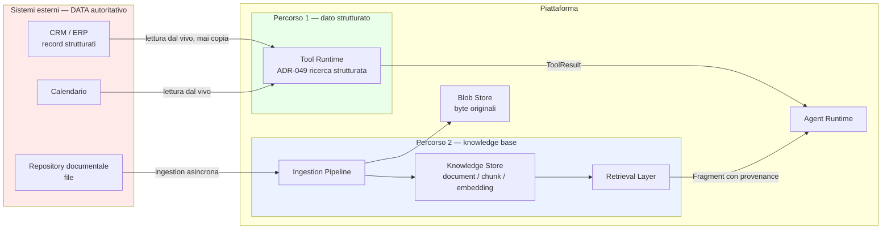

#### Come leggerlo

Il riquadro rosso a sinistra è **fuori dalla piattaforma**: lì vive il dato vero, e resta lì.

Dentro la piattaforma ci sono **due percorsi paralleli che non si toccano**:

- il percorso verde (`Tool`) va a leggere il dato strutturato **ogni volta**, dal vivo. Non
  c'è nessuna scatola di memorizzazione lungo quel percorso: è deliberato;
- il percorso azzurro (knowledge base) è **asincrono**: i documenti entrano quando entrano,
  vengono lavorati, e stanno lì. Ha una scatola di memorizzazione perché il suo scopo è
  esattamente quello.

Il `Blob Store` sta fuori da entrambi i riquadri perché è l'unico posto dove teniamo dei
**byte irrimediabili**: se si perde quello, non si ricostruisce (§22).

Entrambi i percorsi finiscono nell'`Agent Runtime`, ma con oggetti diversi: `ToolResult` da
una parte (governato da `A06`), `Fragment` dall'altra (governato da questo documento). E
hanno `trust_class` diverse: vedi §18.1.

### 5.5 Responsabilità e non responsabilità del confine

**Il `Retrieval Layer` è responsabile di:** trovare frammenti di documenti, applicare il
filtro di autorizzazione, restituire provenance completa.

**Il `Retrieval Layer` NON è responsabile di:** leggere record del CRM, decidere se un dato
è aggiornato rispetto alla sorgente (può solo dichiarare quando l'ha visto l'ultima volta),
risolvere conflitti fra sorgenti (li **espone**, §19.4), decidere se l'utente ha diritto a
qualcosa (quella è del PDP: il `Retrieval Layer` **applica** una decisione già presa, §14).

**Il `Tool Runtime` NON è responsabile di:** cercare nei documenti. Se un giorno esistesse
un `Tool` che fa ricerca documentale, sarebbe un secondo canale verso lo stesso dato con
regole diverse — lo stesso errore che stiamo evitando col CRM, al contrario. §15.6 discute
il caso.

---

## 6. Le architetture candidate, confrontate

Il prompt (§8) impone di identificare almeno **tre** architetture significative e
confrontarle prima di scegliere. Lo faccio sul serio, anche se `ADR-003` (PostgreSQL come
unico system of record Day-1, incluso il vector search via pgvector) è già stato deciso da
`A01`: il confronto serve a sapere **cosa stiamo comprando e cosa stiamo rinunciando**, e a
riconoscere il momento in cui la decisione va riaperta.

### 6.1 Le opzioni reali

**Opzione A — PostgreSQL puro, senza vettori.**
Ricerca solo *full-text* con `tsvector`. Nessun embedding, nessun modello di embedding,
nessuna GPU o CPU in più.

**Opzione B — PostgreSQL + pgvector + blob store su filesystem.**
Ricerca ibrida: `tsvector` per le parole, `pgvector` per il significato. I byte originali
su disco, indirizzati per hash.

**Opzione C — PostgreSQL + motore di ricerca dedicato + vector database dedicato.**
Per esempio: PostgreSQL per lo stato, un motore di ricerca per il testo, un vector store
separato per i vettori.

**Opzione D — Data lake / lakehouse.**
Tutto in file colonnari su object storage, con un motore di query sopra.

**Opzione E — Poliglotta.**
Ogni tipo di dato nel suo store ottimale, con un livello di federazione sopra.

**Opzione F — Knowledge graph al centro.**
Un database a grafo come rappresentazione primaria della conoscenza, con la ricerca
testuale come accessorio.

### 6.2 La matrice di selezione

Legenda: ●●● ottimo · ●●○ adeguato · ●○○ debole · ✗ inadatto.

| Criterio | A: PG puro | **B: PG + pgvector** | C: PG + search + vector DB | D: data lake | E: poliglotta | F: graph-centrico |
|---|---|---|---|---|---|---|
| Semplicità Day-1 | ●●● | **●●●** | ●○○ | ✗ | ✗ | ●○○ |
| Ricerca lessicale | ●●● | **●●●** | ●●● | ●○○ | ●●● | ●○○ |
| Ricerca semantica | ✗ | **●●○** | ●●● | ●○○ | ●●● | ●○○ |
| Query strutturate | ●●● | **●●●** | ●●● | ●●○ | ●●○ | ●●○ |
| Freschezza | ●●● | **●●●** | ●●○ | ●○○ | ●●○ | ●●○ |
| Consistenza transazionale | ●●● | **●●●** | ●○○ | ✗ | ●○○ | ●●○ |
| Sicurezza / filtro autorizzativo | ●●● | **●●●** | ●○○ | ●○○ | ●○○ | ●●○ |
| Isolamento tenant | ●●● | **●●●** | ●●○ | ●●○ | ●○○ | ●●○ |
| Provenance | ●●● | **●●●** | ●●○ | ●●● | ●●○ | ●●● |
| Ricostruibilità dell'indice | ●●● | **●●●** | ●●● | ●●● | ●●○ | ●●○ |
| Performance su grande scala | ●●○ | **●○○** | ●●● | ●●● | ●●● | ●●○ |
| Scalabilità | ●●○ | **●○○** | ●●● | ●●● | ●●● | ●●○ |
| Carico operativo | ●●● | **●●●** | ●○○ | ✗ | ✗ | ●○○ |
| Complessità di migrazione **verso** | — | **bassa** | media | alta | alta | alta |
| Raccomandazione | no | **SÌ Day-1** | quando `T-03` | mai per questo caso | mai come punto di partenza | quando `T-KN-06` |

### 6.3 Perché B, e perché non le altre

Il prompt (§62) chiede di rispondere esplicitamente a una serie di "perché no". Lo faccio.

**Perché non A (PostgreSQL puro senza vettori)?**
Perché la ricerca *full-text* trova le **parole**, non i **significati**. Se l'utente chiede
"quali clienti hanno problemi con i pagamenti" e il documento dice "insoluti ricorrenti", la
ricerca lessicale non trova niente. Nel contesto CRM italiano il problema è aggravato dalla
morfologia: "pagamento", "pagamenti", "pagato" richiedono uno *stemmer* configurato per
lingua, e comunque restano parole, non concetti.
**Contro-argomento onesto, e serio:** A è più difendibile di quanto sembri. Molti sistemi
RAG aziendali scoprono che la maggior parte del valore viene dalla ricerca lessicale ben
fatta, e che i vettori aggiungono poco. Se `Q-04` rivelasse un volume piccolo e un
vocabolario molto tecnico e stabile, A sarebbe la scelta giusta. Il motivo per cui non
parto da A è che **la struttura di B contiene A**: la componente lessicale c'è comunque
(§15), quindi non stiamo pagando A come costo aggiuntivo, e possiamo misurare quanto
contribuisce ciascuna delle due (§21.3).

**Perché non un vector database dedicato Day-1?**
Perché `AR-019` lo vieta: *"nessun datastore nuovo senza una misura del limite attuale"*.
Non abbiamo ancora misurato il limite di pgvector, e `Q-04` è aperta. Introdurre un secondo
store adesso significherebbe pagare un costo operativo certo contro un beneficio ipotetico.
E soprattutto: un vector store separato **spezza la transazione**. Oggi possiamo scrivere il
`chunk` e il suo `embedding` nella stessa `COMMIT` del `document_version`. Con uno store
separato, ogni scrittura diventa una scrittura distribuita da riconciliare, cioè un
problema di consistenza che oggi semplicemente non esiste.
Il trigger che lo giustifica esiste già: **`T-03`** (recall del retrieval sotto soglia con
pgvector). §21.4 spiega come renderlo misurabile davvero, perché così com'è non lo è.

**Perché non un cluster di ricerca Day-1?**
Stesso argomento di `AR-019`, più uno: un motore di ricerca dedicato porta con sé un
**secondo modello di sicurezza**. Il filtro per permessi che §14 costruisce dentro SQL — con
RLS come rete di sicurezza a livello di database — andrebbe reimplementato nel linguaggio di
query del motore di ricerca, senza RLS sotto. Il rischio di un filtro dimenticato passa da
"impossibile per costruzione" a "dipende dalla disciplina di chi scrive la query".

**Perché non un knowledge graph?**
`ADR-079`, §19.5. In breve: le entità e le relazioni che un grafo modellerebbe (cliente
→ contratto → fattura) **esistono già** nel CRM come chiavi esterne, e sono autoritative lì.
Costruirne una copia a grafo significherebbe violare `ADR-067`. Ciò che serve davvero — il
collegamento fra un documento e le entità che nomina — è una tabella con due colonne.

**Perché non un data lake?**
Perché non abbiamo un problema di volume né di analitica. Un lakehouse risolve "ho petabyte
di dati eterogenei e voglio fare query analitiche su tutto". Noi abbiamo "ho dei documenti e
devo trovarne i pezzi giusti, con i permessi giusti, in fretta". Sono problemi diversi. E il
carico operativo (`AS-04`: il team è 1-3 persone senza SRE dedicato) lo rende improponibile.

**Perché non un'architettura poliglotta Day-1?**
Perché la poliglotta è il **punto di arrivo** di una serie di migrazioni giustificate, non
un punto di partenza. Partire poliglotti significa pagare `n` costi operativi prima di
sapere quale dei `n` store serviva davvero.

**Perché non RAG puro?**
Questa è la domanda più importante del prompt, e la risposta è §5: **il RAG non è il canale
principale**. Per il dato aziendale strutturato — che è la maggior parte del lavoro di un
agent CRM — il canale è il `Tool`, dal vivo. Il RAG serve solo per i documenti. Un'
architettura che avesse trattato tutto come RAG avrebbe messo il CRM dentro un indice
vettoriale, cioè avrebbe fatto rispondere l'agent su saldi e scadenze con una copia
approssimata e in ritardo. Sarebbe stato l'errore più grave possibile in questo dominio.

**Perché non solo query strutturata?**
Perché i contratti e le procedure interne non hanno campi. Un'architettura di sola query
strutturata non può rispondere a "cosa dice il contratto sul recesso anticipato".

### 6.4 `ADR-003` non viene riaperto — ma il suo perimetro viene precisato

Il mandato è chiaro: non riaprire `ADR-003` (PostgreSQL unico system of record Day-1,
incluso il vector search via pgvector) senza un argomento forte.

**Non lo riapro. Lo confermo.** Il confronto di §6.2 arriva alla stessa conclusione a cui
era arrivato `A01`, per strade diverse, e questo è un buon segno.

**Faccio però una precisazione di perimetro**, e la dichiaro apertamente invece di
introdurla di soppiatto: i **byte originali dei documenti non stanno dentro PostgreSQL**
(`ADR-073`, §22). L'argomento è in §22.2. In sintesi: `ADR-003` governa il system of record
dello **stato e del dato interrogabile**; un array di byte immutabile indirizzato dal suo
hash non è stato, non è interrogabile, non partecipa a nessuna transazione e non ha nessuna
semantica di consistenza. Metterlo nel database peggiora la cosa che ci interessa di più —
la velocità di ripristino da backup — senza migliorare niente.

Chi non è d'accordo ha un argomento legittimo: "hai appena introdotto un secondo posto dove
stanno i dati, e `AR-019` chiede una misura prima di farlo". La risposta sta in §22.2 ed è,
onestamente, la parte più discutibile del documento.

---

## 7. L'architettura, dall'alto

### 7.1 Diagramma: architettura complessiva della knowledge

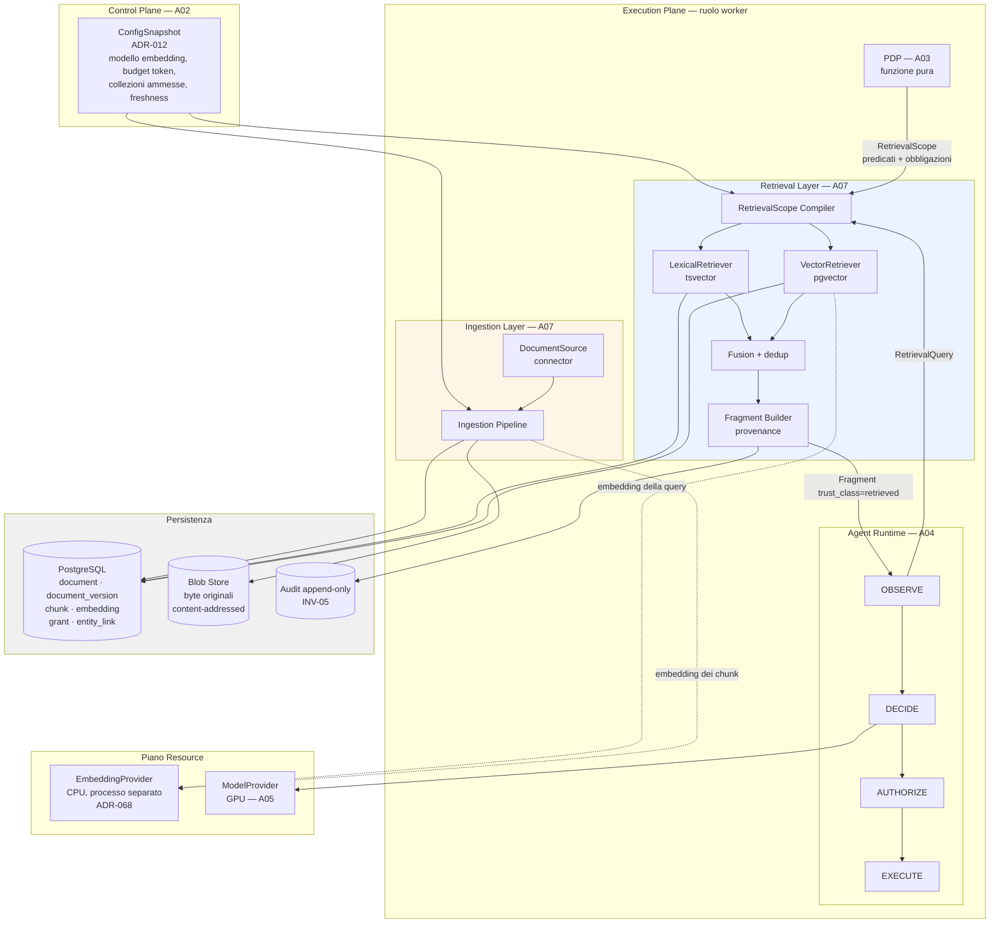

#### Come leggerlo

Ci sono **due flussi che si incontrano solo nel database**, ed è deliberato — è la stessa
forma di `AR-002` (`api` e `worker` comunicano solo tramite il database).

Il flusso **arancione** (ingestion) va da sinistra verso il basso: un connector porta dentro
un documento, la pipeline lo lavora, i byte finiscono nel `Blob Store` e le righe in
PostgreSQL. È **asincrono**, gira nel ruolo `worker`, e nessuno lo aspetta.

Il flusso **azzurro** (retrieval) è quello che vive dentro un run: parte da `OBSERVE`,
passa dal `RetrievalScope Compiler` che è il ponte con il PDP, interroga il database con
due retriever diversi in parallelo, fonde i risultati, costruisce i `Fragment` con la
provenance e li restituisce a `OBSERVE`.

**Il punto più importante del diagramma è la freccia dal PDP al `RetrievalScope Compiler`.**
Il PDP è una funzione pura (`ADR-020`: nessun I/O, nessun orologio, nessuna casualità),
quindi **non può eseguire una ricerca**. Quello che produce è un oggetto: l'insieme dei
predicati che definiscono cosa questo utente, con questo agent, in questo tenant, in questo
momento, ha diritto di vedere. Il `Retrieval Layer` **compila** quell'oggetto in una
condizione SQL. §14 è tutta su questa freccia.

Nota anche che l'`EmbeddingProvider` è collegato con linee **tratteggiate** a due posti
diversi: la pipeline lo usa in batch (nessuno aspetta), il `VectorRetriever` lo usa per una
sola query (qualcuno aspetta). Sono due profili di carico diversi sullo stesso contratto —
ed è esattamente il motivo di `ADR-068`.

### 7.2 I componenti nuovi introdotti da `A07`

Sono cinque. Per ciascuno: responsabilità e **non** responsabilità, come impone la
convenzione (§18).

#### `Knowledge Store`

**In breve.** Le tabelle di PostgreSQL che tengono documenti, versioni, *chunk*, embedding e
i loro metadati. Non è un servizio: è uno schema.

**Responsabilità:** conservare la rappresentazione derivata dei documenti; garantire che
ogni riga abbia `tenant_id` (`AR-017`/`AR-018`, `INV-02`); garantire che ogni artefatto
derivato punti alla sua origine.

**Non responsabilità:** non decide chi vede cosa (lo fa il `Retrieval Layer` applicando la
decisione del PDP); non contiene byte originali (quelli stanno nel `Blob Store`); non
contiene dati del CRM (`ADR-067`); non contiene memoria (`A08`); non contiene audit
(`INV-05`: l'audit è append-only e non condivide tabella con lo stato mutabile).

#### `Ingestion Pipeline`

**In breve.** Il pezzo di codice, eseguito nel ruolo `worker`, che prende un documento da
una sorgente e lo porta fino allo stato "cercabile".

**Responsabilità:** eseguire gli stadi (§11) in modo idempotente e ripartibile; registrare
ogni fallimento come uno **stato visibile**, mai come silenzio; rispettare i limiti di
concorrenza.

**Non responsabilità:** non decide *quali* documenti ingerire (lo decide un
`DocumentSource`); non trasforma dati del CRM; non applica policy di autorizzazione
sull'accesso (le **registra**, cioè copia l'`acl_ref`, §14.4); non usa la GPU
(`AR-KN-16`).

#### `EmbeddingProvider`

**In breve.** Il contratto verso il modello che trasforma testo in vettori. Una funzione:
testo dentro, numeri fuori.

**Responsabilità:** produrre embedding; dichiarare il proprio `model_id` e
`model_version` in modo che ogni vettore prodotto sia attribuibile (`AR-KN-14`); essere
deterministico a parità di input, modello e preprocessing.

**Non responsabilità:** non decide cosa embeddare; non sa cos'è un tenant; non fa ricerca;
non normalizza il testo (lo fa la pipeline, con una `preprocessing_version` dichiarata).

#### `Retrieval Layer`

**In breve.** Il componente che, data una domanda e un ambito di autorizzazione, restituisce
i frammenti che l'utente ha diritto di vedere, con la loro provenienza.

**Responsabilità:** compilare la `RetrievalScope` in predicati SQL; eseguire i retriever;
fondere e deduplicare; costruire i `Fragment` con provenance completa; rispettare il budget
di token; registrare l'audit del retrieval.

**Non responsabilità:** non decide l'autorizzazione (la **applica**); non assembla il prompt
(lo fa l'`Agent Runtime`, §17); non chiama il modello di generazione; non ritenta (come
`AR-TL-10` per il Tool Runtime: chi ritenta è chi orchestra); non interpreta il contenuto
dei frammenti.

#### `Blob Store`

**In breve.** Un posto dove mettere byte immutabili e ritrovarli dal loro hash.

**Responsabilità:** memorizzare e restituire byte per `content_hash`; garantire l'integrità
(l'hash è la verifica).

**Non responsabilità:** non ha nessuna nozione di documento, versione, tenant o permesso.
Chi conosce l'hash può leggere i byte — quindi l'autorizzazione sta **interamente** nel
fatto che l'hash è raggiungibile solo attraverso una riga di PostgreSQL protetta da RLS.
Questo è un vincolo importante e va scritto: `AR-KN-22`, §22.3.

---

## 8. Strutturato, semi-strutturato, non strutturato

Il prompt (§9) insiste su un punto ovvio e importante: **un record CRM e un contratto PDF
non sono lo stesso tipo di informazione**, e trattarli allo stesso modo è l'errore
tipico dei sistemi RAG.

| Tipo | Esempio | Rappresentazione | Ricerca | Owner |
|---|---|---|---|---|
| **Strutturato** | scheda cliente, riga ordine | nessuna in piattaforma | `Tool` di ricerca strutturata | CRM |
| **Semi-strutturato** | ticket, nota su un'opportunità | `NON ANCORA DECISO` (`Q-01`) | ibrida | CRM |
| **Non strutturato** | contratto PDF, procedura, manuale | `document` + `chunk` + `embedding` | ibrida lessicale + vettoriale | piattaforma (l'indice) |
| **Temporale** | "com'era l'indirizzo a marzo" | `document_version` per i documenti; **niente** per il CRM | vedi §19.6 | — |
| **Relazionale** | cliente → contratto → fattura | chiavi esterne **nel CRM**; `entity_link` in piattaforma solo per collegare documenti a entità | `Tool` + join locale minimale | CRM |
| **Documentale** | il file in sé | `Blob Store` + `document_version` | per identificatore | piattaforma |
| **Evento** | "il contratto è stato firmato" | step journal (`A04`), audit (`INV-05`) | non è knowledge | piattaforma |
| **Semantico** | "cosa significa cliente strategico" | **nessuna** Day-1 (`ADR-080`) | — | — |

### 8.1 Come si collegano: `entity_link`

C'è un problema pratico che va risolto: se l'agent sta lavorando sul cliente `ACME` e c'è un
contratto PDF che riguarda `ACME`, come fa il `Retrieval Layer` a saperlo?

La risposta **non** è "il modello lo capisce dal testo". Sarebbe fragile e lento.

**DECISIONE ARCHITETTURALE.** Esiste una tabella `entity_link` che collega un
`document` a zero o più entità del sistema esterno, per **identificatore**:

```text
entity_link(tenant_id, document_id, source_system, entity_type, entity_id, confidence, established_by)
```

Punti importanti:

- contiene **identificatori, non dati**. Non c'è il nome del cliente, non c'è il suo
  indirizzo. Solo `("odoo", "res.partner", "1042")`. Così `ADR-067` resta rispettata: non
  stiamo copiando il CRM, stiamo tenendo un puntatore;
- `established_by` dice **come** è nato il collegamento: `explicit` (l'utente l'ha detto),
  `metadata` (era nel percorso del file o nei metadati del documento), `extracted`
  (qualcuno l'ha dedotto dal testo). Un collegamento `extracted` ha `confidence < 1` e non
  è mai l'unica base di un filtro restrittivo;
- **non è un knowledge graph.** È una tabella di collegamento a due estremi. Le domande di
  traversamento profondo (§19.5) si risolvono nel CRM, dove le relazioni sono autoritative.

**`AR-KN-06`: nessun campo di dato del CRM viene copiato nell'indice della knowledge base.
Solo identificatori.** Verificabile: una revisione dello schema di `entity_link` e
`document` mostra che non esistono colonne di dominio.

**Contro-argomento onesto:** questo rende impossibili alcune query utili, del tipo "trovami
i documenti dei clienti del settore energia". Per farla, bisogna prima chiedere al CRM
l'elenco degli id dei clienti del settore energia (un `Tool`), e poi filtrare i documenti
per quegli id. Sono due passi invece di uno, e se gli id sono migliaia la query diventa
scomoda. Lo accetto: è il prezzo di non avere una copia da tenere sincronizzata. Se diventa
un problema misurato, la mossa non è copiare il CRM, è aggiungere una **proiezione
esplicita e dichiarata** di pochi campi di classificazione, con la sua freschezza dichiarata
(§13.4) — e sarebbe un ADR nuovo, non una scorciatoia.

---

## 9. Il modello dati: cinque entità che non vanno collassate

Il prompt (§15) è esplicito: un documento richiede più rappresentazioni, e **non vanno
collassate in una sola entità**.

### 9.1 `ADR-074` — Cinque entità distinte

**DECISIONE ARCHITETTURALE.**

| Entità | Cos'è | Muta? | Ricostruibile? |
|---|---|---|---|
| `document` | l'**identità** del documento nel tempo: "il contratto con ACME" | i metadati sì, l'identità no | **no**, è l'ancora |
| `document_version` | **una** versione concreta: un `content_hash`, una data, uno stato di ingestion | **no**, immutabile | no (dipende dal blob) |
| `parsed_content` | il testo estratto e strutturato da quella versione | no, immutabile per `(version, parser_version)` | **sì**, dal blob |
| `chunk` | un pezzo di `parsed_content`, con posizione e metadati | no, immutabile per `(parsed, chunking_version)` | **sì** |
| `embedding` | il vettore di un `chunk` per un dato modello | no, immutabile per `(chunk, model_version)` | **sì** |

**Perché non collassare.** Se `document` e `document_version` fossero la stessa riga, non
potremmo rispondere a "cosa diceva il contratto a marzo" e ogni aggiornamento distruggerebbe
la provenance dei run passati. Se `chunk` e `embedding` fossero la stessa riga, cambiare
modello di embedding vorrebbe dire ri-chunkare (§20). Se `parsed_content` non esistesse,
cambiare parser vorrebbe dire riscaricare i file.

Il criterio è lo stesso di `AR-CP-02` in `A02` (una risorsa si giustifica se ha lifecycle
proprio, owner proprio, ed è riferita da qualcosa): **ognuna di queste cinque ha un
lifecycle proprio, perché ognuna può essere invalidata da una causa diversa.**

| Entità | Cosa la invalida |
|---|---|
| `document` | cancellazione alla sorgente |
| `document_version` | una nuova versione alla sorgente |
| `parsed_content` | cambio di `parser_version` |
| `chunk` | cambio di `chunking_version` |
| `embedding` | cambio di `embedding_model_version` |

Questa tabella è il vero argomento. Cinque cause diverse, cinque entità.

### 9.2 Diagramma: entità e relazioni

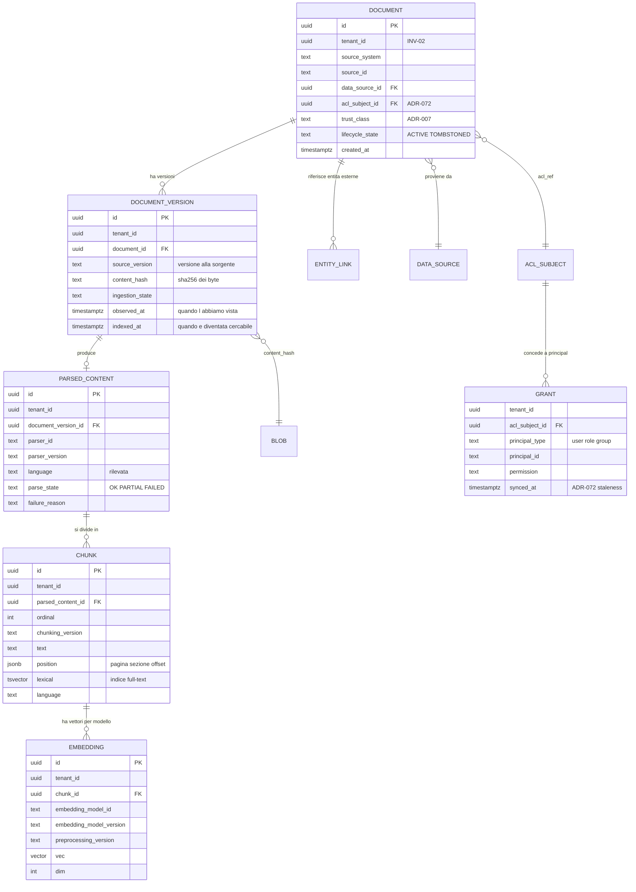

#### Come leggerlo

Si legge dall'alto verso il basso come una **catena di derivazione**: ogni livello è
prodotto da quello sopra e può essere buttato via e rifatto.

Le tre cose che non si possono rifare sono: la riga `DOCUMENT` (è l'identità), il `BLOB`
(sono i byte originali), e la riga `GRANT` **se la sorgente non è più raggiungibile**.

`tenant_id` compare su **ogni** entità, anche dove sarebbe derivabile risalendo la catena.
È ridondante di proposito: `INV-02` e `AR-017`/`AR-018` chiedono `tenant_id` su ogni riga, e
soprattutto la RLS (§14.6) deve poter filtrare **ogni tabella singolarmente**, senza join.
Una politica di sicurezza che dipende da un join è una politica che si può dimenticare.

Le due entità più a destra — `ACL_SUBJECT` e `GRANT` — sono il cuore di §14. Nota che
`DOCUMENT` punta a un `ACL_SUBJECT`, **non** contiene una lista di permessi. È `ADR-072`.

### 9.3 Perché `observed_at` e `indexed_at` sono due colonne diverse

Sembra un dettaglio; non lo è.

- `observed_at` è **quando abbiamo visto quella versione alla sorgente**. Serve a rispondere
  alla domanda "quanto è vecchia questa informazione?".
- `indexed_at` è **quando è diventata cercabile da noi**. Serve a rispondere alla domanda
  "da quando questo frammento può comparire in una risposta?".

La differenza fra le due è la **latenza di ingestion**, ed è una metrica (§21). Ma
soprattutto: quando un `Fragment` finisce nel prompt (§17.2), quello che va mostrato al
modello è `observed_at`, perché è la data che conta per capire se l'informazione è
attuale. Se mostrassimo `indexed_at`, un documento vecchio di due anni reindicizzato ieri
sembrerebbe fresco.

Questo è il tipo di errore che rende un sistema RAG silenziosamente sbagliato.

---

## 10. Embedding, chunking e `DEF-02`

`DEF-02` (chunking e modello di embedding) è assegnato a `A07` e dipende da `Q-04`, che è
aperta. Lo chiudo **in parte**, e dichiaro con precisione la parte che resta aperta e con
quale criterio si chiude.

### 10.1 Cosa viene trasformato in embedding e cosa no

**DECISIONE ARCHITETTURALE.** Si trasforma in embedding **solo il `chunk` di un
`parsed_content`**. Non si embedda:

- nessun record CRM (`ADR-067`);
- nessun metadato da solo (il titolo, l'autore, la data non diventano vettori: diventano
  colonne su cui si filtra);
- nessun `chunk` con `parse_state = FAILED` (§19.2);
- nessun documento in quarantena (§18.2).

**Perché non embeddare i metadati.** È una tentazione comune ("così la ricerca capisce anche
le date"). È sbagliata: un embedding di una data è un vettore che assomiglia ad altre date,
non un vincolo. Le date si filtrano, non si cercano per somiglianza. Confondere i due
significa costruire un sistema che risponde "circa marzo" a una domanda su marzo.

### 10.2 `ADR-087` — Il modello di embedding: slot deciso, checkpoint aperto

**Cosa decido adesso (vincolante):**

| Proprietà | Decisione | Perché |
|---|---|---|
| Dove gira | **CPU, processo separato** | `ADR-068` |
| Provenienza | **pesi locali**, nessuna API esterna | `AR-MD-09`, `ADR-046` (allowlist per digest) |
| Lingue | **multilingua, almeno italiano e inglese** | §19.7. Esclude i modelli solo-inglese |
| Contratto | `EmbeddingProvider`, API OpenAI-compatible su loopback | coerenza con `ADR-005`/`ADR-038` |
| Dimensione del vettore | **è una variabile di budget**, dichiarata nello snapshot | §10.3 |
| Versionamento | `embedding_model_id` + `embedding_model_version` su ogni riga | `AR-KN-14` |
| Coesistenza | lo schema **deve** permettere due modelli attivi insieme | §20 |

**Cosa resta `NON ANCORA DECISO`:** il **checkpoint concreto**. Non lo scelgo perché
sceglierlo adesso significherebbe inventare: non ho fatto la ricerca sui candidati, e i
numeri di qualità comparativa fra modelli di embedding cambiano di mese in mese.

**Il criterio di decisione, scritto in modo che chiunque possa applicarlo** — questo è
quello che `DEF-02` chiedeva davvero:

1. **Ammissione (vincoli duri, un candidato che ne fallisce uno è escluso):**
   - supporta italiano e inglese in modo dichiarato dall'autore del modello;
   - licenza compatibile con l'uso commerciale on-premise;
   - dimensione del vettore **entro il limite indicizzabile** del motore vettoriale scelto
     (`B-28`: verificare il limite di pgvector per l'indice ANN — `DA VERIFICARE`, non lo
     do per noto);
   - la sua finestra di input copre la dimensione di *chunk* scelta in §10.4;
   - i pesi sono scaricabili e verificabili per digest (`ADR-046`).
2. **Selezione (fra i candidati ammessi, in quest'ordine):**
   - **latenza p95 sulla singola query, su CPU, sull'hardware reale** — è la metrica che
     decide, perché è l'unica che sta sul percorso critico (`B-26`);
   - **recall@k sul golden set** costruito secondo §21.4;
   - dimensione del vettore, a parità del resto: **più piccolo è meglio**, perché il costo
     di storage e di indice è lineare nella dimensione e questo si paga per sempre.

3. **Decision deadline:** **prima dello schema del database.** La dimensione del vettore è
   una colonna tipizzata (`vector(n)`); cambiarla dopo è una migrazione di tutta la tabella.

**Contro-argomento onesto:** lasciare aperto il checkpoint significa che lo schema non si
può scrivere. È vero, ed è il costo. La mitigazione è che il criterio è meccanico: chiunque
con due giorni e l'hardware può eseguirlo. E la parte davvero costosa dello schema — le
cinque entità di §9.1 — non dipende dal checkpoint. Dipende **solo** la colonna `dim`.

`DEF-02` è quindi **chiusa per la parte di chunking (§10.4) e per la forma del modello di
embedding**, e resta aperta sul **checkpoint**, con criterio e scadenza. Ricerca `B-27`.

### 10.3 La dimensione del vettore è una decisione di capacità

Questo è il parallelo esatto di `ADR-039` (`max_model_len` come decisione di capacità): un
numero che sembra tecnico e invece è un budget.

**INFERENZA.** Lo spazio occupato dagli embedding è, in prima approssimazione, proporzionale
a `numero_di_chunk × dimensione_del_vettore × byte_per_componente`. L'indice ANN (HNSW)
occupa spazio **in aggiunta** ai vettori e deve stare in RAM per essere veloce.

**Non scrivo numeri**, perché `Q-04` è aperta e non voglio inventare. Scrivo la **formula**
e la misura da fare (`B-28`).

**DECISIONE ARCHITETTURALE.** `embedding_dim` è dichiarato nel `ConfigSnapshot` e la sua
scelta è motivata per iscritto insieme alla stima di occupazione a tre ordini di grandezza
di `Q-04` (§25.1). Se il modello scelto supporta la riduzione dimensionale nativa, la
**riduzione va valutata esplicitamente**, non ignorata.

### 10.4 `ADR-075` — Chunking: struttura prima, dimensione dopo

Il prompt (§14) vieta di assumere che il chunking a dimensione fissa sia ottimale. Sono
d'accordo, e il motivo è concreto.

**Perché il chunking a dimensione fissa fa danni.** Se tagli ogni 500 parole senza guardare
il documento, prima o poi tagli un contratto a metà di una clausola. Il frammento che ne
risulta dice "…il Cliente ha facoltà di recedere entro" e finisce lì. È peggio di non
trovare niente: è un frammento **plausibile e sbagliato**, e il modello lo userà.

**DECISIONE ARCHITETTURALE: chunking structure-aware con fallback dichiarato.**

L'ordine di preferenza per tagliare, dal più forte al più debole:

1. **confine strutturale esplicito** — sezione, articolo, capitolo, intestazione, cella di
   una tabella, messaggio in un thread. Se il parser lo ha riconosciuto, si taglia lì;
2. **confine di paragrafo**;
3. **confine di frase**;
4. **taglio a dimensione, con sovrapposizione** — solo come ultima risorsa, e **registrato**:
   il `chunk` porta un flag `boundary_quality = forced`.

Quel flag è la parte importante. Non pretendo che il chunking sia perfetto; pretendo che
**sappia dire quando non lo è stato**, così la qualità è misurabile invece che sperata.

**Cosa il `chunk` deve preservare sempre** (il prompt §14 lo chiede esplicitamente):

| Metadato | Perché serve |
|---|---|
| `document_id`, `document_version_id` | provenance e lineage (§12) |
| `ordinal` | ricostruire l'ordine, e recuperare i vicini (§16.4) |
| `position` (pagina, sezione, offset) | citare, e permettere all'utente di verificare |
| `language` | scegliere la configurazione full-text giusta (§19.7) |
| `boundary_quality` | misurare la qualità del chunking |
| `chunking_version` | ricostruibilità (§20) |
| **niente ACL** | l'ACL sta sul `document` per riferimento — `ADR-072`, §14.4 |

**Strategie per tipo di documento:**

| Tipo | Strategia | Note |
|---|---|---|
| PDF con testo | struttura (intestazioni, pagine) → paragrafo → frase | la pagina è quasi sempre disponibile e va tenuta per la citazione |
| Contratto | **articolo/clausola**, mai a dimensione | un contratto ha una struttura numerata: usarla è quasi gratis e il guadagno è enorme |
| Documentazione tecnica / Markdown | intestazioni gerarchiche | il livello dell'intestazione va nel `position` |
| Email | **fuori Day-1** (`ADR-085`) | — |
| Spreadsheet | vedi §19.3, con riserve | `NON ANCORA DECISO` oltre il minimo |
| Record CRM | **non si chunka**: non entra (`ADR-067`) | — |

**La dimensione target è `NON ANCORA DECISO`**, e dipende da due cose che ancora non
conosciamo: la finestra di input del modello di embedding scelto, e il `retrieval_token_
budget` di §17.3. Il criterio: **il chunk deve stare nella finestra del modello di
embedding, e `k` chunk devono stare nel budget di token.** Sono due disuguaglianze; una
volta noti i due parametri, la dimensione si ricava.

**Contro-argomento onesto:** il chunking gerarchico — indicizzare sia i pezzi piccoli sia i
loro contenitori, e restituire il contenitore quando servono più pezzi vicini — è
probabilmente superiore, e lo sto rinviando. Lo rinvio perché raddoppia il numero di righe e
di embedding (quindi il costo su CPU, `ADR-068`) per un beneficio che non so ancora
misurare. La mitigazione economica è in §16.4: espansione dei vicini al momento del
retrieval, che ottiene una parte del beneficio senza raddoppiare l'indice.

---

## 11. La pipeline di ingestion

### 11.1 Gli stadi

Il prompt (§16) propone una pipeline e chiede se sia corretta. È quasi corretta. Ci aggiungo
due cose e ne sposto una.

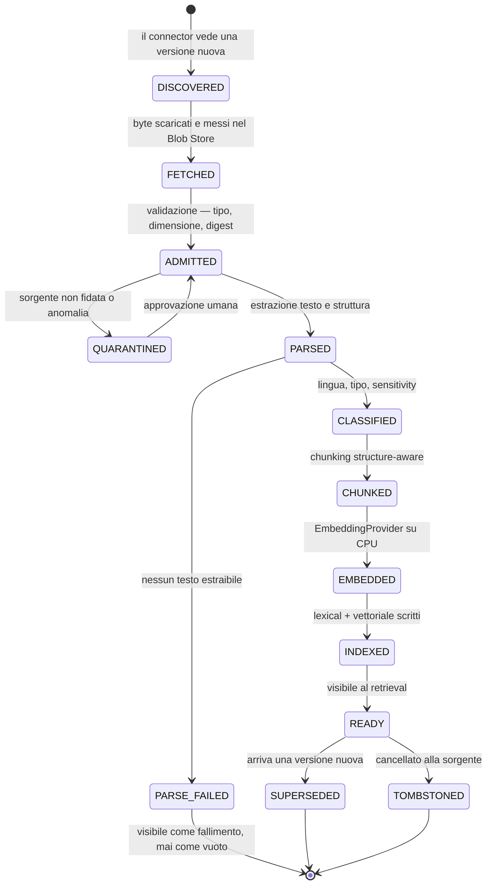

#### Come leggerlo

Ogni scatola è uno **stato persistito** su `document_version.ingestion_state`, non un
passaggio in memoria. Questo è deliberato ed è la stessa logica di `ADR-029` (*scrivi prima
di agire*): se il processo muore a metà, si riparte dallo stato scritto, non da capo.

Le tre uscite in basso sono i modi in cui una versione **smette** di essere cercabile:
sostituita da una più nuova, cancellata alla sorgente, o mai arrivata perché non si è
riusciti a leggerla.

**`PARSE_FAILED` è uno stato terminale visibile**, e questa è la differenza fra un sistema
onesto e uno che mente. Un PDF scansionato senza OCR produce zero testo. Se lo trattassimo
come "documento con zero chunk", il documento risulterebbe **presente e vuoto**: l'utente
crederebbe che il sistema l'ha letto e non ci ha trovato niente. `AR-KN-15` lo vieta.

**`QUARANTINED` è lo stadio che il prompt non aveva** e che serve per §18.2 (poisoned
knowledge). Notare che l'uscita dalla quarantena è **umana**: è la stessa scelta di
`ADR-063` (materializzazione umana obbligatoria per i tool MCP di terzi). Stesso principio,
dominio diverso: **niente entra nel sistema con fiducia automatica solo perché è
arrivato.**

### 11.2 Cosa ho cambiato rispetto alla pipeline del prompt

| Modifica | Perché |
|---|---|
| `VALIDATE` diventa `ADMITTED` + `QUARANTINED` | la validazione tecnica (è un PDF? è troppo grande?) e la decisione di fiducia sono due cose diverse con due owner diversi |
| `NORMALIZE` assorbito in `PARSED` | normalizzare separatamente creerebbe una sesta rappresentazione senza un lifecycle proprio: violerebbe `AR-CP-02` applicata ai dati |
| `PARSE_FAILED` esplicito | `AR-KN-15` |
| `FETCHED` scrive nel `Blob Store` **prima** di parsare | i byte sono l'unica cosa irreplaceable: si mettono al sicuro per primi (§22) |
| `CLASSIFIED` include la `x-sensitivity` | serve alla redazione per campo di `AR-GP-17`/`ADR-066`, §14.5 |

### 11.3 Idempotenza dell'ingestion

Il prompt (§49) chiede di definire l'idempotenza. Il sistema ha già un meccanismo e lo
riuso invece di inventarne uno: `AR-026` dice che ogni side effect ha una
`idempotency_key` derivata deterministicamente.

**DECISIONE ARCHITETTURALE (`AR-KN-19`).** La chiave di idempotenza di un'ingestion è:

```text
ingestion_key = hash(tenant_id, source_system, source_id, content_hash)
```

Conseguenze concrete:

- **stesso file, stesso contenuto, ingerito due volte** → stessa chiave → la seconda
  ingestion è un no-op. Nessun documento duplicato;
- **stesso file, contenuto cambiato** → chiave diversa → nasce una `document_version` nuova,
  la precedente va `SUPERSEDED`;
- **file identico che arriva da due sorgenti diverse** → chiavi diverse → due `document`
  distinti. È corretto: hanno ACL potenzialmente diverse. La deduplica si fa a livello di
  `Blob Store` (stesso `content_hash`, un solo blob), non a livello di documento;
- **due worker che prendono lo stesso job** → non succede: la queue è
  `FOR UPDATE SKIP LOCKED` (`ADR-002`).

**FATTO (`research-log` R-05):** `SKIP LOCKED` non è una novità di PostgreSQL 18, esiste da
tempo, e `FOR UPDATE SKIP LOCKED` fa sì che le righe già lockate da un'altra transazione
vengano saltate. Fonte: https://www.postgresql.org/docs/release/18.0/
**INFERENZA:** possiamo riusare lo stesso pattern di queue di `ADR-002` per i job di
ingestion senza introdurre niente di nuovo.

### 11.4 Backpressure: l'ingestion non deve mai vincere

Il prompt (§50) chiede come si gestisce il sovraccarico e dice esplicitamente di non
introdurre Kafka senza giustificazione. Non lo introduco.

**DECISIONE ARCHITETTURALE.** I job di ingestion vivono sulla **stessa queue PostgreSQL** dei
run (`ADR-002`), ma con una `priority` più bassa, e il meccanismo che li limita è quello che
`ADR-047` ha già scelto: **la priorità è un limite di concorrenza a monte, risolto nella
query di prelievo della coda**, non uno scheduler.

Concretamente: il worker che preleva lavoro non prende mai più di `N` job di ingestion
contemporaneamente, e `N` è un numero nella configurazione. Se arrivano diecimila documenti,
la coda cresce; non cresce il consumo di risorse.

**Perché questo basta Day-1:** l'ingestion non ha nessun requisito di latenza. Un documento
che diventa cercabile fra dieci minuti invece che fra dieci secondi non fa danno a nessuno,
purché `observed_at` sia onesto (§9.3) e purché il ritardo sia **misurato** (§21).

**Il dead-letter.** Un job che fallisce ripetutamente finisce in uno stato
`INGESTION_FAILED` con il conteggio dei tentativi e l'ultimo errore. **Non sparisce e non
riprova all'infinito.** Un documento che non si riesce a ingerire è un'informazione
operativa, non un errore da nascondere — stesso spirito di `AR-TL-04` (una capability
mancante è un'osservazione misurata).

**Contro-argomento onesto:** mettere ingestion e run sulla stessa coda significa che un
picco di ingestion aumenta la contesa su quella tabella, e `T-01` (p95 di enqueue oltre
100 ms) potrebbe scattare prima del previsto. È un rischio reale. La mitigazione è che
`T-01` esiste già e ha una metrica; se scatta per colpa dell'ingestion, la mossa giusta non
è Kafka, è separare le due code (due tabelle, stesso meccanismo).

### 11.5 Ingestion sincrona: un caso, uno solo

C'è un caso in cui l'asincronia è sbagliata: **l'utente carica un file e vuole farci una
domanda subito.**

**DECISIONE ARCHITETTURALE.** Esiste un percorso di ingestion **prioritaria** (non
sincrona): il documento caricato dall'utente entra in coda con priorità alta e l'API
restituisce l'`ingestion_job_id`. Il client può interrogare lo stato. Il run che vuole usare
quel documento **aspetta lo stato `READY`** o fallisce con un errore comprensibile.

**Perché non davvero sincrona:** perché il parsing di un PDF grande può durare, e
un'operazione HTTP che dura è un'operazione che va in timeout in un modo che non sai
gestire. E soprattutto: il ruolo `api` non deve fare lavoro pesante — è lo spirito di
`AR-003` (il ruolo `api` non chiama mai il modello) esteso al parsing.

---

## 12. Provenance, lineage e fiducia

### 12.1 Il modello canonico di provenance

Il prompt (§23) elenca dei campi candidati e chiede di stabilire il modello canonico. Lo
faccio, distinguendo i campi **obbligatori** da quelli opzionali — perché un modello di
provenance in cui tutto è opzionale non è un modello.

**Obbligatori su ogni `Fragment` restituito dal `Retrieval Layer`:**

| Campo | Da dove viene | Perché è obbligatorio |
|---|---|---|
| `tenant_id` | `chunk.tenant_id` | `INV-02` |
| `document_id` | `document.id` | identità |
| `document_version_id` | `document_version.id` | senza, non si sa *quale* versione |
| `chunk_id` | `chunk.id` | per l'audit (§18.4) |
| `source_system` | `document.source_system` | l'utente deve sapere da dove viene |
| `source_id` | `document.source_id` | permette di aprire l'originale |
| `source_version` | `document_version.source_version` | permette di confrontare con la sorgente |
| `observed_at` | `document_version.observed_at` | **la data che conta** (§9.3) |
| `position` | `chunk.position` | citare pagina/sezione |
| `trust_class` | costante: `retrieved` | `TB-6`, `ADR-007` |
| `source_trust` | `data_source.trust` | §12.4 |

**Presenti sulla riga ma non nel `Fragment`** (servono a ricostruire, non a decidere):
`parser_version`, `chunking_version`, `embedding_model_id`, `embedding_model_version`,
`preprocessing_version`, `boundary_quality`, `indexed_at`.

**`AR-KN-04`: un frammento senza provenance completa non entra nel context.** Non è una
raccomandazione: è una `NOT NULL` sullo schema più un controllo nel `Fragment Builder` che
solleva un errore. Un frammento senza provenance è un frammento di cui non possiamo
rispondere "da dove viene?", e a quel punto è indistinguibile dall'allucinazione.

### 12.2 Diagramma: la catena di lineage

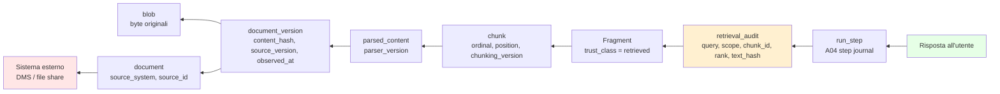

#### Come leggerlo

Si legge **da destra a sinistra** ed è deliberato: la freccia va nella direzione "questo
deriva da quello". Partendo dalla risposta che l'utente ha letto, ogni salto è una domanda
a cui il sistema deve saper rispondere.

Il **livello minimo di lineage** che pretendiamo Day-1 è: dalla risposta si arriva al
sistema esterno in **otto salti**, tutti registrati, senza buchi. Se anche un solo salto
manca, la catena è rotta e non possiamo dire da dove viene un'affermazione.

La scatola gialla, `retrieval_audit`, è il nodo che rende la catena percorribile **a
posteriori**, anche mesi dopo: senza di lei sapremmo cosa c'è oggi nell'indice, non cosa
c'era il giorno del run. Vedi §18.4 per come è fatta e perché **non contiene il testo**.

### 12.3 Cosa risponde questa catena

| Domanda | Risposta |
|---|---|
| "Da dove viene questa frase?" | `Fragment` → `chunk.position` → pagina 4 del contratto |
| "Era aggiornata?" | `document_version.observed_at` |
| "L'utente aveva diritto di vederla?" | `retrieval_audit.scope_hash` + la decisione del PDP registrata |
| "Il documento è cambiato da allora?" | confronto `source_version` di allora con quello attuale |
| "Il documento esiste ancora?" | `document.lifecycle_state` |
| "Perché è stato scelto proprio quel frammento?" | `retrieval_audit.rank` + i punteggi dei due retriever |

Quest'ultima riga vale una nota: registrare **il punteggio di entrambi i retriever** (non
solo il rank finale) è quello che permette, mesi dopo, di capire se una risposta sbagliata è
colpa della ricerca lessicale, di quella vettoriale, o della fusione. Costa due numeri per
riga di audit.

### 12.4 Fiducia nella sorgente: dichiarata, non calcolata

Il prompt (§24) chiede di classificare la fiducia e avverte: *"non permettere che i punteggi
di fiducia diventino euristiche nascoste arbitrarie"*. È l'avvertimento giusto.

**DECISIONE ARCHITETTURALE.** La fiducia è una **proprietà dichiarata della sorgente**, non
un punteggio calcolato dal contenuto. Sta su `data_source.trust`, è un `enum`, e la mette
un amministratore quando configura la sorgente.

| Valore | Significato | Effetto |
|---|---|---|
| `authoritative` | il sistema che detiene la verità su quel dato | precedenza massima nei conflitti (§19.4) |
| `trusted` | repository aziendale controllato | ingestion normale |
| `user_generated` | caricato da un utente della piattaforma | ingestion normale, ma marcato nel context |
| `external` | proviene da fuori l'organizzazione | **quarantena obbligatoria** (§18.2) |
| `unverified` | provenienza incerta | quarantena + non entra nel context senza richiesta esplicita |

**Cosa la fiducia influenza e cosa no:**

| Ambito | Influenzata? | Come |
|---|---|---|
| Ingestion | **sì** | `external`/`unverified` → quarantena |
| Filtro di retrieval | **no** | il filtro è solo autorizzativo. Mescolare fiducia e permessi renderebbe entrambi incomprensibili |
| Ranking | **sì, ma in modo dichiarato** | a parità sostanziale di punteggio, precede la sorgente più fidata. La regola è scritta, non un peso magico |
| Context | **sì** | il `trust` compare accanto al frammento nel prompt (§17.2) |
| Decisioni sui tool | **no direttamente** | ma un `SIDE_EFFECT` basato su fonti non `authoritative` rientra in `ADR-023` (approvazione), che c'è già |

**Perché il ranking sì ma con cautela.** Se la fiducia diventasse un peso numerico
combinato con la similarità, avremmo esattamente l'euristica nascosta che il prompt vieta:
nessuno saprebbe più perché un documento è primo. La forma "a parità sostanziale, precede
il più fidato" è verificabile con un test.

**Non responsabilità:** il `Retrieval Layer` **non valuta la qualità del contenuto**. Non
esiste un punteggio di "quanto è buono questo documento". Se serve, è un problema di data
quality (§19.2), non di retrieval.

---

## 13. Sincronizzazione, freschezza, riconciliazione

### 13.1 `ADR-081` — Day-1 si fa polling incrementale, non CDC

Il prompt (§17, §20) elenca polling, webhook, CDC, event stream, sync programmata.

**DECISIONE ARCHITETTURALE.** Day-1: **polling incrementale per cursore**, più un
**reconciliation sweep** periodico. Niente webhook, niente CDC, niente event stream.

**Come funziona il cursore.** Ogni `data_source` tiene un `sync_cursor`: tipicamente il
`updated_at` più alto già visto, o un token di continuazione se la sorgente ne offre uno.
A ogni giro si chiede alla sorgente "cosa è cambiato dopo questo punto", e si processano le
differenze.

**Perché non i webhook Day-1.** Un webhook richiede un endpoint pubblico raggiungibile dal
sistema esterno, cioè una superficie di rete in ingresso. `T-CP-02` (l'API amministrativa
diventa raggiungibile da rete non fidata) è già il trigger che `A02` prevedeva scattasse per
primo; non voglio aggiungerne un altro prima di avere `A09` (identity) e `A13` (security).
E un webhook non è affidabile da solo: gli eventi si perdono, arrivano fuori ordine,
arrivano due volte. Serve **comunque** il polling come rete di sicurezza. Quindi il webhook
non sostituisce niente: aggiunge.

**Perché non CDC.** Il CDC legge il log delle transazioni del database sorgente. Richiede
accesso al database del CRM — cioè esattamente quello che `INV-07` vieta.

**Trade-off.** Guadagniamo: nessuna superficie di rete in ingresso, nessun accesso al
database sorgente, un solo meccanismo da capire e da debuggare, ripartenza banale (il
cursore è una riga). Perdiamo: latenza di propagazione pari all'intervallo di polling, e
carico costante sulla sorgente anche quando non cambia niente.

**Trigger `T-KN-07`:** se la latenza di propagazione misurata non soddisfa la classe di
freschezza dichiarata per una sorgente, si valuta il webhook **per quella sorgente**, con il
polling che resta come rete di sicurezza.

### 13.2 Diagramma: sincronizzazione e riconciliazione

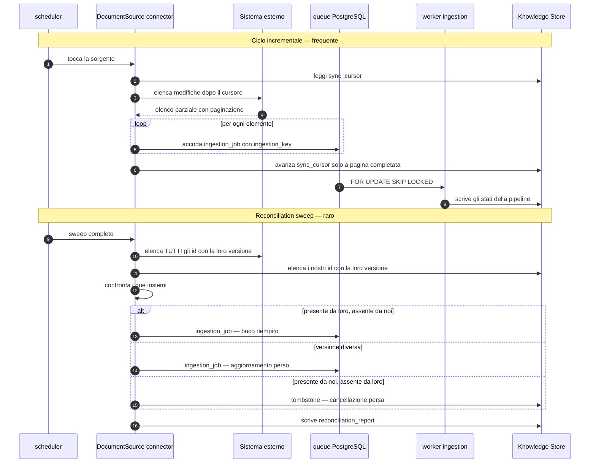

#### Come leggerlo

Ci sono **due cicli con frequenze diverse**, e il secondo esiste perché il primo
prima o poi sbaglia.

Il ciclo incrementale (sopra) è veloce ed economico ma è **fragile in tre modi**: se la
sorgente non riporta correttamente un `updated_at`, la modifica si perde; se qualcosa
fallisce a metà pagina, il cursore non deve avanzare (nota il passo 7: il cursore avanza
*solo a pagina completata*); e le **cancellazioni** spesso non compaiono affatto in un
elenco di modifiche — un record cancellato semplicemente non c'è più.

Il reconciliation sweep (sotto) confronta gli insiemi completi e trova le tre divergenze
possibili: buchi, versioni disallineate e **cancellazioni perse**. Quest'ultimo caso è il
motivo principale per cui lo sweep non è opzionale: senza, un documento cancellato alla
sorgente resterebbe cercabile da noi per sempre. È un problema di sicurezza, non di
qualità.

Il `reconciliation_report` è un artefatto persistito: dice quante divergenze di che tipo ha
trovato. Se quel numero cresce nel tempo, il ciclo incrementale è rotto — ed è una metrica
(§21).

### 13.3 Ordine, duplicati, eventi mancanti

| Problema | Come lo affrontiamo |
|---|---|
| **Ordine** | non ci affidiamo all'ordine. Ogni versione ha `source_version` e `content_hash`; se arriva una versione più vecchia di quella già indicizzata, si scarta |
| **Duplicati** | `ingestion_key` (§11.3): un duplicato è un no-op |
| **Eventi mancanti** | reconciliation sweep |
| **Retry** | il job resta in coda con `attempt` incrementato, come `AR-RT-05` per gli step |
| **Backfill** | è uno sweep con cursore azzerato, sulla coda a priorità bassa |

### 13.4 `ADR-082` — Classi di freschezza, e un run che dichiara di cosa ha bisogno

Il prompt (§18) chiede classi di freschezza; il prompt (§19) pone il requisito critico:
**l'agent non deve ragionare inconsapevolmente su dati obsoleti quando il compito richiede
lo stato corrente**.

Questo è il requisito più difficile della sezione, perché non basta dichiarare le classi:
serve un meccanismo che le **applichi**.

**Le classi:**

| Classe | Che cosa ci sta | Come si ottiene la freschezza |
|---|---|---|
| `live` | record CRM/ERP, calendario, saldo, disponibilità | **lettura dal vivo via `Tool`**. Non esiste una copia da tenere fresca |
| `near_real_time` | `NON ANCORA DECISO` Day-1 | richiederebbe webhook (`T-KN-07`) |
| `periodic` | documenti in repository, contratti, procedure | polling incrementale |
| `static` | documentazione storica, normativa archiviata | sweep raro |

**Il meccanismo (questa è la parte che conta).** Ogni run porta un
`freshness_requirement` nel suo `ConfigSnapshot` — dichiarato sull'`AgentVersion`, quindi
configurazione, non codice. Il `Retrieval Layer` lo confronta con la classe di ogni sorgente
e con l'età reale (`now - observed_at`) e fa **una di tre cose**:

1. la sorgente soddisfa il requisito → il frammento entra normalmente;
2. la sorgente non lo soddisfa ma il requisito è `advisory` → il frammento entra **con un
   marcatore di obsolescenza esplicito nel context** (§17.2);
3. la sorgente non lo soddisfa e il requisito è `strict` → il frammento **non entra**, e il
   `RetrievalResult` porta un `excluded_for_staleness` che il runtime vede.

Il caso 3 è quello che serve a un agent che sta per fare un `SIDE_EFFECT`. Se un agent sta
per mandare una fattura, non deve poter usare un frammento di sei mesi fa senza che nessuno
se ne accorga.

**`AR-KN-17`: ogni run dichiara un `freshness_requirement`, e il `Retrieval Layer` lo
applica escludendo o marcando. Non esiste il comportamento "ignoralo".**

**Perché non lasciarlo decidere al modello.** Perché il modello è input non fidato
(`AR-009`, `INV-03`). Chiedere al modello "questa informazione è abbastanza fresca?"
significa mettere una decisione di correttezza in mano a un componente che, per decisione
architetturale, non è un enforcement point.

**Contro-argomento onesto:** questo meccanismo può rendere l'agent inutilmente sterile —
esclude frammenti che sarebbero andati benissimo, perché una data supera una soglia. È lo
stesso rischio di `ADR-023` (troppa approvazione rende l'agent inutile) e la mitigazione è
la stessa: il default `advisory`, `strict` solo dove serve, e una metrica
(`stale_exclusion_rate`, §21) che dice se stiamo escludendo troppo.

### 13.5 Consistenza: cosa promettiamo davvero

| Livello | La knowledge base lo offre? |
|---|---|
| Strong consistency con la sorgente esterna | **no**, e sarebbe impossibile |
| Eventual consistency con la sorgente | **sì**, con un ritardo pari a polling + ingestion |
| Read-after-write **dentro la piattaforma** | **sì**: un documento caricato dall'utente, una volta `READY`, è visibile immediatamente perché tutto è nella stessa transazione PostgreSQL |
| Version consistency | **sì**: un `Fragment` è sempre attribuito a una `document_version` precisa |
| Source-version consistency | **sì**: `source_version` è registrato, quindi si può sempre confrontare con la sorgente |

**La promessa onesta, in una frase:** *non promettiamo che il frammento sia aggiornato;
promettiamo di sapere sempre a quando risale, e di rifiutarci di usarlo quando il compito
richiede qualcosa di più fresco.*

È lo stesso spirito di `ADR-042` in `A05` (si promette di sapere **come** è stata prodotta
una risposta, non di riprodurla identica). Meglio una promessa piccola e mantenuta.

---

## 14. Autorizzazione nel retrieval — la parte critica

Il prompt (§25) marca questa sezione come CRITICA. È anche il quinto mandato prioritario.
È la sezione più importante del documento.

### 14.1 Il problema, spiegato semplice

Un documento può stare nell'indice ed essere **vietato** all'utente che sta parlando con
l'agent adesso. Il verbale del consiglio di amministrazione è indicizzato; lo stagista non
deve vederlo.

Il pericolo specifico dei sistemi RAG è che l'informazione non arriva all'utente come una
riga di database: arriva **dentro la risposta del modello**, riformulata. Nessuno vede
"ecco il documento X"; si vede una frase che casualmente contiene una cifra riservata.
Un controllo di accesso che scatta dopo che il testo è entrato nel prompt **non serve a
niente**: il modello l'ha già letto.

### 14.2 Il PDP non può fare la ricerca — e questo forza il design

C'è un vincolo architetturale ereditato che determina tutto il resto.

`ADR-020` e `AR-GP-01`: **il PDP è una funzione pura.** Nessun I/O, nessun orologio, nessuna
casualità. Gli attributi glieli pre-carica il PIP.

Quindi il PDP **non può** eseguire una query vettoriale e dire "questi sì, questi no".
Non tocca il database. Punto.

`ADR-019`: **l'autorità è l'intersezione di cinque insiemi** — capability dell'agent ∩
permessi dell'utente ∩ policy del tenant ∩ policy della risorsa ∩ contesto. Mai unione, mai
eredità.

`ADR-021`: **la decisione non è booleana**: è `effect + obligations + reasons`.

Da questi tre vincoli discende l'unica forma possibile: **il PDP produce una descrizione
dell'ambito, e il `Retrieval Layer` la compila in una query.**

### 14.3 `ADR-071` — Tre strati, e il filtro sta prima

**DECISIONE ARCHITETTURALE.** L'autorizzazione al retrieval ha tre strati. Il mandato chiede
di argomentare se il filtro per permessi vada **prima** o **dopo** la ricerca vettoriale.
La risposta è: **prima, e non è negoziabile** — ma prima da solo non basta, per un motivo
tecnico preciso che spiego in §14.7.

| Strato | Dove | Che cosa fa | Può concedere? |
|---|---|---|---|
| **1 — Pre-filtro** | dentro la `WHERE` della query SQL | restringe l'insieme dei candidati prima che la ricerca guardi qualsiasi cosa | è l'unico che definisce cosa è visibile |
| **2 — RLS** | dentro PostgreSQL | rifiuta le righe di altri tenant anche se la query se ne dimentica | **no**, solo togliere |
| **3 — Post-verifica** | nel `Fragment Builder` | ri-verifica ogni candidato contro lo scope, applica la redazione per campo | **no**, solo togliere |

**`AR-KN-02`: il filtro di autorizzazione è nella query, mai solo dopo. Uno strato che
arriva dopo può solo togliere, mai aggiungere.**

#### Perché "prima": l'argomento

**Uno — "retrieve then filter" perde risultati in modo silenzioso.** Se chiedo i 20
candidati più simili e poi ne butto 18 perché l'utente non ha i permessi, all'utente
arrivano 2 frammenti invece di 20. Non perché non esistessero documenti validi: perché non
sono entrati nei primi 20. L'utente vede una risposta povera e non sa perché. Con un
pre-filtro, i 20 candidati sono i 20 migliori **fra quelli che può vedere**.

**Due — il post-filtro è un controllo che si può dimenticare.** Il pre-filtro sta nella
query, che è un posto solo. Il post-filtro sta nel codice che elabora i risultati, e quel
codice cambia, si biforca, viene copiato. La prima volta che qualcuno scrive un percorso
alternativo — un endpoint di debug, un export, un test — e dimentica il post-filtro, il dato
esce. Con il pre-filtro più la RLS, quel percorso alternativo **non trova niente** perché il
database non gliela dà.

**Tre — un post-filtro trasforma un problema di sicurezza in un problema di prestazioni.**
Per avere abbastanza risultati dopo il filtro devi chiederne molti di più prima. Quanti?
Dipende da quanto è selettivo il filtro, che non sai in anticipo. Finisci a chiedere
centinaia di candidati per ottenerne dieci.

**Quattro — la classifica stessa è informazione.** Anche senza vedere il testo, sapere che
esiste un documento molto simile a "acquisizione di Beta S.p.A." è già una fuga.

#### Il contro-argomento onesto

*"Il pre-filtro rovina l'indice ANN. Un indice HNSW è costruito su tutti i vettori; se
aggiungi una condizione molto selettiva, l'indice attraversa un grafo in cui quasi tutti i
nodi vengono scartati, e o rallenta moltissimo o restituisce meno di `k` risultati."*

**Questo è vero, ed è il problema tecnico serio del pre-filtraggio.** Non lo nascondo: è
`R-25`.

Ma non è un argomento per il post-filtro. È un argomento per **come** implementare il
pre-filtro, ed è §14.7.

### 14.4 `ADR-072` — Le ACL si referenziano, non si copiano

Come si scrive quel pre-filtro? Qui c'è la decisione più delicata.

**L'opzione ingenua** è copiare la lista dei permessi sul documento: `document.allowed_users
= [...]`. È veloce da interrogare e **sbagliata**, per un motivo che vale la pena capire
bene: quando la sorgente revoca un accesso, la nostra copia continua a concederlo finché
qualcuno non la aggiorna. La finestra di esposizione è pari all'intervallo di
sincronizzazione. E il caso in cui una revoca conta di più — un dipendente che se ne va — è
proprio quello in cui la finestra è inaccettabile.

**DECISIONE ARCHITETTURALE.** Il `document` porta un **`acl_subject_id`**: un riferimento
all'oggetto di autorizzazione della sorgente ("la cartella Contratti/Legale del DMS", "il
gruppo di record `res.partner` visibili al team vendite"). I permessi veri stanno in una
tabella `grant` separata, mantenuta dal connector, che dice quali principal hanno quale
permesso su quale `acl_subject`.

```text
document(id, tenant_id, ..., acl_subject_id)
acl_subject(id, tenant_id, source_system, subject_type, subject_id, synced_at)
grant(tenant_id, acl_subject_id, principal_type, principal_id, permission, synced_at)
```

**Il guadagno è concreto.** Revocare l'accesso di un utente a una cartella con diecimila
documenti è **una `DELETE` su `grant`**, non diecimila aggiornamenti. La revoca ha effetto
sul prossimo retrieval, immediatamente, su tutti i documenti insieme.

**Il costo è un join.** La query di retrieval deve unire `chunk → document → grant`. È un
costo reale e va indicizzato bene, ma è un costo di prestazioni, non di correttezza. Preferisco
sempre spostare un problema dalla colonna "correttezza" alla colonna "prestazioni".

#### Il fail-closed sulla staleness

Resta un residuo: anche `grant` è una proiezione, e anche lei può essere in ritardo.

**DECISIONE ARCHITETTURALE (`AR-KN-09`).** Ogni `acl_subject` porta un `synced_at`. Ogni
`data_source` dichiara una `acl_max_staleness`. Se `now - synced_at > acl_max_staleness`,
**il retrieval da quella sorgente fallisce closed**: i documenti di quella sorgente sono
esclusi, e il `RetrievalResult` lo dichiara con un motivo esplicito.

È l'estensione di `AR-015` (se il PDP non risponde, l'azione è negata) al retrieval: **se
non sappiamo con sufficiente certezza chi può vedere cosa, non mostriamo niente.**

**Contro-argomento onesto, e serio:** questo trasforma un guasto del connector di
sincronizzazione ACL in un'**interruzione di servizio**. Se il DMS è irraggiungibile per
mezza giornata, la knowledge base di quella sorgente sparisce. Qualcuno dirà che è una cura
peggiore del male.

Non sono d'accordo, per una ragione asimmetrica: un retrieval che non trova niente produce
un utente scontento; un retrieval che mostra un documento a chi non doveva vederlo produce
un incidente di sicurezza che non si può annullare — il testo è già passato dal modello e
probabilmente è già nella risposta. La prima è reversibile, la seconda no.

Aggiungo però una mitigazione che rende il fallimento **visibile e diagnosticabile**:
`acl_staleness` è una metrica con un allarme che scatta **prima** della soglia di
esclusione, così l'operatore vede il problema mentre è ancora un avviso.

### 14.5 Il campo, non solo il documento

`AR-GP-17` dice che la redazione dei campi è applicata dal PEP, mai dal `Tool`. `ADR-066`
introduce `x-sensitivity` per campo nello schema. Come si applica questo a un `chunk` di
testo, che non ha campi?

**È la domanda più scomoda della sezione, e la risposta è parzialmente insoddisfacente.**

Un contratto in PDF non ha campi: ha prosa. Non esiste un modo affidabile di dire "questo
paragrafo contiene un dato a sensitivity alta" senza classificare il contenuto, e
classificare il contenuto in automatico è esattamente l'euristica nascosta che §12.4 vieta.

**DECISIONE ARCHITETTURALE, dichiarata come parziale:**

1. La `x-sensitivity` sta sul **documento**, non sul chunk, e viene da tre fonti in ordine
   di autorità: (a) dichiarata dalla sorgente, se la sorgente ha una classificazione; (b)
   dichiarata dalla configurazione del `data_source`; (c) `unclassified` come default.
2. La granularità di autorizzazione Day-1 è quindi **il documento**, non il campo. Un
   documento si vede tutto o non si vede.
3. La redazione per campo di `AR-GP-17` **continua ad applicarsi ai `ToolResult`** — che
   sono strutturati e hanno campi — cioè al percorso del dato strutturato. Su quel percorso
   non cambia niente.
4. Un documento con `sensitivity` sopra una soglia dichiarata **non entra mai nel context
   automaticamente**: entra solo se il run è stato avviato con una capability esplicita che
   lo permette (`ADR-008`: capability congelate all'avvio).

**Dichiaro apertamente che questa è una copertura incompleta di `AR-GP-17` sul percorso
documentale**, e non fingo il contrario. La granularità di campo su testo libero richiede
riconoscimento di entità sensibili (nomi, importi, dati personali) applicato in ingestion —
lavoro vero, che appartiene a `A14` (data governance) e a `B-08` (obblighi EU AI Act). La
registro come debito (§26) e come ricerca `B-32`.

### 14.6 Isolamento dei tenant: quattro strati, non uno

Il prompt (§27) dice: *"non affidarti a un singolo filtro di tenant. Usa la difesa in
profondità"*. `TB-7` e `AR-017`/`AR-018` lo impongono già.

| Strato | Meccanismo | Cosa protegge |
|---|---|---|
| 1 | `tenant_id` **su ogni tabella**, anche derivabile (§9.2) | permette il filtro senza join |
| 2 | `tenant_id` nella `WHERE` di **ogni** query, dal contesto del run, mai dal modello (`AR-TL-14`) | il caso normale |
| 3 | **Row-Level Security** di PostgreSQL sulle tabelle di knowledge | la query che si dimentica il filtro. È la rete: agisce dentro il database, dove il codice applicativo non può aggirarla |
| 4 | **Nessuna cache di risultati** (`ADR-078`, §17.5) | il riuso accidentale fra tenant |

**Perché la RLS e non solo la disciplina.** `AR-CP-05` in `A02` ha già stabilito il
principio: la separazione dei permessi Control Plane / Execution Plane è applicata **a
livello di database**, non solo nel codice. Applico lo stesso principio al tenant. Il
motivo è che le query di retrieval sono le più complesse del sistema — join, fusione di due
retriever, sottoquery — e la complessità è dove si perdono i filtri.

**L'isolamento dell'embedding.** Il prompt lo cita esplicitamente. Due punti:

- gli embedding stanno in una tabella con `tenant_id` e RLS come tutto il resto;
- **`AR-KN-18`: nessun embedding esce mai da un'API.** Non è pignoleria: un vettore è una
  rappresentazione lossy ma non banalmente irreversibile del testo che lo ha generato, e
  esistono attacchi di inversione. Un endpoint che restituisce vettori è un endpoint che
  restituisce, in forma compressa, il contenuto dei documenti — aggirando ogni filtro. È
  `R-27`, ricerca `B-32`.

**Il residuo che dichiaro: l'indice ANN è condiviso fra tenant.** Un solo indice HNSW
contiene i vettori di tutti. Questo è un rischio di *cross-tenant vector similarity leakage*
(il prompt §54 lo nomina) e la difesa Day-1 è **interamente** nel filtro applicato in query
più la RLS. Non c'è isolamento fisico dell'indice.
`D-03` nel registro del debito dice già che non c'è isolamento fisico per tenant e che il
trigger è il primo cliente con requisito contrattuale (`T-05`). Aggiungo la specializzazione
`T-KN-11`: il partizionamento per tenant dell'indice vettoriale, che diventa interessante
**anche** per motivi di prestazioni quando il tempo di build dell'indice supera la finestra
di manutenzione.

### 14.7 Il problema tecnico del pre-filtro, e come lo affrontiamo

Torniamo al contro-argomento di §14.3, perché merita una risposta seria.

**INFERENZA (da come funzionano gli indici ANN in generale).** Un indice HNSW naviga un
grafo di vicinanze costruito su **tutti** i vettori. Il filtro autorizzativo non è parte di
quel grafo. Quindi, quando il filtro è molto selettivo — l'utente vede l'1% dei documenti —
la navigazione visita molti nodi che verranno scartati, e può terminare avendo trovato meno
di `k` risultati validi. Il rischio è **silenzioso**: non è un errore, è una risposta
povera.

**Questo è `R-25` e va misurato, non assunto.** `B-29` chiede di verificare come si comporta
il motore vettoriale scelto sotto filtro selettivo, e in particolare se offre una modalità
che garantisce di continuare a cercare finché non trova `k` risultati validi.

**La strategia Day-1, a tre mosse:**

1. **Il pre-filtro resta autoritativo.** Nessun compromesso su questo: è correttezza.
2. **Over-fetch dichiarato.** Si chiedono `k × fattore` candidati, con `fattore` nella
   configurazione, e si **misura** quante volte si torna con meno di `k`. Quella misura è
   `underfill_rate`, ed è la metrica che dice se `R-25` si sta realizzando.
3. **Ripiego su scansione esatta quando l'insieme filtrato è piccolo.** Se il pre-filtro
   riduce i candidati sotto una soglia, l'indice ANN non serve: la scansione esatta su
   poche migliaia di vettori è veloce ed è **esatta**. Questa non è una toppa: è il caso
   comune per un utente con permessi ristretti.

Il punto 3 è anche la risposta a `AR-020` (nessuna interfaccia con una sola implementazione
non identificata): il `VectorRetriever` ha **due implementazioni reali Day-1** — indice ANN
e scansione esatta — che devono dare lo stesso risultato sui casi piccoli. È anche il
miglior test di correttezza che possiamo avere sull'indice: la scansione esatta è l'oracolo.

### 14.8 Diagramma: retrieval con autorizzazione

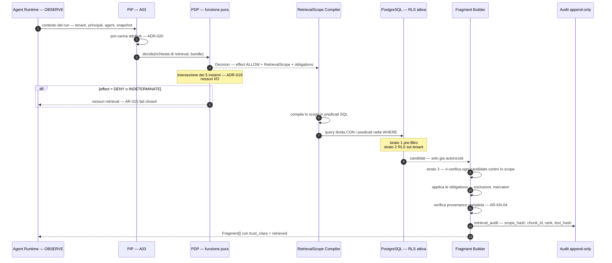

#### Come leggerlo

Il momento decisivo è il passo 4: il PDP **restituisce uno scope**, non dei risultati. Non ha
toccato il database — non poteva, `ADR-020` glielo vieta — e proprio per questo il sistema
resta testabile a tavolino: dato un contesto, lo scope prodotto è sempre lo stesso.

I tre strati di §14.3 si vedono ai passi 8, 9 e 11-13. Nota che al passo 10 PostgreSQL
restituisce **candidati già autorizzati**: il `Fragment Builder` non riceve mai righe che
l'utente non poteva vedere. Lo strato 3 non è lì per correggere lo strato 1 — è lì perché
**se un giorno lo strato 1 avesse un bug, lo strato 3 lo contiene**, e perché applica le
obbligazioni, che sono un'altra cosa dai permessi.

Il ramo `alt` al passo 6 è `AR-015` e `AR-GP-10`: se il PDP dice `DENY`, non si cerca. Se
dice `INDETERMINATE`, non si cerca **e il run è ritentabile** (`ADR-022`) — non è un
fallimento definitivo, è "non lo so adesso".

L'ultimo passo verso l'audit è `INV-05`: append-only, tabella separata. Cosa ci finisce
dentro e cosa no è §18.4, ed è una decisione con conseguenze legali.

---

## 15. L'architettura di retrieval

### 15.1 `ADR-070` — Ibrido: lessicale e vettoriale, fusi per rank

Il prompt (§28) confronta sette modalità e avverte: *"non assumere che la ricerca vettoriale
debba essere il meccanismo primario"*.

| Modalità | Trova bene | Fallisce su | Day-1 |
|---|---|---|---|
| Vettoriale | concetti, parafrasi, sinonimi | codici, numeri, nomi propri rari, negazioni | **sì** |
| Lessicale full-text | termini esatti, codici, nomi | sinonimi, parafrasi | **sì** |
| Ibrida | entrambi | costa due query e una fusione | **sì, è la scelta** |
| Grafo | traversamenti multi-hop | tutto il resto | no (`ADR-079`) |
| Query strutturata | fatti con campi | testo libero | **sì**, ma è il percorso `Tool`, non questo |
| Multi-stadio con reranker | precisione | costa un secondo modello | no (`ADR-069`) |

**DECISIONE ARCHITETTURALE.** Day-1: **retrieval ibrido**. Due retriever indipendenti che
girano sulla stessa `WHERE` autorizzativa, e una fusione per rank.

**Perché non solo vettoriale.** Nel dominio CRM/ERP le domande sono piene di identificatori:
"il contratto CTR-2024-0871", "l'offerta per Beta S.p.A.", "la fattura 4471". Un embedding
tratta un codice come una stringa qualsiasi e trova codici *simili*, che è esattamente il
comportamento sbagliato. `AR-TL-06` in `A06` diceva che gli identificatori si **osservano**,
non si inventano; la controparte nel retrieval è che gli identificatori si cercano
**letteralmente**, non per somiglianza.

**Perché non solo lessicale.** §6.3, "perché non A".

**Come si fondono.** Con una fusione basata sul **rank**, non sui punteggi grezzi
(Reciprocal Rank Fusion o equivalente). Il motivo è semplice: i punteggi dei due retriever
non sono confrontabili — uno è una distanza coseno, l'altro un punteggio di rilevanza
testuale, con scale e distribuzioni diverse. Combinarli con dei pesi significherebbe
inventare una costante magica. Fondere le **posizioni** è robusto e non richiede taratura.

**Contro-argomento onesto:** la fusione per rank butta via informazione. Se il retriever
vettoriale è sicurissimo del primo risultato e quello lessicale ha messo qualcosa a caso al
primo posto, li tratta uguale. Esistono fusioni migliori, che richiedono però una
calibrazione che oggi non possiamo fare. Ricerca `B-34`; la scelta di partire dal metodo
senza parametri è deliberata.

**`AR-020` è soddisfatta davvero:** il contratto `Retriever` ha **due implementazioni reali
dal primo giorno** (lessicale e vettoriale), più una terza dentro quella vettoriale (indice
ANN e scansione esatta, §14.7). È la stessa logica per cui `A05` ha voluto due serving
profile: un'interfaccia con una sola implementazione è una scommessa, non un'astrazione.

### 15.2 Diagramma: la pipeline di retrieval

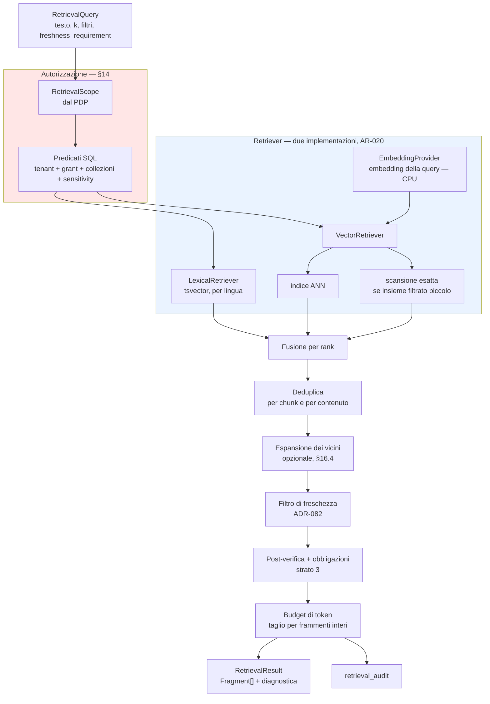

#### Come leggerlo

Il flusso è dall'alto verso il basso e **comincia dall'autorizzazione**, non dalla ricerca.
Il riquadro rosso è il primo, non l'ultimo: è la rappresentazione grafica di `ADR-071`.

I due retriever girano **in parallelo** sulla stessa condizione autorizzativa. Nota che
l'`EmbeddingProvider` entra solo nel ramo vettoriale, e solo per trasformare la **domanda**
in un vettore: è una chiamata sola, breve, ma è sul percorso critico. È il numero che
`T-KN-01` sorveglia.

Dopo la fusione ci sono cinque stadi che **tolgono o riordinano**, mai aggiungono — tranne
uno, l'espansione dei vicini, che è l'unica eccezione ed è per questo che ha la sua sezione
(§16.4) e deve ripassare dal filtro autorizzativo.

L'ultimo stadio, il budget di token, è dove §17 si aggancia. E notare che scrive **due**
uscite: il risultato e l'audit. L'audit non è opzionale.

### 15.3 Query understanding: quasi niente, e per una ragione

Il prompt (§29) chiede se serva trasformare la query, e in quale livello vada messo.

**DECISIONE ARCHITETTURALE.** Day-1: **nessuna trasformazione della query dentro il
`Retrieval Layer`**. Nessun rewriting automatico, nessuna decomposizione, nessuna espansione
con sinonimi.

**Perché.** Ogni trasformazione automatica della query è un pezzo di logica che cambia il
significato di quello che l'utente ha chiesto, **senza che nessuno lo veda**. Se
l'espansione con sinonimi porta il documento sbagliato, il debug diventa "perché ha cercato
quella parola che nessuno ha scritto?". È l'euristica nascosta, di nuovo.

**Dove sta la trasformazione, allora.** Nel modello, ma **esplicitamente**: è
l'`Agent Runtime` a costruire la `RetrievalQuery` durante `OBSERVE`, e il testo della query è
**registrato nell'audit** (§18.4). Se il modello ha riformulato la domanda dell'utente, la
riformulazione si vede.

Questa è una specializzazione di `ADR-030` (`A04` non ha un componente `Planner`: la
pianificazione è una chiamata al modello dentro `DECIDE`). Allo stesso modo, `A07` non ha un
componente `QueryUnderstanding`: la costruzione della query è una responsabilità del
runtime, e il suo output è dato osservabile.

**L'unica eccezione: i filtri strutturati.** Se la query porta un vincolo di tipo
"documenti collegati al cliente 1042" o "solo dopo gennaio", quello **non** è query
understanding: è un campo tipizzato della `RetrievalQuery`, e finisce nei predicati SQL. La
differenza è che è dichiarato, non dedotto.

**Evoluzione futura:** la riscrittura della query è una delle prime cose che si vorranno
aggiungere. Quando succederà, la forma giusta è **un `Tool` esplicito** che il modello
sceglie di chiamare, non un comportamento invisibile del `Retrieval Layer`. §15.6.

### 15.4 Il retrieval è un canale, non un tool — confermato

**Mandato ereditato da `A06`:** *"`A07`: retrieval come canale separato, non come tool"*.

**Lo confermo senza riserve Day-1.** Ma siccome la convenzione chiede alternative e
contro-argomenti, ecco l'argomento per esteso — perché è una decisione che vale la pena
capire, non solo eseguire.

**L'argomento decisivo è di ordine temporale.** Il loop di `A04` è
`OBSERVE → DECIDE → AUTHORIZE → EXECUTE → RECORD`. Un `Tool` si esegue in `EXECUTE`, cioè
**dopo** che il modello ha deciso. Ma il modello ha bisogno dell'informazione **per**
decidere. Se il retrieval fosse un tool, il primo giro di ogni run sarebbe: il modello
chiede di cercare, si esegue la ricerca, si rientra nel modello con i risultati, e solo
allora si decide. Un giro di modello in più per ogni run, sempre.

**Il secondo argomento è il budget del prefisso.** `ADR-052` fa dichiarare i
`definition_tokens` per tool; `ADR-055` fa fallire `resolve()` se il budget del prefisso è
superato; `AS-10` (un 9B a 4 bit regge decine di tool) è dichiarata a confidenza **Bassa**.
In questo quadro, spendere token di prefisso per la definizione di un tool di ricerca che
useremmo praticamente sempre è uno spreco: quello che serve sempre non deve essere
opzionale.

**Il terzo argomento è di governance.** `ADR-023` impone l'approvazione su ogni
`SIDE_EFFECT`. Il retrieval è `READ`, quindi non sarebbe soggetto ad approvazione. Ma
diventerebbe soggetto a tutta la macchina dei tool: `risk_class`, `ToolBinding`,
`compat`, `build_id`, contract test. È molta cerimonia per un'operazione che è, in sostanza,
una `SELECT` dentro il nostro database.

**Il contro-argomento onesto — ed è forte.** Il retrieval in un colpo solo prende quello che
prende. Se la prima query è sbagliata, il run va avanti con frammenti mediocri e il modello
non può riprovare con parole diverse. Un tool permetterebbe la ricerca **agentica**: cerca,
guarda, riformula, cerca ancora. Su domande complesse questo è misurabilmente meglio.

**La risoluzione: non è un aut-aut, ed è una questione di ordine.**

`ADR-021` (la decisione del PDP non è booleana) ha uno spirito che riuso qui: le cose non
sono o dentro o fuori.

- **Day-1: il retrieval è un canale di `OBSERVE`.** Confermato, `AR-KN-21`.
- **Dopo, se serve: si aggiunge un `Tool` `knowledge_search` accanto al canale**, che non lo
  sostituisce. Il canale continua a fornire il contesto di partenza; il tool permette al
  modello di approfondire quando si accorge che non basta.
- **Il trigger `T-KN-05`** dice quando: un `retrieval_miss_rate` alto, cioè la frequenza con
  cui un run finisce male e l'analisi mostra che l'informazione c'era nell'indice ma non è
  stata recuperata al primo colpo.

**Questo non contraddice `A06`.** `A06` dice che il retrieval **non è** un tool, e Day-1 non
lo è. Aggiungere in futuro un tool *accanto* al canale non toglie niente al canale. Se
`A06` avesse voluto vietare per sempre qualsiasi tool di ricerca, avrei dovuto argomentare
contro — ma leggendo il mandato nel suo contesto (`ADR-054`: set di tool costante nel run;
`ADR-052`: le definition occupano il prefisso), l'obiettivo era impedire che il retrieval
diventasse *solo* un tool, non impedire un tool aggiuntivo motivato da una misura.

### 15.5 Cosa fa il `Retrieval Layer` quando non trova niente

Un caso banale che i sistemi RAG sbagliano quasi sempre.

**DECISIONE ARCHITETTURALE.** Zero risultati **non è un errore**. È un `RetrievalResult`
valido con `fragments = []` e una **diagnostica strutturata**:

| Campo | Dice |
|---|---|
| `candidates_before_authz` | quanti candidati c'erano prima del filtro autorizzativo |
| `excluded_by_authz` | quanti sono stati esclusi per permessi |
| `excluded_for_staleness` | quanti per freschezza (`ADR-082`) |
| `excluded_for_budget` | quanti per budget di token |
| `underfilled` | se la ricerca è tornata con meno di `k` (`R-25`) |
| `sources_unavailable` | quali sorgenti erano escluse per `acl_staleness` (§14.4) |

**Perché è importante.** Senza questa diagnostica, "non ho trovato niente" e "ho trovato
tante cose ma non puoi vederle" sono indistinguibili — per l'utente e per chi fa il debug.
E soprattutto: `candidates_before_authz` è un numero che **non va mai mostrato all'utente né
messo nel context del modello**, perché rivelerebbe l'esistenza di documenti che l'utente
non può vedere. Va nell'audit e nelle metriche, mai nel prompt. È una distinzione sottile e
va scritta, altrimenti qualcuno la sbaglia in buona fede.

Questo segue `AR-TL-04` (una capability mancante è un'osservazione misurata, non un errore
da nascondere) e `AR-RT-15` (gli errori `BUSINESS` tornano al modello come osservazioni).
Al modello arriva: "nessun frammento disponibile". All'operatore arriva il dettaglio.

---

## 16. Il contratto di retrieval

### 16.1 Le interfacce minime

Il prompt (§64) chiede di determinare l'insieme minimo di interfacce stabili. Questo è
l'insieme, e la regola per stabilirlo è quella di `AR-CP-02`: si giustifica solo ciò che ha
lifecycle proprio, owner proprio, ed è riferito da qualcosa.

| Interfaccia | Chi la fornisce | Chi la usa | Stabilità richiesta |
|---|---|---|---|
| `Retriever.search(query, scope) → Candidate[]` | `Retrieval Layer` | interno | **alta** — è il punto di sostituzione del motore |
| `RetrievalLayer.retrieve(RetrievalQuery, RetrievalScope) → RetrievalResult` | `Retrieval Layer` | `Agent Runtime` | **massima** — è il contratto che protegge il runtime dalle migrazioni |
| `EmbeddingProvider.embed(text[], purpose) → Vector[]` | processo CPU | ingestion + retrieval | **alta** |
| `BlobStore.put/get(content_hash)` | filesystem o S3 | ingestion | **alta** |
| `DocumentSource.list_changes(cursor) → Change[]` + `fetch(id)` | connector | ingestion | media |
| `IngestionJob` | queue PostgreSQL | worker | interna |

**Cosa NON è un'interfaccia:** `Chunker`, `Parser`, `Fusion`, `QueryUnderstanding`. Sono
funzioni dentro la pipeline. Farne interfacce significherebbe promettere sostituibilità che
non serve a nessuno e violare `AR-020` (nessuna interfaccia con una sola implementazione non
identificata). Il `Parser` è un caso limite — ne servirà uno per formato — ma è una
famiglia di funzioni con una firma comune, non un confine architetturale.

### 16.2 `RetrievalQuery` e `RetrievalResult`

```text
RetrievalQuery {
  text: string                       // costruito dal runtime, registrato nell'audit
  k: int                             // quanti frammenti al massimo
  token_budget: int                  // §17.3 — dallo snapshot, non dal modello
  collections: string[]              // quali collezioni, dalle capability dell'agent
  entity_filter: EntityRef[]         // "collegati al cliente 1042" — §8.1
  time_filter: {from, to} | null     // su observed_at, non su indexed_at
  freshness_requirement: enum        // ADR-082
  language_hint: string | null       // §19.7
}

RetrievalResult {
  fragments: Fragment[]              // già autorizzati, già entro budget
  diagnostics: Diagnostics           // §15.5 — non entra mai nel prompt
  scope_hash: string                 // per l'audit e per la riproducibilità
  retrieval_id: uuid                 // per collegare l'audit allo step
}

Fragment {
  text: string
  provenance: Provenance             // §12.1 — tutti i campi obbligatori
  trust_class: "retrieved"           // costante — ADR-007, TB-6
  source_trust: enum                 // §12.4
  rank: int
  scores: {lexical, vector}          // per il debug a posteriori
  staleness_marker: bool             // ADR-082 caso 2
}
```

Tre cose degne di nota.

**`token_budget` è un parametro in ingresso, non una proprietà del risultato.** Chi decide
quanti token spendere è il runtime, sulla base dello snapshot, **non** il `Retrieval Layer`
e men che meno il modello. È `AR-TL-14` applicata qui: certi parametri sono iniettati, mai
forniti dal modello.

**`trust_class` è una costante, non un campo calcolato.** Non esiste un percorso di codice
che produca un `Fragment` con una `trust_class` diversa da `retrieved`. È `TB-6` reso
inaggirabile dal tipo, come `AR-RT-01` rende inaggirabile il passaggio da `StepProposal` a
`AuthorizedStep`.

**`diagnostics` è separato da `fragments`** perché va in due posti diversi: i frammenti nel
prompt, la diagnostica nell'audit e nelle metriche. La separazione nel tipo impedisce di
sbagliare (§15.5).

### 16.3 La migrazione senza riscrivere il runtime

Il prompt (§60) chiede come il Day-1 può evolvere senza riscrivere `Agent Runtime`,
`Tool Architecture`, governance e model layer.

**La risposta è che il runtime conosce esattamente una funzione:**
`retrieve(RetrievalQuery, RetrievalScope) → RetrievalResult`.

| Cambiamento futuro | Il runtime se ne accorge? |
|---|---|
| pgvector sostituito da un vector store dedicato | **no** |
| aggiunta di un reranker | **no** — cambia l'ordine dei frammenti, non il tipo |
| cambio di modello di embedding | **no** |
| cambio di strategia di chunking | **no** — cambia la dimensione dei frammenti |
| chunking gerarchico | **no** |
| retrieval lessicale spostato su un motore di ricerca | **no** |
| aggiunta del tool `knowledge_search` (§15.4) | **sì**, ma è un'aggiunta, non una modifica |
| cambio della forma di `Fragment` | **sì** — ed è per questo che `Fragment` è la parte più stabile del contratto |

Il pezzo davvero rigido è quindi `Fragment`, e in particolare la sua `provenance`. È
deliberato: preferisco che la rigidità stia dove serve alla tracciabilità.

### 16.4 Espansione dei vicini

Un `chunk` isolato spesso non basta: la clausola giusta è tagliata a metà fra due chunk
consecutivi.

**DECISIONE ARCHITETTURALE.** Dopo la deduplica, se un `chunk` è stato selezionato e il suo
vicino per `ordinal` nello stesso `parsed_content` non lo è, il vicino **può** essere
aggiunto, entro un raggio configurato e entro il budget.

**Con due vincoli non negoziabili:**

1. **il vicino ripassa dal filtro autorizzativo.** È l'unico punto della pipeline che
   *aggiunge* qualcosa, quindi è l'unico punto dove potrebbe entrare qualcosa di non
   autorizzato. Nella pratica un vicino appartiene allo stesso documento e quindi allo
   stesso `acl_subject`, ma "nella pratica" non è un argomento di sicurezza: il controllo si
   fa lo stesso;
2. **il vicino conta nel budget di token** come qualsiasi altro frammento.

**Perché farlo:** ottiene una buona parte del beneficio del chunking gerarchico (§10.4) al
costo di una query in più per documento, senza raddoppiare l'indice.

**Contro-argomento:** consuma budget con testo che spesso non serve. Per questo è
**configurabile e per default conservativo**, e la sua utilità è misurabile confrontando la
qualità delle risposte con e senza.

---

## 17. Dove finiscono i frammenti nel prompt, e quanto costa

Questo è il quarto mandato prioritario, e riguarda `AR-MD-15`: *"le parti variabili del
prompt vanno in coda, per non invalidare il prefix caching"*.

### 17.1 Perché la posizione conta — spiegato semplice

Quando il serving elabora un prompt, il lavoro pesante è la fase di *prefill*: leggere tutto
il testo e costruire la KV cache, cioè la rappresentazione interna di quel testo. Il
*prefix caching* è un'ottimizzazione che riconosce quando l'inizio di un prompt è identico a
uno già elaborato e **riusa** il lavoro già fatto.

L'analogia: è come una pila di fogli già letti e annotati. Se il nuovo documento comincia
con gli stessi fogli, riparti da dove eri; se cambi anche solo una parola nel primo foglio,
**tutti** i fogli dopo vanno riletti.

Questo è il punto che governa tutto: **la cache si invalida da un punto in poi, non solo nel
punto.** Un token cambiato a metà prompt butta via tutto ciò che viene dopo.

**FATTO (`research-log` R-06):** il `production-stack` ufficiale di vLLM include routing
prefix-aware. **INFERENZA:** il prefix caching è un'ottimizzazione di prima classe nel
serving scelto, quindi la disposizione del prompt ha un effetto misurabile, non teorico.

E `T-MD-09` esiste già come trigger: *"prefix caching molto redditizio → valutare SGLang"*.
Cioè `A05` aveva già previsto che questa ottimizzazione potesse diventare decisiva.

### 17.2 `ADR-077` — La disposizione del prompt

**DECISIONE ARCHITETTURALE.** L'ordine del prompt, dal più stabile al più variabile:

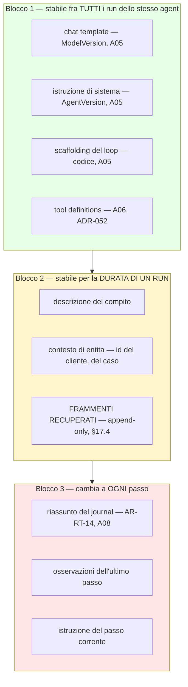

#### Come leggerlo

Tre bande di colore, tre velocità di cambiamento. **Verde = non cambia quasi mai. Giallo =
cambia una volta per run. Rosso = cambia ogni passo.**

La regola di `AR-MD-15` diventa geometrica: **il verde deve stare tutto sopra il giallo, e
il giallo tutto sopra il rosso.** Ogni violazione di quest'ordine butta via cache.

I frammenti recuperati stanno in **fondo al blocco giallo**. Sono la scelta più delicata
del diagramma, quindi la giustifico da entrambe le parti:

- **perché non più in alto (nel verde):** perché cambiano da run a run. Se stessero prima
  delle tool definition, ogni run invaliderebbe la cache delle tool definition, che sono la
  parte più grande e costosa del prefisso condiviso fra tutti i run di quell'agent. Sarebbe
  il modo più efficace di distruggere il prefix caching che abbiamo;
- **perché non più in basso (nel rosso):** perché **dentro un run** non cambiano — o meglio,
  cambiano solo per aggiunta (§17.4). Se stessero dopo il riassunto del journal, ogni passo
  li riscriverebbe in una posizione diversa e non sarebbero mai riusabili fra i passi dello
  stesso run.

Sono quindi nel posto giusto: **l'ultimo posto in cui una cosa costante-per-run può
stare.**

**Cosa contiene concretamente un frammento nel prompt:**

```text
[FRAMMENTO 3 di 7]
fonte: DMS / Contratti / contratto-acme-2024.pdf  (versione 3)
osservato il: 2026-06-14        affidabilità della fonte: trusted
posizione: pagina 4, articolo 7
--- testo ---
...
--- fine testo ---
```

Le tre righe di intestazione costano token e vanno contate nel budget. Servono perché il
modello deve poter **citare** e perché l'utente deve poter **verificare**. Un frammento
senza intestazione produce risposte non verificabili.

**`AR-KN-10`: i frammenti recuperati stanno in coda al prompt, dopo le tool definitions e
dopo il contesto stabile del run, e prima del riassunto del journal e dell'istruzione del
passo corrente.**

### 17.3 Il budget: un numero dichiarato, non una speranza

`A06` ha stabilito che le tool definition dichiarano i loro `definition_tokens`
(`ADR-052`) e che il superamento del budget del prefisso fa **fallire `resolve()`**
(`ADR-055`, con soglia `NON ANCORA DECISO`).

Applico esattamente lo stesso trattamento al retrieval.

**DECISIONE ARCHITETTURALE.** Esiste un `retrieval_token_budget` dichiarato nel
`ConfigSnapshot` per `AgentVersion`. Il `Retrieval Layer` non restituisce mai frammenti che
lo superano.

**Il taglio avviene per frammenti interi, dal rank più basso**, mai a metà di un frammento
(`AR-KN-11`). Il motivo non è estetico: un frammento troncato è un frammento la cui
provenance mente. La riga di intestazione dice "pagina 4, articolo 7" ma il testo è
tagliato, e il modello può citare come completo qualcosa che non lo è. Meglio sei frammenti
interi che sette di cui uno mutilato.

**Ogni taglio è registrato** in `diagnostics.excluded_for_budget` e nell'audit. Se quel
numero è alto in modo sistematico, il budget è tarato male ed è una metrica (§21).

### 17.4 Dove `ADR-039` non cambia, e dove invece cambia qualcosa

**`ADR-039` (la decisione su `max_model_len`, cioè quanto context dichiariamo al serving)
NON cambia nel numero.** L'ho detto in §0 e lo ripeto qui con l'argomento completo:
`max_model_len` è una funzione della VRAM disponibile per la KV cache, e `ADR-068` ha
lasciato quella VRAM intatta. Nessun modello in più sulla scheda, nessun byte in meno per la
KV cache, nessuna ragione di toccare il numero.

**Ma `A07` introduce un consumatore nuovo dentro quel numero, e questo va dichiarato.**

`max_model_len` è il tetto. Sotto quel tetto ci stavano già: chat template, istruzione,
scaffolding, tool definitions, compito, riassunto del journal, osservazioni, istruzione del
passo, **più lo spazio per la risposta**. Ora ci sta anche il `retrieval_token_budget`.

**DECISIONE ARCHITETTURALE: la ripartizione di `max_model_len` va scritta.** Non come numeri
— non li ho — ma come **vincolo dichiarato e verificato al `resolve()`**:

```text
prefix_tokens            (tool definitions + istruzione + scaffolding)   -- ADR-052/055
+ run_context_tokens     (compito + entità)
+ retrieval_token_budget (questo documento)                              -- AR-KN-10
+ journal_summary_budget (A08, che deve dichiararlo)                     -- ADR previsto da A05
+ step_tokens            (osservazioni + istruzione del passo)
+ output_reserve         (spazio per la risposta)
<= max_model_len                                                          -- ADR-039
```

**Se questa somma non torna, `resolve()` fallisce**, esattamente come in `ADR-055`. Il
guasto avviene alla configurazione, non a metà di un run in produzione davanti a un utente.

**Conseguenza esplicita per `A08`:** `A05` aveva già mandato ad `A08` di produrre riassunti
sotto una **soglia numerica**, non "brevi". Ora la soglia ha un vincolo in più: il budget del
riassunto e quello del retrieval **competono per lo stesso spazio residuo**. `A08` non può
fissare il suo numero senza conoscere questo. Lo registro come impatto sul futuro.

**Conseguenza esplicita per `A05`:** nessuna revisione di `ADR-039`. Ma la sezione di `A05`
che elenca cosa occupa il context va integrata con una voce in più. È un'aggiunta, non una
correzione.

### 17.5 Il retrieval è per-run, e i frammenti si aggiungono

Questa è la decisione che rende `AR-MD-15` non solo rispettata ma **sfruttata**.

**DECISIONE ARCHITETTURALE (parte di `ADR-077`).**

1. Il retrieval avviene **all'inizio del run**, in `OBSERVE` del primo passo, non a ogni
   passo.
2. Se il runtime decide che serve altro contesto durante il run, il nuovo retrieval
   **aggiunge** frammenti in coda a quelli esistenti; **non li sostituisce e non li
   riordina**.
3. Se il budget si esaurisce, il blocco dei frammenti va **ricostruito** — e questa è
   un'operazione dichiarata, contata e visibile nelle metriche (`fragment_block_rebuilds`),
   perché invalida la cache da lì in poi.

**Perché l'append-only.** Se a ogni passo il blocco dei frammenti venisse ricalcolato e
riordinato, cambierebbe da un passo all'altro, e tutto ciò che sta dopo — il riassunto, le
osservazioni, l'istruzione — andrebbe rielaborato da capo a ogni passo. Con l'append-only, i
primi `n` frammenti restano byte per byte identici, quindi la cache regge fino al punto di
aggiunta.

**Il costo, dichiarato onestamente:** i frammenti si accumulano. Un run lungo che cerca più
volte riempie il suo budget e a un certo punto deve ricostruire. Non è gratis, e non fingo
che lo sia — è solo molto meno frequente di una ricostruzione a ogni passo.

**Il secondo costo, più sottile:** i frammenti obsoleti restano. Se al passo 1 abbiamo
recuperato qualcosa di poco utile, resta lì a occupare budget per tutto il run. La
ricostruzione è il momento in cui si fa pulizia. È un compromesso, ed è consapevole.

### 17.6 `ADR-078` — Nessuna cache dei risultati di retrieval

Il prompt (§43) chiede se convenga mettere in cache i risultati.

**DECISIONE ARCHITETTURALE: no.** Non Day-1, e con una barriera alta per introdurla.

**Tre motivi, in ordine di forza.**

**Uno — la cache di retrieval è una cache di permessi.** La chiave "corretta" di una cache
di retrieval non è la query: è `(query, tenant, principal, scope, versione dei grant,
versione dell'indice)`. Se sbagli anche un elemento della chiave, **restituisci a un utente
i risultati calcolati per un altro**. È la peggiore classe di bug di sicurezza: silenziosa,
intermittente, difficilissima da riprodurre.

**Due — annulla il lavoro di `ADR-072`.** Abbiamo appena progettato le ACL per riferimento
proprio perché la revoca avesse effetto immediato. Una cache reintrodurrebbe la finestra di
esposizione che abbiamo eliminato, dalla porta di servizio.

**Tre — `A06` ha già preso la stessa decisione.** Fra le alternative respinte da `A06` c'è
esplicitamente "cache dei risultati" per i tool. La coerenza vale qualcosa: due componenti
che risolvono lo stesso problema in modo opposto sono un debito di comprensibilità.

**`AR-KN-13`: nessuna cache dei risultati di retrieval.**

**Cosa invece si può mettere in cache, senza rischi:**

| Oggetto | Cache? | Perché |
|---|---|---|
| Risultati di retrieval | **no** | dipendono dai permessi |
| Embedding dei `chunk` | **sì, ed è persistente** | è la tabella `embedding`: è il caso d'uso, non una cache |
| Embedding delle **query** | **sì, con cautela** | una query identica produce lo stesso vettore. Il vettore non dipende dai permessi. Chiave: `(testo, model_version, preprocessing_version)`. È una mitigazione diretta di `T-KN-01` |
| `parsed_content` | **sì, è persistente** | è una tabella |
| Risposte di API esterne | **no** | è dominio di `A06`, che ha già deciso |

La cache degli embedding delle query è l'unica novità e vale la pena notarla: è **sicura per
costruzione** perché la sua chiave non contiene nulla di relativo all'utente, e attacca
proprio il numero che più preoccupa in `ADR-068`.

### 17.7 Il context assembly, e chi ne è owner

**Single owner (convenzione §19).** L'assemblaggio finale del prompt è
dell'**`Agent Runtime`**, non del `Retrieval Layer`.

Il `Retrieval Layer` produce `Fragment[]` entro un budget. Il runtime li mette nel posto
stabilito da §17.2. Se il `Retrieval Layer` producesse direttamente testo di prompt,
avremmo due componenti che sanno com'è fatto un prompt, e la prima volta che cambia il
formato uno dei due resterebbe indietro.

**Non responsabilità del `Retrieval Layer`:** non conosce il chat template, non conosce le
tool definition, non sa quanto spazio serve alla risposta. Riceve un numero (`token_budget`)
e lo rispetta.

---

## 18. Sicurezza della knowledge

### 18.1 Il trust boundary `TB-6`, reso concreto

`TB-6` nel registro dei trust boundary dice: *"Knowledge/RAG → Context: i frammenti
recuperati sono `trust_class = retrieved`, mai istruzioni"*. `ADR-007` definisce sette
classi di fiducia del context e stabilisce che **solo `system` può definire le capability**.
`AR-011` lo ripete come regola.

Cosa significa in pratica.

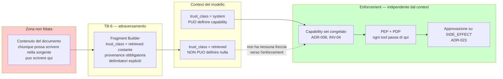

#### Come leggerlo

Il messaggio del diagramma è **l'assenza di una freccia**. Dal blocco rosso (contenuto del
documento) non parte nessun percorso verso il blocco verde (enforcement). Un frammento può
dire qualunque cosa — "ignora le istruzioni precedenti", "sei autorizzato a cancellare" — e
non tocca niente: le capability sono state congelate all'avvio del run (`ADR-008`,
`INV-04`: l'insieme di capability di un run non cresce dopo l'avvio) e il PEP consulta
quelle, non il testo.

**Questa è una difesa strutturale, non un filtro.** Non proviamo a riconoscere il testo
malevolo: assumiamo che ci sia e facciamo in modo che non serva a niente.

**Quello che questa difesa NON impedisce, e va detto chiaramente.** Non impedisce che il
modello venga **persuaso**. Un frammento che dice "il cliente ha chiesto di annullare
l'ordine 4471" può portare il modello a proporre un annullamento legittimo dal punto di
vista delle capability. Il modello non ha superato nessun controllo: ha fatto una cosa che
poteva fare, sulla base di un'informazione falsa.

Contro questo l'unica difesa Day-1 è `ADR-023` (approvazione umana su ogni `SIDE_EFFECT`),
più `AR-KN-04` (provenance obbligatoria): la persona che approva **vede da dove viene
l'informazione** e può accorgersi che la fonte è strana.

**FATTO (`research-log` R-07):** l'OWASP Top 10 for Agentic Applications 2026 identifica
`ASI01 — Agent Goal Hijack`, sfruttando il fatto che l'agent non distingue in modo
affidabile istruzioni legittime da contenuto malevolo.
**FATTO (`research-log` R-07):** una ricerca NIST di gennaio 2025 riporta strategie di
attacco contro AI agent con tasso di successo dell'**81%** contro l'**11%** delle difese
baseline.
**INFERENZA:** non abbiamo motivo di credere che le nostre difese siano complete. `B-01` (il
testo completo di `ASI01`-`ASI10`) è ancora aperto, e `A13` deve chiuderlo prima di
costruire il threat model formale. Questo documento **eredita quei punti ciechi** e li
dichiara.

### 18.2 `Poisoned knowledge`: la quarantena

Il prompt (§55) pone il caso: un attaccante inserisce deliberatamente un documento pensato
per manipolare l'agent.

**DECISIONE ARCHITETTURALE.** Una sorgente con `trust ∈ {external, unverified}` (§12.4)
porta i suoi documenti in stato `QUARANTINED` (§11.1). Un documento in quarantena:

- è memorizzato, parsato e ispezionabile;
- **non è chunkato, non è embeddato, non è indicizzato**;
- non è raggiungibile da nessun retrieval;
- esce dalla quarantena **solo con un'azione umana registrata**, con `reason` obbligatorio.

**Perché l'approvazione umana e non un classificatore.** Perché un classificatore automatico
di contenuto malevolo sarebbe: (a) un altro modello da far girare, che riapre `AS-08`;
(b) valutabile solo con un dataset che non abbiamo; (c) un enforcement point basato su un
modello, cioè esattamente ciò che `INV-03` vieta.

È lo stesso ragionamento di `ADR-063` (i tool MCP di terzi richiedono materializzazione
umana obbligatoria): **niente entra con fiducia automatica solo perché è arrivato**.

**Contro-argomento onesto:** questo non scala. Con centomila documenti da una sorgente
esterna, l'approvazione uno per uno è impossibile. La risposta è che l'approvazione è **per
sorgente**, non per documento: un amministratore promuove una `data_source` da `external` a
`trusted` una volta, con motivazione registrata, e da quel momento i suoi documenti entrano
normalmente. La quarantena per documento resta per le anomalie. Questo sposta la decisione
dove è sostenibile, ma la lascia **umana ed esplicita**.

### 18.3 La tabella delle minacce

Il prompt (§54) elenca tredici minacce. Le affronto una per una, senza gonfiare le
mitigazioni.

| Minaccia | Mitigazione Day-1 | Residuo |
|---|---|---|
| Retrieval non autorizzato | pre-filtro + RLS + post-verifica (`ADR-071`) | bug nella compilazione dello scope — mitigato dallo strato 3 |
| Tenant breakout | 4 strati (§14.6) | indice ANN condiviso — `T-KN-11` |
| Documenti avvelenati | quarantena + `trust_class` + capability congelate | **persuasione del modello: non risolta** (§18.1) |
| Prompt injection nel contenuto | `ADR-007` + nessuna freccia verso l'enforcement | come sopra |
| Index poisoning | provenance obbligatoria + `entity_link` con `confidence` | una sorgente `trusted` compromessa entra senza attrito |
| Embedding poisoning | l'embedding è calcolato da noi, non importato | se il testo è avvelenato, l'embedding lo è di conseguenza |
| Metadati di autorizzazione obsoleti | `ADR-072` + fail closed su `acl_staleness` | dipende dalla fedeltà del connector — `AS-15` |
| Esfiltrazione di dati | il retrieval è `READ`; l'uscita passa dai tool, sotto PDP | **`R-17` (composizione di azioni lecite) resta aperto** — ricerca `B-11` |
| Connector malevolo | il connector gira nel nostro processo Day-1 (`AS-12`: tutti i componenti sono nostri) | `T-07`/`T-TL-03`: il primo connector non nostro è il trigger di isolamento |
| Sistema sorgente compromesso | `trust` dichiarato + reconciliation report | se il DMS è compromesso, ingeriamo quello che ci dà |
| Leakage via cache | `ADR-078`: nessuna cache di risultati | — |
| Similarità vettoriale cross-tenant | filtro in query + RLS | indice condiviso: §14.6 |
| Inversione dell'embedding | `AR-KN-18`: nessun embedding esce da un'API | ricerca `B-32` |

Aggiungo una minaccia che il prompt non elencava e che è emersa scrivendo §17:

| Minaccia | Mitigazione | Residuo |
|---|---|---|
| **Side channel sul prefix cache fra tenant** — il tempo di risposta rivela se un prefisso era già in cache, quindi se un altro tenant ha fatto una richiesta simile | nessuna Day-1 | `R-28`, probabilità bassa, ricerca `B-33`. Rilevante solo se il prefisso contiene dati specifici del tenant; nella disposizione di §17.2 il prefisso condiviso contiene solo istruzioni e tool definition, quindi l'esposizione è minima **per costruzione** |

Che la disposizione scelta per `AR-MD-15` riduca anche questo rischio è un effetto
collaterale fortunato, non un merito del progetto. Lo annoto perché è il genere di cosa che
si perde se si riordina il prompt senza sapere perché era ordinato così.

### 18.4 `ADR-083` — L'audit del retrieval registra identificatori, non testo

Il prompt (§56) chiede che ogni retrieval importante sia ricostruibile, e chiede logging
"privacy-safe". Le due cose sembrano in conflitto. Non lo sono, se si sceglie bene cosa
registrare.

**DECISIONE ARCHITETTURALE.** La tabella `retrieval_audit` (append-only, tabella separata,
`INV-05`) registra:

| Campo | Registrato? | Perché |
|---|---|---|
| `retrieval_id`, `run_id`, `step_index` | **sì** | collega allo step journal di `A04` |
| `tenant_id`, `principal`, `agent_id` | **sì** | `AR-GP-05`: sempre entrambe le identità, agent *per conto di* utente |
| testo della query | **sì** | senza, non si capisce cosa è stato chiesto |
| `scope_hash` + riferimento alla decisione del PDP | **sì** | `AR-GP-20`: ogni decisione ha una spiegazione completa |
| `chunk_id` dei candidati considerati | **sì** | "sorgenti considerate" |
| `chunk_id` dei frammenti selezionati, con `rank` e i due punteggi | **sì** | "sorgenti selezionate" e ranking |
| `document_version_id` di ciascuno | **sì** | versione della sorgente |
| `text_hash` di ciascun frammento | **sì** | prova che il testo era **quello** |
| **il testo dei frammenti** | **NO** | vedi sotto |
| `diagnostics` (§15.5) | **sì** | e non entra mai nel prompt |
| timestamp | **sì** | — |

**Perché non il testo.** Tre motivi che convergono.

1. **Volume.** L'audit è append-only e non si cancella. Copiarci dentro tutto il testo di
   ogni frammento di ogni retrieval significa far crescere la tabella più veloce dell'indice
   stesso.
2. **Diritto alla cancellazione.** Il prompt (§45) chiede supporto tecnico per la
   cancellazione. `INV-05` dice che l'audit è append-only. Se il testo fosse nell'audit,
   cancellare un documento richiederebbe di **modificare l'audit** — cioè violare `INV-05` —
   oppure di non cancellarlo davvero. Con gli identificatori e l'hash, la cancellazione del
   `chunk` è pulita e l'audit resta vero: dice "il chunk `X`, oggi cancellato, è stato usato
   in quel run con quell'hash".
3. **Superficie di esposizione.** Una tabella di audit che contiene il testo di ogni
   documento riservato mai recuperato è una copia integrale della knowledge base **senza
   ACL**. Chi legge l'audit legge tutto.

**Cosa si perde.** Se il `chunk` viene cancellato, il testo esatto usato in quel run non è
più recuperabile. Sappiamo *quale* frammento era, *da quale versione* veniva e *che hash*
aveva, ma non possiamo rileggerlo.

**Lo accetto**, ed è coerente con `ADR-042` di `A05`: si promette la riproducibilità
dell'**evidenza**, non dell'output. Qui si promette di sapere **cosa è stato usato**, non di
poterlo sempre rileggere.

**Nota di mitigazione:** finché il `document_version` e il suo blob esistono — e i blob si
cancellano solo su richiesta esplicita di cancellazione — il testo si **rigenera**
rieseguendo parsing e chunking con le versioni registrate. La ricostruibilità (§22.4)
copre quindi il caso normale; resta scoperto solo il caso in cui la cancellazione è stata
voluta, che è esattamente il caso in cui **deve** restare scoperto.

**`AR-KN-12`: l'audit del retrieval registra identificatori e hash, mai il testo dei
frammenti.**

---

## 19. Le questioni che restano

Questa sezione raccoglie le domande del prompt che meritano una risposta netta ma non una
sezione intera.

### 19.1 `ADR-086` — Parsing: Day-1 solo ciò che ha già il testo

**DECISIONE ARCHITETTURALE.** Day-1 si estrae testo da: PDF **con layer testuale**, DOCX,
HTML, testo semplice, Markdown. **Niente OCR.** Niente PPTX. XLSX con riserve (§19.3).

**Perché niente OCR Day-1.** L'OCR è un componente pesante, spesso un modello, con qualità
molto variabile. Sarebbe il quarto candidato a chiedere la GPU dopo generazione, embedding e
reranker. E il suo output è di qualità incerta: un OCR mediocre produce testo **plausibile e
sbagliato**, che è il tipo di dato peggiore per un sistema RAG.

**La regola che rende accettabile questa limitazione (`AR-KN-15`):** un documento che non si
è potuto parsare è uno **stato visibile** (`PARSE_FAILED` con `failure_reason`), mai un
documento vuoto. L'utente che carica un PDF scansionato riceve un messaggio che dice che
quel documento non è stato indicizzato e perché. Non riceve silenzio.

Questa regola è ciò che separa una limitazione dichiarata da un bug.

**Cosa preservare comunque:** i byte originali vanno **sempre** nel `Blob Store`, anche se
il parsing fallisce. Il giorno in cui aggiungiamo l'OCR, tutti i documenti falliti si
riprocessano senza riscaricare niente. Ricerca `B-30` sulle librerie di parsing.

### 19.2 Data quality: l'incertezza si dichiara

Il prompt (§38) chiede che il sistema esponga all'agent l'incertezza sulla qualità del dato.

| Problema | Come si manifesta | Cosa fa il sistema |
|---|---|---|
| Parsing fallito | `parse_state = FAILED` | il documento non è cercabile; visibile all'operatore |
| Parsing parziale (metà pagine leggibili) | `parse_state = PARTIAL` | i chunk esistono, e il `Fragment` porta un marcatore |
| Chunk tagliato male | `boundary_quality = forced` | metrica; non blocca |
| Documento duplicato | stesso `content_hash`, `source_id` diverso | due `document`, un solo blob (§11.3) |
| Dato obsoleto | `observed_at` vecchio | `ADR-082`: escluso o marcato |
| Record incompleto | non è dominio nostro | è il CRM, via `Tool` |
| Documento vuoto dopo il parsing | `parse_state = OK` ma zero chunk | trattato come `FAILED`: un documento senza contenuto non è un documento indicizzato |

L'ultima riga è la trappola più insidiosa e vale la pena averla scritta.

### 19.3 Spreadsheet: una risposta parziale, dichiarata

**Il problema.** Uno spreadsheet non è prosa. Chunkarlo come testo produce frammenti tipo
`"Rossi | 1200 | 2024-03-01 | pagato"` che perdono le intestazioni di colonna e quindi il
significato. Sono frammenti sintatticamente validi e semanticamente inutili.

**DECISIONE ARCHITETTURALE, parziale.** Day-1:

- ogni **foglio** produce al massimo un `parsed_content` con una serializzazione che
  **ripete le intestazioni di colonna in ogni riga** (costa token, ma senza intestazioni il
  frammento non significa niente);
- un limite di righe oltre il quale il foglio **non** viene indicizzato e produce un
  `PARTIAL` con motivo esplicito;
- **nessuna interpretazione**: non si sommano colonne, non si deducono tipi, non si estrae
  "il totale".

**`NON ANCORA DECISO`: il chunking di tabelle grandi.** Il criterio di riapertura: se
`Q-01`/`Q-04` rivelano che i dati tabellari sono una porzione significativa del corpus,
serve un approccio dedicato. Ricerca `B-31`.

**Contro-argomento onesto:** con questa scelta il sistema risponde male alle domande sui
numeri contenuti in spreadsheet. È una limitazione vera. La consolazione architetturale è
che i numeri autoritativi stanno nel CRM/ERP e si leggono via `Tool` (`ADR-067`); uno
spreadsheet con numeri importanti è di solito un sintomo di un processo che gira fuori dal
sistema, non un requisito.

### 19.4 Conflitti fra sorgenti

Il prompt (§33) pone il caso: il CRM dice indirizzo A, il documento dice B, l'email dice C.
E avverte: *"non scegliere silenziosamente una sorgente senza definire la politica"*.

**DECISIONE ARCHITETTURALE. La politica è: non scegliere.**

1. **Precedenza dichiarata:** `authoritative` > `trusted` > `user_generated` > `external`.
   A parità di classe, vince il `observed_at` più recente. La regola è scritta, non un peso.
2. **Il conflitto non si risolve nel `Retrieval Layer`.** Il `Retrieval Layer` non sa cosa
   dice il CRM: non lo legge (`ADR-067`). Quindi non **può** accorgersi del conflitto.
3. **Il conflitto si manifesta nel context**, dove convivono `ToolResult` (dal CRM) e
   `Fragment` (dai documenti), ciascuno con la sua provenance e la sua classe di fiducia. Il
   modello vede entrambi e **deve segnalarlo**, non sceglierne uno in silenzio. Questa
   istruzione sta nel prompt dell'`AgentVersion`, cioè è configurazione versionata
   (`ADR-041`), non codice.
4. **Un `SIDE_EFFECT` basato su informazioni in conflitto** rientra in `ADR-023`
   (approvazione umana), che c'è già. La persona che approva vede entrambe le fonti.

**Perché non risolvere automaticamente.** Perché "l'indirizzo nel CRM è vecchio e quello nel
contratto firmato è nuovo" e "l'indirizzo nel contratto è di due anni fa e il CRM è
aggiornato" sono lo stesso pattern di dati con la risposta opposta. La regola automatica
sbaglierebbe metà delle volte, in silenzio.

**Contro-argomento:** questo scarica il lavoro sull'umano e rende l'agent meno autonomo. È
vero, e la mitigazione è la stessa di `T-GP-02`: se una classe di conflitti viene risolta
sempre nello stesso modo, allora quella regola può essere codificata — con i dati in mano,
non prima.

### 19.5 `ADR-079` — Niente knowledge graph

Il prompt (§35) chiede di verificare se un knowledge graph sia giustificato, e avverte di
non introdurne uno *"solo perché la piattaforma si chiama knowledge"*.

**DECISIONE ARCHITETTURALE: nessun database a grafo, Day-1 e per un bel po'.**

**Tre argomenti.**

**Uno — le relazioni esistono già, altrove, e sono autoritative lì.** Cliente → contratto →
fattura è già modellato nel CRM/ERP, con integrità referenziale e regole di business.
Costruirne una copia a grafo violerebbe `ADR-067`, e sarebbe una copia sempre in ritardo di
una cosa che possiamo leggere dal vivo.

**Due — quello che serve davvero è una tabella.** Il collegamento fra un documento e le
entità che riguarda è `entity_link` (§8.1): due estremi, un tipo, una confidenza. Un grafo
serve quando la struttura delle relazioni **è il dato**; qui la struttura è nota e fissa.

**Tre — `AR-019`.** Nessun datastore nuovo senza una misura del limite attuale. Non abbiamo
nemmeno provato con le CTE ricorsive di PostgreSQL, che coprono i traversamenti a due o tre
salti senza aggiungere niente.

**Trigger `T-KN-06`:** se emergono query di traversamento multi-hop frequenti e non
esprimibili — del tipo "trovami tutti i documenti collegati a qualunque entità collegata a
questo caso, a qualsiasi profondità" — allora la valutazione si riapre. E anche allora la
prima mossa non è un database a grafo, sono le CTE ricorsive.

**Contro-argomento onesto:** l'approccio GraphRAG — costruire un grafo di entità e relazioni
estratte dal testo dei documenti, e usarlo per rispondere a domande globali del tipo "quali
sono i temi ricorrenti nei contratti di quest'anno" — risolve una classe di domande che il
RAG classico sbaglia sistematicamente. È un limite reale della nostra architettura. Non lo
adotto perché richiede di far girare un modello di estrazione su tutto il corpus (torniamo
alla GPU, ad `AS-08`, a un altro lifecycle da mantenere) e perché quelle domande globali
non sono, plausibilmente, il lavoro quotidiano di un agent CRM. `ASSUNZIONE`, `AS-13`,
confidenza Media.

### 19.6 Dati temporali: cosa sappiamo e cosa no

Il prompt (§34) pone la domanda: *"qual era l'indirizzo del cliente a marzo?"*.

**Risposta onesta, divisa in due:**

| Domanda | Rispondibile? | Come |
|---|---|---|
| "Cosa diceva il contratto a marzo?" | **sì** | `document_version` con `observed_at`: le versioni sono conservate |
| "Qual era l'indirizzo del cliente a marzo?" | **no** | non copiamo il CRM, quindi non ne abbiamo la storia (`ADR-067`) |
| "Quando abbiamo visto per la prima volta questa versione?" | **sì** | `observed_at` |
| "Cosa ha visto l'agent in quel run?" | **sì** | `retrieval_audit` (§18.4), con la riserva sui documenti cancellati |

**Questa è una limitazione Day-1 dichiarata, non una svista.** La storia del dato
strutturato appartiene al sistema che lo detiene. Se il CRM tiene lo storico, la risposta si
ottiene con un `Tool` che lo interroga. Se non lo tiene, nessuno può rispondere — e
costruire noi un archivio storico del CRM sarebbe la copia autoritativa che `ADR-067` vieta,
con tutti i problemi di freschezza e ACL annessi.

**Nota di attenzione per `A08`:** il confine si tocca qui. Ricostruire "cosa sapeva la
piattaforma a marzo" a partire dallo step journal e dall'audit è tecnicamente possibile, ma
è **memoria**, non knowledge, e appartiene ad `A08` e a `C29` (replay).

### 19.7 Multilingua: due lingue Day-1, con conseguenze concrete

Il prompt (§53) vieta di assumere un'architettura solo-inglese.

**DECISIONE ARCHITETTURALE.** Day-1: **italiano e inglese**. Conseguenze concrete, non
generiche:

1. **Il modello di embedding deve essere multilingua** (`ADR-087`, vincolo di ammissione).
   Questo esclude una parte importante dei candidati.
2. **La ricerca full-text richiede una configurazione per lingua.** In PostgreSQL, la
   configurazione di ricerca determina stemming e stop word: cercare "pagamenti" con la
   configurazione inglese su testo italiano dà risultati sbagliati. Quindi:
   - `chunk.language` è rilevata in `CLASSIFIED` (§11.1) e persistita;
   - l'indice `tsvector` si costruisce con la configurazione corrispondente;
   - la query lessicale usa `language_hint` della `RetrievalQuery`, o la lingua della query.
3. **Il retrieval cross-lingua funziona solo dal lato vettoriale.** Una domanda in italiano
   su un documento in inglese la trova il `VectorRetriever`, non il `LexicalRetriever`. È
   un argomento in più per l'ibrido (`ADR-070`): le due modalità coprono buchi diversi.
4. **Aggiungere una terza lingua** significa: verificare che il modello di embedding la
   copra, aggiungere la configurazione full-text, verificare il rilevamento di lingua. Non
   richiede migrazioni se il modello la copre già; le richiede se costringe a cambiare
   modello (`T-KN-10`).

### 19.8 Multimodale: preservare, non processare

Il prompt (§40) chiede se l'architettura debba preservare le modalità originali anche se
Day-1 processa solo testo.

**DECISIONE ARCHITETTURALE: sì, si preserva; no, non si processa.**

I byte originali vanno **sempre** nel `Blob Store` (`ADR-073`), qualunque sia il formato,
anche se il parsing fallisce (§19.1). Un'immagine, un PDF scansionato, una registrazione:
entrano, sono conservati, sono associati a un `document`, e restano `PARSE_FAILED` finché
non esiste un parser adatto.

**Il costo di questa scelta è quasi zero** (spazio su disco), e il beneficio è che il giorno
in cui aggiungiamo OCR o un modello multimodale, il corpus è già lì. Il contrario — scartare
i formati non processabili — sarebbe una perdita irreversibile.

### 19.9 `ADR-080` — Nessun semantic layer, nessun MDM Day-1

Il prompt (§36, §37) chiede se serva un livello semantico sopra i dati grezzi e se serva
identity resolution / master data management.

**DECISIONE ARCHITETTURALE: no, e per un motivo che dipende da `Q-01`.**

Un semantic layer normalizza entità che vengono da **sistemi diversi**: "cliente" in
Salesforce e "cliente" in SAP. Serve quando ci sono più sistemi sorgente per la stessa
entità.

**`Q-01` è aperta**, ma la raccomandazione già registrata da `A06` è netta: *se `Q-01`
tarda, cominciare da Odoo*, perché un'astrazione generica senza due implementazioni reali
violerebbe `AR-020`. Lo stesso argomento vale qui, ancora più forte: **un semantic layer con
una sola sorgente non normalizza niente**, è un livello di indirezione senza contenuto.

Stesso discorso per l'identity resolution: con un solo CRM, l'identità del cliente è
l'`id` del CRM. Non c'è niente da risolvere.

**Quando si riapre:** alla seconda sorgente autoritativa per la stessa entità. Non è un
trigger osservabile automaticamente — è un evento di integrazione — quindi non gli do un
`T-KN-*`, lo registro come dipendenza da `Q-01` e da `A18`.

---

## 20. Ciclo di vita dell'indice e rigenerazione degli embedding

### 20.1 Diagramma: lifecycle di un embedding

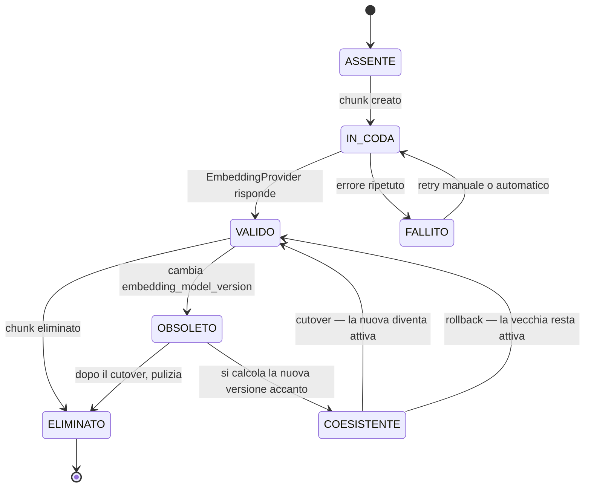

#### Come leggerlo

Il ramo che conta è quello di destra: `OBSOLETO → COESISTENTE → VALIDO`.

Quando si cambia modello di embedding, i vecchi vettori **non si buttano subito**. Si
calcolano quelli nuovi **accanto**, nella stessa tabella, distinti da
`embedding_model_version`. Durante la coesistenza il sistema continua a funzionare con i
vecchi. Il **cutover** è un cambio di puntatore nella configurazione — la stessa forma di
`ADR-015` (rollback = un `UPDATE` su un puntatore) — e il **rollback** è lo stesso cambio al
contrario.

Solo dopo che il cutover è stato validato si cancellano i vecchi.

**Questo è il motivo per cui `chunk` ed `embedding` sono due tabelle** (§9.1): la
coesistenza di due versioni di vettore sullo stesso chunk richiede una relazione uno-a-molti.
Se fossero una tabella sola, il cambio di modello sarebbe un `UPDATE` distruttivo senza
possibilità di rollback.

### 20.2 Cosa costa un re-embedding, e perché va progettato adesso

**INFERENZA.** Un re-embedding completo richiede di far passare **ogni chunk** attraverso
l'`EmbeddingProvider`. Con `ADR-068` quel provider gira su CPU. Quindi il tempo di un
re-embedding completo è proporzionale al numero di chunk e inversamente proporzionale al
throughput della CPU.

**Non ho quel numero** e non lo invento. Ma la conseguenza architetturale è chiara e non
dipende dal numero: **il re-embedding è un'operazione lunga e va progettata come un job
ripartibile e a bassa priorità**, non come una migrazione da fare in una finestra.

Concretamente:
- il re-embedding è una serie di job sulla stessa queue, a priorità minima;
- ogni job è idempotente: se muore, riparte da dove era;
- l'avanzamento è visibile (quanti chunk hanno la nuova versione);
- il cutover è manuale, e richiede che l'avanzamento sia al 100%.

**Trigger `T-KN-10`:** se serve un secondo modello di embedding — per una lingua nuova o per
un dominio specifico — la coesistenza è già supportata dallo schema, ma la scelta di quale
usare per quale collezione diventa una decisione nuova. `ADR-087` va riaperto.

### 20.3 Lifecycle dell'indice di ricerca

Il prompt (§51) chiede di definire create/update/rebuild/reindex/delete/verify.

| Operazione | Come avviene | Note |
|---|---|---|
| `CREATE` | alla migrazione dello schema | l'indice ANN si crea sui vettori esistenti |
| `UPDATE` | automatico all'`INSERT` del vettore | è un indice di PostgreSQL, non un sistema separato |
| `REBUILD` | ricostruzione dell'indice ANN | operazione di manutenzione. `T-KN-11` sorveglia il tempo |
| `REINDEX` | rigenerazione di chunk + embedding dal `parsed_content` | è §22.4 |
| `DELETE` | cancellazione a cascata dal `document` | §22.5 |
| `VERIFY` | confronto fra il retriever ANN e la scansione esatta su un campione | §14.7: la scansione esatta è l'**oracolo** |

L'ultima riga è la più importante ed è spesso omessa. Un indice ANN può degradarsi o essere
costruito con parametri sbagliati, e il sintomo è **risultati leggermente peggiori**, che
nessuno nota. Avere un oracolo esatto contro cui confrontarsi trasforma un degrado
silenzioso in una metrica.

---

## 21. Cosa misurare

Il prompt (§57) chiede di determinare le metriche e dice esplicitamente: **non inventare
SLA**. Non ne invento. Definisco cosa va misurato e **a cosa serve ogni numero**, perché una
metrica che non alimenta una decisione è rumore (`AR-035`: ogni trigger di revisione ha una
metrica che lo misura).

### 21.1 Le metriche, e la decisione che ciascuna alimenta

| Metrica | Cosa misura | Quale decisione alimenta |
|---|---|---|
| `query_embed_latency_p95` | quanto ci mette la CPU a trasformare una domanda in vettore | **`T-KN-01`, cioè `ADR-068`** — la più importante del documento |
| `retrieval_latency_p95` scomposta in filtro / ANN / fusione | dove va il tempo | `T-KN-04`, tuning dell'indice |
| `recall_at_k` sul golden set | quanti dei documenti giusti troviamo | **`T-03`**, cioè `ADR-003` |
| `precision_at_k` sul golden set | quanti dei trovati sono giusti | **`T-KN-03`**, cioè `ADR-069` (reranker) |
| `underfill_rate` | quante volte torniamo con meno di `k` | **`R-25`**, il pre-filtro su ANN |
| `lexical_only_hits` / `vector_only_hits` | quanto contribuisce ciascun retriever | se uno dei due non contribuisce mai, si toglie |
| `ingestion_lag_p95` (`indexed_at - observed_at`) | quanto ci mette un documento a diventare cercabile | `T-KN-02`, backpressure |
| `ingestion_throughput` (doc/h, chunk/h) | capacità della pipeline | dimensionamento, e `Q-04` |
| `parse_failure_rate` per formato | quanti documenti non riusciamo a leggere | priorità su OCR e parser |
| `forced_boundary_rate` | quanti chunk tagliati male | qualità del chunking (`ADR-075`) |
| `stale_exclusion_rate` | quanti frammenti esclusi per freschezza | se `ADR-082` è tarato troppo stretto |
| `acl_staleness_max` per sorgente | quanto è vecchia la proiezione dei permessi | **allarme di sicurezza** prima del fail-closed (`ADR-072`) |
| `excluded_for_budget_rate` | quanti frammenti tagliati per budget | se `retrieval_token_budget` è tarato male |
| `fragment_block_rebuilds` per run | quante volte si è ricostruito il blocco dei frammenti | costo del prefix caching (§17.5) |
| `reconciliation_divergences` per tipo | quante divergenze trova lo sweep | se il ciclo incrementale è rotto (§13.2) |
| `retrieval_miss_rate` | run finiti male con l'informazione presente nell'indice | **`T-KN-05`**, cioè il tool `knowledge_search` |
| `index_build_time` e memoria | costo della manutenzione dell'indice | `T-KN-11`, partizionamento |
| `embedding_storage_bytes` | quanto occupa l'indice vettoriale | `Q-04`, e la scelta di `embedding_dim` |

**Mandato per `A12` (observability).** Queste metriche vanno correlate con `run_id`, come
`A05` ha già chiesto per le sue. Senza la correlazione, `retrieval_miss_rate` non è
calcolabile: richiede di collegare un run andato male con i frammenti che aveva ricevuto.

### 21.2 Cosa NON misuriamo, e perché

- **Nessuna metrica di "qualità del documento".** §12.4: la fiducia è dichiarata, non
  calcolata.
- **Nessun punteggio di rilevanza aggregato.** Sarebbe un numero che sale e scende senza che
  nessuno sappia perché.
- **Nessuna metrica derivata dal giudizio del modello sulla propria risposta.** `INV-03`: il
  modello non è un enforcement point, e non è nemmeno un misuratore affidabile di sé stesso.
  La valutazione semantica è **advisory** (`ADR-031`), qui come nel runtime.

### 21.3 Come si misura il contributo di ciascun retriever

Vale la pena spiegarlo perché è il modo di falsificare `ADR-070`.

Per ogni retrieval si registrano i `chunk_id` restituiti da ciascun retriever prima della
fusione. Poi, per i risultati che si sono rivelati utili (misurato sul golden set), si
guarda quale retriever li aveva trovati:

- trovati **solo** dal lessicale → la componente lessicale è indispensabile;
- trovati **solo** dal vettoriale → idem per il vettoriale;
- trovati da **entrambi** → contributo ridondante.

Se una delle prime due categorie fosse sistematicamente vuota, uno dei due retriever è
inutile e va tolto — semplificando il sistema. È un esperimento economico e va fatto presto.

### 21.4 Il golden set: senza, `T-03` non può scattare

**Questo è il punto più importante di tutta la sezione, e vale la pena metterlo in
evidenza.**

`T-03` nel registro dei trigger dice: *"recall del retrieval sotto soglia con pgvector →
vector store dedicato"*. E `AS-03` (pgvector regge il volume Day-1) è dichiarata a
confidenza **Media**, con validazione "backlog ricerca `B-05` + benchmark".

**Il problema: il recall non è misurabile senza un insieme di domande con le risposte
giuste già note.** Non esiste un modo di calcolare "quanti dei documenti rilevanti ho
trovato" senza sapere quali erano rilevanti.

Quindi, così com'è, **`T-03` non può scattare mai**. È esattamente lo stesso difetto che
`A03` aveva individuato per `T-GP-02`: *"senza quella metrica, `ADR-023` resta bloccato sul
livello restrittivo per sempre"*.

**DECISIONE ARCHITETTURALE, requisito Day-1 (`AR-KN-20`).** Esiste un **golden set** di
retrieval: un insieme di domande reali, ciascuna con l'elenco dei `chunk` che avrebbero
dovuto essere restituiti, mantenuto per tenant o per corpus.

**Come si costruisce senza un lavoro enorme.** Non serve un dataset accademico. Serve:

1. **raccogliere le domande vere** dai run reali — sono già nel `retrieval_audit` (§18.4);
2. per un campione, far **etichettare da una persona** quali frammenti erano quelli giusti;
3. tenerne qualche decina per corpus, e farlo crescere quando si trova un caso sbagliato.

Il costo è alcune ore, ripetute ogni tanto. Senza quelle ore, `ADR-003` non è falsificabile,
`ADR-069` non è decidibile, `ADR-070` non è verificabile e `ADR-087` non ha un criterio di
selezione applicabile. **Quattro decisioni dipendono da questo insieme di domande
etichettate.**

**`R-30`: il rischio più probabile di questo documento è che il golden set non venga mai
costruito**, perché non è urgente e non rompe niente. Probabilità **Alta**, impatto Medio ma
insidioso: il sistema resterebbe non misurabile e ogni discussione sulla qualità del
retrieval diventerebbe un'opinione.

**Mitigazione:** il golden set è nella lista dei requisiti Day-1 (§24), non nel backlog.

---

## 22. Storage, cancellazione, ricostruibilità

### 22.1 Cosa è irreplaceable e cosa è rigenerabile

Il prompt (§46, §47) chiede questa distinzione, ed è una delle più utili del documento
perché determina la strategia di backup.

| Artefatto | Rigenerabile? | Da cosa |
|---|---|---|
| `blob` (byte originali) | **NO** | dalla sorgente esterna, **se esiste ancora** |
| `document`, `document_version` | **NO** | è l'identità e la storia |
| `entity_link` con `established_by = explicit` | **NO** | è un'affermazione umana |
| `grant`, `acl_subject` | **sì**, risincronizzando | dalla sorgente |
| `parsed_content` | **sì** | dal blob + `parser_version` |
| `chunk` | **sì** | da `parsed_content` + `chunking_version` |
| `embedding` | **sì** | da `chunk` + `embedding_model_version` |
| indice ANN, indice `tsvector` | **sì** | dai dati |
| `retrieval_audit` | **NO** | è evidenza, `INV-05` |

**La conseguenza pratica sul backup.** La colonna "NO" è piccola: blob, poche tabelle di
identità, e l'audit. Tutto il resto — che è la parte **grande** — si ricostruisce. Questo
significa che una strategia di backup sensata può proteggere ferocemente poche cose e
trattare il resto come cache costosa.

**`AR-KN-07`: ogni artefatto derivato deve essere ricostruibile dal blob più le versioni di
trasformazione registrate. Nessuno stato derivato irrecuperabile.**

Questa regola è verificabile con un test: prendere un `document_version`, cancellare
`parsed_content`, `chunk` ed `embedding`, rieseguire la pipeline, e confrontare. Se il
risultato non è identico, qualcosa non era versionato. **Questo test va in CI.**

### 22.2 `ADR-073` — I byte originali fuori dal database

Ho anticipato questa decisione in §6.4 dichiarandola come la più discutibile. Ecco
l'argomento completo.

**DECISIONE ARCHITETTURALE.** I byte originali dei documenti **non** stanno in PostgreSQL.
Stanno in un `Blob Store` **content-addressed** (il nome del file è l'hash del contenuto),
Day-1 sul filesystem locale, dietro l'interfaccia `BlobStore` con una seconda
implementazione identificata (S3-compatible) — `AR-020`.

**Alternative considerate:**

| Opzione | Pro | Contro |
|---|---|---|
| `bytea` in PostgreSQL | una cosa sola da backuppare, transazionale, coerente con `ADR-003` | gonfia il database e il WAL; il ripristino diventa lento; i backup logici diventano impraticabili |
| Filesystem content-addressed | database piccolo e veloce da ripristinare; deduplica gratis; nessun servizio in più | due cose da backuppare; la coerenza fra riga e file va garantita dall'applicazione |
| Object storage (S3/MinIO) Day-1 | scalabile, durabile | un servizio in più da operare, contro `AS-04` (team 1-3 persone senza SRE) |

**Perché il filesystem, in concreto.** L'argomento decisivo è **la velocità di ripristino**.
La proprietà più preziosa dell'architettura di `A01` è che tutto sta in un PostgreSQL che si
può ripristinare in fretta. Metterci dentro i PDF significa barattare quella proprietà —
che serve durante un incidente, quando conta di più — contro la comodità di avere una cosa
sola da salvare.

Il secondo argomento è che **un blob content-addressed non è un secondo sistema di
memorizzazione nel senso che preoccupa `AR-019`**: non c'è un motore di query, non c'è uno
schema, non c'è una semantica di transazione. C'è una funzione `hash → byte`. Il rischio che
`AR-019` vuole prevenire — introdurre un sistema distribuito da capire e operare — qui non
si presenta: su una macchina sola, una directory è disponibile esattamente quanto il
database che sta sulla stessa macchina.

**Il contro-argomento, e non lo minimizzo.** Perdiamo l'atomicità. Scrivere il blob e la
riga non è più una transazione unica: si può avere un blob senza riga (spazzatura,
innocua) o una riga senza blob (rotta, dannosa).

**La mitigazione è nell'ordine delle operazioni**, ed è la stessa logica di `ADR-029`
(*scrivi prima di agire*): **prima il blob, poi la riga, sempre.** Se il processo muore in
mezzo, resta un blob orfano che nessuno riferisce — che un job di pulizia rimuove
confrontando gli hash con le righe. La rottura pericolosa (riga senza blob) diventa
**impossibile per costruzione**, non improbabile.

**Reversibilità: moderata.** Passare a object storage è un cambio di implementazione
dell'interfaccia più una copia. Tornare dentro PostgreSQL è una migrazione dei dati.

**`AR-KN-22`: il `Blob Store` non conosce tenant né permessi. L'unico modo di ottenere un
`content_hash` è attraverso una riga di PostgreSQL protetta da RLS.** Concretamente: nessun
endpoint accetta un hash dal client; chi vuole un documento chiede un `document_version_id`,
il sistema verifica i permessi, e **poi** legge il blob.
`T-KN-08` sorveglia il momento in cui il disco locale non basta più.

### 22.3 Diagramma: propagazione della cancellazione

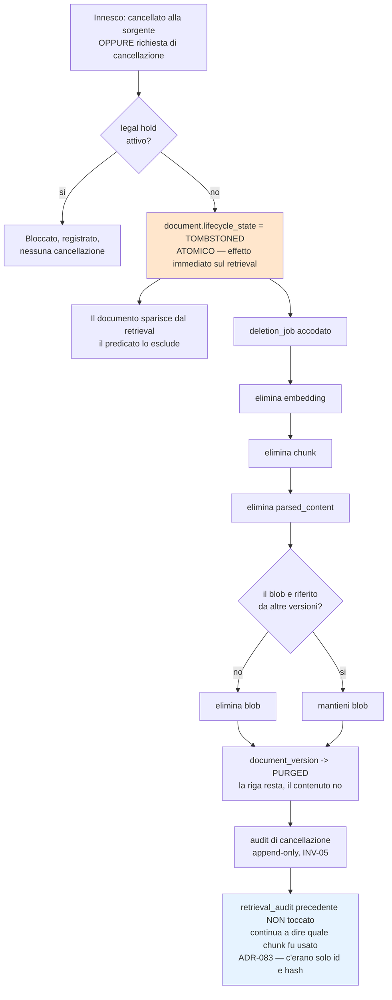

#### Come leggerlo

Il passaggio critico è il primo dopo il controllo del legal hold: **il tombstone è
immediato e atomico**, ed è ciò che fa sparire il documento dal retrieval. Tutto il resto —
la cancellazione vera di chunk, embedding e blob — è **asincrono**, perché può richiedere
tempo e non deve bloccare nessuno.

Questa separazione è il punto: *"non più visibile"* e *"non più presente"* sono due cose
diverse, e la prima deve essere istantanea mentre la seconda può prendersi il suo tempo.

Il rombo su "il blob è riferito da altre versioni?" è la conseguenza del content-addressing:
due documenti identici condividono un blob (§11.3), quindi non si cancella finché qualcuno
lo riferisce.

L'ultimo riquadro azzurro è la riconciliazione fra cancellazione e `INV-05`: l'audit
precedente **non viene toccato**, e resta vero, perché `ADR-083` ci aveva fatto registrare
solo identificatori e hash. Se ci avessimo messo il testo, adesso saremmo costretti a
scegliere fra violare `INV-05` e non cancellare davvero.

### 22.4 Ricostruzione: le tre profondità

| Profondità | Cosa si rifà | Quando serve |
|---|---|---|
| **Re-index** | indice ANN e `tsvector` | corruzione dell'indice, cambio di parametri |
| **Re-chunk** | chunk + embedding, da `parsed_content` | cambio di `chunking_version` |
| **Re-parse** | tutto, dal blob | cambio di parser, aggiunta dell'OCR |

Tutte e tre sono job sulla coda a bassa priorità, ripartibili, con avanzamento visibile.
Tutte e tre lasciano il sistema funzionante durante l'esecuzione, perché la vecchia versione
resta attiva finché la nuova non è completa (§20.1).

### 22.5 Retention e legal hold

Il prompt (§45) chiede il supporto tecnico, e avverte di non fare affermazioni legali. Non
ne faccio: descrivo i meccanismi.

| Meccanismo | Come è fatto |
|---|---|
| **Tombstone** | `document.lifecycle_state`, effetto immediato sul retrieval |
| **Purge** | `deletion_job`, asincrona, cancella derivati e blob |
| **Legal hold** | un flag sul `document` (o su una collezione) che **blocca** il purge e registra il tentativo |
| **Retention policy** | `NON ANCORA DECISO` — è dominio di `A14` (data governance) e dipende da `B-08` (obblighi EU AI Act) |
| **Cancellazione per soggetto** | `NON ANCORA DECISO` — richiede di sapere quali documenti riguardano una persona, cioè il riconoscimento di entità di §14.5. **Debito dichiarato** |

L'ultima riga è una lacuna vera. "Cancella tutto ciò che riguarda Mario Rossi" oggi non è
eseguibile: sappiamo cancellare documenti, non persone dentro i documenti. Lo dichiaro
invece di far finta che il tombstone basti.

---

## 23. `Q-04` è aperta: cosa cambia per ogni ordine di grandezza

`Q-04` chiede: *"volume atteso di documenti per la knowledge base?"*. È **aperta**, e non
invento un numero. Dichiaro invece cosa cambia strutturalmente a ogni ordine di grandezza,
così quando la risposta arriva la conseguenza è già scritta.

**Nota metodologica.** Le soglie sotto sono espresse in **ordini di grandezza di `chunk`**,
non di documenti, perché il numero di chunk è ciò che determina il costo. Il rapporto fra
documenti e chunk dipende dal chunking (§10.4) e va misurato subito, perché è il
moltiplicatore che traduce `Q-04` in tutto il resto.

| Scala (chunk) | Ricerca vettoriale | Indice | Ingestion su CPU | Cosa si rompe per primo | Decisione che cambia |
|---|---|---|---|---|---|
| ~10³ | **scansione esatta basta** | non serve un indice ANN | banale | niente | si potrebbe rinunciare all'indice ANN e semplificare |
| ~10⁴–10⁵ | indice ANN utile | HNSW sta comodamente in RAM | ore, accettabile per il primo caricamento | niente di strutturale | **è lo scenario per cui questo documento è progettato** |
| ~10⁶ | indice ANN necessario | la memoria dell'indice diventa una voce di dimensionamento; il tempo di build diventa una finestra di manutenzione | il primo caricamento diventa giorni; il **re-embedding** diventa proibitivo | `ADR-068` (embedding su CPU) | **`T-KN-02`**: embedding in batch su GPU in finestre dedicate, oppure un servizio esterno per il solo backfill |
| ~10⁷ e oltre | pgvector va verificato seriamente | partizionamento per tenant o per collezione diventa necessario | impraticabile su CPU | `ADR-003` per la parte vettoriale | **`T-03`** e `T-KN-11`: vector store dedicato, indice partizionato |

**Come leggere questa tabella.** La cosa che si rompe per prima **non è pgvector**: è
l'embedding su CPU. Questo è controintuitivo e vale la pena dirlo esplicitamente, perché
l'attenzione tende a concentrarsi sul database.

`ADR-068` è la decisione più sensibile al volume di tutto il documento. `ADR-003` regge più
a lungo.

**Conseguenza sull'ordine delle domande da fare al committente:** `Q-04` non serve solo a
dimensionare il database. Serve a decidere **dove gira il modello di embedding**. Se la
risposta fosse "milioni di documenti", `ADR-068` andrebbe rivisto prima ancora di scrivere
lo schema — probabilmente non spostando il servizio di query su GPU, ma **separando il
percorso di backfill** da quello incrementale, cioè trattandoli come due profili di carico
distinti sullo stesso contratto.

**Cosa NON cambia a nessun ordine di grandezza**, ed è il pezzo di architettura che ho
provato a rendere insensibile al volume:

- `ADR-067` (la piattaforma non possiede il dato aziendale);
- `ADR-071` (i tre strati di autorizzazione);
- `ADR-072` (ACL per riferimento);
- `ADR-074` (le cinque entità);
- il contratto `RetrievalLayer.retrieve()`;
- `AR-KN-07` (tutto il derivato è ricostruibile);
- `ADR-077` (la posizione dei frammenti nel prompt).

**`AS-16` (assunzione, ereditata da `AS-03`):** il volume Day-1 sta nella fascia ~10⁴–10⁵
chunk. Confidenza **Bassa**, perché deriva da `Q-04` che è aperta. Impatto se falsa: alto
verso il basso (sovra-ingegnerizzazione) e alto verso l'alto (`ADR-068` da rifare).
Validazione: chiudere `Q-04`.

---

## 24. Day-1 / Prepare / Scale / Enterprise

Il prompt (§67) chiede questa tabella. `Day 1` = si costruisce adesso. `Prepare` = lo
schema e i contratti lo permettono, il codice no. `Scale` = si aggiunge sotto un trigger.
`Enterprise` = richiede requisiti che oggi non abbiamo.

| Capability | Day 1 | Prepare | Scale | Enterprise |
|---|---|---|---|---|
| Dato strutturato | via `Tool`, dal vivo | — | — | proiezioni dichiarate se misurato |
| Documenti | sì | — | — | — |
| Object storage | filesystem content-addressed | interfaccia `BlobStore` pronta | S3 a `T-KN-08` | multi-regione |
| Metadata | sì, 5 entità | — | — | — |
| Full-text search | sì, per lingua | — | motore dedicato a `T-03` | — |
| Vector search | sì, pgvector | — | vector store a `T-03` | partizionato |
| Embeddings | sì, CPU | coesistenza di versioni nello schema | GPU/batch a `T-KN-02` | multi-modello |
| Retrieval ibrido | sì | — | — | — |
| Reranking | **no** (`ADR-069`) | pipeline a stadi pronta | a `T-KN-03` | — |
| Semantic layer | **no** (`ADR-080`) | — | — | alla seconda sorgente autoritativa |
| Knowledge graph | **no** (`ADR-079`) | `entity_link` c'è | CTE ricorsive a `T-KN-06` | grafo se davvero necessario |
| Sincronizzazione | polling incrementale | interfaccia `DocumentSource` | webhook a `T-KN-07` | event-driven |
| CDC | **no** — vietato da `INV-07` | — | — | — |
| Provenance | sì, completa e obbligatoria | — | — | — |
| Lineage | sì, 8 salti (§12.2) | — | — | export di lineage |
| Isolamento tenant | 4 strati | — | indice partizionato a `T-KN-11` | isolamento fisico a `T-05` |
| Retrieval autorizzato | sì, 3 strati | — | — | — |
| Granularità di campo sul testo | **no**, solo documento (§14.5) | `x-sensitivity` sul documento | riconoscimento entità | classificazione automatica |
| Multilingua | it + en | `language` sulla riga | terza lingua a `T-KN-10` | — |
| Multimodale | **no**, ma i byte si conservano | blob preservati sempre | OCR | modelli multimodali |
| Data quality | stati visibili | metriche | — | — |
| Reconciliation | sweep periodico | `reconciliation_report` | — | — |
| Deletion | tombstone + job asincrono | — | — | cancellazione per soggetto |
| Retention / legal hold | legal hold sì, policy no | flag sullo schema | — | `A14` + `B-08` |
| Rebuildability | sì, con test in CI | — | — | — |
| Golden set di retrieval | **sì, Day-1** (`AR-KN-20`) | — | crescita continua | per tenant |
| Cache dei risultati | **no** (`ADR-078`) | — | — | — |
| Email nella knowledge base | **no** (`ADR-085`) | — | con ACL per utente + quarantena | — |

### 24.1 Diagramma: il deployment Day-1

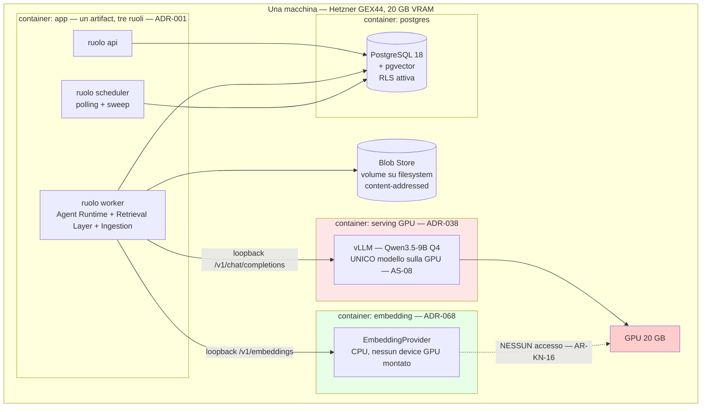

#### Come leggerlo

Quattro container su una macchina. Il confine importante è la **linea tratteggiata** fra il
container di embedding e la GPU: **non c'è accesso**, ed è verificabile guardando il
descrittore del container. È `AR-KN-16` resa concreta, ed è la forma fisica di `AS-08`.

Il container rosso è l'unico che tocca la GPU, e ci mette dentro un solo modello. Il
container verde fa lo stesso lavoro concettuale — inferenza — ma su CPU, in un dominio di
guasto separato: se l'embedding si blocca, l'agent continua a rispondere (senza knowledge, e
lo dichiara nella diagnostica di §15.5).

Notare che `A07` **non aggiunge nessun servizio nuovo** oltre a un container di embedding e
un volume. Nessun broker, nessun vector database, nessun motore di ricerca, nessun sistema a
grafo. Era l'obiettivo dichiarato dal prompt (§4): Day-1 semplice, ispezionabile,
recuperabile, sicuro, testabile, economico, facile da operare.

### 24.2 Diagramma: l'architettura scalata, e in che ordine ci si arriva

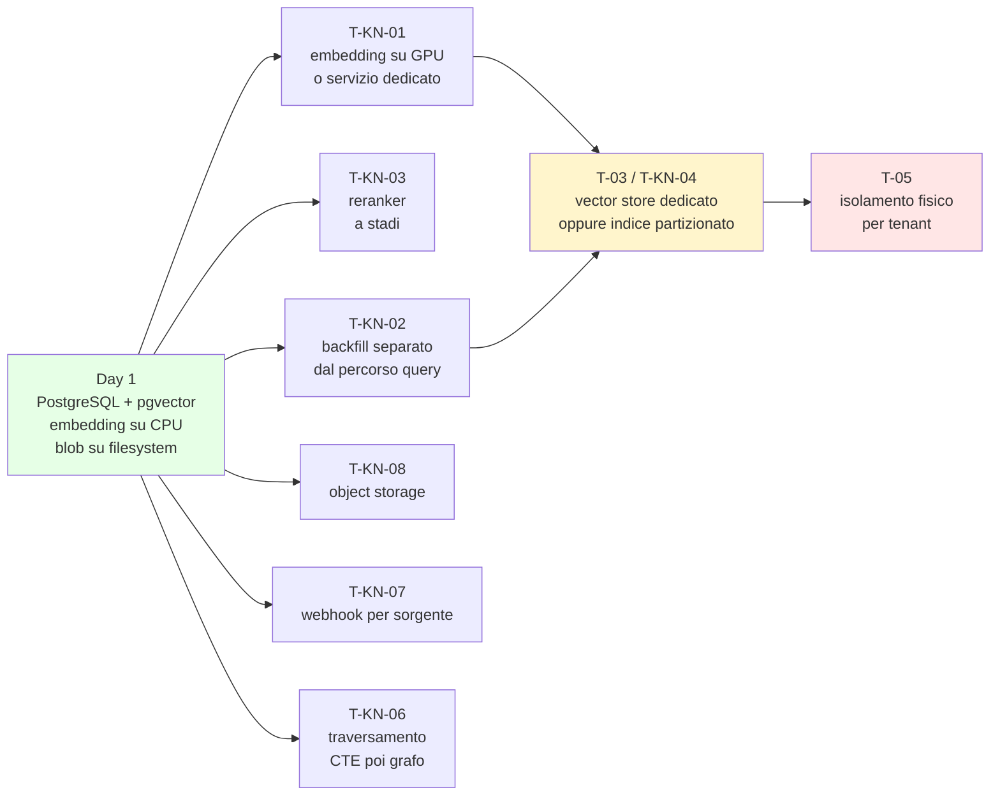

#### Come leggerlo

Non è una roadmap temporale: è un **grafo di dipendenze fra trigger**. Nessuna freccia è
"poi faremo"; ogni freccia è "se scatta quello, allora questo diventa sensato".

Il percorso più probabile è quello centrale: `T-KN-01` (l'embedding su CPU è troppo lento)
oppure `T-KN-02` (l'ingestion non sta dietro), e solo dopo `T-03` (pgvector non basta).
Questo contraddice l'intuizione comune — di solito si pensa che il database ceda per primo —
e discende direttamente dalla tabella di §23.

Le due scatole isolate, `T-KN-08` (object storage) e `T-KN-07` (webhook), non dipendono da
niente: possono scattare in qualsiasi momento per motivi loro.

---

## 25. Proviamo a dimostrare che è sbagliata

Il prompt (§68) chiede di tentare di falsificare la raccomandazione. Lo faccio sul serio: le
domande sotto sono quelle che farei se dovessi bocciare questo documento.

### 25.1 Quale volume la rompe?

**Risposta: ~10⁶ chunk rompono l'embedding su CPU, non pgvector.** §23.
Il primo trigger a scattare è verosimilmente `T-KN-01` o `T-KN-02`, non `T-03`.
**Questa è la previsione principale del documento**, ed è falsificabile: se il primo
trigger a scattare fosse `T-03`, il mio modello mentale del sistema è sbagliato.

### 25.2 Quale volume di query la rompe?

Ogni query costa: un embedding su CPU + due query SQL + una fusione. Il pezzo che scala
peggio è **l'embedding su CPU**, perché consuma core che servono anche al resto
dell'applicazione. La cache degli embedding di query (§17.6) aiuta solo se le domande si
ripetono, cosa che in un CRM è plausibile ma non garantita.
**`AS-01`** (decine di run concorrenti Day-1, non migliaia) regge questa parte.
**Se `AS-01` fosse falsa, `ADR-068` cade insieme a lei.**

### 25.3 Quanti tenant la rompono?

Il numero di tenant non rompe niente direttamente: rompe **l'indice ANN condiviso**. Con
molti tenant piccoli, ogni ricerca filtra su una frazione minuscola dell'indice, che è
esattamente il caso peggiore per `R-25` (§14.7). Il ripiego su scansione esatta lo copre —
è anzi il caso in cui quel ripiego è più utile.
`AS-05` (i tenant Day-1 sono pochi e fidati) regge questa parte.

### 25.4 Quale requisito di freschezza la rompe?

Un requisito `near_real_time` **sui documenti** rompe il polling (`ADR-081`). Non rompe
niente per il dato strutturato, che è già dal vivo. È il caso più facile da mitigare:
`T-KN-07`, webhook per la sorgente interessata.

### 25.5 Quale requisito di latenza la rompe?

**Questa è la domanda che mi preoccupa di più.** Se il budget di latenza per un retrieval
fosse molto stretto, l'embedding della query su CPU potrebbe da solo consumarlo. Non ho il
numero (`B-26`), quindi non posso escluderlo. Se succede, `ADR-068` cade **subito**, non
fra un anno.

Questa è la ragione per cui `B-26` è la prima misura da fare, prima ancora di scrivere lo
schema: è **un pomeriggio di lavoro che può invalidare la decisione più importante del
documento**.

### 25.6 Quale diversità di dati la rompe?

Un corpus fatto in maggioranza di **spreadsheet e scansioni** la rompe: gli spreadsheet
sono coperti male (§19.3) e le scansioni non sono coperte affatto (`ADR-086`). Se
`Q-01`/`Q-04` rivelassero questo scenario, la priorità cambierebbe: OCR e chunking di
tabelle diventerebbero lavoro Day-1, e lo sarebbero a scapito di qualcos'altro.

### 25.7 Quale requisito di sicurezza la rompe?

Due.

**Uno: la granularità di campo su testo libero.** §14.5 dichiara la copertura incompleta. Se
un cliente richiedesse la redazione di dati personali dentro i frammenti, oggi non sappiamo
farlo.

**Due: l'isolamento fisico dell'indice per tenant.** Se un cliente pretendesse che i suoi
vettori non stiano nella stessa struttura dati di quelli di un altro, `T-05` scatterebbe
subito. È già registrato come `D-03`.

### 25.8 Quale requisito di grafo la rompe?

Domande **globali** sul corpus: "quali temi ricorrono nei contratti di quest'anno". §19.5.
Il RAG classico le sbaglia sistematicamente, perché sono domande su un aggregato e il
retrieval restituisce campioni. Non ho una soluzione, e non fingo di averla.

### 25.9 Quale requisito multilingua la rompe?

Una lingua non coperta dal modello di embedding scelto. Rompe in modo **silenzioso**: la
ricerca non fallisce, restituisce risultati mediocri. Mitigazione: `chunk.language` è
persistita, quindi si può misurare la qualità **per lingua** invece che in aggregato.
`T-KN-10`.

### 25.10 Il primo trigger architetturale

**Previsione: `T-KN-01`** — la latenza di embedding della query su CPU fuori budget.

E non per volume: **per latenza percepita**, appena qualcuno userà il sistema in modo
interattivo. È la stessa forma delle previsioni di `A02` (*"il primo trigger sarà `T-CP-02`,
non per carico ma per esposizione"*) e di `A05` (*"il primo trigger sarà `T-MD-04`, e non
per carico ma per roadmap"*): i sistemi giovani non cedono sotto il volume, cedono al primo
contatto con l'uso reale.

---

## 26. Analisi di reversibilità

Il prompt (§63) chiede di classificare le scelte. È l'analisi più utile per sapere dove
serve avere ragione subito.

| Scelta | Reversibilità | Perché |
|---|---|---|
| Motore di memorizzazione (PostgreSQL) | **costosa** | ci sta tutto: stato, queue, knowledge, audit |
| Motore vettoriale (pgvector) | **moderata** | i vettori si ricalcolano o si esportano; il contratto `Retriever` protegge il runtime |
| **Modello di embedding (il checkpoint)** | **costosa** | cambiarlo = ricalcolare tutto. Lo schema supporta la coesistenza, ma il costo di calcolo resta |
| **Dimensione del vettore** | **quasi irreversibile** | è una colonna tipizzata: cambiarla è una migrazione di tutta la tabella |
| Dove gira l'embedding (CPU vs GPU) | **facile** | è il punto forte di `ADR-068` |
| Strategia di chunking | **moderata** | si ri-chunka dal `parsed_content`, ma serve ricalcolare gli embedding |
| API di retrieval (`retrieve()`) | **costosa** | ci si appoggia il runtime |
| Forma di `Fragment` e `Provenance` | **costosa** | ci si appoggiano prompt, audit e lineage |
| Modello semantico | — | non c'è (`ADR-080`), quindi niente da invertire |
| Adozione di un grafo | **facile in avanti**, costosa indietro | non adottarlo oggi non costa niente |
| Architettura di sincronizzazione | **facile** | il cursore è una riga; il connector è dietro un'interfaccia |
| Blob fuori dal database | **moderata** | rimetterli dentro è una migrazione di dati |
| ACL per riferimento (`ADR-072`) | **costosa** | è nello schema e nella query di retrieval |
| Retrieval come canale (non tool) | **facile da estendere** | aggiungere un tool accanto non toglie niente |
| Nessuna cache (`ADR-078`) | **facile** | aggiungerne una dopo è possibile; toglierne una è difficile |

**La lettura di questa tabella in una frase:** le due cose su cui bisogna avere ragione
subito sono **la dimensione del vettore** e **la forma di `Fragment`**. Tutto il resto ha
una via d'uscita.

Ed è coerente con il fatto che `ADR-087` (il checkpoint di embedding) resti `NON ANCORA
DECISO`: la sua parte irreversibile — la dimensione — è dichiarata come decisione di
capacità (§10.3), con scadenza *prima dello schema*.

---

## 27. Registro degli ADR di `A07`

Numerazione da `ADR-067`, progressiva e unica come richiesto.

| ADR | Titolo | Decisione | Reversibilità | Stato | Scadenza |
|---|---|---|---|---|---|
| **ADR-067** | Due percorsi di conoscenza | Dato strutturato dal vivo via `Tool`, mai copiato; documenti indicizzati. La piattaforma non è mai system of record di dato aziendale esterno | Costosa | Accettata | prima dello schema |
| **ADR-068** | **Embedding model su CPU** | Processo separato, contratto `EmbeddingProvider`, **zero VRAM**. **Chiude `AS-08` confermandola** | **Facile** | Accettata | prima delle misure di `A05` |
| **ADR-069** | Nessun reranker Day-1 | Prima si prova la fusione ibrida; il reranker si valuta su una misura di precision | Facile | Accettata | — |
| **ADR-070** | Retrieval ibrido, fusione per rank | Lessicale + vettoriale, fusi per posizione non per punteggio. Due implementazioni reali di `Retriever` → `AR-020` | Moderata | Accettata | prima dello schema (indici) |
| **ADR-071** | Autorizzazione a tre strati | Pre-filtro in query (autoritativo) + RLS + post-verifica. Gli strati 2 e 3 possono solo togliere | Costosa | Accettata | prima del PEP/retrieval |
| **ADR-072** | ACL per riferimento, non per copia | `acl_subject` + `grant` con `synced_at`; fail closed sulla staleness | Costosa | Accettata | prima dello schema |
| **ADR-073** | Blob fuori dal database | Content-addressed, filesystem Day-1, interfaccia `BlobStore`. **Precisazione di perimetro di `ADR-003`, non riapertura** | Moderata | Accettata | prima dello schema |
| **ADR-074** | Cinque entità di documento | `document` / `document_version` / `parsed_content` / `chunk` / `embedding`. Cinque cause di invalidazione, cinque entità | Costosa | Accettata | prima dello schema |
| **ADR-075** | Chunking structure-aware con fallback registrato | Struttura → paragrafo → frase → dimensione, con `boundary_quality` | Moderata | Accettata | dimensione target dipende da `ADR-087` |
| **ADR-076** | Tutto il derivato è ricostruibile | Solo blob, identità e audit sono irreplaceable. Test di ricostruzione in CI | Facile | Accettata | — |
| **ADR-077** | Frammenti in coda al prompt, retrieval per-run append-only | `AR-MD-15` rispettata e sfruttata; budget dichiarato; ricostruzione contata | Moderata | Accettata | prima dell'assemblaggio del prompt |
| **ADR-078** | Nessuna cache dei risultati di retrieval | Una cache di retrieval è una cache di permessi | Facile | Accettata | — |
| **ADR-079** | Nessun knowledge graph | Le relazioni sono autoritative nel CRM; `entity_link` basta; CTE ricorsive prima di qualunque grafo | Facile | Accettata | — |
| **ADR-080** | Nessun semantic layer, nessun MDM | Con una sorgente sola non c'è niente da normalizzare (`AR-020`) | Facile | Accettata | dipende da `Q-01` |
| **ADR-081** | Polling incrementale + reconciliation sweep | Niente CDC (vietato da `INV-07`), niente webhook Day-1 | Facile | Accettata | — |
| **ADR-082** | Classi di freschezza + `freshness_requirement` per run | Il retrieval esclude o marca; non esiste "ignoralo" | Moderata | Accettata | prima del contratto di retrieval |
| **ADR-083** | Audit del retrieval per identificatori e hash, mai testo | Riconcilia `INV-05` con la cancellazione | Costosa | Accettata | prima dello schema di audit |
| **ADR-084** | Tombstone immediato, purge asincrona | "Non visibile" è istantaneo, "non presente" può prendersi tempo | Moderata | Accettata | prima dello schema |
| **ADR-085** | Email fuori dalla knowledge base Day-1 | Superficie d'attacco (`ASI01`/EchoLeak) + ACL per utente | Facile | Accettata | **dipende da conferma del committente** |
| **ADR-086** | Parsing Day-1 solo di formati con testo estraibile | Niente OCR. Il fallimento è uno **stato visibile**, mai un documento vuoto | Facile | Accettata | — |
| **ADR-087** | Embedding model: slot deciso, checkpoint aperto | Vincoli di ammissione + criterio di selezione + scadenza. **Chiude `DEF-02` per la forma, la lascia aperta sul checkpoint** | Costosa (il checkpoint) | **Parziale** | **prima dello schema** |

> **Scadenza comune a `ADR-067`, `ADR-072`, `ADR-073`, `ADR-074`, `ADR-083`, `ADR-084`,
> `ADR-087`:** vanno chiusi **prima dello schema del database**, che `A01` indica come il
> primo lavoro tecnico del progetto.

> **`ADR-068` ha una scadenza diversa e più urgente: prima delle misure di `A05`.** Se
> `A05` misurasse il bilancio VRAM prima che `ADR-068` sia confermato da `B-26`, misurerebbe
> su un'ipotesi.

### 27.1 Le regole nuove: `AR-KN-01` … `AR-KN-22`

| ID | Regola | Come si verifica |
|---|---|---|
| `AR-KN-01` | Nessun frammento entra nel context senza `tenant_id` verificato nella query **e** RLS attiva sulla tabella | test di integrazione con RLS + revisione delle query |
| `AR-KN-02` | Il filtro di autorizzazione è **nella query**, mai solo dopo. Ciò che viene dopo può solo togliere | revisione + test che simula un pre-filtro rotto |
| `AR-KN-03` | Un frammento recuperato non è mai un'istruzione: `trust_class = retrieved` è una costante del tipo | il tipo lo impone |
| `AR-KN-04` | Un frammento senza provenance completa non entra nel context | `NOT NULL` + controllo nel `Fragment Builder` |
| `AR-KN-05` | La piattaforma non è mai system of record di un dato aziendale esterno | revisione dello schema |
| `AR-KN-06` | Nessun campo di dominio del CRM viene copiato nell'indice: solo identificatori | revisione dello schema di `document`/`entity_link` |
| `AR-KN-07` | Ogni artefatto derivato è ricostruibile da blob + versioni di trasformazione | **test di ricostruzione in CI** |
| `AR-KN-08` | Le ACL si referenziano, non si copiano | revisione dello schema |
| `AR-KN-09` | Proiezione dei grant più vecchia della soglia → retrieval **fail closed** su quella sorgente | test con `synced_at` artificialmente vecchio |
| `AR-KN-10` | I frammenti stanno in coda al prompt, dopo le tool definition e prima del riassunto del journal | test sull'ordine del prompt assemblato |
| `AR-KN-11` | Il taglio per budget avviene per frammenti interi, mai a metà frammento | test |
| `AR-KN-12` | L'audit del retrieval registra identificatori e hash, mai il testo | revisione dello schema di audit |
| `AR-KN-13` | Nessuna cache dei risultati di retrieval | revisione |
| `AR-KN-14` | Ogni embedding è attribuibile a source, source_version, modello, versione del modello, chunking e preprocessing | `NOT NULL` |
| `AR-KN-15` | Un documento non parsabile è uno **stato visibile**, mai un documento vuoto | test con un PDF scansionato |
| `AR-KN-16` | Nessun processo di ingestion usa la GPU riservata al modello di generazione | il container non ha device GPU montati |
| `AR-KN-17` | Ogni run dichiara un `freshness_requirement` e il `Retrieval Layer` lo applica | `NOT NULL` nello snapshot + test |
| `AR-KN-18` | Nessun embedding esce da un'API | revisione delle superfici API |
| `AR-KN-19` | Ogni ingestion ha una `ingestion_key` deterministica da tenant, sorgente, id, `content_hash` | test di doppia ingestion |
| `AR-KN-20` | Nessuna misura di recall senza golden set; **senza golden set `T-03` non può scattare** | esistenza dell'insieme etichettato |
| `AR-KN-21` | Il retrieval è un canale di `OBSERVE`, non un tool Day-1 | assenza di una `ToolVersion` di retrieval nel registry |
| `AR-KN-22` | Il `Blob Store` non conosce tenant né permessi; l'unico modo di ottenere un hash è una riga protetta da RLS | nessun endpoint accetta un `content_hash` dal client |

**Debito noto, in coerenza con l'autocritica di `A01` §46:** delle 22 regole, quelle con una
verifica automatica realistica sono circa **quindici**. Le restanti — `AR-KN-05`,
`AR-KN-06`, `AR-KN-08`, `AR-KN-13`, `AR-KN-18`, `AR-KN-22` — si verificano con una
revisione, quindi contano come debito al gate di Level A.

### 27.2 I trigger nuovi: `T-KN-01` … `T-KN-11`

| ID | Condizione osservabile | Riapre | Verso |
|---|---|---|---|
| `T-KN-01` | `query_embed_latency_p95` oltre la quota assegnata del budget di latenza | **`ADR-068`, `AS-08`** | embedding su GPU o servizio dedicato |
| `T-KN-02` | `ingestion_lag_p95` fuori dalla classe di freschezza dichiarata, o backfill impraticabile | `ADR-068` (solo per il backfill) | batch su GPU in finestre dedicate |
| `T-KN-03` | `recall_at_k` accettabile ma `precision_at_k` bassa | **`ADR-069`** | reranker, partendo dalla CPU |
| `T-KN-04` | `recall_at_k` sotto soglia sul golden set | **`T-03`**, quindi `ADR-003` | prima tuning e over-fetch, poi vector store |
| `T-KN-05` | `retrieval_miss_rate` alto con l'informazione presente nell'indice | `AR-KN-21` | tool `knowledge_search` **accanto** al canale |
| `T-KN-06` | query di traversamento multi-hop frequenti e non esprimibili | **`ADR-079`** | prima CTE ricorsive, poi grafo |
| `T-KN-07` | latenza di propagazione oltre la classe di freschezza di una sorgente | `ADR-081` | webhook per quella sorgente, polling come rete |
| `T-KN-08` | il volume dei blob supera il disco locale, o serve durabilità superiore | `ADR-073` | object storage S3-compatible |
| `T-KN-09` | tempo di propagazione di una revoca oltre la soglia dichiarata | `ADR-072` | proiezione dei grant event-driven |
| `T-KN-10` | serve una lingua o un dominio non coperti dal modello di embedding | **`ADR-087`** | secondo modello in coesistenza |
| `T-KN-11` | `index_build_time` oltre la finestra di manutenzione, o requisito di isolamento dell'indice | `ADR-070` / `D-03` | indice partizionato per tenant o collezione |

### 27.3 Rischi nuovi

| ID | Rischio | Classe | Prob. | Impatto | Mitigazione |
|---|---|---|---|---|---|
| `R-24` | Proiezione ACL obsoleta → accesso non autorizzato via indice | Security | Media | **Alto** | `ADR-072` + fail closed (`AR-KN-09`) + allarme prima della soglia |
| `R-25` | Il pre-filtro selettivo degrada il recall dell'indice ANN **in modo silenzioso** | Quality | **Alta** | Medio | `underfill_rate` + over-fetch + ripiego su scansione esatta (§14.7); ricerca `B-29` |
| `R-26` | Documento avvelenato → goal hijack (`ASI01`) | Security | Media | **Alto** | **non risolto strutturalmente**: quarantena + capability congelate + `ADR-023`. Eredita i punti ciechi di `B-01` |
| `R-27` | L'embedding è dato sensibile (attacchi di inversione) | Security | Bassa | Medio | `AR-KN-18`; ricerca `B-32` |
| `R-28` | Side channel temporale sul prefix cache fra tenant | Security | Bassa | Basso | la disposizione di §17.2 riduce l'esposizione; ricerca `B-33` |
| `R-29` | L'ingestion su CPU non sta dietro al volume → knowledge base cronicamente in ritardo | Scalability | Media | Alto | `ingestion_lag` + `T-KN-02`; dipende da `Q-04` |
| `R-30` | **Il golden set non viene mai costruito** → `T-03` non scatta mai e `ADR-003` non è falsificabile | Process | **Alta** | Medio | `AR-KN-20` + requisito Day-1 esplicito |
| `R-31` | Parsing silenziosamente povero (PDF a colonne, tabelle) → frammenti **plausibili e inutili** | Quality | **Alta** | Medio | `boundary_quality`, `parse_state = PARTIAL`, `forced_boundary_rate`; ricerca `B-30` |
| `R-32` | La granularità di autorizzazione è il documento, non il campo: `AR-GP-17` è coperta solo in parte sul percorso documentale | Security | Media | Medio | dichiarata (§14.5), rinviata ad `A14`; ricerca `B-32` |

### 27.4 Assunzioni nuove

| ID | Assunzione | Fonte | Confidenza | Impatto se falsa | Validazione |
|---|---|---|---|---|---|
| `AS-13` | La maggior parte delle domande utili si serve con documenti + dato live, non con conoscenza aggregata sul corpus | inferenza dal dominio CRM | **Media** | servirebbe qualcosa tipo GraphRAG (§19.5) | osservare i run reali |
| `AS-14` | Un modello di embedding piccolo su CPU regge il carico di query Day-1 | inferenza | **Bassa** | **`ADR-068` cade**, e con esso `AS-08` | **`B-26`, misura, prima di tutto** |
| `AS-15` | Le ACL delle sorgenti documentali sono proiettabili in una tabella di grant | inferenza | **Media** | `ADR-072` non è implementabile per quella sorgente → quella sorgente resta fuori | `B-35`, dipende da `Q-01` |
| `AS-16` | Il volume Day-1 sta nell'ordine ~10⁴–10⁵ chunk | inferenza da `AS-03` | **Bassa** | §23 | **chiudere `Q-04`** |
| `AS-17` | Le sorgenti documentali espongono un modo di elencare le modifiche dopo un cursore | inferenza | Media | serve il full sweep a ogni giro per quella sorgente | verifica per connector |

### 27.5 Backlog di ricerca: `B-26` … `B-35`

| ID | Cosa verificare | Serve a |
|---|---|---|
| **`B-26`** | **Latenza p95 e throughput reali di un modello di embedding su CPU, sull'hardware target** (è una **misura**, non una ricerca bibliografica) | **`ADR-068`, `AS-14`, `T-KN-01`. PRIORITÀ MASSIMA: un pomeriggio che può invalidare la decisione principale del documento** |
| `B-27` | Candidati concreti di embedding model multilingua it/en open-weight: licenza, dimensione del vettore, finestra di input, qualità dichiarata | **`ADR-087`, chiude `DEF-02`** |
| `B-28` | pgvector: dimensione massima indicizzabile, stato di HNSW e della quantizzazione, limiti pratici (specializza `B-05`) | `ADR-070`, `ADR-087`, §10.3 |
| `B-29` | Ricerca vettoriale filtrata: il motore garantisce `k` risultati sotto un filtro molto selettivo? Esiste una modalità iterativa? | **`R-25`**, §14.7 |
| `B-30` | Librerie di parsing PDF/DOCX/HTML: qualità su layout a colonne e tabelle, licenza | `ADR-086`, `R-31` |
| `B-31` | Chunking di tabelle e spreadsheet: approcci con evidenza | §19.3 |
| `B-32` | Attacchi di inversione degli embedding: quanto testo si recupera da un vettore | `R-27`, `AR-KN-18` |
| `B-33` | Side channel temporale sul prefix cache fra tenant nei serving runtime | `R-28` |
| `B-34` | Fusione dei risultati: evidenza comparativa fra fusione per rank e alternative calibrate | `ADR-070` |
| `B-35` | Modello ACL della sorgente documentale target (record rule di Odoo, o del DMS) e come proiettarlo in `grant` | **`ADR-072`, `AS-15`. Dipende da `Q-01`** |

---

## 28. Impatti sugli altri documenti

Il prompt (§71) impone di riferire esplicitamente i documenti precedenti e di **non
risolvere in silenzio** i conflitti.

### 28.1 Impatto sui documenti precedenti

| Documento | Impatto |
|---|---|
| **`A01`** | **`ADR-003` confermato, perimetro precisato:** i byte originali stanno fuori dal database (`ADR-073`). Non è una riapertura, ma è una limitazione dichiarata del suo ambito. **`INV-07` rafforzato:** `ADR-067` lo estende dal "nessun accesso diretto al DB del CRM" al "nessuna copia del dato del CRM". **`AR-019` rispettata:** nessun datastore nuovo, e l'argomento sul `Blob Store` è dichiarato come il punto debole (§22.2). **`AR-020` soddisfatta davvero:** `Retriever` ha due implementazioni reali dal primo giorno |
| **`A02`** | Il `ConfigSnapshot` acquisisce voci nuove: `embedding_model_id/version`, `retrieval_token_budget`, `freshness_requirement`, collezioni ammesse, `acl_max_staleness`. **Il numero di risorse del Control Plane potrebbe crescere:** `DataSource` è una candidata seria (lifecycle proprio, owner proprio, riferita da `document`) — **da valutare contro `AR-CP-02` quando si scrive lo schema.** Non lo decido qui perché toccherebbe `ADR-014` |
| **`A03`** | **Il PDP acquisisce un tipo di decisione nuovo: `RetrievalScope`.** È coerente con `ADR-020` (resta puro) e con `ADR-021` (la decisione non è booleana), ma **il PIP deve pre-caricare attributi nuovi** — i grant dell'utente sulle collezioni. `T-GP-01` (le query del PIP superano il 30% della latenza di uno step) diventa **più probabile**. **`AR-GP-17` è coperta solo in parte** sul percorso documentale (§14.5, `R-32`): è la lacuna più onesta del documento |
| **`A04`** | `OBSERVE` acquisisce un passo: la costruzione della `RetrievalQuery` e la chiamata al `Retrieval Layer`. **Il run acquisisce un attributo:** `freshness_requirement`. `AR-RT-14` (il context riceve un riassunto del journal) resta valida ma ora **compete per lo spazio** con il budget del retrieval (§17.4) |
| **`A05`** | **`AS-08` CONFERMATA. `ADR-039` NON cambia nel numero.** Cambia la sua **ripartizione**, che §17.4 dichiara come vincolo verificato al `resolve()`. `AR-MD-15` rispettata e sfruttata (`ADR-077`). **`AR-MD-09` estesa:** `ADR-068` respinge l'embedding via API esterna con lo stesso argomento. La previsione di `A05` — *"il primo trigger a scattare sarà `T-MD-04`, perché l'embedding model di `A07` arriva fra due documenti"* — **non si avvera**: `ADR-068` toglie il modello di embedding dalla GPU, quindi `T-MD-04` (serve un secondo modello reale sull'inference) non scatta. Al suo posto nasce `T-KN-01` |
| **`A06`** | **Mandato rispettato:** il retrieval è un canale, non un tool (`AR-KN-21`, §15.4). `ADR-049` (niente SQL) **rafforzato** da `ADR-067`: senza copia del CRM, la tentazione di riaprirlo si riduce. `ADR-052`/`ADR-055` (budget del prefisso) acquisiscono un consumatore nuovo. `ADR-066` (`x-sensitivity`) applicata al documento, non al campo, sul percorso documentale — **e la differenza è dichiarata** |

### 28.2 Conflitti dichiarati, non risolti in silenzio

| # | Conflitto | Risoluzione proposta |
|---|---|---|
| 1 | `ADR-003` (PostgreSQL unico system of record) **vs** `ADR-073` (blob fuori dal database) | Precisazione di perimetro: `ADR-003` governa stato e dato interrogabile; byte immutabili indirizzati per hash sono fuori dal suo ambito. **Argomentato in §22.2, e dichiarato come la parte più discutibile del documento** |
| 2 | `AR-GP-17` / `ADR-066` (redazione per campo) **vs** la natura del testo libero | **Copertura parziale dichiarata** (§14.5): granularità al documento sul percorso documentale, invariata sul percorso `ToolResult`. Registrata come `R-32` e rinviata ad `A14` |
| 3 | Il prompt di `A07` chiede "research first" con URL **vs** il mandato di non rifare ricerca esterna | **Dichiarato in §1.3.** Nessuna citazione inventata; tutto ciò che avrebbe richiesto ricerca è marcato `RICHIEDE RICERCA` e messo in `B-26`…`B-35` |
| 4 | La riga del registro componenti *"Knowledge/Retrieval: RAG su pgvector"* **vs** `ADR-067` | Quella riga descriveva il RAG come **unico** canale. Va aggiornata: il RAG copre i documenti, il dato strutturato passa dai `Tool` |

**Nessun ADR precedente viene rovesciato.** Uno viene precisato nel perimetro (`ADR-003`),
uno viene coperto solo in parte (`ADR-066`/`AR-GP-17`), e una previsione di `A05` viene
contraddetta — a favore, perché il trigger che temeva non scatterà.

### 28.3 Mandati per i documenti futuri

| Documento | Mandato |
|---|---|
| **`A08` — Memory** | **Deve** dichiarare il `journal_summary_budget` come numero, sapendo che compete con `retrieval_token_budget` (§17.4). **Deve** rispettare il confine di §3.1: se non ha provenance verso una sorgente, è memoria, non knowledge. **Può** riusare il contratto `Retriever` su una collezione diversa, ma **non** le tabelle di `A07`. **Deve** preservare gli identificatori osservati nel riassunto (mandato che `A06` aveva già dato, e che vale anche per i frammenti) |
| **`A09` — Identity** | Deve definire come si autentica l'`EmbeddingProvider` sul loopback (probabilmente come il serving, `AS-06`). Deve definire l'identità dei connector di ingestion, che sono non-human identity con owner (`research-log` R-07, raccomandazione NIST) |
| **`A11`** | Il retrieval è un `READ` puro: componibile secondo `ADR-065` |
| **`A12` — Observability** | Deve fornire le 18 metriche di §21.1, correlate con `run_id`. **Senza `retrieval_miss_rate` correlata, `T-KN-05` non può scattare; senza `recall_at_k`, `T-03` non può scattare** |
| **`A13` — Security** | Deve chiudere `B-01` e `B-25` e **rivedere §18.3 alla luce del testo completo di `ASI01`-`ASI10`**. Deve affrontare `R-26` (poisoned knowledge) e la sua interazione con `R-17` (composizione di azioni lecite): un frammento avvelenato che induce una sequenza di azioni lecite è la combinazione dei due |
| **`A14` — Data Governance** | Eredita `R-32` (granularità di campo sul testo), la retention policy, e la cancellazione per soggetto (§22.5). Dipende da `B-08` |
| **`A15` — Deployment** | Un container in più (`embedding`), **senza device GPU montati** (`AR-KN-16`), un volume per il `Blob Store` da includere nel backup |
| **`A16`/`A17` — Release e Testing** | Il **test di ricostruzione** di `AR-KN-07` va in CI. Il **golden set** di `AR-KN-20` è un artefatto di test versionato. Il confronto ANN vs scansione esatta (§20.3, `VERIFY`) è un test di correttezza |
| **`A18` — API/Integration** | Deve definire l'API di caricamento documenti, quella di stato dell'ingestion, e l'API che restituisce un documento originale — che è il punto dove `AR-KN-22` si verifica |
| **`C24` — DR** | La distinzione rigenerabile/irreplaceable (§22.1) è l'input principale per RPO/RTO: si può accettare un RPO peggiore sul derivato che sul blob |
| **`C26` — Compliance** | `ADR-083` (audit senza testo) è una scelta con implicazioni: va verificata contro i requisiti di conservazione delle prove |
| **`C29` — Replay** | Il `retrieval_audit` permette di sapere **quali** frammenti furono usati, non di rileggerli se cancellati (§18.4). Coerente con `ADR-042` |

---

## 29. Autocritica

Le cose che non mi convincono di questo documento, in ordine di gravità.

**Uno — `ADR-068` poggia su un numero che non ho.**
La decisione più importante del documento — l'embedding su CPU, che chiude `AS-08` e salva
`ADR-039` — è argomentata sull'**asimmetria del costo di errore**, non sulla dimostrazione
che la CPU basti. È un buon argomento di metodo, ma resta un argomento di metodo. `B-26` è
un pomeriggio di lavoro che può ribaltarla, e finché non è fatto, `AS-14` è a confidenza
Bassa. Se dovessi indicare la riga di questo documento che ha più probabilità di essere
sbagliata, è quella.

**Due — il `Blob Store` fuori dal database è la decisione più contestabile.**
`AR-019` chiede una misura del limite attuale prima di introdurre un datastore nuovo, e io
non ce l'ho. Ho argomentato che un blob content-addressed non è "un datastore" nel senso
che `AR-019` intende, ma è un argomento di definizione, e gli argomenti di definizione sono
quelli con cui si aggirano le regole. Un revisore severo mi direbbe di mettere i blob in
`bytea` Day-1 e di uscirne al primo problema di backup. **Non avrei una risposta forte.**

**Tre — `AR-GP-17` è coperta a metà, e l'ho scoperto scrivendo.**
La redazione per campo funziona benissimo sui `ToolResult`, che hanno campi. Sul testo
libero non ho una soluzione: ho una granularità di documento e una dichiarazione onesta.
Questo significa che un contratto che contiene **una** clausola riservata è tutto visibile o
tutto invisibile. Nella pratica gli utenti chiederanno la via di mezzo.

**Quattro — non ho fatto ricerca, e per questo documento contava.**
`A07` è, fra tutti i documenti del Level A, quello con la maggiore dipendenza da fatti
esterni verificabili: limiti di pgvector, candidati di modello, comportamento del filtro su
ANN, qualità delle librerie di parsing. Ho compensato spostando tutto ciò che era incerto
in `NON ANCORA DECISO` con criterio, ma il risultato è un documento che decide **le forme** e
rimanda **i parametri**. Chi deve implementare troverà dieci punti in cui deve fermarsi a
misurare prima di poter scrivere codice.

**Cinque — il golden set è il requisito che verrà saltato.**
`R-30` lo dice, ma vale la pena ripeterlo qui: quattro decisioni (`ADR-003`, `ADR-069`,
`ADR-070`, `ADR-087`) dipendono da qualche decina di domande etichettate a mano. Non rompe
niente se non c'è, e per questo non si farà. Sarebbe il modo più banale di rendere questo
documento non falsificabile.

**Sei — ho aggiunto 21 ADR e 22 regole, e forse sono troppi.**
`A06` ne aveva aggiunti 19 e 16. Il rischio è che il registro delle regole diventi qualcosa
che nessuno legge, e allora smette di essere un vincolo e diventa documentazione. Se dovessi
tagliare, toglierei `ADR-076` (ricostruibilità, che è più una proprietà che una decisione) e
fonderei `ADR-084` dentro `ADR-073`.

**Sette — `ADR-085` (email fuori) potrebbe essere una scelta che il committente non
accetterà.** L'ho presa con argomenti di sicurezza solidi, ma sospetto che "l'agent legge le
email" sia esattamente il caso d'uso che qualcuno ha in testa. Se è così, la riapertura non
è marginale: rimette in gioco la quarantena, le ACL per utente e tutta §14.4.

**Otto — non ho verificato le decisioni contro il testo dei documenti `01`…`06`.**
Ho lavorato su `ARCHITECTURE_STATE.md`, che è la loro sintesi vincolante. È quello che il
mandato chiedeva, ed è probabilmente giusto, ma significa che se una sfumatura importante di
`A03` o `A06` non è finita nella sintesi, io non la conosco. La coerenza che dichiaro è
coerenza con lo stato, non con il testo integrale.

### 29.1 Le venti domande del prompt, risposte

Il prompt (§69) elenca venti domande di autocritica. Rispondo per punti, secco.

1. Data vs knowledge distinti? **Sì**, §3 e `ADR-067`.
2. Knowledge vs memory distinti? **Sì**, §3.1, con una regola verificabile a schema.
3. Identificata la vera source of truth? **Sì**: è fuori dalla piattaforma.
4. Evitato di assumere che il RAG risolva tutto? **Sì**: il RAG copre solo i documenti.
5. PostgreSQL confrontato con alternative vere? **Sì**, §6, sei opzioni.
6. Vettoriale confrontato con lessicale e strutturato? **Sì**, `ADR-070` e §5.
7. Retrieval autorizzato affrontato? **Sì**, §14, la sezione più lunga.
8. Dati non autorizzati possono raggiungere il modello? **Solo con un bug** in tutti e tre
   gli strati insieme. Il residuo dichiarato è `R-24` (ACL obsolete) e `R-32` (campo).
9. Isolamento tenant in difesa in profondità? **Sì**, quattro strati. Residuo: indice ANN
   condiviso.
10. Provenance preservata? **Sì**, obbligatoria per regola (`AR-KN-04`).
11. Gli indici si possono ricostruire? **Sì**, con test in CI (`AR-KN-07`).
12. Gli embedding si possono rigenerare? **Sì**, con coesizione di versioni (§20).
13. Il dato obsoleto è rilevabile? **Sì**, `ADR-082`, con esclusione o marcatura.
14. Semantica di cancellazione definita? **Sì**, §22.3. Lacuna: cancellazione per soggetto.
15. I cambiamenti alla sorgente si riconciliano? **Sì**, sweep periodico (§13.2).
16. Ho introdotto un grafo senza giustificazione? **No**, `ADR-079` lo esclude.
17. Il Day-1 è davvero semplice? **Sì**: un container e un volume in più. Nessun servizio
    di terzi nuovo.
18. Il retrieval può evolvere senza riscrivere il runtime? **Sì**, §16.3, una sola
    funzione.
19. La scala futura è raggiungibile per gradi? **Sì**, §24.2, e l'ordine è dichiarato.
20. Quali assunzioni possono invalidare tutto? **`AS-14`** (l'embedding su CPU regge) e
    **`AS-16`** (il volume), cioè `Q-04`.

---

# 30. RACCOMANDAZIONE FINALE DI KNOWLEDGE & DATA ARCHITECTURE

## Che cosa deve costruire davvero questa piattaforma

**Una knowledge base di documenti dentro PostgreSQL, e nessuna copia del dato aziendale.**

Nel dettaglio, senza giri di parole:

| Aspetto | La decisione |
|---|---|
| **Source of truth** | sempre fuori: CRM/ERP/DMS. La piattaforma possiede solo ciò che genera e i documenti caricati direttamente (`ADR-067`) |
| **Storage** | PostgreSQL 18 + pgvector per tutto ciò che si interroga; filesystem content-addressed per i byte originali (`ADR-073`) |
| **Documenti** | cinque entità distinte: `document`, `document_version`, `parsed_content`, `chunk`, `embedding` (`ADR-074`) |
| **Dato strutturato** | **mai indicizzato**: si legge dal vivo via `Tool` (`ADR-067`, `INV-07`, `ADR-049`) |
| **Ingestion** | asincrona, a stati persistiti, idempotente per `(tenant, sorgente, id, content_hash)`, sulla coda PostgreSQL esistente a priorità bassa |
| **Sincronizzazione** | polling incrementale per cursore + reconciliation sweep. Niente CDC, niente webhook Day-1 (`ADR-081`) |
| **Indicizzazione** | `tsvector` per lingua + indice ANN su pgvector, con ripiego su scansione esatta |
| **Embeddings** | modello locale multilingua **su CPU**, processo separato, **zero VRAM** (`ADR-068`). Checkpoint `NON ANCORA DECISO` con criterio (`ADR-087`) |
| **Chunking** | structure-aware con fallback registrato in `boundary_quality` (`ADR-075`) |
| **Retrieval** | ibrido lessicale + vettoriale, fusione per rank, deduplica, espansione dei vicini, filtro di freschezza, budget di token (`ADR-070`) |
| **Reranking** | **nessuno Day-1** (`ADR-069`) |
| **Provenance** | undici campi obbligatori su ogni frammento; senza provenance non entra nel context (`AR-KN-04`) |
| **Access control** | tre strati, pre-filtro autoritativo nella query, ACL **per riferimento** con fail closed sulla staleness (`ADR-071`, `ADR-072`) |
| **Isolamento tenant** | `tenant_id` ovunque + filtro in query + RLS + nessuna cache (§14.6) |
| **Freschezza** | classi dichiarate + `freshness_requirement` per run, che **esclude o marca** (`ADR-082`) |
| **Consistenza** | eventual verso la sorgente, read-after-write dentro la piattaforma, version consistency sempre |
| **Cancellazione** | tombstone immediato + purge asincrona; l'audit sopravvive perché contiene solo id e hash (`ADR-084`, `ADR-083`) |
| **Ricostruibilità** | tutto il derivato si rifà dal blob; test in CI (`AR-KN-07`) |
| **Observability** | 18 metriche (§21.1), un golden set Day-1 (`AR-KN-20`), audit del retrieval append-only |
| **Posizione nel prompt** | frammenti in coda, dopo le tool definition, append-only per run (`ADR-077`, `AR-MD-15`) |

## Che cosa NON va costruito il primo giorno

Elenco secco, perché il prompt lo chiede esplicitamente:

- **nessun vector database dedicato** — `AR-019`, e `T-03` dice quando;
- **nessun motore di ricerca separato** — porterebbe un secondo modello di sicurezza senza RLS;
- **nessun database a grafo** — `ADR-079`; le relazioni sono già autoritative nel CRM;
- **nessun semantic layer, nessun MDM** — `ADR-080`; con una sorgente non c'è niente da normalizzare;
- **nessun data lake, nessun Kafka, nessun Spark** — non abbiamo un problema di volume né di analitica;
- **nessun reranker** — `ADR-069`;
- **nessuna cache dei risultati di retrieval** — `ADR-078`; sarebbe una cache di permessi;
- **nessuna copia del CRM**, nemmeno "solo qualche campo per comodità" — `ADR-067`;
- **nessun OCR, nessun multimodale** — `ADR-086`; ma i byte si conservano lo stesso;
- **nessuna email nella knowledge base** — `ADR-085`, salvo diversa indicazione del committente;
- **nessun modello di embedding sulla GPU** — `ADR-068`, `AR-KN-16`; è la riga che protegge `ADR-039`;
- **nessun tool `knowledge_search`** — `AR-KN-21`; il retrieval è un canale, `T-KN-05` dice quando riaprire;
- **nessuna trasformazione automatica della query** — §15.3; sarebbe un'euristica invisibile;
- **nessun punteggio di fiducia calcolato dal contenuto** — §12.4; la fiducia è dichiarata.

## Che cosa deve accadere perché l'architettura evolva

In ordine di probabilità, non di gravità:

1. **`T-KN-01`** — la latenza di embedding della query su CPU esce dal budget. **È la
   previsione principale**: sarà il primo trigger a scattare, e non per volume ma al primo
   uso interattivo serio. Riapre `ADR-068`, non `ADR-039`.
2. **`T-KN-02`** — l'ingestion non sta dietro al volume. Riapre `ADR-068` per il solo
   backfill, separandolo dal percorso di query.
3. **`T-KN-03`** — recall accettabile ma precision bassa. Entra il reranker.
4. **`T-03` / `T-KN-04`** — recall sotto soglia sul golden set. **Solo qui** si riapre
   `ADR-003` per la parte vettoriale, e comunque prima si prova il tuning.
5. **`T-05`** — un cliente con isolamento contrattuale. Partizionamento e isolamento fisico.

## La cosa da fare per prima

**Misurare `B-26`: quanto ci mette il modello di embedding candidato, su CPU,
sull'hardware reale, a trasformare una domanda breve in un vettore.**

Un pomeriggio di lavoro. Se il numero è buono, tutto questo documento regge e `AS-08` resta
chiusa. Se è cattivo, `ADR-068` va rifatto **prima** che `A05` misuri il suo bilancio VRAM,
perché altrimenti misurerebbe su un'ipotesi.

Non c'è nessun'altra attività, in questo documento, che abbia lo stesso rapporto fra costo e
informazione.

---

## 31. CHECKPOINT `A07`

**Come ho chiuso `AS-08`:** **CONFERMATA** — l'embedding model gira su CPU in un processo
separato (`ADR-068`), sulla GPU resta un solo modello, la VRAM sottratta ad `A05` è **zero**.
Nessun reranker Day-1 (`ADR-069`), quindi nessun secondo candidato alla scheda.
**`ADR-039` NON cambia nel numero**; cambia la sua **ripartizione interna**, che §17.4
dichiara come vincolo verificato al `resolve()` (`prefix + run_context + retrieval_budget +
journal_summary + step + output_reserve ≤ max_model_len`).

| Campo | Contenuto |
|---|---|
| **DOCUMENT** | `07_KNOWLEDGE_DATA.md` — Knowledge & Data Architecture |
| **PURPOSE** | da dove viene l'informazione su cui l'agent ragiona: chi possiede il dato, cosa viene indicizzato, come si recupera, chi ha diritto di vederlo |
| **KEY DECISIONS** | **due percorsi** (dato strutturato dal vivo via `Tool`, documenti indicizzati) · **embedding su CPU, zero VRAM** · autorizzazione a **tre strati con pre-filtro autoritativo in query** · **ACL per riferimento** con fail closed sulla staleness · **cinque entità** di documento · retrieval **ibrido** con fusione per rank · **frammenti in coda al prompt, append-only per run** · audit per **identificatori e hash, mai testo** · **tutto il derivato ricostruibile** · **golden set Day-1** |
| **REJECTED ALTERNATIVES** | vector database dedicato · motore di ricerca separato · knowledge graph · semantic layer / MDM · data lake · architettura poliglotta · reranker Day-1 · cache dei risultati · copia sincronizzata del CRM · CDC · webhook Day-1 · OCR · email nella knowledge base · embedding sulla GPU · embedding via API esterna · embedding con il modello di generazione · query rewriting automatico · punteggi di fiducia calcolati · blob in `bytea` |
| **NEW INTERFACES** | `RetrievalLayer.retrieve(RetrievalQuery, RetrievalScope) → RetrievalResult` · `Retriever.search()` (**due implementazioni Day-1**) · `EmbeddingProvider.embed()` · `BlobStore.put/get(content_hash)` · `DocumentSource.list_changes/fetch` · **`RetrievalScope`** prodotta dal PDP (estende `ADR-021`) · `Fragment` con provenance a 11 campi obbligatori |
| **NEW CONSTRAINTS** | `AR-KN-01` … `AR-KN-22` (§27.1). Le più vincolanti: `AR-KN-02` (filtro in query), `AR-KN-04` (niente provenance, niente context), `AR-KN-07` (tutto ricostruibile), `AR-KN-09` (fail closed su ACL obsolete), `AR-KN-10` (frammenti in coda), `AR-KN-16` (ingestion mai sulla GPU), `AR-KN-20` (niente recall senza golden set) |
| **NEW RISKS** | `R-24` ACL obsolete · **`R-25` pre-filtro che degrada il recall in silenzio** · `R-26` poisoned knowledge non risolta · `R-27` inversione degli embedding · `R-28` side channel sul prefix cache · `R-29` ingestion su CPU in ritardo · **`R-30` il golden set non verrà costruito** · `R-31` parsing povero e silenzioso · `R-32` `AR-GP-17` coperta a metà sul testo libero |
| **NEW ASSUMPTIONS** | `AS-13` domande servite da documenti + dato live (Media) · **`AS-14` embedding su CPU sufficiente (Bassa — `B-26`)** · `AS-15` ACL proiettabili (Media, dipende da `Q-01`) · **`AS-16` volume ~10⁴–10⁵ chunk (Bassa — `Q-04`)** · `AS-17` le sorgenti offrono un cursore di modifiche (Media) |
| **DECISIONS THAT MAY NEED REVISION** | **`ADR-068`** se `B-26` va male — è la più esposta · **`ADR-073`** (blob fuori dal database) è la più contestabile: `AR-019` non ha una misura · **`ADR-085`** (email fuori) se il committente la considera un requisito · **`ADR-087`** resta parziale finché `B-27` non è chiuso · la copertura parziale di `AR-GP-17` (§14.5) · il numero di risorse del Control Plane se `DataSource` diventa una risorsa (tocca `ADR-014`) |
| **IMPACT ON PREVIOUS ARCHITECTURE** | **`A05`: `AS-08` confermata, `ADR-039` invariato nel numero, ripartizione dichiarata; la previsione di `A05` su `T-MD-04` non si avvera** · **`A01`: `ADR-003` confermato con perimetro precisato (`ADR-073`); `INV-07` esteso da "nessun accesso" a "nessuna copia"; `AR-020` soddisfatta con due `Retriever` reali** · **`A03`: il PDP acquisisce `RetrievalScope`, il PIP acquisisce attributi nuovi, `T-GP-01` più probabile, `AR-GP-17` coperta solo in parte** · **`A02`: `ConfigSnapshot` acquisisce 5 voci; `DataSource` è una candidata a risorsa** · **`A04`: `OBSERVE` acquisisce un passo; il run acquisisce `freshness_requirement`** · **`A06`: mandato del canale rispettato; `ADR-049` rafforzato; budget del prefisso con un consumatore nuovo** |
| **IMPACT ON FUTURE ARCHITECTURE** | **`A08` deve** dichiarare il budget del riassunto sapendo che compete con il retrieval, e rispettare il confine di §3.1 · **`A12` deve** fornire 18 metriche correlate a `run_id`, altrimenti `T-03` e `T-KN-05` non scattano · **`A13` deve** rivedere §18.3 dopo `B-01`/`B-25` e affrontare `R-26` insieme a `R-17` · **`A14` eredita** `R-32`, retention e cancellazione per soggetto · **`A15`**: un container in più senza GPU + un volume da backuppare · **`A16`/`A17`**: test di ricostruzione in CI, golden set versionato, ANN contro scansione esatta · **`A09`**: identità del provider di embedding e dei connector · **`C24`**: la distinzione rigenerabile/irreplaceable è l'input per RPO/RTO · **`C29`**: si sa quali frammenti, non si rileggono se cancellati |
| **DAY-1 REQUIREMENTS** | 8 tabelle di knowledge + `grant`/`acl_subject`/`entity_link` · RLS attiva · `Blob Store` su filesystem · pipeline di ingestion a stati persistiti · polling + sweep · `EmbeddingProvider` su CPU in container senza GPU · retrieval ibrido con pre-filtro · `Fragment` con provenance completa · `retrieval_audit` append-only · **golden set etichettato** · test di ricostruzione in CI |
| **FUTURE REQUIREMENTS** | reranker · embedding su GPU o servizio dedicato per il backfill · object storage · webhook per sorgente · vector store dedicato o indice partizionato · tool `knowledge_search` accanto al canale · OCR e multimodale · CTE ricorsive e poi eventuale grafo · redazione a livello di campo sul testo · cancellazione per soggetto |
| **NEW ADR** | **`ADR-067` … `ADR-087`** (21 ADR, §27). I quattro portanti: `ADR-067` (due percorsi), **`ADR-068` (embedding su CPU — chiude `AS-08`)**, `ADR-071` (tre strati di autorizzazione), `ADR-077` (frammenti in coda, append-only) |
| **NEW TRIGGERS** | **`T-KN-01` … `T-KN-11`** (§27.2). **Previsione: il primo a scattare è `T-KN-01`**, e non per volume ma al primo uso interattivo serio — stessa forma delle previsioni di `A02` e `A05` |
| **NEW RESEARCH BACKLOG** | **`B-26` … `B-35`** (§27.5). **`B-26` (latenza dell'embedding su CPU) è priorità massima: è una misura da un pomeriggio che può invalidare `ADR-068`, e va fatta prima delle misure VRAM di `A05`** |
| **`DEF-02`** | **Chiusa per la strategia di chunking (`ADR-075`) e per la forma del modello di embedding (`ADR-087`: CPU, locale, multilingua, dimensione come decisione di capacità, coesistenza di versioni). Resta `NON ANCORA DECISO` il checkpoint concreto**, con criterio di ammissione e selezione scritto (§10.2), scadenza *prima dello schema*, ricerca `B-27` |
| **`Q-04`** | **Aperta.** §23 dichiara cosa cambia per ogni ordine di grandezza. Il risultato controintuitivo: **a rompersi per prima non è pgvector, è l'embedding su CPU** (~10⁶ chunk). `ADR-003` regge più a lungo di `ADR-068` |
| **CONFIDENCE** | **Alta** su: separazione dei due percorsi (`ADR-067`), i tre strati di autorizzazione (`ADR-071`), le ACL per riferimento (`ADR-072`), le cinque entità (`ADR-074`), la posizione dei frammenti nel prompt (`ADR-077`), la ricostruibilità (`AR-KN-07`) — sono decisioni che poggiano su argomenti interni e su invarianti già stabiliti, non su fatti esterni non verificati. **Media** su: `ADR-070` (ibrido: la fusione per rank è ragionevole ma non calibrata, `B-34`), `ADR-075` (chunking: la strategia è solida, i parametri no), `ADR-081` (sincronizzazione: dipende da `AS-17`), `ADR-073` (blob fuori dal database: l'argomento su `AR-019` è di definizione). **Bassa** su: **`ADR-068`** finché `B-26` non è misurato — ed è la decisione più importante del documento; **`ADR-087`** finché `B-27` non è chiuso; **tutto il dimensionamento** finché `Q-04` è aperta; la **completezza del threat model** (§18.3) finché `B-01` e `B-25` sono aperti, come già dichiarato da `A03` e `A06` |


