# 09 — IDENTITY, AUTHENTICATION & AUTHORIZATION

**Livello A · Documento 09 · Enterprise AI Agent Platform per CRM/ERP**

Dipende da: `01_ARCHITECTURE_PRINCIPLES.md` (`A01`), `02_CONTROL_PLANE.md` (`A02`),
`03_GOVERNANCE_POLICY.md` (`A03`), `04_AGENT_RUNTIME.md` (`A04`),
`05_MODEL_INFERENCE.md` (`A05`), `06_TOOL_ARCHITECTURE.md` (`A06`),
`07_KNOWLEDGE_DATA.md` (`A07`), `08_MEMORY.md` (`A08`).

Stato canonico di riferimento: `ai/state/ARCHITECTURE_STATE.md`.

---

## 0. Le quattro risposte, prima di tutto il resto

Questo documento è lungo. Le quattro domande più difficili hanno una risposta secca, e la
metto in cima perché chi legge non debba cercarla.

**1. Chi è il `principal` quando un agent agisce per conto di un utente?**

> **Sono due soggetti insieme, non uno.** Il `principal` è una **coppia**: un `actor` (chi
> sta materialmente eseguendo — l'`AgentRun`, che ha una sua identità di prima classe) e un
> `on_behalf_of` (per conto di chi — il `subject_id` dell'essere umano, oppure un
> `ServicePrincipal` dichiarato se non c'è nessun umano). L'autorità effettiva è
> l'**intersezione** delle due autorità, mai l'unione, mai l'ereditarietà. L'agent non
> diventa mai l'utente e l'utente non diventa mai l'agent.

**2. Il contratto del secret store che `A06` mi ha chiesto**

> Un'interfaccia `SecretStore` a **cinque metodi** (`get_secret`, `put_secret`,
> `rotate_secret`, `revoke_secret`, `describe_secret`) che restituisce **materiale
> crittografico solo al `Credential Broker`**, mai al codice di un tool; il Broker lo
> trasforma in un **client già autenticato** (`ADR-056`), lo tiene per il tempo di un
> singolo `EXECUTE`, e ne registra nell'audit solo il `credential_ref` — un puntatore, mai
> il valore. Day-1 l'implementazione è una tabella PostgreSQL cifrata con una chiave che
> **non sta nel database**; l'interfaccia è progettata perché la stessa firma regga Vault o
> un KMS gestito senza toccare il codice dei tool.

**3. I permessi si congelano nello snapshot?**

> **No — ma non è nemmeno vero il contrario.** Si congela il **tetto** (il capability set
> dell'agent, il set di tool, il `MemorySnapshot`: tutto ciò che sta nel prompt e che
> `ADR-008`, `INV-04` e `ADR-092` hanno già congelato). **Non** si congela l'**autorità
> viva**: i permessi dell'utente, lo stato del suo account, le ACL delle sorgenti esterne e
> la validità della delega si rileggono a **ogni** passo di `AUTHORIZE`. Costo pagato: due
> letture in più per step e una latenza in più sul percorso caldo (`T-GP-01` diventa più
> probabile). Costo **evitato**: una revoca che non ha effetto per dieci minuti su un run
> già partito.

**4. Cosa è un `subject_id` e come sopravvive ai cambi di identità?**

> È un **identificatore opaco, immutabile, interno alla piattaforma, unico dentro un
> tenant**, generato da noi, che non è né l'email, né il `sub` dell'Identity Provider, né lo
> username, né la chiave primaria del CRM. È il numero di matricola di una persona: cambia
> l'email, cambia il ruolo, cambia il reparto, cambia perfino l'Identity Provider — la
> matricola no. Sopravvive perché tutto ciò che **cambia** (email, `sub` esterno, ruoli,
> stato) vive in righe **collegate** al `subject_id`, mai dentro di esso. Un account
> disattivato **conserva** il suo `subject_id`; una fusione di account produce un **alias**
> risolto in lettura, non una riscrittura dell'audit; un `subject_id` non viene **mai**
> riassegnato a una persona diversa.

---

## 1. Come leggere questo documento

Tre livelli di lettura, come prescrive la convenzione di lavoro.

| Se sei… | Leggi almeno |
|---|---|
| **Non tecnico** | §0 (le quattro risposte), §2 (il problema in una pagina), §7 (chi è il principal), §35 (raccomandazione finale) |
| **Junior developer** | tutto §3 → §22: i contratti, i campi, i flussi, cosa fallisce e come |
| **Senior / architect** | in più §23 (threat model), §26 (matrice), §28 (reversibilità), §29 (`Q-03`), §32 (falsificazione), §33 (autocritica) |

**Convenzione sui livelli di verità.** In tutto il documento distinguo tre etichette, e non
le confondo mai:

- **FATTO** — informazione verificabile alla fonte. Qui dentro i FATTI vengono quasi tutti
  dal `research-log.md` già consolidato: **per vincolo di questo incarico non ho fatto
  ricerca esterna nuova**. Dove mi servirebbe un fatto che non ho, scrivo `RICHIEDE
  RICERCA` e lo metto nel backlog `B-42`…
- **INFERENZA** — conclusione derivata da fatti o da decisioni già prese nei documenti
  precedenti.
- **DECISIONE ARCHITETTURALE** — scelta che facciamo noi per questo sistema, con
  alternative, trade-off e un contro-argomento onesto.

**Avvertenza sulle fonti.** Il prompt di questo documento chiede URL di RFC, specifiche
OAuth/OIDC, NIST e OWASP. **Non li produco**, perché non ho ispezionato quelle fonti in
questa sessione e la convenzione vieta di citare ciò che non si è letto (§11 e §73 del
prompt: *"Do not fabricate citations"*). Gli unici fatti esterni che uso sono quelli già
registrati nel `research-log.md` (`R-07` su OWASP/NIST, `R-03` sui policy engine, `R-05` su
PostgreSQL 18, `R-01` su MCP). Tutto il resto che richiederebbe una fonte è marcato
`RICHIEDE RICERCA`. Questo è il **debito più grande del documento** e lo dichiaro subito,
non in fondo.

---

## 2. Il problema, in una pagina

### In breve

Un agent è un programma che **agisce**. Chiama il CRM, scrive un'opportunità, manda una
mail. Ogni volta che agisce, qualcuno da qualche parte deve poter rispondere a una domanda
banale e insidiosa:

> **Chi ha fatto questa cosa?**

In un software normale la risposta è facile: l'ha fatta l'utente Maria, che era loggata.
Con un agent la risposta si sdoppia. L'ha fatta Maria, che ha chiesto "aggiorna
l'opportunità di Rossi"? O l'ha fatta l'agent, che ha deciso da solo di chiamare tre tool
in fila, uno dei quali Maria non sapeva nemmeno che esistesse? O l'ha fatta la piattaforma,
che verso Odoo si presenta con una sua credenziale di servizio e quindi nei log di Odoo
compare come `agent_platform`, non come Maria?

Le tre risposte hanno **conseguenze opposte**:

| Se il principal è… | Nell'audit vedi | In autorizzazione succede | Il rischio è |
|---|---|---|---|
| **l'utente** | tutto sembra fatto da Maria | l'agent eredita tutti i permessi di Maria | l'agent diventa un **confused deputy**: il modello viene manipolato e agisce con l'autorità piena di Maria |
| **l'agent** | tutto sembra fatto dal robot | Maria non limita niente | un agent con permessi ampi fa a chiunque cose che al singolo utente sarebbero vietate. Sparisce la responsabilità umana |
| **un'identità di servizio** | tutto sembra fatto dalla piattaforma | né Maria né l'agent limitano | il sistema esterno perde ogni traccia di chi ha voluto l'azione. È la peggiore delle tre per l'audit |

### Perché esiste questo documento

`A03` (il documento di governance, che ha definito **come si decide** se un'azione è
permessa) ha stabilito che l'autorità è l'**intersezione di cinque insiemi** (`ADR-019`) e
che il `PDP` — *Policy Decision Point*, il componente che dice sì o no a un'azione — è una
**funzione pura** (`ADR-020`: nessun I/O, nessun orologio, nessuna casualità: riceve tutto
già caricato e restituisce una decisione).

Ma una funzione pura ha bisogno di **input**. `A03` ha definito la funzione. Non ha definito
**chi è il soggetto che si presenta alla decisione** né **come si dimostra che è davvero
lui**.

Questo è il compito di `A09`:

```text
A03 ha definito:  decide(subject, action, resource, context) → Decision
A09 definisce:    chi è `subject`, come si prova che è lui,
                  e che cosa passa oltre il confine verso l'esterno
```

### La regola che tiene insieme tutto

Una sola frase, da cui derivano quasi tutte le decisioni del documento:

> **L'identità dice chi sei. L'autenticazione lo dimostra. L'autorizzazione dice cosa
> puoi fare. Una credenziale è il mezzo con cui ottieni accesso, e non è mai un
> permesso.**

Il prompt lo dice in modo più brutale, e ha ragione: *"Do not assume Credential =
Permission"*. Avere in tasca la chiave della porta non significa avere il diritto di
entrare. Nel nostro sistema il diritto lo decide il `PDP`; la chiave la dà il `Credential
Broker`; e le due cose non si toccano mai.

---

## 3. Le tredici distinzioni che non vanno collassate

Il prompt (§3) elenca quattordici concetti e chiede di non fonderli in un'unica astrazione.
È una richiesta seria: la maggior parte dei bug di sicurezza nasce esattamente dal
collasso di due di questi in uno.

| Concetto | Cosa è, in una riga | Esempio nel nostro sistema | Con cosa viene confuso |
|---|---|---|---|
| **Identity** | *chi* sei, indipendentemente dal fatto che tu l'abbia dimostrato adesso | `subject_id = sub_7f3a…` | con l'account, con l'email |
| **Authentication** | l'atto di **dimostrare** l'identità, in un momento preciso | Maria fa login con password + MFA | con l'autorizzazione |
| **Session** | il fatto che quella prova **continua a valere** nel tempo | riga `session` nel database, revocabile | col token |
| **Credential** | il **mezzo** con cui ti presenti o accedi | password, API key, OAuth refresh token, certificato | col permesso |
| **Token** | una credenziale **a scadenza**, che porta con sé delle affermazioni | access token con `aud`, `exp` | con l'identità |
| **Authorization** | la **decisione** su una singola azione | "Maria può aggiornare l'opportunità 42?" | con l'autenticazione |
| **Policy** | la **regola scritta** che il PDP applica | "i `SIDE_EFFECT` richiedono approvazione" (`ADR-023`) | con la configurazione |
| **Permission** | un'autorizzazione **concessa a un soggetto**, indipendente dal run | "Maria può leggere le opportunità del suo team" | con il ruolo |
| **Capability** | ciò che un **agent** è stato autorizzato a poter fare, **congelato all'avvio del run** (`ADR-008`) | `crm.opportunity.read` nel capability set del run | con il permesso |
| **Role** | un **nome collettivo** che raggruppa permessi | `sales_manager` | col permesso, di continuo |
| **Attribute** | un fatto sul soggetto o sulla risorsa, usato dalla policy | `department = "vendite"`, `sensitivity = "high"` | col ruolo |
| **Delegation** | l'atto per cui un soggetto **presta** parte della propria autorità a un altro, **per un ambito e un tempo limitati** | il `DelegationContext` che accompagna un run | con l'impersonation |
| **Audit** | la **prova** immutabile che una decisione è stata presa e con quali input | riga in `audit_event` (`INV-05`) | col logging |

**Manca il quattordicesimo?** No: il prompt elenca `IDENTITY, AUTHENTICATION, SESSION,
AUTHORIZATION, CREDENTIAL, TOKEN, POLICY, PERMISSION, CAPABILITY, ROLE, ATTRIBUTE,
DELEGATION, AUDIT` — sono tredici. Li ho coperti tutti.

### Le due confusioni che ci farebbero più male

**Delegation ≠ impersonation.** Sono due cose diverse e il nome che scegliamo cambia il
codice. *Impersonation* significa: l'agent **diventa** Maria, e da lì in poi nessuno riesce
più a distinguere. *Delegation* significa: l'agent resta l'agent, ma porta con sé la prova
di aver ricevuto una parte dell'autorità di Maria, **e quella parte è scritta**. La prima
distrugge l'audit. La seconda lo arricchisce. Noi facciamo delegation. Questa scelta è già
implicita in `AR-GP-05` (*l'audit riporta sempre entrambe le identità: agent per conto di
utente*), e `A09` la rende esplicita e strutturale.

**Capability ≠ permission.** Un `permission` appartiene a un soggetto e vive nel tempo:
Maria *ha il permesso* di leggere le opportunità del suo team, oggi, domani e finché non
glielo tolgono. Una `capability` appartiene a un **run** e vive quanto il run: questo run
*può usare* il tool `crm_opportunity_read`, e non può acquisirne altri (`INV-04`: *l'insieme
di capability di un run non cresce dopo l'avvio*). Sono due assi diversi, e l'azione è
permessa solo se **entrambi** dicono sì. È il cuore di `ADR-019`, l'intersezione.

---

## 4. Cosa eredito, e cosa non tocco

Un documento autonomo deve dichiarare i suoi vincoli d'ingresso. Questi non sono
negoziabili: sono decisioni già prese nei documenti precedenti e registrate nello stato
canonico.

### 4.1 Vincoli che `A09` deve rispettare

| Da | Vincolo | Cosa significa per `A09` |
|---|---|---|
| `A01` | `AR-014` — il token dell'utente **non lascia mai la piattaforma** | qualunque cosa esca verso il CRM non è il token di Maria |
| `A01` | `AR-017`/`AR-018` + `INV-02` — `tenant_id` su ogni riga, **preso dal token** | l'identità è la sorgente del `tenant_id`: se l'identità è ambigua, l'isolamento tenant crolla |
| `A01` | `INV-05` — l'audit è append-only e non condivide tabella con lo stato mutabile | non posso "correggere" un audit quando un'identità cambia. Vincola pesantemente §6 |
| `A01` | `AR-009` / `INV-03` — l'output del modello è **input non fidato** | il modello non può nominare un principal, un tenant, uno scope |
| `A02` | `ADR-012` — il `ConfigSnapshot` congela la configurazione all'avvio del run | obbliga a decidere se anche i permessi si congelano (§12) |
| `A02` | `AR-CP-05` — la separazione dei permessi Control Plane / Execution Plane è applicata **a livello di database** | le service identity non sono un'astrazione applicativa: sono ruoli PostgreSQL |
| `A03` | `ADR-019` — autorità = intersezione di 5 insiemi | `A09` fornisce due dei cinque insiemi: `permissions(utente)` e (indirettamente) il contesto |
| `A03` | `ADR-020` / `AR-GP-01` — il PDP è **funzione pura** | tutto ciò che `A09` produce va **pre-caricato** dal `PIP`, mai letto dentro il PDP |
| `A03` | `AR-GP-02` — il token dell'utente non lascia il ruolo `api`; oltre passa **solo un contesto di delega** | il `DelegationContext` esiste già come obbligo: `A09` deve darne la **forma** |
| `A03` | `AR-GP-03` — il Tool usa la **propria** credenziale verso i sistemi esterni | vincola la §14 e chiude in partenza l'opzione "inoltra il token dell'utente" |
| `A03` | `AR-GP-04` — il contesto di delega scade **non dopo** il token originale | genera un conflitto reale con `ADR-104`, che risolvo in §8.4 |
| `A03` | `AR-GP-05` — l'audit riporta **entrambe** le identità | conferma il dual principal prima ancora che io lo decida |
| `A03` | `AR-GP-06` — un run senza utente usa un **service principal dichiarato** | vieta il "principal vuoto trattato come illimitato" |
| `A03` | `AR-GP-12` — chi approva ≠ chi ha avviato, quando la policy lo richiede | l'approvazione è un atto di identità: §19 |
| `A03` | `AR-GP-22` / `AR-GP-23` — il kill switch non passa dal database; nessun accesso di emergenza salta il PDP | vincola break-glass (§20) |
| `A04` | `AR-RT-16` — un contesto di delega scaduto **non si rinnova automaticamente** alla ripresa | la delega esiste già come concetto: manca la forma |
| `A06` | `AR-TL-13` — nessun segreto arriva al codice del tool | il mandato del secret store |
| `A06` | `AR-TL-14` — `tenant`, `principal`, `now`, `idempotency_key` sono **iniettati** | il `principal` è un argomento iniettato: `A09` ne definisce il tipo |
| `A06` | `ADR-056` — il tool riceve un **client già autenticato** | c'è qualcosa che lo autentica: `A09` lo nomina e lo progetta |
| `A06` | `ADR-057` — la delega è un **tipo di credenziale** | vincola il modello del `CredentialRef` |
| `A06` | `T-TL-08` — *le credenziali superano la rotazione manuale* → secret store con rotazione | trigger già definito: `A09` non lo reinventa, lo eredita |
| `A07` | `ADR-072` / `AR-KN-08` — le ACL esterne si **referenziano**, non si copiano | `A09` deve definire la mappatura identità → `acl_subject` (§15) |
| `A07` | `AR-KN-09` — proiezione dei grant più vecchia della soglia → **fail closed** | la staleness dell'identità esterna è un caso di negazione, non di warning |
| `A07` | `INV-07` esteso — nessun **accesso** e nessuna **copia** del dato CRM fuori dai tool | vieta di copiare la tabella utenti del CRM dentro di noi |
| `A08` | `AR-ME-03` — lo scope della memoria è **iniettato**, mai dichiarato dal modello | il `subject_id` è un argomento iniettato |
| `A08` | `AR-ME-18` — nessuna memoria `USER` è leggibile da un principal diverso | **richiede** che `subject_id` sia stabile: §5 è il prerequisito di questa regola |
| `A08` | `INV-12` — nessuna funzione del PDP/PIP/PEP legge la tabella `memory` | l'identità non si deduce mai dalla memoria |
| thread | `ADR-104` — `max_steps = 50`, `max_active_duration = 10 min` di **tempo attivo**; l'attesa di approvazione **non conta** | vincola tutte le durate di §10 e §8.4 |

### 4.2 Cosa `A09` **non** decide

Questa sezione è tanto importante quanto la precedente. La convenzione impone un **single
owner** per ogni responsabilità (§19 della convenzione), e sconfinare qui sarebbe facile.

| Cosa | Di chi è | Perché non la tocco |
|---|---|---|
| **`DEF-01`: quale policy evaluator concreto** (Cedar, OPA, custom) | `A03`, dipende da `B-02` (maturità dei binding Python di Cedar) | `A09` decide **da dove vengono gli attributi** del soggetto, non **chi li valuta**. Chiuderla qui sarebbe un'invasione di campo |
| La **forma della decisione** (`effect + obligations + reasons`) | `A03`, `ADR-021` | la riuso, non la ridefinisco |
| La **state machine del run** e la gestione del tempo attivo | `A04` + mandato di `ADR-104` ad `A11` | `A09` dichiara i vincoli di durata che ne derivano |
| Il **threat model formale** completo | `A13`, bloccato da `B-01` (testo completo OWASP `ASI01`-`ASI10`) | §23 è un threat model **di identità**, dichiaratamente parziale: copre le 16 minacce del prompt, non le 10 categorie OWASP |
| **Retention** e cancellazione per soggetto | `A14` | §6.5 dichiara il problema (persona che lascia l'azienda) e lo passa ad `A14` con un requisito preciso |
| **RPO / RTO** dei dati di identità | `C24`, `DEF-06`, dipende da `Q-02` | dichiaro solo che l'identità è **irreplaceable** come la memoria |
| Il **modello di deployment commerciale** | `A15`, `DEF-10`, dipende da `Q-03` | §29 dichiara cosa cambia per ciascuno scenario invece di sceglierne uno |

---

## 5. Il modello di identità: sette classi, non una

### In breve

Nel sistema non esiste "un utente". Esistono **sette classi di soggetti**, e ognuna ha
regole diverse su come si autentica, quanto vive e cosa può fare. Il prompt (§66) chiede un
diagramma del modello di identità: eccolo, ma prima serve capire perché sette e non tre.

L'errore classico è avere una tabella `users` e infilarci dentro anche i robot, i processi e
i servizi, con un flag `is_service_account`. Funziona per sei mesi. Poi qualcuno scrive una
query "tutti gli utenti attivi" per mandare una newsletter, e la newsletter arriva al worker
di ingestion. Peggio: qualcuno scrive una policy "gli utenti possono leggere le proprie
memorie", e il worker di ingestion si ritrova a poter leggere memorie.

### Le sette classi

| # | Classe | È un `principal`? | Si autentica come | Vive quanto | Esempio |
|---|---|---|---|---|---|
| 1 | **HumanSubject** | **sì** | credenziale interattiva (password + MFA Day-1, OIDC dopo) | quanto la persona resta in azienda | Maria, commerciale |
| 2 | **Tenant** | **no** — è un **ambito**, non un soggetto | — | quanto il contratto | `acme_spa` |
| 3 | **AgentIdentity** | **sì** | non si autentica: è **dichiarata** nel Control Plane e istanziata dal runtime | quanto la `AgentVersion` che la definisce | `agent_sales_assistant` |
| 4 | **AgentRun** | **sì**, ed è l'`actor` effettivo | non si autentica: è **creata** dal ruolo `api` dopo aver autenticato l'umano | ≤ 10 minuti attivi (`ADR-104`) | `run_01J8…` |
| 5 | **ServicePrincipal** | **sì** | credenziale non interattiva (secret, o ruolo di database) | quanto il deployment | `svc_ingestion`, `svc_scheduler` |
| 6 | **ExternalSubject** | **no** — è un **riferimento** a un soggetto di un altro sistema | non si autentica **da noi** | quanto la riga nel sistema esterno | `odoo:res.users:42` |
| 7 | **PlatformOperator** | **sì**, ma **fuori** dai tenant | credenziale interattiva **separata** e più forte | quanto il rapporto di lavoro | l'amministratore della piattaforma |

**DECISIONE ARCHITETTURALE (`ADR-105`, parte 1).** Queste sette classi sono **tipi
distinti** nel codice e **tabelle distinte** (o almeno righe con `principal_type` non
nullabile e vincoli diversi) nello schema. Non esiste una tabella `users` polimorfa con un
flag.

**Perché.** Perché una policy che dice "il subject può leggere X" deve essere impossibile da
scrivere in modo che valga anche per un worker. Il modo per renderlo impossibile è che i due
non abbiano lo stesso tipo. È lo stesso ragionamento di `INV-12` in `A08`: la difesa
migliore non è una regola scritta bene, è una **struttura in cui la violazione non si
esprime**.

**Contro-argomento onesto.** Sette tipi significano sette percorsi di codice, sette insiemi
di test, e la tentazione costante di introdurre un'interfaccia comune che poi ridiventa la
tabella polimorfa dalla porta di servizio. Con un team di 1-3 persone (`AS-04`) è un costo
reale. **Mitigazione:** solo **tre** delle sette hanno una credenziale da custodire
(`HumanSubject`, `ServicePrincipal`, `PlatformOperator`); le altre quattro sono
dichiarazioni o riferimenti, quindi non hanno un percorso di autenticazione da scrivere. Il
costo vero è quindi tre, non sette.

### 5.1 Il diagramma del modello di identità

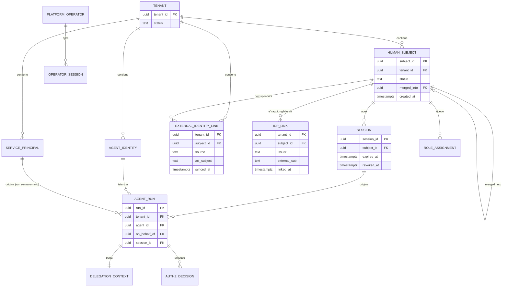
```mermaid
erDiagram
    TENANT ||--o{ HUMAN_SUBJECT : "contiene"
    TENANT ||--o{ AGENT_IDENTITY : "contiene"
    TENANT ||--o{ SERVICE_PRINCIPAL : "contiene"
    TENANT ||--o{ EXTERNAL_IDENTITY_LINK : "contiene"

    HUMAN_SUBJECT ||--o{ IDP_LINK : "e' raggiungibile via"
    HUMAN_SUBJECT ||--o{ SESSION : "apre"
    HUMAN_SUBJECT ||--o{ ROLE_ASSIGNMENT : "riceve"
    HUMAN_SUBJECT ||--o{ EXTERNAL_IDENTITY_LINK : "corrisponde a"
    HUMAN_SUBJECT ||--o| HUMAN_SUBJECT : "merged_into"

    SESSION ||--o{ AGENT_RUN : "origina"
    AGENT_IDENTITY ||--o{ AGENT_RUN : "istanzia"
    SERVICE_PRINCIPAL ||--o{ AGENT_RUN : "origina (run senza umano)"

    AGENT_RUN ||--|| DELEGATION_CONTEXT : "porta"
    AGENT_RUN ||--o{ AUTHZ_DECISION : "produce"

    PLATFORM_OPERATOR ||--o{ OPERATOR_SESSION : "apre"

    TENANT {
        uuid tenant_id PK
        text status
    }
    HUMAN_SUBJECT {
        uuid subject_id PK
        uuid tenant_id FK
        text status
        uuid merged_into FK
        timestamptz created_at
    }
    IDP_LINK {
        uuid tenant_id FK
        uuid subject_id FK
        text issuer
        text external_sub
        timestamptz linked_at
    }
    SESSION {
        uuid session_id PK
        uuid subject_id FK
        timestamptz expires_at
        timestamptz revoked_at
    }
    AGENT_RUN {
        uuid run_id PK
        uuid tenant_id FK
        uuid agent_id FK
        uuid on_behalf_of FK
        uuid session_id FK
    }
    EXTERNAL_IDENTITY_LINK {
        uuid tenant_id FK
        uuid subject_id FK
        text source
        text acl_subject
        timestamptz synced_at
    }
```

#### Come leggerlo

- **Il `TENANT` è la scatola.** Tutto ciò che sta dentro appartiene a un tenant: persone,
  agent, service principal, collegamenti verso l'esterno. Non c'è nessuna entità di identità
  applicativa senza `tenant_id` — è `INV-02` applicato all'identità. L'unica eccezione è il
  `PLATFORM_OPERATOR`, che infatti sta **fuori** dalla scatola nel diagramma: è la §18.
- **`HUMAN_SUBJECT` non contiene l'email.** Contiene solo `subject_id`, `status`, e un
  eventuale `merged_into`. Tutto ciò che può cambiare (l'email, il nome, il collegamento a
  un Identity Provider) sta in righe **collegate**. Questo è ciò che rende `subject_id`
  stabile, ed è il tema della §6.
- **`IDP_LINK` è staccato apposta.** È la riga che dice "questa persona, presso l'issuer
  `https://login.acme.com`, ha `sub = a1b2c3`". Se domani l'azienda cambia da Okta a Entra
  ID, si aggiunge una riga nuova e si disattiva la vecchia: il `subject_id` non si muove, e
  quindi **nessuna memoria, nessun audit e nessun grant vanno riscritti**.
- **`SESSION` è una riga, non un token.** Questa è una decisione (`ADR-110`, §10): la
  sessione vive nel database perché deve essere **revocabile subito**. Un token firmato e
  autosufficiente non è revocabile: è valido finché non scade, punto.
- **`AGENT_RUN` ha due chiavi esterne verso persone**: `session_id` (da quale sessione è
  nato) e `on_behalf_of` (per conto di chi agisce). Sono la stessa persona nel caso normale,
  ma **non sempre**: un run schedulato ha `session_id` nullo e `on_behalf_of` che punta a un
  `ServicePrincipal`. È `AR-GP-06` reso strutturale.
- **`DELEGATION_CONTEXT` è in relazione uno-a-uno col run**, non uno-a-molti. Un run porta
  **una** delega, decisa all'avvio, non rinnovabile (`AR-RT-16`). È la §8.
- **`EXTERNAL_IDENTITY_LINK` ha un `synced_at`.** Stessa forma dei `grant` di `ADR-072`, e
  per la stessa ragione: quello che sappiamo del mondo esterno **invecchia**, e sapere
  quanto è vecchio è parte del dato. È la §15.

### 5.2 Responsabilità e non responsabilità per classe

**`HumanSubject`**

- *Responsabilità:* essere l'ancora stabile a cui si attaccano permessi, memorie `USER`,
  audit e collegamenti esterni.
- *Non responsabilità:* **non** contiene attributi di profilo (nome, foto, telefono). Quelli
  sono dati di dominio e, se servono, vivono nel CRM — dove `INV-07` dice che devono
  restare. Noi teniamo l'identificatore, non la persona.

**`Tenant`**

- *Responsabilità:* essere l'ambito di isolamento. Ogni query applicativa lo filtra
  (`INV-02`), la prima regola del PDP lo verifica (`AR-GP-18`).
- *Non responsabilità:* **non** è un principal. Non si può scrivere una policy in cui "il
  tenant fa qualcosa". Un tenant non agisce; i suoi membri sì.

**`AgentIdentity`**

- *Responsabilità:* dichiarare **quali capability** un agent può avere al massimo. È un
  campo dell'`AgentVersion` nel Control Plane (`A02`), quindi versionata e immutabile come
  tutto il resto lì dentro.
- *Non responsabilità:* **non** possiede credenziali verso l'esterno (§13). **Non** è
  l'entità che agisce: agisce il run.

**`AgentRun`**

- *Responsabilità:* essere l'`actor`. Ogni side effect è tracciabile a un `run_id` (è già
  garantito da `INV-06`: l'`idempotency_key` deriva da `(run_id, step_index)`).
- *Non responsabilità:* **non** ha permessi propri. Ha capability (congelate) e porta una
  delega (viva). Se qualcuno prova a scrivere "questo run può fare X", ha collassato
  capability e permission.

**`ServicePrincipal`**

- *Responsabilità:* essere il soggetto dichiarato quando non c'è un umano.
- *Non responsabilità:* **non** è un utente senza email. Non ha sessioni interattive, non ha
  memorie `USER`, non compare in nessun elenco di persone.

**`ExternalSubject`**

- *Responsabilità:* essere il nome che il **sistema esterno** usa per una persona.
- *Non responsabilità:* **non** è autoritativo su niente da noi. Non lo autentichiamo, non
  gli diamo permessi. Serve solo a proiettare le ACL esterne (§15).

**`PlatformOperator`**

- *Responsabilità:* amministrare la piattaforma (creare tenant, gestire i modelli, i
  binding, gli aggiornamenti).
- *Non responsabilità:* **non** ha accesso ai dati dei tenant. Questa è la separazione più
  delicata di tutto il documento, e la tratto in §18.

### 5.3 Chi è il `TENANT`, `ORGANIZATION`, `WORKSPACE`, `USER`?

Il prompt (§7) propone la gerarchia `Tenant → {Users, Agents, Tools, Data, Policies}` e
chiede di **validarla**, non di accettarla.

**INFERENZA.** Il test da applicare è quello di `AR-CP-02`, la regola di `A02` per decidere
se qualcosa merita di essere una risorsa: *lifecycle proprio + owner proprio + è riferita da
qualcosa; due mancanti su tre → è un campo, non una risorsa*.

| Candidato | Lifecycle proprio? | Owner proprio? | Riferito? | Verdetto |
|---|---|---|---|---|
| `Tenant` | sì (contratto) | sì (platform operator) | sì (da tutto) | **risorsa** |
| `Organization` | no — coincide col tenant Day-1 | no | no | **non esiste Day-1** |
| `Workspace` | no — nessun requisito noto | no | no | **non esiste Day-1** |
| `User` (`HumanSubject`) | sì | sì (tenant admin) | sì (memorie, audit, grant) | **risorsa** |

**DECISIONE ARCHITETTURALE.** Day-1 la gerarchia è **piatta a due livelli**: `Tenant →
HumanSubject`. Niente `Organization`, niente `Workspace`.

**Perché.** `Organization` e `Workspace` servono a due cose: raggruppare permessi (lo fanno
già i ruoli) e separare i dati dentro un cliente (non abbiamo ancora un cliente che lo
chieda). Introdurli ora significherebbe aggiungere un livello alla catena di autorizzazione
di ogni query, per un requisito che non esiste. Va contro §34 della convenzione (*non
introdurre componenti solo perché sono "moderni"*).

**Contro-argomento onesto.** Aggiungere un livello gerarchico **dopo**, quando esiste dato,
è una migrazione pesante: significa toccare ogni tabella con `tenant_id` e ogni query.
Questa è la contro-argomentazione seria, e non la liquido. **La mitigazione è precisa:**
`tenant_id` è già ovunque per `INV-02`, quindi un livello intermedio si introduce come
**colonna aggiuntiva nullable** (`org_id`), non come sostituzione di `tenant_id`. Le query
esistenti continuano a funzionare; quelle nuove filtrano anche su `org_id`. Il costo di
rimandare è quindi **moderato**, non catastrofico. E lo dichiaro come trigger: **`T-ID-07`**
(primo cliente che chiede separazione interna fra reparti).

**`Q-03` cambia questo?** Sì, e lo dichiaro qui perché è la prima volta che emerge. In uno
scenario **on-prem** puro, il tenant è **uno solo** e la gerarchia `Tenant → User` diventa
degenere: il `tenant_id` c'è ma vale sempre lo stesso. In quello scenario la pressione per
avere `Organization` arriva **prima**, perché il cliente vorrà separare le sue divisioni
interne. Ne parlo per esteso in §29.

---

## 6. `subject_id`: cosa è esattamente, e come sopravvive ai cambi di identità

Questa sezione risponde a un **mandato diretto di `A08`**. `AR-ME-18` dice: *nessuna memoria
con `scope_type = USER` è leggibile in un run il cui principal non è quel soggetto*. Se
`subject_id` non è stabile, `AR-ME-18` non è applicabile: basta che Maria cambi email
perché diventi "un principal diverso" e perda le sue memorie — oppure, molto peggio, basta
che il suo vecchio identificatore venga riassegnato perché **un'altra persona** erediti le
sue memorie.

### 6.1 In breve: la matricola

Pensa al numero di matricola di un dipendente. La persona cambia cognome sposandosi, cambia
email quando l'azienda migra il dominio, cambia reparto, cambia badge, cambia perfino
società quando c'è una fusione. La matricola no. E soprattutto: quando la persona se ne va,
la matricola **non viene data a nessun altro**.

`subject_id` è esattamente questo.

### 6.2 La definizione formale

**DECISIONE ARCHITETTURALE (`ADR-107`).**

> `subject_id` è un identificatore **opaco**, **immutabile**, **generato dalla piattaforma**,
> **unico nell'universo** (non solo dentro il tenant), **mai riassegnato**, che identifica
> un `HumanSubject` o un `ServicePrincipal` per tutta la vita del sistema.

Le cinque proprietà, una per una, con il perché:

| Proprietà | Significa | Perché è necessaria |
|---|---|---|
| **opaco** | non contiene informazione. Non è `maria.rossi@acme.it`, non è `42`, non è `sales/maria` | se contiene informazione, quell'informazione **cambia** — e allora l'identificatore cambia |
| **immutabile** | una volta scritto, quella riga non cambia mai il suo `subject_id` | l'audit è append-only (`INV-05`): se l'identificatore cambia, l'audit passato diventa illeggibile |
| **generato da noi** | non viene da Odoo, non viene dall'Identity Provider | dipendere da un identificatore esterno significa dipendere dal **suo** ciclo di vita, che non controlliamo |
| **globalmente unico** | un UUID, non un contatore per tenant | permette di spostare un tenant, fondere due installazioni, esportare l'audit senza collisioni |
| **mai riassegnato** | il valore di una persona uscita non torna mai in circolo | è la proprietà che rende `AR-ME-18` una difesa vera e non un'illusione |

**Forma concreta.** Un UUID. **FATTO** (dal `research-log`, `R-05`): PostgreSQL 18 offre
`uuidv7()` nativo, cioè UUID ordinati nel tempo, che riducono la frammentazione degli indici
B-tree sulle tabelle append-heavy. **INFERENZA:** `subject_id` non è append-heavy (le
persone si creano raramente), quindi il beneficio di `uuidv7()` qui è marginale — ma
`uuidv7()` **espone il momento di creazione**, e per un identificatore che deve essere
*opaco* questo è una micro-perdita di informazione. **DECISIONE:** `subject_id` usa
**UUIDv4** (casuale, nessuna informazione), mentre `run_id`, `step_id` e le righe di audit
usano `uuidv7()` per il beneficio sugli indici. È una distinzione piccola ma coerente con la
definizione di "opaco".

### 6.3 Cosa **non** è un `subject_id`

Il prompt (§6) è esplicito: *"Do not use email address as the immutable primary identity
unless research and requirements justify it."* Nessuna ricerca lo giustifica, e ci sono
quattro ragioni concrete:

1. **L'email cambia.** Matrimonio, ristrutturazione del dominio aziendale, acquisizione.
2. **L'email viene riassegnata.** `info@acme.it` passa da una persona all'altra. Se fosse
   l'identità, la seconda persona erediterebbe le memorie della prima. Questa non è
   un'ipotesi teorica: è il modo più comune in cui si crea una fuga di dati in un sistema di
   personalizzazione.
3. **L'email non è unica fra tenant.** Un consulente che lavora per due clienti nostri ha la
   stessa email in due tenant. Se l'email fosse la chiave, `INV-02` avrebbe una crepa.
4. **L'email è un dato personale.** Metterla come chiave primaria significa averla in ogni
   foreign key, in ogni riga di audit, in ogni log. Rende praticamente impossibile la
   cancellazione per soggetto che `A14` dovrà progettare.

Analogamente **non** è un `subject_id`:

| Candidato scartato | Perché no |
|---|---|
| il `sub` dell'Identity Provider (OIDC) | è unico **per issuer**. Cambi IdP e cambia tutto. Inoltre alcuni IdP riusano `sub` fra ambienti — `RICHIEDE RICERCA` (`B-43`) per quali |
| lo username | cambia, e spesso è scelto dall'utente |
| l'ID utente del CRM (`res.users.id` di Odoo) | viola `INV-07` in spirito: legherebbe la nostra identità alla chiave primaria di un sistema che non controlliamo, e che potrebbe essere **sostituito** |
| un contatore per tenant | collide alla prima fusione di installazioni |
| un hash dell'email | è ancora l'email: cambia quando cambia l'email |

### 6.4 Dove vivono le cose che cambiano

Se `subject_id` è opaco e immutabile, **tutto ciò che serve davvero a un essere umano** deve
stare altrove. Ecco dove.

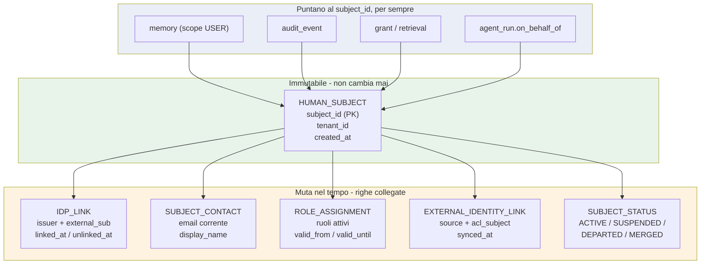
```mermaid
flowchart TD
    subgraph STABILE["Immutabile - non cambia mai"]
        S["HUMAN_SUBJECT<br/>subject_id (PK)<br/>tenant_id<br/>created_at"]
    end

    subgraph MUTABILE["Muta nel tempo - righe collegate"]
        L["IDP_LINK<br/>issuer + external_sub<br/>linked_at / unlinked_at"]
        E["SUBJECT_CONTACT<br/>email corrente<br/>display_name"]
        R["ROLE_ASSIGNMENT<br/>ruoli attivi<br/>valid_from / valid_until"]
        X["EXTERNAL_IDENTITY_LINK<br/>source + acl_subject<br/>synced_at"]
        ST["SUBJECT_STATUS<br/>ACTIVE / SUSPENDED /<br/>DEPARTED / MERGED"]
    end

    subgraph RIFERISCONO["Puntano al subject_id, per sempre"]
        M["memory (scope USER)"]
        A["audit_event"]
        G["grant / retrieval"]
        RUN["agent_run.on_behalf_of"]
    end

    S --> L
    S --> E
    S --> R
    S --> X
    S --> ST
    M --> S
    A --> S
    G --> S
    RUN --> S

    style STABILE fill:#e8f4ea
    style MUTABILE fill:#fdf3e0
    style RIFERISCONO fill:#eaeef7
```

#### Come leggerlo

Tre zone. **In verde** l'unica cosa immutabile: la riga che dice "questa persona esiste".
Contiene tre campi e nessuno di essi è informazione utile a un essere umano — è voluto.

**In arancione** tutto ciò che cambia, ognuno in una tabella con il proprio ciclo di vita e
il proprio storico. Nota che quasi tutte hanno una coppia `valid_from`/`valid_until` o
`linked_at`/`unlinked_at`: non si **sovrascrive**, si **supersede**. È lo stesso principio
di `ADR-102` in `A08` (supersessione, mai sovrascrittura), applicato qui all'identità. Il
motivo è identico: se un audit di sei mesi fa dice "decisione presa perché il soggetto aveva
il ruolo `sales_manager`", devo poter ricostruire che sei mesi fa quel ruolo c'era davvero.

**In blu** tutto ciò che punta al `subject_id` e non deve **mai** essere riscritto. Le
memorie di Maria, le sue righe di audit, i suoi grant, i run che ha avviato. Il fatto che
questa freccia punti solo alla zona verde è **l'intera ragione** per cui la zona verde è
immutabile.

**Nota su `SUBJECT_CONTACT`.** Contiene l'email corrente, ma **solo per il login e le
notifiche**, e con un vincolo: `UNIQUE (tenant_id, email) WHERE status = 'ACTIVE'`. Cioè:
due persone attive nello stesso tenant non possono avere la stessa email, ma una persona
uscita e una nuova sì. Questo permette il riuso della casella di posta senza il riuso
dell'identità.

### 6.5 I cinque cambi di identità, uno per uno

Questa è la parte che `A08` mi ha chiesto esplicitamente. Per ogni scenario: cosa succede al
`subject_id`, cosa succede alle memorie, cosa succede all'audit, cosa succede ai run in
corso.

#### Scenario 1 — L'utente viene disattivato

Maria va in maternità e l'admin sospende il suo account.

| Cosa | Effetto |
|---|---|
| `subject_id` | **invariato**. La riga resta |
| `SUBJECT_STATUS` | nuova riga: `SUSPENDED`, con `valid_from = now` |
| Sessioni | tutte revocate immediatamente (§21). `revoked_at = now` su ogni riga |
| Run in corso | **falliscono al prossimo `AUTHORIZE`**, con `DENY` e ragione `subject_suspended`. Non vengono uccisi a metà passo: la cancellazione è cooperativa (`AR-RT-06`) |
| Memorie `USER` | **restano**, invisibili perché nessun run può più avere Maria come `on_behalf_of` |
| Audit | invariato. Nessuna riga toccata (`INV-05`) |
| Riattivazione | nuova riga di status `ACTIVE`. Maria ritrova tutto, incluse le memorie |

**Punto delicato.** Un run in corso che ha già letto il `MemorySnapshot` di Maria ha quelle
memorie **nel prompt**, e lo snapshot è congelato (`ADR-092`). Non le "dimentica". Ma il run
non può più **agire**, perché ogni `AUTHORIZE` successivo nega. La finestra di esposizione è
quindi limitata a: il modello vede quelle memorie fino alla fine del run, ma non ne consegue
alcun effetto. E per `ADR-104` quel run finisce entro 10 minuti di tempo attivo. Lo
dichiaro come rischio residuo accettato: **`R-44`**.

#### Scenario 2 — Il ruolo cambia

Maria passa da commerciale a sales manager.

| Cosa | Effetto |
|---|---|
| `subject_id` | **invariato** |
| `ROLE_ASSIGNMENT` | la riga `sales_rep` prende `valid_until = now`; nasce una riga `sales_manager` con `valid_from = now` |
| Run in corso | **cambiano comportamento al prossimo `AUTHORIZE`**. Questo è il cuore di `ADR-106` (§12): i permessi sono vivi |
| Memorie | invariate. Una preferenza di interazione non dipende dal ruolo |
| Audit passato | invariato, e **ancora leggibile**: la riga di audit registra la `policy_version` e gli attributi usati al momento della decisione (`AR-GP-20`) |

**Attenzione al caso in cui il ruolo si *restringe*.** Se Maria passa da manager a
commerciale, un run in corso potrebbe aver già **letto** dati che ora non le competono. Il
retrieval non "torna indietro". Anche questo è `R-44`, e la mitigazione è la stessa:
`ADR-104` limita la finestra.

#### Scenario 3 — Due account vengono fusi

Maria aveva due account: uno creato dall'import iniziale, uno creato quando è stato attivato
l'SSO. Ora ci si accorge che sono la stessa persona.

Questo è lo scenario **più difficile**, perché tocca l'audit append-only.

**DECISIONE ARCHITETTURALE (`ADR-107`, parte 2).** La fusione **non riscrive niente**. Si
fa così:

1. Si sceglie un `subject_id` **superstite** (per convenzione il più vecchio).
2. Sull'altro si scrive `merged_into = <superstite>` e `status = MERGED`.
3. Il `subject_id` fuso **non viene cancellato** e **non viene riassegnato**.
4. Ogni **lettura** di identità passa da una funzione `resolve_subject(subject_id)` che
   segue la catena di `merged_into` **fino alla fine**, con un limite di profondità.
5. Ogni **scrittura** nuova usa il superstite.
6. L'audit passato continua a citare il `subject_id` originale. Chi lo legge oggi lo risolve
   e capisce a chi corrisponde ora; chi lo leggeva ieri vedeva la verità di ieri. Entrambe
   sono corrette.

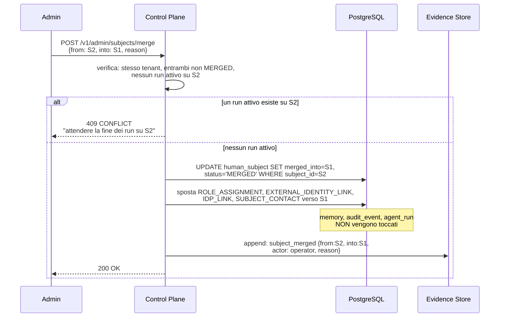
```mermaid
sequenceDiagram
    participant Admin
    participant CP as Control Plane
    participant DB as PostgreSQL
    participant Audit as Evidence Store

    Admin->>CP: POST /v1/admin/subjects/merge<br/>{from: S2, into: S1, reason}
    CP->>CP: verifica: stesso tenant, entrambi non MERGED,<br/>nessun run attivo su S2
    alt un run attivo esiste su S2
        CP-->>Admin: 409 CONFLICT<br/>"attendere la fine dei run su S2"
    else nessun run attivo
        CP->>DB: UPDATE human_subject SET merged_into=S1,<br/>status='MERGED' WHERE subject_id=S2
        CP->>DB: sposta ROLE_ASSIGNMENT, EXTERNAL_IDENTITY_LINK,<br/>IDP_LINK, SUBJECT_CONTACT verso S1
        Note over DB: memory, audit_event, agent_run<br/>NON vengono toccati
        CP->>Audit: append: subject_merged {from:S2, into:S1,<br/>actor: operator, reason}
        CP-->>Admin: 200 OK
    end
```

##### Come leggerlo

Il punto è il blocco `Note`: le tre tabelle che contengono **storia** (`memory`,
`audit_event`, `agent_run`) non vengono mai toccate. Le tabelle che contengono **stato
corrente** (ruoli, collegamenti, contatti) vengono spostate.

Il controllo `409` all'inizio è deliberato e riusa il pattern di concorrenza ottimistica di
`ADR-018`: non si fonde un'identità mentre un run la sta usando. Sarebbe come cambiare
targa a un'auto in movimento.

**E le memorie della persona fusa?** Restano attaccate al `subject_id` vecchio. La funzione
che costruisce il `MemorySnapshot` (`A08`) deve quindi risolvere gli alias: le memorie
leggibili per `S1` sono quelle di `S1` **più** quelle di ogni `S_n` con `merged_into*` che
arriva a `S1`. **Questo è un requisito nuovo che `A09` impone ad `A08`**, e lo registro
come `AR-ID-08`. Senza, la fusione fa "perdere la memoria" alla persona.

**Contro-argomento onesto.** La risoluzione degli alias in lettura ha un costo: ogni query
sulle memorie diventa una query su un insieme di `subject_id`, non su uno solo. Con
`AS-18` (le memorie utili per soggetto sono nell'ordine delle decine) il costo è
trascurabile. Se `AS-18` cade, va rivisto. Inoltre: un errore di fusione è **difficile da
disfare**, perché nel frattempo si sono scritte memorie e audit sul superstite. Lo
dichiaro: la fusione è **moderatamente reversibile** — si può togliere il `merged_into`, ma
non si può ri-attribuire ciò che è stato scritto nel frattempo. Serve una conferma esplicita
nell'API, e un `reason` obbligatorio (coerente con `A02`, che già lo impone su
rollout/rollback).

#### Scenario 4 — La persona lascia l'azienda

| Cosa | Effetto |
|---|---|
| `subject_id` | **invariato e mai riassegnato** |
| `SUBJECT_STATUS` | `DEPARTED` |
| Sessioni | tutte revocate |
| `IDP_LINK` | `unlinked_at = now`. Se l'azienda usa SCIM (§25), questo arriva automaticamente dall'IdP |
| Email in `SUBJECT_CONTACT` | liberata per il riuso (grazie al `UNIQUE ... WHERE status='ACTIVE'`) |
| Memorie `USER` | **problema aperto** |

Le memorie sono il punto scomodo. Tre opzioni:

| Opzione | Pro | Contro |
|---|---|---|
| **A. Cancellare subito** | pulito rispetto alla minimizzazione dei dati | distrugge dato **non ricostruibile** (`ADR-098`, `R-38`); se la persona torna, ha perso tutto |
| **B. Conservare per sempre** | reversibile | accumula dati personali di persone che non ci sono più |
| **C. Tombstone + retention dichiarata** | compromesso | richiede una politica di retention che **non abbiamo** |

**DECISIONE ARCHITETTURALE:** opzione **C**, ma `A09` **non fissa la durata**. La retention
è di `A14` (data governance). Quello che `A09` impone è il **meccanismo**: alla transizione
a `DEPARTED` viene scritto un evento `subject_departed` con timestamp, e le memorie `USER`
di quel soggetto diventano **non leggibili immediatamente** (perché nessun run può più avere
quel principal) ma **non ancora cancellate**. La cancellazione effettiva è un lavoro
periodico governato da una politica di `A14`. **Non invento un numero di giorni.**

Questo è un **requisito che `A09` passa ad `A14`**, e lo registro come tale: `AR-ID-09`.

#### Scenario 5 — L'azienda cambia Identity Provider

Da Okta a Entra ID.

| Cosa | Effetto |
|---|---|
| `subject_id` | **invariato**. È l'intero motivo per cui esiste |
| `IDP_LINK` | le righe Okta prendono `unlinked_at`; nascono righe Entra ID |
| Il **problema vero** | come si riconosce che l'utente `a1b2c3` di Okta e l'utente `x9y8z7` di Entra ID sono la stessa persona? |

**L'unico aggancio disponibile è l'email**, ed è esattamente il dato che ho appena
dichiarato inaffidabile come identità. Non c'è modo di uscirne con eleganza. Le opzioni:

| Approccio | Rischio |
|---|---|
| **auto-link per email verificata** | se l'IdP nuovo non verifica l'email, un attaccante che registra `maria.rossi@acme.it` prende l'identità di Maria. È il classico attacco di **account takeover per pre-registrazione** |
| **link manuale da parte dell'admin** | sicuro, ma non scala oltre poche decine di persone |
| **link guidato: l'utente accede con entrambi e conferma** | sicuro e scalabile, ma richiede un periodo di coesistenza dei due IdP |

**DECISIONE ARCHITETTURALE (`AR-ID-10`).** L'auto-link per email è **vietato di default**.
Un `IDP_LINK` nuovo si crea solo con: (a) intervento di un tenant admin, oppure (b) SCIM
autoritativo (§25), oppure (c) auto-link abilitato **esplicitamente per tenant e per
issuer**, e solo se il claim `email_verified` è presente e vero.

**FATTO mancante:** quali IdP garantiscono `email_verified` e con quale semantica — **e se
un `sub` OIDC possa essere riassegnato dopo la cancellazione di un utente** — è
`RICHIEDE RICERCA`, registrato come **`B-43`**.

### 6.6 La proprietà che tiene in piedi tutto

Riassumo in una regola verificabile, perché una decisione senza test è un'opinione:

> **`AR-ID-01`** — Un `subject_id` non viene **mai** riassegnato, **mai** riscritto e
> **mai** derivato da un dato mutabile. Verifica automatica: (1) test che tenta un `UPDATE`
> su `human_subject.subject_id` e si aspetta un errore a livello di database (trigger o
> permessi di colonna); (2) test che crea un utente, lo marca `DEPARTED`, crea un utente
> nuovo con la stessa email, e verifica che i due `subject_id` differiscano; (3) test che
> verifica che nessuna colonna `subject_id` sia generata da un hash o da una funzione di un
> altro campo.

---

## 7. La decisione centrale: chi è il `principal`

Questo è il problema più difficile del documento, e il prompt (§8) lo marca **CRITICAL**.

### 7.1 Le quattro opzioni

Il prompt le elenca. Le prendo sul serio tutte e quattro.

**Opzione A — L'agent agisce interamente *come* l'utente.**
Non esiste identità dell'agent. Il run porta il `subject_id` di Maria e basta. Verso il CRM
si presenta con le credenziali di Maria.

**Opzione B — L'agent ha una propria identità e opera *per conto* dell'utente.**
Esiste `agent_sales_assistant` come soggetto. L'utente compare come contesto, non come
principal.

**Opzione C — L'agent ha *entrambe*: identità propria + identità delegata dell'utente.**
Il principal è una coppia.

**Opzione D — L'agent non è un'identità: è solo un contesto di esecuzione.**
Come un thread. Ha un `run_id` per correlazione, ma non è mai il soggetto di
un'autorizzazione.

### 7.2 Il confronto, criterio per criterio

| Criterio | A (come l'utente) | B (identità propria) | C (entrambe) | D (solo contesto) |
|---|---|---|---|---|
| **Chi vede il CRM nei suoi log** | Maria | il robot | il robot, con l'utente nel payload o nel campo note | il robot |
| **Confused deputy** | **impossibile da fermare**: l'agent *è* Maria, quindi tutto ciò che Maria può fare è autorizzato | possibile: l'agent ha permessi ampi, l'utente non li restringe | **strutturalmente contenuto**: l'intersezione limita a ciò che **entrambi** possono | possibile, come B |
| **Chi è responsabile** | Maria, per tutto ciò che il robot ha fatto | nessuno di preciso | esplicito: "l'agent X per conto di Maria" | ambiguo |
| **Least privilege** | no: l'agent eredita **tutti** i permessi di Maria, anche quelli irrilevanti al compito | parziale: dipende da come si configura l'agent | **sì**: due tetti indipendenti che si intersecano | parziale |
| **Audit** | inutilizzabile: non distingue ciò che Maria ha fatto da ciò che il robot ha fatto per lei | inutilizzabile in senso opposto: perde l'origine umana | **completo** | incompleto |
| **Rispetta `AR-GP-05`** (l'audit riporta entrambe le identità) | **no** | **no** | **sì** | **no** |
| **Rispetta `AR-014`** (il token dell'utente non lascia la piattaforma) | **no**, per costruzione | sì | sì | sì |
| **Rispetta `AR-GP-06`** (run senza utente → service principal dichiarato) | non esprimibile | sì | **sì**, naturalmente: `on_behalf_of` punta a un `ServicePrincipal` | sì |
| **Complessità Day-1** | minima | bassa | **media** | minima |
| **Prompt injection** (`R-01`, `ASI01`) | catastrofica: un'iniezione fa agire il modello con l'autorità piena della persona | grave | **contenuta**: l'iniezione non può far uscire l'agent dall'intersezione | grave |
| **Revoca** | revochi Maria, revochi tutto (troppo grossolano) | revochi l'agent, blocchi tutti gli utenti | **granulare**: puoi revocare l'uno o l'altro | grossolana |

### 7.3 La decisione

**DECISIONE ARCHITETTURALE (`ADR-105`).**

> **Opzione C.** Il `principal` di ogni decisione di autorizzazione è una **coppia**:
>
> ```text
> principal = (actor, on_behalf_of)
>
> actor        = AgentRunPrincipal { run_id, agent_id, agent_version_id }
> on_behalf_of = HumanSubjectRef { subject_id }   oppure
>                ServicePrincipalRef { subject_id }   (AR-GP-06)
> ```
>
> L'autorità effettiva è l'**intersezione** delle due autorità, secondo `ADR-019`. Non
> esiste modo di esprimere l'unione. `on_behalf_of` **non è mai vuoto**: se non c'è un
> essere umano, contiene un `ServicePrincipal` dichiarato.

**Perché non A.** Perché A rende il confused deputy **strutturalmente impossibile da
difendere**. Se l'agent *è* Maria, allora quando il modello viene manipolato da un documento
avvelenato (`R-26`, `ASI01` — *Agent Goal Hijack*) e decide di esportare tutto il portafoglio
clienti, ogni controllo dirà di sì: Maria può leggere il portafoglio clienti. Non esiste
nessuna policy che possa distinguere "Maria che esporta" da "un'iniezione che esporta come
Maria". A viola inoltre `AR-014` per costruzione.

**Perché non B.** Perché B perde l'origine umana, che è il dato più prezioso per l'audit di
un sistema che agisce su un CRM. Se un cliente ci chiede "chi ha cancellato questo
contatto?", la risposta "il robot" non è una risposta. B viola `AR-GP-05`.

**Perché non D.** Perché D non è un'alternativa: è A o B travestita. Se il run non è un
principal, allora la decisione si prende solo sull'utente (= A) o solo sull'agent (= B). D
ha però un'intuizione giusta che **conservo**: non tutto ciò che si propaga deve essere un
principal. Ne parlo in §7.5.

### 7.4 Come si vede l'intersezione, concretamente

Un esempio, perché "intersezione di autorità" è astratto.

Maria è sales manager. Ha il permesso `crm.opportunity.write` su tutte le opportunità del
suo team, e `crm.contact.delete` (è manager, può cancellare contatti duplicati).

L'agent `sales_assistant` ha nel suo capability set: `crm.opportunity.read`,
`crm.opportunity.write`, `crm.contact.read`.

| Azione richiesta | Maria può? | L'agent può? | Intersezione | Esito |
|---|---|---|---|---|
| leggere l'opportunità 42 (del suo team) | sì | sì | **sì** | permesso |
| aggiornare l'opportunità 42 | sì | sì | **sì** | permesso, **ma è un `SIDE_EFFECT`** → approvazione umana (`ADR-023`) |
| cancellare il contatto 7 | **sì** | **no** | **no** | **negato**: `agent_capability_missing` |
| leggere l'opportunità 99 (di un altro team) | **no** | sì | **no** | **negato**: `subject_permission_missing` |
| mandare una mail | no | no | no | negato |

Le due negazioni hanno **ragioni diverse**, e questa differenza è preziosa. La terza riga è
il caso più interessante: Maria *potrebbe* cancellare quel contatto, ma **non tramite questo
agent**. È esattamente il least privilege applicato all'automazione: do all'agent solo ciò
che serve al suo compito, anche se la persona che lo usa potrebbe di più.

La quarta riga è la difesa contro il confused deputy in azione: l'agent ha la capability di
leggere opportunità, ma non *quella* opportunità, perché Maria non ce l'ha.

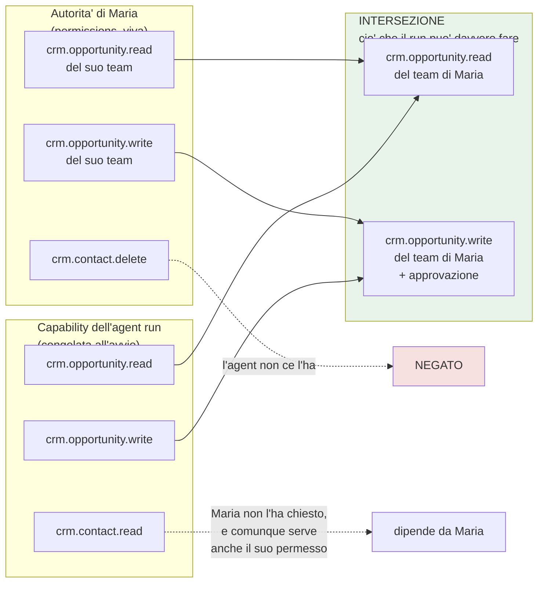
```mermaid
flowchart LR
    subgraph U["Autorita' di Maria<br/>(permissions, viva)"]
        U1["crm.opportunity.read<br/>del suo team"]
        U2["crm.opportunity.write<br/>del suo team"]
        U3["crm.contact.delete"]
    end

    subgraph A["Capability dell'agent run<br/>(congelata all'avvio)"]
        A1["crm.opportunity.read"]
        A2["crm.opportunity.write"]
        A3["crm.contact.read"]
    end

    subgraph I["INTERSEZIONE<br/>cio' che il run puo' davvero fare"]
        I1["crm.opportunity.read<br/>del team di Maria"]
        I2["crm.opportunity.write<br/>del team di Maria<br/>+ approvazione"]
    end

    U1 --> I1
    A1 --> I1
    U2 --> I2
    A2 --> I2
    U3 -.->|"l'agent non ce l'ha"| X1["NEGATO"]
    A3 -.->|"Maria non l'ha chiesto,<br/>e comunque serve<br/>anche il suo permesso"| X2["dipende da Maria"]

    style I fill:#e8f4ea
    style X1 fill:#f7e0e0
```

#### Come leggerlo

I due riquadri a sinistra sono **insiemi diversi di cose diverse**: a sinistra in alto ci
sono i **permessi** di una persona (vivono nel tempo, cambiano quando cambia il ruolo); in
basso le **capability** di un run (congelate all'avvio, `INV-04`). Al centro c'è ciò che il
run può davvero fare: solo dove i due si sovrappongono.

Le frecce tratteggiate mostrano i due modi di essere negati, e sono diversi: `crm.contact.delete`
è negato perché **l'agent non ce l'ha**, non perché Maria non possa. Nel diagramma non
compaiono gli altri tre insiemi dell'intersezione di `ADR-019` (policy del tenant, policy
della risorsa, contesto) per non renderlo illeggibile: ci sono, e ognuno può solo **togliere**
altra roba (`AR-GP-09`).

### 7.5 Cosa si propaga come identità, cosa come contesto, cosa come correlazione

Il prompt (§10) chiede di non assumere che tutto ciò che si propaga diventi un security
principal. È la parte giusta dell'opzione D.

| Elemento | Cosa è | Il PDP lo usa per decidere? | Va nell'audit? |
|---|---|---|---|
| `tenant_id` | **ambito di sicurezza** | **sì**, prima regola e non sovrascrivibile (`AR-GP-18`) | sì |
| `subject_id` (in `on_behalf_of`) | **identità** | **sì** | sì |
| `agent_id` + `agent_version_id` | **identità** | **sì** (definisce il capability set) | sì |
| `run_id` | **identità dell'actor** + correlazione | **sì**, ma solo per stato del run e budget | sì |
| `session_id` | **contesto** | **sì**, per verificare che la sessione sia ancora viva | sì |
| `step_index` | **correlazione** | no | sì |
| `tool_id` + `tool_version_id` | **oggetto** dell'autorizzazione, non soggetto | sì, come `action`/`resource` | sì |
| `trace_id` / `span_id` (OpenTelemetry) | **correlazione pura** | **no, mai** | no (va nell'observability, non nell'audit) |
| `conversation_id` | **contesto** | no | sì |
| `credential_ref` | **puntatore** a una credenziale | no | **sì**, ed è importante: dice *con quale chiave* si è agito |

**`AR-ID-02`.** Un identificatore di correlazione (`trace_id`, `span_id`) **non entra mai**
in una decisione di autorizzazione. Verifica: analisi statica sul tipo
`AuthorizationRequest`, che non ha campi di tracing.

**Perché è importante.** Se un `trace_id` entrasse nella decisione, un attaccante che
controlla un header HTTP controllerebbe un input dell'autorizzazione. È una forma sottile di
`policy bypass` e vale la pena renderla impossibile per tipo, non per disciplina.

### 7.6 Il tipo `Principal`, in concreto

```text
Principal:
    actor:         ActorRef          # sempre presente
    on_behalf_of:  SubjectRef        # sempre presente, mai vuoto (AR-GP-06)
    tenant_id:     TenantId          # sempre presente (INV-02)

ActorRef = AgentRunActor { run_id, agent_id, agent_version_id }
         | ServiceActor  { service_principal_id }      # ingestion, scheduler
         | OperatorActor { operator_id }               # amministrazione

SubjectRef = HumanSubject   { subject_id, session_id }
           | ServiceSubject { subject_id, declared_by }   # run schedulato
```

Tre note importanti sul tipo:

1. **`on_behalf_of` non è opzionale.** Non è `Option<SubjectRef>`. Il compilatore impedisce
   di costruire un `Principal` senza. È `AR-GP-06` applicata dai tipi, esattamente come
   `A04` applica `AR-RT-01` con `StepProposal → AuthorizedStep`.
2. **`ServiceSubject` porta un `declared_by`.** Chi ha dichiarato che questo service
   principal è il soggetto legittimo di questo run? Un amministratore, in una configurazione
   versionata del Control Plane. Non nasce dal nulla.
3. **`HumanSubject` porta il `session_id`.** Serve per la revoca (§21): revocando una
   sessione si fermano tutti i run che ne derivano, senza dover disabilitare la persona.

### 7.7 Contro-argomento onesto a `ADR-105`

Devo essere leale con la decisione che ho preso, quindi elenco cosa costa davvero.

**1. Costa il doppio delle letture di attributi.** Ogni `AUTHORIZE` deve caricare gli
attributi di **due** soggetti invece di uno. `T-GP-01` (le query del PIP superano il 30%
della latenza di uno step) diventa **più probabile** per colpa di questa decisione, e lo
dichiaro. Mitigazione: gli attributi dell'agent stanno già nel `ConfigSnapshot` (letto una
volta), quindi il costo per step è **solo** sugli attributi dell'umano.

**2. Rende alcune azioni legittime impossibili.** Ci saranno casi in cui l'agent ha bisogno
di fare qualcosa che l'utente non può fare da solo — l'esempio classico è un agent di
supporto che deve leggere un log tecnico che al commerciale è vietato. Con l'intersezione,
non si può. La soluzione **giusta** è dare quel permesso all'utente (magari
condizionatamente, via `purpose` in ABAC); la soluzione **sbagliata** è introdurre
un'eccezione all'intersezione. Prevedo che questa pressione arriverà, e la registro come
trigger **`T-ID-01`**.

**3. Il sistema esterno non vede la coppia.** Verso Odoo arriva una sola identità (§14).
L'audit **nostro** ha entrambe, l'audit **loro** no. Questa è una perdita reale di
correlazione fra i due sistemi, e la affronto in §14.4 con il `run_id` come marcatore
propagato.

**4. Un run schedulato non ha un vero "per conto di".** Dire che il principal è
`(actor=run, on_behalf_of=svc_nightly_sync)` è formalmente pulito ma sostanzialmente vuoto:
il `ServicePrincipal` ha i permessi che gli abbiamo dato, quindi l'intersezione non
restringe niente. Per i run schedulati `ADR-105` **non aggiunge sicurezza**, aggiunge solo
forma. Lo accetto perché la forma uniforme vale il prezzo: un solo tipo, un solo percorso di
codice, nessun caso speciale. Ma non fingo che sia una difesa.

---

## 8. `DelegationContext`: la forma della delega

### 8.1 Perché esiste

`AR-GP-02` (regola di `A03`) dice: *il token dell'utente non lascia il ruolo `api`; oltre
passa solo un contesto di delega*. `AR-RT-16` (regola di `A04`) dice: *un contesto di delega
scaduto non si rinnova automaticamente alla ripresa*. Quindi la delega **esiste già** come
concetto vincolante. Nessuno però ne ha mai definito la **forma**. È compito di `A09`.

### In breve

Il ruolo `api` (il processo che riceve la richiesta HTTP) è l'unico posto dove esiste il
token di Maria. Quando accetta la richiesta e crea un run, non passa il token al worker:
scrive nel database una **delega**, cioè un foglio di carta che dice:

> "Maria, autenticata alle 14:32 con la sessione `sess_9f…`, autorizza il run `run_01J8…`
> dell'agent `sales_assistant` ad agire per suo conto, entro questo perimetro, fino alle
> 14:57."

Il worker prende quel foglio, non il token. È la differenza fra dare a qualcuno le tue
chiavi di casa e dargli un permesso scritto per entrare in cucina fino alle cinque.

### 8.2 Il contratto

```text
DelegationContext:
    delegation_id:       uuid           # identita' propria, per l'audit
    tenant_id:           uuid           # INV-02
    run_id:              uuid           # legato a UN run, non riusabile
    delegator:           SubjectRef     # chi delega: subject_id + session_id
    delegate:            ActorRef       # a chi: run_id + agent_id + agent_version_id
    scope:               ScopeSet       # cosa: insieme di azioni, MAI "tutto"
    purpose:             text           # perche': stringa dichiarata dal chiamante
    issued_at:           timestamptz
    not_after:           timestamptz    # scadenza, derivata (§8.4)
    auth_time:           timestamptz    # quando l'umano si e' autenticato davvero
    auth_strength:       enum           # PASSWORD | MFA | STEP_UP
    revoked_at:          timestamptz?   # revoca esplicita
    parent_delegation:   uuid?          # NULL Day-1: nessuna sub-delega (§8.6)
```

Cinque campi meritano una spiegazione.

**`scope: ScopeSet`.** Non è "tutto ciò che Maria può fare". È un insieme **esplicito** di
azioni. Da dove viene? Dall'intersezione fra ciò che l'agent dichiara di aver bisogno (nella
`AgentVersion`, quindi nel `ConfigSnapshot`) e ciò che Maria può fare al momento
dell'emissione. **Non è la fonte di verità dell'autorizzazione** — quella resta il PDP a
ogni passo — ma è un **tetto ulteriore**, e ha una funzione precisa: se domani a Maria
vengono **aggiunti** permessi mentre il run è in corso, il run **non** li acquisisce.
`INV-04` dice che le capability non crescono; questo campo estende la stessa garanzia
all'autorità delegata.

**`purpose`.** È la ragione dichiarata: *"rispondere alla richiesta di aggiornamento
opportunità"*. Serve a due cose: entra come attributo ABAC nella decisione (§11) e finisce
nell'audit. **Attenzione:** il `purpose` è dichiarato dal chiamante, quindi è **dato non
verificato**. Non deve mai essere l'unica base di un `ALLOW`. Lo registro come rischio
`R-45`.

**`auth_time` separato da `issued_at`.** Sono due momenti diversi. `issued_at` è quando è
nata la delega; `auth_time` è quando la persona ha **davvero** dimostrato di essere lei. Se
Maria si è autenticata stamattina alle 9 e alle 17 chiede un'operazione delicata, una policy
può richiedere un **re-autenticazione** (step-up) perché `auth_time` è troppo vecchio. Senza
questo campo separato, la distinzione non è esprimibile.

**`auth_strength`.** Password soltanto, o password + secondo fattore, o step-up appena
fatto. Una policy può richiedere `MFA` per i `SIDE_EFFECT` ad alto rischio. È il modo
corretto di legare l'autenticazione all'autorizzazione **senza confonderle**:
l'autenticazione non decide, ma la **forza** dell'autenticazione è un attributo su cui la
decisione può basarsi.

**`parent_delegation`.** Nullo Day-1. Esiste nello schema perché il giorno in cui arriva
A2A (agent che chiama agent, `ADR-064`) servirà una catena di delega, e aggiungere una
colonna dopo è banale mentre aggiungere un **concetto** dopo non lo è. Ne parlo in §8.6.

### 8.3 La delega **non è un token**

**DECISIONE ARCHITETTURALE (`ADR-113`).** Il `DelegationContext` è una **riga nel database
più una struttura in memoria**, non un token firmato che viaggia.

| Alternativa | Pro | Contro | Verdetto |
|---|---|---|---|
| **JWT firmato passato al worker** | autoconsistente, verificabile offline, "standard" | **non revocabile**: una volta emesso vale fino alla scadenza. Va gestita la chiave di firma, la rotazione, la revoca per lista nera. Aggiunge crittografia che il prompt (§4) chiede di evitare senza necessità dimostrata | **respinta** |
| **riga nel database + struttura in memoria** | revocabile in un `UPDATE`; nessuna chiave da gestire; l'audit la vede naturalmente | richiede una lettura; funziona solo perché `api` e `worker` **condividono il database** | **scelta** |
| **token opaco con lookup** | via di mezzo | è la riga nel database, con un livello di indirezione in più che non serve | respinta |

**Perché funziona.** `AR-002` dice che `api` e `worker` comunicano **solo tramite il
database**. Quindi il database c'è già, è il canale, ed è transazionale. Mettere la delega
lì significa: nessun nuovo meccanismo, nessuna nuova crittografia, revoca immediata,
`tenant_id` applicato dalla stessa RLS (*Row Level Security*, il meccanismo di PostgreSQL
che filtra le righe a livello di database) che protegge tutto il resto.

**Contro-argomento onesto.** Questa decisione lega la delega al fatto che tutti i componenti
condividano PostgreSQL. Il giorno in cui un tool gira in un processo separato o su un'altra
macchina (`T-07`, `T-TL-03`), quel processo non può leggere la nostra delega. **Ma non deve:**
il tool non riceve mai la delega, riceve un client già autenticato (`ADR-056`). La delega
resta dentro il perimetro `api`/`worker`. Se un giorno servisse davvero attraversare una
rete, allora e **solo allora** si passa a un token firmato — e il contratto
`DelegationContext` resta identico, cambia solo il trasporto. Registro il trigger:
**`T-ID-02`**.

### 8.4 Quanto dura una delega — e il conflitto con `AR-GP-04`

Qui c'è un **conflitto reale** fra due regole già approvate, e la convenzione (§72 del
prompt) impone di non risolverlo in silenzio.

**Il conflitto.**

- `AR-GP-04` dice: *il contesto di delega scade **non dopo** il token originale*. Sensato:
  non posso dare a un delegato più tempo di quanto ne abbia io.
- `ADR-104` dice: un run dura al massimo **10 minuti di tempo attivo**, **ma il tempo in
  attesa di approvazione umana non conta**. E `T-RT-04` prevede esplicitamente che l'attesa
  di approvazione possa superare il tempo di lavoro.

Mettili insieme: Maria avvia un run alle 14:32. Il run arriva a un `SIDE_EFFECT`, chiede
un'approvazione al suo responsabile, e il responsabile la concede **il giorno dopo**. Se la
delega scadesse con l'access token di Maria — che per qualunque buona pratica dura pochi
minuti — il run legittimo **fallirebbe sempre**. Avremmo costruito un sistema di approvazione
umana che non può funzionare.

**La risoluzione.**

La confusione sta nella parola "token originale". `AR-GP-04` è giusta, ma è ambigua su
**quale** artefatto di autenticazione intende. Ci sono due cose diverse:

| Artefatto | Cosa è | Durata tipica | Revocabile subito? |
|---|---|---|---|
| **access token** | la prova con cui una chiamata HTTP dimostra di venire da Maria | corta | no (se firmato) |
| **session** | il fatto che Maria è ancora autenticata e attiva | lunga | **sì**, è una riga (`ADR-110`) |

**DECISIONE ARCHITETTURALE (`ADR-112`).** `AR-GP-04` si intende riferita alla **sessione**,
non all'access token. Formalmente:

```text
delegation.not_after = min(
    session.expires_at,                    # non oltre la sessione dell'umano
    run.started_at + max_active_duration + approval_window
)
```

E, indipendentemente da `not_after`, **a ogni `AUTHORIZE` si verifica che la sessione sia
ancora viva e non revocata**. Cioè: la scadenza è un tetto, la revoca è immediata.

**I numeri.** Non li invento, e questa è una posizione, non una scappatoia:

- `max_active_duration` = **10 minuti**, e questo lo so: viene da `ADR-104`, dichiarato dal
  committente.
- `approval_window` — **NON ANCORA DECISO**. Non è un numero di identity: è la
  `approval_ttl` che `A03` ha già introdotto con `AR-GP-14` (*l'approvazione scade; oltre,
  il run va in `EXPIRED`*). `A09` non lo fissa: lo **eredita**. Il vincolo che `A09` impone
  è di **coerenza**: `approval_window` deve essere ≥ della `approval_ttl` di `A03`, altrimenti
  costruiamo un sistema in cui l'approvazione è ancora valida ma la delega no. Lo registro
  come `AR-ID-03`.
- `session.expires_at` — **NON ANCORA DECISO** come valore assoluto. Quello che `A09`
  decide è la **forma**: la sessione ha una scadenza **assoluta** (`expires_at`, non
  prorogabile) e una di **inattività** (`idle_expires_at`, prorogabile dall'uso). Sono due
  meccanismi diversi e servono entrambi. `RICHIEDE RICERCA` per i valori raccomandati dalle
  linee guida correnti: **`B-44`**.

**Il vincolo pratico che ne deriva.** `session.expires_at` deve essere **più lungo** di
`approval_window`, altrimenti il primo run che aspetta un'approvazione notturna fallisce
perché nel frattempo Maria è andata a casa e la sua sessione è scaduta. Questo è un vincolo
di prodotto scomodo: **una sessione di 8 ore rende possibile un'approvazione entro 8 ore**.
Oltre, non c'è modo di far funzionare `ADR-104` + `AR-GP-04` insieme senza cambiare qualcosa.

Le opzioni, se un cliente chiedesse approvazioni con finestre di giorni:

| Opzione | Costo |
|---|---|
| sessioni lunghissime | **inaccettabile**: una sessione lunga è una superficie di attacco lunga |
| la delega sopravvive alla sessione | viola `AR-GP-04` nella sua sostanza: il delegato avrebbe autorità dopo che il delegante non è più presente |
| **il run riparte con una delega nuova**, richiedendo che Maria si ri-presenti | **corretto**, ed è già coerente con `AR-RT-16` (*un contesto scaduto non si rinnova automaticamente*) |

**DECISIONE:** la terza. Se la delega scade mentre il run attende, il run va in uno stato
`DELEGATION_EXPIRED` — **visibile**, non silenzioso — e la ripresa richiede un atto
esplicito dell'umano. Non è un errore: è il sistema che si rifiuta di agire per conto di
qualcuno che non è più lì. Registro il trigger **`T-ID-03`** per il caso in cui questo
diventasse frequente.

### 8.5 Il flusso completo di una delega

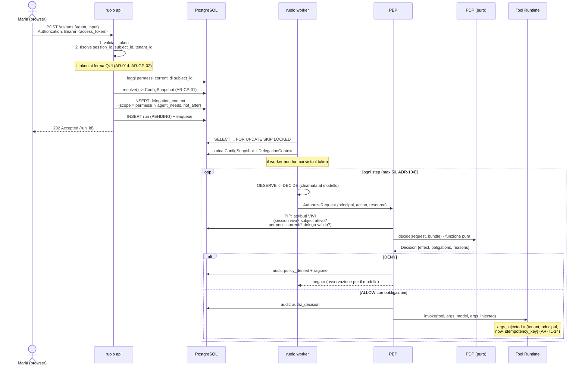
```mermaid
sequenceDiagram
    actor M as Maria (browser)
    participant API as ruolo api
    participant DB as PostgreSQL
    participant W as ruolo worker
    participant PEP as PEP
    participant PDP as PDP (puro)
    participant TR as Tool Runtime

    M->>API: POST /v1/runs {agent, input}<br/>Authorization: Bearer <access_token>
    API->>API: 1. valida il token<br/>2. risolve session_id, subject_id, tenant_id
    Note over API: il token si ferma QUI (AR-014, AR-GP-02)
    API->>DB: leggi permessi correnti di subject_id
    API->>DB: resolve() -> ConfigSnapshot (AR-CP-01)
    API->>DB: INSERT delegation_context<br/>{scope = permessi ∩ agent_needs, not_after}
    API->>DB: INSERT run (PENDING) + enqueue
    API-->>M: 202 Accepted {run_id}

    W->>DB: SELECT ... FOR UPDATE SKIP LOCKED
    W->>DB: carica ConfigSnapshot + DelegationContext
    Note over W: il worker non ha mai visto il token

    loop ogni step (max 50, ADR-104)
        W->>W: OBSERVE -> DECIDE (chiamata al modello)
        W->>PEP: AuthorizeRequest {principal, action, resource}
        PEP->>DB: PIP: attributi VIVI<br/>(session viva? subject attivo?<br/>permessi correnti? delega valida?)
        PEP->>PDP: decide(request, bundle) - funzione pura
        PDP-->>PEP: Decision {effect, obligations, reasons}
        alt DENY
            PEP->>DB: audit: policy_denied + ragione
            PEP-->>W: negato (osservazione per il modello)
        else ALLOW con obbligazioni
            PEP->>DB: audit: authz_decision
            PEP->>TR: invoke(tool, args_model, args_injected)
            Note over TR: args_injected = {tenant, principal,<br/>now, idempotency_key} (AR-TL-14)
        end
    end
```

#### Come leggerlo

**Il momento cruciale è la riga `Note over API`.** Il token di Maria entra nel ruolo `api`,
viene validato, e **da lì non prosegue**. Quello che prosegue è la delega, scritta nel
database. È `AR-014` e `AR-GP-02` rese visibili: la freccia verso il worker non porta
credenziali dell'utente.

**Il ciclo in fondo mostra `ADR-106` (§12) in azione.** Nota che dentro il loop il `PIP` —
*Policy Information Point*, il componente che raccoglie gli attributi prima della decisione —
va a rileggere il database **a ogni passo**: sessione viva, soggetto attivo, permessi
correnti, delega valida. Non usa una copia congelata. È il costo di non congelare i
permessi, e si vede qui.

**Il `PDP` resta puro.** Riceve `request` e `bundle` già completi e non tocca il database.
`AR-GP-01` è intatta: chi fa I/O è il `PIP`, non il `PDP`.

**Il `DENY` non fa fallire il run.** Torna al modello come osservazione, coerente con
`AR-RT-15` e `AR-TL-04`. Ma con un limite importante che spiego in §24: il modello non può
ritentare all'infinito.

### 8.6 Sub-delega: vietata Day-1

Il campo `parent_delegation` è nullo Day-1 perché **un agent non può delegare a un altro
agent**.

**Perché.** Con `ADR-064` (A2A accanto ai tool, mai dentro) e `DEF-07` (se e quando
introdurre multi-agent) ancora aperti, una catena di delega sarebbe un meccanismo senza un
caso d'uso. E `T-ME-07` (primo run multi-agent) è già registrato come il trigger che riapre
l'ownership della memoria: è lo stesso momento in cui va riaperta la delega.

**`AR-ID-04`.** Day-1, `parent_delegation IS NULL` è un vincolo di database, non una
convenzione. Il giorno in cui si toglie, va progettato **come l'autorità si restringe lungo
la catena** — perché l'unica proprietà accettabile è che una sub-delega possa solo
**restringere**, mai allargare (specializzazione di `AR-GP-09`).

---

## 9. Authentication: come si dimostra di essere chi si dice

### 9.1 Il confronto dei metodi

Il prompt (§11) chiede di confrontare, non di scegliere per abitudine.

| Metodo | Cosa risolve | Cosa **non** risolve | Costo Day-1 | Verdetto |
|---|---|---|---|---|
| **password locale** | l'utente accede senza dipendenze esterne | phishing, riuso di password, gestione del reset | basso, ma va fatto bene (hashing moderno, rate limiting, lockout) | **Day-1**, con MFA |
| **OIDC** (*OpenID Connect*, il protocollo standard con cui un'applicazione delega il login a un Identity Provider) | SSO aziendale, il cliente gestisce le sue persone | l'autorizzazione: un login riuscito non dice cosa puoi fare | medio: va implementato il flusso, non va scritto un IdP | **Prepare**, obbligatorio per il primo cliente enterprise |
| **SAML** | SSO con IdP più vecchi | come OIDC, con XML | alto: XML, firme, canonicalizzazione, superficie d'attacco notoria | **solo su richiesta** |
| **passkey / WebAuthn** | elimina la password e quasi tutto il phishing | il recupero dell'account, i dispositivi condivisi | medio | **Prepare**, come secondo fattore o alternativa |
| **API key** | l'integrazione applicativa (il CRM che chiama noi) | non identifica una persona; ruota male; finisce nei log | basso | **Day-1 solo per `ServicePrincipal`**, mai per persone |
| **credenziali di servizio** | i processi interni | — | basso | **Day-1** (§17) |
| **workload identity** | i processi, senza segreti da custodire | richiede un'infrastruttura (SPIFFE/SPIRE, o il cloud) | **alto** su una macchina sola | **rimandata** (§17.3) |

### 9.2 La decisione Day-1

**DECISIONE ARCHITETTURALE (`ADR-109`).** Day-1 l'autenticazione è **locale**: password
robusta + MFA (*Multi-Factor Authentication*, il secondo fattore oltre la password), con
sessione server-side. **Nessun Identity Provider esterno Day-1.** Ma l'intera superficie
interna è modellata **come se** ci fosse già un IdP.

**Perché non OIDC Day-1.** Il prompt (§59) chiede esplicitamente: *"Determine whether Day 1
requires an external identity provider."* La risposta è no, per tre ragioni concrete:

1. **Gli utenti Day-1 sono interni** (vincolo dichiarato: *"initial internal users"*).
   Non c'è ancora un cliente con un tenant e un suo IdP.
2. **Un IdP esterno è una dipendenza di disponibilità.** Se l'IdP è giù, nessuno entra. Su
   un deployment a una macchina con un team di 1-3 persone (`AS-04`), aggiungere Keycloak
   significa aggiungere un secondo sistema da operare, aggiornare e mettere in sicurezza.
   Va contro §34 della convenzione.
3. **OIDC non risolve l'autorizzazione**, che è il 90% del lavoro vero di questo documento.
   Il prompt lo dice: *"Do not assume an identity provider automatically solves
   authorization."*

**Perché "come se ci fosse già".** Questa è la parte che rende la decisione reversibile a
costo basso. Concretamente significa quattro cose:

| Regola | Effetto |
|---|---|
| `AR-ID-05` — il risultato dell'autenticazione ha **sempre** la forma `AuthenticationResult` con `issuer`, `subject_ref`, `auth_time`, `auth_strength`, `claims` | l'IdP locale è un `issuer` come un altro (`issuer = "local"`); aggiungerne uno esterno è aggiungere un valore, non un tipo |
| `AR-ID-06` — **nessun claim esterno diventa direttamente un input di autorizzazione** | i ruoli non si leggono dal token: si leggono dalla nostra `ROLE_ASSIGNMENT`. Un IdP compromesso non concede permessi |
| `AR-ID-07` — il `subject_id` **non deriva mai** dal `sub` dell'issuer | è `ADR-107`: cambiare IdP non cambia le identità |
| il codice di verifica delle credenziali sta in **un solo modulo** | sostituirlo è sostituire un modulo, non riscrivere l'applicazione |

**`AR-ID-06` merita una nota**, perché è la difesa contro una minaccia del prompt (§53):
*compromised identity provider*. Se un giorno l'IdP del cliente venisse compromesso e
l'attaccante emettesse un token con `roles: ["platform_admin"]`, da noi non succederebbe
niente: quel claim viene **ignorato**. L'IdP ci dice *chi* sei; *cosa puoi fare* lo
decidiamo noi. Il prompt lo chiede esplicitamente: *"Do not assume every claim should become
an application authorization input."*

**Contro-argomento onesto.** Scrivere autenticazione a mano è la cosa che ogni guida di
sicurezza sconsiglia, e il prompt (§4) elenca *"custom identity provider"* fra le cose da non
richiedere. Ho tre risposte:

1. Non stiamo scrivendo un **Identity Provider**: non emettiamo token per terzi, non
   implementiamo flussi OAuth, non facciamo federazione. Stiamo scrivendo un **login con
   sessione**, che è un problema molto più piccolo e ben compreso.
2. Non scriviamo **crittografia** (il prompt §20: *"Do not design cryptography"*): si usa una
   funzione di hashing per password standard e ampiamente diffusa, dalla libreria del
   linguaggio. **Quale, con quali parametri, è `RICHIEDE RICERCA`: `B-45`.**
3. Se questo argomento non convincesse, l'alternativa concreta è **Keycloak in un container
   accanto**, che è la cosa che aggiungerei per prima. La registro come alternativa viva, non
   respinta: il trigger è **`T-ID-04`** (primo tenant con un proprio IdP, oppure requisito di
   MFA che non vogliamo implementare).

### 9.3 Il contratto di autenticazione

```text
AuthenticationResult:
    issuer:         text          # "local" | "https://login.acme.com"
    subject_ref:    SubjectRef    # gia' risolto al NOSTRO subject_id
    tenant_id:      uuid          # risolto, mai dedotto dal token
    auth_time:      timestamptz
    auth_strength:  PASSWORD | MFA | STEP_UP | SERVICE
    claims:         map<text, json>   # conservati per l'audit, NON per decidere
    expires_hint:   timestamptz?  # cio' che l'issuer suggerisce, non cio' che noi imponiamo
```

**`claims` è conservato ma non usato per decidere.** Perché conservarlo allora? Per l'audit:
se domani si scopre che un IdP emetteva claim sbagliati, voglio poter ricostruire cosa
avevamo ricevuto. È lo stesso principio di `ADR-042` in `A05`: si promette l'**evidenza**.

### 9.3.1 Il flusso di autenticazione

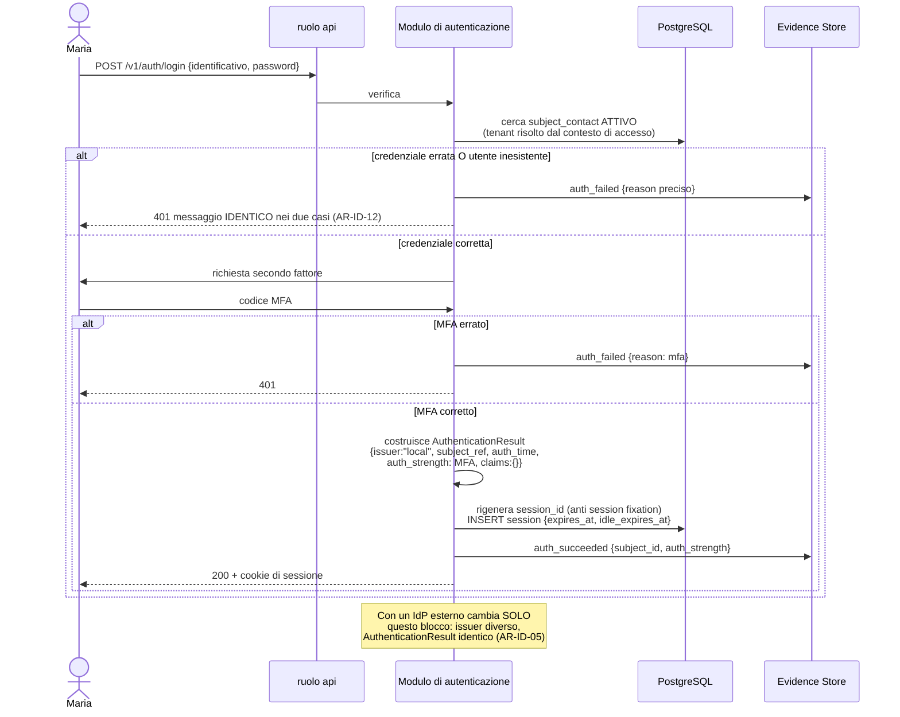
```mermaid
sequenceDiagram
    actor M as Maria
    participant API as ruolo api
    participant AUTH as Modulo di autenticazione
    participant DB as PostgreSQL
    participant AUD as Evidence Store

    M->>API: POST /v1/auth/login {identificativo, password}
    API->>AUTH: verifica
    AUTH->>DB: cerca subject_contact ATTIVO<br/>(tenant risolto dal contesto di accesso)
    alt credenziale errata O utente inesistente
        AUTH->>AUD: auth_failed {reason preciso}
        AUTH-->>M: 401 messaggio IDENTICO nei due casi (AR-ID-12)
    else credenziale corretta
        AUTH->>M: richiesta secondo fattore
        M->>AUTH: codice MFA
        alt MFA errato
            AUTH->>AUD: auth_failed {reason: mfa}
            AUTH-->>M: 401
        else MFA corretto
            AUTH->>AUTH: costruisce AuthenticationResult<br/>{issuer:"local", subject_ref, auth_time,<br/>auth_strength: MFA, claims:{}}
            AUTH->>DB: rigenera session_id (anti session fixation)<br/>INSERT session {expires_at, idle_expires_at}
            AUTH->>AUD: auth_succeeded {subject_id, auth_strength}
            AUTH-->>M: 200 + cookie di sessione
        end
    end

    Note over AUTH: Con un IdP esterno cambia SOLO<br/>questo blocco: issuer diverso,<br/>AuthenticationResult identico (AR-ID-05)
```

#### Come leggerlo

**Il punto di sostituzione è la nota in fondo.** Tutto ciò che sta a destra del modulo di
autenticazione — sessione, audit, `subject_ref` — non sa e non deve sapere **come** Maria si
è autenticata. Sa solo che si è autenticata, quando, e con quanta forza. Sostituire il
riquadro `AUTH` con un flusso OIDC non tocca nient'altro. È `ADR-109` che si dimostra
reversibile.

**Il ramo in alto è `AR-ID-12`.** Credenziale sbagliata e utente inesistente producono la
**stessa** risposta all'utente e **ragioni diverse** nell'audit. Chi attacca non impara quali
account esistono; chi indaga sa cosa è successo.

**La rigenerazione del `session_id`** dopo l'autenticazione è la difesa contro la session
fixation (§23, minaccia 11). Costa una riga e chiude una classe di attacchi.

**Come si risolve il `tenant_id`.** Questa è una domanda con una risposta importante. Il
`tenant_id` **non** viene da un claim del token (sarebbe controllabile dall'IdP, e con
`AR-ID-06` non ci fidiamo). Viene risolto da noi in due passi: `(issuer, external_sub)` →
`IDP_LINK` → `subject_id` → `HUMAN_SUBJECT.tenant_id`. Cioè il tenant è una proprietà della
**nostra** riga, non del token. `AR-018` dice *"tenant_id preso dal token"*; `A09` lo
**precisa**: preso dall'identità **risolta a partire** dal token, mai da un claim diretto.
È un raffinamento di `AR-018`, e lo dichiaro come tale — non un conflitto, ma una
precisazione che va registrata perché altrimenti qualcuno leggerà `AR-018` alla lettera e
scriverà `tenant_id = token["tenant"]`.

### 9.4 OIDC e OAuth: due cose diverse che vengono sempre confuse

Il prompt (§12, §13, §74) insiste, e ha ragione.

| | **OIDC** | **OAuth 2.x** |
|---|---|---|
| Risponde a | *chi sei* | *cosa questa applicazione può fare per tuo conto su un altro sistema* |
| Artefatto principale | **ID token** | **access token** |
| Il destinatario è | l'applicazione che fa il login (noi) | l'**API di risorsa** (es. Odoo, Google) |
| Nel nostro sistema serve per | far entrare Maria (§9.2, futuro) | far accedere un tool a un sistema esterno per conto di Maria (§14, futuro) |

**`AR-ID-11`.** Un **ID token non viene mai usato come credenziale di accesso a un'API**.
Il prompt lo chiede esplicitamente (§37) e la ragione è semplice: l'ID token ha come
audience **noi**, non l'API. Presentarlo altrove è un caso di *token confusion*: un token
inteso per un destinatario usato con un altro. Verifica: il codice che chiama un sistema
esterno accetta solo un `AuthenticatedClient` costruito dal `Credential Broker` (§13), e non
esiste un percorso che gli passi un token di sessione.

**Dove OAuth **non** va usato.** Il prompt avverte: *"Do not misuse OAuth as a generic
authorization architecture."* OAuth serve a **delegare accesso a un'API di terzi**. Non
serve, e non lo useremo, per:

- autorizzare un utente dentro la nostra applicazione (lo fa il PDP);
- rappresentare i permessi interni come `scope` (gli `scope` OAuth sono grossolani e
  statici; la nostra autorizzazione è per risorsa e contestuale);
- l'autenticazione fra i nostri processi (§17).

### 9.5 Cosa succede quando l'autenticazione fallisce

Il prompt (§57): *"Do not fail open unless explicitly justified."*

| Caso | Comportamento | Codice | Cosa vede l'utente | Cosa viene registrato |
|---|---|---|---|---|
| token malformato / firma non valida | rifiuto | `401` | "sessione non valida, accedi di nuovo" | `auth_failed{reason: invalid_token}` — **senza il token** |
| token scaduto | rifiuto | `401` | idem | `auth_failed{reason: expired}` |
| sessione revocata | rifiuto | `401` | "la sessione è stata chiusa" | `auth_failed{reason: session_revoked}` |
| soggetto disabilitato | rifiuto | `403` | "account non attivo" | `auth_failed{reason: subject_disabled}` |
| tenant disabilitato | rifiuto | `403` | messaggio generico | `auth_failed{reason: tenant_disabled}` |
| IdP esterno irraggiungibile | **rifiuto**, mai fallback su credenziale locale | `503` | "accesso temporaneamente non disponibile" | `auth_unavailable` — **categoria distinta** |
| troppi tentativi | rifiuto + rallentamento progressivo | `429` | messaggio generico | `auth_throttled` |

**Tre note.**

**1. `401` e `403` dicono cose diverse, e a volte non dovrebbero.** `401` = non so chi sei;
`403` = so chi sei ma non puoi. Il problema: distinguere "account non attivo" da "credenziali
sbagliate" dice a un attaccante che quell'account **esiste**. **`AR-ID-12`:** la risposta
all'utente non distingue mai fra "utente inesistente" e "credenziale sbagliata"; la
distinzione esiste **solo** nell'audit. Il `403` per account disabilitato si applica solo a
chi ha già una sessione valida, dove l'esistenza è già nota.

**2. `auth_unavailable` è una categoria a sé.** È la stessa distinzione che `A03` fa con
`AR-GP-21` (*l'audit distingue `policy_denied` da `policy_unavailable`*) e con `ADR-022`
(`INDETERMINATE` ≠ `DENY` terminale). Un guasto non è un rifiuto. Se domani il 3% degli
accessi fallisce, devo poter distinguere "3% di attacchi" da "3% di IdP che non risponde".

**3. Mai un fallback su credenziale locale quando l'IdP è giù.** È l'unico modo per non
creare una porta di servizio permanente. Il costo è reale: se l'IdP del cliente è giù,
nessuno lavora. Lo accetto, e lo dichiaro come rischio `R-46`.

---

## 10. Sessioni e token: cinque cose diverse che non vanno confuse

Il prompt (§36) elenca cinque tipi di sessione e chiede di non collassarli.

| Tipo | Cosa è | Dove vive | Durata | Revocabile |
|---|---|---|---|---|
| **browser session** | la persona è autenticata nell'interfaccia | riga `session` + cookie | assoluta + inattività | **sì, subito** |
| **API session** | un'integrazione applicativa è autenticata | credenziale del `ServicePrincipal` | quanto la credenziale | sì (revoca della credenziale) |
| **agent session** | **non esiste** | — | — | — |
| **run session** | l'esecuzione di un run | riga `run` + `DelegationContext` | ≤ 10 min attivi (`ADR-104`) | sì (cancellazione cooperativa) |
| **tool session** | la connessione autenticata verso un sistema esterno | dentro il `Credential Broker`, in memoria | **un solo `EXECUTE`** | non serve: muore da sola |

**"agent session" non esiste, ed è deliberato.** Un agent non ha una sessione perché non è
un soggetto che si autentica: è una **configurazione** (`AgentVersion`) che viene istanziata
in un run. Se avessimo una "sessione dell'agent" avremmo un contenitore di stato che
sopravvive ai run, e la prima cosa che ci finirebbe dentro sarebbe una credenziale in cache.
Non esiste, non ci finisce.

### 10.1 Perché la sessione è una riga e non un token

**DECISIONE ARCHITETTURALE (`ADR-110`).** La sessione è una **riga in PostgreSQL**,
consultata a ogni richiesta. Non è un JWT autosufficiente.

**Il trade-off, esplicito.** Guadagniamo la **revoca immediata**. Perdiamo la validazione
senza database. Su un deployment a una macchina dove ogni richiesta tocca comunque il
database (`AR-002`), la perdita è **zero misurabile**; il guadagno è che `A09` può
promettere una revoca che ha effetto **al prossimo passo**, non "entro 15 minuti".

Questa scelta è la **precondizione** di `ADR-106` (§12). Se la sessione fosse un token
firmato, non potrei promettere che una revoca ferma un run in corso, e la §12 crollerebbe.

**Contro-argomento onesto.** Se un giorno il ruolo `api` dovesse scalare a molte istanze con
un carico alto di richieste leggere, la lettura della sessione a ogni richiesta diventerebbe
un costo visibile. La via d'uscita esiste ed è nota: token firmato **a vita brevissima** con
la riga di sessione consultata solo al rinnovo. Non la faccio ora perché aggiungerebbe
crittografia e una finestra di revoca, per un problema che con `AS-01` (decine di run
concorrenti) non abbiamo. Trigger: **`T-ID-05`**.

### 10.2 Il ciclo di vita di un token

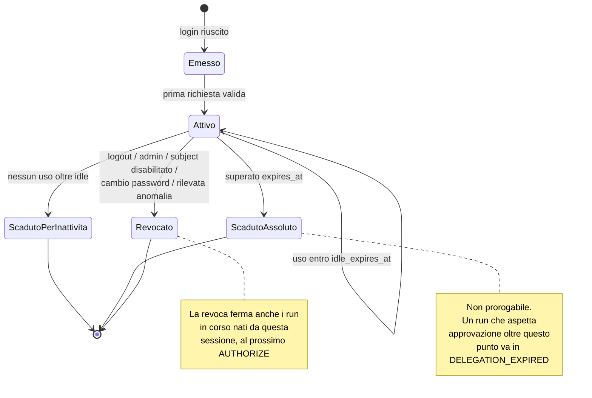
```mermaid
stateDiagram-v2
    [*] --> Emesso: login riuscito
    Emesso --> Attivo: prima richiesta valida
    Attivo --> Attivo: uso entro idle_expires_at
    Attivo --> ScadutoPerInattivita: nessun uso oltre idle
    Attivo --> ScadutoAssoluto: superato expires_at
    Attivo --> Revocato: logout / admin / subject disabilitato /<br/>cambio password / rilevata anomalia
    ScadutoPerInattivita --> [*]
    ScadutoAssoluto --> [*]
    Revocato --> [*]

    note right of Revocato
        La revoca ferma anche i run
        in corso nati da questa
        sessione, al prossimo AUTHORIZE
    end note

    note right of ScadutoAssoluto
        Non prorogabile.
        Un run che aspetta
        approvazione oltre questo
        punto va in DELEGATION_EXPIRED
    end note
```

#### Come leggerlo

Tre modi di finire, non uno. **Inattività** (prorogabile: se lavori, la sessione continua),
**scadenza assoluta** (non prorogabile: dopo N ore rientri comunque), **revoca** (immediata,
dall'esterno).

La nota in basso è la connessione con `ADR-104` che ho discusso in §8.4: la scadenza assoluta
è il tetto reale alla durata di un'approvazione umana.

La revoca ha **sei cause** e non solo il logout. La più importante è *cambio password*:
cambiare la password deve invalidare tutte le sessioni, altrimenti chi ha rubato la sessione
resta dentro anche dopo che la vittima si è "messa in sicurezza".

### 10.3 Audience: nessun token universale

Il prompt (§39): *"Avoid universal tokens."*

| Token | Emesso da | Audience | Vale per |
|---|---|---|---|
| sessione utente | noi | **noi** (`api`) | le nostre API |
| credenziale `ServicePrincipal` | noi | **noi** | le nostre API, con scope ridotto |
| credenziale verso il CRM | il **CRM** | il CRM | solo quel connector, solo quel tenant |
| credenziale verso l'inference server | noi | l'inference server | solo `ModelProvider` |

**`AR-ID-13`.** Nessuna credenziale è valida su più di un destinatario. Verifica: il
`Credential Broker` (§13) rifiuta di restituire un `AuthenticatedClient` se il
`credential_ref` richiesto non dichiara come `audience` esattamente il connector che lo
chiede.

**Perché conta.** Senza audience, una credenziale rubata dal connector email funziona anche
verso il CRM. Con l'audience, un furto è confinato a una superficie.

---

## 11. Il modello di autorizzazione: cosa aggiunge `A09` a `A03`

### 11.1 Attenzione: `A03` ha già deciso il motore

Il prompt (§21-§26) chiede di confrontare RBAC, ABAC, ReBAC, capability e policy engine e di
"scegliere il modello migliore". Ma **`A03` ha già scelto**: `ADR-019` (intersezione di 5
insiemi), `ADR-020` (PDP puro), `ADR-021` (decisione con obbligazioni), `ADR-025`
(precedenza a imbuto). Riaprire quella decisione qui sarebbe scorretto verso `A03` e
violerebbe il principio di single owner.

Quello che `A09` decide è una cosa diversa e complementare:

> **Da dove vengono gli attributi del soggetto** che il `PIP` carica per il PDP.

Cioè: il motore è ABAC/policy-based (deciso da `A03`). `A09` decide quale **forma** hanno i
permessi delle persone che alimentano quel motore.

### 11.2 I quattro modelli, e dove ciascuno vive nel nostro sistema

| Modello | Cosa è | Dove vive da noi | Verdetto |
|---|---|---|---|
| **RBAC** (*Role-Based*: i permessi si danno ai ruoli, le persone ai ruoli) | `sales_manager` → 12 permessi | **sorgente di attributi**: `ROLE_ASSIGNMENT` → il PIP espande i ruoli in permessi e li passa al PDP | **Day-1, ma non come motore** |
| **ABAC** (*Attribute-Based*: si decide con attributi del soggetto, della risorsa, del contesto) | `sensitivity = high AND auth_strength < MFA → DENY` | **è il motore**, già deciso da `A03` | **Day-1** |
| **ReBAC** (*Relationship-Based*: si decide seguendo relazioni, stile Zanzibar) | `user → member_of → team → owns → opportunity` | **non implementato da noi**: la relazione è **autoritativa nel CRM** | **rimandato** |
| **Capability** | il set di tool congelato del run (`ADR-008`) | **già Day-1**, è il secondo insieme dell'intersezione | **Day-1** |

**Nessuno dei quattro basta da solo.** È il punto del prompt (*"Do not assume RBAC is
sufficient for enterprise agents"*), e la ragione è concreta:

- **RBAC da solo non basta** perché non sa dire "solo le opportunità del **tuo** team". Il
  ruolo è un'etichetta globale; il perimetro dei dati è relazionale. Per esprimerlo con soli
  ruoli servirebbe un ruolo per team, e i ruoli esploderebbero.
- **ABAC da solo non basta** perché gli attributi devono venire da qualche parte, e i ruoli
  sono il modo più comprensibile di darli a un amministratore.
- **Capability da sola non basta** perché limita l'agent, non la persona. Un agent con
  `crm.opportunity.read` letto da chiunque leggerebbe qualunque opportunità.
- **ReBAC da solo non basta** e, soprattutto, **da noi non è nostro**: la relazione
  "questa opportunità appartiene al team di Maria" vive in Odoo, non da noi, e `INV-07` ci
  vieta di copiarla. È esattamente il ragionamento di `ADR-079` in `A07` (*nessun knowledge
  graph: le relazioni sono autoritative nel CRM*).

### 11.3 La decisione

**DECISIONE ARCHITETTURALE (`ADR-111`).**

> **RBAC come sorgente di attributi, ABAC come motore, capability come tetto del run, ReBAC
> per riferimento.**
>
> - I ruoli sono nostri, versionati, per tenant. Un ruolo è un **nome che espande in un
>   insieme di permessi**, non un'entità autorizzante.
> - Il PIP espande `subject → ruoli → permessi` **prima** della decisione, e passa il
>   risultato al PDP come attributo. Il PDP non conosce i ruoli (resta puro).
> - Il **perimetro sui dati** (quali record) **non** è espresso da noi: si ottiene
>   interrogando la sorgente autoritativa, secondo `ADR-072` (ACL per riferimento).

**La conseguenza scomoda, dichiarata.** Questo significa che noi **non possiamo rispondere
da soli** alla domanda "Maria può vedere l'opportunità 42?". Possiamo rispondere a "Maria ha
il permesso di tipo `crm.opportunity.read`?" — quello è nostro. Il "quali" resta di Odoo. Le
due domande insieme fanno l'autorizzazione, e nessuna delle due è sufficiente.

È coerente con `ADR-053` di `A06` (*le business rule stanno fuori dal tool*) e con `AR-KN-05`
(*la piattaforma non è mai system of record di un dato aziendale esterno*), ma va detto
chiaramente perché è **il limite principale** del nostro modello di autorizzazione: siamo
autoritativi sul **tipo** di azione, non sull'**istanza** della risorsa.

**Contro-argomento onesto.** Un sistema che dipende dalla sorgente esterna per il perimetro
sui dati eredita i **suoi** tempi e i **suoi** guasti. Se Odoo è lento a rispondere, ogni
autorizzazione è lenta. Se Odoo è giù, `AR-KN-09` (fail closed) ci dice di negare — e l'agent
diventa inutile. L'alternativa (copiare le ACL) è vietata da `INV-07` e da `ADR-072`, e per
buone ragioni: una copia di permessi è una copia che **invecchia**, cioè un modo per
concedere accessi già revocati. Preferisco un sistema che si ferma a uno che sbaglia in
silenzio, ma il costo di disponibilità è vero: rischio **`R-42`**.

### 11.4 La forma di `AuthorizationRequest`

Il prompt (§27) chiede di definire la richiesta di autorizzazione concettuale.

```text
AuthorizationRequest:
    principal:      Principal        # la coppia di ADR-105
    action:         ActionRef        # es. "crm.opportunity.write"
    resource:       ResourceRef      # tipo + identificatore + attributi caricati dal PIP
    context:        RequestContext
        now:                timestamptz     # iniettato (AR-TL-14), mai dal modello
        auth_time:          timestamptz     # dalla delega
        auth_strength:      enum
        purpose:            text            # dalla delega, NON VERIFICATO
        run_state:          enum
        budget_remaining:   BudgetSnapshot
        freshness:          FreshnessInfo   # eta' dei grant esterni (A07)
    bundle_version: text              # quale versione di policy sta decidendo
```

Rispetto a quello che il prompt propone (`subject, tenant, agent, action, resource,
resource_type, context, purpose`), tre differenze deliberate:

1. **`subject`, `tenant` e `agent` non sono tre campi paralleli**: sono dentro `Principal`,
   perché la loro relazione è strutturale. Tenerli separati permetterebbe di costruire una
   richiesta incoerente (l'agent di un tenant con il subject di un altro). Il tipo lo
   impedisce.
2. **`purpose` è marcato come non verificato**, e questo va scritto nel tipo, non in un
   commento. Chi scrive una policy deve vedere che si sta fidando di una dichiarazione.
3. **`freshness` è un campo di primo livello** perché `AR-KN-09` impone fail closed sulla
   staleness. Se l'età dei grant non è un input, quella regola non è applicabile.

### 11.5 ReBAC: perché no, e quando sì

Il prompt (§24) chiede di valutare relazioni tipo `user → member_of → team → owns → project
→ contains → document`.

**Non ora**, per tre ragioni:

1. **La relazione non è nostra.** Vale l'argomento di `ADR-079`.
2. **Introdurre un sistema Zanzibar-style è introdurre un secondo datastore**, e `AR-019`
   dice: *nessun datastore nuovo senza una misura del limite attuale*. Non abbiamo la misura.
3. **`T-GP-04` esiste già** in `A03`: *requisiti di condivisione gerarchica profonda →
   OpenFGA come **fonte di attributi***. Nota la formulazione: fonte di attributi, non
   motore. Non c'è niente da aggiungere; `A09` conferma quel trigger e non ne crea uno
   parallelo.

**FATTO** (dal `research-log`, `R-03`): OpenFGA è un progetto CNCF in incubation, di modello
ReBAC stile Zanzibar; Topaz combina OPA con un directory service dello stesso stile.
**FATTO:** la maggior parte dei confronti disponibili sui policy engine viene da vendor
commerciali con interesse a posizionarsi, quindi le affermazioni su performance vanno
considerate deboli. Non ne uso nessuna per decidere.

---

## 12. La domanda dura: i permessi si congelano nello snapshot?

Questa sezione risponde a un mandato esplicito. È la decisione che ha la conseguenza più
visibile sul comportamento reale del sistema.

### 12.1 Il dilemma

`A02` ha stabilito (`ADR-012`) che il runtime risolve la configurazione **una volta
all'avvio del run** e la congela in uno snapshot immutabile e hashato. `A08` ha aggiunto il
`MemorySnapshot` (`ADR-092`), congelato per la stessa ragione: sta nel prompt, e cambiarlo a
metà run distruggerebbe il *prefix caching* (il meccanismo per cui l'inference server riusa
il lavoro già fatto sulla parte iniziale del prompt, che resta identica).

Domanda: **anche i permessi si congelano?**

| Se sì | Se no |
|---|---|
| coerenza totale: il run vede un mondo fermo, riproducibile, spiegabile | il run vede un mondo che cambia sotto i piedi |
| il PIP legge una volta: latenza minima per step | il PIP legge a ogni `AUTHORIZE`: `T-GP-01` più probabile |
| **una revoca non ha effetto sui run in corso** | una revoca ha effetto al prossimo passo |
| un utente licenziato alle 14:31 continua ad "agire" fino alle 14:41 | l'utente licenziato alle 14:31 è fermo alle 14:31 |

`T-ME-08` e `T-ME-10` in `A08` sono già registrati **proprio su questo**: *"un tenant
richiede propagazione immediata delle revoche ai run in corso"* riapre `ADR-092`. `A08` ha
lasciato la domanda aperta. `A09` la deve chiudere.

### 12.2 La falsa dicotomia

Il dilemma sembra binario, ma non lo è, e la via d'uscita sta in una distinzione che `A03`
ha già stabilito senza applicarla qui: **ogni livello può solo restringere** (`AR-GP-09`,
`ADR-025`).

Se ogni livello può solo restringere, allora **congelare un tetto non è mai pericoloso**:
un tetto congelato può solo limitare, e limitare troppo è un problema di usabilità, non di
sicurezza. Al contrario, **congelare una concessione è sempre pericoloso**: una concessione
congelata può autorizzare qualcosa che nel frattempo è stato revocato.

Quindi la domanda giusta non è "si congela o no?", ma:

> **Questo elemento è un tetto o una concessione?**

### 12.3 La decisione

**DECISIONE ARCHITETTURALE (`ADR-106`).**

> **Si congela il tetto, non l'autorità.**
>
> **Congelato all'avvio del run** (immutabile, entra nell'hash dello snapshot):
> - il capability set dell'agent (`ADR-008`, `INV-04`)
> - il set di tool esposti (`ADR-054`)
> - il `MemorySnapshot` (`ADR-092`)
> - la `bundle_version` delle policy (`ADR-024`: cache invalidata per versione)
> - lo `scope` massimo della delega (`DelegationContext.scope`)
>
> **Riletto a ogni `AUTHORIZE`** (autorità viva):
> - lo stato del `HumanSubject` (attivo / sospeso / uscito)
> - lo stato della `session` (viva / revocata / scaduta)
> - la validità del `DelegationContext` (`not_after`, `revoked_at`)
> - i **permessi correnti** del soggetto (ruoli attivi ora)
> - lo stato del tenant
> - la **freschezza dei grant esterni** (`AR-KN-09`)
>
> Il risultato è ancora un'**intersezione**: `tetto congelato ∩ autorità viva`. Poiché
> l'autorità viva può solo **togliere**, il run non può mai fare più di quanto lo snapshot
> permettesse all'avvio, e può fare **meno** in qualunque momento.

### 12.4 Perché questa è la risposta giusta e non un compromesso

Sembra un compromesso ("un po' congelato, un po' no"), ma non lo è: è la conseguenza diretta
di `AR-GP-09`. Provo a mostrarlo con la proprietà che ne segue.

> **`INV-13`** — Per ogni run `R` e ogni istante `t` successivo all'avvio, l'insieme delle
> azioni autorizzabili in `R` all'istante `t` è un **sottoinsieme** di quello all'avvio.
> Nessun evento — cambio di ruolo, nuova policy, nuova capability, nuova memoria — può
> aggiungere un'azione autorizzabile a un run già avviato.

Questo invariante è la generalizzazione di `INV-04` (le capability non crescono) e di
`INV-11` (le memorie non crescono) a **tutta** l'autorità. È verificabile: un test che, a
run avviato, concede un permesso nuovo al soggetto e verifica che il run **non** lo usi.

**La riproducibilità non si rompe.** L'obiezione naturale a `ADR-106` è: "se l'autorità è
viva, il run non è più riproducibile". È falsa, e la ragione è già in `ADR-042` di `A05`: la
promessa non è la riproducibilità dell'**output**, è la riproducibilità dell'**evidenza**.
Ogni `AUTHORIZE` registra la decisione con gli attributi usati (`AR-GP-20`). Riaprendo
l'audit di un run so **esattamente** cosa era vero a ogni passo, incluso il fatto che al
passo 12 il permesso c'era e al passo 13 non c'era più. Non ricostruisco lo stato del mondo
di allora: lo **leggo**, perché l'ho scritto.

### 12.5 Cosa costa, davvero

Elenco onesto, perché la decisione ha un prezzo.

**1. Due letture in più per step.** Il PIP deve leggere: stato del subject, stato della
sessione, validità della delega, ruoli correnti. Con indici appropriati sono letture per
chiave primaria, ma **stanno sul percorso caldo di ogni step**. `T-GP-01` (le query del PIP
superano il 30% della latenza di uno step) diventa più probabile per colpa di questa
decisione, e `A09` lo dichiara come proprio contributo a quel trigger.

*Mitigazione possibile, non Day-1:* una singola query che carica tutto lo stato di identità
in un colpo, con una vista materializzata per soggetto. Non la faccio ora perché ottimizzare
prima di misurare è il modo migliore per ottimizzare la cosa sbagliata.

**2. Non risolve il `MemorySnapshot`.** Le memorie restano congelate (`ADR-092` **non
cambia**). Quindi: se una memoria di Maria viene cancellata mentre un run è in corso, quel
run continua ad averla nel prompt. Questo è un buco reale, e lo dichiaro come rischio
**`R-43`**. Tre ragioni per accettarlo:

- il `MemorySnapshot` sta nella zona cacheabile del prompt: scongelarlo significa buttare il
  prefix caching a ogni revoca;
- la finestra è limitata a 10 minuti attivi (`ADR-104`);
- la memoria non può produrre effetti da sola: per agire serve un `AUTHORIZE`, che è vivo.
  Una memoria "fantasma" può influenzare cosa il modello **propone**, non cosa il sistema
  **fa**.

`T-ME-08` e `T-ME-10` restano i trigger corretti se un cliente esigesse di più. `A09` non li
chiude: li **conferma** e ne precisa il perimetro (riguardano solo la memoria e i frammenti,
non i permessi).

**3. Non risolve il retrieval già avvenuto.** Stesso ragionamento: i frammenti già nel
context restano. `AR-KN-13` (nessuna cache dei risultati di retrieval) limita il danno alle
letture di questo run.

**4. Un run può fallire per una ragione che l'utente non capisce.** "Perché si è fermato a
metà?" — "Perché nel frattempo ti hanno cambiato il ruolo." È un'esperienza confusa.
Mitigazione: `AR-RT-07` impone già che `BUDGET_EXCEEDED` produca un messaggio comprensibile
che includa cosa è già stato fatto; `A09` estende lo stesso obbligo alle interruzioni per
revoca (`AR-ID-14`).

### 12.6 Il diagramma della decisione

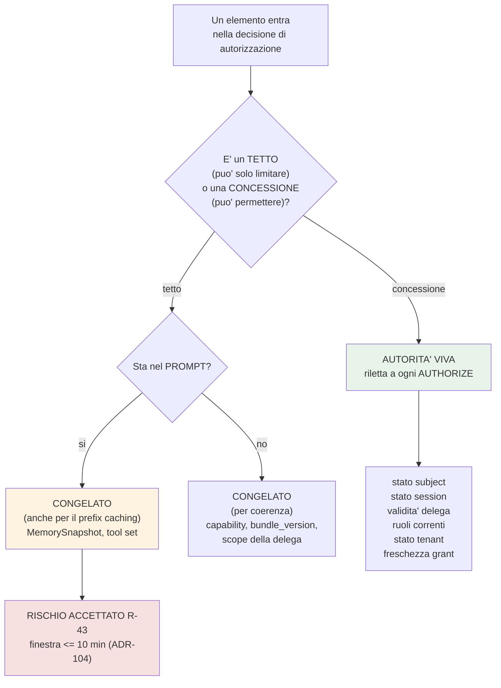
```mermaid
flowchart TD
    START["Un elemento entra<br/>nella decisione di autorizzazione"]
    Q1{"E' un TETTO<br/>(puo' solo limitare)<br/>o una CONCESSIONE<br/>(puo' permettere)?"}
    Q2{"Sta nel PROMPT?"}

    START --> Q1
    Q1 -->|tetto| Q2
    Q1 -->|concessione| VIVO["AUTORITA' VIVA<br/>riletta a ogni AUTHORIZE"]

    Q2 -->|si| FREEZE_HARD["CONGELATO<br/>(anche per il prefix caching)<br/>MemorySnapshot, tool set"]
    Q2 -->|no| FREEZE_SOFT["CONGELATO<br/>(per coerenza)<br/>capability, bundle_version,<br/>scope della delega"]

    VIVO --> V1["stato subject<br/>stato session<br/>validita' delega<br/>ruoli correnti<br/>stato tenant<br/>freschezza grant"]

    FREEZE_HARD --> RISK["RISCHIO ACCETTATO R-43<br/>finestra <= 10 min (ADR-104)"]

    style VIVO fill:#e8f4ea
    style FREEZE_HARD fill:#fdf3e0
    style RISK fill:#f7e0e0
```

#### Come leggerlo

È un albero decisionale che si può applicare a **ogni elemento nuovo** che qualcuno vorrà
aggiungere in futuro alla decisione di autorizzazione. Prima domanda: può solo togliere, o
può dare? Se può dare, **deve** essere vivo — non c'è discussione, perché congelare una
concessione significa costruire una revoca che non funziona.

Se può solo togliere, si congela; e la seconda domanda serve solo a distinguere **perché**
lo si congela: se sta nel prompt, il congelamento è anche una necessità di performance (il
prefix caching), e allora il rischio residuo `R-43` va accettato esplicitamente.

---

## 13. Il `Credential Broker` e il contratto del `Secret Store`

Questa sezione risponde al **mandato esplicito di `A06`**, registrato nello stato canonico:
*"`A09`: contratto del secret store"*.

### 13.1 Cosa `A06` ha già deciso, e cosa manca

`A06` ha stabilito tre cose vincolanti:

- **`AR-TL-13`** — nessun segreto arriva al codice del tool;
- **`ADR-056`** — il tool riceve un **client già autenticato**, mai un segreto;
- **`AR-TL-14`** — `tenant`, `principal`, `now`, `idempotency_key` sono **iniettati**, mai
  forniti dal modello.

E ha lasciato aperte quattro domande, che sono esattamente il mandato:

1. Da dove viene quel client autenticato?
2. Chi custodisce la credenziale?
3. Come si ruota?
4. Cosa succede quando scade a metà run?

### In breve: l'analogia del portiere

Immagina un edificio dove ogni stanza ha una serratura diversa. Il modo sbagliato è dare a
ogni dipendente il mazzo completo delle chiavi. Il modo giusto è avere un **portiere**: tu
gli dici "devo entrare nella stanza 12", lui verifica che tu sia autorizzato, **apre lui la
porta**, e tu entri. Non hai mai avuto la chiave in mano. Quando esci, la porta si richiude.

Il `Credential Broker` è il portiere. Il `Secret Store` è l'armadio delle chiavi che sta
dietro di lui, chiuso a sua volta.

### 13.2 `Credential Broker` — responsabilità e non responsabilità

**DECISIONE ARCHITETTURALE (`ADR-108`).** Esiste un componente `Credential Broker`, che è un
**modulo in-process** dentro il ruolo `worker` (e dentro `api` per i pochi casi che servono
lì), non un servizio separato.

**Responsabilità**

- Ricevere una richiesta di client autenticato: `(tenant_id, connector_id, principal, purpose)`.
- Verificare che **esista già una decisione del PDP** che autorizza questa invocazione
  (`INV-01`).
- Risolvere quale credenziale usare: `credential_ref = f(tenant_id, connector_id, environment)`.
- Ottenere il materiale dal `Secret Store`.
- Costruire un `AuthenticatedClient` **già configurato**, con il timeout, il rate limit e
  l'audience giusti.
- **Consegnarlo per la durata di un solo `EXECUTE`**, e invalidarlo dopo.
- Registrare nell'audit **il `credential_ref`**, mai il valore.
- Gestire la **rotazione** e la **scadenza**, incluso il caso "scade a metà run" (§13.6).

**Non responsabilità**

- **Non decide** se l'azione è permessa. Quello è il PDP. Il Broker **verifica che una
  decisione ci sia**, non la prende. Se il Broker decidesse, avremmo due autorità e
  violeremmo `AR-013` e il principio di single owner.
- **Non conosce i tool.** Conosce i `connector`, che sono la cosa che fa rete (`AR-TL-01`).
- **Non cifra niente da sé.** La cifratura è del `Secret Store` (o di ciò che sta sotto).
  Il prompt (§20) è esplicito: *"Do not design cryptography."*
- **Non è un cache di credenziali a lunga durata.** Un client vive un `EXECUTE`. Non c'è un
  pool che sopravvive ai run.
- **Non parla mai col modello.** Il modello non sa che il Broker esiste. Non c'è nessun tool
  che si chiami `get_credential`, e non ci sarà mai.

**Perché un modulo e non un servizio.** Un servizio separato aggiungerebbe: un secondo
processo da operare, un canale da autenticare (che è di nuovo un problema di credenziali:
ricorsione), latenza sul percorso caldo. Il beneficio classico — isolamento di memoria: una
vulnerabilità nel worker non legge i segreti — è **reale ma non ottenibile Day-1**, perché
il worker è comunque il processo che riceve il client autenticato e può usarlo. Isolare il
Broker sposta il problema, non lo risolve, finché il tool gira in-process (`ADR-050`).
Trigger per riaprire: **`T-ID-06`** — il primo tool non nostro (che è già `T-TL-03`) o il
primo requisito di isolamento della memoria dei segreti.

### 13.3 Il contratto del `Secret Store`

Questo è il contratto che `A06` ha chiesto.

```text
interface SecretStore:

    get_secret(ref: CredentialRef, requester: BrokerIdentity)
        -> SecretMaterial
        # Restituisce il materiale. UNICO metodo che espone valori.
        # Chiamabile SOLO dal Credential Broker (verificato staticamente).
        # Ogni chiamata e' auditata come `secret_accessed`.

    describe_secret(ref: CredentialRef)
        -> SecretMetadata
        # tipo, audience, created_at, expires_at, rotation_state, version.
        # NON espone il valore. Chiamabile da chiunque abbia il ref:
        # e' il metodo che permette di sapere "sta per scadere" senza leggerla.

    put_secret(ref: CredentialRef, material: SecretMaterial, actor: OperatorRef)
        -> SecretVersion
        # Scrittura amministrativa. Mai dal runtime (AR-006/AR-008).
        # Crea una VERSIONE nuova, non sovrascrive.

    rotate_secret(ref: CredentialRef, actor: OperatorRef | SchedulerRef)
        -> RotationResult
        # Crea la versione N+1 e la marca PENDING.
        # La N resta valida finche' la N+1 non e' CONFIRMED (§13.5).

    revoke_secret(ref: CredentialRef, version: SecretVersion?, reason: text)
        -> void
        # Invalida immediatamente. Ogni get_secret successivo fallisce.
        # Se version e' NULL, revoca tutte le versioni.
```

**I tipi:**

```text
CredentialRef:                  # e' un PUNTATORE, non un segreto
    tenant_id:    uuid
    connector_id: text          # "odoo_prod", "smtp_acme"
    audience:     text          # il destinatario ammesso (AR-ID-13)
    purpose:      text

SecretMetadata:                 # sicuro da loggare, da auditare, da mostrare
    ref, kind, audience, version,
    created_at, expires_at, last_rotated_at,
    rotation_state: STABLE | PENDING | CONFIRMED | FAILED,
    last_used_at

SecretMaterial:                 # MAI serializzato, MAI loggato, MAI nell'audit
    kind: API_KEY | OAUTH_REFRESH | OAUTH_ACCESS | PASSWORD |
          CERTIFICATE | PRIVATE_KEY | DB_ROLE
    value: <tipo opaco, azzerato dopo l'uso>
    expires_at: timestamptz?
```

**Cinque proprietà del contratto, e perché ognuna c'è:**

| # | Proprietà | Perché |
|---|---|---|
| 1 | **`get_secret` è l'unico metodo che espone valori, e solo al Broker** | rende `AR-TL-13` verificabile con analisi statica: nessun modulo sotto `tools/` importa `SecretStore` |
| 2 | **`describe_secret` esiste apposta** | senza, per sapere se una credenziale sta per scadere bisognerebbe leggerla. Separare i metadati dal valore è ciò che permette il controllo di scadenza di §13.6 |
| 3 | **`put_secret` crea versioni, non sovrascrive** | stessa ragione di `ADR-015` in `A02` e `ADR-102` in `A08`: si supersede, non si sovrascrive. Permette rollback e rende l'audit sensato |
| 4 | **`rotate_secret` ha uno stato `PENDING`** | perché la rotazione non è atomica sui sistemi esterni: c'è un momento in cui la chiave nuova esiste ma non è ancora attiva ovunque. Ignorare quel momento è il modo classico di rompere la produzione ruotando una chiave |
| 5 | **`revoke_secret` è immediato e per versione** | permette di revocare la sola versione compromessa senza fermare il connector |

**`SecretMaterial` non è serializzabile.** È un vincolo di tipo, non una raccomandazione:
il tipo non implementa la serializzazione, non implementa la rappresentazione testuale di
debug, e viene azzerato in memoria dopo l'uso. **RICHIEDE RICERCA** su quanto sia
realisticamente garantibile l'azzeramento in un linguaggio con garbage collector come
Python: **`B-46`**. Non fingo che sia risolto.

### 13.4 L'implementazione Day-1

**DECISIONE ARCHITETTURALE (`ADR-108`, parte 2).** Day-1 il `SecretStore` è una **tabella
PostgreSQL** con i valori cifrati, e la chiave di cifratura **non sta nel database**: arriva
dall'ambiente del processo (variabile d'ambiente o file montato con permessi ristretti).

| Alternativa | Pro | Contro | Verdetto |
|---|---|---|---|
| **variabili d'ambiente** | zero infrastruttura | non ruotabili senza riavvio; non per tenant; finiscono nei dump di processo e nei log di crash | **no** come archivio (sì come sorgente della chiave master) |
| **tabella PostgreSQL cifrata** | riusa ciò che c'è; versioning naturale; RLS per tenant; audit nella stessa transazione | la chiave master va custodita fuori; un dump del database + la chiave = tutto | **Day-1** |
| **HashiCorp Vault** | rotazione, credenziali dinamiche, audit dedicato, lease | un secondo sistema distribuito da operare, con un team di 1-3 persone (`AS-04`) | **Prepare**, trigger `T-TL-08` |
| **KMS gestito del cloud** | nessuna operatività | non disponibile on-prem: dipende da `Q-03` | **dipende da `Q-03`** (§29) |
| **file su disco** | semplicissimo | nessun versioning, nessun audit, permessi facili da sbagliare | **no** |

**Perché la tabella e non Vault Day-1.** `T-TL-08` esiste già in `A06` e dice esattamente
questo: *le credenziali superano la rotazione manuale → secret store con rotazione*. Il
trigger è già definito, non serve anticiparlo. Con pochi connector per pochi tenant, la
rotazione manuale trimestrale è sostenibile; con decine di tenant per decine di connector
non lo è più, e quello è il momento di Vault. **`A09` non ridefinisce `T-TL-08`: lo eredita
e ne fa il criterio di questa decisione.**

**Contro-argomento onesto.** "La chiave sta fuori dal database" è vera solo finché nessuno
fa un backup che include sia il dump sia l'ambiente. In pratica, su una macchina sola, un
attaccante con accesso root ha entrambe le cose. Quindi **il valore di sicurezza di questa
cifratura è limitato al furto del solo database** (un backup finito nel posto sbagliato, un
dump condiviso per debug). Non protegge da una compromissione della macchina. Lo dico
esplicitamente perché "i segreti sono cifrati" è la frase che fa dormire tranquilli le
persone sbagliate. Il rischio residuo è **`R-47`**.

### 13.5 Rotazione: il flusso a due fasi

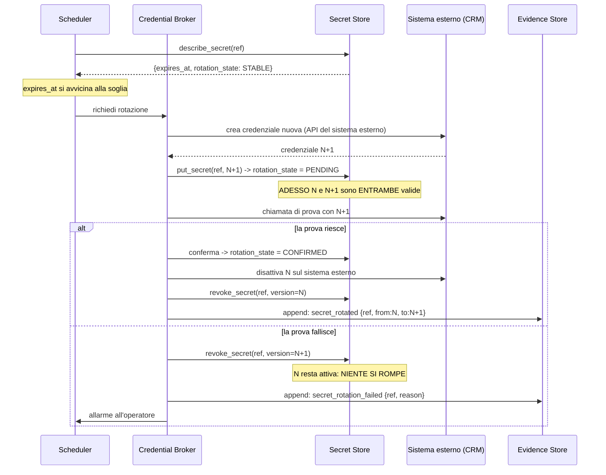
```mermaid
sequenceDiagram
    participant SCH as Scheduler
    participant CB as Credential Broker
    participant SS as Secret Store
    participant EXT as Sistema esterno (CRM)
    participant AUD as Evidence Store

    SCH->>SS: describe_secret(ref)
    SS-->>SCH: {expires_at, rotation_state: STABLE}
    Note over SCH: expires_at si avvicina alla soglia
    SCH->>CB: richiedi rotazione

    CB->>EXT: crea credenziale nuova (API del sistema esterno)
    EXT-->>CB: credenziale N+1
    CB->>SS: put_secret(ref, N+1) -> rotation_state = PENDING
    Note over SS: ADESSO N e N+1 sono ENTRAMBE valide

    CB->>EXT: chiamata di prova con N+1
    alt la prova riesce
        CB->>SS: conferma -> rotation_state = CONFIRMED
        CB->>EXT: disattiva N sul sistema esterno
        CB->>SS: revoke_secret(ref, version=N)
        CB->>AUD: append: secret_rotated {ref, from:N, to:N+1}
    else la prova fallisce
        CB->>SS: revoke_secret(ref, version=N+1)
        Note over SS: N resta attiva: NIENTE SI ROMPE
        CB->>AUD: append: secret_rotation_failed {ref, reason}
        CB->>SCH: allarme all'operatore
    end
```

#### Come leggerlo

Il punto è la riga `Note over SS: ADESSO N e N+1 sono ENTRAMBE valide`. Questa
sovrapposizione è ciò che rende la rotazione **sicura**: in nessun momento esiste una
finestra in cui la vecchia è morta e la nuova non funziona ancora.

Il ramo `else` è il motivo per cui il flusso ha due fasi invece di una. Se la prova
fallisce, si butta via la **nuova**, non la vecchia. Il sistema resta funzionante e un umano
riceve un allarme. La rotazione che rompe la produzione è quella che disattiva la vecchia
per prima.

**Chi avvia la rotazione.** Day-1: lo `Scheduler` (uno dei tre ruoli di `ADR-001`) su
politica di scadenza, oppure un operatore su richiesta. **Non** un tool, **non** il modello,
**non** un run.

**`AR-ID-15`.** La rotazione non è mai avviata da un run né da un tool. Verifica: `rotate_secret`
accetta come `actor` solo `OperatorRef | SchedulerRef` — è impedito dal tipo.

### 13.6 Cosa succede quando una credenziale scade a metà run

`A06` ha chiesto esplicitamente questo caso. È il più interessante perché è dove le decisioni
si scontrano.

**Il quadro.** Un run dura al massimo 10 minuti attivi (`ADR-104`), ma può stare **fermo per
ore** in attesa di approvazione umana. Quindi: un run avviato alle 14:30 può eseguire il suo
`SIDE_EFFECT` alle 19:00. Nel frattempo la credenziale verso il CRM può essere scaduta,
ruotata o revocata.

**Le tre situazioni, e cosa fa il sistema:**

| Situazione | Comportamento | Perché |
|---|---|---|
| **La credenziale è stata ruotata** (esiste N+1 valida) | il Broker risolve `credential_ref` **al momento dell'`EXECUTE`**, non all'avvio del run, e ottiene N+1. Il run **continua normalmente** | `credential_ref` è un puntatore, non un valore: risolverlo tardi è gratis ed è la ragione per cui è un puntatore |
| **La credenziale è scaduta e non c'è una nuova** | l'`EXECUTE` fallisce con errore tipizzato `CREDENTIAL_UNAVAILABLE`, classificato **`RETRYABLE`** ma **non ritentabile subito** | non è colpa del modello né dell'input: è un guasto operativo. `AR-TL-10` dice che il Tool Runtime non ritenta mai; è l'executor a decidere |
| **La credenziale è stata revocata** (compromissione) | l'`EXECUTE` fallisce con `CREDENTIAL_REVOKED`, **non ritentabile**, e il run va in `FAILED` | una revoca per compromissione non deve essere aggirata da un retry |

**Il caso che fa più male: la scadenza fra `AUTHORIZE` e `EXECUTE`.**

C'è una finestra, piccola ma reale, in cui il PDP autorizza e poi la credenziale muore prima
dell'esecuzione. Il risultato è un side effect **non avvenuto** dopo una decisione
**registrata**. `A04` ha già il concetto giusto per questo: `ADR-032`, lo stato `UNCERTAIN`
(*quando non si sa se un side effect è avvenuto, si ammette e si escala*).

**`AR-ID-16`.** Un fallimento di credenziale **dopo** l'invio della richiesta al sistema
esterno produce `UNCERTAIN`, non `FAILED`. Un fallimento **prima** dell'invio produce
`FAILED` pulito. La distinzione è del connector, coerente con `ADR-060` (*l'errore esterno
lo classifica il connector*) e con `AR-TL-09` (*la fase pre-send è sempre ritentabile*).

**Il controllo preventivo.** Prima di un `EXECUTE` con `side_effects != NONE`, il Broker
chiama `describe_secret` e verifica che `expires_at` sia oltre un margine di sicurezza. Se
non lo è, l'azione **non parte** e il run chiede una rotazione. Meglio fermarsi prima che
scoprire di essere `UNCERTAIN` dopo.

**Il margine di sicurezza è `NON ANCORA DECISO` come numero**, ma la sua **forma** è decisa:
`margin ≥ tempo massimo di una singola chiamata al connector`, che a sua volta è il `timeout`
già dichiarato per ogni tool in `A06`. Non invento un valore: lo derivo da un valore che
esiste già.

### 13.7 Il diagramma del recupero della credenziale

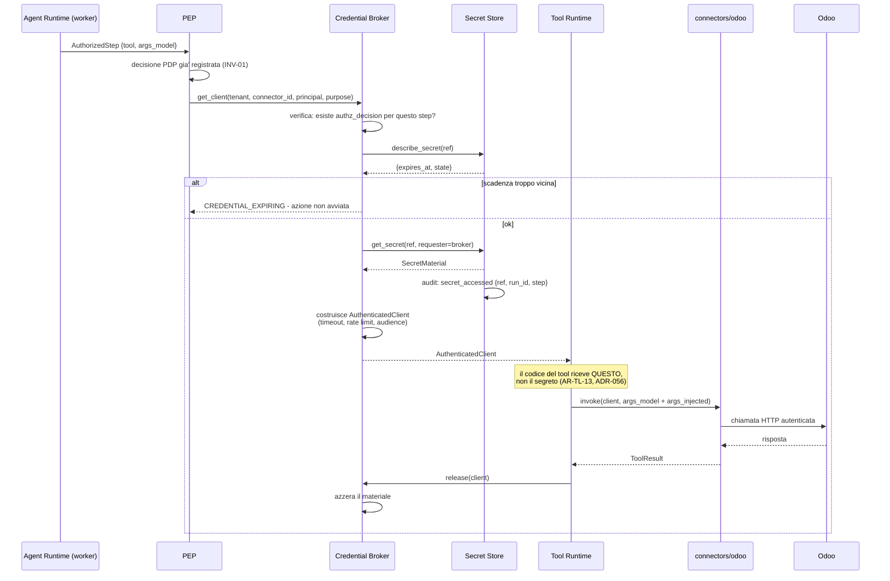
```mermaid
sequenceDiagram
    participant W as Agent Runtime (worker)
    participant PEP as PEP
    participant CB as Credential Broker
    participant SS as Secret Store
    participant TR as Tool Runtime
    participant CONN as connectors/odoo
    participant ODOO as Odoo

    W->>PEP: AuthorizedStep {tool, args_model}
    PEP->>PEP: decisione PDP gia' registrata (INV-01)
    PEP->>CB: get_client(tenant, connector_id, principal, purpose)
    CB->>CB: verifica: esiste authz_decision per questo step?
    CB->>SS: describe_secret(ref)
    SS-->>CB: {expires_at, state}
    alt scadenza troppo vicina
        CB-->>PEP: CREDENTIAL_EXPIRING - azione non avviata
    else ok
        CB->>SS: get_secret(ref, requester=broker)
        SS-->>CB: SecretMaterial
        SS->>SS: audit: secret_accessed {ref, run_id, step}
        CB->>CB: costruisce AuthenticatedClient<br/>(timeout, rate limit, audience)
        CB-->>TR: AuthenticatedClient
        Note over TR: il codice del tool riceve QUESTO,<br/>non il segreto (AR-TL-13, ADR-056)
        TR->>CONN: invoke(client, args_model + args_injected)
        CONN->>ODOO: chiamata HTTP autenticata
        ODOO-->>CONN: risposta
        CONN-->>TR: ToolResult
        TR->>CB: release(client)
        CB->>CB: azzera il materiale
    end
```

#### Come leggerlo

**La riga `Note over TR` è il cuore di tutto.** Il codice del tool — quello che uno
sviluppatore scrive quando aggiunge un'integrazione nuova — riceve un oggetto `client` su
cui può chiamare metodi. Non riceve una chiave, non riceve una password, non ha accesso al
`SecretStore`. Se prova a importarlo, il controllo di dipendenze fra moduli in CI (`AR-005`)
fa fallire la build.

**Il controllo di scadenza sta prima della lettura del segreto**, non dopo. È `describe`
prima di `get`, ed è la ragione per cui il contratto ha due metodi separati.

**`release(client)` non è cosmetico.** Chiude la finestra: il client vive un `EXECUTE`. Se
il codice del tool tenesse un riferimento a un client oltre la propria invocazione, avrebbe
un canale autenticato persistente — che è esattamente ciò che stiamo evitando.

**L'audit `secret_accessed` viene scritto dal `SecretStore`, non dal Broker.** Chi possiede
il dato scrive l'evento. Così un accesso non può avvenire senza traccia, nemmeno per un bug
del Broker.

---

## 14. Come ci presentiamo al mondo esterno, e il confused deputy

### 14.1 Le tre catene possibili

Il prompt (§14) le mette una accanto all'altra e chiede quando ciascuna è appropriata.

**Catena 1 — `User → Agent → Tool → External Service` con credenziale dell'utente**
Il tool usa un token OAuth ottenuto **da Maria**, con il consenso di Maria, valido per
l'account di Maria in Odoo.

**Catena 2 — `User → Tool` diretta**
Non c'è agent: l'utente clicca e il sistema chiama. Non è il nostro caso, ma serve come
riferimento.

**Catena 3 — `Agent Identity → Tool → External Service` con credenziale di servizio**
Il tool usa una credenziale della piattaforma, valida per un utente tecnico del CRM.

| | Catena 1 (credenziale utente) | Catena 3 (credenziale di servizio) |
|---|---|---|
| Nei log del CRM compare | Maria | `agent_platform` |
| Il perimetro sui dati lo applica | **il CRM**, nativamente | **noi**, e siamo noi a poter sbagliare |
| Confused deputy | **impossibile lato CRM**: se Maria non vede il cliente B, il token di Maria non lo legge | **possibile**: la credenziale di servizio vede tutto |
| Onboarding | ogni utente deve autorizzare l'accesso una volta | zero attrito |
| Run schedulati (nessun umano) | **non funzionano**: non c'è un utente il cui token usare | funzionano |
| Rotazione | N token da gestire, uno per utente | una credenziale per tenant |
| Revoca dell'utente nel CRM | automatica: il token muore | **manuale**: dobbiamo accorgercene noi |
| Requisiti sul sistema esterno | deve supportare OAuth con utenti individuali | basta un utente tecnico |
| Complessità Day-1 | **alta**: flusso di consenso, storage per utente, refresh | **bassa** |

### 14.2 La decisione, con il disagio dichiarato

**DECISIONE ARCHITETTURALE (`ADR-114`).**

> **Day-1: catena 3** — credenziale di servizio **per (tenant, connector)**, con il
> perimetro sui dati applicato **da noi** attraverso il PDP e le ACL referenziate di
> `ADR-072`. **Non** una credenziale unica di piattaforma: **una per tenant**.
>
> **Non è la scelta più sicura.** È la scelta compatibile con `AR-GP-03` (*il Tool usa la
> propria credenziale verso i sistemi esterni*), che `A03` ha già stabilito, e con il fatto
> che i run schedulati devono funzionare. La catena 1 resta l'**obiettivo**, non
> l'implementazione Day-1.

**Perché non la catena 1 Day-1**, in ordine di peso:

1. **`AR-GP-03` la esclude già.** È una regola approvata di `A03`. Riaprirla qui sarebbe
   scorretto. Posso segnalare la tensione — e lo faccio — ma non ribaltarla unilateralmente.
2. **I run senza umano non funzionerebbero.** Un `nightly_sync` non ha un utente il cui
   token usare. Serve comunque una catena 3 per quei casi, quindi la catena 1 non
   *sostituisce* la 3: si *aggiunge*. Il costo è avere due meccanismi, non uno.
3. **Dipende da `Q-01`.** Se il CRM target è Odoo, `RICHIEDE RICERCA` se e come Odoo
   supporti OAuth con utenti individuali per accesso programmatico: **`B-47`**. Non lo so, e
   non lo invento.
4. **Il flusso di consenso è lavoro vero**: schermata di autorizzazione, storage per
   utente, refresh, gestione del rifiuto, gestione della revoca lato provider. Con un team
   di 1-3 persone è settimane.

**Il disagio, detto per intero.** La catena 3 è **il confused deputy in forma pura**: un
componente con più autorità di chi lo comanda. Il prompt (§54) lo descrive esattamente:
*"User has access to CRM customer A. Agent has a broad service credential. User asks agent to
access customer B."* La nostra risposta è che il PDP nega, ma **la nostra risposta è
software che possiamo sbagliare**, mentre la catena 1 avrebbe la stessa garanzia applicata
dal CRM, che è un sistema che non controlliamo e quindi non possiamo sbagliare al posto suo.

Questa è la **debolezza strutturale più seria dell'intero documento**, e la registro come
rischio **`R-41`** con probabilità **Alta** di manifestarsi almeno una volta.

### 14.3 Le quattro difese contro il confused deputy

Se accettiamo la catena 3, dobbiamo dire **concretamente** come impediamo l'abuso. Quattro
strati, e nessuno da solo basta.

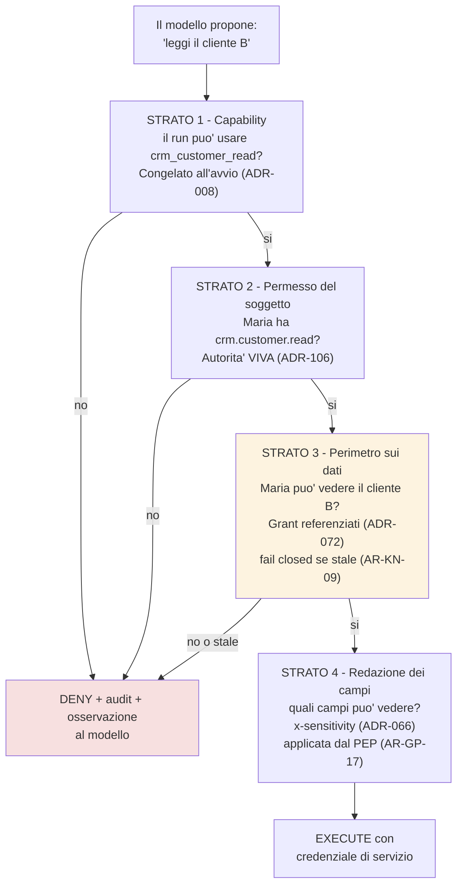
```mermaid
flowchart TD
    R["Il modello propone:<br/>'leggi il cliente B'"]

    D1["STRATO 1 - Capability<br/>il run puo' usare crm_customer_read?<br/>Congelato all'avvio (ADR-008)"]
    D2["STRATO 2 - Permesso del soggetto<br/>Maria ha crm.customer.read?<br/>Autorita' VIVA (ADR-106)"]
    D3["STRATO 3 - Perimetro sui dati<br/>Maria puo' vedere il cliente B?<br/>Grant referenziati (ADR-072)<br/>fail closed se stale (AR-KN-09)"]
    D4["STRATO 4 - Redazione dei campi<br/>quali campi puo' vedere?<br/>x-sensitivity (ADR-066)<br/>applicata dal PEP (AR-GP-17)"]

    EXEC["EXECUTE con<br/>credenziale di servizio"]
    DENY["DENY + audit + osservazione<br/>al modello"]

    R --> D1
    D1 -->|no| DENY
    D1 -->|si| D2
    D2 -->|no| DENY
    D2 -->|si| D3
    D3 -->|no o stale| DENY
    D3 -->|si| D4
    D4 --> EXEC

    style D3 fill:#fdf3e0
    style DENY fill:#f7e0e0
```

#### Come leggerlo

Quattro cancelli in serie: basta che uno dica no. Ma non sono equivalenti.

**Lo strato 3 è quello arancione, ed è il punto debole.** Gli strati 1, 2 e 4 dipendono solo
da dati **nostri**: capability nello snapshot, permessi nella nostra tabella, annotazioni
nello schema del tool. Lo strato 3 dipende da una **proiezione** delle ACL del CRM, che per
`ADR-072` è referenziata con un `synced_at` e per `AR-KN-09` va in fail closed quando
invecchia troppo.

Cioè: la difesa contro il confused deputy è forte quanto la freschezza della nostra copia
dei permessi del CRM. È il motivo per cui `R-24` (*proiezione ACL obsoleta → accesso non
autorizzato*) è già registrato in `A07` con impatto **Alto**, e `A09` non lo migliora: lo
**eredita e lo conferma**.

**Perché "fail closed" non è un dettaglio.** Se la proiezione è vecchia, la scelta è fra
negare un accesso legittimo e concedere un accesso revocato. `AR-KN-09` sceglie di negare.
`A09` conferma quella scelta e la estende alla mappatura delle identità (§15).

### 14.4 Cosa arriva al sistema esterno

Verso Odoo va **una sola identità**: l'utente tecnico del connector di quel tenant. Ma non
va **solo** quella.

**`AR-ID-17`.** Ogni chiamata a un sistema esterno porta con sé, dove il protocollo lo
consente, un marcatore di correlazione: `run_id`, `agent_id`, `subject_id`. Dove va messo
dipende dal protocollo (header HTTP personalizzato, campo note, campo `origin`).

**Perché.** Perché l'audit **nostro** ha entrambe le identità (`AR-GP-05`), ma l'audit
**loro** vedrebbe solo `agent_platform`. Senza un marcatore, quando il cliente ci chiede
"chi ha modificato questo record?" guardando i **suoi** log, la risposta è "il robot". Con il
marcatore, la risposta è "il robot, run `01J8…`", e quel `run_id` da noi risolve a Maria.
Costruiamo il ponte fra i due audit.

**Dove non è possibile** (per esempio SMTP, che non ha un posto ovvio), va dichiarato nel
`connector` come limite noto, non nascosto. **`RICHIEDE RICERCA`** su quali campi di Odoo
siano adatti a portare un marcatore senza inquinare i dati di dominio: **`B-48`**, dipende
da `Q-01`.

**`AR-ID-18`.** Il marcatore di correlazione **non è una credenziale e non è un'asserzione
di identità**. Il sistema esterno non deve fidarsene per autorizzare. È metadato per l'audit.
Se un sistema esterno cominciasse a usarlo per decidere, avremmo creato un canale di
elevazione di privilegi controllabile da noi ma non verificabile da loro.

### 14.5 L'evoluzione verso la catena 1

Non lascio la catena 1 come un'aspirazione vaga. Ecco il percorso concreto e il trigger.

| Fase | Cosa si fa |
|---|---|
| **Day-1** | catena 3, credenziale per (tenant, connector). Il `credential_ref` è già un puntatore che include il `tenant_id` |
| **Prepare** | il `Credential Broker` acquisisce un secondo modo di risolvere: `credential_ref = f(tenant, connector, subject_id)`. Nessun tool cambia, perché il tool riceve comunque un `AuthenticatedClient` |
| **Scale** | flusso di consenso OAuth per utente, storage dei refresh token per `(tenant, subject_id, connector)`, gestione della revoca lato provider |
| **Enterprise** | scambio di token (l'agent presenta la propria identità e ottiene un token ristretto per conto dell'utente), se e dove il protocollo lo supporta |

**Il fatto che il tool non cambi è il motivo per cui `ADR-056` è una buona decisione.**
Il contratto "il tool riceve un client già autenticato" rende la transizione dalla catena 3
alla catena 1 un cambiamento **interno al Broker**. Senza quella decisione di `A06`,
cambiare modello di delega significherebbe riscrivere ogni tool.

**Trigger: `T-ID-08`** — il primo tenant che richiede che le azioni compaiano nei propri log
con l'identità della persona, oppure il primo requisito di conformità che vieta l'utente
tecnico condiviso.

---

## 15. Come un'identità della piattaforma si mappa su un soggetto esterno

Questa sezione risponde al **mandato di `A07`**: `ADR-072` proietta le ACL delle sorgenti
esterne in `grant` con `synced_at` e fail closed sulla staleness, e ha bisogno di un
`acl_subject`. `A09` deve dire da dove viene.

### 15.1 Il problema

`A07` ha stabilito che i `grant` hanno la forma: *"il soggetto `acl_subject` ha accesso alla
risorsa `X` nella sorgente `S`, secondo quanto sapevamo alle `synced_at`"*. E `acl_subject`
è un identificatore **della sorgente**: `odoo:res.users:42`, oppure un gruppo:
`odoo:res.groups:sales`.

Ma il nostro `principal` non è `odoo:res.users:42`. È `subject_id = sub_7f3a…`. Serve un
ponte.

**Il modo sbagliato** è dedurlo dall'email: *"il nostro utente ha `maria.rossi@acme.it`,
cerchiamo l'utente Odoo con la stessa email"*. È sbagliato per le stesse quattro ragioni di
§6.3, con un'aggravante: qui l'errore non fa perdere una preferenza, fa **vedere dati di
un'altra persona**.

### 15.2 La decisione

**DECISIONE ARCHITETTURALE (`ADR-115`).** La mappatura è una **riga esplicita**, con la
stessa forma dei `grant` di `ADR-072`:

```text
EXTERNAL_IDENTITY_LINK:
    tenant_id:      uuid          # INV-02
    subject_id:     uuid          # il NOSTRO
    source:         text          # "odoo_prod"
    acl_subject:    text          # "odoo:res.users:42"
    link_method:    ADMIN | SCIM | CONFIRMED_BY_USER | DIRECTORY_SYNC
    synced_at:      timestamptz   # quando l'abbiamo verificata l'ultima volta
    verified_at:    timestamptz   # quando abbiamo confermato che esiste ancora
    status:         ACTIVE | STALE | BROKEN | REVOKED

    UNIQUE (tenant_id, source, acl_subject) WHERE status = 'ACTIVE'
    UNIQUE (tenant_id, source, subject_id)  WHERE status = 'ACTIVE'
```

**I due vincoli di unicità insieme impongono una corrispondenza uno-a-uno attiva**: una
persona nostra corrisponde a al massimo un utente Odoo, e un utente Odoo a al massimo una
persona nostra. Non è un dettaglio: senza il primo vincolo, due nostre persone potrebbero
mappare sullo stesso utente Odoo e condividere di fatto i permessi.

**`link_method` è registrato** perché non tutti i modi di creare il collegamento hanno la
stessa affidabilità:

| Metodo | Affidabilità | Quando si usa |
|---|---|---|
| `ADMIN` | alta (una persona ha verificato) | Day-1, pochi utenti |
| `SCIM` | alta (l'IdP è autoritativo) | enterprise, §25 |
| `CONFIRMED_BY_USER` | media (l'utente ha fatto login su entrambi e confermato) | scala meglio di `ADMIN` |
| `DIRECTORY_SYNC` | **dipende** | solo se la directory è la stessa dei due sistemi |

**Non esiste `EMAIL_MATCH`.** Non è un'omissione.

### 15.3 Staleness e fail closed

`AR-KN-09` dice: *proiezione dei grant più vecchia della soglia → retrieval fail closed su
quella sorgente*. `A09` estende la stessa regola alla **mappatura di identità**:

**`AR-ID-19`.** Se `EXTERNAL_IDENTITY_LINK.verified_at` è più vecchio della soglia di
freschezza della sorgente, o se `status != ACTIVE`, ogni autorizzazione che dipende da quella
mappatura **nega**. Non "avvisa": nega.

**Perché è più forte che sui grant.** Un grant obsoleto dà accesso a una risorsa sbagliata.
Una mappatura di identità obsoleta dà accesso all'**insieme intero di risorse di un'altra
persona** — per esempio se `res.users:42` in Odoo è stato cancellato e l'ID riusato per un
nuovo assunto. È l'errore più costoso che si possa fare in questa architettura.

**`RICHIEDE RICERCA`: `B-49`** — Odoo (o il CRM target) riusa gli ID di `res.users` dopo la
cancellazione? Se sì, `acl_subject` deve includere un discriminante ulteriore (per esempio
la data di creazione del record). Dipende da `Q-01`. **Se non lo verifichiamo, `ADR-115` ha
un buco.** Lo dichiaro come tale, non lo aggiro.

### 15.4 Cosa succede quando la mappatura non esiste

Caso frequente: Maria esiste da noi ma non ha un utente nel CRM (per esempio è
un'amministratrice della piattaforma di quel tenant, non una commerciale).

| Situazione | Comportamento |
|---|---|
| nessun link, e il run richiede accesso a dati di quella sorgente | **DENY**, ragione `external_identity_unmapped`. Non un errore tecnico: una negazione spiegabile |
| nessun link, ma il run non tocca quella sorgente | nessun problema |
| link `BROKEN` (l'utente esterno è stato cancellato) | **DENY**, ragione `external_identity_broken`, e allarme all'amministratore del tenant |
| run senza umano (`ServicePrincipal`) | il `ServicePrincipal` ha il proprio `EXTERNAL_IDENTITY_LINK` verso l'utente tecnico. **Stessa struttura, nessun caso speciale** |

L'ultima riga è importante: il `ServicePrincipal` usa **la stessa tabella**. Non c'è un
percorso "il servizio bypassa la mappatura". Se ci fosse, sarebbe la scorciatoia che prima o
poi qualcuno userebbe per un utente umano.

### 15.5 Il diagramma completo della catena di identità

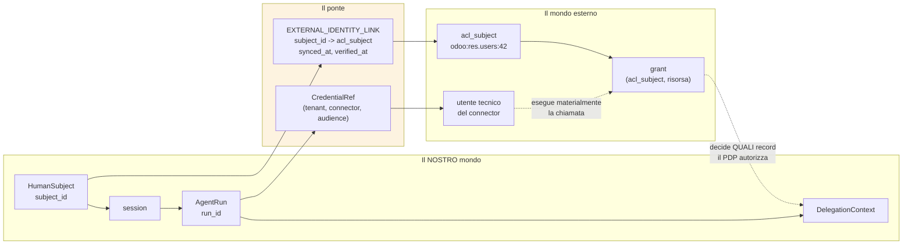
```mermaid
flowchart LR
    subgraph N["Il NOSTRO mondo"]
        H["HumanSubject<br/>subject_id"]
        S["session"]
        RUN["AgentRun<br/>run_id"]
        DEL["DelegationContext"]
    end

    subgraph B["Il ponte"]
        EIL["EXTERNAL_IDENTITY_LINK<br/>subject_id -> acl_subject<br/>synced_at, verified_at"]
        CR["CredentialRef<br/>(tenant, connector, audience)"]
    end

    subgraph E["Il mondo esterno"]
        AS["acl_subject<br/>odoo:res.users:42"]
        GR["grant<br/>(acl_subject, risorsa)"]
        TECH["utente tecnico<br/>del connector"]
    end

    H --> S --> RUN --> DEL
    H --> EIL --> AS --> GR
    RUN --> CR --> TECH

    GR -.->|"decide QUALI record<br/>il PDP autorizza"| DEL
    TECH -.->|"esegue materialmente<br/>la chiamata"| GR

    style B fill:#fdf3e0
```

#### Come leggerlo

Tre mondi. A sinistra il nostro, dove `subject_id` è re. A destra quello di Odoo, dove regna
`res.users:42`. Al centro, in arancione, il ponte — ed è arancione perché è la parte
**fragile**: dipende da dati che invecchiano.

**Le due frecce che partono dal run sono diverse e questa è la parte da capire.** La freccia
verso `CredentialRef` risponde a *con quale chiave apro la porta* — ed è sempre l'utente
tecnico. La freccia (indiretta, via `subject_id`) verso `acl_subject` e `grant` risponde a
*quali stanze ho il diritto di aprire* — e quella dipende da Maria.

La credenziale potrebbe aprire tutte le stanze. Il `grant` dice quali. **Le due cose non
coincidono, ed è esattamente il confused deputy**: la nostra architettura è corretta finché
il secondo insieme è più piccolo del primo e viene applicato prima. Se un giorno il codice
saltasse il controllo dei `grant`, la credenziale da sola aprirebbe tutto — silenziosamente.

Questo è il motivo per cui `AR-KN-02` (*il filtro di autorizzazione è nella query, mai solo
dopo*) è una regola così importante, e perché `A09` la estende in `AR-ID-20`.

---

## 16. Dove si applica l'autorizzazione: i punti di enforcement

Il prompt (§28) chiede dove si applica e insiste su *defense in depth*: più controlli, non
uno solo.

### 16.1 La mappa

| Punto | Cosa controlla | Può **concedere**? | Fonte |
|---|---|---|---|
| **1. Ingresso API** (`api`) | autenticazione, sessione viva, tenant risolto | no: solo lasciar passare | `A09` |
| **2. `resolve()`** (Control Plane) | l'agent esiste, è abilitato per questo tenant e ambiente | no | `A02`, `AR-CP-01` |
| **3. PEP → PDP** (ogni `AUTHORIZE`) | **la decisione vera** | **sì, è l'unico** | `A03`, `AR-013` |
| **4. Pre-filtro del retrieval, in query** | quali frammenti sono leggibili | **no**: può solo togliere | `A07`, `AR-KN-02` |
| **5. RLS di PostgreSQL** | `tenant_id` a livello di riga | no | `A01`, `A07` |
| **6. Post-verifica del retrieval** | scarta ciò che non doveva passare | no | `A07`, `ADR-071` |
| **7. Pre-filtro della memoria, in query** | quali memorie sono leggibili | no | `A08`, `AR-ME-05` |
| **8. Redazione dei campi** (PEP) | quali campi tornano al modello | no | `A03` `AR-GP-17`, `A06` `ADR-066` |
| **9. Il sistema esterno** | le sue regole di business | — | fuori dal nostro controllo |

**`AR-ID-20`.** Esiste **un solo punto che può concedere**: il PDP (punto 3). Tutti gli
altri possono solo **togliere**. Verifica: nessuna funzione al di fuori del PDP restituisce
un tipo che rappresenta un `ALLOW`; gli altri strati restituiscono filtri o insiemi ridotti.

Questa è la generalizzazione a tutta l'architettura di `AR-GP-09` e `ADR-025`, e rende
`defense in depth` una **proprietà verificabile** invece di un'aspirazione. Con nove punti
di controllo, se anche uno solo potesse concedere, il modello di sicurezza avrebbe nove
autorità invece di una.

### 16.2 Tool authorization

Il prompt (§29): *chi decide se un agent può invocare un tool? Il modello non deve decidere.*

La catena, già stabilita da `A06` e `A03`, che `A09` conferma e completa sul lato identità:

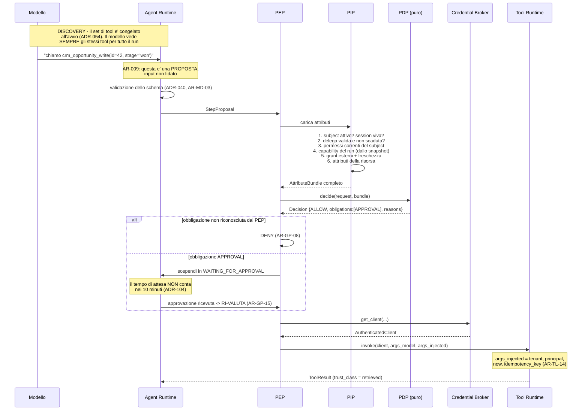
```mermaid
sequenceDiagram
    participant MOD as Modello
    participant W as Agent Runtime
    participant PEP as PEP
    participant PIP as PIP
    participant PDP as PDP (puro)
    participant CB as Credential Broker
    participant TR as Tool Runtime

    Note over MOD,W: DISCOVERY - il set di tool e' congelato<br/>all'avvio (ADR-054). Il modello vede<br/>SEMPRE gli stessi tool per tutto il run
    MOD->>W: "chiamo crm_opportunity_write(id=42, stage='won')"
    Note over W: AR-009: questa e' una PROPOSTA,<br/>input non fidato

    W->>W: validazione dello schema (ADR-040, AR-MD-03)
    W->>PEP: StepProposal

    PEP->>PIP: carica attributi
    PIP->>PIP: 1. subject attivo? session viva?<br/>2. delega valida e non scaduta?<br/>3. permessi correnti del subject<br/>4. capability del run (dallo snapshot)<br/>5. grant esterni + freschezza<br/>6. attributi della risorsa
    PIP-->>PEP: AttributeBundle completo
    PEP->>PDP: decide(request, bundle)
    PDP-->>PEP: Decision {ALLOW, obligations:[APPROVAL], reasons}

    alt obbligazione non riconosciuta dal PEP
        PEP->>PEP: DENY (AR-GP-08)
    else obbligazione APPROVAL
        PEP->>W: sospendi in WAITING_FOR_APPROVAL
        Note over W: il tempo di attesa NON conta<br/>nei 10 minuti (ADR-104)
        W->>PEP: approvazione ricevuta -> RI-VALUTA (AR-GP-15)
    end

    PEP->>CB: get_client(...)
    CB-->>PEP: AuthenticatedClient
    PEP->>TR: invoke(client, args_model, args_injected)
    Note over TR: args_injected = tenant, principal,<br/>now, idempotency_key (AR-TL-14)
    TR-->>W: ToolResult (trust_class = retrieved)
```

#### Come leggerlo

**Quattro punti chiave.**

1. **La discovery è congelata** (nota in alto). Il modello vede gli stessi tool per tutto il
   run, anche quelli che non potrà usare. Sembra controintuitivo — perché mostrargli tool
   che gli negheremo? — ma è `ADR-054`, e la ragione è il prefix caching: cambiare l'elenco
   dei tool a metà run invalida la parte cacheata del prompt. La restrizione avviene ad
   `AUTHORIZE`, non a presentazione.

2. **`args_injected` è separato da `args_model`.** Questo è `A06`, `AR-TL-14`, e sul piano
   dell'identità è **la difesa più importante di tutte**: il modello non può nominare il
   `principal`. Se potesse, un'iniezione nel prompt basterebbe a dire "agisci come
   l'amministratore".

3. **L'approvazione viene ri-valutata** (`AR-GP-15`). Non è che si approva e poi si esegue
   ciecamente: il PDP decide di nuovo al momento dell'esecuzione, e nel frattempo l'autorità
   viva (`ADR-106`) potrebbe essere cambiata. Se Maria è stata sospesa mentre il capo
   approvava, l'azione non parte.

4. **Il `ToolResult` torna con `trust_class = retrieved`** (`A06`, `INV-08`). Ciò che il CRM
   ci restituisce è **dato**, mai istruzione. Un campo note di un cliente che contiene
   "ignora le istruzioni precedenti" non ha nessun potere.

### 16.3 Data authorization

Il prompt (§30) chiede come si impedisce: *utente autorizzato → agent → retrieval → documento
non autorizzato*.

`A07` ha già la risposta a tre strati (`ADR-071`). `A09` aggiunge **cosa alimenta quei tre
strati sul piano dell'identità**:

| Strato | Meccanismo (`A07`) | Cosa `A09` fornisce |
|---|---|---|
| 1 — pre-filtro **in query**, autoritativo | la `RetrievalScope` prodotta dal PDP restringe la query | la `RetrievalScope` è costruita a partire dal `Principal` e dall'`acl_subject` risolto via `EXTERNAL_IDENTITY_LINK` |
| 2 — RLS di PostgreSQL | `tenant_id` a livello di riga | il `tenant_id` viene dall'identità risolta, mai da un claim (§9.3) |
| 3 — post-verifica | scarta ciò che non doveva passare | usa lo stesso `acl_subject`: se lo strato 1 e il 3 usassero fonti diverse, il 3 non sarebbe una verifica |

**`AR-ID-21`.** La `RetrievalScope` non è mai costruita a partire da un identificatore
fornito dal modello. È iniettata, come tutto il resto (`AR-TL-14`, `AR-ME-03`). Verifica: la
funzione che costruisce la `RetrievalScope` accetta un `Principal`, non una stringa.

**Il caso che il prompt teme**, reso concreto: Maria chiede all'agent "riassumimi i contratti
del cliente Bianchi". Il cliente Bianchi è seguito da un altro team, e Maria non lo vede. Il
retrieval **non trova niente**, perché il pre-filtro in query ha già escluso quei documenti
prima ancora della ricerca semantica. Il modello riceve zero frammenti e risponde che non ha
trovato nulla. **Non riceve un errore** — riceve un insieme vuoto. È voluto: un messaggio
"non sei autorizzato a vedere i documenti del cliente Bianchi" confermerebbe che quel cliente
esiste, che è già una fuga di informazione.

### 16.4 Memory authorization

Il prompt (§31) chiede chi può leggere memoria utente, di agent, di tenant, condivisa.

`A08` ha già deciso quasi tutto. Il quadro, con il contributo di `A09`:

| Scope | Chi legge | Stato Day-1 | Regola |
|---|---|---|---|
| `USER` | **solo** un run il cui `on_behalf_of.subject_id` è quel soggetto | Day-1 | `AR-ME-18` |
| `AGENT` | i run di quell'agent, in quel tenant | Day-1 | `A08` |
| `TENANT` | **in lettura** sì, **in scrittura no** | `ADR-100`: nessuna memoria condivisa Day-1 | — |
| condivisa fra utenti | **non esiste** | `ADR-100` | trigger `T-ME-05` |

**Il contributo di `A09` è uno solo, ma è quello che rende `AR-ME-18` applicabile:** la
definizione stabile di `subject_id` (§6) e la risoluzione degli alias dopo una fusione
(`AR-ID-08`). Senza, `AR-ME-18` confronta due identificatori che possono non coincidere pur
riferendosi alla stessa persona.

**`INV-12` resta intatto e va ricordato qui:** nessuna funzione del PDP, del PIP o del PEP
legge la tabella `memory`. Quindi **la memoria non può concedere permessi**. Il prompt (§74)
lo chiede esplicitamente: *"Do not allow MEMORY to become AUTHORITY"*. `A08` lo ha già reso
strutturale; `A09` non aggiunge niente perché non serve niente.

**Un caso nuovo che `A09` deve però chiudere.** Se un run ha `on_behalf_of` = un
`ServicePrincipal`, quali memorie `USER` legge? **Nessuna.** Un `ServicePrincipal` non ha
memorie `USER`, e non può leggere quelle di altri. Verifica per test adversariale, insieme
a quelli già previsti da `A08`.

---

## 17. Identità dei processi: service identity, workload identity, deployment locale

### 17.1 Le identità di servizio

Il prompt (§16) è netto: *"Do not use one universal platform credential."*

I processi che esistono in questa architettura (da `ADR-001`: single artifact, ruoli `api`,
`worker`, `scheduler`, più l'inference server separato di `ADR-038` e l'`EmbeddingProvider`
su CPU di `ADR-068`):

| `ServicePrincipal` | Ruolo | Cosa deve poter fare | Cosa **non** deve poter fare |
|---|---|---|---|
| `svc_api` | `api` | leggere il Control Plane; scrivere `run`, `delegation_context`, `session`; leggere identità | **chiamare il modello** (`AR-003`); scrivere il Control Plane (`AR-006`/`AR-008`); leggere i segreti |
| `svc_worker` | `worker` | leggere il Control Plane; scrivere `run_step`, audit; leggere/scrivere memoria; leggere i segreti **via Broker** | scrivere il Control Plane; scrivere `session`; creare deleghe |
| `svc_scheduler` | `scheduler` | accodare run periodici; avviare rotazioni | eseguire tool; leggere dati di dominio |
| `svc_ingestion` | dentro `worker` | scrivere `document`, `chunk`, `embedding`; leggere le sorgenti documentali | leggere `memory`; eseguire `SIDE_EFFECT` |
| `svc_inference` | inference server | ricevere richieste sul loopback | **nessun accesso al database**; nessuna rete uscente (`ADR-046`, `AR-MD-08`) |
| `svc_embedding` | Embedding Provider | ricevere richieste sul loopback | nessun accesso al database (`AR-KN-18`: nessun embedding esce da un'API) |

**DECISIONE ARCHITETTURALE (`ADR-116`).** Il least privilege dei servizi si applica **a
livello di database**, con ruoli PostgreSQL distinti e privilegi per tabella, non con
controlli applicativi.

**Perché.** `AR-CP-05` lo impone già per la separazione Control Plane / Execution Plane:
*applicata a livello di database, non solo nel codice*. `A09` generalizza lo stesso
principio a tutti i servizi. La ragione è semplice: un controllo applicativo si aggira con
un bug; un `GRANT` mancante no. Se `svc_api` non ha `INSERT` su `run_step`, nessun bug in
`api` scriverà mai uno step.

**Contro-argomento onesto.** Ruoli di database distinti significano una migrazione da
mantenere, permessi da tenere allineati allo schema, e un errore in più da diagnosticare
("perché non scrive? — perché non ha il grant"). Con un team piccolo è attrito reale. Lo
accetto perché è l'unico modo per rendere `AR-CP-05` vera, e perché il costo si paga una
volta (nella migrazione dei permessi) mentre il beneficio è permanente. Ma va detto: se
questi ruoli non vengono mantenuti allineati, degradano in fretta a "tutti hanno tutto", e
allora meglio non averli affatto che averli come teatro. **Requisito Day-1: un test in CI
che verifica che ogni ruolo abbia esattamente i grant dichiarati.**

### 17.2 Machine-to-machine: come si autenticano i processi fra loro

Il prompt (§46) elenca i canali e chiede di ricercare prima di scegliere.

| Canale | Come | Perché |
|---|---|---|
| `worker` → `api` | **non esiste** | `AR-002`: comunicano **solo** tramite il database. Non c'è un canale da autenticare |
| `api`/`worker` → PostgreSQL | **credenziale di ruolo PostgreSQL**, distinta per servizio | è il meccanismo nativo, e porta con sé i privilegi (§17.1) |
| `worker` → inference server | **secret condiviso su loopback** | `AS-06` di `A05`: *l'inference gira sulla stessa macchina fidata → un secret condiviso basta*. Se `AS-06` cade, serve mTLS |
| `worker` → Embedding Provider | idem | `ADR-068`: processo separato su loopback |
| `worker` → Control Plane | **non è un canale**: è una lettura dal database | `ADR-011`: Control Plane embedded |
| `worker` → sistemi esterni | **credenziale del connector**, via Broker (§13) | `AR-GP-03` |

**La cosa notevole è quanto pochi canali ci sono.** Quattro dei sei non esistono come
canali di rete, per decisioni prese in `A01` e `A02`. Questo non è un caso: `AR-002`
(comunicazione solo via database) e `ADR-011` (Control Plane embedded) hanno come effetto
collaterale che **non c'è quasi niente da autenticare fra i processi**. È un ottimo esempio
di come una decisione di decomposizione riduca la superficie di sicurezza.

**`AS-06` è la dipendenza da tenere d'occhio.** È marcata "Alta" confidenza nello stato
canonico ma con una nota: *se falsa, serve mTLS*. `A09` conferma la valutazione e aggiunge
il trigger: **`T-ID-09`** — il primo deployment in cui l'inference server non è sulla stessa
macchina, o in cui la macchina ospita processi non nostri.

### 17.3 Workload identity: perché no, Day-1

Il prompt (§17) chiede di ricercare gli approcci e di evitare di inventarne uno.

**FATTO** (dal `research-log`, `R-07`): il concept paper NCCoE del NIST di febbraio 2026
propone un progetto dimostrativo su AI agent identity e authorization basato su **OAuth 2.0
+ SPIFFE/SPIRE + MCP**, con la pratica raccomandata di trattare ogni agent come *non-human
identity distinta*, con owner definito, tipo di credenziale documentato, schedule di
rotazione e scope autorizzato.

**INFERENZA.** La raccomandazione sulla *non-human identity distinta* è **già soddisfatta**
dalla nostra architettura: `AgentIdentity` esiste, ha un owner (l'`AgentVersion` nel Control
Plane), i tipi di credenziale sono documentati (§13), la rotazione è progettata (§13.5), e
lo scope è il capability set. La parte **SPIFFE/SPIRE** riguarda invece l'attestazione
dell'identità dei *workload* in un ambiente distribuito.

**DECISIONE ARCHITETTURALE (`ADR-117`).** Nessun SPIFFE/SPIRE Day-1. Questo **conferma
`D-04`** (debito architetturale già registrato: *nessun SPIFFE/SPIRE per identità di
servizio*), il cui trigger è già *deployment multi-nodo con più servizi che si autenticano
fra loro*. `A09` non crea un debito nuovo: ne conferma uno esistente e ne motiva la
conferma.

**Perché.** SPIFFE/SPIRE risolve il problema "come fa un processo a dimostrare chi è, senza
un segreto pre-condiviso, in un ambiente dove i processi nascono e muoiono". Su **una
macchina** con **tre ruoli** che partono da un artefatto solo e comunicano via database, quel
problema non esiste: l'identità di un processo è la credenziale di database con cui si
connette.

**FATTO mancante:** `B-07` nel backlog di ricerca chiede esattamente *"SPIFFE/SPIRE: costo
operativo reale per un deployment single-node"*, ed è assegnato a `A/09`. **Non l'ho
chiuso**, perché l'incarico vieta la ricerca esterna. La decisione di non adottarlo regge
comunque, perché non si basa sul costo di SPIRE ma sull'**assenza del problema**. `B-07`
resta aperto e diventa rilevante solo quando scatta il trigger di `D-04`.

### 17.4 Deployment locale: perché i confini non spariscono

Il prompt (§47) è esplicito: *"Do NOT assume network boundaries disappear. Avoid creating a
false sense of security because everything runs locally."*

Ha ragione, e la tentazione è forte: se tutto gira su una macchina, perché autenticare?

| Cosa si sarebbe tentati di saltare | Perché non si salta |
|---|---|
| credenziali di database distinte per ruolo | perché il confine che conta non è la rete, è il **processo**: una vulnerabilità in `api` non deve poter scrivere step |
| il secret condiviso verso l'inference server | perché sulla stessa macchina possono girare altri processi. Se un domani ci gira un container di un cliente, il loopback non è più privato |
| la validazione della sessione | perché la richiesta arriva comunque da fuori |
| l'audit degli accessi ai segreti | perché serve a ricostruire un incidente, e gli incidenti non rispettano i confini di rete |

**`AR-ID-22`.** Nessun controllo di identità o autorizzazione viene saltato in funzione del
fatto che il chiamante sia locale. Non esiste una variabile di configurazione tipo
`skip_auth_for_localhost`. Verifica: ricerca statica per pattern del genere, in CI.

**Il caso in cui si è tentati di più è lo sviluppo.** Un ambiente di sviluppo in cui
l'autenticazione è disattivata è un ambiente che, prima o poi, viene esposto per sbaglio.
**La soluzione corretta** è che lo sviluppo usi le stesse identità con dati finti, non
nessuna identità. Costa un'ora di setup e toglie una classe intera di incidenti.

### 17.5 Zero trust: quali principi contano davvero qui

Il prompt (§48) chiede di non applicare ciecamente terminologia da cloud a un deployment su
una macchina. Concordo, e faccio la selezione.

| Principio zero trust | Vale Day-1? | Come si concretizza da noi |
|---|---|---|
| **Nessuna fiducia implicita per posizione di rete** | **sì** | §17.4: il localhost non è una credenziale |
| **Verifica esplicita a ogni richiesta** | **sì** | `ADR-106`: l'autorità è viva, verificata a ogni `AUTHORIZE` |
| **Least privilege** | **sì** | §17.1: ruoli di database distinti; §7: intersezione |
| **Presunzione di violazione** | **sì** | audit append-only (`INV-05`), `credential_ref` sempre registrato, blast radius limitato dall'audience (`AR-ID-13`) |
| **Micro-segmentazione di rete** | **no** | una macchina, tre ruoli dello stesso artefatto. Sarebbe teatro |
| **Identità di workload attestata crittograficamente** | **no** | `ADR-117` |
| **Accesso condizionale basato su postura del dispositivo** | **no** | non abbiamo dispositivi gestiti; sarebbe un requisito del cliente |
| **Terminazione continua delle sessioni per rischio** | **no** | serve telemetria di rischio che non abbiamo |

**Il punto onesto:** quattro principi su otto valgono, e sono quelli **architetturali**. Gli
altri quattro sono **infrastrutturali** e richiedono un'infrastruttura che non abbiamo e non
ci serve. Dire "facciamo zero trust" senza questa distinzione sarebbe la frase vuota che il
prompt e la convenzione (§30: *evitare linguaggio vago*) vietano.

---

## 18. Multi-tenancy e la separazione fra amministratore di piattaforma e di tenant

### 18.1 Cinque livelli di autorità, non due

Il prompt (§45) chiede di distinguere esplicitamente `Platform Administrator`, `Tenant
Administrator`, `User`, `Agent`, `Service Identity`.

| Livello | Ambito | Può fare | **Non** può fare |
|---|---|---|---|
| **Platform Operator** | tutta l'installazione, **fuori** dai tenant | creare/sospendere tenant; gestire modelli, versioni, binding globali; aggiornare; gestire la chiave master dei segreti | **leggere i dati di un tenant**: né CRM, né memorie, né documenti, né contenuto dell'audit di dominio |
| **Tenant Admin** | un tenant | gestire persone e ruoli; configurare agent e tool; gestire connector e credenziali del tenant; leggere l'audit del proprio tenant | uscire dal tenant; toccare la configurazione di piattaforma |
| **User** | sé stesso, dentro un tenant | avviare run; leggere e correggere le proprie memorie; approvare se la policy lo prevede | gestire altri; cambiare policy |
| **Agent** (come `AgentRun`) | un run | ciò che l'intersezione permette (§7) | avere permessi propri fuori dal run |
| **Service Identity** | un ruolo di processo | ciò che i grant di database permettono | tutto il resto, per costruzione |

### 18.2 La separazione più delicata: il Platform Operator non legge i dati

**DECISIONE ARCHITETTURALE (`ADR-118`).** Il `PlatformOperator` **non ha accesso in lettura
ai dati applicativi dei tenant**. Non è un `superuser` con un flag: è un principal di tipo
diverso, con un percorso di autorizzazione separato, e le sue query passano per le stesse
policy RLS che escludono i tenant altrui.

**Perché.** Perché "l'amministratore vede tutto" è la scorciatoia che rende inutile ogni
altra protezione. Il prompt (§45) chiede di distinguere i due ruoli; distinguerli sulla carta
e poi dare al platform admin un accesso illimitato al database è distinguerli solo nel nome.

**Il problema pratico, dichiarato onestamente.** Su una macchina sola, il `PlatformOperator`
è anche la persona che ha accesso `root` alla macchina, e quindi al database e alla chiave
master dei segreti. **Questa decisione non lo impedisce tecnicamente.** Quello che fa è:

1. rendere l'accesso ai dati **un atto esplicito e anomalo**, invece che routine;
2. garantire che ogni accesso via applicazione sia **auditato**;
3. far sì che un accesso via database diretto **non lasci traccia applicativa**, e quindi sia
   rilevabile come anomalia (l'audit ha un buco dove ci si aspetta una riga).

**Non è una difesa crittografica.** È una difesa **procedurale e di rilevabilità**. La difesa
vera sarebbe la cifratura per tenant con chiavi che l'operatore non possiede — che è
esattamente ciò che `A08` ha rimandato al futuro sotto il nome di *crypto-shredding*, e che
`A14` dovrà valutare. Lo registro come limite: **`R-48`**, e come voce di backlog **`B-50`**
(`RICHIEDE RICERCA`: quali approcci di cifratura per-tenant sono praticabili senza gestione
di chiavi da parte del cliente).

**Contro-argomento onesto.** Il supporto tecnico ha bisogno di guardare i dati per aiutare un
cliente in difficoltà. Se il platform operator non può, come si fa? La risposta è
l'**elevazione dichiarata** di §20: un accesso temporaneo, con motivo, con scadenza, con
notifica al tenant, e con audit. Non un accesso permanente. Questo aggiunge attrito al
supporto, ed è un costo reale di prodotto che va dichiarato al committente, non nascosto in
un documento tecnico.

### 18.3 Cross-tenant: mai, tranne un caso

**`AR-GP-18` è già la regola**: la verifica del tenant è la prima del PDP e non è
sovrascrivibile. `A09` aggiunge solo la conseguenza sull'identità:

**`AR-ID-23`.** Un `subject_id` appartiene a **un solo** tenant. Una persona che lavora per
due tenant ha **due** `subject_id`, due insiemi di memorie, due storie di audit. Non esiste
un'identità che attraversa i tenant.

**Il caso scomodo:** il consulente che lavora per Acme e per Beta. Da noi è due persone.
Nell'interfaccia dovrà scegliere con quale identità sta lavorando, come si sceglie
un'organizzazione in molti strumenti. È attrito, ma l'alternativa — un'identità condivisa fra
tenant — creerebbe un ponte permanente fra due isolamenti, e sarebbe il primo posto dove
cercare per fare tenant breakout.

**L'unica eccezione:** il `PlatformOperator`, che per definizione sta fuori dai tenant e non
accede ai loro dati (§18.2). Non è un'eccezione all'isolamento: è un soggetto che vive in un
piano diverso.

### 18.4 Il diagramma dell'isolamento

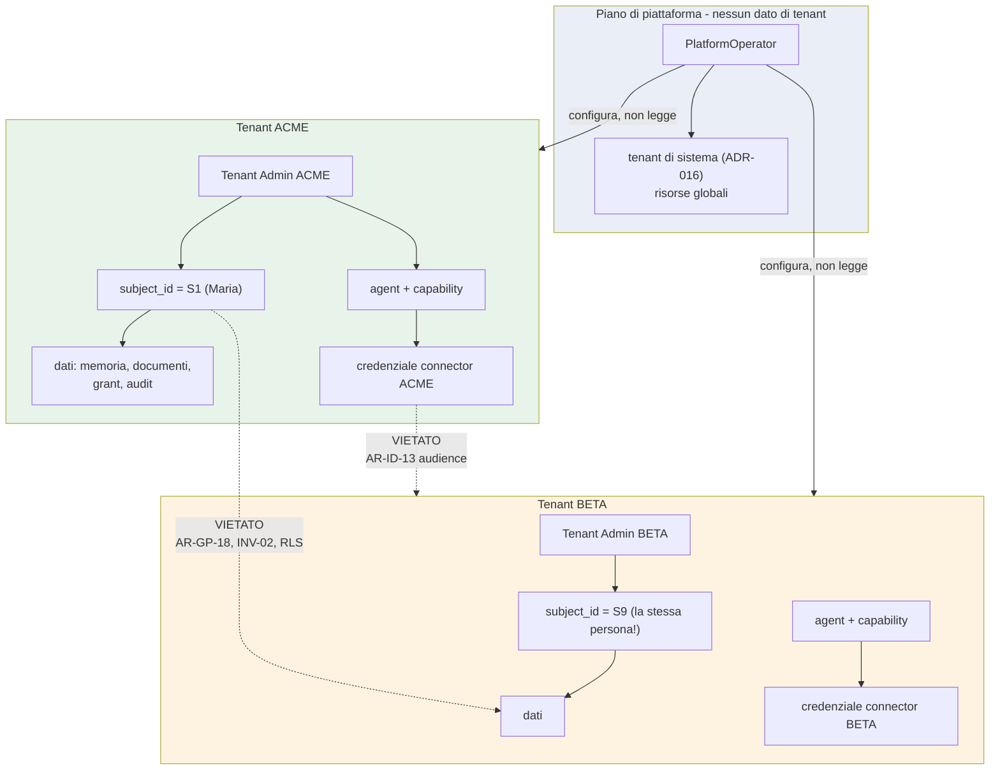
```mermaid
flowchart TB
    subgraph PLAT["Piano di piattaforma - nessun dato di tenant"]
        PO["PlatformOperator"]
        SYS["tenant di sistema (ADR-016)<br/>risorse globali"]
    end

    subgraph T1["Tenant ACME"]
        A1["Tenant Admin ACME"]
        U1["subject_id = S1 (Maria)"]
        AG1["agent + capability"]
        D1["dati: memoria, documenti,<br/>grant, audit"]
        C1["credenziale connector ACME"]
    end

    subgraph T2["Tenant BETA"]
        A2["Tenant Admin BETA"]
        U2["subject_id = S9 (la stessa persona!)"]
        AG2["agent + capability"]
        D2["dati"]
        C2["credenziale connector BETA"]
    end

    PO -->|"configura, non legge"| T1
    PO -->|"configura, non legge"| T2
    PO --> SYS
    A1 --> U1
    A1 --> AG1
    U1 --> D1
    AG1 --> C1
    A2 --> U2
    U2 --> D2
    AG2 --> C2

    U1 -.->|"VIETATO<br/>AR-GP-18, INV-02, RLS"| D2
    C1 -.->|"VIETATO<br/>AR-ID-13 audience"| T2

    style PLAT fill:#eaeef7
    style T1 fill:#e8f4ea
    style T2 fill:#fdf3e0
```

#### Come leggerlo

**Le due frecce tratteggiate sono le due vie di fuga possibili, ed entrambe hanno un nome.**

La prima è l'accesso ai dati di un altro tenant: bloccata da tre cose insieme (`AR-GP-18`
nella policy, `INV-02` nelle query, RLS nel database). Tre strati per la stessa cosa non è
ridondanza inutile: è l'unica proprietà su cui l'architettura non può permettersi un singolo
punto di guasto.

La seconda è più sottile: **una credenziale di un tenant usata verso un altro**. Se il
`Credential Broker` risolvesse il `credential_ref` senza controllare il `tenant_id`, un bug
di scope farebbe scrivere sul CRM del cliente sbagliato. È bloccata da `AR-ID-13`
(l'audience) e dal fatto che `CredentialRef` **include** il `tenant_id` come campo, non come
parametro opzionale.

**Nota che la stessa persona fisica compare due volte**, con `subject_id` diversi. È
`AR-ID-23` reso visibile.

---

## 19. L'approvazione umana come atto di identità

`A03` ha già deciso quasi tutto sull'approvazione: `ADR-023` (approvazione su ogni
`SIDE_EFFECT` Day-1), `AR-GP-12` (chi approva ≠ chi ha avviato, quando la policy lo
richiede), `AR-GP-13` (l'approvazione è per **azione**, mai per run), `AR-GP-14` (scade),
`AR-GP-15` (è ri-verificata dal PDP al momento dell'esecuzione).

Quello che manca, e che è compito di `A09`, è il lato **identità**: chi è l'approvatore, e
come si impedisce che un'approvazione venga riusata.

Il prompt (§33) è netto: *"Approval must not be confused with authentication."*

### 19.1 L'approvazione è un terzo tipo di atto

| Atto | Risponde a | Chi lo fa | Prova |
|---|---|---|---|
| **autenticazione** | sei tu? | il soggetto stesso | credenziale |
| **autorizzazione** | puoi? | il PDP | policy + attributi |
| **approvazione** | **vuoi assumertene la responsabilità?** | un **terzo** soggetto autenticato e autorizzato ad approvare | il record di approvazione |

L'approvazione **non sostituisce** né l'una né l'altra: l'approvatore deve essere
autenticato (altrimenti chiunque approva) **e** autorizzato ad approvare quella classe di
azioni (altrimenti chiunque approva qualsiasi cosa).

### 19.2 Il record di approvazione

```text
Approval:
    approval_id:      uuid
    tenant_id:        uuid
    run_id:           uuid
    step_index:       int              # AR-GP-13: per AZIONE, non per run
    action_binding:   text             # hash canonico dell'azione: §19.3
    approver:         SubjectRef       # chi ha approvato
    approver_auth:    { auth_time, auth_strength }   # come si era autenticato
    decision:         GRANTED | DENIED
    reason:           text
    decided_at:       timestamptz
    expires_at:       timestamptz      # AR-GP-14
    consumed_at:      timestamptz?     # replay protection: §19.4
```

### 19.3 `action_binding`: perché l'approvazione è legata a *quell'* azione

Il prompt (§33) chiede *approval binding* e *replay protection*. Ecco il problema che
risolvono.

Immagina: il modello propone "manda una mail a `cliente@esempio.it` con oggetto X". Il capo
approva. Poi, prima dell'esecuzione, qualcosa cambia gli argomenti — un bug, un retry mal
fatto, o un'iniezione — e la mail parte verso mille destinatari. **L'approvazione c'era**, ma
non era per quello.

**`AR-ID-24`.** Un'approvazione è legata a un `action_binding` = hash canonico di
`(tool_id, tool_version_id, args_model, args_injected, resource_ref)`. Al momento
dell'esecuzione, il PEP **ricalcola** l'hash e lo confronta. Se differisce anche di un
carattere, l'approvazione **non vale** e l'azione viene ri-sottoposta.

Questo rende `AR-GP-15` (ri-verifica dal PDP) davvero efficace: non basta ri-valutare la
policy, bisogna verificare che l'azione sia **la stessa**.

**Attenzione all'`args_injected` nell'hash.** Include l'`idempotency_key`, che per `INV-06`
deriva da `(run_id, step_index)` — quindi è stabile fra retry dello stesso passo
(`AR-RT-05`). Include anche `now`, che **non** è stabile: quindi `now` va **escluso**
dall'hash. È un dettaglio implementativo, ma sbagliarlo significa che nessuna approvazione
funziona mai. Lo scrivo perché è il tipo di cosa che costa un pomeriggio a chi implementa.

### 19.4 Replay protection

`consumed_at` è nullo finché l'approvazione non viene usata. Al momento dell'uso, il PEP la
marca **nella stessa transazione** in cui registra lo step (riuso di `AR-GP-16`: consumo del
budget e registrazione dello step sono atomici).

**`AR-ID-25`.** Un'approvazione si consuma **una sola volta**, atomicamente con lo step che
la usa. Un retry dello stesso `step_index` la riusa (stesso `action_binding`, stessa
`idempotency_key`), un passo diverso no.

Questa formulazione è delicata e la spiego. `AR-RT-05` dice che un retry riusa lo stesso
`step_index`. Quindi il retry di un'azione approvata **non deve** richiedere una nuova
approvazione — sarebbe insopportabile per l'utente. Ma un'azione **diversa** con lo stesso
tool sì. Il discriminante è la coppia `(step_index, action_binding)`, non uno dei due da
solo.

### 19.5 Il flusso

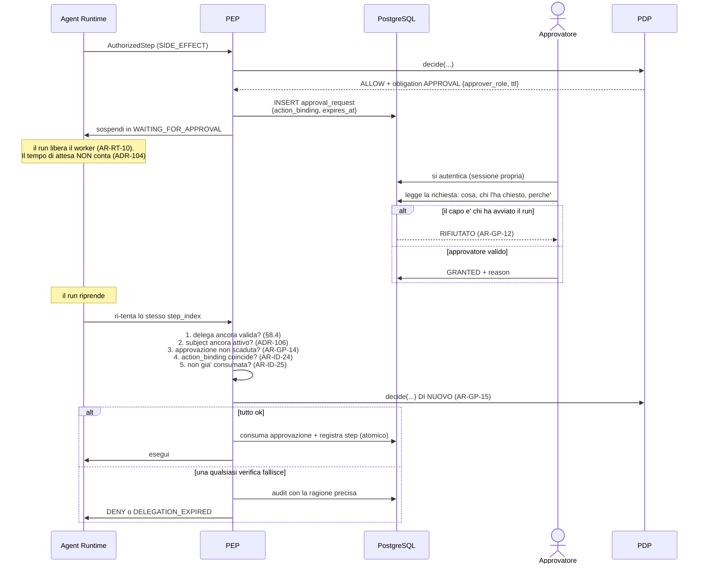
```mermaid
sequenceDiagram
    participant W as Agent Runtime
    participant PEP as PEP
    participant DB as PostgreSQL
    actor CAPO as Approvatore
    participant PDP as PDP

    W->>PEP: AuthorizedStep (SIDE_EFFECT)
    PEP->>PDP: decide(...)
    PDP-->>PEP: ALLOW + obligation APPROVAL {approver_role, ttl}
    PEP->>DB: INSERT approval_request<br/>{action_binding, expires_at}
    PEP->>W: sospendi in WAITING_FOR_APPROVAL
    Note over W: il run libera il worker (AR-RT-10).<br/>Il tempo di attesa NON conta (ADR-104)

    CAPO->>DB: si autentica (sessione propria)
    CAPO->>DB: legge la richiesta: cosa, chi l'ha chiesto, perche'
    alt il capo e' chi ha avviato il run
        DB-->>CAPO: RIFIUTATO (AR-GP-12)
    else approvatore valido
        CAPO->>DB: GRANTED + reason
    end

    Note over W: il run riprende
    W->>PEP: ri-tenta lo stesso step_index
    PEP->>PEP: 1. delega ancora valida? (§8.4)<br/>2. subject ancora attivo? (ADR-106)<br/>3. approvazione non scaduta? (AR-GP-14)<br/>4. action_binding coincide? (AR-ID-24)<br/>5. non gia' consumata? (AR-ID-25)
    PEP->>PDP: decide(...) DI NUOVO (AR-GP-15)
    alt tutto ok
        PEP->>DB: consuma approvazione + registra step (atomico)
        PEP->>W: esegui
    else una qualsiasi verifica fallisce
        PEP->>DB: audit con la ragione precisa
        PEP->>W: DENY o DELEGATION_EXPIRED
    end
```

#### Come leggerlo

**Cinque controlli alla ripresa, non uno.** È la parte che conta. Un'approvazione concessa
ieri non è un lasciapassare: alla ripresa si verifica che la delega sia viva, che la persona
esista ancora, che l'approvazione non sia scaduta, che l'azione sia la stessa, e che
l'approvazione non sia già stata usata. Poi si ri-valuta comunque la policy.

**Il ramo `RIFIUTATO` in mezzo è `AR-GP-12`.** Chi ha avviato non può approvare sé stesso,
quando la policy lo richiede. È la separazione dei compiti applicata a un agent: senza,
l'approvazione umana diventa un clic su un pulsante da parte della stessa persona che ha
chiesto l'azione, cioè teatro.

**La nota `il run libera il worker`** è `AR-RT-10` di `A04` e ha una conseguenza di
identità: la delega deve sopravvivere alla sospensione, e per farlo deve stare nel database
(§8.3). Se fosse in memoria, morirebbe col worker.

---

## 20. Operazioni privilegiate e break-glass

### 20.1 Cosa è "privilegiato"

Il prompt (§34) elenca dei candidati. La regola per classificarli esiste già: `AR-TL-02`
(*la `risk_class` deriva dal comportamento reale, non dall'intenzione*) e `ADR-059` (8 tipi
di `side_effects`).

**`A09` non crea una tassonomia parallela.** Aggiunge solo il criterio di identità: quali
azioni richiedono una **prova di identità più forte** (step-up) o un **approvatore
diverso**.

| Classe di azione | Controllo aggiuntivo di identità |
|---|---|
| cancellazione di record | approvatore diverso (`AR-GP-12`) |
| operazioni finanziarie (rimborsi) | approvatore diverso + `auth_strength = MFA` recente |
| **modifica dei permessi** | approvatore diverso + `auth_strength = STEP_UP` (ri-autenticazione appena fatta) |
| **gestione delle credenziali** | solo `TenantAdmin` o `PlatformOperator`, mai un agent, mai un run |
| export in blocco | approvatore diverso + notifica al `TenantAdmin` |
| comunicazione verso l'esterno (email) | approvazione, come ogni `SIDE_EFFECT` (`ADR-023`) |
| esecuzione di codice | **non esiste** (`AR-TL-05`: nessun argomento di tool può essere un programma) |

**`AR-ID-26`.** Nessun `AgentRun` può modificare permessi, ruoli, policy o credenziali. Non
è una policy configurabile: è l'assenza dei tool corrispondenti e il divieto per il ruolo di
database `svc_worker` di scrivere su quelle tabelle (§17.1). Verifica: doppia — nessun tool
nel registro con quelle capability, e nessun `GRANT` di scrittura.

**Perché così duro.** Perché un agent che può cambiare permessi può concedersi permessi. È
la forma più diretta di privilege escalation, e la difesa giusta non è una regola ma
l'**inesistenza del meccanismo**. È lo stesso ragionamento di `INV-12` (il PDP non legge la
memoria): togliere la possibilità, non regolarla.

### 20.2 Break-glass: cosa **non** costruiamo

Il prompt (§35): *"Do not implement unless justified."* E `A03` ha già una regola nettissima:
`AR-GP-23` — **non esiste accesso di emergenza che salti il PDP**.

**DECISIONE ARCHITETTURALE (`ADR-119`).** Non esiste break-glass inteso come *bypass*.
Esiste **elevazione dichiarata**, che è una cosa diversa e passa dal PDP come tutto il resto.

| | **Break-glass classico** (respinto) | **Elevazione dichiarata** (scelta) |
|---|---|---|
| Meccanismo | una credenziale o un flag che salta i controlli | un `RoleAssignment` temporaneo con `valid_until` |
| Chi decide | chi ha la credenziale | il PDP, come sempre |
| Audit | spesso fuori dal percorso normale | **nel percorso normale**: è una decisione come le altre |
| Revoca | manuale | automatica alla scadenza |
| Rischio | la credenziale di emergenza diventa la credenziale di tutti i giorni | nessuno: non c'è niente da rubare che non sia già una riga revocabile |

**Come funziona in pratica.** Il `TenantAdmin` (o il `PlatformOperator`, per il supporto)
crea un `ROLE_ASSIGNMENT` con:

- un ruolo specifico (`support_readonly`, non "tutto");
- `valid_from` = adesso, `valid_until` = adesso + durata **breve e obbligatoria**;
- `reason` **obbligatorio**, testuale;
- notifica immediata al `TenantAdmin` del tenant coinvolto;
- evento di audit `privilege_elevated`, di categoria distinta perché deve essere facile da
  cercare.

Poi tutto procede normalmente: il PIP legge i ruoli correnti (`ADR-106`: autorità viva),
trova quello temporaneo, e il PDP decide. **Alla scadenza sparisce da solo**, senza che
nessuno debba ricordarsene.

**Perché questo è meglio di un break-glass vero.** Perché il break-glass classico ha un
difetto fatale: è un percorso di codice che viene usato **quasi mai**, quindi **non viene
mai testato**, quindi il giorno che serve non funziona — o funziona troppo bene. L'elevazione
dichiarata usa **lo stesso percorso di tutti i giorni**, che è testato ogni giorno.

**Contro-argomento onesto.** Un vero break-glass serve quando il sistema di autorizzazione
**stesso** è rotto: se il PDP non risponde, l'elevazione dichiarata non aiuta perché passa
comunque dal PDP. `A03` ha già affrontato questo con `ADR-022` (`INDETERMINATE` ≠ `DENY`
terminale, il run è retryable) e `AR-GP-22` (il kill switch di emergenza **non passa dal
database**). Quindi la risposta al "PDP rotto" non è "entra lo stesso", è "**fermati e
chiama un umano**". È una scelta di sicurezza sopra la disponibilità, e va detto: **in un
guasto grave, il sistema si ferma**. Se il committente non accetta questo, va discusso ora,
non dopo il primo incidente.

---

## 21. Revoca: sei tipi, e quanto tempo ci mettono

Il prompt (§41) elenca sei revoche e chiede la propagazione. È la sezione dove le decisioni
di §10 e §12 pagano.

| Revoca | Meccanismo | Effetto sui run in corso | Latenza |
|---|---|---|---|
| **sessione revocata** | `session.revoked_at = now` | i run nati da quella sessione si fermano al prossimo `AUTHORIZE` | **un passo** |
| **utente disabilitato** | `SUBJECT_STATUS = SUSPENDED` | tutti i suoi run si fermano al prossimo `AUTHORIZE`; tutte le sessioni revocate | **un passo** |
| **tenant disabilitato** | `TENANT.status = SUSPENDED` | tutti i run del tenant si fermano | **un passo** |
| **agent disabilitato** | binding rimosso nel Control Plane | i run **già avviati continuano** (lo snapshot è congelato); nessun run nuovo parte | **fino a fine run** (≤ 10 min attivi) |
| **tool revocato** | binding rimosso / capability tolta | i run già avviati **continuano ad avere il tool nel prompt**, ma l'`AUTHORIZE` nega | **un passo** per l'effetto, ma il tool resta visibile al modello |
| **credenziale revocata** | `revoke_secret()` | il prossimo `EXECUTE` su quel connector fallisce | **immediata** |

**Due righe meritano attenzione.**

**"agent disabilitato" ha latenza fino a fine run.** È la conseguenza diretta di `ADR-106`:
il capability set è un **tetto congelato**, e disabilitare l'agent lo toglie per i run futuri,
non per quelli in corso. È accettabile perché disabilitare un agent è un'operazione di
configurazione, non una risposta a un incidente. **Se serve fermare subito**, lo strumento
giusto è un altro: il kill switch di `AR-GP-22`, che non passa dal database e ferma tutto.

**"tool revocato" ha un effetto strano e va spiegato.** Il tool resta **visibile** al modello
per tutto il run (`ADR-054`: set di tool costante, per non uccidere il prefix caching), ma
ogni tentativo di usarlo viene negato. Dal punto di vista del modello, è un tool che
improvvisamente risponde sempre "no". Questo produce un'osservazione (`AR-TL-04`), non un
errore, e il modello dovrebbe adattarsi. È un comportamento un po' innaturale, e lo dichiaro
come costo di `ADR-054`.

### 21.1 Il diagramma della propagazione


```mermaid
flowchart TD
    subgraph IMM["Effetto entro UN PASSO - autorita' viva (ADR-106)"]
        S1["sessione revocata"]
        S2["utente disabilitato"]
        S3["tenant disabilitato"]
        S4["ruolo tolto"]
        S5["delega revocata"]
        S6["grant esterno scaduto"]
    end

    subgraph FINE["Effetto a FINE RUN - tetto congelato"]
        F1["agent disabilitato"]
        F2["capability tolta"]
        F3["memoria cancellata (R-43)"]
        F4["frammento reso invisibile"]
    end

    subgraph SUB["Effetto IMMEDIATO - percorso separato"]
        K1["kill switch (AR-GP-22)<br/>non passa dal database"]
        K2["credenziale revocata<br/>il prossimo EXECUTE fallisce"]
    end

    AUTH["prossimo AUTHORIZE"]
    ENDRUN["fine del run<br/>(max 10 min attivi, ADR-104)"]
    NOW["adesso"]

    S1 --> AUTH
    S2 --> AUTH
    S3 --> AUTH
    S4 --> AUTH
    S5 --> AUTH
    S6 --> AUTH
    F1 --> ENDRUN
    F2 --> ENDRUN
    F3 --> ENDRUN
    F4 --> ENDRUN
    K1 --> NOW
    K2 --> NOW

    style IMM fill:#e8f4ea
    style FINE fill:#fdf3e0
    style SUB fill:#eaeef7
```

#### Come leggerlo

Tre velocità, e ognuna ha una ragione architetturale, non un caso.

**Verde: un passo.** Tutto ciò che riguarda **chi sei e cosa puoi**. È veloce perché
`ADR-106` ha deciso di rileggerlo ogni volta.

**Arancione: fine del run.** Tutto ciò che sta **nel prompt** o nel tetto congelato. È lento
perché scongelarlo costerebbe il prefix caching. Il costo è **limitato da `ADR-104`**: al
massimo 10 minuti attivi. Senza `ADR-104`, questa colonna sarebbe una vulnerabilità
illimitata; con `ADR-104` è una finestra misurabile. **È il caso in cui un vincolo di
dominio ha risolto un problema di sicurezza.**

**Blu: adesso.** Due percorsi che non passano dal ciclo normale, entrambi per emergenze.

### 21.2 La domanda che nessuno fa: come si sa che una revoca ha funzionato?

Una revoca senza verifica è una speranza. **`AR-ID-27`:** ogni revoca produce un evento di
audit **e** una metrica di propagazione: `revocation_effective_latency` = tempo fra
l'`UPDATE` e il primo `AUTHORIZE` negato per quella ragione. Se la metrica non esiste, non
sappiamo se il sistema funziona.

Questo è un requisito che `A09` passa ad `A12` (observability), coerentemente con `AR-035`
(*ogni trigger di revisione ha una metrica che lo misura*).

---

## 22. Audit dell'identità

`INV-05` dice che l'audit è append-only e non condivide tabella con lo stato mutabile.
`AR-GP-05` dice che riporta sempre entrambe le identità. `AR-GP-20` dice che ogni decisione
produce una spiegazione completa, senza flag di debug.

`A09` aggiunge **i campi di identità** che ogni evento importante deve avere, e una regola
scomoda.

### 22.1 I campi

Il prompt (§50) elenca cosa catturare. La nostra versione:

```text
AuthzAuditEvent:
    event_id:          uuid (uuidv7)
    occurred_at:       timestamptz
    tenant_id:         uuid

    # identita' - ENTRAMBE, sempre (AR-GP-05)
    actor:             ActorRef        # run_id, agent_id, agent_version_id
    on_behalf_of:      SubjectRef      # subject_id (+ session_id se umano)
    delegation_id:     uuid?

    # cosa
    action:            text
    resource_type:     text
    resource_ref:      text            # identificatore, MAI contenuto (ADR-083)

    # la decisione
    effect:            ALLOW | DENY | INDETERMINATE
    reasons:           list<text>      # AR-GP-20
    obligations:       list<text>
    bundle_version:    text            # quale policy ha deciso
    attributes_used:   map             # gli attributi, NON i dati

    # con che chiave si e' agito
    credential_ref:    text?           # PUNTATORE (§13), mai il valore
    external_provider: text?

    # esito
    result:            OK | FAILED | UNCERTAIN
```

Tre campi che il prompt non elenca e che aggiungo:

- **`delegation_id`** — senza, non si può ricostruire *sotto quale delega* è avvenuta
  un'azione, e quindi non si può rispondere a "quel giorno Maria aveva autorizzato questo
  agent?".
- **`bundle_version`** — il prompt lo chiede in §52 (policy versioning) e ha ragione: una
  decisione senza la versione della policy non è ricostruibile. Riusa `ADR-024`.
- **`attributes_used`** — gli attributi su cui la decisione si è basata. È ciò che rende
  vera la promessa di §12.4 (l'evidenza si legge, non si ricostruisce).

### 22.2 La regola scomoda

**`AR-ID-28`.** Nessun evento di audit contiene: valori di segreti, token, password, hash di
password, contenuto di documenti, `value_text` di memorie, campi di dominio del CRM. Contiene
**identificatori, hash e riferimenti**.

Non è una novità: `ADR-083` (audit del retrieval per identificatori e hash, mai testo) e
`AR-ME-16` (audit della memoria, mai `value_text`) dicono già la stessa cosa per i loro
domini. `A09` la generalizza e aggiunge esplicitamente i segreti, che il prompt (§50) chiede:
*"Do not store secrets in audit records."*

**Perché è scomoda.** Perché in fase di debug la prima cosa che si vuole è "vedere cosa è
stato mandato". E la prima cosa che qualcuno farà è aggiungere un campo `raw_request` "solo
per adesso". Verifica automatica: test che scandisce gli eventi di audit prodotti dalla suite
di test cercando pattern di segreti noti (i valori usati nei test) e fallisce se li trova.

### 22.3 Il problema dell'audit e delle identità che cambiano

`INV-05` (append-only) e §6 (le identità cambiano) sono in tensione, e vale la pena
esplicitarla.

Se Maria viene fusa in un altro account, l'audit di sei mesi fa cita il vecchio
`subject_id`. Non lo riscriviamo (`INV-05`). Quindi:

**`AR-ID-29`.** Ogni interfaccia che **legge** l'audit risolve gli alias di `subject_id` in
lettura e mostra **entrambi**: l'identificatore registrato e quello corrente. Mai solo uno
dei due.

Mostrare solo quello registrato confonde chi legge ("chi è `sub_9a2f`?"). Mostrare solo
quello corrente **falsifica** l'audit: dice che l'azione l'ha fatta un'identità che allora
non esisteva. Mostrarli entrambi è l'unica opzione onesta.

---

## 23. Threat model dell'identità

**Avvertenza preliminare, obbligatoria.** Questo **non** è il threat model del sistema.
Quello è `A13`, ed è bloccato da `B-01` (testo completo di `ASI01`-`ASI10` di OWASP) e
`B-25`. Questa sezione copre le **16 minacce elencate dal prompt** (§53), che sono minacce
classiche di IAM, più il *confused deputy* che il prompt tratta a parte (§54).

**FATTO** (dal `research-log`, `R-07`): una ricerca NIST del gennaio 2025 riporta che
strategie di attacco nuove contro AI agent hanno raggiunto un tasso di successo dell'**81%**
contro l'**11%** delle difese baseline. **INFERENZA:** qualunque threat model costruito
senza aver letto la letteratura specifica sugli agent è probabilmente incompleto. Lo
dichiaro: la copertura qui sotto è **buona sulle minacce IAM classiche, non verificata sulle
minacce specifiche degli agent**.

| # | Minaccia | Cosa significa | Difesa | Residuo |
|---|---|---|---|---|
| 1 | **stolen session** | qualcuno ruba il cookie di Maria | sessione revocabile (`ADR-110`); binding a caratteristiche della richiesta — `RICHIEDE RICERCA` `B-51`; scadenza assoluta | **medio**: il furto funziona finché non ce ne accorgiamo |
| 2 | **stolen token** | idem per un access token | durata breve; audience (`AR-ID-13`); nessun token universale | medio |
| 3 | **token confusion** | un token per un destinatario usato con un altro | `AR-ID-11` (ID token mai come credenziale API); `audience` verificata dal Broker | **basso** |
| 4 | **confused deputy** | l'agent con credenziale ampia usato per accedere a ciò che l'utente non può | 4 strati (§14.3) | **alto** — `R-41`. È la debolezza principale |
| 5 | **privilege escalation** | ottenere permessi che non si hanno | `AR-ID-26` (nessun run tocca i permessi); `INV-13` (l'autorità non cresce); `AR-GP-09` (i livelli restringono) | **basso** |
| 6 | **tenant breakout** | leggere i dati di un altro tenant | `AR-GP-18` + `INV-02` + RLS + `AR-ID-13` + `AR-ID-23` | **basso**, ma catastrofico se accade |
| 7 | **credential theft** | rubare la credenziale del connector | §13: mai nel codice del tool, mai nell'audit, cifrata a riposo, audience limitata | **medio** — `R-47`: root sulla macchina prende tutto |
| 8 | **agent impersonation** | far credere di essere un agent | l'`AgentIdentity` non ha credenziali (§5.2): non c'è niente da impersonare. Il run è creato solo dal ruolo `api` | **basso** |
| 9 | **tool impersonation** | sostituire un tool con uno malevolo | `ADR-051` (`build_id` registrato e verificato all'avvio del worker); `AR-TL-11` (niente import automatico); `ADR-063` (materializzazione umana) | **basso** Day-1 (`AS-12`: tutti i tool sono nostri) |
| 10 | **replay** | riusare un'approvazione o una richiesta | `AR-ID-24` (`action_binding`); `AR-ID-25` (consumo atomico); `INV-06` (`idempotency_key`) | **basso** |
| 11 | **session fixation** | far usare alla vittima una sessione scelta dall'attaccante | rigenerazione dell'identificatore di sessione a ogni cambio di livello di autenticazione — **requisito Day-1** | basso |
| 12 | **OAuth abuse** | abusare di un flusso di delega | **non applicabile Day-1** (nessun flusso OAuth). Diventerà rilevante alla catena 1 (§14.5) → `B-52` | **non valutato** |
| 13 | **malicious tool** | un tool che fa cose diverse da quelle dichiarate | `AS-12` (tutti i tool sono nostri) — **è una condizione sociale, non tecnica**; `T-TL-03` è il trigger | **alto quando `AS-12` cade** |
| 14 | **compromised identity provider** | l'IdP del cliente viene bucato | `AR-ID-06` (nessun claim diventa autorizzazione); `AR-ID-07` (`subject_id` non deriva dal `sub`) | **basso** sui permessi, **alto** sull'accesso: chi controlla l'IdP entra come chiunque |
| 15 | **policy bypass** | eseguire senza passare dal PDP | `AR-013` + `INV-01` + tipi (`StepProposal → AuthorizedStep`, `AR-RT-01`) + `AR-GP-23` | **basso** |
| 16 | **authorization cache poisoning** | avvelenare una cache di decisioni | **non esiste una cache di decisioni**. `ADR-024` mette in cache le **policy** per versione, mai le decisioni. `AR-KN-13`: nessuna cache dei risultati di retrieval | **nullo per costruzione** |

### 23.1 Le tre minacce che restano davvero aperte

Non tutte le righe sopra pesano uguale. Tre meritano di essere isolate.

**1. Confused deputy (`R-41`, riga 4).** L'ho già trattato in §14.2 e non lo minimizzo: la
credenziale di servizio ha più autorità di chi la comanda, e la nostra difesa è software
nostro. La via d'uscita architetturale è la catena 1 (delega OAuth per utente), che dipende
da `Q-01`, da `B-47` e da un lavoro non banale.

**2. Malicious tool quando `AS-12` cade (riga 13).** `AS-12` dice: *Day-1 tutti i tool sono
nostri*, ed è marcata nello stato canonico come **condizione sociale, non tecnica**. Il
giorno in cui qualcuno aggiunge un tool di terzi in-process (`ADR-050`), quel tool ha accesso
allo stesso spazio di memoria del `Credential Broker`. `T-TL-03` (*il primo tool non nostro*)
è già il trigger giusto e `A09` non lo migliora: lo **conferma** come il trigger più
importante per l'isolamento dei segreti.

**3. IdP compromesso, lato accesso (riga 14).** `AR-ID-06` protegge i **permessi**, non
l'**accesso**. Se l'IdP del cliente è compromesso, l'attaccante entra come Maria e ottiene
esattamente i permessi di Maria. Non c'è difesa architetturale da parte nostra: è il rischio
intrinseco della federazione, e va detto al cliente, non nascosto. Mitigazione parziale:
`auth_strength` e `auth_time` permettono di richiedere uno step-up per le azioni gravi,
che un attaccante potrebbe non superare.

### 23.2 Il confused deputy: l'esempio del prompt, risolto passo passo

Il prompt (§54) pone il caso esatto. Lo eseguo.

> Maria ha accesso al cliente A. L'agent ha una credenziale di servizio ampia. Maria chiede
> all'agent di accedere al cliente B.

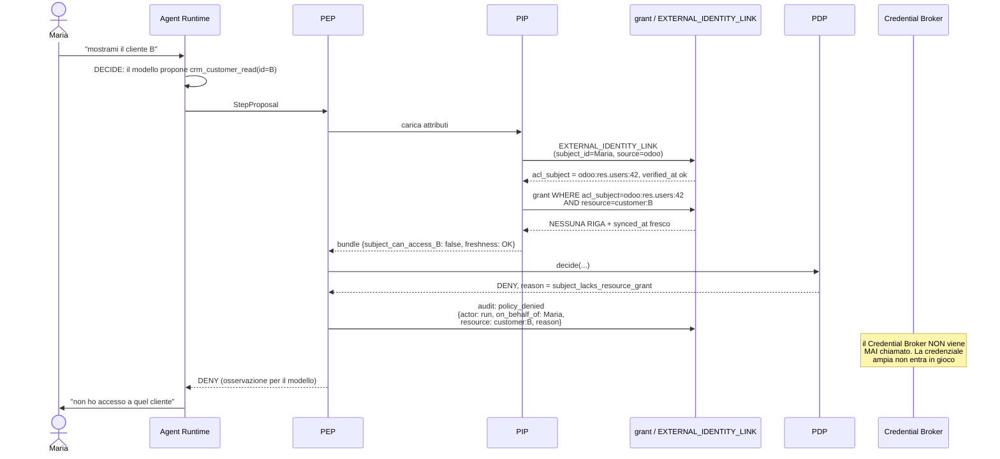
```mermaid
sequenceDiagram
    actor M as Maria
    participant W as Agent Runtime
    participant PEP as PEP
    participant PIP as PIP
    participant DB as grant / EXTERNAL_IDENTITY_LINK
    participant PDP as PDP
    participant CB as Credential Broker

    M->>W: "mostrami il cliente B"
    W->>W: DECIDE: il modello propone crm_customer_read(id=B)
    W->>PEP: StepProposal

    PEP->>PIP: carica attributi
    PIP->>DB: EXTERNAL_IDENTITY_LINK<br/>(subject_id=Maria, source=odoo)
    DB-->>PIP: acl_subject = odoo:res.users:42, verified_at ok
    PIP->>DB: grant WHERE acl_subject=odoo:res.users:42<br/>AND resource=customer:B
    DB-->>PIP: NESSUNA RIGA + synced_at fresco
    PIP-->>PEP: bundle {subject_can_access_B: false, freshness: OK}

    PEP->>PDP: decide(...)
    PDP-->>PEP: DENY, reason = subject_lacks_resource_grant

    PEP->>DB: audit: policy_denied<br/>{actor: run, on_behalf_of: Maria,<br/>resource: customer:B, reason}
    Note over CB: il Credential Broker NON viene<br/>MAI chiamato. La credenziale<br/>ampia non entra in gioco
    PEP-->>W: DENY (osservazione per il modello)
    W->>M: "non ho accesso a quel cliente"
```

#### Come leggerlo

**La nota su `Credential Broker` è il punto.** La credenziale di servizio — quella "ampia",
quella pericolosa — **non viene nemmeno richiesta**. La decisione avviene prima, su dati
nostri, e il Broker viene interpellato solo dopo un `ALLOW`. Il chiavistello sta **prima**
della chiave, non dopo.

**Il caso `synced_at` stantio.** Se la proiezione dei grant fosse vecchia oltre la soglia,
`PIP` restituirebbe `freshness: STALE` e il PDP negherebbe comunque, con ragione
`grants_stale` invece di `subject_lacks_resource_grant`. Due ragioni diverse per lo stesso
esito: è `AR-KN-09` (fail closed) e `AR-GP-21` (l'audit distingue le categorie).

**Dove la difesa può rompersi**, dichiarato: se `EXTERNAL_IDENTITY_LINK` mappasse Maria
sull'utente Odoo sbagliato (§15.3, `B-49`), il PDP negherebbe o permetterebbe **la cosa
sbagliata con la massima convinzione**. La correttezza della mappatura di identità è il
fondamento su cui poggia tutto il resto.

---

## 24. Cosa succede quando l'autorizzazione fallisce

Il prompt (§58): *"Do not let the model retry authorization until it succeeds."*

### 24.1 Il comportamento

| Aspetto | Comportamento | Fonte |
|---|---|---|
| l'azione | **non avviene** | `AR-015`: fail closed |
| la decisione | **registrata** con ragioni complete | `AR-GP-20`, `AR-031` |
| il modello riceve | un'**osservazione**: "azione non consentita" | `AR-TL-04`, `AR-RT-15` |
| l'utente riceve | una spiegazione, se la policy lo consente | §24.2 |
| il run | **continua**, salvo che l'errore sia terminale | `AR-RT-15` |

### 24.2 Cosa si dice e cosa non si dice

Un `DENY` porta informazione, e l'informazione può essere una fuga.

| Destinatario | Cosa vede |
|---|---|
| **il modello** | la classe di negazione (`capability_missing`, `permission_missing`, `approval_required`), **senza** dettagli sulla risorsa. Motivo: l'output del modello arriva all'utente, quindi ciò che sa il modello lo sa l'utente |
| **l'utente** | un messaggio comprensibile per le negazioni "sue" ("non hai i permessi per questa operazione"), generico per quelle che rivelerebbero esistenza di risorse |
| **il tenant admin**, via `GET /v1/runs/{id}/decisions` | la spiegazione completa (`A03` ha già l'endpoint) |
| **l'audit** | tutto |

**`AR-ID-30`.** Una ragione di negazione che rivelerebbe l'esistenza di una risorsa non
accessibile non arriva mai al modello. La distinzione fra "non esiste" e "non puoi vederlo"
esiste solo nell'audit.

### 24.3 Il modello non può ritentare all'infinito

Il prompt lo chiede esplicitamente, e la difesa esiste già ma va nominata:

1. **`ADR-104`**: massimo 50 step. Un modello che ritenta ha comunque un tetto duro.
2. **`AR-028`**: ogni run ha budget espliciti; un `DENY` consuma comunque uno step.
3. **`T-RT-03`**: i rilevatori di loop di `A04` (tre, Day-1) vedono la ripetizione.
4. **`AR-ID-31`** (nuova): N `DENY` consecutivi sulla **stessa** `(action, resource)`
   fanno terminare il run con `AUTHORIZATION_LOOP`, uno stato **visibile**, non un
   troncamento silenzioso. Il valore di N è `NON ANCORA DECISO` — è un parametro del
   `ConfigSnapshot`, e va calibrato con i dati (`A12`), non inventato ora.

**Perché serve `AR-ID-31` se c'è già il tetto di 50 step.** Perché 50 tentativi di
autorizzazione falliti sullo stesso oggetto sono **50 righe di audit di negazione**, che è
sia rumore sia un segnale che qualcosa non va (un'iniezione insistente, o uno schema di tool
mal progettato). Terminare prima con un errore tipizzato produce un segnale pulito invece di
un fondo di rumore.

---

## 25. Federazione, SCIM, e il percorso enterprise

### 25.1 Federazione: come si aggiunge un IdP senza toccare il resto

Il prompt (§42): *"Do not hard-code one identity provider."*

La struttura che rende questo vero è già in §6.4: la tabella `IDP_LINK` con `issuer` +
`external_sub`. Aggiungere un IdP significa:

1. una riga di configurazione per tenant: `issuer`, endpoint di discovery, `client_id`,
   segreto (nel `SecretStore`, §13);
2. il collegamento delle persone esistenti (`link_method`, §15.2 — **mai** per email);
3. niente altro.

**`AR-ID-32`.** Un tenant può avere più `issuer` attivi contemporaneamente. Non è
un'eccentricità: è necessario durante una migrazione da un IdP all'altro (§6.5, scenario 5),
che è l'unico momento in cui si può fare il collegamento in modo sicuro.

**Cosa non facciamo mai:** dedurre il tenant dall'`issuer` in modo implicito. Il legame
`issuer → tenant` è una riga di configurazione esplicita. Altrimenti chi controlla un dominio
DNS potrebbe far comparire un tenant.

**SAML.** `RICHIEDE RICERCA` — **`B-52`** — su quanto sia realmente richiesto SAML nel
segmento CRM/ERP mid-market, o se OIDC basti. La differenza è settimane di lavoro e una
superficie d'attacco storicamente problematica (firme XML, canonicalizzazione). **Non lo
implementiamo finché un cliente non lo richiede.**

### 25.2 SCIM: quando serve davvero

**SCIM** (*System for Cross-domain Identity Management*) è il protocollo con cui un'azienda
sincronizza automaticamente le proprie persone verso un'applicazione: crea, aggiorna,
disattiva utenti e gruppi.

| Numero di persone per tenant | Come si gestiscono | SCIM serve? |
|---|---|---|
| decine | a mano, dal tenant admin | **no** |
| centinaia | a mano diventa doloroso, ma fattibile con un import | **utile** |
| migliaia, con turnover | impossibile a mano | **necessario** |

**DECISIONE:** SCIM **non Day-1**. Trigger: **`T-ID-10`** — un tenant con più di ~200
persone, oppure un requisito di conformità che imponga la disattivazione automatica entro un
tempo dato dalla cessazione del rapporto.

**Il legame con `subject_id`.** SCIM è il modo **migliore** di alimentare
`EXTERNAL_IDENTITY_LINK` e `ROLE_ASSIGNMENT`, perché è autoritativo e attivo (l'IdP ci dice
quando una persona esce, invece che noi doverlo scoprire). Il `link_method = SCIM` di §15.2
esiste già per questo.

**La ragione di sicurezza per cui SCIM conta più di quanto sembri.** Senza SCIM, la
disattivazione di una persona dipende dal fatto che qualcuno se ne ricordi. Con SCIM è
automatica. Il tempo che intercorre fra "la persona lascia l'azienda" e "il suo accesso è
revocato" è una delle metriche di sicurezza più significative in assoluto, e senza SCIM
quella metrica dipende da un processo umano.

### 25.3 Il percorso, derivato e non copiato

Il prompt (§60) propone un percorso a quattro fasi e dice esplicitamente: *"Do not assume
this roadmap is correct. Derive it from research."*

Il percorso proposto è: (1) identità locale + autorizzazione applicativa → (2) OIDC/SSO →
(3) OAuth delegato + service identity → (4) policy engine fine-grained.

**Dove concordo:** la fase 1 e la fase 2 sono nell'ordine giusto, per le ragioni di §9.2.

**Dove dissento, e perché:**

| Fase del prompt | Il nostro ordine | Perché |
|---|---|---|
| fase 3: "OAuth delegato **+** service identity" | **le service identity sono Day-1**, non fase 3 | `AR-CP-05` le impone già; i ruoli di database sono Day-1 o non arriveranno mai (§17.1) |
| fase 4: "policy engine fine-grained" alla fine | **l'autorizzazione fine-grained è Day-1** | `ADR-019` (intersezione a 5) e `ADR-021` (obbligazioni) sono già fini. Ciò che manca non è la granularità, è un **evaluator dichiarativo**, che è `DEF-01` e riguarda **chi scrive le policy**, non quanto sono fini |
| — | **manca una fase**: la delega OAuth per utente (catena 1, §14.5) | è il passo che risolve `R-41`, e nel percorso del prompt è nascosto dentro "fase 3" |

**Il percorso corretto per noi:**

```text
Day-1        identita' locale + service identity + autorizzazione a intersezione
             + credenziale di servizio per tenant + audit completo

Prepare      OIDC come issuer alternativo (nessun cambio di modello dati)
             + SecretStore verso Vault se scatta T-TL-08
             + step-up authentication

Scale        delega OAuth per utente (catena 1) -> risolve R-41
             + SCIM se scatta T-ID-10
             + evaluator dichiarativo se scatta T-GP-03 (DEF-01)

Enterprise   federazione multi-IdP, ReBAC come fonte di attributi (T-GP-04),
             isolamento fisico per tenant (T-05), workload identity (D-04)
```

---

## 26. Matrice di selezione dell'architettura

Il prompt (§62) chiede un confronto fra architetture complete, non fra tecnologie. Le
quattro architetture realmente plausibili per questo progetto:

- **X — IdP esterno + RBAC**: Keycloak (o simile) Day-1, ruoli come autorizzazione.
- **Y — IdP esterno + policy engine**: Keycloak + OPA/Cedar Day-1.
- **Z — identità locale + intersezione applicativa** ← **la nostra**.
- **W — nessuna identità propria: tutto delegato al CRM** (l'utente si autentica su Odoo,
  noi ci fidiamo).

| Criterio | X (IdP + RBAC) | Y (IdP + policy engine) | **Z (locale + intersezione)** | W (tutto dal CRM) |
|---|---|---|---|---|
| **Semplicità Day-1** | media: un sistema in più | **bassa**: due sistemi in più | **alta**: nessun sistema in più | **altissima** |
| **Security** | media: RBAC non esprime il perimetro sui dati | alta | **alta** | **bassa**: nessun controllo nostro |
| **Delegation** | non risolta: un IdP non delega verso il CRM | non risolta | **risolta** (`DelegationContext`) | implicita e incontrollata |
| **Enterprise SSO** | **nativo** | **nativo** | da aggiungere (§25.1), a costo contenuto | dipende dal CRM |
| **Autorizzazione fine** | **no** | **sì** | **sì** (`ADR-019`, `ADR-021`) | no |
| **Multi-tenancy** | supportata (realm/organization) | supportata | **nativa** (`INV-02`, RLS) | inesistente |
| **Service identity** | possibile | possibile | **nativa** (ruoli PostgreSQL) | assente |
| **Tool security** | non affrontata | non affrontata | **affrontata** (§13, §16.2) | non affrontata |
| **Data security** | non affrontata | parziale | **affrontata** (`ADR-071`, §16.3) | delegata al CRM |
| **Auditabilità** | parziale: l'IdP audita il login, non le azioni | parziale | **completa**: entrambe le identità, ogni decisione | assente da noi |
| **Revoca** | dipende dal token | dipende dal token | **un passo** (`ADR-106`) | dipende dal CRM |
| **Complessità operativa** | +1 sistema | +2 sistemi | **+0** | +0 |
| **Scalabilità** | alta | alta | media: il PIP legge a ogni step | alta |
| **Complessità di migrazione** | — | — | **bassa**: `AuthenticationResult` è già IdP-shaped | **altissima** per uscirne |
| **Raccomandazione** | no Day-1 | no Day-1 | **sì** | **mai** |

**Perché W è "mai" e non "no".** L'idea è seducente — se il CRM già sa chi è Maria e cosa
può fare, perché duplicare? — ma rompe tre cose senza rimedio: (1) non potremmo autorizzare
nulla che non riguardi il CRM (memoria, documenti, agent); (2) i run schedulati non avrebbero
identità; (3) legherebbe l'intera architettura di sicurezza a un sistema esterno,
violando `AR-020` in spirito (nessuna interfaccia con una sola implementazione) e rendendo
`Q-01` una decisione irreversibile.

**Perché non X né Y Day-1**, in una riga: entrambe aggiungono sistemi da operare per
risolvere il problema che **non abbiamo** (autenticare persone di aziende diverse) senza
risolvere quello che **abbiamo** (autorizzare un agent che agisce per conto di qualcuno su
risorse di terzi). Non è che siano cattive architetture: sono architetture per un problema
diverso.

**La cosa onesta da dire su Z:** la sua debolezza è la **scalabilità del PIP** (legge a ogni
step) e il fatto che l'autenticazione la scriviamo noi. La prima è misurabile (`T-GP-01`), la
seconda è mitigata dal fatto che il pezzo scritto da noi è piccolo e sostituibile (§9.2).

---

## 27. Analisi "perché non"

Il prompt (§63) elenca nove domande. Rispondo a tutte, brevemente, senza ripetere ciò che è
già stato argomentato.

**Perché questa?** Perché il problema vero non è "chi è l'utente" (facile) ma "con quale
autorità agisce un programma che decide da solo il prossimo passo" (difficile). Z è l'unica
delle quattro che lo affronta.

**Perché non solo autenticazione?** Perché sapere chi sei non dice cosa puoi fare. Con
`ADR-023` (approvazione su ogni `SIDE_EFFECT`) e `ADR-019` (intersezione), il 90% del valore
di sicurezza sta dopo l'autenticazione.

**Perché non solo RBAC?** Perché i ruoli non esprimono il perimetro sui dati ("le opportunità
del **tuo** team") senza esplodere in un ruolo per team. §11.2.

**Perché non solo ABAC?** Perché gli attributi devono venire da qualche parte, e senza ruoli
un amministratore dovrebbe assegnare permessi uno per uno. RBAC è l'interfaccia umana di
ABAC.

**Perché non un policy engine completo Day-1?** Perché `DEF-01` è di `A03` e dipende da
`B-02`; perché `D-02` è già registrato come debito **intenzionale**; e perché il criterio
per adottarlo è già scritto in `T-GP-03` (*le policy diventano troppe o troppo intrecciate
per essere lette*) e `T-06` (*policy scritte da non-sviluppatori*). Non lo riapro.

**Perché non un solo service account?** Perché una credenziale universale rende ogni
compromissione totale, e rende l'audit inutile: tutto sembra fatto dalla stessa entità. §17.1.

**Perché non far agire gli agent come utenti?** §7.3. In una riga: perché renderebbe il
confused deputy indifendibile e violerebbe `AR-014`.

**Perché non lasciare che i tool gestiscano la propria autorizzazione?** Perché avremmo
tante autorità quanti tool, ognuna scritta da una persona diversa in un momento diverso.
`AR-013` e `INV-01` dicono l'opposto: nessun tool si esegue senza una decisione del PDP
registrata. Un tool che decidesse per sé sarebbe un secondo PDP non testato.

**Perché non inoltrare direttamente i token dell'utente?** Perché `AR-014` lo vieta, e la
ragione dietro `AR-014` è che un token inoltrato è un token **copiato**: ogni componente che
lo tocca diventa un posto da cui può essere rubato, e il sistema esterno non ha modo di
sapere che a usarlo è un robot. Il prompt (§38) lo dice: *"Avoid blindly forwarding user
tokens."*

**Perché non autenticazione custom?** In parte la facciamo (§9.2), e ho dato tre ragioni e
un trigger. Quello che **non** facciamo è crittografia custom, formati di token custom, o
un protocollo di federazione custom.

---

## 28. Analisi di reversibilità

Il prompt (§64) chiede di classificare. Uso le stesse categorie dello stato canonico.

| Decisione | Reversibilità | Perché |
|---|---|---|
| **identity provider** (`ADR-109`: locale Day-1) | **facile** | `AuthenticationResult` è già IdP-shaped; `subject_id` non dipende dal `sub` (`AR-ID-07`). Aggiungere un issuer è aggiungere righe |
| **formato del token / sessione** (`ADR-110`: riga nel database) | **facile** | il consumatore è uno solo (il ruolo `api`) |
| **modello di autorizzazione** (`ADR-111`: RBAC come attributi + ABAC) | **moderata** | i ruoli sono dati; il motore è già sostituibile per `ADR-004` |
| **policy evaluator** (`DEF-01`, non mio) | **facile** per l'evaluator, **costosa** per il modello dati | già dichiarato da `ADR-004` |
| **agent identity** (`ADR-105`: dual principal) | **costosa** | il `Principal` a coppia è nel tipo di ogni `AuthorizationRequest` e in ogni riga di audit. Tornare a un principal singolo significherebbe riscrivere l'audit — cioè non si può (`INV-05`) |
| **delegated identity** (`ADR-113`: riga, non token) | **moderata** | il contratto `DelegationContext` resta; cambia il trasporto |
| **credential broker** (`ADR-108`: modulo in-process) | **moderata** | l'interfaccia `SecretStore` è pensata per reggere Vault; estrarlo in un processo è un lavoro contenuto perché il contratto è già a chiamata |
| **`SecretStore` come tabella** (`ADR-108` parte 2) | **facile** | cinque metodi, un'implementazione da sostituire |
| **modello di tenant** (§5.3: piatto) | **costosa** ma non irreversibile | `org_id` si aggiunge come colonna nullable accanto a `tenant_id`, non al posto |
| **`subject_id` opaco** (`ADR-107`) | **effettivamente irreversibile** | è la chiave esterna di memoria, audit, grant, run. Cambiarla significa riscrivere tutto ciò che `INV-05` vieta di riscrivere |
| **service identity via ruoli PostgreSQL** (`ADR-116`) | **moderata** | è una migrazione di permessi |
| **i permessi non si congelano** (`ADR-106`) | **moderata** | congelarli dopo è facile (basta cachare); scongelarli dopo averli congelati significherebbe scoprire che tutte le revoche non funzionavano |
| **catena 3 verso l'esterno** (`ADR-114`) | **facile per aggiungere la catena 1**, **impossibile da togliere** | la catena 3 serve comunque per i run schedulati |

**Le due irreversibili sono `ADR-107` (`subject_id`) e, in pratica, `ADR-105` (dual
principal).** Entrambe vanno **chiuse prima dello schema del database**, che è il primo
lavoro tecnico del progetto. Questa è la scadenza che `A09` aggiunge alla lista già lunga
dello stato canonico.

---

## 29. `Q-03`: cosa cambia fra SaaS, on-prem, ed entrambi

`Q-03` (*il deployment è SaaS, on-prem presso cliente, o entrambi Day-1?*) è **aperta**, e
per l'identity è la domanda aperta che pesa di più. **Non scelgo in silenzio**: dichiaro cosa
cambia in ciascuno scenario.

| Aspetto | **SaaS** (noi ospitiamo, molti tenant) | **On-prem** (il cliente ospita, un tenant) | **Entrambi** |
|---|---|---|---|
| **Numero di tenant** | molti | **uno** (il `tenant_id` c'è ma è costante) | variabile |
| **Chi è il `PlatformOperator`** | **noi** | **il cliente** — la separazione di §18.2 perde quasi tutto il suo senso: l'operatore *è* il proprietario dei dati | entrambi, in installazioni diverse |
| **Pressione per `Organization`/`Workspace`** | bassa: i tenant separano già | **alta**: il cliente vorrà separare le sue divisioni (§5.3, `T-ID-07`) | alta |
| **Identity Provider** | noi ne supportiamo N, uno per tenant | **uno solo**, quello del cliente — e quasi certamente **obbligatorio dal primo giorno**: nessuna azienda vuole un secondo elenco di password | N + 1 |
| **`ADR-109` (nessun IdP Day-1)** | **regge** | **cade quasi subito**: `T-ID-04` scatta all'installazione | regge per il SaaS, cade per l'on-prem |
| **Chiave master dei segreti** | la custodiamo noi, con una procedura nostra | **la custodisce il cliente** — e questo è un requisito operativo serio che va documentato per lui | due procedure |
| **KMS gestito del cloud** (§13.4) | **disponibile** e sensato | **non disponibile**: resta la tabella cifrata o Vault installato dal cliente | l'astrazione `SecretStore` regge entrambi — **è il motivo per cui è un'interfaccia** |
| **SCIM** (§25.2) | utile quando i tenant crescono | **più probabile**: il cliente ha già la sua directory | entrambi |
| **`EXTERNAL_IDENTITY_LINK`** | va costruito per ogni tenant | **potenzialmente automatico**: se il CRM e la piattaforma usano lo stesso IdP, `link_method = DIRECTORY_SYNC` diventa affidabile | dipende |
| **Isolamento fisico** (`D-03`, `T-05`) | è **la** richiesta che arriverà | già soddisfatto per costruzione | — |
| **Conformità** | ricade su di noi | ricade sul cliente | doppia |

### 29.1 Cosa non cambia in nessuno scenario

Vale la pena isolarlo, perché è la misura di quanto l'architettura sia robusta rispetto a
`Q-03`:

- il modello a sette classi di principal (§5);
- `subject_id` opaco e stabile (`ADR-107`);
- il dual principal (`ADR-105`);
- il `DelegationContext` (§8);
- l'autorità viva contro il tetto congelato (`ADR-106`);
- il contratto `SecretStore` (§13.3) — **cambia l'implementazione, non l'interfaccia**;
- l'audit a due identità (§22);
- la mappatura verso `acl_subject` (§15).

**INFERENZA:** `Q-03` cambia **cosa si installa e chi custodisce le chiavi**, non **come è
fatta l'identità**. Questa è una buona notizia e un buon test dell'architettura: se `Q-03`
avesse cambiato il modello di identità, avremmo progettato su un'ipotesi.

### 29.2 La cosa che cambierei se sapessi che è on-prem

Una sola, ma pesante: **`ADR-109` (nessun IdP Day-1) diventerebbe sbagliata**. In on-prem il
cliente ha già Entra ID o simili e non accetterà un secondo elenco di credenziali. Il lavoro
di OIDC si sposterebbe da "Prepare" a "Day-1", e con esso il costo.

**Raccomandazione al committente:** se `Q-03` non si chiude presto, cominciare comunque con
l'identità locale **ma tenere il modulo di autenticazione dietro il contratto
`AuthenticationResult` fin dalla prima riga di codice**. È l'unica cosa che rende il ritardo
di `Q-03` non costoso. È lo stesso ragionamento che `A06` fa su `Q-01` (*se `Q-01` tarda,
cominciare da Odoo*): non aspettare la risposta, ma non pregiudicarla.

---

## 30. Contratti stabili e strategia di migrazione

Il prompt (§65) chiede il set minimo di contratti stabili; il §61 chiede come si evolve
senza riscrivere Agent Runtime, Tool, Knowledge, Memory, Governance.

### 30.1 Il set minimo

Il prompt propone nove contratti. Ne servono **sei**.

| Contratto | Serve? | Perché |
|---|---|---|
| **`Principal`** | **sì** | è il tipo che attraversa tutto: `AuthorizationRequest`, `args_injected`, audit, `MemoryScope`, `RetrievalScope` |
| **`AuthenticationResult`** | **sì** | è il punto di sostituzione dell'IdP (§9.3) |
| **`DelegationContext`** | **sì** | è il ponte `api` → `worker` (§8) |
| **`CredentialRef`** | **sì** | è il puntatore che disaccoppia tool e segreti (§13) |
| **`AuthorizationRequest` / `AuthorizationDecision`** | **sì**, ma sono di `A03` | `A09` non li ridefinisce, li **popola** |
| `Identity` | **no** | è `Principal` con un nome più vago. Due nomi per una cosa sola è esattamente ciò che la convenzione (§19, single owner) vieta |
| `Session` | **no** come contratto pubblico | è un dettaglio interno del ruolo `api`; fuori da lì circola il `session_id` dentro `SubjectRef` |
| `AgentIdentity` | **no** come contratto separato | è un campo dell'`AgentVersion`, già di `A02` |
| `RunIdentity` | **no** come contratto separato | è `ActorRef`, dentro `Principal` |

**Il criterio applicato** è `AR-CP-02` di `A02` (lifecycle proprio + owner proprio + riferito
da qualcosa). `Identity`, `Session`, `AgentIdentity` e `RunIdentity` falliscono su almeno due
delle tre.

### 30.2 Come si evolve senza riscrivere

Il prompt chiede la garanzia. Ecco dove passa, componente per componente.

| Componente | Cosa vede dell'identità | Cosa succede se cambia l'IdP / il modello di delega |
|---|---|---|
| **Agent Runtime** (`A04`) | riceve un `Principal` e un `DelegationContext`; li passa | **niente**: non conosce né token né credenziali |
| **Tool Architecture** (`A06`) | riceve `principal` in `args_injected` e un `AuthenticatedClient` | **niente**: è la ragione per cui `ADR-056` è una buona decisione. Il passaggio dalla catena 3 alla catena 1 (§14.5) è invisibile ai tool |
| **Knowledge** (`A07`) | riceve una `RetrievalScope` costruita dal PDP | **niente**, purché `acl_subject` continui a risolversi da `subject_id` |
| **Memory** (`A08`) | riceve `subject_id` iniettato | **niente**, perché `subject_id` è stabile per `ADR-107`. **È l'intero scopo di quella decisione** |
| **Governance** (`A03`) | riceve `AuthorizationRequest` | **niente**: il PDP resta puro e non sa da dove vengono gli attributi |
| **Control Plane** (`A02`) | possiede `AgentVersion` con le capability | **niente** |

**La proprietà che rende tutto questo vero, in una frase:** nessun componente oltre il ruolo
`api` e il `Credential Broker` vede mai una **credenziale**. Tutti gli altri vedono
**identificatori** e **riferimenti**. Cambiare come si ottengono le credenziali non tocca chi
non le ha mai viste.

**`AR-ID-33`.** Solo due moduli possono importare i tipi che contengono materiale
crittografico: il modulo di autenticazione (nel ruolo `api`) e il `Credential Broker`.
Verifica: controllo delle dipendenze fra moduli in CI (`AR-005`), che esiste già.

---

## 31. Day-1 / Prepare / Scale / Enterprise

### 31.1 La tabella

Il prompt (§68) chiede questa matrice su 21 capability. "Prepare" significa: **non lo
costruiamo, ma il modello dati e i contratti lo permettono senza migrazione**.

| Capability | Day 1 | Prepare | Scale | Enterprise |
|---|---|---|---|---|
| autenticazione locale | **password + MFA** | — | — | resta come fallback per gli operatori |
| utenti | `HumanSubject` + `subject_id` opaco | — | — | migliaia per tenant |
| tenant | modello piatto `Tenant → Subject` | `org_id` come colonna nullable | livello `Organization` | gerarchia + deleghe amministrative |
| sessioni | riga nel database, revocabile | — | token breve + riga al rinnovo (`T-ID-05`) | terminazione per rischio |
| **agent identity** | `AgentIdentity` nel Control Plane | — | — | identità attestata (`D-04`) |
| **run identity** | `AgentRun` come `actor` | — | — | catena di delega A2A |
| service identity | **ruoli PostgreSQL distinti** | — | separazione di processo | SPIFFE/SPIRE (`D-04`) |
| OIDC | **no** | `AuthenticationResult` già IdP-shaped, `IDP_LINK` già presente | **sì** (`T-ID-04`) | multi-issuer per tenant |
| OAuth (delega verso l'esterno) | **no** | `credential_ref` già risolvibile per `subject_id` | **sì**: catena 1 (`T-ID-08`) | token exchange |
| accesso delegato | `DelegationContext` (riga) | `parent_delegation` già nello schema | — | sub-delega per A2A (`T-ME-07`) |
| RBAC | **sì**, come sorgente di attributi | — | ruoli per tenant, ereditarietà | ruoli da SCIM |
| ABAC | **sì**, è il motore (`A03`) | — | attributi da fonti esterne | — |
| ReBAC | **no** | — | — | OpenFGA come **fonte di attributi** (`T-GP-04`) |
| capability security | **sì**, congelate all'avvio | — | — | — |
| policy engine dichiarativo | **no** (`DEF-01`, `D-02`) | `ADR-004`: policy come dato, evaluator sostituibile | Cedar/OPA (`T-GP-03`, `T-06`) | verifica formale |
| **credential broker** | modulo in-process | interfaccia `SecretStore` a 5 metodi | Vault (`T-TL-08`) | credenziali dinamiche a scadenza breve |
| workload identity | **no** (`ADR-117`, `D-04`) | — | — | SPIFFE/SPIRE |
| SCIM | **no** | `link_method = SCIM` già previsto | **sì** (`T-ID-10`) | provisioning bidirezionale |
| federazione | **no** | `issuer` già chiave in `IDP_LINK` | un IdP per tenant | multi-IdP per tenant, SAML se richiesto (`B-52`) |
| operazioni privilegiate | approvazione + approvatore diverso | `auth_strength` già nel modello | step-up obbligatorio per classe | segregazione dei compiti formale |
| break-glass | **elevazione dichiarata** (`ADR-119`) | — | — | approvazione a due persone |

### 31.2 L'architettura Day-1

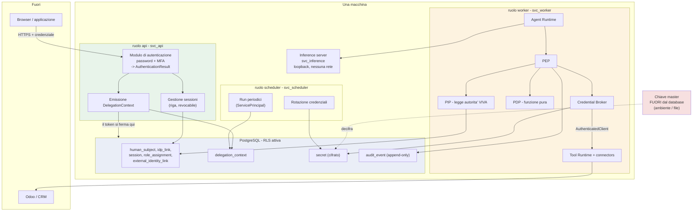
```mermaid
flowchart TB
    subgraph EXT["Fuori"]
        USER["Browser / applicazione"]
        CRM["Odoo / CRM"]
    end

    subgraph MACHINE["Una macchina"]
        subgraph API["ruolo api - svc_api"]
            AUTH["Modulo di autenticazione<br/>password + MFA<br/>-> AuthenticationResult"]
            SESS["Gestione sessioni<br/>(riga, revocabile)"]
            DELISS["Emissione DelegationContext"]
        end

        subgraph WORKER["ruolo worker - svc_worker"]
            RT["Agent Runtime"]
            PEPX["PEP"]
            PIPX["PIP - legge autorita' VIVA"]
            PDPX["PDP - funzione pura"]
            CBX["Credential Broker"]
            TRX["Tool Runtime + connectors"]
        end

        subgraph SCHED["ruolo scheduler - svc_scheduler"]
            ROT["Rotazione credenziali"]
            CRON["Run periodici<br/>(ServicePrincipal)"]
        end

        subgraph PG["PostgreSQL - RLS attiva"]
            IDENT["human_subject, idp_link,<br/>session, role_assignment,<br/>external_identity_link"]
            DELEG["delegation_context"]
            SECR["secret (cifrato)"]
            AUDIT["audit_event (append-only)"]
        end

        INF["Inference server<br/>svc_inference<br/>loopback, nessuna rete"]
    end

    KEY["Chiave master<br/>FUORI dal database<br/>(ambiente / file)"]

    USER -->|"HTTPS + credenziale"| AUTH
    AUTH --> SESS --> IDENT
    AUTH --> DELISS --> DELEG
    DELISS -->|"il token si ferma qui"| PG
    RT --> PEPX --> PIPX --> IDENT
    PEPX --> PDPX
    PEPX --> CBX --> SECR
    KEY -.->|"decifra"| SECR
    CBX -->|"AuthenticatedClient"| TRX --> CRM
    RT --> INF
    PEPX --> AUDIT
    ROT --> SECR
    CRON --> DELEG

    style API fill:#e8f4ea
    style WORKER fill:#fdf3e0
    style PG fill:#eaeef7
    style KEY fill:#f7e0e0
```

#### Come leggerlo

**Tutto sta su una macchina, e nonostante questo ci sono confini veri.** I tre ruoli sono lo
stesso artefatto (`ADR-001`) ma processi diversi con **credenziali di database diverse**
(§17.1): `svc_api` non può scrivere step, `svc_worker` non può creare sessioni.

**La freccia "il token si ferma qui"** è `AR-014` e `AR-GP-02`. Il verde comunica col
giallo **solo** attraverso il blu (il database), come impone `AR-002`.

**La chiave master è rossa e sta fuori dal riquadro della macchina.** Concettualmente:
è l'unica cosa che non deve stare dove stanno i dati. Praticamente, su una macchina sola, sta
comunque su quella macchina — ed è il limite dichiarato in `R-47`.

**L'inference server non tocca il database e non ha rete uscente** (`ADR-046`,
`AR-MD-08`). È il componente con **meno** identità di tutti, e va benissimo così: non deve
sapere niente di nessuno.

### 31.3 L'architettura enterprise (dove si arriva)

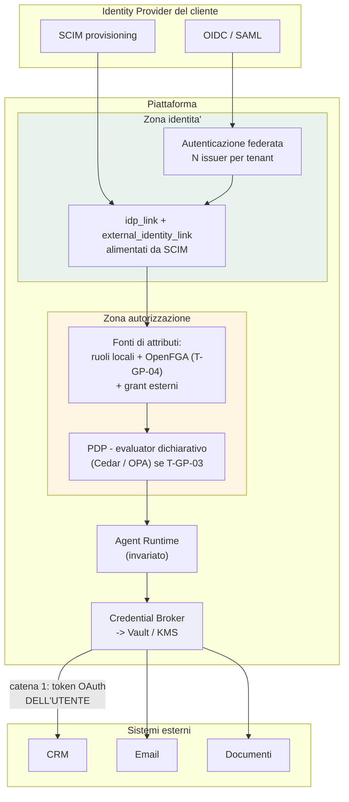
```mermaid
flowchart TB
    subgraph IDP["Identity Provider del cliente"]
        OIDC["OIDC / SAML"]
        SCIMS["SCIM provisioning"]
    end

    subgraph PLATFORM["Piattaforma"]
        subgraph AUTHZONE["Zona identita'"]
            AUTHN["Autenticazione federata<br/>N issuer per tenant"]
            LINKS["idp_link + external_identity_link<br/>alimentati da SCIM"]
        end
        subgraph AUTHZONE2["Zona autorizzazione"]
            PDP2["PDP - evaluator dichiarativo<br/>(Cedar / OPA) se T-GP-03"]
            ATTR["Fonti di attributi:<br/>ruoli locali + OpenFGA (T-GP-04)<br/>+ grant esterni"]
        end
        CB2["Credential Broker<br/>-> Vault / KMS"]
        RT2["Agent Runtime<br/>(invariato)"]
    end

    subgraph EXTS["Sistemi esterni"]
        CRM2["CRM"]
        MAIL["Email"]
        DOCS["Documenti"]
    end

    OIDC --> AUTHN
    SCIMS --> LINKS
    AUTHN --> LINKS
    LINKS --> ATTR --> PDP2
    PDP2 --> RT2
    RT2 --> CB2
    CB2 -->|"catena 1: token OAuth<br/>DELL'UTENTE"| CRM2
    CB2 --> MAIL
    CB2 --> DOCS

    style AUTHZONE fill:#e8f4ea
    style AUTHZONE2 fill:#fdf3e0
    style CB2 fill:#eaeef7
```

#### Come leggerlo

**Confronta con il diagramma Day-1 e nota cosa è cambiato al centro: niente.** L'`Agent
Runtime` è marcato *invariato* apposta. Sono cambiati i **bordi**: da dove arriva l'identità
(un IdP invece di una password), da dove arrivano gli attributi (anche OpenFGA), dove stanno
i segreti (Vault), e **con quale identità si esce** (il token dell'utente invece della
credenziale di servizio: la catena 1 di §14.5, che è la cosa che risolve `R-41`).

Questo è il test della migrazione di §30.2: se il centro cambia, i contratti erano sbagliati.

### 31.4 Cosa **non** va costruito Day-1

Il prompt (§71) chiede esplicitamente questa lista.

| Non costruire | Perché | Quando |
|---|---|---|
| un Identity Provider | non siamo nel business dell'identità | mai |
| SAML | superficie d'attacco alta, domanda non verificata (`B-52`) | su richiesta contrattuale |
| SCIM | non serve sotto le centinaia di persone | `T-ID-10` |
| SPIFFE/SPIRE | non c'è il problema che risolve | `D-04` |
| un policy engine dichiarativo | `DEF-01`/`D-02` già registrati | `T-GP-03`, `T-06` |
| ReBAC / Zanzibar | le relazioni sono del CRM | `T-GP-04` |
| break-glass come bypass | `AR-GP-23` | mai |
| crittografia propria | il prompt lo vieta e ha ragione | mai |
| `Organization` / `Workspace` | nessun requisito | `T-ID-07` |
| memoria condivisa fra utenti | `ADR-100` | `T-ME-05` |
| sub-delega agent → agent | nessun multi-agent (`DEF-07`) | `T-ME-07` |
| un servizio di identità separato | `AR-002`, `ADR-011` | `T-04` |
| cache delle decisioni di autorizzazione | è la minaccia 16 di §23, resa impossibile per costruzione | mai |

---

## 32. I registri: tutto ciò che `A09` aggiunge allo stato canonico

### 32.1 Nuovi ADR (`ADR-105` … `ADR-119`)

| ADR | Titolo | Decisione | Reversibilità | Scadenza |
|---|---|---|---|---|
| **ADR-105** | **Dual principal** | il `principal` è la coppia `(actor = AgentRun, on_behalf_of = HumanSubject \| ServicePrincipal)`; l'autorità è l'intersezione; `on_behalf_of` mai vuoto | **costosa** (è nel tipo di ogni audit) | **prima dello schema** |
| **ADR-106** | **Tetto congelato, autorità viva** | capability, tool set, `MemorySnapshot`, `bundle_version` e `scope` della delega sono congelati; stato del subject, sessione, delega, ruoli, tenant e freschezza dei grant si rileggono a **ogni `AUTHORIZE`** | moderata | prima del PEP/PDP |
| **ADR-107** | **`subject_id` opaco, immutabile, mai riassegnato** | UUIDv4 generato da noi; tutto ciò che cambia sta in righe collegate; la fusione produce un **alias** (`merged_into`), mai una riscrittura | **effettivamente irreversibile** | **prima dello schema** |
| **ADR-108** | **`Credential Broker` + contratto `SecretStore`** | modulo in-process; interfaccia a 5 metodi; Day-1 tabella PostgreSQL cifrata con chiave fuori dal database | moderata (broker) / facile (store) | prima del primo connector |
| **ADR-109** | **Nessun IdP esterno Day-1** | autenticazione locale password + MFA, ma superficie interna già IdP-shaped | **facile** | Day-1 |
| **ADR-110** | **La sessione è una riga, non un token** | revocabile immediatamente; precondizione di `ADR-106` | facile | prima dello schema |
| **ADR-111** | **RBAC come sorgente di attributi, ABAC come motore** | i ruoli espandono in permessi nel PIP; il PDP non conosce i ruoli; il perimetro sui dati resta della sorgente esterna | moderata | prima del PIP |
| **ADR-112** | **`AR-GP-04` si riferisce alla sessione, non all'access token** | `delegation.not_after = min(session.expires_at, run.started_at + max_active_duration + approval_window)` | facile | prima del runtime di approvazione |
| **ADR-113** | **La delega non è un token** | riga nel database + struttura in memoria; nessuna firma, nessuna chiave | moderata | prima dello schema |
| **ADR-114** | **Catena 3 Day-1**: credenziale di servizio **per tenant** verso i sistemi esterni | il perimetro sui dati lo applichiamo noi; la catena 1 (delega per utente) è l'obiettivo, non l'implementazione Day-1 | facile da estendere, impossibile da togliere | Day-1 |
| **ADR-115** | **`EXTERNAL_IDENTITY_LINK`** | mappatura esplicita `subject_id → acl_subject` con `link_method`, `synced_at`, `verified_at`, unicità bidirezionale. **Nessun match per email** | moderata | prima del primo `grant` |
| **ADR-116** | **Service identity via ruoli PostgreSQL** | il least privilege dei processi è applicato dal database, non dal codice (generalizza `AR-CP-05`) | moderata | prima dello schema |
| **ADR-117** | **Nessun SPIFFE/SPIRE Day-1** | conferma `D-04`; il problema che risolve non esiste su una macchina | facile | — |
| **ADR-118** | **Il `PlatformOperator` non legge i dati dei tenant** | tipo di principal separato, stesse policy RLS; difesa **procedurale e di rilevabilità**, non crittografica | moderata | prima della prima installazione presso terzi |
| **ADR-119** | **Nessun break-glass: elevazione dichiarata** | `RoleAssignment` temporaneo con `reason`, `valid_until`, notifica e audit; passa dal PDP come tutto il resto (`AR-GP-23`) | facile | prima del primo supporto su installazione cliente |

### 32.2 Nuove regole architetturali (`AR-ID-01` … `AR-ID-33`)

| ID | Regola | Verifica |
|---|---|---|
| AR-ID-01 | Un `subject_id` non è mai riassegnato, riscritto, né derivato da un dato mutabile | **automatica** (3 test, §6.6) |
| AR-ID-02 | Un identificatore di correlazione (`trace_id`, `span_id`) non entra mai in una decisione di autorizzazione | **automatica** (analisi statica del tipo) |
| AR-ID-03 | `approval_window ≥ approval_ttl` di `A03` | **automatica** (test di configurazione) |
| AR-ID-04 | Day-1 `parent_delegation IS NULL` | **automatica** (vincolo di database) |
| AR-ID-05 | Ogni autenticazione produce un `AuthenticationResult` con `issuer`, `subject_ref`, `auth_time`, `auth_strength`, `claims` | **automatica** (tipo) |
| AR-ID-06 | Nessun claim di un issuer esterno diventa direttamente un input di autorizzazione | **automatica** (analisi statica) |
| AR-ID-07 | `subject_id` non deriva mai dal `sub` dell'issuer | **automatica** |
| AR-ID-08 | La lettura della memoria risolve gli alias di `merged_into` | **automatica** (test di fusione + lettura) |
| AR-ID-09 | La transizione a `DEPARTED` rende le memorie `USER` non leggibili; la cancellazione segue una politica di `A14` | revisione (dipende da `A14`) |
| AR-ID-10 | L'auto-link di identità per email è vietato di default | **automatica** (test) |
| AR-ID-11 | Un ID token non è mai usato come credenziale di accesso a un'API | **automatica** (tipo) |
| AR-ID-12 | La risposta all'utente non distingue "utente inesistente" da "credenziale sbagliata" | **automatica** (test) |
| AR-ID-13 | Nessuna credenziale è valida su più di un `audience` | **automatica** (il Broker rifiuta) |
| AR-ID-14 | L'interruzione di un run per revoca produce un messaggio comprensibile che include cosa è già stato fatto | revisione |
| AR-ID-15 | La rotazione non è mai avviata da un run né da un tool | **automatica** (tipo dell'`actor`) |
| AR-ID-16 | Fallimento di credenziale **dopo** l'invio → `UNCERTAIN`; **prima** → `FAILED` | **automatica** (test sul connector) |
| AR-ID-17 | Ogni chiamata esterna porta un marcatore `run_id`/`agent_id`/`subject_id` dove il protocollo lo consente | revisione (per connector) |
| AR-ID-18 | Il marcatore di correlazione non è una credenziale né un'asserzione di identità | revisione |
| AR-ID-19 | Mappatura di identità esterna stantia o non `ACTIVE` → **DENY** | **automatica** |
| AR-ID-20 | Esiste **un solo** punto che può concedere: il PDP. Tutti gli altri possono solo togliere | **automatica** (analisi dei tipi di ritorno) |
| AR-ID-21 | La `RetrievalScope` non è mai costruita da un identificatore fornito dal modello | **automatica** (tipo) |
| AR-ID-22 | Nessun controllo è saltato perché il chiamante è locale | **automatica** (ricerca di pattern in CI) |
| AR-ID-23 | Un `subject_id` appartiene a un solo tenant | **automatica** (vincolo di database) |
| AR-ID-24 | Un'approvazione è legata a un `action_binding`; se cambia, non vale | **automatica** |
| AR-ID-25 | Un'approvazione si consuma una sola volta, atomicamente con lo step | **automatica** |
| AR-ID-26 | Nessun `AgentRun` modifica permessi, ruoli, policy o credenziali | **automatica** (doppia: registro dei tool + grant) |
| AR-ID-27 | Ogni revoca produce un evento di audit e alimenta `revocation_effective_latency` | **automatica** + mandato ad `A12` |
| AR-ID-28 | Nessun evento di audit contiene segreti, token, password, contenuto di documenti, `value_text`, campi di dominio | **automatica** (scansione degli eventi nei test) |
| AR-ID-29 | Chi legge l'audit vede **entrambi** gli identificatori: quello registrato e quello corrente | revisione |
| AR-ID-30 | Una ragione di negazione che rivelerebbe l'esistenza di una risorsa non arriva mai al modello | **automatica** (test) |
| AR-ID-31 | N `DENY` consecutivi sulla stessa `(action, resource)` → `AUTHORIZATION_LOOP`, stato visibile | **automatica** (N da calibrare) |
| AR-ID-32 | Un tenant può avere più `issuer` attivi contemporaneamente | **automatica** (schema) |
| AR-ID-33 | Solo il modulo di autenticazione e il `Credential Broker` importano tipi con materiale crittografico | **automatica** (`AR-005`) |

**Debito dichiarato:** **28 su 33** hanno una verifica automatica realistica. Le cinque
`REVIEWED` (`AR-ID-09`, `-14`, `-17`, `-18`, `-29`) contano come debito al gate di Level A,
coerentemente con la contabilità che `A01` ha stabilito. È il rapporto migliore fra i
documenti finora, e non per merito: è perché quasi tutte le regole di identità sono
esprimibili come vincoli di tipo o di database.

### 32.3 Nuovi invarianti (`INV-13` … `INV-15`)

| ID | Invariante |
|---|---|
| **INV-13** | Per ogni run e ogni istante successivo all'avvio, l'insieme delle azioni autorizzabili è un **sottoinsieme** di quello all'avvio. Nessun evento può aggiungere un'azione autorizzabile a un run già avviato. *Generalizza `INV-04` e `INV-11` a tutta l'autorità* |
| **INV-14** | Nessun `SecretMaterial` esiste al di fuori del modulo di autenticazione e del `Credential Broker`. Nessun tool, nessun connector, nessuna riga di audit, nessun log ne contiene uno. *Rende `AR-TL-13` verificabile staticamente* |
| **INV-15** | Ogni decisione di autorizzazione registrata contiene **entrambe** le identità (`actor` e `on_behalf_of`). Non esiste una riga di audit di autorizzazione con una sola identità. *Rende `AR-GP-05` strutturale invece che procedurale* |

### 32.4 Nuovi rischi (`R-41` … `R-48`)

| ID | Rischio | Classe | Prob. | Impatto | Mitigazione |
|---|---|---|---|---|---|
| **R-41** | **Confused deputy**: la credenziale di servizio ha più autorità di chi comanda l'agent; la difesa è software nostro, non del CRM | Security | **Alta** | **Alto** | 4 strati (§14.3); percorso verso la catena 1 (§14.5) con trigger `T-ID-08`. **Non risolto strutturalmente Day-1** |
| R-42 | Dipendenza dalla sorgente esterna per il perimetro sui dati: se il CRM è lento o giù, l'autorizzazione è lenta o nega (fail closed) | Reliability | Media | Medio | classi di freschezza (`ADR-082`); allarme prima della soglia; degrado dichiarato |
| **R-43** | **Il `MemorySnapshot` congelato conserva memorie revocate** fino a fine run | Security | Media | Basso | `ADR-104` limita la finestra a 10 min attivi; la memoria non può produrre effetti da sola. `T-ME-08`/`T-ME-10` restano i trigger |
| R-44 | Dati letti prima di una revoca restano nel context del run | Security | Media | Basso | stessa mitigazione di `R-43`; `ADR-106` ferma le **azioni** immediatamente |
| R-45 | `purpose` è dichiarato dal chiamante e non verificato; una policy che ci si basa è aggirabile | Security | Media | Medio | `purpose` marcato come non verificato **nel tipo**; mai unica base di un `ALLOW` |
| R-46 | Nessun fallback quando l'IdP è giù: nessuno lavora | Availability | Bassa Day-1 (nessun IdP), **Media** dopo | Alto | categoria di audit distinta (`auth_unavailable`); accettato come scelta di sicurezza sopra disponibilità |
| R-47 | Chi ha `root` sulla macchina ha database **e** chiave master: la cifratura protegge solo dal furto del solo database | Security | Media | **Alto** | dichiarato; `B-50` (cifratura per-tenant); Vault a `T-TL-08` sposta ma non elimina |
| R-48 | Il `PlatformOperator` è tecnicamente in grado di leggere i dati dei tenant via database diretto | Security | Media | **Alto** | `ADR-118` rende l'accesso applicativo auditato e quello diretto **rilevabile come anomalia**; difesa vera solo con `B-50` |

### 32.5 Nuove assunzioni (`AS-23` … `AS-29`)

| ID | Assunzione | Confidenza | Impatto se falsa | Validazione |
|---|---|---|---|---|
| AS-23 | Gli utenti Day-1 sono interni e pochi: l'autenticazione locale basta | Media | `ADR-109` cade, serve OIDC subito | conferma del committente + `Q-03` |
| **AS-24** | **Il CRM target offre un identificatore di utente stabile e non riusato** su cui costruire `acl_subject` | **Bassa** | `ADR-115` ha un buco: una mappatura potrebbe puntare alla persona sbagliata | **`B-49`**, dipende da `Q-01` |
| AS-25 | La finestra di approvazione umana sta dentro una sessione di lavoro | Media | `ADR-112` non regge; i run che aspettano approvazioni lunghe falliscono sempre | `T-ID-03`, tasso di `DELEGATION_EXPIRED` |
| AS-26 | Le persone per tenant sono nell'ordine delle decine Day-1 | Media | SCIM serve prima; la gestione manuale non regge | conteggio reale |
| AS-27 | Gli attributi di identità sono caricabili a ogni step senza sfondare il budget di latenza | Media | `ADR-106` va rivista: si tornerebbe verso il congelamento con una finestra breve | **`T-GP-01`**, misura di `A12` |
| **AS-28** | **`AS-12` (tutti i tool sono nostri) regge abbastanza a lungo** da non dover isolare i segreti in un processo separato Day-1 | **Bassa** | il `Credential Broker` in-process espone i segreti a codice di terzi | `T-TL-03` — *il primo tool non nostro* |
| AS-29 | Il committente accetta che in un guasto del PDP il sistema si **fermi** invece di degradare | Media | `ADR-119` e `AR-GP-23` vanno rinegoziate | **conferma esplicita del committente** |

### 32.6 Nuovi trigger (`T-ID-01` … `T-ID-10`)

| ID | Condizione osservabile | Riapre | Verso |
|---|---|---|---|
| T-ID-01 | Richieste ricorrenti di azioni che l'agent deve poter fare e l'utente no | **`ADR-105`** (l'intersezione) | dare il permesso all'utente in modo condizionato, **mai** un'eccezione all'intersezione |
| T-ID-02 | La delega deve attraversare una rete (tool remoto, processo separato) | `ADR-113` | token firmato, stesso contratto |
| T-ID-03 | Tasso di run terminati in `DELEGATION_EXPIRED` sopra soglia | `ADR-112`, `AS-25` | rivedere la relazione fra durata della sessione e finestra di approvazione |
| T-ID-04 | Primo tenant con un proprio IdP, o requisito di MFA che non vogliamo implementare | **`ADR-109`** | OIDC / Keycloak in un container accanto |
| T-ID-05 | La lettura della sessione diventa una quota visibile della latenza di richiesta | `ADR-110` | token a vita brevissima + riga consultata al rinnovo |
| T-ID-06 | Requisito di isolamento della memoria dei segreti, o primo tool non nostro | `ADR-108` (specializza `T-TL-03`) | `Credential Broker` in processo separato |
| T-ID-07 | Un cliente chiede separazione fra le proprie divisioni | §5.3 (modello di tenant piatto) | `org_id` come colonna aggiuntiva |
| T-ID-08 | Un tenant chiede che le azioni compaiano nei **suoi** log con l'identità della persona, o una conformità vieta l'utente tecnico condiviso | **`ADR-114`** — è il trigger che risolve **`R-41`** | catena 1: delega OAuth per utente |
| T-ID-09 | L'inference server non è più sulla stessa macchina, o la macchina ospita processi non nostri | `AS-06` | mTLS fra i processi |
| T-ID-10 | Un tenant supera ~200 persone, o serve disattivazione automatica alla cessazione | §25.2 | SCIM |

### 32.7 Nuovo backlog di ricerca (`B-42` … `B-52`)

| ID | Cosa verificare | Serve a | Priorità |
|---|---|---|---|
| **B-42** | Quali voci fra `ASI01`-`ASI10` di OWASP riguardano **identity spoofing, privilege compromise e delegation** degli agent, e quali controlli raccomandano | **`A09`/`A13`** — specializza `B-01`. **Va chiuso insieme a `B-01`**, non separatamente | **Alta** |
| B-43 | Un `sub` OIDC può essere riassegnato dopo la cancellazione di un utente? Quali IdP garantiscono `email_verified` e con quale semantica? | `ADR-107`, `AR-ID-10`, §6.5 | **Alta** |
| B-44 | Durate raccomandate correnti per sessione assoluta, sessione di inattività, access token | §8.4, §10 — **oggi sono `NON ANCORA DECISO`** | Media |
| B-45 | Funzione di hashing per password raccomandata oggi e parametri | `ADR-109` | **Alta** (blocca l'implementazione) |
| B-46 | Quanto è realisticamente garantibile l'azzeramento di materiale crittografico in memoria in Python | `INV-14`, §13.3 | Media |
| B-47 | Il CRM target (Odoo?) supporta OAuth con **utenti individuali** per accesso programmatico | **`ADR-114`, catena 1, quindi `R-41`** — dipende da `Q-01` | **Alta** |
| B-48 | Quale campo del CRM target può portare un marcatore di correlazione senza inquinare i dati di dominio | `AR-ID-17` — dipende da `Q-01` | Media |
| **B-49** | **Il CRM target riusa gli ID utente dopo la cancellazione?** | **`ADR-115`, `AS-24`.** Se sì, `acl_subject` ha bisogno di un discriminante e **la mappatura di identità ha un buco** | **Alta** — dipende da `Q-01` |
| B-50 | Approcci praticabili di cifratura per-tenant senza gestione di chiavi da parte del cliente | `R-47`, `R-48`, `ADR-118`; connesso al crypto-shredding rimandato da `A08` | Media |
| B-51 | Tecniche correnti di binding della sessione a caratteristiche della richiesta: efficacia reale contro il furto di sessione, falsi positivi | §23 minaccia 1 | Media |
| B-52 | Guidance corrente su OAuth 2.x per la delega ad agent (pattern di abuso, token exchange) **e** se SAML sia realmente richiesto nel segmento CRM/ERP mid-market | §23 minaccia 12, §25.1 | Bassa Day-1, **Alta** prima della catena 1 |

**Nota onesta sul backlog.** Undici voci nuove, di cui quattro ad alta priorità, sono **il
prezzo del vincolo di non fare ricerca esterna** in questo documento. `B-45` in particolare
**blocca l'implementazione**: non si scrive l'autenticazione senza sapere quale funzione di
hashing e con quali parametri. `B-07` (SPIFFE/SPIRE, già assegnato ad `A/09` nel backlog
esistente) resta **aperto e non chiuso da me**: la decisione di `ADR-117` non ne dipende, ma
la voce va marcata come non evasa.

---

## 33. Tentativo di dimostrare che questa architettura è sbagliata

Il prompt (§69) chiede di provare a falsificare la raccomandazione. Ci provo sul serio: non
elenco obiezioni deboli per poi confutarle.

### 33.1 Le nove domande di scala

| Domanda | Risposta | Rompe? |
|---|---|---|
| **Quanti tenant la rompono?** | Il modello regge finché l'isolamento **logico** basta. `D-03` e `T-05` sono già registrati. Il vero limite non è il numero: è il primo cliente con isolamento **contrattuale** | non il numero, ma il **primo contratto** |
| **Quanti utenti?** | Il collo è la gestione **manuale** delle persone e dei `EXTERNAL_IDENTITY_LINK`. Oltre ~200 per tenant serve SCIM (`T-ID-10`) | ~200 per tenant |
| **Quanti agent?** | Nessun limite di identità: gli agent sono configurazione. Il limite è del **prefisso del prompt** (`AS-10`, `B-20`), che è di `A06` | non è un limite di `A09` |
| **Quante integrazioni?** | Il collo è la **rotazione manuale** delle credenziali: `T-TL-08`, già registrato in `A06`. Con N tenant × M connector, le credenziali sono N×M | N×M oltre la rotazione manuale |
| **Quale requisito SSO?** | Un cliente che esige SSO al primo giorno rompe `ADR-109`. **È lo scenario più probabile di tutti**, e dipende da `Q-03` | **`T-ID-04`, il primo trigger che scatterà** |
| **Quale requisito di delega?** | Un cliente che esige le proprie azioni tracciate come persona nei propri log rompe `ADR-114` | `T-ID-08` |
| **Quale complessità di autorizzazione?** | Policy scritte da non-sviluppatori → `T-06`/`T-GP-03`, già di `A03`. Gerarchie profonde → `T-GP-04` | non è un limite di `A09` |
| **Quale requisito multi-region?** | Rompe molto più di `A09`: rompe `ADR-003` (un solo PostgreSQL). L'identità sarebbe l'ultimo dei problemi | fuori perimetro |
| **Quale requisito di conformità?** | Un requisito di *separation of duties* fra chi opera la piattaforma e chi vede i dati rende `ADR-118` insufficiente, perché la nostra difesa è procedurale | **`R-48`** |

### 33.2 I cinque scenari che rompono davvero l'architettura

**Scenario 1 — Il committente dice "on-prem, e il cliente ha già Entra ID".**

`ADR-109` (nessun IdP Day-1) cade il primo giorno. Non è una catastrofe — `AR-ID-05` è
progettata per questo — ma **sposta settimane di lavoro dal futuro al presente** e cambia il
piano. **Probabilità: alta.** È il motivo per cui §29 esiste, ed è la ragione per cui
chiuderei `Q-03` prima di scrivere codice.

**Scenario 2 — Il CRM target riusa gli ID utente.**

Se `B-49` rispondesse "sì, Odoo riusa `res.users.id` dopo la cancellazione", allora
`EXTERNAL_IDENTITY_LINK` potrebbe puntare, dopo una cancellazione e una nuova assunzione, a
**una persona diversa** — e i `grant` di `A07` autorizzerebbero l'accesso ai dati sbagliati
con la massima convinzione. **Non è un degrado, è un errore silenzioso di autorizzazione.**
`AS-24` ha confidenza **Bassa** apposta. È lo scenario **peggiore per gravità** del
documento.

**Scenario 3 — L'approvazione umana richiede giorni.**

`ADR-112` lega la delega alla sessione. Se un cliente ha processi di approvazione che
richiedono giorni (un direttore in ferie), ogni run che aspetta scade. `T-RT-04` esiste già
in `A03` e prevede attese lunghe. La via d'uscita di §8.4 (il run riparte con una delega
nuova) è **corretta ma scomoda**: l'utente deve rifare. **Probabilità: media.** Se
succedesse spesso, `ADR-112` andrebbe rifatta — e l'unica alternativa pulita sarebbe un
concetto di *approvazione asincrona con ri-consenso*, che oggi non abbiamo.

**Scenario 4 — Il PIP diventa il collo di bottiglia.**

`ADR-106` legge autorità viva a ogni step. Se `T-GP-01` scattasse (query del PIP > 30% della
latenza di uno step), la tentazione sarebbe di **cachare i permessi**, che è esattamente ciò
che `ADR-106` vieta. **La risposta corretta** sarebbe una singola lettura aggregata, non una
cache; ma sotto pressione di performance la distinzione è facile da perdere. **Probabilità:
media.** È il modo più probabile in cui questa architettura degrada in silenzio.

**Scenario 5 — `AS-12` cade prima del previsto.**

Il primo tool non nostro gira in-process (`ADR-050`) accanto al `Credential Broker`. Da quel
momento, codice di terzi condivide lo spazio di memoria con i segreti di tutti i tenant.
`T-TL-03` è già il trigger giusto, ma la reazione deve essere **immediata**, non pianificata:
non si può "aggiungere il tool adesso e isolare il Broker il trimestre prossimo". `AS-28` ha
confidenza **Bassa** per questo.

### 33.3 Il primo trigger architetturale che scatterà

**Previsione:** **`T-ID-04`** (primo tenant con un proprio IdP), e non per carico ma per
**contratto commerciale**, esattamente come `A02` prevedeva `T-CP-02` per esposizione.

**Il secondo:** **`T-TL-08`** (le credenziali superano la rotazione manuale), che scatterà
al terzo o quarto tenant con connector propri, cioè molto prima di qualunque limite di
scala.

**Il terzo, e il più importante:** **`T-ID-08`**, perché è quello che risolve `R-41`.

Nessuno dei tre è un trigger di **volume**. È coerente con `A02` e `A07`, che avevano fatto
la stessa osservazione sui propri domini: **questa architettura si rompe per requisiti, non
per carico.** Vale la pena notarlo, perché significa che monitorare la scala non ci
avviserà: ci avviserà una conversazione commerciale.

---

## 34. Autocritica architetturale

Rispondo alle venti domande del prompt (§70), e poi aggiungo quello che il prompt non chiede.

| # | Domanda | Risposta |
|---|---|---|
| 1 | Ho separato identity da authentication? | **sì** — §3, e `subject_id` esiste indipendentemente da qualunque credenziale |
| 2 | Ho separato authentication da authorization? | **sì** — `AR-ID-06` è la forma forte di questa separazione |
| 3 | Ho definito l'agent identity? | **sì** — `AgentIdentity` (configurazione) e `AgentRun` (`actor`), distinte |
| 4 | Ho definito la run identity? | **sì** — è l'`actor` del dual principal |
| 5 | La catena user/agent/tool è esplicita? | **sì** — §8.5, §15.5 |
| 6 | Il modello può concedersi permessi? | **no** — `AR-TL-14` (args iniettati), `AR-009`, `AR-ID-26` |
| 7 | La memoria può concedere permessi? | **no** — `INV-12`, già di `A08` |
| 8 | Un tool può aggirare la governance? | **no** — `INV-01`, `AR-013`, `AR-RT-01` per tipi. **Ma solo finché i tool sono nostri** (`AS-12`) |
| 9 | Un tenant può accedere a un altro? | **no** — `AR-GP-18` + `INV-02` + RLS + `AR-ID-13` + `AR-ID-23`. È l'unica proprietà con quattro difese |
| 10 | Le credenziali sono isolate? | **parzialmente** — per audience e per tenant, sì; per **processo**, no (`AS-28`, `T-ID-06`) |
| 11 | Le credenziali delegate sono limitate? | **sì** nel tempo e nello scope; **no** verso l'esterno, dove la catena 3 usa una credenziale ampia (`R-41`) |
| 12 | Ho affrontato il confused deputy? | **sì, e non l'ho risolto**. §14.2, §23.2, `R-41` |
| 13 | Il least privilege è applicabile? | **sì** ai processi (ruoli PostgreSQL) e agli agent (capability). **Meno** verso l'esterno |
| 14 | Le decisioni sono auditabili? | **sì** — `INV-15`, §22 |
| 15 | I permessi si possono revocare? | **sì, in un passo** — è l'intero scopo di `ADR-106` |
| 16 | Il Day-1 è davvero semplice? | **abbastanza**: zero sistemi nuovi. Ma **tredici tabelle** di identità non sono poche, e lo ammetto sotto |
| 17 | Si può aggiungere l'SSO dopo? | **sì** — `AR-ID-05`, `ADR-107`, `IDP_LINK` |
| 18 | Si può aggiungere autorizzazione fine dopo? | **c'è già** — quello che manca è l'evaluator dichiarativo (`DEF-01`, non mio) |
| 19 | Ho introdotto infrastruttura IAM inutile? | **no**: nessun IdP, nessun policy engine, nessun SPIFFE, nessun Vault, nessun servizio nuovo |
| 20 | Quali assunzioni invalidano l'architettura? | `AS-24` (ID esterni riusati) è la più grave; `AS-28` (`AS-12` regge) la più imminente; `AS-23` (utenti interni) la più probabile a cadere |

### 34.1 Quello che il prompt non chiede, e che devo dire

**1. Il documento è pieno di regole e povero di ricerca.** Trentatré `AR-ID-*`, quindici
ADR, undici voci di backlog. Il rapporto è sbilanciato: ho progettato molto e verificato
poco, perché l'incarico vietava la ricerca esterna. **`B-45` blocca l'implementazione** e
`B-42`/`B-49` potrebbero invalidare due decisioni. Un documento di identità senza fonti è un
documento a confidenza strutturalmente limitata, e nessuna quantità di argomentazione interna
lo compensa.

**2. Tredici tabelle di identità non sono "semplice".** `human_subject`, `idp_link`,
`subject_contact`, `subject_status`, `role_assignment`, `role`, `permission`,
`external_identity_link`, `session`, `delegation_context`, `approval`, `secret`,
`platform_operator`. Ho applicato `AR-CP-02` alla gerarchia dei tenant (§5.3) ma **non** con
lo stesso rigore a queste. Sospetto che `subject_contact` e `subject_status` possano
collassare in colonne di `human_subject` con uno storico separato, e che `role` e
`permission` possano essere una sola tabella con un tipo. **Non ho fatto quel lavoro**, e
avrei dovuto: è esattamente ciò che `A02` ha fatto per passare da 18 a 12 risorse. Lo
dichiaro come debito di questo documento.

**3. Ho creato una regola per ogni preoccupazione.** Trentatré regole sono tante. Alcune
(`AR-ID-18`, `AR-ID-29`) sono più raccomandazioni che regole verificabili, e ammetto di
averle numerate perché la numerazione dà un'illusione di rigore. Le cinque `REVIEWED` sono
onestamente segnalate, ma il numero totale andrebbe ridotto.

**4. La decisione più contestabile è `ADR-114`** (catena 3 Day-1). L'ho motivata su
`AR-GP-03` di `A03` e sul costo, ma il fatto resta: **ho progettato un confused deputy e poi
ho costruito quattro strati per difenderlo**. Un architetto più severo direbbe che la
soluzione giusta era pagare il costo della catena 1 dal primo giorno, almeno per i run
interattivi, tenendo la catena 3 solo per gli schedulati. Non lo escludo: se `B-47`
rispondesse che il CRM target supporta OAuth per utente senza troppo lavoro, **cambierei
`ADR-114` prima dell'implementazione**.

**5. Non ho misurato niente.** Il costo di `ADR-106` (autorità viva a ogni step) è
dichiarato come "due letture in più" ma non misurato. `AS-27` ha confidenza Media e nessuna
validazione se non `T-GP-01`. Se quelle letture costassero il 40% della latenza di uno step,
`ADR-106` sarebbe insostenibile e io non lo saprei.

**6. La separazione `PlatformOperator` / dati dei tenant è debole e l'ho ammesso, ma non
l'ho risolta.** Su una macchina sola è una difesa di rilevabilità. Per un cliente con
requisiti di conformità seri, non basta. `B-50` è nel backlog, ma è ricerca, non una
soluzione.

---

## 35. Raccomandazione finale

> **Che architettura di identità, autenticazione e autorizzazione deve davvero costruire
> questa piattaforma?**

### 35.1 In dieci righe

Costruire un'**identità locale con autorizzazione a intersezione**, e nient'altro.

Le persone hanno un `subject_id` opaco e immortale. Ogni run ha un principal **doppio**: chi
esegue (il run) e per conto di chi (la persona), e può fare solo ciò che **entrambi**
possono. Il token dell'utente si ferma all'ingresso; oltre passa una **delega scritta**, che
è una riga revocabile e non un token firmato. Il tetto di ciò che il run può fare è congelato
all'avvio; l'autorità viva si rilegge a ogni passo, così una revoca ha effetto in un passo.
Nessun segreto tocca il codice di un tool: un `Credential Broker` costruisce un client già
autenticato e se lo riprende. Ogni decisione produce una riga di audit con **entrambe** le
identità, la versione della policy e il puntatore alla credenziale usata. Nessun sistema
nuovo da operare: nessun IdP, nessun policy engine, nessun secret manager, nessun servizio
di identità.

### 35.2 I componenti nuovi, e cosa fanno

| Componente | Piano | Responsabilità | Non responsabilità | Day-1 |
|---|---|---|---|---|
| **Identity Module** | Control | anagrafe dei principal, ruoli, collegamenti IdP ed esterni, fusione, stato | non decide autorizzazioni; non contiene profili personali | sì |
| **Authentication Module** | Control (in `api`) | verifica credenziali, produce `AuthenticationResult`, gestisce sessioni | non autorizza; non emette deleghe | sì |
| **Delegation Issuer** | Control (in `api`) | emette il `DelegationContext` all'avvio del run | non lo rinnova (`AR-RT-16`); non decide | sì |
| **Credential Broker** | Resource (in `worker`) | risolve `credential_ref`, ottiene il materiale, costruisce e ritira `AuthenticatedClient`, ruota | non decide; non cifra; non conosce i tool; non parla col modello | sì |
| **Secret Store** | Resource | custodisce e versiona il materiale, audita ogni accesso | non conosce run, tenant applicativi né policy | sì |

Cinque componenti, tutti **moduli** dentro processi esistenti. Nessun processo nuovo. È
coerente con `ADR-001`, `ADR-011`, `ADR-103` e con §34 della convenzione.

### 35.3 Le sei decisioni che vanno chiuse prima dello schema del database

Lo schema è il primo lavoro tecnico del progetto, e queste sei sono costose o impossibili da
invertire dopo:

1. **`ADR-107`** — `subject_id` opaco (irreversibile: è la foreign key di memoria, audit,
   grant).
2. **`ADR-105`** — dual principal (è nel tipo di ogni riga di audit, che `INV-05` vieta di
   riscrivere).
3. **`ADR-110`** — sessione come riga (precondizione di `ADR-106`).
4. **`ADR-113`** — delega come riga.
5. **`ADR-115`** — `EXTERNAL_IDENTITY_LINK` (e con essa `B-49`, che potrebbe cambiarne la
   forma).
6. **`ADR-116`** — ruoli PostgreSQL distinti (è una migrazione di permessi che va fatta
   insieme allo schema, non dopo).

### 35.4 Le tre cose da chiedere al committente, subito

1. **`Q-03`: SaaS, on-prem, o entrambi?** Cambia se `ADR-109` regge o cade il primo giorno.
   È la domanda con l'impatto più grande su `A09`.
2. **Accettate che in un guasto del sistema di autorizzazione la piattaforma si fermi?**
   (`AS-29`). Non è una domanda tecnica: è una scelta di rischio d'impresa, e va confermata
   prima, non dopo il primo incidente.
3. **Quanto può durare un'attesa di approvazione umana?** (`AS-25`). Determina la durata
   delle sessioni, che è la variabile che lega `ADR-104` e `AR-GP-04`.

### 35.5 Le tre ricerche da fare prima di scrivere codice

- **`B-45`** — funzione di hashing per password e parametri. **Blocca l'implementazione.**
- **`B-49`** — il CRM target riusa gli ID utente? **Se sì, `ADR-115` va rifatta.**
- **`B-42`** — quali voci OWASP `ASI` riguardano identity e delegation degli agent, da
  chiudere **insieme a `B-01`**.

### 35.6 La condizione che deve far evolvere l'architettura

Una sola, e non è una metrica di carico:

> **Il primo cliente che chiede che le azioni dell'agent compaiano nei propri sistemi con
> l'identità della persona che le ha volute** (`T-ID-08`).

Quel giorno la catena 3 non basta più, si costruisce la catena 1, e `R-41` — la debolezza
strutturale di questa architettura — smette di esistere. Tutto il resto (SSO, SCIM,
federazione, policy engine, Vault) è lavoro pianificabile con trigger già scritti. Quello no:
quello è il momento in cui l'architettura cambia forma, ed è per questo che `ADR-056` di
`A06` — *il tool riceve un client già autenticato* — è la decisione che rende il cambio
possibile senza riscrivere niente.

---

*Fine di `09_IDENTITY_AUTHZ.md`. Le decisioni qui contenute vanno riportate in
`ai/state/ARCHITECTURE_STATE.md`: quindici ADR (`ADR-105`…`ADR-119`), trentatré regole
(`AR-ID-01`…`AR-ID-33`), tre invarianti (`INV-13`…`INV-15`), otto rischi (`R-41`…`R-48`),
sette assunzioni (`AS-23`…`AS-29`), dieci trigger (`T-ID-01`…`T-ID-10`), undici voci di
backlog (`B-42`…`B-52`).*


