# 11 — EVENTING, WORKFLOW E DURABLE EXECUTION

> **Documento `A11` del Level A.** Possiede il **ciclo di vita del run**: cosa succede quando
> il processo muore a metà, chi tiene il tempo, chi tiene il budget, come si riprende senza
> fare due volte una cosa che non si può disfare.
>
> Dipende da: `01_ARCHITECTURE_PRINCIPLES.md` (`A01`), `02_CONTROL_PLANE.md` (`A02`),
> `03_GOVERNANCE_POLICY.md` (`A03`), `04_AGENT_RUNTIME.md` (`A04`),
> `05_MODEL_INFERENCE.md` (`A05`), `06_TOOL_ARCHITECTURE.md` (`A06`),
> `07_KNOWLEDGE_DATA.md` (`A07`), `08_MEMORY.md` (`A08`),
> `09_IDENTITY_AUTHZ.md` (`A09`), `10_AGENT_COMMUNICATION.md` (`A10`).

---

## 0. Come leggere questo documento

Il documento è lungo perché il problema è lungo. L'ordine è quello della convenzione:
**semplice → concettuale → tecnico → implementativo**.

Se hai poco tempo:

| Se sei… | Leggi |
|---|---|
| non tecnico | §1, §2, §5, §37 |
| junior developer | §1, §4, §6, §9, §10, §11, §13, §14, §16, §30 |
| senior / architect | tutto, ma soprattutto §7 (la scelta), §10 (il recovery), §12 (il ledger), §34 (l'autocritica), §35 (il tentativo di demolizione) |

### Glossario delle sigle usate qui

Ogni sigla è glossata anche alla prima occorrenza nel testo. Questo è l'indice.

| Sigla | Cosa tratta |
|---|---|
| `A01`…`A18` | i documenti architetturali del Level A. `A04` è l'Agent Runtime, `A11` è questo |
| `ADR-nnn` | Architecture Decision Record: una decisione presa, con motivo e reversibilità |
| `AR-*` | Architectural Rule: una regola che il codice deve rispettare, verificabile |
| `INV-nn` | invariante: una proprietà che deve restare vera sempre |
| `R-nn` | rischio registrato |
| `AS-nn` | assunzione dichiarata, con confidenza |
| `T-*` | trigger: una condizione **osservabile** che riapre una decisione |
| `B-nn` | voce di backlog di ricerca: qualcosa che va verificato o misurato |
| `Q-0n` | domanda aperta al committente |
| `DEF-nn` | decisione esplicitamente rimandata, con l'indicazione di a chi tocca |
| `PDP` / `PEP` | Policy Decision Point (decide) / Policy Enforcement Point (applica) |
| `RLS` | Row Level Security di PostgreSQL: il database filtra le righe per tenant |
| `RPO` / `RTO` | Recovery Point Objective (quanto dato posso perdere) / Recovery Time Objective (in quanto tempo torno su) |

---

## 1. In breve — le quattro risposte

Quattro domande definiscono questo documento. Le rispondo subito, poi le dimostro.

### 1.1 Quale motore di durable execution?

**Nessuno.** Il motore è il loop di `A04` che gira su PostgreSQL, esattamente come `ADR-002`
(step journal su PostgreSQL + coda con `FOR UPDATE SKIP LOCKED`, niente Temporal Day-1)
aveva deciso. Questo documento **conferma** `ADR-002`, ma con un argomento nuovo e più forte
di quello originale, che era economico ("un cluster in più da gestire con un team di 1-3
persone", `AS-04`).

L'argomento nuovo è di **forma**, ed è in §7.6: i motori di durable execution garantiscono
la ripresa **rieseguendo codice deterministico** e saltando i passi già registrati. Il nostro
orchestratore non è codice deterministico: è un modello (`ADR-030`, la pianificazione è una
chiamata al modello dentro `DECIDE`). E i nostri effetti non atterrano sul nostro PostgreSQL,
atterrano su un CRM esterno — che è proprio il caso in cui **nessun** engine può darti
exactly-once. Compreremmo un secondo system of record dello stato del run per ottenere una
garanzia che, sul confine che conta, non ci verrebbe comunque data.

→ **`ADR-141`**.

### 1.2 Come si misura il tempo attivo, e come si disinnesca `R-50`?

`ADR-104` (il tetto di 50 step e 10 minuti di **tempo attivo** per run, vincolo di dominio
dichiarato dal committente il 2026-08-23) dice che l'attesa di un umano non conta.

**Il tempo attivo non è un intervallo fra due timestamp: è un contatore.**

C'è una riga per **albero** di run — non per run — che contiene `active_ms_consumed`. Quel
contatore lo incrementa **solo chi tiene un lease e sta lavorando**, al termine di ogni step
e a ogni heartbeat. Quando tutti i run dell'albero sono sospesi in attesa di una persona,
nessuno tiene un lease, quindi nessuno incrementa: **l'orologio non "si ferma", semplicemente
non esiste un orologio.** Esiste un tachimetro. → **`ADR-145`**, che precisa `ADR-128`.

`R-50` (il rischio Alta/Alto che il tetto venga implementato **per run** invece che **per
albero**, trasformando una catena di agent nel modo di comprare budget) si disinnesca in
**tre strati**:

1. **Strutturale**: la riga di budget non sta su `run`, sta su `run_tree`. Un run non ha un
   campo budget da leggere: ha una foreign key verso l'albero. Non c'è niente da sbagliare
   perché non c'è niente da scegliere.
2. **Meccanico**: il consumo lo fa un **trigger di database** sull'`INSERT` in `run_step`
   (`ADR-146`). Nessun percorso di codice può inserire uno step senza pagarlo, nemmeno per
   errore, nemmeno un `INSERT` scritto a mano in una migration.
3. **Verificabile**: `INV-20` dice che `steps_consumed` dell'albero è **esattamente** il
   numero di righe `run_step` dell'albero. È una query, e diventa un test in CI che costruisce
   un albero di profondità 3 e verifica che il 51° step fallisca **ovunque si trovi**.

### 1.3 Cosa succede a uno step `SIDE_EFFECT` interrotto a metà?

È il problema più difficile del documento, e la risposta sta in §10.

Si distingue **"l'ho fatto"** da **"forse l'ho fatto"** con una scrittura in più. `ADR-029`
(si scrive lo step `PENDING` prima di produrre l'effetto) garantisce che un effetto non sia
mai invisibile. Ma `PENDING` non basta: dice "stavo per farlo", non "ho iniziato a farlo".

Aggiungiamo uno stato di step: **`IN_FLIGHT`**, scritto e committato nell'istante **prima**
che il primo byte parta verso il sistema esterno (`ADR-144`). Al risveglio dopo un crash:

| Stato trovato | Significato | Cosa fa il recovery |
|---|---|---|
| `PENDING` | non è partito niente | **riesegue**: è sicuro. È il ramo "prima dell'invio → `FAILED`" di `AR-ID-16` |
| `IN_FLIGHT`, tool idempotente | forse è partito, ma rifarlo non fa danno | **riesegue con la stessa `idempotency_key`** (`INV-06`, `AR-RT-05`) |
| `IN_FLIGHT`, tool verificabile | forse è partito, ma posso andare a guardare | **esegue la probe di verifica** (che è uno step `READ`, e costa dal ledger) |
| `IN_FLIGHT`, né idempotente né verificabile | **non lo sapremo mai da soli** | **`UNCERTAIN` → `ESCALATED`.** Non si riesegue. Mai |

La regola dura è `AR-EV-08`: **il recovery non riesegue mai uno step `IN_FLIGHT` che non sia
idempotente o verificabile.** Preferiamo un umano infastidito a una fattura doppia.

Nota onesta: questa architettura non elimina `UNCERTAIN`, lo **rende raro e ne sposta il
costo su `A06`**. Ogni tool che non dichiara idempotenza o verificabilità (`AR-RT-04`) è un
tool che dopo un crash produce un umano da chiamare.

### 1.4 Cosa succede a un run che riprende dopo che la delega è scaduta?

**Termina in `EXPIRED` con ragione `DELEGATION_EXPIRED`, senza eseguire nessun altro passo,
e dice cosa aveva già fatto.**

`AR-RT-16` (un contesto di delega scaduto non si rinnova automaticamente alla ripresa) e
`ADR-106` (tetto congelato, autorità viva: capability e snapshot si congelano, ma stato del
soggetto, sessione e delega si rileggono a ogni `AUTHORIZE`) rendono la risposta obbligata.
`INV-13` dice che l'insieme delle azioni autorizzabili di un run non cresce mai dopo
l'avvio: rinnovare una delega scaduta sarebbe **crescita di autorità**, ed è vietato.

Il rimedio non è tecnico, è di prodotto: **si avvia un run nuovo**, che risolve una delega
fresca, con un ledger fresco (50 step, 10 minuti) e un `MemorySnapshot` fresco. Il run vecchio
resta nell'audit con il suo journal leggibile, e `AR-ID-14` impone che il messaggio all'utente
includa **cosa è già stato fatto**.

Non esiste — e non deve esistere — un comando "riprendi quel run" (§8.4). Riprendere un run
morto significherebbe resuscitare un'autorità congelata in un momento in cui il mondo era
diverso.

---

## 2. Perché `A11` esiste, e dove finisce `A04`

### In breve

`A04` ha progettato **come si fa un passo**. `A11` progetta **cosa succede fra un passo e
l'altro** — e soprattutto cosa succede quando fra un passo e l'altro il computer si spegne.

### L'analogia

`A04` è il pilota: guarda, decide, chiede il permesso, agisce, scrive sul diario di bordo.
`A11` è **la scatola nera e il regolamento di volo**: garantisce che il diario sia scritto
prima delle manovre, che il carburante sia contato una volta sola, che se l'aereo si spegne
e si riaccende qualcuno sappia dire se il carrello era già uscito, e che il volo non possa
durare più di quanto dichiarato.

Nessuno dei due può fare il lavoro dell'altro. Se `A11` decidesse quale sia il prossimo passo,
avremmo due orchestratori (violazione del **Single Owner**, convenzione §19). Se `A04` gestisse
il recovery, il recovery sarebbe scritto in mezzo alla logica del loop, che è esattamente il
modo in cui `R-06b` (il codice di recovery è il rischio più concreto dell'architettura, perché
produce danni **silenziosi**) si realizza.

### Il confine, in una tabella

| Domanda | Owner | Riferimento |
|---|---|---|
| Qual è il prossimo passo? | `A04` | `ADR-027`, `ADR-030` |
| Questo passo è autorizzato? | `A03` (PDP) via il PEP | `ADR-019`, `AR-RT-01` |
| Chi è il soggetto che chiede? | `A09` | `ADR-105` |
| Come si esegue il passo? | `A06` (Tool Runtime) | `ADR-050` |
| **Quando parte il passo, e chi ne tiene il posto?** | **`A11`** | `ADR-142`, `ADR-143` |
| **Cosa succede se il processo muore a metà passo?** | **`A11`** | `ADR-144` |
| **Quanto budget resta, e a chi appartiene?** | **`A11`** | `ADR-145`, `ADR-146` |
| **Come si ferma un albero di run?** | **`A11`** | `ADR-157` |
| **Chi esegue il lavoro di manutenzione in background?** | **`A11`** | `ADR-142` |
| Cosa entra nel prompt? | `A08` | `ADR-090`, `AR-ME-15` |

### Responsabilità di `A11`

* definire **cosa deve sopravvivere** a un riavvio e cosa può essere ricostruito;
* definire il **contratto di lease** con cui un worker prende in carico del lavoro, e come si
  recupera il lavoro di un worker morto;
* definire il **protocollo di scrittura** che rende distinguibile "fatto" da "forse fatto";
* implementare i due tetti di `ADR-104` come proprietà dell'**albero** (`INV-18`);
* definire **cancellazione durevole**, **pause/resume**, **timer durevoli**, **scheduling**;
* definire il modello di **command** e di **event** interni, e dire perché non c'è un event bus;
* definire **chi esegue il lavoro di background** che `A07` e `A08` hanno dato per scontato.

### Non responsabilità di `A11`

* **non** decide quale sia il prossimo passo (è `A04`);
* **non** decide se un'azione è permessa (è `A03`);
* **non** conosce i segreti né apre connessioni verso l'esterno (è `A06`/`A09`);
* **non** definisce `RPO`/`RTO`: è `DEF-06`, di `C24`, e dipende da `Q-02` (aperta). §31.4
  dice **cosa serve** per chiuderla, senza chiuderla;
* **non** definisce le soglie di capacità e il piano di scaling: è `DEF-05`, di `B21`. Dove
  servirebbe un numero, questo documento scrive `NON ANCORA DECISO` e dice **come misurarlo**;
* **non** progetta il replay come funzione di prodotto: è `C29`. Qui si garantisce solo che
  il journal contenga ciò che serve.

---

## 3. I FATTI di partenza (ricerca già fatta, non rifatta)

La convenzione impone di distinguere **FATTO** (verificabile alla fonte), **INFERENZA**
(conclusione derivata) e **DECISIONE ARCHITETTURALE** (scelta per il nostro sistema). Questa
sezione contiene solo FATTI, e sono FATTI **già verificati** in `research-log.md`. Non è stata
fatta ricerca esterna nuova per questo documento: sarebbe stata una ripetizione di `R-04` e
`R-05`.

### 3.1 Durable execution — dal `R-04` del research log

**FATTO.** Il campo si è consolidato nel 2025-2026. Le opzioni rilevanti sono cinque famiglie:

| Opzione | Natura | Nota registrata |
|---|---|---|
| **Temporal** | cluster dedicato, backend Cassandra/PostgreSQL | maturo, SDK in 7 linguaggi. Richiede **un secondo sistema distribuito da operare** |
| **DBOS** | **libreria**; PostgreSQL è la sorgente di verità del workflow | semantica **exactly-once transazionale quando lo step scrive sullo stesso PostgreSQL** che contiene lo stato del workflow. SDK Go rilasciato aprile 2026 |
| **`pg_durable`** | **estensione PostgreSQL**, open-sourced da Microsoft il 2026-06-05 | workflow definiti in SQL; checkpoint/retry/recovery gestiti da PostgreSQL |
| **Absurd** | un singolo file `.sql` (~1.685 righe) che installa un motore di durable execution dentro PostgreSQL | di Armin Ronacher, novembre 2025. **Nessun server** |
| **Restate / Inngest / Hatchet** | servizi ed engine dedicati | modelli commerciali diversi |

**FATTO (rubrica riportata dalle fonti).** Una soluzione **Postgres-based** conviene quando:
gli effetti del workflow atterrano **perlopiù sul tuo PostgreSQL**; sei nell'ordine di
**qualche migliaio di transizioni di stato al secondo**; **non** serve isolamento di storage
hard per tenant. **Temporal** conviene quando: hai più servizi workflow-heavy; fai fan-out
verso **molte API esterne**; hai requisiti **multi-region** hard; sei nell'ordine di **decine
di migliaia di transizioni/secondo**.

**FATTO (nota critica riportata dalle fonti).** Il costo nascosto degli engine dedicati è che
*"il tuo PostgreSQL gestisce un ordine di grandezza più query di quanto ti aspettassi"*.

### 3.2 PostgreSQL 18 — dal `R-05` del research log

Fonte: https://www.postgresql.org/docs/release/18.0/

**FATTO.** `uuidv7()` è **nativo**: UUID ordinati temporalmente. Rilevante per le chiavi
primarie di tabelle append-heavy (`run`, `run_step`, `audit_event`, `job`) perché riducono la
frammentazione dell'indice B-tree rispetto a UUIDv4.

**FATTO.** `OLD` e `NEW` in `RETURNING` per `INSERT`/`UPDATE`/`DELETE`/`MERGE` — utile per
un audit trail scritto **nella stessa transazione** della modifica. Questo è direttamente
rilevante per `AR-031`/`AR-032` (se l'audit fallisce, il side effect non procede).

**FATTO.** **`SKIP LOCKED` non è una novità della 18**: esiste da tempo.
`FOR UPDATE SKIP LOCKED` fa sì che le righe già bloccate da un'altra transazione vengano
**saltate**, così ogni consumer prende un set diverso senza collidere. È il pattern standard
per una queue su PostgreSQL.

**FATTO — trappola operativa.** Le tabelle `UNLOGGED` saltano il WAL (Write-Ahead Log) ma
**non vengono replicate e vengono troncate al crash**. Sono quindi **incompatibili** con una
strategia di logical replication applicata alla tabella di queue — e, aggiungo,
incompatibili con l'idea stessa di durable execution.

**FATTO.** PostgreSQL 18 ha **temporal constraints** su range per `PRIMARY KEY` / `UNIQUE` /
`FOREIGN KEY`, **async I/O**, **btree skip scan**, **virtual generated columns**.

### 3.3 Cosa questi FATTI non dicono

Vanno dichiarati anche i buchi, altrimenti la decisione di §7 sembra più solida di quanto sia.

* `R-04` **non** contiene una misura di throughput fatta da noi. La rubrica "qualche migliaio
  di transizioni/s" è riportata dalle fonti, non verificata sul nostro hardware. → **`B-67`**.
* `R-04` **non** dice chi possiede la state machine quando adotti DBOS o `pg_durable`, né se
  il journal resta ispezionabile con SQL nostro. È la domanda che deciderebbe una eventuale
  adozione futura. → **`B-70`**.
* `R-05` **non** dice come si comporta `LISTEN`/`NOTIFY` dietro un connection pooler in
  transaction pooling, che è la configurazione normale. → **`B-68`**.

---

## 4. Le distinzioni fondamentali

Il prompt di questo documento insiste su un punto, e ha ragione: **non collassare tutto in un
generico "task"**. Le parole qui hanno significati diversi e conseguenze diverse su chi
autorizza, chi paga il budget, e cosa succede al crash.

### 4.1 Le undici parole

| Parola | Definizione operativa per noi | Chi lo crea | Consuma il ledger d'albero? | Può chiamare il modello? | Può produrre un `SIDE_EFFECT`? |
|---|---|---|---|---|---|
| **Command** | *"per favore fai questo"*. Una richiesta imperativa, indirizzata, autorizzata, con esito | una persona o un sistema chiamante, via API | no (ma può crearne uno che lo fa) | no | no, direttamente |
| **Event** | *"questo è successo"*. Un fatto passato, immutabile, senza destinatario | un componente nostro, dentro una transazione | no | no | no |
| **Job** | un'unità di lavoro **di manutenzione**, deterministica, senza autorità di dominio | lo `scheduler` o un altro componente | **no** | **no** | **no** (`AR-EV-12`) |
| **AgentRun** (`run`) | un compito affidato a un agent, con un principal, un ceiling e un journal | un `Command` `StartRun` | sì | sì | sì, previo `AUTHORIZE` |
| **Step** | un'iterazione del loop `OBSERVE→DECIDE→AUTHORIZE→EXECUTE→RECORD` | il worker che tiene il run | **sì, uno** | sì | sì |
| **Workflow** | una sequenza **deterministica** dichiarata da un umano, non dal modello | — | sì | dipende | sì |
| **Task** (`AgentTask`) | il messaggio con cui un run ne avvia un altro | il run padre | sì (il dispatch è uno step) | no | no |
| **Schedule** | una regola che dice *quando* creare un `Job` | un amministratore | no | no | no |
| **State** | il fatto corrente e mutabile: "questo run è `RUNNING`, è al passo 7" | il database | — | — | — |
| **Artifact** | un file prodotto, referenziato per `content_hash` | un tool | — | — | — |
| **Result** | l'esito tipizzato di uno step o di un run | il worker | — | — | — |

### 4.2 Le cinque disuguaglianze, spiegate

**`EVENT ≠ COMMAND`.** Un command può essere **rifiutato** (dal PDP); un event no, è già
successo. Un command ha **un destinatario**; un event ha zero o N lettori. Un command si
esprime all'imperativo (`CancelRun`), un event al passato (`RunCanceled`). Conseguenza pratica:
**i command passano dall'API e dal PDP; gli event si scrivono in transazione e non
autorizzano niente.** Chi confonde i due finisce per costruire un sistema in cui scrivere una
riga in una tabella fa partire un'azione — e a quel punto chiunque possa scrivere quella riga
ha l'autorità dell'agent.

**`WORKFLOW ≠ AGENT`.** In un workflow il prossimo passo lo sa **il codice**; in un agent lo
decide **il modello**. `ADR-028` (tre modi, un runtime: `AGENTIC` / `WORKFLOW` / `HYBRID`,
Day-1 solo `AGENTIC`) dice che cambia **solo chi risponde alla domanda "qual è il prossimo
passo"** — tutto il resto (journal, autorizzazione, budget, recovery) è identico. È il motivo
per cui questo documento può progettare la durable execution **una volta sola** e servire
entrambi i modi.

**`JOB ≠ EVENT`.** Un job è **lavoro da fare**; un event è **qualcosa che è successo**. Il
fatto che spesso un job venga creato *perché* è successo qualcosa non li rende la stessa cosa:
il job ha un lease, un `attempt`, un esito e un worker; l'event no.

**`AGENT RUN ≠ WORKFLOW`.** Un run ha un principal, un ceiling congelato e un modello che
ragiona. Un workflow può non avere niente di tutto ciò. Day-1 esistono solo run
(`ADR-028`).

**`STATE ≠ MEMORY`.** Lo stato di esecuzione dice *dove sono arrivato adesso*; la memoria di
`A08` dice *cosa mi ricordo di questa persona nel tempo*. Sono in due posti diversi per due
motivi: (a) lo stato è **mutabile e transitorio**, la memoria è **versionata e bi-temporale**
(`ADR-102`); (b) `ADR-089` vieta alla memoria di contenere fatti di dominio, e lo stato di un
run **è** pieno di fatti di dominio. Mettere lo stato di esecuzione nella memoria a lungo
termine violerebbe `ADR-089` per accumulo, che è esattamente `R-35`.

### 4.3 Command contro Event, in un diagramma

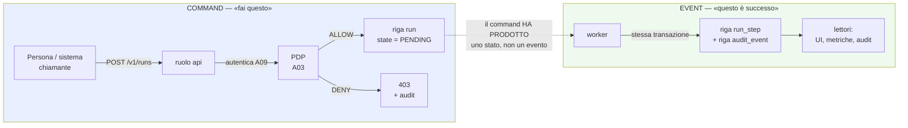

#### Come leggerlo

A sinistra il percorso di un **command**: entra da fuori, viene autenticato (`A09`), viene
autorizzato (`A03`), e **può essere respinto**. Il suo effetto è una riga di stato.

A destra il percorso di un **event**: nasce **dentro** una transazione già decisa, non viene
autorizzato perché non chiede niente, ed è immutabile (`INV-05`: l'audit è append-only e non
condivide tabella con lo stato mutabile).

Il confine importante è la freccia tratteggiata: **un command produce stato, non un evento
che poi qualcuno esegue.** Non esiste, nella nostra architettura, un percorso in cui scrivere
un evento fa partire un'azione. È `AR-EV-13`, ed è la forma concreta di `ADR-138` (nessun
event bus: gli agent non reagiscono a eventi).

---

## 5. Workflow contro Agent: quando usare quale

### In breve

Se sai già la sequenza, **scrivila**. Non chiedere a un modello da 9 miliardi di parametri di
ricordarsi ogni volta un ordine che tu conosci già.

### Perché è una decisione importante

Usare un agent per orchestrare qualcosa di deterministico costa tre volte: **token** (ogni
passo è una chiamata al modello, e `ADR-039` fissa `max_model_len` come decisione di
**capacità**, non di comodità), **latenza**, e **rischio** (il modello può sbagliare un ordine
che il codice non avrebbe mai sbagliato). `R-11` ha già mostrato che il multi-agent compra
qualità **con i token**, e noi il tetto sui token non possiamo comprarlo col denaro.

### Il test, in quattro domande

Un processo va scritto come **workflow deterministico** se **tutte e quattro** hanno risposta
affermativa:

1. **La sequenza dei passi è nota prima di iniziare?** (non "quasi sempre": *nota*)
2. **Le diramazioni sono esprimibili come condizioni su dati, senza giudizio?**
   ("se `importo > 1000`" sì; "se il cliente sembra insoddisfatto" no)
3. **L'insieme dei passi è stabile nel tempo, cioè non cambia a ogni esecuzione?**
4. **Il valore aggiunto del modello sarebbe solo la formulazione del testo, non la scelta
   delle azioni?**

Se anche una sola risposta è "no", è un **agent run**. Se tutte e quattro sono "sì" **ma** un
passo intermedio richiede una scelta linguistica o interpretativa, è **`HYBRID`**: workflow
che in un punto chiama un run agentico.

### FATTO / INFERENZA / DECISIONE

> **FATTO** (`ADR-028`, già deciso in `A04`): esistono tre modi, e Day-1 è attivo solo
> `AGENTIC`.
>
> **FATTO** (dal committente, registrato in `AS-20` ora risolta): ~90 % dei casi CRM reali è
> **una singola chiamata a tool**, 3-5 step.
>
> **INFERENZA**: se il 90 % dei casi è un singolo tool call, la maggior parte del valore di un
> workflow engine (orchestrazione di lunghe sequenze) **non ci serve Day-1**. Il valore che
> ci serve è **la sopravvivenza al crash di un singolo passo**, che è una cosa molto più
> piccola.
>
> **DECISIONE ARCHITETTURALE**: Day-1 non esiste nessun `WorkflowDefinition`, e il modo
> `WORKFLOW` resta non implementato finché `T-RT-02` (un tipo di compito ha traiettoria
> stabile su N esecuzioni) non scatta. Ma **il modello di durabilità progettato qui è già
> quello dei workflow**, quindi l'arrivo del modo `WORKFLOW` non richiede un secondo motore.

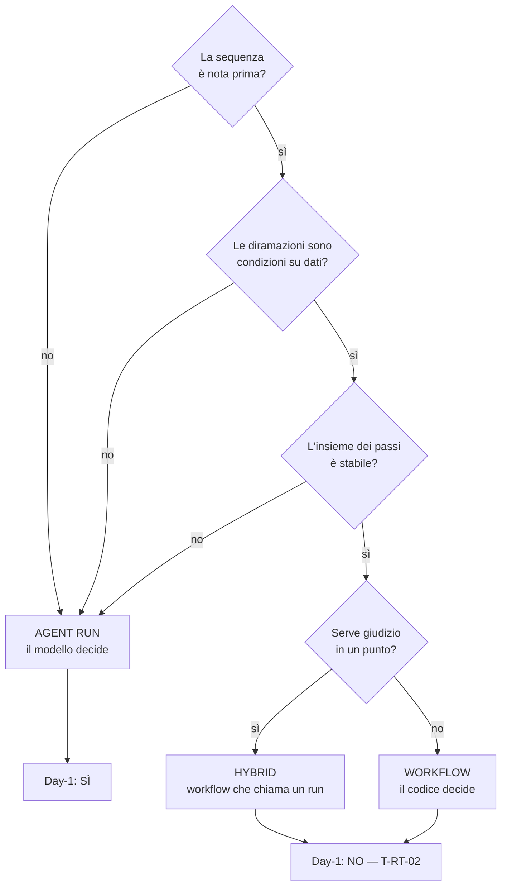

#### Come leggerlo

L'albero si legge dall'alto. Ogni "no" scarica verso l'agent, perché **l'agent è il default**
quando l'incertezza è reale. Il punto importante è il riquadro in basso: le due forme
deterministiche **esistono nel modello ma non nel codice Day-1**. Non è pigrizia: `ADR-028` ha
già stabilito che promuovere un compito a workflow richiede **dati su traiettorie reali** che
oggi non abbiamo (`DEF-11`, esplicitamente rimandata).

---

## 6. Workflow contro Tool: dove passa il confine

Il prompt propone un'ipotesi: *"invia email"* è un tool, *"prepara il report mensile → ottieni
approvazione → genera PDF → invia email → registra il completamento"* è un workflow. È
un'ipotesi ragionevole ma **non è il criterio giusto**, perché guarda la lunghezza invece che
la responsabilità.

### Il criterio vero: **quante decisioni di autorizzazione contiene?**

`ADR-048` ha già stabilito il principio: **un tool = una decisione di autorizzazione**. Da lì
il confine viene da sé:

| Se la cosa… | allora è… | perché |
|---|---|---|
| richiede **una** decisione di autorizzazione | un **Tool** | il PEP decide una volta, `ADR-048` |
| richiede **N** decisioni di autorizzazione, in sequenza nota | un **Workflow** | ogni passo passa dal suo `AUTHORIZE`; nessun passo eredita il permesso del precedente |
| richiede **N** decisioni **il cui numero e ordine non sono noti** | un **AgentRun** | è la definizione stessa di `ADR-027` |
| non tocca niente all'esterno e non ha bisogno di permessi | **codice normale**, dentro un tool o dentro il runtime | non c'è niente da autorizzare |

**Contro-argomento onesto.** Questo criterio ha un effetto collaterale: rende quasi impossibile
scrivere un tool "comodo" che faccia due cose insieme (per esempio "crea l'opportunità e
mandala al commerciale"). Chi implementa sentirà l'attrito, ed è esattamente `R-18` (il costo
di scrivere un tool produce scorciatoie). Il rimedio è lo scaffolding di `A06`, non
l'allentamento del criterio: un mega-tool che fa due cose è un mega-tool che **si autorizza
una volta sola per due effetti**, cioè un buco.

### L'esempio del prompt, risolto con il nostro criterio

*"Prepara il report mensile → approvazione → PDF → email → registra"*:

* "prepara il report" = una o più `READ` autorizzate → **tool** (o canale di retrieval);
* "approvazione" = **non è un passo**, è un'**obbligazione** `REQUIRE_APPROVAL` prodotta dal
  PDP (`ADR-021`) su uno dei passi successivi;
* "genera PDF" = trasformazione locale → **tool**, con l'artifact salvato per riferimento in
  `BlobStore` (`ADR-073`, `ADR-140`);
* "invia email" = un `SIDE_EFFECT` **irreversibile** → **tool**, e per `AR-RT-12`/`ADR-035` va
  **il più tardi possibile** nella sequenza;
* "registra il completamento" = è già lo `RECORD` del loop, non un passo da progettare.

**Conclusione:** l'esempio del prompt Day-1 è **un agent run di 4-5 step**, non un workflow. E
lo diventerà quando lo si sarà visto ripetere identico N volte (`T-RT-02`), non prima.

---

## 7. La scelta dell'architettura di esecuzione

Questa è la sezione che il prompt chiede di non saltare: **ricerca prima, scelta dopo**. La
ricerca è §3. Qui ci sono le alternative, il confronto, la scelta, e il tentativo di
demolirla.

### 7.1 I requisiti reali, prima delle opzioni

Prima di confrontare, va scritto **cosa ci serve davvero**. Molti confronti fra workflow
engine sono inutili perché confrontano capacità che il progetto non userà.

| # | Requisito | Da dove viene | Quanto è duro |
|---|---|---|---|
| E1 | Un run deve sopravvivere al riavvio del processo e alla morte del worker | `A04`, `R-06b` | **duro** |
| E2 | Deve essere possibile dire, dopo un crash, se un side effect è avvenuto o no | `ADR-032`, `AR-ID-16` | **duro** |
| E3 | Un run non deve mai superare 50 step / 10 minuti attivi, **per albero** | `ADR-104`, `ADR-128`, `INV-18` | **duro** |
| E4 | Un run in attesa di una persona non deve occupare un worker | `AR-RT-10` | **duro** |
| E5 | L'autorità non deve mai crescere alla ripresa | `INV-13`, `AR-RT-16` | **duro** |
| E6 | Ogni riga di lavoro deve portare `tenant_id` ed essere sotto RLS | `INV-02`, `AR-017` | **duro** |
| E7 | Nessun broker, nessuna coda nuova, nessun event bus | `ADR-002`, `ADR-138`, `AR-002` | **duro** (decisione già presa) |
| E8 | Lavoro di background ricorrente (purge di `A08`, sweep e ingestion di `A07`) | `ADR-081`, `ADR-098` | **duro** |
| E9 | Throughput Day-1 nell'ordine di decine di run concorrenti | `AS-01` (Media) | **morbido** |
| E10 | Un team di 1-3 persone senza SRE dedicato | `AS-04` (Alta) | **duro, di fatto** |
| E11 | Scheduling ricorrente semplice | `A07`, `A08` | morbido |
| E12 | Callback esterni | futuro (`A18`) | **non Day-1** |

Nota su E9 e E10: sono i due requisiti che la letteratura sui workflow engine tende a
ignorare, e sono quelli che nel nostro caso decidono.

### 7.2 La matrice di selezione

Le cinque opzioni del prompt, valutate contro E1-E12. Legenda: **++** ottimo, **+** adeguato,
**~** possibile con lavoro, **−** inadeguato, **−−** dannoso.

| Criterio | **A** — PostgreSQL + worker (nostro) | **B** — Redis + stato applicativo | **C** — broker + engine applicativo | **D** — engine durevole dedicato (Temporal / DBOS / `pg_durable`) | **E** — event-driven distribuito (Kafka/NATS) |
|---|---|---|---|---|---|
| Semplicità Day-1 | **++** un solo datastore, già presente | + | − | ~ (DBOS/`pg_durable`: +) / − (Temporal) | −− |
| Durabilità | **++** WAL, transazioni, backup unico | − (Redis non è il posto dello stato di verità) | + | ++ | + |
| Run lunghi / sospesi | **++** una riga con `wakeup_at` | ~ | + | ++ | ~ |
| Scheduling | + riga con `next_run_at` | ~ | + | ++ | − |
| Retry | **++** `attempt` + backoff in riga | + | + | ++ | ~ |
| Approvazione umana | **++** è uno stato, non un problema | ~ | ~ | + | −− |
| Callback esterni | + (quando servirà) | ~ | + | ++ | + |
| Idempotency | **+** ce la mettiamo noi (`INV-06`) | + | + | **+ ma non oltre il confine esterno** | + |
| Observability | + query SQL dirette | − | ~ | ++ (UI inclusa) | ~ |
| Scalabilità | ~ fino a `T-02` | + | ++ | ++ | ++ |
| Complessità operativa | **++** zero componenti nuovi | − | −− | − (Temporal) / ~ (DBOS) | −− |
| Recovery | **+ se scritto bene** — ed è `R-06b` | − | ~ | ++ | ~ |
| Complessità di migrazione **verso** | — | media | alta | **media** | alta |
| **Raccomandazione** | **SCELTA Day-1** | respinta | respinta | **respinta Day-1, candidata n.1 al futuro** | respinta |

### 7.3 La decisione

> ## `ADR-141` — Nessun engine di durable execution dedicato: il motore è il loop su PostgreSQL
>
> **Decisione.** L'architettura di esecuzione Day-1 è **PostgreSQL + processi worker**:
> tabella di lavoro con `FOR UPDATE SKIP LOCKED`, lease con fencing token, step journal
> transazionale, contatori di budget per albero. **Nessun engine di durable execution**
> (Temporal, DBOS, `pg_durable`, Absurd, Restate, Inngest, Hatchet) viene adottato Day-1.
> Questo **conferma `ADR-002`** e ne rafforza l'argomento.
>
> **Reversibilità:** **moderata**. Lo schema è nostro e resta nostro; ciò che si sposterebbe
> è *chi fa avanzare la macchina*. §32 definisce il contratto stabile che rende la migrazione
> possibile senza riscrivere `A04`, `A06`, `A09`.
>
> **Scadenza:** **prima dello schema del database**, come `ADR-002` e `ADR-029`.

### 7.4 Perché — i tre argomenti, in ordine di forza

**Argomento 1 (il più forte): la forma della durable execution non corrisponde alla forma del
nostro problema.**

> **FATTO** (`R-04`): DBOS garantisce semantica exactly-once transazionale **quando lo step
> scrive sullo stesso PostgreSQL che contiene lo stato del workflow**.
>
> **FATTO** (`INV-07`, `ADR-067`): i nostri side effect **non** atterrano sul nostro
> PostgreSQL. Atterrano su Odoo, su un server di posta, su un ERP. La piattaforma non è mai
> system of record di un dato aziendale esterno.
>
> **INFERENZA**: la garanzia più preziosa che un engine Postgres-based offre — l'atomicità
> fra "lo step è registrato" e "l'effetto è avvenuto" — **su di noi non si applica**, perché
> l'effetto avviene oltre il confine transazionale. Quello che ci resterebbe è la gestione del
> journal e dei retry: cose che dobbiamo comunque scrivere noi, perché devono portare
> `tenant_id`, `decision_id`, `trust_class` e il ledger d'albero.
>
> **DECISIONE**: non compriamo una garanzia che sul confine che conta non ci verrebbe data.

**Argomento 2: due state machine per la stessa cosa violano il Single Owner.**

Un engine di durable execution possiede **lo stato di avanzamento**. `A04` possiede già lo
stato di avanzamento: 13 stati, journal, `step_index`, `attempt`. Adottare un engine
significherebbe avere lo stato in due posti — il loro e il nostro — e dover tenere allineate
due verità. La convenzione (§19) è esplicita: se una responsabilità sembra appartenere a due
componenti, **non lasciarla ambigua**. Qui l'unico modo di non lasciarla ambigua sarebbe
togliere il journal ad `A04`, e il journal ad `A04` serve per **cinque** cose diverse (context,
audit, recovery, spiegazione all'utente, promozione a workflow), di cui una sola è il recovery.

**Argomento 3 (il più debole, ma vero): il costo operativo.**

`AS-04` (il team è 1-3 persone senza SRE dedicato, confidenza **Alta**) rende Temporal una
scelta che va contro il vincolo più concreto del progetto. Lo registro come **terzo**, non
come primo, perché è l'argomento che l'evidenza può ribaltare più facilmente: se il team
crescesse (`T-04`), questo argomento cadrebbe da solo — e gli altri due no.

### 7.5 Le alternative, valutate onestamente

**Perché non DBOS.** È la vera alternativa seria, e va detto: **è una libreria, non un
cluster**, quindi non violerebbe `ADR-001` (single artifact, multi-role process) e non
aggiungerebbe un sistema distribuito. Il motivo per cui non la prendiamo è l'Argomento 2, non
l'Argomento 3. Se un giorno ci accorgessimo che il nostro codice di recovery è fragile
(`T-RT-06`: più di 2 correzioni al codice di recovery nel primo trimestre), DBOS o
`pg_durable` sono **il primo posto dove guardare**, non Temporal. → `T-EV-04`, `B-70`.

**Perché non `pg_durable`.** Stesso ragionamento, con un vantaggio in più (è dentro il
database, quindi il recovery è nella stessa transazione) e uno svantaggio in più: i workflow
si definiscono **in SQL**, e i nostri "workflow" sono chiamate a un modello e a connector
Python. Sposteremmo la logica di orchestrazione in un linguaggio in cui non possiamo esprimere
`AR-RT-01` (fra `DECIDE` e `EXECUTE` c'è sempre `AUTHORIZE`, applicato **dai tipi**). Perdere
l'enforcement per tipi sarebbe un peggioramento netto della sicurezza.

**Perché non Absurd.** Un singolo file `.sql` di ~1.685 righe è affascinante e sarebbe il
minimo costo di adozione, ma diventerebbe una dipendenza critica **non manutenuta da noi**
sul percorso più delicato del sistema. Se comunque dobbiamo capire ogni riga di quel file
per fidarci del recovery, tanto vale che quelle righe siano nostre e testate dai nostri test
che uccidono il worker.

**Perché non Redis.** Redis non è dove vive lo stato di verità. Metterci la coda significa
avere due sistemi che possono divergere: la coda dice che un run è in esecuzione, il database
dice che è `PENDING`. `AR-019` (nessun datastore nuovo senza una misura del limite attuale)
lo vieta finché non abbiamo la misura, e `T-01` (p95 di enqueue > 100 ms per contesa su
PostgreSQL) è già la soglia dichiarata.

**Perché non RabbitMQ / NATS.** Sono trasporti di messaggi. Noi non abbiamo un problema di
trasporto: abbiamo **un processo e un database sulla stessa macchina** (`ADR-001`). Un broker
risolverebbe il fan-out fra servizi che non abbiamo.

**Perché non Kafka.** Kafka è un log distribuito partizionato per throughput e replay di
stream. Non abbiamo stream, non abbiamo consumer group, non abbiamo il volume. Sarebbe
l'esempio da manuale di ciò che la convenzione §34 vieta: introdurre un componente perché è
moderno. E aggiungerebbe un problema di **retention** che collide con `ADR-098` (cancellazione
della memoria: tombstone + purge, irreversibile) — un log immutabile e la cancellazione su
richiesta si combattono.

**Perché non cron + database.** È la proposta più onesta fra le alternative "semplici", e in
effetti il nostro scheduler **assomiglia** a cron. La differenza che ci serve: cron non sa
niente di tenant, non sa niente di lease, non ha `attempt`, non sopravvive raccontandoti cosa
stava facendo. Useremo il **pattern** di cron (una riga con `next_run_at`) dentro un processo
nostro (`ADR-151`), che è diverso dal delegare a `crond` la vita dei nostri job.

**Perché non lasciare che sia l'agent a gestire il proprio stato.** Perché il modello è
`trust_class`-mente un input non fidato (`AR-009`, `INV-03`). Se lo stato di avanzamento
fosse una cosa che il modello si porta nel context, un prompt injection potrebbe riscrivere
"ho già ottenuto l'approvazione". Lo stato è una riga in una tabella che il modello **non può
scrivere**. Questo è il punto più importante di tutta la sezione, e vale la pena dirlo
esplicitamente: **la durable execution è anche un controllo di sicurezza**, non solo di
affidabilità.

### 7.6 Perché non l'event sourcing (anticipazione: §21 lo formalizza)

Il replay di un event log richiede che il **fold** sia deterministico. Il nostro fold
conterrebbe chiamate a un modello sotto continuous batching, che `ADR-042` e `R-12` hanno
già dichiarato **non deterministico**. E la cancellazione irreversibile di `ADR-098`
(tombstone + purge sulla memoria, che è **irreplaceable**) è strutturalmente incompatibile con
un log immutabile di tutto. → `ADR-147`.

### 7.7 Il contro-argomento onesto a `ADR-141`

Se dovessi attaccare questa decisione, attaccherei così:

> *"Stai scrivendo a mano il pezzo di software che l'industria ha impiegato dieci anni a fare
> bene, e lo stai facendo con un team di 1-3 persone. `R-06b` dice, con parole tue, che il
> codice di recovery è il rischio più concreto dell'architettura. La conclusione coerente con
> il tuo stesso rischio non è 'lo scriviamo noi con cura': è 'non lo scriviamo'."*

È un attacco serio e non ho una confutazione completa. Ho tre risposte parziali:

1. **Il perimetro di ciò che scriviamo è molto più piccolo di un workflow engine.** Non
   scriviamo determinismo, versioning delle workflow definition, signal, query, child workflow,
   timer distribuiti. Scriviamo: un lease con fencing, una classificazione a quattro esiti al
   restart, due contatori. È misurabile in centinaia di righe, non migliaia.
2. **Il pezzo difficile non ce lo toglierebbe nessuno.** La domanda "questa fattura è stata
   creata?" richiede idempotency key o verificabilità **presso Odoo**. Nessun engine risponde
   a quella domanda.
3. **Abbiamo un trigger già armato.** `T-RT-06` esiste dal documento `A04` e adesso ha una
   destinazione precisa (`T-EV-04` → DBOS/`pg_durable`, non Temporal). Se l'attacco ha
   ragione, ce ne accorgeremo entro un trimestre e sapremo dove andare.

Se dovessi scommettere: **la decisione regge**, ma è la seconda meno solida del documento dopo
la classificazione del recovery (§10). La confidenza è **Media**, non Alta, ed è dichiarata in
§37.

---

## 8. Il modello dei Command

### In breve

Un command è l'unico modo dal quale il mondo esterno può far succedere qualcosa. Passa dalla
API, viene autenticato, viene autorizzato, e produce **stato**, non azione immediata.

### 8.1 I command Day-1

| Command | Endpoint | Chi può | Effetto | Esito sincrono |
|---|---|---|---|---|
| `StartRun` | `POST /v1/runs` | un `HumanSubject` autenticato, o un `ServicePrincipal` dichiarato (`AR-GP-06`) | crea `run` in `PENDING` + `run_tree` | `202` + `run_id` |
| `CancelRun` | `POST /v1/runs/{id}/cancel` | chi ha avviato il run, o un ruolo amministrativo del tenant | scrive `cancel_requested_at` sull'**albero** | `202` |
| `GrantApproval` | `POST /v1/approvals/{id}` con `decision = GRANT` | l'approver risolto dal PDP; `AR-GP-12` (chi approva ≠ chi ha avviato, quando la policy lo richiede) | consuma l'approvazione **una sola volta** (`AR-ID-25`) e risveglia il run | `200` |
| `RejectApproval` | `POST /v1/approvals/{id}` con `decision = REJECT` | come sopra | il run va in `FAILED` | `200` |
| `ResolveUncertain` | `POST /v1/runs/{id}/uncertain/{step_index}` | un ruolo umano abilitato | chiude un `UNCERTAIN` dichiarando l'esito accertato | `200` |

### 8.2 Le cinque proprietà di ogni command

**Identità.** Ogni command produce una riga di audit con `actor` e `on_behalf_of` (`INV-15`),
`tenant_id`, e il `command_id` (`uuidv7()`).

**Autorizzazione.** Ogni command passa dal PDP (`AR-013`, `AR-ID-22`: nessun controllo è
saltato perché il chiamante è locale). In particolare `CancelRun` **non** è "gratis": cancellare
il run di un'altra persona è un'azione con conseguenze e va autorizzata.

**Idempotenza.** Il client può passare un header `Idempotency-Key`. Il server lo memorizza su
`run.client_idempotency_key` con un vincolo `UNIQUE (tenant_id, client_idempotency_key)`: una
seconda `POST /v1/runs` con la stessa chiave restituisce **lo stesso `run_id`**, non un run
nuovo. Senza questa regola, un doppio click su un pulsante crea due run che agiscono entrambi
sul CRM. È il caso di duplicazione **più probabile in assoluto** e costa una colonna.

**Correlazione.** Il command porta il `traceparent` W3C se presente (`ADR-137`); il
`trace_id` viene registrato **come correlazione, mai come stato** e **non entra in nessuna
decisione di autorizzazione** (`AR-ID-02`).

**Semantica del risultato.** `StartRun` e `CancelRun` sono **asincroni**: restituiscono `202`
e un identificatore, mai il risultato del lavoro. Chi vuole il risultato fa `GET /v1/runs/{id}`.
Questo è ciò che permette a `AR-RT-10` (nessun run in attesa occupa un worker) di essere vero
anche lato API: **nessuna richiesta HTTP resta appesa in attesa che un umano approvi.**

### 8.3 Come si comporta `CancelRun` (dettaglio in §15)

`CancelRun` **non ferma niente immediatamente**. Scrive una riga. La cancellazione è
cooperativa e si osserva ai confini di passo (`ADR-034`, `AR-RT-06`). Un `SIDE_EFFECT` già
`IN_FLIGHT` **viene lasciato finire**: interromperlo a metà produrrebbe un `UNCERTAIN`
inutile, cioè trasformerebbe una cancellazione pulita in un problema da escalare.

### 8.4 I command che **non** esistono, e perché

| Command assente | Perché |
|---|---|
| `ResumeRun` / `RetryRun` | riprendere un run terminato significherebbe **riusare un'autorità congelata in un momento passato**. Viola `INV-13`. Il rimedio è avviare un run nuovo |
| `PauseRun` (pausa manuale) | una pausa arbitraria estende la finestra in cui un `MemorySnapshot` revocato resta nel prompt (`R-43`) senza nessun beneficio. Le uniche pause sono quelle **causate dal sistema**: approvazione, input, callback |
| `SkipStep` | permettere a un umano di saltare uno step significa permettergli di aggirare il PDP dall'esterno. Viola `AR-GP-23` (non esiste accesso di emergenza che salti il PDP) |
| `EditRunState` | qualunque scrittura manuale sullo stato di un run rende il journal non affidabile. Se serve un intervento, si cancella e si riavvia |
| `TriggerRunFromEvent` | `ADR-138` / `AR-EV-13`: gli agent non reagiscono a eventi |

---

## 9. Job, coda e lease: chi prende il lavoro

### In breve

C'è una tabella di lavoro. I worker ci pescano dentro con `FOR UPDATE SKIP LOCKED`, si
prendono una **prenotazione a scadenza** (lease), lavorano, e la rinnovano finché servono. Se
un worker muore, la prenotazione scade e qualcun altro può raccoglierla — ma solo dopo aver
capito a che punto era.

### 9.1 Due entità, non una

> ## `ADR-142` — Il `job` è un'entità distinta dal `run`
>
> **Decisione.** Esistono due tipi di lavoro con due tabelle e due cicli di vita:
> **`run`** (un compito di un agent, con principal, ceiling, journal e modello) e **`job`**
> (un'unità di manutenzione deterministica, senza modello e senza autorità di dominio).
> **Un solo pool di worker** li esegue entrambi.
>
> Un `job` **non** chiama mai il modello, **non** esegue mai un tool con
> `side_effects ≠ READ`, e **non** avvia mai un `run` (`AR-EV-12`, `AR-EV-13`).
>
> **Reversibilità:** facile (sono due tabelle). **Motivo:** se `job` e `run` fossero la stessa
> entità, la purge della memoria e l'invio di una fattura passerebbero dallo stesso percorso di
> autorizzazione, e prima o poi qualcuno metterebbe un tool con effetti in un job schedulato —
> ottenendo un agent che agisce **senza un umano dietro**. È `R-61`.

### 9.2 A cosa servono i job Day-1

Questi lavori esistono già nei documenti precedenti, e nessuno finora aveva detto **chi li
esegue**. Li esegue il pool di worker, come `job`:

| Job Day-1 | Da dove viene | Frequenza | Note |
|---|---|---|---|
| `memory_purge` | `ADR-098`, `AR-ME-17` (tombstone immediato + purge asincrona, **irreversibile**) | ricorrente | agisce **solo** su righe già `DELETED` oltre la finestra di grazia. `R-38` |
| `document_poll` | `ADR-081` (polling incrementale) | ricorrente per sorgente | `READ` verso la sorgente con la credenziale del connector (`AR-GP-03`) |
| `reconciliation_sweep` | `ADR-081` | ricorrente, più rada | recupera ciò che il polling incrementale ha perso |
| `grant_projection_refresh` | `ADR-072`, `AR-KN-09` | ricorrente | se è in ritardo, il retrieval **fail closed**: il job in ritardo è un rischio di **disponibilità**, non di sicurezza |
| `embedding_backfill` | `A07` | on demand | mai sulla GPU (`AR-KN-16`) |
| `lease_reaper` | questo documento | frequente | §10.2 |
| `outbox_drain` | `ADR-149` | frequente | §22 |
| `tree_reaper` | `ADR-157` | frequente | chiude i discendenti di un albero cancellato |

**Osservazione importante:** cinque di questi otto job **esistevano già come requisito** nei
documenti precedenti senza un esecutore dichiarato. Questo è il debito che `A11` salda.

### 9.3 Il ciclo di prelievo, in un diagramma

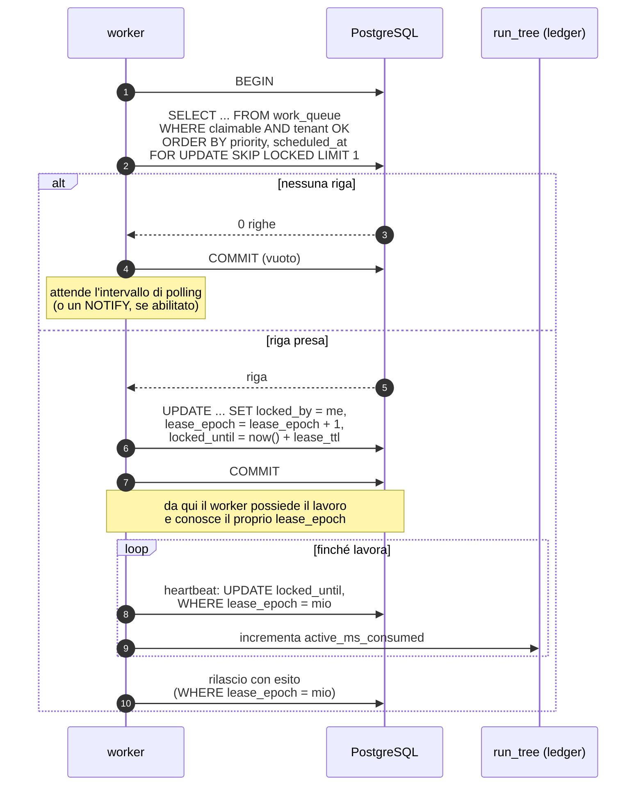

#### Come leggerlo

Il punto centrale è al passo 5: `lease_epoch + 1`. È un **fencing token**. Ogni scrittura
successiva del worker porta il proprio epoch e ha come condizione `WHERE lease_epoch = <mio>`.
Se nel frattempo il lease è scaduto e un altro worker ha preso il lavoro (epoch superiore), le
scritture del worker vecchio **non colpiscono zero righe per fortuna: colpiscono zero righe per
costruzione**. Senza questo, `AR-RT-08` (un run è eseguito da un solo worker per volta) è una
speranza; con questo, è `INV-22`.

Il secondo punto è nel `loop`: l'heartbeat non serve solo a dire "sono vivo". Serve anche a
**pagare il tempo attivo** (§12). Chi non batte, non consuma budget — ed è la ragione per cui
`R-60` esiste.

### 9.4 `ADR-143` — Lease con fencing token e heartbeat

> **Decisione.** Il possesso di un'unità di lavoro è un **lease a scadenza** con tre colonne:
> `locked_by` (identità del worker), `locked_until` (istante di scadenza), `lease_epoch`
> (intero monotono, il fencing token). Il recovery avviene **per scadenza del lease**, mai per
> "il processo sembra morto".
>
> **Alternative considerate:**
>
> | Alternativa | Perché no |
> |---|---|
> | lock a livello di riga tenuto per tutta la durata | una transazione lunga quanto un run tiene aperto un `xid` per minuti, gonfia il bloat e blocca il `VACUUM` |
> | advisory lock di sessione | muore con la connessione, e con un connection pooler la connessione non coincide col worker |
> | heartbeat verso un registro dei worker | `ADR-017` lo vieta: i worker prendono lavoro, non lo ricevono; registrarli riporta la riconciliazione |
> | nessun lease, un solo worker per sempre | non sopravvive al secondo worker, che arriva al primo problema di throughput |
>
> **Trade-off:** guadagniamo recovery automatico e nessun lavoro incastrato per sempre;
> perdiamo la certezza istantanea (fra la morte del worker e la scadenza del lease passa
> `lease_ttl`, durante il quale il lavoro sta fermo). Il valore di `lease_ttl` è
> **`NON ANCORA DECISO`**: dipende dalla latenza massima accettabile di uno step, che dipende
> da `B-14` (context realistico su 20 GB di VRAM) e da `B-26` (latenza dell'embedding su CPU).
> Vincolo che possiamo scrivere adesso senza inventare numeri:
> `lease_ttl > 3 × heartbeat_interval` e `lease_ttl > p99 della durata di uno step`.
>
> **Contro-argomento onesto:** un lease troppo corto trasforma un worker lento in un worker
> "morto" e produce doppioni sui tool non idempotenti. Un lease troppo lungo lascia il lavoro
> fermo dopo un crash. Non esiste un valore giusto in astratto — esiste solo un valore
> **misurato**, e finché non lo misuriamo questa è la parte più fragile del meccanismo.

### 9.5 Il worker: responsabilità e non responsabilità

**Responsabilità del worker**

* prelevare lavoro con `FOR UPDATE SKIP LOCKED` rispettando priorità, classe e cap per tenant;
* mantenere il lease vivo con heartbeat, e pagare il tempo attivo al ledger;
* eseguire **un passo alla volta** del loop di `A04`;
* scrivere ogni transizione durevole **in una sola transazione** insieme all'audit
  (`AR-EV-22`, `AR-031`/`AR-032`);
* osservare la cancellazione **ai confini di passo**;
* rilasciare il lease in modo pulito allo shutdown (drain, §29).

**Non responsabilità del worker**

* **non** decide cosa fare (è `A04` che chiama il modello);
* **non** decide se è permesso (è il PDP);
* **non** conosce segreti: riceve un client già autenticato dal `Credential Broker`
  (`ADR-056`, `ADR-108`, `INV-14`);
* **non** si registra da nessuna parte (`ADR-017`);
* **non** parla con altri worker: `AR-002` (`api` e `worker` comunicano solo tramite il
  database) vale anche fra worker;
* **non** cancella righe di audit, mai (`INV-05`).

### 9.6 Coda unica o code separate?

**Decisione: una tabella logica di lavoro con una colonna `work_class`**, non N tabelle.

Il motivo è la fairness: se `run` e `job` stessero in code separate, un worker dovrebbe
decidere con quale politica alternare fra le due, e quella politica sarebbe codice invece che
dato. Con una tabella sola la politica è **la clausola `ORDER BY` della query di prelievo**,
che è ispezionabile, modificabile senza deploy (sta nel `ConfigSnapshot`, `ADR-012`) e
identica per tutti i worker. È la stessa logica di `ADR-047` (la priorità si risolve nella
query di prelievo, non con uno scheduler).

**Trade-off dichiarato:** una tabella sola è anche un solo punto di contesa. Con `SKIP LOCKED`
la contesa è bassa per costruzione, ma non è zero, e non l'abbiamo misurata: → **`B-67`**,
e `T-01` è già la soglia dichiarata (p95 di enqueue > 100 ms).

### 9.7 Polling o `LISTEN`/`NOTIFY`?

**Day-1: polling a intervallo fisso.** Motivo: è l'unico meccanismo che funziona identico con
un connection pooler, dopo una disconnessione, e con più worker, senza casi speciali.

**FATTO** (`R-05`): `NOTIFY` non è una coda durevole — un `NOTIFY` emesso mentre un
ascoltatore è disconnesso è **perso**. Quindi `LISTEN`/`NOTIFY` può solo **accelerare** il
polling, mai sostituirlo: il polling resta la rete di sicurezza.

**Il costo dichiarato:** con polling puro, la latenza di avvio di un run è in media metà
dell'intervallo di polling. Se l'intervallo è "qualche secondo", un utente che preme un
pulsante aspetta qualche secondo **prima ancora** che il modello inizi a pensare. Questa è
`AS-34`, confidenza **Media**, e la sua falsificazione è `T-EV-01`.

**Rimedio già identificato, non implementato Day-1:** `NOTIFY` all'`INSERT` come sveglia
opportunistica, con il polling che resta. Prima serve **`B-68`** (comportamento dietro
transaction pooling).

---

## 10. Il crash: cosa sopravvive, cosa si ricostruisce, cosa non si saprà mai

Questa è la sezione centrale del documento.

### In breve

Al riavvio non "riprendiamo da dove eravamo". **Guardiamo cosa c'è scritto e classifichiamo.**
Il sistema non prova a ricordare: legge.

### 10.1 Lo stato durevole minimo

La domanda del prompt è precisa: *quale stato deve sopravvivere a un riavvio del processo?*
La risposta è: **tutto ciò che, se perso, renderebbe impossibile rispondere a una delle cinque
domande del recovery.**

Le cinque domande sono: *quale run era in corso? quale step era attivo? lo step è stato
completato? è sicuro ritentare? quale autorizzazione esisteva? quali output sono stati
prodotti?*

| Dato | Dove vive | Perché deve essere durevole | Ricostruibile? |
|---|---|---|---|
| `run`: stato, `agent_version_id`, `config_snapshot_hash`, `priority`, `tree_id`, lineage (`root_run_id`, `parent_run_id`, `parent_step_index`, `depth`) | tabella `run` | è l'identità dell'esecuzione. Il lineage è Day-1 e **degenere** (`ADR-125`) | **no** |
| `run_tree`: `steps_budget`, `steps_consumed`, `active_ms_budget`, `active_ms_consumed`, `deadline_at`, `cancel_requested_at` | tabella `run_tree` | è il ledger di `INV-18`. Perderlo significa perdere il tetto | **no** |
| `run_step`: `step_index`, `attempt`, `state`, `tool_version_id`, `args_hash`, `idempotency_key`, `decision_id`, `dispatched_at`, `result_ref`, `error_class` | tabella `run_step` | è il journal. Risponde a **quattro delle cinque domande** | **no** |
| `ConfigSnapshot` risolto | referenziato per hash (`ADR-012`) | garantisce che alla ripresa il run usi la **stessa** configurazione di quando è partito | sì, dall'hash, se le versioni esistono ancora |
| `MemorySnapshot` | referenziato (`ADR-092`) | congelato all'avvio; alla ripresa **non si ricalcola** | sì, per riferimento |
| contesto di delega | riga (`ADR-113`: la delega non è un token) | serve a sapere **se** è ancora valida alla ripresa | **no** |
| decisione del PDP per lo step (`decision_id`) | `audit_event` | `INV-01`: nessun side effect senza decisione registrata | **no** |
| prompt inviato al modello | **non persistito integralmente** | `ADR-042`: si promette la riproducibilità dell'**evidenza**, non dell'output. Si registrano gli hash e i riferimenti | sì, per ricostruzione da hash |
| frammenti recuperati | riferimenti + hash (`ADR-083`) | audit del retrieval per identificatori, **mai testo** | sì |
| output del modello | `result_ref` + hash | serve per l'audit e per il context | no, ma non serve rigenerarlo |
| artifact prodotti | `content_hash` nel `BlobStore` (`ADR-073`, `ADR-140`) | mai dentro lo stato del run | sì |

**Regola derivata (`AR-EV-24`):** nello stato di esecuzione non entra mai un contenuto, solo
un **riferimento**. La ragione è doppia: dimensione (uno stato che contiene un PDF diventa
illeggibile e non migrabile) e sicurezza (`AR-ID-28`: nessun evento di audit contiene segreti,
token, contenuto di documenti, campi di dominio).

### 10.2 Il protocollo a tre scritture

> ## `ADR-144` — Protocollo a tre scritture per gli step con effetto, e recovery a quattro esiti
>
> **Problema.** `ADR-029` garantisce che uno step si scriva `PENDING` **prima** dell'effetto.
> Ma `PENDING` significa *"ho deciso di farlo"*, non *"ho cominciato a farlo"*. Fra la
> scrittura di `PENDING` e il primo byte inviato possono passare millisecondi o secondi: se il
> processo muore lì, `PENDING` non dice se il byte è partito.
>
> **Decisione.** Ogni step con `side_effects ≠ READ` attraversa **tre scritture committate**:
>
> 1. **`PENDING`** — scritto insieme alla decisione del PDP e al consumo del ledger, in una
>    transazione. Nulla è ancora partito.
> 2. **`IN_FLIGHT`** — scritto e committato nell'istante **immediatamente precedente** alla
>    prima operazione di rete verso il sistema esterno, con `dispatched_at` e `attempt`.
> 3. **esito** — `SUCCEEDED` / `FAILED` / `UNCERTAIN`, con `result_ref` e `error_class`.
>
> **Reversibilità:** costosa (è schema e protocollo). **Scadenza: prima dello schema.**

**Il costo, dichiarato onestamente:** una scrittura sincrona in più per ogni step con effetti,
sul percorso critico. Con `max_steps = 50` e ~90 % dei compiti a 3-5 step, l'ordine di
grandezza è di poche scritture per compito — trascurabile rispetto a una chiamata al modello.
Ma è un costo reale e va misurato (`M-EV-3`, §30).

**Perché non basta una scrittura sola con un flag.** Perché "ho scritto `PENDING` con
`dispatched = true` prima di partire" **è** la scrittura di `IN_FLIGHT`, solo con un nome
peggiore. La sostanza è: **serve un commit fra la decisione e l'invio**, e serve che quel
commit sia distinguibile dal precedente.

### 10.3 La classificazione del recovery, in un diagramma

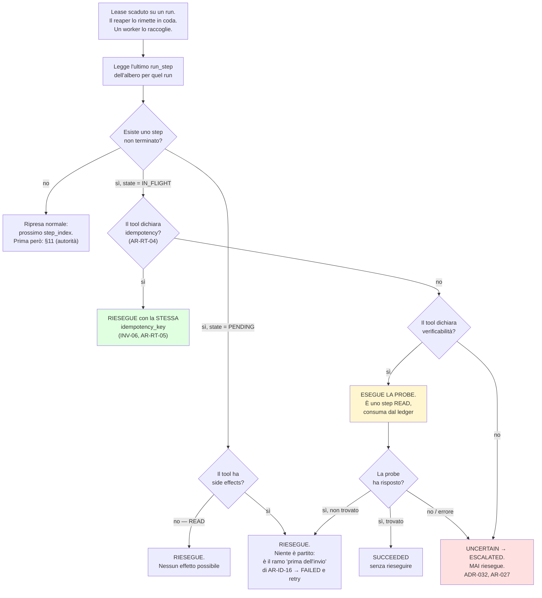

#### Come leggerlo

Si entra da sinistra in alto: **nessun recovery parte da un timeout di processo**, parte
sempre dalla scadenza di un lease. Questo è importante perché elimina la classe di bug in cui
un worker vivo ma lento viene considerato morto da un altro pezzo di codice.

Il diagramma ha **un solo riquadro rosso**, ed è la confessione onesta dell'architettura:
esiste un caso in cui il sistema non sa e non può sapere. Non lo nasconde, non tira a
indovinare, non riesegue "tanto probabilmente non era partito". Chiama una persona.

Il riquadro giallo è quello che costa: **la probe di verifica è uno step**, e consuma dal
ledger d'albero come tutti gli altri. Questo è voluto: se un run passasse metà del budget a
verificare sé stesso, quel budget deve essere visibile, non gratis.

Il ramo `PENDING → SAFE` è la traduzione operativa di `AR-ID-16` (fallimento **dopo** l'invio
→ `UNCERTAIN`; **prima** → `FAILED`): `PENDING` **è** "prima dell'invio", `IN_FLIGHT` **è**
"forse dopo".

### 10.4 La state machine dello step

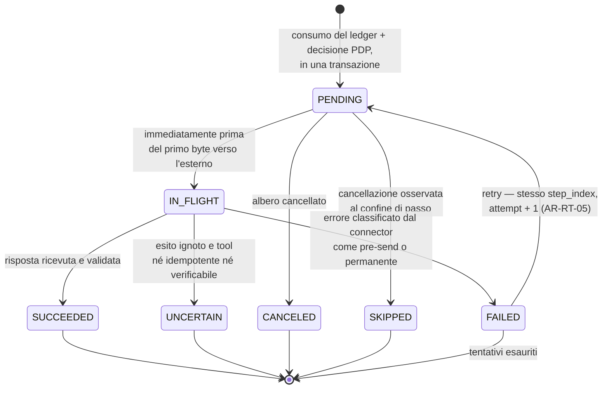

#### Come leggerlo

Sette stati, e **`RETRYING` non è uno di questi**. Il prompt lo proponeva; l'ho respinto.
Motivo: `AR-RT-05` dice che un retry **riusa lo stesso `step_index`** e cambia solo `attempt`.
Se `RETRYING` fosse uno stato, avremmo due rappresentazioni della stessa informazione — lo
stato e il contatore — che possono divergere. Il retry è un **arco**, non un nodo. Sul run,
invece, `RETRYING` è uno stato legittimo (`A04`), perché lì descrive cosa sta facendo il run
nel suo insieme.

L'arco `FAILED → PENDING` è l'unico che torna indietro, e ha una guardia: il tetto di
`attempt` (§13). Quando i tentativi finiscono, `FAILED` diventa terminale.

`UNCERTAIN` è terminale **per lo step**: non c'è nessuna freccia che lo riporta in gioco
automaticamente. Il run che lo contiene va in `UNCERTAIN` e poi in `ESCALATED` quando una
persona lo prende in carico (`A04`).

### 10.5 La ripresa del run: dove il recovery si incastra nella state machine di `A04`

La state machine del run resta quella di `A04`: **13 stati**, invariata. Questo documento non
ne aggiunge (§11.3 spiega perché, contro un mandato di `A09` che chiedeva due stati nuovi).
Aggiunge invece **due archi che `A04` non poteva disegnare** perché riguardano il processo,
non il passo:

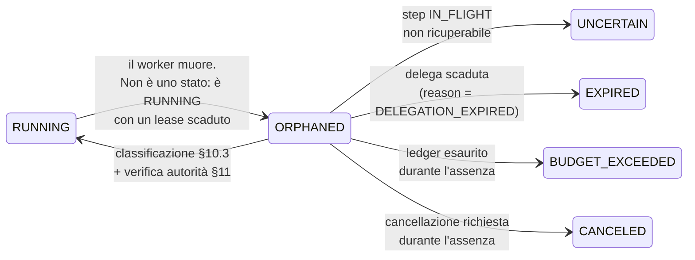

#### Come leggerlo

`ORPHANED` **non è uno stato nuovo**: è disegnato tratteggiato concettualmente perché è la
condizione *"`run.state = RUNNING` e `locked_until < now()`"*. Ho scelto di non introdurlo come
stato per una ragione precisa: se fosse uno stato, qualcuno dovrebbe **scriverlo**, e nel
momento del crash non c'è nessuno che possa scrivere niente. Uno stato che nessuno può
scrivere quando serve è uno stato che mente. La condizione derivata da una query, invece, è
vera sempre — anche se muore l'intera macchina.

I cinque archi in uscita sono l'ordine di valutazione del recovery: **prima si guarda se si
deve fermare** (cancellazione, budget, delega), **poi** si guarda come riprendere. Riprendere
un run che nel frattempo è stato cancellato sarebbe il bug più imbarazzante possibile.

### 10.6 L'ordine di valutazione alla ripresa (obbligatorio)

Questo è il pseudo-codice minimo, ed è normativo. È volutamente noioso: il recovery deve
essere leggibile da chiunque, perché è `R-06b`.

```text
riprendi(run):
  1. se albero.cancel_requested_at IS NOT NULL      → chiudi CANCELED (§15)
  2. se albero.steps_consumed >= steps_budget       → chiudi BUDGET_EXCEEDED / STEP_BUDGET_EXCEEDED
  3. se albero.active_ms_consumed >= active_ms_budget → chiudi BUDGET_EXCEEDED / ACTIVE_DURATION_EXCEEDED
  4. rileggi l'autorità viva (ADR-106):
       delega scaduta                                → chiudi EXPIRED / DELEGATION_EXPIRED (§11)
       subject non ACTIVE / sessione revocata        → chiudi FAILED / AUTHORITY_REVOKED
       link di identità esterna STALE (AR-ID-19)     → chiudi FAILED / AUTHORITY_REVOKED
  5. classifica l'ultimo step non terminato (§10.3)
  6. solo adesso: prosegui il loop di A04
```

**Nota su INV-13.** I passi 1-4 sono tutti **restrizioni**. Non esiste nessun passo che possa
aggiungere autorità, budget o tempo. È `AR-EV-19`, e insieme a `INV-13` rende vera la frase
*"un run che riprende non è mai più potente di un run che non si è mai fermato"*.

### 10.7 Cosa il recovery non deve fare mai

| Divieto | Perché | Regola |
|---|---|---|
| rieseguire uno step `IN_FLIGHT` non idempotente e non verificabile | fattura doppia | `AR-EV-08` |
| ricalcolare il `MemorySnapshot` | crescerebbe l'insieme delle memorie leggibili: viola `INV-11` | `AR-ME-04` |
| ri-risolvere il `ConfigSnapshot` | il run cambierebbe configurazione a metà: viola `ADR-012` e `AR-CP-01` | `AR-CP-01` |
| rinnovare la delega | viola `AR-RT-16` e `INV-13` | `AR-EV-19` |
| azzerare o estendere il ledger | viola `INV-18` | `AR-EV-05` |
| ripartire dallo step 0 | rifarebbe tutti i side effect già fatti | `ADR-029` |
| "riparare" il journal con una `UPDATE` manuale | rende non affidabile l'unica fonte di verità | `INV-05` |

### 10.8 I test che rendono questa sezione credibile

`A04` aveva già chiesto **test che uccidono il worker a metà run, in CI**. Qui li rendo
specifici, perché "uccidi il worker" senza dire dove non prova niente:

| Test | Cosa uccide | Esito atteso |
|---|---|---|
| `TC-EV-01` | `SIGKILL` fra il commit di `PENDING` e la scrittura di `IN_FLIGHT` | ripresa con riesecuzione, **zero effetti duplicati** |
| `TC-EV-02` | `SIGKILL` fra `IN_FLIGHT` e la risposta, tool **idempotente** | riesecuzione con la stessa `idempotency_key`, **un solo record** creato lato sistema esterno (simulato) |
| `TC-EV-03` | `SIGKILL` fra `IN_FLIGHT` e la risposta, tool **verificabile** | probe eseguita, esito accertato, ledger consumato di **due** step |
| `TC-EV-04` | come sopra, tool **né idempotente né verificabile** | run in `UNCERTAIN`, **nessuna riesecuzione**, escalation registrata |
| `TC-EV-05` | `SIGKILL` del worker mentre l'albero ha 3 run vivi | tutti e tre recuperati, ledger coerente con `INV-20` |
| `TC-EV-06` | worker "zombie" che torna a scrivere dopo la scadenza del lease | tutte le sue scritture colpiscono **zero righe** (`INV-22`) |
| `TC-EV-07` | albero di profondità 3, 51° step al livello più profondo | **fallisce** con `STEP_BUDGET_EXCEEDED` (è il test che `R-50` richiede) |
| `TC-EV-08` | run sospeso in `WAITING_FOR_APPROVAL` per un tempo lungo, delega scaduta | `EXPIRED` / `DELEGATION_EXPIRED`, messaggio con "cosa è già stato fatto" (`AR-ID-14`) |

---

## 11. L'autorità durante un'esecuzione lunga

### In breve

Il permesso non è una cosa che ottieni all'inizio e ti tieni. È una cosa che ti viene
**richiesta di nuovo ogni volta che agisci**, e che può solo restringersi.

### 11.1 Lo scenario del prompt, risolto

> *"Un workflow parte lunedì. I permessi dell'utente cambiano martedì. Mercoledì il workflow
> esegue un'azione sensibile. L'autorizzazione originale è ancora valida?"*

**No.** E la risposta era già decisa prima di questo documento:

* `ADR-106` (**tetto congelato, autorità viva**): si congelano capability, tool set,
  `MemorySnapshot`, `bundle_version` e lo `scope` della delega; si **rileggono a ogni
  `AUTHORIZE`** lo stato del soggetto, la sessione, la delega, i ruoli, il tenant e la
  freschezza dei grant. Una revoca ferma le **azioni** subito.
* `INV-13`: l'insieme delle azioni autorizzabili di un run è, in ogni istante successivo
  all'avvio, un **sottoinsieme** di quello all'avvio.
* `INV-16`: lo stesso, per l'**unione** di tutto l'albero.

Quindi: se martedì l'utente perde un permesso, mercoledì l'azione viene **negata**. Se martedì
l'utente **guadagna** un permesso, mercoledì l'azione resta **negata** lo stesso, perché il
tetto è congelato. L'asimmetria è voluta e non è un difetto: è ciò che rende un run
prevedibile.

**Contro-argomento onesto:** l'asimmetria produce un caso frustrante. Un utente a cui è stato
appena concesso il permesso vede il proprio run fallire e non capisce perché. Il rimedio è di
prodotto (il messaggio deve dire "questo run è partito prima che tu avessi questo permesso;
avvialo di nuovo"), non architetturale. Rilassarlo significherebbe rendere l'autorità di un run
funzione del tempo in cui è stato osservato, cioè non più analizzabile.

### 11.2 Il caso che tocca specificamente a me: la delega scaduta

`ADR-112` fissa: `delegation.not_after = min(session.expires_at, run.started_at +
max_active_duration + approval_window)`. Cioè la delega è progettata per **coprire** i 10
minuti attivi più la finestra di approvazione — ma **non oltre**, e comunque mai oltre la
sessione dell'utente.

Un run può quindi trovarsi con la delega scaduta in due modi:

1. **è rimasto sospeso troppo a lungo** in attesa di un umano (l'approvazione ha una TTL,
   `AR-GP-14`, ma la sessione può scadere prima);
2. **è morto e ha aspettato** che un lease scadesse e un worker lo raccogliesse, e nel
   frattempo la sessione dell'utente è scaduta (per esempio: crash di notte).

In entrambi i casi il comportamento è lo stesso, ed è quello dichiarato in §1.4:

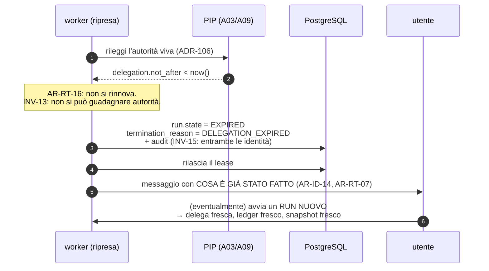

#### Come leggerlo

Il passo 3 è la decisione, e non ha alternative: `AR-RT-16` è esplicita. Il passo 5 è la parte
che di solito viene dimenticata: un run che muore per una ragione **amministrativa** deve
raccontare cosa aveva già combinato nel mondo reale, altrimenti l'utente riavvia e ripete i
side effect già fatti. `AR-ID-14` e `AR-RT-07` lo impongono entrambe, da due documenti diversi:
è un caso in cui due regole indipendenti convergono, ed è un buon segno.

Il passo 6 è la scelta di prodotto: **un run nuovo, non una ripresa**. E il run nuovo parte
con un ledger nuovo. Sì: questo significa che un utente **può** ottenere altri 50 step
riavviando. Non è un buco di `R-50`, perché `R-50` riguarda il **budget rubato dentro un
albero, senza che una persona lo sappia**. Qui c'è una persona che decide esplicitamente di
ricominciare, che vede cosa era stato fatto, e che compare nell'audit. La differenza fra i due
casi è **chi lo sa**.

### 11.3 Il conflitto con il mandato di `A09`, dichiarato invece che risolto in silenzio

`A09` ha lasciato ad `A11` due **stati**: `DELEGATION_EXPIRED` e `AUTHORIZATION_LOOP`. Non li
implemento come stati. Lo dichiaro invece di farlo di nascosto.

> ## `ADR-155` — `DELEGATION_EXPIRED` e `AUTHORIZATION_LOOP` sono **ragioni terminali tipizzate**, non stati nuovi
>
> **Decisione.** La state machine del run resta a **13 stati** (`A04`). Si aggiunge una
> colonna `termination_reason`, un enum, obbligatorio su ogni stato terminale.
> `DELEGATION_EXPIRED` è una ragione di `EXPIRED`; `AUTHORIZATION_LOOP` è una ragione di
> `FAILED`; `STEP_BUDGET_EXCEEDED` e `ACTIVE_DURATION_EXCEEDED` sono ragioni di
> `BUDGET_EXCEEDED`; `DELEGATION_DEPTH_EXCEEDED`, `DELEGATION_CYCLE` e `REPEATED_DELEGATION`
> (i codici lasciati da `A10`) sono ragioni di `FAILED`.
>
> **Perché.** Ogni stato terminale nuovo moltiplica la matrice delle transizioni, va gestito
> da ogni consumer (UI, metriche, API, export di audit) e va migrato. Una ragione tipizzata è
> **altrettanto visibile** — compare nell'API, nell'audit e nelle metriche — e non tocca la
> macchina. La forma segue quella già scelta da `A08` per `CONTEXT_BUDGET_EXCEEDED`.
>
> **Alternative considerate:** (a) due stati nuovi come chiedeva `A09` — respinta per il costo
> combinatorio; (b) una stringa libera — respinta, non è filtrabile né verificabile;
> (c) riusare `FAILED` senza ragione — respinta, viola `AR-RT-07` (il messaggio deve essere
> comprensibile).
>
> **Contro-argomento onesto:** `A09` ha chiesto stati perché voleva **garantire visibilità**.
> Una colonna in più è più facile da dimenticare di uno stato in più: nessuno può ignorare uno
> stato terminale, mentre `termination_reason` potrebbe restare `NULL` per pigrizia. Il rimedio
> è un vincolo di database: `CHECK (state NOT IN (stati terminali) OR termination_reason IS NOT
> NULL)`. Con quel vincolo la visibilità è garantita quanto uno stato, e il test è in CI.
>
> **Reversibilità:** facile.

### 11.4 Le credenziali che scadono

Il prompt chiede cosa succede quando un workflow lungo sopravvive al token OAuth. Per noi la
domanda è più semplice di quanto sembri, grazie a decisioni già prese:

* **`AR-EV-25`: nessuna credenziale è mai persistita nello stato di esecuzione.** Deriva da
  `INV-14` (nessun `SecretMaterial` esiste fuori dal modulo di autenticazione e dal
  `Credential Broker`) e da `ADR-056` (il tool riceve un client già autenticato, mai un
  segreto).
* Il client autenticato è valido per **un solo `EXECUTE`** (`ADR-108`). Alla ripresa non c'è
  nessun client da rinnovare: **ce n'è uno nuovo da chiedere**, e chiederlo passa dal `Credential
  Broker`, che passa dal PDP.
* Se la credenziale non è più ottenibile (revocata, ruotata, sistema esterno che la rifiuta),
  l'errore è classificato dal connector (`ADR-060`) e ricade in `AR-ID-16`: **dopo l'invio →
  `UNCERTAIN`; prima → `FAILED`**. Che è esattamente la classificazione di §10.3.

**Conseguenza felice:** il problema "il workflow lungo sopravvive al token" **non esiste nella
nostra architettura**, perché non teniamo token. Questo è un caso in cui una decisione presa
per motivi di sicurezza (`INV-14`) ha ripagato in affidabilità. Vale la pena notarlo: sono
rari.

---

## 12. Il ledger d'albero: i 50 step e i 10 minuti

### In breve

C'è **un contatore per albero**, non uno per run. Ogni step lo paga. Quando finisce, finisce
per tutti — anche per il figlio del figlio.

### 12.1 Perché è un problema serio

`R-50` è un rischio ad **alta probabilità** con impatto **alto**, e il modo in cui si realizza
è banale: qualcuno scrive `if run.steps_used >= run.max_steps` invece di
`if tree.steps_consumed >= tree.steps_budget`. Sembra la stessa cosa. Non lo è: nel primo caso
un agent che ne avvia un altro **raddoppia il proprio budget**, e una catena lo moltiplica.
Il tetto di dominio dichiarato dal committente (`ADR-104`) diventa decorativo.

`INV-18` e `AR-AC-08` erano già scritti da `A10`. Il mandato ad `A11` è renderli **eseguibili**.

### 12.2 La forma dei dati

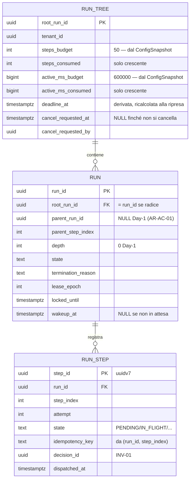

#### Come leggerlo

Il punto è **dove non c'è un campo**. Su `RUN` non esiste `steps_budget`, non esiste
`max_duration`, non esiste `deadline`. Un programmatore che cercasse il budget guardando la
tabella `run` **non lo trova**, e l'unica strada è passare da `root_run_id` a `run_tree`.
Questa è la mitigazione più efficace di `R-50`, e non costa niente: è un campo **assente**.

Day-1 `parent_run_id IS NULL AND depth = 0 AND root_run_id = run_id` per ogni run
(`AR-AC-01`): l'albero è **degenere**, un nodo solo. Ma la riga `run_tree` esiste comunque, e
il codice del ledger è lo stesso codice che servirà quando gli alberi saranno veri. Questa è la
lezione di `ADR-125` applicata al budget: le cose impossibili da aggiungere dopo si mettono
subito, anche degeneri.

### 12.3 `ADR-146` — Il consumo del ledger lo fa il database

> **Decisione.** L'`INSERT` di una riga in `run_step` è possibile **solo** attraverso una
> funzione SQL `consume_tree_step(root_run_id)` invocata da un **trigger `BEFORE INSERT`** su
> `run_step`. Il trigger esegue, nella stessa transazione dell'insert:
>
> ```sql
> UPDATE run_tree
>    SET steps_consumed = steps_consumed + 1
>  WHERE root_run_id = NEW.root_run_id
>    AND steps_consumed < steps_budget
>    AND cancel_requested_at IS NULL;
> -- 0 righe aggiornate → RAISE EXCEPTION 'STEP_BUDGET_EXCEEDED'
> ```
>
> **Perché nel database e non nel codice.** Perché `R-50` è un errore *di codice*, e la difesa
> non può stare nello stesso posto dell'errore. Un trigger è l'unico punto che **nessun
> percorso applicativo può aggirare**: né un `INSERT` dimenticato in un test, né una migration,
> né un secondo servizio scritto fra un anno da qualcuno che non ha letto `A10`.
>
> **Alternative considerate:**
>
> | Alternativa | Perché no |
> |---|---|
> | controllo nel codice del runtime, in transazione | corretto ma **aggirabile**: basta un secondo percorso di scrittura. È esattamente lo scenario di `R-50` |
> | `CHECK` constraint | non può contare righe di un'altra tabella |
> | consumo asincrono (contatore aggiornato dopo) | rompe l'atomicità richiesta da `AR-AC-08` e `AR-GP-16` (consumo del budget e registrazione dello step sono atomici) |
> | vincolo di esclusione temporale (PG18) | risolve un altro problema |
>
> **Trade-off:** logica applicativa dentro il database, che di solito è un anti-pattern
> (difficile da testare, invisibile nel codice, migrabile a fatica). Lo accetto **solo qui**,
> per una riga di logica, perché la proprietà da garantire è *"non esiste percorso che la
> aggiri"* — ed è l'unica proprietà che un trigger sa dare e il codice no.
>
> **Contro-argomento onesto:** se un giorno il ledger dovesse vivere fuori da PostgreSQL
> (sharding, engine esterno), questa scelta è un pezzo di migrazione in più. È il prezzo, ed è
> piccolo rispetto a `R-50`.
>
> **Reversibilità:** moderata.

### 12.4 `ADR-145` — Il tempo attivo è un contatore, non un intervallo

> **Problema.** `ADR-104` dice 10 minuti di **tempo attivo**, e `ADR-128` dice che l'orologio
> si ferma **solo se tutti** i run non terminati dell'albero sono sospesi. Ma "fermare un
> orologio" richiede di scrivere quando si ferma e quando riparte — e se il processo muore
> mentre l'orologio gira, nessuno scrive la fermata, e al risveglio il tempo trascorso durante
> il crash risulta consumato anche se non si è lavorato.
>
> **Decisione.** Non esiste un orologio. Esiste `run_tree.active_ms_consumed`, un contatore
> che **solo chi tiene un lease valido** incrementa, in due momenti:
>
> * **a ogni heartbeat**: `active_ms_consumed += (now() - last_charged_at)`, e
>   `last_charged_at = now()`, con guardia `WHERE lease_epoch = <mio>`;
> * **al rilascio del lease**, per l'ultimo frammento.
>
> Quando tutti i run sono sospesi, nessuno tiene un lease, nessuno batte, **nessuno paga**.
> L'orologio non "si ferma": non c'è.
>
> **Conseguenze:**
>
> * la sospensione in attesa di approvazione è gratuita **per costruzione**, senza codice
>   dedicato — che è la richiesta esplicita di `AR-RT-17`;
> * un crash costa al massimo **un intervallo di heartbeat** di tempo non contabilizzato
>   (`R-60`);
> * `deadline_at` esiste ancora, ma è **derivata**: `deadline_at = now() + (active_ms_budget −
>   active_ms_consumed)`, ricalcolata a ogni acquisizione di lease. Serve al worker per avere un
>   confronto locale ed economico durante uno step lungo, senza rileggere il contatore.
>
> **Rapporto con `ADR-128`.** `A10` aveva scritto "deadline **assoluta** copiata, mai 10
> minuti freschi". Questa decisione **non la contraddice**: la deadline che un worker vede
> resta assoluta e viene copiata a ogni figlio; ciò che cambia è **chi è l'autorità**. Sopra la
> deadline derivata sta il contatore, che è la verità. Registro esplicitamente che sto
> **precisando** `ADR-128`, non riscrivendolo: la proprietà che `A10` voleva — *nessun run
> ottiene tempo fresco* — resta vera e diventa più difficile da violare, perché il tempo non
> si può "resettare" azzerando un timestamp.
>
> **Alternative considerate:**
>
> | Alternativa | Perché no |
> |---|---|
> | `started_at` + `suspended_ms` accumulato | richiede di scrivere l'istante di sospensione: se il processo muore, quell'istante non viene scritto e il run "paga" il crash |
> | deadline assoluta pura | ogni run in attesa di approvazione fallirebbe. È esattamente ciò che `AR-RT-17` vieta |
> | tempo di CPU del processo | non misura l'attesa della GPU né quella del CRM, che sono la maggior parte del tempo attivo reale |
> | contare le chiamate al modello invece del tempo | è già `max_steps`; un secondo contatore della stessa cosa non aggiunge niente |
>
> **Contro-argomento onesto:** il contatore è **ottimista**. Un worker che muore fra due
> heartbeat regala all'albero il tempo non contabilizzato; un crash loop potrebbe teoricamente
> far vivere un albero più a lungo di 10 minuti reali di lavoro. Le due difese sono: il tetto
> di `attempt` (§13) e il tetto di step, che sono **pessimisti** e chiudono comunque il run.
> Ma il tetto temporale, da solo, non è a prova di crash loop. Lo registro come **`R-60`**
> invece di fingere che non ci sia.
>
> **Reversibilità:** facile (sono due colonne e un incremento).

### 12.5 `INV-20` — l'invariante che rende `R-50` falsificabile

> **`INV-20`.** Per ogni albero: `run_tree.steps_consumed` è **esattamente** il numero di righe
> `run_step` appartenenti a run dell'albero. Nessuna riga `run_step` esiste senza un consumo
> corrispondente, e nessun consumo esiste senza una riga.

È una query, quindi è un test, quindi è un allarme in produzione:

```sql
SELECT t.root_run_id
  FROM run_tree t
  JOIN (SELECT r.root_run_id, count(*) n
          FROM run_step s JOIN run r USING (run_id)
         GROUP BY 1) c USING (root_run_id)
 WHERE t.steps_consumed <> c.n;
```

Se questa query restituisce anche una sola riga, **`R-50` si è realizzato** e lo sappiamo lo
stesso giorno. Senza `INV-20`, `R-50` sarebbe un rischio che si scopre leggendo il codice; con
`INV-20`, è un rischio che si scopre da solo.

### 12.6 Cosa succede quando il ledger finisce

Non è un errore: è un **esito previsto** (`AR-029`, `A04`). Il run va in `BUDGET_EXCEEDED` con
`termination_reason = STEP_BUDGET_EXCEEDED` o `ACTIVE_DURATION_EXCEEDED`, e il messaggio
all'utente include **cosa è già stato fatto** (`AR-RT-07`). Se l'albero ha più run vivi, la
terminazione si propaga come una cancellazione (§15): **nessun figlio sopravvive alla radice**
(`AR-AC-18`).

La metrica che serve è già dichiarata da `A10`: `T-AC-04` scatta quando `run_steps_p95` sfiora
50 o `run_active_duration_p95` sfiora 10 minuti, e riapre **`ADR-104`** — cioè si rinegozia il
vincolo col committente. Non si aggiunge budget di nascosto.

---

## 13. Idempotency, exactly-once e retry

### In breve

Non promettiamo "esattamente una volta". Promettiamo **"al massimo un effetto visibile"**, e
lo otteniamo facendo in modo che rifare la stessa cosa non produca una seconda cosa.

### 13.1 La terminologia, usata con precisione

Il prompt chiede di non dire "exactly-once" con leggerezza. Ecco cosa possiamo davvero
promettere, confine per confine:

| Confine | Garanzia reale | Perché |
|---|---|---|
| worker → `run_step` (nostro PostgreSQL) | **exactly-once** | è una transazione locale: o c'è o non c'è |
| `run_step` + `audit_event` + ledger | **exactly-once, atomico fra loro** | stessa transazione (`AR-EV-22`, `AR-GP-16`) |
| prelievo dalla coda | **at-least-once** | un lease può scadere e il lavoro tornare in coda |
| worker → sistema esterno (Odoo, email) | **at-least-once nella consegna** | la rete può perdere la risposta, non l'invio |
| **effetto** sul sistema esterno | **effectively-once, *se e solo se* il tool è idempotente** | l'idempotency key la onora il sistema esterno, non noi |
| effetto sul sistema esterno, tool non idempotente | **at-most-once dichiarato**, con `UNCERTAIN` residuo | `AR-EV-08`: non riproviamo, chiediamo a un umano |

> **La frase precisa da usare nei documenti e con il committente:** *"il sistema garantisce
> effectively-once sugli effetti dei tool che dichiarano idempotenza, e at-most-once con
> escalation umana su quelli che non la dichiarano. Non garantisce exactly-once verso sistemi
> esterni, perché nessuno può garantirlo."*

**FATTO** (`R-04`): anche DBOS, che è l'opzione con la semantica più forte, dichiara
exactly-once **quando lo step scrive sullo stesso PostgreSQL** del workflow. Fuori da lì,
nessuno promette exactly-once — e chi lo promette sta descrivendo il proprio confine interno.

### 13.2 Da dove viene la chiave

`INV-06` (già deciso): ogni operazione con side effect ha una `idempotency_key` derivata
**deterministicamente** da `(run_id, step_index)`. `AR-TL-14`: `tenant`, `principal`, `now` e
`idempotency_key` sono **iniettati** dal runtime, mai forniti dal modello. `AR-RT-05`: un retry
riusa lo **stesso** `step_index`, quindi la **stessa** chiave; cambia solo `attempt`.

Queste tre regole insieme fanno una cosa sola: **il modello non può, nemmeno volendo, far
apparire due operazioni identiche come diverse, né due operazioni diverse come identiche.**

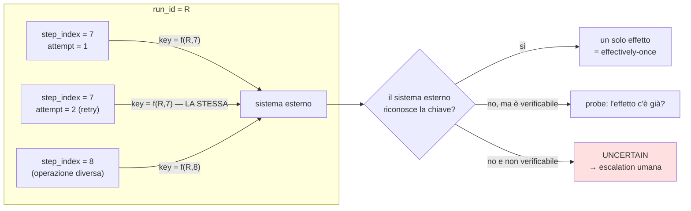

#### Come leggerlo

Le due frecce che partono da `step_index = 7` portano **la stessa chiave**: è il retry. La
freccia da `step_index = 8` porta una chiave diversa: è un'operazione diversa. Il modello non
sceglie nessuna di queste chiavi.

A destra c'è il punto in cui l'architettura smette di poter garantire da sola: la scatola
`DEDUP` **non è nostra**. È Odoo, è il server SMTP, è l'ERP. Le tre uscite sono le tre realtà
possibili, e la terza è rossa perché costa una persona.

### 13.3 Il rischio dichiarato: e se il sistema esterno non ha idempotency key?

**`AS-35`** (nuova, confidenza **Bassa**): *i sistemi esterni target onorano una idempotency
key, oppure offrono un modo di verificare l'avvenuto effetto*. Specializza `AS-11` di `A06` al
caso del recovery.

`A06` aveva già visto il problema e aveva scritto una cosa importante nel proprio checkpoint:
se `Q-01` fosse "Odoo e solo Odoo", allora **`AR-RT-04` si soddisferebbe via verificabilità,
non via idempotenza**. Cioè: Odoo probabilmente non ci darà una idempotency key, ma ci darà la
possibilità di **cercare il record appena creato**. Questo rende la **probe** di §10.3 il
percorso principale, non l'eccezione. → **`B-69`**, che specializza `B-23` al recovery.

Se `AS-35` fosse falsa su tutta la linea, la conseguenza è misurabile e brutta: **ogni crash
durante un `SIDE_EFFECT` produce un `UNCERTAIN`**, e il tasso di escalation diventa funzione
della stabilità del processo invece che della logica di business. La metrica che lo rileva è
`uncertain_after_crash_rate` (§30), e il trigger è **`T-EV-03`**.

### 13.4 `ADR-153` — Politica di retry

> **Decisione.** Il retry è **guidato da policy**, non dal modello e non dal tool.
>
> * **Chi classifica l'errore:** il connector (`ADR-060`), con default `UNKNOWN` = **non
>   ritentabile**. Il default conservativo è deliberato: un errore che nessuno ha classificato
>   non si ritenta.
> * **Chi ritenta:** l'executor del runtime. Il Tool Runtime **non ritenta mai** (`AR-TL-10`).
> * **Cosa si ritenta:** la **chiamata**, non il passo (`AR-MD-06`, `AR-RT-05`).
> * **Backoff:** esponenziale con **jitter** pieno. Senza jitter, N worker che ritentano dopo
>   lo stesso errore del CRM ripartono insieme e lo riabbattono.
> * **Tetto:** `max_attempts` per classe di errore, dal `ConfigSnapshot`. Valore
>   **`NON ANCORA DECISO`**: dipende dalla latenza dei sistemi esterni, che dipende da `Q-01`.
> * **Il retry non consuma un nuovo step** (stesso `step_index`, quindi il ledger non si
>   decrementa di nuovo) **ma consuma tempo attivo**, perché il worker tiene il lease e batte.
>   Questa asimmetria è voluta: altrimenti un errore transitorio brucerebbe il budget di step
>   di un compito che sta procedendo bene.
> * **Gli errori `BUSINESS` non si ritentano**: tornano al modello come **osservazioni**
>   (`AR-RT-15`). "Il cliente non esiste" non si risolve riprovando.
>
> **Contro-argomento onesto:** "il retry non consuma step ma consuma tempo" significa che un
> sistema esterno perennemente lento può far morire un run per `ACTIVE_DURATION_EXCEEDED`
> mentre l'utente vede solo "sto riprovando". È corretto (il tempo dell'utente è finito
> davvero) ma richiede che il messaggio finale distingua "ho esaurito il tempo **aspettando il
> CRM**" da "ho esaurito il tempo **lavorando**". → metrica `external_wait_share` (§30).

### 13.5 La tassonomia degli errori, e cosa fa ciascuno

| Classe (da `ADR-060`, `A06`) | Ritentabile? | Effetto sul run | Nota |
|---|---|---|---|
| `TRANSIENT` (timeout, 5xx, connessione) | **sì**, con backoff | `RETRYING` | il caso normale |
| `RATE_LIMITED` | **sì**, con backoff che rispetta l'header del server | `RETRYING` | non consuma step |
| `BUSINESS` (regola di dominio violata) | **no** | torna al modello come osservazione | `AR-RT-15` |
| `AUTH` (credenziale rifiutata) | **no** | `FAILED` se pre-send, `UNCERTAIN` se post-send | `AR-ID-16` |
| `VALIDATION` (schema) | **no** | osservazione per il modello | `AR-MD-04` |
| `INDETERMINATE` (il PDP non ha potuto decidere) | **sì**, il run è retryable | `RETRYING` | `ADR-022`: non è un `DENY` terminale |
| `UNKNOWN` (default) | **no** | `FAILED` o `UNCERTAIN` secondo la fase | `ADR-060` |

---

## 14. Deadline, e come si propagano

### In breve

Ogni attesa ha una fine scritta da qualche parte. Nessuna attesa è "finché non torna".

### 14.1 Le quattro deadline

| Deadline | Chi la fissa | Dove vive | Cosa succede allo scadere |
|---|---|---|---|
| **deadline dell'albero** | `ADR-104` via `ConfigSnapshot` | `run_tree.active_ms_budget` (contatore, §12.4) | `BUDGET_EXCEEDED` / `ACTIVE_DURATION_EXCEEDED` |
| **deadline dello step** | `ConfigSnapshot`, per `risk_class` di tool | calcolata al dispatch: `min(deadline dell'albero, timeout del tool)` | l'errore è `TRANSIENT`; lo step diventa `IN_FLIGHT` scaduto → classificazione §10.3 |
| **deadline della richiesta esterna** | il connector (`A06`) | nel client HTTP | **deve essere sempre minore** della deadline dello step, altrimenti il worker resta appeso oltre il lease |
| **deadline dell'approvazione** | `A03` (`AR-GP-14`) e `A09` (`AR-ID-03`: `approval_window ≥ approval_ttl`) | riga di approvazione + `run.wakeup_at` | il run va in `EXPIRED` |

**`AR-EV-26`: le deadline si restringono verso il basso, mai si allargano.** La deadline di uno
step non può superare quella dell'albero; quella della richiesta esterna non può superare
quella dello step. È la stessa forma della precedenza a imbuto di `ADR-025` (ogni livello può
solo restringere), applicata al tempo invece che ai permessi.

### 14.2 Il caso che rompe tutto se non ci si pensa

Se `timeout HTTP > lease_ttl`, succede questo: il worker è vivo ma bloccato in una `read()`,
non batte, il lease scade, un secondo worker prende il run, e **due worker eseguono lo stesso
step**. Il fencing token (`INV-22`) impedisce che il secondo scriva sopra il primo, ma **non
impedisce che il side effect parta due volte** — la rete non ha un fencing token.

Quindi il vincolo `AR-EV-27` è duro e va verificato in CI:
`timeout_richiesta_esterna < heartbeat_interval < lease_ttl`.

È un vincolo di tre numeri che oggi non conosciamo (`DEF-05` è di `B21`), ma la **relazione**
la possiamo fissare adesso, ed è quella che conta.

---

## 15. Cancellazione durevole

### In breve

Cancellare non è premere un tasto rosso che ferma tutto all'istante. È **scrivere una riga**
che tutti i partecipanti leggono al primo momento sicuro.

### 15.1 `ADR-157` — Cancellazione per albero, osservata ai confini di passo

> **Decisione.** La cancellazione è **una colonna sull'albero**: `run_tree.cancel_requested_at`
> + `cancel_requested_by`. Nessun segnale di processo, nessuna interruzione forzata, nessuna
> `kill` di thread.
>
> Chi la osserva:
> * **ogni worker**, all'inizio di ogni step (confine di passo, `ADR-034`, `AR-RT-06`);
> * il **trigger del ledger**, che rifiuta nuovi step su un albero cancellato (§12.3);
> * il **`tree_reaper`**, un job che chiude i run dell'albero rimasti sospesi (che nessun
>   worker sta guardando, perché in attesa non c'è nessuno).
>
> **Cosa succede a un `SIDE_EFFECT` già `IN_FLIGHT`: si lascia finire.** Interromperlo
> produrrebbe un `UNCERTAIN` — cioè trasformerebbe una cancellazione pulita in un caso da
> escalare a un umano. Il run passa a `CANCELED` **dopo** che lo step ha registrato il proprio
> esito.
>
> **Reversibilità:** facile.

### 15.2 Perché serve il `tree_reaper` e non basta il worker

Questo è il caso che `A10` ha lasciato scoperto e che tocca a me: un albero con la radice
cancellata, e un figlio in `WAITING_FOR_APPROVAL`. Il figlio **non ha un worker**
(`AR-RT-10`: nessun run in attesa occupa un worker). Non c'è nessuno che possa osservare la
cancellazione al confine di passo, perché non ci sarà nessun altro passo finché un umano non
approva — e l'umano non approverà mai, perché il run è stato cancellato.

Senza il `tree_reaper`, quel run resta sospeso per sempre. È **`R-54`** (run figli orfani che
continuano a consumare risorse dopo la morte della radice), registrato da `A10` con mandato
esplicito ad `A11`.

Il `tree_reaper` è un job che gira frequentemente e fa una query sola:

```sql
UPDATE run r SET state = 'CANCELED', termination_reason = 'ANCESTOR_CANCELED'
  FROM run_tree t
 WHERE r.root_run_id = t.root_run_id
   AND t.cancel_requested_at IS NOT NULL
   AND r.state NOT IN (stati terminali)
   AND r.locked_until IS NULL;   -- nessun worker lo sta guardando
```

La condizione `locked_until IS NULL` è essenziale: **il reaper non tocca mai un run che ha un
worker vivo**. Quello se la vede il worker al proprio confine di passo. Il reaper si occupa solo
di ciò che nessuno sta guardando. Questa divisione evita la corsa fra reaper e worker.

### 15.3 `INV-23` — nessun run può essere perso

> **`INV-23`.** Ogni run in stato **non terminale** ha, in ogni istante, **almeno una** di
> queste tre cose: un lease valido (`locked_until > now()`), un istante di risveglio
> (`wakeup_at IS NOT NULL`), o un'attesa esplicita registrata (approvazione pendente, input
> pendente, callback pendente).

È l'invariante che rende impossibile un run "dimenticato". Anche questa è una query, quindi un
allarme:

```sql
SELECT run_id FROM run
 WHERE state NOT IN (stati terminali)
   AND (locked_until IS NULL OR locked_until < now())
   AND wakeup_at IS NULL
   AND NOT EXISTS (SELECT 1 FROM pending_wait w WHERE w.run_id = run.run_id);
```

Se questa query restituisce righe, **abbiamo run zombie** e lo sappiamo subito. Senza
`INV-23`, un run bloccato si scopre quando un utente si lamenta — cioè, statisticamente, mai.

### 15.4 Le cinque forme di cancellazione del prompt

| Forma | Come si esprime da noi |
|---|---|
| **cancellazione dell'utente** | `CancelRun`, autorizzata dal PDP, scrive sull'albero |
| **cancellazione del workflow padre** | è la stessa cosa: si scrive sull'albero, e l'albero è **uno solo** per tutti i discendenti (`AR-AC-18`, "nessun figlio sopravvive alla radice") |
| **cancellazione dell'agent** (l'agent decide di fermarsi) | **non è una cancellazione**: è il run che arriva a `COMPLETED`. Un agent che "si arrende" produce un esito, non un annullamento |
| **cancellazione di uno step** | non esiste come comando esterno (§8.4). Uno step si annulla solo perché l'albero è cancellato → `SKIPPED` o `CANCELED` |
| **cancellazione del worker** (shutdown) | **non cancella niente**: rilascia il lease a un confine di passo e il lavoro torna in coda (§29) |

L'ultima riga è la più importante e la più facile da sbagliare: **fermare un worker non deve
mai cancellare un run.** Se lo facesse, ogni deploy ucciderebbe il lavoro in corso.

---

## 16. Pausa, ripresa, approvazione umana e timer durevoli

### In breve

Una pausa non è un `sleep`. È **una riga che dice quando svegliarsi e chi può svegliarti**.

### 16.1 `ADR-152` — I timer durevoli sono righe, non attese in memoria

> **Decisione.** Ogni attesa — approvazione, input dell'utente, callback, "aspetta 3 giorni" —
> è rappresentata da `run.wakeup_at` (un istante) più, quando serve, una riga di attesa
> tipizzata. **Nessun worker attende in memoria** (`AR-EV-04`, che è la forma operativa di
> `AR-RT-10`: nessun run in attesa occupa un worker).
>
> Il worker che entra in attesa: scrive lo stato di attesa, scrive `wakeup_at`, **rilascia il
> lease**, e prende altro lavoro. Il risveglio avviene perché la query di prelievo include
> `WHERE wakeup_at <= now()`.
>
> **Conseguenza:** "aspetta 3 giorni" sopravvive a qualunque riavvio, aggiornamento o
> spegnimento, senza nessun codice dedicato ai timer. Un timer durevole, da noi, **non è un
> componente**: è una colonna nella clausola `WHERE` della coda.
>
> **Alternative considerate:** thread che dorme (muore col processo); `pg_cron`
> (dipendenza in più per una `WHERE`); coda con delayed delivery tipo Redis/SQS (introduce il
> datastore che `AR-019` vieta senza misura); tabella di timer separata (una tabella in più
> che dice ciò che una colonna già dice).
>
> **Reversibilità:** facile.

### 16.2 Il flusso completo dell'approvazione

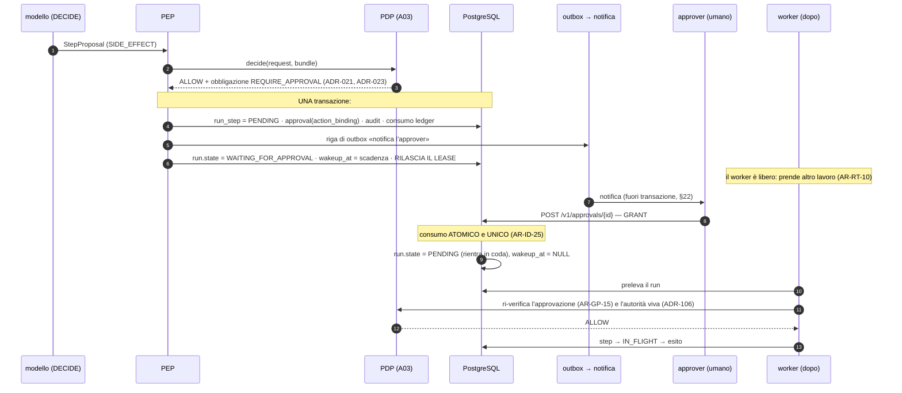

#### Come leggerlo

Tre punti meritano attenzione.

**Il passo 6-7 (una sola transazione).** Lo step `PENDING`, la riga di approvazione, l'audit e
il consumo del ledger si scrivono insieme. Se una qualunque fallisce, non succede niente. È
`AR-GP-16` (consumo del budget e registrazione dello step sono atomici) più `AR-031`/`AR-032`
(se l'audit fallisce, il side effect non procede).

**Il passo 8 (rilascio del lease).** Qui si vede la differenza fra un'architettura che sa
sospendere e una che non lo sa: il worker **non aspetta l'umano**. Se aspettasse, con 3 worker
e 3 approvazioni pendenti il sistema sarebbe fermo. `AR-RT-10` non è un'ottimizzazione: è ciò
che rende `ADR-023` (approvazione su **ogni** `SIDE_EFFECT` Day-1) sostenibile.

**Il passo 13 (ri-verifica).** L'approvazione concessa **non è un lasciapassare**. Al momento
dell'esecuzione il PDP la ri-verifica (`AR-GP-15`), e verifica che l'`action_binding` sia
ancora lo stesso (`AR-ID-24`: se l'azione cambia, l'approvazione non vale più). Un'approvazione
per "manda l'email a Mario" non autorizza "manda l'email a tutti".

### 16.3 Le proprietà dell'approvazione, dal mandato di `A09`

| Proprietà | Come la garantiamo | Regola |
|---|---|---|
| identità dell'approver | risolta da `A09`; deve essere diverso da chi ha avviato quando la policy lo richiede | `AR-GP-12` |
| scope | l'approvazione è per **azione**, mai per run | `AR-GP-13` |
| scadenza | TTL sull'approvazione; oltre, il run va in `EXPIRED` | `AR-GP-14` |
| binding | legata a un `action_binding`; se cambia, decade | `AR-ID-24` |
| audit | evento con entrambe le identità | `INV-15` |
| cancellazione | l'albero cancellato invalida le approvazioni pendenti | `ADR-157` |
| protezione da replay | consumo **atomico e unico**, con `UPDATE ... WHERE consumed_at IS NULL RETURNING` | `AR-ID-25` |

**Il dettaglio implementativo che conta:** il consumo dell'approvazione e la transizione del
run devono stare **nella stessa transazione** che sblocca il run. Un `SELECT` seguito da un
`UPDATE` non protetto permetterebbe a due `POST` simultanee di sbloccare due volte lo stesso
step. `UPDATE ... WHERE consumed_at IS NULL` con controllo delle righe toccate è la forma
corretta, e non richiede nessun lock esplicito.

### 16.4 Il rapporto fra pausa e budget

Una pausa **non consuma tempo attivo** (§12.4), per costruzione. Ma **consuma tempo di
calendario**, e il tempo di calendario ha due tetti che non sono nostri:

* `approval_ttl` di `A03` (`AR-GP-14`);
* `delegation.not_after` di `ADR-112`, cioè `min(scadenza sessione, avvio + 10 min + finestra
  di approvazione)`.

Quindi la durata massima reale di un run sospeso **non è illimitata**: è governata dalla
sessione dell'utente. `AS-25` (la finestra di approvazione sta dentro una sessione di lavoro,
confidenza **Media**) è l'assunzione che regge tutto questo, e `T-ID-03` (tasso di run
terminati in `DELEGATION_EXPIRED` sopra soglia) è già il trigger che la falsifica. Questo
documento aggiunge solo la metrica corrispondente (§30) e la registra come **`T-EV-10`**.

---

## 17. La ripresa del run padre quando un figlio termina

Questo è il primo dei quattro mandati che `A10` ha lasciato esplicitamente ad `A11`. Day-1
**non serve** (`ADR-123`/`AR-AC-01`: nessun run ne avvia un altro), ma il meccanismo va
progettato adesso perché le colonne di lineage esistono dal primo commit (`ADR-125`).

### 17.1 `ADR-156` — Ripresa del padre per risveglio idempotente

> **Decisione.** Quando un run figlio raggiunge uno stato terminale, la stessa transazione che
> lo termina scrive sul run padre `parent.wakeup_at = now()` **con guardia**:
>
> ```sql
> UPDATE run SET wakeup_at = now()
>  WHERE run_id = <parent>
>    AND state = 'WAITING_FOR_CHILD'
>    AND wakeup_at IS NULL;
> ```
>
> Il padre **non viene "chiamato"**: viene reso prelevabile. Chi lo preleva è un worker
> qualunque, che rilegge i figli e decide se procedere. Non esiste risveglio doppio, perché il
> risveglio non è un messaggio: è uno stato, e uno stato scritto due volte è uguale a uno stato
> scritto una volta. Questa è l'unica forma di risveglio **idempotente per costruzione**.
>
> **Se il padre è morto** (terminato, cancellato, scaduto): l'`UPDATE` tocca **zero righe**, e
> non succede niente. Il risultato del figlio **resta leggibile** nel journal e nell'audit — non
> viene distrutto, perché `INV-05` (l'audit è append-only) lo vieta. Semplicemente nessuno lo
> consumerà. È il comportamento giusto: un risultato orfano è un dato, non un errore.
>
> **Se il figlio è ancora vivo e il padre muore**: interviene il `tree_reaper` (§15.2),
> perché `AR-AC-18` dice che nessun figlio sopravvive alla radice.
>
> **`aggregation` dichiarata prima del dispatch.** Se il padre attende N figli, la regola di
> aggregazione (`ALL_REQUIRED` di default, fail closed) è scritta **al dispatch**, non decisa
> dopo. È il rimedio a `R-55` (un risultato parziale presentato al modello come completo), già
> registrato da `A10`.
>
> **Reversibilità:** facile. **Day-1:** non implementato (nessun figlio esiste), ma
> `WAITING_FOR_CHILD` è **riservato** come possibile futura specializzazione di
> `WAITING_FOR_EXTERNAL`, senza aggiungere stati oggi.

### 17.2 Perché non un callback in-process

L'alternativa ovvia sarebbe: il figlio, finendo, chiama una funzione del padre. È sbagliata
per tre motivi: (a) il padre potrebbe essere su un altro worker o su nessun worker; (b) se il
processo muore fra la fine del figlio e la chiamata, il padre non si sveglia **mai** — e non
c'è modo di accorgersene; (c) violerebbe `AR-002` (`api` e `worker` comunicano solo tramite il
database), che qui vale anche fra due esecuzioni.

La versione a riga, invece, sopravvive a tutto: se nessuno sveglia il padre, `INV-23` lo
rileva come run senza lease e senza `wakeup_at`.

---

## 18. Callback esterni e sicurezza dei webhook

### In breve

Day-1 **nessuno ci chiama**. Ma lo stato `WAITING_FOR_EXTERNAL` esiste già in `A04`, quindi il
contratto va scritto adesso, prima che qualcuno lo improvvisi.

### 18.1 `ADR-150` — Nessun inbox Day-1, contratto definito

> **Decisione.** Day-1 la piattaforma **non espone nessun endpoint di callback** e non ha
> tabella di inbox. `ADR-081` ha già deciso il polling incrementale invece dei webhook per
> l'ingestion, e nessun'altra funzione Day-1 richiede che qualcuno ci chiami.
>
> Lo stato `WAITING_FOR_EXTERNAL` resta **riservato e non raggiungibile** Day-1: un run non
> può entrarci perché nessun tool può produrre un'attesa di callback.
>
> **Perché non anticiparlo** (a differenza delle colonne di lineage di `ADR-125`): un inbox è
> **una tabella in più**, facilissima da aggiungere dopo, e non cambia nessuna riga esistente.
> `ADR-125` anticipava colonne **impossibili da aggiungere retroattivamente** (il lineage dei
> run passati non si ricostruisce). Qui non è il caso: la regola di `ADR-125` non si applica.
>
> **Trigger di attivazione: `T-EV-05`** — il primo requisito reale di run avviato o ripreso da
> un evento esterno.
>
> **Reversibilità:** facile.

### 18.2 Il contratto, per quando servirà

Quando arriverà, questi sono i requisiti **non negoziabili**. Li scrivo adesso perché il
momento in cui servirà un webhook è il momento in cui qualcuno avrà fretta.

| Requisito | Regola |
|---|---|
| **autenticare prima di correlare** | `AR-EV-17`. Un `run_id` in un payload non è una prova di identità: è una **correlazione**. Specializza `AR-ID-18` (il marcatore di correlazione non è una credenziale né un'asserzione di identità) |
| **verifica di firma** | firma sul corpo grezzo, con chiave per sorgente e per tenant, verificata **prima** del parsing |
| **finestra temporale** | timestamp firmato, con finestra stretta; oltre la finestra si rifiuta. Difesa contro il replay |
| **deduplica** | `UNIQUE (source, external_event_id)` nella tabella di inbox. Un callback duplicato è **normale**, non un attacco |
| **ordinamento** | **nessuna garanzia**. Il callback aggiorna uno stato, e lo stato deve essere scritto in modo che un arrivo fuori ordine sia innocuo (`UPDATE ... WHERE state = <atteso>`) |
| **timeout** | l'attesa ha comunque un `wakeup_at`: se il callback non arriva, il run va in `EXPIRED`. Mai attese infinite |
| **cross-tenant** | il tenant si deriva dalla **chiave di firma**, mai dal payload. `ADR-139` (isolamento cross-tenant hard) |
| **il payload è dato, mai istruzione** | `trust_class = retrieved`, come tutto ciò che viene da fuori (`INV-08`) |

**`DA VERIFICARE`:** quale sia oggi lo standard raccomandato per la firma dei webhook (per
esempio HTTP Message Signatures) **non è stato verificato in questa passata di ricerca** e non
lo invento. → **`B-73`**.

---

## 19. Saga e compensazione

### In breve

Non si può "annullare" un'email inviata. Chi progetta come se si potesse, sta progettando una
bugia.

### 19.1 `ADR-154` — Nessuna compensazione automatica; l'ordine è la difesa

> **Decisione.** La piattaforma **non implementa saga con compensazione automatica** sui
> `SIDE_EFFECT`. Conferma `AR-RT-13` (la compensazione non è automatica sui side effect) e
> `ADR-035` (le azioni irreversibili vanno il più tardi possibile nella sequenza).
>
> Cosa facciamo al posto della saga, in ordine di importanza:
>
> 1. **Ordinamento** (`AR-RT-12`): le azioni `IRREVERSIBLE` si eseguono per ultime. Se qualcosa
>    deve fallire, che fallisca **prima** di aver mandato l'email.
> 2. **Approvazione** su ogni `SIDE_EFFECT` Day-1 (`ADR-023`): un umano ha visto la cosa prima
>    che accadesse.
> 3. **Dichiarazione di compensabilità** (`AR-RT-11`): ogni tool dichiara
>    `COMPENSABLE` / `PARTIAL` / `IRREVERSIBLE`.
> 4. **`compensation_hint` registrata nel journal**, mai eseguita automaticamente: *"per
>    annullare questa prenotazione, chiamare `cancel_reservation` con questo id"*. È
>    informazione per la persona che ripara, non un automatismo.
> 5. **`UNCERTAIN` + `ESCALATED`**: quando non sappiamo, chiediamo.
>
> **Perché non la saga automatica.** Una compensazione automatica è un `SIDE_EFFECT` eseguito
> **senza approvazione**, in un momento in cui il sistema è già in uno stato che non capisce.
> È il modo perfetto per trasformare un fallimento in due fallimenti. `ASI10` di OWASP (rogue
> agents: l'agent che, incaricato di minimizzare i costi di storage, cancella i backup di
> produzione) descrive esattamente questa classe di danno.
>
> **Contro-argomento onesto:** senza compensazione, un compito che fallisce a metà lascia il
> mondo in uno stato incoerente e la riparazione è manuale. Con compiti di 3-5 step (`AS-20`
> risolta) l'incoerenza è piccola e comprensibile. Con compiti di 50 step sarebbe inaccettabile
> — e infatti `ADR-104` esiste anche per questo. **Il tetto di 50 step è, fra le altre cose,
> un limite al danno riparabile a mano.** Non credo sia stato progettato per quello, ma è
> l'effetto, e va detto.
>
> **Reversibilità:** facile ad aggiungere in futuro; il journal contiene già tutto il
> necessario.

### 19.2 L'esempio del prompt, tracciato

*"1. crea record CRM → 2. invia email → 3. crea fattura → 4. aggiorna ERP"*, e il passo 4
fallisce.

| Passo | `compensability` | Cosa resta dopo il fallimento |
|---|---|---|
| 1. crea record CRM | `COMPENSABLE` | esiste; `compensation_hint` = "elimina record `id`" |
| 2. invia email | **`IRREVERSIBLE`** | **è partita.** Nessuna compensazione esiste |
| 3. crea fattura | `PARTIAL` | esiste; si può stornare, non cancellare |
| 4. aggiorna ERP | fallito | nulla |

**Cosa fa il sistema:** il run va in `FAILED`, e il messaggio all'utente (`AR-RT-07`) elenca i
tre effetti già prodotti con i loro identificatori — che sono nel journal e, grazie a `INV-10`
(gli identificatori osservati non si perdono nella compattazione), anche nel context.

**Cosa avrebbe fatto un ordinamento corretto:** con `AR-RT-12` applicato, l'email (irreversibile)
sarebbe stata **l'ultima**. Il fallimento dell'ERP sarebbe avvenuto **prima** dell'email, e
l'unico effetto da riparare sarebbe stato un record CRM e una fattura — entrambi riparabili.
Questa è la ragione per cui `AR-RT-12` esiste, ed è il motivo per cui vale più di qualunque
motore di saga.

---

## 20. Il modello degli eventi

### In breve

Gli eventi da noi sono **righe che raccontano cosa è successo**. Non sono messaggi, non vanno
da nessuna parte, e non fanno partire niente.

### 20.1 Dove vivono gli eventi

Non esiste una tabella `event` nuova. Gli eventi vivono in **due tabelle già decise**:

| Tabella | Cosa contiene | Deciso da |
|---|---|---|
| `audit_event` | gli eventi che hanno valore **di prova**: decisioni di autorizzazione, side effect eseguiti, approvazioni, revoche, cancellazioni, terminazioni | `ADR-010` (audit separato dallo stato), `INV-05` |
| `run_step` | gli eventi di **avanzamento** del run: è il journal | `ADR-002`, `ADR-029` |

**Perché non una terza tabella.** `AR-CP-02` (una risorsa si giustifica solo se ha lifecycle
proprio + owner proprio + è riferita da qualcosa; due mancanti su tre → è un campo) applicato
agli eventi dà: lifecycle proprio **no** (vive quanto il run o quanto l'audit), owner proprio
**no** (è del run o dell'audit). Due mancanti su tre. Non è un'entità.

Questo è anche il motivo per cui `A10` non ha creato un'entità `Artifact` (`ADR-140`): stesso
test, stesso esito.

### 20.2 L'envelope minimo

Ogni evento, in qualunque delle due tabelle, porta:

| Campo | Perché è obbligatorio |
|---|---|
| `event_id` (`uuidv7()`) | identità + ordinamento temporale approssimato con buona località d'indice (**FATTO** `R-05`) |
| `event_type` | stringa dal vocabolario chiuso; un tipo non registrato è un errore, non un evento sconosciuto |
| `event_version` | intero. §20.5 |
| `occurred_at` | quando è successo secondo il produttore |
| `recorded_at` | quando lo abbiamo scritto. Differiscono dopo un crash, e la differenza è diagnostica |
| `tenant_id` | `INV-02`. Sempre, mai `NULL` (`ADR-016`: le risorse globali usano il tenant di sistema) |
| `producer` | quale ruolo/processo/`build_id` l'ha scritto (`ADR-051`) |
| `correlation_id` | a quale run/albero appartiene: `root_run_id` |
| `causation_id` | **quale evento lo ha causato** |
| `actor` + `on_behalf_of` | `INV-15`: entrambe le identità, sempre |
| `root_run_id`, `parent_run_id`, `parent_step_index`, `depth` | `AR-AC-13`: il lineage sull'audit è Day-1 |
| payload | **solo identificatori e hash**, mai testo di dominio (`AR-ID-28`, `AR-KN-12`, `AR-ME-16`) |

### 20.3 Correlazione contro causazione

Il prompt chiede di distinguerle, e servono entrambe, per due usi diversi.

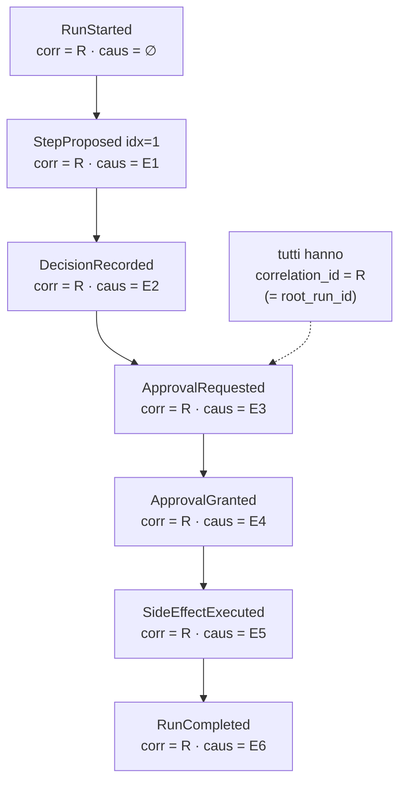

#### Come leggerlo

Il `correlation_id` è **orizzontale**: risponde a *"tutto quello che riguarda questo albero"*,
e serve per la UI, per il debug e per l'export di audit. È sempre `root_run_id` — quindi anche
in un albero di run, un solo identificatore raccoglie tutto.

Il `causation_id` è **verticale**: risponde a *"perché è successo questo?"*, e produce la
catena. Serve in un caso preciso e difficile: quando un umano deve capire **come si è arrivati**
a un side effect. Con la sola correlazione ottieni un elenco; con la causazione ottieni una
storia.

**Nota su `ADR-137`:** il `trace_id` W3C è **un terzo identificatore**, e non sostituisce
nessuno dei due. `root_run_id` è **stato**, il `trace_id` è **correlazione tecnica** e per
`AR-ID-02` non entra mai in una decisione di autorizzazione.

### 20.4 Ordinamento

**Decisione: nessun ordinamento globale.** Le garanzie sono queste, e nessuna di più:

| Ambito | Garanzia | Come |
|---|---|---|
| dentro un run | **totale** | `step_index` monotono e senza buchi |
| dentro un albero | **parziale** | l'ordine fra rami paralleli non è definito. `ADR-033`: il parallelismo esiste solo in lettura |
| dentro un tenant | **nessuna** | `uuidv7()` dà un ordine approssimato, non una garanzia |
| globale | **nessuna** | e non serve a niente che ci interessi |

Cercare un ordinamento globale costerebbe una sequenza condivisa, cioè un punto di
serializzazione per tutta la piattaforma. `AR-EV-28`: **nessun componente dipende da un ordine
globale degli eventi.**

### 20.5 Versioning e retention degli eventi

**Versioning.** `event_version` è un intero per `event_type`. Regola (`AR-EV-29`): **un
cambiamento che toglie o rinomina un campo, o ne cambia il significato, richiede un
`event_type` nuovo, non un `event_version` nuovo.** Un `event_version` nuovo serve solo per
aggiunte compatibili. È la stessa logica di `ADR-061` (`compat` `COMPATIBLE`/`BREAKING`
verificato in CI, niente semver) applicata agli eventi.

Il motivo è che gli eventi **persistono**: un lettore fra due anni leggerà eventi scritti oggi.
Se il significato di un campo può cambiare a parità di nome, ogni analisi storica diventa
falsa in silenzio.

**Retention.** Tre classi diverse, con proprietari diversi:

| Classe | Esempio | Retention | Chi decide |
|---|---|---|---|
| **audit di sicurezza** | decisioni del PDP, side effect eseguiti, approvazioni, revoche | lunga; l'export è `DEF-08` (`A16`/`C26`) | `A14`, non io |
| **journal di esecuzione** | `run_step` | vive quanto serve al debug e alla promozione a workflow | `A14`; `NON ANCORA DECISO` |
| **eventi operativi** | heartbeat, prelievi di coda | **non si scrivono come eventi**: sono metriche | questo documento |

La terza riga è una decisione che vale la pena esplicitare: **un heartbeat non è un evento**.
Se ogni battito diventasse una riga, la tabella degli eventi crescerebbe di ordini di
grandezza per informazione di valore quasi nullo. I battiti sono un `UPDATE` su una colonna, e
la loro storia è una metrica (`A12`), non un archivio.

---

## 21. Event sourcing: no, e perché

> ## `ADR-147` — Nessun event sourcing. Stato corrente + journal + audit append-only
>
> **Le tre opzioni del prompt:**
>
> | Opzione | Cos'è | Valutazione |
> |---|---|---|
> | **A** — stato corrente | tabelle mutabili con lo stato di adesso | insufficiente da sola: non spiegherebbe **come** ci siamo arrivati |
> | **B** — event sourcing puro | log append-only, lo stato si ottiene per fold | **respinta**, tre motivi sotto |
> | **C** — **ibrido** | stato corrente scritto direttamente + journal append-only + audit append-only | **scelta**, ed è ciò che l'architettura ha già |
>
> **Perché non B, in ordine di forza:**
>
> 1. **Il fold non è deterministico.** Ricostruire lo stato replicando gli eventi funziona se
>    riapplicare gli eventi dà sempre lo stesso risultato. Il nostro "evento" centrale è la
>    decisione di un modello sotto continuous batching, che `ADR-042` e `R-12` hanno già
>    dichiarato **non riproducibile**. Un event sourcing i cui eventi contengono già l'esito
>    (e non la causa) è solo un log con più cerimonia.
> 2. **Collide con la cancellazione irreversibile.** `ADR-098` e `AR-ME-17` impongono
>    tombstone + purge sulla memoria, che è **irreplaceable**, e la purge è **irreversibile**.
>    Un log immutabile di tutto renderebbe la cancellazione una finzione. Questo è il motivo
>    per cui l'architettura ha **già** separato "eventi con valore di prova" (che non
>    contengono testo, solo identificatori e hash — `ADR-083`, `ADR-084`) da "contenuto".
> 3. **Costo di comprensione per un team di 1-3 persone** (`AS-04`). L'event sourcing sposta la
>    complessità dal momento della scrittura al momento della lettura, e la lettura la fa
>    chiunque debba capire un bug alle tre di notte.
>
> **Cosa perdiamo, onestamente:** il time-travel gratuito ("com'era lo stato martedì alle 15").
> Non è gratis nemmeno per noi, ma è **ricostruibile** dal journal per un run, che è l'unico
> ambito in cui serve davvero. Perdiamo anche la possibilità di aggiungere una proiezione nuova
> e ricalcolarla su tutta la storia. Se un giorno servisse, il journal è comunque append-only:
> la proiezione si può costruire in avanti.
>
> **Reversibilità:** moderata (aggiungere un log completo dopo è possibile; toglierlo no).

---

## 22. Outbox e inbox

### 22.1 Serve un outbox?

Il pattern outbox serve quando devi fare due cose che non possono stare nella stessa
transazione: **scrivere lo stato** e **pubblicare fuori**. Da noi la pubblicazione interna non
esiste (non c'è bus), quindi la domanda si riduce a: *c'è qualcosa che deve uscire dal
database quando committiamo?*

**Sì, una cosa sola Day-1: la notifica all'approver.** `ADR-023` impone approvazione su ogni
`SIDE_EFFECT`; se nessuno avvisa la persona, ogni run muore per timeout. E mandare una mail
**dentro** la transazione è un bug classico: se la transazione fa rollback, la mail è già
partita; se la mail è lenta, la transazione resta aperta.

> ## `ADR-149` — Outbox minimale a una tabella, drenato dal pool di worker
>
> **Decisione.** Una tabella `outbox` con: `outbox_id` (`uuidv7()`), `tenant_id`, `kind`,
> `target_ref`, `payload_ref` (**riferimenti, mai contenuto**), `attempt`, `next_attempt_at`,
> `delivered_at`. Si scrive **nella stessa transazione** dello stato che la giustifica. La
> drena un `job` (`outbox_drain`) con lo stesso meccanismo di lease di tutto il resto.
>
> **`AR-EV-16`: l'outbox non contiene mai contenuto di dominio né segreti**, solo riferimenti.
> Chi consuma risolve il riferimento **rileggendo dal database sotto RLS**. Motivo: `INV-14` e
> `AR-ID-28`; e una tabella di uscita è il posto più facile da cui far uscire dati per errore.
>
> **Consegna: at-least-once.** Una notifica duplicata è un fastidio; una notifica persa è un
> run morto. La scelta è ovvia in questo verso.
>
> **Alternative considerate:** invio dentro la transazione (respinto, sopra); nessuna notifica
> e sola UI di polling (respinto: costringe l'approver a guardare una pagina); un broker
> (respinto, `ADR-138`).
>
> **Contro-argomento onesto:** un outbox senza consumatore vivo accumula in silenzio e nessuno
> se ne accorge finché tutti i run non scadono. È **`R-63`**, e la difesa è una metrica
> (`outbox_lag`) con un trigger (`T-EV-08`), non una speranza.
>
> **Reversibilità:** facile.

### 22.2 Inbox

Vedi `ADR-150` (§18.1): **non Day-1**, contratto definito. Quando arriverà, l'inbox è
`UNIQUE (source, external_event_id)` e la deduplica è quel vincolo, non del codice.

---

## 23. Event bus: no, e la ragione è vecchia

> ## `ADR-148` — Nessun event bus. Gli eventi sono righe, e nessun evento avvia un run
>
> **Decisione.** Conferma `ADR-138` di `A10` senza modifiche, e la rende operativa con una
> regola verificabile: **`AR-EV-13` — nessun percorso di codice fa partire un `run` in
> conseguenza della scrittura di un evento.** L'unico modo di far partire un run è un
> **command** autenticato e autorizzato (§8).
>
> **Perché è una decisione di sicurezza, non di infrastruttura.** Se un evento potesse avviare
> un run, l'autorità di quel run dovrebbe venire da qualche parte — e verrebbe da una
> configurazione, non da una persona. Avremmo un agent che agisce **senza `on_behalf_of`**,
> mentre `ADR-105` e `INV-17` impongono che `on_behalf_of` non sia mai vuoto e non sia mai un
> `AgentRun`. L'event-driven, nella nostra architettura, è la forma in cui `INV-13` diventa
> **inesprimibile** — che è esattamente il motivo per cui `A10` aveva già respinto il
> peer-to-peer e l'event-driven.
>
> **Cosa faremo quando servirà davvero un'esecuzione automatica** (per esempio: "ogni lunedì
> manda il report"): un `ServicePrincipal` dichiarato, con un ceiling proprio, materializzato
> da un umano, che compare nell'audit come `on_behalf_of`. È lavoro di `A03`/`A09` più che mio.
> Trigger: **`T-EV-06`**.
>
> **Reversibilità:** facile ad allentare (aggiungere un percorso), **impossibile a stringere**
> una volta che qualcuno ci ha costruito sopra. Da qui la severità.

---

## 24. Scheduling

### In breve

Una schedule dice **quando** creare un job. È configurazione, quindi vive nel Control Plane;
l'esecuzione vive nell'Execution Plane. Le due cose non si toccano mai direttamente.

### 24.1 Control Plane o Execution Plane?

Il prompt chiede dove appartenga lo scheduling. La risposta segue `A01`/`A02` senza inventare
niente:

* la **definizione** di una schedule (cosa, quando, per quale tenant, con quale priorità) è
  **configurazione**: è una risorsa del Control Plane, versionata, con audit delle modifiche
  (`AR-006`/`AR-008`: il runtime legge il Control Plane, non lo scrive mai);
* lo **stato** di una schedule (quando ha girato l'ultima volta, quando gira la prossima) è
  **esecuzione**: sta nell'Execution Plane.

Questo evita il pasticcio classico in cui il campo "prossima esecuzione" sta nella tabella di
configurazione e il runtime scrive dentro il Control Plane.

**`AR-CP-02` applicato:** `Schedule` ha lifecycle proprio (sì), owner proprio (sì, un
amministratore), è riferita da qualcosa (sì, dai job che genera). **Tre su tre**: è una
risorsa vera. Il modello risorse passa da 13 a **14**.

### 24.2 `ADR-151` — Scheduler come ruolo di processo, con advisory lock

> **Decisione.** Lo scheduling lo fa il ruolo `scheduler` già previsto da `ADR-001` (single
> artifact, multi-role process: `api`, `worker`, `scheduler`). Il suo lavoro è un ciclo:
>
> ```sql
> SELECT * FROM schedule
>  WHERE enabled AND next_fire_at <= now()
>  FOR UPDATE SKIP LOCKED LIMIT n;
> -- per ciascuna: INSERT nel work_queue + UPDATE next_fire_at
> -- tutto in una transazione
> ```
>
> **Doppio avvio.** Due processi `scheduler` non devono far partire due volte lo stesso job.
> Day-1 la difesa è **doppia**: (a) `FOR UPDATE SKIP LOCKED` sulla riga della schedule rende la
> corsa innocua di per sé, perché l'avanzamento di `next_fire_at` è nella stessa transazione;
> (b) un **advisory lock** a livello di database (`pg_try_advisory_lock`) garantisce che un solo
> processo `scheduler` sia attivo, così non si sprecano cicli.
>
> **Recupero delle finestre perse.** Se lo scheduler è stato giù, al riavvio troverà schedule
> con `next_fire_at` nel passato. La `catchup_policy` è un campo della schedule, con default
> **`SKIP`** (salta le occorrenze perse e riparte dalla prossima). Alternative: `ONE` (esegui
> una volta sola per recuperare) e `ALL` (esegui tutte le occorrenze perse — quasi sempre
> sbagliato: se un job di polling non gira per un giorno, non servono 288 esecuzioni, ne serve
> **una**).
>
> **Cosa non fa lo scheduler:** non esegue niente. Crea righe. L'esecuzione è del worker.
> Questo mantiene `AR-004` (un piano è una responsabilità, non un processo) e rende il
> fallimento dello scheduler poco grave: se muore, i job non vengono creati, ma niente si
> corrompe.
>
> **Alternative considerate:**
>
> | Alternativa | Perché no |
> |---|---|
> | `pg_cron` | una dipendenza in più nel database per fare `WHERE next_fire_at <= now()`. E non conosce tenant, priorità e audit |
> | `crond` di sistema | fuori dal nostro artifact (`ADR-001`), non testabile in CI, non tenant-aware, e su un deployment on-prem diventa configurazione manuale |
> | scheduler distribuito | non abbiamo più macchine (`Q-03` aperta) |
> | timer dentro i worker | ogni worker farebbe partire la stessa cosa |
>
> **Contro-argomento onesto:** l'advisory lock lega la leadership a una **connessione**. Con un
> connection pooler o dopo una riconnessione il comportamento va verificato (→ **`B-71`**), e
> Day-1 con un solo processo la questione è teorica. Diventa reale a `T-EV-07`.
>
> **Reversibilità:** facile.

### 24.3 Le sei forme di scheduling del prompt

| Forma | Supportata Day-1? | Come |
|---|---|---|
| **one-time** | sì | riga con `next_fire_at` e `recurrence = NULL` |
| **recurring** (ogni N) | sì | `recurrence` come intervallo |
| **cron** | sì, come formato di `recurrence` | è solo una sintassi per calcolare `next_fire_at` |
| **calendar-based** (fine mese, giorni lavorativi) | **no Day-1** | richiede un calendario e un fuso orario per tenant. `NON ANCORA DECISO` |
| **event-triggered** | **no, per decisione** | `ADR-148` / `AR-EV-13` |
| **dependency-triggered** (dopo che X è finito) | **no Day-1** | è un workflow, e Day-1 non ci sono workflow (`ADR-028`) |

Le tre righe con "no" sono tutte e tre **decisioni**, non dimenticanze, e due delle tre hanno
già un trigger (`T-EV-06`, `T-EV-09`).

---

## 25. Priorità, backpressure, fairness fra tenant

### 25.1 `ADR-158` — Tutto si risolve nella query di prelievo

> **Decisione.** Priorità, riserva per il lavoro interattivo e cap di concorrenza per tenant
> **si esprimono nella query di prelievo**, non in uno scheduler e non in code separate.
> Conferma ed estende `ADR-047` (la priorità è un limite di concorrenza a monte, risolto nella
> query di prelievo).
>
> **Tre meccanismi, in ordine:**
>
> 1. **Classe di worker.** Ogni worker ha una `worker_class`: `interactive` o `any`. I worker
>    `interactive` prelevano **solo** lavoro interattivo. Questo garantisce che il lavoro di
>    background non possa **mai** occupare tutta la capacità, qualunque cosa faccia la
>    `ORDER BY`. È `R-02` (un task pesante satura la GPU e blocca le interazioni umane),
>    presidiato in modo strutturale invece che statistico.
> 2. **`ORDER BY priority, scheduled_at`** dentro la classe. `AR-030`: ogni run porta una
>    `priority`, e `AR-AC-25`: il figlio **eredita** quella della radice, non può dichiararne
>    una propria (altrimenti un albero comprerebbe priorità come `R-50` comprava budget).
> 3. **Cap di concorrenza per tenant**, dal `ConfigSnapshot`: la query esclude i run dei tenant
>    che hanno già `n` run attivi. Nessun tenant può prendersi tutti i worker.
>
> **Costo dichiarato:** il terzo meccanismo richiede un conteggio dei run attivi per tenant
> dentro la query di prelievo, che è la parte più costosa del `SELECT`. È **`R-65`**. La
> mitigazione candidata è un contatore denormalizzato per tenant, aggiornato nella stessa
> transazione del lease — ma non la scelgo adesso, perché aggiunge uno stato da mantenere
> coerente e non ho una misura che dica che serve. → `B-67`.
>
> **Reversibilità:** facile.

### 25.2 Backpressure

Cosa succede quando arrivano più run di quanti se ne riescano a fare?

**Livello 1 — la coda assorbe.** È il comportamento normale e va bene: i run restano `PENDING`
e l'utente vede "in coda".

**Livello 2 — admission control.** Oltre una soglia di profondità della coda **per tenant**,
`POST /v1/runs` risponde **`429`** con `Retry-After`. Non accodiamo all'infinito: una coda che
cresce senza limite produce run che partono quando ormai non servono più a nessuno, e ognuno di
quei run consuma GPU.

**Livello 3 — degrado dichiarato.** Se l'inference server è saturo, la latenza cresce e le
soglie di `T-09` (GPU > 80 % con p95 fuori SLA) scattano. Non c'è nessun meccanismo che
"rallenti" il modello: `A05` ha già deciso che la priorità si risolve **a monte**, limitando la
concorrenza, non dentro il serving.

Le **soglie numeriche di tutti e tre i livelli sono `NON ANCORA DECISO`**: sono `DEF-05`, che
appartiene a `B21`. Quello che questo documento fornisce è il **meccanismo** e le metriche che
permetteranno di scegliere i numeri (§30).

---

## 26. Versioning e riproducibilità di un'esecuzione

### In breve

Un run che parte oggi deve continuare a significare la stessa cosa anche se domani cambiamo
tutto. Il meccanismo esiste già e si chiama `ConfigSnapshot`.

### 26.1 La domanda del prompt, e perché è già risolta

Il prompt chiede se un workflow in corso debba **pinnare** la versione dell'agent, del modello,
del prompt, della policy, dei tool. `A02` ha già risposto con `ADR-012`: il runtime risolve la
configurazione **una volta all'avvio del run**, la congela in uno snapshot **immutabile e
hashato**, e `AR-CP-01` vieta di rileggere il Control Plane durante il run.

Quindi **tutto è pinnato**, per costruzione:

| Cosa | Pinnata? | Riferimento |
|---|---|---|
| `AgentVersion` | sì, nello snapshot | `ADR-015` |
| `ModelVersion` | sì | `ADR-041` (il prompt è tre sorgenti versionate) |
| istruzione di sistema / prompt | sì, dentro `AgentVersion` | `ADR-041` |
| `ToolVersion` + `tool_definitions_hash` | sì, e **costante per tutta la durata del run** | `ADR-054`, `AR-TL-08` |
| `bundle_version` delle policy | **sì, il tetto**; ma l'autorità viva si rilegge | `ADR-106` |
| `MemorySnapshot` | sì, congelato all'avvio | `ADR-092` |
| `build_id` del codice | registrato, verificato all'avvio del worker | `ADR-051` |
| `model_id` per un albero | uguale per tutti i run dell'albero | `AR-AC-07` |

**L'unica eccezione, ed è deliberata:** l'**autorità viva** (stato del soggetto, sessione,
delega, ruoli, freschezza dei grant) si rilegge a ogni `AUTHORIZE` (`ADR-106`). Cioè: la
configurazione è congelata, i **permessi** no. Una revoca ferma le azioni subito. È
l'asimmetria giusta: congelare la configurazione dà prevedibilità, congelare i permessi darebbe
un buco di sicurezza.

### 26.2 Il caso brutto: la versione pinnata non esiste più

Un run parte lunedì con `ToolVersion` X. Martedì qualcuno rimuove X. Mercoledì il run riprende
dopo un crash.

**Comportamento (`AR-EV-30`): il run fallisce in modo visibile, con
`termination_reason = PINNED_VERSION_MISSING`. Non si sostituisce mai una versione con
un'altra.** `AR-CP-03` dice già che `resolve()` non produce mai snapshot parziali: se un
riferimento non si risolve, fallisce interamente. Qui estendo lo stesso principio dalla
risoluzione alla **ri-lettura durante il recovery**.

**Perché è la scelta giusta anche se produce un fallimento:** sostituire silenziosamente X con
X+1 significherebbe cambiare il significato di un'esecuzione in corso — che è esattamente ciò
che il prompt vieta ("never silently change the meaning of an existing execution"), e che
`ADR-051` presidia col `build_id`.

**Conseguenza operativa da scrivere nelle procedure:** le versioni non si cancellano finché
esiste un run non terminale che le referenzia. Query di guardia da eseguire prima di ogni
rimozione. È `R-66` sotto un'altra forma.

### 26.3 Riproducibilità: cosa promettiamo davvero

`ADR-042` è già chiarissimo e non lo cambio: si promette la riproducibilità dell'**evidenza**,
non dell'output. Cioè: non possiamo rieseguire un run e ottenere le stesse parole, ma possiamo
dire, per ogni passo, **quale modello, quale prompt, quale tool, quale policy, quali frammenti,
quale decisione, quale identità**.

Per il replay di `C29`, il journal contiene già tutto ciò che serve, e questo documento
aggiunge due elementi che prima non c'erano:

* **`dispatched_at`** — permette di distinguere, a posteriori, un side effect avvenuto da uno
  solo deciso;
* **`attempt` e `error_class` per tentativo** — permettono di ricostruire quanti tentativi ci
  sono voluti e perché, che è metà del debug di un incidente.

**`AR-EV-31`: un replay non riproduce mai un side effect.** Il replay è per lettura e
comprensione. Se un giorno servisse un "riesegui davvero", quello è un **run nuovo** con le sue
autorizzazioni (§8.4).

---

## 27. Rapporto con memoria, knowledge e artifact

### 27.1 Stato di esecuzione ≠ memoria

`A08` è già netta e la ripeto perché il prompt la chiede esplicitamente: **non si scrive lo
stato di esecuzione nella memoria a lungo termine.**

| Domanda | Stato di esecuzione | Memoria (`A08`) |
|---|---|---|
| a cosa serve | far avanzare **questo** run | ricordarsi qualcosa **fra** i run |
| vive quanto | il run (più la retention del journal) | finché non viene superata o cancellata |
| contiene fatti di dominio? | **sì**, in forma di identificatori e riferimenti | **mai** (`ADR-089`) |
| chi la scrive | il runtime, in transazione | il modello via tool `memory_write`, autorizzato |
| è versionata bi-temporalmente? | no | sì (`ADR-102`) |

Scrivere lo stato di esecuzione nella memoria produrrebbe **`R-35`** (la memoria diventa una
copia strisciante del CRM, violando `INV-07` per accumulo), che `ADR-089` presidia come vincolo
di **schema**.

**Il ponte legittimo fra i due** esiste ed è uno solo: `run_summary` (`ADR-101`), generato in
modo **deterministico da codice**, mai dal modello. Il journal alimenta il riassunto, il
riassunto alimenta la continuità fra run. Nient'altro passa.

### 27.2 Gli input di un run

Il prompt avverte: *"evita di mettere grossi blob dentro lo stato del workflow"*. Da noi la
regola è più forte (`AR-EV-24`, §10.1): **nello stato non entra mai contenuto, solo
riferimenti.**

| Tipo di input | Come si rappresenta |
|---|---|
| l'istruzione dell'utente | testo breve in `run.input`, ed è **incomprimibile** nel digest (`AR-ME-13`) |
| documenti | `content_hash` verso il `BlobStore` (`ADR-073`) |
| dato di dominio | **non si copia**: si legge dal vivo via `Tool` a ogni volta che serve (`ADR-067`, `INV-07`) |
| frammenti recuperati | riferimenti + provenance a 11 campi (`AR-KN-04`), append-only per run (`ADR-077`) |
| memorie | `MemorySnapshot`, per riferimento (`ADR-092`) |

**La domanda di consistenza, e la risposta.** Se un run legge il dato del CRM al passo 2 e
agisce al passo 40, il dato può essere cambiato. Non facciamo snapshot del dato di dominio
(sarebbe una copia, vietata da `INV-07`), quindi la difesa è tripla: (a) i compiti sono corti
(`ADR-104`); (b) il `freshness_requirement` del run (`AR-KN-17`) dice quanto vecchio può essere
ciò che si usa; (c) i tool con effetti che dipendono da uno stato letto prima devono usare una
forma di controllo ottimistico **presso il sistema esterno**, quando il sistema esterno la
offre. La (c) dipende da `Q-01` e da `B-23`: **`RICHIEDE RICERCA`**, non lo invento.

### 27.3 Artifact

`ADR-140` ha già deciso: gli artifact passano **per riferimento** (`content_hash` nel
`BlobStore`), e non esiste un'entità `Artifact`. Questo documento non cambia niente e ne eredita
la conseguenza pratica: **lo stato di un run non cresce con la dimensione di ciò che produce.**
Un run che genera un PDF da 40 MB ha lo stesso identico stato di uno che non genera niente,
più una riga con un hash.

---

## 28. Threat model dell'esecuzione

La sicurezza va spiegata concretamente (convenzione §27), non con la parola "Zero Trust". Qui
c'è chi controlla cosa, per ciascuna minaccia che il prompt elenca.

| # | Minaccia | Chi controlla | Difesa concreta | Residuo |
|---|---|---|---|---|
| 1 | **esecuzione non autorizzata di un run** | `api` + PDP | ogni `StartRun` è autenticato (`A09`) e autorizzato; `agent_id` esplicito; `tenant_id` dall'identità **risolta**, mai da un claim (`AR-018` precisata da `A09`) | — |
| 2 | **command falsificato** | `api` | i command entrano solo dall'API; nessun percorso interno crea run. `AR-ID-22`: nessun controllo saltato perché il chiamante è locale | chi ha accesso al processo `api` |
| 3 | **evento falsificato** | database | gli eventi li scrivono **solo** i nostri ruoli PostgreSQL (`ADR-116`); l'audit è append-only e in tabella separata (`ADR-010`, `INV-05`) | chi ha `root` sulla macchina (**`R-47`**, dichiarato) |
| 4 | **replay** di un'approvazione | database | consumo atomico `WHERE consumed_at IS NULL` (`AR-ID-25`) + binding all'azione (`AR-ID-24`) | — |
| 5 | **webhook spoofing** | non applicabile Day-1 | nessun endpoint di callback (`ADR-150`). Quando arriverà: firma → finestra → dedup, **in quest'ordine** (`AR-EV-17`) | rinviato con contratto scritto |
| 6 | **escalation di privilegio via esecuzione** | PDP + ledger | `INV-13`/`INV-16`: l'autorità non cresce mai; `AR-EV-19`: nemmeno alla ripresa; il ledger è dell'albero (`INV-18`) | `R-41` (confused deputy verso il CRM), **non risolto Day-1**, presidiato da `AR-AC-22` |
| 7 | **autorizzazione stantia** | PDP a ogni `AUTHORIZE` | `ADR-106`: autorità viva. Una revoca ferma le azioni subito | `R-43`/`R-44`: dati già letti restano nel context ≤ 10 min (`ADR-104`) |
| 8 | **fuga di credenziali** | `Credential Broker` | `INV-14`: nessun `SecretMaterial` fuori da due moduli; `AR-EV-25`: mai nello stato di esecuzione; `AR-EV-16`: mai nell'outbox | `AS-28` (il broker è in-process) |
| 9 | **esecuzione cross-tenant** | database | `tenant_id` su ogni riga di lavoro + RLS (`AR-EV-03`); `ADR-139`: `child.tenant_id = parent.tenant_id` applicato dal database | — |
| 10 | **workflow definition malevola** | non applicabile Day-1 | non esistono workflow definition (`ADR-028`). Quando esisteranno: risorse del Control Plane con materializzazione umana, come `ADR-063` per i tool MCP | rinviato |
| 11 | **payload di evento malevolo** | `trust_class` | `INV-08`: tutto ciò che viene da fuori è **dato, mai istruzione**; `INV-19`: nessuna funzione del PDP/PIP/PEP legge campi di un `AgentTask`/`AgentResult` | `R-51` (injection agent→agent), rinviato ad `A13` |
| 12 | **compromissione del worker** | — | **è game over per quel tenant**: il worker ha il client autenticato. Riduzione del raggio: ruoli PostgreSQL per processo (`ADR-116`), nessuna rete dal container di serving (`AR-MD-08`) | dichiarato, non risolto |
| 13 | **event injection** | schema | `event_type` da vocabolario chiuso; nessun consumatore agisce su un evento (`AR-EV-13`) | — |
| 14 | **task hijacking** (un altro worker prende il mio lavoro) | fencing token | `INV-22`: `lease_epoch` monotono; ogni scrittura ha `WHERE lease_epoch = mio` | un side effect **già partito** non ha fencing (§14.2) |

**Il punto 14 merita una nota.** Il fencing protegge il **database**, non la **rete**. Se un
worker lento sta parlando con Odoo e il suo lease scade, il secondo worker può iniziare la
stessa chiamata. Il fencing impedirà al primo di registrare l'esito, ma non impedirà a Odoo di
ricevere due richieste. È il motivo per cui `AR-EV-27` (`timeout esterno < heartbeat <
lease_ttl`) è un vincolo **di sicurezza**, non di prestazioni, e va verificato in CI.

---

## 29. Deployment mentre i run sono vivi

### 29.1 `ADR-159` — Drain ai confini di passo, migrazioni expand/contract

> **Decisione.**
>
> **Shutdown.** Alla ricezione del segnale di terminazione, un worker: (1) smette di prelevare
> nuovo lavoro; (2) **finisce lo step in corso**; (3) rilascia il lease scrivendo lo stato; (4)
> esce. Il lavoro torna in coda e un altro worker (nuova versione) lo riprende. Un worker che
> non riesce a finire entro il *grace period* viene ucciso, e allora vale il recovery normale
> (§10.3): il sistema **non ha un percorso speciale per lo shutdown**, e questo è deliberato —
> un percorso in meno da sbagliare.
>
> **Migrazioni: expand/contract.** Ogni migrazione si fa in due rilasci: prima si **aggiunge**
> (colonne nullable, nuove tabelle, nuovi valori di enum), si rilascia il codice che scrive sia
> il vecchio sia il nuovo, poi si **rimuove**. Non si rinomina mai una colonna in un rilascio
> solo mentre esistono run vivi.
>
> **Versioni pinnate.** `AR-EV-30` (§26.2): una versione referenziata da un run non terminale
> non si rimuove. Query di guardia obbligatoria prima della rimozione.
>
> **Contro-argomento onesto:** expand/contract raddoppia il numero di rilasci per ogni
> cambiamento di schema, e con un team di 1-3 persone la tentazione di saltarlo sarà forte. La
> difesa non è la disciplina: è che **`ADR-104` limita la vita di un run a 10 minuti attivi**,
> quindi una finestra di drain breve svuota davvero il sistema. Con run di ore, expand/contract
> sarebbe l'unica strada; con run di minuti, si può anche scegliere di **fermare gli avvii,
> aspettare, migrare**. Registro che `ADR-104` rende la manutenzione molto più semplice di
> quanto sarebbe altrimenti: è un beneficio collaterale del vincolo del committente.
>
> **Reversibilità:** facile.

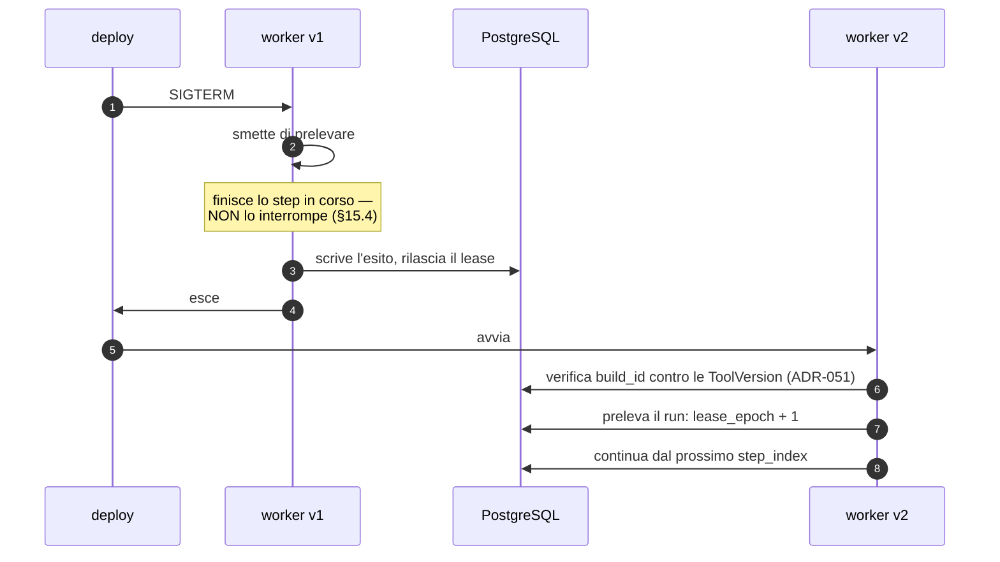

#### Come leggerlo

Il run **non se ne accorge**. Non c'è nessuna transizione di stato dedicata al deploy, nessuna
"migrazione di esecuzione", nessun handoff fra processi. Il run è nel database, e il database
non è stato riavviato. È il vantaggio principale di aver messo lo stato dove sta il dato invece
che nella memoria di un processo.

Il passo 8 è quello che `ADR-051` ha già preteso: un worker che parte **verifica** che le
implementazioni dei tool corrispondano alle definizioni registrate. Un worker con un `build_id`
incoerente non deve prendere lavoro: prenderebbe run pinnati a definizioni che non sa
eseguire.

---

## 30. Observability: cosa si misura

Le metriche appartengono ad `A12`, che deve garantire che ogni trigger abbia una misura
(`AR-035`). Qui elenco **cosa `A11` ha bisogno che esista**, altrimenti i trigger di questo
documento non scattano mai.

| # | Metrica | Perché esiste | Trigger che la usa |
|---|---|---|---|
| M-EV-1 | `queue_wait_p95` per classe e priorità | distingue "siamo lenti" da "siamo in coda" | `T-EV-01`, `T-01` |
| M-EV-2 | `step_transitions_per_second` | è la grandezza della rubrica di `R-04` | `T-EV-02`, `T-02` |
| M-EV-3 | `step_write_latency_p95` | costo delle tre scritture di `ADR-144` | — |
| M-EV-4 | `uncertain_after_crash_rate` | quanti crash producono un umano da chiamare | **`T-EV-03`** |
| M-EV-5 | `lease_expiry_rate` e `zombie_write_rejected_count` | quanto spesso i worker muoiono, e se il fencing funziona | `T-RT-06` |
| M-EV-6 | `tree_ledger_contention` (attese sull'`UPDATE`) | `R-59` | `T-EV-02` |
| M-EV-7 | `run_steps_p95` e `run_active_duration_p95` | già chiesti da `A10` | **`T-AC-04`** → riapre `ADR-104` |
| M-EV-8 | `approval_wait_time_p50/p95` | `T-RT-04` (tempo di attesa > tempo di lavoro) | `T-RT-04`, `T-GP-02` |
| M-EV-9 | `delegation_expired_rate` | falsifica `AS-25` | **`T-ID-03`**, `T-EV-10` |
| M-EV-10 | `outbox_lag` e `outbox_undelivered_age` | `R-63`: un outbox fermo uccide tutte le approvazioni | **`T-EV-08`** |
| M-EV-11 | `stuck_runs` (la query di `INV-23`) | run che nessuno guarda | allarme, non trigger |
| M-EV-12 | `ledger_mismatch` (la query di `INV-20`) | **`R-50` si è realizzato** | allarme **critico** |
| M-EV-13 | `external_wait_share` | quanta parte del tempo attivo è attesa di sistemi esterni | §13.4 |
| M-EV-14 | `retry_rate` per `error_class` e per tool | tool instabili | `T-TL-07` |
| M-EV-15 | `scheduler_missed_windows` | lo scheduler è stato giù | — |
| M-EV-16 | `worker_utilization` per classe | dimensionamento del pool | `DEF-05` (`B21`) |
| M-EV-17 | `deploy_drain_duration` | quanto costa un rilascio | — |
| M-EV-18 | `cancel_to_stop_latency` | quanto ci mette una cancellazione a fermare davvero | — |

**Due di queste sono bloccanti**, nel senso che senza di esse un'affermazione di questo
documento diventa non falsificabile: **M-EV-12** (senza, `R-50` è una speranza) e **M-EV-4**
(senza, non sappiamo se il recovery funziona nel mondo reale).

**Distinzione obbligatoria (convenzione §20):** queste sono **metriche operative**, non audit.
L'audit è la prova di cosa è stato deciso e fatto (`INV-05`, tabella separata, append-only,
mai testo di dominio). Le metriche sono aggregati per capire come sta il sistema. Non si
mescolano: un log operativo non è mai una prova, e una prova non si campiona.

---

## 31. Failure mode, e cosa succede davvero

### 31.1 La tabella completa

| Guasto | Chi lo rileva | Cosa succede | Cosa vede l'utente | Perdita |
|---|---|---|---|---|
| **crash del worker** | scadenza del lease | il run torna prelevabile; classificazione §10.3 | un ritardo pari a `lease_ttl` | fino a un heartbeat di tempo attivo non contato (`R-60`) |
| **crash del database** | tutti | tutto si ferma. Nessuna scrittura persa oltre l'ultimo commit (WAL) | errore, poi ripresa | nessuna transazione committata |
| **disco pieno** | PostgreSQL | le scritture falliscono → nessun side effect procede (`AR-031`) | errori | nessuna: **fail closed** |
| **crash dello scheduler** | assenza di job creati | i job ricorrenti non partono; al riavvio `catchup_policy` decide | ingestion in ritardo → `T-KN-02` | finestre saltate, per scelta (`SKIP`) |
| **timeout dell'API esterna** | il connector | `TRANSIENT` → retry con backoff; se scade la deadline dello step → §10.3 | attesa, poi eventuale `UNCERTAIN` | possibile `UNCERTAIN` |
| **sistema esterno che risponde due volte** | idempotency key | effectively-once se la chiave è onorata | niente | — |
| **evento duplicato in ingresso** | non applicabile Day-1 | inbox con `UNIQUE` quando esisterà | — | — |
| **partizione di rete verso il database** | il worker | non può scrivere → non esegue (`AR-EV-22`) | attesa | nessuna |
| **due worker sullo stesso run** | `lease_epoch` | le scritture del vecchio colpiscono zero righe (`INV-22`) | niente | **rete non protetta**: §14.2 |
| **stato di run corrotto** (bug) | `INV-20`/`INV-23` | allarme; il run si chiude a mano e se ne avvia uno nuovo | messaggio d'errore | dichiarata |
| **deploy durante run vivi** | — | drain ai confini di passo (§29) | nessun effetto | nessuna |
| **migrazione incompatibile** | test in CI + guardia sulle versioni pinnate | il run fallisce con `PINNED_VERSION_MISSING` invece di comportarsi male | errore comprensibile | il run, non i dati |
| **outbox non drenato** | `outbox_lag` | le notifiche non partono → i run scadono in `EXPIRED` | "approvazione scaduta" senza averla mai vista | **`R-63`**, il guasto più insidioso |
| **GPU giù** | `ModelProvider` | i run falliscono o restano in coda; degrado a sola lettura (`R-14`, accettato) | errore | nessuna |

### 31.2 Il guasto che fa più paura, e non è un crash

È l'ultima riga: **l'outbox fermo**. Non produce nessun errore, nessuna eccezione, nessun log
rosso. Produce **silenzio** — e il silenzio, in un sistema in cui ogni `SIDE_EFFECT` richiede
un'approvazione umana (`ADR-023`), significa che tutto scade lentamente e sembra colpa degli
utenti che "non approvano". `M-EV-10` esiste solo per questo.

### 31.3 Day-1 / Prepare / Scale / Enterprise

| Capacità | **Day-1** | **Prepare** (progettato, non costruito) | **Scale** (a trigger) | **Enterprise** |
|---|---|---|---|---|
| job | tabella + `SKIP LOCKED` + lease | — | contatori denormalizzati, indici partizionati | code partizionate |
| workflow | **nessuno** (`ADR-028`) | `WorkflowDefinition` come risorsa CP | modo `WORKFLOW` (`T-RT-02`) | versioning e migrazione di workflow |
| scheduling | `schedule` + `next_fire_at` + advisory lock | `catchup_policy` completa | leader election esplicita (`T-EV-07`) | scheduler distribuito, calendari per tenant |
| retry | backoff + jitter + tetto per classe | — | budget di retry per tenant | politiche per SLA |
| idempotency | chiave da `(run_id, step_index)`; probe di verifica | — | dedup lato connector | contratto con i sistemi esterni |
| durable execution | journal + lease + fencing | contratto di §32 | DBOS/`pg_durable` (`T-EV-04`) | Temporal (`T-02`) |
| approvazione umana | stati + obbligazione + outbox | — | code di approvazione per ruolo | deleghe di approvazione, escalation |
| callback | **niente** | contratto in §18.2 | inbox + firma (`T-EV-05`) | gateway di webhook |
| eventi | righe in `audit_event` + `run_step` | envelope completo | proiezioni di lettura | export (`DEF-08`) |
| outbox | una tabella, un `kind` | — | consumatore dedicato (`T-EV-08`) | canali multipli |
| inbox | **no** | schema definito | `T-EV-05` | — |
| event bus | **no, mai** (`ADR-148`) | — | — | — |
| worker pool | processi con `worker_class` | — | più macchine (`Q-03`) | autoscaling |
| fairness | cap per tenant nella query | — | contatori denormalizzati (`R-65`) | quote contrattuali |
| replay | journal ispezionabile | — | `C29` | replay certificato |
| compensazione | `compensation_hint`, mai automatica | — | — | saga con approvazione |
| multi-region | **no** | — | — | richiede engine dedicato: `ADR-141` cade |

### 31.4 `RPO` / `RTO`: cosa serve per chiuderli (senza chiuderli)

`DEF-06` è di `C24` e dipende da `Q-02` (aperta: esistono requisiti di SLA/RPO/RTO dichiarati
dal committente?). **Non la chiudo.** Ma posso dire con precisione cosa questo documento
impone a chi la chiuderà:

1. **La memoria è `irreplaceable`** (`A08`, `ADR-098`): non è ricostruibile da nessuna
   sorgente, a differenza della knowledge (`AR-KN-07`, tutto il derivato è ricostruibile). Il
   `RPO` della piattaforma è quindi **dettato dalla memoria e dall'audit**, non dall'indice.
2. **Anche il journal è irreplaceable.** Perderlo significa perdere la risposta alla domanda
   "questo side effect è avvenuto?" per tutti i run in volo. Un `RPO` di, per dire, un'ora
   significherebbe: **un'ora di side effect di cui non sappiamo se sono avvenuti**. È molto
   peggio di quanto suoni.
3. Quindi il vincolo minimo è: **il backup deve garantire che, per ogni side effect avvenuto,
   la riga `IN_FLIGHT` corrispondente sia recuperabile.** In pratica questo significa
   `RPO ≈ 0` sulle tabelle di esecuzione, cioè archiviazione continua del WAL, non solo dump
   periodici.
4. `AR-EV-02` (nessuna tabella di lavoro `UNLOGGED`) è la precondizione tecnica: **FATTO**
   (`R-05`), le `UNLOGGED` non sono replicate e vengono troncate al crash.
5. Sull'`RTO` non ho niente da dire: dipende da quanto l'azienda può stare ferma, che è
   `Q-02`.

**Nota per `C24`:** se il committente accettasse un `RPO` alto, la conseguenza da mettergli
davanti non è "perdiamo dei dati", è **"non sapremo se abbiamo fatturato"**. È una frase che
un committente capisce.

---

## 32. L'architettura Day-1, per intero

### 32.1 La state machine del run, completa

Riporto la macchina di `A04` per intero, perché questo documento deve essere leggibile da solo
(convenzione §31) e perché è la mappa su cui tutto il resto si appoggia. **Non è cambiata**:
13 stati, quelli decisi da `A04`. Ciò che `A11` aggiunge sono le **ragioni terminali**
(`ADR-155`), scritte fra parentesi.

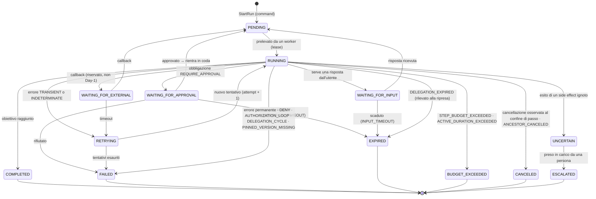

#### Come leggerlo

Tre osservazioni.

**Le uscite dalle attese vanno a `PENDING`, non a `RUNNING`.** È una precisazione che `A11`
aggiunge: un run risvegliato **non è in esecuzione**, è **prelevabile**. Deve passare di nuovo
dalla coda perché deve prendere un lease nuovo, e perché deve rifare i controlli dell'ordine di
§10.6 (cancellazione, budget, autorità). Un risveglio che porta direttamente a `RUNNING`
salterebbe quei controlli.

**`UNCERTAIN` è l'unico stato non terminale da cui non si torna a lavorare.** Va solo verso una
persona. È la confessione strutturale dell'architettura.

**`EXPIRED` ha quattro ragioni diverse** e una sola di esse (`DELEGATION_EXPIRED`) è il caso
del §1.4. Le ragioni non sono cosmetiche: sono ciò che permette a `M-EV-9` di distinguere "gli
utenti non approvano" da "le sessioni sono troppo corte", che sono due problemi con due rimedi
opposti.

### 32.2 L'architettura Day-1, in un diagramma

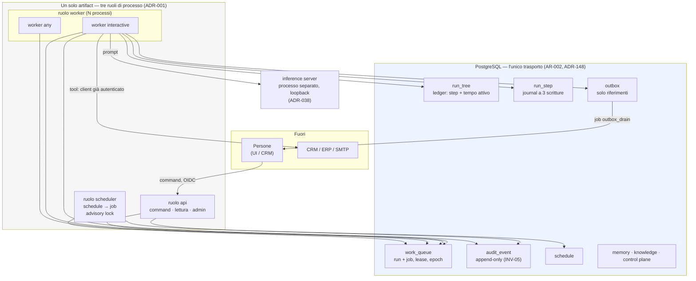

#### Come leggerlo

**Non c'è nessuna freccia fra i processi.** `api`, `scheduler` e `worker` non si parlano: si
parlano attraverso il rettangolo azzurro. È `AR-002`, ed è la ragione per cui tutta questa
architettura sopravvive a un riavvio qualunque: **lo stato non è mai in un processo**.

Il rettangolo azzurro contiene **sette tabelle logiche**, di cui **due nuove** introdotte da
questo documento (`run_tree` e `outbox`) e una nuova risorsa di Control Plane (`schedule`).
Tutto il resto esisteva già.

Le uniche due frecce che escono dal perimetro sono: verso l'inference server (loopback,
`ADR-038`) e verso il CRM (con un client già autenticato, mai un segreto, `ADR-056`). Non
esiste una terza porta.

### 32.3 L'architettura futura, se e quando i trigger scatteranno

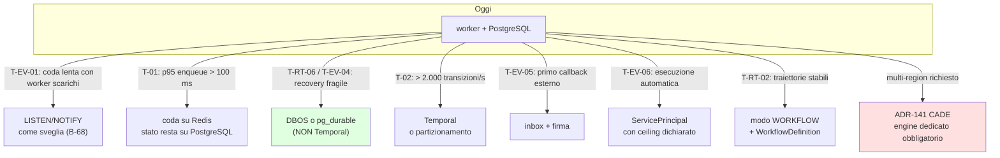

#### Come leggerlo

Otto strade, e **nessuna è "prima o poi arriveremo a Kafka"**. Ogni freccia parte da una
condizione **osservabile e misurata**, non da una previsione.

Il riquadro verde è la direzione più probabile e la meno drammatica: se il nostro recovery si
dimostrasse fragile, la risposta è una **libreria** che vive nello stesso processo e nello
stesso database, non un cluster.

Il riquadro rosso è l'unico caso in cui `ADR-141` **cade davvero**: il multi-region. Un
requisito multi-region rende obbligatorio un engine con consenso distribuito, perché la nostra
architettura poggia interamente sul fatto che esiste **un** PostgreSQL. È il vero limite
strutturale, e va detto senza giri di parole.

### 32.4 I contratti stabili (che rendono possibile ogni freccia del diagramma)

Il prompt chiede come l'esecuzione Day-1 possa evolvere **senza riscrivere** Agent Runtime,
Tool Runtime, Identity, Governance, Memory, Knowledge e il layer multi-agent. La risposta sta
in quali interfacce restano ferme:

| Contratto | Firma concettuale | Chi lo usa | Sopravvive a un cambio di motore? |
|---|---|---|---|
| `ExecutionContext` | `(tenant_id, run_id, root_run_id, step_index, attempt, idempotency_key, deadline_at, principal, decision_id)` | tutti | **sì** — è ciò che si passa a un tool, ed è indipendente da chi lo ha prodotto |
| `StepJournal.append()` | `(ExecutionContext, state, refs) → step_id` | `A04` | **sì**, se il motore accetta di scrivere nel *nostro* journal |
| `TreeLedger.consume()` | `(root_run_id, n)` → grant, oppure `STEP_BUDGET_EXCEEDED` | `A04`, `A10` | **sì** — è nostro e resta nostro |
| `WorkClaim` | `claim(worker_class, capacity) → Lease[]` | worker | **no**: è esattamente ciò che un motore sostituirebbe |
| `Lease` | `heartbeat()`, `release(outcome)`, `epoch` | worker | **no**, stesso motivo |
| `RecoveryClassifier.classify()` | `(step)` → `REPLAY` / `VERIFY` / `UNCERTAIN` | recovery | **sì**, ed è la parte che nessun motore ci toglierebbe |
| `Command` API | REST, `202` + id | UI, CRM | **sì** |
| `ArtifactReference` | `content_hash` | tool, knowledge | **sì** (`ADR-140`) |

**Il punto:** delle otto interfacce, **due** sono legate al motore. Un'eventuale migrazione a
DBOS/`pg_durable` toccherebbe `WorkClaim` e `Lease`, e lascerebbe intatti journal, ledger,
classificazione del recovery, command e artifact. Questo è ciò che rende `ADR-141`
**moderatamente reversibile** invece che costosa.

**Il contratto che vale la pena scrivere per primo** è `RecoveryClassifier`: è la parte più
delicata (`R-06b`), è quella che nessun motore ci regalerebbe, ed è **testabile in isolamento**
senza uccidere nessun processo. I test `TC-EV-01`…`TC-EV-04` diventano test di funzione pura
sui dati del journal, più i test di integrazione che uccidono davvero il worker.

---

## 33. Analisi di reversibilità

| Elemento | Classe | Perché |
|---|---|---|
| `work_queue` come tabella | **facilmente reversibile** | è dietro `WorkClaim` |
| lease + heartbeat | **facilmente reversibile** | tre colonne |
| **`lease_epoch` (fencing)** | **moderatamente reversibile** | toglierlo dopo significa rileggere ogni percorso di scrittura |
| **`run_tree` e il ledger** | **costoso da invertire** | è schema, e ogni run vivo lo referenzia. `INV-18` dipende da lui |
| **trigger di consumo del ledger** | **moderatamente reversibile** | spostarlo nel codice è facile; ma è **la** difesa contro `R-50` |
| **protocollo a tre scritture (`IN_FLIGHT`)** | **costoso da invertire** | è protocollo, non solo schema: toglierlo rende non classificabili tutti gli step storici |
| `termination_reason` | facilmente reversibile | una colonna |
| schema degli eventi (envelope) | **costoso da invertire** | gli eventi persistono e vengono letti anni dopo (`AR-EV-29`) |
| assenza di event bus | **facile ad allentare, impossibile a stringere** | come `ADR-133`: una volta che qualcuno costruisce sopra un percorso event-driven, non si toglie più |
| assenza di event sourcing | moderatamente reversibile | si può aggiungere un log in avanti; non all'indietro |
| scheduler come ruolo | facilmente reversibile | — |
| `wakeup_at` come timer | facilmente reversibile | una colonna |
| outbox | facilmente reversibile | una tabella con un consumatore |
| **il motore (`ADR-141`)** | **moderatamente reversibile** | §32.4: due interfacce su otto |
| **assenza di compensazione automatica** | facilmente reversibile ad aggiungere | il journal ha già i dati |
| assenza di callback/inbox | facilmente reversibile | una tabella nuova, zero righe esistenti |
| multi-region | **effettivamente irreversibile** rispetto a `ADR-141` | richiederebbe di rifare il modello, non di estenderlo |

---

## 34. Autocritica architetturale

Rispondo alle venti domande del prompt senza abbellire.

**1. Ho distinto evento da command?** Sì, §4.2-4.3, e la distinzione ha prodotto una regola
verificabile (`AR-EV-13`).

**2. Workflow da agent?** Sì, §5, con un test a quattro domande. Ma il test **non è stato
provato su casi reali**, perché i casi reali dipendono da `Q-01`.

**3. Stato di esecuzione da memoria?** Sì, §27.1, ereditando `ADR-089`.

**4. Ho fatto ricerca sulle alternative di durable execution?** L'ho **usata** (`R-04`), non
rifatta. È corretto secondo il mandato ricevuto, ma va detto che `R-04` è una passata di
ricerca del 2026-08-22 e **nessuna delle opzioni è stata provata sul nostro hardware**. La
decisione di §7 poggia su una rubrica riportata da fonti, non su una misura nostra.

**5. Ho evitato Kafka senza requisito?** Sì. **6. Temporal?** Sì, e con un argomento più forte
di "costa troppo".

**7. I retry sono idempotenti?** **Solo se il tool lo dichiara.** Questa è la debolezza più
onesta del documento: la garanzia non è dell'architettura, è **delegata ai tool** e quindi a
`A06`, e quindi a `Q-01`. Se i sistemi target non offrono né idempotency key né verificabilità,
`AS-35` è falsa e ogni crash produce un `UNCERTAIN`.

**8. L'autorizzazione è rivalutata?** Sì, a ogni `AUTHORIZE` (`ADR-106`) e in più all'ordine di
§10.6 alla ripresa.

**9-10. Sopravvivenza a riavvio e morte del worker?** Sì per costruzione (lo stato è nel
database), ma **la correttezza del recovery non è dimostrata**, è solo progettata e testabile.
`R-06b` resta il rischio più concreto.

**11. Callback autenticati?** Non applicabile Day-1; contratto scritto (§18.2). Il rischio è
che il contratto venga ignorato quando arriverà la fretta.

**12. Eventi duplicati sicuri?** Sì per gli eventi interni (sono righe idempotenti per chiave);
per quelli esterni, quando esisteranno, tramite `UNIQUE`.

**13. Versioning definito?** Sì, ma **è quasi tutto ereditato** da `ADR-012`/`ADR-015`. `A11`
aggiunge solo `AR-EV-30` (versione pinnata mancante → fallimento visibile).

**14. I side effect irreversibili sono compensabili o recuperabili?** **No, e lo diciamo.**
§19: ordine, approvazione, `compensation_hint`, escalation. Non compensazione.

**15. Il Day-1 è davvero semplice?** Ragionevolmente: due tabelle nuove, una risorsa nuova, un
trigger, tre colonne di lease. Ma **il trigger di database è un corpo estraneo** in
un'architettura altrimenti tutta applicativa, e lo riconosco come debito di leggibilità.

**16. Scala per gradi?** Sì (§32.3), con otto trigger distinti.

**17. I run sopravvivono a un deploy?** Sì (§29), e `ADR-104` rende il drain breve.

**18. Budget e deadline si propagano?** Sì, e per **albero** (§12), che è più forte della
propagazione.

**19. Le risorse dei tenant sono isolate?** Logicamente sì (RLS + cap di concorrenza).
Fisicamente no: `D-03` è debito dichiarato dall'inizio.

**20. Quali assunzioni potrebbero invalidare l'architettura?** In ordine di pericolosità:
`AS-35` (idempotenza/verificabilità dei sistemi esterni — **Bassa**), `AS-34` (il polling è
abbastanza reattivo — Media), `AS-01` (decine di run concorrenti — Media), `AS-25` (la finestra
di approvazione sta in una sessione — Media), `AS-36` (i crash sono rari — Media).

### 34.1 Le tre cose che, se potessi, farei diversamente

1. **Il trigger di database** (`ADR-146`) mi mette a disagio. È la scelta giusta per `R-50`, ma
   introduce logica in un posto dove nessuno la cerca. Se avessi un modo altrettanto
   inaggirabile e più visibile, lo preferirei. Non ce l'ho.
2. **`lease_ttl`, `heartbeat_interval` e `max_attempts` sono tre numeri che non ho.** Ho fissato
   le loro **relazioni** (`AR-EV-27`), che è il massimo onesto, ma un'architettura di durable
   execution senza quei numeri è un'architettura a metà.
3. **La probe di verifica consuma dal ledger.** È coerente, ma significa che un run sfortunato
   (due crash) può morire per budget esaurito **a causa del recovery**. L'alternativa (probe
   gratuite) aprirebbe un percorso non contabilizzato, che è la porta di `R-50`. Ho scelto la
   coerenza, ma non sono sicuro sia la scelta giusta per l'utente.

---

## 35. Tentativo di dimostrare che questa architettura è sbagliata

Cambio ruolo. In questa sezione provo a **demolire** ciò che ho appena scritto, con gli
argomenti migliori che riesco a trovare. Poi dico quali reggono.

### Attacco 1 — "Avete costruito un workflow engine fingendo di non farlo"

*Journal, lease, fencing token, timer durevoli, retry con backoff, ledger, outbox, scheduler,
classificazione del recovery. Questo **è** un workflow engine. La differenza con Temporal non è
che voi non ne avete uno: è che il vostro non è testato da nessuno tranne voi, non ha una UI,
non ha una community, e lo mantengono tre persone che hanno anche altro da fare.*

**Regge?** **In parte, e fa male.** È vero che la somma dei pezzi è un motore. Le difese sono
due, entrambe parziali: (a) il perimetro è molto più piccolo (niente determinismo, niente
signal/query, niente versioning di workflow, niente timer distribuiti); (b) i pezzi che
scriviamo li scriveremmo comunque, perché portano `tenant_id`, `decision_id`, ledger d'albero e
`trust_class` — cose che nessun engine conosce.

**Il contro-attacco che non ho:** non posso dimostrare che il nostro recovery sia corretto.
Posso solo dire che è **testabile** e che ho scritto gli otto test che lo testerebbero.
Registro la confidenza come **Media**.

### Attacco 2 — "Il ledger d'albero è un punto di serializzazione globale"

*Ogni step di ogni run fa un `UPDATE` sulla stessa riga del proprio albero. Con fan-out, quella
riga diventa una hot row: tutte le transazioni dell'albero si mettono in fila. Avete costruito
un lock globale per albero e lo avete chiamato ledger.*

**Regge?** **Sì, tecnicamente, ed è `R-59`.** Ma la portata è limitata da un fatto: Day-1
`AR-AC-01` dice che ogni albero **ha un run solo**, quindi non c'è contesa. E anche in futuro,
`AR-AC-23` ammette fan-out parallelo **solo con figli di sola lettura**, e `ADR-033` limita il
parallelismo alle letture. La contesa massima è quindi il numero di figli paralleli in lettura
di un albero — un numero piccolo, non "tutta la piattaforma".

**Se l'attacco avesse ragione**, il rimedio esiste ed è noto: un ledger a **quote**, in cui
ogni run prenota un blocco di step invece di uno alla volta. Ma introduce budget non usato e
quindi indebolisce `INV-20`. Non lo faccio finché `M-EV-6` non mostra contesa reale.

### Attacco 3 — "Il tempo attivo come contatore è manipolabile da un crash loop"

*Un worker che muore ripetutamente fra due heartbeat non paga quasi niente. Un run patologico
potrebbe vivere ore di tempo reale consumando pochi minuti di tempo contabilizzato. Il vincolo
del committente — 10 minuti — sarebbe violato senza che nessuno lo veda.*

**Regge?** **Sì**, ed è `R-60`, che ho registrato invece di nasconderlo. Le difese esistenti
sono indirette: il tetto di step (che è pessimista e non si può eludere così), e il tetto di
`attempt` per step. Ma è vero che **il tetto temporale, da solo, non è a prova di crash loop**.

**Il rimedio che non ho scelto, e perché:** si potrebbe addebitare un costo fisso a ogni
acquisizione di lease, così anche i crash pagano. Non l'ho fatto perché renderebbe il costo
funzione della *sfortuna* invece che del *lavoro*, e un utente sfortunato vedrebbe il proprio
compito fallire senza capire. Lascio la questione aperta come voce di rischio, che è più
onesto di un rimedio inventato.

### Attacco 4 — "L'`UNCERTAIN` è una scusa elegante per non risolvere il problema"

*Avete progettato uno stato per dire "non lo so". Sembra maturo, ma in produzione significa che
un essere umano deve andare a guardare in Odoo se la fattura c'è. Fatelo N volte al giorno e
avete un sistema che genera lavoro invece di toglierlo.*

**Regge?** **Solo se `AS-35` è falsa.** Se i tool sono idempotenti o verificabili, `UNCERTAIN`
si presenta **solo** quando muore il processo **esattamente** durante un `SIDE_EFFECT` non
verificabile — cioè raramente al quadrato. Se invece nessun tool è verificabile, l'attacco ha
completamente ragione e il sistema diventa insostenibile.

**Questa è la ragione per cui `B-69` è una voce di ricerca importante** e non un dettaglio: la
sostenibilità operativa dell'intera architettura dipende dal fatto che Odoo (o chi per esso)
permetta di **cercare il record appena creato**.

### Attacco 5 — "Il polling è una scelta del 2005"

*State facendo `SELECT ... SKIP LOCKED` in loop. Con carico basso bruciate I/O a vuoto; con
carico alto aggiungete latenza. Chiunque userebbe `LISTEN`/`NOTIFY` o una coda vera.*

**Regge?** **Parzialmente.** `LISTEN`/`NOTIFY` non è una coda durevole (**FATTO**, `R-05`:
un `NOTIFY` emesso mentre l'ascoltatore è disconnesso è perso), quindi non sostituisce il
polling: lo accelera. E il polling è l'unico meccanismo che funziona identico dietro un pooler,
dopo una riconnessione, con N worker. La critica giusta non è "non usate NOTIFY", è **"non
avete misurato l'intervallo di polling che vi serve"** — ed è vera: `AS-34` è un'assunzione,
non una misura. → `T-EV-01`, `B-68`.

### Attacco 6 — "Avete vietato l'event-driven per ideologia"

*Ogni piattaforma di agent moderna reagisce a eventi: nuovo lead, ticket aggiornato, email in
arrivo. Voi lo avete vietato con `ADR-148` e adesso avete un sistema che sa solo rispondere,
mai iniziare. Non è un'architettura, è una limitazione di prodotto travestita.*

**Regge?** **È l'attacco più serio del documento, e regge parzialmente.** È vero che il divieto
ha un costo di prodotto grande, e che prima o poi un cliente chiederà "quando arriva un lead,
fai X".

Ma la ragione del divieto **non è ideologica**: è che un run avviato da un evento non ha un
`on_behalf_of` (`ADR-105`, `INV-17`: `on_behalf_of` non è mai vuoto e non è mai un `AgentRun`).
Cioè: non c'è nessuno per conto del quale l'agent stia agendo, quindi non c'è nessuna autorità
di cui l'agent sia un sottoinsieme, quindi `INV-13` **non è esprimibile**. Non è che
l'event-driven sia rischioso: è che nella nostra architettura dell'autorità **non ha
significato**.

**E ho detto come si risolve** (§23, `T-EV-06`): un `ServicePrincipal` dichiarato, con un
ceiling proprio, materializzato da un umano. Cioè: si può fare, ma richiede che qualcuno
**dichiari chi è il mandante**. Questo è il modo giusto, ed è lavoro di `A03`/`A09`.

### Attacco 7 — "Un solo PostgreSQL è un solo punto di guasto per tutto"

*Stato, coda, audit, knowledge, memoria, control plane, ledger. Tutto lì. Se quel database si
ferma, non è che il sistema degrada: sparisce.*

**Regge?** **Sì, completamente, ed è già accettato**: `R-04` del registro dei rischi (PostgreSQL
usato per tutto diventa il collo di bottiglia) e `R-14` (GPU singolo punto di guasto non
ridondato) sono la stessa filosofia: **Day-1 si accetta il single point of failure e si
dichiara**. La difesa non è architetturale, è operativa (backup, WAL continuo, `DEF-06`).

Vale però la pena notare una cosa: **la concentrazione ha anche un vantaggio**. Con un solo
datastore, "il sistema è coerente" è una proprietà di una transazione. Con quattro datastore
sarebbe un problema di consistenza distribuita, cioè una classe di bug che semplicemente **non
esiste** nella nostra architettura. Non ho barattato affidabilità con semplicità: ho barattato
**disponibilità** con **correttezza**, e per un sistema che tocca fatture credo sia il verso
giusto.

### Il verdetto

Degli otto attacchi, **tre reggono** e sono registrati come rischi (`R-59`, `R-60`, più il
rischio di fondo dell'Attacco 1 che è `R-06b`), **due reggono condizionatamente** ad assunzioni
esplicite (`AS-35`, `AS-34`), **uno è un costo di prodotto accettato con una via d'uscita
progettata** (Attacco 6), e **due sono debito dichiarato dall'inizio del progetto**
(Attacco 7, `D-01`/`D-03`).

**Quale attacco mi farebbe cambiare idea domani?** L'Attacco 4, se `B-69` tornasse dicendo che
non c'è modo di verificare una scrittura su Odoo. In quel caso non cambierei motore — nessun
motore risolve quel problema — ma cambierei **prodotto**: bisognerebbe rendere i `SIDE_EFFECT`
sempre a due fasi (prepara → conferma), il che è un vincolo enorme sul Tool Layer di `A06`.

---

## 36. I registri

### 36.1 Regole architetturali nuove — `AR-EV-01` … `AR-EV-31`

| ID | Regola | Verifica |
|---|---|---|
| AR-EV-01 | Il trasporto è il database. Nessun broker, nessun bus, nessuna coda in memoria | `ENFORCED` (test di dipendenze, `AR-005`) |
| AR-EV-02 | Nessuna tabella di lavoro, journal, audit o outbox è `UNLOGGED` | `ENFORCED` (test sullo schema) |
| AR-EV-03 | Ogni riga di lavoro porta `tenant_id` ed è sotto RLS | `ENFORCED` |
| AR-EV-04 | Nessun worker attende in memoria: ogni attesa è una riga con un istante di risveglio | `REVIEWED` |
| AR-EV-05 | Un `INSERT` in `run_step` è valido solo se consuma il ledger dell'albero nella stessa transazione | `ENFORCED` (trigger + `INV-20`) |
| AR-EV-06 | Il tempo attivo è un contatore incrementato da chi tiene il lease, mai una differenza fra timestamp | `ENFORCED` (test) |
| AR-EV-07 | Ogni scrittura di un worker su un run porta il proprio `lease_epoch` | `ENFORCED` (`TC-EV-06`) |
| AR-EV-08 | Il recovery non riesegue mai uno step `IN_FLIGHT` non idempotente e non verificabile | `ENFORCED` (`TC-EV-04`) |
| AR-EV-09 | `idempotency_key` deriva da `(run_id, step_index)` e non cambia fra i tentativi | `ENFORCED` (`INV-06`) |
| AR-EV-10 | Un retry non cambia mai `step_index`; cambia `attempt` | `ENFORCED` |
| AR-EV-11 | La classe di errore la dichiara il connector; il modello non decide mai se ritentare | `ENFORCED` (tipi) |
| AR-EV-12 | Nessun `job` chiama il modello, esegue un tool con `side_effects ≠ READ`, o avvia un run | `ENFORCED` (test statico) |
| AR-EV-13 | Nessun percorso di codice avvia un run in conseguenza della scrittura di un evento | `ENFORCED` (test statico) |
| AR-EV-14 | La cancellazione è una riga sull'albero, osservata ai confini di passo | `ENFORCED` |
| AR-EV-15 | Nessun figlio sopravvive alla radice: il `tree_reaper` chiude i discendenti non presidiati | `ENFORCED` (`AR-AC-18`) |
| AR-EV-16 | L'outbox contiene solo riferimenti: mai contenuto di dominio, mai segreti | `ENFORCED` (tipi, `INV-14`) |
| AR-EV-17 | Un callback esterno si autentica **prima** di essere correlato; la correlazione non è autenticazione | `REVIEWED` (non Day-1) |
| AR-EV-18 | Nessuno stato di esecuzione è derivato per fold di un log: lo stato si scrive | `REVIEWED` |
| AR-EV-19 | Un run che riprende non guadagna mai autorità, budget o deadline | `ENFORCED` (`TC-EV-08`) |
| AR-EV-20 | Il drain di un deployment rilascia il lease solo a un confine di passo | `REVIEWED` |
| AR-EV-21 | Nessun run in attesa occupa un lease | `ENFORCED` (`INV-23`) |
| AR-EV-22 | Ogni transizione durevole avviene in **una** transazione insieme all'audit | `ENFORCED` |
| AR-EV-23 | Ogni stato terminale porta un `termination_reason` non nullo | `ENFORCED` (`CHECK`) |
| AR-EV-24 | Nello stato di esecuzione entra solo un **riferimento**, mai un contenuto | `ENFORCED` (tipi) |
| AR-EV-25 | Nessuna credenziale è persistita nello stato di esecuzione | `ENFORCED` (`INV-14`) |
| AR-EV-26 | Le deadline si restringono verso il basso, mai si allargano | `ENFORCED` |
| AR-EV-27 | `timeout esterno < heartbeat_interval < lease_ttl` | `ENFORCED` (test di configurazione) |
| AR-EV-28 | Nessun componente dipende da un ordine globale degli eventi | `REVIEWED` |
| AR-EV-29 | Un cambiamento incompatibile di un evento richiede un `event_type` nuovo, non un `event_version` | `ENFORCED` (CI, come `ADR-061`) |
| AR-EV-30 | Una versione pinnata mancante fa fallire il run in modo visibile; nessuna sostituzione silenziosa | `ENFORCED` |
| AR-EV-31 | Un replay non riproduce mai un side effect | `ENFORCED` (tipi) |

**Debito noto: 24 su 31 con verifica automatica.** Le sette `REVIEWED` (`AR-EV-04`, `-17`,
`-18`, `-20`, `-28`, e in parte `-05`, `-15`) contano al gate di Level A.

### 36.2 Invarianti nuovi

| ID | Invariante |
|---|---|
| **INV-20** | Per ogni albero, `run_tree.steps_consumed` è **esattamente** il numero di righe `run_step` dei run dell'albero. Nessuno step senza consumo, nessun consumo senza step. *È la forma falsificabile di `INV-18` e la difesa misurabile contro `R-50`* |
| **INV-21** | Per ogni step con `side_effects ≠ READ`, **prima** che un solo byte parta verso un sistema esterno, esiste una riga committata con `state ∈ {PENDING, IN_FLIGHT}` che porta la sua `idempotency_key` e il `decision_id`. *Rende `ADR-029` sufficiente al recovery, non solo alla rilevabilità* |
| **INV-22** | In ogni istante, al più un worker possiede un lease valido su una unità di lavoro; `lease_epoch` è monotono crescente per unità di lavoro, e ogni scrittura di un worker è condizionata al proprio epoch. *Rende `AR-RT-08` strutturale invece che sperata* |
| **INV-23** | Ogni run in stato non terminale ha, in ogni istante, almeno una fra: un lease valido, un `wakeup_at`, un'attesa esplicita registrata. *Nessun run può essere perso* |

### 36.3 Rischi nuovi

| ID | Rischio | Classe | Prob. | Impatto | Mitigazione |
|---|---|---|---|---|---|
| **R-58** | **Il recovery classifica male uno step `IN_FLIGHT` e riesegue un side effect non idempotente** → duplicato in produzione. È `R-06b` reso concreto | Correctness | Media | **Alto** | `ADR-144` + `AR-EV-08` + `TC-EV-01`…`04`; `RecoveryClassifier` come funzione pura testabile |
| R-59 | Il ledger d'albero è una riga sola: hot row sotto fan-out, e allunga la transazione dello step | Scalability | Bassa Day-1, Media dopo | Medio | `M-EV-6`; `AR-AC-23` limita il fan-out ai figli di sola lettura; rimedio noto (quote) non applicato senza misura |
| **R-60** | **Un crash loop consuma tempo reale senza consumare tempo attivo**: il tetto di 10 minuti diventa ottimista | Correctness | Media | Medio | tetto di step (pessimista) + tetto di `attempt`. **Non risolto per il solo tetto temporale**, dichiarato |
| R-61 | Il `job` diventa la porta di servizio: qualcuno ci mette un tool con effetti, ottenendo un agent senza mandante | Security | Media | **Alto** | `AR-EV-12` con test statico; `ADR-142` separa le entità |
| R-62 | Il polling a intervallo fisso brucia I/O quando il sistema è scarico, o aggiunge latenza quando è carico | Performance | Media | Basso | `M-EV-1`, `T-EV-01`, `B-68` |
| R-63 | **L'outbox senza consumatore vivo accumula in silenzio**: nessuno riceve le notifiche di approvazione e tutti i run scadono. Guasto senza errori | Reliability | Media | **Alto** | `M-EV-10` + `T-EV-08`. È il guasto più insidioso del documento |
| R-64 | Il fencing token viene dimenticato in un percorso di scrittura → due worker sullo stesso run | Correctness | Media | Alto | `AR-EV-07` + `TC-EV-06`; helper unico di scrittura |
| R-65 | Il costo della fairness per tenant nella query di prelievo cresce col numero di run attivi | Performance | Media | Basso | `M-EV-1`; rimedio (contatore denormalizzato) noto e non applicato senza misura |
| R-66 | Una migrazione di schema o la rimozione di una versione rende inutilizzabili i run vivi | Reliability | Media | Medio | `AR-EV-30` + query di guardia + expand/contract (`ADR-159`) |

### 36.4 Assunzioni nuove

| ID | Assunzione | Confidenza | Impatto se falsa | Validazione |
|---|---|---|---|---|
| **AS-34** | L'intervallo di polling che ci possiamo permettere è compatibile con l'esperienza interattiva attesa | **Media** | serve `LISTEN`/`NOTIFY` o una coda vera prima del previsto | `M-EV-1`, `T-EV-01` |
| **AS-35** | **I sistemi esterni target onorano una idempotency key, oppure offrono un modo di verificare l'effetto avvenuto** | **Bassa** | **ogni crash durante un `SIDE_EFFECT` produce un `UNCERTAIN`**: il sistema genera lavoro umano invece di toglierlo | **`B-69`** (specializza `B-23`), dipende da `Q-01`. `M-EV-4`, `T-EV-03` |
| AS-36 | Un crash del worker è raro (giorni/settimane), quindi la finestra di tempo attivo non contabilizzato è irrilevante | Media | `R-60` diventa reale: i tetti temporali non tengono | `M-EV-5` |
| AS-37 | Il volume di job di background Day-1 sta in una coda condivisa con i run senza affamarli | Media | servono code o pool separati prima del previsto | `M-EV-16` per `worker_class` |

### 36.5 Trigger nuovi

| ID | Condizione osservabile | Riapre | Verso |
|---|---|---|---|
| **T-EV-01** | `queue_wait_p95` alto **con worker scarichi** | il meccanismo di sveglia | `LISTEN`/`NOTIFY` (dopo `B-68`), poi coda dedicata (`T-01`) |
| T-EV-02 | contesa misurata sul ledger, o `step_transitions_per_second` verso la soglia di `T-02` | `ADR-146`, `ADR-141` | ledger a quote, poi partizionamento, poi engine dedicato |
| **T-EV-03** | `uncertain_after_crash_rate` sopra soglia | **`AS-35`**, e la dichiarazione di idempotenza/verificabilità dei tool (`AR-RT-04`) | intervento su `A06`: `SIDE_EFFECT` a due fasi. Specializza `T-TL-07` |
| **T-EV-04** | > 2 correzioni al codice di recovery nel primo trimestre (= `T-RT-06`) | **`ADR-141`/`ADR-002`** | **DBOS o `pg_durable`**, non Temporal (`B-70`) |
| T-EV-05 | primo requisito reale di run avviato o ripreso da un evento esterno | `ADR-150` | inbox + verifica di firma (`B-73`) |
| T-EV-06 | primo requisito di esecuzione **automatica** di un agent (non di un job) | **`ADR-148`** | `ServicePrincipal` con ceiling dichiarato e materializzato da un umano |
| T-EV-07 | serve più di un processo `scheduler` (multi-nodo) | `ADR-151` | leader election esplicita invece dell'advisory lock (`B-71`) |
| T-EV-08 | `outbox_lag` o `outbox_undelivered_age` fuori soglia | `ADR-149` | consumatore dedicato, allarme prima della soglia |
| T-EV-09 | `T-RT-02` scatta (traiettorie stabili) | `ADR-028` | `WorkflowDefinition` come risorsa del Control Plane, modo `WORKFLOW` |
| T-EV-10 | `delegation_expired_rate` sopra soglia (= `T-ID-03`) | **`ADR-112`, `AS-25`** | rivedere durata di sessione contro finestra di approvazione |

### 36.6 Backlog di ricerca nuovo

| ID | Cosa verificare | Serve a |
|---|---|---|
| **B-67** | **Costo reale di `FOR UPDATE SKIP LOCKED` con N worker, code profonde e cap di concorrenza per tenant su PostgreSQL 18.** È una **misura**, non ricerca bibliografica | `ADR-141`, `ADR-158`, `R-65`, `T-01`, `DEF-05` |
| B-68 | `LISTEN`/`NOTIFY`: garanzie, limiti di payload, comportamento dietro un connection pooler in transaction pooling e dopo una riconnessione | `T-EV-01`, `AS-34` |
| **B-69** | **Il CRM target offre un marcatore verificabile per una scrittura già eseguita?** (per Odoo: si può cercare il record appena creato in modo affidabile?) Specializza `B-23` al caso del **recovery** | **`AS-35`, `AR-EV-08`, `R-58`. È la voce da cui dipende la sostenibilità operativa dell'architettura** |
| B-70 | DBOS / `pg_durable` / Absurd: chi possiede la state machine, il journal resta ispezionabile con SQL nostro, come si integrano `tenant_id` e RLS | `T-EV-04`, decisione futura su `ADR-141` |
| B-71 | Advisory lock come leader election: comportamento su riconnessione, failover e con pooler | `ADR-151`, `T-EV-07` |
| B-72 | `uuidv7()` come PK su tabelle append-heavy **con RLS**: impatto su indici, piani di query e bloat | schema, `ADR-144` |
| B-73 | Standard corrente raccomandato per la firma dei webhook (**non verificato in questa passata**) | `ADR-150`, `AR-EV-17` |

### 36.7 Indice degli ADR nuovi

| ADR | Titolo | Reversibilità | Scadenza |
|---|---|---|---|
| **ADR-141** | Nessun engine di durable execution: il motore è il loop su PostgreSQL. Conferma `ADR-002` | moderata | **prima dello schema** |
| ADR-142 | Il `job` è un'entità distinta dal `run`; un pool solo | facile | prima dello schema |
| ADR-143 | Lease con fencing token (`lease_epoch`) e heartbeat | facile | prima dello schema |
| **ADR-144** | Protocollo a tre scritture (`PENDING → IN_FLIGHT → esito`) e recovery a quattro esiti | **costosa** | **prima dello schema** |
| **ADR-145** | Il tempo attivo è un contatore, non un intervallo. Precisa `ADR-128` | facile | prima dello schema |
| **ADR-146** | Il consumo del ledger d'albero lo fa un trigger di database | moderata | **prima dello schema** |
| ADR-147 | Nessun event sourcing: stato corrente + journal + audit append-only | moderata | prima dello schema |
| ADR-148 | Nessun event bus; nessun evento avvia un run. Conferma `ADR-138` | facile ad allentare, impossibile a stringere | — |
| ADR-149 | Outbox minimale a una tabella, solo riferimenti, drenato dal pool | facile | prima dello schema |
| ADR-150 | Nessun inbox Day-1; contratto del callback definito | facile | — |
| ADR-151 | Scheduler come ruolo di processo con advisory lock; `catchup_policy = SKIP` | facile | — |
| ADR-152 | I timer durevoli sono righe (`wakeup_at`), non attese in memoria | facile | prima dello schema |
| ADR-153 | Retry guidato da policy: backoff + jitter, tetto per classe, il retry consuma tempo ma non step | facile | — |
| ADR-154 | Nessuna compensazione automatica; `compensation_hint` registrata | facile | — |
| **ADR-155** | `DELEGATION_EXPIRED`, `AUTHORIZATION_LOOP` e gli altri sono **ragioni terminali**, non stati: la macchina resta a 13 stati | facile | prima dello schema |
| ADR-156 | Ripresa del padre per risveglio idempotente su riga; padre morto → risultato leggibile e nessun effetto | facile | fase 2 |
| ADR-157 | Cancellazione durevole per albero + `tree_reaper` per ciò che nessuno presidia | facile | prima dello schema |
| ADR-158 | Priorità, riserva interattiva e cap per tenant nella query di prelievo. Estende `ADR-047` | facile | — |
| ADR-159 | Drain ai confini di passo; migrazioni expand/contract; nessuna sostituzione silenziosa di versione | facile | — |
| ADR-160 | Nessun ordinamento globale degli eventi: ordine totale solo dentro un run (§20.4) | moderata | prima dello schema |

### 36.8 Impatto sul modello risorse e sullo schema

* **risorse del Control Plane: da 13 a 14** — si aggiunge `Schedule` (supera il test di
  `AR-CP-02` con tre su tre).
* **tabelle nuove nell'Execution Plane: due** — `run_tree`, `outbox`. Più le colonne di lease
  (`locked_by`, `locked_until`, `lease_epoch`), `wakeup_at` e `termination_reason` su `run`, e
  `dispatched_at` + `attempt` + lo stato `IN_FLIGHT` su `run_step`.
* **un trigger** su `run_step` (`ADR-146`).
* **zero componenti nuovi**: nessun servizio, nessun processo nuovo oltre ai ruoli già previsti
  da `ADR-001`.

---

# 37. RACCOMANDAZIONE FINALE

*Che architettura di eventing, workflow e durable execution deve davvero costruire questa
piattaforma?*

### 37.1 In una frase

**Un loop agentico che scrive prima di agire, su PostgreSQL, con un lease dotato di fencing
token, un journal a tre scritture che rende distinguibile "fatto" da "forse fatto", e un
ledger per albero che nessun percorso di codice può aggirare perché lo tiene il database.**

### 37.2 Concretamente

| Elemento | Cosa si costruisce Day-1 |
|---|---|
| **command model** | 5 command REST autenticati e autorizzati; `202` + id; `Idempotency-Key` opzionale su `StartRun`; **nessun** `ResumeRun`, `PauseRun`, `SkipStep`, `EditRunState` |
| **event model** | eventi = righe in `audit_event` (prove) e `run_step` (avanzamento); envelope a 13 campi con `correlation_id` e `causation_id`; payload di soli identificatori e hash |
| **job model** | `job` distinto dal `run`, senza modello e senza autorità di dominio; 8 tipi Day-1, cinque dei quali saldano un debito lasciato da `A07` e `A08` |
| **workflow model** | **nessun workflow Day-1** (`ADR-028`); il modello di durabilità è già quello che servirà |
| **execution state** | `run` (13 stati + `termination_reason`), `run_step` (7 stati, `IN_FLIGHT` incluso), `run_tree` (ledger) |
| **scheduler** | ruolo di processo, `schedule` come 14ª risorsa del Control Plane, advisory lock, `catchup_policy = SKIP` |
| **worker** | N processi con `worker_class`; prelievo con `SKIP LOCKED`; lease con epoch; heartbeat che paga il tempo attivo |
| **retry** | backoff esponenziale + jitter, tetto per classe d'errore, classificazione fatta dal connector, il modello non decide mai |
| **idempotency** | chiave da `(run_id, step_index)`, iniettata; invariata fra i tentativi; probe di verifica come fallback |
| **durable execution** | journal + lease + fencing + classificazione a quattro esiti. Nessun engine |
| **human approval** | stato + obbligazione + rilascio del lease + notifica via outbox + ri-verifica al momento dell'esecuzione |
| **callback** | **niente Day-1**, contratto scritto |
| **compensation** | **niente automatismo**: ordine, approvazione, `compensation_hint`, escalation |
| **eventing** | righe, nessun bus, nessun evento che avvia un run |
| **observability** | 18 metriche, di cui 2 bloccanti (`M-EV-4`, `M-EV-12`) |
| **authorization** | tetto congelato + autorità viva (`ADR-106`), rivalutata anche all'ordine di ripresa di §10.6 |

### 37.3 Cosa **non** si costruisce Day-1

Kafka · NATS · RabbitMQ · Redis · Temporal · DBOS · `pg_durable` · Absurd · event bus ·
event sourcing · outbox verso un broker · inbox · endpoint di webhook · saga con compensazione
automatica · workflow definition · scheduler distribuito · calendari per tenant ·
esecuzione event-triggered · esecuzione dependency-triggered · multi-region · agent avviati da
eventi · comando di ripresa di un run · code separate per classe di lavoro · registro dei
worker.

**Cosa non si costruirà mai** (finché gli invarianti restano quelli): un percorso in cui la
scrittura di un evento fa partire un'azione (`AR-EV-13`), e una ripresa che rinnovi
un'autorità scaduta (`AR-EV-19`).

### 37.4 Quale condizione futura deve innescare la prossima evoluzione

In ordine di probabilità che scatti per primo, la mia previsione:

1. **`T-EV-03`** (`uncertain_after_crash_rate` alto) — **non per carico, ma per natura del
   sistema target**. Se Odoo non offre verificabilità, ce ne accorgiamo al primo mese. Stessa
   logica delle previsioni di `A09` (`T-ID-04`) e `A10` (`T-AC-03`): il primo trigger scatta
   **per contratto con la realtà esterna**, non per volume.
2. **`T-EV-01`** (coda lenta con worker scarichi) — il polling è la scelta meno misurata.
3. **`T-EV-06`** (qualcuno chiede l'esecuzione automatica) — è una richiesta di prodotto quasi
   certa entro il primo anno.
4. `T-EV-04` (recovery fragile) — se scatta, è il segnale che `ADR-141` era sbagliata.

### 37.5 Confidenza

**Alta** su: la separazione command/event, il modello dei job, il ledger d'albero e `INV-20`,
la cancellazione durevole, il rifiuto dell'event bus e dell'event sourcing, il non-rinnovo
della delega. Tutte queste poggiano su invarianti interni già stabiliti (`INV-13`, `INV-18`,
`ADR-106`, `ADR-138`), non su fatti esterni non verificati.

**Media** su: `ADR-141` (la scelta di non usare un engine — poggia su una rubrica riportata,
non su una misura nostra), `ADR-145` (il contatore di tempo attivo è ottimista, `R-60`),
`ADR-146` (il trigger di database è efficace ma è un corpo estraneo), la sostenibilità del
polling (`AS-34`).

**Bassa** su: la correttezza del **recovery** finché non è testato uccidendo processi davvero
(`R-06b`, `R-58`) — è il punto più debole, come lo era per `A04`; su `AS-35` (idempotenza o
verificabilità dei sistemi esterni) finché `B-69` e `Q-01` sono aperte; su ogni numero di
configurazione (`lease_ttl`, `heartbeat_interval`, `max_attempts`, intervallo di polling,
soglie di admission control), che sono tutti `NON ANCORA DECISO` e appartengono a `DEF-05`
(`B21`).

**Nessuna ricerca esterna nuova è stata fatta**, per vincolo esplicito: `R-04` e `R-05` erano
già sufficienti a decidere. Il prezzo sono **sette voci di backlog nuove** (`B-67`…`B-73`), di
cui **`B-69` è quella da chiudere per prima**, perché da sola decide se questa architettura è
operativamente sostenibile o se genera lavoro umano a ogni crash.

---

## 38. Checkpoint di `A11`

| Campo | Contenuto |
|---|---|
| **PURPOSE** | il ciclo di vita del run: cosa sopravvive a un crash, chi tiene tempo e budget, come si riprende senza fare due volte l'irreversibile |
| **MOTORE** | **nessuno**: il loop di `A04` su PostgreSQL (`ADR-141`, conferma `ADR-002`). L'argomento nuovo: i nostri effetti atterrano **fuori** dal nostro PostgreSQL, quindi la garanzia exactly-once di un engine Postgres-based non si applica al confine che conta |
| **TEMPO ATTIVO** | un **contatore** su `run_tree`, incrementato solo da chi tiene un lease (`ADR-145`). Nessun orologio da fermare: quando tutti sono sospesi, nessuno paga |
| **`R-50` DISINNESCATO** | il budget non esiste su `run` (campo assente) · consumo via **trigger di database** (`ADR-146`) · `INV-20` lo rende una query, quindi un test (`TC-EV-07`) e un allarme (`M-EV-12`) |
| **STEP INTERROTTO** | tre scritture (`PENDING → IN_FLIGHT → esito`, `ADR-144`) e quattro esiti: riesegui · riesegui con la stessa chiave · **probe** · `UNCERTAIN`. `AR-EV-08`: mai rieseguire ciò che non è idempotente né verificabile |
| **DELEGA SCADUTA** | `EXPIRED` / `DELEGATION_EXPIRED`, nessun altro passo, messaggio con cosa è già stato fatto. Rimedio: **un run nuovo**, mai una ripresa (`AR-RT-16`, `INV-13`) |
| **KEY DECISIONS** | `ADR-141` … `ADR-160` (20) |
| **REJECTED** | Temporal · DBOS · `pg_durable` · Absurd · Redis · RabbitMQ · NATS · Kafka · cron di sistema · `pg_cron` · event sourcing · event bus · inbox Day-1 · webhook Day-1 · saga automatica · workflow definition Day-1 · stati nuovi per `DELEGATION_EXPIRED`/`AUTHORIZATION_LOOP` · `RETRYING` come stato di step · code separate · registro dei worker · comandi `Resume`/`Pause`/`Skip`/`Edit` · ordinamento globale · run avviati da eventi |
| **NEW INTERFACES** | `WorkClaim.claim()` · `Lease.heartbeat/release/epoch` · `TreeLedger.consume()` · `RecoveryClassifier.classify()` · `ExecutionContext` · `Outbox.enqueue()` · `Schedule` (14ª risorsa CP) · 5 command REST |
| **NEW CONSTRAINTS** | `AR-EV-01` … `AR-EV-31` (**24/31 con verifica automatica**, 7 `REVIEWED`) |
| **NEW INVARIANTS** | **`INV-20`** (ledger = numero di step, falsifica `R-50`) · **`INV-21`** (riga committata prima del primo byte) · **`INV-22`** (un solo lease, epoch monotono) · **`INV-23`** (nessun run può essere perso) |
| **NEW RISKS** | `R-58` … `R-66`. Critici: **`R-58`** (recovery che riesegue), **`R-63`** (outbox fermo: guasto silenzioso che uccide tutte le approvazioni), **`R-60`** (crash loop contro il tetto temporale) |
| **NEW ASSUMPTIONS** | **`AS-35` (Bassa) — è quella su cui poggia la sostenibilità operativa** · `AS-34` (Media) · `AS-36` (Media) · `AS-37` (Media) |
| **MAY NEED REVISION** | `ADR-141` se `T-EV-04` scatta (→ DBOS/`pg_durable`, non Temporal) · `ADR-145` per `R-60` · `ADR-146` (trigger di database, corpo estraneo) · `ADR-150`/`ADR-148` alla prima richiesta di automazione · tutti i numeri di configurazione (`DEF-05`, `B21`) · la scelta di far pagare la probe dal ledger (§34.1) |
| **IMPACT ON PREVIOUS** | **nessun ADR precedente contraddetto.** `ADR-002` confermato con argomento nuovo · `ADR-128` **precisato** (deadline assoluta → derivata sopra un contatore) · `ADR-029` **completato**: `PENDING` non bastava, serve `IN_FLIGHT` · `ADR-047` esteso (riserva interattiva + cap per tenant) · il mandato di `A09` su due stati nuovi è **risolto in forma diversa e dichiarata** (`ADR-155`) · saldato il debito di `A07`/`A08`: **chi esegue il lavoro di background** · `R-54` (figli orfani) chiuso con il `tree_reaper` · `AR-CP-02` applicato agli eventi: **non sono un'entità** |
| **IMPACT ON FUTURE** | **`A12`**: 18 metriche, 2 bloccanti · **`A13`**: worker compromesso, `R-61`, firma dei callback (`B-73`) · **`A14`**: retention del journal e degli eventi operativi · **`A15`**: drain, `worker_class`, ruoli PostgreSQL per processo · **`A16`/`A17`**: 8 test di crash (`TC-EV-01`…`08`), di cui `TC-EV-07` è il test che `R-50` richiede · **`A18`**: `B-69` è la domanda da fare al connector Odoo · **`C24`**: `RPO ≈ 0` sulle tabelle di esecuzione, e il motivo è "non sapremo se abbiamo fatturato" · **`C29`**: il journal ha ora `dispatched_at` e `attempt` per tentativo · **`C31`**: `ADR-156` è la ripresa del padre |
| **DAY-1** | 2 tabelle nuove (`run_tree`, `outbox`) · 1 risorsa CP nuova (`Schedule`) · 1 trigger · colonne di lease/`wakeup_at`/`termination_reason`/`dispatched_at` · 8 tipi di job · 8 test di crash in CI · 2 query di invariante come allarme · **zero componenti, zero broker, zero processi nuovi** |
| **FUTURE** | `LISTEN`/`NOTIFY` · inbox e webhook firmati · `ServicePrincipal` per l'automazione · modo `WORKFLOW` · leader election esplicita · ledger a quote · DBOS/`pg_durable` · Temporal solo a `T-02` o multi-region |
| **NEW ADR** | `ADR-141` … `ADR-160` |
| **NEW TRIGGERS** | `T-EV-01` … `T-EV-10` |
| **NEW RESEARCH BACKLOG** | `B-67` … `B-73`. **`B-69` per prima** |
| **PREVISIONE** | il primo trigger a scattare sarà **`T-EV-03`** (`uncertain_after_crash_rate`), e **non per carico ma per natura del sistema target** — stessa logica di `T-ID-04` in `A09` e `T-AC-03` in `A10` |
| **CONFIDENCE** | **Alta** su command/event, ledger d'albero, `INV-20`, cancellazione, rifiuto di bus ed event sourcing, non-rinnovo della delega (poggiano su invarianti interni). **Media** su `ADR-141`, `ADR-145`, `ADR-146` e sul polling. **Bassa** sulla correttezza del recovery finché non è testato uccidendo processi (`R-06b`, `R-58`), su `AS-35` finché `B-69` e `Q-01` sono aperte, e su **ogni numero di configurazione**, che è `DEF-05` di `B21` |

