# 12 — OBSERVABILITY, EVALUATION & AI RELIABILITY ARCHITECTURE

**Livello A · Documento A12 · Enterprise AI Agent Platform per CRM/ERP**

Dipende da: `01_ARCHITECTURE_PRINCIPLES.md`, `02_CONTROL_PLANE.md`,
`03_GOVERNANCE_POLICY.md`, `04_AGENT_RUNTIME.md`, `05_MODEL_INFERENCE.md`,
`06_TOOL_ARCHITECTURE.md`, `07_KNOWLEDGE_DATA.md`, `08_MEMORY.md`,
`09_IDENTITY_AUTHZ.md`, `10_AGENT_COMMUNICATION.md`, `11_EVENTING_WORKFLOW.md`.

Stato canonico di riferimento: `ai/state/ARCHITECTURE_STATE.md`.
Fatti esterni di riferimento: `ai/state/research-log.md`, sezioni `R-06` (vLLM),
`R-07` (OWASP/NIST), `R-11` (multi-agent).

> **Nota sulla ricerca esterna.** Questo documento **non** ha eseguito nuova ricerca
> esterna: era un vincolo esplicito del mandato. Ogni `FATTO` citato viene dal
> `research-log.md`, dove è già stato verificato con la sua fonte. Tutto ciò che
> avrebbe richiesto ricerca nuova è finito nel backlog `B-76` … `B-85`, dichiarato
> in §26. Questo è il prezzo, ed è dichiarato invece che nascosto.

---

## 0. Come si legge questo documento

Questo documento è lungo perché salda un debito lungo. Se hai poco tempo:

| Se vuoi sapere… | Vai a |
|---|---|
| quali metriche esistono e a cosa servono | §4 — **il registro `M-OB-*`**, la parte più consultata |
| dove finisce la telemetria e comincia l'audit | §7 |
| come si fa debugging senza mettere i dati nei trace | §12 |
| quanto costa tutto questo | §14 |
| cosa si costruisce il primo giorno | §24 |
| perché questa architettura potrebbe essere sbagliata | §28 e §29 |
| tutte le decisioni nuove in tabella | §30 |

Le **quattro risposte secche** che il mandato chiedeva stanno in §1.

---

## 1. Le quattro risposte, prima di tutto il resto

### 1.1 Quante metriche ho saldato

I documenti da `A03` a `A11` hanno lasciato ad `A12` **63 metriche esplicitamente
mandate**. Le ho coperte **tutte e 63**.

Di queste:

- **1 è dichiarata non automatizzabile** e resta tale: `proposed_memory_precision`
  (`M-OB-38`), che `A08` aveva già dichiarato non automatizzabile e che io **non
  fingo** di aver risolto. Richiede un campione etichettato da una persona.
- **4 sono automatiche nell'esecuzione ma non nell'input**: `recall_at_k`,
  `precision_at_k`, `ndcg_at_k`, `mrr` (`M-OB-16` … `M-OB-19`). Il calcolo è codice;
  il **golden set** contro cui si calcola è lavoro umano che nessuno ha ancora fatto.
  È esattamente il rischio `R-30`, e §11.3 gli dà un owner e una scadenza invece di
  una buona intenzione.

Oltre alle 63, ho aggiunto **23 metriche mie** (osservabilità della coda, del
non-accadere, del costo dell'osservabilità stessa, e della tenuta multi-tenant), per
un registro totale di **86 voci `M-OB-01` … `M-OB-86`**.

E ho dichiarato **4 misure che il prompt di `A12` chiede e che io mi rifiuto di
automatizzare**, perché automatizzarle produrrebbe un numero falso:
`task_success_rate` come SLO (§20.3), `citation_correctness` (§11.6),
`unnecessary_action_rate` (§11.7), e "cosa ha capito l'agent" (§12.6). Per ciascuna
dico cosa metto al suo posto.

### 1.2 Dove passa il confine fra audit e telemetria

> **L'audit registra le decisioni che vincolano qualcuno — chi ha deciso cosa, su
> quale autorità — ed è completa, append-only e mai campionata perché la sua perdita
> è un difetto legale; la telemetria registra come il sistema si è comportato, ed è
> campionabile, aggregabile e scartabile perché la sua perdita è un difetto
> operativo.**

Il criterio operativo, in una domanda sola: **questa riga potrebbe essere prodotta in
una contestazione?** Se sì è audit (`INV-05`). Se no è telemetria.

Cosa succede quando qualcuno chiede alla telemetria di fare da audit: §7.4. Risposta
breve — la richiesta è legittima, la soluzione è **estendere l'audit**, non irrigidire
la telemetria. Irrigidirla significa pagare il costo dell'audit tenendo le garanzie
della telemetria: il peggio dei due mondi. `INV-27` lo rende strutturale.

### 1.3 Come si fa debugging senza prompt, testo e dati di dominio nei trace

**Il prompt non si conserva: si ricostruisce.**

Tutto ciò che serve a rigenerarlo è già versionato e già hashato da decisioni prese
prima di questo documento: `ADR-041` (il prompt è tre sorgenti versionate),
`ADR-012` (`ConfigSnapshot` congelato e hashato), `ADR-092` (`MemorySnapshot`
congelato), `ADR-090` (`render_working_set()` è una **funzione pura**), `ADR-077`
(frammenti append-only per run), `AR-TL-08` (`tool_definitions_hash` stabile).

Il trace porta solo i **puntatori**. Un componente nuovo, il `Reproduction Bundle`
(§12.2), rimette insieme quei puntatori e **ri-renderizza** il prompt esatto, nello
stesso ambiente, sotto la stessa `RLS` (Row Level Security, il meccanismo di
PostgreSQL che filtra le righe visibili in base al tenant), con la propria riga di
audit. Il contenuto non è mai stato in un trace: viene ricostruito su richiesta, da
chi ha il diritto, e la richiesta stessa lascia traccia.

Dove la ricostruzione non basta (§12.5) esiste **una sola porta**, chiusa a chiave:
`DebugCapture` (`ADR-172`), cattura di contenuto **opt-in per tenant, a tempo,
autorizzata, auditata, con retention propria e spegnimento automatico**. Off by
default, e non attivabile dalla piattaforma senza il tenant.

### 1.4 Quanto costa, e cosa ho deciso di non misurare

Il costo dell'osservabilità qui ha un **tetto derivato, non stimato**: `ADR-104`
limita ogni albero di run a **50 step**, e la gerarchia di trace di `ADR-167` produce
**al massimo 5 span per step**. Quindi un albero di run costa **≤ 251 span**, sempre,
per costruzione. Non esiste il trace che esplode.

Cosa ho tagliato per starci dentro:

1. **Niente `run_id` e niente `tenant_id` come label di metrica** (`ADR-174`). Sono le
   due label che fanno esplodere la cardinalità. Le viste per tenant si calcolano con
   una query su PostgreSQL, non tenendo una serie temporale per tenant.
2. **Niente span per le operazioni in-process brevi**: `PDP.decide()`,
   `render_working_set()`, la lettura della sessione **non** producono span propri.
   Producono attributi e istogrammi sullo span dello step (§9.4).
3. **Niente trace completo dei run nominali di sola lettura**: campionamento head-based
   (§14.4). Ma — e questo è il punto — **non si campiona mai** ciò che elencato in
   §14.5: decisioni di autorizzazione, step `SIDE_EFFECT`, `UNCERTAIN`, errori, eventi
   di sicurezza, e lo span di livello run. Quello resta al 100 %.
4. **Niente storia lunga delle metriche ad alta risoluzione**: rollup e retention
   differenziata per piano di segnale (`ADR-184`).

---

## 2. In breve: cos'è `A12` e perché esiste

### 2.1 In breve

`A12` è il documento che risponde a tre domande diverse che vengono spesso confuse:

1. **Cosa è successo?** — *observability*. Serve a un ingegnere alle tre di notte.
2. **Chi ha fatto cosa?** — *audit*. Serve a un avvocato, fra due anni.
3. **Ha funzionato?** — *evaluation*. Serve a chi decide se rilasciare una versione.

Sono tre sistemi con tre scopi, tre livelli di garanzia e tre costi. Si toccano solo
attraverso gli **identificatori**. Fonderli sembra economia e invece è il modo più
rapido di rovinare tutti e tre.

### 2.2 Perché esiste, e perché è il documento più richiesto di Level A

Ogni documento precedente ha preso decisioni che **si dichiarano sbagliabili**. Una
decisione sbagliabile è una decisione onesta, ma solo se qualcuno può davvero
sbagliarla. Il meccanismo scelto in `A01` è il **trigger di revisione**: una
condizione osservabile che riapre una decisione (`AR-035`: *ogni trigger ha una
metrica che lo misura*).

Il problema è che i trigger sono stati scritti in undici documenti, e le metriche
sono state rimandate tutte qui.

> **INFERENZA (nostra).** Un trigger senza metrica non è "una decisione da rivedere
> più avanti": è una **decisione bloccata per sempre** sul suo valore iniziale.
> Nessuno lo riaprirà, perché non esiste il segnale che lo riaprirebbe. Allo stesso
> modo, un'assunzione senza metrica non è "un'assunzione da verificare": è
> un'assunzione **infalsificabile**, cioè una convinzione.

Esempio concreto e non teorico. `ADR-023` (l'approvazione umana obbligatoria su ogni
azione con effetti) è deliberatamente restrittiva. `T-GP-02` è il trigger che
permetterebbe di allentarla per una classe di azioni che gli umani approvano quasi
sempre senza modificarla. Senza `M-OB-01` (§4.1), `T-GP-02` **non scatta mai**, e
l'agent resta per sempre uno strumento che chiede il permesso per ogni cosa — cioè
uno strumento che nessuno usa.

Per questo il primo compito di `A12` non è progettare l'osservabilità. È **saldare un
debito**.

---

## 3. Le distinzioni fondamentali

Il prompt chiede di non collassare tutto in un generico "observability". Ecco le
distinzioni, ciascuna con l'esempio concreto che serve a non confonderle mai più.

| Concetto | Cos'è | Domanda a cui risponde | Esempio nel nostro sistema | Campionabile? |
|---|---|---|---|---|
| **Log** | una riga di testo strutturato emessa da un punto del codice | "cosa ha detto questo componente?" | `{"event":"tool_invoke_failed","tool_key":"odoo.order.confirm","error_class":"EXTERNAL_SERVICE_ERROR"}` | sì, per livello |
| **Metric** | un numero aggregato nel tempo, con poche dimensioni | "quanto/quanto spesso?" | `M-OB-12` `uncertain_rate` = 0,4 % | è già un'aggregazione |
| **Trace** | l'albero causale di una singola esecuzione | "in che ordine, e dove è finito il tempo?" | run → step 7 → `EXECUTE` → chiamata Odoo | sì (§14.4) |
| **Audit** | il registro append-only delle decisioni che vincolano | "chi ha deciso cosa, con quale autorità?" | `decision_id`, `actor`, `on_behalf_of`, `bundle_version`, `ALLOW` | **mai** (`INV-05`) |
| **Telemetry** | l'insieme di log + metric + trace | — | — | sì |
| **Evaluation** | il giudizio su un esito, contro un riferimento dichiarato | "è andata bene?" | il caso "prepara il report e mandalo" ha raggiunto le post-condizioni? | no: si esegue tutto il set |
| **Benchmark** | una misura di prestazione ripetibile fra versioni | "questa versione è più veloce/precisa della precedente?" | latenza di `retrieve()` su un corpus fisso | no |
| **Test** | una verifica binaria di correttezza in CI | "il codice fa quello che dice?" | il test che uccide il worker a metà step | no |
| **Incident** | un evento operativo che richiede una persona | "cosa è rotto adesso?" | l'outbox non consegna da 30 minuti | — |
| **Alert** | il segnale che apre un incident | "qualcuno deve guardare?" | `M-OB-79` `job_staleness` oltre `max_staleness` | — |
| **SLO** | un obiettivo dichiarato su un indicatore misurabile | "quanto siamo bravi rispetto a quello che abbiamo promesso?" | 99 % dei run interattivi partono entro X (§20) | — |
| **Quality signal** | un indizio di qualità, **non** una verità | "vale la pena guardare qui?" | tasso di correzione dell'utente | — |

Le disuguaglianze che il prompt chiede di rispettare, con il motivo nostro:

- **`LOG ≠ TRACE`.** Il log è una frase; il trace è una struttura. Un log non ti dice
  che quella riga è successa *dentro* lo step 7 *dopo* il retrieval. Il trace sì.
- **`TRACE ≠ AUDIT`.** Il trace può mancare (campionato, perso, scartato). L'audit no.
  Se costruisci un controllo sopra un trace, hai costruito un controllo che a volte
  non c'è. → `INV-27`.
- **`AUDIT ≠ DEBUG LOG`.** L'audit è un artefatto legale con uno schema chiuso; il
  debug log è testo che cambia a ogni commit. Metterli insieme significa o congelare
  il debug log o rendere l'audit instabile.
- **`METRIC ≠ QUALITY SCORE`.** `M-OB-24` (`schema_failure_rate`) dice che il modello
  produce JSON valido. Non dice che ha fatto la cosa giusta.
- **`EVALUATION ≠ MONITORING`.** Il monitoring guarda la produzione e non ha un
  riferimento; l'evaluation esegue casi noti contro un riferimento dichiarato.
- **`MODEL SCORE ≠ GROUND TRUTH`.** Un modello che giudica un altro modello produce un
  numero, non una verità. §17.

---

## 4. Il registro delle metriche `M-OB-*` — il debito, saldato voce per voce

### 4.0 Come leggere il registro

Per ogni metrica il mandato chiedeva quattro cose. Tre hanno una risposta uniforme,
che do una volta sola qui invece di ripeterla ottantasei volte.

**Dove si conserva** — sempre lo stesso posto, salvo eccezioni marcate:

| Piano di segnale | Tabella | Chi scrive | Retention (§15) |
|---|---|---|---|
| campioni di metrica | `metric_sample` | `api`, `worker`, `scheduler` | alta risoluzione breve, rollup lungo |
| span di trace | `telemetry_span` | idem | breve, differenziata per esito |
| log strutturati | `app_log` (o `stdout` JSON raccolto dal container) | idem | breve |
| **audit** | `audit_event`, `retrieval_audit`, `memory_audit` | **non è telemetria** | lunga, dichiarata da `A14` |
| casi ed esiti di evaluation | `eval_case`, `eval_run`, `eval_result` | il runner di eval | lunga: è il riferimento storico |

**Chi la emette** — vale una regola sola, `AR-OB-01`: **emette chi possiede il dato**.
Non esiste un "componente di osservabilità" che va a guardare dentro gli altri. Il
Tool Runtime emette le metriche dei tool, il Retrieval Layer quelle del retrieval, il
Memory Module quelle della memoria. Un osservatore esterno che legge lo stato altrui
è un secondo owner del dato, e viola la regola del Single Owner della convenzione.

**Come si misura** e **quale decisione sblocca**: colonna per colonna, sotto.

**Legenda della colonna "Origine"**
- `[M]` = metrica **mandata** esplicitamente da un documento precedente (sono 63).
- `[+]` = aggiunta da `A12`.
- `[BLOCCANTE]` = senza di essa un `ADR` non è falsificabile.
- `[UMANO]` = richiede un input umano (etichettatura, golden set) per esistere.
- `[NO-AUTO]` = **non automatizzabile**, e lo dico invece di fingere.

---

### 4.1 Da `A03` — Governance e approvazione

Il debito: *il tasso di approvazione concessa **senza modifiche**, per classe di
azione*. È la metrica che sblocca `T-GP-02` (il trigger che permetterebbe di allentare
l'obbligo di approvazione umana su una classe di azioni), e senza la quale `ADR-023`
(approvazione umana su ogni `SIDE_EFFECT`) resta bloccato sul livello restrittivo per
sempre.

| ID | Metrica | Come si misura | Chi la emette | Decisione che sblocca | Origine |
|---|---|---|---|---|---|
| `M-OB-01` | `approval_granted_unmodified_rate` | rapporto fra approvazioni concesse **con `modified = false`** e approvazioni concesse, raggruppato per `action_class`. Finestra mobile dichiarata, minimo campione dichiarato | Control Plane API, all'endpoint `POST /v1/approvals/{id}` | **`T-GP-02` → `ADR-023`** | `[M]` `[BLOCCANTE]` |
| `M-OB-02` | `approval_wait_ratio` | tempo speso in `WAITING_FOR_APPROVAL` diviso `active_ms_consumed` dell'albero. **Attenzione:** il numeratore è tempo di parete, il denominatore è il contatore di `ADR-145`. Sono due grandezze diverse e il rapporto va letto sapendolo | Agent Runtime, alla transizione di stato | `T-RT-04` (allentare `ADR-023` se l'attesa domina il lavoro) | `[+]` |
| `M-OB-03` | `approval_expired_rate` | approvazioni scadute (`AR-GP-14`) su approvazioni richieste, per `action_class` | Control Plane API | `AS-25` (la finestra di approvazione sta dentro una sessione di lavoro) | `[+]` |

> **Requisito Day-1 che `A12` impone ad `A03`.** `M-OB-01` è misurabile **solo se
> l'endpoint di approvazione registra la modifica come dato strutturato**, cioè se
> l'approvatore non può "approvare cambiando gli argomenti" senza che il sistema
> sappia quali argomenti sono cambiati. Se l'approvazione fosse un bottone binario,
> `M-OB-01` collasserebbe su `approval_granted_rate`, che è **un'altra metrica** e non
> fa scattare `T-GP-02`. Questo è un requisito sull'interfaccia di `A03`, non
> sull'osservabilità, e va scritto nello schema: `approval.decision`,
> `approval.modified_fields[]` (solo **nomi** di campo, mai valori — `AR-OB-05`).

---

### 4.2 Da `A05` — Model e inference

Il debito: `portability_delta`, `malformed_rate`, `hallucinated_tool_rate`,
`refusal_rate`, tutte correlate a `run_id`.

| ID | Metrica | Come si misura | Chi la emette | Decisione che sblocca | Origine |
|---|---|---|---|---|---|
| `M-OB-04` | `malformed_rate` | risposte del modello che **non passano la validazione JSON Schema del runtime** (secondo anello di `ADR-040`) su risposte totali. Va misurata **per anello**: quante sarebbero state malformate senza constrained decoding, quante lo sono nonostante | Agent Runtime, nel passo `DECIDE` | `T-MD-03` (rivedere constrained decoding o prompt) | `[M]` |
| `M-OB-05` | `hallucinated_tool_rate` | chiamate a un `tool_key` **non presente** nel tool set congelato del run, su chiamate totali. Per `AR-MD-04` non è un guasto ma un'osservazione: quindi si conta, non si allarma | Agent Runtime, prima del PEP | `AS-10` (un 9B a 4 bit regge decine di tool), `T-10` | `[M]` |
| `M-OB-06` | `refusal_rate` | risposte in cui il modello dichiara di non poter procedere pur avendo la capability. Rilevata **strutturalmente** (campo dedicato nello schema di output), **mai** con pattern matching sul testo | Agent Runtime | qualità del prompt e della quantizzazione (`ADR-037`, gate agentico) | `[M]` |
| `M-OB-07` | `portability_delta` | numero di elementi del prompt **specifici del modello corrente** — chat template, formato di tool calling, istruzioni scritte per Qwen — su elementi totali del prompt. È un **conteggio su artefatti versionati**, non un giudizio: si calcola dal diff fra `AgentVersion` e da un elenco dichiarato di costrutti model-specific. **Etichettata per `agent_version`** (`R-56`), mai in aggregato | job di analisi, sul Control Plane, non a runtime | **`T-MD-08`** (`R-16`: il lock-in matura in silenzio), **`R-56`** | `[M]` |
| `M-OB-08` | `model_ttft_p95`, `model_tpot_p95` | **FATTO (`R-06`)**: vLLM espone già TTFT (time to first token) e time per output token sul proprio endpoint Prometheus. Non li ricalcoliamo: li **importiamo** | scraper nel ruolo `scheduler` | `T-MD-01`, `T-09` | `[+]` |
| `M-OB-09` | `kv_cache_utilization` | **FATTO (`R-06`)**: vLLM espone GPU cache usage e richieste running/waiting. Importati | idem | **`T-MD-02`** (ridurre `max_model_len`, **non** comprare GPU) | `[+]` |
| `M-OB-10` | `model_preemption_count` | **FATTO (`R-06`)**: queue depth e richieste in attesa. Importati | idem | `T-MD-02`, `ADR-039` (`max_model_len` come decisione di capacità) | `[+]` |

> **DECISIONE ARCHITETTURALE.** Le metriche del serving **non si reimplementano**.
> `R-06` dice che vLLM le espone già. Reimplementarle nel runtime produrrebbe due
> numeri diversi per la stessa cosa, e nel dubbio si crederebbe a quello sbagliato.
> Il ruolo `scheduler` fa scraping dell'endpoint Prometheus del container di serving e
> scrive in `metric_sample` (§10.3). Con `llama.cpp` (`ADR-036`, profilo di sviluppo)
> queste metriche **mancano**: è una differenza dichiarata fra i due profili, non un
> bug, e `AR-OB-12` vieta di far dipendere un allarme da metriche disponibili in un
> solo profilo.

---

### 4.3 Da `A06` — Tool

Il debito: 6 metriche, con `schema_failure_rate` **per campo** e non aggregato;
`missing_capability_rate` (che è ciò che falsifica `ADR-049`, il divieto di SQL);
`uncertain_rate`.

| ID | Metrica | Come si misura | Chi la emette | Decisione che sblocca | Origine |
|---|---|---|---|---|---|
| `M-OB-11` | `schema_failure_rate` **per campo** | validazioni fallite raggruppate per `(tool_key, tool_version, field_path)`. **Il `field_path` è il punto**: un tasso aggregato dice "questo tool va male", un tasso per campo dice "il campo `date_range` è scritto in un formato che il modello non produce", che è azionabile. Il **nome** del campo è metadato di schema, non dato: si può etichettare (`AR-OB-06`) | Tool Runtime, alla validazione | **`T-TL-01`** (ridisegnare lo schema di quel tool), **`R-20`** | `[M]` |
| `M-OB-12` | `missing_capability_rate` | invocazioni in cui il modello **dichiara** di non avere un tool per fare ciò che serve. Rilevata strutturalmente: `AR-TL-04` impone che una capability mancante sia un'osservazione misurata, quindi esiste già un canale dichiarativo. Etichettata per `(agent_version, capability_class)` e, per `T-AC-02`, con un flag `domains_disjoint` | Agent Runtime | **`T-TL-06` → riapre `ADR-049`** (il divieto di SQL); **`T-AC-02` → `ADR-123`** | `[M]` `[BLOCCANTE]` |
| `M-OB-13` | `uncertain_rate` | step terminati in `UNCERTAIN` (`ADR-032`) su step `SIDE_EFFECT`, per `tool_key` | Agent Runtime | **`T-TL-07`** (quei tool non dichiarano bene idempotenza/verificabilità), `T-RT-01` | `[M]` |
| `M-OB-14` | `denied_after_selection_rate` | chiamate proposte dal modello e negate dal PEP, su chiamate proposte. È il **costo** di `ADR-054` (set di tool costante per la durata del run: si restringe ad `AUTHORIZE`, non alla presentazione) | PEP | `ADR-054` — se il costo è alto, la scelta va rivista | `[M]` |
| `M-OB-15` | `prefix_budget_utilization` | somma dei `definition_tokens` dichiarati (`ADR-052`) più istruzione e `MemorySnapshot`, su `max_model_len`. Non è una stima: i `definition_tokens` sono **dichiarati per tool** | `resolve()`, all'avvio del run | **`T-TL-09`** (ridurre i tool esposti), `ADR-055` | `[M]` |
| `M-OB-16` | `tool_error_rate` per classe | errori per `(tool_key, error_class)`. La classe la dichiara il connector (`AR-EV-11`), **mai** il modello. Alimenta il circuit breaker di `ADR-062` (salute per telemetria **passiva**, niente health check attivi) | Tool Runtime | `ADR-062`; `R-42` (dipendenza dalla sorgente esterna) | `[M]` |
| `M-OB-17` | `tool_latency_p95` | istogramma per `tool_key`, separando **pre-send** (ritentabile, `AR-TL-09`) da **post-send** | Tool Runtime | profiling (§22), `T-09` | `[+]` |

> **Perché `M-OB-12` è bloccante e non "utile".** `ADR-049` vieta `execute_sql` e
> qualunque linguaggio di query come argomento di tool. È una decisione forte, presa
> per sicurezza (`AR-TL-05`: nessun argomento di tool può essere un programma). Il
> documento `A06` l'ha accettata **a patto** che esistesse la metrica che la
> falsifica. Senza `M-OB-12`, la platea di utenti che non riesce a fare il proprio
> lavoro resta invisibile, e `ADR-049` diventa un dogma invece di una scelta.

---

### 4.4 Da `A07` — Knowledge e retrieval

Il debito: 18 metriche correlate a `run_id`. Ed è qui che sta il rischio di processo
più serio del progetto.

> **`R-30`, a probabilità Alta.** Senza `recall_at_k` su un **golden set etichettato**,
> `T-03` non scatta mai e `ADR-003` (PostgreSQL con pgvector come unico system of
> record, vector search inclusa) **non è falsificabile**. `AR-KN-20` lo dice già:
> *nessuna misura di recall senza golden set*. Il rischio non è tecnico — pgvector
> funziona o non funziona, lo scopriremo. Il rischio è **di processo**: il golden set
> è lavoro noioso che nessuno vuole fare, e senza owner e scadenza non verrà fatto.
> §11.3 gli dà entrambi.

| ID | Metrica | Come si misura | Chi la emette | Decisione che sblocca | Origine |
|---|---|---|---|---|---|
| `M-OB-18` | `recall_at_k` | frazione dei chunk rilevanti del golden set che compaiono nei primi `k` risultati | runner di eval, **offline** | **`T-KN-04` → `T-03` → `ADR-003`** | `[M]` `[UMANO]` `[BLOCCANTE]` |
| `M-OB-19` | `precision_at_k` | frazione dei primi `k` risultati che sono rilevanti | runner di eval | **`T-KN-03` → `ADR-069`** (nessun reranker Day-1) | `[M]` `[UMANO]` |
| `M-OB-20` | `ndcg_at_k` | guadagno cumulato scontato: pesa di più i rilevanti in alto. Serve perché `ADR-070` fonde **per rank**, quindi la posizione è la grandezza che stiamo manipolando | runner di eval | `ADR-070` (calibrazione della fusione), `B-34` | `[M]` `[UMANO]` |
| `M-OB-21` | `mrr` | reciproco del rango del primo risultato rilevante. Utile quando la domanda ha **una** risposta | runner di eval | `ADR-070` | `[M]` `[UMANO]` |
| `M-OB-22` | `retrieval_miss_rate` | run in cui il modello dichiara di non aver trovato l'informazione **mentre l'informazione è nell'indice**. Il secondo membro si verifica offline, sul golden set | Agent Runtime (segnale) + runner di eval (verifica) | **`T-KN-05` → `AR-KN-21`** (aggiungere un tool `knowledge_search` accanto al canale) | `[M]` |
| `M-OB-23` | `underfill_rate` | query in cui il pre-filtro autoritativo lascia meno di `k` candidati all'indice ANN. **È il segnale di `R-25`**: il pre-filtro selettivo degrada il recall dell'indice approssimato **in silenzio** | Retrieval Layer | `R-25`, `B-29`, over-fetch e ripiego su scansione esatta | `[M]` |
| `M-OB-24` | `authz_filter_selectivity` | rapporto fra righe ammesse dal pre-filtro e righe candidate. È la **causa** di `M-OB-23`, non un duplicato: dice *quanto* stringe, non *quante volte* ha stretto troppo | Retrieval Layer | `R-25`; dimensionamento dell'over-fetch | `[M]` |
| `M-OB-25` | `query_embed_latency_p95` | tempo di `EmbeddingProvider.embed()` sulla query, **su CPU** (`ADR-068`) | Embedding Provider | **`T-KN-01` → riapre `ADR-068` e quindi `AS-08`** (un solo modello sulla GPU) | `[M]` |
| `M-OB-26` | `retrieval_latency_p95` **per fase** | quattro istogrammi distinti: pre-filtro, ricerca lessicale, ricerca vettoriale, fusione. Un numero solo non dice dove intervenire | Retrieval Layer | profiling (§22); `T-KN-01` | `[M]` |
| `M-OB-27` | `ingestion_lag_p95` | ritardo fra il `write_date` alla sorgente e il momento in cui il chunk è interrogabile | Ingestion Pipeline | **`T-KN-02`**, `R-29` (la knowledge base cronicamente in ritardo) | `[M]` |
| `M-OB-28` | `index_build_time` | durata della costruzione o del rebuild dell'indice vettoriale | job di manutenzione | **`T-KN-11`** (indice partizionato per tenant) | `[M]` |
| `M-OB-29` | `boundary_quality` | distribuzione del punteggio di qualità del confine di chunk già previsto da `ADR-075` (chunking structure-aware con fallback **registrato**). Non è una nuova misura: è l'aggregazione di un campo che esiste già | Ingestion Pipeline | `R-31` (parsing silenziosamente povero) | `[M]` |
| `M-OB-30` | `forced_boundary_rate` | frazione di chunk tagliati per dimensione invece che per struttura | Ingestion Pipeline | `R-31`, `B-30` | `[M]` |
| `M-OB-31` | `parse_state_distribution` | conteggi di `OK` / `PARTIAL` / `FAILED` (`AR-KN-15`: un documento non parsabile è uno **stato visibile**, mai un documento vuoto) | Ingestion Pipeline | `R-31`, `ADR-086` | `[M]` |
| `M-OB-32` | `grant_projection_age` | **età** della proiezione delle ACL, per sorgente. Non "quando è girata l'ultima volta" ma "quanto è vecchia adesso": è una misura di **staleness**, coerente con `INV-24` | job di proiezione | **`AR-KN-09`** (fail closed sopra soglia), `R-24` | `[M]` |
| `M-OB-33` | `retrieval_fail_closed_rate` | quante volte il retrieval si è chiuso su una sorgente per `AR-KN-09`. **Un valore diverso da zero è un incidente di disponibilità, non una curiosità** | Retrieval Layer | `R-24`, `R-42` | `[M]` |
| `M-OB-34` | `revocation_propagation_latency` | tempo fra la revoca alla sorgente e il primo retrieval che la rispetta | job di proiezione + Retrieval Layer | **`T-KN-09` → `ADR-072`** (proiezione event-driven) | `[M]` |
| `M-OB-35` | `freshness_violation_rate` | frammenti esclusi o marcati per `freshness_requirement` del run (`AR-KN-17`), per classe di freschezza | Retrieval Layer | `ADR-082`, `T-KN-07` | `[M]` |

---

### 4.5 Da `A08` — Memory

Il debito: 18 metriche, **una delle quali `A08` ha dichiarato non automatizzabile**.
La confermo non automatizzabile: non ho trovato un modo onesto di calcolarla.

| ID | Metrica | Come si misura | Chi la emette | Decisione che sblocca | Origine |
|---|---|---|---|---|---|
| `M-OB-36` | `memory_active_count` | distribuzione (non media) del numero di memorie `ACTIVE` per soggetto | Memory Module | **`AS-18`** (le memorie utili sono decine, non migliaia), `T-ME-01` | `[M]` |
| `M-OB-37` | `memory_cap_reached_rate` | frazione di soggetti al cap (32 Day-1). `AR-ME-19` impone che sforare sia uno **stato visibile**: la metrica è l'aggregazione di quel rifiuto | Memory Module | **`T-ME-01` → `ADR-099`** (nessun vector search sulla memoria) | `[M]` |
| `M-OB-38` | `proposed_memory_precision` | frazione di memorie **proposte** dall'estrazione automatica che una persona giudicherebbe corrette | — | **`T-ME-04` → `ADR-094`** (attivare l'estrazione automatica) | `[M]` **`[NO-AUTO]`** |
| `M-OB-39` | `memory_confirmation_rate` | frazione di proposte di memoria che l'utente **conferma** esplicitamente. Automatizzabile: la conferma è un click, e il click è un evento | Control Plane API (endpoint di memoria) | **falsifica `AS-21`**; `R-40` (la memoria non viene usata affatto) | `[M]` |
| `M-OB-40` | `memory_correction_rate` | correzioni su memorie attive, per finestra | Memory Module | **`T-ME-06` → `ADR-094`** e l'assegnazione di `authority` | `[M]` |
| `M-OB-41` | `memory_deletion_rate` | cancellazioni su memorie attive | Memory Module | `T-ME-06` | `[M]` |
| `M-OB-42` | `memory_write_rejected_rate` **per motivo** | rifiuti di `memory_write` per `(lunghezza, scope, cap, tipo)`. Il motivo è il punto: la lunghezza falsifica `AS-19` (280 caratteri bastano), il cap falsifica `AS-18` | Memory Module | `AS-19`, `AR-ME-10` | `[M]` |
| `M-OB-43` | `context_budget_exceeded_rate` | run terminati con `CONTEXT_BUDGET_EXCEEDED` su run totali. `ADR-091` fa **fallire**, non troncare: quindi è un contatore di terminazioni, non una stima | Context Assembler | **`T-ME-02` → `ADR-039` prima di `ADR-091`** (più context, non un ordine di cessione diverso) | `[M]` |
| `M-OB-44` | `fragment_eviction_rate` | frammenti di retrieval ceduti per pressione di budget (`AR-ME-14`: cedono per primi) su frammenti recuperati | Context Assembler | **`T-ME-02`**, `R-39`, **`AS-31c`** | `[M]` |
| `M-OB-45` | `context_utilization` **per zona** | quota effettiva di `max_model_len` occupata da: istruzione, tool definition, `MemorySnapshot`, frammenti, `WorkingSetBlock`, turno, riserva di output. Sono le sei quote di `ADR-091`, misurate invece che sperate | Context Assembler | **`AS-31c`** — l'assunzione più fragile di `A10`: se il context è degradato, siamo nel regime in cui `R-11.2` dice che il multi-agent torna competitivo | `[M]` |
| `M-OB-46` | `refetch_rate` | frazione di `ToolResult` che rileggono un identificatore già presente nell'identifier ledger | Working Set Renderer | **`T-ME-03` → `ADR-090`** (zona A più lunga, poi digest ibrido) | `[M]` |
| `M-OB-47` | `repeated_failed_call_rate` | frazione di chiamate identiche a `(tool_key, args_hash)` già fallite nello stesso run. **Si misura su hash, non su contenuto** | Agent Runtime | **`T-ME-03`**, `R-36` (il digest deterministico perde il "perché") | `[M]` |
| `M-OB-48` | `wrong_entity_rate` | azioni eseguite su un identificatore diverso da quello che l'utente aveva indicato. **Rilevata solo quando l'utente corregge**: è un limite inferiore, non il tasso vero, e va letto così | Control Plane API (correzione) + audit | **`T-ME-09`** (ledger con relazioni) | `[M]` |
| `M-OB-49` | `render_working_set_duration_p95` | tempo della funzione pura `render_working_set()`. Gira a **ogni step**, quindi è un costo fisso | Working Set Renderer | **`AS-22`** (il costo del render è trascurabile) | `[M]` |
| `M-OB-50` | `digest_tokens` **per zona** | token di identifier ledger, zona verbatim, zona compressa (`ADR-090`) | Working Set Renderer | `ADR-091`, `B-38` | `[M]` |
| `M-OB-51` | `identifier_ledger_size` | numero di identificatori nel ledger incomprimibile (`AR-ME-13`). Con `max_steps = 50` (`ADR-104`) ha un **massimo calcolabile**: è il motivo per cui `A08` ha potuto chiudere il proprio punto più debole | Working Set Renderer | `AR-ME-13`, `INV-10` | `[M]` |
| `M-OB-52` | `memory_snapshot_size` | memorie e token nel `MemorySnapshot` congelato (`ADR-092`), che sta nella zona **cacheabile** del prompt | Memory Module | `ADR-092`; interagisce con `M-OB-63` (prefix cache) | `[M]` |
| `M-OB-53` | `run_without_memory_rate` | run partiti **senza memoria** perché il PDP non ha prodotto una `MemoryScope` (`AR-ME-20`). Un valore alto significa che una funzione è spenta e nessuno se n'è accorto | Memory Module | `AR-ME-20`, `R-40` | `[M]` |

#### 4.5.1 Perché `M-OB-38` non è automatizzabile, e cosa metto al suo posto

`proposed_memory_precision` chiede: **delle memorie che il sistema propone, quante
sono giuste?** "Giusta" qui significa: è davvero una preferenza stabile di quella
persona, non un dettaglio di un turno.

Le tre strade per automatizzarla, e perché falliscono tutte:

1. **Un LLM giudica le proposte.** Sarebbe lo stesso modello che le ha prodotte a
   giudicare se sono buone. È self-preference bias in forma pura (§17.2), e per di più
   `INV-03` dice che l'uscita del modello è input non fidato: non può essere il metro
   di sé stessa.
2. **Usare la conferma dell'utente come proxy.** È `M-OB-39`, ed è **un'altra cosa**:
   misura se l'utente conferma, non se la proposta era corretta. Un utente può
   confermare per pigrizia e ignorare per fretta. Confonderle produrrebbe un numero
   che sembra precision e non lo è.
3. **Usare la correzione successiva come proxy negativo.** È `M-OB-40`, e ha lo stesso
   difetto in direzione opposta: misura le proposte *sbagliate e notate*, non le
   proposte sbagliate.

> **DECISIONE ARCHITETTURALE.** `M-OB-38` resta `[NO-AUTO]`. Al suo posto: `ADR-094`
> (nessuna estrazione automatica attiva Day-1) **non si allenta con una metrica
> automatica**, si allenta con una **revisione umana campionaria**, dichiarata come
> attività periodica con owner e dimensione del campione. Se quella revisione non
> viene fatta, `ADR-094` resta chiuso — e questa è la risposta corretta, non un
> ripiego. Registrato come rischio nuovo **`R-71`** (§25).

---

### 4.6 Da `A09` — Identity e authorization

Il debito: `revocation_effective_latency`, e il **costo del PIP a ogni step**, che
regge `AS-27` e quindi `ADR-106` (tetto congelato, autorità viva).

| ID | Metrica | Come si misura | Chi la emette | Decisione che sblocca | Origine |
|---|---|---|---|---|---|
| `M-OB-54` | `revocation_effective_latency` | tempo fra la scrittura della revoca (sessione, ruolo, delega, grant) e il primo `AUTHORIZE` che la applica. **Si misura per costruzione**: `ADR-106` rilegge l'autorità viva a ogni `AUTHORIZE`, quindi il primo `AUTHORIZE` successivo è osservabile, non stimato | PDP | `ADR-106`, `R-43`/`R-44`, `T-ME-08` | `[M]` |
| `M-OB-55` | `pip_latency_share` | frazione della latenza di uno step spesa nelle query del PIP (Policy Information Point: il componente che carica gli attributi su cui il PDP decide). È il **costo di `ADR-106`**: due letture per step invece di una congelata | PDP/PIP | **`T-GP-01`** (pre-caricamento in blocco o attributi denormalizzati) → **`AS-27`**, e quindi la tenuta di `ADR-106` | `[M]` `[BLOCCANTE]` |
| `M-OB-56` | `delegation_expired_rate` | run terminati con ragione `DELEGATION_EXPIRED` (`ADR-155`) su run totali | Agent Runtime | **`T-ID-03` = `T-EV-10` → `ADR-112`, `AS-25`** | `[+]` |
| `M-OB-57` | `session_lookup_latency_p95` | tempo di lettura della riga di sessione (`ADR-110`: la sessione è una riga, non un token) | modulo di autenticazione | `T-ID-05` | `[+]` |
| `M-OB-58` | `identity_link_stale_rate` | frazione di `AUTHORIZE` negati per link di identità esterna `STALE` o non `ACTIVE` (`AR-ID-19`, `AR-ID-35`) | PDP | `ADR-122`, `ADR-115` — un tasso alto significa che la directory e Odoo hanno smesso di parlarsi | `[+]` |
| `M-OB-59` | `authorization_loop_rate` | run terminati con `AUTHORIZATION_LOOP` (`AR-ID-31`: N `DENY` consecutivi sulla stessa coppia azione/risorsa) | PDP | `AR-ID-31`; qualità delle policy e del prompt | `[+]` |

> **Attenzione a `M-OB-55`.** `T-GP-01` è formulato come *"le query del PIP superano il
> 30 % della latenza di uno step"*. Il 30 % è già scritto in `ARCHITECTURE_STATE`, non
> l'ho inventato io. Ma la **latenza di uno step** include la chiamata al modello, che
> domina. Quindi il rapporto misurato sarà quasi sempre bassissimo, e `T-GP-01` non
> scatterà mai per la ragione sbagliata. **Correzione che propongo**: misurare
> `pip_latency_share` **escludendo il tempo di inference**, cioè sul tempo di step
> *non speso ad aspettare il modello*. È un cambio di denominatore, ed è la differenza
> fra un trigger vivo e un trigger decorativo. → conflitto dichiarato in §27.2 e
> `ADR-187`.

---

### 4.7 Da `A10` — Agent communication e multi-agent

Il debito: 8 metriche, **2 bloccanti** (senza, `ADR-123` non è falsificabile),
`prefix_cache_hit_rate` **per `agent_version`** (`R-53`), `portability_delta` **per
agent** e non in aggregato (`R-56`).

Quattro delle otto **non sono metriche nuove**: sono metriche già presenti con una
**label in più**. Lo dico esplicitamente perché è una scelta di costo: aggiungere una
dimensione a una metrica esistente costa cardinalità, creare una metrica nuova costa
cardinalità **e** un secondo posto dove il numero può divergere.

| ID | Metrica | Come si misura | Decisione che sblocca | Origine |
|---|---|---|---|---|
| `M-OB-60` | `tool_selection_error_rate` | frazione di step in cui il modello sceglie un tool che un valutatore deterministico giudica **non pertinente al passo**. Misurabile solo dove il passo giusto è dichiarato: cioè **sul set di evaluation**, non in produzione. In produzione se ne osserva il proxy: `denied_after_selection_rate` (`M-OB-14`) più `refetch_rate` (`M-OB-46`) | **`T-AC-01` → `ADR-123`**, passando per la scala dei rimedi | `[M]` `[BLOCCANTE]` `[UMANO]` |
| `M-OB-61` | `run_steps_p95` | percentile 95 degli step consumati **per albero**, letto da `run_tree.steps_consumed` (che per `INV-20` è esattamente il numero di righe `run_step`) | **`T-AC-04` → `ADR-104`**: se il p95 sfiora 50, **è il vincolo di dominio a essere sbagliato, non il tetto** | `[M]` |
| `M-OB-62` | `run_active_duration_p95` | percentile 95 di `run_tree.active_ms_consumed`. **È un contatore, non un intervallo** (`ADR-145`, `AR-EV-06`): misurarlo come differenza fra due timestamp sarebbe **sbagliato**, perché conterebbe anche il tempo in cui nessuno teneva un lease | **`T-AC-04` → `ADR-104`** | `[M]` |
| `M-OB-63` | `prefix_cache_hit_rate` **per `agent_version`** | hit rate del prefix cache del serving, disaggregato per versione di agent. In aggregato è inutile: `R-53` dice che il problema è la **frammentazione fra prefissi**, e un aggregato la nasconde | **`T-AC-07` → `ADR-124`**; `T-MD-09` (valutare SGLang); `R-53` | `[M]` |
| `M-OB-12` | `missing_capability_rate` con flag `domains_disjoint` | vedi §4.3, più un flag booleano che marca i casi in cui la capability mancante riguarda **due domini disgiunti** | **`T-AC-02` → `ADR-123`** | `[M]` `[BLOCCANTE]` |
| `M-OB-07` | `portability_delta` con label `agent_version` | vedi §4.2. Etichettata per agent perché `R-56` dice che N `AgentVersion` sono N volte il debito di lock-in, e in aggregato non si vede quale agent lo sta accumulando | `T-MD-08`, `R-56` | `[M]` |
| `M-OB-45` | `context_utilization` | vedi §4.5 | **`AS-31c`** | `[M]` |
| `M-OB-44` | `fragment_eviction_rate` | vedi §4.5 | **`AS-31c`**, `T-ME-02` | `[M]` |

> **Perché `M-OB-60` e `M-OB-12` sono le due bloccanti.** `ADR-123` (nessuna
> comunicazione agent→agent Day-1) è confermata a confidenza **Alta** da `R-11`, ma
> `R-11.2` registra onestamente il contro-segnale: i due regimi in cui la letteratura
> dice che il multi-agent recupera — **modello piccolo** e **context degradato** —
> sono entrambi i nostri. `T-AC-01` e `T-AC-02` sono i due modi in cui quel
> contro-segnale può diventare un fatto misurato. Senza le loro metriche, `ADR-123`
> non è una decisione: è una preferenza.
>
> Nota importante: `T-AC-01` non porta al multi-agent, porta alla **scala dei
> rimedi** — prima `ToolBinding` più stretti, poi literal intermedi e schemi migliori
> (`B-66`, che è ciò che `R-11.2` indica per i modelli piccoli), poi QLoRA, poi un
> secondo agent avviato dal codice, **infine** il multi-agent. `M-OB-60` misura il
> problema, non prescrive la cura.

> **Metrica di guardia (non nell'elenco degli 8).** `child_run_count` deve valere
> **zero** Day-1: `AR-AC-01` impone che le colonne di lineage esistano e restino
> degeneri (`parent_run_id IS NULL`, `depth = 0`). Un valore diverso da zero non è una
> metrica interessante, è **una violazione di invariante**. Va in §13.4 insieme alle
> altre guardie, non qui.

---

### 4.8 Da `A11` — Eventing, workflow, durable execution

Il debito: metriche di coda; `outbox_lag` e `outbox_undelivered_age`;
`approval_undeliverable_rate` (`ADR-162`); `uncertain_after_crash_rate`, che `A11`
prevede sia **il primo trigger a scattare dell'intero sistema** (`T-EV-03`).

| ID | Metrica | Come si misura | Decisione che sblocca | Origine |
|---|---|---|---|---|
| `M-OB-64` | `queue_wait_p95` | tempo fra `enqueued_at` e la presa del lease, per `(priority, worker_class)`. Va letto **insieme** all'occupazione dei worker: `T-EV-01` scatta solo se la coda è lenta **con worker scarichi** | **`T-EV-01`** (`LISTEN`/`NOTIFY` dopo `B-68`), `AS-34`, `T-01` | `[M]` |
| `M-OB-65` | `step_transitions_per_second` | transizioni di `run_step` committate al secondo | **`T-02`** (> 2.000/s → riaprire la durable execution), `T-EV-02` | `[M]` |
| `M-OB-66` | `ledger_contention_ratio` | tempo di attesa lock sulla riga `run_tree` su tempo di transazione dello step. `R-59`: il ledger d'albero è **una riga sola** | `T-EV-02` → `ADR-146`, `R-59` | `[+]` |
| `M-OB-67` | `uncertain_after_crash_rate` | step classificati `UNCERTAIN` dal `RecoveryClassifier` su step `IN_FLIGHT` trovati al recovery. **Non** è `M-OB-13`: quello è l'`UNCERTAIN` a regime, questo è quello **dopo un crash** | **`T-EV-03` → `AS-35b`** (idempotenza delle transizioni di stato del dominio) | `[M]` `[BLOCCANTE]` |
| `M-OB-68` | `outbox_lag` | tempo fra la scrittura della riga di outbox e `DISPATCH_CONFIRMED` | **`T-EV-08`** → `ADR-149`, `ADR-162` | `[M]` |
| `M-OB-69` | `outbox_undelivered_age` | **età della più vecchia riga non consegnata**. È una misura di staleness, non di throughput: è ciò che rende visibile un consumatore morto | `T-EV-08`; `INV-24` | `[M]` |
| `M-OB-70` | `approval_undeliverable_rate` | run terminati con `APPROVAL_UNDELIVERABLE` (`ADR-162`) su run che hanno richiesto approvazione. **`T-EV-08` scatta se è diverso da zero**, non sopra una soglia | **`ADR-162`**, `T-EV-08`, `R-63` | `[M]` |
| `M-OB-71` | `job_staleness` **per `job_type`** | età dell'ultima **consegna riuscita** dichiarata dal job, confrontata con la `max_staleness` che quel `job_type` dichiara (`AR-EV-35`). Non conta i giri di loop: conta il **progresso** | **`INV-24`, `ADR-163`** — vedi §13 | `[M]` |
| `M-OB-72` | `lease_expiry_rate`, `heartbeat_miss_rate` | lease scaduti senza rilascio pulito; heartbeat mancati. Sono il sintomo di worker che muoiono, cioè la causa a monte di `M-OB-67` | `INV-22`, `AR-EV-27`, `AS-36` | `[+]` |
| `M-OB-73` | `retry_rate` **per classe di errore** | tentativi oltre il primo, per `error_class`. `ADR-153`: il retry **consuma tempo ma non step**, quindi va guardato insieme a `M-OB-62` | `ADR-153`, **`R-60`** (crash loop che consuma tempo reale ma non attivo) | `[+]` |
| `M-OB-74` | `recovery_patch_count` | numero di commit che toccano il modulo di recovery nel trimestre. **Non viene dalla telemetria, viene dal version control** — e lo dico invece di far finta che sia una metrica runtime | **`T-RT-06` = `T-EV-04` → riaprire `ADR-141`/`ADR-002`** (verso DBOS o `pg_durable`, non Temporal) | `[+]` |

> **Perché `M-OB-67` è la metrica più importante del primo trimestre.** `A11` prevede
> che `T-EV-03` sia il **primo trigger a scattare dell'intero sistema**, e non per
> carico ma per natura del sistema target: Odoo non ha idempotency key native
> (`R-12.1`). `ADR-161` ha chiuso il problema **per le creazioni** costruendoci sopra
> un external ID con vincolo `UNIQUE`. Resta aperto per le **transizioni di stato**
> (confermare un ordine, validare una fattura): `AS-35b`, confidenza Media.
> `M-OB-67` è ciò che trasforma quella previsione in un fatto o la smentisce, e va
> strumentata **prima** del primo `SIDE_EFFECT` in produzione, non dopo.

---

### 4.9 Aggiunte di `A12`

Nessuno le aveva chieste. Servono per tre motivi: osservare **l'osservabilità stessa**,
osservare **il non-accadere** (§13), e osservare **il costo** (§14).

| ID | Metrica | Come si misura | Chi la emette | Perché esiste |
|---|---|---|---|---|
| `M-OB-75` | `telemetry_bytes_per_run` | byte di span e log scritti, divisi per run completati. È il **prezzo unitario** dell'osservabilità | `scheduler`, da un conteggio su `telemetry_span` | senza, non sappiamo se stiamo dentro il budget di §14 |
| `M-OB-76` | `telemetry_drop_rate` | span e log scartati per pressione (buffer pieno, scrittura fallita). **Un'osservabilità che perde dati in silenzio è peggio di nessuna osservabilità**, perché produce conclusioni sbagliate | exporter | `AR-OB-15`: la telemetria può essere scartata, ma **mai in silenzio** |
| `M-OB-77` | `effective_sampling_rate` | frazione realmente campionata, per classe di span. Va misurata perché la politica dichiarata e quella applicata divergono appena qualcuno tocca una configurazione | exporter | §14.4 |
| `M-OB-78` | `canary_age` | età dell'ultimo passaggio riuscito del canary sintetico end-to-end (§13.2) | `scheduler` | **`INV-24`**: rende osservabile il non-accadere del sistema **nel suo insieme**, non di un job |
| `M-OB-79` | `cross_tenant_query_count` | query di telemetria eseguite **senza** un `tenant_id` risolto. **Deve valere zero** salvo il caso `PlatformOperator` di §16.3, che è contato a parte | strato di accesso alla telemetria | **`INV-28`**, `AR-017`/`AR-018`, `INV-02` |
| `M-OB-80` | `debug_capture_active_count` | catture di contenuto attive (`ADR-172`), per tenant. Un numero maggiore di zero è uno **stato eccezionale visibile**, con scadenza | Control Plane API | §12.5 — la porta chiusa a chiave deve essere visibile quando è aperta |
| `M-OB-81` | `provenance_incomplete_rate` | frammenti **scartati** perché privi degli 11 campi di provenance (`AR-KN-04`) | Retrieval Layer | un tasso alto significa che l'ingestion produce artefatti inutilizzabili senza che nessuno lo sappia |
| `M-OB-82` | `chunk_count`, `embedding_count` per tenant | conteggi assoluti | job di manutenzione | **`Q-04`** e **`AS-16`** (volume ~10⁴–10⁵ chunk, confidenza Bassa). `A07` dichiara che *a rompersi per prima non è pgvector, è l'embedding su CPU* (~10⁶ chunk): senza questo conteggio non sappiamo dove siamo su quella scala |
| `M-OB-83` | `blob_store_bytes` | occupazione del `Blob Store` su filesystem | job di manutenzione | **`T-KN-08`** (object storage S3-compatible) |
| `M-OB-84` | `db_saturation` | connessioni attive, dimensione delle tabelle append-only, bloat, tempo di attesa lock. **PostgreSQL fa tutto qui** (stato, coda, vector, audit, telemetria) | `scheduler` | **`R-04`** — è il rischio che questa architettura si è scelta consapevolmente, e va guardato |
| `M-OB-85` | `gpu_utilization`, `worker_utilization` | occupazione GPU (dal serving) e frazione di worker con un lease attivo | `scheduler` | **`T-09`** (seconda replica di inference), `T-EV-01` (va letto insieme a `M-OB-64`) |
| `M-OB-86` | `eval_suite_pass_rate`, `eval_dataset_age` | esito della suite di evaluation per versione, ed **età** del dataset. Il secondo è la misura di **evaluation drift** (§18.4) | runner di eval | `T-OB-08`; un dataset vecchio smette di rappresentare la produzione e continua a passare |

---

### 4.10 Le quattro misure che mi rifiuto di automatizzare

Il prompt di `A12` chiede diverse cose che sembrano metriche e non lo sono. Le elenco
qui con quello che metto al loro posto, perché **fingere di misurarle sarebbe peggio
che non misurarle**: produrrebbe un numero su cui qualcuno prenderebbe decisioni.

| Cosa viene chiesto | Perché non è automatizzabile | Cosa metto al suo posto |
|---|---|---|
| **`task_success_rate`** come SLI/SLO ("successful task completion rate") | "Successo" in un CRM è un giudizio di business, non uno stato. Un run può finire `SUCCEEDED` tecnicamente e aver mandato l'email sbagliata; può finire `ESCALATED` e aver fatto esattamente la cosa giusta. Chiamarlo SLO significa mettere un obiettivo numerico su qualcosa che non sappiamo misurare | Due cose separate: (1) **`technical_completion_rate`** come SLI vero (§20.2) — run che raggiungono uno stato terminale non di errore; (2) **`eval_task_success_rate`** sul set di evaluation, dove il successo **è dichiarato** in post-condizioni verificabili (§18.2). Il primo è un SLO, il secondo è un gate di rilascio. **Non sono lo stesso numero e non vanno sommati** |
| **`citation_correctness`** (la citazione supporta davvero l'affermazione?) | Richiede di giudicare una relazione semantica fra due testi. Un LLM-judge qui sbaglia in modo correlato con il generatore, e il testo del frammento non può stare nella telemetria (`AR-KN-12`) | **`citation_groundedness_structural`**: verifica *deterministica* che ogni identificatore citato nella risposta compaia in un `ToolResult` o in un frammento **effettivamente recuperato in quel run**. Non dice se la citazione è pertinente; dice se è **inventata**. È meno, ed è vero |
| **`unnecessary_action_rate`** (azioni non necessarie) | "Necessario" presuppone di sapere il piano minimo per il compito. Non lo sappiamo: `ADR-030` dice che non esiste un Planner, e `R-11`/Anthropic dice che gli agent raggiungono l'obiettivo per **percorsi divergenti ugualmente validi** | **`step_count_distribution` per tipo di compito** sul set di evaluation, confrontata **fra versioni**. Non dice "questo passo era inutile"; dice "questa versione usa il doppio dei passi della precedente per lo stesso esito", che è azionabile |
| **"cosa ha capito l'agent"** (una delle domande di §1 del prompt) | Non è osservabile. Il modello non ha uno stato di comprensione ispezionabile; ha un output | La **ricostruzione** (§12.2): il prompt esatto che ha visto, il tool che ha scelto, gli argomenti che ha prodotto, il risultato che ha ricevuto. Non è "cosa ha capito", è **"cosa aveva davanti e cosa ha fatto"**, che è ciò che serve a un debug e che possiamo davvero dare |

---

### 4.11 Il registro è un artefatto verificato, non una tabella in un documento

Qui c'è un problema di processo che `A01` ha già nominato (`AR-035`: *ogni trigger di
revisione ha una metrica che lo misura*) senza automatizzarlo.

> **DECISIONE ARCHITETTURALE — `ADR-176`.** Il registro `M-OB-*` vive come **file
> versionato nel repository** (`metrics/registry.yaml`), con una voce per metrica:
> `id`, `name`, `unit`, `type` (counter/gauge/histogram), `labels[]` ammesse,
> `emitter`, `storage`, `triggers[]`, `automatable` (sì/no/umano). Un test di CI
> verifica **tre cose**:
>
> 1. ogni `T-*` presente in `ARCHITECTURE_STATE.md` ha almeno una metrica che lo
>    dichiara nei propri `triggers[]` — è `AR-035` resa eseguibile;
> 2. ogni metrica emessa dal codice esiste nel registro, e con le sole label
>    dichiarate — è il **budget di cardinalità** reso eseguibile (§14.3);
> 3. nessuna label dichiarata è nella lista vietata (`run_id`, `tenant_id`,
>    `subject_id`, `trace_id`, e qualunque campo di dominio) — è `AR-OB-04` resa
>    eseguibile.
>
> **Alternative considerate.** (a) Il registro come **risorsa del Control Plane**:
> respinto dal test di `AR-CP-02` — non ha lifecycle proprio né owner proprio, e
> cambia insieme al codice che la emette, quindi è un artefatto di build, non una
> risorsa. (b) Nessun registro, solo la documentazione: è lo stato attuale del
> progetto, ed è esattamente il motivo per cui `A12` esiste.
> **Trade-off:** guadagniamo la verifica automatica di `AR-035`; perdiamo la
> possibilità di aggiungere una metrica al volo senza toccare il repository. È un
> costo che voglio pagare: una metrica non registrata è una metrica che nessuno
> saprà interpretare fra sei mesi.
> **Contro-argomento onesto:** un test di CI che confronta un `.yaml` con un file
> Markdown è fragile, e la prima volta che qualcuno lo trova d'intralcio lo
> disattiva. La mitigazione non è tecnica: è che il test **fallisca con un messaggio
> che spiega quale decisione architetturale resterebbe bloccata**, invece di dire
> "registry mismatch".

---

## 5. Il modello di osservabilità: quale gerarchia, e cosa **non** è uno span

### 5.1 In breve

Il prompt propone una gerarchia possibile: Request → Session → Agent Run → Model
Invocation → Tool Call → Retrieval → Memory Access → Agent-to-Agent → Workflow Step →
External API. E aggiunge, giustamente: *non dare per scontato che ogni operazione
debba essere uno span*.

Non è la gerarchia giusta per **questo** sistema, per tre motivi che vengono da
decisioni già prese.

1. **"Session" non esiste come contenitore di esecuzione.** In `A09` la sessione è una
   riga di autenticazione (`ADR-110`), non un contesto di lavoro. In `A08` la
   continuità fra run è la `conversation`. Mettere `session` nella gerarchia di trace
   creerebbe un livello che non corrisponde a niente che il runtime possieda.
2. **"Workflow Step" e "Agent Run step" sono la stessa cosa.** `ADR-028` dice tre modi
   e **un solo runtime**: cambia solo chi risponde a "qual è il prossimo passo".
   Day-1 esiste solo `AGENTIC`. Due livelli sarebbero due nomi per una riga di
   `run_step`.
3. **La radice non è la request, è l'albero di run.** `ADR-128` e `INV-18` dicono che
   budget e deadline sono proprietà dell'**albero**. Se la radice del trace fosse la
   request HTTP, un run ripreso dopo un crash — o ripreso da un altro worker —
   perderebbe la radice. E i run ripresi sono il caso che ci interessa di più.

### 5.2 La gerarchia scelta

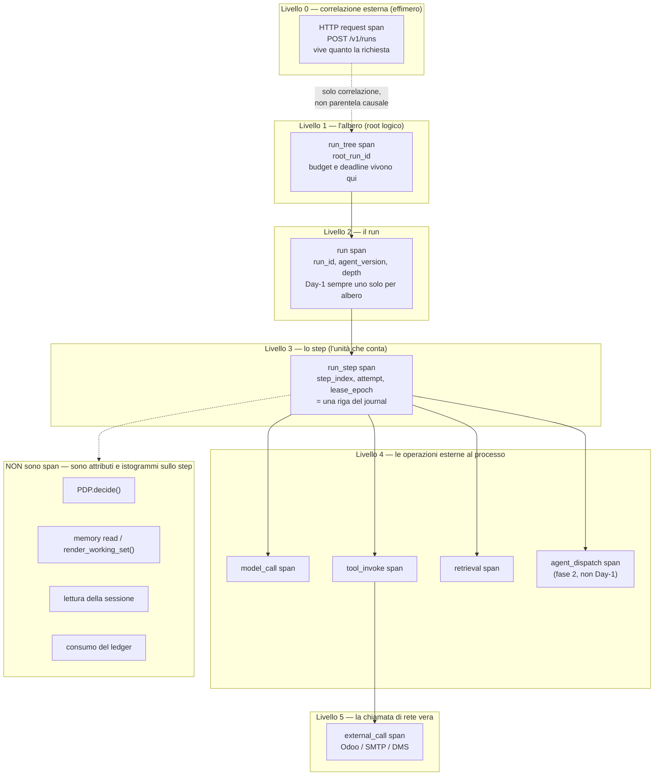

#### Come leggerlo

- **I cinque livelli pieni sono gli unici span che esistono.** Tutto il resto è un
  attributo o un istogramma appeso allo span dello step.
- **La freccia tratteggiata fra HTTP e `run_tree` è la scelta più importante del
  diagramma.** La richiesta HTTP che avvia un run e l'esecuzione del run **non sono lo
  stesso trace**. `AR-002` dice che `api` e `worker` comunicano **solo** attraverso il
  database: non c'è una chiamata, c'è una riga. Legare i due span come padre e figlio
  mentirebbe sulla causalità, e produrrebbe un trace che resta "aperto" per minuti
  dopo che la richiesta HTTP è già stata risposta. Si correlano per **identificatore**
  (`run_id`), non per parentela (§7.3, `ADR-169`).
- **Il livello 3 è l'unità che conta.** Uno span di step corrisponde uno-a-uno a una
  riga di `run_step`. Non è una coincidenza: è ciò che rende il trace **allineabile
  con il journal**, che è la fonte di verità (`AR-EV-18`: lo stato **si scrive**, non
  si deriva da un fold di eventi).
- **Il riquadro `NON sono span`** è la difesa contro il costo. Un `PDP.decide()` è una
  funzione **pura** in-process (`ADR-020`): dura microsecondi e non attraversa nessun
  confine. Farne uno span raddoppierebbe il volume del trace per informazione zero.
  Quello che serve — l'esito, la `bundle_version`, il `decision_id` — sono **attributi
  sullo span dello step**, e la decisione completa vive nell'audit, dove deve stare.

### 5.3 Responsabilità e non responsabilità del piano di telemetria

**Responsabilità**

- Registrare la struttura causale di un'esecuzione, con identificatori e hash.
- Aggregare numeri che rendono osservabili i trigger di revisione (`AR-035`).
- Rendere osservabile l'**assenza** di progresso (`INV-24`, §13).
- Rendere ricostruibile un'esecuzione su richiesta autorizzata (§12).
- Dichiarare quando sta perdendo dati (`M-OB-76`).

**Non responsabilità**

- **Non** è la fonte di verità di nessuno stato. Lo stato si legge dal journal
  (`AR-EV-18`).
- **Non** conserva testo, prompt, risposte, `value_text`, campi di dominio, segreti
  (`AR-KN-12`, `AR-ME-16`, `AR-ID-28`, `AR-EV-16`, e ora `INV-26`).
- **Non** è un audit e non lo sostituisce mai (`INV-27`).
- **Non** partecipa a nessuna decisione: né di autorizzazione (`AR-ID-02`,
  `INV-25`), né di budget, né di retry, né di recovery, né di cancellazione.
- **Non** decide la qualità: quella è l'evaluation (§17-§19).
- **Non** invia notifiche agli utenti: l'outbox di `A11` fa quello, ed è un percorso
  con garanzie diverse (`ADR-162`).

---

## 6. Identificatori: quali servono davvero, e la regola che li separa

### 6.1 La distinzione che regge tutto: stato contro correlazione

`ADR-137` l'aveva già fissata e va ripetuta perché è la cosa che si sbaglia più
spesso:

> **`root_run_id` è *stato*. `trace_id` è *correlazione*.**

Uno **stato** è un dato di cui il sistema è responsabile: sta nel database, ha vincoli
di integrità, sopravvive a un crash, ed è la base di controlli. Una **correlazione** è
un'etichetta comoda per rimettere insieme le righe: può mancare, può essere
duplicata, può essere fabbricata da chi chiama, e non deve mai reggere niente.

`AR-ID-02` lo dice in forma di divieto: un identificatore di correlazione **non entra
mai** in una decisione di autorizzazione. `AR-ID-18` lo estende: il marcatore di
correlazione non è una credenziale né un'asserzione di identità.

> **Perché è pericoloso davvero, con un esempio.** Il `trace_id` arriva nell'header
> `traceparent` di una richiesta HTTP. Chiunque può scriverlo. Se una policy dicesse
> "consenti se il `trace_id` appartiene a un run già approvato", l'attaccante
> otterrebbe l'autorizzazione **scrivendo un header**. Non serve un bug: basta che
> qualcuno, un giorno, trovi comodo correlare così.

> **NUOVO INVARIANTE `INV-25`.** Nessuna funzione del PDP, del PIP o del PEP legge
> `trace_id`, `span_id`, `traceparent`, `tracestate` o qualunque altro campo di
> telemetria. **Verificato staticamente**, nella stessa forma di `INV-12` (il PDP non
> legge `memory`) e `INV-19` (il PDP non legge campi di `AgentTask`). È un test che
> ispeziona gli import e le firme del modulo di autorizzazione, non una linea guida.

### 6.2 Gli identificatori che tengo, e quelli che rifiuto

| Identificatore | Tipo | Serve? | Perché |
|---|---|---|---|
| `trace_id` | correlazione | **sì** | W3C Trace Context (`ADR-137`). 16 byte, propagato |
| `span_id` | correlazione | **sì** | idem. Identifica il nodo nell'albero del trace |
| `run_id` | **stato** | **sì** | esiste già: è la PK del run |
| `root_run_id`, `parent_run_id`, `parent_step_index`, `depth` | **stato** | **sì** | esistono già, Day-1 e degeneri (`ADR-125`). Sono **impossibili da aggiungere dopo** |
| `step_index` | **stato** | **sì** | esiste già; con `run_id` genera l'`idempotency_key` (`INV-06`) |
| `attempt` | **stato** | **sì** | esiste già (`AR-EV-10`: un retry non cambia `step_index`, cambia `attempt`) |
| `decision_id` | **stato** (audit) | **sì** | esiste già: è la chiave della decisione di autorizzazione |
| `lease_epoch` | **stato** | **sì** | esiste già (`INV-22`); va **negli attributi dello span** perché è ciò che spiega un doppio tentativo |
| `session_id` | correlazione | **no come ID di trace** | esiste in `A09` come riga di autenticazione. Non è un contenitore di esecuzione: non entra nella gerarchia |
| `workflow_id` | — | **no** | `ADR-028`: tre modi, un runtime. Day-1 è `run_id` |
| `execution_id` | — | **no** | sinonimo di `run_id`. Un secondo nome per la stessa cosa è un bug in attesa |
| `task_id` | — | **no Day-1** | l'`AgentTask` non esiste Day-1 (`ADR-123`). Quando esisterà, la sua identità **è** il `run_id` del figlio |
| `tool_call_id` | — | **no** | `(run_id, step_index, attempt)` lo identifica già ed è **già** la chiave di idempotenza. Un ID nuovo creerebbe un secondo modo di nominare lo stesso fatto |
| `model_invocation_id` | — | **no** | `(run_id, step_index, attempt)` più il numero d'ordine della chiamata dentro lo step. `AR-MD-06`: si ritenta la **chiamata**, non il passo |
| `retrieval_id` | — | **no come ID nuovo** | `retrieval_audit` ha già la sua chiave, e `ADR-077` rende il retrieval **append-only per run**: l'ordine di append lo identifica |
| `memory_access_id` | — | **no** | `memory_audit` ha già la sua chiave |

> **DECISIONE ARCHITETTURALE — `ADR-168`.** Nessun identificatore nuovo. Il modello di
> trace usa `trace_id`/`span_id` per la correlazione e riusa gli identificatori di
> stato che esistono già. **Alternative considerate:** un `observability_id` unico per
> operazione, come fanno diverse piattaforme di AI observability — respinto perché
> creerebbe un secondo sistema di nomi parallelo a quello del journal, e alla prima
> divergenza fra i due nessuno saprebbe a quale credere.
> **Trade-off:** guadagniamo che trace e journal sono allineabili con un `JOIN`;
> perdiamo la possibilità di tracciare operazioni che **non** hanno una riga di
> journal. **Contro-argomento onesto:** esistono operazioni senza riga di journal —
> per esempio una chiamata al modello che fallisce e viene ritentata dentro lo stesso
> step (`AR-MD-06`). Per quelle serve un ordinale locale (`model_call_seq`), che è un
> **attributo dello span**, non un identificatore globale. Se un giorno servisse
> correlare quelle chiamate **fra** run, questa decisione andrebbe riaperta.

### 6.3 Lo schema dello span

Un solo tipo di record, con un enum che ne dice il livello. Non dodici tabelle.

```text
telemetry_span
  trace_id            bytes(16)     -- W3C
  span_id             bytes(8)      -- W3C
  parent_span_id      bytes(8)      -- W3C, NULL alla radice
  tenant_id           uuid          -- INV-02, RLS attiva
  span_kind           enum          -- RUN_TREE | RUN | STEP | MODEL_CALL |
                                    -- TOOL_INVOKE | RETRIEVAL | AGENT_DISPATCH |
                                    -- EXTERNAL_CALL | HTTP_REQUEST | JOB
  started_at          timestamptz
  duration_ms         int
  status              enum          -- OK | ERROR | UNSET
  error_class         enum          -- la tassonomia di §21, NULL se OK
  -- correlazione con lo stato (NULL dove non si applica)
  run_id, root_run_id, parent_run_id, step_index, attempt, depth
  agent_version_id, model_version_id, tool_version_id
  config_snapshot_hash, tool_definitions_hash, bundle_version
  decision_id
  -- misure
  attrs               jsonb         -- SOLO enum, numeri, hash, identificatori.
                                    -- Chiavi da una allowlist. INV-26.
```

Tre cose non ovvie, e il motivo di ciascuna:

- **`tenant_id` su ogni span, con RLS.** `INV-02` non fa eccezioni per la telemetria.
  Uno span senza tenant è uno span che qualcuno un giorno leggerà da un altro tenant.
- **`attrs` è `jsonb` ma con allowlist di chiavi**, verificata in CI (`ADR-176`). Un
  `jsonb` libero è esattamente la porta da cui esce il testo che l'audit tiene fuori:
  basta un `attrs["prompt"] = ...` scritto in fretta durante un debug, e il divieto è
  aggirato senza che nessuno se ne accorga. L'allowlist rende quella riga un errore di
  build.
- **`config_snapshot_hash` e `tool_definitions_hash` su ogni span di step.** Sono ciò
  che rende possibile la ricostruzione di §12 senza conservare niente.

---

## 7. Audit e telemetria: dove passa il confine

### 7.1 Le due cose non sono lo stesso genere di oggetto

| | **Audit** | **Telemetria** |
|---|---|---|
| A cosa risponde | "chi ha deciso cosa, con quale autorità" | "come si è comportato il sistema" |
| Chi lo legge | un revisore, un auditor, un avvocato, il cliente | un ingegnere, oggi, adesso |
| Quando lo legge | fra mesi o anni | fra minuti |
| Completezza | **totale**, per definizione | best effort |
| Campionamento | **vietato** | previsto e necessario |
| Mutabilità | append-only (`INV-05`) | scrivibile, aggregabile, cancellabile |
| Schema | **chiuso e stabile**: cambiarlo è un evento | evolve col codice |
| Se manca | difetto **legale** | difetto **operativo** |
| Costo per riga | alto, e accettato | deve essere basso |
| Contiene testo? | **mai** (`AR-ID-28`, `AR-KN-12`, `AR-ME-16`) | **mai** (`INV-26`) |

> **Il criterio in una domanda.** *Questa riga potrebbe essere prodotta in una
> contestazione?* Se sì, è audit. Se no, è telemetria. Non c'è una terza categoria, e
> in dubbio si sceglie audit — perché una riga di audit di troppo costa spazio, una
> riga di audit mancante costa un contenzioso.

### 7.2 Cosa è audit in questo sistema

Non è una scelta di `A12`: è già deciso, e lo riporto perché il confine si capisce solo
vedendo dove è già stato tracciato.

- Ogni **decisione di autorizzazione** — `AR-031`/`AR-032`, `INV-01`, `INV-15`
  (entrambe le identità), `AR-AC-13` (più le quattro colonne di lineage).
- Ogni **modifica di configurazione** nel Control Plane (`A02`).
- Ogni **retrieval**, per identificatori e hash — `ADR-083`, `AR-KN-12`.
- Ogni **operazione di memoria**, per identificatori e hash — `ADR-098`, `AR-ME-16`.
- Ogni **transizione durevole** del run, nella stessa transazione dell'audit
  (`AR-EV-22`), con `termination_reason` non nullo (`AR-EV-23`).
- Ogni **elevazione dichiarata** (`ADR-119`) e ogni accesso del `PlatformOperator`
  (`ADR-118`).
- Da questo documento: ogni **`DebugCapture`** aperta e ogni **ricostruzione di
  prompt** eseguita (§12.4).

### 7.3 Il diagramma del confine

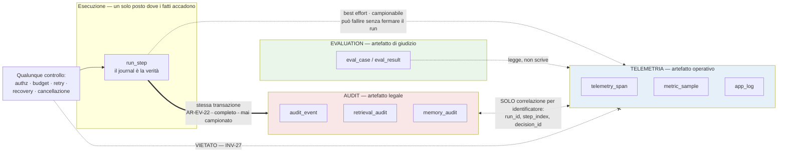

#### Come leggerlo

- **Le due frecce che escono da `run_step` hanno spessore diverso apposta.** Quella
  verso l'audit è **doppia**: è nella stessa transazione, e se fallisce il side effect
  non procede (`AR-031`/`AR-032`). Quella verso la telemetria è **tratteggiata**: può
  fallire, e il run continua lo stesso. Questa asimmetria è l'intero confine.
- **La freccia bidirezionale tratteggiata fra audit e telemetria** è l'unico contatto
  ammesso: si correlano per `run_id`, `step_index`, `decision_id`. Nessun `JOIN`
  logico che presupponga che entrambi ci siano.
- **La freccia sbarrata in basso è la regola nuova.** Nessun controllo legge la
  telemetria. Mai.

> **NUOVO INVARIANTE `INV-27`.** Nessun controllo di sistema — autorizzazione,
> consumo di budget, decisione di retry, classificazione di recovery, cancellazione,
> rilevamento di loop — dipende da una lettura di `telemetry_span`, `metric_sample` o
> `app_log`. La telemetria è **sola lettura per gli umani e per l'evaluation**, e non
> è input di nessun percorso di esecuzione. Verificato staticamente sugli import.

### 7.4 Cosa succede quando qualcuno chiede all'osservabilità di fare da audit

Succederà. È una richiesta ragionevole e arriva sempre nella stessa forma: *"abbiamo
già i trace, perché costruire un secondo sistema?"*, oppure *"il cliente vuole sapere
quali documenti l'agent ha letto il mese scorso, guardiamo nei trace"*.

**La risposta è no, e il motivo non è purismo.** Se accetti, devi:

1. **togliere il campionamento** — perché un audit incompleto non è un audit;
2. **congelare lo schema** — perché un audit il cui schema cambia a ogni sprint non è
   consultabile fra due anni;
3. **allungare la retention** a quella legale — perché un audit di 14 giorni non serve
   a niente;
4. **rendere le righe immutabili** — perché un audit modificabile non prova niente.

Fatte queste quattro cose, hai **costruito un audit** — con tutto il suo costo — **e
hai perso la telemetria**, perché ciò che paga il costo dell'audit non può più essere
scartato quando il disco si riempie. Hai pagato due volte e ottenuto un sistema solo,
peggiore di entrambi.

> **La risposta corretta è: estendere l'audit.** Se manca un fatto nell'audit, il
> difetto è nell'audit, non nell'osservabilità. Nel caso concreto sopra — *quali
> documenti ha letto l'agent* — la risposta esiste già: `retrieval_audit` (`ADR-083`)
> registra identificatori e hash di ogni frammento entrato nel context, append-only,
> per `INV-05`. La domanda era già risolta; era il chiedente a non saperlo.

> **`AR-OB-02`.** Nessuna richiesta di conformità, reportistica o contestazione viene
> soddisfatta con una query sulla telemetria. Se il dato manca nell'audit, si estende
> l'audit — con un ADR, perché lo schema dell'audit è chiuso e allargarlo è una
> decisione, non una configurazione.

### 7.5 Immutabilità dell'audit: cosa serve davvero Day-1

Il prompt chiede: append-only storage, restricted access, tamper evidence, retention,
export. Non tutto serve subito, e costruire un sistema di conformità completo Day-1
sarebbe esattamente il tipo di complessità che `AR-019` vieta.

| Requisito | Day-1 | Perché |
|---|---|---|
| **Append-only** | **sì** | `INV-05`, già deciso. Applicato dal database: ruolo PostgreSQL senza `UPDATE`/`DELETE` sulle tabelle di audit (`ADR-116` generalizza il least privilege ai processi) |
| **Accesso ristretto** | **sì** | RLS per tenant (`INV-02`) più ruoli separati. `ADR-118`: il `PlatformOperator` non legge i dati dei tenant |
| **Tamper evidence** | **no Day-1** | Chi ha `root` sulla macchina ha il database (`R-47`): una catena di hash sulla stessa macchina protegge da un errore, non da un attaccante che ha già vinto. Diventa utile solo quando esiste un **secondo luogo** dove ancorare la catena → `T-OB-09` |
| **Retention** | **dichiarata**, non implementata | è `A14` (data governance) a possedere le durate. `A12` dichiara solo che l'audit ha una retention **diversa e più lunga** della telemetria |
| **Export** | **no Day-1** | `DEF-08` (formato dell'export di audit) è di `A16`/`C26`. **Non la chiudo** |

---

## 8. Propagazione e correlazione del trace

### 8.1 Lo standard, e perché non ne scegliamo un altro

**FATTO (`R-06`).** vLLM supporta tracing OpenTelemetry con propagazione del context
**W3C** nel router del `production-stack`, e logging strutturato JSON
(`--log-format json`).

**FATTO.** `ADR-137` ha già fissato W3C Trace Context + OpenTelemetry per questa
piattaforma.

**INFERENZA.** Scegliere lo stesso standard che il nostro componente più esterno già
parla significa che i due trace si uniscono senza adapter. Uno standard diverso
richiederebbe un traduttore, e un traduttore fra sistemi di trace è il posto dove i
trace si perdono.

> **DECISIONE ARCHITETTURALE — `ADR-165`.** OpenTelemetry è adottato come **contratto
> di strumentazione**, non come stack. Usiamo l'SDK e le semantic convention; **non**
> adottiamo Day-1 un Collector, né un backend di trace dedicato (§23).
> **Alternative considerate:** (a) un formato proprietario nostro — respinto: ci
> costerebbe un adapter verso vLLM e renderebbe irreversibile la scelta del backend;
> (b) OpenTelemetry completo con Collector e Jaeger Day-1 — respinto per `AR-019`
> (nessun componente nuovo senza una misura del limite attuale) e per i vincoli Day-1
> (una macchina, team piccolo).
> **Trade-off:** guadagniamo che il backend è sostituibile senza toccare il codice
> strumentato; perdiamo le funzioni del Collector (batching, retry, trasformazione),
> che dobbiamo fare noi nell'exporter (§10.3).
> **Contro-argomento onesto:** l'SDK OpenTelemetry per Python non è leggero, e con un
> exporter scritto in casa ci prendiamo la responsabilità di un pezzo che il Collector
> avrebbe risolto. Se l'exporter diventa fonte di bug → `T-OB-01`.

> **`B-06` resta aperto** (stato di stabilità delle GenAI semantic convention di
> OpenTelemetry) e **`B-62`** pure (esiste una convenzione per gli span agent→agent?).
> Non li ho chiusi: era vietato fare ricerca. Conseguenza operativa: **usiamo nomi di
> attributo nostri, prefissati `agentplat.*`**, e li mappiamo sulle convenzioni GenAI
> **quando `B-06` sarà chiuso**. Mappare adesso su una convenzione instabile
> significherebbe rinominare tutto due volte.

### 8.2 I tre percorsi di propagazione

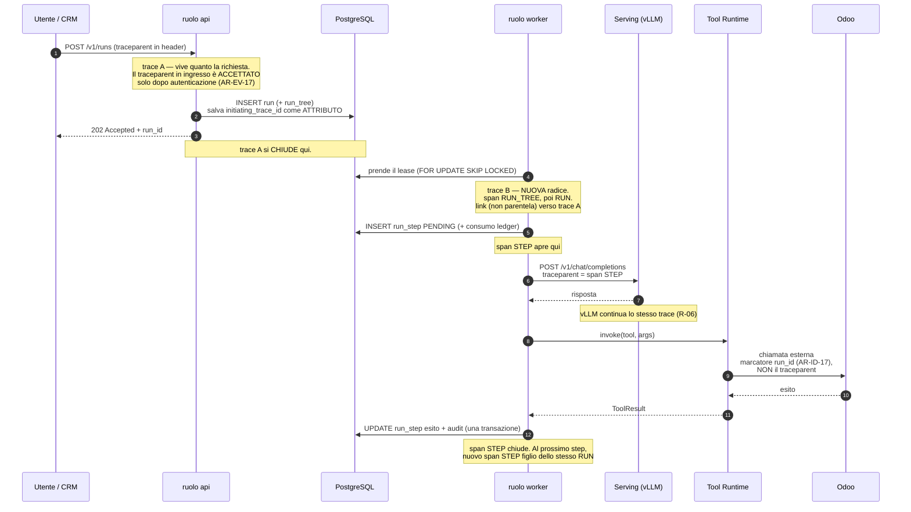

#### Come leggerlo

- **Ci sono due trace, non uno, e la separazione è voluta.** Il trace `A` è la
  richiesta HTTP: nasce e muore in millisecondi. Il trace `B` è l'esecuzione: può
  durare minuti, essere sospesa in attesa di approvazione, riprendere su un altro
  worker dopo un crash. Legarli come padre-figlio produrrebbe uno span che resta
  aperto per ore e che si perde al primo crash.
- **Si collegano con un `link`, non con una parentela.** OpenTelemetry ha il concetto
  di *span link* esattamente per questo: due esecuzioni correlate senza rapporto
  causale sincrono. In pratica: il run porta `initiating_trace_id` come **attributo**,
  e chi indaga può saltare da uno all'altro.
- **Il `traceparent` in ingresso viene accettato solo dopo l'autenticazione.**
  `AR-EV-17` dice che un callback esterno si autentica **prima** di essere correlato, e
  che la correlazione non è autenticazione. Vale identico qui: accettare un
  `traceparent` da un chiamante non autenticato significa lasciare che un estraneo
  inietti nodi nei nostri trace (`R-72`, §25).
- **Verso Odoo non passa il `traceparent`.** Passa il marcatore `run_id`/`agent_id`
  previsto da `AR-ID-17`, dove il protocollo lo consente. Motivo: Odoo non parla W3C
  Trace Context, e soprattutto **un marcatore in un sistema di terzi diventa un dato
  di quel sistema**, con la sua retention e i suoi lettori. `B-48` (quale campo di
  Odoo può portarlo senza inquinare i dati di dominio) è ancora aperto.

### 8.3 Il caso che rompe tutti i modelli di tracing: il crash e la ripresa

Questo è il punto in cui la maggior parte delle architetture di observability mente.

Un run viene ripreso da un altro worker dopo un crash (`ADR-144`, `INV-23`). Domande:
il trace continua? Il `trace_id` è lo stesso? Chi è il padre dello span?

> **DECISIONE ARCHITETTURALE — `ADR-167` (parte 2).** Alla ripresa **si apre un nuovo
> trace**, con lo stesso `run_id` e un `trace_id` diverso, e un `link` verso il trace
> precedente. Non si "riapre" lo span, perché lo span precedente **non è mai stato
> chiuso** — il processo è morto.
>
> **Perché non tenere lo stesso `trace_id`:** perché un `trace_id` che attraversa più
> processi e più giorni non è più un trace, è un identificatore di run — e quello ce
> l'abbiamo già, si chiama `run_id`. Duplicarne il ruolo nel `trace_id` significa
> avere due chiavi per la stessa cosa, con una delle due propagabile via header
> (`INV-25`: e quindi pericolosa).
>
> **Conseguenza pratica per chi indaga:** la domanda "mostrami tutto quello che è
> successo in questo run" **non si risponde con una query sul `trace_id`**. Si
> risponde con una query su `run_id`, che raccoglie tutti i trace di tutti i tentativi.
> È il motivo per cui `run_id` sta **come colonna indicizzata** su `telemetry_span`, e
> non solo dentro `attrs`.
>
> **Contro-argomento onesto:** questo rende la nostra telemetria meno compatibile con
> le UI di trace standard (Jaeger, Tempo), che assumono un trace = un'unità di lavoro.
> Un investigatore in Jaeger vedrebbe tre trace separati per un run ripreso due volte.
> È un costo reale che pago volentieri: preferisco tre trace veri a un trace finto.

### 8.4 Correlazione: cosa lega cosa

Un'azione dell'utente produce righe in tabelle diverse. Ecco la mappa completa delle
chiavi che le rimettono insieme.

| Da | A | Chiave | Garantita? |
|---|---|---|---|
| richiesta HTTP | run | `run_id` nella risposta | **sì** (è lo stato) |
| run | tutti i suoi step | `(run_id, step_index)` | **sì** |
| step | tentativi | `(run_id, step_index, attempt)` | **sì** |
| run | albero | `root_run_id` | **sì** (`ADR-125`, Day-1) |
| step | decisione di autorizzazione | `decision_id` | **sì** (`INV-01`) |
| step | frammenti recuperati | `retrieval_audit.run_id` | **sì** (`ADR-083`) |
| step | memorie lette | `memory_audit.run_id` | **sì** (`ADR-098`) |
| step | effetto esterno | `idempotency_key` da `(run_id, step_index)` | **sì** (`INV-06`) |
| step | record creato in Odoo | external ID `__agent__.<key>` | **sì** (`ADR-161`, `AR-EV-32`) |
| run | span di trace | `run_id` su `telemetry_span` | **best effort** (campionabile) |
| trace HTTP | trace di esecuzione | `initiating_trace_id` come attributo + span link | **best effort** |

> **Il punto della tabella è la colonna a destra.** Tutte le correlazioni che
> **contano** — quelle che servono a ricostruire cosa è successo e chi ha deciso —
> passano da chiavi di **stato**, garantite dal database. Solo le due ultime righe
> passano dalla telemetria, e sono quelle che ci si può permettere di perdere. Se un
> giorno la telemetria sparisse del tutto, `run_id` + journal + audit basterebbero
> ancora a rispondere a quasi tutte le domande di §1 del prompt. **La telemetria è un
> acceleratore dell'indagine, non la sua base.**

---

## 9. Logging strutturato

### 9.1 Lo schema canonico

Un log non strutturato è un log che si può solo leggere, non interrogare. Con un team
piccolo e nessun SRE (`AS-04`), un log che non si interroga è un log che non si legge.

```json
{
  "ts": "2026-08-23T10:14:22.481Z",
  "level": "WARN",
  "service": "worker",
  "event": "tool_invoke_failed",
  "tenant_id": "…",
  "run_id": "…",
  "root_run_id": "…",
  "step_index": 7,
  "attempt": 2,
  "trace_id": "…",
  "span_id": "…",
  "component": "tool_runtime",
  "tool_key": "odoo.sale_order.confirm",
  "tool_version_id": "…",
  "error_class": "EXTERNAL_SERVICE_ERROR",
  "error_code": "ODOO_TIMEOUT",
  "retryable": true,
  "duration_ms": 30012
}
```

Le regole, non negoziabili:

1. **`event` è un enum**, da un elenco chiuso nel registro. Non è una frase.
   `AR-OB-08`: nessun campo di log è testo libero.
2. **Niente `message` libero.** È la porta da cui esce il contenuto: la prima volta che
   qualcuno scrive `f"failed on {customer_name}"`, `INV-26` è violata e nessun test se
   ne accorge. Se serve contesto, si aggiunge un campo tipizzato al registro.
3. **`user_id` non c'è.** Il prompt lo elenca fra i campi possibili; qui c'è
   `subject_id` **solo negli eventi di autenticazione e autorizzazione**, che sono
   audit. Nei log operativi il soggetto non serve: serve il run, e dal run si risale.
   È data minimization applicata, non pedanteria.
4. **`error_class` viene dalla tassonomia unica di §21**, non da una nuova.

### 9.2 I livelli, con il criterio di quando usarli

| Livello | Criterio | Esempio | Attivo Day-1 |
|---|---|---|---|
| `TRACE` | **non esiste** | — | no |
| `DEBUG` | dettaglio interno, utile solo con un'ipotesi in mano | il piano di query scelto dal Retrieval Layer | **off**, attivabile per componente e a tempo |
| `INFO` | un fatto che cambia lo stato del sistema | run avviato, step completato, job eseguito | sì |
| `WARN` | qualcosa è andato storto **ed è stato gestito** | retry su timeout, frammento scartato per provenance incompleta | sì |
| `ERROR` | qualcosa è andato storto **e non è stato gestito** | recovery ha prodotto `UNCERTAIN`, job oltre `max_staleness` | sì |

> **Perché non esiste `TRACE` come livello.** Confonderebbe due cose che questo
> documento tiene separate con fatica: *trace* è la struttura causale (§5), non un
> livello di verbosità. Chiamare un livello di log "TRACE" garantisce che qualcuno,
> in una discussione, intenda l'altro.

> **`AR-OB-09`.** `DEBUG` è **spento in produzione by default** e si attiva per
> `(component, tenant, durata)` con **spegnimento automatico**. Un `DEBUG` acceso e
> dimenticato è (a) un costo di storage che nessuno guarda e (b) il modo più comune in
> cui contenuto sensibile finisce nei log. Ha la stessa forma di `DebugCapture`
> (§12.5), con una differenza importante: `DEBUG` **non** può mai contenere contenuto,
> nemmeno acceso. Solo `DebugCapture` può, ed è un altro meccanismo con un'altra
> autorizzazione.

### 9.3 Dove finiscono i log

**stdout in JSON**, raccolto dal runtime dei container. Non un log cluster, non un
agent di raccolta, non Elasticsearch.

**Perché:** con una macchina sola (`Day-1 constraints`), un log cluster è un secondo
sistema da tenere vivo per leggere i messaggi del primo. Se cade, non lo sai. Se il
disco si riempie, cadono entrambi.
**Quando cambia:** `T-OB-02` — più di una macchina, oppure quando cercare in `journalctl`
o nei file smette di essere praticabile. Il percorso è Loki o simile, e **non richiede
di toccare il codice** perché il formato è già JSON strutturato (§23.4, migrazione).

### 9.4 Cosa non diventa un log

Tre cose che sembrano log e non lo sono:

- **Le decisioni di autorizzazione.** Sono audit. Un `INFO` che dice "denied" oltre
  alla riga di audit è una duplicazione che diverge.
- **Le misure ripetute.** Un log per ogni chiamata al modello con la sua latenza è un
  istogramma travestito da testo. Va in `metric_sample` (`M-OB-08`).
- **Il contenuto.** Mai (`INV-26`).

---

## 10. Metriche: forma, storage, e perché non Prometheus Day-1

### 10.1 La forma

Tre tipi soli — counter, gauge, histogram — e un budget di label stretto (§14.3). Non
esistono metriche "custom" fuori dal registro (`ADR-176`).

### 10.2 Lo storage: PostgreSQL, e come si evita che sia una cattiva idea

> **DECISIONE ARCHITETTURALE — `ADR-166`.** Day-1 la telemetria vive in PostgreSQL,
> in due tabelle: `metric_sample` (campioni aggregati per finestra) e `telemetry_span`.
> Nessun Prometheus, nessun Jaeger, nessun ClickHouse.

Il rischio ovvio: `R-04` dice che PostgreSQL sta già facendo tutto — stato, coda,
vector search, audit — e diventerà il collo di bottiglia. Aggiungere la telemetria
peggiora esattamente quel rischio. Ecco perché lo accetto lo stesso, e cosa faccio per
non peggiorarlo davvero:

1. **Non scriviamo un campione per evento.** Il processo **pre-aggrega in memoria** e
   scrive **una riga per (metrica, finestra, combinazione di label)**. Con finestre di
   un minuto, un counter con 5 combinazioni di label costa 5 righe al minuto, non una
   per evento.
2. **`telemetry_span` è partizionata per giorno** e le partizioni vecchie si
   **staccano** (`DETACH` + `DROP`), che è un'operazione di metadati. Non si cancella
   riga per riga: sarebbe un generatore di bloat, e il bloat è metà di `R-04`.
3. **`AR-EV-02` dice che nessuna tabella di lavoro, journal, audit o outbox è
   `UNLOGGED`.** `telemetry_span` **non è** in quell'elenco: non è lavoro, non è
   journal, non è audit. **Può essere `UNLOGGED`**, e questo dimezza il costo di
   scrittura in cambio della perdita dei dati dopo un crash del database. È il
   trade-off corretto per un artefatto operativo — e sarebbe **inaccettabile** per
   l'audit. È il confine di §7 che si vede nello schema.
4. **La scrittura di telemetria non sta mai nella transazione del run.** `AR-EV-22`
   impone che la transizione durevole e l'audit siano nella stessa transazione: la
   telemetria è fuori, in un buffer, e se la scrittura fallisce si incrementa
   `M-OB-76` e si va avanti.

> **Contro-argomento onesto, e serio.** Un `UNLOGGED` che perde tutto dopo un crash
> del database è esattamente il momento in cui vorresti guardare la telemetria. È il
> difetto peggiore di questa decisione. La mitigazione: gli span di **errore** e i
> campioni di metrica **aggregati** (che sono pochi) restano su tabelle normali,
> `LOGGED`; solo gli span nominali campionati sono `UNLOGGED`. Se anche questo si
> rivelasse sbagliato → `T-OB-03`.

### 10.3 L'exporter e lo scraper

Due pezzi piccoli, con responsabilità dichiarate.

**`TelemetryExporter`** — libreria in-process in `api`, `worker`, `scheduler`.
- **Responsabilità:** bufferizzare span e campioni, applicare il sampling (§14.4),
  applicare l'**allowlist degli attributi** (`INV-26`), scrivere in batch, contare gli
  scarti (`M-OB-76`).
- **Non responsabilità:** non decide cosa è interessante (lo decide chi emette); non
  legge lo stato; non blocca mai il chiamante — se il buffer è pieno **scarta e
  conta**, non aspetta.

**`ServingScraper`** — un `job_type` dentro il ruolo `scheduler` (`ADR-142`: i job sono
entità distinte dai run; `AR-EV-12`: un job non chiama mai il modello — qui infatti
legge solo l'endpoint di metriche).
- **Responsabilità:** leggere l'endpoint Prometheus di vLLM (`R-06`) e scrivere
  `M-OB-08`/`M-OB-09`/`M-OB-10` in `metric_sample`.
- **Non responsabilità:** non interpreta, non allarma, non riavvia il serving.
- **Dichiara la propria `max_staleness`** come ogni altro job (`AR-EV-35`): se smette
  di raccogliere, `M-OB-71` lo rende visibile. Uno scraper morto in silenzio
  produrrebbe cruscotti verdi su un sistema fermo — che è il guasto peggiore di tutti.

---

## 11. Osservabilità per dominio

Sette domini, sette contratti. Per ciascuno: cosa si cattura, cosa **non** si cattura,
e quale domanda di §1 del prompt diventa rispondibile.

### 11.0 Il trace di un'esecuzione, per intero

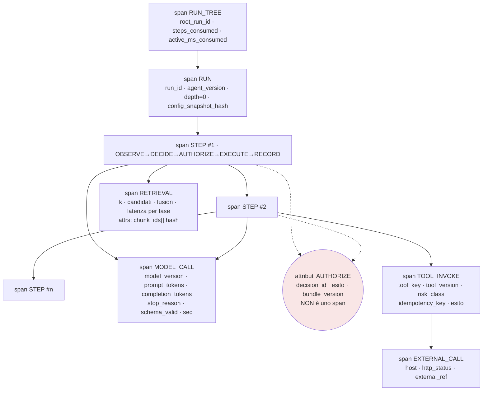

#### Come leggerlo

- **Lo step è il contenitore, e coincide con una riga di journal.** Se guardi uno span
  `STEP` e non trovi la riga `run_step` corrispondente, hai trovato un bug grave: uno
  step che ha prodotto un effetto senza essere stato scritto prima (`ADR-029`,
  `INV-21`). La telemetria qui serve da **rete di sicurezza incrociata** sull'audit,
  ed è uno dei pochi usi legittimi di un confronto fra i due piani.
- **`AUTHORIZE` è rosso e tratteggiato**: non è uno span. È un pugno di attributi sullo
  span dello step, più una riga di audit completa. Il motivo è in §5.2.
- **`RETRIEVAL` sta sotto `OBSERVE`**, non sotto i tool: `AR-KN-21` dice che il
  retrieval è un **canale di `OBSERVE`**, non un tool Day-1. Il diagramma rispetta
  l'architettura invece di comodità grafica.

### 11.1 Model

**Si cattura:** `model_version_id`, `chat_template_version`, parametri di generazione
dal `ConfigSnapshot`, `prompt_tokens`, `completion_tokens`, `stop_reason`,
`schema_valid` (esito del secondo anello di `ADR-040`), `tool_call_count`, latenza,
`prefix_cache_hit` (per `M-OB-63`), `model_call_seq` dentro lo step.

**Non si cattura:** il prompt, la risposta, i messaggi. Mai. Neanche campionati,
neanche troncati, neanche "solo i primi 200 caratteri" — un troncamento a 200
caratteri di un prompt che comincia con i dati del cliente contiene i dati del
cliente.

**Domande che diventano rispondibili:** *quale modello*, *quale versione di
configurazione*, *quanti token*, *quanto tempo*. La domanda *perché ha prodotto questo*
si risponde con §12, non con un attributo.

> **`AR-MD-02` diventa osservabile qui.** *Una risposta del modello senza identità di
> produzione completa è un errore, non una risposta.* Quindi uno span `MODEL_CALL`
> senza `model_version_id` **non è uno span incompleto: è un `ERROR`**.

### 11.2 Tool

**Si cattura:** `tool_key`, `tool_version_id`, `build_id` (`ADR-051`: il gap fra
definizione immutabile e implementazione è **registrato**), `risk_class`,
`side_effects`, `idempotency_key`, `attempt`, esito, `error_class`, latenza
pre-send/post-send, e **l'identificatore di richiesta esterno** dove esiste.

**Non si cattura:** gli argomenti. Né i risultati. Gli argomenti sono dati di dominio
per definizione (`x-sensitivity` per campo, `ADR-066`). Si cattura invece
`args_hash` — che è ciò che rende calcolabile `M-OB-47` (`repeated_failed_call_rate`)
senza vedere gli argomenti — e l'elenco dei **nomi** dei campi che hanno fallito la
validazione (`M-OB-11`), che sono metadati di schema.

**Il caso che conta davvero:** lo step `SIDE_EFFECT`. Lì lo span porta
`idempotency_key`, `state` (`PENDING`/`IN_FLIGHT`/esito, `ADR-144`) e, per Odoo,
l'**external ID** `__agent__.<key>` (`ADR-161`). Questi tre insieme sono ciò che
permette a un ingegnere di rispondere alla domanda peggiore che gli faranno mai:
*"l'ordine è stato creato due volte?"*.

### 11.3 Retrieval — e il golden set, che è il vero problema

**Si cattura:** modalità (lessicale/vettoriale/ibrida), `k` richiesto e ottenuto,
numero di candidati **prima** e **dopo** il pre-filtro autoritativo (che è ciò che dà
`M-OB-23` e `M-OB-24`), latenza per fase, `freshness_requirement` e violazioni,
`chunk_id` e `content_hash` dei frammenti selezionati, `boundary_quality` medio.

**Non si cattura:** il testo della query. Né il testo dei frammenti. `AR-KN-12` è
esplicita: l'audit del retrieval registra identificatori e hash, **mai il testo**. La
telemetria non può essere più permissiva dell'audit — sarebbe la scappatoia di §12.1.

> **Ma allora come si fa a capire perché una ricerca ha dato risultati sbagliati, se
> non si vede la query?** Con la ricostruzione (§12.2): la query è **derivabile** dal
> turno dell'utente e dal codice del canale `OBSERVE`, entrambi ricostruibili. E, per
> il caso di studio sistematico, con il **golden set**, dove le query sono note perché
> le abbiamo scritte noi.

#### 11.3.1 Il golden set: owner, scadenza, contenuto

`R-30` ha probabilità **Alta** e impatto Medio, ed è un rischio di **processo**. Il
modo in cui si realizza è banale: nessuno lo costruisce, e fra sei mesi `T-03` non è
mai scattato perché non c'era niente da misurare. `ADR-003` (PostgreSQL con pgvector
come unico system of record) resta in piedi non perché è giusto, ma perché non è
falsificabile.

> **DECISIONE ARCHITETTURALE — `ADR-178`.** Il golden set del retrieval è un
> **artefatto Day-1 con owner nominato e criterio di completamento**, e la sua
> costruzione **precede** l'attivazione del retrieval in produzione, non la segue.
>
> **Forma minima** — non serve grande, serve che esista:
> - N query reali (raccolte dal committente e dagli utenti pilota, non inventate);
> - per ciascuna, l'insieme dei `chunk_id` giudicati rilevanti da una persona;
> - la versione del corpus (`document_version_id`), perché un golden set senza
>   versione del corpus non è ripetibile;
> - la versione del chunking e dell'embedding, per `AR-KN-14`.
> - **Il valore di N è `NON ANCORA DECISO`**, e il criterio per fissarlo è: *abbastanza
>   query perché una variazione di `recall_at_k` di un punto non sia rumore*. È un
>   calcolo di potenza statistica che va fatto quando si conosce la varianza — cioè
>   **dopo** le prime 30 query, non prima. Inventare "200 query" adesso sarebbe
>   esattamente il tipo di numero che questo documento non ha il diritto di scrivere.
>
> **Alternative considerate.** (a) *Generare il golden set con un LLM*: respinto —
> produrrebbe un set che misura quanto il retrieval assomiglia a ciò che un modello si
> aspetta, non quanto è utile a una persona; ed è contaminazione (§18.5) in forma pura.
> (b) *Derivarlo dai click degli utenti in produzione*: buona idea, **ma dopo** —
> richiede produzione, e serve prima della produzione. Diventa il meccanismo di
> **rinfresco** (§18.4), non di costruzione.
> **Trade-off:** costa giorni-persona prima di vedere un solo run utile. Il beneficio
> non si vede finché non serve, e quando serve è tardi per costruirlo.
> **Contro-argomento onesto:** un golden set costruito da una sola persona misura le
> intuizioni di quella persona. La mitigazione è che **le query vengano dagli utenti**
> e solo le etichette dal team; e che il set si rinfreschi con i fallimenti reali.

### 11.4 Memory

**Si cattura:** numero di memorie nel `MemorySnapshot`, token occupati, `authority` e
`scope_type` in forma aggregata, `memory_id` delle memorie entrate, esito e motivo dei
`memory_write` rifiutati, dimensione delle tre zone del digest, dimensione
dell'identifier ledger.

**Non si cattura:** `value_text`. Mai — `AR-ME-16` è esplicita, e `INV-26` la estende
alla telemetria. Neanche `key`, se la `key` è un vocabolario libero: `A08` dichiara
che *il vocabolario delle `key` è senza criterio*, quindi una `key` può contenere
qualunque cosa qualcuno ci scriva dentro. **Si cattura `key_hash`.**

### 11.5 Authorization

**Si cattura sullo span:** `decision_id`, esito (`ALLOW`/`DENY`/`INDETERMINATE`),
`bundle_version`, `risk_class` calcolata, presenza di obbligazioni, latenza del PDP e
quota del PIP (`M-OB-55`).

**Sta nell'audit, non nella telemetria:** il soggetto, la risorsa, l'azione, la regola
che ha deciso, entrambe le identità (`INV-15`), le quattro colonne di lineage
(`AR-AC-13`).

**Non si cattura mai, in nessuno dei due:** credenziali, token, `SecretMaterial`
(`INV-14`), e **la ragione di negazione che rivelerebbe l'esistenza di una risorsa**
(`AR-ID-30`). Quest'ultima è sottile: la ragione può stare nell'audit — dove la legge
un amministratore autorizzato — ma non deve arrivare al modello e non deve finire in
un log operativo che qualcuno leggerà con meno privilegi di chi ha diritto.

### 11.6 Risposta del modello, e le citazioni

`ADR-042` promette la riproducibilità dell'**evidenza**, non dell'output: il continuous
batching rende il determinismo non ottenibile. Quindi conservare la risposta non
servirebbe nemmeno a rigenerarla.

**Si cattura:** `stop_reason`, `schema_valid`, `tool_call_count`, `refusal` (campo
strutturato, `M-OB-06`), token, e **`response_hash`**. L'hash è ciò che permette di
dire "la risposta di questo run è la stessa di quell'altro" senza avere né l'una né
l'altra.

**`citation_correctness`** è nell'elenco di §4.10 come non automatizzabile. Al suo
posto, **`citation_groundedness_structural`**: ogni identificatore citato nella
risposta finale deve comparire in un `ToolResult` o in un frammento recuperato **in
quel run**. È deterministico, è calcolabile senza leggere testo (si confrontano
insiemi di identificatori), e cattura il fallimento che fa più danno in un CRM:
**l'identificatore inventato**. `AR-TL-06` dice già che gli identificatori si
**osservano**, non si inventano; questa è la sua misura.

### 11.7 Agent-to-agent e workflow

Day-1 **non c'è comunicazione agent→agent** (`ADR-123`) e c'è **un solo modo di
esecuzione**, `AGENTIC` (`ADR-028`). Quindi qui non si costruisce quasi niente — e
questa è la decisione, non una dimenticanza.

**Cosa si fa Day-1:**
- Gli span portano già `root_run_id`, `parent_run_id`, `parent_step_index`, `depth`,
  **degeneri** (`ADR-125`, `AR-AC-01`). Costano nulla adesso e sono impossibili da
  aggiungere dopo.
- `child_run_count` è una **guardia**, non una metrica (§13.4): deve valere zero.

**Cosa si prepara e non si costruisce:** lo `span_kind = AGENT_DISPATCH`, definito
nello schema e mai emesso. Quando `T-AC-01` o `T-AC-09` scatteranno, il dispatch sarà
**uno step** (`AR-AC-15`), quindi avrà già il suo span di step: lo span di dispatch
sarà un figlio, e il child run aprirà un **nuovo `RUN` span sotto lo stesso
`RUN_TREE`**. La gerarchia di §5.2 lo prevede già. Il prompt chiede che *le chiamate
distribuite fra agent siano visibili in un solo trace*: nel nostro modello lo sono,
perché la radice è l'albero e non la richiesta.

**Workflow:** `ADR-028` dice tre modi e un runtime. Non esiste un piano di
osservabilità del workflow separato: gli attributi che il prompt chiede — step,
attempt, queue latency, execution latency, retry, wait, approval, cancellation,
failure, completion — sono **tutti** già sullo span dello step o nello stato del run.
Costruire un secondo modello sarebbe duplicazione.

---

## 12. Debugging senza mettere prompt, testo e dati di dominio nei trace

### 12.1 Il problema, detto per intero

Quattro regole già decise vietano al contenuto di uscire:

- `AR-KN-12` — l'audit del retrieval registra identificatori e hash, **mai il testo**;
- `AR-ME-16` — l'audit della memoria registra identificatori e hash, **mai
  `value_text`**;
- `AR-ID-28` — nessun evento di audit contiene segreti, token, password, contenuto di
  documenti, `value_text`, campi di dominio;
- `AR-EV-16` — l'outbox contiene **solo riferimenti**.

> **Un trace che porta il prompt intero le violerebbe tutte e quattro in un colpo
> solo.** Il prompt contiene: i frammenti recuperati (violando `AR-KN-12`), il
> `MemorySnapshot` (violando `AR-ME-16`), i risultati dei tool con i campi di dominio
> (violando `AR-ID-28`), e potenzialmente il testo di un'email da inviare (violando lo
> spirito di `AR-EV-16`). **L'osservabilità sarebbe la porta di servizio da cui esce
> tutto ciò che l'audit tiene fuori dalla porta principale.**

E sarebbe una porta peggiore, perché: la telemetria ha retention più permissiva, ha
controlli d'accesso più larghi (la guarda un ingegnere, non un auditor), viene
esportata verso strumenti terzi, e finisce negli screenshot che si incollano nelle
chat di supporto.

> **NUOVO INVARIANTE `INV-26`.** Nessun record di telemetria — span, log, campione di
> metrica — contiene testo di dominio, prompt, risposta del modello, `value_text` di
> memoria, contenuto di documento, argomento di tool, valore di campo del CRM, o
> materiale crittografico. Solo: identificatori, hash, enum da elenchi chiusi, numeri,
> timestamp, e **nomi** di campo di schema. Verificato dall'allowlist di attributi in
> CI (`ADR-176`), non da una revisione.

### 12.2 La risposta: il prompt non si conserva, si **ricostruisce**

Questa architettura ha già, per altri motivi, tutto quello che serve a rigenerare il
prompt esatto di uno step. Non è un colpo di fortuna: è la conseguenza di `ADR-042`
(riproducibilità dell'**evidenza**) e di una catena di decisioni che hanno reso
versionato e hashato ogni ingrediente.

| Ingrediente del prompt | Da dove si ricostruisce | Decisione che lo garantisce |
|---|---|---|
| istruzione dell'agent | `AgentVersion`, immutabile | `ADR-015`, `ADR-041` |
| scaffolding del loop | il codice, alla `build_id` registrata | `ADR-041`, `ADR-051` |
| chat template | `ModelVersion`, immutabile | `ADR-041` |
| tool definition | `tool_definitions_hash`, stabile per tutto il run | `AR-TL-08`, `ADR-054` |
| `MemorySnapshot` | congelato all'avvio, identificato | `ADR-092` |
| frammenti recuperati | append-only per run, con `chunk_id` e `content_hash` | `ADR-077`, `ADR-083` |
| `WorkingSetBlock` | `render_working_set()` è una **funzione pura** del journal | `ADR-090`, `AR-ME-11` |
| parametri di generazione | `ConfigSnapshot`, congelato e hashato | `ADR-012` |
| turno dell'utente | `run.input`, che è **incomprimibile** nel journal | `AR-ME-13` |

**Tutto è versionato, immutabile e identificato.** Ne segue che dato
`(run_id, step_index)` e i riferimenti che lo span porta, il prompt si **ri-renderizza
deterministicamente eseguendo lo stesso codice**.

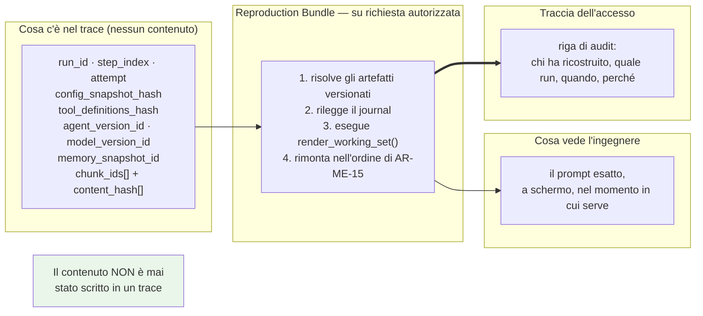

#### Come leggerlo

- **Il contenuto non viene "recuperato dal trace": viene ricalcolato.** Il trace è la
  lista della spesa; il `Reproduction Bundle` va a fare la spesa, sotto la stessa
  `RLS` del run originale e con la propria riga di audit.
- **La freccia doppia verso l'audit non è decorativa.** Ricostruire un prompt significa
  guardare dati di un tenant: è un accesso, e gli accessi si auditano. Chi ricostruisce
  lascia il nome.
- **Il riquadro verde è la garanzia.** Nessun passaggio ha mai scritto contenuto in un
  archivio operativo.

### 12.3 Il componente: `Reproduction Bundle`

**In breve.** Un modulo in-process nel ruolo `api`, esposto da un endpoint
amministrativo, che prende `(run_id, step_index)` e restituisce il prompt esatto e il
contesto della decisione.

**Responsabilità**
- Risolvere gli artefatti versionati dal Control Plane e dagli hash dello step.
- Rieseguire `render_working_set()` sul journal fino a quello step.
- Rimontare il prompt nell'ordine imposto da `AR-ME-15` (istruzione → tool definition
  → `MemorySnapshot` → frammenti → `WorkingSetBlock` → turno).
- **Verificare gli hash** e dichiarare **quali parti non sono ricostruibili** (§12.4).
- Scrivere la propria riga di audit **prima** di restituire.

**Non responsabilità**
- **Non** rigenera la risposta del modello. `ADR-042`: il determinismo non è
  ottenibile sotto continuous batching, e `AR-EV-31` dice che un replay non riproduce
  mai un side effect. Il `Reproduction Bundle` ricostruisce **l'input**, non l'output.
- **Non** esegue tool, non chiama il modello, non tocca sistemi esterni.
- **Non** bypassa la `RLS`: chi ricostruisce vede solo ciò che il proprio tenant e i
  propri permessi consentono. Un ingegnere della piattaforma **non** può ricostruire il
  prompt di un tenant (`ADR-118`) senza un'elevazione dichiarata (`ADR-119`).
- **Non** conserva il risultato: la ricostruzione è effimera, non produce un artefatto.

**Errori possibili**
- `ARTIFACT_MISSING` — una `AgentVersion` o un `ModelVersion` è stata rimossa. Non
  succede per `AR-EV-30` (una versione pinnata mancante fa fallire il run in modo
  visibile), ma può succedere per un blob purgato.
- `HASH_MISMATCH` — il codice attuale produce un `WorkingSetBlock` diverso da quello
  registrato. **È un risultato prezioso, non un errore da ingoiare**: significa che
  `render_working_set()` è cambiata. Va segnalato con evidenza, perché invalida la
  ricostruzione di tutti i run precedenti a quel cambio.
- `CONTENT_PURGED` — la memoria è stata cancellata (`AR-ME-17`: tombstone + purge,
  **irreversibile**) o un documento è stato rimosso. Il bundle dichiara la lacuna.

### 12.4 I limiti onesti della ricostruzione

Tre cose non si ricostruiscono, e vanno dette prima che qualcuno ci conti sopra.

1. **I dati letti dal CRM dal vivo.** `ADR-067` dice che il dato strutturato si legge
   **dal vivo** via `Tool` e non si copia mai (`INV-07`, `AR-KN-06`). Il `ToolResult` di
   ieri conteneva lo stato di ieri; oggi quel record è cambiato. Il bundle ricostruisce
   **la chiamata**, non **la risposta**. Per la risposta esiste solo `args_hash` e
   `result_hash`: sappiamo che *era diversa*, non *cosa era*.
   → È la lacuna più seria, e non ha rimedio dentro `INV-07`. Registrata come **`R-67`**.
2. **La memoria cancellata.** `AR-ME-17`: la cancellazione è irreversibile e la memoria
   **non è ricostruibile** (a differenza della knowledge, `ADR-076`). Se un utente
   cancella una memoria, i run precedenti non si ricostruiscono più per intero. È il
   prezzo del diritto alla cancellazione, ed è il prezzo giusto.
3. **La risposta del modello.** Vedi sopra: `ADR-042`.

### 12.5 L'unica porta: `DebugCapture`

Ci sono casi in cui la ricostruzione non basta davvero: il problema è nel **contenuto
prodotto**, e il contenuto non è ricostruibile (punto 3 sopra). Per esempio: *"l'agent
ha scritto un'email con un tono inaccettabile"*.

> **DECISIONE ARCHITETTURALE — `ADR-172`.** Esiste **un solo** meccanismo per catturare
> contenuto, e ha sette proprietà, tutte obbligatorie:
>
> 1. **Opt-in del tenant.** La piattaforma non può attivarlo da sola. Un
>    `PlatformOperator` che lo attivasse senza il tenant violerebbe `ADR-118`.
> 2. **A tempo, con spegnimento automatico.** Durata massima dichiarata; scaduta, si
>    spegne. Non esiste "attivo finché non lo spengo".
> 3. **Con perimetro dichiarato**: quale agent, quale tenant, quale classe di dato.
> 4. **Autorizzato dal PDP** come qualunque altra azione, con `risk_class` alta.
> 5. **Auditato** all'accensione, a ogni lettura, e allo spegnimento.
> 6. **Con retention propria e più corta** di tutto il resto, e purge garantita.
> 7. **Visibile mentre è attivo** (`M-OB-80`), sia al tenant sia nella console.
>
> **Alternative considerate.** (a) *Nessuna cattura mai*: sarebbe più sicuro e
> renderebbe alcuni difetti indiagnosticabili — l'ho scartata perché produrrebbe la
> reazione peggiore, cioè qualcuno che aggiunge un `print()` in produzione.
> (b) *Cattura sempre attiva con redaction automatica*: respinta in §12.7 — la
> redaction automatica non è affidabile abbastanza per essere la difesa principale.
> **Trade-off:** guadagniamo diagnosticabilità sui casi che la ricostruzione non copre;
> perdiamo la garanzia assoluta che il contenuto non esista mai fuori dal suo posto.
> **Contro-argomento onesto:** una porta esiste. Chi ha i permessi per aprirla può
> vedere i dati di un tenant. La difesa è **procedurale e di rilevabilità**, non
> crittografica — esattamente come `ADR-118` dichiara per il `PlatformOperator`, e con
> lo stesso limite dichiarato (`R-47`: chi ha `root` ha già tutto).

### 12.6 Il flusso di indagine completo

Il caso del prompt: *"l'agent ha mandato l'email al cliente sbagliato"*.

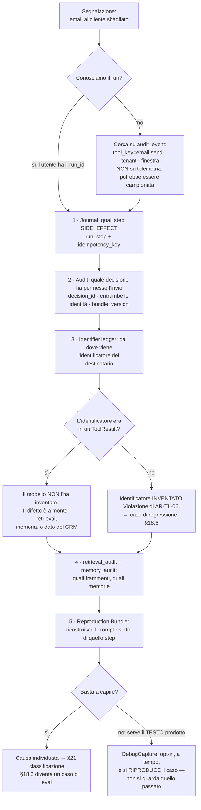

#### Come leggerlo

- **I primi quattro passi non toccano la telemetria.** Journal, audit,
  `retrieval_audit`, `memory_audit`: tutte fonti **complete e mai campionate**.
  L'indagine parte da ciò che c'è sempre, non da ciò che potrebbe esserci.
- **Il passo 3 è il cuore, e funziona per `INV-10`.** Il `WorkingSetBlock` contiene
  sempre un soprainsieme degli identificatori osservati nei `ToolResult`, **a
  prescindere dal budget**. Quindi la domanda "il modello ha inventato questo
  identificatore?" ha una risposta **deterministica**, non un'opinione. Questa è
  probabilmente la singola cosa più utile che l'architettura abbia costruito per il
  debugging, ed è stata costruita in `A08` per un altro motivo.
- **L'ultimo passo è raro per costruzione.** Serve solo se il difetto è nel testo
  prodotto, e in quel caso si **riproduce il caso** con la cattura attiva, invece di
  cercare di guardare quello passato — che non è disponibile, e va bene così.

### 12.7 Redaction: perché non è la difesa principale

Il prompt chiede di valutare redaction deterministica, filtro strutturato per campo,
tokenizzazione, pseudonimizzazione. Ed è esplicito: *non affidarsi a un LLM per
redigere informazioni sensibili*. Sono d'accordo, e vado oltre.

> **INFERENZA (nostra).** La redaction è un filtro che tenta di **togliere** il
> sensibile da un flusso che lo contiene. È intrinsecamente un problema di
> riconoscimento, e i problemi di riconoscimento hanno falsi negativi. Un falso
> negativo qui è un dato personale in un archivio operativo. **Un'architettura che non
> mette mai il contenuto nel flusso non ha falsi negativi**, perché non ha niente da
> riconoscere.

> **DECISIONE ARCHITETTURALE — `ADR-170`.** La difesa primaria è **strutturale**
> (`INV-26`: il contenuto non entra), non filtrante. La redaction esiste solo come
> **seconda linea**, applicata dentro `DebugCapture` (`ADR-172`), e lì è:
> - **deterministica e per campo**, guidata da `x-sensitivity` degli schemi
>   (`ADR-066`) — cioè si redige *perché lo schema dice che quel campo è sensibile*,
>   non perché un riconoscitore ha trovato qualcosa che sembra un IBAN;
> - **mai basata su un LLM**;
> - **mai l'unica difesa**: `DebugCapture` è già autorizzata, a tempo e auditata.
>
> **Contro-argomento onesto:** un campo di testo libero del CRM (le note su un cliente)
> è dichiarato sensibile *in blocco* e quindi redatto in blocco, il che lo rende
> inutile per il debug. Non ho una soluzione migliore, e preferisco l'inutile al
> pericoloso.

---

## 13. Osservare il non-accadere

### 13.1 Il mandato, e perché generalizza

`INV-24` e `ADR-163` sono stati decisi pochi giorni fa, dopo aver scoperto `R-63`:
l'outbox senza consumatore vivo accumula **in silenzio**. La generalizzazione è netta:

> **Ogni consumatore di background il cui guasto non produce errori è un guasto
> silenzioso.** Ogni `job_type` dichiara una `max_staleness`, e **l'assenza di
> progresso oltre quella soglia è un evento di errore**, non una metrica mancante
> (`AR-EV-35`).

Per `A12` questo generalizza ancora: **l'osservabilità deve rendere osservabile il non
accadere, non solo l'accadere.** È la differenza fra un cruscotto che dice "tutto
verde" perché tutto va bene, e uno che dice "tutto verde" perché non arriva più niente.

La distinzione tecnica che rende la cosa non banale, e che `AR-EV-35` già fissa:

> **La riga di liveness conta le consegne riuscite, non i giri di loop.** Un consumatore
> che gira ogni secondo e fallisce ogni volta è vivissimo e non sta facendo niente. Un
> heartbeat che dice "sono vivo" è **la forma sbagliata** di questa misura.

### 13.2 I tre livelli di rilevazione del silenzio

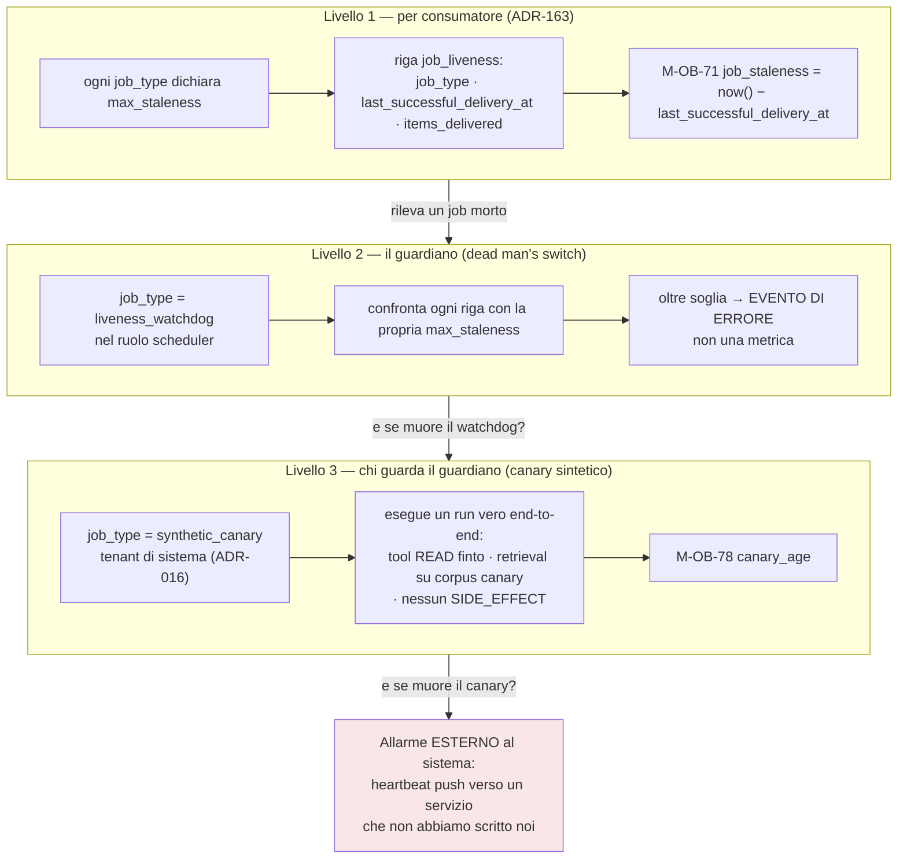

#### Come leggerlo

- **Ogni livello risolve il buco del precedente, e il regresso si ferma fuori.** Il
  livello 1 rileva un consumatore morto. Ma chi rileva che il livello 1 è morto? Il
  livello 2. E il livello 2? Il livello 3. E il livello 3? **Nessun componente
  interno**: il regresso si chiude solo uscendo dal sistema.
- **Il riquadro rosso è la conclusione onesta.** Un sistema non può dimostrare da solo
  di essere vivo. L'ultimo anello dev'essere un **push verso l'esterno**: un heartbeat
  periodico verso qualcosa che, non ricevendolo, allarma. Day-1 può essere il più
  banale dei servizi di dead man's switch, o un cron su un'altra macchina. **Ciò che
  non può essere è un altro job dentro lo `scheduler`.**
- **Il canary è un run vero, non un ping.** Un ping dice che il processo risponde. Un
  run sintetico dice che coda, lease, ledger, modello, retrieval e journal funzionano
  **insieme**. È l'unica cosa che rileva un guasto di integrazione senza traffico.

> **DECISIONE ARCHITETTURALE — `ADR-182`.** Il canary sintetico è un `job_type`
> (`ADR-142`) che gira nel **tenant di sistema** (`ADR-016`: le risorse globali hanno
> il `tenant_id` del tenant di sistema, mai `NULL`), esegue un run completo **senza
> alcun `SIDE_EFFECT`** (`AR-EV-12` lo impone già ai job), e su un **corpus canary
> dedicato** che non contiene dati di nessun tenant.
>
> **Perché nel tenant di sistema e non in un tenant reale:** perché un canary che gira
> nel tenant di un cliente consuma il suo budget, sporca le sue metriche e legge i suoi
> dati. `INV-02` e `AR-017` non ammettono un'eccezione "tanto è solo un test".
> **Trade-off:** un canary nel tenant di sistema **non** rileva i guasti specifici di un
> tenant (una `RLS` mal configurata, un `grant` non proiettato per quel cliente). È una
> lacuna reale → `T-OB-10`.
> **Contro-argomento onesto:** un canary che passa sempre diventa rumore di fondo, e
> quando fallisce nessuno ci crede. La mitigazione è che fallisca **rumorosamente e
> raramente**, e che il suo fallimento sia un incidente con una procedura, non un
> alert fra tanti.

### 13.3 La `max_staleness` di ciascun consumatore

`ADR-163` impone che ogni `job_type` la dichiari. **Non invento i valori** — dipendono
da requisiti operativi che non abbiamo. Dichiaro invece **il criterio** con cui
ciascuno la fissa, che è la parte architetturale.

| `job_type` | Criterio per fissare `max_staleness` | Valore |
|---|---|---|
| `outbox_dispatch` | deve essere **più corta** della finestra di `ADR-162`, altrimenti il run fallisce con `APPROVAL_UNDELIVERABLE` prima che il guasto sia rilevato | `NON ANCORA DECISO` |
| `grant_projection` | deve essere **più corta** della soglia di `AR-KN-09`, altrimenti il retrieval va fail closed prima che qualcuno sappia perché | `NON ANCORA DECISO` |
| `document_polling` | dalla **classe di freschezza** più stretta dichiarata (`ADR-082`) | `NON ANCORA DECISO` |
| `reconciliation_sweep` | dal tempo massimo accettabile di divergenza fra sorgente e indice | `NON ANCORA DECISO` |
| `tombstone_purge` | dall'impegno di cancellazione dichiarato ad `A14` | `NON ANCORA DECISO` |
| `tree_reaper` | dal tempo massimo in cui un figlio orfano può consumare GPU (`R-54`) | `NON ANCORA DECISO` |
| `serving_scraper` | dalla risoluzione delle metriche che vogliamo | `NON ANCORA DECISO` |
| `liveness_watchdog` | **la più corta di tutte**: deve accorgersi prima che il danno sia fatto | `NON ANCORA DECISO` |

> **La regola generale, che invece decido:** `AR-OB-13` — *la `max_staleness` di un
> consumatore è sempre più corta della soglia oltre la quale il suo ritardo produce una
> conseguenza per l'utente.* Se fosse più lunga, ci accorgeremmo del guasto **dopo** il
> danno, e il monitoraggio sarebbe un rendiconto invece di un allarme. Questo è il
> criterio; i numeri escono dai requisiti operativi, che sono `Q-02` (`DEF-06`, `RPO`/
> `RTO`) e che **non chiudo**: sono di `C24`.

### 13.4 Le guardie di invariante: assenze che devono restare assenze

Alcune cose non vanno misurate ma **verificate**: il loro valore atteso è zero, e un
valore diverso da zero non è un dato interessante, è una violazione.

| Guardia | Deve valere | Invariante | Cosa significa se non vale |
|---|---|---|---|
| `child_run_count` | 0 | `AR-AC-01`, `ADR-123` | qualcuno ha attivato la comunicazione agent→agent senza una decisione |
| `steps_consumed` − `COUNT(run_step)` | 0 | **`INV-20`** | il ledger d'albero è aggirabile: **`R-50`**, cioè la catena di agent compra budget |
| span `EXTERNAL_CALL` senza riga `run_step` `IN_FLIGHT` precedente | 0 | **`INV-21`** | un byte è partito senza traccia committata: il fallimento peggiore possibile |
| run non terminali senza lease, senza `wakeup_at`, senza attesa | 0 | **`INV-23`** | un run è stato perso |
| `metric_sample` con label vietata | 0 | `AR-OB-04` | esplosione di cardinalità in arrivo |
| `telemetry_span.attrs` con chiave fuori allowlist | 0 | **`INV-26`** | contenuto in un archivio operativo |
| query di telemetria senza `tenant_id` | 0 (salvo `PlatformOperator`) | **`INV-28`** | fuga cross-tenant |
| letture di `telemetry_span` da moduli di controllo | 0 | **`INV-27`** | un controllo dipende da un dato che può mancare |

Le prime quattro si verificano con **query SQL periodiche** (un `job_type`
`invariant_check`); le ultime quattro con **test statici in CI**. La differenza è che
le prime dipendono dai dati e le seconde dal codice.

> **`AR-OB-14`.** La violazione di una guardia di invariante è un **evento di errore**
> e apre un incidente. Non è un alert su una soglia: non c'è una soglia, il valore
> atteso è zero.

---

## 14. Il costo dell'osservabilità

### 14.1 Perché questa sezione esiste

`ADR-039` fa di `max_model_len` una decisione di **capacità** su una sola GPU: ogni
token dichiarato è concorrenza tolta al KV cache. Lo stesso ragionamento vale qui, su
un'altra risorsa: ogni riga di telemetria è I/O, spazio e attenzione tolti a
PostgreSQL, che sta già facendo tutto (`R-04`).

**Progettare un'osservabilità che non ci possiamo permettere significa che verrà
spenta**, e verrà spenta esattamente quando serve — sotto carico.

### 14.2 Il volume, derivato invece che stimato

Questa architettura ha un vantaggio raro: **il volume di trace per esecuzione ha un
tetto per costruzione**.

**FATTO (interno).** `ADR-104` impone `max_steps = 50` per **albero** (`INV-18`,
`ADR-128`).
**FATTO (interno).** La gerarchia di `ADR-167` ammette al massimo, per step: 1 span
`STEP` + 1 `RETRIEVAL` + `n` `MODEL_CALL` + 1 `TOOL_INVOKE` + 1 `EXTERNAL_CALL`.
**INFERENZA.** Con `n` limitato dal tetto di tentativi di `AR-MD-06`, il costo per step
è **≤ 5 span**, e per albero:

```text
span per albero ≤ 1 (RUN_TREE) + 1 (RUN) + 50 × 5 = 252
```

> **Nessun trace può esplodere.** Non esiste il caso patologico del run che gira in
> loop per ore generando milioni di span, perché non esiste il run che gira in loop per
> ore (`ADR-104`, `AR-RT-17`). Questo è un beneficio dell'osservabilità che nessuno
> aveva previsto quando `ADR-104` è stata presa per un vincolo di dominio.

Cosa **non** ha un tetto, e va guardato:
- il numero di run al giorno (`AS-01`: decine di run concorrenti, confidenza Media);
- i campioni di metrica, che dipendono dalla **cardinalità** (§14.3) e non dal
  traffico;
- i log, che dipendono dal livello attivo.

Il numero di byte per span **`RICHIEDE MISURA`**, non ricerca: si ottiene inserendo
mille span reali e dividendo. → **`B-76`**.

### 14.3 La cardinalità: il costo che sorprende

La cardinalità di una metrica è il numero di combinazioni distinte di label. Cresce
**moltiplicando**, e questo è il modo in cui i sistemi di metriche muoiono.

> **DECISIONE ARCHITETTURALE — `ADR-174`.** Esiste un **budget di cardinalità
> dichiarato per metrica** nel registro (`ADR-176`), e una **lista di label vietate**.

**Label vietate su qualunque metrica** (`AR-OB-04`):

| Label vietata | Perché | Dove sta invece |
|---|---|---|
| `run_id` | cardinalità = numero di run. Illimitata | è un campo di span e di journal |
| `tenant_id` | moltiplica **tutto** per il numero di tenant | è un campo di span, con RLS. Le viste per tenant si calcolano **per query** (§16.2) |
| `subject_id` | dato personale, e cardinalità alta | audit |
| `trace_id`, `span_id` | non sono dimensioni, sono identità | span |
| qualunque campo di dominio | `INV-26` | da nessuna parte |
| `field_path` **libero** | esploderebbe con schemi grandi | ammesso **solo** su `M-OB-11`, e limitato ai campi dichiarati nello schema del tool — insieme finito e noto |

**Label ammesse**, e la loro cardinalità nota: `agent_version_id` (unità),
`model_version_id` (unità), `tool_key` (decine, `AS-09`), `error_class` (una
ventina, §21), `priority` (poche), `worker_class` (poche), `job_type` (8, `ADR-142`),
`span_kind` (9), `action_class` (poche), `freshness_class` (poche).

> **Il caso `tenant_id` merita una parola in più**, perché è la scelta che verrà
> contestata. Non tenere serie temporali per tenant significa che **non esiste un
> cruscotto per tenant istantaneo**: una vista per tenant è una query su
> `telemetry_span`, più lenta e su una finestra più corta. È un costo reale
> sull'esperienza di chi opera. Lo accetto perché l'alternativa — moltiplicare ogni
> metrica per il numero di tenant — è il modo documentato in cui questo tipo di sistemi
> diventa insostenibile, e perché `AS-05` dice che i tenant Day-1 sono pochi.
> **Quando cambia:** `T-OB-04` — quando le query per tenant diventano troppo lente, si
> introduce un **rollup per tenant** su una manciata di metriche scelte (non tutte),
> oppure un backend di metriche vero (§23.3).

### 14.4 Il campionamento

| Strategia | Adottata? | Motivo |
|---|---|---|
| **head-based** (decidi all'inizio) | **sì**, sui run nominali di sola lettura | economico, deciso una volta per run, e con `ADR-104` il costo per run è comunque limitato |
| **tail-based** (decidi alla fine, conoscendo l'esito) | **sì**, in forma semplificata | è ciò che serve davvero: si tiene tutto quando qualcosa va storto. Nella nostra forma non serve un Collector con buffer: il run è **già** bufferizzato in memoria fino alla fine dello step, e l'esito dello step è noto quando si scrive |
| **error-based** | **sì**, è un caso del tail-based | |
| **tenant-based** | **no Day-1** | con pochi tenant non serve; sarebbe una discriminazione operativa da giustificare col cliente |
| **high-value-task** | **sì**, come conseguenza | ogni run che tocca un `SIDE_EFFECT` è alto valore per definizione |

> **DECISIONE ARCHITETTURALE — `ADR-173`.** Campionamento **misto e guidato dall'esito
> dello step**: si bufferizza lo step, e alla sua chiusura si decide se scrivere tutti i
> suoi span o solo lo span di step. Concretamente:
> - step con esito `OK`, `side_effects = READ`, run nominale → si scrive lo span di
>   step, si campionano i figli con probabilità dichiarata;
> - **tutto il resto → si scrive tutto.**
>
> **Perché funziona qui e non funzionerebbe altrove:** il buffering fino a fine step è
> gratis perché lo step è breve (`ADR-104`) e perché il worker sta già tenendo lo stato
> in memoria per scrivere il journal.
> **Contro-argomento onesto:** se il processo muore a metà step, gli span di quello
> step si perdono — proprio nel caso più interessante. Mitigazione: la riga di journal
> `IN_FLIGHT` è **già committata** prima del primo byte (`INV-21`), quindi
> l'informazione che conta non è nel buffer. Ma la ricostruzione della sequenza interna
> allo step, sì, si perde. È il difetto peggiore di `ADR-173`, ed è dichiarato.

### 14.5 Cosa non si campiona mai

Questo elenco è **normativo**, ed è la parte di §14 che non si tocca quando si taglia
per costo.

1. **Ogni decisione di autorizzazione.** Non perché sia telemetria preziosa: perché
   **non è telemetria**, è audit (`INV-01`, `AR-031`).
2. **Ogni step con `side_effects ≠ READ`**, in tutti i suoi span.
3. **Ogni step `UNCERTAIN`** e ogni step toccato dal recovery.
4. **Ogni `ERROR`**, a qualunque livello.
5. **Lo span `RUN` e lo span `RUN_TREE`** di ogni esecuzione: sono ciò che rende
   `M-OB-61`/`M-OB-62` calcolabili, e senza di loro `T-AC-04` non scatta.
6. **Ogni evento di sicurezza**: `DENY`, `AUTHORIZATION_LOOP`, `identity_link` stantio,
   fail closed del retrieval, apertura di `DebugCapture`.
7. **Ogni violazione di guardia** (§13.4).
8. **Il canary sintetico** e le righe di liveness.

> **`AR-OB-16`.** Un cambio di configurazione del sampling **non può** ridurre sotto il
> 100 % nessuna delle otto classi sopra. È applicato nel codice dell'exporter, non
> lasciato alla configurazione: una soglia configurabile è una soglia che qualcuno
> abbasserà alle due di notte per far ripartire il sistema.

### 14.6 Il conto, in forma dichiarata

| Voce di costo | Grandezza che la determina | Stato |
|---|---|---|
| byte per span | dimensione media di `attrs` | **`RICHIEDE MISURA`** → `B-76` |
| span per giorno | run/giorno × ≤ 252 × frazione campionata | dipende da `AS-01` (Media) |
| righe di metrica per giorno | Σ (cardinalità × finestre/giorno) — **indipendente dal traffico** | calcolabile dal registro **oggi** |
| byte di log per giorno | eventi × dimensione, con `DEBUG` spento | stimabile dopo la prima settimana |
| costo di query | dipende dagli indici su `telemetry_span` | da misurare |
| **costo di attenzione** | numero di alert per settimana | §21.4 — è il costo che si sottovaluta sempre |

> **Non scrivo numeri.** `Q-01`…`Q-04` sono aperte, `AS-01` (decine di run concorrenti)
> ha confidenza Media, `AS-16` (volume di chunk) ha confidenza Bassa, e `DEF-05`
> (soglie di capacità) **non è mia**: è di `B21`. Quello che posso fare, e che faccio,
> è dichiarare **quale formula** e **quale misura** produce ciascun numero. Chi lo
> riempirà avrà le variabili giuste.

---

## 15. Retention

> **DECISIONE ARCHITETTURALE — `ADR-184`.** Retention **differenziata per piano di
> segnale**. Non un unico valore per "i dati di osservabilità".

| Piano | Chi possiede la durata | Ordine di grandezza | Perché |
|---|---|---|---|
| campioni di metrica ad alta risoluzione | `A12` | **giorni** | servono a indagare adesso |
| campioni di metrica in rollup | `A12` | **mesi/anni** | servono ai trend: `T-MD-08` chiede *`portability_delta` in crescita per **due trimestri*** — senza rollup lungo, quel trigger è inespressibile |
| span di trace, esito `OK` | `A12` | **giorni** | dopo una settimana nessuno li guarda |
| span di trace, esito `ERROR`/`UNCERTAIN` | `A12` | **settimane** | sono i casi che diventano regressioni (§18.6) |
| log | `A12` | **giorni** | |
| **audit** | **`A14`**, non `A12` | **anni** | è un artefatto legale; `A12` dichiara solo che è **diversa e più lunga** |
| dataset ed esiti di evaluation | `A12` | **lunga, versionata** | un esito di eval senza storia non permette di dire "siamo peggiorati" |
| `DebugCapture` | `A12` | **la più corta di tutte**, con purge garantita | §12.5 |

**Il valore concreto in giorni è `NON ANCORA DECISO`.** Il criterio per fissarlo:
*la retention degli span è il tempo massimo che passa fra un difetto e la sua
segnalazione*, che è un dato di prodotto che non abbiamo. La retention del rollup è
vincolata dal basso: **almeno due trimestri**, altrimenti `T-MD-08` è morto — e questo
sì lo decido, perché deriva da un trigger già scritto.

> **La cancellazione della telemetria non è come quella dell'audit.** La telemetria si
> cancella staccando partizioni (§10.2). L'audit **non si cancella affatto** dentro il
> perimetro di `A12`: `INV-05` dice append-only, e chi ne governa il ciclo di vita è
> `A14`. Se `A14` deciderà che l'audit ha una fine, sarà una sua decisione con i suoi
> vincoli legali.

---

## 16. Multi-tenancy dell'osservabilità

Il mandato pone tre domande. Le affronto una per una perché hanno tre risposte diverse.

### 16.1 Chi può vedere le metriche di chi

`AR-017`/`AR-018` e `INV-02` non fanno eccezioni: **ogni riga di ogni tabella
applicativa ha un `tenant_id`**, e nessuna query applicativa lo omette. La telemetria è
una tabella applicativa.

> **`AR-OB-17`.** `telemetry_span` e `metric_sample` hanno `tenant_id` **non nullo** e
> **RLS attiva**, esattamente come `run` e `audit_event`. Un operatore di un tenant vede
> la telemetria del proprio tenant e nient'altro, e lo vede perché il **database** lo
> impone, non perché l'applicazione ricorda di filtrare.

> **NUOVO INVARIANTE `INV-28`.** Ogni lettura di telemetria avviene sotto un
> `tenant_id` risolto dall'identità autenticata. L'unica eccezione è il
> `PlatformOperator` (§16.3), che accede a una **vista** e non alle tabelle, e il cui
> accesso è auditato. `M-OB-79` conta le violazioni e deve valere zero.

### 16.2 Un cruscotto che aggrega fra tenant è una fuga di dati?

**Dipende da cosa aggrega, e la distinzione è netta.**

| Tipo di aggregato | Fuga? | Perché |
|---|---|---|
| `p95` di latenza su **tutti** i tenant | **no** | è una proprietà dell'**infrastruttura**, non dei dati. Non è derivabile da nessun dato di dominio |
| numero totale di run al giorno | **no** | proprietà di carico |
| `uncertain_rate` globale | **no** | proprietà del sistema |
| `recall_at_k` per **tenant** | **sì, potenzialmente** | dice qualcosa sulla qualità dei **documenti di quel cliente** |
| conteggio di `tool_key` per tenant | **sì** | rivela quali funzioni usa un cliente: è informazione commerciale |
| `M-OB-82` `chunk_count` per tenant | **sì** | rivela la dimensione del corpus del cliente |
| qualunque aggregato **con `n` piccolo** | **sì** | con due tenant, la media rivela l'altro. È il classico problema di divulgazione statistica, e non si risolve "arrotondando" |

> **DECISIONE ARCHITETTURALE — `ADR-186`.** Esistono **due cruscotti distinti**, con due
> autorizzazioni e due insiemi di metriche:
>
> 1. **Cruscotto di piattaforma** — leggibile dal `PlatformOperator`. Contiene **solo**
>    metriche di infrastruttura: latenza, saturazione, GPU, coda, errori per classe
>    tecnica, staleness dei job, canary. **Nessuna dimensione che sia derivata dal dato
>    di dominio o dall'attività commerciale di un tenant**, e nessuna disaggregazione
>    per tenant.
> 2. **Cruscotto di tenant** — leggibile dagli amministratori di quel tenant, sotto RLS.
>    Contiene tutto quello che riguarda il proprio tenant, incluse le metriche di
>    qualità.
>
> **Alternative considerate.** (a) Un cruscotto unico con controllo di accesso per
> riga: respinto perché il controllo finirebbe nella query, e una query dimenticata è
> una fuga (`AR-KN-02` insegna: il filtro deve stare **nella query**, e ciò che viene
> dopo può solo togliere — qui l'abbiamo reso strutturale separando le viste).
> (b) Aggregati con soglia minima di `n`: rimandato — è la mitigazione giusta **se** un
> giorno serviranno aggregati cross-tenant su dimensioni di dominio, e allora serve una
> decisione informata sulla divulgazione statistica → `B-79`.
> **Contro-argomento onesto:** questa separazione rende più difficile il lavoro
> legittimo di chi opera la piattaforma — per esempio capire se un problema di recall
> riguarda un cliente solo o tutti. La via d'uscita è l'**elevazione dichiarata**
> (`ADR-119`): temporanea, motivata, auditata. Non un'eccezione permanente.

### 16.3 Il `PlatformOperator` può leggere la telemetria dei tenant?

`ADR-118` dice che il `PlatformOperator` **non legge i dati dei tenant**, che è un tipo
di principal separato con le stesse policy RLS, e che la difesa è **procedurale e di
rilevabilità**, non crittografica.

La domanda giusta non è "telemetria sì o no", è: **quali dimensioni della telemetria
sono un dato del tenant?**

| Cosa | Il `PlatformOperator` può? | Motivo |
|---|---|---|
| latenza, saturazione, code, GPU, errori tecnici | **sì** | sono proprietà della macchina che gestisce |
| staleness dei job, canary, guardie di invariante | **sì** | è il suo lavoro |
| `run_id` e `trace_id` di un run di un tenant | **sì, ma sono opachi** | senza il contenuto, un identificatore non dice niente. Servono per correlare una segnalazione |
| `tool_key` invocati da un tenant | **no** | informazione commerciale del cliente |
| metriche di qualità del retrieval di un tenant | **no** | proprietà dei documenti del cliente |
| contenuto, prompt, memoria | **no**, e non esiste comunque (`INV-26`) | |
| ricostruire un prompt (§12.3) | **no**, salvo elevazione dichiarata | è un accesso ai dati del tenant a tutti gli effetti |
| aprire una `DebugCapture` | **no**, mai da solo | serve l'opt-in del tenant (`ADR-172`) |

> **La risposta sintetica:** il `PlatformOperator` legge la telemetria **del sistema**,
> non la telemetria **dei tenant**. Il confine non passa fra "metriche" e "dati": passa
> fra **dimensioni tecniche** e **dimensioni che sono proiezioni dell'attività del
> cliente**. È una linea più sottile e più corretta di "niente accesso", e ha il
> vantaggio di essere applicabile: si implementa scegliendo quali colonne stanno nella
> vista di piattaforma.
>
> **Il residuo, dichiarato.** `R-48` dice già che il `PlatformOperator` è tecnicamente
> in grado di leggere i dati via accesso diretto al database. Questa sezione **non
> risolve** `R-48`: lo rende soltanto **rilevabile come anomalia**, perché l'accesso
> applicativo è auditato e quello diretto no — e quindi un accesso diretto è visibile
> come un buco nell'audit. La difesa vera resta `B-50` (cifratura per-tenant).

---

## 17. LLM-as-a-judge: dove serve, e dove è una bugia comoda

### 17.1 Il problema

Un LLM-as-a-judge è un modello a cui si chiede di valutare l'output di un altro
modello. È attraente perché sembra risolvere il problema più costoso dell'evaluation —
il giudizio umano — con una chiamata API.

Il prompt chiede di ricercare limiti e forme di bias: verbosity bias, position bias,
self-preference, riproducibilità, calibrazione, correlazione con il giudizio umano.

> **`RICHIEDE RICERCA`.** Non ho potuto verificare l'evidenza quantitativa su questi
> bias: era vietata la ricerca esterna in questa passata. Registro **`B-77`** (evidenza
> primaria e misurata sui bias di LLM-as-a-judge, e sulla correlazione con annotatori
> umani nei domini strutturati) e **`B-78`** (esiste evidenza sull'uso di un modello
> piccolo come judge di sé stesso?). **Le decisioni sotto sono prese in modo
> conservativo proprio perché quelle voci sono aperte**: se la ricerca mostrasse che i
> judge sono più affidabili di quanto assumo, si allentano; il contrario non sarebbe
> recuperabile.

### 17.2 Tre argomenti nostri, indipendenti dalla letteratura

Anche senza la ricerca, tre cose sono vere **per questa architettura specifica**.

1. **`INV-03`: il modello non è un enforcement point, la sua uscita è input non
   fidato.** Un judge che decide se un rilascio passa **è** un enforcement point. Non è
   una questione di quanto sia bravo: è una questione di dove sta nell'architettura.
2. **Il judge, Day-1, sarebbe lo stesso modello del generatore.** Abbiamo **una GPU** e
   **un modello** (`AS-08`, confermata da `ADR-068`). Un judge diverso richiederebbe di
   caricare un secondo modello, che `ADR-045` e il bilancio VRAM di `A05` non
   permettono. Quindi Day-1 il judge sarebbe Qwen3.5-9B a 4 bit che valuta Qwen3.5-9B a
   4 bit: **self-preference nella forma più pura possibile**, più tutti i limiti che la
   quantizzazione già introduce (`R-15`: la quantizzazione degrada il **tool calling**
   più della qualità percepita del testo — cioè degrada proprio la dimensione che ci
   interessa valutare).
3. **Costa la risorsa più scarsa che abbiamo.** Ogni chiamata di judge è tempo di GPU
   tolto ai run. `R-11.3` ha già stabilito il principio per il multi-agent: *per noi
   non è caro, è indisponibile*. Vale identico qui.

### 17.3 La decisione

> **DECISIONE ARCHITETTURALE — `ADR-179`.** L'LLM-as-a-judge è ammesso **solo** come
> strumento di **triage** — cioè per ordinare una coda di casi da far guardare a una
> persona — e **mai** come:
> - gate di rilascio (§18.7);
> - fonte di una metrica pubblicata come qualità;
> - valutatore di sicurezza, autorizzazione o conformità alle policy;
> - sostituto del golden set (§11.3).
>
> E con tre vincoli operativi: (a) **mai in linea** con un run di produzione, sempre
> offline; (b) i suoi esiti sono marcati `advisory` **nel tipo**, come `ADR-031` fa già
> per la verifica semantica (*la semantica è advisory, mai decisiva*); (c) la sua
> concordanza con il giudizio umano si **misura su un campione**, e se non la si misura
> il judge si spegne.
>
> **Alternative considerate.** (a) *Judge come gate con soglia alta*: respinta —
> `INV-03`. (b) *Judge esterno via API cloud*: respinta Day-1 — `AR-MD-09` (nessun
> egress verso provider esterni senza passare dal PDP) e `AR-KN-18`/`INV-07` (i dati di
> valutazione contengono dati del tenant). Diventa discutibile solo se `A14` e il
> committente lo ammettono, e allora sarebbe una decisione di policy (`T-MD-05`).
> (c) *Nessun judge affatto*: è la posizione più difendibile, e la scarto solo perché il
> triage di una coda di casi è un uso in cui **anche un giudizio mediocre fa
> risparmiare tempo**, e in cui un errore non produce conseguenze — al massimo una
> persona guarda un caso nell'ordine sbagliato.
> **Contro-argomento onesto:** il triage crea dipendenza. Se il judge ordina male, i
> casi in fondo alla coda non vengono guardati **mai**, e il difetto è invisibile. La
> mitigazione: una quota fissa della coda viene campionata **a caso**, non ordinata dal
> judge. Senza quella quota, `ADR-179` non regge.

### 17.4 `MODEL SCORE ≠ GROUND TRUTH`, resa operativa

Nel modello dati, il tipo distingue: `EvaluationResult.verdict` è prodotto da un
valutatore **deterministico** o **umano**; `EvaluationResult.advisory_score` è prodotto
da un judge. Sono **due colonne diverse**, e nessuna query di gate legge la seconda.
È la stessa tecnica di `ADR-031` e la stessa forma di `INV-12`: rendere strutturale ciò
che altrimenti sarebbe una raccomandazione.

---

## 18. L'architettura di evaluation

### 18.1 Il principio: orientata all'esito, mai al confronto di output

Questo non è uno stile: è un mandato di `A05` e `A17`, ed è coerente con la posizione
di Anthropic registrata in `R-11`.

**FATTO (`R-11.1`).** Anthropic dichiara che nel proprio sistema di ricerca gli agent
raggiungono l'obiettivo per **percorsi divergenti ma ugualmente validi**, e che la
valutazione va fatta **sull'esito** e non sulla correttezza passo per passo.

**FATTO (`R-11.1`, Cemri et al., `MAST`).** Su 1.600+ trace annotate, i fallimenti dei
sistemi ad agent nascono dal **design del sistema**, non dai limiti del modello, e i
tassi di fallimento vanno dal 41 % all'86,7 %.

**INFERENZA (nostra).** Se il percorso valido non è unico, allora:
- **confrontare l'output esatto con un output atteso è sbagliato**: fallirebbe su
  risposte corrette;
- **confrontare la sequenza di passi con una sequenza attesa è sbagliato** per lo
  stesso motivo;
- ciò che si può confrontare è lo **stato del mondo alla fine**, e i **vincoli** che
  dovevano essere rispettati lungo la strada.

> **DECISIONE ARCHITETTURALE — `ADR-177`.** Un `EvaluationCase` è definito da
> **post-condizioni verificabili** e **vincoli**, non da un output atteso.
>
> ```text
> EvaluationCase
>   case_id, dataset_version
>   input               -- il turno dell'utente, testuale
>   fixture             -- lo stato iniziale del mondo (dataset Odoo di test, corpus)
>   postconditions[]    -- verifiche DETERMINISTICHE sullo stato finale
>   constraints[]       -- ciò che NON doveva succedere
>   acceptable_variants -- ciò che è ammesso variare (ordine, formulazione, n. di passi)
>   references[]        -- chunk_id/record che la risposta doveva usare (per §11.6)
> ```
>
> **Esempio, sul caso del prompt** — *"prepara il report vendite mensile e mandalo al
> team finance"*:
>
> | Tipo | Contenuto |
> |---|---|
> | post-condizione | esiste **esattamente un** messaggio inviato, ai destinatari del gruppo `finance` risolto dal fixture |
> | post-condizione | il totale nel report è **uguale** alla somma calcolata dal fixture (verifica numerica esatta) |
> | post-condizione | il run è terminato in uno stato terminale non di errore |
> | vincolo | **nessuna** scrittura verso Odoo oltre a quelle dichiarate |
> | vincolo | nessun `DENY` seguito da un percorso alternativo che ottiene lo stesso effetto (è `R-17`, la composizione di azioni lecite) |
> | vincolo | ogni identificatore citato compare in un `ToolResult` (§11.6) |
> | variante ammessa | il numero di step, l'ordine delle letture, la formulazione del testo |
>
> **Alternative considerate.** (a) *Confronto di output con tolleranza semantica
> (embedding similarity)*: respinta — misura la somiglianza, non la correttezza, e due
> risposte quasi identiche possono differire nel numero che conta.
> (b) *Trajectory matching*: respinta per `R-11`. (c) *Solo LLM-judge*: §17.
> **Trade-off:** scrivere post-condizioni costa molto più che incollare un output
> atteso. È il costo principale di questa scelta, e non ho modo di ridurlo.
> **Contro-argomento onesto:** le post-condizioni catturano ciò a cui abbiamo pensato.
> Un agent che raggiunge le post-condizioni **e** fa qualcosa di orribile che non
> avevamo previsto passa il test. Per questo esistono i `constraints[]`, e per questo il
> **failure corpus** (§18.6) è la parte che rende il sistema vivo: ogni cosa orribile
> vista una volta diventa un vincolo.

### 18.2 I sette livelli, e cosa misura ciascuno

| Livello | Cosa misura | Come | Deterministico? |
|---|---|---|---|
| **1. Model** | il modello segue le istruzioni e produce struttura | `M-OB-04` (malformed), `M-OB-05` (tool allucinati), `M-OB-06` (refusal), tool selection su casi noti | **sì** |
| **2. Prompt** | una `AgentVersion` è meglio della precedente | stesso dataset, due `AgentVersion`, confronto di post-condizioni | **sì** |
| **3. Retrieval** | l'informazione giusta viene trovata | `M-OB-18`…`M-OB-21` sul golden set | **sì**, dato il golden set |
| **4. Tool** | il tool giusto, con gli argomenti giusti | `M-OB-60`, `M-OB-11`, e verifica degli argomenti contro il fixture | **sì** |
| **5. Agent** | il compito è compiuto | post-condizioni di `ADR-177` | **sì** |
| **6. Workflow** | il comportamento sotto guasto è corretto | §18.3 — recovery, idempotenza, cancellazione, approvazione | **sì** |
| **7. End-to-end** | il compito reale, dall'inizio alla fine | come il livello 5, su casi presi dalla realtà | **sì** |

> **Nessun livello richiede un judge.** È il risultato che volevo dimostrare, e viene
> dal fatto che nel nostro dominio — CRM/ERP — quasi tutto ciò che conta è **verificabile
> contro uno stato**: un ordine esiste o no, un totale torna o no, un'email è partita
> una volta o due. Non stiamo valutando poesia. È una fortuna del dominio, e va sfruttata
> fino in fondo prima di ricorrere a valutatori probabilistici.

### 18.3 Il livello 6 è quello che nessuno costruisce, ed è il nostro rischio più alto

`R-06b` dice, testualmente, che **il codice di recovery è il rischio più concreto
dell'architettura**, perché produce danni silenziosi. `A04` dichiara confidenza **Bassa**
sulla correttezza del recovery finché non è testato uccidendo processi.

> **DECISIONE ARCHITETTURALE.** L'evaluation di livello 6 è **Day-1 e non negoziabile**,
> ed è fatta di test di chaos deliberati in CI (§22.3), non di osservazione della
> produzione. I quattro casi minimi, che vengono direttamente da `ADR-144`:
>
> 1. worker ucciso con step `PENDING` → alla ripresa lo step **si riesegue**;
> 2. worker ucciso con step `IN_FLIGHT` **idempotente** → si riesegue con la **stessa**
>    `idempotency_key`, e in Odoo esiste **un solo** record (verificabile per external
>    ID, `ADR-161`);
> 3. worker ucciso con step `IN_FLIGHT` **verificabile** → parte un probe, che **è uno
>    step e paga dal ledger** (`INV-20` resta vera);
> 4. worker ucciso con step `IN_FLIGHT` né idempotente né verificabile → `UNCERTAIN` →
>    `ESCALATED`, **e nessuna riesecuzione** (`AR-EV-08`).
>
> Più il test che `A10` e `A11` hanno già richiesto: **albero di profondità 3, il 51°
> step fallisce ovunque si trovi** (`INV-20`, difesa di `R-50`).

### 18.4 Il ciclo: dataset, versioni, drift

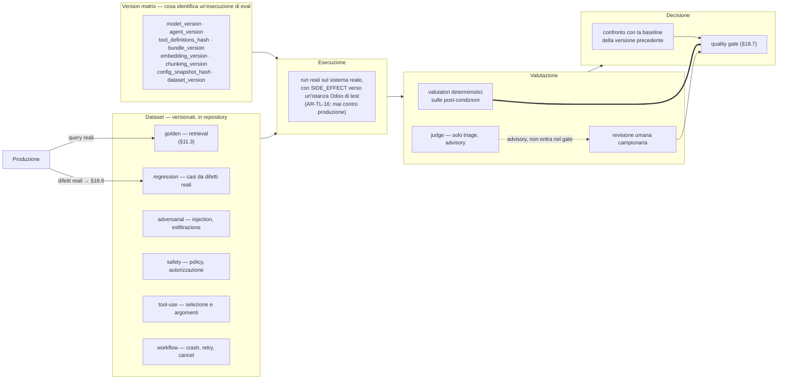

#### Come leggerlo

- **La freccia doppia da `deterministici` a `quality gate` è l'unica che decide.** Il
  judge ha una freccia tratteggiata e va verso l'umano, non verso il gate (`ADR-179`).
- **La `version matrix` è un ingresso, non un'etichetta.** Un esito di eval senza
  l'insieme completo delle versioni **non è confrontabile**, e un confronto fra due
  esiti con versioni diverse in due dimensioni non spiega la regressione. `ADR-042`
  (riproducibilità dell'evidenza) diventa qui un requisito operativo: *sapere come è
  stato prodotto* è la condizione per dire *cosa è cambiato*.
- **Le due frecce dalla produzione ai dataset chiudono l'anello.** Senza, i dataset
  invecchiano e continuano a passare mentre la produzione peggiora — è
  l'**evaluation drift** (`M-OB-86` `eval_dataset_age`).

**Versionamento dei dataset:** file versionati in repository, come il registro delle
metriche. Non righe in un database. Motivo: un dataset di eval deve poter essere
**diffato** in una code review, e la sua modifica deve essere **una decisione
approvata** — altrimenti il modo più facile per far passare un gate è cambiare il test.
→ `AR-OB-20`.

### 18.5 Contaminazione: il rischio che si realizza da solo

Quattro forme, e cosa faccio per ciascuna.

| Forma | Come si realizza qui | Difesa |
|---|---|---|
| **benchmark leakage** | usiamo un benchmark pubblico e il modello l'ha visto in training | non usiamo benchmark pubblici per decidere rilasci: `ADR-180` — *benchmark score ≠ production performance* |
| **test set contamination** | un caso di eval entra nel prompt (per esempio finisce nella knowledge base) | il corpus di eval sta in un **tenant di test isolato**; il canary ha il proprio corpus (`ADR-182`) |
| **train/eval overlap** | quando faremo QLoRA (`T-10`) sul dataset di errori, quel dataset è anche l'eval | **regola dichiarata ora, prima di averne bisogno**: il failure corpus si **divide** in *train* e *holdout* al momento della creazione del caso, e l'holdout non entra mai in un fine-tuning. → `AR-OB-21` |
| **evaluator overfitting** | scriviamo le post-condizioni guardando cosa fa il sistema attuale | è la forma più insidiosa, e non ha difesa tecnica. Mitigazione di processo: le post-condizioni si scrivono **dal requisito**, prima di guardare l'output, e chi le scrive non è chi ha scritto il prompt |

### 18.6 Il failure corpus: l'anello che rende il sistema vivo

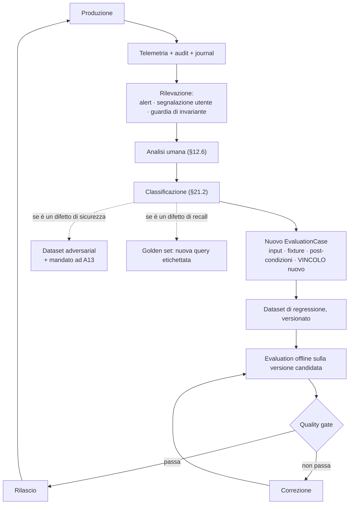

#### Come leggerlo

- **Il ciclo è chiuso solo se il passo `Analisi umana` ha un owner.** È l'unico passo
  che nessuna infrastruttura fa da sola, ed è dove questi cicli muoiono. Registrato
  come rischio **`R-70`**.
- **Ogni difetto produce un *vincolo* nuovo, non solo un caso nuovo.** Se l'agent ha
  mandato due email, il caso nuovo verifica quel compito **e** aggiunge il vincolo
  "nessun invio duplicato" a **tutti** i casi che inviano. È così che il set migliora
  invece di gonfiarsi.
- **Le due frecce tratteggiate sono la connessione con gli altri documenti.** Un difetto
  di sicurezza non è solo un caso di regressione: è materiale per il threat model di
  `A13`.

> **DECISIONE ARCHITETTURALE — `ADR-185`.** Ogni incidente di produzione con impatto
> sull'esito produce **almeno un `EvaluationCase`**, e la chiusura dell'incidente
> **richiede** che il caso esista ed entri nel dataset di regressione. Non è una buona
> pratica: è la definizione di "incidente chiuso".
> **Contro-argomento onesto:** questo rallenta la chiusura degli incidenti, e con un
> team di 1-3 persone (`AS-04`) rallentare la chiusura significa che gli incidenti
> restano aperti. Il rimedio non è allentare la regola: è che il caso minimo accettabile
> sia **piccolo** — input, fixture, una post-condizione. Un caso imperfetto vale
> infinitamente più di un caso mai scritto.

### 18.7 Quality gate: cosa blocca un rilascio

> **DECISIONE ARCHITETTURALE — `ADR-180`.** I gate si dividono in **bloccanti** e
> **advisory**, e la divisione non è per importanza ma per **misurabilità**.

**Gate bloccanti Day-1** — tutti deterministici, tutti binari, nessuna soglia da
inventare:

| Gate | Criterio | Perché è bloccante |
|---|---|---|
| nessuna regressione di autorizzazione | **zero** casi del dataset safety in cui un'azione prima negata ora passa | `INV-13`: l'autorità non cresce mai. Una regressione qui è una falla |
| nessuna regressione di isolamento | **zero** casi in cui un tenant vede dati di un altro | `INV-02` |
| recovery corretto | i 4 casi di §18.3 passano tutti | `R-06b` |
| invarianti | le guardie di §13.4 valgono zero sul set di eval | |
| schema | `M-OB-11` non peggiora su nessun campo già coperto | `AR-MD-03` |
| capability probe | il modello sa fare tool calling e structured output nella combinazione esatta checkpoint × quantizzazione × tokenizer × parser | **FATTO (`R-06`)**: la documentazione vLLM avverte che "supportato" non garantisce che ogni modalità funzioni. `R-13` |

**Gate advisory Day-1** — misurati, registrati, **non bloccanti**:
`recall_at_k`, `precision_at_k`, `eval_task_success_rate`, latenza, token per compito.

> **Perché advisory e non bloccanti.** Bloccare su una soglia richiede di conoscere la
> soglia, e non la conosciamo: `Q-01`…`Q-04` sono aperte e non esiste una baseline.
> **Inventare "recall ≥ 0,8" adesso sarebbe esattamente il tipo di numero che questo
> documento non ha il diritto di scrivere.**
>
> **Il criterio per fissarle**, che invece decido: una soglia di qualità si fissa
> **dopo tre rilasci consecutivi misurati**, e si fissa **relativa alla baseline**
> ("non peggiora di più di X rispetto alla versione precedente"), non assoluta. Una
> soglia relativa è difendibile il primo giorno; una assoluta no. → `T-OB-07`: quando
> esistono tre baseline, i gate advisory di qualità diventano bloccanti in forma
> relativa.

### 18.8 Offline, online, canary, A/B

| Modalità | Quando | Adottata? |
|---|---|---|
| **offline** | prima del rilascio, su ogni cambio di: `ModelVersion`, `AgentVersion`, schema di tool, configurazione di retrieval, `bundle` di policy, `embedding_version`, `chunking_version` | **sì, Day-1**. È il gate |
| **online** | in produzione, su segnali reali | **sì, ma solo come segnale**: `M-OB-40` (correzioni), `M-OB-01` (approvazioni non modificate), escalation, retry, abbandono. **Mai come verdetto** — il prompt lo dice e sono d'accordo: *la soddisfazione dell'utente non è correttezza* |
| **canary di versione** | nuova `AgentVersion` su una frazione di traffico | **no Day-1**, e non per pigrizia: con `AS-01` (decine di run concorrenti) una frazione di traffico **non raggiunge la significatività statistica** in un tempo utile. Un canary su campione insufficiente è teatro. → `T-OB-05` |
| **A/B test** | due varianti in parallelo | **no**, e per una ragione più forte: un A/B su azioni con **effetti** significa che a metà dei clienti succede una cosa diversa, senza che nessuno l'abbia approvato. `ADR-183` |

> **DECISIONE ARCHITETTURALE — `ADR-183`.** Nessun esperimento in produzione su
> percorsi che producono `SIDE_EFFECT`. Gli esperimenti sono ammessi solo: (a) offline;
> (b) in **shadow mode** su percorsi di sola lettura, dove la variante gira in parallelo
> e il suo output **non raggiunge l'utente e non produce effetti**; (c) con opt-in
> esplicito del tenant.
> **Trade-off:** impariamo più lentamente. **Contro-argomento onesto:** lo shadow mode
> di sola lettura raddoppia il consumo di GPU per i run in cui è attivo, e la GPU è la
> risorsa scarsa (`AS-08`). Quindi anche lo shadow mode è a campione e a tempo, non
> permanente.

---

## 19. Cost observability: separare l'uso dal costo

### 19.1 La distinzione, e perché è più forte qui che altrove

Il prompt è esplicito: *non inventare prezzi monetari quando l'infrastruttura non li
fornisce*, e *separare `USAGE` da `COST`*.

Nel nostro caso la separazione è **strutturale**, non stilistica: **non compriamo token**.
Il modello gira su una GPU che abbiamo già pagato. Non esiste un prezzo per token, e
inventarne uno produrrebbe cruscotti che sembrano AWS e non significano niente.

> **DECISIONE ARCHITETTURALE.** Misuriamo **`USAGE`** in unità fisiche e **non**
> convertiamo in denaro. La conversione, se un giorno servirà (fatturazione a consumo,
> chargeback interno), è una funzione applicata **a valle**, con un listino che è un
> dato del Control Plane e non una costante nel codice.

### 19.2 Le unità che misuriamo

| Unità | Da dove | Attribuibile a |
|---|---|---|
| `prompt_tokens`, `completion_tokens` | risposta del serving | run, agent, tool, tenant, modello |
| chiamate al modello | conteggio di span `MODEL_CALL` | idem |
| chiamate a embedding | `EmbeddingProvider` | tenant, sorgente documentale |
| chiamate a tool | span `TOOL_INVOKE` | run, agent, `tool_key`, tenant |
| chiamate esterne | span `EXTERNAL_CALL` | idem, più l'host |
| **step consumati** | `run_tree.steps_consumed` | **albero**, non run (`INV-18`) |
| **millisecondi attivi** | `run_tree.active_ms_consumed` | **albero** — è un **contatore** (`ADR-145`) |
| tempo GPU | occupazione dal serving (`R-06`) | non attribuibile per run sotto continuous batching |

> **La riga più importante è l'ultima, ed è una limitazione da dichiarare.** Sotto
> continuous batching, più richieste condividono la stessa passata di GPU: **il tempo
> GPU non è attribuibile a un singolo run**. Chi presentasse un "costo GPU per run"
> starebbe presentando una divisione arbitraria. Quello che è attribuibile sono i
> **token**, ed è la ragione per cui i token — e non i secondi — sono l'unità di conto
> di questa piattaforma.

### 19.3 Il trade-off costo/qualità, misurato invece che discusso

Il prompt chiede di valutare le relazioni fra dimensione del modello, token, latenza,
profondità del retrieval, reranking, chiamate ai tool, delega, step e qualità.

Qui non c'è quasi niente da decidere, perché le leve sono **già decise** e ciascuna ha
già la sua metrica. Quello che manca è il **posto dove si vedono insieme**, e quello lo
fornisco: una vista che, per ogni `agent_version`, mette in colonna
`eval_task_success_rate` (§18), `prompt_tokens` mediani, `M-OB-61` (step), `M-OB-62`
(durata attiva), `M-OB-44` (frammenti ceduti), `M-OB-63` (prefix cache).

> **Perché serve una vista sola e non sei cruscotti.** Il trade-off si vede solo se le
> grandezze stanno vicine: alzare i frammenti recuperati **migliora** il recall e
> **peggiora** l'eviction del working set (`AR-ME-14`), e le due cose sono in due
> documenti diversi. Guardarle separatamente porta a ottimizzare una dimensione alla
> volta, che è precisamente ciò che il prompt dice di non fare.

---

## 20. SLI, SLO ed error budget

### 20.1 Cosa si può promettere

Un SLO è una promessa. Si promette solo ciò che si sa misurare e su cui si può
intervenire.

| Candidato | SLO Day-1? | Motivo |
|---|---|---|
| disponibilità dell'API di controllo (`POST /v1/runs` risponde) | **sì** | misurabile, azionabile |
| latenza di accettazione di un run (tempo fino al `202`) | **sì** | non dipende dal modello |
| `technical_completion_rate` (§20.2) | **sì** | definito su stati, non su giudizi |
| disponibilità del serving | **sì** | `M-OB-08`…`M-OB-10` |
| disponibilità del retrieval | **sì**, ma attenzione: il fail closed (`M-OB-33`) **è** indisponibilità del retrieval, non un errore di sistema. Va contato come tale, onestamente | |
| tasso di successo dei tool | **sì**, ma **per tool** e con un'avvertenza: un `BUSINESS` error non è un guasto (`AR-RT-15` lo restituisce al modello come osservazione) | |
| **latenza end-to-end di un run** | **no** | dipende dal compito, dall'attesa di approvazione, dal CRM. Un p95 su tutti i run mescola cose incomparabili → si misura **per tipo di compito**, e diventa SLO solo quando i tipi sono stabili (`T-RT-02`) |
| **`task_success_rate`** | **NO** | §20.3 |

### 20.2 `technical_completion_rate`: l'SLI che sostituisce quello che non posso misurare

```text
technical_completion_rate =
    run terminati in uno stato terminale NON di errore
  / run avviati
```

Cosa **conta** come non-errore: `SUCCEEDED`, e anche `ESCALATED` — perché
un'escalation è il comportamento **corretto** quando l'esito è ignoto (`AR-027`,
`ADR-032`), e penalizzarla spingerebbe nella direzione opposta a quella voluta.

Cosa **conta** come errore: guasti di infrastruttura, `BUDGET_EXCEEDED`,
`CONTEXT_BUDGET_EXCEEDED`, `APPROVAL_UNDELIVERABLE`, `DELEGATION_EXPIRED`,
`AUTHORIZATION_LOOP`.

> **Nota importante e contro-intuitiva.** `DELEGATION_EXPIRED` e
> `APPROVAL_UNDELIVERABLE` sono **fallimenti** in questo SLI, anche se sono
> comportamenti corretti del sistema. Motivo: sono fallimenti **per l'utente**, che
> voleva una cosa e non l'ha avuta. `ADR-162` ha convertito uno stallo silenzioso in un
> fallimento rumoroso proprio perché fosse **notato**; contarlo come successo lo
> rimuoverebbe dal radar, che è l'opposto dell'intenzione.

### 20.3 Perché `task_success_rate` non è un SLO

È l'SLI di qualità che il prompt propone (*"successful task completion rate"*) e chiede
di valutare se sia misurabile. **Non lo è, in produzione.**

- **"Successo" non è uno stato del sistema.** Un run può terminare `SUCCEEDED` avendo
  fatto la cosa sbagliata; può terminare `ESCALATED` avendo fatto esattamente la cosa
  giusta.
- **Non c'è ground truth in produzione.** Non sappiamo cosa l'utente voleva davvero.
- **Il proxy disponibile è la non-lamentela**, che misura la pazienza degli utenti.
- **Un judge non lo risolve** (§17).

> **DECISIONE ARCHITETTURALE — `ADR-181`.** `task_success_rate` **non è un SLO**. Al suo
> posto: (a) `technical_completion_rate` come SLO vero; (b)
> `eval_task_success_rate` come **gate di rilascio** sul set di evaluation, dove il
> successo è dichiarato in post-condizioni; (c) i segnali online di §18.8 come
> **indicatori**, mai come obiettivi.
> **Contro-argomento onesto:** il committente vorrà un numero che dica "l'agent
> funziona all'87 %", e questa architettura gli darà due numeri diversi che vogliono
> dire cose diverse. È più difficile da comunicare. È anche l'unica cosa vera che
> possiamo dirgli, e un numero comodo e falso costerebbe di più al primo incidente.

### 20.4 Error budget: dove funziona e dove no

| Ambito | Funziona? | Perché |
|---|---|---|
| disponibilità dell'API, del serving, del database | **sì** | è il caso classico: guasti indipendenti, tasso stabile, intervento chiaro |
| guasti di tool per cause esterne | **sì, per tool** | e alimenta già il circuit breaker di `ADR-062` |
| **errori del modello** | **no** | non sono guasti a tasso costante: sono una proprietà della combinazione modello × prompt × schema. Un "budget di allucinazioni" darebbe l'idea che sotto soglia vada bene, mentre una singola allucinazione su un identificatore può creare un ordine sbagliato |
| **fallimenti di agent** | **no** | stesso motivo, aggravato: il fallimento dipende dal compito, e i compiti non sono omogenei |
| **violazioni di sicurezza o di autorizzazione** | **assolutamente no** | un error budget su questo significa dichiarare quante fughe di dati sono accettabili. Il valore è zero, e non è un budget: è un invariante |

> **`AR-OB-22`.** Non esiste error budget su: isolamento fra tenant, decisioni di
> autorizzazione, esecuzione di `SIDE_EFFECT` non autorizzati, contenuto in archivi
> operativi. Quelle sono **guardie di invariante** (§13.4), e il loro valore atteso è
> zero.

---

## 21. Errori, incidenti, allarmi

### 21.1 La tassonomia: una sola, e non nuova

> **DECISIONE ARCHITETTURALE — `ADR-187`.** `A12` **non crea** una tassonomia di errori.
> Adotta quella che esiste già in `A04`/`A06`/`A11` e la rende **l'unico enum**
> `error_class` usato da log, span, metriche e audit. Una seconda tassonomia
> "di osservabilità" produrrebbe due nomi per lo stesso guasto e nessuno saprebbe quale
> usare in un alert.

Le classi, con la **proprietà che le distingue davvero** — cioè cosa fa il sistema:

| Classe | Ritentabile? | Fa fallire il run? | Torna al modello? | Note |
|---|---|---|---|---|
| `VALIDATION_ERROR` | no | no | **sì** | schema non rispettato → `M-OB-11` |
| `BUSINESS_ERROR` | no | **no** | **sì** | `AR-RT-15`: è un'osservazione, non un guasto |
| `AUTHORIZATION_DENIED` | no | no | sì, **filtrata** (`AR-ID-30`) | è audit prima che telemetria |
| `POLICY_INDETERMINATE` | **sì** | no | no | `AR-GP-10`: non è mai `ALLOW` né un `DENY` terminale |
| `EXTERNAL_SERVICE_ERROR` | dipende dal connector | no | no | la classe la dichiara il connector (`AR-EV-11`) |
| `TIMEOUT` | dipende | no | no | `AR-EV-27` ordina le finestre |
| `RATE_LIMIT` | **sì**, con backoff | no | no | `ADR-153` |
| `MODEL_ERROR` | **sì**, la chiamata (`AR-MD-06`) | no | no | |
| `RETRIEVAL_ERROR` | sì | no | no | include il fail closed di `AR-KN-09` |
| `MEMORY_ERROR` | sì | no | no | `AR-ME-20`: se manca la scope, il run parte senza memoria |
| `BUDGET_EXCEEDED` | **no** | **sì** | no | `AR-RT-07`: messaggio che include **cosa è già stato fatto** |
| `CONTEXT_BUDGET_EXCEEDED` | no | **sì** | no | `ADR-091`: fallisce, non tronca |
| `UNCERTAIN` | **mai** | → `ESCALATED` | no | `AR-EV-08`: **non si riesegue mai** |
| `DELEGATION_EXPIRED` | no | **sì** | no | ragione terminale, non stato (`ADR-155`) |
| `AUTHORIZATION_LOOP` | no | **sì** | no | idem, `AR-ID-31` |
| `APPROVAL_UNDELIVERABLE` | no | **sì** | no | idem, `ADR-162` |
| `INFRASTRUCTURE_ERROR` | sì | dipende | no | database, lease, processo |

> **`AUTHENTICATION_ERROR` non è in questa tabella.** Non perché non esista: perché
> avviene **prima** che esista un run, sul confine `TB-1`. Ha il proprio canale di
> audit (`A09`) e le proprie metriche, e mescolarlo con gli errori di esecuzione
> renderebbe illeggibili entrambi. `AR-ID-12` ha già stabilito che la risposta
> all'utente non distingue "utente inesistente" da "credenziale sbagliata": una
> tassonomia che li distinguesse in un log leggibile da chi non deve saperlo
> vanificherebbe la regola.

### 21.2 Classificazione della causa: cosa serve per farla

Il prompt chiede di classificare i guasti fra infrastruttura, modello, prompt,
retrieval, memoria, tool, autorizzazione, workflow, dati, approvazione umana,
dipendenza esterna. La domanda vera è: **quale dato rende la classificazione possibile
invece che opinabile?**

| Categoria | Il dato che la identifica | Esiste? |
|---|---|---|
| infrastruttura | `error_class = INFRASTRUCTURE_ERROR`, lease scaduti, `M-OB-84` | **sì** |
| modello | `M-OB-04`/`M-OB-05` sullo stesso step, `stop_reason` | **sì** |
| prompt | la regressione compare **cambiando solo `agent_version`** nella version matrix | **sì**, via §18.4 |
| retrieval | `M-OB-22` alto **con** l'informazione nell'indice (verificato sul golden set) | **sì**, se il golden set esiste |
| memoria | `M-OB-48` `wrong_entity_rate`, o memoria letta e contraddetta da un `ToolResult` | **parziale** |
| tool | `M-OB-11` per campo, `M-OB-16` per classe | **sì** |
| autorizzazione | `DENY` nell'audit con `decision_id` e regola | **sì** |
| workflow | recovery, `attempt > 1`, `M-OB-67` | **sì** |
| dati | il fixture di eval riproduce, la produzione no → è il dato | **sì**, via §18 |
| approvazione umana | `M-OB-02`, `M-OB-03`, `M-OB-70` | **sì** |
| dipendenza esterna | `EXTERNAL_SERVICE_ERROR` per host | **sì** |

> **La casella "memoria" è l'unica `parziale`, ed è onesto dirlo.** Distinguere "il
> modello ha sbagliato" da "il modello ha creduto a una memoria sbagliata" richiede di
> sapere **cosa diceva** la memoria, e `AR-ME-16` non lo permette. Si può sapere
> **quale** memoria era nel context (per `memory_id`) e andare a leggerla nel sistema —
> se non è stata cancellata (§12.4, punto 2). È una limitazione reale della difesa di
> privacy, ed è il prezzo giusto.

### 21.3 Rilevazione degli incidenti

| Cosa rilevare | Come, Day-1 | Statistica? |
|---|---|---|
| errori elevati | soglia sul tasso per `error_class` | no |
| degrado di latenza | confronto del p95 con la finestra precedente | no |
| guasto di un tool | il circuit breaker di `ADR-062` **è già** il rilevatore | no |
| guasto del retrieval | `M-OB-33` fail closed ≠ 0 | no |
| guasto del modello | `M-OB-08`…`M-OB-10`, restart del serving (`T-MD-07`) | no |
| loop dell'agent | **non serve rilevarlo**: `ADR-135` ha 4 barriere **deterministiche**, e `AR-ID-31` produce uno stato visibile. La metrica conta gli eventi, non li scopre | no |
| consumo anomalo di token | `M-OB-15`, `M-OB-45` | no |
| **silenzio** | §13 — è la categoria che manca a quasi tutti i sistemi | no |
| anomalie di sicurezza | §25 | no |

> **DECISIONE ARCHITETTURALE.** **Nessuna anomaly detection statistica Day-1.** Motivi:
> (a) con `AS-01` (decine di run concorrenti) il volume non produce distribuzioni
> stabili, e un rilevatore su dati scarsi genera falsi positivi; (b) i guasti che ci
> spaventano di più — recovery sbagliato, fuga cross-tenant, side effect duplicato —
> **non sono anomalie statistiche, sono violazioni di invariante**, e per quelle
> l'accertamento esatto (§13.4) è migliore di qualunque rilevatore probabilistico; (c)
> un rilevatore statistico è un secondo sistema da tarare, e non abbiamo un SRE
> (`AS-04`).
> **Quando cambia:** `T-OB-06` — quando il volume rende impraticabile guardare i grafici
> e le soglie fisse producono troppo rumore.

### 21.4 Allarmi: pochi, e legati a un sintomo

Il costo che si sottovaluta sempre non è lo storage: è l'**attenzione**. Con un team di
1-3 persone, dieci alert a settimana significano che al secondo mese nessuno li guarda.

> **`AR-OB-23`.** Un allarme esiste solo se: (a) corrisponde a un **sintomo** che
> qualcuno subisce, non a una causa interna; (b) ha una **procedura** dichiarata; (c)
> il suo tasso atteso è **basso**. Un allarme senza procedura è un'interruzione senza
> istruzioni.

**L'elenco Day-1, chiuso:**

| Allarme | Sintomo | Fonte |
|---|---|---|
| canary fermo | *il sistema non funziona e nessuno se n'è accorto* | `M-OB-78` |
| job oltre `max_staleness` | *un pezzo si è fermato in silenzio* | `M-OB-71`, `INV-24` |
| `approval_undeliverable_rate` ≠ 0 | *qualcuno aspetta un'approvazione che non arriverà* | `M-OB-70` |
| retrieval fail closed | *l'agent risponde senza sapere* | `M-OB-33` |
| violazione di guardia | *un invariante è rotto* | §13.4 |
| serving giù o in restart ripetuto | *niente funziona* | `T-MD-07` |
| database vicino alla saturazione | *sta per fermarsi tutto* | `M-OB-84` |
| `telemetry_drop_rate` alto | *stiamo diventando ciechi* | `M-OB-76` |

**Non sono allarmi** (sono cruscotti da guardare, non da subire): `M-OB-13`
`uncertain_rate`, `M-OB-11` `schema_failure_rate`, `M-OB-18` `recall_at_k`,
`M-OB-63` `prefix_cache_hit_rate`, e in generale **tutte le metriche di trigger**. Un
trigger di revisione architetturale non è un'emergenza: è una condizione che si guarda
in una revisione periodica. Confonderli renderebbe l'architettura un flusso di
notifiche.

**Le soglie numeriche sono `NON ANCORA DECISO`**, con un criterio: si fissano dopo la
prima settimana di esercizio, partendo dal **massimo osservato in condizioni sane**,
non da un numero desiderato.

---

## 22. Prestazioni, benchmark, carico, guasti

### 22.1 Profiling: scomporre la latenza end-to-end

Ogni componente della somma esiste già come misura, e questo non è un caso: è la
conseguenza di aver messo uno span per ogni confine di processo (§5.2).

```text
latenza end-to-end di un run
  = attesa in coda                    (M-OB-64)
  + Σ per step [
        retrieval                     (M-OB-26, per fase)
      + assemblaggio del context      (M-OB-49)
      + inference                     (M-OB-08)
      + autorizzazione                (M-OB-55)
      + esecuzione del tool           (M-OB-17, pre/post-send)
      + scrittura del journal
    ]
  + attesa di approvazione            (M-OB-02)   -- tempo di parete, NON tempo attivo
  + tempo perso in retry              (M-OB-73)
```

> **La riga dell'approvazione è marcata apposta.** Non entra in
> `active_ms_consumed` (`ADR-145`: nessuno tiene un lease mentre si aspetta, quindi
> nessuno paga). Sommarla con le altre in un unico "tempo del run" produrrebbe un
> numero che non corrisponde a nessuna delle due grandezze utili.

### 22.2 Benchmark e load test

**Benchmark** (confrontabili fra versioni, su input fissi): inference (TTFT, throughput,
al variare della concorrenza), retrieval (latenza e qualità su corpus fisso), embedding
su CPU — che è **`B-26`, priorità massima**, perché regge `ADR-068` e quindi `AS-08` —
`render_working_set()` (`AS-22`), e la coda (`B-67`: costo reale di
`FOR UPDATE SKIP LOCKED` con N worker).

**Load test Day-1**, minimi e mirati alle assunzioni fragili:

| Test | Assunzione che verifica |
|---|---|
| N run concorrenti fino alla saturazione | **`AS-01`** (decine, non migliaia) |
| coda profonda con cap per tenant | `AS-37`, `R-65`, `B-67` |
| ingestion su un corpus crescente | **`AS-16`**, `Q-04` — e trova il punto in cui *l'embedding su CPU si rompe prima di pgvector* |
| retrieval con pre-filtro molto selettivo | **`R-25`**, `B-29` |

> **Non dichiaro capacità.** `DEF-05` (soglie di capacità e piano di scaling) è di
> `B21`, e **non la chiudo**. Quello che `A12` fornisce sono gli **strumenti di misura**
> e le metriche con cui `B21` potrà scriverla.

### 22.3 Chaos: cosa vale Day-1

Non tutti i guasti meritano un test costoso. La domanda è: **quale guasto produce un
danno silenzioso?** Quelli vanno testati subito; gli altri producono un errore visibile
e possono aspettare.

| Guasto iniettato | Day-1? | Perché |
|---|---|---|
| **worker ucciso a metà step** (4 varianti) | **sì, obbligatorio** | `R-06b`: è il rischio più concreto dell'architettura. Già richiesto da `A04` e `A11` |
| **modello non disponibile** | **sì** | verifica `ADR-044` (nessun fallback automatico): il run deve fallire in modo visibile, non degradare |
| **tool esterno in timeout dopo l'invio** | **sì** | verifica `AR-ID-16`: fallimento **dopo** l'invio → `UNCERTAIN`, **prima** → `FAILED`. È la distinzione che evita i duplicati |
| **proiezione dei grant ferma** | **sì** | verifica `AR-KN-09`: il retrieval deve andare **fail closed**, non continuare con permessi vecchi |
| **consumatore di outbox fermo** | **sì** | verifica `ADR-162` e `ADR-163` — sono decisioni di due giorni fa e non sono mai state provate |
| database non disponibile | **sì**, banale | tutto si ferma; verifica che si fermi **pulito**, senza lease orfani |
| **PDP che fallisce** | **sì** | verifica `AS-29`: il committente accetta che il sistema si **fermi** invece di degradare. Se il test mostra che degrada, `AS-29` è falsa e `ADR-119` va rinegoziata |
| rete lenta | no Day-1 | produce timeout, che sono già coperti |
| retrieval che restituisce zero | no Day-1 | è un caso normale, non un guasto |

---

## 23. La scelta dell'architettura

### 23.1 Le cinque opzioni, confrontate

| Criterio | **A** — log + PostgreSQL + metriche base | **B** — OTel + backend locale | **C** — OTel + stack dedicato (Prometheus/Grafana/Tempo/Loki) | **D** — piattaforma AI observability (Langfuse, Phoenix, vendor) | **E** — **ibrido: contratto OTel, storage PostgreSQL** |
|---|---|---|---|---|---|
| semplicità Day-1 | ottima | media | scarsa | media (SaaS) / scarsa (self-hosted) | **buona** |
| debuggability | scarsa: nessuna struttura causale | buona | ottima | ottima sull'AI, scarsa sull'infrastruttura | **buona** |
| distributed tracing | assente | sì | sì | parziale | **sì** |
| AI tracing | manuale | manuale | manuale | **nativo** | **sì, ma progettato da noi** |
| evaluation | assente | assente | assente | **inclusa** | **progettata da noi (§18)** |
| **privacy** | dipende | dipende | dipende | **problema serio**: quasi tutte assumono di ricevere prompt e risposte | **ottima: `INV-26` è nostra e verificata in CI** |
| integrazione con l'audit | nessuna | nessuna | nessuna | **rischio di fusione**, che §7 vieta | **confine esplicito, stesso database, tabelle separate** |
| costo Day-1 | minimo | basso | **alto** (4 servizi da gestire) | licenza o self-hosting | **basso** |
| scalabilità | scarsa | media | ottima | ottima | media, con percorso dichiarato |
| complessità operativa | minima | bassa | **alta** senza SRE (`AS-04`) | media | **bassa** |
| lock-in | nessuno | basso | basso | **alto** | **basso** |
| complessità di migrazione | alta (nessun contratto) | bassa | — | alta | **bassa: il contratto è OTel** |

> **RACCOMANDAZIONE: opzione E.** Adottiamo OpenTelemetry come **contratto di
> strumentazione** (`ADR-165`) e PostgreSQL come **storage Day-1** (`ADR-166`), con un
> confine esplicito verso l'audit (§7) e un'architettura di evaluation progettata da
> noi (§18).

**Perché non A:** senza struttura causale, ricostruire un run di 30 step da righe di
log è un lavoro manuale, e con `ADR-104` che ammette fino a 50 step il lavoro manuale è
il caso normale, non l'eccezione.

**Perché non B:** un backend locale di trace (Jaeger all-in-one) è un secondo processo
che tiene stato, con un secondo modello di dati e nessuna RLS. Metterebbe la telemetria
per tenant **fuori** dalla protezione che `INV-02` garantisce nel database.

**Perché non C:** quattro servizi da gestire, senza SRE, su una macchina. `AR-019`:
nessun datastore nuovo senza una misura del limite attuale — e non abbiamo neanche
cominciato a misurare.

**Perché non D, ed è la parte importante.** Le piattaforme di AI observability sono
progettate attorno a un'assunzione che questa architettura **rifiuta esplicitamente**:
che sia normale inviare prompt e risposte a un sistema di osservabilità. Il loro valore
principale — vedere le conversazioni, fare diff dei prompt, giudicare gli output — è
esattamente ciò che `AR-KN-12`, `AR-ME-16`, `AR-ID-28` e `INV-26` vietano. Adottarne una
significherebbe o violare quelle regole, o pagare una piattaforma per usarne il 20 %.
Aggiungo che molte assumono un giudizio LLM come metrica di prima classe, che §17
declassa ad advisory.

> **Contro-argomento onesto contro E.** L'opzione D risolverebbe **in un pomeriggio**
> cose che qui costano settimane: la pipeline di evaluation, il versionamento dei
> dataset, l'interfaccia di annotazione umana. Stiamo scegliendo di costruire a mano
> pezzi che esistono già, e lo stiamo facendo con un team di 1-3 persone. **Se il
> vincolo di privacy fosse più debole, D sarebbe la scelta giusta.** È bene che sia
> scritto, perché fra un anno qualcuno lo chiederà e merita una risposta seria invece
> di un "abbiamo deciso così".

### 23.2 "Perché non?" — le altre risposte

| Domanda | Risposta |
|---|---|
| **perché non solo log?** | non rispondono a "in che ordine" e "dove è finito il tempo". Con 50 step per run, la ricostruzione manuale è il caso normale |
| **perché non solo metriche?** | una metrica dice *quanto*, mai *quale*. `M-OB-11` dice che il 4 % delle validazioni fallisce; non dice **quale run** guardare |
| **perché non OTel completo dal giorno 1?** | il contratto sì (`ADR-165`); il Collector e il backend no. Sarebbero due processi in più per un volume che non abbiamo ancora misurato |
| **perché non una piattaforma completa?** | §23.1, punto D |
| **perché non LLM-as-a-judge per tutto?** | §17: `INV-03`, self-preference con un solo modello, e costa la risorsa più scarsa |
| **perché non il feedback dell'utente come unico segnale di qualità?** | misura la pazienza, non la correttezza; è ritardato, distorto dal campione, e **silenzioso proprio sui difetti peggiori** — nessuno segnala l'email che non è mai partita |
| **perché non solo evaluation offline?** | non vedrebbe la produzione: dati reali, corpus reale, `R-30` compreso. Il dataset invecchierebbe (`M-OB-86`) |
| **perché non solo evaluation online?** | non c'è ground truth, e non si può decidere un rilascio **prima** di rilasciarlo |
| **perché non conservare tutti i prompt e le risposte?** | §12.1. E anche senza le regole: sarebbe il singolo archivio più appetibile del sistema, con il controllo d'accesso più debole |

### 23.3 Reversibilità

| Elemento | Classe | Motivo |
|---|---|---|
| standard di tracing (W3C + OTel) | **facilmente reversibile** in teoria, **costosa** in pratica | è ovunque nel codice. Ma è **lo standard**, quindi il caso "cambiarlo" è teorico |
| **schema della telemetria** (`telemetry_span`, allowlist) | **moderatamente reversibile** | cambia lo schema, ma nessuno stato dipende da esso (`INV-27`) |
| backend dei log | **facilmente reversibile** | JSON su stdout: cambia solo chi raccoglie |
| backend delle metriche | **facilmente reversibile** | l'exporter è un'interfaccia con due implementazioni possibili → soddisfa `AR-020` quando la seconda arriverà |
| backend dei trace | **facilmente reversibile** | idem |
| **framework di evaluation** | **facilmente reversibile** | è codice nostro, poco |
| **formato dei dataset di evaluation** | **costoso da invertire** | i dati etichettati sono lavoro umano: cambiarne il formato significa rifare le etichette. Va disegnato bene la prima volta |
| **il golden set stesso** | **effettivamente irreversibile** | non è un formato: è conoscenza. Se si perde, si ricostruisce da zero |
| metriche di qualità (definizioni) | **costoso** | cambiare la definizione rompe la comparabilità storica, e con essa i trigger su trend (`T-MD-08`) |
| sistema di allarmi | **facilmente reversibile** | |
| **`ADR-174`** (niente `tenant_id` come label) | **moderatamente reversibile** | aggiungerla dopo è facile; toglierla dopo averla aggiunta è facile; **recuperare la storia** no |

> **Le due voci irreversibili non sono tecnologie: sono dati etichettati da persone.**
> Vale la pena rileggerlo, perché di solito si presta attenzione all'opposto.

### 23.4 Contratti stabili e migrazione

Il prompt chiede quali contratti minimi rendano l'osservabilità sostituibile senza
riscrivere Agent Runtime, Tool Runtime, Model Runtime, Knowledge, Memory, Identity,
Workflow, Multi-Agent.

**I contratti minimi — cinque, non nove:**

| Contratto | Cosa fissa | Chi lo usa |
|---|---|---|
| `TraceContext` | `trace_id`, `span_id`, propagazione W3C | tutti |
| `ExecutionSpan` | `span_kind`, correlazione con lo stato, `attrs` da allowlist | tutti |
| `MetricSample` | id dal registro, tipo, label ammesse | tutti |
| `EvaluationCase` / `EvaluationResult` | post-condizioni, vincoli, esito, version matrix | runner di eval |
| `QualitySignal` | segnale online marcato `advisory` | Control Plane, Memory, Approval |

**Scartati:** `AuditEvent` (esiste già ed è di `A09`/`A11`, non di `A12` — reclamarlo
qui sarebbe fondere ciò che §7 separa), `Incident` e `Alert` come contratti tipizzati
(Day-1 sono una query e una notifica; tipizzarli ora sarebbe costruire un sistema di
incident management che non serve).

> **La migrazione funziona perché i produttori non conoscono i consumatori.** Il codice
> emette `ExecutionSpan` e `MetricSample`; **dove finiscono** è una decisione
> dell'exporter. Passare a Prometheus significa scrivere una seconda implementazione
> dell'exporter — che, fra l'altro, è ciò che rende `AR-020` (nessuna interfaccia con
> una sola implementazione non identificata) soddisfatta invece che promessa: la
> seconda implementazione **è identificata** ed è Prometheus/OTLP.
>
> **L'unico pezzo che non migra gratis** sono le **query** dei cruscotti, che oggi sono
> SQL. È un costo dichiarato, e cade su chi opera, non su chi sviluppa.

---

## 24. Day-1 / Prepare / Scale / Enterprise

### 24.1 L'architettura Day-1

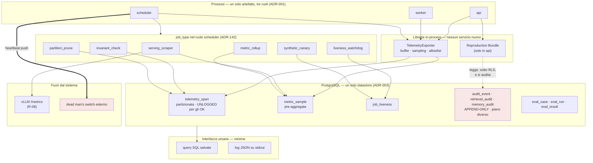

#### Come leggerlo

- **Zero servizi nuovi.** Tre ruoli di processo che esistono già (`ADR-001`), sei
  `job_type` in più dentro lo `scheduler` che esiste già (`ADR-142` ne aveva già 8), due
  librerie in-process, cinque tabelle. Niente Collector, niente Prometheus, niente
  Grafana, niente broker.
- **I due riquadri rossi sono i due confini che non si attraversano.** L'audit è nello
  stesso database ma in un piano diverso, e il `Reproduction Bundle` lo **legge**
  lasciando traccia. Il dead man's switch è **fuori**, ed è l'unica dipendenza esterna
  che questa architettura si concede — perché §13.2 dimostra che non può essere interna.
- **`serving_scraper` è l'unico che parla con un altro processo**, e legge solo
  metriche. `AR-EV-12` vale: nessun job chiama il modello.

### 24.2 La tabella delle quattro fasi

| Capacità | **Day-1** | **Prepare** (costruito ma spento / preparato) | **Scale** (quando il volume lo impone) | **Enterprise** (quando lo impone un contratto) |
|---|---|---|---|---|
| logging strutturato | JSON su stdout, schema chiuso | livello `DEBUG` per componente, a tempo | Loki o simile (`T-OB-02`) | retention per tenant, export |
| metriche | `metric_sample` pre-aggregate, registro in CI | rollup lungo (≥ 2 trimestri) | Prometheus + rollup per tenant (`T-OB-04`) | SLO per tenant, reportistica |
| tracing | `telemetry_span`, sampling misto | `span_kind = AGENT_DISPATCH` definito e mai emesso | Tempo/Jaeger (`T-OB-03`) | trace cross-region |
| audit | append-only, RLS, ruolo senza `UPDATE` | — | — | tamper evidence (`T-OB-09`), export (`DEF-08`, di `A16`/`C26`) |
| telemetria del modello | importata da vLLM | — | per replica | attribuzione dei costi |
| telemetria dei tool | completa | — | — | SLO per tool |
| telemetria del retrieval | completa + golden set | rinfresco dalla produzione | — | qualità per tenant |
| telemetria della memoria | completa | — | — | — |
| telemetria del workflow | = quella dello step | — | — | — |
| telemetria multi-agent | **colonne di lineage degeneri** | span di dispatch definito | — | — |
| dataset di evaluation | golden + regression + safety + workflow | adversarial (dopo `A13`) | generazione da produzione | per tenant, isolati |
| test di regressione | in CI, gate bloccanti deterministici | gate relativi dopo 3 baseline (`T-OB-07`) | matrice di versioni | firmati |
| LLM judge | **no** | triage offline, advisory | — | judge dedicato, se ci sarà una seconda GPU |
| evaluation umana | revisione campionaria dei fallimenti | interfaccia di annotazione | coda con priorità | annotatori esterni, contratti |
| evaluation in produzione | segnali online, mai verdetti | shadow mode di sola lettura | canary per versione (`T-OB-05`) | per tenant, con opt-in |
| SLO | disponibilità, latenza, `technical_completion_rate` | per tipo di compito (dopo `T-RT-02`) | error budget formale | **SLO per tenant, contrattuali** |
| alerting | 8 allarmi (§21.4) | procedure scritte | routing e turni | escalation contrattuale |
| anomaly detection | **no** | — | statistica (`T-OB-06`) | comportamentale, sicurezza |
| privacy | `INV-26` verificata in CI | `DebugCapture` costruita, spenta | — | cifratura per-tenant (`B-50`) |
| redaction | strutturale, non filtrante | per campo via `x-sensitivity` | — | conforme alla giurisdizione |
| retention | differenziata, partizioni staccabili | valori concreti da `A14` | tiering | per tenant, contrattuale |
| osservabilità distribuita | **no** | contratti pronti | Collector | multi-regione |
| reportistica enterprise | **no** | — | — | conformità, `C26` |

### 24.3 Cosa **non** si costruisce Day-1

Detto esplicitamente, perché è la parte che si viola per prima:

1. Nessun Collector, nessun Prometheus, nessun Grafana, nessun Jaeger, nessun
   Elasticsearch, nessun ClickHouse.
2. Nessuna piattaforma di AI observability.
3. **Nessun LLM-as-a-judge**, nemmeno per triage: il triage arriva quando c'è una coda
   da ordinare, e Day-1 non c'è.
4. Nessuna anomaly detection statistica.
5. Nessun canary di versione, nessun A/B test.
6. Nessun sistema di incident management, nessuna on-call rotation.
7. Nessun cruscotto per tenant istantaneo (§14.3).
8. Nessuna tamper evidence crittografica sull'audit.
9. **Nessuna cattura di prompt o risposte**, in nessuna forma, nemmeno "temporanea per
   il debug".
10. Nessun export di conformità (`DEF-08` è di `A16`/`C26`).

---

## 25. Threat model dell'osservabilità

L'osservabilità è un sistema che raccoglie tutto e lo tiene in un posto con controlli
più deboli del resto. È un bersaglio.

| Minaccia | Come si realizza | Difesa | Residuo |
|---|---|---|---|
| **fuga di telemetria** | qualcuno legge `telemetry_span` di un altro tenant | RLS (`AR-OB-17`), `INV-28`, `M-OB-79` | chi ha accesso diretto al database (`R-47`) |
| **fuga di prompt** | il prompt finisce in uno span o in un log | **`INV-26`** verificata in CI; il prompt **non esiste** in nessun archivio operativo | `DebugCapture`, che è autorizzata e auditata |
| **fuga di risposte** | idem | `INV-26`; si conserva `response_hash` | idem |
| **esposizione di PII** | un campo di dominio entra come attributo | allowlist degli attributi (`ADR-176`), `AR-OB-06` | un campo aggiunto all'allowlist per sbaglio → serve una code review sull'allowlist |
| **fuga di credenziali** | un token finisce in un log | **`INV-14`** (nessun `SecretMaterial` fuori da 2 moduli) + `AR-ID-33` + `INV-26` | |
| **telemetria cross-tenant** | un aggregato rivela l'attività di un cliente | **`ADR-186`**: due cruscotti separati per costruzione | aggregati con `n` piccolo → `B-79` |
| **iniezione di telemetria** (`R-72`) | un chiamante non autenticato invia un `traceparent` fabbricato, o un contenuto malevolo in un campo che finisce in un log | il `traceparent` si accetta **dopo** l'autenticazione (`AR-EV-17`); nessun campo di log è testo libero (`AR-OB-08`); nessun attributo viene da input non fidato senza essere un enum | un attributo numerico controllato dall'attaccante può alterare un aggregato → non produce esecuzione, solo rumore |
| **manomissione dell'audit** | qualcuno modifica righe | append-only applicato dal ruolo PostgreSQL | chi ha `root` (`R-47`); tamper evidence rinviata (`T-OB-09`) |
| **fuga del dataset di evaluation** (`R-73`) | il dataset contiene dati reali di un cliente e sta in repository | i fixture di eval sono **sintetici o anonimizzati**, in un tenant di test; `AR-OB-24` vieta di copiare dati di produzione in un dataset senza anonimizzazione | un caso derivato da un incidente reale **tende** a portarsi dietro dati reali: è il punto di attrito costante di §18.6 |
| **escalation via osservabilità** (`R-74`) | un `trace_id` o una metrica entrano in una decisione | **`INV-25`** e **`INV-27`**, verificati staticamente | |
| **osservabilità come canale di esfiltrazione** | un agent compromesso scrive dati in un attributo di span per farli uscire | l'agent **non emette telemetria**: la emettono i componenti (`AR-OB-01`), e gli attributi vengono da valori che il modello non controlla | un `tool_key` è scelto dal modello, ma viene da un elenco chiuso |

### 25.1 Il rischio nuovo più serio

> **`R-67` — La ricostruzione non copre i dati letti dal vivo.** `INV-07` e `ADR-067`
> impongono che il dato del CRM non si copi mai. Ne segue che il `ToolResult` di ieri
> non è ricostruibile: sappiamo **quale chiamata** è stata fatta, non **cosa ha
> risposto**. Nell'incidente tipico — *"l'agent ha agito su un dato sbagliato"* — è
> esattamente l'informazione che manca.
> **Probabilità: Alta. Impatto: Medio.**
> **Mitigazione parziale:** `result_hash` permette di dire *se* la risposta era diversa;
> l'identifier ledger (`INV-10`) permette di dire *quali* identificatori erano
> osservati. Insieme coprono il caso più frequente (identificatore sbagliato) e non
> coprono il caso più subdolo (valore sbagliato di un campo).
> **Non risolvibile senza violare `INV-07`.** Dichiarato, non risolto.

---

## 26. Backlog di ricerca aperto da questo documento

| ID | Cosa verificare | Perché serve |
|---|---|---|
| **`B-76`** | **Misurare** i byte per span e per riga di `metric_sample` con lo schema di §6.3, e il costo di scrittura sotto carico. È una **misura**, non ricerca bibliografica | regge tutto §14. Senza, il budget dell'osservabilità è una formula senza numeri |
| **`B-77`** | Evidenza primaria e misurata sui bias di **LLM-as-a-judge** (verbosity, position, self-preference) e sulla correlazione con annotatori umani **in domini strutturati** | regge `ADR-179`. Se la correlazione fosse alta nei domini strutturati, il triage potrebbe estendersi |
| **`B-78`** | Esiste evidenza sull'uso di un modello **piccolo e quantizzato** come judge di sé stesso? | specializza `B-77` al nostro vincolo di una GPU (`AS-08`) |
| **`B-79`** | Divulgazione statistica: quale `n` minimo rende sicuro un aggregato cross-tenant, e quali tecniche (soppressione, arrotondamento) sono difendibili | regge `ADR-186` quando serviranno aggregati cross-tenant su dimensioni di dominio |
| **`B-80`** | PostgreSQL come store di telemetria: costo reale di partizionamento giornaliero + `UNLOGGED` + `DETACH`/`DROP`, e interazione con RLS | regge `ADR-166`. Specializza `B-72` |
| **`B-81`** | Stato delle **OpenTelemetry GenAI semantic convention** per gli attributi di modello e tool, e mappatura verso i nostri `agentplat.*` | specializza `B-06`; serve per non rinominare tutto due volte |
| **`B-82`** | Dead man's switch: quali meccanismi esterni sono praticabili in un deployment on-premise **senza rete verso l'esterno** | regge §13.2, che oggi assume una rete in uscita. Dipende da `Q-03` |
| **`B-83`** | Dimensione minima di un golden set di retrieval perché una variazione di `recall_at_k` non sia rumore (calcolo di potenza) | regge `ADR-178`; è ciò che permette di scrivere un numero al posto di `NON ANCORA DECISO` |
| **`B-84`** | Costo di `render_working_set()` a ogni step su journal lunghi | regge `AS-22`. È una **misura**; si affianca a `B-38` |
| **`B-85`** | Esiste un modo di dichiarare l'idempotenza del **livello di telemetria** verso vLLM, cioè di correlare uno span nostro con una richiesta del serving in modo affidabile? | serve a unire i due trace senza affidarsi solo alla propagazione W3C, che con `llama.cpp` non c'è |

---

## 27. Conflitti dichiarati invece che risolti in silenzio

La convenzione impone di **non** risolvere in silenzio un conflitto con un documento
precedente. Ne ho trovati tre.

### 27.1 `AR-035` era una regola senza esecutore

`AR-035` dice: *ogni trigger di revisione ha una metrica che lo misura*. È stata
scritta in `A01` e nessuno l'ha applicata: undici documenti dopo, decine di trigger
erano senza metrica. Non è un conflitto di contenuto, è un **conflitto di
enforcement**.

**Risoluzione:** `ADR-176` la rende un test di CI. Da adesso, aggiungere un trigger
senza metrica **fallisce la build**. Il debito passato lo salda §4.

### 27.2 `T-GP-01` ha il denominatore sbagliato

`T-GP-01` dice: *le query del PIP superano il 30 % della latenza di uno step*. Ma la
latenza di uno step è dominata dalla chiamata al modello, che dura ordini di grandezza
più delle query. Il rapporto misurato sarà quasi sempre trascurabile, e il trigger
**non scatterà mai** — non perché il PIP sia economico, ma perché il denominatore è
sbagliato.

**Conseguenza:** `AS-27` (*gli attributi di identità sono caricabili a ogni step senza
sfondare il budget di latenza*) resterebbe **infalsificabile**, e con essa il costo di
`ADR-106` (tetto congelato, autorità viva) resterebbe non verificato.

**Raccomandazione:** `M-OB-55` si misura come *tempo del PIP / tempo di step **al netto
dell'inference***. Il valore di soglia va rifissato di conseguenza, e resta `NON ANCORA
DECISO`. Questa è una **modifica alla formulazione di un trigger di `A03`**, e va
registrata in `ARCHITECTURE_STATE`, non solo qui.

### 27.3 `M-OB-01` richiede una modifica all'interfaccia di approvazione di `A03`

`T-GP-02` chiede il tasso di approvazione **senza modifiche**. Se l'endpoint
`POST /v1/approvals/{id}` accetta una decisione binaria, quella metrica non è
calcolabile e collassa su `approval_granted_rate`, che è un'altra cosa.

**Raccomandazione:** l'endpoint registra `decision` e `modified_fields[]` (**nomi** di
campo, mai valori — `AR-OB-05`). È un requisito su `A03`, non su `A12`, e senza di esso
`ADR-023` resta bloccato per sempre nonostante `A12` abbia fatto la sua parte.

---

## 28. Tentativo di dimostrare che questa architettura è sbagliata

Provo a demolirla sul serio. Ogni attacco, e la mia risposta — che a volte è "hai
ragione".

### 28.1 "PostgreSQL non regge la telemetria, e la porterà giù insieme a tutto il resto"

**L'attacco.** `R-04` dice che PostgreSQL fa già stato, coda, vector search e audit.
Aggiungere trace e metriche significa aggiungere il carico **più alto in scrittura** e
**meno importante** del sistema. Al primo picco, la telemetria riempirà il WAL, la
coda rallenterà, `M-OB-64` salirà, e qualcuno spegnerà la telemetria proprio mentre
serve.

**La mia risposta, parziale.** Le mitigazioni di §10.2 (pre-aggregazione,
partizionamento, `UNLOGGED` sugli span nominali, scrittura fuori dalla transazione)
sono reali, ma **non ho una misura**. `B-76` e `B-80` sono aperte.

**Cosa mi farebbe cambiare idea:** se `M-OB-84` mostrasse che la telemetria è oltre una
quota significativa delle scritture. → **`T-OB-03`**, ed è la mia previsione su quale
trigger di `A12` scatterà per primo (§31.3).

**Verdetto: l'attacco è serio e resta aperto.**

### 28.2 "Il golden set non verrà mai costruito, e `A12` è complice"

**L'attacco.** `R-30` ha probabilità **Alta**. `A12` risponde con `ADR-178` — un owner e
una scadenza — che è la stessa cosa che `A07` aveva già detto con `AR-KN-20`, e che non
è bastata. Aggiungere un ADR a un problema di volontà non lo risolve.

**La mia risposta.** Ha ragione, e non ho una difesa tecnica. L'unica cosa che ho
aggiunto e che potrebbe funzionare è **spostare il golden set prima** dell'attivazione
del retrieval in produzione, invece che dopo — perché un lavoro che blocca il rilascio
si fa, e uno che non lo blocca no. È una leva di processo, ed è debole.

**Cosa mi farebbe cambiare idea:** niente. Se fra tre mesi il golden set non esiste,
`ADR-003` resta non falsificabile e questa architettura ha fallito su un punto che
conosceva in anticipo.

**Verdetto: l'attacco è corretto. La mitigazione è debole e lo dichiaro.**

### 28.3 "Ricostruire il prompt non funzionerà, e ve ne accorgerete tardi"

**L'attacco.** La ricostruzione (§12.2) presuppone che `render_working_set()` sia
stabile nel tempo. Ma è codice, e il codice cambia. Alla prima modifica, tutti i run
precedenti diventano non ricostruibili — e ve ne accorgerete solo quando servirà
ricostruirne uno.

**La mia risposta.** L'attacco è giusto, e il difetto è **rilevabile**: il
`Reproduction Bundle` verifica gli hash e restituisce `HASH_MISMATCH` (§12.3). Ma
rilevarlo non è ripararlo. La mitigazione vera sarebbe versionare
`render_working_set()` e conservare le versioni vecchie eseguibili — cosa che
`ADR-051` (`build_id` registrato) rende **possibile** ma che nessuno ha promesso di
fare.

**Registrato come `AS-43`**, confidenza Media: *il renderer del working set cambia
raramente, e quando cambia le versioni precedenti restano eseguibili*. Se è falsa, il
debugging retrospettivo si degrada a "quello che c'è nel journal", che è comunque
molto, ma non è il prompt.

**Verdetto: l'attacco è corretto. Il difetto è rilevabile ma non riparato.**

### 28.4 "Avete progettato un'evaluation che nessuno eseguirà"

**L'attacco.** Scrivere post-condizioni (`ADR-177`) costa molto più che incollare
output attesi. Un team di 1-3 persone (`AS-04`) non lo farà, o lo farà per i primi
cinque casi. Il risultato: un framework di evaluation con dodici casi che passano
sempre, e la sensazione di essere coperti.

**La mia risposta.** È il rischio `R-70`, ed è reale. Le due mitigazioni: (a) il caso
minimo accettabile è **piccolo** — input, fixture, una post-condizione (§18.6); (b) i
gate bloccanti Day-1 (§18.7) sono tutti **deterministici e generici**: autorizzazione,
isolamento, recovery, invarianti. Non richiedono di scrivere un caso per ogni compito,
si scrivono una volta e valgono per tutti.

**Verdetto: l'attacco è parzialmente corretto, e l'architettura è disegnata per
degradare bene** — se i casi specifici non vengono scritti, i gate generici reggono
comunque il minimo.

### 28.5 "Rifiutando la piattaforma di AI observability state costruendo a mano un
prodotto"

**L'attacco.** §23.1 rifiuta l'opzione D per motivi di privacy. Ma le piattaforme
moderne offrono deployment self-hosted e configurazione della redaction. State
riscrivendo pipeline di eval, versionamento di dataset e interfacce di annotazione con
tre persone, per una purezza che si poteva ottenere configurando.

**La mia risposta.** In parte ha ragione, e l'ho scritto in §23.1. Ma il punto non è la
purezza: è che quelle piattaforme sono **progettate attorno** al contenuto. Con il
contenuto tolto, ne resta il 20 %, e quel 20 % non vale il costo di un'integrazione, di
una dipendenza e di un vendor. La configurazione di redaction, poi, è **filtrante**, e
§12.7 spiega perché una difesa filtrante non può essere la difesa primaria.

**Verdetto: l'attacco è serio, la risposta regge, ma andrà riconsiderato** se un giorno
esisterà una piattaforma progettata per lavorare su riferimenti invece che su
contenuto. → `T-OB-01` in senso ampio.

### 28.6 Le domande di rottura, con la risposta

| Cosa la rompe | Risposta |
|---|---|
| **quale volume di traffico?** | `NON ANCORA DECISO` — dipende da `B-76`/`B-80`. Il **primo** a cedere sarà `metric_sample` per contesa in scrittura, non `telemetry_span`, perché le metriche si scrivono a ogni finestra indipendentemente dal traffico |
| **quale volume di trace?** | non esiste un run che genera trace illimitati (`ADR-104` → ≤ 252 span). Cede il **numero di run**, non il singolo run |
| **quanti tenant?** | il punto di rottura è `ADR-186`: con molti tenant, un cruscotto di piattaforma senza disaggregazione diventa inutile per diagnosticare. **Direi decine, non centinaia** — e questa è un'inferenza, non una misura |
| **quanti agent?** | `R-53`: la frammentazione del prefix cache è il primo effetto, e non è un problema di osservabilità ma di inference. Per la telemetria, `agent_version_id` è una label a bassa cardinalità: regge |
| **quale dimensione del dataset di evaluation?** | l'esecuzione della suite occupa la GPU. Con `AS-08` (una GPU) la suite compete con la produzione: cede quando **non entra più in una finestra notturna**. È il vincolo pratico, e arriva prima di qualunque limite di storage |
| **quale requisito di retention?** | una retention lunga sugli **span** rompe subito il partizionamento su una macchina sola. Una retention lunga sull'**audit** non è un problema di `A12`: è `A14` |
| **quale complessità di incidente?** | un incidente che coinvolge **più tenant e più versioni contemporaneamente** rompe l'indagine, perché il cruscotto di piattaforma non disaggrega e quello di tenant non aggrega. È il buco di `ADR-186`, e la via d'uscita è l'elevazione dichiarata |
| **quale requisito multi-regione?** | rompe tutto: PostgreSQL unico (`ADR-003`) è l'assunzione di partenza. Non è un limite dell'osservabilità, è il limite dell'architettura, e vive in `A15`/`Q-03` |

---

## 29. Autocritica

Le venti domande del prompt, con risposte oneste.

1. **Ho distinto log, metriche e trace?** Sì, §3, e la distinzione ha conseguenze
   (retention, sampling, storage) invece di essere solo terminologica.
2. **Ho distinto observability da audit?** Sì, ed è la parte di cui sono più
   convinto: `INV-27` la rende strutturale.
3. **Ho distinto monitoring da evaluation?** Sì. Il punto in cui si toccano —
   `M-OB-60` misurabile solo sul set di eval, con proxy in produzione — è dichiarato.
4. **Posso ricostruire una decisione dell'agent?** L'**input** sì (§12.2). Il
   ragionamento no, e §4.10 spiega perché non è una lacuna ma una proprietà.
5. **Posso tracciare le chiamate ai tool?** Sì, e il caso duro (`SIDE_EFFECT`
   interrotto) è coperto da `idempotency_key` + `state` + external ID.
6. **Il retrieval?** Sì per struttura e metriche. **No per il testo**, per scelta.
7. **La memoria?** Sì per identificatori. No per contenuto.
8. **Le chiamate multi-agent?** Day-1 non esistono. La struttura è pronta e degenere.
9. **L'esecuzione del workflow?** Sì: coincide con lo step.
10. **Le versioni di modello/prompt/tool sono catturate?** Sì, ed è la parte più
    solida, perché non l'ho costruita io: viene da `ADR-012`, `ADR-041`, `AR-TL-08`.
11. **I difetti di produzione possono diventare test di regressione?** Sì (§18.6). Ma
    dipende da una persona, e l'ho registrato come `R-70`.
12. **Ho evitato di trattare l'LLM judge come verità?** Sì, e in modo strutturale
    (`ADR-179`, due colonne distinte). Ma `B-77` è aperta e la decisione è
    conservativa **per ignoranza**, non per evidenza.
13. **Ho affrontato la contaminazione?** Sì (§18.5). La forma che mi preoccupa —
    l'evaluator overfitting — ha solo una difesa di processo.
14. **Ho affrontato la privacy?** Sì, ed è il punto di forza: `INV-26` è verificabile.
15. **Ho impedito la fuga cross-tenant?** Strutturalmente sì (RLS, `INV-28`,
    `ADR-186`). Il residuo `R-48` (accesso diretto al database) resta, come già
    dichiarato in `A09`.
16. **Day-1 è davvero semplice?** Zero servizi nuovi, sei `job_type`, due librerie,
    cinque tabelle. **Ma l'evaluation non è semplice**: §18 è la parte più costosa del
    documento, e non ho trovato un modo di renderla più piccola senza renderla inutile.
17. **Può scalare per gradi?** Sì, e i gradini hanno un trigger ciascuno.
18. **I backend sono sostituibili?** Sì, per il contratto OTel. Le **query** dei
    cruscotti no: quelle si riscrivono. Costo dichiarato.
19. **Le metriche di qualità sono davvero misurabili?** **La maggior parte sì, e 5 no**
    — e le ho elencate in §4.10 invece di annacquarle. Questo è il punto su cui
    voglio essere giudicato.
20. **Quali assunzioni possono invalidare l'architettura?** `AS-38` (il volume di
    telemetria sta in PostgreSQL), `AS-40` (le post-condizioni deterministiche coprono
    i compiti CRM), `AS-42` (la disciplina del failure corpus), `AS-43` (il renderer è
    stabile). Le prime due sono tecniche e misurabili; le altre due sono **sociali**, e
    sono quelle che di solito rompono i sistemi.

### 29.1 Le tre cose di cui sono meno convinto

1. **`UNLOGGED` sugli span nominali** (§10.2). Perdere la telemetria proprio dopo un
   crash del database è il difetto peggiore che una decisione possa avere.
   L'attenuazione (errori su tabelle `LOGGED`) copre il caso più importante ma non è
   elegante, e sospetto che si rivelerà sbagliata.
2. **Il rifiuto del canary di versione** (§18.8). L'argomento — non c'è
   significatività con `AS-01` — è corretto oggi. Ma significa che ogni nuova
   `AgentVersion` va in produzione **al 100 % o per niente**, e questa è una posizione
   scomoda per un sistema che agisce su un CRM.
3. **86 metriche.** Sono molte. Ho preferito la completezza rispetto al debito, ma il
   rischio è che nessuno le guardi e che il registro diventi un cimitero. La difesa —
   solo 8 producono allarmi, le altre si guardano in revisione — è ragionevole e non è
   provata.

### 29.2 Il debito che lascio

- Le **soglie numeriche** sono quasi tutte `NON ANCORA DECISO`, con il criterio
  dichiarato. È corretto (`Q-01`…`Q-04` aperte), ed è comunque debito.
- **`DEF-05`** (soglie di capacità) è di `B21` e **non l'ho chiusa**. **`DEF-06`**
  (RPO/RTO) è di `C24` e **non l'ho chiusa**. **`DEF-08`** (export di audit) è di
  `A16`/`C26` e **non l'ho chiusa**.
- **Nessuna ricerca esterna**: 10 voci di backlog nuove (`B-76`…`B-85`) sono il prezzo,
  e `B-77` (bias dei judge) è quella che pesa di più su una decisione già presa.
- **`AR-OB-*` con verifica automatica: 17 su 24.** Le sette `REVIEWED` (`AR-OB-02`,
  `-09`, `-13`, `-18`, `-20`, `-21`, `-23`) contano come debito al gate di Level A.
  Il rapporto è buono ma non ai livelli di `A09`/`A11`, e il motivo è che diverse
  regole di `A12` sono **di processo** e non di codice.

---

## 30. Registri delle decisioni nuove

### 30.1 ADR — da `ADR-164`

| ADR | Titolo | Decisione | Reversibilità | Stato |
|---|---|---|---|---|
| `ADR-164` | Tre piani di segnale separati | Telemetria operativa, audit legale, evaluation di giudizio: tre sistemi, tre garanzie, correlati **solo** per identificatore. Mai fusi | Costosa | Accettata |
| `ADR-165` | OpenTelemetry come **contratto**, non come stack | SDK e semantic convention sì; Collector e backend dedicato no Day-1 | Facile | Accettata |
| `ADR-166` | Telemetria su PostgreSQL Day-1 | `telemetry_span` + `metric_sample`. Niente Prometheus/Jaeger/ClickHouse | Moderata | Accettata (confidenza **Media** finché `B-76`/`B-80` sono aperte) |
| `ADR-167` | Gerarchia a cinque livelli; `PDP`, memoria e render **non sono span** | `RUN_TREE → RUN → STEP → operazione esterna → chiamata di rete`. Alla ripresa si apre un **nuovo trace** con `link` | Moderata | Accettata |
| `ADR-168` | Nessun identificatore nuovo | `trace_id`/`span_id` per correlazione; gli identificatori di stato esistono già. Rifiutati `session_id`, `execution_id`, `task_id`, `tool_call_id`, `model_invocation_id`, `retrieval_id`, `memory_access_id` | Facile | Accettata |
| `ADR-169` | Il trace HTTP e il trace di esecuzione sono **separati** | Legati da uno span link e da `initiating_trace_id`, mai da parentela. Conseguenza di `AR-002` | Facile | Accettata |
| `ADR-170` | Difesa **strutturale**, non filtrante | Il contenuto non entra (`INV-26`). La redaction è seconda linea, deterministica, per campo, mai da LLM | Costosa | Accettata |
| `ADR-171` | **Il prompt non si conserva, si ricostruisce** | `Reproduction Bundle`: modulo in-process che ri-renderizza il prompt dagli artefatti versionati, sotto RLS, con audit. Non rigenera l'output (`ADR-042`) | Moderata | Accettata |
| `ADR-172` | `DebugCapture` come unica porta al contenuto | Opt-in del tenant, a tempo, con perimetro, autorizzata dal PDP, auditata, retention propria, visibile mentre è attiva. **Off by default** | Moderata | Accettata |
| `ADR-173` | Sampling misto guidato dall'esito dello step | Head-based sui `READ` nominali, tail-based su tutto il resto. Otto classi **mai** campionate (`AR-OB-16`) | Facile | Accettata |
| `ADR-174` | Budget di cardinalità; `run_id` e `tenant_id` **non** sono label | Le viste per tenant si calcolano per query | Moderata | Accettata |
| `ADR-175` | Schema di log chiuso, nessun campo di testo libero | `event` è un enum; niente `message` | Facile | Accettata |
| `ADR-176` | Registro `M-OB-*` come artefatto verificato in CI | Tre verifiche: ogni trigger ha una metrica (**`AR-035` eseguibile**), ogni metrica è registrata, nessuna label vietata | Facile | Accettata |
| `ADR-177` | Evaluation **orientata all'esito**: post-condizioni e vincoli | Mai output attesi, mai trajectory matching. Coerente con `R-11` | Costosa (i dataset) | Accettata |
| `ADR-178` | Golden set del retrieval come artefatto Day-1 con owner e scadenza | Precede l'attivazione del retrieval in produzione. `N` = `NON ANCORA DECISO`, criterio dichiarato (`B-83`) | **Effettivamente irreversibile** (è conoscenza) | Accettata |
| `ADR-179` | LLM-as-a-judge **solo triage**, mai gate | Offline, advisory **nel tipo**, con quota casuale della coda, e concordanza umana misurata | Facile | Accettata (confidenza **Bassa** finché `B-77` è aperta) |
| `ADR-180` | Gate bloccanti deterministici, gate di qualità advisory | Le soglie di qualità si fissano **relative alla baseline**, dopo tre rilasci misurati (`T-OB-07`) | Facile | Accettata |
| `ADR-181` | `task_success_rate` **non è un SLO** | Al suo posto: `technical_completion_rate` (SLO), `eval_task_success_rate` (gate), segnali online (indicatori) | Facile | Accettata |
| `ADR-182` | Canary sintetico + dead man's switch a tre livelli | Canary come `job_type` nel tenant di sistema, senza `SIDE_EFFECT`, su corpus dedicato. L'ultimo anello è **esterno al sistema** | Facile | Accettata |
| `ADR-183` | Nessun esperimento in produzione su percorsi con effetti | Solo offline, shadow di sola lettura, o opt-in del tenant | Facile | Accettata |
| `ADR-184` | Retention differenziata per piano di segnale | Rollup delle metriche **≥ 2 trimestri**, altrimenti `T-MD-08` è morto | Facile | Accettata (valori `NON ANCORA DECISO`) |
| `ADR-185` | Ogni incidente produce un `EvaluationCase` | La chiusura dell'incidente **richiede** che il caso esista | Facile (di processo) | Accettata |
| `ADR-186` | Due cruscotti: piattaforma e tenant | Il cruscotto di piattaforma non porta dimensioni derivate dall'attività di un tenant | Moderata | Accettata |
| `ADR-187` | Una sola tassonomia di errori, non nuova | `A12` adotta quella di `A04`/`A06`/`A11` come unico enum `error_class`. Più: **`T-GP-01` va rifissata al netto dell'inference** (§27.2) | Facile | Accettata |

### 30.2 Regole architetturali `AR-OB-01` … `AR-OB-24`

| ID | Regola | Verifica |
|---|---|---|
| `AR-OB-01` | Emette telemetria chi **possiede** il dato. Nessun osservatore esterno legge lo stato altrui | statica |
| `AR-OB-02` | Nessuna richiesta di conformità o contestazione si soddisfa con una query sulla telemetria | **REVIEWED** |
| `AR-OB-03` | Nessuna scrittura di telemetria avviene dentro la transazione di uno step durevole | statica |
| `AR-OB-04` | Lista di label vietate su ogni metrica: `run_id`, `tenant_id`, `subject_id`, `trace_id`, `span_id`, qualunque campo di dominio | CI (`ADR-176`) |
| `AR-OB-05` | Un'approvazione registra i **nomi** dei campi modificati, mai i valori | statica |
| `AR-OB-06` | Gli attributi di span vengono da una **allowlist** chiusa. Ammessi i **nomi** di campo di schema, mai i valori | CI |
| `AR-OB-07` | Ogni span `STEP` corrisponde a una riga `run_step`. Uno span di step senza riga di journal è un **errore**, non un dato | query periodica |
| `AR-OB-08` | Nessun campo di log è testo libero. `event` è un enum | CI |
| `AR-OB-09` | `DEBUG` è spento in produzione, attivabile per `(component, tenant, durata)` con **spegnimento automatico**, e non può mai contenere contenuto | **REVIEWED** |
| `AR-OB-10` | Nessuna metrica è emessa se non esiste nel registro con le label dichiarate | CI |
| `AR-OB-11` | Nessun identificatore di correlazione nuovo oltre a `trace_id`/`span_id` | statica |
| `AR-OB-12` | Nessun allarme dipende da una metrica disponibile in un solo profilo di serving | revisione + CI sul registro |
| `AR-OB-13` | La `max_staleness` di un consumatore è sempre **più corta** della soglia oltre la quale il suo ritardo produce una conseguenza per l'utente | **REVIEWED** |
| `AR-OB-14` | La violazione di una guardia di invariante è un **evento di errore**, non un alert su soglia | statica |
| `AR-OB-15` | La telemetria può essere scartata, **mai in silenzio**: ogni scarto incrementa `M-OB-76` | statica |
| `AR-OB-16` | Nessuna configurazione di sampling può portare sotto il 100 % le otto classi di §14.5. Applicato nel codice, non in configurazione | statica |
| `AR-OB-17` | `telemetry_span` e `metric_sample` hanno `tenant_id` non nullo e RLS attiva | schema |
| `AR-OB-18` | Il `Reproduction Bundle` non bypassa mai la RLS e scrive la propria riga di audit **prima** di restituire | **REVIEWED** |
| `AR-OB-19` | Un esito prodotto da un LLM judge è marcato `advisory` **nel tipo** e non entra in nessun gate | statica |
| `AR-OB-20` | I dataset di evaluation sono file versionati in repository, e la loro modifica passa da una review | **REVIEWED** |
| `AR-OB-21` | Il failure corpus si divide in *train* e *holdout* alla creazione del caso; l'holdout non entra mai in un fine-tuning | **REVIEWED** |
| `AR-OB-22` | Nessun error budget su isolamento fra tenant, decisioni di autorizzazione, `SIDE_EFFECT` non autorizzati, contenuto in archivi operativi | statica (sono guardie) |
| `AR-OB-23` | Un allarme esiste solo se corrisponde a un sintomo, ha una procedura e ha un tasso atteso basso | **REVIEWED** |
| `AR-OB-24` | Nessun dato di produzione entra in un dataset di evaluation senza anonimizzazione dichiarata | **REVIEWED** |

**Debito: 17 su 24 con verifica automatica.** Le sette `REVIEWED` contano al gate di
Level A.

### 30.3 Invarianti nuovi

| ID | Invariante |
|---|---|
| **`INV-25`** | Nessuna funzione del PDP, del PIP o del PEP legge `trace_id`, `span_id`, `traceparent`, `tracestate` o qualunque campo di telemetria. Verificato staticamente. *Rende `AR-ID-02` strutturale, nella forma di `INV-12` e `INV-19`* |
| **`INV-26`** | Nessun record di telemetria contiene testo di dominio, prompt, risposta del modello, `value_text`, contenuto di documento, argomento di tool, valore di campo del CRM o materiale crittografico. Solo identificatori, hash, enum, numeri, timestamp e **nomi** di campo. Verificato dall'allowlist in CI |
| **`INV-27`** | Nessun controllo di sistema — autorizzazione, budget, retry, recovery, cancellazione, rilevamento di loop — dipende da una lettura di telemetria. Verificato staticamente. *È il confine audit/telemetria reso strutturale* |
| **`INV-28`** | Ogni lettura di telemetria avviene sotto un `tenant_id` risolto dall'identità autenticata; l'unica eccezione è il `PlatformOperator`, che accede a una vista senza dimensioni di dominio ed è auditato. `M-OB-79` deve valere zero |

### 30.4 Trigger `T-OB-*`

| ID | Condizione osservabile | Riapre | Verso |
|---|---|---|---|
| `T-OB-01` | l'exporter scritto in casa diventa fonte di difetti, **o** esiste una piattaforma progettata su riferimenti invece che su contenuto | `ADR-165` | OpenTelemetry Collector; rivalutare l'opzione D |
| `T-OB-02` | più di una macchina, **o** cercare nei log non è più praticabile | il backend dei log | Loki o simile |
| `T-OB-03` | `M-OB-84` mostra che la telemetria è una quota significativa delle scritture su PostgreSQL | **`ADR-166`** | backend di trace e metriche dedicato |
| `T-OB-04` | le query per tenant sui cruscotti diventano troppo lente | `ADR-174` | rollup per tenant su metriche scelte, poi backend dedicato |
| `T-OB-05` | il volume di run rende statisticamente significativa una frazione di traffico | `ADR-183` (in parte) | canary di versione |
| `T-OB-06` | il volume rende impraticabile guardare i grafici **e** le soglie fisse producono troppo rumore | la scelta di non fare anomaly detection | rilevamento statistico |
| `T-OB-07` | esistono **tre** baseline consecutive misurate per una metrica di qualità | `ADR-180` | i gate advisory diventano bloccanti in forma **relativa** |
| `T-OB-08` | `M-OB-86` `eval_dataset_age` oltre soglia, **o** i casi passano mentre la produzione peggiora | i dataset di evaluation | rinfresco da campioni di produzione |
| `T-OB-09` | requisito contrattuale di integrità dell'audit, **o** esiste un secondo luogo dove ancorare una catena di hash | il modello di audit | tamper evidence |
| `T-OB-10` | un guasto specifico di un tenant sfugge al canary di sistema | `ADR-182` | canary per tenant, con costo e consenso dichiarati |

### 30.5 Rischi nuovi

| ID | Rischio | Classe | Probabilità | Impatto | Mitigazione |
|---|---|---|---|---|---|
| **`R-67`** | **La ricostruzione non copre i dati letti dal vivo dal CRM**: sappiamo quale chiamata, non cosa ha risposto | Correctness | **Alta** | Medio | `result_hash` + identifier ledger (`INV-10`) coprono il caso "identificatore sbagliato", non "valore sbagliato". **Non risolvibile senza violare `INV-07`.** Dichiarato |
| `R-68` | Il sampling viene abbassato in emergenza e **non viene rialzato**; il sistema resta cieco senza che nessuno lo decida | Process | Media | Medio | `M-OB-77` `effective_sampling_rate` monitorata; `AR-OB-16` impedisce di scendere sulle otto classi critiche |
| `R-69` | Il registro delle metriche diverge dal codice e il test di CI viene disattivato: `AR-035` torna a non essere applicata | Process | Media | **Alto** | il test deve fallire con un messaggio che nomina **la decisione architetturale bloccata**, non con "registry mismatch" |
| **`R-70`** | **L'anello di feedback muore al passo umano**: nessuno analizza i difetti, nessun `EvaluationCase` nasce, il set invecchia | Process | **Alta** | Alto | `ADR-185` (la chiusura dell'incidente richiede il caso) + caso minimo piccolo. **Mitigazione debole, dichiarata in §28.4** |
| `R-71` | La revisione umana campionaria che sostituisce `M-OB-38` non viene fatta, e `ADR-094` resta chiuso per inerzia invece che per evidenza | Process | Media | Basso | è **il comportamento corretto** (`ADR-094` chiuso è la posizione conservativa). Il rischio è di non saperlo mai |
| `R-72` | **Iniezione di telemetria**: un chiamante inietta `traceparent` o valori che alterano aggregati | Security | Bassa | Basso | `AR-EV-17` (autenticare prima di correlare), `AR-OB-08`, enum ovunque |
| `R-73` | **Fuga del dataset di evaluation**: casi derivati da incidenti reali portano dati reali in repository | Security | Media | **Alto** | `AR-OB-24`; fixture sintetici; tenant di test. **Attrito costante con §18.6**, dove il caso reale è il più prezioso |
| `R-74` | Un identificatore di correlazione o una metrica entrano in una decisione | Security | Bassa | **Alto** | `INV-25` e `INV-27`, verificati staticamente |

### 30.6 Assunzioni nuove

| ID | Assunzione | Confidenza | Impatto se falsa | Validazione |
|---|---|---|---|---|
| `AS-38` | Il volume di telemetria Day-1 sta in PostgreSQL senza degradare il percorso di esecuzione | **Media** | `ADR-166` cade, serve un backend dedicato prima del previsto | **`B-76`, `B-80`**, `M-OB-84` |
| `AS-39` | Utenti e committente segnalano i difetti di esito abbastanza spesso da alimentare il failure corpus | **Bassa** | il ciclo di §18.6 gira a vuoto: i difetti esistono e non arrivano | tasso di segnalazioni nel primo trimestre |
| `AS-40` | Le post-condizioni deterministiche coprono la **maggior parte** dei compiti CRM | **Media** | `ADR-177` non basta e serve il giudizio umano su molti più casi di quanto un team di 1-3 persone possa fare | i primi 20 `EvaluationCase`: quanti hanno post-condizioni verificabili? |
| `AS-41` | Esiste una rete in uscita per il dead man's switch esterno | **Bassa** — dipende da `Q-03` | l'ultimo anello di §13.2 non esiste, e il regresso "chi guarda il guardiano" resta aperto | **`B-82`**; conferma sul modello di deployment |
| `AS-42` | Il team ha la disciplina di scrivere un `EvaluationCase` per ogni incidente | **Bassa** — condizione sociale, non tecnica | `ADR-185` diventa una regola che nessuno applica → `R-70` | osservazione dopo il primo trimestre |
| `AS-43` | `render_working_set()` cambia raramente, e quando cambia le versioni precedenti restano eseguibili | **Media** | la ricostruzione retrospettiva (§12.2) si degrada; `HASH_MISMATCH` diventa il caso normale | conteggio dei cambi al renderer nel primo trimestre |

---

## 31. FINAL OBSERVABILITY, EVALUATION & AI RELIABILITY ARCHITECTURE RECOMMENDATION

### 31.1 Cosa costruire davvero

**Telemetry model.** Tre piani separati (`ADR-164`): telemetria operativa, audit legale,
evaluation di giudizio. Correlati **solo** per identificatore. Il confine è strutturale,
non procedurale: `INV-27` vieta a qualunque controllo di leggere la telemetria, e
`AR-OB-02` vieta di soddisfare una richiesta di conformità con una sua query.

**Trace model.** OpenTelemetry come contratto (`ADR-165`), W3C Trace Context per la
propagazione. Cinque livelli (`ADR-167`): `RUN_TREE → RUN → STEP → operazione esterna →
chiamata di rete`. `PDP.decide()`, la lettura della memoria e `render_working_set()`
**non sono span**: sono attributi e istogrammi sullo step. Il trace della richiesta HTTP
è **separato** da quello dell'esecuzione (`ADR-169`), perché `AR-002` dice che `api` e
`worker` si parlano solo attraverso il database. Alla ripresa dopo un crash si apre un
nuovo trace con un link. Nessun identificatore nuovo (`ADR-168`).

**Logs.** JSON strutturato su stdout, schema chiuso, `event` come enum, **nessun campo
di testo libero** (`ADR-175`). `DEBUG` spento, attivabile a tempo e per componente.

**Metrics.** 86 metriche nel registro `M-OB-01` … `M-OB-86`, con budget di cardinalità
e label vietate (`ADR-174`). Il registro è un artefatto **verificato in CI**
(`ADR-176`), ed è ciò che rende `AR-035` eseguibile invece che sperata.

**Audit.** Non è di `A12`. `A12` ne dichiara il confine, aggiunge due categorie
(`DebugCapture` aperta, ricostruzione eseguita) e vieta a chiunque di usarne una al
posto dell'altra.

**Model observability.** Versioni, token, `stop_reason`, `schema_valid`, prefix cache;
le metriche di serving si **importano** da vLLM (`R-06`), non si reimplementano. Mai
prompt, mai risposte.

**Tool observability.** `tool_key`, versione, `build_id`, `idempotency_key`, `state` a
tre scritture, external ID di Odoo. Mai argomenti, mai risultati: `args_hash` e i
**nomi** dei campi che falliscono la validazione.

**Retrieval observability.** Candidati prima e dopo il pre-filtro (è ciò che rende
visibile `R-25`), latenza per fase, `chunk_id` e hash. Mai la query, mai il testo.

**Memory observability.** Conteggi, dimensioni, esiti. Mai `value_text`, e nemmeno la
`key` in chiaro (il suo vocabolario è senza criterio): `key_hash`.

**Workflow e multi-agent.** Coincidono con lo step. Le colonne di lineage esistono e
sono degeneri; lo span di dispatch è definito e mai emesso.

**Evaluation.** Orientata all'**esito** (`ADR-177`): post-condizioni verificabili e
vincoli, mai output attesi, mai confronto di traiettorie — coerente con `R-11` e con il
mandato di `A05`/`A17`. Sette livelli, **tutti deterministici**, perché nel dominio
CRM/ERP quasi tutto è verificabile contro uno stato. Il livello 6 (recovery, idempotenza,
cancellazione) è Day-1 e non negoziabile, perché `R-06b` dice che il recovery è il
rischio più concreto dell'architettura.

**Datasets.** Golden (retrieval) con owner e scadenza (`ADR-178`), regression, safety,
workflow. Versionati in repository, non in un database. Adversarial dopo `A13`.

**Regression testing.** Gate bloccanti **deterministici** (autorizzazione, isolamento,
recovery, invarianti, schema, capability probe); gate di qualità **advisory** finché
non esistono tre baseline (`ADR-180`, `T-OB-07`).

**LLM judges.** Solo triage, offline, advisory nel tipo, con quota casuale della coda
(`ADR-179`). Day-1 **nessuno**, perché sarebbe Qwen che giudica Qwen sulla nostra unica
GPU.

**Human evaluation.** Revisione campionaria dei fallimenti e delle proposte di memoria
(`M-OB-38`, l'unica metrica dichiarata non automatizzabile). È la parte che nessuna
infrastruttura sostituisce, ed è dove il ciclo può morire (`R-70`).

**Quality signals.** Correzioni, approvazioni non modificate, escalation, retry,
abbandono. Segnali, **mai verdetti**.

**Incident investigation.** Si parte da journal, audit, `retrieval_audit`,
`memory_audit` — tutte fonti complete e mai campionate. La telemetria accelera, non
fonda. Il passo decisivo è l'identifier ledger, che rende **deterministica** la domanda
"il modello ha inventato questo identificatore?" grazie a `INV-10`.

**Privacy.** `INV-26`: il contenuto non entra, e la verifica è un test di build, non una
revisione. Il prompt non si conserva, **si ricostruisce** (`ADR-171`). L'unica porta al
contenuto è `DebugCapture` (`ADR-172`): opt-in, a tempo, autorizzata, auditata, visibile.

**Retention.** Differenziata per piano (`ADR-184`). Rollup delle metriche ≥ 2 trimestri,
altrimenti `T-MD-08` è morto.

**Day-1 implementation.** Zero servizi nuovi: due librerie in-process, sei `job_type`
nello `scheduler`, cinque tabelle in PostgreSQL, e **un** dead man's switch esterno.

### 31.2 Cosa NON costruire il primo giorno

L'elenco di §24.3, e in particolare le tre cose che verranno chieste per prime:

1. **Nessuna cattura di prompt o risposte**, in nessuna forma, nemmeno "solo per
   questa settimana, solo per il debug". È la richiesta che arriverà per prima ed è
   quella a cui va detto no per prima.
2. **Nessun LLM-as-a-judge**, nemmeno per triage.
3. **Nessuno stack di observability** (Prometheus, Grafana, Jaeger, Loki, ClickHouse) e
   nessuna piattaforma di AI observability.

### 31.3 Quale condizione futura scatena la prossima evoluzione

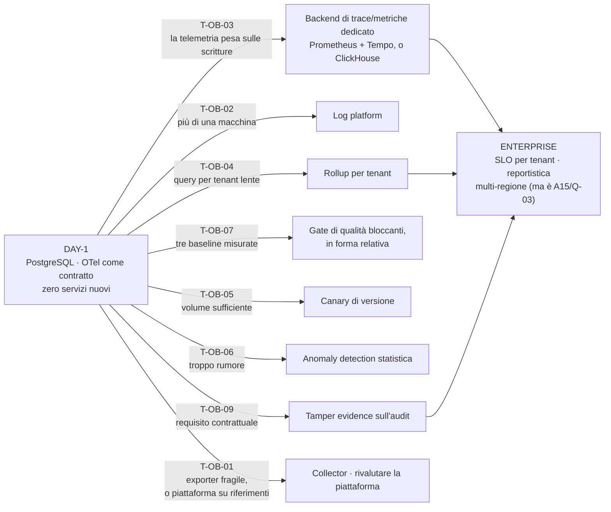

#### Come leggerlo

- **Otto trigger, otto direzioni diverse.** Non c'è "la fase 2": c'è un insieme di
  evoluzioni indipendenti, ciascuna con una condizione osservabile. È la forma che
  `AR-035` impone e che questo documento ha cercato di rispettare anche su sé stesso.
- **Nessuna freccia parte da "il volume è cresciuto" in generale.** Ogni trigger nomina
  una **metrica**.

> **PREVISIONE.** Il primo trigger di `A12` a scattare sarà **`T-OB-03`** — la
> telemetria che pesa sulle scritture di PostgreSQL — e **non per volume di traffico**,
> ma perché `metric_sample` scrive a ogni finestra **indipendentemente dal traffico**.
> Cioè il costo fisso arriverà prima del costo variabile. È una previsione falsificabile:
> se sbaglio, il primo sarà `T-OB-02` (log illeggibili) per ragioni di ergonomia, non
> di carico.
>
> Ma la previsione che conta di più non riguarda `A12`: `A11` prevede che il primo
> trigger dell'**intero sistema** sia `T-EV-03` (`uncertain_after_crash_rate`). `A12`
> gli fornisce la metrica (`M-OB-67`), e la fornisce **prima** del primo `SIDE_EFFECT`
> in produzione. Se quella previsione è giusta, `A12` avrà fatto la cosa più utile che
> gli era stata chiesta.

### 31.4 La risposta alla domanda del prompt, in una frase

> Costruiamo **una telemetria minima che non contiene mai contenuto e non decide mai
> niente**, appoggiata al database che già abbiamo; **un audit che resta separato e
> completo** perché è l'unica cosa che regge in tribunale; e **un'evaluation
> deterministica orientata all'esito**, che sfrutta il fatto raro e fortunato di
> lavorare in un dominio — CRM/ERP — dove quasi tutto ciò che conta si può verificare
> contro uno stato invece che giudicare.

---

## 32. Checkpoint di `A12`

| Campo | Contenuto |
|---|---|
| **PURPOSE** | rendere osservabili le decisioni che i documenti precedenti hanno dichiarato sbagliabili, senza che l'osservabilità diventi la porta da cui esce ciò che l'audit tiene fuori |
| **DEBITO SALDATO** | **63 metriche mandate da `A03`…`A11`, tutte coperte**; 1 confermata **non automatizzabile** (`M-OB-38`); 4 automatiche nell'esecuzione ma dipendenti da un golden set umano; **4 misure richieste dal prompt che ho rifiutato di automatizzare**, con il sostituto dichiarato. Registro totale: **86** voci `M-OB-*` |
| **CONFINE AUDIT/TELEMETRIA** | l'audit registra le decisioni che vincolano qualcuno, è completo e mai campionato, e la sua perdita è un difetto **legale**; la telemetria registra il comportamento, è campionabile e scartabile, e la sua perdita è un difetto **operativo**. `INV-27` lo rende strutturale |
| **DEBUGGING SENZA CONTENUTO** | **il prompt non si conserva, si ricostruisce** (`ADR-171`) dagli artefatti già versionati e hashati; unica porta al contenuto: `DebugCapture` (`ADR-172`), opt-in, a tempo, autorizzata, auditata |
| **KEY DECISIONS** | tre piani separati · OTel come contratto non come stack · PostgreSQL Day-1 · gerarchia a 5 livelli con `PDP` e memoria **non** span · trace HTTP separato dal trace di esecuzione · nessun identificatore nuovo · difesa strutturale invece che filtrante · sampling guidato dall'esito con 8 classi mai campionate · budget di cardinalità · registro delle metriche verificato in CI · evaluation orientata all'esito · golden set con owner e scadenza · judge solo triage · `task_success_rate` non è un SLO · canary + dead man's switch a tre livelli con l'ultimo anello **esterno** · due cruscotti separati |
| **REJECTED** | piattaforma di AI observability · Collector/Prometheus/Grafana/Jaeger/Loki/ClickHouse Day-1 · identificatori nuovi · span per ogni operazione · redaction come difesa primaria · LLM judge come gate · A/B test in produzione su percorsi con effetti · canary di versione Day-1 · anomaly detection statistica · error budget su sicurezza · `AuditEvent` come contratto di `A12` · tassonomia di errori nuova |
| **NEW CONSTRAINTS** | `AR-OB-01` … `AR-OB-24` (**17/24 automatiche**, 7 `REVIEWED`) |
| **NEW INVARIANTS** | `INV-25` (nessun campo di telemetria in una decisione) · `INV-26` (nessun contenuto in telemetria) · `INV-27` (nessun controllo dipende dalla telemetria) · `INV-28` (ogni lettura sotto `tenant_id` risolto) |
| **NEW RISKS** | `R-67` … `R-74`. Critici: **`R-67`** (la ricostruzione non copre i dati letti dal vivo — Alta, non risolvibile senza violare `INV-07`), **`R-70`** (l'anello di feedback muore al passo umano — Alta) |
| **NEW ASSUMPTIONS** | `AS-38` … `AS-43`. Le più fragili: **`AS-42`** (disciplina del failure corpus, sociale), **`AS-41`** (rete in uscita per il dead man's switch, dipende da `Q-03`), **`AS-39`** (gli utenti segnalano) |
| **NEW ADR** | `ADR-164` … `ADR-187` (24) |
| **NEW TRIGGERS** | `T-OB-01` … `T-OB-10` |
| **NEW RESEARCH BACKLOG** | `B-76` … `B-85` |
| **MAY NEED REVISION** | `ADR-166` (PostgreSQL come store) finché `B-76`/`B-80` sono aperte · `ADR-179` (judge) finché `B-77` è aperta · `UNLOGGED` sugli span (§29.1) · il rifiuto del canary di versione · `ADR-186` se serviranno aggregati cross-tenant (`B-79`) |
| **IMPACT ON PREVIOUS** | **`AR-035` diventa eseguibile** (`ADR-176`) · **conflitto dichiarato con `T-GP-01`**: il denominatore va preso al netto dell'inference, altrimenti il trigger non scatta mai e `AS-27` resta infalsificabile · **requisito nuovo su `A03`**: l'endpoint di approvazione deve registrare `modified_fields[]`, altrimenti `M-OB-01` non esiste e `ADR-023` resta bloccato · `ADR-104` acquista un beneficio non previsto: **rende il volume di trace limitato per costruzione** · nessun ADR precedente rivisto o contraddetto |
| **IMPACT ON FUTURE** | **`A13`**: dataset adversarial, `R-72`/`R-73`, e `B-01`/`B-25`/`B-42`/`B-60` da chiudere insieme · **`A14`**: retention dell'audit, anonimizzazione dei dataset, cancellazione per soggetto · **`A15`**: `job_type` nuovi nel deployment, dead man's switch esterno (dipende da `Q-03`) · **`A16`/`A17`**: i gate di §18.7 sono il contratto di rilascio; la suite di eval è agentica e orientata all'esito · **`B21`**: `DEF-05` riceve gli strumenti di misura, **non è chiusa qui** · **`C24`**: `DEF-06` **non è chiusa qui** · **`C26`**: `DEF-08` **non è chiusa qui** · `C29` (replay sul journal, mai riproducendo effetti) |
| **DAY-1** | `telemetry_span` + `metric_sample` + `job_liveness` + `eval_*` · `TelemetryExporter` e `Reproduction Bundle` in-process · 6 `job_type` nuovi · registro `M-OB-*` con test di CI · 8 allarmi · golden set etichettato · 4 test di recovery · dead man's switch esterno |
| **FUTURE** | backend dedicato · rollup per tenant · gate relativi · canary di versione · anomaly detection · tamper evidence · Collector |
| **CONFIDENCE** | **Alta** sul confine audit/telemetria, su `INV-25`…`INV-28`, sulla ricostruzione del prompt e sull'evaluation orientata all'esito — poggiano su invarianti interni già stabiliti e su `R-11`, non su fatti esterni non verificati. **Alta** anche sul tetto di trace per run, perché è **derivato** da `ADR-104` e non stimato. **Media** su `ADR-166` (PostgreSQL come store) finché `B-76`/`B-80` sono aperte, e sul sampling. **Bassa** su `ADR-179` (nessuna ricerca fatta sui bias dei judge, `B-77` aperta), sulla tenuta del ciclo di feedback umano (`R-70`, `AS-42`), e su tutte le soglie numeriche, che sono `NON ANCORA DECISO` per scelta. **Nessuna ricerca esterna, per vincolo: 10 voci di backlog nuove sono il prezzo** |

---

*Fine di `12_OBSERVABILITY_EVAL.md`.*

