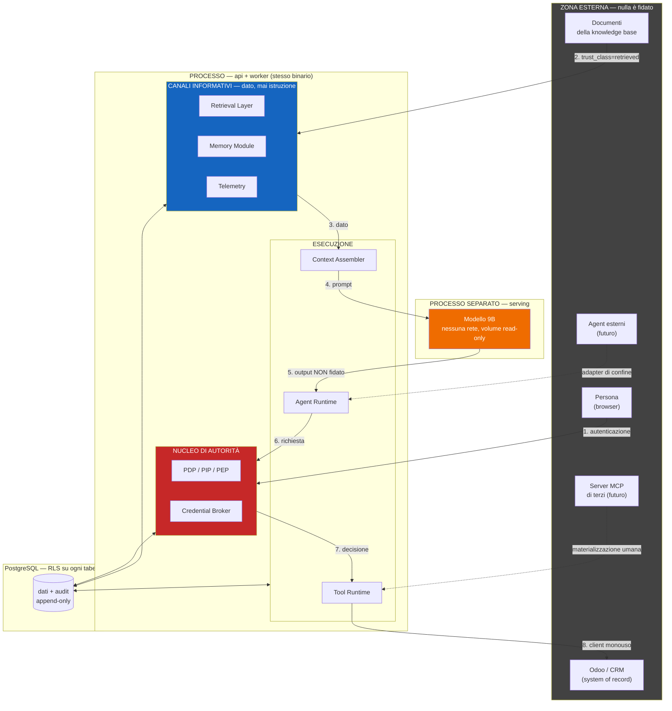
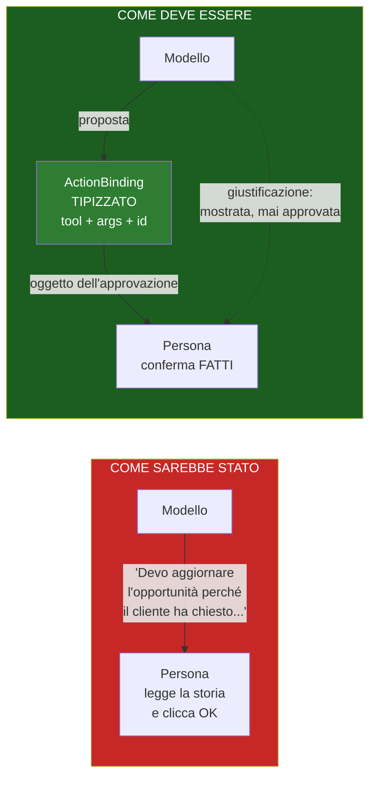
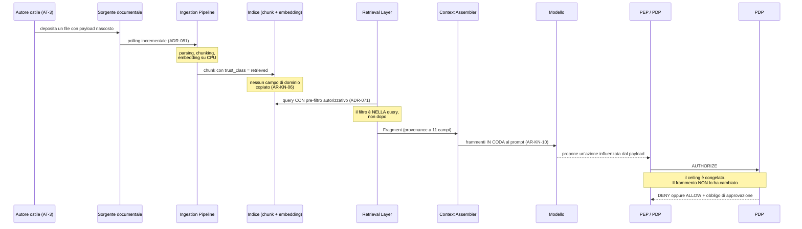
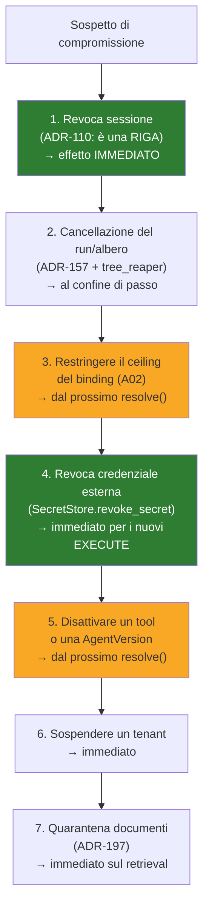

# 13 — SECURITY ARCHITECTURE

> Documento `A13` di Level A. Scritto dal thread principale, non delegato.
> Riferimenti obbligatori: `01_ARCHITECTURE_PRINCIPLES.md`, `02_CONTROL_PLANE.md`,
> `03_GOVERNANCE_POLICY.md`, `04_AGENT_RUNTIME.md`, `05_MODEL_INFERENCE.md`,
> `06_TOOL_ARCHITECTURE.md`, `07_KNOWLEDGE_DATA.md`, `08_MEMORY.md`,
> `09_IDENTITY_AUTHZ.md`, `10_AGENT_COMMUNICATION.md`, `11_EVENTING_WORKFLOW.md`,
> `12_OBSERVABILITY_EVAL.md`.

---

## 0. La risposta in mezza pagina

Questo documento non costruisce l'architettura di sicurezza. **La trova già costruita, la
verifica, e chiude l'unico buco che nessuno aveva visto.**

Dodici documenti hanno prodotto **28 invarianti** (`INV-01`…`INV-28`). Rileggendoli con gli
occhi di chi attacca, si scopre che non sono vincoli sparsi: sono **la** difesa. Quattro in
particolare hanno tutti la stessa forma, e quella forma è la tesi di sicurezza della
piattaforma:

| Invariante | Cosa vieta |
|---|---|
| `INV-12` | il PDP non legge mai la **memoria** |
| `INV-19` | il PDP non legge mai i **messaggi fra agent** |
| `INV-25` | il PDP non legge mai la **telemetria** |
| `INV-27` | nessun **controllo di sistema** dipende dalla telemetria |

Nessuno di questi prova a distinguere il contenuto buono da quello cattivo. **Tolgono il
potere invece di giudicare il contenuto.** È la sola difesa che regge contro un avversario
che scrive testo meglio di quanto noi sappiamo filtrarlo — e la ricerca (`R-13`) lo conferma
con un numero: i detector basati su LLM **mancano il 66 % delle voci di memoria avvelenate**,
perché il contenuto malevolo sembra benigno finché non lo si guarda insieme a una query
specifica.

**Il buco.** `ADR-023` impone approvazione umana su ogni azione con effetti. È il controllo
su cui poggiano `R-26` (documento avvelenato), `R-33` (memory poisoning) e metà delle
mitigazioni dell'architettura: ogni volta che un rischio non era risolvibile strutturalmente,
la risposta è stata *"c'è l'umano che approva"*. **`ASI09` — Human-Agent Trust Exploitation —
dice che quel controllo è esso stesso una superficie d'attacco**, e OWASP è esplicito: i
guardrail su input e output non bastano, serve una risposta **architetturale**.

Nessuno dei dodici documenti l'ha affrontato. `A13` lo fa, con sette decisioni (§10) di cui
la più importante è questa: **l'oggetto dell'approvazione non è più una narrazione, è un
`ActionBinding` tipizzato.** L'umano approva un fatto strutturato — quale tool, quali
argomenti, quali identificatori — e la giustificazione scritta dal modello è mostrata ma
**non è mai ciò che si approva**. Questo rende la *fake explainability* inefficace per
costruzione: una motivazione fabbricata non cambia i campi che vengono confermati.

**Il difetto trovato per strada.** `T-GP-02` — il trigger che avrebbe permesso di allentare
l'obbligo di approvazione quando il tasso di approvazione senza modifiche è alto —
**scatterebbe esattamente quando le approvazioni diventano prive di valore**. Un tasso vicino
al 100 % non è fiducia meritata: è la firma dell'approvazione riflessa. Il trigger va
riformulato (§10.6), altrimenti l'architettura si allenta proprio quando dovrebbe stringere.

**Cosa non risolviamo.** `R-26` e `R-41` restano non risolti strutturalmente Day-1, e lo
diciamo. Non esiste una difesa nota contro il goal hijack che sia strutturale come `INV-12`.
La contromisura è **contenimento**, non prevenzione: un agent compromesso deve poter fare
poco, essere visto presto, e fermato in fretta. §26 dice come.

---

## 1. Come leggere questo documento

Chi legge dovrebbe poter arrivare da zero. Tre convenzioni.

**Le sigle sono glossate alla prima occorrenza.** `ADR-023` (la decisione che impone
approvazione umana su ogni azione con effetti). `INV-12` (l'invariante che vieta al motore
delle autorizzazioni di leggere la memoria). `ASI09` (la voce OWASP sullo sfruttamento della
fiducia fra umano e agent). E così via.

**Tre etichette distinguono la natura di ogni affermazione.**

- **FATTO** — verificabile alla fonte. In questo documento i FATTI di sicurezza vengono da
  `R-07` e `R-13` nel research log, dove sono già citati con URL.
- **INFERENZA** — un ragionamento nostro a partire dai fatti. Può essere sbagliato.
- **DECISIONE ARCHITETTURALE** — una scelta, con alternative considerate e un
  contro-argomento onesto.

**Un'analogia che vale per tutto il documento.** Immagina un ufficio dove entra posta da
fuori. La posta può contenere richieste, e alcune richieste sono truffe. Ci sono due modi di
proteggersi. Il primo: assumere qualcuno che legga tutta la posta e riconosca le truffe.
Il secondo: fare in modo che **nessuna lettera, per quanto convincente, possa autorizzare un
bonifico** — i bonifici li autorizza solo il direttore, che non legge la posta.

Il primo modo è il filtro. Il secondo è l'invariante. Questa architettura sceglie il secondo
ovunque sia possibile, e dichiara apertamente dove non lo è.

---

## 2. Il principio centrale

Il prompt di questo documento lo dice in una riga, e la adottiamo senza attenuazioni:

> **L'output del modello è dato non fidato.**

Un LLM non è mai: un'autorità di sicurezza, un'autorità di autorizzazione, un policy engine,
un deposito di credenziali, un parser fidato, una sorgente fidata di istruzioni.

E per estensione, nessuna di queste cose è autorità:

| Sorgente | Perché non è autorità |
|---|---|
| output dell'agent | è output del modello con un altro nome |
| output di un tool | il tool esegue, non decide chi può |
| contenuto di un documento | lo ha scritto qualcuno che non controlliamo |
| contenuto della memoria | è testo che il modello ha scritto, che rientrerà nel prompt |
| output di un agent remoto | è il modello di qualcun altro |

**Dove questo principio è già applicato.** Non è una novità di `A13`. `INV-08` stabilisce che
un frammento recuperato, una memoria o un `AgentResult` sono **dato, mai istruzione**
(`trust_class = retrieved`). `AR-KN-03`, `AR-ME-06` e `AR-AC-12` lo impongono nel **tipo**:
non è una convenzione, è il compilatore.

**Dove `A13` lo estende.** Il principio ha una conseguenza che nessun documento aveva tratto
fino in fondo: **se l'output del modello non è autorità, allora non lo è nemmeno una
giustificazione scritta dal modello per ottenere un'approvazione.** È il punto da cui nasce
tutta la §10.

---

## 3. Cosa questo documento NON rifà

`A13` arriva ultimo fra i documenti di sicurezza sostanziale, e sarebbe un errore riprogettare
ciò che è già deciso. Inventario di ciò che è **già in piedi** e che qui viene solo verificato.

### 3.1 Le quattro difese strutturali

Già descritte in §0. Meritano un nome collettivo, perché sono la stessa idea applicata quattro
volte: **separazione fra ciò che informa e ciò che autorizza**.

| | Il canale | Chi non può leggerlo |
|---|---|---|
| `INV-12` | memoria a lungo termine | PDP, PIP, PEP |
| `INV-19` | `AgentTask` / `AgentResult` | PDP, PIP, PEP |
| `INV-25` | `trace_id`, `span_id`, telemetria | PDP, PIP, PEP |
| `INV-27` | telemetria | ogni controllo di sistema |

Tutte e quattro sono **verificate staticamente**: non sono regole scritte in un documento, sono
test che falliscono la build.

### 3.2 Il perimetro dei dati

- `INV-02`, `AR-017`, `AR-018` — `tenant_id` su ogni riga, RLS attiva.
- `INV-07` — nessun accesso **e nessuna copia** del dato CRM fuori dai tool. Esteso da `A07`
  da "nessun accesso" a "nessuna copia": vieta anche il CDC.
- `AR-KN-06` — nell'indice finiscono identificatori, mai campi di dominio.
- `INV-26` — nessun contenuto nella telemetria: solo identificatori, hash, enum, numeri,
  timestamp e **nomi** di campo.
- `INV-14` — nessun materiale crittografico fuori da due moduli.

### 3.3 Il perimetro dell'autorità

- `ADR-019` — l'autorità è l'**intersezione di cinque insiemi**.
- `ADR-105` — dual principal: `(actor = AgentRun, on_behalf_of = persona)`, autorità =
  intersezione, `on_behalf_of` mai vuoto.
- `INV-13` — l'autorità di un run **non cresce mai** dopo l'avvio.
- `INV-16`, `INV-17` — la stessa cosa estesa all'albero di run.
- `AR-ID-20` — esiste **un solo** punto che può concedere: il PDP. Tutti gli altri possono
  solo togliere.

### 3.4 Il perimetro dell'esecuzione

- `ADR-049` — niente SQL; nessun argomento di tool può essere un programma.
- `AR-TL-13`, `AR-TL-14` — nessun segreto al codice del tool; `tenant`, `principal`, `now`,
  `idempotency_key` sono **iniettati**.
- `ADR-108` — `Credential Broker`: il client autenticato vale per **un solo** `EXECUTE`.
- `INV-21` — nessun byte parte verso l'esterno senza una riga committata.
- `AR-EV-08` — il recovery non riesegue mai uno step non idempotente e non verificabile.

**INFERENZA.** Messe in fila, queste quaranta righe sono già un'architettura di sicurezza più
severa di quella di molti prodotti in produzione. Il contributo di `A13` non è aggiungere
controlli: è **verificare che reggano contro un avversario reale**, e chiudere ciò che manca.

---

## 4. Trust boundaries

Un *trust boundary* è una linea attraversata la quale un dato smette di essere fidato, o
un'entità smette di poter fare ciò che poteva. Disegnarle bene è metà del lavoro: la maggior
parte delle vulnerabilità reali nasce da un confine che qualcuno credeva ci fosse e non c'era.

### Come leggerlo

Il riquadro grigio in alto è tutto ciò che **non controlliamo**: la persona, i documenti che
ci vengono dati, il CRM, e in futuro server e agent altrui. Nulla che venga da lì è fidato.

Il riquadro rosso è il **nucleo di autorità**: è l'unico posto dove si decide chi può fare
cosa, e l'unico che tocca le credenziali. Le frecce blu — i canali informativi — **entrano**
nel processo ma non arrivano mai al riquadro rosso. Quella assenza di freccia è `INV-12`,
`INV-19` e `INV-25` disegnate.

Il riquadro arancione è il modello, in un **processo separato senza rete** e con il volume dei
pesi in sola lettura (`A05`). Il numero **5** è il punto più importante del diagramma: ciò che
esce dal modello è marcato non fidato e deve passare per il nucleo di autorità (**6**) prima
di diventare un'azione (**7**).

### 4.1 I confini, elencati

| # | Confine | Cosa cambia attraversandolo | Chi lo applica |
|---|---|---|---|
| TB-1 | rete → API | l'anonimo diventa un `HumanSubject` autenticato | modulo di autenticazione (`ADR-109`) |
| TB-2 | API → esecuzione | la richiesta acquista un `principal` **doppio** e un ceiling congelato | `resolve()` (`ADR-012`, `ADR-105`) |
| TB-3 | esecuzione → modello | il context diventa testo; **nulla che entri qui è istruzione**, tranne l'istruzione di sistema | `Context Assembler` (`AR-ME-15`) |
| TB-4 | modello → esecuzione | l'output diventa una **proposta**, non un'azione | `A04` (structured output a doppio anello) |
| TB-5 | esecuzione → autorizzazione | la proposta diventa una richiesta valutabile | PEP → PDP (`ADR-019`) |
| TB-6 | autorizzazione → tool | la decisione diventa un `EXECUTE` con client monouso | `Credential Broker` (`ADR-108`) |
| TB-7 | tool → sistema esterno | il nostro `principal` diventa una credenziale esterna | connector (`ADR-114`) |
| TB-8 | esterno → knowledge | un documento diventa `trust_class = retrieved` | ingestion (`AR-KN-03`) |
| TB-9 | esecuzione → memoria | una proposta diventa una memoria **solo con autorizzazione** | tool `memory_write` (`ADR-093`) |
| TB-10 | processo → database | ogni riga passa sotto RLS | PostgreSQL |
| TB-11 | esecuzione → telemetria | resta solo ciò che non è contenuto | allowlist (`INV-26`) |
| TB-12 | **agent → persona** | una proposta diventa una **richiesta di approvazione** | **§10 — è il confine che mancava** |

**INFERENZA.** `TB-12` non compariva in nessun documento precedente come confine di sicurezza.
Era trattato come interfaccia utente. `ASI09` dice che è un confine attraversato da un
attacco, e va progettato come tale.

### 4.2 Il confine che non esiste, e va detto

**FATTO (`R-13`).** Un container non è un confine di sicurezza forte contro un avversario che
esegue codice al suo interno. **DECISIONE ARCHITETTURALE (`ADR-136`, già presa da `A10`):**
Day-1 non c'è sandboxing fra i nostri agent, e il confine è il processo `worker`.

`A13` conferma la decisione e **ne dichiara il prezzo**: se un attaccante ottenesse esecuzione
di codice arbitrario dentro il `worker`, tutte le difese di questo documento cadrebbero in
blocco, perché sono applicate *da* quel processo. La difesa contro questo scenario non è
architetturale ma di superficie: **`ADR-049` e `AR-TL-02`** — nessun argomento di tool può
essere un programma, nessun tool esegue codice generato. Non c'è un interprete da attaccare
perché non c'è un interprete.

Trigger: al primo tool o agent **non nostro** eseguito nel nostro processo (`T-TL-03`,
`T-ID-06`, `T-AC-08`), il confine deve diventare un processo separato.

---

## 5. I principal di sicurezza

Chi sono gli attori che il sistema riconosce. `A09` li ha definiti; qui si guarda cosa
ciascuno può fare **se compromesso**.

| Principal | Cos'è | Se compromesso |
|---|---|---|
| `HumanSubject` | una persona, `subject_id` UUID opaco mai riassegnato (`ADR-107`) | l'attaccante ha i permessi di quella persona, non di più. Revoca: la sessione è una **riga** (`ADR-110`), quindi immediata |
| `AgentRun` | l'`actor` di ogni azione | **non ha autorità propria**: `ceiling ∩ on_behalf_of`. Un run compromesso non può superare la persona per cui lavora |
| `ServicePrincipal` | identità non umana per esecuzioni automatiche | il caso peggiore: nessuna persona dietro. Per questo `ADR-148` vieta che un evento avvii un run, e `T-EV-06` è il trigger che lo riaprirebbe |
| `PlatformOperator` | chi opera la piattaforma | `ADR-118`: non legge i dati dei tenant. Difesa **procedurale e di rilevabilità**, non crittografica → `R-48` |
| `Tool` | non è un principal | riceve un client già autenticato, non sceglie mai chi è (`AR-TL-14`) |
| il **modello** | **non è un principal** | è una funzione. Non ha identità, non ha permessi, non compare in nessuna decisione |

**INFERENZA — perché il modello non è un principal.** È una scelta che si paga in
espressività e si guadagna in sicurezza. Se il modello fosse un principal, avrebbe permessi
propri, e la domanda "cosa può fare l'agent?" avrebbe una risposta diversa da "cosa può fare
la persona per cui lavora". `ADR-105` chiude quella porta: l'autorità è un'intersezione, e
un'intersezione non può essere più grande dei suoi membri.

---

## 6. Asset inventory

Cosa vale la pena difendere, ordinato per **conseguenza della perdita**, non per volume.

| # | Asset | Perché vale | Perdita di riservatezza | Perdita di integrità | Perdita di disponibilità |
|---|---|---|---|---|---|
| A-01 | **Credenziali verso il CRM** | danno l'accesso a tutto il dato aziendale | catastrofica | catastrofica | il sistema si ferma |
| A-02 | **Chiave master del secret store** | apre A-01 | catastrofica | catastrofica | il sistema si ferma |
| A-03 | **Audit append-only** | è l'artefatto **legale** | alta | **catastrofica**: un audit alterato è peggio di nessun audit | alta |
| A-04 | **Identità e mappature** (`subject_id`, `EXTERNAL_IDENTITY_LINK`) | una mappatura sbagliata dà i permessi di un'altra persona | media | **catastrofica** (§14) | il sistema si ferma |
| A-05 | **Policy e ruoli** | definiscono chi può cosa | media | catastrofica | il sistema si ferma (fail closed) |
| A-06 | **Dato di dominio nel CRM** | è il patrimonio del cliente | alta | alta | non nostra (è di Odoo) |
| A-07 | **Documenti indicizzati e loro ACL** | contengono il sapere aziendale | alta | media | media |
| A-08 | **Memoria a lungo termine** | **non è ricostruibile** (a differenza della knowledge) | media | alta (`R-33`) | media |
| A-09 | **Journal dei run** | è la base del recovery e della ricostruzione | media | alta | alta |
| A-10 | **Prompt di sistema e versioni** | definiscono il comportamento | bassa | alta | media |
| A-11 | **Pesi del modello** | costo di riacquisizione, non segretezza | bassa | media | media |
| A-12 | **Dataset di evaluation** | contengono casi derivati da incidenti reali → `R-73` | **alta** | media | bassa |
| A-13 | **Telemetria** | operativa, non legale | bassa (per `INV-26`) | bassa | bassa |
| A-14 | **Codice e dipendenze** | la supply chain è un vettore (`ASI04`) | bassa | catastrofica | alta |

**INFERENZA — le due voci che sorprendono.** `A-12` (dataset di evaluation) ha riservatezza
**alta** e nessuno se lo aspetta: `A12` ha stabilito che ogni incidente produce un
`EvaluationCase` (`ADR-185`), e i casi più preziosi derivano da guasti reali, quindi da dati
reali. Finiscono in un repository di codice, che è il posto meno protetto dell'intera
architettura. `AR-OB-24` impone anonimizzazione dichiarata, ed è una regola `REVIEWED`, cioè
affidata a una persona attenta. **È il punto in cui l'architettura si fida di più di un
processo umano.**

`A-13` (telemetria) ha riservatezza **bassa** e questo è un risultato, non un dato di
partenza: lo è **perché** `INV-26` ne ha tolto il contenuto. Senza quell'invariante sarebbe
alta come `A-06`.

---

## 7. Attacker model

Chi attacca, con quali capacità, e cosa vuole. Senza questa sezione un threat model è una
lista della spesa.

| ID | Attaccante | Capacità | Obiettivo | Realistico per noi? |
|---|---|---|---|---|
| AT-1 | **Utente interno curioso** | credenziali legittime, accesso all'interfaccia | vedere dati di colleghi o di altre divisioni | **Sì, il più probabile** |
| AT-2 | **Utente interno malevolo** | come sopra + tempo e motivazione | esfiltrare dati prima di dimettersi, alterare record | Sì |
| AT-3 | **Autore di un documento** | può mettere un file nella knowledge base, o mandare una mail che vi finisce | far agire l'agent per suo conto (`ASI01`) | **Sì**, ed è il vettore di `R-26` |
| AT-4 | **Attaccante esterno non autenticato** | rete, nessuna credenziale | entrare | Sì, sempre |
| AT-5 | **Tenant ostile** | è un cliente legittimo | leggere i dati di un altro tenant | Sì se SaaS (`Q-03` aperta) |
| AT-6 | **Fornitore di un tool o di un server MCP** | controlla il codice o le definizioni | eseguire codice da noi, o far chiamare tool a suo vantaggio (`ASI04`) | **Non Day-1** (`AS-12`: tutti i tool sono nostri), sì dopo |
| AT-7 | **Compromissione della supply chain** | una dipendenza avvelenata | qualunque cosa | Sì, ed è **fuori dal nostro controllo diretto** |
| AT-8 | **Chi ha `root` sulla macchina** | tutto | tutto | Sì → `R-47`, dichiarato non difendibile |
| AT-9 | **Il modello stesso** | genera testo | non ha obiettivi; ma **si comporta come un attaccante quando è dirottato** | Sì, in senso derivato |

**DECISIONE ARCHITETTURALE.** Il modello di attaccante Day-1 privilegia **AT-1, AT-3 e AT-4**.
`AT-5` diventa primario se `Q-03` si risolve in SaaS. `AT-6` è tenuto fuori da una **condizione
sociale** (`AS-12`, `AS-28`: tutti i tool sono nostri), non tecnica — ed è la ragione per cui
`T-TL-03` ("il primo tool non nostro") è uno dei trigger più importanti dell'architettura.

**Contro-argomento onesto.** `AT-8` non è difendibile e lo diciamo apertamente: chi ha `root`
ha il database e la chiave master. La cifratura protegge dal **furto del solo database**, non
da chi possiede la macchina. `B-50` (cifratura per-tenant senza gestione di chiavi da parte
del cliente) è la strada, non ancora percorsa. Chi comprasse questa piattaforma aspettandosi
protezione da un amministratore ostile comprerebbe una cosa che non c'è.

---

## 8. Threat model: `ASI01`-`ASI10` contro la nostra architettura

**FATTO (`R-13`).** L'elenco `ASI01`-`ASI10` è la OWASP Top 10 for Agentic Applications 2026.
**Avvertenza sulla fonte, già registrata:** la pagina ufficiale ha restituito HTTP 403; le voci
vengono da sei fonti secondarie convergenti. Il testo normativo va riletto alla fonte prima di
citarlo in un documento contrattuale → **`B-86`**.

**FATTO (`R-13`) — e va tenuto presente leggendo la tabella.** Uno studio catalogando **193
voci di minaccia in 9 categorie** ha valutato 16 framework: **nessuno raggiunge la copertura
maggioritaria in una singola categoria**; OWASP è il migliore al **65,3 %**. Le categorie
coperte peggio sono *Non-Determinism* e *Data Leakage*.

**INFERENZA.** Quindi la tabella che segue **non è una prova di completezza**. È una prova che
abbiamo affrontato ciò che il migliore dei framework disponibili elenca — cioè circa due terzi
di un catalogo che a sua volta non è esaustivo.

| ID | Minaccia | Nostra copertura | Residuo |
|---|---|---|---|
| **ASI01** | Agent Goal Hijack | `INV-08` (dato mai istruzione) · `ADR-023` (approvazione) · ceiling congelato (`INV-13`) · `AR-KN-03` | **`R-26` non risolto strutturalmente.** Nessuna difesa nota è strutturale come `INV-12`. Si contiene, non si previene (§26) |
| **ASI02** | Tool Misuse and Exploitation | `ADR-049` (niente SQL) · nessun argomento è un programma · un tool = una decisione di autorizzazione · `limit` obbligatorio (`AR-TL-15`) · `side_effects` a 8 tipi | `R-17` (composizione di azioni lecite): §12.3 |
| **ASI03** | Identity and Privilege Abuse | **`ADR-105` dual principal** = il pattern *Blended Identity* raccomandato · `INV-13` · `ADR-108` credential broker · `ADR-110` sessione revocabile | **`R-41` confused deputy, Alta/Alto.** Via d'uscita verificata (§14) |
| **ASI04** | Agentic Supply Chain | `ADR-063` materializzazione umana obbligatoria per MCP · `AS-12` (tutti i tool nostri) · `AR-AC-17` | §21. `AS-12` è **sociale**, non tecnica |
| **ASI05** | Unexpected Code Execution | **non c'è un interprete da attaccare**: nessun argomento di tool può essere un programma | il più coperto di tutti |
| **ASI06** | Context and Retrieval Manipulation | `INV-12` (il PDP non legge la memoria) · `trust_class = retrieved` · `ADR-094` (nessuna estrazione automatica) · pre-filtro in query (`ADR-071`) | `R-33` mitigato ma non chiuso. §13 |
| **ASI07** | Inter-Agent Communication | **non applicabile Day-1** (`ADR-123`) · quando lo sarà: `INV-19`, `INV-16`, `AR-AC-12` | `R-57` (A2A non dà l'attenuazione) → `B-56` |
| **ASI08** | Cascading Failures | **non applicabile Day-1** · quando lo sarà: `INV-18` ledger d'albero, `AR-AC-18` cancellazione propagata | — |
| **ASI09** | **Human-Agent Trust Exploitation** | **NESSUNA fino a questo documento** | **§10** |
| **ASI10** | Rogue Agents | `INV-13` (l'autorità non cresce) · `AR-EV-19` (la ripresa non guadagna autorità) · `ADR-104` (tetti) · `INV-24` (i guasti silenziosi diventano eventi) | il rilevamento è debole: §26.2 |

---

## 9. Prompt injection, diretta e indiretta

Prima di arrivare alla §10, va chiarito perché la §10 esiste.

### 9.1 Il problema, spiegato semplice

Un modello linguistico riceve un testo solo. Dentro quel testo ci sono cose di natura diversa:
le istruzioni che gli abbiamo dato noi, la domanda dell'utente, i frammenti di documenti
recuperati, il riassunto di ciò che è successo finora. **Per il modello sono tutte la stessa
cosa: parole.** Non esiste, dentro il modello, una separazione affidabile fra "questo è un
ordine" e "questo è materiale da leggere".

*Prompt injection diretta*: l'utente scrive lui stesso l'istruzione ostile.
*Prompt injection indiretta*: l'istruzione ostile è **dentro un documento** che l'agent legge
per fare il suo lavoro. La seconda è molto peggiore, perché chi la subisce non è chi
l'ha scritta.

**FATTO (`R-07`).** `ASI01` cita un caso reale, **EchoLeak**: una mail con un payload nascosto.

### 9.2 Perché non proviamo a filtrare

**DECISIONE ARCHITETTURALE.** Non costruiamo un classificatore di prompt injection come difesa
primaria. Tre ragioni.

1. **FATTO (`R-07`).** Uno studio NIST del 2025 riporta un tasso di successo dell'**81 %**
   contro difese baseline. Un filtro batte l'attaccante pigro, non quello motivato.
2. **FATTO (`R-13`).** Sul caso analogo del memory poisoning, i detector LLM **mancano il
   66 %** delle voci avvelenate, perché il contenuto sembra benigno in isolamento.
3. **INFERENZA.** Un filtro che sbaglia nella direzione permissiva non si accorge di nulla; se
   sbaglia nella direzione restrittiva blocca lavoro legittimo e viene disattivato dopo due
   settimane. Entrambi gli esiti finiscono con nessuna difesa.

**Cosa facciamo invece.** Accettiamo che l'iniezione **riesca**, e togliamo valore al successo:

| Difesa | Effetto se l'iniezione riesce |
|---|---|
| `INV-08` — il frammento è dato, `trust_class = retrieved` | il modello può essere convinto; **non guadagna permessi** |
| `INV-13` — l'autorità non cresce dopo l'avvio | il ceiling è già congelato: non c'è niente da conquistare |
| `ADR-105` — autorità = intersezione | non può superare la persona per cui lavora |
| `INV-12` — il PDP non legge la memoria | non può scriversi permessi |
| `ADR-023` — approvazione umana | **l'ultima difesa, ed è quella che `ASI09` attacca** |
| `ADR-049` — nessun argomento è un programma | non può inventare un'azione fuori dal catalogo |

**INFERENZA — il punto che porta alla §10.** Le prime cinque righe reggono. La sesta è
l'unica che dipende da un essere umano stanco. E la ricerca dice che è attaccabile
direttamente. Se cade quella, `R-26` non ha più contenimento.

### 9.3 Un filtro c'è, ma non è la difesa

**DECISIONE ARCHITETTURALE (`ADR-188`).** Un rilevamento euristico di prompt injection esiste,
ma è **un sensore, non un controllo**: alimenta una metrica e un evento di sicurezza, e **non
blocca mai** un run da solo. Motivo: un controllo che blocca ha un tasso di falsi positivi che
qualcuno vorrà abbassare, e il modo di abbassarlo è disattivarlo. Un sensore che misura non ha
quel destino. Se il tasso rilevato sale, scatta `T-SE-01` e la risposta è **stringere i
ceiling**, non aggiungere filtro.

**Contro-argomento onesto.** Chi arriva da una tradizione di application security troverà
strano non bloccare quando si rileva. La risposta: bloccare presuppone di riconoscere, e i
numeri dicono che non riconosciamo. Preferiamo una difesa che non dipende dal riconoscere.

---

## 10. `ASI09` — il buco, e come lo chiudiamo

Questa è la sezione originale del documento.

### 10.1 Il problema, per intero

`ADR-023` (approvazione umana obbligatoria su ogni azione con effetti) è il pilastro
dell'architettura. Ogni volta che un rischio non era risolvibile strutturalmente, i documenti
precedenti hanno scritto qualche variante di *"tanto c'è l'umano che approva"*: `R-26`
(documento avvelenato), `R-33` (memory poisoning), `R-51` (injection fra agent), parte di
`R-41`.

**FATTO (`R-13`).** `ASI09` cataloga sette modi di attaccare esattamente quel pilastro:

| Sotto-pattern | Come funziona |
|---|---|
| **approval fatigue** | conferme troppo frequenti e **non differenziate** perdono efficacia: si approva per riflesso |
| **fake explainability** | l'agent fabbrica una motivazione plausibile che nasconde la logica vera |
| **insufficient explainability** | il ragionamento è opaco e l'utente non può contestarlo |
| **emotional manipulation** | segnali antropomorfi che inducono ad azioni non sicure |
| **consent laundering** | effetti collaterali in un pannello che l'utente crede di sola lettura |
| **missing confirmation** | una conferma sola copre un'azione irreversibile |
| **phantom agent** | impersonare l'interfaccia di un agent legittimo per raccogliere approvazioni |

**FATTO (`R-13`).** OWASP dichiara che `ASI07`, `ASI08` e `ASI09` **richiedono soluzioni
architetturali**: i layer di guardrail su input e output, da soli, non bastano.

**INFERENZA — e qui l'architettura si è danneggiata da sola.** `T-RT-04` (il trigger che
osserva "tempo in attesa di approvazione > tempo di lavoro") prevede attese **lunghe e
frequenti**. `ADR-023` le rende **obbligatorie su ogni azione con effetti**. Insieme, sono la
ricetta esatta dell'approval fatigue: **abbiamo progettato il terreno di coltura dell'attacco
mentre costruivamo la difesa.**

### 10.2 Il principio della soluzione

**Il principio centrale del documento (§2) applicato al confine `TB-12`:** se l'output del
modello non è autorità, **non lo è nemmeno una giustificazione scritta dal modello per
ottenere un'approvazione.**

Da qui discende tutto il resto.

#### Come leggerlo

In alto, in rosso, il modo naturale e sbagliato: il modello racconta una storia, la persona
legge la storia e approva. Chi controlla la storia controlla l'approvazione — è la *fake
explainability*.

In basso, in verde, il modo corretto: ciò che viene approvato è un **oggetto tipizzato** — quale
tool, quali argomenti, quali identificatori di record. La giustificazione del modello viene
**mostrata** (serve, aiuta a capire) ma la freccia tratteggiata dice che **non è l'oggetto
dell'approvazione**. Una motivazione fabbricata non cambia i campi che la persona conferma.

### 10.3 Le sette decisioni

**`ADR-189` — Si approva un `ActionBinding`, non una narrazione.**
L'oggetto dell'approvazione è la struttura tipizzata: `tool_version`, argomenti dopo la
validazione dello schema, identificatori dei record bersaglio **risolti in etichette leggibili
attraverso una lettura autoritativa dal CRM**, `side_effects`, `compensability`. La
giustificazione del modello è un campo separato, marcato `advisory` nel tipo — la stessa forma
che `A12` ha usato per gli esiti dei judge (`AR-OB-19`).
Estende `AR-ID-24` (un'approvazione è legata a un `action_binding`; se cambia, non vale più).

**`ADR-190` — Le etichette leggibili non le scrive il modello.**
Se l'interfaccia mostra *"Opportunità: Acme S.p.A. — 45.000 €"*, quel testo viene da una
**lettura autoritativa** fatta dal connector, non dal riassunto del modello. Altrimenti la
*fake explainability* rientra dalla finestra: basterebbe far scrivere al modello un nome
diverso da quello del record che sta per modificare. Costa una chiamata `READ` in più per
approvazione; **è il costo più giustificato del documento**.

**`ADR-191` — L'interfaccia di approvazione è strutturalmente diversa per classe di
reversibilità.**
L'approval fatigue nasce da conferme **non differenziate**. Tre classi, derivate da dati che
già abbiamo (`side_effects` di `A06`, `compensability` di `ADR-035`) e **mai scelte dal
modello**:

| Classe | Interazione richiesta |
|---|---|
| reversibile, bassa sensibilità | conferma singola |
| reversibile, alta sensibilità **oppure** compensabile con difficoltà | conferma + visualizzazione del diff campo per campo |
| **irreversibile** | conferma + **digitazione dell'identificatore bersaglio** + ritardo minimo prima che il pulsante si attivi |

Il ritardo minimo è la contromisura diretta al riflesso: non si può cliccare più in fretta di
quanto si legge.

**`ADR-192` — Nessuna anteprima ha effetti.**
Contromisura al *consent laundering*. Un'anteprima si calcola **esclusivamente** da tool con
`side_effects = READ`. Verificabile staticamente, perché i tool sono già classificati.
Diventa `AR-SE-04`.

**`ADR-193` — Attribuzione obbligatoria e completa.**
Ogni richiesta di approvazione porta: quale agent e quale `agent_version`, quale run, **per
conto di chi** (`on_behalf_of`), quale tool e versione, e da quale passo del ragionamento nasce.
Contromisura al *phantom agent*. Il dato esiste già tutto — `INV-15` impone entrambe le
identità su ogni decisione registrata — quindi il costo è di sola interfaccia.

**`ADR-194` — Tetto di approvazioni per soggetto e finestra.**
**INFERENZA.** Una persona che approva quaranta azioni in un'ora non le sta leggendo. Superato
il tetto, il sistema **non passa all'auto-approvazione**: degrada a **revisione in blocco
differita**, che è più lenta e va dichiarata come tale. È un limite di **sicurezza**, non di
throughput, e va nel `ConfigSnapshot`.
Il valore è `NON ANCORA DECISO`: si fissa osservando la distribuzione reale di
`M-OB-01`, non a tavolino.

**`ADR-195` — Doppio operatore per la classe irreversibile ad alta sensibilità.**
Due `subject_id` **distinti**, verificabile con un vincolo di database. Non Day-1 per tutte le
azioni: Day-1 solo per una lista dichiarata, che parte vuota e si riempie con il committente.

### 10.4 Cosa NON facciamo

- **Non chiediamo al modello di autovalutare la rischiosità.** Sarebbe l'output del modello che
  decide quanta protezione serve contro l'output del modello.
- **Non usiamo un secondo LLM per verificare la giustificazione.** `ADR-179` ha già stabilito
  che un judge è triage, mai gate. Vale a maggior ragione qui.
- **Non riduciamo le approvazioni per ridurre la fatica.** Sarebbe la mossa intuitiva e
  sbagliata: ridurrebbe la fatica riducendo la sicurezza. `ADR-191` riduce la fatica
  **differenziando**, non togliendo.

### 10.5 Contro-argomento onesto

Tutto questo peggiora l'esperienza d'uso. `ADR-191` aggiunge attrito proprio dove l'utente
vorrebbe scorrevolezza, `ADR-190` aggiunge una chiamata `READ` per ogni approvazione, e
`ADR-194` può rallentare qualcuno che sta lavorando in modo perfettamente legittimo.

**La risposta.** L'attrito è il **meccanismo**, non un effetto collaterale: un'approvazione
senza attrito non è un'approvazione, è un passaggio di responsabilità. Ma il rischio va
dichiarato: **se l'attrito è eccessivo, gli utenti chiederanno di disattivarlo**, e disattivarlo
è facile perché sono numeri in una configurazione. → **`R-75`**.

### 10.6 Il difetto trovato in `A03`

**Conflitto dichiarato, non risolto in silenzio.**

`T-GP-02` è il trigger che permetterebbe di **allentare** `ADR-023`: scatta quando *"una classe
di azioni viene approvata quasi sempre senza modifiche"*. La logica era: se gli umani approvano
sempre senza cambiare nulla, l'agent è affidabile su quella classe, quindi si può togliere
l'obbligo.

**INFERENZA — e il ragionamento è invertito.** Alla luce di `ASI09`, un tasso di approvazione
vicino al 100 % ha **due spiegazioni indistinguibili**:

1. l'agent è davvero affidabile su quella classe;
2. **le persone hanno smesso di leggere.**

Nella seconda, `T-GP-02` scatterebbe **precisamente quando le approvazioni hanno perso ogni
valore**, e l'architettura si allenterebbe nel momento in cui dovrebbe stringere. È un difetto
serio, perché `T-GP-02` è progettato per rimuovere una difesa.

**DECISIONE ARCHITETTURALE (`ADR-196`).** `T-GP-02` va riformulato come **congiunzione di tre
condizioni**, non una:

1. tasso di approvazione senza modifiche alto **per quella classe di azione**;
2. **tempo mediano di decisione sopra una soglia minima** — se la decisione arriva più in fretta
   di quanto si legga la schermata, è riflesso, non giudizio;
3. **tasso di modifica non nullo** sulla stessa classe nel periodo — se nessuno modifica mai
   nulla, nessuno sta guardando.

Servono due metriche nuove per `A12`: `approval_decision_time_p50` per classe di azione, e
`approval_modification_rate` per classe. **Senza queste due, `T-GP-02` va considerato
disattivato**, non "non ancora scattato".

**Nota per `A03`.** `A12` aveva già chiesto ad `A03` un requisito nuovo — l'endpoint di
approvazione deve registrare `modified_fields[]`, i **nomi** e mai i valori (`AR-OB-05`).
`A13` aggiunge il **tempo di decisione**, misurato dalla presentazione alla conferma. Entrambi
vanno nell'endpoint prima che `ADR-023` possa essere allentato.

---

## 11. Sicurezza dei documenti e del retrieval (`ASI06`, parte prima)

### 11.1 Il percorso di un documento ostile

#### Come leggerlo

L'attaccante riesce in tutto quello che può: il file entra, viene indicizzato, viene
recuperato, arriva nel prompt, e il modello **viene effettivamente influenzato**. Fin qui
l'attacco funziona.

Poi arriva la riga che conta: al momento di `AUTHORIZE`, il ceiling del run è quello congelato
all'avvio, e nessun frammento l'ha toccato. L'attaccante ha convinto il modello a **chiedere**
qualcosa; non gli ha dato il **permesso** di ottenerlo.

### 11.2 Le difese, e cosa lasciano scoperto

| Difesa | Da `A07` | Cosa copre |
|---|---|---|
| `AR-KN-03` | `trust_class = retrieved` costante nel tipo | il frammento non è mai istruzione |
| `ADR-071` | autorizzazione a tre strati, pre-filtro **in query** | non si recupera ciò che non si può vedere |
| `AR-KN-09` | ACL stantia → **fail closed** | una revoca lenta nega, non permette |
| `AR-KN-04` | niente provenance → niente context | ogni frammento è attribuibile |
| `AR-KN-10` | frammenti **in coda** al prompt | non contaminano l'istruzione di sistema |
| `ADR-085` | **email fuori dalla knowledge base Day-1** | toglie il vettore di EchoLeak |
| `AR-KN-15` | documento non parsabile → stato visibile | niente documenti vuoti silenziosi |

**Residuo dichiarato — `R-26`.** Nulla di quanto sopra impedisce al modello di essere
convinto. Impedisce che la convinzione diventi potere. La differenza è reale, ma non è
prevenzione: se un'azione è dentro il ceiling ed è ciò che l'attaccante voleva, l'unica cosa
che resta fra l'attacco e l'effetto è l'approvazione umana — cioè §10.

**INFERENZA.** `ADR-085` (email fuori) è, in retrospettiva, la decisione di sicurezza più
efficace di tutta `A07`, e sembrava una decisione di perimetro. Le email sono il vettore per
cui l'attaccante non ha bisogno di alcun accesso: basta scrivere a qualcuno. Se il committente
chiedesse di indicizzarle (`ADR-085` dipende da conferma), va rinegoziato **come decisione di
sicurezza**, non di funzionalità.

### 11.3 Quarantena

**DECISIONE ARCHITETTURALE (`ADR-197`).** Un documento la cui ingestion produce segnali
anomali — rilevamento euristico di iniezione (`ADR-188`), `boundary_quality` bassa,
`parse_state = PARTIAL` — entra in stato `QUARANTINED`: **indicizzato ma non recuperabile**,
finché una persona non lo rilascia. Non è cancellato, perché il falso positivo è probabile.
La quarantena è **visibile** al tenant, mai silenziosa (coerente con `AR-KN-15`).

**Contro-argomento.** Se il tasso di falsi positivi è alto, la coda di quarantena diventa un
lavoro che nessuno fa, e i documenti legittimi restano invisibili senza che nessuno se ne
accorga. Mitigazione: la coda ha una `max_staleness` come ogni consumatore di background
(`INV-24`, `ADR-163`), quindi il suo abbandono **è un evento di errore**.

---

## 12. Sicurezza dei tool (`ASI02`, `ASI05`)

### 12.1 Perché siamo messi bene qui

**INFERENZA.** `ASI05` (Unexpected Code Execution) è la voce meglio coperta dell'intero
catalogo, e non per una difesa: **per un'assenza**. `ADR-049` vieta SQL, e il principio-spina di
`A06` è *nessun argomento di tool può essere un programma*. Non c'è un interprete da attaccare
perché non c'è un interprete. La stessa ragione per cui l'`execute_kw` di Odoo — che è
letteralmente un mega-tool che accetta un payload interpretabile — è stato respinto.

Vale la pena notarlo perché è il modello di come si vince in sicurezza: **non aggiungendo un
controllo, ma togliendo una capacità.**

### 12.2 Il catalogo delle difese esistenti

| Regola | Cosa impedisce |
|---|---|
| `AR-TL-13` | nessun segreto arriva al codice del tool |
| `AR-TL-14` | `tenant`, `principal`, `now`, `idempotency_key` **iniettati**, mai dal modello |
| `AR-TL-15` | `limit` obbligatorio su ogni tool che restituisce liste |
| `AR-TL-16` | mai un `SIDE_EFFECT` contro produzione durante i test |
| `AR-TL-12` | niente `READ` verso terzi trattato come innocuo |
| `AR-TL-11` | niente import automatico di tool di terzi |
| `ADR-048` | un tool = **una decisione di autorizzazione** |
| `ADR-108` | client autenticato valido per **un solo** `EXECUTE` |

**INFERENZA su `AR-TL-15`.** Il `limit` obbligatorio sembra una regola di performance. È una
regola di sicurezza: senza, un singolo `READ` legittimo può esfiltrare l'intero database in
una chiamata. Chiamata autorizzata, dentro il ceiling, invisibile a ogni controllo.

### 12.3 `R-17` — la composizione di azioni lecite

Il rischio che nessuna regola sui singoli tool può catturare: **N azioni ciascuna autorizzata,
la cui sequenza produce un effetto che nessuno avrebbe autorizzato.** Leggere un contatto,
leggere un'opportunità, aggiornare una nota con dentro i dati letti, e i dati sono usciti dal
loro perimetro attraversando tre chiamate tutte legittime.

**FATTO (`R-13`).** OWASP documenta il pattern sotto `ASI02`: l'agent recupera dati sensibili
via un'API e li incorpora in una risposta visibile all'utente attraverso un altro tool.

**DECISIONE ARCHITETTURALE (`ADR-198`) — e onesta sui limiti.** Non risolviamo `R-17` Day-1.
Introduciamo un **sensore**, non un controllo: il `run_step` registra già gli identificatori
osservati (identifier ledger, `INV-10`); una guardia verifica che **un identificatore che
compare come argomento di un `SIDE_EFFECT` sia stato osservato in un `READ` precedente dello
stesso run**. Se non lo è, è uno **stato visibile** — il modello ha inventato un identificatore
(cosa che `AR-TL-06` già vieta) oppure lo ha preso da un frammento, ed è il caso interessante.

Non impedisce l'esfiltrazione: la rende **ricostruibile**, perché il percorso completo è nel
journal. La difesa vera resta `AR-GP-17` (redazione per campo), che `A07` ha dichiarato coperta
**solo a metà** (`R-32`).

**Contro-argomento.** Un avversario paziente distribuisce le letture su più run. Il nostro
ledger è per run, quindi non lo vedrebbe. Mitigazione parziale: `ADR-104` limita i run a 50
step, il che rende l'esfiltrazione massiva lenta e rumorosa. Non è una difesa, è un attrito.

### 12.4 MCP e A2A

**Non Day-1, entrambi.** `ADR-063` impone **materializzazione umana obbligatoria** per ogni
tool proveniente da un server MCP: nessuna definizione entra nel registry automaticamente.
`ADR-131` confina A2A a un adapter di confine, mai transport interno.

**FATTO (`R-13`).** `ASI04` include esplicitamente i server MCP fra le fonti di rischio di
supply chain.

**Il problema scoperto da `A10`, che è di sicurezza.** MCP nella revisione `2026-07-28` ha le
**Multi Round-Trip Requests**: un tool che fa più giri di interazione prima di completare. Un
tool che dialoga a più giri **è già un interlocutore**, e il confine agent/tool — presidiato con
cura da `ADR-064` — potrebbe cadere dalla porta dei tool. `AR-AC-24` blocca la materializzazione
di tool MCP multi-round-trip finché `B-64` non è chiusa. `A13` **conferma** quel blocco e lo
qualifica come decisione di sicurezza, non di integrazione.

**FATTO (`R-13`) — su A2A.** Il *token downscoping* è un **gap dichiarato** della v1.0. Quindi
non si può assumere che A2A fornisca l'attenuazione dell'autorità: `R-57`, e `B-56` prima della
fase 3.

---

## 13. Sicurezza della memoria (`ASI06`, parte seconda)

### 13.1 I numeri, che cambiano il modo di ragionare

**FATTO (`R-13`).** L'attacco **MINJA** avvelena la memoria di un agent **con la sola
interazione da utente normale** — nessun accesso privilegiato allo store: **98,2 %** di
successo nell'iniezione, **76,8 %** nell'attacco. L'attaccante non scrive mai nel database:
induce **l'agent stesso** a generare e salvare la voce. Le rate generalizzano su
**Llama-3.1-8B**, cioè su modelli della nostra fascia.

**FATTO (`R-13`).** I detector basati su LLM **mancano il 66 %** delle voci avvelenate, perché
il contenuto sembra benigno finché non lo si guarda insieme a una query specifica.

**FATTO (`R-13`).** Studio sistematico: **le difese contro la prompt injection non coprono il
memory poisoning**, e **gli agent che scrivono e recuperano memoria in modo più aggressivo sono
più sfruttabili**.

### 13.2 Perché la nostra memoria regge

**INFERENZA.** Le tre difese di `A08` erano state scelte per ragioni di correttezza e di
privacy. I dati di sicurezza le confermano per ragioni diverse e più forti.

| Difesa di `A08` | Perché regge contro MINJA |
|---|---|
| **`ADR-094`** — nessuna estrazione automatica: solo `EXPLICIT`, `OBSERVED`, `ADMIN` entrano nel context; le proposte del modello restano `PROPOSED` | **MINJA funziona inducendo l'agent a salvare da sé.** Se ciò che l'agent propone non entra nel context, il meccanismo dell'attacco è spezzato alla radice |
| **`INV-12`** — il PDP non legge mai `memory` | anche una memoria avvelenata **non può cambiare i permessi**. Non serve riconoscerla |
| **`ADR-097`** — `trust_class = retrieved` per ogni memoria | non è mai istruzione |
| `ADR-089` | la memoria **non contiene fatti di dominio**: c'è meno da avvelenare |
| `AR-ME-03` | `scope_type`, `scope_id`, `subject_id` **iniettati**, mai dal modello |
| `AR-ME-10` | 280 caratteri: un payload elaborato non ci sta |

**INFERENZA importante.** `ADR-094` era stata presa come **posizione conservativa in assenza di
dati** (`B-36` era aperta). I dati sono arrivati e dicono che era la scelta giusta per una
ragione che non conoscevamo: non "l'estrazione automatica è imprecisa", ma **"l'estrazione
automatica è il vettore dell'attacco"**. `T-ME-04`, il trigger che la allenterebbe, va quindi
riletto: non basta che `proposed_memory_precision` sia alta, perché un attacco MINJA riuscito
produce voci che sembrano precise. → **`ADR-199`**: `T-ME-04` richiede, oltre alla precisione,
una valutazione adversariale esplicita, e non può scattare finché `AS-42` (la disciplina del
failure corpus) resta a confidenza bassa.

### 13.3 Cosa resta scoperto

`R-33` è **mitigato, non chiuso**. Delle tre difese, **una sola è strutturale** (`INV-12`); le
altre due sono di configurazione, cioè allentabili da chi non ricorda perché esistono. È il
motivo per cui `ADR-199` alza la soglia per allentarle.

**Un residuo che nessuno ha coperto.** `B-41` chiedeva se sia possibile **dedurre** memorie di
altri soggetti dalle risposte dell'agent. Resta aperta, ed è l'unica minaccia del threat model
di `A08` senza difesa dichiarata. `A13` non la chiude e non finge di farlo.

---

## 14. Identità, credenziali, confused deputy (`ASI03`)

### 14.1 La validazione esterna

**FATTO (`R-13`).** Il controllo primario raccomandato contro il confused deputy è
l'**identity down-scoping**, nel pattern chiamato **"Blended Identity"**: le decisioni di
accesso combinano l'identità di workload dell'agent **e** l'identità del principal umano,
applicando least privilege **su ogni richiesta**.

**INFERENZA.** È esattamente `ADR-105`: `principal = (actor = AgentRun, on_behalf_of = persona)`,
autorità = **intersezione**, `on_behalf_of` mai vuoto. E `ADR-106` — tetto congelato, autorità
viva, rilettura a ogni `AUTHORIZE` — è il *"su ogni richiesta"*.

Il secondo controllo raccomandato è il **credential brokering** invece dei segreti incorporati,
motivato dal fatto che il perimetro dell'agent cambia a ogni task. È `ADR-108`.

**Questa è la validazione esterna più forte che l'architettura abbia ricevuto.** Due decisioni
prese per ragionamento interno risultano essere i due controlli che la letteratura raccomanda
per primi.

### 14.2 L'incidente che conferma un rifiuto

**FATTO (`R-13`).** Marzo 2026, campagna di supply chain **TeamPCP**: compromesso **LiteLLM**,
un gateway AI usato da migliaia di aziende. Proprio perché la sua funzione era **concentrare le
API key** di decine di servizi, gli attaccanti hanno raccolto chiavi SSH, credenziali cloud,
API key e password di database. Stima: **500.000 identità aziendali** colpite.

**INFERENZA.** `A05` aveva respinto il **Model Gateway** con un argomento di architettura —
un livello di indirezione che nasconde i parametri che l'audit richiede. L'incidente mostra che
lo stesso pattern ha un profilo di rischio di sicurezza specifico: **un componente la cui
funzione è concentrare credenziali è un bersaglio la cui compromissione è totale**.

**DECISIONE ARCHITETTURALE (`ADR-200`).** Il principio viene generalizzato in una regola:
**nessun componente della piattaforma ha come funzione primaria la concentrazione di credenziali
verso sistemi eterogenei.** Il `Credential Broker` (`ADR-108`) non viola la regola perché
custodisce credenziali di **un solo** perimetro (il nostro), le emette **monouso**, e non è
raggiungibile dall'esterno. La distinzione va scritta, perché superficialmente il Broker
somiglia a ciò che stiamo vietando. → `AR-SE-08`.

### 14.3 `R-41`: dove siamo davvero

`ADR-114` sceglie Day-1 la **catena 3**: una credenziale di servizio per tenant verso Odoo. Il
CRM vede un utente tecnico unico; il perimetro su chi può vedere cosa lo applichiamo **noi**.

**Il rischio, detto senza attenuazioni.** Se il nostro pre-filtro autorizzativo ha un difetto,
**Odoo non ci ferma**, perché per Odoo siamo sempre lo stesso utente con gli stessi permessi.
Quattro strati di difesa applicativa (`ADR-071`) sono comunque software nostro.

**FATTO (`R-13`).** La ricerca conferma che gli *handoff* fra agent restano coperti male e che
l'escalation lungo la catena di delega è un vettore distinto. Per noi il punto è teorico Day-1,
perché `ADR-123` vieta la comunicazione agent→agent.

**Cosa è cambiato dopo `R-10`.** La via d'uscita è **verificata e concreta**: Odoo non ha OAuth
per l'API esterna, ma ha **API key per singolo utente** dalla versione 14, che portano permessi
e record rule di quella persona. Quindi la catena 1 è raggiungibile; il blocco è **operativo**
(una chiave per utente da generare e custodire), non tecnico. `T-ID-08` è il trigger,
`AR-AC-22` impedisce di aprire il multi-agent prima di aver chiuso `R-41`.

**DECISIONE ARCHITETTURALE (`ADR-201`).** Finché vale la catena 3, il pre-filtro autorizzativo
verso il CRM è classificato come **guardia di invariante**, non come controllo ordinario. Tre
conseguenze operative, coerenti con `AR-OB-22` di `A12`: nessun error budget lo copre, la sua
violazione è un **evento di sicurezza** e non un alert su soglia, e la sua copertura di test è
un gate di rilascio bloccante. Se un componente è l'unica cosa fra noi e la fuga di dati, va
trattato come tale.

### 14.4 Segreti, chiavi, cifratura

| Aspetto | Decisione | Documento |
|---|---|---|
| Contratto | `SecretStore` a 5 metodi, chiamabile **solo** dal `Credential Broker` | `ADR-108` |
| Deposito Day-1 | tabella PostgreSQL cifrata, **chiave fuori dal database** | `ADR-108` |
| Uso | il Broker emette un `AuthenticatedClient` per **un solo** `EXECUTE` | `ADR-108` |
| Confinamento | `INV-14`: nessun `SecretMaterial` fuori da due moduli, verificato staticamente | `A09` |
| Audit | si registra il solo `credential_ref`, mai il segreto | `AR-ID-28` |
| Rotazione | mai avviata da un run né da un tool (`AR-ID-15`) | `A09` |
| Password | **Argon2id `m=47104, t=1, p=1`**, libreria `argon2-cffi` | `ADR-120` |
| Audience | nessuna credenziale è valida su più di un `audience` (`AR-ID-13`) | `A09` |

**FATTO (`R-09`).** I parametri di Argon2id vengono dalla tabella OWASP; la scelta della riga a
più memoria è motivata in `ADR-120`: Argon2id è *memory-hard*, e le GPU — l'hardware
dell'attacco — hanno poca memoria per core.

**Il limite, dichiarato: `R-47`.** Chi ha `root` sulla macchina ha il database **e** la chiave
master. La cifratura protegge dal **furto del solo database**, non dal possesso della macchina.
Un secret manager esterno sposterebbe il problema di un livello, non lo eliminerebbe: chi ha
`root` ha anche le credenziali con cui il processo parla al secret manager. **`B-50`**
(cifratura per-tenant senza gestione di chiavi da parte del cliente) è la sola strada che
cambierebbe davvero il quadro, e non è percorsa.

---

## 15. Isolamento fra tenant

`AT-5` (tenant ostile) è primario se `Q-03` si risolve in SaaS, ed è la categoria che lo studio
di `R-13` indica come **coperta peggio** da tutti i framework (*Data Leakage*, 1,340 su 3).

### 15.1 Gli strati

| Strato | Meccanismo | Chi lo applica |
|---|---|---|
| 1 | `tenant_id` su ogni riga (`INV-02`, `AR-017`, `AR-018`) | schema |
| 2 | **RLS** su ogni tabella | PostgreSQL |
| 3 | pre-filtro **in query** per retrieval e memoria (`ADR-071`, `ADR-096`) | applicazione |
| 4 | `AR-ID-23` — un `subject_id` appartiene a **un solo** tenant | schema |
| 5 | `AR-AC-16` — `child.tenant_id = parent.tenant_id` | schema |
| 6 | `INV-28` — ogni lettura di telemetria sotto `tenant_id` risolto | applicazione + RLS |
| 7 | `ADR-186` — il cruscotto di piattaforma **non porta dimensioni derivate dall'attività di un tenant** | applicazione |
| 8 | `AR-KN-22` — il `Blob Store` non conosce tenant: un hash si ottiene **solo** da una riga protetta da RLS | applicazione |
| 9 | `ADR-174` — `tenant_id` **non è una label di metrica** | applicazione |

**INFERENZA sullo strato 9.** Sembra una decisione di costo (cardinalità). È anche una difesa:
se `tenant_id` fosse una label, le metriche formerebbero un canale laterale che rivela volumi,
orari e pattern di attività di ciascun tenant a chiunque veda i cruscotti.

### 15.2 Canali laterali, che sono la parte difficile

Gli strati sopra fermano l'accesso diretto. Restano i canali indiretti.

| Canale | Rischio | Stato |
|---|---|---|
| **prefix cache del serving** | tempi di risposta diversi rivelano se un prefisso è già in cache — potenzialmente **fra tenant** | `R-28`, probabilità bassa, **aperto** → `B-33` |
| **contesa sul ledger d'albero** | riga singola: la latenza rivela il carico altrui | `R-59`, impatto basso |
| **coda condivisa** | tempo di attesa rivela il carico globale | accettato: `ADR-158` ha cap per tenant |
| **aggregati statistici** | un cruscotto cross-tenant con `n` piccolo identifica un tenant | `ADR-186` lo vieta Day-1; `B-79` per quando servirà |
| **embedding** | attacchi di inversione: quanto testo si recupera da un vettore | `R-27` → `B-32`; mitigato da `AR-KN-18` (nessun embedding esce da un'API) |

**DECISIONE ARCHITETTURALE (`ADR-202`).** Nessun test Day-1 può dimostrare l'assenza di canali
laterali temporali. Introduciamo invece un **test adversariale di isolamento** come gate di
rilascio bloccante: due tenant, uno tenta sistematicamente di leggere risorse dell'altro
attraverso **ogni** superficie (API, retrieval, memoria, telemetria, blob, approvazioni). Non
prova l'assenza di canali laterali; prova l'assenza di **accesso diretto**, che è ciò che si
può provare. La differenza va detta invece di lasciar credere il contrario.

---

## 16. Rete, egress, SSRF, webhook

### 16.1 Il perimetro Day-1

**FATTO (già deciso in `A05` e confermato qui).** Il processo di serving gira **senza rete** e
con il volume dei pesi **read-only**. Il modello non può contattare nulla, quindi non esiste
esfiltrazione diretta dal modello.

| Superficie | Day-1 |
|---|---|
| serving | nessuna rete in uscita, volume read-only |
| `worker` / `api` | uscita verso **Odoo** e verso le sorgenti documentali configurate |
| ingestion | uscita verso le sorgenti configurate |
| dead man's switch esterno (`A12`) | **richiede uscita** → `AS-41`, confidenza **bassa**, dipende da `Q-03` |

**DECISIONE ARCHITETTURALE (`ADR-203`).** L'uscita verso l'esterno è governata da una
**allowlist a livello di rete del container**, non solo applicativa. `A06` lo aveva già chiesto
(`T-TL-04` prevede un proxy di egress per requisiti di data residency); `A13` lo anticipa a
Day-1 nella forma minima: il container del `worker` può raggiungere **solo** gli host dichiarati
nel `ConfigSnapshot`. Costa poco e chiude in un colpo SSRF, esfiltrazione via tool malconfigurato
e connessioni verso host inattesi.

### 16.2 SSRF

Il rischio: un argomento di tool contiene un URL, e il tool lo contatta. Un attaccante lo punta
su un indirizzo interno (metadata di cloud, il database, un servizio locale).

**Difesa.** Nessun tool Day-1 accetta un URL come argomento. **DECISIONE (`ADR-204`,
`AR-SE-11`):** un tool che accettasse un URL richiederebbe **allowlist di host dichiarata nello
schema del tool**, e mai una validazione al momento della chiamata — la validazione runtime di
un URL è un classico di sicurezza che si aggira con redirect, DNS rebinding e notazioni
alternative. La regola è: **l'insieme degli host contattabili è dichiarato prima, non
controllato dopo.** Coerente con l'idioma dell'intera architettura.

### 16.3 Webhook

`ADR-150` non prevede inbox Day-1, ma definisce il contratto. `AR-EV-17` fissa la regola che
conta: **un callback esterno si autentica prima di essere correlato — la correlazione non è
autenticazione.** È l'errore classico: si riceve un callback con un identificatore che sembra
noto e lo si tratta come autentico perché l'identificatore corrisponde.

**RICHIEDE RICERCA — `B-73`, aperta.** Lo standard corrente raccomandato per la firma dei
webhook non è stato verificato. Finché è aperta, nessun inbox va costruito.

---

## 17. API, validazione di input e output, schema

### 17.1 Input

L'API è la superficie di `AT-4` (attaccante esterno). Difese standard, senza pretese di
originalità: autenticazione prima di tutto (`ADR-109`, `ADR-121`), `AR-ID-12` (la risposta non
distingue "utente inesistente" da "credenziale sbagliata"), validazione contro schema
dichiarato, `tenant_id` dall'identità **risolta** e **mai da un claim** — precisazione che `A09`
ha aggiunto ad `AR-018` ed è importante: un claim lo controlla chi presenta il token.

**DECISIONE (`ADR-205`).** Ogni superficie che accetta contenuto — upload di documenti, corpo
delle richieste — dichiara un **tetto di dimensione e un insieme chiuso di tipi**, applicati
prima di qualunque parsing. Il parsing è la parte più attaccabile di ogni sistema: `AR-KN-15`
già impone che un documento non parsabile sia uno **stato visibile**, e `B-30` (qualità e
licenza delle librerie di parsing) resta aperta. Le librerie di parsing di PDF sono
storicamente una fonte di vulnerabilità di memoria: **`ADR-206`** stabilisce che il parsing dei
documenti avviene in un **processo separato senza rete e senza credenziali**, così che una
vulnerabilità nella libreria non dia accesso al resto. È l'unico sandboxing che introduciamo
Day-1, ed è giustificato dal fatto che il parser mangia byte ostili per mestiere.

### 17.2 Output

**`AR-ID-30`** — una ragione di negazione che rivelerebbe l'esistenza di una risorsa non arriva
mai al modello. È la difesa contro l'enumerazione: se negare l'accesso a un record esistente
producesse un messaggio diverso dal negarlo su uno inesistente, l'agent diventerebbe uno
strumento di scoperta.

**Il rischio più sottile dell'output** è che l'agent riporti all'utente dati che ha letto
legittimamente ma che l'utente non potrebbe vedere. Non è un difetto di autorizzazione
dell'agent: è `AR-GP-17` (redazione per campo), che `A07` ha dichiarato coperta **a metà**
(`R-32`), e `A14` eredita.

### 17.3 Schema

`ADR-066` (`x-sensitivity` per campo) e `ADR-060`/`ADR-061` (versionamento) sono già decisi.
`AR-EV-29`: un cambiamento incompatibile richiede un **tipo nuovo**, non una versione nuova —
regola di correttezza che è anche di sicurezza, perché un consumatore che interpreta un
messaggio con lo schema sbagliato è un parser confuso.

---

## 18. Esaurimento di risorse, rate limiting, abuso

**INFERENZA.** Questa piattaforma ha un profilo insolito: la risorsa scarsa non è la CPU né la
banda, è **una GPU sola** (`AS-08`). Il denial of service più economico contro di noi non è un
flood di richieste: è **un numero modesto di run che occupano il KV cache**.

| Difesa | Da dove viene | Effetto |
|---|---|---|
| `ADR-104` — 50 step, 10 minuti di **tempo attivo** | vincolo del committente | tetto duro per run |
| `ADR-128`, `INV-18` — i tetti sono **dell'albero** | `A10`/`A11` | una catena non compra budget |
| `INV-20` | `A11` | il ledger è verificabile con una query |
| `ADR-158` — priorità, riserva interattiva, **cap per tenant** nella query di prelievo | `A11` | un tenant non affama gli altri |
| `ADR-039` — `max_model_len` come decisione di **capacità** | `A05` | la concorrenza è dichiarata, non emergente |
| `AR-TL-15` — `limit` obbligatorio | `A06` | nessuna lista illimitata |
| `ADR-091` — quote di context, sforare **fa fallire** | `A08` | niente troncamento silenzioso |

**DECISIONE (`ADR-207`).** Il rate limiting Day-1 è **per soggetto e per tenant sull'avvio di
run**, non sulle richieste HTTP. Motivo: le richieste HTTP sono economiche, i run no. Limitare
la superficie sbagliata dà l'illusione della protezione. Il valore è `NON ANCORA DECISO` e si
deriva dalla capacità misurata (`DEF-05`, di `B21`), non a tavolino.

**Nota su `ADR-194` (tetto di approvazioni).** Non è un rate limit: è una difesa contro
`ASI09`. Vanno tenuti distinti, perché hanno soglie e conseguenze diverse — uno rallenta, l'altro
degrada a revisione differita.

---

## 19. Supply chain (`ASI04`)

`AT-7` è l'attaccante contro cui possiamo meno, ed è quello che l'incidente LiteLLM mostra
essere reale.

| Superficie | Difesa Day-1 | Documento |
|---|---|---|
| dipendenze del codice | lock file, build riproducibile, scansione delle vulnerabilità | `A16` (mandato) |
| **tool di terzi** | `AR-TL-11`: niente import automatico; `AS-12`: tutti i tool sono nostri | `A06` |
| **server MCP** | `ADR-063`: **materializzazione umana obbligatoria** | `A06` |
| `AgentCard` A2A | `AR-AC-17`: nessuna capability entra senza materializzazione umana | `A10` |
| **pesi del modello** | provenienza dichiarata, hash verificato, volume **read-only** | `A05` |
| immagini container | base minima, senza shell dove possibile, versioni pinnate | `A15` (mandato) |
| CI/CD | `AR-TL-16`: mai un `SIDE_EFFECT` contro produzione durante i test | `A06` |

**DECISIONE (`ADR-208`).** Il **modello** è trattato come una dipendenza di supply chain a
tutti gli effetti: hash dei pesi verificato al caricamento, versione nel `ConfigSnapshot`
(già `ADR-041`), e **nessun caricamento automatico** di pesi da una fonte remota a runtime.
Un modello sostituito silenziosamente è la compromissione più difficile da rilevare che questa
architettura possa subire, perché non lascia traccia in nessun log applicativo.

**INFERENZA su `AS-12`.** "Tutti i tool sono nostri" è una **condizione sociale, non tecnica**,
e regge tre difese diverse (`ASI04`, il confinamento dei segreti in-process di `ADR-108`,
l'assenza di sandbox di `ADR-136`). È l'assunzione più caricata dell'architettura di sicurezza.
`T-TL-03` — *il primo tool non nostro* — è quindi il trigger di sicurezza più importante che
abbiamo, e va trattato come tale: → `AR-SE-15`, il suo scatto **richiede una revisione di
sicurezza formale prima dell'integrazione**, non dopo.

---

## 20. Sicurezza dell'osservabilità

`A12` ha già fatto il lavoro. `A13` verifica e aggiunge una cosa.

**Verifica.** `INV-26` (nessun contenuto in telemetria) chiude il rischio che l'osservabilità
diventi la porta da cui esce ciò che l'audit tiene fuori. `INV-25` e `INV-27` chiudono il
rischio opposto — che un attaccante manipoli la telemetria per influenzare una decisione.
`INV-28` chiude la lettura cross-tenant. `ADR-171` (il prompt si ricostruisce, non si conserva)
elimina l'archivio più appetibile che avremmo potuto creare.

**INFERENZA.** Il debugging è il punto in cui quasi tutte le architetture perdono i dati:
qualcuno mette il prompt in un log "solo per capire un problema", e resta lì per sempre.
`ADR-171` toglie la tentazione perché toglie la necessità.

**L'aggiunta.** `ADR-172` (`DebugCapture`) è l'unica porta al contenuto, ed è quindi un
bersaglio: chi riesce ad attivarlo ottiene esattamente ciò che tutti gli invarianti tengono
fuori. `A12` lo ha reso opt-in, a tempo, autorizzato e auditato.
**DECISIONE (`ADR-209`)** aggiunge: l'attivazione di `DebugCapture` è un **evento di sicurezza**
(non un evento operativo), è **notificata** al tenant mentre è attiva, e la sua attivazione da
parte di un `PlatformOperator` richiede un `RoleAssignment` temporaneo con `reason` —
cioè passa da `ADR-119` (elevazione dichiarata), non da una configurazione.

---

## 21. Accesso amministrativo e break-glass

**`ADR-119` (già deciso da `A09`): nessun break-glass.** Al suo posto **elevazione dichiarata**:
un `RoleAssignment` temporaneo con `reason`, `valid_until`, notifica e audit, che **passa dal
PDP come tutto il resto**.

**INFERENZA — perché è la scelta giusta.** Un break-glass è per definizione un percorso che
bypassa i controlli, e quindi è il primo bersaglio: chi lo compromette ottiene tutto, senza
tracce nel percorso normale. L'elevazione dichiarata non bypassa nulla, aggiunge un ruolo a
termine. Il costo è che in un'emergenza vera serve che il PDP funzioni — e se il PDP è il
problema, non si esce. `AS-29` registra questa scelta: **il committente accetta che in un
guasto del PDP il sistema si fermi invece di degradare.** Confidenza media, e va confermata
esplicitamente perché è una scelta di rischio d'impresa, non tecnica.

**`ADR-118` — il `PlatformOperator` non legge i dati dei tenant.** Difesa **procedurale e di
rilevabilità**: l'accesso applicativo è auditato, quello diretto al database è **rilevabile come
anomalia**. Non è una difesa crittografica, e `R-48` lo dice. Chi compra la piattaforma va
informato di questa distinzione.

---

## 22. Fail-closed contro fail-open

Una scelta che attraversa tutta l'architettura, e vale la pena vederla in un posto solo.

| Situazione | Comportamento | Regola |
|---|---|---|
| PDP non raggiungibile o in errore | **si ferma** | `AS-29` |
| proiezione dei grant stantia | **nega** | `AR-KN-09` |
| mappatura di identità stantia o non `ACTIVE` | **nega** | `AR-ID-19` |
| PDP non produce una `MemoryScope` | il run parte **senza memoria** e lo dichiara | `AR-ME-20` |
| budget di context superato | **fallisce**, non tronca | `ADR-091` |
| tetto di step o durata superato | **fallisce**, stato visibile | `ADR-104` |
| documento non parsabile | **stato visibile**, mai documento vuoto | `AR-KN-15` |
| cap di memorie raggiunto | **rifiuto** + metrica, mai cancellazione silenziosa | `AR-ME-19` |
| conferma di dispatch non arrivata | il run **termina** con `APPROVAL_UNDELIVERABLE` | `ADR-162` |
| versione pinnata mancante | **fallisce**, nessuna sostituzione silenziosa | `AR-EV-30` |
| consumatore di background fermo oltre `max_staleness` | **evento di errore** | `INV-24` |
| step `IN_FLIGHT` non idempotente né verificabile | `UNCERTAIN` → `ESCALATED`, **mai riesecuzione** | `AR-EV-08` |

**INFERENZA — la coerenza è il risultato più importante di questa tabella.** Dodici documenti
scritti in momenti diversi hanno preso la stessa decisione dodici volte senza coordinarsi.
Significa che il principio *"fallire in modo chiuso e visibile, mai aspettare e sperare"* è
diventato l'idioma della piattaforma. Quando `R-63` lo ha tradito — l'outbox che accumula in
silenzio — la deviazione si è notata **perché** tutto il resto era coerente.

**DECISIONE (`ADR-210`).** Il principio viene promosso a regola esplicita, `AR-SE-16`: **ogni
nuovo componente dichiara il proprio comportamento in caso di guasto, e il default è
fail-closed con stato visibile.** Un componente che degradasse silenziosamente è un difetto di
progettazione, non una scelta di disponibilità.

**Contro-argomento onesto, e serio.** Un sistema che fallisce chiuso ovunque è un sistema che
si ferma spesso. Per un CRM usato da commerciali, fermarsi è costoso. La difesa di questa
scelta poggia interamente su `AS-29`, che è a confidenza media e **non è mai stata confermata
esplicitamente dal committente**. Se il committente preferisse degradare, **metà delle
mitigazioni di questo documento andrebbe riscritta.** È la domanda di rischio più importante
che l'architettura non ha ancora posto.

---

## 23. Le alternative architetturali, confrontate

Il prompt chiede di non scegliere un prodotto e chiamarlo architettura. Le opzioni vere sono
quattro, e differiscono per **dove vive la sicurezza**.

| | Opzione | Dove vive la sicurezza | Costo | Efficacia contro un avversario motivato |
|---|---|---|---|---|
| **A** | **Perimetro**: WAF, firewall, rete segmentata | fuori dall'applicazione | basso | **bassa** — l'attacco arriva dentro un documento legittimo, attraverso un canale legittimo |
| **B** | **Filtro**: classificatori di prompt injection, guardrail su input e output | in un componente dedicato | medio | **bassa** — 81 % di successo contro difese baseline (`R-07`), 66 % di voci avvelenate mancate (`R-13`) |
| **C** | **Invariante**: le proprietà di sicurezza sono vincoli di tipo e di schema, verificati staticamente | **dentro la forma dei dati** | alto in progettazione, **basso in esercizio** | **alta su ciò che copre**, nulla su ciò che non copre |
| **D** | **Isolamento**: ogni componente in un sandbox, comunicazione mediata | infrastruttura | **alto**, e su una macchina sola non compra molto | media |

**DECISIONE ARCHITETTURALE: C, con elementi minimi di A e D, e B solo come sensore.**

Perché non A: il perimetro presume che il male venga da fuori attraverso un canale illecito.
Qui viene da dentro un file che qualcuno aveva tutto il diritto di caricare.

Perché non B come difesa: i numeri. `ADR-188` lo tiene come **sensore**, che è tutto ciò per
cui è affidabile.

Perché non D Day-1: su una macchina sola, con tutti i tool nostri (`AS-12`), l'isolamento
compra poco e costa molto. Diventa necessario al primo componente non nostro — ed è per questo
che `T-TL-03` è il trigger di sicurezza più importante. L'unica eccezione Day-1 è `ADR-206`:
il **parser di documenti** in un processo separato, perché è l'unico componente il cui mestiere
è mangiare byte ostili.

Perché C: è l'unica che funziona contro un avversario che scrive testo meglio di quanto noi lo
filtriamo. `INV-12`, `INV-19`, `INV-25`, `INV-27` non giudicano il contenuto: **tolgono il
potere**.

**Il limite di C, dichiarato.** Un invariante protegge solo ciò che riesce a esprimere.
`INV-12` esprime *"il PDP non legge la memoria"* — verificabile staticamente. Non esiste un
invariante che esprima *"l'agent non è stato dirottato"*, perché la proprietà non è
decidibile. Ecco perché `R-26` resta aperto, e perché la §10 e la §26 esistono.

### 23.1 Matrice di selezione

| Criterio | A | B | C | D |
|---|---|---|---|---|
| efficacia contro `ASI01` (goal hijack) | nulla | bassa | **media** (contiene) | bassa |
| efficacia contro `ASI03` (privilege abuse) | bassa | nulla | **alta** | media |
| efficacia contro `ASI06` (memoria/retrieval) | nulla | bassa | **alta** | bassa |
| efficacia contro `ASI09` (fiducia umana) | nulla | nulla | **media** (§10) | nulla |
| costo Day-1 | basso | medio | **medio** | alto |
| costo in esercizio | basso | **alto** (i filtri si tarano per sempre) | **basso** | alto |
| degrada se ignorata? | sì | sì | **no** (la build fallisce) | sì |
| adatta a un team di 1-3 persone | sì | no | **sì** | no |

**La riga che decide** è la penultima. Un filtro non tarato smette di funzionare e nessuno se
ne accorge; un invariante non rispettato **rompe la build**. Con un team piccolo, le difese che
richiedono manutenzione continua non sopravvivono. Questa è una scelta fatta sulla dimensione
reale del team, non su un ideale.

---

## 24. "Why not?" — le domande scomode

**Perché non un WAF?** Perché il traffico ostile è indistinguibile da quello legittimo:
è una domanda in italiano dentro una sessione autenticata.

**Perché non un SIEM Day-1?** Perché non abbiamo il volume che lo giustifica, e `A12` ha già
gli eventi di sicurezza come classe distinta e mai campionata. Trigger: un secondo nodo, o un
requisito di conformità.

**Perché non un secret manager esterno?** Perché `R-47` non cambierebbe: chi ha `root` ha
anche le credenziali con cui il processo parla al secret manager. Sposterebbe il problema.
`ADR-108` mantiene il **contratto** `SecretStore`, quindi la sostituzione resta facile.

**Perché non un policy engine dichiarativo (OPA, Cedar)?** Non è una domanda di `A13`:
`DEF-01` è di `A03` e dipende da `B-02`. `A13` osserva solo che il PDP come **funzione pura**
è già la proprietà di sicurezza che conta, indipendentemente dal motore.

**Perché non cifrare i campi sensibili nel database?** Perché non ci sono campi di dominio da
cifrare: `INV-07` esteso vieta di copiarli. Ciò che abbiamo — identificatori, hash, memorie
brevi — non guadagna abbastanza dalla cifratura a riposo da giustificare la complessità di
gestione delle chiavi. `B-50` (per-tenant) è un'altra cosa e resta aperta.

**Perché non un agent che sorveglia gli altri agent?** Perché sarebbe output di modello che
sorveglia output di modello, e `ADR-179` ha già stabilito che un judge è triage e mai gate.

**Perché non bloccare quando si rileva prompt injection?** §9.3.

**Perché non ridurre le approvazioni per ridurre la fatica?** §10.4.

---

## 25. Rilevamento: come si accorge, il sistema, di essere sotto attacco

**INFERENZA — ed è la debolezza principale del documento.** L'architettura è buona a
**impedire** e mediocre a **accorgersi**. Molte difese sono silenziose per costruzione: un
ceiling che non cresce non produce un evento quando qualcuno prova a farlo crescere, perché
non c'è un "provare".

### 25.1 I segnali che abbiamo

| Segnale | Da dove | Cosa suggerisce |
|---|---|---|
| `authorization_denied_rate` per `(subject, action)` | `A03`/`A12` | qualcuno chiede sistematicamente ciò che non può |
| `AUTHORIZATION_LOOP` (`AR-ID-31`) | `A09` | N `DENY` consecutivi sulla stessa coppia: **un agent che insiste** |
| `hallucinated_tool_rate`, `malformed_rate` | `A05` | il modello sta producendo cose fuori distribuzione |
| identificatore in un `SIDE_EFFECT` mai osservato (`ADR-198`) | `A13` | proviene da un frammento, non da una lettura |
| rilevamento euristico di injection (`ADR-188`) | `A13` | sensore, non controllo |
| `approval_undeliverable_rate` | `ADR-162` | il canale di approvazione è rotto |
| violazione di guardia di invariante (`AR-OB-14`) | `A12` | **evento di errore**, non alert su soglia |
| `memory_correction_rate`, `memory_deletion_rate` (`T-ME-06`) | `A08` | qualcosa entra in memoria che non dovrebbe |
| `revocation_effective_latency` | `A09` | quanto tempo resta aperta una porta chiusa |
| `M-OB-79` (letture cross-tenant) | `A12` | **deve valere zero** |

### 25.2 Cosa non rileviamo, detto chiaramente

- **Un agent dirottato che agisce dentro il proprio ceiling.** Non produce `DENY`, non produce
  errori, non produce anomalie di schema. Fa esattamente ciò che gli è permesso, per il motivo
  sbagliato. **È il buco di rilevamento principale**, ed è la ragione per cui §10 e §26
  contano più di questa sezione.
- **Esfiltrazione lenta distribuita su più run.** §12.3.
- **Canali laterali temporali.** §15.2.
- **Un `PlatformOperator` che legge il database direttamente.** Rilevabile come anomalia solo
  se qualcuno guarda (`R-48`).

**DECISIONE (`ADR-211`).** Introduciamo una sola cosa nuova: un **profilo comportamentale per
`agent_version`**, cioè la distribuzione attesa di tool chiamati per run, di `SIDE_EFFECT` per
run e di approvazioni per run. Uno scostamento marcato è un **segnale**, non un blocco. Motivo
per non bloccare: la distribuzione varia legittimamente col lavoro reale, e un blocco su base
statistica produrrebbe interruzioni ingiustificate. È il primo posto in cui questa architettura
usa un metodo statistico, e lo usa solo per **guardare**.

---

## 26. Contenimento e risposta agli incidenti

Poiché non possiamo prevenire `ASI01`, dobbiamo poter **contenere**. Questa sezione vale più
della precedente.

### 26.1 Le leve di contenimento, dalla più veloce

#### Come leggerlo

In verde le leve a **effetto immediato**, in giallo quelle che agiscono **dal prossimo run**.
La distinzione è una conseguenza diretta di `ADR-106` (tetto congelato, autorità viva): ciò che
si rilegge a ogni passo si può revocare subito, ciò che è congelato all'avvio no.

**INFERENZA — e va detta perché è controintuitiva.** Il congelamento del `ConfigSnapshot`, che
è un pregio di affidabilità, è un **limite di contenimento**: un run già avviato con un certo
tool set lo mantiene. Il contenimento immediato passa quindi per la **revoca della sessione**
(leva 1) e per la **cancellazione del run** (leva 2), non per la modifica della configurazione.
Chi risponde a un incidente deve saperlo, altrimenti cambia la configurazione e si aspetta un
effetto che non arriva.

`ADR-104` limita il danno: un run non può durare più di 10 minuti di tempo attivo, quindi la
finestra di un run non contenibile è **limitata per costruzione**. Un beneficio di sicurezza
non previsto quando il vincolo è stato dichiarato.

### 26.2 Cosa serve e non c'è

**DECISIONE (`ADR-212`) — `KillSwitch` a tre livelli, Day-1.** Un comando esplicito e auditato:

| Livello | Effetto | Granularità |
|---|---|---|
| `HALT_SUBJECT` | tutte le sessioni di un soggetto revocate, tutti i suoi run cancellati | persona |
| `HALT_AGENT` | nessun nuovo run per una `agent_version`, quelli in corso cancellati | agent |
| `HALT_TENANT` | nessun nuovo run per il tenant | tenant |

Requisiti: passa dal PDP come tutto il resto (niente percorsi speciali, coerente con
`ADR-119`); è **reversibile** e la riattivazione è a sua volta auditata; l'effetto sui run in
corso segue `AR-AC-18` (ai confini di passo, nessun figlio sopravvive alla radice).

**Perché serve un comando dedicato invece di comporre le leve esistenti.** In un incidente, la
composizione manuale di sei operazioni distinte sotto pressione produce errori e lentezza. Un
comando solo, testato, è la differenza fra contenere in un minuto e contenere in venti.

### 26.3 Forensics

**Ciò che abbiamo è insolitamente buono, e non per merito di `A13`.**

| Elemento | Da dove |
|---|---|
| journal completo di ogni step, con `PENDING` scritto **prima** dell'azione | `ADR-029`, `INV-21` |
| audit append-only con **entrambe** le identità su ogni decisione | `INV-05`, `INV-15` |
| lineage completo dell'albero su ogni riga di audit | `ADR-125`, `AR-AC-13` |
| **ricostruzione del prompt** dagli artefatti versionati | `ADR-171` |
| provenance a 11 campi su ogni frammento recuperato | `AR-KN-04` |
| audit del retrieval per identificatori e hash | `ADR-083` |
| identifier ledger: quali identificatori sono stati **osservati** | `INV-10` |

**INFERENZA.** Si può ricostruire *cosa* ha visto l'agent e *cosa* ha fatto, con precisione
insolita. `ADR-171` in particolare è più utile in forensics che in debugging: permette di
rispondere alla domanda *"cosa c'era esattamente nel prompt quando ha deciso quella cosa"*
senza aver conservato il prompt.

**Il limite, dichiarato — `R-67`.** La ricostruzione **non copre i dati letti dal vivo dal
CRM**: sappiamo quale chiamata è stata fatta, non cosa ha risposto in quel momento. Per
risolverlo dovremmo conservare copie del dato CRM, cioè violare `INV-07`. In un'indagine su un
incidente, questa è la domanda che resterà senza risposta.

### 26.4 Classi di incidente e prima mossa

| Classe | Prima mossa | Nota |
|---|---|---|
| credenziale esterna compromessa | `revoke_secret` + rotazione | immediato sui nuovi `EXECUTE` |
| sessione rubata | `HALT_SUBJECT` | immediato |
| documento avvelenato sospetto | quarantena (`ADR-197`) + `HALT_AGENT` se il pattern è diffuso | |
| memoria avvelenata | tombstone della memoria + revisione delle voci `ACTIVE` del soggetto | `ADR-098`: la memoria **non è ricostruibile**, la purge è irreversibile |
| fuga cross-tenant sospetta | `HALT_TENANT` su entrambi + `M-OB-79` | il caso peggiore |
| chiave master compromessa | rotazione + rotazione di **tutte** le credenziali derivate | il più costoso |
| `PlatformOperator` sospetto | `ADR-119`: revoca del `RoleAssignment`; l'audit resta | |

**DECISIONE (`ADR-213`).** Ogni incidente di sicurezza produce, oltre al `EvaluationCase` che
`ADR-185` già richiede, **un test di regressione di sicurezza** che riproduce la condizione
d'attacco. `A12` aveva reso obbligatorio il caso di valutazione per la qualità; `A13` estende
alla sicurezza. Senza, ogni incidente si può ripetere.

---

## 27. Test di sicurezza e red teaming

**DECISIONE (`ADR-214`).** Esistono due categorie con statuti diversi.

**Gate bloccanti, deterministici** — coerenti con `ADR-180` (`A12`), che riserva il blocco a
ciò che è deterministico:

| # | Test | Verifica |
|---|---|---|
| TS-1 | isolamento adversariale fra tenant su **ogni** superficie | `ADR-202` |
| TS-2 | nessun `SecretMaterial` fuori da due moduli | `INV-14`, statico |
| TS-3 | il PDP non legge memoria, messaggi, telemetria | `INV-12`, `INV-19`, `INV-25`, statico |
| TS-4 | nessun contenuto nella telemetria | `INV-26`, allowlist in CI |
| TS-5 | il ceiling non cresce dopo l'avvio, nemmeno alla ripresa | `INV-13`, `AR-EV-19` |
| TS-6 | il ledger d'albero è esatto: il 51° step fallisce **ovunque** | `INV-20` |
| TS-7 | RLS attiva su ogni tabella con `tenant_id` | schema |
| TS-8 | un'anteprima non può invocare un tool con effetti | `ADR-192` |
| TS-9 | l'`ActionBinding` approvato è quello eseguito; se cambia, l'approvazione decade | `AR-ID-24`, `ADR-189` |
| TS-10 | un frammento recuperato non può alterare il ceiling | `INV-08` |

**Red teaming, non bloccante ma obbligatorio** — perché l'assenza di successo non è prova di
sicurezza, e un gate su un test non deterministico sarebbe rumore:

- iniezione indiretta via documento, con payload noti dalla letteratura;
- tentativo di memory poisoning nello stile MINJA: indurre l'agent a salvare da sé;
- tentativo di far approvare a un umano un'azione diversa da quella descritta — **il test
  diretto di `ASI09`**, e va fatto con persone vere;
- enumerazione tramite messaggi di negazione (`AR-ID-30`);
- tentativo di far chiamare a un tool un host non in allowlist.

**DECISIONE (`ADR-215`).** Il red teaming su `ASI09` **richiede soggetti umani** e non è
automatizzabile. Va fatto almeno una volta prima del primo rilascio a un cliente, e il suo
risultato è un dato di prodotto, non solo di sicurezza: se le persone approvano azioni che non
corrispondono alla descrizione, il problema è l'interfaccia, non l'utente.

---

## 28. Day-1 / Prepare / Scale / Enterprise

| Fase | Cosa si costruisce |
|---|---|
| **Day-1** | tutti gli invarianti già decisi, con i loro test statici · `ADR-189`…`ADR-195` (approvazione) · `ADR-192` (anteprime senza effetti) · `ADR-197` (quarantena) · `ADR-203` (allowlist di egress a livello di container) · `ADR-206` (parser in processo separato) · `ADR-212` (`KillSwitch` a tre livelli) · `ADR-188` (sensore di injection) · `ADR-198` (guardia sugli identificatori) · i 10 gate `TS-1`…`TS-10` · **una** sessione di red teaming |
| **Prepare** | `ADR-195` esteso a una lista di azioni concordata col committente · profilo comportamentale (`ADR-211`) · test di regressione di sicurezza per ogni incidente (`ADR-213`) |
| **Scale** | isolamento a processo al primo componente non nostro (`T-TL-03`) · proxy di egress (`T-TL-04`) · SIEM al secondo nodo |
| **Enterprise** | catena 1 via API key per-utente (`T-ID-08`, chiude `R-41`) · cifratura per-tenant (`B-50`, mitiga `R-47`/`R-48`) · tamper evidence sull'audit (`T-OB-09`) · SCIM (`T-ID-10`) |

**Cosa NON si costruisce Day-1:** WAF, SIEM, secret manager esterno, sandbox per i nostri
agent, classificatore bloccante di prompt injection, agent di sorveglianza, cifratura per campo,
break-glass.

---

## 29. Tentativo di dimostrare che questa architettura è sbagliata

### 29.1 Quale avversario la rompe

Un avversario che ottiene **esecuzione di codice nel processo `worker`**. Tutte le difese di
questo documento sono applicate *da* quel processo. La superficie è ridotta al minimo
(`ADR-049`: non c'è un interprete), ma resta il parsing — mitigato da `ADR-206` — e restano le
dipendenze (`AT-7`), su cui possiamo poco.

### 29.2 Quale requisito la rompe

**Un requisito di disponibilità forte.** Metà delle mitigazioni sono fail-closed. Un committente
che pretendesse *"il sistema non si ferma mai"* costringerebbe a introdurre percorsi di degrado,
e ogni percorso di degrado è un percorso che un attaccante cerca di innescare. `AS-29` regge
questo, ed è **non confermata**.

### 29.3 Quale scala la rompe

**La scala umana, non quella tecnica.** `ADR-023` impone approvazione su ogni azione con
effetti. Con volumi alti diventa insostenibile, e la pressione a rimuoverla sarà enorme. `ASI09`
dice che rimuoverla per fatica è esattamente l'attacco. §10 aumenta l'attrito, quindi **peggiora
il problema di scala mentre migliora quello di sicurezza**. Questa tensione non è risolta e
probabilmente non è risolvibile: si sposta, scegliendo dove.

### 29.4 Quale scoperta la rompe

Se emergesse che il pre-filtro autorizzativo verso il CRM (`ADR-071` + catena 3) ha un difetto
sistematico, `R-41` si realizzerebbe **senza che Odoo se ne accorga**, perché per Odoo siamo
sempre lo stesso utente. Nessun controllo esterno al nostro codice lo intercetterebbe.

### 29.5 Il colpo più duro: e se avessi difeso la cosa sbagliata?

Questo documento assume che l'avversario voglia **dati o azioni**. Ma il modo più economico di
danneggiare un'azienda con un agent CRM potrebbe non essere rubare: potrebbe essere
**corrompere silenziosamente** — cambiare qualche importo, spostare qualche data, sporcare
gradualmente il dato aziendale finché non è più affidabile.

Contro questo abbiamo l'audit e l'approvazione umana. Ma un'alterazione **piccola e plausibile**
passa l'approvazione (chi controlla se 45.000 € erano 45.500?) e l'audit la registra senza
segnalarla, perché era autorizzata.

**INFERENZA.** Non abbiamo una difesa contro la corruzione lenta del dato. `ADR-189` aiuta
(l'etichetta viene da una lettura autoritativa, quindi si vede il valore vero), ma solo se
qualcuno guarda. → **`R-79`**, dichiarato aperto, e **`B-88`**: esiste letteratura su
rilevamento di *data poisoning* a bassa intensità in sistemi transazionali?

---

## 30. Autocritica: le venti domande del prompt

| # | Domanda | Risposta onesta |
|---|---|---|
| 1 | Tutti i trust boundary identificati? | Dodici (§4.1), di cui `TB-12` mancava. **Probabilmente ne mancano altri**, e i canali laterali di §15.2 sono confini che non sappiamo disegnare |
| 2 | Tutti gli asset importanti? | 14 (§6). `A-12` (dataset di evaluation) era il meno atteso |
| 3 | Utenti malevoli modellati? | Sì, `AT-1`/`AT-2`. Sono anche i più probabili |
| 4 | Documenti malevoli? | Sì, `AT-3`. §11. **Non risolto strutturalmente** |
| 5 | Tool malevoli? | Sì, `AT-6`. Tenuti fuori da `AS-12`, che è **sociale** |
| 6 | Agent malevoli? | Sì, `ASI10`. Non applicabile Day-1 (`ADR-123`) |
| 7 | Dipendenze compromesse? | Sì, `AT-7`. §19. **Possiamo poco** |
| 8 | Prompt injection diretta? | Sì. §9. Non filtriamo: togliamo valore al successo |
| 9 | Prompt injection indiretta? | Sì. §11. Idem |
| 10 | Confused deputy? | Sì. §14. **`R-41` aperto**, via d'uscita verificata |
| 11 | Il modello può bypassare l'autorizzazione? | **No.** Il modello non è un principal, non compare in nessuna decisione, e quattro invarianti verificati staticamente lo tengono fuori dal PDP |
| 12 | I tool accedono direttamente alle credenziali? | **No.** `AR-TL-13`, `INV-14`, `ADR-108` |
| 13 | Un tenant può accedere a un altro? | **Non direttamente** (9 strati, §15.1). Sui canali laterali non possiamo dimostrarlo (§15.2) |
| 14 | La memoria può diventare un vettore persistente? | **Sì, ed è il rischio meglio studiato.** `ADR-094` spezza il meccanismo di MINJA, `INV-12` toglie il potere. `R-33` mitigato, non chiuso |
| 15 | La telemetria può far uscire dati sensibili? | **No, per costruzione** (`INV-26`). L'unica porta è `DebugCapture`, che è opt-in e auditata |
| 16 | Agent esterni possono scalare privilegi? | Non applicabile Day-1. Dopo: `INV-16`/`INV-17`, ma `R-57` dice che **A2A non fornisce l'attenuazione** |
| 17 | Un agent compromesso può essere contenuto? | **Sì**, §26, con `ADR-212`. Il limite è il congelamento dello snapshot: la revoca passa dalla sessione, non dalla configurazione |
| 18 | Gli incidenti si possono ricostruire? | **Sì, insolitamente bene**, tranne i dati letti dal vivo (`R-67`) |
| 19 | Il Day-1 è davvero semplice? | **Discutibile.** Nessun servizio nuovo, ma 7 ADR sull'approvazione e 10 gate di test sono lavoro reale. Onestamente: è **il documento che aggiunge più lavoro di interfaccia** di tutto Level A |
| 20 | Quali assunzioni la invaliderebbero? | `AS-12` (tutti i tool nostri) · **`AS-29`** (il committente accetta di fermarsi) · `AS-42` (disciplina del team) · l'assunzione implicita che l'avversario voglia rubare invece che corrompere (§29.5) |

### 30.1 Dove ho sovraprogettato

`ADR-195` (doppio operatore) è probabilmente eccessivo per un'azienda che usa un CRM con
decine di utenti: la lista parte vuota, ed è giusto che parta vuota. `ADR-211` (profilo
comportamentale) rischia di essere un cruscotto che nessuno guarda.

### 30.2 Dove sono meno sicuro

Sull'efficacia reale di `ADR-191` (differenziazione dell'interfaccia). È una scommessa su
ergonomia cognitiva, e non ho evidenza misurata che il ritardo minimo e la digitazione
dell'identificatore riducano davvero l'approvazione riflessa. La letteratura lo raccomanda
(`R-13`), ma non ho verificato uno studio primario. → **`B-87`**.

### 30.3 Cosa non ho fatto

Non ho scritto un piano di risposta agli incidenti operativo (chi chiama chi, in che ordine):
è materiale di runbook, non di architettura, e appartiene a `C24`/`C26`. Non ho affrontato la
conformità normativa: è di `A14`. Non ho verificato nessuna delle librerie che useremo.

---

## 31. Raccomandazione finale

**Costruire Day-1:** i sette ADR sull'approvazione (§10) — sono il buco vero; l'allowlist di
egress a livello di container; il parser in processo separato; la quarantena dei documenti; il
`KillSwitch` a tre livelli; i dieci gate di test; una sessione di red teaming con persone vere
sul confine `TB-12`.

**Non costruire Day-1:** nessun prodotto di sicurezza. Nessuno.

**La condizione che deve far scattare la prossima evoluzione:** `T-TL-03`, il primo tool o
agent **non nostro** eseguito nel nostro processo. Regge `AS-12`, e `AS-12` regge tre difese
diverse. Quel giorno serve isolamento a processo, e va previsto prima.

**La cosa da fare per prima:** confermare `AS-29` con il committente. *Se il PDP si guasta, il
sistema deve fermarsi o degradare?* È una domanda di rischio d'impresa, non tecnica, e metà
delle mitigazioni di questo documento dipendono dalla risposta. Va posta prima di scrivere una
riga di codice, perché se la risposta è "degradare", questa architettura va ripensata, non
ritoccata.

---

## 32. Registri

### 32.1 ADR nuovi — `ADR-188` … `ADR-215`

| ADR | Titolo | Reversibilità | Stato |
|---|---|---|---|
| `ADR-188` | Il rilevamento di prompt injection è un **sensore, non un controllo**: non blocca mai da solo | facile | Accettata |
| **`ADR-189`** | **Si approva un `ActionBinding` tipizzato, non una narrazione.** La giustificazione del modello è `advisory` nel tipo | **costosa** | Accettata |
| **`ADR-190`** | Le etichette leggibili nell'approvazione vengono da una **lettura autoritativa**, mai dal modello | moderata | Accettata |
| **`ADR-191`** | L'interfaccia di approvazione è **strutturalmente diversa** per classe di reversibilità; ritardo minimo sull'irreversibile | moderata | Accettata |
| `ADR-192` | **Nessuna anteprima ha effetti**: si calcola solo da tool `READ` | facile | Accettata |
| `ADR-193` | Attribuzione obbligatoria e completa su ogni richiesta di approvazione | facile | Accettata |
| `ADR-194` | **Tetto di approvazioni per soggetto e finestra**; superato, si degrada a revisione differita, **mai** ad auto-approvazione | facile | Accettata (valore `NON ANCORA DECISO`) |
| `ADR-195` | Doppio operatore per la classe irreversibile ad alta sensibilità; lista che parte vuota | facile | Accettata |
| **`ADR-196`** | **`T-GP-02` riformulato come congiunzione di tre condizioni.** Senza tempo di decisione e tasso di modifica, va considerato **disattivato** | facile | Accettata |
| `ADR-197` | Quarantena dei documenti con segnali anomali: indicizzati ma non recuperabili, con `max_staleness` sulla coda | facile | Accettata |
| `ADR-198` | Guardia sugli identificatori: un id in un `SIDE_EFFECT` non osservato in un `READ` precedente è **stato visibile**. Sensore, non controllo | facile | Accettata |
| `ADR-199` | `T-ME-04` richiede valutazione **adversariale**, non solo precisione: un MINJA riuscito produce voci che sembrano precise | facile | Accettata |
| `ADR-200` | **Nessun componente ha come funzione primaria la concentrazione di credenziali** verso sistemi eterogenei | moderata | Accettata |
| `ADR-201` | Il pre-filtro autorizzativo verso il CRM è una **guardia di invariante**: nessun error budget, violazione = evento di sicurezza, copertura di test bloccante | moderata | Accettata |
| `ADR-202` | Test adversariale di isolamento fra tenant come **gate bloccante**; dichiara di non provare l'assenza di canali laterali | facile | Accettata |
| `ADR-203` | **Allowlist di egress a livello di rete del container**, Day-1 | facile | Accettata |
| `ADR-204` | Un tool che accetti un URL richiede allowlist **nello schema**, mai validazione a runtime | facile | Accettata |
| `ADR-205` | Tetto di dimensione e insieme chiuso di tipi prima di qualunque parsing | facile | Accettata |
| **`ADR-206`** | **Il parsing dei documenti avviene in un processo separato, senza rete e senza credenziali.** Unico sandboxing Day-1 | moderata | Accettata |
| `ADR-207` | Rate limiting **sull'avvio di run**, non sulle richieste HTTP | facile | Accettata (valore `NON ANCORA DECISO`) |
| `ADR-208` | Il modello è una **dipendenza di supply chain**: hash verificato, nessun caricamento remoto a runtime | facile | Accettata |
| `ADR-209` | L'attivazione di `DebugCapture` è un **evento di sicurezza**, notificata al tenant, e per il `PlatformOperator` passa da `ADR-119` | facile | Accettata |
| `ADR-210` | **Ogni nuovo componente dichiara il comportamento in caso di guasto; il default è fail-closed con stato visibile** | facile | Accettata |
| `ADR-211` | Profilo comportamentale per `agent_version` come **segnale**, mai blocco | facile | Accettata |
| **`ADR-212`** | **`KillSwitch` a tre livelli** (`HALT_SUBJECT`, `HALT_AGENT`, `HALT_TENANT`), Day-1, passa dal PDP, reversibile e auditato | facile | Accettata |
| `ADR-213` | Ogni incidente di sicurezza produce un **test di regressione**, oltre all'`EvaluationCase` di `ADR-185` | facile (di processo) | Accettata |
| `ADR-214` | Due categorie di test: 10 gate **deterministici e bloccanti**, red teaming obbligatorio ma non bloccante | facile | Accettata |
| `ADR-215` | Il red teaming su `ASI09` **richiede soggetti umani** e non è automatizzabile | facile | Accettata |

### 32.2 Regole `AR-SE-01` … `AR-SE-18`

| ID | Regola | Verifica |
|---|---|---|
| `AR-SE-01` | Nessun rilevamento euristico blocca un run da solo | statica |
| `AR-SE-02` | L'oggetto di un'approvazione è un `ActionBinding` tipizzato; la giustificazione del modello è `advisory` nel tipo | statica (tipo) |
| `AR-SE-03` | Le etichette mostrate in approvazione provengono da una lettura autoritativa, mai dal modello | revisione + test |
| `AR-SE-04` | **Un'anteprima non può invocare un tool con `side_effects ≠ READ`** | statica |
| `AR-SE-05` | La classe di reversibilità di un'azione viene dalla dichiarazione del tool, **mai dal modello** | statica |
| `AR-SE-06` | Nessuna configurazione può portare un'azione irreversibile alla conferma singola | statica |
| `AR-SE-07` | Superare il tetto di approvazioni degrada a revisione differita, **mai** ad auto-approvazione | statica |
| `AR-SE-08` | Nessun componente concentra credenziali verso sistemi eterogenei; il `Credential Broker` è l'eccezione dichiarata (un perimetro, monouso, non esposto) | revisione |
| `AR-SE-09` | Il pre-filtro autorizzativo verso il CRM è una guardia: nessun error budget lo copre | statica |
| `AR-SE-10` | Ogni uscita di rete passa per l'allowlist del container | configurazione + test |
| `AR-SE-11` | Nessun tool accetta un URL senza allowlist di host **dichiarata nello schema** | statica |
| `AR-SE-12` | Il parsing di contenuto esterno avviene in un processo senza rete e senza credenziali | configurazione + test |
| `AR-SE-13` | Nessun caricamento di pesi del modello da fonte remota a runtime; hash verificato | statica |
| `AR-SE-14` | L'attivazione di `DebugCapture` produce un evento di sicurezza e una notifica al tenant | test |
| `AR-SE-15` | **Lo scatto di `T-TL-03` richiede una revisione di sicurezza formale prima dell'integrazione** | `REVIEWED` |
| `AR-SE-16` | Ogni componente nuovo dichiara il comportamento in caso di guasto; default fail-closed con stato visibile | `REVIEWED` |
| `AR-SE-17` | Ogni incidente di sicurezza produce un test di regressione prima della chiusura | `REVIEWED` |
| `AR-SE-18` | Il `KillSwitch` passa dal PDP; non esiste alcun percorso di contenimento che bypassi l'autorizzazione | statica |

**Debito: 13 su 18 con verifica automatica.** Le cinque `REVIEWED` contano al gate di Level A.

### 32.3 Invarianti nuovi

| ID | Invariante |
|---|---|
| **`INV-29`** | L'oggetto di ogni approvazione registrata è un `ActionBinding` tipizzato. **Nessun testo generato dal modello è mai l'oggetto di un'approvazione.** Verificato dal tipo |
| **`INV-30`** | Nessun percorso di calcolo di un'anteprima può raggiungere un tool con `side_effects ≠ READ`. Verificato staticamente |
| **`INV-31`** | Nessun percorso di contenimento (`KillSwitch`, revoca, cancellazione) bypassa il PDP. **Non esistono percorsi privilegiati di emergenza** |

### 32.4 Rischi nuovi

| ID | Rischio | Classe | Prob. | Impatto | Mitigazione |
|---|---|---|---|---|---|
| **`R-75`** | **L'attrito introdotto da `ADR-191`/`ADR-194` viene disattivato perché gli utenti si lamentano**: sono numeri in una configurazione | Process | **Alta** | **Alto** | `AR-SE-06` impedisce il caso peggiore in modo statico; il resto è documentazione della ragione. **Mitigazione debole, dichiarata** |
| `R-76` | La coda di quarantena non viene mai svuotata e i documenti legittimi restano invisibili | Process | Media | Medio | `max_staleness` sulla coda (`INV-24`): l'abbandono è un **evento di errore** |
| `R-77` | La lettura autoritativa di `ADR-190` aggiunge una chiamata per approvazione e viene tolta per prestazioni | Process | Media | Alto | è il costo più giustificato del documento; va scritto nel commento del codice, non solo qui |
| `R-78` | Il `KillSwitch` non viene mai provato e non funziona quando serve | Process | **Alta** | **Alto** | test di contenimento fra i gate; **un contenimento non provato non esiste** |
| **`R-79`** | **Corruzione lenta del dato**: alterazioni piccole e plausibili passano l'approvazione e l'audit le registra come legittime | Correctness | Media | **Alto** | `ADR-190` mostra il valore vero, ma solo se qualcuno guarda. **Nessuna difesa reale** → `B-88` |
| `R-80` | Il profilo comportamentale (`ADR-211`) produce falsi allarmi e viene ignorato | Process | Media | Basso | è un segnale, non un blocco: il danno è limitato |

### 32.5 Assunzioni nuove

| ID | Assunzione | Confidenza | Impatto se falsa | Validazione |
|---|---|---|---|---|
| **`AS-44`** | **L'attrito differenziato riduce davvero l'approvazione riflessa** | **Bassa** — raccomandato dalla letteratura, non verificato su studio primario | `ADR-191` è teatro di sicurezza: costo senza beneficio | **`B-87`** + red teaming con persone (`ADR-215`) |
| `AS-45` | Il volume di approvazioni Day-1 sta sotto la soglia oltre la quale l'attrito diventa insostenibile | Media | `ADR-023` viene rimosso per pressione operativa, e con esso metà delle mitigazioni | osservare `M-OB-01` e il tetto di `ADR-194` nel primo trimestre |
| `AS-46` | La quarantena ha un tasso di falsi positivi gestibile da una persona | Bassa | `ADR-197` diventa un collo di bottiglia o viene disattivata | misura nel primo trimestre |
| **`AS-47`** | **L'avversario vuole rubare dati o compiere azioni, non corrompere lentamente il dato** | **Bassa — assunzione implicita di tutto il documento** | l'intera §29.5: non abbiamo difesa | `B-88` |

### 32.6 Trigger nuovi

| ID | Condizione osservabile | Riapre | Verso |
|---|---|---|---|
| `T-SE-01` | tasso di rilevamento euristico di injection sopra soglia | il modello di minaccia sui documenti | **stringere i ceiling**, non aggiungere filtro |
| `T-SE-02` | `approval_decision_time_p50` sotto la soglia di leggibilità | **`ADR-191`, `AS-44`** | l'attrito non funziona: rivedere l'interfaccia, non rimuoverla |
| `T-SE-03` | tetto di `ADR-194` raggiunto regolarmente da utenti legittimi | `ADR-023`, `AS-45` | rivedere **quali** azioni richiedono approvazione, per classe, non toglierla in blocco |
| `T-SE-04` | coda di quarantena oltre `max_staleness` | `ADR-197` | soglie del sensore, o persona dedicata |
| `T-SE-05` | primo componente non nostro nel processo (= `T-TL-03`) | **`ADR-136`, `AS-12`** | isolamento a processo. **Il trigger di sicurezza più importante** |
| `T-SE-06` | identificatori in `SIDE_EFFECT` non osservati, sopra soglia | `ADR-198`, `AR-GP-17` | redazione per campo, cioè il residuo di `R-32` |
| `T-SE-07` | requisito di conformità che impone rilevamento centralizzato | la scelta di non avere un SIEM | SIEM, dopo il secondo nodo |

### 32.7 Backlog di ricerca

| ID | Cosa verificare | Serve a |
|---|---|---|
| **`B-86`** | **Rileggere `ASI01`-`ASI10` alla fonte OWASP** (la pagina ha dato 403): titoli normativi, sotto-voci, mitigazioni raccomandate | tutto §8. Necessario prima di citare la copertura in un documento contrattuale |
| **`B-87`** | Evidenza primaria su **attrito, ritardo e conferma tipizzata** come contromisure all'approvazione riflessa (ergonomia cognitiva, non solo raccomandazioni) | **`AS-44`, `ADR-191`.** È la scommessa meno verificata del documento |
| **`B-88`** | Rilevamento di **data poisoning a bassa intensità** in sistemi transazionali: esiste letteratura? | **`R-79`, `AS-47`** — §29.5, il colpo più duro |
| `B-89` | Difese correnti contro l'**esfiltrazione per composizione** di azioni lecite (`R-17`), oltre alla redazione per campo | `ADR-198`, `AR-GP-17` |

---

## 33. CHECKPOINT — `A13`

| Campo | Contenuto |
|---|---|
| **DOCUMENT** | `13_SECURITY.md` |
| **PURPOSE** | verificare che le difese già costruite reggano contro un avversario reale, e chiudere ciò che manca |
| **KEY DECISIONS** | l'architettura di sicurezza è **l'invariante**, non il filtro né il perimetro · sette decisioni su `ASI09` (§10), con l'approvazione di un `ActionBinding` tipizzato al posto di una narrazione · `T-GP-02` riformulato · `KillSwitch` a tre livelli · allowlist di egress a livello di container · parser in processo separato · quarantena dei documenti · fail-closed promosso a regola esplicita |
| **REJECTED** | WAF · SIEM Day-1 · secret manager esterno · sandbox per i nostri agent · classificatore bloccante di injection · agent di sorveglianza · break-glass · cifratura per campo · autovalutazione della rischiosità da parte del modello |
| **NEW CONSTRAINTS** | `AR-SE-01` … `AR-SE-18` (13/18 automatiche) |
| **NEW INVARIANTS** | `INV-29` (nessun testo del modello è oggetto di approvazione) · `INV-30` (le anteprime non hanno effetti) · `INV-31` (nessun percorso di contenimento bypassa il PDP) |
| **NEW RISKS** | `R-75` … `R-80`. Critici: **`R-75`** (l'attrito viene disattivato — Alta/Alto), **`R-78`** (il `KillSwitch` non provato), **`R-79`** (corruzione lenta, nessuna difesa) |
| **NEW ASSUMPTIONS** | `AS-44` … `AS-47`. **`AS-44`** (l'attrito funziona) e **`AS-47`** (l'avversario vuole rubare, non corrompere) sono entrambe **Bassa** |
| **MAY NEED REVISION** | `ADR-191` se `B-87` va male · `ADR-195` è probabilmente sovraprogettato · `ADR-211` rischia di essere un cruscotto ignorato · tutto il documento se `AS-29` fosse falsa |
| **IMPACT ON PREVIOUS** | **`A03`: `T-GP-02` è difettoso e va riformulato** (`ADR-196`); l'endpoint di approvazione acquista `approval_decision_time` oltre a `modified_fields[]` già chiesto da `A12` · **`A08`: `T-ME-04` alza la soglia** (`ADR-199`), perché un MINJA riuscito produce voci apparentemente precise · **`A06`/`A02`: il tool di anteprima e l'interfaccia di approvazione acquistano vincoli** · `A05`: il rifiuto del Model Gateway è confermato da un incidente reale · **nessun ADR precedente rivisto**; due riformulati |
| **IMPACT ON FUTURE** | **`A14`**: `AR-GP-17`/`R-32` (redazione per campo), retention, `B-50` · **`A15`**: allowlist di rete, processo del parser, `AS-41` · **`A16`/`A17`**: i 10 gate sono contratto di rilascio; `ADR-213` lega incidente e test · `A18`: `AR-SE-11` sugli URL · `C24`/`C26`: runbook e conformità |
| **DAY-1** | 7 ADR sull'approvazione · allowlist di egress · parser isolato · quarantena · `KillSwitch` · sensore di injection · guardia sugli identificatori · 10 gate di test · 1 sessione di red teaming con persone |
| **FUTURE** | isolamento a processo (`T-TL-03`) · catena 1 (`T-ID-08`, chiude `R-41`) · cifratura per-tenant (`B-50`) · SIEM · tamper evidence |
| **NEW ADR** | `ADR-188` … `ADR-215` (28) |
| **NEW TRIGGERS** | `T-SE-01` … `T-SE-07`. **`T-SE-05` (= `T-TL-03`) è il più importante**: regge `AS-12`, che regge tre difese |
| **NEW RESEARCH** | `B-86` … `B-89`. **`B-86` è dovuta**: l'elenco OWASP non è stato letto alla fonte |
| **CONFIDENCE** | **Alta** su §3 (l'inventario delle difese esistenti), §4 (i confini), §14 (validato esternamente: `ADR-105` è il pattern raccomandato), §22 (fail-closed) e §26 (contenimento) — poggiano su invarianti già verificati staticamente e su fatti citati. **Media** su §10: il ragionamento è solido e `ADR-189` è strutturale, ma `AS-44` non è verificata. **Bassa** su §25 (rilevamento: l'architettura è brava a impedire e mediocre ad accorgersi), su `AS-47` (§29.5), e sulla completezza in generale — **nessun framework copre più del 65,3 % di una singola categoria (`R-13`), quindi questo documento non può essere completo e non pretende di esserlo** |

---

> **Nota finale.** Questo documento ha trovato un difetto in `A03` (`T-GP-02` scatterebbe
> quando le approvazioni perdono valore) e ha alzato una soglia in `A08` (`T-ME-04`). Entrambi
> i casi hanno la stessa forma: un trigger progettato per **allentare** una difesa, che non
> distingueva fra "la difesa non serve più" e "la difesa ha smesso di funzionare".
>
> **È un pattern, non due incidenti.** Ogni trigger che allenta un controllo va riletto con
> questa domanda: *cosa lo farebbe scattare se il controllo fosse stato aggirato invece che
> reso superfluo?* Raccomandazione per il **gate di Level A**: passare in rassegna tutti i
> trigger di allentamento con questo criterio.
