# 14 — DATA GOVERNANCE, PRIVACY & COMPLIANCE ARCHITECTURE

**Documento `A14` — Level A.**
Dipende da: `01_ARCHITECTURE_PRINCIPLES.md`, `02_CONTROL_PLANE.md`, `03_GOVERNANCE_POLICY.md`,
`04_AGENT_RUNTIME.md`, `05_MODEL_INFERENCE.md`, `06_TOOL_ARCHITECTURE.md`,
`07_KNOWLEDGE_DATA.md`, `08_MEMORY.md`, `09_IDENTITY_AUTHZ.md`,
`10_AGENT_COMMUNICATION.md`, `11_EVENTING_WORKFLOW.md`, `12_OBSERVABILITY_EVAL.md`,
`13_SECURITY.md`.

Stato canonico di riferimento: `ai/state/ARCHITECTURE_STATE.md`.
Fatti verificati di riferimento: `ai/state/research-log.md`, in particolare `R-14` (norme e
pratica dei vendor sui poteri di un agent su CRM/ERP) e `R-12` (idempotenza delle scritture
su Odoo).

---

## AVVERTENZA PRELIMINARE — QUESTO DOCUMENTO NON È UN PARERE LEGALE

Chi scrive è un architetto, non un avvocato. Il documento fa tre cose diverse e le tiene
separate a vista:

| Marcatore | Significato |
|---|---|
| **OBBLIGO CITABILE** | c'è una norma o una sentenza, riportata come `FATTO` in `R-14`, che dice esattamente quella cosa. La fonte è indicata |
| **INTERPRETAZIONE NOSTRA** | è una conseguenza che *noi* traiamo da un obbligo citabile. Può essere sbagliata. Va confermata |
| **DECISIONE ARCHITETTURALE** | è una scelta di ingegneria, presa per prudenza o per coerenza interna. Non deriva da nessuna norma |
| **RICHIEDE PARERE LEGALE** | qui serve un avvocato prima di scrivere codice o firmare un contratto |
| **RICHIEDE RICERCA** | qui serve una passata di ricerca esterna che non è stata fatta |
| **NON ANCORA DECISO** | è una decisione aperta. Non è un buco dimenticato: è un buco dichiarato, con il criterio per riempirlo |

**Nessun periodo di retention, nessuna soglia e nessun riferimento normativo è stato
inventato.** Dove non c'è una fonte, c'è scritto che non c'è.

---

## COME LEGGERE QUESTO DOCUMENTO

Il documento è lungo perché il tema è largo. Si può leggere per strati.

1. **Se hai dieci minuti**: §1 (la tesi), §2 (cosa resta davvero da noi), §14 (la chiusura di
   `R-32`), §22 (audit contro cancellazione), §19 (retention). Sono le quattro domande che il
   committente ha posto.
2. **Se devi implementare**: §4 (inventario), §5 (classificazione), §19-§26 (retention,
   cancellazione, backup), §49 (i contratti minimi), §51 (Day-1), §52 (test).
3. **Se devi contestare**: §55 (tentativo di falsificazione), §56 (autocritica), §45 (le
   alternative scartate).

### Sigle usate, glossate alla prima occorrenza

Ogni sigla viene spiegata la prima volta che compare. Le più frequenti, raccolte qui per
comodità:

| Sigla | Cosa tratta |
|---|---|
| `ADR-nnn` | *Architecture Decision Record*, una decisione architetturale registrata e numerata |
| `AR-nnn` / `AR-XX-nn` | una regola architetturale vincolante. Il prefisso dice da quale documento viene (`AR-GP-*` governance, `AR-KN-*` knowledge, `AR-ME-*` memory, `AR-DG-*` data governance) |
| `INV-nn` | un invariante: una proprietà che deve restare vera sempre, e che si verifica con un test |
| `R-nn` | un rischio registrato |
| `AS-nn` | un'assunzione dichiarata, con la sua confidenza |
| `B-nn` | una voce di backlog di ricerca: qualcosa che va verificato e non è stato verificato |
| `T-XX-nn` | un trigger: una condizione osservabile che riapre una decisione |
| `DEF-nn` | una decisione esplicitamente rimandata |
| `Q-nn` | una domanda aperta al committente che blocca delle decisioni |
| `PDP` | *Policy Decision Point*, il componente che decide se un'azione è permessa |
| `PEP` | *Policy Enforcement Point*, il componente che applica la decisione del PDP e blocca l'azione |
| `PIP` | *Policy Information Point*, il componente che fornisce al PDP gli attributi su cui decidere |
| `RLS` | *Row-Level Security*, la funzione di PostgreSQL che filtra le righe a livello di database |
| `DSAR` | *Data Subject Access Request*, la richiesta con cui una persona esercita i propri diritti sui dati |
| `CMK` | *Customer-Managed Keys*, chiavi di cifratura controllate dal cliente e non da noi |
| `SoD` | *Segregation of Duties*, la separazione delle funzioni perché nessuno controlli un ciclo intero |

---

# 1. IN BREVE — LA TESI DI QUESTO DOCUMENTO

## 1.1 La frase da ricordare

> **Il dato personale più importante di questo sistema non è nostro, e la decisione che ce lo
> tiene fuori è stata presa dodici documenti fa.**

`INV-07` (l'invariante che vieta di accedere al database del CRM se non attraverso un `Tool`
con schema dichiarato) è stato esteso da `A07` da *"nessun accesso"* a **"nessuna copia"**.
Vieta il CDC (*Change Data Capture*, la tecnica che replica in continuo le modifiche di un
database in un altro), vieta la copia sincronizzata, e `AR-KN-06` (la regola che dice cosa
può stare nell'indice di ricerca) vieta che un campo di dominio del CRM finisca nell'indice:
nell'indice stanno **solo identificatori**.

Un'analogia. Immagina una biblioteca comunale e un ufficio che deve rispondere a domande sui
libri. Un ufficio può fotocopiare tutti i libri e tenerne una copia. Oppure può tenere solo
uno **schedario di segnature** — "il libro che cerchi è lo scaffale 4, ripiano 2" — e andare
a leggere il libro in biblioteca ogni volta che serve. Noi abbiamo scelto la seconda. Costa
un viaggio in biblioteca a ogni domanda. In cambio, se la biblioteca cancella un libro, noi
non ne abbiamo la copia in cantina.

**Conseguenza enorme e positiva sulla privacy: quasi tutto il dato personale di dominio —
nomi di clienti, indirizzi, opportunità commerciali, ordini, fatture — resta in Odoo, e il
titolare di quel dato resta il cliente.** Non ne abbiamo copia, quindi non abbiamo il
problema di cancellarla, di cifrarla, di conservarla, di esportarla.

## 1.2 Ma allora di cosa parla questo documento

Del resto. Perché il resto non è zero, e finora nessuno l'ha nominato per intero.

Restano da noi sei famiglie di dato personale, e la §2 le elenca con precisione. In anticipo,
la più importante e la meno guardata: **il testo che le persone ci scrivono**. Un utente che
digita *"prepara il preventivo per Mario Rossi della Rossi SRL, quello che ha avuto il
problema di salute il mese scorso"* ha appena messo, nel nostro database, un nome, una
società e — potenzialmente — un dato sulla salute. Non l'ha messo Odoo. L'ha messo lui, e noi
l'abbiamo scritto in `run.input`.

## 1.3 La forma dell'architettura, in una riga

**Application-enforced governance su un solo datastore, con la classificazione dichiarata in
un registro verificato in CI e la retention espressa come riga di policy.**

Nessuna piattaforma di data governance, nessun data catalog, nessun DLP (*Data Loss
Prevention*, i prodotti che intercettano le uscite di dati), nessun sistema di lineage
dedicato. Il §45 spiega perché, confrontando quattro alternative reali.

Il motivo breve: **abbiamo un solo database, un solo processo che parla col mondo esterno
(`AR-TL-01`: solo `connectors/` fa rete), un solo punto di decisione (`PDP`), e un audit già
append-only**. In un'architettura così, comprare un livello di governance separato significa
introdurre un secondo posto in cui la verità può divergere dal primo. La governance qui non è
un prodotto: è un insieme di **invarianti verificati**, che è la stessa forma che `A13` ha
scelto per la sicurezza.

## 1.4 Le quattro risposte che il committente ha chiesto

Sono qui in sintesi. Ognuna ha una sezione dedicata.

**1. La redazione per campo (`R-32`) — chiusa a metà, e la metà aperta è dichiarata tale
per sempre.**
Sul **percorso strutturato** (i tool verso il CRM) la chiudo davvero, e non con la redazione:
con la **projection**. Il PDP decide *quali campi si possono chiedere*, e il PEP restringe la
richiesta **prima** che parta verso Odoo. Il campo sensibile non viene letto, quindi non c'è
niente da redigere. La redazione resta come seconda linea (`ADR-228`). Sul **percorso
documentale** (i documenti indicizzati) **non si chiude, e non si chiuderà**: un documento non
ha campi, ha testo. Riconoscere un campo dentro un testo richiede un classificatore, e un
classificatore che sbaglia è peggio di nessun classificatore (`ADR-188` lo ha già stabilito
per la prompt injection). Quindi la granularità resta il documento, **per costruzione e non
per dimenticanza** (`ADR-229`), e il prezzo — documenti utili resi irraggiungibili — diventa
un rischio misurato (`R-86`).

**2. Cosa resta da noi.** Identità dei nostri utenti · testo scritto dalle persone ·
memoria · documenti indicizzati e tutto ciò che se ne deriva · identificatori di record del
CRM · **e il valore precedente dei campi che stiamo per scrivere** (`ADR-221`). Quest'ultimo
è una scoperta di questo documento: `ADR-221` è una copia di dato di dominio nel nostro
journal, cioè un'erosione dichiarata di `INV-07` che nessuno aveva registrato come tale
(`R-88`, `ADR-241`).

**3. La cancellazione dentro un audit append-only.** Non si cancella l'audit: si distrugge
la **chiave che lo rende leggibile**. `ADR-107` stabilisce che `subject_id` è opaco, generato
da noi, e mai riassegnato. Se distruggiamo le righe che risolvono `subject_id → nome, email`,
le righe di audit restano, ma non puntano più a nessuno. Lo chiamo **identity shredding**
(`ADR-236`). È onesto dire che **non è anonimizzazione** (`R-89`): `acl_subject` risolve
ancora dentro Odoo, e i pattern di comportamento possono re-identificare. Se un'autorità
chiedesse la rimozione **fisica** di una riga di audit, l'unica risposta possibile passa da
`ADR-238`: una procedura break-glass che rimuove la riga **e scrive la propria confessione**
in un registro separato e firmato, così che la violazione di `INV-05` sia essa stessa
auditabile. Non c'è modo di avere entrambe le cose. Abbiamo scelto di rendere la rottura
rumorosa invece che silenziosa.

**4. I periodi di retention.** **Nessuno**, Day-1, è fissabile citando una norma. È un
risultato, non una lacuna: l'unico obbligo di conservazione citabile che `R-14` riporta è
l'art. 2220 c.c. (dieci anni per le scritture contabili), e **Day-1 non deteniamo alcuna
scrittura contabile** — `ADR-217` mette l'ERP in sola lettura e `ADR-223` toglie i campi
amministrativi dal perimetro. Tutto il resto resta `NON ANCORA DECISO`, con il criterio
scritto per ciascuna categoria (§19) e con una regola di ordinamento che è vincolante e non
richiede numeri: **la telemetria non sopravvive mai all'audit** (`INV-35`).

---

# 2. IL PERIMETRO — CHE COSA RESTA DAVVERO DA NOI

## 2.1 Perché questa sezione viene prima di tutto

La prima domanda di ogni analisi privacy è *"quali dati tratti?"*. La maggior parte delle
architetture risponde male perché elenca le tabelle. La risposta giusta parte dal confine:
**cosa entra e cosa non entra**.

Qui il confine esiste già ed è forte. `INV-07` dice che il dato del CRM si legge **solo**
attraverso un tool con schema dichiarato, e **non si copia**. `AR-KN-06` dice che nell'indice
di ricerca stanno solo identificatori. `ADR-081` vieta il CDC e le copie sincronizzate.
`AR-KN-05` dice che la piattaforma non è mai *system of record* (il sistema che possiede la
verità su un dato) di un dato aziendale esterno.

**FATTO (interno, `ARCHITECTURE_STATE` §4).** `INV-07`, esteso da `A07`: *"non solo nessun
accesso, ma nessuna copia — l'indice contiene identificatori, mai campi di dominio. Vieta
anche il CDC."*

**INFERENZA (nostra).** Ne segue che il dato personale di dominio — la clientela del tenant —
**non è nel nostro perimetro di trattamento persistente**. Lo attraversiamo, non lo
conserviamo. Nel linguaggio della privacy: siamo un **transito**, non un **archivio**, per
quella famiglia di dati.

**Attenzione, e questa è la parte che non va nascosta:** "transito" non significa "niente
obblighi". Un dato che passa nel context del modello è **trattato**. Ma è un trattamento
transitorio, e il residuo che si deposita è molto più piccolo di quello di una piattaforma
che replica il CRM.

## 2.2 Le sei famiglie che restano da noi

### Famiglia 1 — Identità dei nostri utenti

Da `A09`: `subject_id` (UUIDv4 opaco, `ADR-107`), nome, email, hash della password (Argon2id,
`ADR-120`), sessioni (righe, non token, `ADR-110`), `RoleAssignment`, delegazioni,
`EXTERNAL_IDENTITY_LINK` verso `acl_subject` di Odoo (`ADR-115`, `ADR-122`), alias di fusione
`merged_into`.

**Classificazione:** dato personale, non categoria particolare. Siamo noi a possederlo.
**È la famiglia su cui poggia tutto il resto**, perché è l'unico posto in cui un
identificatore opaco diventa una persona.

### Famiglia 2 — Il testo che le persone ci scrivono

`run.input` (il turno dell'utente), la `Conversation Trail` di `A08`, gli argomenti dei tool
che il modello ha composto a partire da quel testo (`args_model`).

**È il serbatoio più grande e meno controllabile di dato personale che abbiamo**, e finora
nessun documento l'ha nominato in questi termini. Il motivo è strutturale: è testo libero
scritto da un umano. Non ha schema, quindi non ha `x-sensitivity` (l'annotazione per campo
che `ADR-066` ha introdotto). Non si può minimizzare a monte, perché il sistema non sa cosa
la persona sta per scrivere. Ci può finire di tutto, comprese le categorie particolari
dell'art. 9 GDPR.

→ Rischio nuovo **`R-87`**, probabilità Alta, impatto Alto. Vedi §7 per l'unica difesa
onesta che ho trovato, che non è tecnica.

### Famiglia 3 — Memoria

Da `A08`: la tabella `memory` con `value_text ≤ 280` caratteri (`AR-ME-10`), `memory_audit`,
`run_summary`, `conversation`.

**Due proprietà che la rendono speciale.** Primo: `ADR-089` vieta che la memoria contenga
fatti di dominio — è un vincolo di **schema**, non una linea guida. Quindi la memoria contiene
preferenze di interazione, non l'indirizzo del cliente. Secondo, e più duro: **la memoria è
`irreplaceable`**. La knowledge si ricostruisce dal blob (`ADR-076`, con test in CI); la
memoria no. Se la cancelli, è persa (`ADR-098`, `AR-ME-17`).

**Conseguenza sulla governance:** la memoria è l'unico dato di cui siamo *system of record*
e che riguarda una persona. È lì che i diritti del data subject mordono davvero.

### Famiglia 4 — Documenti indicizzati e tutto il derivato

Da `A07`: `document`, `document_version`, `parsed_content`, `chunk`, `embedding`, più i blob
content-addressed nel `Blob Store` (`ADR-073`).

**Qui abbiamo il contenuto completo.** Un documento è un file che copiamo e teniamo. Se
contiene un curriculum, un referto, un contratto di lavoro, quel contenuto è nostro fino alla
cancellazione. È l'opposto della famiglia dei dati CRM.

### Famiglia 5 — Identificatori di record del CRM

`entity_link`, l'*identifier ledger* del Working Set (`INV-10`), i `content_hash`, gli
`acl_subject`, gli external ID nel namespace `__agent__` (`ADR-161`), i riferimenti nelle
righe di audit e di telemetria.

**Un identificatore di `res.partner` è un dato personale.** Non contiene il nome, ma punta a
una persona precisa, e chi ha accesso a Odoo lo risolve in un secondo. Nel linguaggio del
GDPR è un dato **pseudonimizzato**, e la pseudonimizzazione **non** toglie il dato dal campo
di applicazione (§30). Chiamarlo "solo un numero" è l'errore classico.

### Famiglia 6 — Il valore precedente dei campi che scriviamo

**Questa è la scoperta di questo documento.**

`ADR-221` stabilisce: *lettura prima della scrittura; il valore precedente va nel journal*.
Il motivo era ottimo — `R-14.7` dice che in Odoo nessun campo è tracciato per default, quindi
dopo un `UPDATE` il valore precedente **non esiste più**, e senza conservarlo la corruzione
lenta del dato (`R-79`) non è nemmeno ricostruibile.

Ma leggiamola con gli occhi della privacy: **stiamo scrivendo, nel nostro journal, il
contenuto di un campo di dominio del CRM.** È esattamente ciò che `INV-07` vieta.

Non propongo di eliminarla: `ADR-221` risolve un problema reale e `INV-34` la rende
verificabile. Propongo di **dichiararla come eccezione, con un perimetro stretto**
(`ADR-241`): solo i campi effettivamente scritti, mai altri; classificata come il campo
d'origine; **non leggibile dal modello**; con una retention propria e più corta di quella del
journal generale, legata alla finestra di compensazione. E la registro come rischio
**`R-88`**: è `R-35` (la memoria che diventa una copia strisciante del CRM) nella sua seconda
incarnazione, su un percorso diverso.

## 2.3 Le due famiglie di servizio, che sono comunque dato personale

### Audit

`audit_event`, `retrieval_audit`, `memory_audit`. Per `ADR-083`, `ADR-084`, `AR-ID-28`,
`AR-KN-12`, `AR-ME-16`: **identificatori e hash, mai testo, mai valori di campo, mai
segreti**. Ma contiene `subject_id`, `on_behalf_of`, `tenant_id`, nomi di campo, `acl_subject`
→ **dato personale pseudonimizzato**. Append-only (`INV-05`).

### Telemetria

`telemetry_span`, `metric_sample`. Per `INV-26`: solo identificatori, hash, enum, numeri,
timestamp e **nomi** di campo — mai valori. `AR-OB-04` vieta `run_id`, `tenant_id`,
`subject_id` come **label di metrica**; `AR-OB-17` impone `tenant_id` non nullo e RLS sulle
**righe**. Quindi: le metriche aggregate sono prive di identificatori, gli span no.
→ anche questo è dato personale pseudonimizzato.

## 2.4 Diagramma — il perimetro del dato

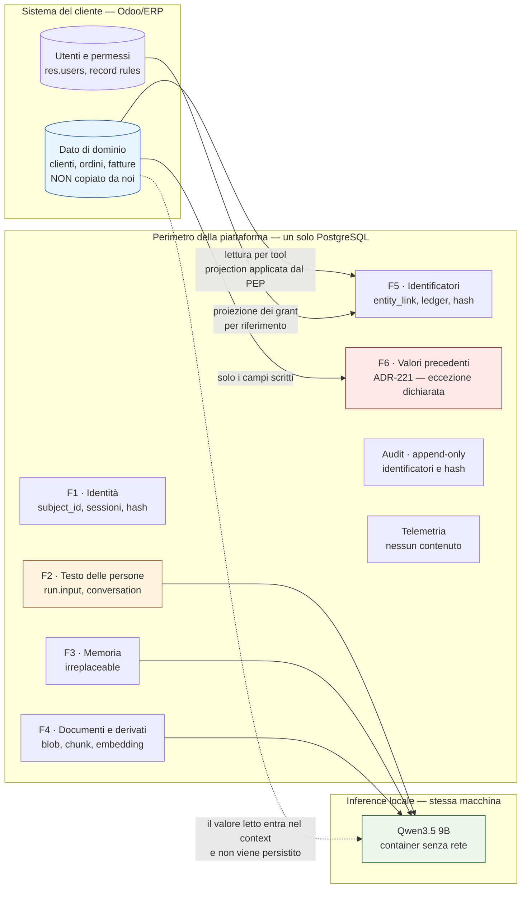

### Come leggerlo

- **A sinistra** c'è il sistema del cliente. Il blocco azzurro è il grosso del dato personale
  e **non attraversa mai il confine in modo persistente**: la freccia tratteggiata verso il
  modello indica un passaggio transitorio dentro il context di un run.
- **Al centro** il nostro perimetro. Un solo database. Le sei famiglie, più audit e
  telemetria.
- **In rosso** `F6`: l'unico punto in cui un valore di dominio del CRM si deposita da noi. È
  l'eccezione dichiarata di `ADR-241`, e va guardata.
- **In arancione** `F2`: il testo libero. Non è rosso perché è legittimo che stia da noi, ma
  è il punto su cui non abbiamo controllo preventivo.
- **A destra** l'inference. Sta **sulla stessa macchina**, in un container **senza rete**
  (`AR-MD-08`, `ADR-038`, `ADR-203`). Non esiste un model provider esterno Day-1: questa è la
  seconda proprietà privacy più forte dell'architettura, dopo `INV-07`.

---

# 3. DISTINZIONI FONDAMENTALI — NON COLLASSARE TUTTO IN "DATI"

Il prompt di questo documento insiste, e ha ragione: la parola "dati" nasconde otto cose
diverse con otto lifecycle diversi. Qui le separo, con l'analogia che serve a ricordarle.

| Concetto | Cos'è | Analogia | Chi lo possiede da noi |
|---|---|---|---|
| **Data** | il contenuto | il testo del libro | dipende dalla famiglia (§2) |
| **Metadata** | i dati sul dato | la scheda del catalogo | sempre noi |
| **Personal data** | qualunque dato riferibile a una persona identificata o identificabile | il nome sul frontespizio *e* il numero di tessera | §6 |
| **Special category** | le categorie particolari dell'art. 9 GDPR | la cartella clinica | §7 |
| **Confidential data** | dato riservato ma non personale (listini, margini, segreti industriali) | il bilancio interno | il tenant |
| **Identity data** | ciò che risolve un soggetto | il registro dei tesserati | noi (F1) |
| **Content data** | il testo vero | le pagine | F2, F4 |
| **Telemetry** | misure sul funzionamento del sistema | il contatore dei visitatori all'ingresso | noi |
| **Audit** | prova di chi ha fatto cosa | il registro delle firme in portineria | noi, append-only |
| **Memory** | ciò che la piattaforma ricorda di una persona | il bibliotecario che si ricorda che preferisci il tavolo vicino alla finestra | noi (F3), irreplaceable |
| **Knowledge** | ciò che la piattaforma sa, ricostruibile dalla fonte | l'indice analitico rifatto dai libri | noi (F4), ricostruibile |
| **Evaluation data** | i casi con cui misuriamo la qualità | i quiz di verifica | noi, in un repository di codice |
| **Model input** | il prompt effettivo | la domanda posta al bibliotecario | non persistito (`ADR-171`) |
| **Model output** | la risposta | la risposta del bibliotecario | persistito come esito del run |
| **Artifact** | un file prodotto | il fascicolo consegnato | per riferimento (`ADR-140`) |
| **Lineage** | da dove viene un dato derivato | la catena di citazioni | colonne esistenti, nessun sistema nuovo |
| **Provenance** | chi ha prodotto un dato, quando, con che versione | il colophon | 11 campi obbligatori (`AR-KN-04`) |
| **Retention policy** | per quanto si tiene | la regola di scarto d'archivio | riga di policy (`ADR-234`) |
| **Purpose** | perché lo si tratta | il motivo per cui hai chiesto il libro | enum chiuso (`ADR-231`) |
| **Legal basis** | il titolo giuridico che rende lecito il trattamento | il permesso di consultazione | §29, non è "consenso" per default |

## 3.1 Le sei disuguaglianze che valgono in questo sistema

**`DATA ≠ MEMORY`.** La memoria non contiene fatti di dominio (`ADR-089`, vincolo di schema).
Un fatto sul cliente si legge dal `Tool`, sempre. Se la memoria dicesse *"il cliente Rossi ha
budget 50k"*, sarebbe una copia del CRM che invecchia in silenzio: `R-35`.

**`MEMORY ≠ KNOWLEDGE`.** Il confine passa per il *system of record* (`A08`). La knowledge ha
una sorgente esterna autoritativa ed è **ricostruibile**; la memoria no. Da qui segue tutto
il resto: la cancellazione della knowledge è recuperabile, quella della memoria no.

**`TELEMETRY ≠ AUDIT`.** `INV-27` lo rende strutturale: *nessun controllo di sistema dipende
da una lettura di telemetria*. E `AR-OB-02`: *nessuna richiesta di conformità si soddisfa con
una query sulla telemetria*. In questo documento aggiungo la dimensione temporale: `INV-35`,
la telemetria non sopravvive all'audit.

**`PERSONAL DATA ≠ ALL CONFIDENTIAL DATA`.** Un listino prezzi è riservatissimo e non è dato
personale. Un indirizzo email di un dipendente è dato personale e spesso non è riservato.
Le due classificazioni sono **assi ortogonali**, ed è per questo che `ADR-232` usa due assi.

**`DATA RETENTION ≠ BACKUP RETENTION`.** Sono due lifecycle. Un dato cancellato dal database
vive nei backup fino alla scadenza del backup. Chi promette la cancellazione immediata dai
backup sta mentendo o non ha backup. §25 e `ADR-237`.

**`DATA DELETION ≠ DATABASE ROW DELETION`.** Cancellare la riga non basta se esistono
derivati (embedding), copie (backup), riferimenti (audit), e indici. §21 e §24.

---

# 4. INVENTARIO DEI DATI

Questo è l'inventario logico completo. Per ogni voce: chi la possiede (*owner*), da dove viene
(*source*), come è classificata, perché la trattiamo (*purpose*), dove sta, quanto si tiene,
chi la legge, cosa succede quando si cancella, e dove si propaga a valle.

**Legenda della classificazione** (definita per esteso in §5): il primo valore è la
`confidentiality_class`, il secondo è la `personal_data_class`.

## 4.1 Identità e accesso

| Dato | Owner | Source | Classe | Purpose | Storage | Retention | Chi legge | Cancellazione | Propaga a |
|---|---|---|---|---|---|---|---|---|---|
| `tenant` | piattaforma | amministrazione | INTERNAL / NONE | isolare i clienti | PostgreSQL | vita del contratto | tutti sotto RLS | fine contratto → §21 | ovunque (`tenant_id`) |
| `subject` (`subject_id`, stato) | piattaforma | creazione utente / LDAP | CONFIDENTIAL / PERSONAL | autenticare e autorizzare | PostgreSQL | **`NON ANCORA DECISO`** — §19.3 | `api`, PDP, PIP | **identity shredding** (`ADR-236`) | audit, telemetria, memoria, journal |
| attributi del subject (nome, email) | piattaforma o directory LDAP | LDAP (`ADR-121`) o inserimento | CONFIDENTIAL / PERSONAL | mostrare chi è, contattare | PostgreSQL | segue il subject | `api` | **distruzione fisica** alla cancellazione | nulla: non entra nel context |
| `credential` (hash Argon2id) | piattaforma | l'utente | RESTRICTED / PERSONAL | autenticare | PostgreSQL, `SecretMaterial` fuori dal DB | segue il subject | solo modulo di auth (`INV-14`) | distruzione fisica | nulla |
| `session` | piattaforma | login | CONFIDENTIAL / PERSONAL | tenere l'accesso | PostgreSQL (riga, `ADR-110`) | scadenza sessione (`B-44`) | `api` | scadenza + purge | audit |
| `RoleAssignment`, `delegation` | tenant | amministratore del tenant | CONFIDENTIAL / PERSONAL | autorizzare | PostgreSQL | segue il subject | PDP/PIP | segue il subject | audit |
| `EXTERNAL_IDENTITY_LINK` (`acl_subject`) | piattaforma | sync directory | CONFIDENTIAL / PSEUDONYMOUS | risolvere i permessi su Odoo | PostgreSQL | segue il subject | PDP, Retrieval Layer | **rotto** alla cancellazione (`ADR-236`) | audit, `grant` |
| alias `merged_into` | piattaforma | fusione account | CONFIDENTIAL / PERSONAL | leggere la storia | PostgreSQL | segue la **chiusura** degli alias | lettura audit e memoria | segue il subject (`AR-DG-09`) | audit |

## 4.2 Configurazione e agent

| Dato | Owner | Source | Classe | Purpose | Storage | Retention | Chi legge | Cancellazione | Propaga a |
|---|---|---|---|---|---|---|---|---|---|
| `Agent`, `AgentVersion`, `Binding` | tenant | amministratore | INTERNAL / NONE | definire il comportamento | PostgreSQL | versioni immutabili, mai cancellate finché esistono run che le citano | Control Plane, `resolve()` | non cancellabile se referenziata | `ConfigSnapshot` |
| istruzione di sistema (prompt) | piattaforma o tenant | autore | CONFIDENTIAL / NONE | guidare il modello | PostgreSQL, in `AgentVersion` | come sopra | `resolve()` | come sopra | context (zona cacheabile) |
| `Policy`, `bundle_version` | piattaforma + tenant | amministratore | INTERNAL / NONE | decidere | PostgreSQL | versioni immutabili | PDP | come sopra | ogni decisione |
| `ToolVersion`, `ToolBinding` | piattaforma | sviluppo | INTERNAL / NONE | dichiarare cosa si può fare | PostgreSQL | come sopra | `resolve()`, Tool Runtime | come sopra | prefisso del prompt |
| `ConfigSnapshot` | runtime | `resolve()` | INTERNAL / NONE | congelare la configurazione del run | PostgreSQL, per run | segue il run | Agent Runtime | segue il run | context |
| `credential_ref` verso Odoo | piattaforma | amministratore | RESTRICTED / NONE | far parlare i tool con Odoo | `SecretStore` cifrato, chiave fuori dal DB | rotazione | solo `Credential Broker` (`INV-14`) | revoca + distruzione | **mai** in audit né log |

## 4.3 Esecuzione — il cuore del problema

| Dato | Owner | Source | Classe | Purpose | Storage | Retention | Chi legge | Cancellazione | Propaga a |
|---|---|---|---|---|---|---|---|---|---|
| **`run.input`** (il turno dell'utente) | **il tenant**; riguarda persone | **la persona che scrive** | CONFIDENTIAL / **PERSONAL, potenzialmente SPECIAL** | eseguire il compito richiesto | PostgreSQL | **`NON ANCORA DECISO`** — §19.2 | `api`, `worker`, il modello | segue il run e il subject | context, journal, memoria (se confermata), audit (solo hash) |
| `run.output` (la risposta finale) | tenant | il modello | CONFIDENTIAL / PERSONAL possibile | rispondere | PostgreSQL | come `run.input` | `api`, l'utente | come sopra | nessuno: non rientra nel context di run futuri se non via `run_summary` |
| `run_step` / journal | piattaforma | runtime | CONFIDENTIAL / PSEUDONYMOUS | durabilità, recovery, prova | PostgreSQL, append-only di fatto | **`NON ANCORA DECISO`** — §19.2 | `worker`, ispezione | segue il run | `WorkingSetBlock`, audit, telemetria |
| `args_model` (argomenti composti dal modello) | tenant | il modello, dal testo dell'utente | CONFIDENTIAL / PERSONAL possibile | invocare il tool | in `run_step` | come il journal | `worker`, Tool Runtime | col journal | connector → Odoo |
| `args_injected` (`tenant`, `principal`, `now`, `idempotency_key`) | piattaforma | runtime (`AR-TL-14`) | INTERNAL / PSEUDONYMOUS | rendere l'invocazione sicura | in `run_step` | come il journal | `worker` | col journal | Odoo (external ID) |
| `ToolResult` | **il tenant, ma il dato è di Odoo** | Odoo | CONFIDENTIAL / **PERSONAL** | far ragionare il modello | **transitorio nel context**; nel journal solo `result_hash` e identificatori | **non persistito** | il modello, entro il run | non applicabile | context, identifier ledger (solo id) |
| **valore precedente dei campi scritti** (`ADR-221`) | tenant | **Odoo** | CONFIDENTIAL / **PERSONAL** — eredita la classe del campo | ricostruire e compensare un `UPDATE` | `run_step`, campo dedicato | **più corta del journal** — §19.2 | `worker`, ispezione umana | **mai leggibile dal modello** (`ADR-241`) | nessuno |
| `run_summary` | piattaforma | codice deterministico (`ADR-101`) | CONFIDENTIAL / PERSONAL possibile | continuità fra run | PostgreSQL | segue la conversazione | Memory Module | col subject | context di run successivi |
| `conversation` | piattaforma | runtime | CONFIDENTIAL / PERSONAL | raggruppare i run | PostgreSQL | come `run.input` | `api` | col subject | — |
| `job` (lavoro di background) | piattaforma | scheduler | INTERNAL / PSEUDONYMOUS | retention, polling, sweep | PostgreSQL | breve, operativa | `worker` | scadenza | telemetria |
| `outbox` | piattaforma | runtime | INTERNAL / PSEUDONYMOUS | consegnare notifiche di approvazione | PostgreSQL, **solo riferimenti** (`AR-EV-16`) | breve | `worker` | scadenza | trasporto esterno |

## 4.4 Knowledge

| Dato | Owner | Source | Classe | Purpose | Storage | Retention | Chi legge | Cancellazione | Propaga a |
|---|---|---|---|---|---|---|---|---|---|
| `document` (metadati) | tenant | sorgente documentale | CONFIDENTIAL / PSEUDONYMOUS | trovare il documento | PostgreSQL | vita del documento nella sorgente + finestra | Retrieval Layer sotto RLS | cascata su tutto il derivato | tutto il derivato |
| blob (contenuto) | tenant | sorgente documentale | CONFIDENTIAL o RESTRICTED / **PERSONAL possibile** | ricostruire il derivato | `Blob Store`, content-addressed | come il documento | solo via riga protetta da RLS (`AR-KN-22`) | fisica, quando nessuna riga lo referenzia | `parsed_content` |
| `parsed_content` | piattaforma | parsing | come il blob | chunking | PostgreSQL | ricostruibile (`ADR-076`) | Ingestion | cascata | `chunk` |
| `chunk` | piattaforma | chunking | come il blob | retrieval | PostgreSQL | ricostruibile | Retrieval Layer | cascata | `embedding`, context |
| `embedding` | piattaforma | modello di embedding su CPU | come il chunk — **non è anonimo**, §17 | ricerca semantica | pgvector | ricostruibile | Retrieval Layer | cascata | ranking |
| `entity_link` | piattaforma | ingestion | CONFIDENTIAL / **PSEUDONYMOUS** | collegare documento e record CRM | PostgreSQL | come il documento | Retrieval Layer | cascata | pre-filtro |
| `acl_subject`, `grant` (proiezione) | tenant (l'originale è di Odoo) | sync | CONFIDENTIAL / PSEUDONYMOUS | pre-filtro autorizzativo in query | PostgreSQL | rinfrescata; **stantia → fail closed** (`AR-KN-09`) | Retrieval Layer, PDP | col subject | decisione di retrieval |
| `retrieval_audit` | piattaforma | Retrieval Layer | CONFIDENTIAL / PSEUDONYMOUS | provare cosa è stato mostrato | PostgreSQL, append-only | segue l'audit | ispezione | **non cancellabile** — §22 | — |

## 4.5 Memoria

| Dato | Owner | Source | Classe | Purpose | Storage | Retention | Chi legge | Cancellazione | Propaga a |
|---|---|---|---|---|---|---|---|---|---|
| `memory` (`value_text ≤ 280`) | **la persona**, custodita da noi | l'utente (`EXPLICIT`), osservazione (`OBSERVED`), amministratore (`ADMIN`) | CONFIDENTIAL / **PERSONAL** | personalizzare le interazioni future | PostgreSQL, RLS | **`NON ANCORA DECISO`** — §19.4 | Memory Module, sotto `MemoryScope` del PDP | **tombstone + purge, irreversibile** (`ADR-098`) | `MemorySnapshot` → context |
| `memory_audit` | piattaforma | Memory Module | CONFIDENTIAL / PSEUDONYMOUS | provare le scritture di memoria | PostgreSQL, append-only, **identificatori e hash** (`AR-ME-16`) | segue l'audit | ispezione | non cancellabile — §22 | — |

## 4.6 Evidence — audit, telemetria, evaluation

| Dato | Owner | Source | Classe | Purpose | Storage | Retention | Chi legge | Cancellazione | Propaga a |
|---|---|---|---|---|---|---|---|---|---|
| `audit_event` | **piattaforma**, ma è prova per il tenant | ogni decisione, ogni effetto | CONFIDENTIAL / **PSEUDONYMOUS** | sicurezza, conformità, contestazioni | PostgreSQL, **append-only** (`INV-05`) | **`NON ANCORA DECISO`, ed è il valore più lungo di tutti** — §19.6 | ispezione autorizzata, sotto RLS | **`ADR-236` (identity shredding) o `ADR-238` (break-glass)** | export di conformità (`DEF-08`, non chiusa qui) |
| `telemetry_span` | piattaforma | runtime | INTERNAL / PSEUDONYMOUS | operare e diagnosticare | PostgreSQL | **strettamente più corta dell'audit** (`INV-35`) | cruscotti sotto RLS | scadenza automatica (partizioni) | cruscotti |
| `metric_sample` | piattaforma | runtime | INTERNAL / **NONE** (nessun identificatore per `AR-OB-04`) | misurare | PostgreSQL | come sopra | cruscotti | scadenza | cruscotti |
| `EvaluationCase` | **piattaforma** | umano che scrive il caso | INTERNAL / **NONE per costruzione** (`ADR-240`) | misurare la qualità | **file in repository git** | vita del progetto | sviluppatori | cancellazione del file | CI, gate di rilascio |
| `EvaluationResult` | piattaforma | esecuzione della suite | INTERNAL / NONE | gate di rilascio | PostgreSQL o artefatti CI | storico di rilascio | sviluppatori | scadenza | — |
| `QualitySignal` (segnalazione di un utente) | tenant | l'utente | CONFIDENTIAL / PERSONAL possibile | migliorare | PostgreSQL | come `run.input` | team | col subject | eventuale `EvaluationCase`, **solo dopo riscrittura umana** |
| `DebugCapture` | piattaforma | attivazione esplicita | RESTRICTED / PERSONAL | diagnosi | PostgreSQL, `opt-in`, spegnimento automatico | **la più corta di tutte** — §19.7 | chi ha attivato, con notifica al tenant | scadenza forzata | — |

## 4.7 Backup

| Dato | Owner | Source | Classe | Purpose | Storage | Retention | Chi legge | Cancellazione | Propaga a |
|---|---|---|---|---|---|---|---|---|---|
| backup del database | piattaforma | dump periodico | **la classe più alta contenuta**, cioè RESTRICTED / PERSONAL | continuità operativa | fuori dal database primario | **`NON ANCORA DECISO`; dipende da `DEF-06` (RPO/RTO), che è di `C24` e non si chiude qui** | solo procedura di restore | **scadenza del backup, mai selettiva** | il sistema ripristinato → §25 |
| backup del `Blob Store` | piattaforma | copia | come sopra | continuità | fuori dal disco primario | come sopra | restore | scadenza | — |

## 4.8 La riga che manca in tutti gli inventari

**`DECISIONE ARCHITETTURALE — `ADR-233`.** Questo inventario non è un documento: è un
**registro di codice**, il file `data_assets.yaml`, e un test di CI verifica che ogni tabella
dello schema abbia una voce e che ogni voce abbia una tabella. Un inventario in un `.md`
diverge dalla realtà entro tre mesi. È esattamente la forma che `A12` ha scelto per il
registro delle metriche (`ADR-176`), e per lo stesso motivo.

→ regola `AR-DG-01` e `AR-DG-27`, rischio `R-91` (il test viene disattivato, come `R-69`).

---

# 5. CLASSIFICAZIONE DEI DATI

## 5.1 Il problema con la scala a quattro livelli

Il prompt propone `PUBLIC / INTERNAL / CONFIDENTIAL / RESTRICTED` e dice che è solo un
esempio. Ha ragione a dubitare: **una scala sola non funziona**, perché mescola due domande
che hanno risposte indipendenti.

- *"Quanto danno fa se esce?"* → è riservatezza. Un listino prezzi ne fa molto e non riguarda
  nessuna persona.
- *"Riguarda una persona?"* → è la domanda della privacy. Un indirizzo email aziendale ne
  riguarda una e spesso non è riservato per niente.

Se le si collassa in un asse solo, si finisce per trattare il listino come dato personale
(spreco) o l'email come dato pubblico (violazione).

## 5.2 Decisione — `ADR-232`: due assi, dichiarati, mai inferiti

**DECISIONE ARCHITETTURALE.** Ogni `data_asset` e ogni campo di uno schema di tool porta
**due** classificazioni, entrambe **dichiarate** e mai calcolate a runtime.

### Asse A — `confidentiality_class`

| Valore | Significato | Conseguenze operative |
|---|---|---|
| `PUBLIC` | può uscire senza controlli | nessuna. Day-1 **nessun dato della piattaforma è `PUBLIC`** |
| `INTERNAL` | interno alla piattaforma, non al tenant | non esce mai verso l'utente finale; entra nei cruscotti |
| `CONFIDENTIAL` | dato di lavoro del tenant | RLS obbligatoria; mai cross-tenant; non entra nella telemetria |
| `RESTRICTED` | segreti, credenziali, `DebugCapture`, blob con contenuto sensibile | accesso solo da moduli nominati; `INV-14`; mai in audit, mai in log, mai nel context senza decisione esplicita |

### Asse B — `personal_data_class`

| Valore | Significato | Conseguenze operative |
|---|---|---|
| `NONE` | non riferibile a una persona | nessun obbligo derivante dal GDPR |
| `PSEUDONYMOUS` | riferibile solo tramite una chiave che sta altrove (`subject_id`, `acl_subject`, hash) | **resta dato personale** (§30). Sopravvive all'identity shredding diventando non risolvibile |
| `PERSONAL` | direttamente riferibile (nome, email, testo scritto da una persona) | soggetto ai diritti del data subject; classe minima per l'export |
| `SPECIAL_CATEGORY` | le categorie particolari dell'art. 9 GDPR | **`Day-1: non entra`**. §7 e `ADR-230` |

### La regola che fa il lavoro

**`AR-DG-22` — la classificazione di un dato derivato è *almeno* quella della sua sorgente.**

Un `embedding` calcolato su un `chunk` di un documento `RESTRICTED` è `RESTRICTED`. Un
`run_summary` costruito su un `run.input` `PERSONAL` è `PERSONAL`. Non esiste
declassificazione automatica: **il derivato non sfugge alla governance della sorgente**, che
è una delle istruzioni esplicite del prompt.

→ **`INV-36`**, verificato in CI leggendo il registro `data_assets.yaml`: per ogni arco
`sorgente → derivato`, entrambe le classi del derivato sono ≥ di quelle della sorgente.

## 5.3 Come la classificazione guida il comportamento

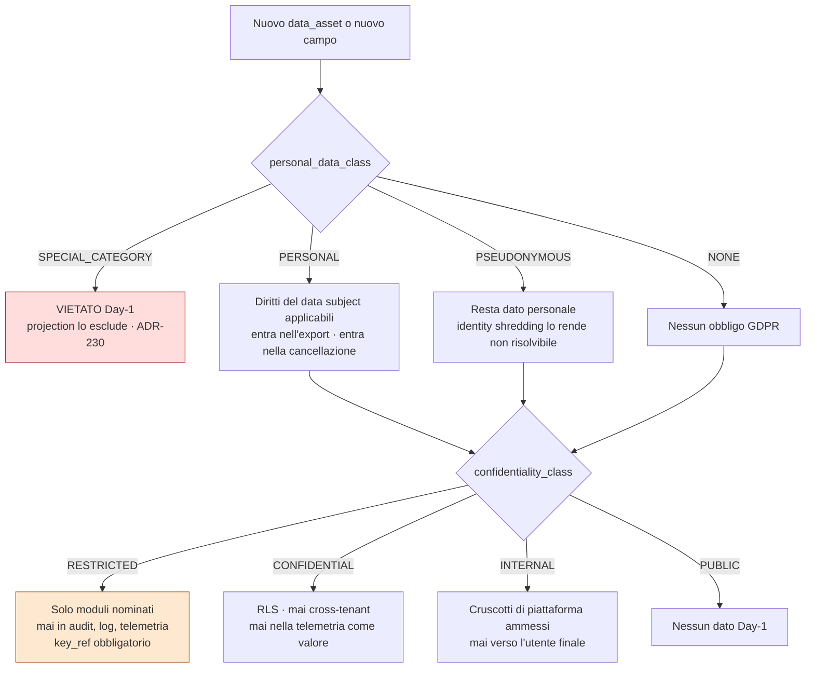

### Come leggerlo

Si entra da un dato nuovo e si scende. **L'asse della privacy si decide per primo** perché ha
un ramo terminale: se il dato è `SPECIAL_CATEGORY`, la conversazione finisce lì Day-1 — non
entra, punto. L'asse della riservatezza si decide dopo e determina *dove può stare*: quali
moduli lo leggono, se compare nei log, se ha bisogno della colonna `key_ref` che prepara la
cifratura per tenant.

Il diagramma è anche il **flusso di lavoro** obbligatorio: aggiungere una tabella senza
passarci fa fallire la build (`AR-DG-27`).

## 5.4 Non responsabilità della classificazione

La classificazione **non** è un controllo di accesso. Non sostituisce il PDP, non sostituisce
la RLS, non sostituisce `AR-KN-02` (il filtro nella query). È **metadato che alimenta
decisioni prese altrove**. Se qualcuno propone "leggiamo la classe a runtime e decidiamo",
sta reintroducendo un secondo punto di autorizzazione, e `AR-ID-20` dice che **esiste un solo
punto che può concedere: il PDP**.

---

# 6. DATO PERSONALE — COSA LO È DAVVERO, DA NOI

**OBBLIGO CITABILE (contesto).** `R-14.2` riporta come `FATTO` che la profilazione dell'art.
4(4) GDPR riguarda *"qualsiasi forma di trattamento automatizzato"*, non solo quello
"unicamente" automatizzato. `R-14` non riporta il testo dell'art. 4(1) sulla definizione di
dato personale, quindi qui uso la nozione corrente senza citarla come `FATTO` verificato.

**INTERPRETAZIONE NOSTRA.** La domanda giusta non è *"c'è un nome?"* ma *"esiste qualcuno,
compresi noi e compreso il tenant, che può risalire alla persona?"*. Con questo criterio:

| È dato personale da noi | Perché |
|---|---|
| `subject_id` | risolvibile via la tabella degli attributi. Pseudonimo, non anonimo |
| nome, email, hash della password | ovvio |
| `run.input` e `run.output` | testo scritto da e su persone |
| `memory.value_text` | è una preferenza *di una persona*, legata a `subject_id` |
| `acl_subject` (`odoo:res.users:42@…`) | risolve in Odoo in un secondo |
| identificatori di `res.partner` nel ledger e in `entity_link` | puntano a una persona fisica o al referente di una società |
| ogni riga di `audit_event` | porta `subject_id` e `on_behalf_of` |
| `telemetry_span` | porta `tenant_id` e riferimenti di run correlabili al subject via journal |
| contenuto dei documenti indicizzati | può contenere qualunque cosa |
| `embedding` | **non è anonimo**, §17 |
| valore precedente di `ADR-221` | è il valore di un campo che spesso riguarda una persona |

| **Non** è dato personale da noi | Perché |
|---|---|
| `metric_sample` | `AR-OB-04` vieta `run_id`, `tenant_id`, `subject_id` e ogni campo di dominio come label. Restano contatori aggregati |
| definizioni di tool, schemi, policy | descrivono il sistema, non le persone |
| `content_hash` di un blob, **da solo** | senza la riga che lo referenzia non risolve nulla (`AR-KN-22`) |
| `ConfigSnapshot` | configurazione |

**Il caso limite che va detto:** un `metric_sample` con `n = 1` in una dimensione stretta può
identificare. È esattamente il problema della divulgazione statistica di §35, ed è il motivo
per cui `AR-DG-20` impone una soglia minima di gruppo agli aggregati cross-tenant.

---

# 7. CATEGORIE PARTICOLARI DI DATI — IL DEBITO EREDITATO DA `A08`

## 7.1 Il mandato

`A08` ha lasciato scritto, nel proprio checkpoint: **"le categorie particolari di dati non
sono rilevate Day-1"**. È un debito assegnato a questo documento. Lo chiudo, ma non nel modo
in cui ci si aspetta.

## 7.2 Perché non costruiamo un rilevatore

**DECISIONE ARCHITETTURALE — `ADR-230`: le categorie particolari si *dichiarano*, non si
*rilevano*.**

Il ragionamento è lo stesso che `A13` ha usato per la prompt injection (`ADR-188`: il
rilevamento è un sensore, non un controllo) e che `A12` ha usato per la redaction
(`ADR-170`: difesa strutturale, non filtrante).

Un classificatore di categorie particolari su testo libero ha due modi di sbagliare:

- **falso negativo**: lascia passare un dato sanitario. Il danno è quello che volevamo
  evitare, **più** il danno di aver detto a tutti che il sistema lo intercetta;
- **falso positivo**: blocca un testo innocuo. Il danno è operativo, e la reazione tipica
  dell'organizzazione è abbassare la soglia finché il rilevatore non dà più fastidio — cioè
  finché non serve più a niente. È il destino descritto in `ADR-188`, e `R-75` dice che è
  probabile.

**FATTO (`R-13`, via `ARCHITECTURE_STATE`).** I detector basati su LLM mancano il **66 %**
delle voci di memoria avvelenate. Non è la stessa cosa delle categorie particolari, ma è la
misura più vicina che abbiamo su "quanto è affidabile un classificatore LLM su testo ostile o
ambiguo", e non è incoraggiante.

**Contro-argomento onesto.** Un rilevatore imperfetto è meglio di niente se il suo output
viene usato come *segnale* e non come *controllo*: per esempio per far scattare una revisione
umana su un campione. Non lo escludo per sempre — lo escludo Day-1 perché non abbiamo né la
misura né le persone per gestire la coda, e `R-76` (la coda di quarantena mai svuotata) dice
cosa succede alle code senza presidio. Quando ci saranno, si valuta come sensore.

## 7.3 Cosa facciamo invece, per ciascun percorso

### Percorso strutturato (tool → Odoo): risolto per dichiarazione

Un campo di uno schema di tool porta `x-sensitivity` (`ADR-066`). Se un campo può contenere
categorie particolari — per esempio un campo note di `hr.employee`, o un campo personalizzato
di `res.partner` in cui il cliente ha messo informazioni sanitarie — lo si dichiara
`SPECIAL_CATEGORY` **nello schema**, e la projection di `ADR-228` **non lo chiede mai**.

Il campo non viene letto. Non c'è niente da rilevare perché non c'è niente da vedere.

→ **`INV-39`**: nessun campo dichiarato `SPECIAL_CATEGORY` compare in un `ToolInvocation`, in
un `ToolResult`, nel context, nel journal o nell'audit. Verificabile staticamente sugli
schemi, e con un test che tenta la projection e si aspetta un `DENY`.

**Il residuo, dichiarato:** dipende dalla qualità della dichiarazione. Se nessuno ha marcato
un campo, il campo passa. → `B-103` (quali campi standard di Odoo, sui modelli CRM che ci
interessano, possono contenere categorie particolari) e `AS-51`.

### Percorso documentale: risolto per esclusione della sorgente

Un documento non ha campi. L'unico controllo praticabile è **a monte dell'ingestion**: una
`DocumentSource` dichiara la propria `sensitivity_max`, e le sorgenti che possono contenere
categorie particolari — cartelle del personale, documentazione sanitaria, pratiche legali —
**non si indicizzano Day-1**.

Questo si aggancia a una decisione che esiste già: `ADR-085` tiene le email fuori dalla
knowledge base Day-1. L'email è precisamente il canale in cui le categorie particolari
arrivano senza preavviso.

→ `AR-DG-26`: un documento entra nell'indice solo se la sua sorgente è dichiarata e la sua
`sensitivity_max` è dichiarata.

### Testo libero dell'utente e memoria: **non risolto, e non risolvibile qui**

Se una persona scrive nel prompt un'informazione sanitaria su un cliente, quell'informazione
è nel nostro database. Non c'è projection possibile perché non c'è schema. Non c'è esclusione
possibile perché non c'è sorgente da escludere.

**Le uniche tre difese oneste sono:**

1. **Retention corta** su `run.input` (§19.2): il dato smette di esistere prima possibile.
   Questa è una difesa vera, ed è il motivo per cui la retention del testo dell'utente deve
   essere la **più corta** fra i dati di esecuzione.
2. **Trasparenza a monte**: l'interfaccia dice che ciò che si scrive viene conservato per un
   periodo dichiarato. È un obbligo informativo, non un controllo tecnico.
3. **Non propagazione**: `AR-DG-11` e `ADR-240` garantiscono che quel testo non finisca in un
   dataset di evaluation, cioè in un repository git letto da sviluppatori. È il percorso in
   cui un dato sanitario farebbe il danno peggiore, e quello sì lo chiudiamo.

→ Rischio **`R-87`**, probabilità **Alta**, impatto **Alto**, mitigazione dichiarata debole.
→ **RICHIEDE PARERE LEGALE**: se il sistema riceve regolarmente categorie particolari nel
testo libero, serve stabilire la base giuridica dell'art. 9(2), che non è la stessa dell'art.
6. Questa non è una domanda a cui un architetto può rispondere.

## 7.4 Distinzione obbligatoria — obbligo di legge contro salvaguardia architetturale

| | Cosa dice |
|---|---|
| **OBBLIGO CITABILE** | `R-14` **non** riporta il testo dell'art. 9 GDPR. Non ho una fonte verificata da citare sul trattamento delle categorie particolari. Registro la lacuna invece di riempirla a memoria |
| **SALVAGUARDIA ARCHITETTURALE** | `ADR-230` (dichiarare, non rilevare), `INV-39` (mai nel percorso strutturato), `AR-DG-26` (esclusione della sorgente documentale), retention corta sul testo libero |
| **RICHIEDE RICERCA** | `B-103`, più una passata sulle basi giuridiche dell'art. 9(2) applicabili a un CRM |

---

# 8. CONTROLLER E PROCESSOR — LA DETERMINAZIONE CHE NON POSSO FARE

## 8.1 Perché è bloccata

**`Q-03` è aperta**: non sappiamo se il deployment è SaaS, on-premise presso il cliente, o
entrambi Day-1. E la risposta cambia i ruoli in modo radicale.

| Scenario | Chi è titolare (*controller*) | Chi è responsabile (*processor*) | Noi vediamo il dato? |
|---|---|---|---|
| **On-premise puro** | il cliente, su tutto | probabilmente **nessuno**: se non accediamo, non trattiamo | no, salvo accesso di supporto |
| **SaaS multi-tenant** | il cliente, sui dati di lavoro | **noi**, per conto del cliente | sì |
| **SaaS + i nostri account utente** | **noi**, sui dati di gestione del nostro rapporto contrattuale | — | sì |

**INTERPRETAZIONE NOSTRA.** Nello scenario on-premise l'accesso di supporto è l'unico momento
in cui trattiamo dato del cliente, e diventa **il** fatto qualificante del rapporto. È il
motivo per cui `ADR-244` (nessun accesso permanente, solo elevazione dichiarata) non è una
gentilezza: è ciò che tiene il rapporto giuridico semplice.

**RICHIEDE PARERE LEGALE.** La qualificazione di titolare/responsabile e la redazione del DPA
(*Data Processing Agreement*, il contratto che regola il trattamento fra titolare e
responsabile) non sono decisioni architetturali. `ADR-248` registra che non le prendo.

## 8.2 Cosa fa l'architettura, indipendentemente dalla qualificazione

**DECISIONE ARCHITETTURALE — `ADR-248`.** La piattaforma fornisce **le capacità tecniche di
entrambi i ruoli** e non presume quale sarà:

- **capacità da processor**: isolamento per tenant applicato dal database (`AR-017`,
  `AR-018`, RLS ovunque), nessun accesso permanente del personale (`ADR-244`), audit di ogni
  accesso, cancellazione su richiesta del titolare, export su richiesta del titolare, registro
  dei trasferimenti esterni (`ADR-242`), assenza di sub-responsabili Day-1;
- **capacità da controller** sui nostri dati di account: base giuridica dichiarata,
  informativa, diritti esercitabili.

**Non responsabilità.** La piattaforma **non** decide chi è titolare, **non** genera
informative, **non** tiene un registro dei trattamenti ai sensi dell'art. 30. Sono documenti,
non software. Chi propone di generarli automaticamente sta costruendo un generatore di
documenti giuridici sbagliati.

## 8.3 Il ruolo che *non* esiste Day-1: il model provider

**FATTO (interno).** `ADR-036`/`ADR-038`: il serving gira in un container **sulla stessa
macchina**, su loopback. `AR-MD-08`: nessun caricamento di pesi da fonte remota a runtime.
`ADR-203`: allowlist di rete a livello di container. `AR-MD-09`: nessun egress verso provider
esterni senza passare dal PDP.

**INFERENZA (nostra), ed è la conclusione più forte del documento dopo `INV-07`:**
**Day-1 non esiste alcun trasferimento verso un fornitore di modelli.** Non c'è un
sub-responsabile da nominare, non c'è un DPA da firmare con OpenAI o chiunque altro, non c'è
un trasferimento internazionale da valutare, non c'è la domanda "usano i nostri prompt per
addestrare?".

Questa proprietà è **fragile in un modo preciso**: sopravvive finché nessuno aggiunge una
riga di configurazione. `ADR-242` la rende strutturale: l'elenco dei destinatari esterni è un
**registro dichiarato**, non una scoperta a runtime, e `AR-DG-16` vieta staticamente il
percorso di codice che manderebbe il context a un provider esterno.

---

# 9. PURPOSE LIMITATION E PURPOSE BINDING

## 9.1 Ogni categoria ha una finalità, e una sola

**DECISIONE ARCHITETTURALE.** Ogni `data_asset` dichiara un `purpose` preso da un **enum
chiuso**. Non è testo libero, per lo stesso motivo per cui `AR-OB-08` vieta il testo libero
nei log: un valore libero diventa incoerente in sei settimane.

| `purpose` | Categorie di dato | Significato |
|---|---|---|
| `SERVICE_DELIVERY` | `run.input`, `run.output`, journal, `ToolResult` | eseguire il compito che l'utente ha chiesto |
| `PERSONALIZATION` | `memory`, `run_summary` | rendere le interazioni future più aderenti |
| `KNOWLEDGE_RETRIEVAL` | documenti e tutto il derivato | trovare informazione nei documenti aziendali |
| `AUTHORIZATION` | identità, sessioni, ruoli, `grant`, `acl_subject` | decidere chi può fare cosa |
| `SECURITY_AND_COMPLIANCE` | `audit_event`, `retrieval_audit`, `memory_audit` | provare cosa è successo |
| `OPERATIONS` | telemetria, `job`, `outbox` | far funzionare e diagnosticare il sistema |
| `QUALITY_MEASUREMENT` | `EvaluationCase`, `EvaluationResult`, `QualitySignal` | misurare se il sistema funziona |
| `CONTINUITY` | backup | ripristinare dopo un guasto |

**La regola che conta è quella negativa:** un dato raccolto per un `purpose` **non si riusa**
per un altro senza un passaggio dichiarato. Il caso concreto che questa regola blocca è il
più tentante di tutti: *"abbiamo già i log di produzione, usiamoli come dataset di
evaluation"*. §31 spiega perché no, e `ADR-240` lo impedisce nel tipo.

## 9.2 Purpose binding — la decisione controintuitiva

Il prompt chiede se il `purpose` debba viaggiare con l'accesso e se sia **tecnicamente
applicabile**.

**FATTO (interno, `R-45`).** `A03` ha già registrato che *"`purpose` è dichiarato dal
chiamante e non verificato: una policy che ci si basa è aggirabile"*, e ha marcato `purpose`
come non verificato **nel tipo**, con la regola che non sia mai l'unica base di un `ALLOW`.

**DECISIONE ARCHITETTURALE — `ADR-231`: il `purpose` può solo restringere.**

Cioè: una policy può dire *"per il purpose `OPERATIONS` questo campo è negato"*, e questo
**funziona**, perché un attaccante che volesse più accesso dovrebbe dichiarare un purpose
**meno** privilegiato, il che non lo aiuta. Una policy non può dire *"per il purpose
`SECURITY_AND_COMPLIANCE` questo campo è concesso"*, perché basterebbe dichiararlo.

È esattamente la forma dell'imbuto di `ADR-025` (ogni livello può solo restringere) e di
`AR-GP-09`. Non è un meccanismo nuovo: è il `purpose` messo nel posto in cui i meccanismi
esistenti lo rendono onesto.

→ **`AR-DG-06`**: il `purpose` può solo restringere; nessun `ALLOW` dipende da esso.
Verificabile con un test sul PDP: si costruisce una richiesta identica variando solo il
`purpose` e si verifica che l'insieme dei permessi sia monotono decrescente.

**Contro-argomento onesto.** Così il `purpose` fa poco. Un critico direbbe: "allora è
teatro". Non del tutto: fa due cose reali. Primo, **finisce nell'audit**, e un accesso di
supporto con `purpose = SECURITY_AND_COMPLIANCE` che poi legge dati commerciali è
un'anomalia visibile. Secondo, restringe davvero nel caso che ci interessa di più: l'accesso
del personale di piattaforma (§27), dove il `purpose` è obbligatorio e la restrizione morde.

---

# 10. DATA MINIMIZATION

## 10.1 Il principio applicato ai confini che abbiamo già

Minimizzare significa: a ogni confine, passa il meno possibile. I confini esistono già; qui
dico cosa passa e cosa no.

| Confine | Cosa passerebbe "naturalmente" | Cosa passa davvero | Chi lo impone |
|---|---|---|---|
| `api` → `worker` | il token dell'utente | solo un **contesto di delega** | `AR-GP-02`, `AR-014` |
| PEP → Tool | tutti i campi che il tool sa restituire | **solo i campi della projection** | `ADR-228` (nuova) |
| Tool → context | l'intero `ToolResult` | il risultato **ridotto**, con `limit` obbligatorio | `AR-TL-15`, `ADR-220` |
| Retrieval → context | tutti i frammenti trovati | quelli entro il budget, tagliati **per frammento intero** | `AR-KN-11` |
| Memoria → context | tutte le memorie del soggetto | quelle nella `MemoryScope` prodotta dal PDP, sotto il cap | `AR-ME-04`, `ADR-092` |
| journal → context | il journal intero | un **riassunto deterministico** | `AR-RT-14`, `ADR-090` |
| runtime → telemetria | prompt, risposte, argomenti | **nessun contenuto**: identificatori, hash, enum, numeri, nomi di campo | `INV-26` |
| runtime → audit | contenuto e valori | **identificatori e hash** | `ADR-083`, `AR-ID-28` |
| produzione → evaluation | log e trascrizioni reali | **niente testo libero**, mai | `ADR-240`, `AR-DG-11` |
| piattaforma → operatore | tutto il database | vista **senza dimensioni di dominio** + elevazione dichiarata | `INV-28`, `ADR-118`, `ADR-244` |

**La riga nuova è la seconda**, ed è la §14.

## 10.2 Tre casi concreti che il prompt cita

**"Il Tool B non ha bisogno dell'intera conversazione."** Vero, e nella nostra architettura è
già impossibile che ce l'abbia: un tool riceve `args_model` (quello che il modello ha deciso
di passargli, validato contro lo schema) e `args_injected` (`tenant`, `principal`, `now`,
`idempotency_key`). Non riceve il context. `AR-TL-14` lo impone.

**"L'Agent B non ha bisogno di tutta la memoria dell'utente."** Day-1 non esiste un Agent B
(`ADR-123`: niente comunicazione agent→agent). Quando esisterà, `ADR-129` dice che il figlio
**eredita la memoria per riferimento, eventualmente ristretta**, e `B-65` è aperta proprio sul
criterio di restrizione. Qui aggiungo il criterio di governance: **la restrizione è verso il
basso e il figlio non può mai vedere più del padre** (`INV-16` già lo garantisce sull'autorità;
`AR-AC-06` sulla memoria).

**"L'osservabilità non ha bisogno dei prompt grezzi."** `A12` l'ha già chiuso, ed è la
decisione che ammiro di più fra quelle prese finora: `ADR-171`, **il prompt non si conserva,
si ricostruisce**. Il `Reproduction Bundle` ri-renderizza il prompt da versioni e snapshot
quando serve, sotto RLS e scrivendo la propria riga di audit **prima** di restituire
(`AR-OB-18`). Conserviamo la ricetta, non la torta.

---

# 11. CONTEXT MINIMIZATION — "DISPONIBILE ALLA PIATTAFORMA" ≠ "DISPONIBILE AL MODELLO"

Il prompt lo mette come istruzione assoluta finale, ed è giusto.

Il context del modello è un posto particolare: **tutto ciò che ci entra diventa
potenzialmente estraibile**, perché un attaccante che controlla parte del testo (prompt
injection, `ASI01`) può chiedere al modello di ripetere il resto. Quindi il context non è
"un buffer": è **un confine di trasferimento di dati**.

## 11.1 Chi decide cosa entra

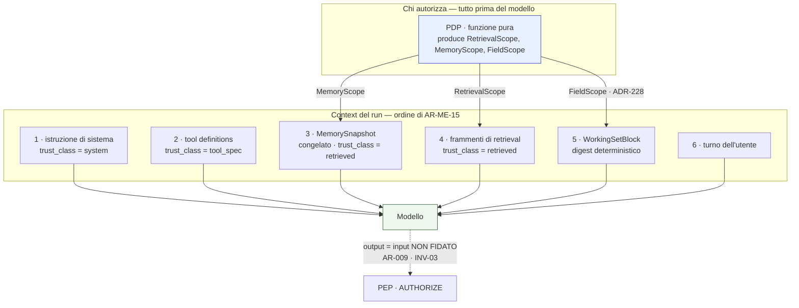

### Come leggerlo

- **Un solo componente decide**: il PDP. Produce tre "ambiti" che sono la stessa idea applicata
  a tre sorgenti — `RetrievalScope` (`A07`), `MemoryScope` (`A08`) e ora `FieldScope`
  (`ADR-228`, questo documento). Prima di questo documento il terzo mancava, ed è precisamente
  il buco di `R-32`.
- **L'ordine non è estetico**: le parti stabili stanno in alto perché il *prefix caching* le
  riusa (`AR-MD-15`), le variabili in fondo. Ma ha anche un effetto di governance: il turno
  dell'utente, che è la parte meno fidata, sta più lontano possibile dall'istruzione di
  sistema, che è l'unica che può definire capability (`AR-011`).
- **La freccia tratteggiata in basso** è la regola che tiene in piedi tutto: quello che esce
  dal modello **non è un'autorizzazione**, è una proposta. Rientra dal PEP.

## 11.2 La quota di context, e cosa significa per la privacy

`ADR-091` assegna quote dichiarate: 10 % istruzione, 25 % tool definitions, 8 % memoria, 22 %
frammenti, 15-20 % working set, 5 % turno, con ≥ 15 % di riserva per l'output. Sforare fa
**fallire il run** con `CONTEXT_BUDGET_EXCEEDED`, non troncare.

**INFERENZA (nostra), di governance:** il budget del context è, senza che nessuno l'abbia
progettato per questo, **un limite quantitativo alla quantità di dato personale che può stare
in un solo posto in un dato istante**. Un run non può accumulare centinaia di record di
clienti nel proprio context: sfonderebbe il budget e fallirebbe. `ADR-104` (50 step, 10
minuti attivi) mette il secondo tetto.

Non è una difesa contro l'esfiltrazione — un attaccante paziente fa cento run — ma è un
limite reale contro l'accumulo accidentale, e vale la pena dirlo perché è gratis.

---

# 12. IL GRAFO DI PROPAGAZIONE DEL DATO

È uno degli output centrali richiesti dal prompt. Mostra **ogni posto in cui un dato può
finire**, partendo da chi lo immette.

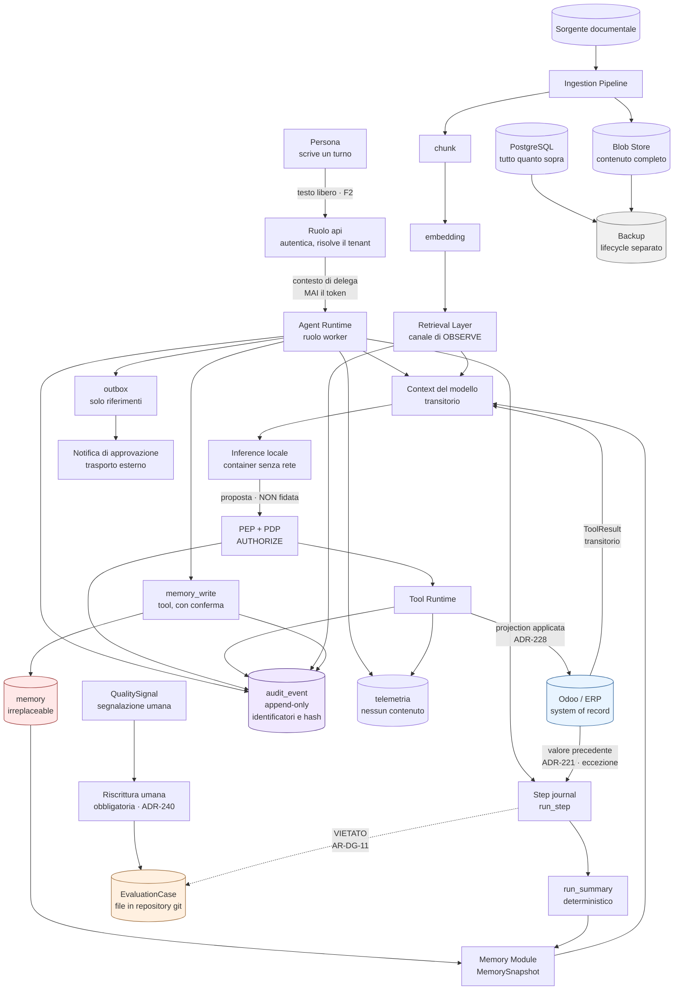

## Come leggerlo

**Segui una frase scritta da una persona.** Entra da `api`, diventa `run.input`, viene messa
nel context, arriva al modello. Il modello propone un'azione. La proposta passa dal PEP, che
la autorizza. Il tool va su Odoo. Il risultato torna nel context — **e non viene persistito**,
tranne gli identificatori nel ledger e l'hash nel journal.

**Le quattro cose che vale la pena notare:**

1. **La freccia tratteggiata in basso è vietata.** Il journal non alimenta mai direttamente i
   dataset di evaluation. In mezzo c'è un essere umano che riscrive (`ADR-240`). È l'unico
   posto del grafo in cui ho messo un divieto invece di un flusso, e non è casuale: è il
   percorso su cui `R-73` dice che il dato reale finisce in un repository di codice.
2. **`ODOO` è azzurro e sta fuori dal nostro perimetro.** Le due frecce che ne escono verso
   di noi sono l'unica materia di dominio che ci raggiunge: una è transitoria (`ToolResult`
   nel context), l'altra è l'eccezione dichiarata (`ADR-221` → journal).
3. **`memory` è rossa** perché è l'unico nodo del grafo la cui cancellazione è irreversibile
   e il cui contenuto non è ricostruibile da nessun'altra parte.
4. **`Backup` è grigio** perché ha un lifecycle proprio che il resto del grafo non controlla.
   Ogni nodo persistente ci finisce dentro, e §25 spiega cosa questo comporta per la
   cancellazione.

---

# 13. MAPPATURA DEI FLUSSI DI DATO

Per i flussi che contano davvero, la scheda completa che il prompt richiede.

## F-01 — La persona pone una domanda

| Campo | Valore |
|---|---|
| **Source** | browser dell'utente |
| **Data** | testo libero, potenzialmente `PERSONAL` e `SPECIAL_CATEGORY` |
| **Purpose** | `SERVICE_DELIVERY` |
| **Destination** | `run.input` in PostgreSQL, poi il context |
| **Tenant** | risolto dall'identità autenticata, mai da un claim (`AR-018` precisata da `A09`) |
| **Classification** | CONFIDENTIAL / PERSONAL |
| **Authorization** | sessione valida + `subject` in stato `ACTIVE` |
| **Encryption** | TLS in transito; a riposo, cifratura del volume; `key_ref` degenere (`ADR-239`) |
| **Retention** | `NON ANCORA DECISO` — deve essere **la più corta** dei dati di esecuzione (§19.2) |
| **Deletion** | segue il subject e la conversazione |
| **External transfer** | **nessuno** |
| **Audit** | `RUN_STARTED` con `run_id`, `subject_id`, `tenant_id`, **hash** dell'input, mai il testo |

## F-02 — Il tool legge un record del CRM

| Campo | Valore |
|---|---|
| **Source** | Odoo |
| **Data** | i campi **della projection**, non tutti quelli del modello Odoo |
| **Purpose** | `SERVICE_DELIVERY` |
| **Destination** | context del modello, **transitorio**; identifier ledger (solo id); journal (solo `result_hash`) |
| **Tenant** | `tenant_id` iniettato, mai dal modello (`AR-TL-14`) |
| **Classification** | CONFIDENTIAL / PERSONAL |
| **Authorization** | 4 strati: capability congelata (`ADR-008`) → PDP (`ADR-019`) → `FieldScope` (`ADR-228`) → record rule di Odoo sulla credenziale usata |
| **Encryption** | TLS verso Odoo; allowlist di egress (`ADR-203`) |
| **Retention** | il valore **non è persistito**. Persistono id e hash |
| **Deletion** | non applicabile: non c'è copia |
| **External transfer** | Odoo è il sistema del cliente, non un terzo. **INTERPRETAZIONE NOSTRA**, dipende da `Q-03` |
| **Audit** | `TOOL_INVOKED` con nome del tool, **nomi** dei campi richiesti, id dei record, `result_hash`. Mai i valori (`AR-ID-28`) |

## F-03 — Il tool scrive un campo del CRM

| Campo | Valore |
|---|---|
| **Source** | proposta del modello, confermata da una persona |
| **Data** | il nuovo valore, **più il valore precedente letto** (`ADR-221`) |
| **Purpose** | `SERVICE_DELIVERY` |
| **Destination** | Odoo (nuovo valore) + `run_step` (valore precedente, `F6`) |
| **Authorization** | tutto quanto sopra, **più** approvazione umana obbligatoria su un `ActionBinding` tipizzato (`INV-29`, `INV-32`, `ADR-216`), **più** il controllo SoD (`ADR-226`) |
| **Classification** | il valore precedente eredita la classe del campo (`AR-DG-22`) |
| **Retention** | il valore precedente ha retention **più corta** del journal (§19.2, `ADR-241`) |
| **Deletion** | col journal |
| **Audit** | `SIDE_EFFECT` con `idempotency_key`, external ID `__agent__` (`ADR-161`), `decision_id`, `approval_id`, `modified_fields[]`, `approval_decision_time`. **Nomi dei campi, mai valori** (`AR-OB-05`) |
| **Nota** | è l'unico flusso in cui dato di dominio si deposita da noi. È l'eccezione di `ADR-241` |

## F-04 — Un documento viene indicizzato

| Campo | Valore |
|---|---|
| **Source** | `DocumentSource` dichiarata, con `sensitivity_max` dichiarata (`AR-DG-26`) |
| **Data** | il file intero |
| **Purpose** | `KNOWLEDGE_RETRIEVAL` |
| **Destination** | `Blob Store` (contenuto) + 5 entità di `A07` |
| **Classification** | CONFIDENTIAL o RESTRICTED / PERSONAL possibile; il derivato eredita (`AR-DG-22`, `INV-36`) |
| **Authorization** | il retrieval usa il pre-filtro autoritativo **in query** (`AR-KN-02`) + RLS + post-verifica |
| **Retention** | segue il documento nella sorgente + una finestra dichiarata |
| **Deletion** | cascata completa (§24), verificata da test |
| **Audit** | `retrieval_audit` con identificatori e hash, mai il testo (`AR-KN-12`) |
| **Parsing** | in un **processo separato senza rete e senza credenziali** (`ADR-206`, `AR-SE-12`) |

## F-05 — Una memoria viene scritta

| Campo | Valore |
|---|---|
| **Source** | l'utente, tramite il tool `memory_write` con conferma |
| **Data** | `value_text ≤ 280` caratteri, **mai un fatto di dominio** (`ADR-089`) |
| **Purpose** | `PERSONALIZATION` |
| **Destination** | tabella `memory` |
| **Authorization** | `tenant_id`, `scope_type`, `scope_id`, `subject_id`, `run_id` **iniettati dal runtime**, mai dal modello (`AR-ME-03`) |
| **Classification** | CONFIDENTIAL / PERSONAL |
| **Retention** | `NON ANCORA DECISO` (§19.4); alla transizione a `DEPARTED` scatta `ADR-253` |
| **Deletion** | tombstone immediato + purge asincrona, **irreversibile** (`AR-ME-17`) |
| **Audit** | `memory_audit`, identificatori e hash, **mai `value_text`** (`AR-ME-16`) |

## F-06 — Il personale di piattaforma indaga un incidente

| Campo | Valore |
|---|---|
| **Source** | database della piattaforma |
| **Data** | dipende dall'elevazione richiesta |
| **Purpose** | `SECURITY_AND_COMPLIANCE`, **obbligatorio e registrato** |
| **Authorization** | **nessun accesso permanente**: solo elevazione dichiarata di `ADR-119`, che passa dal PDP (`AR-GP-23`, `INV-31`), a tempo, con notifica al tenant |
| **Classification** | ciò che legge conserva la propria classe |
| **Retention** | il record dell'elevazione segue l'audit |
| **External transfer** | **il luogo da cui si connette è registrato** — è la differenza fra residency e sovereignty (§37) |
| **Audit** | riga dedicata, con `purpose`, durata, ambito, e luogo di trattamento (`AR-DG-14`) |

---

# 14. `R-32` — LA REDAZIONE PER CAMPO. CHIUSA DA UNA PARTE, DICHIARATA APERTA PER SEMPRE DALL'ALTRA

Questa è la sezione principale del documento. Il debito arriva da tre documenti diversi e
nessuno l'ha chiuso.

## 14.1 Ricostruzione del debito

| Documento | Cosa ha stabilito | Cosa ha lasciato aperto |
|---|---|---|
| `A03` | **`AR-GP-17`**: la redazione dei campi è applicata dal PEP, mai dal Tool | *come* il PEP sappia quali campi redigere |
| `A06` | **`ADR-066`**: `x-sensitivity` per campo nello schema del tool, che "alimenta la redazione del PEP" | il PEP non ha un input che gli dica quali sensibilità sono ammesse per **questo** run |
| `A07` | sul percorso documentale **la granularità di autorizzazione è il documento, non il campo** → **`R-32`** registrato | tutto |
| `A13` | **`R-17`** (esfiltrazione per composizione di azioni lecite), **`B-89`**, `ADR-198` (guardia sugli identificatori come **sensore**) | il rimedio vero |

**Il difetto è preciso e vale la pena nominarlo.** `AR-GP-17` dice *chi* redige. `ADR-066`
dice *cosa* è sensibile. Nessuno dice **quanto è ammesso in questo run, per questo soggetto,
per questo scopo**. Manca l'ambito, cioè l'oggetto che il PDP produce e che il PEP applica.

E questo è strano, perché lo stesso oggetto esiste già due volte:

- `RetrievalScope`, prodotta dal PDP e consumata dal Retrieval Layer (`A07`, `ADR-071`);
- `MemoryScope`, prodotta dal PDP e consumata dal Memory Module (`A08`).

**Manca il terzo.** Ed è il buco di `R-32`.

## 14.2 La correzione di rotta: non redazione, **projection**

Prima di progettare l'ambito mancante, va corretto un errore di impostazione che
`AR-GP-17` porta con sé nel nome.

**"Redazione" significa: leggo, poi cancello.** Il dato è stato letto da Odoo, ha attraversato
la rete, è entrato nel nostro processo, e poi l'abbiamo oscurato. Ha tre problemi:

1. **il dato è comunque uscito da Odoo.** Se il processo va in crash con un core dump, il
   valore è in memoria. Se qualcuno mette un log di debug nel connector, il valore è nel log;
2. **è un filtro, e i filtri si aggirano.** `ADR-170` di `A12` ha già stabilito il principio:
   *"difesa strutturale, non filtrante. Il contenuto non entra. La redaction è seconda linea"*;
3. **redigere richiede di sapere cosa si sta redigendo**, il che riporta al problema del
   classificatore che §7.2 ha respinto.

**La forma corretta è quella che `A07` ha già usato per l'autorizzazione del retrieval:
`AR-KN-02`, il filtro sta *nella query*, e ciò che viene dopo può solo togliere.**

Applicata ai tool: **il PEP restringe l'insieme dei campi richiesti *prima* che la chiamata
parta.** Il campo sensibile non viene chiesto, quindi Odoo non lo restituisce, quindi non
esiste in nessun punto del nostro processo.

## 14.3 `ADR-228` — `FieldScope`: projection al confine, redazione come seconda linea

**DECISIONE ARCHITETTURALE.**

Il PDP, alla stessa decisione in cui produce `RetrievalScope` e `MemoryScope`, produce un
terzo ambito:

```text
FieldScope {
  tool_id:            ToolId
  allowed_fields:     set[FieldPath]      # ciò che si può chiedere
  denied_fields:      set[FieldPath]      # ciò che è vietato, per spiegabilità
  max_sensitivity:    SensitivityLevel    # il tetto, da x-sensitivity di ADR-066
  decision_id:        DecisionId          # per l'audit
}
```

Il PEP lo applica in **due punti**, nell'ordine:

**Punto 1 — projection, prima della chiamata (difesa strutturale).**
Il `ToolInvocation` porta un `requested_fields`. Il PEP lo **interseca** con
`allowed_fields`. Se il modello non ha specificato campi, si usa `allowed_fields` come
default. La chiamata parte verso il connector con l'insieme ristretto. Su Odoo questo si
traduce direttamente nel parametro `fields` di `search_read`, che è nativo: **non stiamo
inventando un meccanismo, stiamo usando quello che c'è**.

**Punto 2 — verifica sul risultato, dopo la chiamata (seconda linea).**
Se il connector restituisce un campo che non era in `allowed_fields` — per un bug, per un
campo calcolato, per un comportamento non documentato dell'ORM — il PEP **rimuove il campo e
incrementa un contatore di errore**. Non è una redazione silenziosa: è un `INVARIANT_BREACH`
che finisce nell'audit come evento di errore, non come metrica su soglia (`AR-OB-14`).

### Perché due punti e non uno

Perché sono due difese di natura diversa, e `A13` ha stabilito che **le difese strutturali e
le difese filtranti non si sostituiscono**. La projection impedisce; la verifica **si accorge**
che l'impedimento non ha funzionato. Se avessimo solo la seconda, avremmo un filtro. Se
avessimo solo la prima, un bug del connector sarebbe invisibile.

### L'interazione con `ADR-221` (lettura prima della scrittura)

Qui c'è una tensione reale che va risolta, non nascosta.

`ADR-221` impone di leggere il valore precedente **prima** di scrivere. Ma se il campo che
stiamo per scrivere fosse fuori da `allowed_fields`, non potremmo leggerlo.

**Risoluzione, e non è un compromesso:** se un campo non è leggibile, **non è nemmeno
scrivibile**. Il potere di scrivere un campo che non si può leggere è un potere assurdo — è
esattamente il potere che rende `R-79` (corruzione lenta) invisibile. Quindi:

→ **`AR-DG-03`**: `writable_fields ⊆ allowed_fields`. Verificato staticamente sugli schemi
dei tool. Un tool di scrittura su un campo `SPECIAL_CATEGORY` **non esiste**, perché il campo
non è leggibile.

Ed è coerente con `ADR-219` (i tool di scrittura sono per campo, non per record) e con
`ADR-223` (i campi amministrativi del contatto sono fuori dal perimetro Day-1).

### Il costo

- **Sul prefix caching: zero.** La `FieldScope` è una decisione di autorizzazione, non
  compare nel prompt. `ADR-054` (set di tool costante nel run) resta intatto: cambia cosa il
  tool **restituisce**, non quali tool sono **presentati**. Questo è importante: la soluzione
  ovvia sbagliata sarebbe stata esporre tool diversi a seconda dei permessi, che avrebbe
  frammentato il prefisso e riaperto `R-53`.
- **Sul PDP: una decisione più ricca, nessuna lettura in più.** Il PDP resta funzione pura
  (`AR-GP-01`); `allowed_fields` si calcola dagli stessi attributi che il PIP già carica.
- **Sulla latenza: negativa, cioè migliora.** Chiedere meno campi a Odoo significa meno byte
  in rete e meno token nel context.

### Alternative considerate

| Alternativa | Perché no |
|---|---|
| **Redazione pura post-lettura** (l'impostazione originale di `AR-GP-17`) | il dato esce comunque da Odoo; è un filtro; §14.2 |
| **Un tool diverso per ogni livello di sensibilità** (`leggi_cliente_base`, `leggi_cliente_completo`) | moltiplica i tool, frammenta il prefisso (`R-53`), e il modello deve **scegliere** il livello di privilegio: `AR-TL-05` e `AR-009` dicono che il modello non decide mai il proprio potere |
| **Viste ristrette dentro Odoo** | eleganza vera, ma richiede un modulo Odoo nostro sul sistema del cliente, e `ADR-217` dice che Day-1 tocchiamo Odoo il meno possibile. **Non escluso in futuro**: è la soluzione migliore quando avremo un modulo nostro, e la registro come evoluzione |
| **Filtro dentro il connector** | violerebbe `AR-GP-17` (la redazione è del PEP, mai del Tool) e disperderebbe la logica di autorizzazione in N connector |

### Contro-argomento onesto

**La projection non impedisce la lettura del campo attraverso un altro tool.** Se
`leggi_opportunita` non restituisce il margine, ma `esporta_report_vendite` sì, il campo è
raggiungibile lo stesso. **`ADR-228` sposta il problema dalla singola chiamata alla
*coerenza dell'insieme dei tool*.** È un problema reale, e non lo risolvo qui: lo rendo
verificabile con `AR-DG-04` (nessun tool espone un campo che un altro tool nega alla stessa
`FieldScope` — verifica statica sugli schemi, non a runtime). E resta il caso della
composizione, che è `R-17` e sta in §14.6.

## 14.4 Il flusso, in sequenza

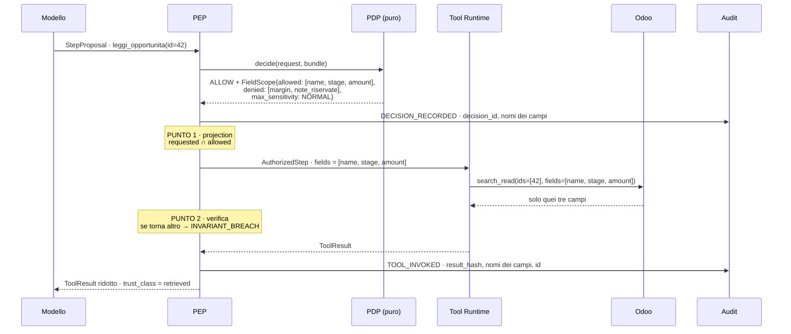

### Come leggerlo

1. Il modello propone. **Non decide**: `AR-RT-01` impone che fra `DECIDE` e `EXECUTE` ci sia
   sempre `AUTHORIZE`, applicato dai tipi (`StepProposal` → `AuthorizedStep`).
2. Il PDP risponde con **decisione + ambito**. È il pattern di `ADR-021`: la decisione non è
   un booleano, è effetto più obbligazioni.
3. **Il campo `margin` non compare mai nella chiamata a Odoo.** È il punto di tutta la
   sezione: Odoo non lo restituisce perché non gli è stato chiesto.
4. L'audit registra **i nomi** dei campi, mai i valori (`AR-OB-05`, `AR-ID-28`).

## 14.5 `ADR-229` — sul percorso documentale la granularità resta il documento. **Per sempre.**

Questa è la metà che **non chiudo**, e la dichiaro non chiudibile per una ragione strutturale,
non per mancanza di tempo.

**Il ragionamento.** Un documento è testo. Il testo non ha campi. Per redigere "il campo
sensibile" dentro un PDF servirebbe:

1. riconoscere che un certo passaggio è sensibile → **un classificatore**, e §7.2 ha già
   spiegato perché non lo costruiamo;
2. rimuoverlo da un `chunk` → ma il `chunk` è la fonte dell'`embedding` (`ADR-074`), quindi
   ogni redazione invaliderebbe l'embedding, e la ricostruibilità di `ADR-076` diventerebbe
   dipendente dal risultato di un classificatore non deterministico;
3. mantenere la coerenza fra chi vede il chunk redatto e chi vede il chunk intero → due
   versioni dello stesso chunk, cioè due embedding, cioè un indice che raddoppia per ogni
   livello di autorizzazione.

**DECISIONE ARCHITETTURALE — `ADR-229`.** Sul percorso documentale l'unità di autorizzazione
resta il **documento**. Un documento porta una `sensitivity_max` dichiarata alla sorgente
(`AR-DG-26`). Se un documento contiene un paragrafo che una certa popolazione non può vedere,
**l'intero documento non è visibile a quella popolazione**.

**Il prezzo, dichiarato e misurato: la sovra-restrizione.** Un contratto di quaranta pagine
con una clausola riservata diventa invisibile per intero. Il retrieval si impoverisce e — ed è
la parte pericolosa — **si impoverisce in silenzio**, perché nessuno sa cosa non ha trovato.

→ Rischio **`R-86`**, con la metrica che lo rende visibile: `over_restriction_rate`, cioè la
quota di documenti esclusi dal pre-filtro per `sensitivity_max` rispetto al totale dei
candidati. È un caso particolare del `retrieval_miss_rate` che `A12` ha già definito, e va
letto insieme a esso.

→ Trigger **`T-DG-06`**: se `over_restriction_rate` supera una soglia dichiarata, si riapre
`ADR-229` verso la **granularità di chunk** — che è il compromesso intermedio: il chunk
eredita l'ACL del documento, ma un documento può essere **spezzato alla sorgente** in più
documenti logici con ACL diverse. Nota bene: **la soluzione non è redigere, è separare a
monte**. È lo stesso principio della projection: si restringe prima, non si cancella dopo.

## 14.6 Cosa resta aperto: `R-17`, la composizione

`ADR-228` **riduce** la superficie di `R-17` ma **non la chiude**, e va detto chiaramente.

Il problema di `R-17`: `export` è lecito, `send` è lecito, `export + send` è esfiltrazione.
La projection agisce su **quali campi** un tool restituisce; non dice nulla su **cosa si fa
con la sequenza di risultati leciti**.

Cosa abbiamo, oggi, contro questo:

| Difesa | Che tipo è | Cosa fa davvero |
|---|---|---|
| `ADR-216` — conferma umana su **ogni** scrittura | controllo | una persona vede l'azione finale. Ma non vede la **sequenza**, e `R-85` dice che la fatica la rende cieca |
| `ADR-198` — guardia sugli identificatori | **sensore** | un id usato in un `SIDE_EFFECT` senza essere stato osservato in un `READ` precedente è uno stato visibile. Rende `R-17` **ricostruibile**, non impedita |
| `ADR-203` — allowlist di egress | controllo strutturale | limita **dove** può andare. È la difesa più forte che abbiamo su questo |
| `ADR-104` — 50 step, 10 minuti | limite quantitativo | un'esfiltrazione massiva in un solo run non ci sta |
| `ADR-220` — cardinalità dichiarata, default 1 | controllo | un tool tocca un record per chiamata salvo dichiarazione |

**Cosa aggiungo io, e non è la soluzione:** i **nomi** dei campi che sono entrati nel context
di un run sono già registrati (`AR-OB-05`, `AR-ID-28` registrano nomi di campo). `ADR-228`
rende quella registrazione **completa**, perché ora il PEP conosce esattamente l'insieme dei
campi ammessi e quello dei campi effettivamente restituiti. Ne segue una proprietà utile:

**per ogni run è ricostruibile l'insieme esatto dei campi di dominio che il modello ha
visto.** Non i valori — i nomi. È il materiale su cui una regola di composizione potrebbe
lavorare in futuro.

→ **`R-17` resta aperta**, e la sua sede naturale resta lo step journal, come `A03` aveva già
detto. `B-11` (taint tracking / information flow control) e `B-89` (difese contro
l'esfiltrazione per composizione) restano aperte. Aggiungo `B-94`, che è la loro versione
applicata a un percorso nuovo: **l'export DSAR** (§23), dove il richiedente ottiene in un solo
file ciò che le policy davano solo a pezzi. → rischio **`R-94`**.

## 14.7 Verdetto su `R-32`

| | Stato |
|---|---|
| **Percorso strutturato (tool → CRM)** | **CHIUSO.** `ADR-228` (`FieldScope`: projection + verifica), `AR-DG-03`, `AR-DG-04`, `INV-39`. `AR-GP-17` è ora implementabile, e nella forma corretta: strutturale invece che filtrante |
| **Percorso documentale** | **DICHIARATO APERTO IN MODO DEFINITIVO.** `ADR-229`. Non è un rinvio: è una limitazione strutturale del mezzo. La granularità è il documento, la sovra-restrizione è il prezzo, `R-86` la misura, `T-DG-06` la riapre verso la separazione a monte — mai verso la redazione |
| **`R-17` (composizione)** | **RESTA APERTO**, con superficie ridotta e ricostruibilità migliorata. `B-11`, `B-89`, `B-94` |
| **`R-32` come voce del registro** | si **chiude** e si **sostituisce** con due voci più precise: `R-86` (sovra-restrizione documentale) e la parte di `R-17` che riguarda i campi |

---

# 15. GOVERNANCE DELLA MEMORIA

## 15.1 La frase del prompt che va presa sul serio

> *"Una persona non deve perdere il controllo sui propri dati personali solo perché sono
> stati convertiti in una rappresentazione di memoria."*

È esattamente il rischio. La memoria è una trasformazione: da *"preferisco i preventivi in
PDF"* detto in una conversazione, a una riga in un database che vive per anni.

## 15.2 Le nove domande del prompt, con risposta

| Domanda | Risposta | Fonte |
|---|---|---|
| **Chi possiede la memoria?** | il `subject`. Noi ne siamo custodi (*custodian*), non proprietari. `scope_type = USER` legato a `subject_id` | `A08`, `AR-ME-18` |
| **Qual è la finalità?** | `PERSONALIZATION`, e solo quella. Una memoria non entra in una decisione di autorizzazione: `INV-12` lo vieta staticamente | `ADR-089`, `INV-12` |
| **Retention** | `NON ANCORA DECISO` — §19.4. Ma la regola sui `DEPARTED` la chiudo qui: `ADR-253` | questo documento |
| **Cancellazione** | tombstone immediato + purge asincrona, **irreversibile** | `ADR-098`, `AR-ME-17` |
| **Correzione** | esiste già: uno degli 8 endpoint REST di memoria di `A08`. La correzione è **supersessione**, mai sovrascrittura (`ADR-102`) | `A08` |
| **Export** | incluso nell'export DSAR (§23). È dato personale `PERSONAL`, quindi è la prima cosa che deve uscire | questo documento |
| **Accesso** | 4 strati: pre-filtro in query, RLS, post-verifica, `MemoryScope` del PDP. `AR-ME-18`: nessuna memoria `USER` è leggibile in un run il cui principal non è quel soggetto | `ADR-096` |
| **Provenance** | `authority` (`EXPLICIT` / `OBSERVED` / `ADMIN` / `PROPOSED`) + i 5 timestamp bi-temporali | `ADR-094`, `ADR-102` |
| **Rischio di poisoning** | `R-33`. Difesa **strutturale**: `INV-12` — una memoria avvelenata non può cambiare i permessi. `FATTO (R-13)`: MINJA raggiunge il 76,8 % di attacchi riusciti e i detector mancano il 66 % delle voci avvelenate. Ecco perché la difesa non può essere il rilevamento | `A13` |

## 15.3 `ADR-253` — la retention dei soggetti `DEPARTED`, che `A09` ha lasciato a me

**Il mandato.** `AR-ID-09` dice: *"la transizione a `DEPARTED` rende le memorie `USER` non
leggibili"*. Non dice per quanto restano.

**Il problema che va visto.** "Non leggibile" e "cancellato" sono cose diverse. Una memoria
non leggibile è ancora nel database, ancora nei backup, ancora esposta a chi abbia accesso
diretto (`R-48`). Se una persona lascia l'azienda, le sue preferenze di lavoro restano lì.

**DECISIONE ARCHITETTURALE — `ADR-253`.** Alla transizione a `DEPARTED`:

1. **immediatamente**: le memorie `scope_type = USER` diventano non leggibili (già `AR-ID-09`)
   **e ricevono un tombstone**, cioè entrano nello stesso percorso di `ADR-098`;
2. **dopo una finestra di grazia dichiarata**: purge fisica;
3. **il valore della finestra è `NON ANCORA DECISO`.** Il criterio: deve essere **più lunga**
   del tempo entro cui un ritorno in azienda è plausibile — perché la memoria è irreplaceable
   e una purge sbagliata non si annulla — e **più corta** del tempo oltre il quale conservare
   preferenze di un ex dipendente non ha più alcuna finalità. Questi due numeri li conosce il
   committente, non io. → **`DEF-13`**;
4. `run_summary` e `conversation` del soggetto seguono la stessa finestra;
5. **l'identità no.** `subject_id` e le righe di audit **restano**, perché servono a leggere
   la storia (`AR-ID-29`). Muoiono solo con una `erasure_request` esplicita (§22).

**Contro-argomento onesto.** C'è una posizione più rigorosa: `DEPARTED` dovrebbe far scattare
la cancellazione immediata, perché la finalità (`PERSONALIZATION`) è cessata nell'istante in
cui la persona non usa più il sistema. È un'obiezione forte. Non l'ho adottata per una ragione
operativa: la finestra di grazia protegge dall'errore amministrativo — un `DEPARTED` messo per
sbaglio distruggerebbe dato non ricostruibile. Se il committente preferisce il rigore, il
parametro è uno solo e si porta a zero.

## 15.4 La memoria e i tre orizzonti — cosa vale per ciascuno

| Orizzonte | Cos'è | Persistente? | Governance |
|---|---|---|---|
| **Working Set** | il digest deterministico del journal del run corrente | no: si ri-renderizza a ogni step | segue il run |
| **Conversation Trail** | i `run_summary` della stessa conversazione | sì | segue la conversazione e il subject |
| **Long-Term Memory** | la tabella `memory` | sì | §15.2, `ADR-253` |

Il fatto che il Working Set **non sia persistito** ma **ri-renderizzato da codice**
(`ADR-090`, `AR-ME-11`) è, di nuovo, una proprietà di governance non progettata come tale:
non esiste un archivio di digest che qualcuno debba cancellare.

---

# 16. GOVERNANCE DELLA KNOWLEDGE

## 16.1 Le nove domande del prompt, con risposta

| Domanda | Risposta | Fonte |
|---|---|---|
| **Owner del documento** | il tenant. La piattaforma non è mai *system of record* | `AR-KN-05` |
| **Source** | una `DocumentSource` dichiarata, con `sensitivity_max` dichiarata | `AR-DG-26` |
| **Classificazione** | dichiarata alla sorgente; il derivato eredita e non può scendere | `AR-DG-22`, `INV-36` |
| **Retention** | segue il documento nella sorgente, più una finestra dichiarata; `NON ANCORA DECISO` — §19.5 | questo documento |
| **Cancellazione** | cascata completa lungo il lineage, verificata da test | §24 |
| **Accesso** | pre-filtro autoritativo **in query** + RLS + post-verifica; ACL **per riferimento**, mai copiate | `ADR-071`, `ADR-072`, `AR-KN-08` |
| **Versione** | `document_version`: 5 entità, 5 cause di invalidazione | `ADR-074` |
| **Provenance** | 11 campi obbligatori. Senza provenance completa, **il frammento non entra nel context** | `AR-KN-04` |
| **Legal hold** | non implementato Day-1; il predicato esiste ed è costante falso | `ADR-245`, §26 |

## 16.2 Le due proprietà che rendono la knowledge facile da governare

**Primo: tutto il derivato è ricostruibile** (`ADR-076`, con **test in CI**). Solo blob,
identità e audit sono `irreplaceable`. Conseguenza pratica: una cancellazione sbagliata di
`chunk` o `embedding` non è un disastro, è una rigenerazione. Il contrario esatto della
memoria.

**Secondo: le ACL sono referenziate, non copiate** (`AR-KN-08`, `ADR-072`). Non abbiamo una
copia dei permessi di Odoo che invecchia: abbiamo una proiezione con una freschezza dichiarata,
e se è stantia il retrieval **fallisce chiuso** su quella sorgente (`AR-KN-09`). Fallire
chiuso su un permesso vecchio è la scelta giusta, ed è già presa.

## 16.3 La governance che manca e che aggiungo

`A07` classifica i documenti per **fonte** e per **freschezza**, ma non per **sensibilità**.
`AR-DG-26` la aggiunge come attributo obbligatorio della `DocumentSource`, ed è ciò che rende
applicabile `ADR-229`.

**Non responsabilità dell'Ingestion Pipeline.** L'ingestion **non** classifica il contenuto,
**non** decide la sensibilità, **non** fa OCR (`ADR-086`), **non** interpreta. Legge la
dichiarazione della sorgente e la propaga. Se qualcuno propone "l'ingestion analizza il
documento e ne deduce la classe", sta costruendo il classificatore che §7.2 ha respinto,
in un posto in cui fa ancora più danno perché il risultato è persistente.

---

# 17. GOVERNANCE DEGLI EMBEDDING — NO, NON SONO ANONIMI

## 17.1 L'assunzione da smontare

Il prompt lo mette fra le istruzioni finali: *"non assumere che gli embedding siano anonimi"*.
Ha ragione, e l'errore è diffuso perché un vettore di 768 numeri in virgola mobile **sembra**
non contenere niente.

**FATTO (interno, `R-27` e `B-32`).** `A07` ha registrato come rischio che *"l'embedding è
dato sensibile (attacchi di inversione)"* e ha aperto `B-32`: *quanto testo si recupera da un
vettore*. **La ricerca non è stata fatta.** Quindi non ho un numero, e non lo invento.

**DECISIONE ARCHITETTURALE, in assenza del numero: trattiamo l'embedding come il testo da cui
deriva.** È l'applicazione diretta di `AR-DG-22`. Costa poco (è già nella stessa tabella,
sotto la stessa RLS) e in caso di sorpresa non ci troviamo scoperti.

## 17.2 Le cinque domande del prompt

| Domanda | Risposta |
|---|---|
| **Controllo di accesso** | stesso del chunk: pre-filtro in query + RLS. L'embedding non è mai raggiungibile senza passare dalla riga protetta |
| **Cancellazione** | cascata dal documento. §24 |
| **Retention** | come il chunk, come il documento |
| **Isolamento per tenant** | `tenant_id` su ogni riga + RLS. **Attenzione**: `T-KN-11` prevede l'indice partizionato per tenant se serve isolamento dell'**indice**, che è una cosa in più dell'isolamento delle righe |
| **Rigenerazione** | è la proprietà che rende tutto gestibile: cambiare modello di embedding significa ricalcolare, non migrare |

## 17.3 La proprietà che ci salva, e che non abbiamo scelto noi

`AR-KN-18`: **nessun embedding esce da un'API.** `ADR-068`: l'embedding si calcola **su CPU,
in un processo separato, in locale**. Quindi:

- il testo da cui si calcola l'embedding **non viene mandato a nessun servizio esterno**;
- il vettore risultante non lascia la macchina.

Se avessimo usato un servizio di embedding cloud — la scelta più comune — avremmo un
trasferimento verso terzi per **ogni documento indicizzato e ogni query posta**. Sarebbe il
flusso di dati più voluminoso dell'intera piattaforma, e sarebbe verso l'esterno.

**Va detto che `ADR-068` è stata presa per una ragione diversa** (non sottrarre VRAM al
modello di generazione, `AS-08`) e che la sua confidenza è **bassa** finché `B-26` non misura.
Se `B-26` andasse male e si tornasse a un servizio esterno di embedding, questo documento
cambia in un punto molto sensibile. → registrato in §55 fra le condizioni che falsificano
l'architettura.

## 17.4 Nota sulla memoria e gli embedding

`ADR-099`: **nessun vector search sulla memoria Day-1**. Quindi non esistono embedding della
memoria. Se `T-ME-01` scattasse e arrivassero, sarebbero embedding di **testo scritto da
persone su sé stesse** — cioè il materiale peggiore per un attacco di inversione. →
**`B-101`**: specializzare `B-32` alla memoria, **prima** di aggiungere `memory_embedding`.

---

# 18. DATO DERIVATO — LA MAPPA DEL LINEAGE

## 18.1 Tutti i derivati che esistono, e cosa succede quando la sorgente muore

| Derivato | Sorgente | Ricostruibile? | Se la sorgente viene cancellata |
|---|---|---|---|
| `parsed_content` | blob | **sì** (`ADR-076`) | cancellazione a cascata |
| `chunk` | `parsed_content` | sì | cascata |
| `embedding` | `chunk` | sì | cascata |
| `entity_link` | parsing + identificatori | sì | cascata |
| `run_summary` | journal, per codice deterministico | **sì**, se il journal c'è | cancellazione con il journal |
| `WorkingSetBlock` | journal | sì, ri-renderizzato a ogni step | **non esiste persistito** |
| `memory` `OBSERVED` | conversazione | **NO** | **non cascata**: sopravvive alla conversazione. §18.2 |
| `memory` `EXPLICIT` | dichiarazione dell'utente | **NO** | non ha sorgente esterna |
| proiezione `grant` | record rule di Odoo | sì | rinfrescata; stantia → fail closed |
| `EvaluationCase` | **un umano che riscrive**, mai una copia | non applicabile | **non cascata**, e §31 spiega perché è corretto |
| `result_hash`, `content_hash` | il contenuto | sì | resta: è un hash, non il dato |
| `audit_event` | ogni operazione | **NO** | **non cascata**: è il punto di §22 |
| `telemetry_span` | ogni operazione | no | scade da sé, prima dell'audit (`INV-35`) |
| valore precedente (`ADR-221`) | il campo di Odoo | **NO** — Odoo non lo conserva (`R-14.7`) | non ha cascata dalla sorgente: è **l'unica copia esistente** |

## 18.2 Il caso che merita attenzione: la memoria derivata da una conversazione cancellata

Se una conversazione viene cancellata e una memoria `OBSERVED` era stata estratta da quella
conversazione, la memoria resta.

**Questo è corretto o sbagliato?** Dipende da cosa la persona sta chiedendo.

- se chiede *"cancella questa conversazione"*, ha chiesto di togliere la trascrizione, non di
  dimenticare la sua preferenza;
- se chiede *"dimenticati di me"* (`erasure_request`), **tutto va**, memoria compresa.

**DECISIONE ARCHITETTURALE.** Sono due operazioni distinte con due nomi distinti, e
l'interfaccia non deve confonderle. La cancellazione di una conversazione è
`SCOPED_DELETION`; la cancellazione del soggetto è `SUBJECT_ERASURE` e passa da §22.

**Nota Day-1 che riduce il problema:** `ADR-094` tiene l'estrazione automatica **disattivata**
Day-1. Le memorie `OBSERVED` si registrano come `PROPOSED` e si misurano, non entrano nello
snapshot (`AR-ME-08`). Quindi Day-1 quasi tutte le memorie sono `EXPLICIT`, cioè dichiarate
dalla persona stessa. È la situazione più semplice anche dal punto di vista della governance,
e vale la pena notarlo: `ADR-094` è stata presa per prudenza sulla qualità e produce un
beneficio privacy che nessuno aveva contato.

## 18.3 Diagramma del lineage

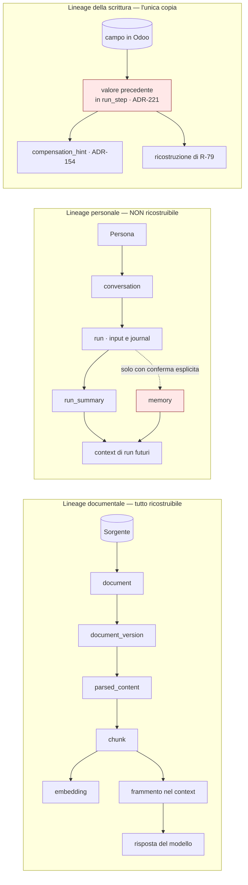

### Come leggerlo

Tre catene, con tre proprietà diverse.

- **In alto**, la catena documentale: ogni anello si ricalcola dal precedente, quindi la
  cancellazione è sicura e la rigenerazione è sempre possibile. È la catena "facile".
- **Al centro**, la catena personale: nessun anello si ricalcola. Se cancelli `memory`, è
  persa. La freccia tratteggiata è deliberata — la conversazione **non** diventa memoria
  automaticamente Day-1 (`ADR-094`).
- **In basso**, la catena della scrittura, in rosso: il valore precedente è **l'unica copia
  esistente al mondo** di quel dato, perché Odoo non lo conserva (`R-14.7`). È un potere e
  una responsabilità che nessun documento aveva registrato come tale.

## 18.4 Il sistema di lineage che **non** costruiamo

**DECISIONE ARCHITETTURALE.** Nessun sistema di lineage dedicato, nessun catalogo, nessun
grafo di lineage.

Il motivo: **il lineage esiste già come colonne**. `document_id` su `chunk`, `chunk_id` su
`embedding`, i 11 campi di provenance di `AR-KN-04`, `root_run_id`/`parent_run_id`/`depth`
di `ADR-125`, `content_hash` ovunque, `entity_link` per il legame con il CRM.

Quello che manca non è uno **store**, è una **query**. Day-1 il lineage è:

1. un insieme di query SQL documentate, una per domanda (*"da quale documento viene questo
   frammento?"*, *"quali embedding derivano da questo blob?"*, *"quali memorie appartengono a
   questo soggetto?"*);
2. un **test in CI** che, per ogni arco del registro `data_assets.yaml`, verifica che la query
   di risalita esista e restituisca il risultato atteso su dati di prova.

Costruire un sistema di lineage separato significherebbe replicare in un secondo posto
informazioni che stanno già nelle chiavi esterne del primo — e `AR-019` vieta un datastore
nuovo senza una misura del limite attuale. → `T-DG-08` è il trigger che riapre.

---

# 19. RETENTION

## 19.1 Il risultato principale, e perché non è una lacuna

**Cerchiamo un obbligo di conservazione citabile che si applichi ai dati che deteniamo. Non
c'è.**

| Fonte in `R-14` | Cosa impone | Si applica a noi Day-1? |
|---|---|---|
| **art. 2220 c.c.** (`R-14.3`, `FATTO`) | conservazione **decennale** delle scritture contabili | **NO.** `ADR-217` mette l'ERP in **sola lettura** Day-1, `ADR-223` toglie i campi amministrativi del contatto dal perimetro, `ADR-222` vieta la modifica dei record `IMMUTABLE_RECORD`. **Non deteniamo scritture contabili.** L'obbligo è del cliente, sul suo Odoo |
| **art. 2215-bis c.c.** (`R-14.3`, `FATTO`) | inalterabilità delle registrazioni; correzione solo con scrittura di rettifica | vincola **come si scrive** (`ADR-222`), non **quanto si conserva** da noi |
| **GDPR, principio di limitazione della conservazione** | non conservare oltre il necessario alla finalità | dà il **criterio**, non il numero. Nessuna norma dice "sei mesi" |
| **AI Act** | `R-14.1` riporta il calendario e le sanzioni, **non** riporta gli obblighi di logging e le loro durate | → **`B-96`**: `RICHIEDE RICERCA` |

**INTERPRETAZIONE NOSTRA.** Day-1 nessun periodo di retention è derivabile da una norma
citata. Tutti i valori restano `NON ANCORA DECISO`, con un criterio dichiarato per ciascuno.
**Questo non è un rinvio comodo: è la posizione onesta.** Un numero inventato in un documento
architetturale diventa, nel giro di due trimestri, "il numero che avevamo deciso".

→ **`DEF-13`**: i valori concreti di retention per categoria. Owner: il committente, con
parere legale. Scadenza: **prima dello schema del database**, perché la retention determina
il partizionamento delle tabelle append-heavy.

## 19.2 Dati di esecuzione

| Dato | Valore | Criterio per fissarlo |
|---|---|---|
| **`run.input` (testo dell'utente)** | `NON ANCORA DECISO` | **deve essere la più corta di tutte** le retention di esecuzione, perché è il serbatoio di dato personale meno controllabile (`R-87`) e può contenere categorie particolari (§7.3). Il vincolo dal basso: quanto tempo un utente deve poter rileggere cosa aveva chiesto |
| `run.output` | `NON ANCORA DECISO` | come `run.input` |
| `run_step` / journal | `NON ANCORA DECISO`, **≥ `run.input`** | il journal serve al recovery (giorni), alla ricostruzione di un'azione contestata (mesi), e alla promozione a workflow (`ADR-028`). Il vincolo dominante è il secondo |
| **valore precedente (`ADR-221`)** | `NON ANCORA DECISO`, **< journal** | serve a due cose e a nessun'altra: alimentare il `compensation_hint` (`ADR-154`) e rendere ricostruibile `R-79`. La prima dura ore, la seconda quanto la finestra di rilevamento di una corruzione. **È l'unico dato di dominio che deteniamo: la sua retention è la più difendibile da accorciare** (`ADR-241`) |
| `conversation`, `run_summary` | `NON ANCORA DECISO` | quanto deve durare la continuità fra sessioni di lavoro |
| `job`, `outbox` | breve, operativa | il lavoro è finito; restano solo per la diagnosi |

## 19.3 Identità

| Dato | Valore | Criterio |
|---|---|---|
| `subject` e attributi | vita del rapporto + finestra | dipende da `Q-03`. Se on-premise, è il cliente a deciderlo |
| `session` | `B-44` aperta (`A09` non ha fissato le durate) | non è retention, è sicurezza |
| `EXTERNAL_IDENTITY_LINK` | segue il subject | — |
| soggetti `DEPARTED` | **`ADR-253`**, finestra `NON ANCORA DECISO` | §15.3 |

## 19.4 Memoria

`NON ANCORA DECISO`. **Criterio, in tre vincoli:**

1. **dal basso**: una preferenza deve durare abbastanza da essere utile. Se scade in una
   settimana, l'intera funzione è inutile e `R-40` (la memoria non viene usata) si realizza;
2. **dall'alto**: una preferenza vecchia di anni è probabilmente **sbagliata**, e una memoria
   sbagliata è peggio di nessuna memoria — è `R-79` applicata alle preferenze;
3. **il vincolo che conta di più**: la memoria è **irreplaceable**. Una retention aggressiva
   distrugge dato non ricostruibile. In dubbio, la retention della memoria si allunga, **non**
   si accorcia, e la difesa privacy passa dai diritti del soggetto (§23), non dalla scadenza.

**Nota: la retention *per tipo* di memoria è già nel `FUTURE` di `A08`.** Questo documento
conferma che è il modo giusto: una preferenza di formato e una nota amministrativa non hanno
la stessa vita.

## 19.5 Knowledge

| Dato | Valore | Criterio |
|---|---|---|
| `document` e derivati | `NON ANCORA DECISO` | **segue la sorgente**: se il documento sparisce da Odoo o dal DMS, sparisce dal nostro indice entro la finestra di polling + una finestra di grazia. È il *reconciliation sweep* di `ADR-081` che lo rileva |
| blob | finché una riga lo referenzia | content-addressed: un blob senza riferimenti è spazzatura, e la sua purge è sicura per costruzione |
| `retrieval_audit` | **segue l'audit**, non la knowledge | è prova di cosa è stato mostrato a chi: sopravvive al documento |

## 19.6 Audit — il valore più lungo, e il più delicato

`NON ANCORA DECISO`, e **RICHIEDE PARERE LEGALE**.

**Criterio, in quattro vincoli:**

1. **dall'alto**: conservare per sempre è una violazione del principio di limitazione della
   conservazione. "L'audit è per sempre" non è una posizione difendibile;
2. **dal basso, ed è il vincolo che tende a vincere**: l'audit è la prova in una contestazione.
   Se un cliente contesta un'azione dell'agent tre anni dopo, l'assenza di audit è un problema
   nostro, non suo;
3. **il collegamento con l'inalterabilità contabile**: `R-14.3` dice che *"il log delle
   forzature diventa oggetto di verifica del revisore"*. **INTERPRETAZIONE NOSTRA**: quando la
   superficie di scrittura si estenderà all'ERP (`T-SE-10`), l'audit delle scritture dell'agent
   diventerà materiale di verifica, e la sua durata dovrà essere coerente con quella dei
   documenti che descrive. Non dico "dieci anni" perché non ho una fonte che lo dica del
   nostro audit;
4. **il vincolo tecnico**: la retention dell'audit determina il volume, e il volume determina
   il partizionamento. È il numero che serve **prima dello schema**.

## 19.7 Telemetria, evaluation, backup

| Dato | Valore | Criterio |
|---|---|---|
| `telemetry_span` | `NON ANCORA DECISO`, **strettamente < audit** (`INV-35`) | serve a diagnosticare, cioè a guardare indietro di giorni o settimane, non di anni. `A12` aveva lasciato i valori di `ADR-184` non decisi: qui fisso **l'ordinamento**, che non richiede numeri |
| `metric_sample` | può essere **più lunga** degli span | è aggregato e privo di identificatori (`AR-OB-04`): il costo privacy è quasi nullo e il valore di una serie storica lunga è alto |
| `DebugCapture` | **la più corta di tutte**, con spegnimento automatico | `AR-OB-09` lo impone già; qui aggiungo che la sua attivazione è un evento di sicurezza notificato al tenant (`ADR-209`) |
| `EvaluationCase` | vita del progetto | sono file in git. Non contengono dato personale **per costruzione** (`ADR-240`), quindi la retention lunga è legittima. **È l'unico caso in cui la retention lunga è la risposta giusta** |
| **backup** | `NON ANCORA DECISO`, **dipende da `DEF-06` (RPO/RTO), che è di `C24` e resta aperta** | qui non la chiudo. Ma fisso il vincolo di coerenza: §25 e `R-96` |

## 19.8 `INV-35` — l'invariante che si può imporre senza numeri

> **`INV-35`.** Per ogni fatto registrato in entrambi i piani, il record di telemetria che lo
> descrive **non sopravvive** al record di audit corrispondente.
> Formalmente: `retention(telemetry) < retention(audit)`, per ogni classe.

**Perché è importante.** `INV-27` stabilisce il confine audit/telemetria nello **spazio**
(nessun controllo dipende dalla telemetria). `INV-35` lo stabilisce nel **tempo**. Senza,
succede una cosa perversa: la telemetria dura più dell'audit, e diventa **l'unica traccia
rimasta** di un fatto. A quel punto qualcuno la userà per rispondere a una domanda di
conformità, e `AR-OB-02` sarà violata non per scelta ma per erosione.

È verificabile con una query sul registro di retention: nessun numero necessario, solo un
ordinamento.

---

# 20. IL MOTORE DI RETENTION

## 20.1 Le quattro alternative del prompt

| Opzione | Cosa sarebbe | Verdetto |
|---|---|---|
| **Codice applicativo** | `DELETE FROM x WHERE created_at < now() - interval '90 days'` sparso nel codice | **No.** Il periodo finisce in una costante, nessuno lo trova, cambiarlo richiede un rilascio |
| **Job di database** (`pg_cron`) | scheduler dentro PostgreSQL | **No.** Introduce un secondo scheduler accanto a quello che `ADR-151` ha già definito come **ruolo di processo**. `AR-004`: un piano è una responsabilità, non un processo |
| **Policy engine centralizzato** | un servizio di retention | **No.** `AR-019`: nessun componente nuovo senza una misura del limite attuale |
| **Ibrido: policy come dato + esecuzione nei job esistenti** | la regola è una riga, l'esecuzione è un `job_type` | **Sì** |

## 20.2 `ADR-234` — la retention è una riga di policy, eseguita da un `job_type`

**DECISIONE ARCHITETTURALE.**

**La regola** è una riga nel Control Plane, versionata come tutte le altre (`ADR-004`: le
Policy sono dato, non codice):

```text
RetentionPolicy {
  data_asset:        DataAssetId       # deve esistere nel registro · AR-DG-01
  scope:             PLATFORM | TENANT # un tenant può solo RESTRINGERE · ADR-025
  retention_period:  Duration | NULL   # NULL = NON ANCORA DECISO · non esegue
  action:            TOMBSTONE | PURGE | ANONYMIZE | ARCHIVE
  hold_predicate:    HoldPredicateId   # Day-1 costante falso · ADR-245
  bundle_version:    Version
}
```

**L'esecuzione** è un `job_type` nel pool che `ADR-142` ha già definito. Non un processo
nuovo, non un servizio, non un cron di database.

### Le cinque proprietà che rendono questa forma corretta

1. **`retention_period = NULL` non cancella niente.** Un valore `NON ANCORA DECISO` è un
   valore rappresentabile, e produce inazione invece che comportamento arbitrario. È
   fondamentale, perché §19 dice che Day-1 quasi tutti i valori sono `NULL`.
2. **Un tenant può solo restringere** (`ADR-025`, `AR-GP-09`). Un tenant può volere una
   retention più corta della nostra; non può volerla più lunga, perché la conservazione oltre
   il necessario è un problema del titolare, e non gliela vendiamo.
3. **`AR-DG-08`: nessun job di retention cancella righe di audit.** Verificato staticamente:
   la lista delle tabelle su cui il job può operare è chiusa e non contiene l'audit. §22
   spiega perché.
4. **Il job dichiara la propria `max_staleness`** (`ADR-163`, `INV-24`): un job di retention
   che smette di girare è un **evento di errore**, non una metrica assente. Senza questo,
   `R-95` (la retention non viene mai applicata) sarebbe invisibile.
5. **Ogni esecuzione scrive nel `deletion_ledger`** (`ADR-237`), che è ciò che rende la
   cancellazione verificabile e sopravvivente a un restore.

### Non responsabilità del motore di retention

- **non** decide i periodi: li legge;
- **non** cancella dai backup: non può, §25;
- **non** cancella dai sistemi esterni: `INV-33` vieta la cancellazione fisica su Odoo, esiste
  solo `archive` (`ADR-218`);
- **non** tocca l'audit;
- **non** valuta l'obbligo giuridico: consulta un predicato che qualcun altro ha scritto.

## 20.3 `ADR-245` — legal hold: non Day-1, ma il predicato esiste

**FATTO (interno).** Nessun requisito di legal hold è stato espresso. `Q-02` (SLA/RPO/RTO) è
aperta e non riguarda i legal hold.

**DECISIONE ARCHITETTURALE.** Non si costruisce un sistema di legal hold Day-1. **Ma il motore
di retention consulta comunque `hold_predicate` prima di ogni cancellazione, e Day-1 quel
predicato restituisce sempre falso.**

Il costo è una riga di codice. Il beneficio: quando arriverà il primo requisito reale
(`T-DG-05`), il punto di aggancio esiste, invece di dover reinserire un controllo in ogni
percorso di cancellazione già scritto — che è il modo in cui si dimenticano i percorsi.

È lo stesso ragionamento di `ADR-125` (le colonne di lineage degeneri Day-1) e di `ADR-239`
(la colonna `key_ref` degenere): **le cose impossibili da aggiungere dopo si mettono adesso,
anche se non fanno niente.**

---

# 21. SEMANTICA DELLA CANCELLAZIONE

## 21.1 Gli stati, e su cosa stanno

Il prompt propone `ACTIVE / DELETION_REQUESTED / DELETING / DELETED / LEGAL_HOLD` e chiede se
servano.

**DECISIONE ARCHITETTURALE — `ADR-235`: gli stati stanno sulla *richiesta*, non su ogni riga.**

Mettere cinque stati su ogni tabella significa aggiungere colonne di stato dappertutto e
scoprire dopo sei mesi che metà del codice non le controlla. Invece:

```text
ErasureRequest {
  request_id, tenant_id, subject_id | scope_ref
  kind:        SUBJECT_ERASURE | SCOPED_DELETION | RETENTION_EXPIRY
  state:       REQUESTED → RUNNING → COMPLETED | PARTIAL | HELD | FAILED
  requested_by, requested_at, reason
  tasks:       [ErasureTask]     # una per store
}
```

Ogni `ErasureTask` conosce **un solo** store e il meccanismo corretto per quello store. Lo
stato `PARTIAL` è essenziale e va guardato: significa *"alcuni store sono a posto, altri no,
e sappiamo quali"*. Nascondere un `PARTIAL` dietro un `COMPLETED` è il modo in cui si finisce
a dichiarare cancellazioni che non sono avvenute.

## 21.2 Quale meccanismo, per quale store

Il prompt chiede di confrontare hard delete, soft delete, tombstone, cancellazione
crittografica e scadenza. La risposta non è una: è **una per store**.

| Store | Meccanismo | Perché |
|---|---|---|
| `memory` | **tombstone + purge** (`ADR-098`) | il tombstone rende il dato invisibile **subito**; la purge asincrona lo distrugge. Irreversibile |
| attributi di identità (nome, email) | **hard delete** | è il perno dell'identity shredding (§22). Deve sparire davvero |
| `subject_id` e la riga di subject | **resta**, con stato `ERASED` | `ADR-107`: mai riassegnato. Cancellarlo permetterebbe la collisione, che è peggio |
| `run.input`, `run.output` | **hard delete** o **anonimizzazione** (sostituzione con un marcatore) | l'anonimizzazione preserva la struttura del journal; l'hard delete è più semplice. Day-1: hard delete |
| journal (`run_step`) | **hard delete** alla scadenza | non è audit: è stato di esecuzione |
| valore precedente (`ADR-221`) | **hard delete anticipato**, prima del resto del journal | §19.2 |
| `document` e derivati | **cascata**, ricostruibile | §24 |
| blob | **hard delete** quando nessuna riga lo referenzia | content-addressed: sicuro per costruzione |
| **`audit_event`** | **nessuna cancellazione ordinaria.** Identity shredding (`ADR-236`), o break-glass (`ADR-238`) | §22 |
| `telemetry_span` | **scadenza per partizione** (`DROP PARTITION`) | volume alto, valore basso, nessun contenuto |
| **Odoo** | **mai cancellazione fisica.** Solo `archive` (`INV-33`, `ADR-218`) | `R-14.7`: `unlink()` non passa da `write()`, quindi salta le automazioni. E su `res.partner` le dipendenze sono pervasive |
| **backup** | **solo scadenza**, mai selettiva | §25 |
| `EvaluationCase` | cancellazione del file, revisione git | non contiene dato personale (`ADR-240`) |

## 21.3 La riga di Odoo che va spiegata bene, perché è controintuitiva

**FATTO (`R-14.7`).** In Odoo `active = False` è un soft delete: record e relazioni restano nel
database, spariscono dalle viste, e si torna indietro disarchiviando. `unlink()` è distruttivo,
e **non passa da `write()`**, quindi salta le automazioni agganciate alla scrittura — log di
audit, sincronizzazioni, azioni "On Update". Le fonti lo chiamano *"una fonte comune di
incoerenza silenziosa con i sistemi esterni"*. E il ciclo "cerca `active = False` e cancella"
su `res.partner` è definito *"un vero autogol"*, perché i partner archiviati spesso reggono
ancora registrazioni contabili vive.

**Ne segue una cosa che va detta senza giri:** se un data subject chiede la cancellazione dei
propri dati **dal CRM del cliente**, quella richiesta **non la eseguiamo noi**. Va al titolare,
che è il cliente, sul suo Odoo. `INV-33` ci vieta la cancellazione fisica, e `ADR-218` ci
lascia solo `archive`.

**INTERPRETAZIONE NOSTRA.** È la posizione giusta anche giuridicamente, non solo tecnicamente:
il titolare di quel dato è il cliente. Un fornitore che cancellasse record contabili di un
altro perché un terzo gliel'ha chiesto starebbe facendo un danno, non un favore.

→ registrato come limite esplicito in §23 e nella comunicazione al data subject.

## 21.4 Perché il soft delete non basta, e perché a volte è l'unica cosa che c'è

Il prompt lo dice: *"non usare il soft delete come sostituto di un requisito di cancellazione
reale"*. È corretto, e vale per noi: `memory` usa il tombstone come **primo passo**, non come
punto d'arrivo. La purge è obbligatoria e ha il suo `job_type`.

Ma esiste un caso in cui il soft delete è tutto ciò che possiamo fare, ed è Odoo. Lì la
"cancellazione" disponibile è l'archiviazione, per decisione di dominio del committente
(`ADR-218`) e per prudenza tecnica (`R-14.7`). **Lo diciamo, invece di far finta che sia una
cancellazione.**

---

# 22. LA TENSIONE CENTRALE — AUDIT APPEND-ONLY CONTRO DIRITTO ALLA CANCELLAZIONE

Il mandato è esplicito: *verificare che la soluzione di `A07` e `A08` regga davvero, e dire
cosa succede quando un'autorità chiede la cancellazione di un dato che sta in un audit
immutabile*.

## 22.1 Il conflitto, in due righe

- **`INV-05`**: l'audit è append-only e non condivide tabella con lo stato mutabile.
- Il diritto alla cancellazione chiede di far sparire dei dati.

**Non si possono soddisfare entrambi nella forma ingenua.** Chi dice il contrario sta
nascondendo qualcosa. Vediamo quanto lontano si arriva prima che il conflitto morda.

## 22.2 Primo strato — nell'audit non c'è quasi niente da cancellare

**FATTO (interno).** Le regole in vigore:

| Regola | Cosa dice |
|---|---|
| `ADR-083`, `ADR-084` | l'audit registra **identificatori e hash, mai testo** |
| `AR-ID-28` | nessun evento di audit contiene segreti, token, password, contenuto di documenti, `value_text`, campi di dominio |
| `AR-KN-12` | l'audit del retrieval registra identificatori e hash, mai il testo |
| `AR-ME-16` | l'audit della memoria registra identificatori e hash, **mai** `value_text` |
| `AR-OB-05` | un'approvazione registra i **nomi** dei campi modificati, mai i valori |

**INFERENZA (nostra).** Ne segue che una riga di audit contiene, di dato personale, **solo
identificatori pseudonimi**: `subject_id`, `on_behalf_of`, `tenant_id`, `acl_subject`, id di
record del CRM, hash. Nessun nome, nessuna email, nessun testo, nessun valore di campo.

**Questo riduce enormemente il problema, ma non lo elimina**, per due motivi che vanno detti:

1. un identificatore pseudonimo **resta dato personale** (§30). "È solo un UUID" non è una
   difesa;
2. `acl_subject` (`odoo:res.users:42@<create_date>`) **risolve dentro Odoo**. Non è
   pseudonimo rispetto a chi ha accesso a Odoo, cioè rispetto al cliente.

## 22.3 Secondo strato — `ADR-236`, l'identity shredding

**L'idea.** Se il dato personale nell'audit è un identificatore, e l'identificatore è opaco e
generato da noi, allora **si distrugge la chiave, non la serratura**.

**FATTO (interno, `ADR-107`).** `subject_id` è un UUIDv4 opaco, immutabile, generato da noi,
globalmente unico, **mai riassegnato**. Tutto ciò che muta — nome, email, ruolo, stato — sta
in righe collegate. La fusione di account produce un alias `merged_into` risolto in lettura,
mai una riscrittura dell'audit.

**DECISIONE ARCHITETTURALE — `ADR-236`.** La cancellazione di un data subject consiste nella
distruzione fisica di **tutto ciò che risolve `subject_id` in una persona**:

1. la riga degli attributi (nome, email, telefono, ogni identificatore diretto) → **hard
   delete**;
2. le credenziali → hard delete (`INV-14` garantisce che non esistano copie altrove);
3. **l'intera chiusura degli alias `merged_into`** — non una riga, tutte quelle che
   raggiungono lo stesso essere umano → `AR-DG-09`;
4. `EXTERNAL_IDENTITY_LINK` verso `acl_subject` → **rotto**, cioè cancellato, non marcato
   stantio. È il passo che toglie il ponte verso Odoo;
5. le memorie, i `run_summary`, le `conversation`, i `run.input`/`run.output` → cancellati
   secondo §21.2;
6. la riga `subject` **resta**, in stato `ERASED`, **senza attributi**.

**Il risultato.** Le righe di audit restano, complete, immutate. Portano `subject_id`. Ma
`subject_id` non risolve più niente: **abbiamo distrutto l'unica chiave che lo trasformava in
una persona.**

**Perché il passo 6 è necessario e non è una furbizia.** Se cancellassimo anche la riga
`subject`, un futuro `subject_id` potrebbe — in teoria, per un bug o un `setval()` — collidere.
`ADR-107` e `AR-ID-01` esistono proprio per impedire che una persona nuova erediti la storia
di una vecchia. Tenere il segnaposto vuoto è ciò che rende sicuro il resto.

→ **`INV-38`**: dopo il completamento di una `erasure_request`, nessuna riga della piattaforma
permette di risolvere quel `subject_id` in un identificatore diretto della persona. Test:
si esegue l'erasure su un soggetto di prova e si verifica che ogni percorso di risoluzione
restituisca vuoto.

### Perché questo è *coerente* con l'architettura e non un trucco nuovo

È crypto-shredding — distruggere la chiave invece del dato — applicato all'**identità**
invece che alla cifratura. E poggia su una decisione presa da `A09` per tutt'altra ragione
(`ADR-107`, `subject_id` opaco perché non deve derivare da un dato mutabile). **`A09` ha
costruito lo strumento senza sapere a cosa sarebbe servito.**

## 22.4 Il contro-argomento, e va preso sul serio

**`ADR-236` non è anonimizzazione.** Va detto chiaramente, perché la tentazione di dire
"adesso il dato è anonimo, quindi il GDPR non si applica più" è forte e sarebbe falsa.

| Buco | Perché resta |
|---|---|
| **`acl_subject` risolve in Odoo** | rompiamo il **nostro** link, ma nell'audit resta la stringa `odoo:res.users:42@…`. Chi ha accesso a Odoo risolve. **Mitigazione parziale**: la stringa si può sostituire con il suo hash nell'audit, perdendo la leggibilità in favore della non-risolvibilità. **`NON ANCORA DECISO`**: è un trade-off fra la difendibilità della cancellazione e la leggibilità di un audit che serve proprio a dire *chi* |
| **Re-identificazione per pattern** | un `subject_id` che agisce ogni martedì alle 9 su un certo insieme di clienti è identificabile da chi conosce l'organizzazione. È il problema classico dei log pseudonimizzati → **`B-99`** |
| **Gli id di record del CRM restano** | l'audit dice che il `subject_id` X ha modificato `res.partner/1234`. Se il data subject **è** il partner 1234, l'audit contiene un riferimento a lui che sopravvive. Ma quel riferimento appartiene al cliente, non a noi: sta nel suo Odoo, ed è lui il titolare |
| **I backup** | contengono la tabella degli attributi **prima** della cancellazione. §25 e `ADR-237` |

**RICHIEDE PARERE LEGALE, e questa è la domanda precisa da porre:** *la pseudonimizzazione
irreversibile rispetto al titolare soddisfa una richiesta di cancellazione ai sensi dell'art.
17 GDPR, e quali eccezioni dell'art. 17(3) coprono un audit trail di sicurezza?*
→ **`B-95`**. `R-14` non riporta l'art. 17, quindi **non ho una fonte da citare** e non
costruisco l'argomento su una norma che non ho verificato.

## 22.5 Terzo strato — `ADR-238`, quando un'autorità chiede la rimozione fisica

Ipotesi: `ADR-236` non basta. Un'autorità ordina la rimozione fisica di righe specifiche
dall'audit. Cosa facciamo?

Le tre risposte possibili, e perché due sono sbagliate:

| Risposta | Perché no |
|---|---|
| *"L'audit è immutabile, non possiamo"* | è vero tecnicamente e insostenibile davanti a un ordine. Un `INV` architetturale non è superiore a un provvedimento |
| *"Cancelliamo la riga"* | `INV-05` viene violata **in silenzio**, e da quel momento l'intero valore probatorio dell'audit è compromesso senza che nessuno lo sappia. È il caso peggiore |
| **`ADR-238`: si cancella, e la cancellazione si confessa** | ← |

**DECISIONE ARCHITETTURALE — `ADR-238`.** Esiste **un solo** percorso di rimozione fisica da
una tabella di audit, ed è una procedura break-glass che:

1. richiede **due operatori distinti** — stessa forma di `ADR-195` per la classe irreversibile
   ad alta sensibilità;
2. passa dal PDP, come ogni altro percorso di contenimento (`INV-31`: non esistono percorsi
   privilegiati di emergenza);
3. **prima** di rimuovere, scrive una riga in un registro separato, `audit_redaction`, che
   contiene: quali righe (per identificatore e **hash della riga rimossa**), quante, quando,
   su ordine di chi, con quale riferimento del provvedimento, e i due operatori;
4. `audit_redaction` è **esso stesso append-only** e non è raggiungibile dallo stesso percorso:
   se qualcuno vuole cancellare la confessione, deve cancellare un registro che non ha una
   procedura di cancellazione;
5. produce un **evento di sicurezza** notificato al tenant (stessa forma di `ADR-209` per
   `DebugCapture`).

→ **`INV-37`**: nessuna riga di audit è rimossa fisicamente se non attraverso `audit_redaction`;
per ogni rimozione esiste **esattamente una** riga firmata in quel registro. Verificabile:
si confronta il conteggio delle righe rimosse dichiarato nel registro con i buchi nella
sequenza dell'audit.

**La proprietà che questo compra.** Chi legge l'audit domani può sapere che è stato alterato,
quanto, quando e perché. **Non conserviamo l'integrità — conserviamo la conoscenza della sua
perdita.** È il massimo ottenibile, e vale più di quanto sembri: un audit di cui non si sa se
è completo non vale niente; un audit incompleto di cui si conosce esattamente la lacuna vale
quasi quanto uno completo.

**Contro-argomento onesto.** Il registro `audit_redaction` contiene l'hash delle righe rimosse.
Se una riga rimossa conteneva `subject_id`, l'hash **non** lo rivela, ma consente a chi
conosce il `subject_id` di verificare che quella riga esisteva. È un residuo di conferma di
appartenenza. Lo accetto perché è ciò che rende il registro verificabile — e lo dichiaro,
invece di scoprirlo dopo.

→ trigger **`T-DG-07`**: la prima richiesta reale di questo tipo tira fuori `ADR-238` dal
cassetto e obbliga a rinegoziare `INV-05` con il committente.

## 22.6 Diagramma — cosa succede a una richiesta di cancellazione

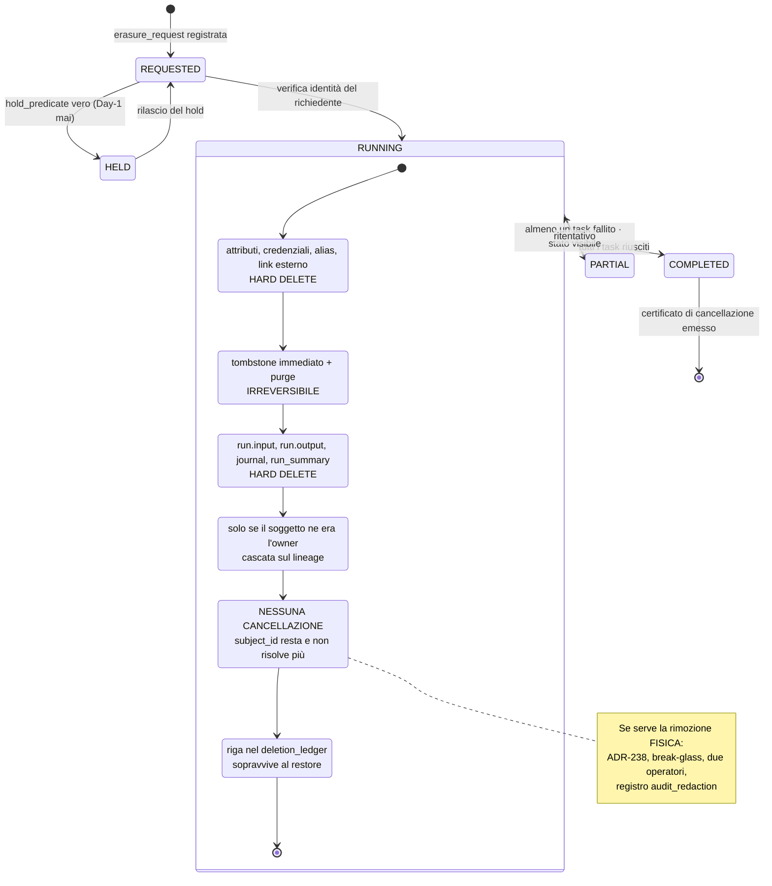

### Come leggerlo

La richiesta attraversa **tutti** gli store, in ordine, e ogni passo ha un meccanismo diverso.
Le due caselle che meritano attenzione:

- **`Audit`**: non cancella niente. È il punto della sezione. Il `subject_id` resta, e dopo il
  passo `Identita` non risolve più.
- **`Ledger`**: l'ultimo passo scrive nel `deletion_ledger`. Sembra burocrazia ed è la cosa che
  rende la cancellazione **vera nel tempo**: §25 spiega che senza quel ledger un restore
  riporta in vita tutto.

Lo stato **`PARTIAL`** è un esito legittimo e visibile. Non si nasconde: `AR-OB-14` dice che
la violazione di una guardia è un evento di errore.

---

# 23. DIRITTI DEL DATA SUBJECT

## 23.1 Premessa obbligatoria

**RICHIEDE PARERE LEGALE.** Quali diritti si applicano, a chi, e con quali eccezioni, dipende
dalla qualificazione di titolare/responsabile (§8), che dipende da `Q-03`. Qui descrivo
**cosa la piattaforma è tecnicamente in grado di fare**, non cosa è tenuta a fare.

`R-14` riporta come `FATTO` l'art. 22 (decisioni automatizzate) e la sentenza C-634/21
(SCHUFA), non gli artt. 15-20. Quindi tratto i diritti come **capacità architetturali** e non
cito norme che non ho verificato.

## 23.2 Le sei capacità

| Diritto | Capacità tecnica | Copertura | Limite dichiarato |
|---|---|---|---|
| **Accesso** | export strutturato di tutto ciò che riguarda il soggetto, dai **nostri** store | completa sui nostri store | **non include i dati del CRM**: quelli sono del cliente, e la richiesta va a lui |
| **Rettifica** | esiste già per la memoria (endpoint di `A08`, supersessione `ADR-102`); per l'identità è amministrazione ordinaria | completa | il dato del CRM si rettifica in Odoo. E su record `IMMUTABLE_RECORD` si rettifica **con una scrittura nuova**, mai modificando (`ADR-222`, art. 2215-bis) |
| **Cancellazione** | §22 | completa sui nostri store, con il residuo dell'audit dichiarato | l'audit sopravvive pseudonimizzato. `B-95` |
| **Portabilità** | l'export di accesso in formato leggibile da macchina | parziale | il formato standard non è stabilito → **`B-100`** |
| **Opposizione** | disattivazione della memoria per il soggetto (le memorie diventano non leggibili) e possibilità di non usare l'agent | parziale | l'opposizione al trattamento necessario all'erogazione del servizio non è tecnicamente separabile dal non usare il servizio |
| **Limitazione** | stato `RESTRICTED` sul subject: i dati restano, il trattamento si ferma. È **la stessa meccanica** di `HALT_SUBJECT` del `KillSwitch` (`ADR-212`) | completa | — |

**Nota su `ADR-212`.** Il `KillSwitch` è stato progettato da `A13` per contenere un incidente
di sicurezza. `HALT_SUBJECT` — fermare ogni run per conto di un soggetto — è **esattamente** il
meccanismo che serve per il diritto di limitazione. Non serve costruire niente: serve
riconoscere che lo stesso interruttore ha due usi.

## 23.3 `ADR-246` — l'export

**DECISIONE ARCHITETTURALE.**

**Cosa contiene:**

| Sezione | Da dove |
|---|---|
| profilo | `subject`, attributi, ruoli, stato |
| conversazioni | `conversation`, `run.input`, `run.output`, `run_summary` |
| memoria | `memory` attive e superate, con `authority` e i 5 timestamp |
| documenti | **solo quelli di cui il soggetto è owner dichiarato**, per riferimento e non per contenuto se il blob è del tenant |
| attività | un estratto dell'audit **riguardante il soggetto**, per identificatori |
| manifesto | data, ambito, versione del formato, `data_asset` inclusi ed **esclusi**, con la ragione dell'esclusione |

**Il manifesto degli esclusi è la parte che di solito manca**, ed è quella che rende l'export
onesto: dice esplicitamente *"i dati sui clienti che hai gestito non sono qui, perché non sono
nostri"*.

**Come si costruisce, e le tre regole non negoziabili:**

1. **sotto RLS, con l'identità del richiedente** (`AR-DG-28`): l'export **non** è un percorso
   privilegiato. Se lo fosse, sarebbe il modo più semplice di aggirare ogni policy;
2. **non attraversa mai il confine di tenant**;
3. **scrive la propria riga di audit prima di restituire**, come il `Reproduction Bundle`
   (`AR-OB-18`).

**Il rischio nuovo, e non è piccolo — `R-94`.** Un export mette in un solo file ciò che le
policy davano solo a pezzi. È `R-17` (l'esfiltrazione per composizione) travestita da diritto
del data subject: chi controlla un account può chiedere l'export e ottenere in una volta
sola l'intero storico. Mitigazioni Day-1: autenticazione forte per la richiesta, notifica
all'amministratore del tenant, `rate limiting` sulla generazione, e — la più importante —
**l'export contiene solo ciò che riguarda il richiedente**, mai il contesto in cui appare.
→ `B-94`.

**Cosa questo export NON è.** Non è l'export di audit per conformità: quello è **`DEF-08`**,
è di `A16`/`C26`, e **non lo chiudo qui**. Sono due cose diverse: uno serve a una persona per
i propri dati, l'altro serve a un revisore per l'intero sistema.

## 23.4 Volume atteso e forma del processo

**ASSUNZIONE `AS-52`**, confidenza Media: le richieste Day-1 sono nell'ordine di poche unità
l'anno, quindi un processo **semi-manuale** basta — un amministratore che avvia
l'`ErasureRequest` e ne verifica l'esito.

Se fosse falsa (utenti finali numerosi, deployment SaaS con molte persone), servirebbe
l'automazione completa con verifica dell'identità del richiedente, che è un problema di
sicurezza a sé — chi chiede la cancellazione dei dati di un altro fa un attacco.
→ trigger **`T-DG-02`**.

## 23.5 Il collegamento con l'art. 22 e la sentenza SCHUFA

**FATTO (`R-14.2`).** L'art. 22 vieta le decisioni basate **unicamente** su trattamento
automatizzato che producano effetti giuridici o similmente significativi. L'eccezione è
l'intervento umano, ma *"l'intervento umano deve essere sostanziale, non meramente formale"*.

**FATTO (`R-14.2`).** Sentenza **C-634/21 (SCHUFA)**: la nozione di "decisione" include anche
lo **scoring prodotto da un terzo su cui un altro soggetto basa in modo determinante la
propria scelta**.

**INFERENZA (nostra), ed è una delle osservazioni più utili di questo documento.**

`ADR-216` impone la conferma umana su **ogni** scrittura. `ADR-189` impone che l'oggetto
dell'approvazione sia un `ActionBinding` **tipizzato**, non una narrazione del modello.
`ADR-196` richiede, oltre al tasso di approvazione, anche `approval_decision_time_p50` e
`approval_modification_rate`. `A12` richiede che l'endpoint di approvazione registri
`modified_fields[]`.

Queste quattro decisioni sono state prese per ragioni di **sicurezza** (contro `ASI09`,
l'approvazione riflessa) e di **qualità**. Ma insieme producono, senza che nessuno l'abbia
progettato, **la prova che l'intervento umano è sostanziale e non meramente formale**:

- che una persona ha visto la struttura dell'azione, non una narrazione (`ADR-189`);
- **quanto tempo** ci ha messo a decidere (`approval_decision_time`);
- **se ha modificato** la proposta, e quali campi (`modified_fields[]`).

Un intervento umano che dura 400 millisecondi e non modifica mai niente è, con ogni
evidenza, formale. Un intervento che dura, e che a volte corregge, è sostanziale. **Noi
misuriamo la differenza.**

→ **DECISIONE ARCHITETTURALE `ADR-251`**: `modified_fields[]` e `approval_decision_time` sono
**evidenza di conformità**, non solo metriche di qualità. Conseguenza operativa immediata:
**seguono la retention dell'audit, non quella della telemetria** (`AR-DG-25`). Se scadessero
in trenta giorni come uno span, la prova non ci sarebbe quando serve.

→ **Trigger `T-DG-03`**: il primo caso d'uso in cui l'agent produce uno **scoring** usato per
decidere fidi, condizioni o accesso a servizi cambia la classificazione ai sensi dell'AI Act
(`R-14.1`, `FATTO`: la classificazione dipende dal caso d'uso, non dalla tecnologia) e fa
scattare l'art. 22 insieme a SCHUFA. Va rivalutato **prima** di rilasciare quel caso d'uso,
non dopo.

---

# 24. PROPAGAZIONE E VERIFICA DELLA CANCELLAZIONE

## 24.1 La cascata dal documento

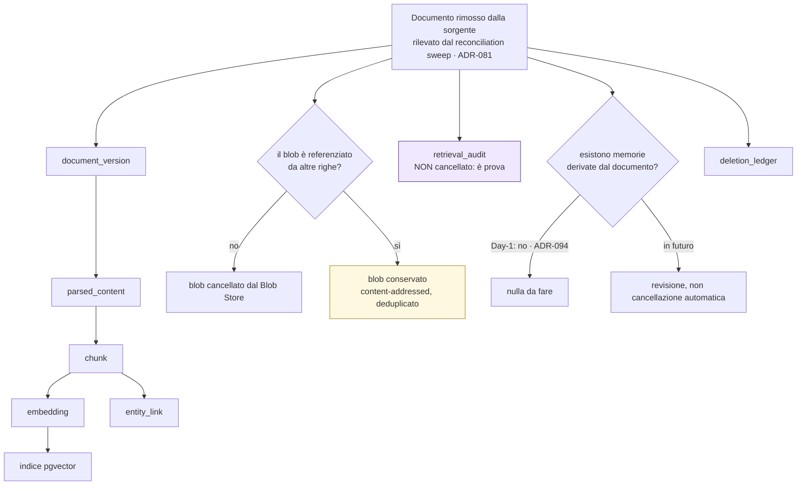

### Come leggerlo

- **La cascata è completa** perché tutto il derivato è ricostruibile: cancellare è sicuro.
- **Il blob può sopravvivere** ed è corretto: è *content-addressed*, quindi due documenti
  identici condividono lo stesso blob. Si cancella solo quando nessuna riga lo referenzia. Il
  `Blob Store` non conosce tenant né permessi (`AR-KN-22`): la decisione la prende chi ha le
  righe.
- **`retrieval_audit` non si cancella** (viola): è la prova di cosa è stato mostrato a chi.
  Contiene identificatori e hash, mai testo (`AR-KN-12`), quindi sopravvive senza contenere
  il documento.
- **Il ramo delle memorie derivate è vuoto Day-1** grazie a `ADR-094`, e la scelta per il
  futuro è **revisione, non cancellazione automatica**: una memoria è un'affermazione della
  persona, non una copia del documento.

## 24.2 `ADR-237` — il `deletion_ledger`, ovvero come si sopravvive a un restore

**Il problema che nessuno guarda.** Cancelli un dato lunedì. Martedì un guasto obbliga al
restore del backup di domenica. **Il dato è tornato.** E nessuno lo sa, perché il sistema è
tornato "com'era".

**DECISIONE ARCHITETTURALE — `ADR-237`.**

1. Ogni cancellazione — da retention, da richiesta del soggetto, da cancellazione mirata —
   scrive una riga nel **`deletion_ledger`**: *cosa* (per `data_asset` e chiave), *quando*,
   *per quale richiesta*, *con quale esito*.
2. Il `deletion_ledger` è **append-only** e contiene **solo identificatori e hash**, mai il
   dato cancellato. Altrimenti sarebbe l'archivio di ciò che abbiamo promesso di distruggere:
   l'errore classico e grave.
3. **Il ledger si conserva fuori dal ciclo di backup ordinario**, o quantomeno si conserva
   anche separatamente. Se stesse solo nel backup, il restore lo riporterebbe indietro insieme
   al resto — e non servirebbe a niente.
4. **Dopo ogni restore, prima che il sistema accetti traffico**, il ledger viene **rigiocato**:
   ogni cancellazione registrata dopo la data del backup viene riapplicata. Solo allora il
   sistema riparte.

→ **`AR-DG-18`**, e il rischio **`R-90`**: il ledger non viene rigiocato e dati cancellati
tornano vivi in silenzio. La mitigazione è che il rigioco sia **un passo obbligatorio della
procedura di restore**, non un'operazione manuale che qualcuno ricorda — e che la procedura
di restore sia **provata**, perché `R-78` insegna che un contenimento mai provato non esiste.

## 24.3 Verifica della cancellazione

Il prompt chiede che una cancellazione produca **evidenza**. Ecco cosa produce:

| Cosa si verifica | Come |
|---|---|
| dato primario rimosso | query di verifica per `data_asset`, eseguita **dopo** il task e registrata nel suo esito |
| derivato gestito | il test di lineage di §18.4: per ogni arco, la risalita dal derivato alla sorgente cancellata deve restituire vuoto |
| cache gestite | **non esistono cache di dato personale**: `ADR-078` vieta la cache dei risultati di retrieval (*"una cache di retrieval è una cache di permessi"*), `ADR-024` invalida la cache di policy sulla versione e mai per TTL |
| indici gestiti | l'embedding cancellato esce dall'indice pgvector nella stessa transazione della riga |
| sistemi esterni notificati | **non si notifica Odoo**: `INV-33` vieta la cancellazione fisica esterna. Se serve, l'agent può proporre un `archive`, con conferma umana (`ADR-216`) |
| certificato | alla chiusura di una `erasure_request` in stato `COMPLETED`, un documento riepilogativo con `data_asset` toccati, conteggi, esiti, ed **elenco esplicito di ciò che non è stato cancellato con la ragione** |

**L'ultima riga è la più importante.** Un certificato che dice solo "fatto" è inutile. Un
certificato che dice *"cancellati 47 record in 9 store; **non** cancellate 312 righe di audit,
che restano con `subject_id` non risolvibile ai sensi di `ADR-236`; **non** cancellato niente
in Odoo, perché il titolare di quei dati è il cliente"* è un documento che si può mostrare.

---

# 25. BACKUP — UN LIFECYCLE SEPARATO CHE NON CONTROLLIAMO

## 25.1 La frase che non diremo

Il prompt lo mette come divieto esplicito: *"non affermare cancellazione istantanea dai backup
se l'architettura non la supporta"*.

**Non la supporta.** Un backup è un'immagine coerente di un istante. Modificarlo
selettivamente significa: decifrarlo, montarlo, cancellare, ricompattarlo, ri-firmarlo — per
ogni backup della finestra. È tecnicamente possibile e operativamente insensato: introduce, in
ogni backup, un'operazione di scrittura che è **esattamente ciò che un backup deve escludere**.

## 25.2 Le sette domande del prompt

| Domanda | Risposta |
|---|---|
| **Retention** | `NON ANCORA DECISO`, e **dipende da `DEF-06` (RPO/RTO), che è di `C24` e non si chiude qui**. Il vincolo di governance che fisso: la retention dei backup **non può superare** la retention più lunga fra i dati contenuti, altrimenti il backup diventa l'archivio vero → `R-96` |
| **Cifratura** | obbligatoria a riposo. Con `ADR-239` (colonna `key_ref`), in futuro la cifratura per tenant renderebbe il *crypto-shredding* applicabile **anche ai backup**, che è oggi l'unica via nota per una cancellazione che li attraversi |
| **Accesso** | solo la procedura di restore. Nessun accesso di lettura ordinario a un backup: sarebbe un percorso di accesso al dato che non passa dalla RLS |
| **Cancellazione** | **solo per scadenza dell'intero backup**, mai selettiva. Mitigazione: `ADR-237`, il ledger rigiocato |
| **Ripristino** | passo obbligatorio: **rigioco del `deletion_ledger` prima di accettare traffico** |
| **Legal hold** | un backup sotto hold non scade. Day-1 il predicato è costante falso (`ADR-245`) |
| **Isolamento per tenant** | Day-1 **non c'è**: un backup contiene tutti i tenant, perché il database è uno. È un limite reale, e la via d'uscita è `ADR-239` + backup per tenant, che arriva con `T-DG-01` |

## 25.3 `R-96` — il rischio che si realizza da solo

**Il rischio:** la retention dei backup supera quella dichiarata di una categoria di dato, e
la cancellazione diventa **nominale**. Diciamo che cancelliamo i `run.input` dopo N giorni, e
li conserviamo per N + M giorni nei backup. Probabilità **Alta**, perché è la configurazione
di default di quasi tutti i sistemi di backup: si conserva "il più possibile".

**La mitigazione, ed è una sola:** la retention del backup entra nel registro delle retention
come un `data_asset` a sé, ed è soggetta al **vincolo di coerenza** — nessun `data_asset` può
avere una retention dichiarata più corta di quella del backup che lo contiene, **senza che il
ledger di `ADR-237` copra la differenza**.

Detto semplice: o il backup dura meno del dato, oppure serve il ledger che rimette a posto le
cose dopo un restore. Le due strade sono entrambe accettabili; **quello che non è accettabile
è non sapere quale delle due si sta seguendo**.

## 25.4 Diagramma — il lifecycle del backup contro quello del dato

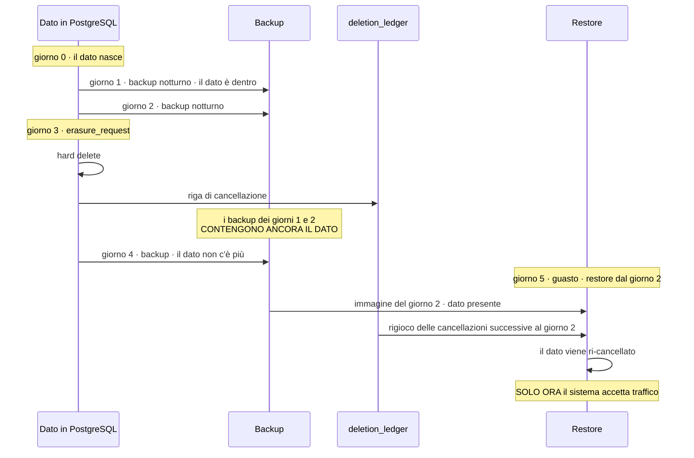

### Come leggerlo

La zona pericolosa è fra il giorno 3 (cancellazione) e la scadenza dei backup dei giorni 1 e 2.
In quella finestra il dato **esiste**, in un posto che non è interrogabile e non è
modificabile.

Il rigioco del ledger non elimina la finestra: **elimina la conseguenza**. Il dato non torna
mai *vivo*. Resta *conservato*, in un archivio cifrato e a scadenza, che è una situazione
diversa e molto più difendibile.

**RICHIEDE PARERE LEGALE:** se una finestra di persistenza del dato nei backup, con scadenza
dichiarata e rigioco garantito, sia compatibile con una richiesta di cancellazione. È una
domanda che ogni sistema con backup si pone e a cui un architetto non risponde.
→ **`AS-54`**, confidenza **Bassa**: è una condizione contrattuale, non tecnica.

---

# 26. LEGAL HOLD, DATI DI INCIDENTE, VIOLAZIONI

## 26.1 Legal hold

Già in §20.3: **`ADR-245`**, non Day-1, ma il predicato esiste ed è costante falso. Trigger
`T-DG-05`.

## 26.2 Dati di incidente

**Il conflitto:** un incidente di sicurezza richiede di **conservare** dati che la retention
ordinaria vorrebbe cancellare. Il prompt avverte: *"non assumere che la risposta agli incidenti
prevalga su tutti i requisiti di privacy"*.

**DECISIONE ARCHITETTURALE.** La conservazione per incidente è **un caso del meccanismo di
hold**, non un percorso separato:

1. l'apertura di un incidente crea un `hold` su un ambito dichiarato (un tenant, un soggetto,
   una finestra temporale, un insieme di run);
2. l'hold ha **una scadenza obbligatoria** e un titolare nominato. Un hold senza scadenza è un
   modo di conservare per sempre chiamandolo diversamente;
3. l'hold **non** sospende i diritti del data subject: li **posticipa**, e il posticipo va
   comunicato. Lo stato `HELD` di `ADR-235` esiste esattamente per questo;
4. l'hold **non** dà accesso: chi indaga usa comunque l'elevazione dichiarata di `ADR-119` e
   `ADR-244`. **Conservare non è leggere.** Questa distinzione è quella che più spesso salta.

## 26.3 Supporto alla gestione di una violazione di dati

Il prompt chiede se l'architettura sappia supportare l'indagine e la notifica, senza prendere
decisioni giuridiche automatiche.

**Cosa la piattaforma può produrre**, con quale strumento:

| Domanda dell'indagine | Strumento |
|---|---|
| *Chi ha avuto accesso a cosa, quando?* | `audit_event`, append-only, con entrambe le identità (`INV-15`) |
| *Quali dati sono stati mostrati al modello in un certo run?* | `retrieval_audit` (identificatori) + `Reproduction Bundle` (`ADR-171`), che ri-renderizza il prompt |
| *Quali record del CRM sono stati toccati?* | il journal, con gli external ID `__agent__` (`ADR-161`) e i valori precedenti (`ADR-221`) |
| *Quali soggetti sono coinvolti?* | risoluzione da `subject_id`, **finché non è stato eseguito l'identity shredding** |
| *Il contenuto è uscito?* | l'allowlist di egress (`ADR-203`) dice cosa era possibile; il journal dice cosa è stato invocato |
| *Fermiamo tutto* | `KillSwitch`: `HALT_SUBJECT`, `HALT_AGENT`, `HALT_TENANT` (`ADR-212`) |

**Cosa la piattaforma NON fa, ed è una non responsabilità esplicita.** Non decide se c'è
l'obbligo di notifica, non calcola scadenze, non redige comunicazioni, non valuta il rischio
per gli interessati. Produce **evidenza per chi decide**. Un sistema che classificasse
automaticamente un evento come "violazione notificabile" sbaglierebbe in entrambe le
direzioni, e in una delle due con conseguenze legali dirette.

**Il buco onesto, e va detto:** dopo un identity shredding, l'indagine su fatti antecedenti
perde la risoluzione dei soggetti. È il prezzo di `ADR-236` e non lo si può avere in tutti e
due i modi. Il `hold` di §26.2 è ciò che permette di sospendere un'erasure durante
un'indagine — **ma va attivato prima**, e nessuno attiva un hold su un incidente che non sa
di avere.

---

# 27. ACCESSO AI DATI — CHI PUÒ LEGGERE COSA

## 27.1 Le cinque popolazioni

| Chi | Cosa può leggere | Come è imposto |
|---|---|---|
| **Utente finale** | i propri run, le proprie memorie, ciò che le policy del tenant gli concedono sul CRM | PDP + RLS + `AR-ME-18` |
| **Amministratore del tenant** | configurazione del tenant, audit del tenant, aggregati del tenant | RLS su `tenant_id` + ruolo. **Non** i contenuti privati dei singoli senza una ragione |
| **Amministratore di piattaforma** (`PlatformOperator`) | configurazione di piattaforma, cruscotti **senza dimensioni di dominio** (`INV-28`, `ADR-186`) | tipo di principal separato (`ADR-118`), stesse policy RLS |
| **Personale di supporto** | **niente, di default** | `ADR-244`, §27.2 |
| **Accesso automatico** (job, scheduler) | solo ciò che il proprio ruolo PostgreSQL consente (`ADR-116`) | il least privilege dei processi lo applica il **database**, non il codice |

## 27.2 `ADR-244` — accesso di supporto: nessun accesso permanente

**DECISIONE ARCHITETTURALE.** Non esiste un ruolo "supporto" con accesso permanente ai dati
dei tenant. Esiste solo l'**elevazione dichiarata** che `ADR-119` ha già introdotto al posto
del break-glass, con cinque attributi obbligatori:

1. **autorizzazione esplicita** — passa dal PDP, come tutto (`AR-GP-23`, `INV-31`);
2. **`purpose` obbligatorio** dall'enum di §9, e la restrizione morde davvero qui
   (`ADR-231`);
3. **limite di tempo**, con spegnimento automatico. Nessuna elevazione senza scadenza;
4. **audit**, con una categoria di evento distinta e notifica al tenant (stessa forma di
   `ADR-209` per `DebugCapture`);
5. **luogo di trattamento registrato** (`AR-DG-14`) — è ciò che distingue residency da
   sovereignty, §37.

**Il masking, e perché non è la difesa principale.** Il prompt chiede se il supporto debba
vedere dati mascherati. La risposta onesta: **il masking sul percorso di supporto è teatro se
la persona ha comunque accesso al database.** `R-47` e `R-48` lo dicono già: *chi ha `root`
sulla macchina ha database e chiave master*. La difesa vera è di tre tipi, in ordine di forza:

1. **strutturale**: `INV-28` — i cruscotti di piattaforma non portano dimensioni derivate
   dall'attività di un tenant. Non c'è niente da mascherare perché non c'è niente;
2. **di rilevabilità**: l'accesso applicativo è auditato, e l'accesso diretto al database è
   **un'anomalia visibile** (`ADR-118`);
3. **crittografica**: esiste solo con `B-50` / `ADR-239`, cioè non Day-1. §39.

**Va detto senza edulcorare: Day-1, chi ha accesso amministrativo alla macchina può leggere i
dati dei tenant.** `R-47` e `R-48` restano aperti con impatto **Alto**. La difesa Day-1 è
procedurale e di rilevabilità, non crittografica.

---

# 28. PRIVACY BY DESIGN E PRIVACY BY DEFAULT

## 28.1 Privacy by design — dove sta già nell'architettura

Il punto interessante non è aggiungere privacy: è **riconoscere quanta ce n'è già**, presa per
altre ragioni. Ecco l'elenco, con la ragione originale.

| Decisione | Ragione originale | Beneficio privacy non progettato |
|---|---|---|
| **`INV-07` esteso** (nessuna copia) | evitare di essere system of record di dato altrui | **il grosso del dato personale non è nostro** |
| `ADR-068` (embedding su CPU, locale) | non sottrarre VRAM al modello | nessun trasferimento del testo verso un servizio esterno |
| `ADR-038` (inference locale, senza rete) | semplicità e controllo | **nessun model provider, nessun trasferimento internazionale** |
| `ADR-083`/`AR-ID-28` (audit per identificatori) | volume e integrità | l'audit contiene pochissimo dato personale, e §22 ne dipende |
| `INV-26` (nessun contenuto in telemetria) | confine audit/telemetria | la telemetria non è un archivio ombra |
| `ADR-171` (il prompt si ricostruisce) | costo di archiviazione | **non esiste un archivio di prompt** da proteggere o cancellare |
| `ADR-089` (la memoria non contiene fatti di dominio) | evitare la copia strisciante del CRM | la memoria contiene preferenze, non dossier |
| `ADR-078` (nessuna cache di retrieval) | *"una cache di retrieval è una cache di permessi"* | niente cache da cancellare |
| `ADR-107` (`subject_id` mai riassegnato) | evitare che un ID derivi da un dato mutabile | **rende possibile l'identity shredding** |
| `ADR-125` (colonne di lineage Day-1) | non poterle aggiungere dopo | il lineage esiste senza un sistema di lineage |
| `ADR-104` (50 step, 10 minuti) | vincolo di dominio del committente | limita quanto dato può accumularsi in un run |
| `ADR-094` (nessuna estrazione automatica) | prudenza sulla qualità | Day-1 quasi tutte le memorie sono dichiarate dalla persona |
| `ADR-216` + `ADR-189` + `modified_fields[]` | sicurezza contro `ASI09` | **evidenza di intervento umano sostanziale** per l'art. 22 |

**Questa tabella è il migliore argomento a favore dell'architettura, e conviene sapere
leggerlo bene.** Non dice "siamo bravi": dice che le decisioni prese per semplicità e per
controllo tendono a produrre buona privacy, mentre le decisioni prese per comodità (copia il
dato, manda tutto al provider, logga tutto) tendono a produrre il contrario. **La privacy
non è stata aggiunta: è ciò che resta quando si toglie tutto quello che non serve.**

## 28.2 Privacy by default — i sette default

| Default | Valore | Come è imposto |
|---|---|---|
| retention | **nessuna cancellazione automatica finché il periodo è `NULL`**, ma anche **nessuna conservazione dichiarata come infinita** | `ADR-234`, `DEF-13` |
| riuso per addestramento | **vietato**, e non esiste il percorso di codice | `AR-DG-21`, §33 |
| condivisione cross-tenant | **vietata** | `ADR-139`, `AR-DG-20` |
| log dei prompt grezzi | **non esiste** | `ADR-171`, `INV-26` |
| export | **solo il proprio, sotto RLS** | `AR-DG-28` |
| memoria | **si scrive solo con conferma**; estrazione automatica **spenta** | `ADR-094` |
| `DebugCapture` | **spento**, opt-in, spegnimento automatico, notifica al tenant | `AR-OB-09`, `ADR-209` |

**La proprietà da verificare, non da sperare:** ogni default deve essere quello **restrittivo**
e ogni allentamento deve richiedere un'azione dichiarata. Un test di CI che legge la
configurazione di default e verifica i sette valori costa mezza giornata ed evita la deriva.

---

# 29. CONSENSO E BASE GIURIDICA

## 29.1 L'errore da non fare

Il prompt lo dice fra le istruzioni finali: *"non assumere che il consenso sia la base
giuridica di default"*. È l'errore più comune nei sistemi enterprise, e ha una conseguenza
tecnica pesante: se costruisci il consenso come base, devi costruire anche la **revoca**, e la
revoca deve **fermare il trattamento** e propagarsi ovunque. È un intero sottosistema.

## 29.2 Dove il consenso ha senso, e dove no

**INTERPRETAZIONE NOSTRA, e RICHIEDE PARERE LEGALE per la conferma.**

| Trattamento | Il consenso è plausibile? | Osservazione |
|---|---|---|
| eseguire il compito che l'utente ha chiesto | **no** | è l'erogazione del servizio richiesto. Chiedere il consenso per fare ciò che l'utente ha appena chiesto è teatro |
| autenticare e autorizzare | **no** | è necessario al rapporto |
| audit di sicurezza | **no** | è interesse legittimo o obbligo, non consenso: un audit revocabile non è un audit |
| telemetria operativa | **no** | interesse legittimo, ed è privo di contenuto (`INV-26`) |
| **memoria / personalizzazione** | **forse** | è l'unico caso in cui il trattamento è **aggiuntivo** rispetto al servizio, e in cui una persona potrebbe legittimamente dire "non ricordarti di me" |
| trattamento del dato del cliente finale nel CRM | **non è una nostra domanda** | il titolare è il cliente, e il rapporto con il proprio cliente lo regola lui |

## 29.3 `ADR-254` — nessun oggetto `Consent` Day-1

**DECISIONE ARCHITETTURALE.** La piattaforma **non** porta un modello di consenso Day-1, e
non c'è una tabella `consent`.

**Ma il controllo utente sulla memoria esiste già**, ed è più forte di un consenso generico:

- **`ADR-094`**: l'estrazione automatica è spenta. Una memoria si scrive con conferma;
- **`AR-ME-09`**: una memoria `EXPLICIT` conserva la formulazione dell'utente; il modello non
  la riscrive;
- **gli 8 endpoint REST di `A08`**: ispezione, correzione, cancellazione, spiegazione.

**INFERENZA (nostra).** Il consenso è, in pratica, **il gesto di confermare la memoria**. Non
lo chiamo consenso perché non ho la qualificazione giuridica per farlo, e perché chiamarlo così
significherebbe accettare tutte le conseguenze formali del consenso (dimostrabilità,
granularità, revocabilità documentata) su un meccanismo progettato per altro.

**Se un parere legale stabilisse che serve un consenso formale sulla memoria**, il punto di
aggancio esiste: è il momento della conferma, che è già registrato in `memory_audit`. Non
servirebbe riprogettare, servirebbe **dare un nome giuridico a un evento che già scriviamo**.

→ trigger: primo requisito contrattuale che imponga un modello di consenso formale.

---

# 30. MASCHERAMENTO, PSEUDONIMIZZAZIONE, ANONIMIZZAZIONE

## 30.1 La distinzione che va tenuta ferma

| Tecnica | Cosa fa | È reversibile? | Il dato resta personale? |
|---|---|---|---|
| **Masking** | nasconde alla vista (`****1234`) | sì, il dato è ancora lì | **sì** |
| **Tokenizzazione** | sostituisce con un token, tenendo la tabella di corrispondenza | sì, per chi ha la tabella | **sì** |
| **Pseudonimizzazione** | sostituisce l'identificatore, tenendo la chiave **separata** | sì, per chi ha la chiave | **sì** |
| **Anonimizzazione** | rende **impossibile** risalire alla persona, per chiunque | **no** | **no** |
| **Redazione** | rimuove definitivamente dal testo | no, sul dato redatto | dipende dal resto |

**L'errore da evitare**, e il prompt lo segnala: *"non assumere che la pseudonimizzazione
rimuova automaticamente gli obblighi"*. **Non li rimuove.** Un `subject_id` pseudonimo è dato
personale. Un `acl_subject` è dato personale. Un hash di un identificatore è dato personale
se qualcuno può ricalcolarlo partendo da un elenco di candidati — e per un tenant con
duecento dipendenti, quell'elenco è corto.

**L'anonimizzazione vera è difficile.** Richiede che nemmeno noi, con tutti i nostri dati,
possiamo risalire. È la ragione per cui `ADR-236` (identity shredding) è descritto come
*pseudonimizzazione irreversibile rispetto a noi* e **non** come anonimizzazione: `R-89`
elenca i modi in cui la re-identificazione resta possibile.

## 30.2 Dove ciascuna tecnica vive, in questo sistema

| Luogo | Tecnica | Nota |
|---|---|---|
| **UI** | masking sui campi sensibili mostrati agli operatori | è una scelta di prodotto, non di architettura. `ADR-190` impone che le etichette in approvazione vengano da una **lettura autoritativa**: mascherarle troppo renderebbe illeggibile l'approvazione, che è peggio |
| **API** | **projection**, non masking (`ADR-228`) | il campo non c'è, invece di esserci mascherato. §14 |
| **Telemetria** | **niente da mascherare**: il contenuto non entra (`INV-26`, `ADR-170`) | difesa strutturale, non filtrante |
| **Audit** | **pseudonimizzazione per costruzione**: identificatori e hash | §22 |
| **Evaluation** | **riscrittura umana**, che non è nessuna delle tecniche sopra | §31, ed è il punto |
| **Supporto** | elevazione dichiarata, non masking | §27.2: il masking è teatro se c'è accesso al database |
| **Context del modello** | projection + `x-sensitivity` | §14 |

## 30.3 Il caso in cui la pseudonimizzazione fa un lavoro vero

`ADR-236`. La distruzione della chiave di risoluzione trasforma un archivio di audit da
*"dato personale attribuibile"* a *"dato personale non attribuibile da noi"*. **Non è
anonimizzazione**, ma è una riduzione del rischio reale e sostanziale: chi rubasse il nostro
database di audit non otterrebbe nomi.

**RICHIEDE PARERE LEGALE** su quale valore giuridico abbia. → `B-95`, `B-99`.

---

# 31. GOVERNANCE DEI DATI DI EVALUATION — IL MANDATO DI `A12`

## 31.1 Il problema, nei termini in cui `A12` l'ha lasciato

**`R-73`**, impatto **Alto**: *"fuga del dataset di evaluation: casi derivati da incidenti
reali portano dati reali in repository"*. E `AR-OB-24`: *"nessun dato di produzione entra in
un dataset di evaluation senza anonimizzazione dichiarata"*.

Il conflitto, che `A12` ha nominato onestamente: **il caso più prezioso è quello reale**. Un
`EvaluationCase` inventato prova che il sistema gestisce un problema immaginato. Un caso
derivato da un incidente vero prova che gestisce un problema accaduto. `ADR-185` e `ADR-213`
impongono un `EvaluationCase` e un test di regressione per ogni incidente. Quindi la
pressione a copiare dalla produzione è **strutturale e permanente** (`AR-OB-20`: i dataset
sono file versionati in repository, cioè in git, cioè leggibili da chiunque abbia il repo).

## 31.2 Perché "anonimizzare il testo" non è una risposta

`AR-OB-24` dice *"anonimizzazione dichiarata"*, ma non dice come. E anonimizzare testo libero
in modo affidabile richiede un classificatore che riconosca ogni entità personale in ogni
formulazione. §7.2 ha già spiegato perché non lo costruiamo, e qui l'argomento è più forte:
un fallimento del classificatore in evaluation è **permanente e pubblico**, perché finisce in
git e la storia di git non si cancella con un commit.

## 31.3 `ADR-240` — nessun testo libero di produzione, mai. La trasformazione è umana

**DECISIONE ARCHITETTURALE.**

Un `EvaluationCase` dichiara la propria origine **nel tipo**:

```text
EvaluationCase {
  case_id, created_by, created_at
  derivation: SYNTHETIC | PRODUCTION_STRUCTURED | HUMAN_REWRITTEN
  # PRODUCTION_FREETEXT non è un valore ammesso: non esiste nell'enum
  source_incident_ref: IncidentId | NULL   # solo il riferimento, mai il contenuto
  ...
}
```

| `derivation` | Cosa può contenere | Chi lo produce |
|---|---|---|
| `SYNTHETIC` | tutto inventato | una persona |
| `PRODUCTION_STRUCTURED` | **solo** ciò che ha una struttura dichiarata: nome del tool, **nomi** dei campi, forma degli argomenti, enum, booleani, numeri con semantica dichiarata, identificatori **sostituiti** con un namespace di fixture. **Nessun valore di campo di dominio, nessun testo libero** | un'estrazione **automatica** ma su un insieme chiuso di campi tipizzati |
| `HUMAN_REWRITTEN` | il testo del turno dell'utente, **riscritto da una persona** che ha letto l'originale e ne ha prodotto un equivalente sintetico | una persona |

**Il passo umano è il punto della decisione.** Non "anonimizziamo il testo": **lo riscriviamo**.
Chi analizza l'incidente ha già letto il turno originale — è il suo lavoro. Scrivere una
versione equivalente costa cinque minuti e produce un caso **che non è dato personale per
costruzione**, non "presumibilmente anonimizzato".

**Come si impedisce la scorciatoia:**

1. **nel tipo**: `PRODUCTION_FREETEXT` non esiste come valore;
2. **in CI** (`INV-40`): un test legge i file dei dataset e verifica che ogni campo di testo
   libero appartenga a un caso `SYNTHETIC` o `HUMAN_REWRITTEN`, e che nessun campo contenga
   valori provenienti da un namespace di produzione (identificatori fuori dal namespace di
   fixture, formati di external ID `__agent__`, ecc.);
3. **`AR-DG-11`**: nessun testo libero di produzione entra in un dataset di evaluation.
   Verificabile staticamente: **non esiste un percorso di codice** che legga `run.input` e
   scriva in un file del dataset.

**Il costo, dichiarato.** Serve una persona per ogni caso derivato da un incidente. `AS-42`
dice già che *"il team ha la disciplina di scrivere un `EvaluationCase` per ogni incidente"* è
un'assunzione a confidenza **Bassa**, e `R-70` dice che l'anello di feedback muore al passo
umano. **`ADR-240` aggiunge attrito a un passo che già rischia di non avvenire.** È il
contro-argomento più serio a questa decisione, e non lo nascondo.

**La risposta al contro-argomento**, e vale la pena valutarla: `PRODUCTION_STRUCTURED` copre
la **maggior parte del valore** senza richiedere riscrittura. Un caso di evaluation di
`ADR-177` è orientato all'**esito**: post-condizioni e vincoli, mai output attesi, mai
*trajectory matching*. Per verificare che *"l'agent chiama `aggiorna_stage_opportunita` con
`stage = won` e non `aggiorna_importo`"* non serve il testo originale dell'utente: servono la
struttura e un turno plausibile. **La riscrittura umana serve solo quando la formulazione
esatta è il punto** — cioè nei casi di prompt injection, che sono pochi e importanti, e per i
quali un'ora del tempo di qualcuno è ampiamente giustificata.

## 31.4 I confini fra dataset — la tabella che li tiene separati

| Dataset | Fonte | Contiene dato personale? | Può diventare un altro dataset? |
|---|---|---|---|
| **produzione** | il sistema vivo | **sì** | **no**, verso nessuno |
| **evaluation** | persone che scrivono casi | **no**, per costruzione | può essere letto dalla CI |
| **training** | **non esiste** | — | §33 |
| **analytics** | aggregati privi di identificatori | no, sopra la soglia di gruppo | no |
| **audit** | il sistema vivo | sì, pseudonimo | **no**: `AR-OB-02` |
| **telemetria** | il sistema vivo | sì, pseudonimo | **no** |

**Il *failure corpus*** merita una nota: `AR-OB-21` lo divide in *train* e *holdout* alla
creazione, e l'holdout non entra mai in un fine-tuning. `ADR-240` aggiunge il vincolo
mancante: **il failure corpus segue le stesse regole di derivazione dell'`EvaluationCase`**.
Un corpus di fallimenti pieno di trascrizioni reali sarebbe l'archivio di dati personali più
denso della piattaforma, in git.

---

# 32. TELEMETRIA E AUDIT — DUE PIANI, DUE LIFECYCLE

## 32.1 Il confine, che `A12` ha già stabilito

| | Audit | Telemetria |
|---|---|---|
| **Scopo** | provare cosa è successo | far funzionare il sistema |
| **Contenuto** | identificatori, hash, decisioni, entrambe le identità (`INV-15`) | identificatori, hash, enum, numeri, timestamp, **nomi** di campo (`INV-26`) |
| **Mutabilità** | append-only (`INV-05`) | scartabile, ma **mai in silenzio** (`AR-OB-15`) |
| **Campionamento** | **mai** sulle 8 classi critiche (`AR-OB-16`) | sì, guidato dall'esito |
| **Usato per decidere?** | sì, è prova | **mai** (`INV-27`) |
| **Risponde a domande di conformità?** | sì | **mai** (`AR-OB-02`) |
| **Retention** | la più lunga | **strettamente più corta** (`INV-35`, nuovo) |

`INV-35` è il contributo di questo documento a quel confine: `A12` l'aveva stabilito nello
spazio, non nel tempo. §19.8.

## 32.2 Le domande del prompt sulla telemetria

| Domanda | Risposta |
|---|---|
| **Cosa può contenere** | `INV-26`, allowlist chiusa verificata in CI. Mai testo di dominio, prompt, risposte, `value_text`, contenuto di documento, argomento di tool, valore di campo, materiale crittografico |
| **Classificazione** | INTERNAL / PSEUDONYMOUS per gli span; INTERNAL / NONE per `metric_sample` (`AR-OB-04` vieta gli identificatori come label) |
| **Accesso** | sotto `tenant_id` risolto dall'identità autenticata; unica eccezione il `PlatformOperator`, su una vista **senza dimensioni di dominio** e auditato (`INV-28`) |
| **Retention** | `NON ANCORA DECISO`, **< audit** (`INV-35`). Partizionamento giornaliero e `DROP PARTITION` (`B-80`) |
| **Masking** | non applicabile: non c'è contenuto da mascherare. È il vantaggio della difesa strutturale |
| **Isolamento per tenant** | `AR-OB-17`: `tenant_id` non nullo e RLS attiva su entrambe le tabelle |

## 32.3 Le domande del prompt sull'audit

| Domanda | Risposta |
|---|---|
| **Integrità** | append-only, tabella separata dallo stato mutabile (`INV-05`), transazione unica con la transizione durevole (`AR-EV-22`). **Nessuna tamper evidence Day-1**: `T-OB-09` è il trigger, ed è una scelta consapevole |
| **Retention** | la più lunga di tutte, `NON ANCORA DECISO`, `RICHIEDE PARERE LEGALE`. §19.6 |
| **Accesso** | sotto RLS, autorizzato; `AR-ID-29`: chi legge vede **entrambi** gli identificatori, quello registrato e quello corrente |
| **Cancellazione** | §22: identity shredding, o break-glass `ADR-238` |
| **Export** | **`DEF-08`, di `A16`/`C26`. NON si chiude qui.** Qui registro solo due requisiti che l'export dovrà rispettare: risolvere gli alias `merged_into` (`AR-ID-08`) e dichiarare esplicitamente le lacune prodotte da eventuali `audit_redaction` |

## 32.4 La riga che vale la pena aggiungere

**`AR-DG-25`**: `modified_fields[]` e `approval_decision_time` seguono la retention
dell'**audit**, non della telemetria.

Sembra un dettaglio ed è la differenza fra avere e non avere la prova dell'intervento umano
sostanziale (§23.5) nel momento in cui serve, che è tipicamente **anni** dopo il fatto.

---

# 33. DATI DI ADDESTRAMENTO — LA SEZIONE PIÙ CORTA E PIÙ IMPORTANTE

Il prompt la marca come CRITICA. Le risposte sono quattro, e sono tutte "no".

| Domanda | Risposta | Come è imposta |
|---|---|---|
| **I dati degli utenti possono essere usati per addestrare modelli?** | **No.** | non esiste un percorso di codice che scriva in un dataset di addestramento, perché **non esiste un dataset di addestramento** |
| **I dati di un tenant possono migliorare la piattaforma?** | **No**, se "migliorare" significa addestrare. **Sì**, se significa alimentare metriche aggregate prive di identificatori | `AR-OB-04`, `AR-DG-20` |
| **I dati di evaluation possono diventare dati di addestramento?** | **Non l'holdout, mai** (`AR-OB-21`). Il *train* sì, in linea di principio — ma essendo `SYNTHETIC` o `HUMAN_REWRITTEN` (`ADR-240`), **non contiene dato personale** | `ADR-240`, `AR-OB-21` |
| **La memoria può diventare dato di addestramento?** | **No.** È il caso peggiore possibile: testo scritto da persone su sé stesse, addestrato in un modello da cui potrebbe riemergere | `AR-DG-21` |

## 33.1 `AR-DG-21` e perché è una regola statica e non una promessa

> **`AR-DG-21`** — nessun dato di produzione diventa dato di addestramento. **Non esiste un
> percorso di codice** che legga da uno store di produzione e scriva in un artefatto di
> addestramento. Verificato staticamente.

**Perché statica.** Una promessa in un documento non sopravvive a un pomeriggio in cui
qualcuno vuole "provare un fine-tuning veloce sui log". Una verifica statica sì.

**Il contesto che rende la regola facile da rispettare oggi:** `DEF-09` (*se fare fine-tuning
e su cosa*) è dichiarata **fuori da Level A**. `T-10` prevede QLoRA "sul dataset di errori", e
`R-03` la indica come rimedio se il modello 9B sbaglia troppo spesso i tool. **Quindi il
fine-tuning è previsto.** `AR-DG-21` non lo vieta: vieta che il suo materiale venga dalla
produzione senza passare da `ADR-240`.

**INFERENZA (nostra), e mi sembra il punto che salva la coerenza:** il dataset di errori per
QLoRA è esattamente un *failure corpus*, quindi ricade sotto `AR-OB-21` e `ADR-240`. Un QLoRA
addestrato su casi `SYNTHETIC` e `HUMAN_REWRITTEN` è **legittimo e utile**. Un QLoRA
addestrato su trascrizioni reali sarebbe un trattamento secondario silenzioso, cioè
precisamente ciò che il prompt vieta.

## 33.2 Il fornitore di modelli che non c'è

§8.3 l'ha già detto e vale la pena ripeterlo qui, perché è la risposta a metà delle domande
di questa famiglia: **Day-1 il modello gira in locale, in un container senza rete**. Non c'è
nessuno che possa conservare i nostri prompt, processarli altrove, usarli per addestrare, o
tenerne telemetria. Non perché ci fidiamo di un fornitore: **perché non c'è un fornitore**.

`ADR-242` rende la proprietà strutturale: `AR-DG-15` (nessun trasferimento esterno esiste se
non è nel registro dichiarato) e `AR-DG-16` (nessun percorso di codice invia il context a un
provider esterno).

---

# 34. TRASFERIMENTI ESTERNI

## 34.1 `ADR-242` — il registro dichiarato, non la scoperta a runtime

**DECISIONE ARCHITETTURALE.** L'insieme dei destinatari esterni è un **registro** — un
artefatto dichiarato, versionato, verificato in CI — e non qualcosa che si scopre guardando il
traffico.

```text
ExternalTransfer {
  destination_id, destination_kind
  data_asset[]                # cosa può uscire
  purpose                     # dall'enum di §9
  classification_max          # la classe massima ammessa
  legal_basis_note            # testo per il DPA, non applicato dal codice
  processing_location         # dove il destinatario tratta
  authorized_by, authorized_at
}
```

E si aggancia a ciò che esiste: **`ADR-203`** (allowlist di rete a livello di container) e
**`AR-SE-11`** (nessun tool accetta un URL senza allowlist di host **dichiarata nello
schema**, mai validata a runtime — si aggira con redirect, DNS rebinding, notazioni
alternative).

**La proprietà che ne segue, ed è forte:** un trasferimento esterno non dichiarato **non è
possibile a livello di rete**, non solo vietato dalle policy. `ADR-203` è la difesa,
`ADR-242` è la documentazione della difesa.

## 34.2 I destinatari, oggi e domani

| Destinatario | Day-1 | Cosa esce | Controllo |
|---|---|---|---|
| **Odoo / ERP del cliente** | **sì** | argomenti di tool, che contengono identificatori e i valori dei campi scritti | allowlist, credenziale del broker, PDP, approvazione umana su ogni scrittura |
| **Model provider esterno** | **NO** | — | inference locale, container senza rete |
| **Servizio di embedding** | **NO** | — | `ADR-068`, CPU locale, `AR-KN-18` |
| **Email / calendario** | **NO** Day-1 | — | `ADR-085` tiene l'email fuori dalla knowledge; nessun tool di invio Day-1 |
| **Server MCP remoto** | **NO** Day-1 | — | `ADR-063`: materializzazione umana obbligatoria; `AR-AC-24` |
| **Agent remoto (A2A)** | **NO**, fase 3 | — | `ADR-123`, `ADR-131` |
| **Provider di analytics** | **NO** | — | `ADR-166`: telemetria su PostgreSQL, niente backend esterni |
| **Storage esterno** | **NO** Day-1 | — | `ADR-073`: blob su filesystem locale. `T-KN-08` è il trigger verso object storage |
| **Trasporto delle notifiche di approvazione** | **dipende** | **solo riferimenti** (`AR-EV-16`), mai contenuto di dominio | è il canale che va guardato: se è email, esce un `run_id` e un link, non i dati |

**La riga da guardare è l'ultima**, ed è quella che nessuno guarda. L'outbox contiene solo
riferimenti per `AR-EV-16`, ma il **trasporto** (un servizio email, un webhook verso un chat
tool) è un destinatario esterno a tutti gli effetti. Va nel registro `ExternalTransfer` come
gli altri.

## 34.3 Trasferimenti internazionali

**RICHIEDE PARERE LEGALE**, e `R-14` non riporta fonti su questo.

Cosa posso dire come architetto: **Day-1 non c'è un trasferimento internazionale di dati
verso terzi**, perché non c'è un terzo. L'unico flusso verso l'esterno va verso Odoo, che è
il sistema del cliente.

L'eccezione che va nominata, perché è quella vera: **l'accesso di supporto**. Una persona che
si connette da fuori dall'UE per diagnosticare un problema sta **trattando dati in un luogo
diverso da quello in cui sono conservati**. È esattamente la distinzione fra residency e
sovereignty di §37, ed è per questo che `AR-DG-14` impone di registrare il **luogo di
trattamento** in ogni elevazione.

---

# 35. ANALYTICS CROSS-TENANT

## 35.1 La domanda e la risposta breve

*Il gestore della piattaforma ha bisogno di aggregati su tutti i tenant?* Sì, per capire se la
piattaforma funziona: latenze, tassi di errore, saturazione, quanti run falliscono.

*Deve vedere dato di dominio per farlo?* **No.**

## 35.2 Cosa c'è già

**`ADR-186`**: due cruscotti separati, e *"quello di piattaforma non porta dimensioni derivate
dall'attività di un tenant"*.
**`INV-28`**: la lettura di telemetria avviene sotto un `tenant_id` risolto dall'identità;
unica eccezione il `PlatformOperator`, su una vista **senza dimensioni di dominio** e auditato.
**`AR-OB-04`**: `run_id`, `tenant_id`, `subject_id`, `trace_id`, `span_id` e ogni campo di
dominio sono **label vietate** su ogni metrica.

**Conseguenza:** l'aggregato cross-tenant Day-1 è **già anonimo per costruzione**, perché le
metriche non hanno la dimensione tenant. Non è una restrizione aggiuntiva: è la conseguenza di
una regola presa per il **budget di cardinalità** delle metriche.

## 35.3 `ADR-243` — quando servirà la dimensione tenant

Prima o poi qualcuno chiederà *"quale tenant genera più errori?"*. È una domanda legittima di
gestione. E richiede la dimensione che `AR-OB-04` vieta.

**DECISIONE ARCHITETTURALE.** Quando servirà, si serve da una **vista dichiarata**, non
rimuovendo il divieto sulle label:

1. una vista con nome, elencata nel registro `data_assets.yaml`, con `purpose = OPERATIONS`;
2. **soglia minima di gruppo**: nessun aggregato con meno di `k` unità nel gruppo. **Il valore
   di `k` è `NON ANCORA DECISO`** e dipende da `B-79`, che `A12` ha già aperto (*"quale `n`
   minimo rende sicuro un aggregato cross-tenant, e quali tecniche sono difendibili"*).
   → `B-98` lo specializza;
3. accesso auditato, riservato al `PlatformOperator`;
4. **mai** dimensioni di dominio: si può contare quanti errori ha un tenant, mai su quali
   clienti.

→ **`AR-DG-20`**.

**Il caso limite da ricordare, ed è quello che frega tutti:** con **due** tenant, qualunque
aggregato "tutti tranne me" rivela l'altro. Una soglia `k = 5` su un sistema con tre tenant
non protegge niente. Day-1, con pochi tenant pilota, **la protezione vera è non avere la
vista**, non avere una soglia.

---

# 36. CONDIVISIONE DEI DATI E RESPONSABILI ESTERNI

## 36.1 I sei confini di condivisione

| Confine | Ammesso? | Autorizzazione |
|---|---|---|
| **utente → agent** | sì | è la richiesta stessa. Il contesto di delega, mai il token (`AR-GP-02`) |
| **agent → tool** | sì | PEP, PDP, `FieldScope` (`ADR-228`), schema validato |
| **agent → agent** | **NO Day-1** (`ADR-123`) | quando arriverà: ceiling attenuato (`ADR-127`), `on_behalf_of` invariante (`INV-17`), nessun `SecretMaterial` nel messaggio (`AR-AC-20`) |
| **tenant → servizio esterno** | solo Odoo | registro `ExternalTransfer` (`ADR-242`) + allowlist di rete (`ADR-203`) |
| **piattaforma → fornitore** | **nessuno Day-1** | §8.3 |
| **tenant → altro tenant** | **MAI, in nessuna fase** | `ADR-139` (isolamento cross-tenant applicato dal database), `AR-GP-18` (la verifica del tenant è la **prima** regola e non è sovrascrivibile), `INV-02` |

## 36.2 Responsabili esterni — l'elenco vuoto

| Categoria del prompt | Day-1 |
|---|---|
| model provider | **nessuno** |
| hosting provider | dipende da `Q-03`. Se on-premise, nessuno. Se SaaS, uno, ed è il primo sub-responsabile da nominare |
| observability provider | **nessuno** (`ADR-166`) |
| email provider | dipende dal trasporto delle notifiche → §34.2 |
| storage provider | **nessuno** (`ADR-073`, filesystem locale) |
| payment provider | fuori perimetro |
| CRM | è il sistema **del cliente**, non un nostro sub-responsabile |

**INFERENZA (nostra).** Day-1 la catena dei responsabili è **corta o vuota**. È una posizione
commercialmente utile — un cliente che chiede *"a chi passate i miei dati?"* riceve una
risposta breve — e vale la pena capire che è una **conseguenza del deployment su una sola
macchina**, non una scelta di privacy. Quando `Q-03` si chiuderà verso il SaaS, la catena si
allunga di almeno un anello.

## 36.3 Lock-in del fornitore, dal punto di vista dei dati

| Dimensione | Situazione |
|---|---|
| **export dei dati** | tutto in un solo PostgreSQL + un filesystem di blob. Un `pg_dump` e una `tar` sono l'export completo. **È il grado di portabilità più alto possibile** |
| **cancellazione** | §21, §22 |
| **residency** | dove sta la macchina. §37 |
| **portabilità dell'API** | i contratti sono nostri, gli schemi sono nostri |
| **cifratura** | Day-1 la chiave è nostra; con `ADR-239` diventa per tenant e poi del cliente |
| **portabilità dello schema** | PostgreSQL standard, nessuna estensione proprietaria oltre a pgvector |
| **il lock-in vero** | **non è sui dati, è sul modello.** `R-16`: il lock-in su Qwen si accumula per iterazione di prompt engineering, invisibile nel codice, misurato da `portability_delta` (`T-MD-08`). Ed è un problema di `A05`, non di data governance |

---

# 37. RESIDENCY, SOVEREIGNTY, LUOGO DI TRATTAMENTO

## 37.1 Le quattro cose che il prompt chiede di non confondere

| Concetto | Domanda | Da noi, Day-1 |
|---|---|---|
| **Data residency** | dove sono **conservati** i dati? | dove sta la macchina. **`AS-50`**, confidenza Bassa: dipende da `Q-03` |
| **Data sovereignty** | a quale **giurisdizione** sono soggetti? | dipende dalla natura giuridica di chi controlla la macchina, non da dove sta il cavo. **RICHIEDE PARERE LEGALE** |
| **Data access location** | da **dove** si connette chi accede? | **variabile e non controllato**, ed è il punto debole |
| **Processing location** | dove avviene il **trattamento**? | sulla macchina, per l'esecuzione. **Altrove**, per l'accesso di supporto |

**L'esempio che chiarisce tutto:** un database a Milano, gestito da personale che si connette
da Bangalore, di proprietà di una società soggetta a leggi extra-UE. La residency è italiana,
il luogo di accesso è indiano, la sovereignty è dubbia. **Tre risposte diverse alla stessa
domanda mal posta.**

## 37.2 `ADR-247` — regione singola, sovereignty tracciata separatamente

**DECISIONE ARCHITETTURALE.**

1. **Nessuna architettura regionale Day-1.** Una macchina. Introdurre regioni senza un cliente
   che le chieda violerebbe `AR-019` e produrrebbe complessità pura.
2. **La residency si dichiara**, non si deduce: una riga di configurazione dice dove sta la
   macchina, e finisce nella documentazione contrattuale.
3. **Il luogo di trattamento si registra** (`AR-DG-14`): ogni elevazione di supporto e ogni
   accesso amministrativo registra da dove avviene. È l'unica difesa contro la confusione
   fra residency e sovereignty, ed è **quasi gratis**: è un campo in una riga di audit che già
   scriviamo.
4. **La sovereignty si dichiara nel contratto**, non nel codice.

→ trigger **`T-DG-04`**: il primo tenant con un requisito di residency diverso dalla macchina
apre l'architettura regionale. E la forma corretta non è "un database multi-regione", è
**un'installazione per regione**, coerentemente con `T-05` (*"cliente con isolamento fisico
contrattuale → deployment per tenant"*) che esiste già.

## 37.3 Le quattro opzioni del prompt

| Opzione | Quando |
|---|---|
| **Regione singola** | **Day-1**, e finché `T-DG-04` non scatta |
| Store regionali | mai, secondo me: introduce la replica cross-regione, che è il modo più efficace di violare la residency mentre si crede di rispettarla |
| Elaborazione regionale | quando il modello dovesse girare altrove. **Non applicabile**: gira sulla stessa macchina |
| **Regione scelta dal tenant** | **installazione per tenant**, cioè `T-05` e `D-03`. È la stessa cosa vista da un'angolazione diversa |

---

# 38. AI ACT — IL CONFLITTO DI FONTI CHE NON RISOLVO

## 38.1 `B-90` — le due date

**FATTO (`R-14.1`).** Il calendario riportato dalla ricerca:

| Data | Cosa scatta |
|---|---|
| 2 ago 2025 | obblighi sui modelli general-purpose |
| **2 ago 2026** | obblighi di trasparenza (art. 50), regime sanzionatorio pienamente esigibile, autorità nazionali operative |
| 2 dic 2026 | marcatura e rilevamento per sistemi immessi prima di agosto; due divieti assoluti nuovi |
| **2 dic 2027** | sistemi ad **alto rischio** (Allegato III), capo III sezioni 1-3 |
| 2 ago 2028 | alto rischio collegato ai prodotti dell'Allegato I |

**CONFLITTO DI FONTI DICHIARATO — `B-90`.** Una fonte afferma invece che gli obblighi alto
rischio sono entrati in vigore il **2 agosto 2026**. Esiste inoltre una proposta *omnibus* che
potrebbe spostare le scadenze.

**DECISIONE: non costruisco alcuna scadenza di conformità su fonti in conflitto.** Il mandato
è esplicito e lo condivido: una data sbagliata in un documento architetturale diventa una
pianificazione, e una pianificazione sbagliata su una scadenza normativa è peggio di nessuna
pianificazione.

## 38.2 `ADR-250` — rendere la data irrilevante

**DECISIONE ARCHITETTURALE, ed è la mossa che chiude il problema senza risolverlo.**

Invece di pianificare *quando* saremo conformi, verifichiamo *se* siamo già in grado. E la
risposta è quasi sì, per una ragione che `R-14.8` ha già registrato: **le decisioni prese per
sicurezza anticipano l'art. 14.**

**FATTO (`R-14.1`, art. 14(4)).** Chi sorveglia un sistema ad alto rischio deve poter:
(a) comprendere capacità e limiti e rilevare anomalie; **(b) restare consapevole
dell'*automation bias***; (c) interpretare correttamente l'output; (d) decidere di non usare
il sistema, o ignorarne, annullarne o ribaltarne l'output; **(e) intervenire o interrompere
tramite un "pulsante di stop"** che porti il sistema in uno stato sicuro.

| Requisito dell'art. 14(4) | Cosa abbiamo già | Stato |
|---|---|---|
| (a) comprendere e rilevare anomalie | 86 metriche di `A12`, 8 allarmi, profilo comportamentale (`ADR-211`), guardia sugli identificatori (`ADR-198`) | **coperto** |
| **(b) consapevolezza dell'automation bias** | `ADR-191` (interfaccia di approvazione **strutturalmente diversa** per classe di reversibilità), `ADR-196` (`T-GP-02` riformulato: un tasso di approvazione al 100 % può significare che le persone hanno smesso di leggere), `ADR-215` (red teaming con **soggetti umani** su `ASI09`) | **coperto, ed è la parte in cui siamo avanti** |
| (c) interpretare l'output | `ADR-189` (si approva un `ActionBinding` **tipizzato**, non una narrazione), `ADR-190` (le etichette vengono da una **lettura autoritativa**, mai dal modello) | **coperto** |
| (d) ignorare, annullare, ribaltare | `ADR-216` (conferma su ogni scrittura), `ADR-221` (il valore precedente nel journal rende l'`UPDATE` reversibile) | **coperto** |
| **(e) pulsante di stop** | **`ADR-212`**, il `KillSwitch` a tre livelli (`HALT_SUBJECT`, `HALT_AGENT`, `HALT_TENANT`), Day-1 | **coperto**, con il caveat di `R-78`: un contenimento mai provato non esiste |

**FATTO (`R-14.1`).** L'art. 14 è principalmente obbligo del **provider** (rendere la
sorveglianza *possibile*); l'art. 26(2) obbliga il **deployer** ad assegnare personale
qualificato con autorità e competenza (rendere la sorveglianza *effettiva*).

**INTERPRETAZIONE NOSTRA.** Noi siamo, per queste capacità, dal lato del provider: forniamo
gli strumenti. Che poi il cliente assegni una persona competente all'approvazione è il suo
obbligo di deployer, e va **scritto nel contratto**, non implementato nel software. Questa
distinzione è importante e va comunicata al committente: **non possiamo rendere effettiva la
sorveglianza al posto del cliente.**

**FATTO (`R-14.1`), e la critica accademica che merita una riga.** L'AI Act impone
**consapevolezza** dell'automation bias — uno stato psicologico difficile da provare — invece
di imporre **risultati misurabili di de-biasing**. *La legge chiede meno di quanto servirebbe.*
`ADR-196` chiede di più: chiede tre metriche. **Siamo più severi della norma**, ed è una
posizione che vale la pena tenere anche se costa.

## 38.3 Classificazione — siamo ad alto rischio?

**FATTO (`R-14.1`).** La classificazione dipende dal **caso d'uso**, non dalla tecnologia.
Alto rischio (Allegato III): selezione di candidati, valutazione dell'affidabilità creditizia,
accesso a servizi essenziali. *Un agent che aggiorna opportunità commerciali normalmente
**non** vi rientra; un agent che produce scoring usato per decidere fidi o condizioni
**probabilmente sì**.*

**ASSUNZIONE `AS-55`**, confidenza Media: nessun caso d'uso Day-1 rientra nell'Allegato III.
Il `FATTO` la supporta, ma dipende da `Q-01` e da quali casi d'uso il committente vorrà.

→ **`R-93`**: la classificazione cambia per un caso d'uso nuovo e nessuno rivaluta.
→ **`T-DG-03`**: il primo caso d'uso che produce **scoring** usato per decidere fidi,
condizioni o accesso a servizi obbliga alla rivalutazione **prima** del rilascio. Si aggancia
naturalmente a `AR-SE-26`, che rende l'albero delle azioni nel caso peggiore un **gate di
rilascio** per ogni `agent_version`: si aggiunge una domanda a quel gate.

## 38.4 Sanzioni — perché la prudenza costa poco

**FATTO (`R-14.1`).** Fino a **35 M€ o 7 %** del fatturato per pratiche vietate; **15 M€ o
3 %** per violazioni sull'alto rischio; **7,5 M€ o 1 %** per informazioni false. Per PMI e
start-up si applica **l'importo minore** fra i due parametri.

**FATTO (`R-14.1`).** In Italia vigila l'**ACN**, con poteri ispettivi e sanzionatori;
notifica l'**AgID**. Legge 23 settembre 2025 n. 132; decreto attuativo approvato in esame
preliminare il 10 giugno 2026.

**INFERENZA (nostra).** L'asimmetria è netta: implementare le capacità dell'art. 14 costa
quello che è già stato speso (sono `ADR-191`, `ADR-196`, `ADR-212`, `ADR-216`, tutte già
prese). Non averle quando servono costa il 3 % del fatturato. **Quindi il conflitto di
`B-90` sulle date non ci deve fermare**: siamo pronti nella data più anticipata fra quelle in
conflitto, e `B-90` resta aperta per la pianificazione contrattuale, non per l'architettura.

---

# 39. CHIAVI GESTITE DAL CLIENTE — `B-50`, E PERCHÉ LA RISPOSTA È "IL CONTRATTO, NON IL MECCANISMO"

## 39.1 Il problema che `B-50` deve reggere

**FATTO (interno).**
`R-47`, impatto **Alto**: *"chi ha `root` sulla macchina ha database e chiave master: la
cifratura protegge solo dal furto del solo database. Vault sposta il problema, non lo
elimina."*
`R-48`, impatto **Alto**: *"il `PlatformOperator` è tecnicamente in grado di leggere i dati
dei tenant via database diretto. Difesa vera solo con `B-50`."*

## 39.2 Perché la cifratura per tenant con chiavi nostre non risolve niente

Se le chiavi per tenant le teniamo noi, sulla stessa macchina, chi ha `root` le ha tutte. Ha
solo dovuto fare un passaggio in più.

Un HSM o un servizio di gestione chiavi esterno **non è disponibile** in un deployment su una
macchina sola, e comunque il processo che decifra gira su quella macchina: chi controlla il
processo vede il testo in chiaro.

**La soluzione vera esiste e si chiama CMK — chiavi gestite dal cliente**: la chiave sta dal
cliente, noi non l'abbiamo, e quando serve decifrare il cliente ce la presta per il tempo
dell'operazione. Costa un rapporto operativo che **nessun tenant Day-1 ha**, e introduce una
dipendenza di disponibilità: se il cliente stacca la chiave, il sistema si ferma.

## 39.3 `ADR-239` — non il meccanismo Day-1, ma la colonna Day-1

**DECISIONE ARCHITETTURALE.**

**Day-1 non si implementa la cifratura per tenant.** Si implementa:

1. cifratura dell'intero volume a riposo — protegge dal furto del disco, non da `root`;
2. cifratura applicativa **solo** del `SecretMaterial`, con chiave **fuori dal database** —
   già `ADR-108`;
3. **e la colonna `key_ref`, degenere.**

**La colonna `key_ref`:** ogni tabella con `tenant_id` che contiene contenuto personale in
testo libero — `run.input`, `run.output`, `memory.value_text`, `parsed_content`, i metadati
dei blob, il valore precedente di `ADR-221` — porta una colonna `key_ref`. Day-1 vale sempre
lo stesso valore: la chiave unica di piattaforma. Non fa niente.

**Perché farlo comunque.** È lo stesso argomento di `ADR-125` (le colonne di lineage Day-1,
degeneri): *"costano nulla adesso, sono impossibili da aggiungere dopo"*. Aggiungere una
colonna a una tabella append-heavy con milioni di righe, in produzione, sotto RLS, è
un'operazione che si rimanda per anni. Aggiungerla al primo commit costa una riga di DDL.

**Cosa sblocca, quando servirà:**

- **cifratura per tenant** vera, con chiavi distinte;
- **CMK**, con la chiave del cliente;
- **crypto-shredding**: distruggere la chiave di un tenant cancella tutto il suo contenuto
  **compresi i backup**, che è oggi l'unica via nota per una cancellazione che attraversi i
  backup (§25);
- **backup per tenant**, che oggi non esistono perché il database è uno.

→ **`AR-DG-17`**, trigger **`T-DG-01`** (primo tenant con requisito contrattuale di CMK),
`B-50` resta aperta sul **come**, non più sul **se**.

**Contro-argomento onesto.** Una colonna che non fa niente è codice morto, e il codice morto
si rimuove nelle pulizie — è esattamente `R-49`, dove qualcuno toglie le colonne di lineage
inutilizzate di `ADR-125`. La contromisura è la stessa che `A10` ha adottato: **un test di CI
che verifica che la colonna esista**, con un messaggio che nomina la decisione bloccata, non
un generico "colonna mancante" (è la lezione di `R-69`).

---

# 40. SEGREGATION OF DUTIES — `B-93`, IL MOTORE E LE REGOLE

## 40.1 Il mandato

`ADR-226` stabilisce che i conflitti SoD siano valutati dal PDP **prima** dell'esecuzione.
`AS-49` (*"il cliente sa dichiarare le proprie coppie di funzioni in conflitto"*) ha confidenza
**Bassa**. `R-84`, probabilità **Alta**: *"le regole SoD non vengono mai dichiarate dal cliente
e `ADR-226` resta un motore vuoto. Un motore SoD senza regole è peggio di nessun motore,
perché dà l'illusione del controllo."*
`B-93` chiede se esista un baseline standard da cui partire.

## 40.2 Cosa dice la ricerca che abbiamo

**FATTO (`R-14.4`).** La SoD distribuisce una transazione sensibile fra parti separate perché
nessuno controlli l'intero ciclo. **Gli agent collassano i confini fra i ruoli**: le identità
non umane sono spesso create e gestite **fuori dal normale ciclo di vita delle identità**, e i
loro permessi si allargano incrementalmente con poca revisione dell'insieme.

**FATTO (`R-14.4`) — quattro raccomandazioni convergenti.** (1) trattare gli agent come
identità soggette alle stesse regole; (2) tenere l'umano nel passo di autorizzazione, con
audit trail che **separa chi ha iniziato l'azione da chi l'ha autorizzata**; (3) applicare nel
sistema, non sulla carta; (4) **rilevare i conflitti prima dell'esecuzione, non dopo**.

**FATTO (`R-14.4`).** *"L'agent non è mai il soggetto responsabile: è un'identità, non un
attore imputabile."* La responsabilità va a un **proprietario umano nominato**, più un
autorizzatore umano sulle transazioni sensibili.

**FATTO (`R-14.4`).** Per i team piccoli si usano **controlli compensativi**: firma di un
supervisore, revisione di un commercialista esterno, rotazione delle mansioni.

## 40.3 Le tre cose che abbiamo già, e nessuno le ha chiamate SoD

| Raccomandazione di `R-14.4` | Cosa abbiamo | Dove |
|---|---|---|
| (1) l'agent è un'identità soggetta alle stesse regole | `ADR-105`: il principal è la coppia `(actor = AgentRun, on_behalf_of = HumanSubject \| ServicePrincipal)`, e l'autorità è l'**intersezione**, mai l'unione | `A09` |
| (2) audit che separa chi inizia da chi autorizza | **`INV-15`**: ogni decisione registrata contiene **entrambe** le identità. E **`AR-GP-12`**: chi approva ≠ chi ha avviato, quando la policy lo richiede | `A03`, `A09` |
| (4) rilevare i conflitti **prima** | `ADR-226`, che è esattamente questo | thread |

**INFERENZA (nostra).** `AR-GP-12` **è già un controllo SoD**, e nessuno l'aveva chiamato
così. È la separazione fra iniziatore e autorizzatore, che è la coppia SoD più fondamentale
di tutte.

## 40.4 `ADR-249` — la forma del baseline, e il contenuto dichiarato per quello che è

**DECISIONE ARCHITETTURALE.**

**La forma.** Una coppia SoD è una riga di policy:

```text
SoDConflict {
  function_a, function_b     # due funzioni, dall'enum dei tool
  scope:      SAME_RECORD | SAME_ENTITY | SAME_PERIOD | ANY
  evaluated_on: on_behalf_of # MAI l'actor · AR-DG-24
  window:     Duration       # entro quanto tempo il conflitto conta
  severity:   BLOCK | REQUIRE_SECOND_APPROVER | RECORD_ONLY
}
```

**`AR-DG-24` — il conflitto si valuta su `on_behalf_of`, mai sull'`actor`.** È la traduzione
diretta di *"l'agent non è mai il soggetto responsabile"*. Se valutassimo sull'agent, un
tenant potrebbe aggirare ogni SoD usando due agent diversi; valutando sulla persona, la
separazione tiene indipendentemente da quanti agent ci sono.

**Il contenuto.** Non ho una fonte che elenchi un baseline standard. `B-93` resta aperto e si
specializza in **`B-97`** (esistono cataloghi pubblici — SAP GRC, Oracle, framework di
revisione — da cui derivare un baseline citabile?).

Quello che posso fare è derivare un **baseline minimo dal principio**, marcandolo per quello
che è:

> **INTERPRETAZIONE NOSTRA, non un obbligo citabile, non un baseline di settore verificato.**

| # | Coppia in conflitto | Perché | Raggiungibile Day-1? |
|---|---|---|---|
| S-1 | **chi inizia un'azione ≠ chi la approva** | è `AR-GP-12`, ed è la coppia madre | **sì**, ed è già attiva |
| S-2 | chi crea un'anagrafica cliente ≠ chi ne modifica le coordinate bancarie | il ciclo classico della frode da fornitore fittizio | **no**: `ADR-223` toglie i campi amministrativi dal perimetro Day-1. **La coppia è vera e vuota** |
| S-3 | chi crea un ordine ≠ chi lo conferma | separa la proposta commerciale dall'impegno | **no**: `ADR-217` mette l'ERP in sola lettura Day-1 |
| S-4 | chi registra una fattura ≠ chi registra il pagamento | è il ciclo passivo, la SoD più guardata dai revisori | **no**, come sopra |
| S-5 | chi modifica un listino ≠ chi applica uno sconto fuori listino | separa la regola dall'eccezione | **no**, come sopra |
| S-6 | chi modifica i permessi ≠ chi li usa | `AR-ID-26`: **nessun `AgentRun` modifica permessi, ruoli, policy o credenziali** | **sì**, ed è già strutturale |

## 40.5 `R-92` — il rischio nuovo, che è peggio di `R-84`

Guardando la colonna a destra: **Day-1 quattro coppie su sei sono vuote**, perché `ADR-217`
(sola lettura sull'ERP) e `ADR-223` (campi amministrativi fuori perimetro) hanno già tolto la
superficie su cui morderebbero.

Sembra una buona notizia. **È una trappola.**

> **`R-92`.** Il motore SoD resta vuoto Day-1 e **nessuno se ne accorge**, perché con
> `ADR-217` non c'è quasi nulla da separare. Quando la superficie di scrittura si allargherà
> (`T-SE-10`: primo requisito reale di scrittura sull'ERP), il motore sarà **ancora vuoto**, e
> l'allargamento avverrà nel momento in cui l'organizzazione ha meno attenzione, perché
> "il sistema funziona da mesi".
>
> Probabilità **Alta**. Impatto **Alto**. È `R-84` con un meccanismo di attivazione preciso.

**La mitigazione, ed è una sola perché deve essere una sola:**

> **`T-DG-11`** — se `T-SE-10` scatta (allargamento della superficie di scrittura sull'ERP)
> **mentre il registro SoD è vuoto per le entità coinvolte**, è un **blocco di rilascio**.

Si aggancia a `AR-SE-26`, che rende l'albero delle azioni nel caso peggiore un gate di
rilascio: si aggiunge una domanda a quel gate — *"quali coppie SoD toccano queste entità, e
sono dichiarate?"*. Non è un controllo nuovo, è una riga in un gate esistente.

---

# 41. CONFINI DI CONFORMITÀ E PRODUZIONE DELLE EVIDENZE

## 41.1 Quali framework possono diventare rilevanti

**Il prompt avverte: non assumere che serva una certificazione.** Non serve. Qui elenco solo
le **implicazioni architetturali**.

| Framework | Rilevanza | Cosa richiederebbe che non abbiamo |
|---|---|---|
| **GDPR** | **rilevante ora** | §8 (qualificazione), §23 (diritti), retention (`DEF-13`) |
| **EU AI Act** | rilevante secondo il caso d'uso | §38. Le capacità dell'art. 14 ci sono; il logging dell'art. 12 → `B-96` |
| **ISO 27001** | solo se un cliente lo chiede | un ISMS, cioè processo e documentazione. Architettonicamente: quasi niente di nuovo |
| **SOC 2** | solo per il mercato USA | evidenza continuativa dei controlli. `ADR-233` (registro verificato in CI) è già mezza risposta |
| **ISO 27701** | estensione privacy di 27001 | come sopra |
| **Settoriali** (sanitario, finanziario) | **cambierebbero tutto** | categorie particolari come caso normale (§7), residency, CMK. → riclassificazione completa |

**INFERENZA (nostra).** L'unica famiglia che romperebbe l'architettura è l'ultima. Le altre
richiedono **documentazione e processo**, non componenti nuovi — e questo è un punto a favore
dell'`Opzione A` di §45: una governance applicativa produce le stesse evidenze di una
piattaforma dedicata, se le produce **verificate**.

## 41.2 Le evidenze che il sistema sa produrre

| Evidenza richiesta | Da dove | Stato |
|---|---|---|
| log di accesso | `audit_event`, con entrambe le identità | **c'è** |
| eventi di audit | `audit_event`, `retrieval_audit`, `memory_audit` | **c'è** |
| data lineage | query documentate + test in CI (§18.4) | **c'è**, come query |
| **record di cancellazione** | `deletion_ledger` + certificato di §24.3 | **nuovo**, `ADR-237` |
| policy di retention | righe di `RetentionPolicy` versionate | **nuovo**, `ADR-234` |
| versioni delle policy | `bundle_version`, versioni immutabili | **c'è** |
| record di incidente | `hold`, eventi di sicurezza, `EvaluationCase` di regressione (`ADR-213`) | **c'è** |
| versioni del modello | `ModelVersion` + digest verificato al caricamento (`ADR-208`) | **c'è** |
| risultati di evaluation | `EvaluationResult`, gate di rilascio | **c'è** |
| **evidenza di intervento umano sostanziale** | `modified_fields[]`, `approval_decision_time` (`ADR-251`) | **nuovo** come *evidenza*, esisteva come metrica |
| **inventario dei dati** | `data_assets.yaml`, verificato in CI | **nuovo**, `ADR-233` |
| **registro dei trasferimenti** | `ExternalTransfer` | **nuovo**, `ADR-242` |
| **alterazioni dell'audit** | `audit_redaction` | **nuovo**, `ADR-238` |

**La proprietà che tiene insieme la lista:** **ogni evidenza è un artefatto che esiste già per
un'altra ragione**, oppure un registro dichiarativo che costa una tabella. Non c'è un
sottosistema di conformità. È deliberato: un sottosistema di conformità separato è un secondo
posto in cui la verità diverge, e §45 spiega perché non lo costruiamo.

---

# 42. PROPRIETÀ DEL DATO — OWNER, CUSTODIAN, SYSTEM OWNER

Il prompt chiede di non confonderli, e la confusione è la causa più comune di dispute.

| Ruolo | Cosa significa | Analogia |
|---|---|---|
| **Data owner** | decide finalità, accessi e destino del dato | il proprietario della casa |
| **Data custodian** | lo conserva e lo protegge, secondo le istruzioni dell'owner | il custode che ha le chiavi |
| **System owner** | è responsabile del sistema che lo elabora | l'amministratore del condominio |

| Dato | Owner | Custodian | System owner |
|---|---|---|---|
| dato di dominio nel CRM | **il cliente** | **il cliente** (è nel suo Odoo) | il cliente |
| `run.input`, `run.output`, journal | il cliente (tenant) | **noi** | noi |
| **memoria** | **la persona**, con il tenant come contesto | **noi** | noi |
| documenti indicizzati | il cliente | **noi** | noi |
| identità dei nostri utenti | dipende da `Q-03` (§8) | **noi** | noi |
| **audit** | **contesa, e va risolta** | **noi** | noi |
| telemetria | **noi** | noi | noi |
| `EvaluationCase` | **noi** | noi | noi |
| artefatti del modello (pesi) | il fornitore dei pesi, secondo la licenza | noi | noi |

## 42.1 La riga contesa: chi possiede l'audit

L'audit è prova **per il cliente** (cosa ha fatto l'agent sui suoi dati) e prova **per noi**
(che il sistema si è comportato correttamente). Se fosse del cliente, potrebbe chiederne la
cancellazione, e il valore probatorio evaporerebbe. Se fosse solo nostro, il cliente non
potrebbe usarlo per difendersi.

**DECISIONE ARCHITETTURALE.** L'audit ha **owner = piattaforma** e **diritto di accesso
garantito al tenant** sulla propria porzione. Cioè: il cliente lo legge e lo esporta sempre,
non lo cancella mai.

**RICHIEDE PARERE LEGALE**, e va **scritto nel contratto**, non lasciato all'interpretazione.
È il tipo di ambiguità che emerge esattamente nel momento peggiore, cioè durante una
contestazione.

---

# 43. QUALITÀ DEL DATO

Il prompt chiede le dimensioni di qualità. Le applico solo dove sono **misurabili** da noi:
dichiarare una dimensione che nessuno misura è peggio che non dichiararla.

| Dimensione | Dove si applica da noi | Come si misura | Chi ci ha già pensato |
|---|---|---|---|
| **Accuratezza** | il dato del CRM: **non è nostro**, non lo giudichiamo. La memoria: sì | `memory_correction_rate` | `T-ME-06` |
| **Completezza** | provenance dei frammenti: 11 campi obbligatori, senza i quali **il frammento non entra** | binaria, imposta dal tipo | `AR-KN-04` |
| **Freschezza** | classi di freschezza + `freshness_requirement` per run; proiezione dei `grant` con fail-closed sulla staleness | `ingestion_lag`, età della proiezione | `ADR-082`, `AR-KN-09` |
| **Consistenza** | fra ciò che l'agent ha visto e ciò che era vero: `result_hash` + identifier ledger | `wrong_entity_rate` | `T-ME-09` |
| **Validità** | schema validato **sempre**, anche con constrained decoding | `schema_failure_rate` **per campo** | `AR-MD-03`, `T-TL-01` |
| **Provenance** | 11 campi per i frammenti; `authority` + 5 timestamp per la memoria; `build_id` per i tool | binaria | `AR-KN-04`, `ADR-102`, `ADR-051` |

**Il buco onesto, ed è `R-67`:** *"la ricostruzione del prompt non copre i dati letti dal vivo
dal CRM: sappiamo quale chiamata è stata fatta, non cosa ha risposto"*, e `A12` lo dichiara
**non risolvibile senza violare `INV-07`**.

**Questo documento lo attenua, senza chiuderlo.** `ADR-221` conserva il valore precedente dei
campi **scritti**. Quindi per le scritture sappiamo cosa c'era prima. Per le **letture** che
non hanno portato a una scrittura, resta solo l'hash. È il prezzo di non copiare il dato, ed è
un prezzo che vale la pena pagare — ma va detto che è un prezzo.

## 43.1 `R-79` e `B-88` — la corruzione lenta

**FATTO (interno).** `R-79`: *"alterazioni piccole e plausibili passano l'approvazione, e
l'audit le registra come legittime"*. Impatto abbassato da Alto a Medio da `ADR-221`, perché
il valore precedente rende la corruzione **ricostruibile**. Il **rilevamento** resta aperto:
`B-88`.

**Cosa aggiunge questo documento.** Niente sul rilevamento — non ho ricerca, e `B-88` resta
aperta. Ma aggiungo un vincolo di governance che la riguarda direttamente:

> **La retention del valore precedente di `ADR-221` non può essere più corta della finestra
> entro cui una corruzione è rilevabile.**

E poiché quella finestra è ignota finché `B-88` non è chiusa, ne segue una conseguenza
pratica: **non si può fissare quella retention prima di `B-88`**. È il collegamento fra una
voce di backlog di ricerca e un numero di configurazione, ed è il tipo di dipendenza che di
solito nessuno nota — con il risultato che il numero viene messo a caso.

---

# 44. I COMPONENTI CHE QUESTO DOCUMENTO INTRODUCE

**Regola di autocontrollo, da `AR-CP-02`:** una risorsa si giustifica solo se ha lifecycle
proprio **+** owner proprio **+** è riferita da qualcosa. Due mancanti su tre → è un campo,
non un componente. E `AR-019`: nessun datastore nuovo senza una misura del limite attuale.

**Componenti nuovi introdotti: uno. Servizi nuovi: zero. Datastore nuovi: zero.**

## 44.1 `Erasure Coordinator` — modulo in-process

### In breve

Il pezzo di codice che sa **in quanti posti sta il dato di una persona** e li visita tutti,
uno per uno, tenendo il conto di cosa è andato bene e cosa no.

### Perché esiste

Senza, la cancellazione è una serie di query sparse che qualcuno esegue a mano. Il modo in cui
si dimentica uno store è precisamente questo. E lo stato `PARTIAL` — *"tre store puliti, uno
fallito"* — non esisterebbe: si finirebbe a dichiarare cancellazioni non avvenute.

### Test di `AR-CP-02`

| Criterio | Verifica |
|---|---|
| lifecycle proprio | **sì**: `REQUESTED → RUNNING → COMPLETED / PARTIAL / HELD / FAILED` |
| owner proprio | **sì**: possiede `erasure_request`, `erasure_task`, `deletion_ledger` |
| riferito da qualcosa | **sì**: dal Control Plane API, dai job di retention, dalla procedura di restore |

Tre su tre → è un componente. **Ma è un modulo in-process**, come il Memory Module
(`ADR-103`), non un servizio: `AR-002` (api e worker comunicano solo tramite il database) e
`ADR-001` restano intatti.

### Responsabilità

- possedere la macchina a stati di `ErasureRequest` e `ErasureTask`;
- conoscere, per ogni `data_asset` del registro, **il meccanismo di cancellazione corretto**
  (§21.2);
- risolvere la **chiusura degli alias** `merged_into` prima di iniziare (`AR-DG-09`);
- scrivere nel `deletion_ledger`;
- emettere il certificato di §24.3, **compreso l'elenco di ciò che non è stato cancellato**;
- esporre lo stato `PARTIAL` come **stato visibile**, mai riassorbito in un `COMPLETED`.

### Non responsabilità

- **non** decide *se* cancellare: lo decide chi apre la richiesta;
- **non** decide i periodi di retention: li legge da `RetentionPolicy`;
- **non** cancella l'audit — `AR-DG-08` glielo vieta staticamente;
- **non** cancella su sistemi esterni: `INV-33`;
- **non** cancella dai backup: non può;
- **non** valuta il `hold_predicate`: lo consulta;
- **non** verifica l'identità del richiedente: è di chi espone l'endpoint.

### Failure mode

| Guasto | Comportamento |
|---|---|
| un task fallisce | `PARTIAL`, ritentabile, **visibile**. Mai `COMPLETED` |
| il modulo muore a metà | è un `job` con lease e fencing token (`ADR-143`, `INV-22`): riprende. I task sono idempotenti per costruzione — cancellare due volte è cancellare |
| il `deletion_ledger` non è scrivibile | **si ferma prima di cancellare**. Un dato cancellato senza riga di ledger è un dato che tornerà vivo al primo restore |
| la chiusura degli alias non si risolve | `FAILED`, mai parziale silenziosa: cancellare metà delle identità di una persona è peggio di non cancellarne nessuna |

### Observability

`erasure_request_duration`, `erasure_partial_rate`, `erasure_task_failure_rate` per
`data_asset`, `deletion_ledger_replay_count` dopo un restore, età della più vecchia richiesta
aperta. Tutte con `max_staleness` dichiarata (`INV-24`).

## 44.2 Ciò che **non** è un componente nuovo

| Cosa | Dove vive | Perché non è un componente |
|---|---|---|
| **projection e redaction** (`ADR-228`) | **dentro il PEP** | `AR-GP-17` dice che la redazione è del PEP. Un componente separato creerebbe un secondo punto di enforcement, contro `AR-ID-20` |
| **`FieldScope`** | **prodotto dal PDP** | è un valore di ritorno, non un servizio. Come `RetrievalScope` e `MemoryScope` |
| **motore di retention** | **`job_type` nel pool esistente** | `ADR-142` ha già definito i job. Un processo nuovo violerebbe `AR-004` |
| **registro `data_asset`** | **un file YAML + un test di CI** | come il registro delle metriche di `ADR-176` |
| **lineage** | **colonne e query esistenti** | §18.4 |
| **data catalog** | **non esiste** | §45, `T-DG-08` |
| **DLP** | **non esiste** | la difesa è strutturale (`ADR-203` allowlist, `ADR-228` projection), non filtrante |
| **consent management** | **non esiste** | §29 |

---

# 45. LE ALTERNATIVE ARCHITETTURALI, CONFRONTATE

## 45.1 Le quattro opzioni reali

### Opzione A — Governance applicata dall'applicazione

La governance è un insieme di **invarianti verificati** dentro il codice e il database:
classificazione dichiarata in un registro verificato in CI, retention come riga di policy,
cancellazione come modulo, lineage come colonne e query, RLS ovunque.

**Pro:** nessun componente nuovo · nessun secondo posto dove la verità diverge · le
verifiche sono test, non promesse · costo Day-1 quasi nullo.
**Contro:** la governance è **distribuita nel codice**, quindi cambiarla richiede rilasci ·
chi arriva da fuori non trova "il sistema di governance" e deve leggere il codice · non
produce report per revisori senza lavoro aggiuntivo.

### Opzione B — Servizio di data governance centralizzato

Un servizio che possiede classificazione, retention, cancellazione e lineage, che gli altri
componenti interrogano.

**Pro:** un posto solo · si può cambiare senza toccare gli altri · fa report.
**Contro:** è **un secondo punto di autorità** su domande che il PDP già risponde, e
`AR-ID-20` dice che esiste un solo punto che può concedere · introduce un servizio, contro
`ADR-001` e `AR-004` · se è giù, cosa succede? O fail-closed (e il sistema si ferma per un
componente di governance) o fail-open (e la governance è decorativa) · richiede un secondo
datastore, contro `AR-019`.

### Opzione C — Ibrido guidato da policy

Le **regole** sono dato (righe versionate nel Control Plane); l'**esecuzione** è nei componenti
che già possiedono i dati.

**Pro:** le regole si cambiano senza rilasciare · sono ispezionabili e versionate · nessun
componente nuovo · **è la stessa forma che `ADR-004` ha già scelto per le Policy**.
**Contro:** le regole in tabella possono divergere dal comportamento reale del codice, se
nessuno verifica · richiede disciplina in CI.

### Opzione D — Piattaforma enterprise di data governance

Collibra, Alation, o simili.

**Pro:** report, cataloghi, lineage grafico, gradimento dei revisori.
**Contro:** costo · un intero prodotto per gestire ~30 `data_asset` su un solo database ·
richiede di **esportare i metadati fuori**, cioè un altro trasferimento · **catalogherebbe
dati che in gran parte non abbiamo** (§2), che è la definizione di soluzione senza problema ·
è precisamente ciò che il prompt vieta di introdurre senza un requisito dimostrato.

## 45.2 Matrice di selezione

| Criterio | A — applicativa | B — servizio | **C — ibrida (policy come dato)** | D — piattaforma |
|---|---|---|---|---|
| Semplicità Day-1 | ●●●●● | ●●○○○ | ●●●●○ | ●○○○○ |
| Privacy | ●●●○○ | ●●●●○ | ●●●●● | ●●●○○ |
| Isolamento per tenant | ●●●●● (RLS) | ●●●○○ | ●●●●● | ●●○○○ |
| Data lineage | ●●●○○ | ●●●●○ | ●●●●○ | ●●●●● |
| Retention | ●●○○○ (costanti) | ●●●●○ | ●●●●● (righe) | ●●●●○ |
| Cancellazione | ●●●○○ | ●●●●○ | ●●●●● | ●●○○○ |
| Data residency | ●●●○○ | ●●●○○ | ●●●○○ | ●●●●○ |
| Trasferimenti esterni | ●●●●○ | ●●●●○ | ●●●●● (registro) | ●●●○○ |
| Governance dell'evaluation | ●●●●○ | ●●●○○ | ●●●●● (tipo + CI) | ●●○○○ |
| Governance della memoria | ●●●●○ | ●●●○○ | ●●●●● | ●●○○○ |
| Governance della knowledge | ●●●●○ | ●●●●○ | ●●●●● | ●●●●○ |
| Auditabilità | ●●●●○ | ●●●●○ | ●●●●● | ●●●●○ |
| Conformità enterprise | ●●○○○ | ●●●○○ | ●●●●○ | ●●●●● |
| Complessità operativa | ●●●●● | ●●○○○ | ●●●●○ | ●○○○○ |
| Scalabilità | ●●●○○ | ●●●●○ | ●●●●○ | ●●●●● |
| **Raccomandazione** | base | **no** | **SÌ** | **no Day-1** |

## 45.3 La decisione, e il confine fra C e A

**Si adotta l'Opzione C, che è l'Opzione A più una disciplina: le regole sono dato, non
costanti.**

La differenza pratica fra A e C è una sola e vale tutto:

| | Opzione A | **Opzione C** |
|---|---|---|
| retention | `interval '90 days'` in una funzione | riga `RetentionPolicy` versionata |
| classificazione | commento in un modello | riga in `data_assets.yaml`, verificata in CI |
| trasferimenti | l'allowlist nel container | registro `ExternalTransfer` + allowlist |
| cambiare una regola | rilascio | modifica di configurazione con audit |
| **rispondere a "quali sono le vostre regole?"** | *"guarda il codice"* | **una query** |

**Perché non B né D:** `AR-019` vieta un datastore nuovo senza una misura del limite attuale,
`AR-004` vieta di trasformare una responsabilità in un processo, `ADR-001` fissa il singolo
artefatto multi-ruolo. E il motivo sostanziale: **la governance qui deve essere un invariante
verificato, non un servizio interrogato.** Un servizio interrogabile è un servizio ignorabile;
un test di CI che fallisce no. È la stessa tesi che `A13` ha adottato per la sicurezza
(*"l'architettura di sicurezza non è il filtro né il perimetro: è l'invariante"*), applicata
alla governance.

**Contro-argomento onesto, il più forte contro C.** Un revisore che chiede *"mostrami il
sistema di data governance"* riceve in risposta un file YAML, un pugno di righe di policy e
una lista di test. **Non sembra un sistema.** Ha ragione a essere scettico: la differenza fra
un invariante verificato e un commento è la CI, e la CI si può disattivare (`R-91`, che è
`R-69` applicata qui). **La contromisura è la stessa che `A12` ha adottato per il registro
delle metriche: il test deve fallire nominando la decisione architetturale bloccata**, non con
un generico "registry mismatch". Un ingegnere disattiva un test che dice "mismatch". Non
disattiva un test che dice *"il `data_asset` `run_input` non è classificato: `ADR-232` è
violata e la cancellazione per soggetto non può funzionare"*.

---

# 46. "PERCHÉ NON..." — LE DIECI DOMANDE

**Perché questa architettura?**
Perché il dato che conta non è nostro (`INV-07`), il database è uno, i componenti che parlano
col mondo sono pochi e dichiarati, e l'audit è già append-only. In queste condizioni la
governance è economica se è fatta di invarianti, e costosa se è fatta di prodotti.

**Perché non conservare tutto?**
Perché ogni dato conservato è un dato da proteggere, cancellare, esportare, spiegare. E perché
il testo libero degli utenti (`R-87`) può contenere qualunque cosa: conservarlo a lungo è la
scelta con il rapporto rischio/beneficio peggiore dell'intero sistema.

**Perché non conservare tutta la telemetria?**
Perché diventerebbe **un audit ombra** con regole più deboli — e qualcuno la userebbe per
rispondere a domande di conformità, violando `AR-OB-02` per erosione invece che per scelta.
`INV-35` lo impedisce nel tempo, `INV-27` nello spazio.

**Perché non usare i dati di produzione per l'addestramento?**
Perché sarebbe un trattamento secondario silenzioso, perché il dato riemergerebbe dal modello
in modi non controllabili, e perché **non serve**: `ADR-240` mostra che il valore di un caso
sta nella struttura, non nel testo originale.

**Perché non usare i dati di produzione direttamente per l'evaluation?**
`R-73`, impatto Alto: i dataset sono file in git (`AR-OB-20`), e git non dimentica. §31.

**Perché non tenere per sempre i dati soft-deleted?**
Perché il soft delete non è cancellazione (§21.4). Un tombstone è il **primo passo**; senza la
purge è solo un dato nascosto, con tutti gli obblighi e nessuno dei benefici.

**Perché non mettere tutto in un solo database?**
**Ci mettiamo tutto in un solo database**, e sta bene: `ADR-003`. L'unica eccezione è il
`Blob Store` su filesystem (`ADR-073`), per il volume dei blob, non per la governance. Un
solo store significa **una sola RLS, un solo backup, una sola cancellazione**, ed è
enormemente più semplice da governare di cinque store specializzati.

**Perché non mandare tutto il context a modelli esterni?**
Perché non c'è un modello esterno (§8.3). E se ci fosse: sarebbe il flusso di dati più
voluminoso della piattaforma, verso un terzo, con obblighi contrattuali, valutazioni di
trasferimento e un fornitore che dichiara le proprie politiche di conservazione. Tutto questo
non esiste, gratis.

**Perché non lasciare che gli amministratori accedano a tutti i dati dei clienti?**
Perché `ADR-118` ha già stabilito che il `PlatformOperator` non legge i dati dei tenant, e
perché un accesso permanente è un accesso che nessuno nota. §27.2. **Con l'ammissione che
Day-1 la difesa è procedurale, non crittografica** (`R-47`, `R-48`).

**Perché non costruire una piattaforma di data governance Day-1?**
Perché catalogherebbe circa trenta `data_asset` su un solo database, e la maggior parte del
dato personale **non ce l'abbiamo** (§2). È un prodotto per un problema che non abbiamo
ancora. `T-DG-08` dice quando riaprire: quando il numero di `data_asset` supera ciò che una
persona legge in un pomeriggio.

---

# 47. ANALISI DI REVERSIBILITÀ

| Elemento | Reversibilità | Perché |
|---|---|---|
| **modello dei dati** (tabelle, colonne) | **costoso da invertire** | migrazioni su tabelle append-heavy con RLS |
| **modello di classificazione** (`ADR-232`, due assi) | **moderata** | è metadato; riclassificare è un lavoro, non una migrazione |
| **modello di retention** (`ADR-234`, policy come dato) | **facile** | sono righe. È il motivo per cui è la forma giusta |
| **modello di cancellazione** (`ADR-235`, `ADR-236`) | **effettivamente irreversibile nei suoi effetti** | un dato cancellato non torna. La *forma* è moderata, gli *effetti* no |
| **`ADR-236` identity shredding** | **effettivamente irreversibile** | distrutta la chiave, l'audit non è più attribuibile. Non si torna indietro |
| **modello di lineage** (colonne + query) | **facile** | le colonne ci sono già per altri motivi |
| **architettura dei dati per tenant** (RLS su un database) | **costoso** | passare a un database per tenant è un progetto, non un rilascio. `D-03` lo prevede |
| **architettura regionale** | **costoso**, ma non c'è | non esiste: non c'è niente da invertire. §37 |
| **modello del modello esterno** | **facile ad aggiungere, difficile a togliere** | è la forma di `ADR-217`: aggiungere un provider esterno è una configurazione; togliere la dipendenza dopo che i prompt sono stati ottimizzati per quel modello è `R-16` |
| **architettura dei dati di evaluation** (`ADR-240`) | **effettivamente irreversibile in senso inverso** | se testo di produzione entra in git anche una volta, la storia di git lo conserva. **Non si torna indietro** |
| **`key_ref` degenere** (`ADR-239`) | **facile ad aggiungere adesso, costoso dopo** | è l'argomento di `ADR-125` |
| **`deletion_ledger`** (`ADR-237`) | **facile**, ma va **prima** dei backup | un ledger creato dopo non copre i backup già fatti |
| **`audit_redaction`** (`ADR-238`) | **facile** come tabella; **irreversibile** ogni suo uso | ogni riga è una lacuna permanente nell'audit |

## 47.1 Le tre decisioni con la scadenza più stretta

| Decisione | Scadenza | Perché |
|---|---|---|
| **`ADR-239`** — colonna `key_ref` | **prima dello schema** | aggiungerla dopo su tabelle append-heavy è il tipo di lavoro che si rimanda per anni |
| **`ADR-240`** — nessun testo di produzione in git | **prima del primo `EvaluationCase`** | irreversibile nel senso sbagliato: basta una volta |
| **`DEF-13`** — i valori di retention | **prima dello schema** | determinano il partizionamento delle tabelle append-heavy |

Si aggiungono all'elenco già lungo di decisioni con scadenza "prima dello schema" che
`ARCHITECTURE_STATE` registra.

---

# 48. CONTRATTI CONTRO IMPLEMENTAZIONE — L'INSIEME MINIMO

Il prompt propone dieci contratti e chiede l'insieme minimo. **Ne servono sette.** Tre no, e
dico perché.

## 48.1 I sette che servono

| Contratto | Cos'è | Stabilità |
|---|---|---|
| **`DataClassification`** | i due assi di `ADR-232` | **alta**: cambiare i valori è una riclassificazione, non un cambio di contratto |
| **`DataPurpose`** | l'enum chiuso di §9 | **alta** |
| **`RetentionPolicy`** | la riga di `ADR-234` | **alta**: i valori cambiano, la forma no |
| **`ErasureRequest`** (+ `ErasureTask`) | la macchina a stati di `ADR-235` | **alta** |
| **`DeletionLedgerEntry`** | la riga di `ADR-237` | **altissima**: deve essere leggibile da un software futuro, dopo un restore, forse fra anni |
| **`ExternalTransfer`** | il registro di `ADR-242` | **alta** |
| **`FieldScope`** | l'ambito di `ADR-228` | **media**: è un tipo interno, evolve col PDP |

## 48.2 I tre che non servono

| Proposto | Perché no |
|---|---|
| **`DataPolicy`** | è `Policy`, che esiste già (`ADR-004`). Un secondo tipo di policy creerebbe la domanda "quale vince?" e `AR-ID-20` risponde che ce n'è uno solo |
| **`DataLineage`** | il lineage sono le chiavi esterne che già esistono. Un tipo dedicato sarebbe un modo elegante di duplicare informazione (§18.4) |
| **`DataAccessRequest`** | l'accesso passa dal PDP. Un tipo separato sarebbe un secondo percorso di autorizzazione |

**`DataResidency`** e **`DataExport`**: il primo è **un campo di configurazione**, non un
contratto (§37); il secondo è **un endpoint**, il cui formato dipende da `B-100` e che non
va congelato prima.

---

# 49. I DIAGRAMMI RICHIESTI — QUELLI CHE MANCANO

I diagrammi 1-9 e 11-15 sono distribuiti nelle sezioni precedenti. Qui i restanti, con
riferimento a dove stanno gli altri.

| # | Diagramma | Dove |
|---|---|---|
| 1 | Ciclo di vita completo del dato | §49.1 |
| 2 | Classificazione | §5.3 |
| 3 | Grafo di propagazione | §12 |
| 4 | Lineage | §18.3 |
| 5 | Flusso dato → context del modello | §11.1 |
| 6 | Ciclo di vita della memoria | §49.2 |
| 7 | Ciclo di vita della knowledge | §24.1 (cascata) + §49.2 |
| 8 | Ciclo di vita dell'embedding | §24.1 |
| 9 | Ciclo di vita del dato di evaluation | §49.3 |
| 10 | Retention | §49.4 |
| 11 | Propagazione della cancellazione | §24.1, §22.6 |
| 12 | Ciclo di vita del backup | §25.4 |
| 13 | Trasferimenti esterni | §12 (parziale) + §34.2 |
| 14 | Isolamento per tenant | §49.5 |
| 15 | Flusso di una richiesta del data subject | §22.6 |
| 16 | Architettura di data governance | §49.6 |
| 17 | Architettura Day-1 | §49.6 |
| 18 | Architettura enterprise futura | §49.7 |

## 49.1 Ciclo di vita completo del dato

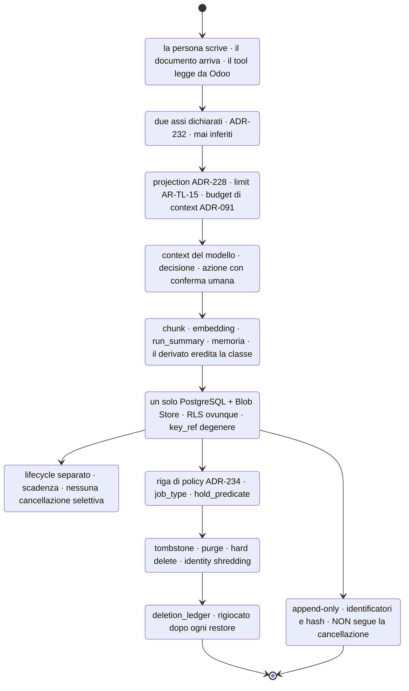

### Come leggerlo

Un dato attraversa nove stazioni. Tre meritano attenzione:

- **Classificazione** viene subito dopo l'ingresso, non alla fine. Classificare dopo aver già
  persistito significa avere un periodo in cui non si sa cosa si sta trattando.
- **Backup** si stacca dalla catena e non ci rientra: è il ramo che non torna, ed è il motivo
  del `deletion_ledger`.
- **Audit** si stacca anch'esso e **non passa da Cancellazione**. È la §22 in una freccia.

## 49.2 Memoria e knowledge — due cicli, due nature

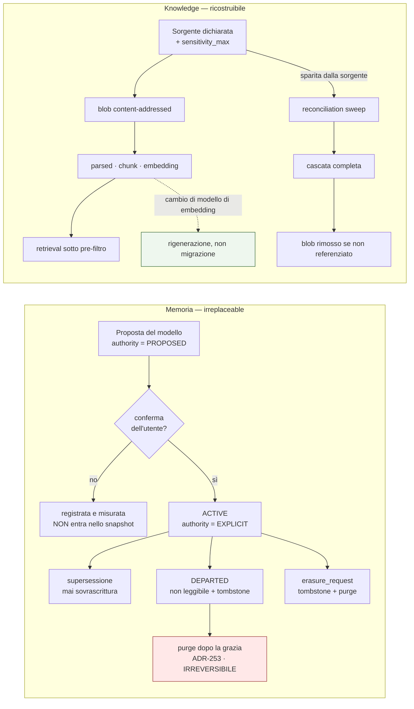

### Come leggerlo

Le due catene hanno la **stessa forma e proprietà opposte**. In alto, ogni passo verso destra
è una perdita definitiva: la purge in rosso non si annulla. In basso, il passo equivalente
(in verde) è una **rigenerazione**: si ricalcola dal blob.

**È la ragione per cui la memoria ha bisogno di una finestra di grazia e la knowledge no.**

## 49.3 Ciclo di vita del dato di evaluation

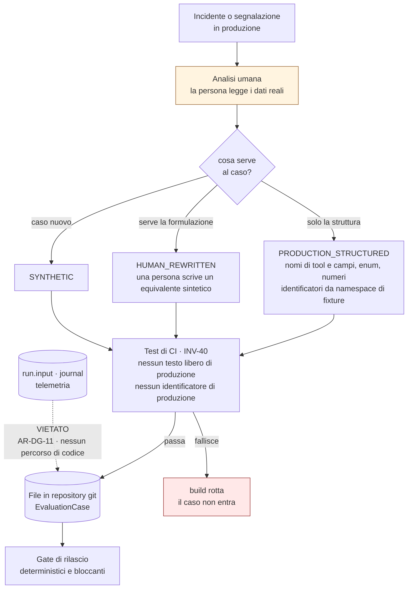

### Come leggerlo

**Il nodo arancione è il punto della decisione.** C'è sempre una persona, e non per burocrazia:
è l'unico anonimizzatore affidabile che conosciamo per il testo libero.

Il ramo di sinistra (`PRODUCTION_STRUCTURED`) è **automatizzabile** e copre la maggior parte
dei casi, perché `ADR-177` valuta gli **esiti** e non le trascrizioni. Il ramo centrale costa
tempo umano e serve solo quando la formulazione **è** il caso — tipicamente la prompt
injection.

La freccia tratteggiata è vietata staticamente: non esiste un percorso di codice.

## 49.4 Retention

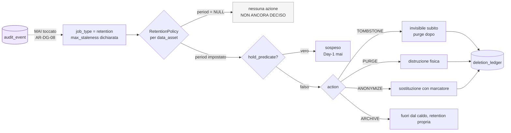

### Come leggerlo

**Il ramo grigio è quello che conta Day-1**: quasi tutti i periodi sono `NULL`, quindi il job
gira e non fa niente. È il comportamento corretto per un valore `NON ANCORA DECISO`: inazione,
non arbitrio.

Il `hold_predicate` è consultato **sempre**, anche se Day-1 risponde sempre falso: è il gancio
di `ADR-245`.

L'audit è collegato con una freccia tratteggiata negativa: il job **non può** toccarlo, e la
lista delle tabelle su cui opera è chiusa e verificata staticamente.

## 49.5 Isolamento per tenant

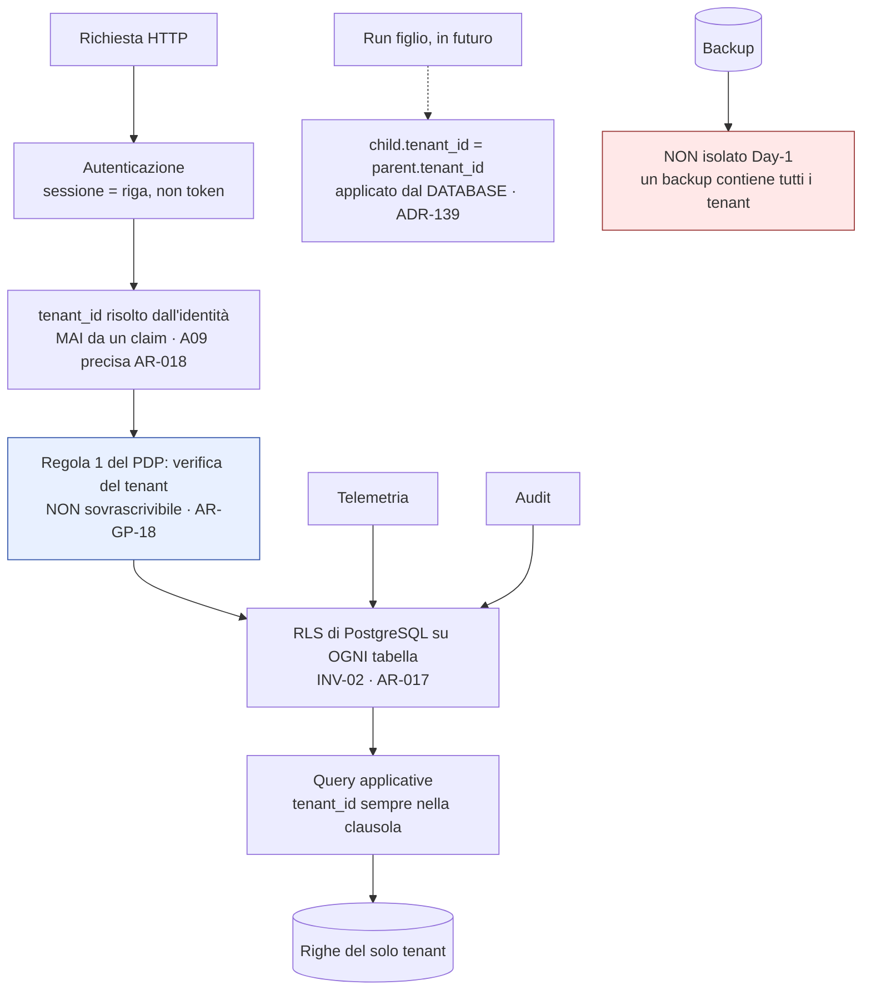

### Come leggerlo

Quattro strati, e ognuno può solo **togliere**: identità → prima regola del PDP → RLS →
query. Nessuno strato può concedere ciò che quello sopra ha negato: è l'imbuto di `ADR-025`.

**Il nodo rosso è l'unico buco reale dell'isolamento Day-1**: il backup. Un solo database
significa un solo backup, che contiene tutti i tenant. La via d'uscita è `ADR-239` + backup
per tenant, e arriva con `T-DG-01`. **Va detto al primo cliente che chiede isolamento
contrattuale**, prima che lo scopra lui.

## 49.6 Architettura di data governance Day-1

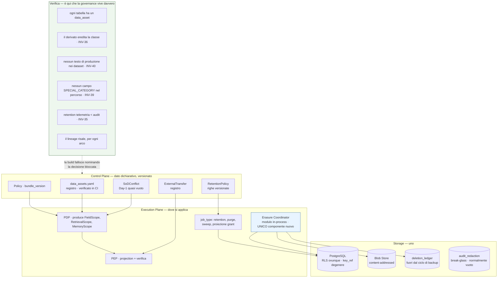

### Come leggerlo

**Il blocco verde in basso è l'architettura di data governance.** Non è un servizio: è un
insieme di verifiche. Tutto il resto sono tabelle e moduli che esistono già.

Il blocco azzurro (`Erasure Coordinator`) è l'unico componente nuovo dell'intero documento.

Questo diagramma **è anche il diagramma Day-1**: non c'è niente qui che non si costruisca al
primo giro. È la risposta alla domanda *"il Day-1 è genuinamente semplice?"* di §56.

## 49.7 Architettura enterprise futura

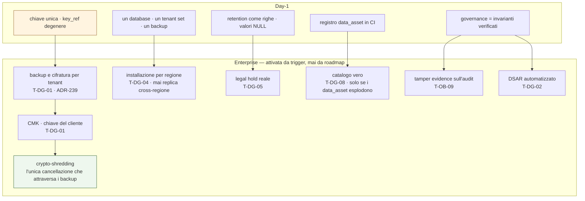

### Come leggerlo

**Ogni freccia parte da qualcosa che costruiamo Day-1 e che Day-1 non fa niente.** La colonna
`key_ref` in arancione è la più importante: è il seme da cui crescono cifratura per tenant,
CMK e crypto-shredding. Senza quella colonna, tutti e tre i rami richiederebbero una
migrazione su tabelle append-heavy.

**Nessun ramo è pianificato per data.** Ognuno ha un trigger. È il principio che
`ARCHITECTURE_STATE` applica ovunque, e vale anche qui.

---

# 50. DAY-1 / PREPARE / SCALE / ENTERPRISE

| Capacità | **Day-1** | Prepare | Scale | Enterprise |
|---|---|---|---|---|
| **Classificazione** | due assi dichiarati, registro in CI | `x-sensitivity` completo su tutti gli schemi | classificazione per sorgente documentale | riclassificazione settoriale |
| **Isolamento per tenant** | RLS ovunque, `tenant_id` non nullo | test adversariali per store | indice partizionato (`T-KN-11`) | database o installazione per tenant (`D-03`, `T-05`) |
| **Proprietà del dato** | tabella di §42, contratto | DPA se `Q-03` va verso SaaS | sub-responsabili dichiarati | catena di responsabili gestita |
| **Purpose** | enum chiuso, restringe soltanto | `purpose` obbligatorio sulle elevazioni | purpose per sorgente | binding contrattuale |
| **Retention** | policy come righe, valori `NULL` | **`DEF-13` chiusa**: i valori | retention per tipo di memoria | retention scelta dal cliente |
| **Cancellazione** | `Erasure Coordinator`, `deletion_ledger` | rigioco provato dopo restore | DSAR semi-automatico | crypto-shredding via CMK |
| **Export** | export DSAR sotto RLS | formato (`B-100`) | export di audit (**`DEF-08`, non nostro**) | portabilità certificata |
| **Correzione** | endpoint di memoria, supersessione | correzione con propagazione ai derivati | — | — |
| **Lineage** | colonne + query + test | query documentate per ogni arco | — | catalogo (`T-DG-08`) |
| **Provenance** | 11 campi, `authority`, `build_id` | — | — | — |
| **Memoria** | `ADR-253`, cancellazione, ispezione | retention per tipo | retrieval sulla memoria (`T-ME-01`) | memoria condivisa (`T-ME-05`) |
| **Knowledge** | `sensitivity_max` per sorgente | golden set etichettato | granularità di chunk (`T-DG-06`) | redazione a livello di sorgente |
| **Embedding** | classe ereditata, cascata | `B-32` chiusa | — | — |
| **Telemetria** | `INV-26`, `INV-35` | partizionamento + `DROP PARTITION` | backend dedicato (`T-OB-03`) | — |
| **Evaluation** | `ADR-240`, `INV-40` in CI | primi 20 casi | rinfresco (`T-OB-08`) | — |
| **Backup** | cifrato, scadenza, ledger rigiocato | **`DEF-06` chiusa** (`C24`) | backup per tenant | per tenant + CMK |
| **Legal hold** | predicato costante falso | — | sistema reale (`T-DG-05`) | — |
| **Residency** | dichiarata, luogo di trattamento registrato | — | — | installazione per regione (`T-DG-04`) |
| **Trasferimenti esterni** | registro + allowlist di rete | — | primo provider esterno (`T-DG-09`) | transfer impact assessment |
| **CMK** | **solo la colonna `key_ref`** | — | cifratura per tenant | CMK (`T-DG-01`) |
| **Elaborazione regionale** | — | — | — | `T-DG-04` |
| **Evidenze di conformità** | tabella di §41.2 | evidenza dell'intervento umano (`ADR-251`) | report periodici | tamper evidence (`T-OB-09`) |
| **Data catalog** | **no** | no | no | `T-DG-08` |
| **DLP** | **no**: difesa strutturale | no | no | valutare, mai come difesa primaria |
| **SoD** | motore + 2 coppie attive su 6 | baseline (`B-97`) | blocco di rilascio (`T-DG-11`) | dichiarate dal cliente |

---

# 51. MATRICE DEI TEST DI DATA GOVERNANCE

| # | Requisito | Tipo di dato | Attacco / Guasto | Componente | Controllo atteso | Rilevamento | Mitigazione | Verifica | Test di regressione |
|---|---|---|---|---|---|---|---|---|---|
| **G-01** | isolamento fra tenant | tutti | query senza `tenant_id`, o `tenant_id` da un claim | RLS, PDP | `AR-GP-18` prima regola, RLS | query cross-tenant → zero righe | `INV-02` | test adversariale: identità del tenant A, richiesta di risorsa di B | **sì, per ogni store** |
| **G-02** | export non autorizzato | export DSAR | un utente chiede l'export di un altro | endpoint di export | RLS con l'identità del **richiedente** (`AR-DG-28`) | riga di audit sull'export | verifica dell'identità | test: A chiede l'export di B → `DENY` | **sì** |
| **G-03** | cancellazione fallita | tutti | un `ErasureTask` fallisce e la richiesta viene chiusa | `Erasure Coordinator` | stato `PARTIAL`, mai `COMPLETED` | `erasure_partial_rate` | ritentativo | test: si forza il fallimento di uno store | **sì** |
| **G-04** | embedding stantio | embedding | il documento cambia, l'embedding no | Ingestion | 5 entità, 5 cause di invalidazione (`ADR-074`) | `ingestion_lag` | rigenerazione | test: si modifica il blob, si verifica la cascata | sì |
| **G-05** | memoria stantia | memoria | una memoria contraddice il CRM | Memory Module | `ADR-089`: la memoria non contiene fatti di dominio | `memory_correction_rate` | supersessione | test: si tenta di scrivere un fatto di dominio → rifiuto | **sì** |
| **G-06** | fuga nella telemetria | telemetria | un valore di campo finisce in uno span | esportatore | `INV-26`, allowlist chiusa | test CI sull'allowlist | rifiuto in scrittura | test: si tenta di emettere uno span con un valore → errore | **sì** |
| **G-07** | fuga nel dataset di evaluation | `EvaluationCase` | qualcuno incolla una trascrizione reale | CI | `INV-40`, `derivation` nel tipo | build rotta | rifiuto del merge | test: caso con testo di produzione → build fallisce | **sì** |
| **G-08** | trasferimento esterno non dichiarato | qualsiasi | un tool chiama un host non in allowlist | container, Tool Runtime | `ADR-203`, `AR-SE-11` | connessione rifiutata a livello di rete | fail-closed | test: tool verso host non dichiarato → errore | **sì** |
| **G-09** | retention non applicata | tutti | il job di retention smette di girare | `job_type` retention | `max_staleness` (`INV-24`) | **evento di errore**, non metrica assente | allarme | test: si ferma il job, si verifica l'evento | **sì** |
| **G-10** | backup più lungo del dato | backup | il backup conserva ciò che è stato cancellato | procedura di restore | `deletion_ledger` rigiocato | conteggio delle cancellazioni rigiocate | rigioco obbligatorio **prima** del traffico | test: restore di un backup precedente a una cancellazione | **sì, ed è il test più importante di tutti** |
| **G-11** | lineage rotto | derivati | un derivato non sa da dove viene | schema | FK obbligatorie, provenance a 11 campi | test di risalita per ogni arco | `AR-KN-04`: senza provenance non entra nel context | test: per ogni arco del registro, la risalita restituisce la sorgente | **sì** |
| **G-12** | fuga verso il model provider | context | qualcuno configura un provider esterno | `ModelProvider` | `AR-DG-16`, `ADR-203` | analisi statica | build rotta | test: si cerca un percorso di codice verso un endpoint esterno | **sì** |
| **G-13** | accesso di supporto non autorizzato | tutti | accesso permanente invece che elevato | PDP | `ADR-244`, elevazione a tempo | riga di audit + notifica al tenant | spegnimento automatico | test: accesso senza elevazione → `DENY` | **sì** |
| **G-14** | classificazione errata | tutti | una tabella nuova senza voce di registro | CI | `AR-DG-01`, `AR-DG-27` | build rotta | rifiuto | test: si aggiunge una tabella, la build fallisce **nominando la decisione** | **sì** |
| **G-15** | campo di categoria particolare nel percorso | campi di tool | uno schema dichiara `SPECIAL_CATEGORY` e il tool lo restituisce | PEP | `INV-39`, projection | `INVARIANT_BREACH` | rimozione + evento di errore | test: si forza il connector a restituire un campo vietato | **sì** |
| **G-16** | derivato che sfugge alla classe della sorgente | derivati | un `chunk` `RESTRICTED` produce un `embedding` `INTERNAL` | CI | `INV-36` | build rotta | rifiuto | test sul registro: per ogni arco, classi monotone | **sì** |
| **G-17** | telemetria che sopravvive all'audit | telemetria | retention configurata al contrario | CI o migrazione | `INV-35` | verifica sulle righe di retention | rifiuto della configurazione | test: `retention(telemetry) ≥ retention(audit)` → errore | **sì** |
| **G-18** | audit alterato in silenzio | audit | qualcuno cancella righe direttamente | database | `AR-DG-08`, `INV-37` | confronto fra i buchi di sequenza e `audit_redaction` | procedura break-glass | test: si cancella una riga fuori procedura → rilevata | **sì** |
| **G-19** | identity shredding incompleto | identità | resta una riga che risolve `subject_id` | `Erasure Coordinator` | `INV-38` | query di verifica su ogni percorso | `FAILED` | test: erasure su un soggetto di prova, poi tentativi di risoluzione | **sì** |
| **G-20** | alias non risolti nell'erasure | identità | si cancella un `subject_id` e non gli alias | `Erasure Coordinator` | `AR-DG-09` | verifica della chiusura | `FAILED` | test: soggetto con 3 alias, si verifica che tutti spariscano | **sì** |

---

# 52. REGISTRO DELLE NUOVE DECISIONI — `ADR-228` … `ADR-255`

| ADR | Titolo | Decisione | Reversibilità | Stato | Scadenza |
|---|---|---|---|---|---|
| **ADR-228** | **`FieldScope`: projection al confine, redazione come seconda linea** | Il PDP produce un terzo ambito accanto a `RetrievalScope` e `MemoryScope`. Il PEP restringe i campi **prima** della chiamata al connector, e verifica il risultato dopo. **Chiude `R-32` sul percorso strutturato** | Moderata | Accettata | prima dei primi tool di lettura |
| **ADR-229** | **Sul percorso documentale la granularità resta il documento** | Non è un rinvio: è una limitazione strutturale del mezzo. `sensitivity_max` per sorgente; sovra-restrizione misurata da `R-86`; `T-DG-06` riapre verso la **separazione a monte**, mai verso la redazione | Moderata | Accettata, **dichiarata definitiva** | — |
| **ADR-230** | **Le categorie particolari si dichiarano, non si rilevano** | Nessun classificatore. Esclusione per campo dichiarato (strutturato) e per sorgente dichiarata (documentale). Sul testo libero: non risolvibile, `R-87` | Costosa da invertire (è una posizione) | Accettata | prima degli schemi dei tool |
| **ADR-231** | **Il `purpose` può solo restringere** | Enum chiuso. Nessun `ALLOW` dipende dal `purpose`. Risolve `R-45` mettendolo dove è onesto | Facile | Accettata | con il PDP |
| **ADR-232** | **Classificazione a due assi, dichiarata** | `confidentiality_class` × `personal_data_class`. Mai inferita. Il derivato eredita (`INV-36`) | Moderata | Accettata | **prima dello schema** |
| **ADR-233** | **Il registro `data_asset` è un artefatto di codice verificato in CI** | `data_assets.yaml`. Nessun data catalog. Stessa forma di `ADR-176` | Facile | Accettata | **prima dello schema** |
| **ADR-234** | **La retention è una riga di policy, eseguita da un `job_type`** | `RetentionPolicy` nel Control Plane; nessun processo nuovo; `period = NULL` → inazione | Facile | Accettata | **prima dello schema** (partizionamento) |
| **ADR-235** | **Gli stati di cancellazione stanno sulla richiesta, non sulle righe** | `ErasureRequest` + `ErasureTask`; `PARTIAL` è uno stato visibile | Moderata | Accettata | con il primo DSAR |
| **ADR-236** | **Identity shredding**: la cancellazione del soggetto distrugge la chiave di risoluzione, non l'audit | Attributi, credenziali, **chiusura degli alias**, `EXTERNAL_IDENTITY_LINK` → hard delete. La riga `subject` resta in stato `ERASED`. **Non è anonimizzazione** (`R-89`) | **Effettivamente irreversibile** | Accettata, con `B-95` aperta | con il primo DSAR |
| **ADR-237** | **`deletion_ledger` rigiocato dopo ogni restore** | Append-only, solo identificatori e hash, conservato **fuori dal ciclo di backup**, rigiocato **prima** che il sistema accetti traffico | Facile, ma **va prima dei backup** | Accettata | prima del primo backup in produzione |
| **ADR-238** | **`audit_redaction`: la rimozione fisica da un audit si confessa** | Break-glass, due operatori, passa dal PDP, scrive **prima** di rimuovere, in un registro append-only non raggiungibile dallo stesso percorso | Facile come tabella; **irreversibile a ogni uso** | Accettata | — (normalmente vuota) |
| **ADR-239** | **Colonna `key_ref` degenere Day-1** | Su ogni tabella con `tenant_id` e contenuto personale in testo libero. Day-1 non fa niente. Sblocca cifratura per tenant, CMK e crypto-shredding. **Risposta a `B-50`: non il meccanismo, il contratto** | **Facile adesso, costoso dopo** | Accettata | **prima dello schema** |
| **ADR-240** | **Nessun testo libero di produzione nei dataset di evaluation** | `derivation ∈ {SYNTHETIC, PRODUCTION_STRUCTURED, HUMAN_REWRITTEN}`; `PRODUCTION_FREETEXT` non esiste nel tipo; `INV-40` in CI. **Chiude `AR-OB-24` con un meccanismo** | **Effettivamente irreversibile in senso inverso** | Accettata | **prima del primo `EvaluationCase`** |
| **ADR-241** | **Il valore precedente di `ADR-221` è un'eccezione dichiarata a `INV-07`** | Perimetro stretto: solo i campi scritti, classe ereditata dal campo, **mai leggibile dal modello**, retention più corta del journal e non fissabile prima di `B-88` | Moderata | Accettata | con i primi tool di scrittura |
| **ADR-242** | **Registro `ExternalTransfer`: i destinatari si dichiarano, non si scoprono** | Si aggancia a `ADR-203` (allowlist di rete) e `AR-SE-11`. Day-1 l'unico destinatario è Odoo | Facile | Accettata | con il primo connector |
| **ADR-243** | **Aggregati cross-tenant solo da vista dichiarata con soglia minima di gruppo** | Il valore di `k` è `NON ANCORA DECISO` (`B-79`, `B-98`). Day-1 la protezione è **non avere la vista** | Facile | **Parziale** (manca `k`) | quando serve la dimensione tenant |
| **ADR-244** | **Nessun accesso permanente ai dati dei tenant per il personale** | Solo elevazione dichiarata (`ADR-119`): autorizzazione, `purpose`, tempo, audit, **luogo di trattamento** | Moderata | Accettata | Day-1 |
| **ADR-245** | **Legal hold non Day-1, ma il predicato esiste ed è costante falso** | Il gancio costa una riga; reinserirlo dopo in ogni percorso di cancellazione è il modo di dimenticarne uno | Facile | Accettata | con il motore di retention |
| **ADR-246** | **Export DSAR: solo dai nostri store, sotto RLS, con manifesto degli esclusi** | Non è `DEF-08` (export di audit), che resta di `A16`/`C26`. Rischio nuovo `R-94` | Moderata | Accettata | con il primo DSAR |
| **ADR-247** | **Regione singola; sovereignty e luogo di trattamento tracciati separatamente** | Nessuna architettura regionale Day-1. La residency si dichiara, il luogo di trattamento si registra | Facile (non c'è niente da invertire) | Accettata | Day-1 |
| **ADR-248** | **La qualificazione titolare/responsabile è bloccata su `Q-03` e non la prendo** | La piattaforma fornisce le capacità tecniche di **entrambi** i ruoli. `RICHIEDE PARERE LEGALE` | — | Accettata come non-decisione dichiarata | con `Q-03` |
| **ADR-249** | **SoD: la forma è definita, il contenuto è `INTERPRETAZIONE NOSTRA`** | `SoDConflict` come riga; valutato su `on_behalf_of`, **mai** sull'`actor`; baseline minimo a 6 coppie, di cui 2 attive Day-1. `B-97` per un baseline citabile | Moderata | **Parziale** | prima di `T-SE-10` |
| **ADR-250** | **Nessuna scadenza di conformità costruita su fonti in conflitto (`B-90`)** | Invece: verificare che le capacità dell'art. 14(4) ci siano **già**. Sono `ADR-191`, `ADR-196`, `ADR-189`, `ADR-190`, `ADR-216`, `ADR-212`. La data diventa irrilevante per l'architettura, non per il contratto | Facile | Accettata | `B-90` prima del contratto |
| **ADR-251** | **`modified_fields[]` e `approval_decision_time` sono evidenza di conformità** | Prova dell'intervento umano **sostanziale** (art. 22, SCHUFA C-634/21). Conseguenza: **seguono la retention dell'audit** (`AR-DG-25`) | Facile | Accettata | con l'endpoint di approvazione |
| **ADR-252** | **La retention della telemetria è strettamente più corta di quella dell'audit** | Completa `ADR-184` di `A12` fissando **l'ordinamento** invece dei valori. `INV-35` | Facile | Accettata | **prima dello schema** |
| **ADR-253** | **Retention dei soggetti `DEPARTED`** | Non leggibili **e** tombstone immediati; purge dopo una finestra di grazia `NON ANCORA DECISO`. L'identità **resta**; muore solo con una `erasure_request`. Completa `AR-ID-09` | Irreversibile negli effetti | **Parziale** (manca il valore) | `DEF-13` |
| **ADR-254** | **Nessun oggetto `Consent` Day-1** | Il consenso non è la base giuridica di default. L'unico luogo plausibile è la memoria, dove il controllo utente esiste già in forma più forte (`ADR-094`, `AR-ME-09`, 8 endpoint) | Facile | Accettata | — |
| **ADR-255** | **`Erasure Coordinator` come modulo in-process** | Unico componente nuovo del documento. Zero servizi, zero datastore nuovi. Passa il test di `AR-CP-02` tre su tre | Moderata | Accettata | con il primo DSAR |

---

# 53. REGOLE ARCHITETTURALI NUOVE — `AR-DG-01` … `AR-DG-28`

| ID | Regola | Verifica |
|---|---|---|
| **AR-DG-01** | Ogni dato persistito appartiene a un `data_asset` dichiarato nel registro; nessuna tabella senza voce | statica (CI) |
| **AR-DG-02** | Ogni `data_asset` dichiara `confidentiality_class` e `personal_data_class`. Nessuna classificazione inferita a runtime | statica |
| **AR-DG-03** | `writable_fields ⊆ allowed_fields`: un campo che non si può leggere non si può scrivere. Nessun tool scrive su un campo `SPECIAL_CATEGORY` | statica (schemi) |
| **AR-DG-04** | La projection dei campi è decisa dal PDP e applicata **prima** della chiamata al connector; la redazione è seconda linea, mai unica. Nessun tool espone un campo che un altro nega alla stessa `FieldScope` | statica + test |
| **AR-DG-05** | Nessun campo di dominio del CRM è persistito, **con l'unica eccezione dichiarata di `ADR-241`** | statica |
| **AR-DG-06** | Il `purpose` può solo restringere; nessun `ALLOW` dipende da esso | test sul PDP (monotonia) |
| **AR-DG-07** | Ogni categoria di dato ha una retention dichiarata come **riga di policy**, mai come costante nel codice | statica |
| **AR-DG-08** | Nessun job di retention cancella righe di audit; la lista delle tabelle su cui opera è chiusa | statica |
| **AR-DG-09** | Una richiesta di cancellazione per soggetto risolve l'intera **chiusura degli alias** `merged_into` | test |
| **AR-DG-10** | La cancellazione di un documento propaga a `parsed_content`, `chunk`, `embedding`, `entity_link` e blob non referenziati | test |
| **AR-DG-11** | Nessun testo libero di produzione entra in un dataset di evaluation. **Non esiste il percorso di codice** | statica + CI |
| **AR-DG-12** | La retention della telemetria è **strettamente più corta** di quella dell'audit | test sulle righe di policy |
| **AR-DG-13** | Nessun accesso permanente ai dati dei tenant per il personale di piattaforma; solo elevazione dichiarata a tempo | statica (nessun ruolo con grant permanente) |
| **AR-DG-14** | Ogni elevazione registra `purpose`, durata e **luogo di trattamento** | test |
| **AR-DG-15** | Nessun trasferimento esterno esiste se non è nel registro `ExternalTransfer` **e** nell'allowlist di rete | statica + test |
| **AR-DG-16** | Nessun percorso di codice invia il context a un model provider esterno | statica |
| **AR-DG-17** | Ogni tabella con `tenant_id` e contenuto personale in testo libero porta `key_ref` | statica (schema) |
| **AR-DG-18** | Ogni cancellazione produce una riga nel `deletion_ledger`; il ledger è **rigiocato** dopo un restore prima di accettare traffico | test di restore |
| **AR-DG-19** | La rimozione fisica di una riga di audit passa **solo** dal registro `audit_redaction` | statica + test |
| **AR-DG-20** | Un aggregato cross-tenant è servito solo da una vista dichiarata con soglia minima di gruppo | statica |
| **AR-DG-21** | Nessun dato di produzione diventa dato di addestramento: non esiste il percorso di codice | statica |
| **AR-DG-22** | La classificazione di un dato derivato è **almeno** quella della sua sorgente | CI sul registro |
| **AR-DG-23** | Un `EvaluationCase` dichiara `derivation`; `PRODUCTION_FREETEXT` non è un valore ammesso dal tipo | tipo + CI |
| **AR-DG-24** | Ogni conflitto SoD è valutato su `on_behalf_of`, **mai** sull'`actor` agent | test sul PDP |
| **AR-DG-25** | `modified_fields[]` e `approval_decision_time` seguono la retention dell'**audit**, non della telemetria | test sulle righe di policy |
| **AR-DG-26** | Un documento entra nell'indice solo se la sua sorgente **e** la sua `sensitivity_max` sono dichiarate | statica |
| **AR-DG-27** | Il registro `data_asset` è verificato in CI contro lo schema: una tabella nuova senza voce **fa fallire la build, nominando la decisione bloccata** | CI |
| **AR-DG-28** | Nessun export attraversa il confine di tenant; l'export si costruisce sotto RLS con l'identità del **richiedente** | test |

**Debito di verifica: 25 su 28 con verifica automatica realistica.** Le tre `REVIEWED` —
`AR-DG-02` (la *correttezza* della classificazione è un giudizio umano, l'*esistenza* no),
`AR-DG-14` (il luogo di trattamento è auto-dichiarato dal client), `AR-DG-26` (la *veridicità*
della `sensitivity_max` dichiarata) — contano come debito al gate di Level A.

---

# 54. INVARIANTI, RISCHI, ASSUNZIONI, TRIGGER, BACKLOG

## 54.1 Invarianti nuovi — `INV-35` … `INV-40`

| ID | Invariante |
|---|---|
| **INV-35** | Per ogni fatto registrato in entrambi i piani, il record di telemetria **non sopravvive** al record di audit corrispondente. `retention(telemetry) < retention(audit)`, per ogni classe. *È il confine audit/telemetria di `INV-27` esteso alla dimensione temporale* |
| **INV-36** | Per ogni arco `sorgente → derivato` del registro `data_asset`, **entrambe** le classi del derivato sono ≥ di quelle della sorgente. *Rende strutturale "il derivato non sfugge alla governance della sorgente"* |
| **INV-37** | Nessuna riga di audit è rimossa fisicamente se non attraverso `audit_redaction`; per ogni rimozione esiste **esattamente una** riga firmata in quel registro. *Non conserva l'integrità: conserva la conoscenza della sua perdita* |
| **INV-38** | Dopo il completamento di una `erasure_request`, **nessuna riga della piattaforma** permette di risolvere quel `subject_id` in un identificatore diretto della persona. *È la forma falsificabile di `ADR-236`* |
| **INV-39** | Nessun campo dichiarato `SPECIAL_CATEGORY` compare in un `ToolInvocation`, in un `ToolResult`, nel context, nel journal o nell'audit. *Rende `ADR-230` verificabile* |
| **INV-40** | Nessun testo libero prodotto in produzione compare in un file di dataset di evaluation. *Rende `AR-OB-24` un meccanismo invece che un'intenzione* |

## 54.2 Rischi nuovi — `R-86` … `R-96`

| ID | Rischio | Classe | Prob. | Impatto | Mitigazione |
|---|---|---|---|---|---|
| **R-86** | **Sovra-restrizione documentale**: documenti utili resi irraggiungibili perché contengono un passaggio sensibile; il retrieval si impoverisce **in silenzio** | Quality/Privacy | Media | Medio | `over_restriction_rate` + `T-DG-06` → separazione a monte, **mai** redazione |
| **R-87** | **Il testo libero dell'utente è il maggior serbatoio di dato personale da noi**, non classificabile né minimizzabile; ci possono finire categorie particolari | Privacy | **Alta** | **Alto** | retention corta, trasparenza a monte, non propagazione (`ADR-240`). **Mitigazione dichiarata debole** |
| **R-88** | **Il valore precedente di `ADR-221` è dato di dominio nel nostro journal**: erode `INV-07` per accumulo, come `R-35` per la memoria | Compliance | Media | **Alto** | `ADR-241`: perimetro stretto, retention più corta, mai leggibile dal modello, `AR-DG-05` |
| **R-89** | **L'identity shredding non è anonimizzazione**: `acl_subject` risolve in Odoo e i pattern comportamentali re-identificano | Privacy | Media | **Alto** | dichiarato. `B-95`, `B-99`. Mitigazione parziale: hash di `acl_subject` nell'audit, al costo della leggibilità |
| **R-90** | **Il `deletion_ledger` non viene rigiocato dopo un restore** e dati cancellati tornano vivi in silenzio | Compliance | Media | **Alto** | il rigioco è **un passo obbligatorio** della procedura di restore, e la procedura va **provata** (lezione di `R-78`) |
| **R-91** | **Il registro `data_asset` diverge dallo schema e il test di CI viene disattivato** (stessa forma di `R-69`) | Process | Media | **Alto** | il test fallisce **nominando la decisione bloccata**, non con "registry mismatch" |
| **R-92** | **Il motore SoD resta vuoto Day-1 senza che nessuno se ne accorga**, perché `ADR-217` ha già tolto la superficie; quando la superficie si allarga, il motore è ancora vuoto | Process | **Alta** | **Alto** | **`T-DG-11`**: allargamento con registro vuoto = **blocco di rilascio**, agganciato a `AR-SE-26` |
| **R-93** | **La classificazione ad alto rischio dell'AI Act cambia per un caso d'uso nuovo** e nessuno rivaluta | Compliance | Media | **Alto** | `T-DG-03`, agganciato al gate di `AR-SE-26` |
| **R-94** | **L'export DSAR diventa un canale di esfiltrazione**: in un file ciò che le policy davano a pezzi. È `R-17` travestita da diritto | Security | Media | **Alto** | autenticazione forte, notifica all'amministratore, rate limiting, contenuto limitato al richiedente. `B-94` |
| **R-95** | **La retention non viene mai fissata**: tutto resta `NON ANCORA DECISO` e il sistema accumula per sempre | Process | **Alta** | Medio | **`DEF-13` con scadenza "prima dello schema"** e owner nominato. Senza owner, si realizza |
| **R-96** | **I backup diventano l'archivio vero**: retention di backup più lunga di quella del dato, quindi la cancellazione è nominale | Compliance | **Alta** | **Alto** | vincolo di coerenza in §25.3: o il backup dura meno del dato, o il ledger copre la differenza. **Quello che non è accettabile è non sapere quale delle due** |

## 54.3 Assunzioni nuove — `AS-50` … `AS-55`

| ID | Assunzione | Confidenza | Impatto se falsa | Validazione |
|---|---|---|---|---|
| **AS-50** | Il deployment Day-1 è in UE e la macchina è sotto il controllo del committente | **Bassa** — dipende da `Q-03` | residency e sovereignty vanno riprogettate, §37 | **`Q-03`** |
| **AS-51** | Nessun tenant Day-1 tratta categorie particolari nei campi che i nostri tool leggono | **Bassa** | `INV-39` non basta e serve una base giuridica ex art. 9(2) | **`B-103`** + revisione degli schemi |
| **AS-52** | Le richieste di data subject Day-1 sono poche unità l'anno: un processo semi-manuale basta | Media | serve automazione completa e verifica dell'identità del richiedente | conteggio nel primo anno; `T-DG-02` |
| **AS-53** | I documenti indicizzati Day-1 vengono da sorgenti aziendali dichiarate, non da caselle di posta personali | Media | `AR-DG-26` non basta; `ADR-085` va difeso | verifica per connector |
| **AS-54** | Il committente accetta che la cancellazione dai backup avvenga per scadenza, non su richiesta | **Bassa** — è contrattuale, non tecnica | serve il crypto-shredding, quindi `ADR-239` reale, quindi `T-DG-01` anticipato | **conferma esplicita del committente** |
| **AS-55** | Nessun caso d'uso Day-1 rientra nell'Allegato III dell'AI Act | Media (il `FATTO` di `R-14.1` la supporta) | classificazione ad alto rischio, obblighi del capo III | `T-DG-03` + `Q-01` |

## 54.4 Trigger nuovi — `T-DG-01` … `T-DG-11`

| ID | Condizione osservabile | Riapre | Verso |
|---|---|---|---|
| **T-DG-01** | primo tenant con requisito **contrattuale** di CMK, o primo deployment multi-tenant con co-tenant non fidati | `ADR-239`, `B-50` | cifratura per tenant → CMK → crypto-shredding → backup per tenant |
| **T-DG-02** | prima richiesta reale di un data subject | il processo semi-manuale, `AS-52` | `Erasure Coordinator` completo + verifica dell'identità del richiedente |
| **T-DG-03** | primo caso d'uso che produce **scoring** usato per decidere fidi, condizioni o accesso a servizi | `AS-55`, la classificazione AI Act, l'art. 22 | rivalutazione **prima** del rilascio, dentro il gate di `AR-SE-26` |
| **T-DG-04** | primo tenant con requisito di residency diverso dalla macchina | `ADR-247` | **installazione per regione**, mai replica cross-regione. Coincide con `T-05` |
| **T-DG-05** | primo requisito reale di legal hold | `ADR-245` | il predicato da costante falso a sistema |
| **T-DG-06** | `over_restriction_rate` sopra soglia sul percorso documentale | **`ADR-229`** | granularità di chunk **per separazione a monte**, mai per redazione |
| **T-DG-07** | prima richiesta di un'autorità di rimuovere fisicamente un dato dall'audit | **`INV-05`**, `ADR-238` | `ADR-238` esce dal cassetto e `INV-05` va rinegoziata col committente |
| **T-DG-08** | il numero di `data_asset` supera ciò che una persona legge in un pomeriggio (~50) | `ADR-233` | valutare un catalogo vero |
| **T-DG-09** | primo model provider esterno richiesto da un tenant | `ADR-242`, §8.3, §33.2 | DPA, valutazione del trasferimento, `AR-DG-16` da rinegoziare |
| **T-DG-10** | la retention dei backup supera quella dichiarata di una categoria di dato | `R-96` si è realizzato | o si accorcia il backup, o `ADR-237` deve coprire la differenza in modo provato |
| **T-DG-11** | **`T-SE-10` scatta (allargamento della superficie di scrittura sull'ERP) mentre il registro SoD è vuoto per le entità coinvolte** | `ADR-226`, `ADR-249`, `R-92` | **blocco di rilascio**, dentro il gate di `AR-SE-26` |

## 54.5 Backlog di ricerca nuovo — `B-94` … `B-103`

| ID | Cosa verificare | Serve a |
|---|---|---|
| **B-94** | Difese contro l'esfiltrazione per composizione applicate all'**export DSAR** (specializza `B-89` su un percorso nuovo) | `R-94`, `ADR-246` |
| **B-95** | **art. 17(3) GDPR**: quali eccezioni coprono un audit trail di sicurezza; e se la pseudonimizzazione irreversibile rispetto al titolare soddisfa una richiesta di cancellazione. **RICHIEDE PARERE LEGALE** oltre alla ricerca EDPB | **`ADR-236`, §22. È la voce più importante di questo elenco** |
| **B-96** | Obblighi di **logging e conservazione dell'AI Act** (artt. 12 e 19) per i sistemi ad alto rischio: durate effettive | §19.6, `DEF-13` |
| **B-97** | Esiste un **baseline pubblico di regole SoD** per CRM/ERP (cataloghi SAP GRC, Oracle, framework di revisione) da cui derivare invece di chiedere al cliente da zero? Specializza `B-93` | `ADR-249`, `R-92`, `AS-49` |
| **B-98** | Soglia `k` minima e tecniche difendibili per gli aggregati cross-tenant. Specializza `B-79` | `ADR-243` |
| **B-99** | **Re-identificazione da pattern comportamentali** in log pseudonimizzati: quanto regge l'identity shredding | `R-89`, `ADR-236` |
| **B-100** | Formato standard per l'export di **portabilità** (**non** `DEF-08`, che è l'audit) | `ADR-246` |
| **B-101** | Attacchi di **inversione degli embedding applicati alla memoria**. Specializza `B-32` | `ADR-099`, prima di `memory_embedding` |
| **B-102** | Esiste una **prassi citabile** sulla retention degli audit di sicurezza per PMI italiane? | §19.6, `DEF-13` |
| **B-103** | Quali campi standard di **Odoo**, sui modelli CRM che ci interessano, possono contenere categorie particolari | `ADR-230`, `INV-39`, `AS-51` |

## 54.6 Decisione rimandata nuova

| ID | Decisione | A chi tocca | Scadenza |
|---|---|---|---|
| **DEF-13** | **I valori concreti di retention per categoria** (§19). Il criterio è scritto per ciascuna; mancano i numeri | **il committente**, con parere legale. Input tecnici da `B-95`, `B-96`, `B-102`, `B-88` | **prima dello schema del database**: determinano il partizionamento |

**`DEF-06` (RPO/RTO) resta di `C24` e dipende da `Q-02`: non la chiudo.**
**`DEF-08` (formato dell'export di audit) resta di `A16`/`C26`: non la chiudo.**

---

# 55. TENTATIVO DI DIMOSTRARE CHE QUESTA ARCHITETTURA È SBAGLIATA

Questa sezione lavora contro il documento. Non elenca dubbi: cerca il colpo che lo abbatte.

## 55.1 Il colpo più duro — `INV-07` protegge da ciò che facciamo, non da ciò che siamo

L'intero documento poggia su una tesi: *il dato personale non è nostro perché non lo copiamo*.

**L'obiezione.** Non copiare il dato ci protegge dall'obbligo di **conservarlo**. Non ci
protegge dall'obbligo di **non farne uso improprio**. Un agent che legge, in un giorno, i
dati di quattromila clienti per rispondere a quattromila domande **ha trattato quattromila
persone**. Il fatto che non ne resti copia riduce il rischio di violazione, non la portata del
trattamento.

E c'è di peggio: un sistema che copia il dato è **ispezionabile** — si guarda la tabella e si
vede cosa c'è. Un sistema che legge dal vivo, no. `R-67` lo dice già: *"sappiamo quale
chiamata è stata fatta, non cosa ha risposto"*. **La nostra proprietà migliore è anche il
nostro peggior punto cieco.**

**Quanto regge la difesa.** Regge in parte. `ADR-228` migliora molto la situazione, perché ora
sappiamo esattamente **quali campi** sono stati chiesti e quali restituiti. Ma i **valori**
restano ignoti dopo il run. Se un'autorità chiedesse *"quali dati di questo interessato sono
stati mostrati al modello il 14 marzo?"*, sapremmo dire quali record e quali campi — non quali
valori avevano allora. Per la maggior parte delle domande basta. **Per una perizia, no.**

**Verdetto: colpo assorbito, con una ferita dichiarata.** `R-67` resta aperta e questo
documento la rende più precisa senza chiuderla.

## 55.2 Il secondo colpo — la governance è un file YAML e una CI

L'obiezione di §45.3, ripresa con più forza: **le difese di questo documento sono per lo più
verifiche di CI**. Un pomeriggio di rilascio urgente, tre test che falliscono, uno `--skip`, e
metà del documento è disattivata. `R-91` lo prevede, `R-69` è già successo altrove, `R-75`
dice che *l'attrito viene disattivato per lamentele* con probabilità **Alta**.

**Quanto regge la difesa.** Non del tutto. La contromisura — far fallire il test nominando la
decisione bloccata — è ergonomia, non impedimento. **Ma la parte migliore dell'architettura
non è in CI**: `INV-07` è una proprietà del design, la RLS è nel database, `ADR-203` è nel
container, `ADR-038` è nell'assenza di rete. Quelle non si disattivano con un flag.

**Verdetto: colpo parzialmente a segno.** Le difese di CI sono il **secondo** strato. Se
cadono, resta il primo. Ma le sei cose nuove più importanti di questo documento — `INV-36`,
`INV-39`, `INV-40`, `AR-DG-01`, `AR-DG-11`, `AR-DG-21` — sono **tutte** in CI.

## 55.3 Le nove domande di falsificazione del prompt

**Quale numero di tenant la rompe?**
Il primo tenant che chiede l'isolamento **contrattuale** dei backup. Non è un numero: è un
contratto. Con `ADR-239` la via d'uscita esiste; senza sarebbe una migrazione. Sul volume,
la RLS su un database regge molto oltre l'orizzonte Day-1.

**Quale volume di dati la rompe?**
Non la governance: l'ingestion. `Q-04` è aperta e `A07` ha già stabilito che *a rompersi per
prima non è pgvector, è l'embedding su CPU* (~10⁶ chunk). Sulla governance, il numero che
conta è quello dei `data_asset`, non delle righe: **~50 voci** e il registro YAML smette di
essere leggibile (`T-DG-08`).

**Quale requisito di retention la rompe?**
Uno che imponga **una retention più corta di quella dei backup senza poter accorciare i
backup**. A quel punto serve il crypto-shredding, quindi `ADR-239` reale, quindi `T-DG-01`
anticipato. È `AS-54`, confidenza Bassa. **È il requisito più probabile fra tutti quelli
elencati qui.**

**Quale requisito di cancellazione la rompe?**
La rimozione **fisica** da un audit append-only (`T-DG-07`). `ADR-238` è una risposta
procedurale, non tecnica: la rottura di `INV-05` avviene, e ci limitiamo a renderla visibile.
**Un'autorità che rifiutasse la pseudonimizzazione irreversibile come forma di cancellazione
metterebbe l'architettura in una posizione senza uscita elegante.** `B-95` è la voce di
backlog più urgente del documento.

**Quale requisito di residency la rompe?**
Uno multi-regione **con un solo tenant a cavallo delle regioni**. Un'installazione per regione
risolve il caso "clienti diversi in regioni diverse"; non risolve "un cliente che vuole i dati
italiani in Italia e quelli tedeschi in Germania **nella stessa istanza**". Quello richiede
partizionamento geografico dentro il tenant, che oggi non c'è e sarebbe caro.

**Quale requisito di modello esterno la rompe?**
Un tenant che imponga un modello cloud. Tutta §33 e metà di §8 cambierebbero: comparirebbe un
sub-responsabile, un trasferimento, una politica di conservazione dei prompt da negoziare.
`AR-MD-09` e il PDP tengono il controllo; **ma la proprietà "non c'è un fornitore" è la più
preziosa del documento e sarebbe persa.**

**Quale requisito di CMK la rompe?**
Nessuno, grazie a `ADR-239` — **a patto che la colonna esista dal primo commit**. Se qualcuno
la togliesse in una pulizia (`R-49` applicata qui), il requisito diventerebbe una migrazione
su tabelle append-heavy in produzione.

**Quale requisito normativo la rompe?**
Un settore regolato in cui le **categorie particolari sono il caso normale** — sanità,
assicurazioni salute. `ADR-230` (dichiarare, non rilevare) presuppone che le categorie
particolari siano l'eccezione da escludere. Se fossero la regola, servirebbe una gestione
attiva, che è precisamente ciò che il documento ha scelto di non costruire. **Sarebbe una
riprogettazione, non un adeguamento.**

**Quale requisito di export enterprise la rompe?**
`DEF-08` (formato dell'export di audit) è aperta e non è nostra. Se un cliente imponesse un
formato standard di settore, potrebbe non essere esprimibile con un audit fatto di
identificatori e hash: un formato che si aspetta il **contenuto** delle operazioni troverebbe
solo riferimenti. **`ADR-083` renderebbe il nostro audit non conforme a un formato che presume
il testo.** È un rischio che nessuno ha registrato, e che appartiene ad `A16`.

## 55.4 Il primo trigger che scatterà, secondo me

**`T-DG-10`** — la retention dei backup supera quella dichiarata di una categoria di dato.

Non per carico, non per contratto: **per default di configurazione**. Il primo sistema di
backup che qualcuno configura conserva "il più possibile", perché è ciò che fanno tutti i
sistemi di backup. E succederà **prima** che `DEF-13` sia chiusa, quindi il confronto sarà fra
un backup con una retention reale e un dato con una retention `NULL`.

È la stessa logica delle previsioni di `A02` (`T-CP-02`, per esposizione) e di `A09`
(`T-ID-04`, per contratto): **il primo trigger scatta per una ragione banale, non per la
ragione interessante.**

---

# 56. AUTOCRITICA ARCHITETTURALE

Le venti domande del prompt, con risposte oneste.

**1. Ho inventariato tutti i dati importanti?** Credo di sì, e ne ho trovato uno che nessuno
aveva nominato: il valore precedente di `ADR-221` (`F6`). Restano fuori i dati di sistema
puri — log del container, metriche dell'OS — che non ho inventariato e che possono contenere
identificatori. **Lacuna dichiarata.**

**2. Li ho classificati?** Sì, con due assi. Ma la classificazione **dell'esistente** è un
lavoro che non è stato fatto: ho definito lo schema, non ho compilato tutte le trenta righe.

**3. Ho mappato l'intero ciclo di vita?** Sì per i dati di dominio. **Meno bene per i dati di
configurazione**: cosa succede a una `AgentVersion` quando non serve più? La risposta è "resta
finché esistono run che la citano", e non ho detto per quanto.

**4. Ho distinto produzione da evaluation?** Sì, ed è una delle parti migliori (`ADR-240`).
**Ma il costo è reale e va sul passo già più fragile**: `AS-42` e `R-70` dicono che l'anello
di feedback muore proprio lì.

**5. Ho distinto telemetria da audit?** Sì, e ho aggiunto la dimensione temporale (`INV-35`)
che mancava.

**6. Ho modellato il dato derivato?** Sì, §18, con `INV-36` che impedisce la declassificazione.

**7. Ho modellato gli embedding?** Sì, ma **senza numeri**: `B-32` è aperta e ho scelto la
posizione prudente per default, non per evidenza.

**8. Ho modellato la memoria?** Sì, e ho chiuso il debito su `DEPARTED` (`ADR-253`) — **ma con
la finestra di grazia `NON ANCORA DECISO`**, cioè ho chiuso la forma e non il valore.

**9. Ho modellato i backup?** Sì, ed è la parte in cui l'architettura è più debole (§25,
`R-96`). Dipende da `DEF-06`, che non è mia.

**10. La cancellazione propaga attraverso il derivato?** Sì per la knowledge (cascata testata),
sì per l'identità (`ADR-236`), **no per i backup** (solo mitigato da `ADR-237`), **no per
l'audit** (per scelta dichiarata).

**11. I tenant si isolano ovunque?** Nel database sì. **Nei backup no**, e l'ho detto (§49.5,
nodo rosso).

**12. I trasferimenti esterni si controllano?** Sì, ed è facile perché **non ce ne sono**. La
proprietà dipende da un'assenza, e le assenze si riempiono.

**13. I model provider possono ricevere dati inaspettatamente?** No: non esistono. Ma la
difesa è `AR-DG-16` (analisi statica) più `ADR-203` (rete): **se qualcuno aggiungesse un
provider deliberatamente, sarebbe una decisione, non un incidente.** È il livello di
protezione giusto.

**14. Il dato di produzione può diventare dato di addestramento in silenzio?** No. È una
verifica statica su un percorso di codice che non esiste. **È la risposta più solida del
documento.**

**15. Gli amministratori possono accedere ai dati dei clienti senza controlli?** **Sì, se
hanno accesso alla macchina.** `R-47` e `R-48` restano aperti con impatto Alto. Day-1 la
difesa è procedurale e di rilevabilità, non crittografica, e `ADR-239` è solo un contratto per
il futuro. **È il punto più debole dell'intera architettura, ed è ereditato, non introdotto.**

**16. La piattaforma supporta l'export?** Sì (`ADR-246`), con un rischio nuovo (`R-94`) e un
formato aperto (`B-100`).

**17. La piattaforma supporta la correzione?** Sì per la memoria. Per il dato di dominio la
correzione avviene in Odoo, ed è corretto così — **ma su record `IMMUTABLE_RECORD` la
correzione è una scrittura di rettifica, mai una modifica** (`ADR-222`, art. 2215-bis), e
questo va spiegato all'utente in un'interfaccia, non solo in un documento.

**18. La piattaforma sa provare la cancellazione?** Sì: `deletion_ledger` + certificato con
l'elenco degli esclusi. **La parte che non sa provare è quella che riguarda i backup**, dove
può solo provare che il rigioco è avvenuto.

**19. Il Day-1 è genuinamente semplice?** Un componente nuovo (`Erasure Coordinator`), quattro
tabelle nuove (`erasure_request`, `erasure_task`, `deletion_ledger`, `audit_redaction`), un
file YAML, una colonna in più su alcune tabelle, un `job_type`, sei verifiche di CI. **Sì, per
i miei criteri.** Ma **28 ADR e 28 regole nuove sono tante**, e una parte è documentazione di
ciò che esisteva già senza nome. Chi legge solo l'elenco delle regole penserà che il documento
abbia introdotto più di quanto ha fatto.

**20. Quali assunzioni possono invalidare l'architettura?** In ordine di pericolosità:
`AS-51` (nessuna categoria particolare nei campi che leggiamo) — se falsa, §7 non basta;
`AS-54` (cancellazione dai backup per scadenza) — se falsa, serve il crypto-shredding subito;
`AS-50` / `Q-03` — se il deployment è SaaS, §8 e §37 cambiano;
e fuori da questo documento **`ADR-068`** (embedding su CPU): se `B-26` andasse male e si
tornasse a un servizio esterno di embedding, comparirebbe il trasferimento verso terzi più
voluminoso della piattaforma, e §33 e §34 andrebbero riscritte.

## 56.1 Le tre cose che rifarei diversamente

1. **`ADR-238` (il registro delle redazioni di audit) è probabilmente sovraprogettato per
   Day-1.** Due operatori, un registro dedicato, firme: per un evento che potrebbe non
   accadere mai. La difesa: costa una tabella vuota e una procedura scritta, e il momento in
   cui serve è il momento peggiore per progettarla. Ma è la decisione di cui sono meno
   convinto.
2. **Il numero di `AR-DG-*` è alto.** Ventotto regole nuove sono difficili da tenere in
   testa, e alcune (`AR-DG-05`, `AR-DG-13`) sono restatements di invarianti esistenti in
   linguaggio di data governance. Un elenco più corto sarebbe più applicato.
3. **Non ho affrontato i log di sistema.** Container, reverse proxy, PostgreSQL stesso: tutti
   scrivono log che possono contenere identificatori e, in caso di errore, frammenti di query.
   `INV-26` copre la **nostra** telemetria, non `stderr` di un processo. **È il buco più
   banale e più probabile del documento.** → va aggiunto al backlog operativo, e lo dichiaro
   qui invece di lasciarlo scoprire a qualcun altro.

---

# 57. RACCOMANDAZIONE FINALE

## 57.1 Cosa costruire davvero

**Governance ibrida (Opzione C): le regole sono dato, l'esecuzione sta dove stanno i dati, la
verifica sta in CI.**

| Dimensione | Cosa si costruisce Day-1 |
|---|---|
| **Modello dei dati** | un solo PostgreSQL + `Blob Store`. Quattro tabelle nuove: `erasure_request`, `erasure_task`, `deletion_ledger`, `audit_redaction`. Una colonna nuova: `key_ref`, degenere |
| **Classificazione** | due assi dichiarati (`ADR-232`), registro `data_assets.yaml` verificato in CI (`ADR-233`), il derivato eredita (`INV-36`) |
| **Proprietà** | tabella di §42. L'audit ha owner piattaforma e accesso garantito al tenant. Da mettere nel contratto |
| **Purpose** | enum chiuso; può **solo restringere** (`ADR-231`) |
| **Lineage** | colonne e query esistenti + test di risalita. **Nessun sistema di lineage** |
| **Provenance** | 11 campi per i frammenti, `authority` + 5 timestamp per la memoria, `build_id` per i tool. Già in essere |
| **Retention** | `RetentionPolicy` come righe (`ADR-234`); valori `NULL` Day-1; `INV-35` fissa l'ordinamento senza numeri; **`DEF-13`** per i valori |
| **Cancellazione** | `Erasure Coordinator` in-process (`ADR-255`); meccanismo per store (§21.2); **identity shredding** (`ADR-236`); `deletion_ledger` rigiocato dopo restore (`ADR-237`) |
| **Export** | DSAR sotto RLS con manifesto degli esclusi (`ADR-246`). **`DEF-08` resta di `A16`** |
| **Correzione** | endpoint di memoria esistenti; sul dominio si corregge in Odoo, e su `IMMUTABLE_RECORD` **si rettifica, mai si modifica** |
| **Memoria** | `ADR-253` per i `DEPARTED`; cancellazione irreversibile; controllo utente già esistente |
| **Knowledge** | `sensitivity_max` per sorgente (`AR-DG-26`); granularità **documento**, dichiarata definitiva (`ADR-229`) |
| **Embedding** | classe ereditata dal chunk; cascata; **non è anonimo** |
| **Evaluation** | `derivation` nel tipo, `PRODUCTION_FREETEXT` inesistente, `INV-40` in CI (`ADR-240`) |
| **Telemetria** | `INV-26` esistente + `INV-35` nuovo |
| **Isolamento per tenant** | RLS ovunque; **il buco è il backup**, e si dice al cliente |
| **Trasferimenti esterni** | registro `ExternalTransfer` (`ADR-242`) + allowlist di rete (`ADR-203`). Day-1: solo Odoo |
| **Confine col model provider** | **non c'è un model provider**. `AR-DG-16` lo rende strutturale |
| **Residency** | regione singola dichiarata; **luogo di trattamento registrato** su ogni elevazione (`ADR-247`) |
| **Backup** | cifrato, a scadenza, con rigioco del ledger. **`DEF-06` resta di `C24`** |
| **Evidenze di conformità** | tabella di §41.2, tutte da artefatti esistenti + tre registri nuovi |

## 57.2 Cosa NON si deve costruire Day-1

- **una piattaforma di data governance** o un data catalog (`T-DG-08` è il trigger);
- **un servizio di governance separato**: sarebbe un secondo punto di autorità;
- **un sistema di lineage dedicato**: il lineage sono le chiavi esterne;
- **un DLP**: la difesa è strutturale (allowlist + projection), non filtrante;
- **una piattaforma di consenso**: il consenso non è la base giuridica di default;
- **un classificatore di categorie particolari**: si dichiara, non si rileva;
- **la cifratura per tenant**: solo la colonna `key_ref`;
- **un sistema di legal hold**: solo il predicato costante falso;
- **un'architettura regionale**: una macchina;
- **la redazione per campo sui documenti**: strutturalmente sbagliata (`ADR-229`);
- **numeri di retention inventati**: `NON ANCORA DECISO` con il criterio scritto.

## 57.3 Le sei cose che vanno fatte *prima dello schema*

1. **`ADR-232`** — i due assi di classificazione, perché diventano colonne e vincoli;
2. **`ADR-233`** — il registro `data_assets.yaml` e il suo test di CI;
3. **`ADR-239`** — la colonna `key_ref`, degenere: **impossibile da aggiungere dopo**;
4. **`ADR-234`** + **`DEF-13`** — la forma della retention e almeno l'ordine di grandezza dei
   valori, perché determinano il partizionamento;
5. **`ADR-252`/`INV-35`** — l'ordinamento telemetria < audit, che vincola il partizionamento
   delle due famiglie;
6. **`ADR-237`** — il `deletion_ledger`, **prima del primo backup in produzione**.

E una che va fatta prima del primo caso di evaluation: **`ADR-240`**, perché è irreversibile
nel senso sbagliato.

## 57.4 La condizione che innesca la prossima evoluzione

**Il primo tenant che chiede l'isolamento contrattuale o le chiavi gestite da sé
(`T-DG-01`).**

Non per carico, non per volume, non per norma: **per contratto**. È lo stesso schema che `A02`
ha previsto con `T-CP-02` (esposizione, non carico), `A09` con `T-ID-04` (contratto, non
carico), `A10` con `T-AC-03` (interoperabilità, non carico). **In questa architettura le cose
si rompono per relazioni commerciali, non per numeri.**

E quando arriverà, la via è già tracciata: `key_ref` esiste dal primo commit → cifratura per
tenant → CMK → crypto-shredding → backup per tenant → **e a quel punto anche la cancellazione
dai backup diventa possibile**, chiudendo `R-96` e `AS-54`. Quattro problemi che si risolvono
lungo la stessa strada, se la colonna c'è.

## 57.5 La frase finale

> **Non abbiamo costruito la privacy: l'abbiamo trovata.**
>
> È ciò che resta quando si decide di non copiare il dato altrui, di non mandare il context a
> un fornitore, di non conservare i prompt, di non loggare il contenuto, di non estrarre
> memorie senza conferma e di non usare la produzione come dataset.
>
> Il lavoro di questo documento non è stato aggiungere protezioni. È stato **nominare le
> protezioni che c'erano già, renderle verificabili, e trovare i tre posti in cui non
> c'erano**: la redazione per campo sul percorso strutturato, la cancellazione per soggetto, e
> il valore precedente che finiva nel journal senza che nessuno l'avesse chiamato "copia del
> dato del cliente".

---

# 58. CHECKPOINT — `A14`

| Campo | Contenuto |
|---|---|
| **DOCUMENT** | `14_DATA_GOVERNANCE.md` — Data Governance, Privacy & Compliance Architecture |
| **PURPOSE** | quali dati la piattaforma tratta davvero, di chi sono, per quanto restano, come spariscono, e cosa si può provare |
| **`R-32`** | **chiusa sul percorso strutturato** (`ADR-228`: `FieldScope`, projection prima della chiamata + verifica dopo), **dichiarata definitivamente aperta sul percorso documentale** (`ADR-229`: un documento non ha campi; la granularità resta il documento, il prezzo è `R-86`, `T-DG-06` riapre verso la separazione a monte e **mai** verso la redazione). `R-17` resta aperta con superficie ridotta |
| **DATO PERSONALE CHE RESTA DA NOI** | 6 famiglie: identità dei nostri utenti · **testo scritto dalle persone** (`R-87`, la più grande e la meno controllabile) · memoria (irreplaceable) · documenti indicizzati e derivati · identificatori di record del CRM · **valore precedente dei campi scritti** (`ADR-221`, scoperta di questo documento, `R-88`). Più audit e telemetria, pseudonimi. **Il dato di dominio del CRM non è nostro** |
| **CANCELLAZIONE DENTRO L'AUDIT** | non si cancella l'audit: si distrugge la chiave che lo rende leggibile (**`ADR-236`, identity shredding**, che poggia su `ADR-107`). **Non è anonimizzazione** (`R-89`). Se serve la rimozione fisica: **`ADR-238`**, break-glass a due operatori che **scrive la propria confessione** in `audit_redaction` prima di rimuovere → `INV-37`. `B-95` è la voce di backlog più urgente |
| **RETENTION FISSATE CITANDO UNA NORMA** | **nessuna.** L'unico obbligo citabile (art. 2220 c.c., decennale) riguarda le scritture contabili, che **Day-1 non deteniamo** (`ADR-217` sola lettura, `ADR-223` campi amministrativi fuori). Tutti i valori restano `NON ANCORA DECISO` con criterio scritto → **`DEF-13`**. Fissato invece, **senza numeri**, l'ordinamento: `INV-35`, telemetria < audit |
| **KEY DECISIONS** | governance ibrida (regole come dato, esecuzione dove stanno i dati, **verifica in CI**) · projection invece di redazione · classificazione a due assi dichiarata · categorie particolari **dichiarate, non rilevate** · identity shredding · `deletion_ledger` rigiocato dopo restore · `audit_redaction` come confessione · `key_ref` degenere Day-1 · nessun testo di produzione nei dataset · `purpose` che può solo restringere · nessuna scadenza AI Act su fonti in conflitto |
| **REJECTED ALTERNATIVES** | piattaforma di data governance · servizio di governance centralizzato · data catalog · sistema di lineage dedicato · DLP · piattaforma di consenso · classificatore di categorie particolari · redazione post-lettura · tool diversi per livello di sensibilità · viste ristrette in Odoo (Day-1) · cifratura per tenant Day-1 · legal hold Day-1 · architettura regionale · store regionali · retention come costanti nel codice · `pg_cron` · anonimizzazione automatica del testo di evaluation |
| **NEW INTERFACES** | `FieldScope` (prodotta dal PDP, terza accanto a `RetrievalScope` e `MemoryScope`) · `DataClassification` · `DataPurpose` · `RetentionPolicy` · `ErasureRequest` / `ErasureTask` · `DeletionLedgerEntry` · `ExternalTransfer` · `SoDConflict` · `EvaluationCase.derivation` · registro `data_assets.yaml`. **Componente nuovo: uno**, `Erasure Coordinator` (modulo in-process). **Servizi nuovi: zero. Datastore nuovi: zero** |
| **NEW CONSTRAINTS** | `AR-DG-01` … `AR-DG-28`. **25 su 28 con verifica automatica**; le 3 `REVIEWED` (`AR-DG-02`, `-14`, `-26`) contano al gate |
| **NEW INVARIANTS** | **`INV-35`** (la telemetria non sopravvive all'audit) · **`INV-36`** (il derivato eredita la classe) · **`INV-37`** (nessuna rimozione dall'audit fuori da `audit_redaction`) · **`INV-38`** (dopo l'erasure nessuna riga risolve il `subject_id`) · **`INV-39`** (nessun campo `SPECIAL_CATEGORY` nel percorso) · **`INV-40`** (nessun testo di produzione nei dataset) |
| **NEW RISKS** | `R-86` … `R-96`. Critici: **`R-87`** (il testo libero è il serbatoio più grande e meno controllabile, Alta/Alto, mitigazione debole), **`R-92`** (il motore SoD resta vuoto e nessuno se ne accorge perché `ADR-217` ha tolto la superficie, Alta/Alto), **`R-96`** (i backup diventano l'archivio vero, Alta/Alto), **`R-88`** (`ADR-221` erode `INV-07` per accumulo) |
| **NEW ASSUMPTIONS** | `AS-50` … `AS-55`. Le più fragili: **`AS-51`** (nessuna categoria particolare nei campi che leggiamo, Bassa), **`AS-54`** (cancellazione dai backup per scadenza, Bassa, **contrattuale**), **`AS-50`** (deployment UE, Bassa, dipende da `Q-03`) |
| **DECISIONS THAT MAY NEED REVISION** | `ADR-238` **probabilmente sovraprogettato Day-1** · `ADR-243` parziale (manca `k`, `B-98`) · `ADR-249` parziale (baseline `INTERPRETAZIONE NOSTRA`, `B-97`) · `ADR-253` parziale (finestra `NON ANCORA DECISO`) · `ADR-230` cade se un settore regolato rende le categorie particolari il caso normale · **tutto §8, §33, §34, §37 se `ADR-068` cadesse** (`B-26`) e l'embedding tornasse a un servizio esterno · l'intero §8 dipende da `Q-03` |
| **IMPACT ON PREVIOUS ARCHITECTURE** | **`A03`**: `AR-GP-17` diventa implementabile, e nella forma **corretta** — strutturale (projection) invece che filtrante (redazione); il PDP acquisisce un terzo ambito; `R-45` risolto mettendo il `purpose` dove è onesto (`ADR-231`) · **`A07`**: `R-32` chiusa a metà e la metà aperta **dichiarata definitiva**; `AR-DG-26` aggiunge `sensitivity_max` alla `DocumentSource` · **`A08`**: chiuso il debito sulle categorie particolari (`ADR-230`) e sulla cancellazione per soggetto (`ADR-236`) · **`A09`**: chiuso il debito su `AR-ID-09` (`ADR-253`); **`ADR-107` si rivela il fondamento dell'identity shredding**, uno strumento costruito senza sapere a cosa sarebbe servito · **`A12`**: `ADR-184` completato **nell'ordinamento** (`INV-35`) invece che nei valori; `AR-OB-24` acquisisce un meccanismo (`ADR-240`); `modified_fields[]` promosso da metrica a **evidenza** (`ADR-251`) · **`A13`**: `ADR-221` riletta come eccezione a `INV-07` (`ADR-241`, `R-88`); `ADR-212` (`KillSwitch`) si rivela anche il meccanismo del diritto di limitazione; `R-84` precisata in `R-92` · **nessun ADR precedente rovesciato**, due riletti |
| **IMPACT ON FUTURE ARCHITECTURE** | **`A15`**: il `deletion_ledger` fuori dal ciclo di backup, il rigioco come passo obbligatorio del restore, la cifratura dei backup, i **log di sistema** (buco dichiarato in §56.1) · **`A16`**: `DEF-08` deve produrre un export che dichiari le lacune di `audit_redaction` e risolva gli alias; **rischio nuovo dichiarato**: un formato standard che presume il contenuto è incompatibile con `ADR-083` · **`A17`**: `INV-40` come gate; i 20 test di §51 · **`A18`**: `B-103` (campi Odoo con categorie particolari), `B-92`, la projection sul connector · **`C24`**: `DEF-06` con il vincolo di coerenza di §25.3 · **`C26`**: `B-95`, `B-96`, `B-97` |
| **DAY-1 REQUIREMENTS** | 4 tabelle (`erasure_request`, `erasure_task`, `deletion_ledger`, `audit_redaction`) · 1 colonna (`key_ref`, degenere) · 1 modulo in-process (`Erasure Coordinator`) · 1 `job_type` (retention) · 1 file di registro (`data_assets.yaml`) · `FieldScope` nel PDP e la projection nel PEP · 6 verifiche di CI (`INV-35`, `INV-36`, `INV-39`, `INV-40`, `AR-DG-01`, `AR-DG-21`) · 20 test di governance · il registro `ExternalTransfer` con una sola voce (Odoo) · `hold_predicate` costante falso. **Zero servizi nuovi, zero datastore nuovi, zero prodotti** |
| **FUTURE REQUIREMENTS** | cifratura per tenant → CMK → crypto-shredding → backup per tenant (tutti da `key_ref`) · installazione per regione · legal hold reale · DSAR automatizzato · catalogo · tamper evidence · granularità di chunk per separazione a monte |
| **NEW ADR** | `ADR-228` … `ADR-255` (28). I portanti: **`ADR-228`** (projection), **`ADR-236`** (identity shredding), **`ADR-237`** (ledger rigiocato), **`ADR-239`** (`key_ref` degenere), **`ADR-240`** (nessun testo di produzione in git) |
| **NEW TRIGGERS** | `T-DG-01` … `T-DG-11`. Il più importante: **`T-DG-11`** (allargamento della superficie di scrittura con registro SoD vuoto = blocco di rilascio). **Previsione: il primo a scattare sarà `T-DG-10`** (backup più lunghi del dato), **per default di configurazione, non per requisito** |
| **NEW RESEARCH BACKLOG** | `B-94` … `B-103`. **`B-95` (art. 17(3) e valore della pseudonimizzazione irreversibile) è la più urgente**, perché regge `ADR-236`, cioè metà di §22 |
| **NEW DEFERRED** | **`DEF-13`** — i valori concreti di retention. Owner: il committente + parere legale. **Scadenza: prima dello schema** |
| **CONFIDENCE** | **Alta** su `INV-07` come proprietà privacy portante, sulla projection (`ADR-228`), sulla struttura della classificazione, sul `deletion_ledger`, su `key_ref` degenere, e sull'assenza di trasferimenti verso terzi — poggiano su decisioni interne già prese e verificabili, non su fonti esterne. **Alta** anche su `ADR-240`, che è un meccanismo e non un'intenzione. **Media** su `ADR-236` (l'ingegneria è solida, il valore giuridico dipende da `B-95`), su `ADR-229` (l'argomento strutturale regge, la misura di `R-86` non esiste ancora), su `ADR-249` (forma sì, contenuto `INTERPRETAZIONE NOSTRA`). **Bassa** su tutta la §8 finché `Q-03` è aperta, su ogni valore di retention (`DEF-13`), sull'esposizione ai backup (`AS-54`), sulle categorie particolari nel testo libero (`R-87`, mitigazione dichiarata debole), e sulla tenuta della governance in CI contro la pressione di rilascio (`R-91`). **Nessuna ricerca esterna è stata fatta in questa passata, per vincolo: le 10 voci di backlog nuove sono il prezzo, e `B-95` blocca la difendibilità giuridica di `ADR-236`.** |

---

> **Nota finale di metodo.** Questo documento non ha usato ricerca esterna: ha usato i `FATTI`
> già verificati in `R-12` e `R-14` del `research-log`. Ogni volta che una domanda richiedeva
> una fonte che non avevamo — l'art. 9, l'art. 17(3), l'art. 12 dell'AI Act, un baseline di
> regole SoD, la data reale degli obblighi alto rischio — la risposta è stata **aprire una
> voce di backlog**, non ricostruire la norma a memoria.
>
> **Un documento di conformità pieno di riferimenti normativi non verificati è più pericoloso
> di un documento che dichiara le proprie lacune**, perché qualcuno ci costruirà sopra una
> decisione.


