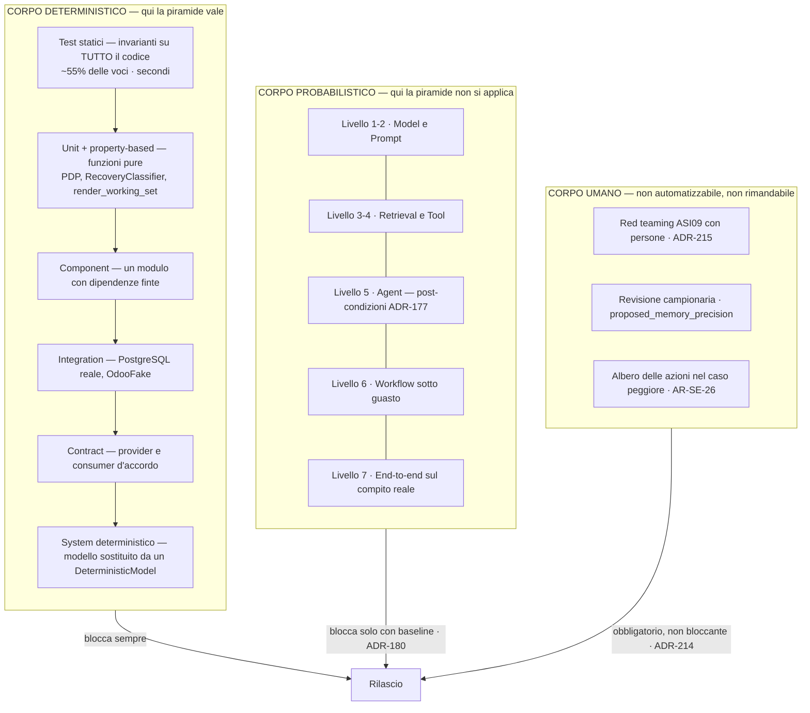
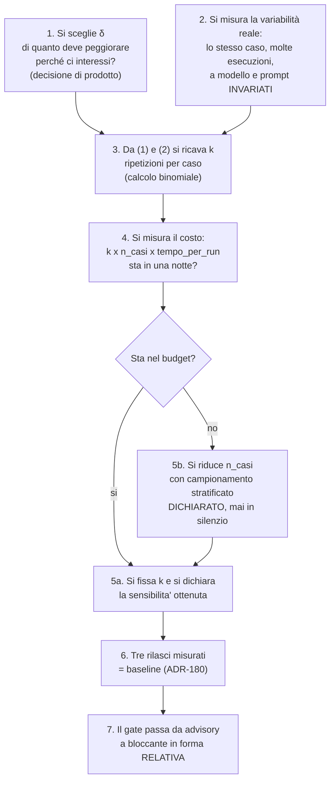
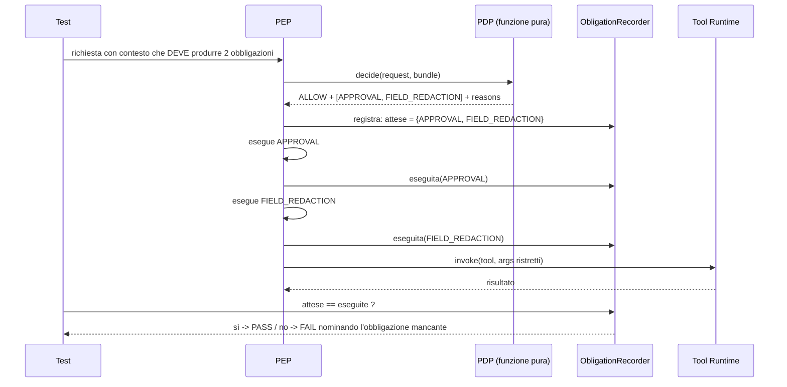
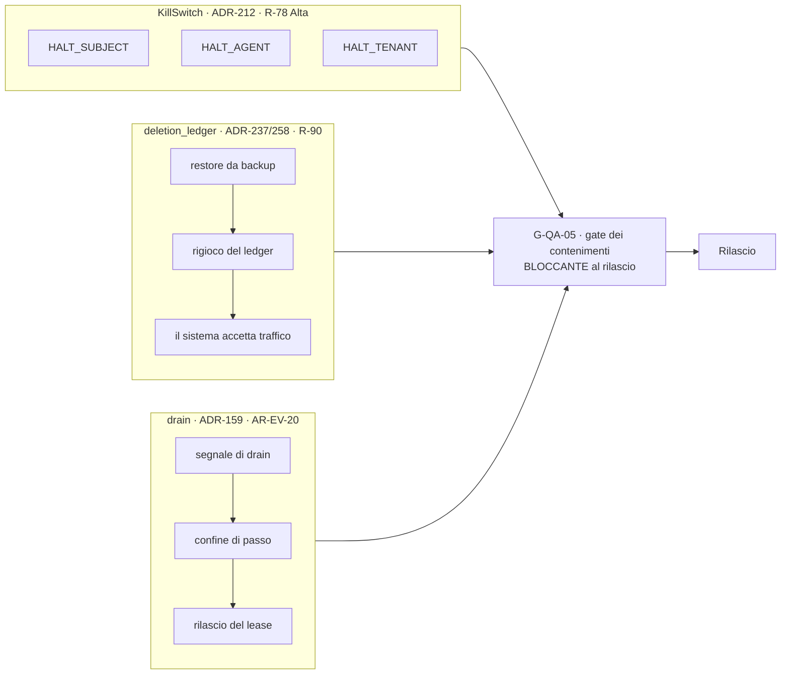
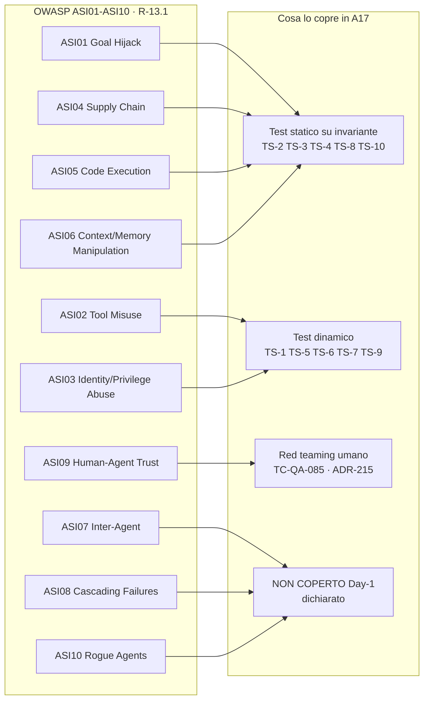
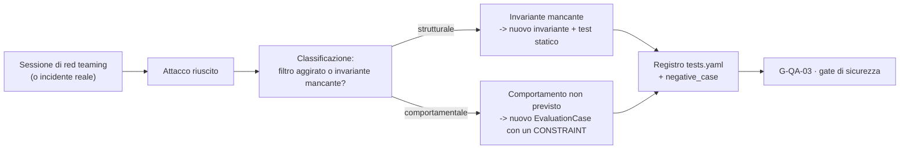
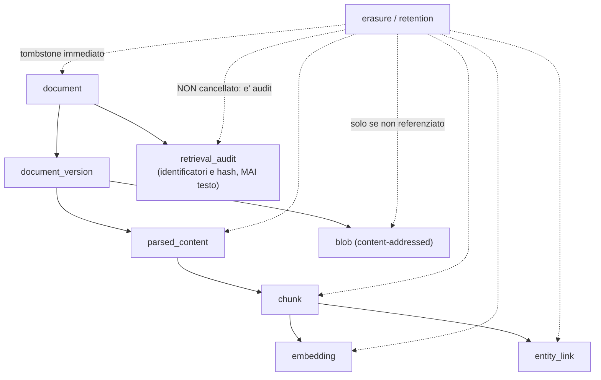
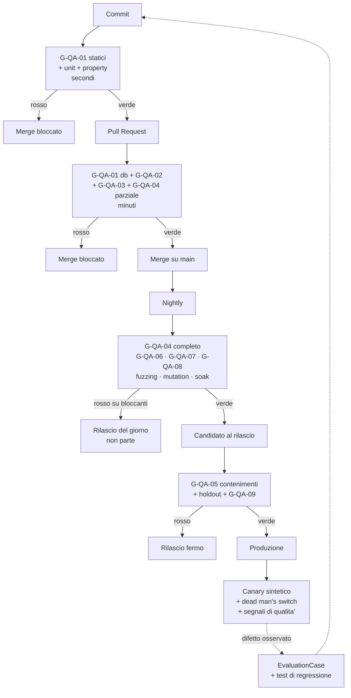
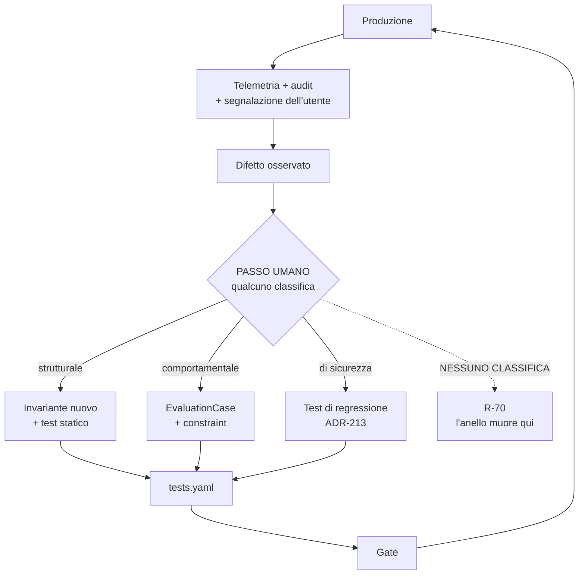

# 17 — TESTING, QUALITY ASSURANCE & VALIDATION ARCHITECTURE

> **Documento `A17` del Level A.** Dipende da `A01` (principi), `A02` (Control Plane),
> `A03` (governance e policy), `A04` (Agent Runtime), `A05` (model e inference),
> `A06` (tool), `A07` (knowledge), `A08` (memory), `A09` (identity), `A10` (agent
> communication), `A11` (eventing e durable execution), `A12` (observability ed
> evaluation), `A13` (security), `A14` (data governance).
> Consegna materiale a `A15` (deployment), `A16` (CI/CD e supply chain), `A18`
> (API/integration), `C24` (disaster recovery), `C26` (compliance).

---

## §0 — Come si legge questo documento

Questo documento è lungo perché è **il posto in cui arriva il conto**. Tredici documenti
prima di questo hanno scritto frasi come «questo va verificato in CI», «questo è un gate
di rilascio», «questo test è Day-1». Nessuno di loro ha costruito il meccanismo. `A17`
lo costruisce, e il primo lavoro non è inventare una strategia di test: è **fare
l'inventario di ciò che è già stato ordinato**, voce per voce, e dire per ciascuna
come si esegue, cosa blocca quando fallisce, e quanto costa.

| Se vuoi sapere… | Vai a |
|---|---|
| **cosa mi è stato ordinato di costruire, voce per voce** | **§4 — è la sezione più consultata del documento** |
| perché la piramide dei test qui non è una piramide | §5 |
| cosa sostituisce Odoo quando i test girano | §7 |
| come si valuta un agent senza confrontare output | §8 |
| quante volte si ripete un test prima di crederci | §9 |
| come si testa una cosa che non produce nessun output | §10 |
| **cosa succede quando un gate fallisce** | **§17** |
| quanto tempo di CI costa tutto questo | §18 |
| chi possiede quale test | §19 |
| perché questa architettura potrebbe essere sbagliata | §30 e §31 |
| tutte le decisioni nuove in tabella | §32 |

**Convenzioni.** La prosa è in italiano, la terminologia tecnica resta in inglese. Ogni
sigla è glossata alla prima occorrenza, fra parentesi, dicendo di cosa tratta. Le
affermazioni sono marcate: **FATTO** (verificabile, con fonte già registrata in
`research-log.md`), **INFERENZA** (conclusione nostra dai fatti), **DECISIONE
ARCHITETTURALE** (scelta per questo sistema). Dove non so, scrivo `DA VERIFICARE`,
`NON ANCORA DECISO`, `ASSUNZIONE` o `RICHIEDE RICERCA`. **Nessun numero di scala,
performance, costo o durata è inventato**: dove serve un numero, dichiaro il metodo
per ricavarlo e lascio il valore aperto.

**Nota sulla ricerca.** Questa passata **non ha fatto ricerca esterna nuova**. Tutti i
`FATTO` citati vengono da `research-log.md`, dove erano già stati verificati con fonte
(`R-01`…`R-15`). Il debito che ne consegue è registrato in §32.8 come backlog di ricerca
da `B-106`.

---

## §1 — In breve: le cinque risposte secche

Se qualcuno legge solo questa pagina, deve portarsi via cinque cose.

**1. Il conto esiste ed è stato pagato in inventario, non in prosa.** Tredici documenti
hanno mandato ad `A17` **145 voci** distinte fra test, gate e verifiche di CI.
Sono tutte in §4, ciascuna con un identificatore proprio nel registro `TC-QA-*`, un
owner, una classe di gate e una cadenza. Il registro è un **artefatto di codice
verificato in CI** (`ADR-266`), della stessa forma del registro delle metriche
`M-OB-*` di `A12` (`ADR-176`) e del registro `data_asset` di `A14` (`ADR-233`): se una
voce del registro non risolve a un test eseguibile, **la build fallisce nominando la
decisione architetturale rimasta scoperta**.

**2. La piramide classica descrive metà del sistema.** Il componente centrale — il
modello — non è deterministico. La forma giusta non è una piramide con l'evaluation in
cima, ma **due corpi affiancati**: un corpo deterministico (unit → component →
integration → contract → system), dove la piramide vale e i gate bloccano; e un corpo
probabilistico (la eval suite di `A12`), che **non è un piano più alto della piramide
ma un asse ortogonale**, dove i gate misurano contro una baseline e bloccano solo dopo
che la baseline esiste (`ADR-261`).

**3. Il confine che conta non è il nostro processo, è Odoo.** `AR-TL-16` (mai un
`SIDE_EFFECT` contro il sistema di produzione durante i test) è oggi una regola scritta.
Qui diventa **strutturale**: il processo di test gira con una allowlist di rete che non
contiene l'host di produzione, e il connector rifiuta un endpoint non marcato come di
test. Due barriere indipendenti, entrambe fuori dalla configurazione applicativa
(`ADR-264`, `INV-41`). Ne segue che «staging» non è una macchina diversa: è **quale
istanza Odoo tocchi** (`ADR-270`).

**4. Un contenimento non provato non esiste.** È la lezione di `R-78` (il `KillSwitch`
che non viene mai provato), ed è l'unica frase di questo documento che vale come
principio. Tre contenimenti erano descritti e non eseguiti: il `KillSwitch` di
`ADR-212`, il rigioco del `deletion_ledger` di `ADR-237`/`AR-DG-31`, il drain ai confini
di passo di `ADR-159`. Diventano **tre gate bloccanti di rilascio con test eseguiti**
(`ADR-267`). Se `A17` li avesse lasciati come procedure descritte, avrebbe fallito.

**5. I rischi veri non sono tecnici, sono di disciplina.** `R-30` (il golden set non
viene mai costruito), `R-70` (nessuno analizza i difetti), `R-78` (il `KillSwitch` mai
provato), `R-90` (il `deletion_ledger` mai rigiocato), `R-69` e `R-91` (il test di CI
sul registro viene disattivato quando dà fastidio) hanno tutti la stessa forma: **un
compito che nessuno ha come lavoro quotidiano**. La difesa che ha funzionato altrove in
questa architettura è sempre la stessa: **trasformare il compito in un blocco invece
che in una buona intenzione**. §17 e §23 fanno esattamente questo, e dove non ci
riescono lo dicono.

---

## §2 — Il vocabolario: quindici cose diverse che qui non si chiamano tutte «test»

Il prompt di questo documento insiste su un punto giusto: non si può collassare tutto
in «test automatici». Le quindici categorie hanno **costi, garanzie e failure mode
diversi**, e confonderle produce la falsa fiducia che è il difetto più caro di una
suite.

Un'analogia. Immagina di dover garantire che un'auto funzioni. Puoi provare che il
freno singolo tiene su un banco (unit), che l'impianto frenante completo tiene collegato
alle ruote (component), che i cavi si incastrano davvero (integration), che il pedale ha
la forma che il piede si aspetta (contract), che l'auto frena su strada (system), che
frena anche se piove (adversarial), e che il guidatore riesce a frenare in tempo
(human evaluation). Sono sette prove diverse, e nessuna sostituisce le altre.

| # | Categoria | Cosa dimostra | Cosa **non** dimostra | Deterministico? |
|---|---|---|---|---|
| 1 | **Unit test** | una funzione pura si comporta come dichiarato sui suoi input | che sia chiamata, e che sia chiamata bene | sì |
| 2 | **Property-based test** | una proprietà vale su un dominio di input generato, non su esempi scelti | che il dominio generato somigli al mondo | sì (con seed fissato) |
| 3 | **Test statico** | una regola vale su **tutto** il codice, non solo dove abbiamo guardato | niente sul comportamento a runtime | sì |
| 4 | **Mutation test** | i test esistenti si accorgono se il codice cambia | che i test coprano ciò che conta | sì, ma costoso |
| 5 | **Component test** | un modulo funziona ai suoi confini, con le sue dipendenze finte | che le dipendenze finte somiglino a quelle vere | sì |
| 6 | **Integration test** | due componenti reali si parlano davvero | che si parlino sotto carico o sotto guasto | in gran parte |
| 7 | **Contract test** | provider e consumer sono d'accordo sulla forma dei dati | che siano d'accordo sul **significato** | sì |
| 8 | **System test** | il sistema completo compie un compito | che lo compia sempre | **no**, c'è il modello dentro |
| 9 | **Acceptance test** | il compito è quello che il committente voleva | che sia quello di cui aveva bisogno | dipende |
| 10 | **Regression test** | un difetto già visto non torna | niente sui difetti mai visti | sì per costruzione |
| 11 | **Security test** | un attacco noto non riesce | che non esistano attacchi ignoti | sì |
| 12 | **Performance test** | il sistema regge un carico dichiarato | che regga il carico reale | statisticamente |
| 13 | **AI evaluation** | l'esito è corretto su una popolazione di casi | che sia corretto sul prossimo caso | **no**, è una misura |
| 14 | **Human evaluation** | una persona giudica ciò che nessuna asserzione cattura | riproducibilità, e scala | **no** |
| 15 | **Chaos test** | il sistema sopravvive a un guasto **iniettato** | che sopravviva al guasto che non abbiamo immaginato | sì |
| 16 | **Production validation** | il sistema vivo si comporta ancora bene | niente prima del rilascio | no |

Le voci sono sedici e non quindici: ho separato il **test statico** dallo unit test,
perché in questa architettura è la categoria che fa più lavoro. Nove invarianti su
quaranta (`INV-12`, `INV-14`, `INV-19`, `INV-25`, `INV-26`, `INV-27`, `INV-30`,
`INV-33`, `INV-39`) si verificano leggendo il codice, non eseguendolo: nessun test a
runtime può dimostrare che il PDP (`Policy Decision Point`, il componente che decide se
un'azione è permessa) **non legge mai** la tabella `memory`, perché un test copre i
percorsi che percorre. Un'analisi statica copre tutti i percorsi che esistono.

> **DECISIONE ARCHITETTURALE — `ADR-280` (anticipata qui perché governa tutto il
> resto).** Quando una proprietà è esprimibile come regola statica, **si verifica
> staticamente e non con un test a runtime**. Un test a runtime su una proprietà
> universale dà una copertura parziale con l'aspetto della copertura totale: è la
> definizione di falsa fiducia.

### §2.1 — Test contro evaluation: la distinzione che regge il documento

**FATTO (`R-11`, già verificato in `research-log.md`).** Gli agent raggiungono lo stesso
obiettivo per percorsi divergenti ma ugualmente validi. È il motivo per cui `ADR-177`
vieta il *trajectory matching* (confrontare la sequenza di passi) e i confronti di
output esatti.

**INFERENZA.** Ne segue una distinzione operativa netta, che uso in tutto il documento:

- un **test** ha un esito binario e riproducibile: `PASS` o `FAIL`, e ripetendolo dà lo
  stesso risultato. Un test che dà risultati diversi a parità di input è **rotto**, non
  «flaky per natura»;
- una **evaluation** produce una **misura** su una popolazione di casi. Ripetendola dà
  un valore leggermente diverso, e questo è normale. Una evaluation non «passa»: sta
  sopra o sotto una soglia, e la soglia ha senso solo rispetto a una baseline.

**Conseguenza pratica**: i due corpi si eseguono con strumenti diversi, si leggono con
criteri diversi, e **bloccano il rilascio in modi diversi** (§17). Chiamarli entrambi
«test» è il modo più veloce per finire a fissare una soglia sul primo numero che si è
misurato, che è esattamente ciò che `ADR-180` vieta.

---

## §3 — Il modello di qualità: dieci dimensioni, e non sono ugualmente misurabili

Il prompt chiede di definire cosa significa «qualità». La risposta onesta è che le dieci
dimensioni canoniche **non hanno lo stesso statuto epistemico**: alcune si misurano,
alcune si osservano, una si può solo affermare. Fingere il contrario produce cruscotti
pieni di numeri che nessuno sa leggere.

| Dimensione | Cosa significa **qui** | Come si misura | Statuto |
|---|---|---|---|
| **Correctness** | il sistema fa ciò che il contratto dichiara | test deterministici + post-condizioni di `ADR-177` | **misurabile** |
| **Reliability** | il sistema si comporta bene anche quando qualcosa si rompe | test di recovery (`TC-EV-01`…`08`), chaos, soak | **misurabile**, ed è il nostro punto più debole (`R-06b`) |
| **Security** | le difese reggono contro un avversario reale | i 10 gate `TS-1`…`TS-10` + red teaming | **parzialmente misurabile**: si misura ciò che si è pensato di attaccare |
| **Performance** | latenza, throughput, saturazione | benchmark su hardware reale | **misurabile**, ma tutti i valori sono `NON ANCORA DECISO` |
| **Data quality** | il dato che entra e quello che esce sono corretti e classificati | test di governance (`AR-DG-*`), test di ricostruzione (`AR-KN-07`) | **misurabile** |
| **AI quality** | l'agent compie il compito | eval suite orientata all'esito | **misurabile come popolazione, non come caso singolo** |
| **Usability** | le persone riescono a usarlo senza sbagliare | red teaming con soggetti umani su `ASI09` (`ADR-215`) | **osservabile**, non automatizzabile |
| **Operability** | si può capire cosa sta succedendo e fermarlo | i tre contenimenti provati (§11) | **misurabile** |
| **Compatibility** | le versioni convivono | matrice di compatibilità (§21) | **misurabile** |
| **Compliance** | gli obblighi sono soddisfatti | i test di `A14` (retention, cancellazione, export) | **misurabile per la parte tecnica**; la parte giuridica no (`RICHIEDE PARERE LEGALE`) |

> **Cosa `A17` dichiara di non poter misurare.** Tre cose.
> **(a) La correttezza del prossimo caso.** Con un modello dentro, la eval suite misura
> una popolazione. Un tasso del 95 % non dice niente sul run che parte adesso: dice cosa
> aspettarsi su cento run. Chi legge il cruscotto deve saperlo.
> **(b) La completezza del threat model.** **FATTO (`R-13.5`):** su 193 voci di minaccia
> catalogate in 9 categorie, **nessuno dei 16 framework valutati raggiunge la copertura
> maggioritaria in una singola categoria**; OWASP è il migliore con il **65,3 %**.
> Una suite di sicurezza costruita su `ASI01`-`ASI10` copre un punto di partenza, non
> un perimetro.
> **(c) Se una persona ha davvero letto ciò che ha approvato.** `ADR-196` la affronta con
> tre condizioni congiunte, ma la misura resta indiretta. È `AS-44`, confidenza **Bassa**.

---

## §4 — IL CONTO: l'inventario di ciò che tredici documenti hanno mandato ad `A17`

Questa è la sezione centrale del documento. Le altre progettano; questa **paga**.

### §4.1 — I due registri, e come si leggono

Dichiaro due prefissi nuovi, e da qui in poi li uso ovunque.

| Prefisso | Cosa identifica | Esempio |
|---|---|---|
| **`TC-QA-nnn`** | **un caso di test o una verifica eseguibile** posseduta da `A17`. È il registro dei test | `TC-QA-014` — il rigioco del `deletion_ledger` dopo un restore |
| **`G-QA-nn`** | **un gate**, cioè un insieme di `TC-QA-*` che, quando fallisce, produce una conseguenza dichiarata sul rilascio | `G-QA-05` — gate dei contenimenti |

Un `TC-QA-*` è un test. Un `G-QA-*` è una **conseguenza**. La differenza conta: un test
che non appartiene a nessun gate viene eseguito e guardato, ma non ferma niente, e
questo va detto esplicitamente invece di essere lasciato intendere.

I test già battezzati da altri documenti **conservano il loro identificatore**. `TC-EV-01`
resta `TC-EV-01`, `TS-1` resta `TS-1`. `A17` non li rinomina: li **registra**, gli
assegna un gate, un owner e una cadenza. Rinominarli avrebbe rotto ogni riferimento
incrociato dei documenti precedenti, che è esattamente il genere di danno che un
documento di consolidamento non deve fare.

Ogni riga dell'inventario porta:

- **Da**: quale documento l'ha ordinato;
- **Cosa**: la voce, in una riga;
- **`TC-QA`**: il suo identificatore nel registro;
- **Gate**: a quale `G-QA-*` appartiene, e quindi cosa blocca;
- **Costo**: la classe di costo, non un numero — `statico` (analisi del codice, secondi),
  `unit` (millisecondi), `db` (richiede un PostgreSQL effimero, secondi), `fake`
  (richiede l'`OdooFake` di §7.1, secondi), `odoo` (richiede un'istanza Odoo reale,
  minuti), `gpu` (richiede il modello, minuti), `umano` (richiede una persona).

### §4.2 — L'inventario, documento per documento

#### Da `A02` — Control Plane

| Da | Cosa | `TC-QA` | Gate | Costo |
|---|---|---|---|---|
| `A02` §autocritica | **Nessuna validazione semantica della configurazione**: `A02` dichiara che il buco è «mitigato solo da anteprima e rollback finché non esiste `A17`». È un mandato esplicito e nominale | `TC-QA-001` | `G-QA-02` | `db` |
| `AR-CP-03` | `resolve()` non produce mai snapshot parziali: se un riferimento non si risolve, fallisce interamente | `TC-QA-002` | `G-QA-01` | `db` |
| `AR-CP-05` | La separazione dei permessi Control Plane / Execution Plane è applicata **a livello di database** | `TC-QA-003` | `G-QA-01` | `db` |
| `ADR-018` | Concorrenza ottimistica: un aggiornamento perso sul binding è vietato, `409` obbligatorio | `TC-QA-004` | `G-QA-02` | `db` |

**Su `TC-QA-001`.** Questo è il mandato più interessante di `A02`, perché è l'unico caso
in cui un documento ha dichiarato un buco *e ha nominato chi doveva chiuderlo*. La
validazione semantica della configurazione significa: uno snapshot può essere
sintatticamente valido e semanticamente assurdo — un `Binding` che punta a una
`AgentVersion` il cui tool set contiene un tool non presente nel `ToolBinding` di quel
tenant, o un budget di context (`ADR-091`) le cui quote sommano a più del 100 %.
Il test è un **validatore eseguito sullo snapshot risolto**, non sulla riga di
configurazione: si costruisce un `ConfigSnapshot` da un fixture e si asserisce che ogni
riferimento risolva e ogni vincolo aritmetico chiuda.

#### Da `A03` — Governance e Policy

| Da | Cosa | `TC-QA` | Gate | Costo |
|---|---|---|---|---|
| `A03` Day-1 | **PDP testato a tabella**: matrice `subject × resource × action × context → decisione attesa`, con casi negativi | `TC-QA-005` | `G-QA-01` | `unit` |
| `AR-GP-01` / `ADR-020` | Il PDP è una funzione pura: nessun I/O, nessun orologio, nessuna casualità | `TC-QA-006` | `G-QA-01` | `statico` |
| `ADR-021` | La decisione è `effect + obligations + reasons`, e **le obbligazioni vengono eseguite** (§10.1) | `TC-QA-007` | `G-QA-01` | `db` |
| `ADR-022` / `AR-GP-10` | Guasto del PDP → `INDETERMINATE` → azione negata ma run **retryable**, categoria di audit distinta | `TC-QA-008` | `G-QA-05` | `db` |
| `AR-GP-16` | Consumo del budget e registrazione dello step sono **atomici** | `TC-QA-009` | `G-QA-01` | `db` |
| `AR-GP-18` / `ADR-026` | La verifica del tenant è la **prima** regola e non è sovrascrivibile da nessuna policy | `TC-QA-010` | `G-QA-03` | `unit` |
| `AR-GP-19` / `ADR-024` | La cache di policy si invalida sulla `bundle_version`, **mai per TTL** | `TC-QA-011` | `G-QA-01` | `unit` |

#### Da `A04` — Agent Runtime

| Da | Cosa | `TC-QA` | Gate | Costo |
|---|---|---|---|---|
| `A04` Day-1 | **Recovery con test che uccidono il worker** — confidenza dichiarata **Bassa** finché non è testato uccidendo processi | vedi `A11` | `G-QA-04` | `db` |
| `A04` Day-1 | I **tre rilevatori di loop** funzionano | `TC-QA-012` | `G-QA-02` | `unit` |
| `AR-RT-01` | Fra `DECIDE` e `EXECUTE` c'è sempre `AUTHORIZE`, applicato dai **tipi** (`StepProposal` → `AuthorizedStep`) | `TC-QA-013` | `G-QA-01` | `statico` |
| `AR-RT-03` / `INV-21` | Lo step si scrive `PENDING` **prima** di produrre l'effetto | vedi `A11` | `G-QA-04` | `db` |
| `AR-RT-15` | Gli errori `BUSINESS` tornano al modello come osservazioni, non fanno fallire il run | `TC-QA-015` | `G-QA-02` | `fake` |

#### Da `A05` — Model e Inference

| Da | Cosa | `TC-QA` | Gate | Costo |
|---|---|---|---|---|
| `A05` §25.3 → `A17` | **Capability probe**: le capability del modello sono **verificate da un probe**, non dichiarate. Ogni cambio di `ModelVersion` lo riesegue | `TC-QA-016` | `G-QA-06` | `gpu` |
| `A05` §25.3 → `A17` | **Eval suite agentica** come gate di rilascio. **Mai confronti di output esatti** (`ADR-042`) | `TC-QA-017` | `G-QA-07` | `gpu` |
| `R-13` (registrato in `A05`) | Un upgrade del serving rompe tool calling o structured output **in modo silenzioso**: va testata la **combinazione esatta** checkpoint × quantizzazione × tokenizer × parser | `TC-QA-018` | `G-QA-06` | `gpu` |
| `ADR-037` | Gate agentico sulla quantizzazione a 4 bit: si misura **tool selection e schema compliance**, non la fluidità | `TC-QA-019` | `G-QA-06` | `gpu` |
| `ADR-040` / `AR-MD-03` | Il runtime valida **sempre** lo schema, anche con constrained decoding attivo: il secondo anello non è rimovibile | `TC-QA-020` | `G-QA-01` | `statico` + `unit` |
| `AR-MD-05` | Nessun prompt letterale nel codice | `TC-QA-021` | `G-QA-01` | `statico` |

**Le quattro metriche gate di `A05` §25.3**, che `A17` eredita e deve rendere eseguibili:
percentuale di risposte che passano la validazione JSON Schema **al primo tentativo**;
percentuale di tool selection corretta su un set di casi noti; percentuale di
allucinazioni di tool inesistenti; percentuale di rispetto dei vincoli di formato negli
argomenti (tipi, enum, date). `A05` dichiara `NON ANCORA DECISO` la dimensione della
suite, le soglie e chi la costruisce, e assegna la competenza qui. Rispondo in §8.3
(dimensione e costruzione), §9 (soglie) e §19 (chi).

#### Da `A06` — Tool Architecture

| Da | Cosa | `TC-QA` | Gate | Costo |
|---|---|---|---|---|
| `A06` §34.5 → `A17` | **Schema usability test**: `schema_failure_rate` **per campo**, su un 9B reale. `R-20` dichiara che tutta la §14 di `A06` è `INFERENZA` non validata | `TC-QA-022` | `G-QA-07` | `gpu` |
| `A06` §34 → `A17` | **Live smoke test** pianificati contro un'istanza reale | `TC-QA-023` | `G-QA-08` | `odoo` |
| `A06` §34 → `A17` | Infrastruttura per il **test di idempotenza contro sandbox** | `TC-QA-024` | `G-QA-04` | `odoo` |
| `A06` → `A16`, eseguito qui | **Contract test come gate di rilascio** su ogni `ToolVersion` | `TC-QA-025` | `G-QA-01` | `fake` |
| `ADR-048` | Un tool = **una decisione di autorizzazione**, verificata da 5 test | `TC-QA-026` | `G-QA-02` | `statico` |
| `ADR-051` | Il gap definizione/implementazione è registrato con `build_id` e **verificato all'avvio del worker** | `TC-QA-027` | `G-QA-01` | `unit` |
| `ADR-061` | `compat` `COMPATIBLE`/`BREAKING` verificato in CI. Niente semver | `TC-QA-028` | `G-QA-01` | `statico` |
| `AR-TL-05` | **Nessun argomento di tool può essere un programma** (principio-spina di `A06`) | `TC-QA-029` | `G-QA-01` | `statico` |
| `AR-TL-14` | `tenant`, `principal`, `now`, `idempotency_key` sono **iniettati**, mai forniti dal modello | `TC-QA-030` | `G-QA-03` | `statico` |
| `AR-TL-15` / `ADR-220` | `limit` obbligatorio su ogni tool che restituisce liste; cardinalità dichiarata, default 1 | `TC-QA-031` | `G-QA-01` | `statico` |
| **`AR-TL-16`** | **Mai un `SIDE_EFFECT` contro il sistema di produzione durante i test** | `TC-QA-032` | `G-QA-03` | `statico` + rete |

#### Da `A07` — Knowledge e Data

| Da | Cosa | `TC-QA` | Gate | Costo |
|---|---|---|---|---|
| `AR-KN-07` / `ADR-076` | **Test di ricostruzione in CI**: ogni artefatto derivato (`parsed_content`, `chunk`, `embedding`) è ricostruibile da blob + versioni di trasformazione | `TC-QA-033` | `G-QA-01` | `db` |
| `AR-KN-20` / `ADR-178` | **Golden set etichettato** come artefatto Day-1 con owner e scadenza. **Senza golden set `T-03` non può scattare** | `TC-QA-034` | `G-QA-07` | `db` |
| `A07` §20.3 | **ANN contro scansione esatta**: l'indice approssimato dà gli stessi risultati della scansione esatta su un campione, entro una tolleranza dichiarata | `TC-QA-035` | `G-QA-02` | `db` |
| `AR-KN-01` / `AR-KN-02` / `INV-09` | Il filtro di autorizzazione del retrieval è **nella query**; gli strati successivi possono solo togliere | `TC-QA-036` | `G-QA-03` | `db` |
| `AR-KN-04` | Un frammento senza provenance completa (11 campi) **non entra** nel context | `TC-QA-037` | `G-QA-01` | `unit` |
| `AR-KN-06` / `INV-07` | Nessun campo di dominio del CRM è copiato nell'indice: solo identificatori | `TC-QA-038` | `G-QA-03` | `statico` |
| `AR-KN-09` / `ADR-072` | Proiezione dei grant più vecchia della soglia → retrieval **fail closed** su quella sorgente | `TC-QA-039` | `G-QA-03` | `db` |
| `AR-KN-13` | Nessuna cache dei risultati di retrieval (una cache di retrieval è una cache di permessi) | `TC-QA-040` | `G-QA-03` | `statico` |
| `AR-KN-16` | Nessun processo di ingestion usa la GPU riservata al modello di generazione | `TC-QA-041` | `G-QA-02` | `statico` |

#### Da `A08` — Memory

| Da | Cosa | `TC-QA` | Gate | Costo |
|---|---|---|---|---|
| `A08` Day-1 | **Tre test su `INV-10`** (l'invariante per cui il digest del journal non perde mai un identificatore osservato in un `ToolResult`) | `TC-QA-042/043/044` | `G-QA-01` | `unit` |
| `A08` Day-1 | **Test di isolamento adversariale** sulla memoria (cross-user, cross-tenant) | `TC-QA-045` | `G-QA-03` | `db` |
| `A08` Day-1 | **Test di iniezione** in memoria | `TC-QA-046` | `G-QA-03` | `gpu` |
| `A08` Day-1 | **Verifica che gli step `SIDE_EFFECT` restino nel digest** anche sotto pressione di budget (`AR-ME-13`) | `TC-QA-047` | `G-QA-01` | `unit` |
| `INV-12` | Nessuna funzione del PDP, del PIP o del PEP legge la tabella `memory` | = `TS-3` | `G-QA-03` | `statico` |
| `AR-ME-03` | `tenant_id`, `scope_type`, `scope_id`, `subject_id`, `run_id` sono **iniettati** dal runtime, mai forniti dal modello | `TC-QA-048` | `G-QA-03` | `statico` |
| `AR-ME-11` / `ADR-090` | Il digest è **generato da codice**, mai dal modello: `render_working_set()` è una funzione pura | `TC-QA-049` | `G-QA-01` | `statico` + `unit` |
| `AR-ME-14` | Sotto pressione di budget cedono, in quest'ordine: frammenti → zona B → memorie meno importanti → `N` di zona A. **Mai il blocco incomprimibile** | `TC-QA-050` | `G-QA-01` | `unit` |

**Sui tre test di `INV-10`.** `A08` li chiede senza specificarli. Li specifico qui,
perché tre test sullo stesso invariante hanno senso solo se attaccano tre cose diverse:
**(a)** con budget abbondante, il ledger contiene tutti gli identificatori marcati
`x-entity-ref` visti finora; **(b)** con budget stretto al punto che la zona B viene
compressa a una riga per step, il ledger **non perde niente** — è il caso che
`INV-10` esiste per coprire, ed è quello che la formulazione «non dipende dal budget»
rende falsificabile; **(c)** con budget così stretto che il render dovrebbe fallire,
il run termina con `CONTEXT_BUDGET_EXCEEDED` e **non** con un ledger troncato in
silenzio (`ADR-091`). Il terzo è il più importante: verifica che la scelta fra
«fallire» e «troncare» sia quella dichiarata.

#### Da `A09` — Identity, Authentication, Authorization

| Da | Cosa | `TC-QA` | Gate | Costo |
|---|---|---|---|---|
| `INV-14` | Nessun `SecretMaterial` esiste fuori dal modulo di autenticazione e dal `Credential Broker` | = `TS-2` | `G-QA-03` | `statico` |
| `INV-15` / `AR-GP-05` | Ogni decisione di autorizzazione registrata contiene **entrambe** le identità (`actor` e `on_behalf_of`) | `TC-QA-051` | `G-QA-01` | `db` |
| `ADR-107` / `AR-ID-01` | Un `subject_id` non è mai riassegnato, riscritto, né derivato da un dato mutabile | `TC-QA-052` | `G-QA-03` | `db` |
| `ADR-122` / `AR-ID-34` | `acl_subject` porta il discriminante (`odoo:res.users:42@<create_date>`); un utente Odoo con `active = False` → link `STALE` → `DENY` | `TC-QA-053` | `G-QA-03` | `fake` |
| `ADR-106` | Tetto congelato, autorità viva: una revoca ferma le **azioni** subito, entro il run in corso | `TC-QA-054` | `G-QA-03` | `db` |
| `AR-ID-25` | Un'approvazione si consuma **una sola volta**, atomicamente con lo step | `TC-QA-055` | `G-QA-01` | `db` |
| `AR-ID-26` | Nessun `AgentRun` modifica permessi, ruoli, policy o credenziali | `TC-QA-056` | `G-QA-03` | `statico` |
| `ADR-120` / `AR-ID-36` | Le password sono hashate con Argon2id ai parametri di `ADR-120`; nessun altro algoritmo ammesso | `TC-QA-057` | `G-QA-03` | `statico` + `unit` |

#### Da `A10` — Agent Communication e Multi-Agent

| Da | Cosa | `TC-QA` | Gate | Costo |
|---|---|---|---|---|
| `A10` Day-1 + `R-49` | **Le colonne di lineage esistono** (`root_run_id`, `parent_run_id`, `parent_step_index`, `depth`) — il test verifica l'**esistenza**, non solo la degenerazione | `TC-QA-058` | `G-QA-01` | `db` |
| `A10` Day-1 / `AR-AC-01` | **Le colonne di lineage sono degeneri**: `parent_run_id IS NULL AND depth = 0 AND root_run_id = run_id` per ogni run | `TC-QA-059` | `G-QA-01` | `db` |
| `AR-AC-02` | **Nessuna `ToolVersion` ha come implementazione l'avvio di un run.** Un agent non è mai un tool | `TC-QA-060` | `G-QA-03` | `statico` |
| `INV-17` / `AR-AC-03` | `on_behalf_of` si **copia**, mai si ricalcola, mai è un `AgentRun` | `TC-QA-061` | `G-QA-03` | `statico` |
| `INV-19` | Nessuna funzione del PDP, del PIP o del PEP legge campi provenienti da un `AgentTask` o da un `AgentResult` | = `TS-3` | `G-QA-03` | `statico` |

> **Incoerenza trovata nell'inventario, dichiarata invece che risolta in silenzio.**
> La scheda di `A10` in `ARCHITECTURE_STATE.md` §9d dice due cose diverse: la riga
> **DAY-1** parla di **«3 test CI»**, la riga **IMPACT ON FUTURE** parla di
> **«`A16`/`A17`: 2 test CI»**.
> **Risoluzione proposta:** sono **tre**, e li ho elencati sopra
> (`TC-QA-058`, `TC-QA-059`, `TC-QA-060`). Il conteggio a due nasce dal considerare
> «esistono» e «sono degeneri» un test solo. Sono due test distinti e la distinzione è
> quella che `R-49` chiede espressamente: *«il test CI di `AR-AC-01` verifica che
> **esistano**, non solo che siano degeneri»*. Un test che asserisce solo la
> degenerazione passa anche se le colonne sono state rimosse in una pulizia — che è
> precisamente lo scenario di `R-49`. **Adotto tre.**

#### Da `A11` — Eventing, Workflow, Durable Execution

`A11` è il documento che ha mandato ad `A17` la cosa più pesante, e la sua scheda lo dice
con una frase che vale come mandato: **«i test di recovery sono il gate»**. Gli otto casi
sono già scritti e battezzati. `A17` li registra senza toccarli.

| `TC-EV` | Scenario | Esito atteso | Gate | Costo |
|---|---|---|---|---|
| `TC-EV-01` | `SIGKILL` fra il commit di `PENDING` e la scrittura di `IN_FLIGHT` | ripresa con riesecuzione, **zero effetti duplicati** | `G-QA-04` | `db` |
| `TC-EV-02` | `SIGKILL` fra `IN_FLIGHT` e la risposta, tool **idempotente** | riesecuzione con la stessa `idempotency_key`, **un solo record** lato sistema esterno | `G-QA-04` | `fake` |
| `TC-EV-03` | `SIGKILL` fra `IN_FLIGHT` e la risposta, tool **verificabile** | probe eseguita, esito accertato, ledger consumato di **due** step | `G-QA-04` | `fake` |
| `TC-EV-04` | come sopra, tool **né idempotente né verificabile** | run in `UNCERTAIN`, **nessuna riesecuzione**, escalation registrata | `G-QA-04` | `fake` |
| `TC-EV-05` | `SIGKILL` del worker mentre l'albero ha 3 run vivi | tutti e tre recuperati, ledger coerente con `INV-20` | `G-QA-04` | `db` |
| **`TC-EV-06`** | worker «zombie» che torna a scrivere dopo la scadenza del lease (**fencing token**) | tutte le sue scritture colpiscono **zero righe** (`INV-22`) | `G-QA-04` | `db` |
| **`TC-EV-07`** | **albero di profondità 3, 51° step al livello più profondo** | fallisce con `STEP_BUDGET_EXCEEDED` **ovunque si trovi** (è il test che `R-50` richiede) | `G-QA-04` | `db` |
| **`TC-EV-08`** | run sospeso in `WAITING_FOR_APPROVAL` a lungo, delega scaduta | `EXPIRED` / `DELEGATION_EXPIRED`, messaggio con «cosa è già stato fatto»; **la ripresa non guadagna autorità** (`AR-EV-19`) | `G-QA-04` | `db` |

Più le verifiche strutturali che `A11` ha reso possibili:

| Da | Cosa | `TC-QA` | Gate | Costo |
|---|---|---|---|---|
| `INV-20` | `run_tree.steps_consumed` è **esattamente** il numero di righe `run_step` dell'albero: nessuno step senza consumo, nessun consumo senza step | `TC-QA-062` | `G-QA-01` | `db` |
| `INV-23` | Ogni run non terminale ha almeno una fra: lease valido, `wakeup_at`, attesa esplicita. **Nessun run può essere perso** | `TC-QA-063` | `G-QA-04` | `db` |
| `AR-EV-22` | Ogni transizione durevole avviene in **una** transazione insieme all'audit | `TC-QA-064` | `G-QA-01` | `db` |
| `AR-EV-32` / `AS-35c` | Il connector crea record e riga `ir.model.data` **nella stessa transazione Odoo** (via `load()`), mai con due chiamate RPC separate | `TC-QA-065` | `G-QA-04` | `odoo` |
| `AR-EV-33` | Nessun percorso di codice tocca `ir.model.data` fuori dal namespace `__agent__` | `TC-QA-066` | `G-QA-03` | `statico` |
| `AR-EV-34` / `ADR-162` | Un run entra in attesa di approvazione **solo dopo** `DISPATCH_CONFIRMED`; altrimenti termina con `APPROVAL_UNDELIVERABLE` | `TC-QA-067` | `G-QA-02` | `db` |
| `AR-EV-35` / `INV-24` | Ogni `job_type` dichiara `max_staleness`; superarla è un **evento di errore**. La riga di liveness conta le **consegne riuscite** | `TC-QA-068` | `G-QA-02` | `db` |
| **`ADR-159`** | **Drain ai confini di passo**: un deployment rilascia il lease solo a un confine di passo, mai a metà passo | **`TC-QA-069`** | **`G-QA-05`** | `db` |
| `AR-EV-30` | Una versione pinnata mancante fa fallire il run in modo visibile; **nessuna sostituzione silenziosa** | `TC-QA-070` | `G-QA-01` | `db` |
| `AR-EV-31` | Un replay **non riproduce mai** un side effect | `TC-QA-071` | `G-QA-03` | `fake` |

#### Da `A12` — Observability, Evaluation, AI Reliability

La scheda di `A12` dice: **«i gate sono il contratto di rilascio»**. È il mandato più
astratto ricevuto e il più importante, perché non chiede un test: chiede una **forma di
governo**. §17 è la risposta.

| Da | Cosa | `TC-QA` | Gate | Costo |
|---|---|---|---|---|
| **`ADR-176`** | **Il registro `M-OB-*` è un artefatto verificato in CI**, con tre verifiche: ogni trigger ha una metrica (rende `AR-035` eseguibile), ogni metrica è registrata, nessuna label vietata | `TC-QA-072/073/074` | `G-QA-01` | `statico` |
| **`ADR-180`** | Gate bloccanti **solo se deterministici**; gate di qualità **advisory** finché non ci sono tre baseline misurate | — (è la regola di §17) | — | — |
| `ADR-177` | Evaluation orientata all'esito: post-condizioni e vincoli, **mai** output attesi, **mai** trajectory matching | `TC-QA-017` | `G-QA-07` | `gpu` |
| `ADR-179` / `AR-OB-19` | Un esito prodotto da un LLM judge è marcato `advisory` **nel tipo** e **non entra in nessun gate** | `TC-QA-075` | `G-QA-01` | `statico` |
| `AR-OB-04` / `INV-26` | Nessuna label vietata; nessun contenuto in telemetria. Allowlist verificata in CI | = `TS-4` | `G-QA-03` | `statico` |
| `AR-OB-07` | Ogni span `STEP` corrisponde a una riga `run_step`: uno span senza journal è un **errore**, non un dato | `TC-QA-076` | `G-QA-02` | `db` |
| `AR-OB-16` | Nessuna configurazione di sampling porta sotto il 100 % le **otto classi critiche**. Applicato **nel codice**, non in configurazione | `TC-QA-077` | `G-QA-03` | `statico` |
| `AR-OB-20` | I dataset di evaluation sono file versionati in repository; la modifica passa da una review | `TC-QA-078` | `G-QA-01` | `statico` |
| **`AR-OB-21`** | **Il failure corpus si divide in *train* e *holdout* alla creazione; l'holdout non entra mai in un fine-tuning** | `TC-QA-079` | `G-QA-01` | `statico` |
| `ADR-171` | Il `Reproduction Bundle` ri-renderizza il prompt dagli artefatti versionati, sotto RLS e con audit, **senza rigenerare l'output** | `TC-QA-080` | `G-QA-02` | `db` |
| `AR-OB-18` | Il `Reproduction Bundle` non bypassa mai la RLS e scrive la propria riga di audit **prima** di restituire | `TC-QA-081` | `G-QA-03` | `db` |
| `ADR-182` | Canary sintetico + dead man's switch a tre livelli, **con l'ultimo anello esterno al sistema** | `TC-QA-082` | `G-QA-05` | `db` + esterno |
| `INV-25` / `INV-27` | Nessun controllo di sistema dipende da una lettura di telemetria; nessun campo di telemetria entra in una decisione | = `TS-3` | `G-QA-03` | `statico` |
| `ADR-178` | Golden set del retrieval come artefatto Day-1 **con owner e scadenza** | `TC-QA-034` | `G-QA-07` | `db` |
| `ADR-185` | **Ogni incidente produce un `EvaluationCase`**; la chiusura dell'incidente **richiede** che il caso esista | `TC-QA-083` | `G-QA-09` | `statico` |

#### Da `A13` — Security

`A13` ha già scritto i suoi dieci gate. `A17` li adotta **con gli identificatori
originali** e li assegna a `G-QA-03`, che è il gate di sicurezza.

| `TS` | Cosa dimostra | Invariante | Costo |
|---|---|---|---|
| `TS-1` | isolamento adversariale fra tenant su **ogni** superficie | `ADR-202` | `db` |
| `TS-2` | nessun `SecretMaterial` fuori da due moduli | `INV-14`, statico | `statico` |
| `TS-3` | il PDP non legge memoria, messaggi, telemetria | `INV-12`, `INV-19`, `INV-25` | `statico` |
| `TS-4` | nessun contenuto nella telemetria | `INV-26`, allowlist in CI | `statico` |
| `TS-5` | il ceiling non cresce dopo l'avvio, **nemmeno alla ripresa** | `INV-13`, `AR-EV-19` | `db` |
| `TS-6` | il ledger d'albero è esatto: il 51° step fallisce **ovunque** | `INV-20` | `db` |
| `TS-7` | RLS attiva su **ogni** tabella con `tenant_id` | schema | `db` |
| `TS-8` | un'anteprima non può invocare un tool con effetti | `ADR-192`, `INV-30` | `statico` |
| `TS-9` | l'`ActionBinding` approvato è quello eseguito; se cambia, l'approvazione decade | `AR-ID-24`, `ADR-189` | `db` |
| `TS-10` | un frammento recuperato non può alterare il ceiling | `INV-08` | `db` |

Più le voci che `A13` ha lasciato ad `A17` senza numerarle:

| Da | Cosa | `TC-QA` | Gate | Costo |
|---|---|---|---|---|
| **`ADR-214`** | **Red teaming obbligatorio ma non bloccante** | `TC-QA-084` | `G-QA-09` | `umano` |
| **`ADR-215`** | **Il red teaming su `ASI09` (`Human-Agent Trust Exploitation`) richiede soggetti umani**: non è automatizzabile | `TC-QA-085` | `G-QA-09` | `umano` |
| **`ADR-213`** / `AR-SE-17` | **Ogni incidente di sicurezza produce un test di regressione prima della chiusura** | `TC-QA-086` | `G-QA-09` | `statico` |
| `ADR-201` / `AR-SE-09` | Il pre-filtro autorizzativo verso il CRM è una **guardia di invariante**: nessun error budget, **copertura di test bloccante** | `TC-QA-087` | `G-QA-03` | `fake` |
| `ADR-212` / `AR-SE-18` / `INV-31` | **`KillSwitch` a tre livelli** (`HALT_SUBJECT`, `HALT_AGENT`, `HALT_TENANT`): passa dal PDP, reversibile, auditato | **`TC-QA-088/089/090`** | **`G-QA-05`** | `db` |
| `AR-SE-19` | **Nessuna configurazione può portare a zero il requisito di conferma su una scrittura** | `TC-QA-091` | `G-QA-03` | `statico` |
| `AR-SE-20` / `INV-33` / `ADR-218` | Nessun percorso di codice invoca una cancellazione fisica su un sistema esterno: esiste **solo `archive`** | `TC-QA-092` | `G-QA-03` | `statico` |
| `AR-SE-22` / `INV-34` / `ADR-221` | Nessuna scrittura su un campo esistente avviene senza che il valore precedente sia registrato nel journal | `TC-QA-093` | `G-QA-01` | `fake` |
| `AR-SE-23` / `ADR-222` | Su un record `IMMUTABLE_RECORD` non esiste alcun tool di `update`: solo rettifica | `TC-QA-094` | `G-QA-03` | `statico` |
| `AR-SE-24` / `ADR-223` | I campi amministrativi di `res.partner` (P.IVA, C.F., sede, coordinate bancarie) non sono raggiungibili da alcun tool di scrittura | `TC-QA-095` | `G-QA-03` | `statico` |
| `AR-SE-28` / `ADR-217` | **Capability floor**: nessun tool di scrittura è raggiungibile su un'entità fuori dalla superficie CRM dichiarata | `TC-QA-096` | `G-QA-03` | `statico` |
| **`AR-SE-26`** / `ADR-225` | **Nessuna `agent_version` è rilasciata senza l'albero delle azioni nel caso peggiore, approvato** | `TC-QA-097` | `G-QA-09` | `umano` |
| `AR-SE-27` / `ADR-226` | Le coppie di funzioni in conflitto SoD (`Segregation of Duties`, la separazione dei compiti incompatibili) sono dichiarate e valutate **prima** dell'esecuzione | `TC-QA-098` | `G-QA-03` | `db` |
| `ADR-203` / `AR-SE-10` | Ogni uscita di rete passa per l'allowlist del container | `TC-QA-099` | `G-QA-03` | `statico` + rete |
| `ADR-204` / `AR-SE-11` | Nessun tool accetta un URL senza allowlist di host **dichiarata nello schema** | `TC-QA-100` | `G-QA-03` | `statico` |
| `ADR-206` / `AR-SE-12` | Il parsing di contenuto esterno avviene in un processo **senza rete e senza credenziali** | `TC-QA-101` | `G-QA-03` | `db` |
| `ADR-208` / `AR-SE-13` | Nessun caricamento di pesi del modello da fonte remota a runtime; hash verificato | `TC-QA-102` | `G-QA-03` | `statico` |
| `ADR-210` / `AR-SE-16` | Ogni componente dichiara il comportamento in caso di guasto; **default fail-closed con stato visibile** | `TC-QA-103` | `G-QA-05` | `db` |

#### Da `A14` — Data Governance, Privacy, Compliance

| Da | Cosa | `TC-QA` | Gate | Costo |
|---|---|---|---|---|
| **`AR-DG-31`** / `ADR-258` / `R-90` | **Il rigioco del `deletion_ledger` è un passo eseguito e verificato della procedura di restore, non un passo documentato** | **`TC-QA-014`** | **`G-QA-05`** | `db` |
| `AR-DG-27` / `ADR-233` | Il registro `data_asset` è verificato in CI contro lo schema: **una tabella nuova senza voce fa fallire la build, nominando la decisione bloccata** | `TC-QA-104` | `G-QA-01` | `statico` |
| **`INV-40`** / `ADR-240` / `AR-DG-11` | **Nessun testo libero di produzione entra in un dataset di evaluation. Non esiste il percorso di codice** | `TC-QA-105` | `G-QA-03` | `statico` |
| `AR-DG-23` | Un `EvaluationCase` dichiara `derivation`; `PRODUCTION_FREETEXT` **non è un valore ammesso dal tipo** | `TC-QA-106` | `G-QA-01` | `statico` |
| `AR-DG-21` | Nessun dato di produzione diventa dato di addestramento: **non esiste il percorso di codice** | `TC-QA-107` | `G-QA-03` | `statico` |
| `AR-DG-01` / `AR-DG-02` | Ogni dato persistito appartiene a un `data_asset` dichiarato, con `confidentiality_class` e `personal_data_class` | `TC-QA-104` | `G-QA-01` | `statico` |
| `INV-36` / `AR-DG-22` | La classificazione di un dato derivato è **almeno** quella della sua sorgente | `TC-QA-108` | `G-QA-01` | `statico` |
| `AR-DG-03` | `writable_fields ⊆ allowed_fields`; nessun tool scrive su un campo `SPECIAL_CATEGORY` | `TC-QA-109` | `G-QA-03` | `statico` |
| `AR-DG-04` / `ADR-228` | La projection dei campi (`FieldScope`) è applicata **prima** della chiamata al connector; la redazione è seconda linea | `TC-QA-110` | `G-QA-03` | `fake` |
| `AR-DG-08` | Nessun job di retention cancella righe di audit; la lista delle tabelle su cui opera è **chiusa** | `TC-QA-111` | `G-QA-01` | `statico` |
| `AR-DG-09` / `INV-38` | Una richiesta di cancellazione per soggetto risolve l'intera **chiusura degli alias** `merged_into`, e dopo nessuna riga risolve il soggetto | `TC-QA-112` | `G-QA-02` | `db` |
| `AR-DG-10` | La cancellazione di un documento propaga a `parsed_content`, `chunk`, `embedding`, `entity_link` e blob non referenziati | `TC-QA-113` | `G-QA-02` | `db` |
| `INV-37` / `AR-DG-19` | Nessuna riga di audit è rimossa fisicamente se non attraverso `audit_redaction`, con **esattamente una** riga firmata per rimozione | `TC-QA-114` | `G-QA-03` | `db` |
| `AR-DG-12` / `INV-35` | La retention della telemetria è **strettamente più corta** di quella dell'audit | `TC-QA-115` | `G-QA-01` | `statico` |
| `AR-DG-16` / `AR-DG-32` / `ADR-260` | **Nessun percorso di codice invia prompt, context o output a un fornitore di modello esterno** | `TC-QA-116` | `G-QA-03` | `statico` |
| `AR-DG-15` / `ADR-242` | Nessun trasferimento esterno esiste se non è nel registro `ExternalTransfer` **e** nell'allowlist di rete | `TC-QA-117` | `G-QA-03` | `statico` |
| `AR-DG-17` / `ADR-239` | Ogni tabella con `tenant_id` e contenuto personale in testo libero porta `key_ref` | `TC-QA-118` | `G-QA-01` | `statico` |
| `AR-DG-28` | Nessun export attraversa il confine di tenant; si costruisce sotto RLS con l'identità del **richiedente** | `TC-QA-119` | `G-QA-03` | `db` |
| `AR-DG-30` | **Nessun backup viene ripristinato selettivamente** per recuperare un dato cancellato | `TC-QA-120` | `G-QA-05` | procedura |
| `INV-39` / `ADR-230` | Nessun campo `SPECIAL_CATEGORY` compare in un `ToolInvocation`, `ToolResult`, context, journal o audit | `TC-QA-121` | `G-QA-03` | `statico` |
| `ADR-245` | Legal hold: il predicato **esiste** ed è costante falso — il test verifica che il gancio ci sia | `TC-QA-122` | `G-QA-01` | `statico` |

### §4.3 — Il conto, in cifre

| Fonte | Voci mandate ad `A17` |
|---|---|
| `A02` | 4 |
| `A03` | 7 |
| `A04` | 4 (di cui 1 delegata ad `A11`) |
| `A05` | 6 |
| `A06` | 11 |
| `A07` | 9 |
| `A08` | 9 |
| `A09` | 8 |
| `A10` | 5 |
| `A11` | 8 `TC-EV-*` + 10 verifiche strutturali |
| `A12` | 15 |
| `A13` | 10 `TS-*` + 18 voci |
| `A14` | 21 |
| **Totale** | **145 voci distinte**, di cui **18 già battezzate** da altri documenti (`TC-EV-01`…`08`, `TS-1`…`TS-10`) e **127 registrate qui** come `TC-QA-*` |

**INFERENZA.** Centoquarantacinque voci sono molte per un team di 1-3 persone (`AS-04`).
Ma la distribuzione dei costi salva la situazione: **circa il 55 % è `statico`**, cioè
analisi del codice che gira in secondi e non richiede né database né modello. È la
conseguenza diretta di una scelta fatta molto prima di questo documento — `A13` la
chiama «l'architettura di sicurezza non è il filtro né il perimetro: è l'invariante» — e
qui produce il suo dividendo: **un'architettura fatta di invarianti è un'architettura
che si verifica a costo quasi zero**. Se le difese fossero state filtri euristici,
questa tabella sarebbe fatta di test `gpu` e sarebbe impraticabile.

### §4.4 — Le incoerenze trovate mentre facevo l'inventario

Tre, dichiarate invece che risolte in silenzio.

**(1) `A10`: due o tre test CI?** Risolta in §4.2, sono tre.

**(2) `A12` dice «4 test di recovery», `A11` ne definisce otto.** La scheda Day-1 di
`A12` elenca «4 test di recovery»; `A11` definisce `TC-EV-01`…`TC-EV-08`. Non è un
conflitto: `A12` §18.3 parla dei **quattro casi minimi che vengono da `ADR-144`** (i
quattro esiti del recovery), `A11` aggiunge quattro casi che non riguardano `ADR-144`
(albero con tre run vivi, fencing token, ledger d'albero, delega scaduta).
**Risoluzione:** sono otto, di cui quattro sono il nucleo di `ADR-144`. `A17` li esegue
tutti e otto nello stesso gate, perché separarli renderebbe possibile eseguirne quattro
e dichiarare fatto il recovery.

**(3) `A06` manda il contract test ad `A16`, ma `A16` non esiste ancora.** La scheda di
`A06` dice «`A16`: contract test come gate di rilascio» e «`A17`: schema usability test
+ live smoke test». `A16` (CI/CD e supply chain) non è ancora scritto.
**Risoluzione:** `A17` **definisce** il contract test (`TC-QA-025`, §6.7) e ne dichiara
il gate; `A16` erediterà l'**esecuzione nella pipeline**. La divisione è: `A17` dice
*cosa* si verifica e *cosa blocca*; `A16` dice *dove nel pipeline gira* e *chi lo
autorizza*. Se `A16` volesse spostare un gate bloccante fuori dal percorso che blocca,
quella è una modifica architetturale che passa da `T-QA-01`, non da una configurazione
di pipeline.

### §4.5 — Il registro dei test è un artefatto di codice, non un documento

Qui sta la differenza fra `A17` e un piano di test. Un piano di test è un documento:
invecchia, si contraddice con il codice, e nessuno se ne accorge. Un registro verificato
in CI è un **artefatto di codice**: quando diverge, la build diventa rossa.

`A12` ha fatto esattamente questo con il registro delle metriche (`ADR-176`), e `A14` con
il registro `data_asset` (`ADR-233`). Uso la stessa forma per la terza volta, e la terza
volta non è pigrizia: è la prova che la forma funziona.

> ### DECISIONE ARCHITETTURALE — `ADR-266`
> **Il registro `TC-QA-*` è un file versionato nel repository (`tests.yaml`), verificato
> in CI da tre controlli.**
>
> ```yaml
> # tests.yaml — estratto
> - id: TC-QA-014
>   mandate: "AR-DG-31 · ADR-258 · R-90"
>   from: A14
>   what: "Il deletion_ledger è rigiocato dopo un restore, prima che il sistema accetti traffico"
>   test: "tests/containment/test_deletion_ledger_replay.py::test_replay_before_traffic"
>   gate: G-QA-05
>   class: BLOCCANTE
>   owner: platform
>   cadence: [release]
>   cost: db
>   negative_case: "tests/containment/test_deletion_ledger_replay.py::test_gate_fails_without_replay"
> ```
>
> **I tre controlli.**
> 1. **Ogni voce risolve a un test eseguibile.** Se `test:` punta a una funzione che non
>    esiste, la build fallisce. Rende `INV-44` vero.
> 2. **Ogni mandato è coperto.** L'elenco dei mandati (`AR-*`, `INV-*`, `ADR-*` con una
>    conseguenza di test) è estratto dai documenti; se un mandato non compare in nessuna
>    voce del registro, la build fallisce.
> 3. **Ogni voce `BLOCCANTE` ha un `negative_case`.** Rende `INV-42` vero (§10.5).
>
> **Il messaggio di errore è la parte che conta.** Non «registry mismatch», ma:
> *«`AR-DG-31` non ha un test. La decisione architetturale bloccata è `ADR-258`: il
> rigioco del `deletion_ledger` dopo un restore. Rischio scoperto: `R-90`.»*
> È la lezione esplicita di `R-69` e `R-91`: *«il test deve fallire nominando la
> decisione architetturale bloccata»*. Un errore generico si disattiva senza rimorso;
> un errore che nomina la decisione che stai per rompere richiede di decidere di romperla.
>
> **Alternative considerate.**
> | Alternativa | Perché perde |
> |---|---|
> | **Un documento con la lista dei test** | è ciò che si sta facendo oggi in ogni documento, e il risultato è che 145 voci erano sparse in tredici file senza un posto dove contarle |
> | **Un tag nel codice del test** (`@covers("AR-DG-31")`) | non permette il controllo n. 2: un mandato scoperto non ha nessun posto da cui mancare. Il registro deve essere una lista **chiusa** per poter dichiarare un buco |
> | **Un sistema di test management esterno** (TestRail, Xray) | secondo system of record dello stesso fatto, fuori dal repository, non versionato con il codice, e a pagamento. Viola lo stesso principio per cui `A11` ha rifiutato Temporal: due state machine per la stessa cosa |
>
> **Trade-off.** Guadagniamo che un mandato scoperto è un evento visibile; perdiamo che
> ogni test nuovo costa una riga di YAML, e che qualcuno prima o poi vorrà scrivere un
> test senza registrarlo. **Mitigazione:** solo i test **bloccanti** devono essere nel
> registro; gli altri sono liberi.
>
> **Reversibilità:** facile. **Scadenza:** prima del primo gate di rilascio.
> **Cosa la invertirebbe:** se il controllo n. 2 producesse più falsi positivi che
> mandati veri — cioè se l'estrazione automatica dei mandati dai documenti si rivelasse
> impraticabile. In quel caso l'elenco dei mandati diventa manuale, e il registro perde
> la proprietà migliore. `DA VERIFICARE` alla prima implementazione.

---

## §5 — La forma della suite: perché qui la piramide non è una piramide

### §5.1 — Il problema

La piramide dei test classica dice: tanti test piccoli e veloci in basso, pochi test
grandi e lenti in cima. Il motivo è economico — un test lento costa di più a scrivere, a
eseguire e a mantenere — ma poggia su un presupposto che qui non vale: **che un test in
cima alla piramide sia deterministico come uno in basso**.

Nel nostro sistema, il componente centrale è un modello linguistico. Un test di sistema
che avvia un run reale non è «uno unit test più grande»: è una **misura**. Ripeterlo dà
risultati leggermente diversi. Metterlo in cima alla piramide, con la stessa semantica
di `PASS`/`FAIL` degli altri, produce una delle due patologie:

- **il test si stabilizza abbassando l'asticella** finché passa sempre, e allora non
  misura più niente;
- **il test resta severo e diventa flaky**, e allora qualcuno lo disattiva.

Entrambe le patologie finiscono nello stesso posto: un gate verde che non dice niente.

### §5.2 — La forma scelta: due corpi, non una piramide sola



### Come leggerlo

Ci sono **tre corpi**, non tre piani di una piramide.

Il **corpo deterministico** a sinistra è una piramide vera, e va letta dal basso: i test
statici stanno in fondo perché sono i più economici e i più universali — verificano una
proprietà su tutto il codice, non su un percorso. Salendo, ogni livello costa di più e
copre meno superficie ma più realismo. Il livello più alto, «system deterministico», è
un test di sistema **in cui il modello è stato sostituito** da un doppio che restituisce
sequenze fissate: verifica che il runtime, il PEP, il journal e il recovery si
comportino bene, senza chiedere niente al modello. È deterministico, quindi blocca.

Il **corpo probabilistico** al centro è la eval suite già progettata da `A12` §18.2:
sette livelli, tutti verificabili contro uno stato. **Non è impilato**: i sette livelli
sono affiancati, non uno sopra l'altro, perché nessuno di loro «contiene» gli altri. Il
livello 3 (retrieval) e il livello 6 (workflow sotto guasto) misurano cose scorrelate.
Un diagramma che li impilasse suggerirebbe che il livello 7 rende superfluo il livello 3,
che è falso.

Il **corpo umano** a destra è quello che nessuno costruisce, e per una ragione ovvia:
non si può automatizzare e non produce un numero verde. Ci sono tre voci e tutte e tre
sono obbligatorie per rilasciare, ma **nessuna blocca automaticamente** — perché un
blocco automatico su un compito umano si aggira firmando in fretta. §17.4 dice come si
presidiano.

Le tre frecce verso il rilascio hanno **semantiche diverse**, e questo è il punto del
diagramma: *blocca sempre*, *blocca solo dopo tre baseline*, *obbligatorio ma non
bloccante*. Confonderle è il modo per avere un rilascio che si ferma per il motivo
sbagliato e passa per quello sbagliato.

> ### DECISIONE ARCHITETTURALE — `ADR-261`
> **La piramide dei test descrive il corpo deterministico. Il corpo probabilistico è un
> asse ortogonale, non un piano più alto.**
>
> **Perché.** Un test e una evaluation hanno tipi di ritorno diversi: `bool` contro
> `misura`. Metterli nella stessa struttura obbliga a convertire una misura in un
> booleano, e la conversione richiede una soglia. `ADR-180` dice che una soglia di
> qualità ha senso solo relativa a una baseline, e che le baseline servono tre rilasci
> misurati. **Quindi, prima di tre rilasci, il booleano che si otterrebbe sarebbe
> arbitrario.**
>
> **Alternative considerate.**
> | Alternativa | Perché perde |
> |---|---|
> | **Piramide classica con l'evaluation in cima** | è la forma che quasi tutti adottano. Perde perché fa credere che una eval sia un test E2E più costoso. Non lo è: un test E2E fallito è un difetto, una eval sotto soglia è un'ipotesi statistica |
> | **Trofeo di test** (poca unit, molta integration) | l'argomento a favore — «l'integration test copre più realismo» — qui è indebolito dal fatto che gran parte delle nostre proprietà sono **universali** e si verificano staticamente, non integrando |
> | **Nessuna forma dichiarata, si scrive ciò che serve** | è ciò che produce suite con 2.000 test e nessuna copertura dei mandati. Il registro di `ADR-266` esiste proprio per impedirlo |
>
> **Trade-off.** Guadagniamo che nessuno confonde un gate deterministico con una misura;
> perdiamo la semplicità comunicativa della piramide («abbiamo il 70 % di unit test»).
> **Chi legge il cruscotto vedrà due numeri invece di uno**, ed è corretto che sia così.
>
> **Reversibilità:** facile — è una forma organizzativa, non un'infrastruttura.
> **Cosa la invertirebbe:** se `AS-40` risultasse falsa e le post-condizioni
> deterministiche coprissero solo una minoranza dei compiti, il corpo probabilistico
> crescerebbe fino a dominare, e a quel punto la separazione in due corpi diventerebbe
> una distinzione fra «il poco che blocca» e «tutto il resto». Sarebbe una brutta
> architettura, ma sarebbe la realtà. `T-QA-11` la sorveglia.

---

## §6 — Il corpo deterministico

### §6.1 — Test statici: la categoria che fa più lavoro

Un test statico legge il codice e verifica una regola su **tutti** i percorsi che
esistono, non su quelli che il test percorre. In questa architettura ne servono molti,
perché molti invarianti sono formulati come divieti universali.

| Forma della regola | Come si verifica | Esempi |
|---|---|---|
| «nessuna funzione di X legge Y» | grafo delle chiamate a partire dai simboli di X, ricerca di accessi a Y | `INV-12`, `INV-19`, `INV-25`, `INV-27` |
| «nessun tipo Z esiste fuori dai moduli M1, M2» | ricerca di riferimenti al tipo | `INV-14` (`SecretMaterial`) |
| «nessun percorso di codice raggiunge la funzione F» | raggiungibilità nel grafo delle chiamate | `INV-30` (anteprima → tool con effetti), `INV-33` (cancellazione fisica), `AR-DG-16` (context → provider esterno) |
| «ogni campo del tipo T appartiene a un'allowlist» | ispezione dello schema del tipo | `INV-26` (telemetria), `AR-OB-06` (attributi di span) |
| «ogni tabella con la colonna C ha la proprietà P» | interrogazione del catalogo di PostgreSQL | `TS-7` (RLS su ogni tabella con `tenant_id`), `AR-DG-17` (`key_ref`) |
| «ogni voce del registro R esiste nel codice, e viceversa» | confronto fra file YAML e codice | `ADR-176`, `ADR-233`, `ADR-266` |

**Il limite dichiarato.** Un'analisi statica su un linguaggio dinamico come Python è
**incompleta per costruzione**: `getattr(module, name)()` sfugge a qualunque grafo delle
chiamate. Due mitigazioni, entrambe parziali: (a) i moduli soggetti a invarianti statici
vietano l'accesso dinamico agli attributi, e il divieto è **esso stesso** un test
statico; (b) dove la staticità non regge, l'invariante si rinforza a runtime con
un'asserzione nel percorso critico che scrive un evento di errore.
**`ASSUNZIONE`**: che i moduli critici siano scrivibili senza accesso dinamico. Non è
verificata, e va verificata alla prima implementazione del PDP.

### §6.2 — Unit e property-based: dove il determinismo è un regalo

L'architettura ha regalato quattro **funzioni pure** ai test, e sono esattamente i
quattro punti in cui un difetto sarebbe più caro:

| Funzione pura | Da | Perché è pura | Cosa si testa |
|---|---|---|---|
| `PDP.decide(request, bundle) → Decision` | `ADR-020`, `AR-GP-01` | nessun I/O, nessun orologio, nessuna casualità: gli attributi li pre-carica il PIP | la matrice di autorizzazione (§10.1) |
| `RecoveryClassifier` | `A11` §, `ADR-144` | classifica uno step interrotto guardando solo la riga | i quattro esiti di `ADR-144` **senza uccidere nessun processo** |
| `render_working_set() → WorkingSetBlock` | `ADR-090`, `AR-ME-11` | il digest è generato da codice, mai dal modello | `INV-10`, `AR-ME-13`, `AR-ME-14` |
| il consumo del ledger d'albero | `ADR-146` | è un trigger di database, quindi testabile con `db` isolato | `INV-20` |

**FATTO (registrato in `A11`).** *«I test `TC-EV-01`…`TC-EV-04` diventano test di
funzione pura senza uccidere nessun processo»* — perché il `RecoveryClassifier` è
separato dall'esecuzione. **INFERENZA:** questo è il singolo guadagno di testabilità
più grande dell'architettura, e va sfruttato ma **non abusato**: la classificazione pura
prova che il *giudizio* è corretto, non che il *processo* si riprenda. Servono entrambi.
`TC-EV-01`…`04` restano test che uccidono davvero il worker; la versione pura è un test
**aggiuntivo** che gira a ogni commit, mentre quella con `SIGKILL` gira in nightly.

**Property-based testing** (generare centinaia di input casuali e verificare che una
proprietà valga su tutti) è utile dove il dominio degli input è grande e le proprietà
sono formulabili. Qui:

| Dove | Proprietà |
|---|---|
| `PDP.decide` | **monotonia restrittiva**: aggiungere una policy non può mai trasformare un `DENY` in un `ALLOW` (`ADR-025`, la precedenza a imbuto). È la proprietà che rende la precedenza falsificabile |
| `render_working_set` | per ogni journal e ogni budget, gli identificatori del ledger sono un **soprainsieme** di quelli osservati (`INV-10`). È letteralmente l'enunciato di un property test |
| state machine del run | da uno stato terminale non si esce; ogni stato terminale porta un `termination_reason` non nullo (`AR-EV-23`) |
| serializzazione degli argomenti dei tool | round-trip: validare → serializzare → deserializzare → validare dà lo stesso oggetto |
| `idempotency_key` | è funzione **totale e deterministica** di `(run_id, step_index)`, e non cambia fra i tentativi (`AR-EV-09`, `AR-EV-10`) |

**Dove NON usarlo.** Sulla matrice di autorizzazione a tabella: lì gli esempi scelti a
mano hanno un segnale migliore, perché la tabella è la specifica. Generare soggetti
casuali produrrebbe test che non corrispondono a nessuna regola pensata da nessuno.

### §6.3 — Mutation testing: mirato, non generale

Il mutation testing altera il codice (cambia un `>` in `>=`, inverte una condizione) e
verifica che **almeno un test si accorga**. È il modo più diretto per rispondere alla
domanda che la copertura di riga non risponde: *«i miei test guardano davvero, o passano
per caso?»*.

**FATTO.** Il mutation testing è costoso: esegue la suite una volta per mutante.

> ### DECISIONE ARCHITETTURALE — `ADR-269`
> **Mutation testing solo su quattro superfici, e non su tutto il codice.**
> Le quattro: `PDP.decide`, `RecoveryClassifier`, `render_working_set`, il trigger di
> consumo del ledger.
>
> **Perché queste quattro.** Sono le sole in cui (a) il codice è puro, quindi mutabile
> senza effetti collaterali; (b) un difetto è silenzioso — nessuna eccezione, nessun
> crash, solo una decisione sbagliata; (c) il costo di un difetto è massimo:
> un'autorizzazione concessa a torto, un side effect duplicato, un identificatore perso,
> un budget aggirato.
>
> **Alternative:** mutation testing su tutto (costo insostenibile per un team di 1-3
> persone, e la maggior parte dei mutanti su codice di infrastruttura è rumore);
> nessun mutation testing (allora la qualità dei quattro test più importanti resta
> ignota, e la copertura di riga darebbe un numero rassicurante e falso).
>
> **Classe di gate:** **advisory Day-1**, con una soglia relativa alla prima misura;
> promuovibile a bloccante secondo il criterio di §17.2.
> **Reversibilità:** facile. **`RICHIEDE RICERCA` (`B-109`):** esiste evidenza pubblica
> sull'efficacia del mutation testing specificamente su codice di autorizzazione?

### §6.4 — Component e integration: dove passa il confine

**Component test**: un modulo esercitato ai suoi confini, con le sue dipendenze
sostituite da doppi. **Integration test**: due componenti reali che si parlano davvero.

La regola per decidere quale usare, in questa architettura, è secca:

> **`AR-QA-06` — Si usa una dipendenza reale quando il suo comportamento è la cosa che
> si sta testando; si usa un doppio quando è solo un prerequisito.**

Applicata:

| Dipendenza | Reale o doppio | Perché |
|---|---|---|
| **PostgreSQL** | **sempre reale** | metà delle nostre garanzie sono garanzie del database: RLS, `UNIQUE`, `FOR UPDATE SKIP LOCKED`, trigger, `CHECK`, transazioni. Un doppio di PostgreSQL testerebbe il doppio. È anche il motivo per cui `TS-7` (RLS su ogni tabella) è un test `db` e non `unit` |
| **Odoo** | **doppio (`OdooFake`) in CI, reale in nightly** | §7.1 |
| **il modello** | **doppio quasi ovunque, reale nella eval suite** | §6.5 |
| **il `BlobStore`** | reale (è il filesystem) | il costo di usarlo davvero è nullo |
| **l'`EmbeddingProvider`** | doppio deterministico in CI, reale in nightly | un embedding reale su CPU costa; un doppio che restituisce vettori fissati basta per testare il pre-filtro e la fusione per rank |
| **il `Credential Broker`** | reale, con un `SecretStore` di test | è dove sta `INV-14`: un doppio nasconderebbe proprio la cosa da verificare |

### §6.5 — Model-in-the-loop: quando serve il modello vero

Il prompt lo chiede esplicitamente, e la risposta è la più economica delle tre possibili.

| Doppio | Cosa fa | Dove si usa |
|---|---|---|
| **`DeterministicModel`** | restituisce una **sequenza fissata** di risposte, in ordine, indipendentemente dal prompt | quasi tutti i test del corpo deterministico. È il doppio che rende possibile testare il loop `OBSERVE → DECIDE → AUTHORIZE → EXECUTE → RECORD` senza GPU |
| **`ScriptedModel`** | restituisce una risposta **in funzione di un pattern nel prompt** | i test in cui il percorso dipende da cosa il modello ha visto: per esempio verificare che un errore `BUSINESS` torni come osservazione (`AR-RT-15`) e produca un secondo tentativo diverso |
| **`MisbehavingModel`** | restituisce apposta JSON malformato, tool inesistenti, argomenti fuori enum, testo al posto di struttura | i test del **doppio anello** di `ADR-040`: il runtime deve validare **anche** quando il constrained decoding avrebbe dovuto impedirlo. È il doppio che verifica `AR-MD-03` e `AR-MD-04` |
| **modello reale** | il vero Qwen3.5-9B quantizzato | **solo** nel corpo probabilistico: eval suite, capability probe, schema usability test, test di iniezione |

> **`AR-QA-01` — Nessun test del corpo deterministico dipende da un'inferenza su GPU.**
> Verificabile: il corpo deterministico si esegue in un ambiente **senza** il container
> di serving, e se un test tenta di raggiungerlo fallisce per rete chiusa (§7.3).
>
> **Perché è una regola e non una linea guida.** Il momento in cui un test unit comincia
> a chiamare il modello è il momento in cui la suite passa da secondi a minuti; il
> passo successivo è che qualcuno smetta di eseguirla prima di committare. `AS-58` dice
> che questa è una condizione **sociale** e la sua confidenza è Media.

### §6.6 — Contract test: il gate che `A06` ha chiesto

Un contract test verifica che **provider e consumer siano d'accordo sulla forma dei
dati**, senza eseguirli insieme. È il modo per evitare che il Tool Runtime e il connector
divergano senza che nessuno se ne accorga fino alla produzione.

I contratti che richiedono un test automatico, in ordine di importanza:

| Contratto | Provider | Consumer | Cosa verifica il test | `TC-QA` |
|---|---|---|---|---|
| **`ToolVersion` (schema degli argomenti e del risultato)** | Tool Registry | modello, via Tool Runtime | ogni `ToolVersion` ha uno JSON Schema valido; ogni implementazione accetta esattamente ciò che lo schema dichiara e rifiuta il resto; `compat` è coerente col diff (`ADR-061`) | `TC-QA-025`, `TC-QA-028` |
| **connector Odoo** | connector | Tool Runtime | l'`OdooFake` e Odoo reale rispondono alla stessa interfaccia con la stessa semantica (§7.1) | `TC-QA-023` |
| **`PDP.decide`** | PDP | PEP | la `Decision` porta sempre `effect + obligations + reasons`; ogni obbligazione dichiarata ha un esecutore registrato | `TC-QA-007` |
| **`RetrievalScope` / `MemoryScope` / `FieldScope`** | PDP | Retrieval Layer, Memory Module, PEP | i tre ambiti sono prodotti solo dal PDP e mai costruiti da un identificatore fornito dal modello (`AR-ID-21`) | `TC-QA-036`, `TC-QA-110` |
| **`ModelProvider.complete()`** | serving | Agent Runtime | i due profili (vLLM e llama.cpp) rispondono alla stessa interfaccia — è la verifica sul campo di `AR-020` che `T-MD-06` prevede | `TC-QA-123` |
| **API pubblica (`POST /v1/runs`, `GET /v1/runs/{id}`)** | `api` | applicazione / CRM | OpenAPI 3.1 come contratto: request, response, errori, idempotenza, `ETag`/`If-Match` | `TC-QA-124` |
| **schema degli eventi** | produttore | consumatore | un cambiamento incompatibile richiede un `event_type` **nuovo**, non un `event_version` (`AR-EV-29`) | `TC-QA-125` |

**Cosa NON richiede un contract test.** Le interfacce con **una sola implementazione e
un solo consumer in-process**: `BlobStore`, `Working Set Renderer`, `Erasure
Coordinator`. Lì il contract test duplicherebbe lo unit test senza aggiungere segnale.
`AR-020` (nessuna interfaccia con una sola implementazione non identificata) impone di
sapere quale sarà la seconda implementazione, non di testarla prima che esista.

### §6.7 — Schema, compatibilità, migrazioni

Tre famiglie di test che si assomigliano e non vanno confuse.

**Schema testing** — la forma è valida: ogni `ToolVersion` ha uno JSON Schema che
compila; ogni evento ha uno schema; ogni tabella ha i vincoli dichiarati. È `statico`.

**Compatibility testing** — due versioni convivono. La matrice è in §21.

**Migration testing** — una migrazione di schema non rompe ciò che è vivo. È il test più
sottovalutato di tutti, perché in questa architettura **i run vivi sopravvivono alle
migrazioni**: un run può restare in `WAITING_FOR_APPROVAL` per ore. `ADR-159` impone
migrazioni **expand/contract** (prima si aggiunge, poi si migra, poi si toglie) e vieta
la sostituzione silenziosa di versione (`AR-EV-30`).

| `TC-QA` | Cosa | Costo |
|---|---|---|
| `TC-QA-126` | ogni migrazione gira su un database **vuoto** e su uno **popolato con il dataset sintetico** | `db` |
| `TC-QA-127` | ogni migrazione gira **mentre ci sono run non terminali**, e alla fine tutti i run sono ancora avanzabili | `db` |
| `TC-QA-128` | la fase *expand* di una migrazione è **retrocompatibile**: il codice della versione precedente gira sullo schema nuovo | `db` |
| `TC-QA-129` | una versione pinnata mancante fa fallire il run **in modo visibile**, con `termination_reason` non nullo | `db` |

### §6.8 — API testing e negative testing

`AR-QA-02` — **per ogni endpoint pubblico e per ogni tool esiste almeno un test per
ciascuna delle sette classi negative**: input non valido, campo obbligatorio mancante,
campo estraneo, tipo sbagliato, richiesta non autorizzata, credenziale scaduta,
richiesta sovradimensionata.

Il motivo per cui è una regola e non una buona pratica: **il percorso felice di un tool
è quello che il modello percorre quando fa la cosa giusta, e il modello sbaglia per
mestiere**. `AR-MD-04` dice che un tool allucinato è un'**osservazione**, non un guasto;
`AR-TL-04` dice che una capability mancante è un'osservazione misurata. Entrambe le
regole vivono nei percorsi negativi. Se i percorsi negativi non sono testati, quelle due
regole sono lettera morta.

Aggiungo la classe che il prompt non elenca e che qui è la più importante:
**argomento sintatticamente valido e semanticamente ostile** — un `limit` di un milione,
un identificatore appartenente a un altro tenant, una data nel 1900, una stringa con
caratteri di controllo. È la superficie su cui `AR-TL-06` (gli identificatori si
osservano, non si inventano) e `ADR-198` (guardia sugli identificatori) vengono provate.

### §6.9 — Fuzzing

Il fuzzing (generare input casuali o mutati e cercare crash) ha un bersaglio ovvio e
uno solo: **il parser di documenti**. `ADR-205` (tetto di dimensione e insieme chiuso di
tipi **prima** di qualunque parsing) e `ADR-206` (parsing in un processo separato, senza
rete e senza credenziali) esistono perché *«il parser mangia byte ostili per mestiere»*.

| `TC-QA` | Cosa | Classe | Cadenza |
|---|---|---|---|
| `TC-QA-130` | fuzzing del parser su PDF/DOCX/HTML malformati: nessun crash del processo padre, sempre `parse_state` visibile, mai un documento vuoto (`AR-KN-15`) | advisory | nightly |
| `TC-QA-131` | fuzzing degli argomenti di tool contro lo JSON Schema: nessun input che passi la validazione produce un'eccezione non tipizzata | advisory | nightly |

**Dove NON fare fuzzing.** Sull'API pubblica: è dietro autenticazione, con un insieme di
endpoint minuscolo e schemi chiusi. Il rapporto fra costo e difetti trovati sarebbe
pessimo rispetto ai test negativi scritti a mano di §6.8.

---

## §7 — L'ambiente di test: cosa sostituisce Odoo, e come si garantisce `AR-TL-16`

Questa sezione risponde a tre domande che nessun documento precedente ha affrontato:
**che cosa sta al posto di Odoo quando i test girano**, **da dove viene un dataset CRM
realistico**, e **come si impedisce fisicamente che un test tocchi la produzione**.

### §7.1 — Cosa sostituisce Odoo: `OdooFake` a fedeltà verificata

Il problema. Il 60 % circa dei test che contano attraversano il connector Odoo:
idempotenza (`TC-EV-02`), recovery (`TC-EV-03`), `FieldScope` (`TC-QA-110`), archiviazione
invece di cancellazione (`TC-QA-092`), valore precedente nel journal (`TC-QA-093`),
capability floor (`TC-QA-096`). Nessuno di questi può girare contro Odoo di produzione
(`AR-TL-16`), e far girare un'istanza Odoo vera per ogni test è impraticabile: un'istanza
Odoo con i dati demo impiega **minuti** ad avviarsi, non secondi.

Le quattro strade possibili:

| Opzione | Come | Perché perde / vince |
|---|---|---|
| **A. Istanza Odoo reale per ogni test** | container effimero | fedeltà massima, costo proibitivo. Trasformerebbe una suite da secondi in una da ore, e `AS-58` cadrebbe subito |
| **B. Istanza Odoo reale condivisa** | un'istanza sempre accesa, database ripulito fra i test | fedeltà alta, ma i test **non sono isolati**: due test in parallelo si pestano i piedi, e il ripristino dello stato è lento e fragile. Diventa il collo di bottiglia della parallelizzazione |
| **C. Mock ad hoc** | ogni test dichiara cosa risponde il connector | veloce e **inutile**: il mock afferma ciò che lo sviluppatore crede che Odoo faccia. Tutta la classe di difetti che `R-14.7` descrive — `unlink()` che non passa da `write()`, campi non tracciati, `active = False` che è una `write` — è invisibile a un mock |
| **D. `OdooFake`: un doppio unico, in-process, la cui fedeltà è verificata da un contract test contro Odoo reale** | un'implementazione dell'interfaccia del connector che simula i comportamenti che ci interessano, più una suite che gira **la stessa** batteria contro il fake e contro un'istanza reale, e confronta | costo basso nei test, fedeltà **misurata invece che sperata**. La divergenza diventa un evento visibile |

> ### DECISIONE ARCHITETTURALE — `ADR-262`
> **Si adotta l'opzione D: un `OdooFake` in-process, la cui fedeltà è garantita da un
> contract test che esegue la stessa batteria contro il fake e contro un'istanza Odoo
> reale effimera, in nightly.**
>
> **Cosa deve simulare il fake** — e la lista non è arbitraria, viene interamente dai
> `FATTO` di `R-10`, `R-12` e `R-14.7` già verificati:
>
> | Comportamento | Fonte | Perché è nella lista |
> |---|---|---|
> | `ir.model.data` con vincolo **UNIQUE** su `(name, module)` | `R-12.2` | è ciò su cui poggia tutta l'idempotenza (`ADR-161`). Un fake che non lo simula rende `TC-EV-02` una finzione |
> | creazione di record e riga `ir.model.data` **nella stessa transazione** (via `load()`) | `AS-35c`, `AR-EV-32` | il fake deve poter **fallire** se il connector fa due chiamate separate |
> | `res_users.id` come `SERIAL` monotono, mai riusato | `R-10` | regge `AS-24` e il discriminante di `ADR-122` |
> | `active = False` è una `write`, quindi **fa scattare le automazioni** | `R-14.7` | è la differenza fra `archive` e `unlink`, cioè l'intero `ADR-218` |
> | `unlink()` **non passa da `write()`** | `R-14.7` | il fake deve esporre `unlink` **per poter dimostrare che nessun percorso di codice lo chiama** (`TC-QA-092`) |
> | nessun campo tracciato per default; `mail.tracking.value` solo su `tracking=True` | `R-14.7` | è la ragione di `ADR-221`. Un fake che conserva i valori precedenti renderebbe `INV-34` non falsificabile |
> | errori di chiave esterna su `res.partner` | `R-14.7` | è il modo in cui una cancellazione fallisce, e va testato |
> | permessi e record rule per utente (per la catena 1 futura) | `R-10`, `ADR-114` | serve quando `T-ID-08` scatterà |
>
> **Il contract test (`TC-QA-023`)**: una batteria di ~30 asserzioni sul comportamento
> del connector, eseguita due volte — contro il fake e contro un'istanza Odoo reale — e
> confrontata. Se una asserzione diverge, il fake mente e il test fallisce **nominando
> il comportamento divergente**.
>
> **Trade-off, dichiarato senza attenuanti.** Il fake può mentire su ciò a cui non
> abbiamo pensato. Il contract test copre i comportamenti che sappiamo di dover
> simulare; per definizione non copre quelli che scopriremo. **È `R-98`, probabilità
> Alta.** La mitigazione è che ogni volta che un difetto sfugge in produzione per una
> divergenza del fake, il comportamento entra nella batteria — cioè lo stesso ciclo
> `ADR-213` applicato alla fedeltà del doppio.
>
> **Reversibilità:** moderata. Passare all'opzione B costa il tempo di ripensare
> l'isolamento dei test, non di riscrivere i test. **Trigger:** `T-QA-02`.
> **`RICHIEDE RICERCA` (`B-107`):** quanto ci mette davvero un'immagine Odoo ufficiale
> ad avviarsi e caricare un dataset minimo? Il numero decide se l'opzione B torna in
> gioco per la fascia `integration`. Non l'ho misurato e **non lo invento**.

### §7.2 — Il dataset CRM: sintetico, generato, versionato

Il problema è vincolato da tre regole già decise, e la combinazione è stretta:
`AR-OB-24` e `INV-40` (nessun testo libero di produzione nei dataset di evaluation),
`AR-DG-11` (non esiste il percorso di codice), `AR-DG-21` (nessun dato di produzione
diventa dato di addestramento). E `R-73` dice la cosa scomoda: **il caso reale è il più
prezioso**, quindi l'attrito con queste regole è costante e non sparirà.

> ### DECISIONE ARCHITETTURALE — `ADR-263`
> **Il dataset CRM di test è prodotto da un generatore deterministico versionato
> (`crm_seed`), non da un dump.** Il generatore prende un seed e produce un database
> Odoo popolato in modo riproducibile; il seed e la versione del generatore fanno parte
> dell'identità di ogni esecuzione di test.
>
> **Tre livelli di dataset, con scopi diversi:**
>
> | Livello | Contenuto | Chi lo usa | Dimensione |
> |---|---|---|---|
> | **`tiny`** | poche decine di record, scritti a mano, per i test deterministici | corpo deterministico, ogni commit | fissa e minima |
> | **`realistic`** | generato: contatti, opportunità, stage, attività, con **distribuzioni realistiche** (non uniformi) | eval suite, schema usability test | `NON ANCORA DECISO` — dipende da `Q-04` e da `AS-16` |
> | **`hostile`** | generato apposta **sporco**: omonimi, campi vuoti, accenti e apostrofi, date impossibili, contatti archiviati che reggono ancora fatture, testo con caratteri di controllo | test negativi, adversarial, red teaming | fissa |
>
> **Il livello `hostile` è quello che nessuno costruisce, ed è dove stanno i difetti.**
> `R-100` (probabilità Alta) dice esattamente questo: un generatore ingenuo produce dati
> troppo puliti, e i difetti reali stanno nello sporco. **FATTO (`R-14.7`):** il ciclo
> «cerca `active = False` e cancella» su `res.partner` è definito *«un vero autogol»*
> perché i partner archiviati spesso reggono ancora registrazioni contabili vive.
> Quella frase è la specifica di un caso del dataset `hostile`, e va tradotta in un
> record.
>
> **Alternative considerate.**
> | Alternativa | Perché perde |
> |---|---|
> | **Dump di produzione anonimizzato** | vietato da `INV-40` per l'evaluation; e per i test resta un rischio: **FATTO (`R-13`, contesto)** l'anonimizzazione presentata come tale è respinta da `A14` (`ADR-236` dichiara che l'identity shredding **non è** anonimizzazione, `R-89`). Un dump «anonimizzato» in repository è `R-73` realizzato |
> | **Dati demo di Odoo** | utili come base, ma sono in inglese, con nomi americani e una struttura commerciale che non è quella di una PMI italiana. Vanno bene per il livello `tiny`, non per `realistic` |
> | **Generazione con il modello** | il modello produrrebbe testo plausibile, ma non riproducibile e non versionabile, e servirebbe la GPU per costruire il dataset. Rifiutata |
>
> **Reversibilità:** facile per il generatore, **costosa per i casi scritti a mano**:
> un caso `hostile` è conoscenza, come il golden set di `ADR-178`. Si accumula, non si
> ricostruisce.
> **`RICHIEDE RICERCA` (`B-108`):** esistono generatori di dati sintetici con
> caratteristiche italiane (nomi, P.IVA formalmente valide, indirizzi) e con licenza
> compatibile? Non verificato.

### §7.3 — `AR-TL-16` reso strutturale: due barriere, nessuna configurabile

`AR-TL-16` dice: **mai un `SIDE_EFFECT` eseguito contro il sistema di produzione durante
i test**. Oggi è una regola scritta. Una regola scritta si viola con una variabile
d'ambiente sbagliata alle due di notte.

**INFERENZA.** La forma giusta è la stessa che `A13` ha usato per l'egress (`ADR-203`,
allowlist a livello di rete del container): non un controllo nel codice, ma una barriera
in un piano che il codice non può cambiare.

> ### DECISIONE ARCHITETTURALE — `ADR-264`
> **Due barriere indipendenti, entrambe fuori dalla configurazione applicativa.**
>
> **Barriera 1 — la rete.** Il container in cui girano i test ha una allowlist di egress
> che contiene **solo** l'host dell'`OdooFake` o dell'istanza Odoo di test. L'host di
> produzione non è raggiungibile: un tentativo produce un errore di rete, non una
> chiamata. È la stessa infrastruttura di `ADR-203`, riusata con una lista diversa.
>
> **Barriera 2 — il tipo.** Il connector accetta un `OdooEndpoint` che porta un campo
> `environment ∈ {TEST, PRODUCTION}`. Sotto test, la costruzione di un `OdooEndpoint`
> con `environment = PRODUCTION` **solleva un'eccezione nel costruttore**. Non è un
> controllo prima della chiamata: è un oggetto che non si può costruire.
>
> **Perché due e non una.** La barriera 1 protegge da un errore di configurazione; la
> barriera 2 protegge dal caso in cui la produzione sia raggiungibile per un altro
> motivo legittimo (per esempio un test che gira sulla stessa macchina della produzione,
> che è il nostro caso Day-1 — una macchina sola, `AS-04`). **Su una macchina sola la
> barriera di rete da sola non basta**, ed è precisamente la nostra situazione.
>
> **Nuovo invariante `INV-41`:** *nessun percorso di codice eseguito sotto test può
> aprire una connessione verso un endpoint non dichiarato nell'allowlist di test.*
> Verificato in due modi: staticamente (nessuna costruzione di client HTTP fuori da
> `connectors/`, che è già `AR-TL-01`) e a runtime (il test harness installa un hook che
> registra ogni connessione aperta e fallisce la suite se una non è in allowlist).
>
> **Reversibilità:** facile. **Costo:** trascurabile.
> **Cosa la invertirebbe:** niente. È una barriera contro un danno irreversibile in
> produzione; il costo è così basso che non esiste un argomento per toglierla.

### §7.4 — «Staging» non è una macchina: è quale Odoo tocchi

Il prompt chiede di scegliere fra ambienti effimeri, ambiente di test condiviso,
ambiente locale e staging. La risposta dipende da cosa consideriamo il confine.

**INFERENZA.** In questa architettura il confine che produce danno irreversibile **non è
il nostro processo**: è Odoo. I nostri dati sono quasi tutti ricostruibili (`ADR-076`,
`AR-KN-07`); le eccezioni irreplaceable sono blob, identità, audit e memoria (`ADR-098`).
Ma un ordine confermato in Odoo, una fattura validata, un contatto archiviato — quelli
sono nel mondo. Ne segue che **la separazione fra staging e produzione non deve passare
per il numero di macchine, ma per quale istanza Odoo il sistema può raggiungere**.

> ### DECISIONE ARCHITETTURALE — `ADR-270`
> **Nessun ambiente di staging separato Day-1. «Staging» è un `Environment` del Control
> Plane (`ADR-015`, il pattern `X`/`XVersion`/`Binding`) i cui `ToolBinding` puntano a
> un'istanza Odoo di test.**
>
> Tre ambienti, e due di loro non sono macchine:
>
> | Ambiente | Dove gira | Quale Odoo tocca | Quali dati nostri |
> |---|---|---|---|
> | **locale / CI** | container effimeri, PostgreSQL effimero | `OdooFake` | `tiny` / `hostile`, generati |
> | **staging** | la stessa installazione della produzione, `Environment = staging` | istanza Odoo **di test** | `realistic`, generati, in un tenant dedicato |
> | **produzione** | l'installazione | Odoo del committente | reali |
>
> **Perché non un ambiente di staging su una macchina separata.** `AS-04` (team di 1-3
> persone, nessun SRE) e `AS-01` (Day-1 una macchina). Una seconda macchina raddoppia
> l'onere operativo per proteggere da una classe di difetti — quelli di infrastruttura —
> che con una macchina sola sono comunque non riproducibili. **Non nascondo il costo:**
> con questa scelta **non testiamo i cambiamenti di infrastruttura prima di applicarli**.
> È un buco dichiarato, ed è di `A15`. Il trigger che lo apre è `Q-03` (il modello di
> deployment) e il primo deployment presso un cliente.
>
> **Alternative considerate.**
> | Alternativa | Perché perde |
> |---|---|
> | **Staging su macchina separata** | costo operativo doppio, e con una GPU sola la staging non potrebbe comunque eseguire il modello contemporaneamente alla produzione: `AS-08` (un solo modello sulla GPU) rende la parità impossibile |
> | **Ambienti effimeri completi per ogni PR** | l'ambiente effimero completo richiede una GPU. Impraticabile Day-1; **diventa praticabile** quando esiste un secondo profilo di serving su CPU (`ADR-036`, llama.cpp), ed è la strada per il futuro |
> | **Nessuno staging, si va dritti in produzione con canary** | `ADR-183` vieta gli esperimenti in produzione su percorsi con effetti, e il canary di versione è stato rifiutato da `A12`. Contraddirebbe due decisioni |
>
> **Reversibilità:** facile ad aggiungere una macchina, e nulla va riscritto, perché
> `Environment` è già una dimensione del Control Plane.

### §7.5 — Parità di ambiente: cosa deve restare identico e cosa no

| Elemento | Deve essere identico? | Perché |
|---|---|---|
| **versione di PostgreSQL** | **sì, esattamente** | metà delle garanzie sono del database: RLS, trigger, vincoli, `SKIP LOCKED`. Una versione diversa è un sistema diverso |
| **schema del database** | **sì** | è ciò che le migrazioni testano |
| **modello e quantizzazione** | **sì in staging, no in CI** | in CI il modello è un doppio; in staging deve essere la combinazione esatta, perché **FATTO (`R-13`)**: un upgrade del serving rompe tool calling in modo silenzioso, e va testata la combinazione esatta checkpoint × quantizzazione × tokenizer × parser |
| **profilo di serving** | **no** | vLLM in produzione, llama.cpp in sviluppo è una scelta deliberata (`ADR-036`) che soddisfa `AR-020`. La differenza va **misurata**, non eliminata: `AR-OB-12` vieta allarmi che dipendono da metriche presenti in un solo profilo |
| **versione di Odoo** | **sì fra staging e produzione**, no in CI | il fake non ha versione |
| **sistema operativo, kernel, driver GPU** | **no Day-1** | con una macchina sola, sono gli stessi per costruzione. Diventa una domanda quando `Q-03` si chiude |
| **volume di dati** | **no** | è ciò che i test di capacità misurano, non ciò che replicano |

### §7.6 — Isolamento e parallelizzazione

**`AR-QA-03` — Ogni test possiede il proprio schema di database.** Non una tabella
ripulita, non una transazione annullata: uno **schema PostgreSQL** creato e distrutto,
oppure un database effimero. Il motivo è specifico di questa architettura: la RLS
(`Row-Level Security`, il meccanismo con cui PostgreSQL filtra le righe per tenant) e i
ruoli di `ADR-116` sono **proprietà del database**, e un test che condivide lo schema con
un altro non può verificarle in isolamento.

Cosa **non** si parallelizza:

| Risorsa | Perché è seriale |
|---|---|
| **la GPU** | `AS-08`: un solo modello sulla GPU. Due test che chiamano il modello in parallelo si contendono il KV cache, e le misure diventano rumore. La eval suite è **seriale per costruzione**, e §18 la mette in nightly per questo |
| **l'istanza Odoo reale** (contract test nightly) | il database Odoo è uno stato condiviso |
| **i test di chaos** | uccidere un worker mentre un altro test usa lo stesso pool produce fallimenti che sembrano difetti |

---

## §8 — Il corpo probabilistico: l'evaluation

### §8.1 — `ADR-177` si consuma, non si ridiscute

`A12` ha già deciso la forma: un `EvaluationCase` è definito da **post-condizioni
verificabili** e **vincoli**, non da un output atteso. Mai output attesi, mai trajectory
matching. Il motivo è un `FATTO` di `R-11`: gli agent raggiungono l'obiettivo per
percorsi divergenti ma ugualmente validi.

```text
EvaluationCase
  case_id, dataset_version
  input               -- il turno dell'utente, testuale
  fixture             -- lo stato iniziale del mondo (dataset Odoo di test, corpus)
  postconditions[]    -- verifiche DETERMINISTICHE sullo stato finale
  constraints[]       -- ciò che NON doveva succedere
  acceptable_variants -- ciò che è ammesso variare (ordine, formulazione, n. di passi)
  references[]        -- chunk_id/record che la risposta doveva usare
  derivation          -- SYNTHETIC | PRODUCTION_STRUCTURED | HUMAN_REWRITTEN
  split               -- TRAIN | HOLDOUT           (AR-OB-21, assegnato alla creazione)
```

`A17` aggiunge tre campi al tipo, e ciascuno chiude un buco:

| Campo | Perché lo aggiungo |
|---|---|
| **`repetitions`** | quante volte il caso va eseguito perché la sua misura abbia senso. Senza, la ripetizione diventa una scelta implementativa e sparisce (§9) |
| **`owner`** | chi risponde quando il caso comincia a fallire. `R-70` dice che l'anello di feedback muore al passo umano: un caso senza proprietario è un caso che nessuno indaga |
| **`origin_incident`** | l'identificatore dell'incidente da cui il caso nasce, se ne nasce. Rende `ADR-185` verificabile con una query invece che con la buona volontà (§23) |

**Cosa `A17` deve fornire e `A12` non ha fornito**: l'**infrastruttura di esecuzione**.
Un `EvaluationCase` è un file; qualcuno deve montare il fixture, avviare il run, leggere
lo stato finale, valutare le post-condizioni e scrivere il risultato. Quel qualcuno è il
**runner di eval**, ed è l'unico componente nuovo che questo documento introduce (§8.7).

### §8.2 — Come si mette alla prova `AS-40`, e non è una formalità

`AS-40` dice: *«le post-condizioni deterministiche coprono la maggior parte dei compiti
CRM»*, confidenza **Media**. È l'assunzione su cui poggia l'intera scelta di `ADR-177`:
se fosse falsa, servirebbe giudizio umano su molti più casi di quanti un team di 1-3
persone possa gestire, e il corpo probabilistico collasserebbe.

La validazione che `A12` propone è: *«i primi 20 `EvaluationCase`: quanti hanno
post-condizioni verificabili?»*. È giusta ma insufficiente, perché lascia la domanda in
una forma che si può rispondere con ottimismo. **Progetto qui il protocollo.**

> ### Protocollo `AS-40` — la prova sui primi 20 casi
>
> **Chi sceglie i 20 casi.** Non chi scrive i test. I 20 casi vengono da **una lista di
> compiti dichiarata dal committente** *prima* che qualcuno provi a scriverne le
> post-condizioni. Se i casi li sceglie chi deve dimostrare che `AS-40` è vera, la
> selezione sarà fatta di compiti facili da verificare. **È il difetto metodologico che
> rende inutile la maggior parte delle validazioni di assunzioni.**
>
> **Il criterio di classificazione**, applicato a ciascuno dei 20 e registrato:
>
> | Classe | Definizione operativa | Conta come |
> |---|---|---|
> | **`D` — deterministico** | esiste almeno una post-condizione che è una **query sullo stato finale** con esito binario, e l'insieme delle post-condizioni è sufficiente a distinguere «compiuto» da «non compiuto» | `AS-40` regge |
> | **`P` — parziale** | esistono post-condizioni deterministiche, ma **non bastano**: un agent può soddisfarle e non aver compiuto il compito. Serve un vincolo aggiuntivo o un giudizio | `AS-40` traballa |
> | **`N` — non verificabile** | non esiste nessuna post-condizione deterministica; il compito è giudizio («scrivi una mail cortese», «riassumi la situazione del cliente») | `AS-40` è falsa per quel compito |
>
> **La regola di lettura, dichiarata prima di guardare i risultati** — perché una soglia
> fissata dopo aver visto i dati non è una soglia:
>
> | Esito | Conseguenza |
> |---|---|
> | la maggioranza dei 20 è `D` | `AS-40` **confermata**, confidenza sale ad Alta, `ADR-177` regge |
> | fra un terzo e la metà è `P` o `N` | `AS-40` **ridimensionata**: `ADR-177` resta per i casi `D`, e per i `P`/`N` si apre `DEF-18` — quale meccanismo per i compiti di giudizio, sapendo che `ADR-179` vieta al judge di essere un gate |
> | la maggioranza è `P` o `N` | `AS-40` **falsa**. Non è un problema di test: è un problema di **prodotto**. Vuol dire che i compiti che il committente vuole non sono compiti verificabili, e l'agent non può essere validato. **Va portato al committente, non risolto in architettura** |
>
> **Chi lo esegue e quando.** L'owner è chi scrive i primi `EvaluationCase` (§19), la
> scadenza è **prima del primo rilascio**, e l'esito va nella scheda di `AS-40` in
> `ARCHITECTURE_STATE.md`, non in un file di appunti.
>
> **La domanda che rende il protocollo onesto.** Per ogni caso classificato `D`, chi lo
> classifica deve scrivere anche: *«un agent che soddisfa queste post-condizioni e
> fallisce comunque il compito — come sarebbe fatto?»*. Se la risposta viene facile, il
> caso è `P`, non `D`. È la stessa domanda che `A12` si pone nel contro-argomento di
> `ADR-177`: *«un agent che raggiunge le post-condizioni e fa qualcosa di orribile che
> non avevamo previsto passa il test»*.

**INFERENZA sul perché `AS-40` ha buone probabilità di reggere.** Il dominio aiuta:
`ADR-217` (capability floor: Day-1 sola lettura sull'ERP, scrittura solo su una superficie
CRM dichiarata) e `ADR-219` (tool di scrittura **per campo**, non per record) riducono lo
spazio degli esiti possibili a un insieme piccolo e osservabile. Un tool che si chiama
`aggiorna_stage_opportunita` ha una post-condizione ovvia: lo stage di quell'opportunità.
**Il capability floor, deciso per sicurezza, produce un dividendo di testabilità.**
Il rovescio: quando `T-SE-10` scatterà e la superficie si allargherà, `AS-40` andrà
**rivalutata**, non data per acquisita. Registro `T-QA-11` per questo.

### §8.3 — Il golden set e il corpus: come si costruiscono senza violare `INV-40`

Ci sono **due artefatti di conoscenza distinti**, e vanno tenuti separati perché
invecchiano in modi diversi.

| Artefatto | Cosa contiene | Chi lo possiede | Rischio principale |
|---|---|---|---|
| **golden set del retrieval** (`ADR-178`, `AR-KN-20`) | coppie (query, chunk rilevanti), etichettate a mano | owner nominato con scadenza | **`R-30`, probabilità Alta**: non viene mai costruito, e allora `T-03` non scatta mai e `ADR-003` (PostgreSQL come unico system of record, incluso il vector search) **non è falsificabile** |
| **failure corpus** (`AR-OB-21`) | `EvaluationCase` nati da difetti reali, divisi in *train* e *holdout* alla creazione | owner per caso | **`R-70`, probabilità Alta**: nessuno analizza i difetti, nessun caso nasce, il set invecchia |

**Come si costruisce il golden set senza dati di produzione.** Le query di un golden set
di retrieval sono **testo libero**, e questo è il punto in cui `INV-40` morde. Tre
sorgenti ammesse, in ordine di preferenza:

1. **`SYNTHETIC`** — la query è scritta da una persona del team a partire da un documento
   del corpus sintetico. Costa tempo, non viola niente, ed è la sorgente Day-1.
2. **`HUMAN_REWRITTEN`** — una persona osserva un fallimento in produzione, capisce la
   forma della query e **la riscrive da zero** contro il corpus sintetico. Il testo che
   finisce in repository non è mai quello dell'utente. È la sorgente che tiene vivo il
   corpus dopo il primo trimestre.
3. **`PRODUCTION_STRUCTURED`** — solo identificatori, conteggi, esiti: mai testo. Serve a
   costruire casi la cui forma viene dalla produzione ma il cui contenuto no.

`PRODUCTION_FREETEXT` **non esiste nel tipo** (`AR-DG-23`), e `TC-QA-105` verifica che non
esista neanche il percorso di codice.

**Il punto scomodo, detto.** `HUMAN_REWRITTEN` è una difesa che poggia su una persona che
riscrive invece di incollare. **È `R-73`**, impatto Alto: *il caso reale è il più
prezioso*, e l'attrito è costante. `TC-QA-105` è un controllo statico sul percorso di
codice, non sul contenuto dei file — non può accorgersi che una query «riscritta» è in
realtà copiata. Non ho una difesa tecnica per questo, e non la fingo: **la difesa è la
review obbligatoria sui dataset (`AR-OB-20`) e il fatto che il corpus sia sintetico, per
cui una query copiata da produzione non troverebbe niente e fallirebbe in modo
appariscente**. È una difesa indiretta e vale quanto vale.

**La dimensione del golden set.** `NON ANCORA DECISO`, ed è già registrata come `B-83`
(*dimensione minima perché `recall_at_k` sia statisticamente utile*). **Non invento un
numero.** Quello che posso dire è il metodo: la dimensione minima è quella per cui
l'intervallo di confidenza della misura di recall è più stretto della differenza che
vogliamo poter rilevare. Se vogliamo accorgerci di un calo di recall di dieci punti,
serve un intervallo più stretto di dieci punti; è un calcolo, non un'opinione, e si fa
con il metodo di §9.2. **La scadenza è prima dell'attivazione del retrieval in
produzione**, come `ADR-178` già prescrive.

> ### DECISIONE ARCHITETTURALE — `ADR-275`
> **L'holdout del failure corpus si esegue solo al gate di rilascio, mai in CI per
> commit.**
>
> **Perché.** `AR-OB-21` vieta all'holdout di entrare in un fine-tuning. Ma esiste una
> seconda via, più insidiosa, per cui l'holdout smette di essere holdout:
> **l'ottimizzazione per iterazione umana**. Se un ingegnere vede il risultato
> sull'holdout a ogni commit, aggiusterà il prompt finché passa — e avrà fatto a mano
> ciò che il fine-tuning avrebbe fatto in automatico. Il risultato è identico:
> l'holdout non misura più la generalizzazione.
>
> **Come si applica.** L'esecuzione sull'holdout è un job separato, il cui esito è
> visibile solo nel report di rilascio. Non c'è un modo tecnico per impedire a una
> persona di eseguirlo a mano — è una **disciplina** — ma c'è un modo per renderlo
> visibile: ogni esecuzione dell'holdout scrive una riga, e il numero di esecuzioni fra
> due rilasci è esso stesso un segnale. Se cresce, qualcuno sta guardando.
> **È `R-105`, probabilità Media, e la mitigazione è dichiarata debole.**
>
> **Reversibilità:** facile. **Alternative:** eseguire holdout e train insieme (perde la
> proprietà); non avere holdout (perde la capacità di dire se il miglioramento
> generalizza).

### §8.4 — Dati sintetici per l'evaluation: come si generano senza barare

Generare `EvaluationCase` sintetici è tentante e pericoloso. Il pericolo specifico: se i
casi vengono generati dallo stesso modello che deve superarli, si misura la coerenza del
modello con sé stesso.

> **`AR-QA-04` — Nessun `EvaluationCase` è generato dal modello che sarà valutato.**
> Verificabile: il campo `derivation` non ammette un valore «generato dal modello sotto
> test», e il generatore di dataset non ha accesso al `ModelProvider` di produzione.

Cosa **è** ammesso, e serve:

- **generare il *fixture***, cioè lo stato del mondo. Il generatore di `ADR-263` produce
  contatti e opportunità: questo non è barare, è popolare un database;
- **generare le *varianti* di un caso esistente**: la stessa richiesta formulata in
  cinque modi diversi da una persona. Serve per misurare la robustezza alla formulazione,
  che è un asse di qualità reale;
- **generare i casi *adversarial***: un documento con un'istruzione nascosta, una memoria
  avvelenata, un identificatore appartenente a un altro tenant. Questi possono essere
  costruiti da uno script, perché **non è il modello a doverli superare per bravura: è
  l'architettura a doverli rendere impossibili**. Un test adversariale su `INV-12` non
  chiede al modello di resistere alla tentazione: verifica che il PDP non legga la
  memoria. È la differenza fra un guardrail e un invariante, ed è tutta la tesi di `A13`.

### §8.5 — Il judge come triage, mai come gate

`ADR-179` e `AR-OB-19` sono già decisi: un esito prodotto da un LLM judge è marcato
`advisory` **nel tipo** e non entra in nessun gate. `A12` va oltre e dice: **Day-1
nessun judge**, perché sarebbe Qwen che giudica Qwen sulla nostra unica GPU.

`A17` conferma e aggiunge il **quando** e il **come** per quando arriverà.

| Domanda | Risposta |
|---|---|
| **A cosa serve un judge, se non può bloccare?** | a **ordinare una coda**. Quando la eval suite produce cento esiti e una persona ne può guardare dieci, il judge decide quali dieci. È triage in senso stretto: non decide chi vive, decide chi viene visitato per primo |
| **Come si impedisce che diventi un gate per abitudine?** | `AR-OB-19` lo impone **nel tipo**: l'esito del judge è un `AdvisoryVerdict`, un tipo che il codice del gate non accetta. `TC-QA-075` lo verifica staticamente. Non è una regola sociale, è un errore di compilazione |
| **Come si misura se il judge è buono?** | **concordanza umana**, misurata su una **quota casuale** della coda: una frazione dei casi che il judge ha ordinato viene rivista da una persona a prescindere dalla posizione, e si confronta. Se la concordanza è bassa, il judge sta ordinando male |
| **Chi giudica il judge?** | è `B-77` (bias dei judge), aperta, e `B-78` (evidenza sull'uso di un modello piccolo e quantizzato come judge di sé stesso), aperta. **Non ho fatto ricerca in questa passata**, quindi non aggiungo niente oltre a ciò che `A12` ha già dichiarato |

> **Il difetto strutturale, dichiarato.** Con una GPU sola (`AS-08`) e nessun accesso a
> provider esterni (`AR-DG-16`, `ADR-260`), l'unico judge disponibile è il nostro stesso
> modello. Un modello che giudica sé stesso ha un bias di auto-preferenza che la
> letteratura documenta e che noi **non possiamo misurare senza un secondo modello**.
> Quindi: il judge non arriva Day-1, e quando arriverà arriverà con questa limitazione
> scritta accanto. `DEF-17`.

### §8.6 — Human evaluation: un rito, non una buona intenzione

Ci sono tre compiti che **richiedono una persona** e non sono automatizzabili:

| Compito | Da | Perché una persona |
|---|---|---|
| **red teaming su `ASI09`** (`Human-Agent Trust Exploitation`, cioè l'agent che induce l'umano ad approvare cose che non capisce) | `ADR-215` | *«se le persone approvano azioni che non corrispondono alla descrizione, il problema è l'interfaccia»*. Non si può simulare una persona che si stanca |
| **`proposed_memory_precision`** | `A12` (metrica dichiarata non automatizzabile) | valutare se una memoria proposta dal modello è giusta richiede di sapere cosa l'utente intendeva |
| **albero delle azioni nel caso peggiore** | `AR-SE-26`, `ADR-225` | non cosa l'agent fa, ma cosa **può** fare. È un esercizio di immaginazione avversariale |

> ### DECISIONE ARCHITETTURALE — `ADR-272`
> **I tre compiti umani hanno una cadenza dichiarata nel calendario e un artefatto di
> uscita, non un «quando serve».**
>
> | Compito | Cadenza | Artefatto di uscita | Cosa succede se manca |
> |---|---|---|---|
> | red teaming `ASI09` | **una sessione prima del primo rilascio** (`A13` Day-1), poi a ogni cambiamento dell'interfaccia di approvazione | un verbale con gli attacchi tentati e l'esito, e almeno un `EvaluationCase` per ogni attacco riuscito | il rilascio parte comunque (`ADR-214`: non bloccante) **ma il gate `G-QA-09` risulta `INCOMPLETO` nel report**, e l'incompletezza è visibile |
> | revisione campionaria della memoria | ricorrente, dimensione del campione da §9.2 | il valore di `proposed_memory_precision` e la sua incertezza | `T-ME-04` non può scattare, quindi `ADR-094` resta chiuso — che è **la posizione conservativa**, quindi il costo è basso (`R-71` lo dice) |
> | albero delle azioni | **a ogni `agent_version`** | l'albero, approvato | **blocca il rilascio di quella `agent_version`** (`AR-SE-26` è già un gate di rilascio) |
>
> **La differenza fra le tre righe è deliberata**, e risponde alla domanda «cosa blocca
> quando fallisce»: il terzo blocca, il primo rende visibile un'incompletezza, il secondo
> lascia una difesa chiusa. Dire che tutti e tre bloccano sarebbe falso, e un gate che si
> dichiara bloccante e non lo è vale meno di zero.
>
> **`ASSUNZIONE` `AS-60`, confidenza Bassa:** che il red teaming con persone sia
> organizzabile con le risorse del committente. `ADR-215` lo richiede, ma richiede
> soggetti umani che **non siano chi ha costruito l'interfaccia** — altrimenti si misura
> la familiarità, non l'usabilità. Se il committente non può fornirli, `ADR-215` resta
> un requisito non soddisfatto e va detto invece che aggirato.

### §8.7 — Riproducibilità: la version matrix, e il componente nuovo

Una esecuzione di evaluation è identificata da **tutto ciò che può cambiare il
risultato**. Se manca un elemento, due esecuzioni con esiti diversi non sono
confrontabili e la misura non serve a niente.

| Dimensione | Da dove viene | Perché è necessaria |
|---|---|---|
| `dataset_version` | il file in repository | ovvio |
| `model_id` + quantizzazione + tokenizer + parser | `ModelVersion` (`ADR-041`) | **FATTO (`R-13`)**: la combinazione esatta è ciò che rompe il tool calling in silenzio |
| `agent_version` (l'istruzione) | `AgentVersion` | il prompt è una delle tre sorgenti versionate (`ADR-041`) |
| versione dello **scaffolding del loop** | il codice, via `build_id` | la seconda delle tre sorgenti |
| `bundle_version` delle policy | Control Plane | una policy diversa cambia cosa viene negato |
| versione del **generatore di dataset** + seed | `ADR-263` | senza, il fixture non è riproducibile |
| versione di `render_working_set` | `AS-43` | `A12` dichiara che se il renderer cambia spesso, la ricostruzione retrospettiva si degrada |
| `decoding_params_effective` | `ModelResponse` | ciò che è stato **applicato**, non ciò che è stato chiesto |
| numero di ripetizioni | `EvaluationCase.repetitions` | §9 |

> **`AR-QA-05` — Un `EvaluationResult` senza version matrix completa non è un risultato,
> è un errore.** È la trasposizione di `AR-MD-02` (una risposta del modello senza
> identità di produzione completa è un errore) al piano dell'evaluation.

> ### DECISIONE ARCHITETTURALE — `ADR-273`
> **Nessun framework di evaluation di terzi Day-1. Il runner di eval è un modulo nostro:
> gli `EvaluationCase` sono file YAML versionati, le post-condizioni sono funzioni Python
> che ricevono lo stato finale.**
>
> **Alternative reali considerate** — e sono reali, non di comodo:
> | Alternativa | Perché perde **qui** |
> |---|---|
> | **Framework di eval basati su similarità semantica / rubric** (la famiglia DeepEval, Ragas e simili) | sono costruiti attorno al confronto di **testo**: similarità di embedding, rubric valutate da un judge, faithfulness. `ADR-177` rifiuta esattamente quel modello, e `ADR-179` rifiuta il judge come gate. Adottarli significherebbe usare il 20 % del framework e combattere l'80 % |
> | **Piattaforme di eval con tracing gestito** (la famiglia LangSmith, Braintrust) | mandano trace e contenuto a un servizio esterno. `AR-DG-16` e `AR-DG-32` **vietano staticamente** che il context esca. Non è una preferenza: è un invariante |
> | **`promptfoo` e simili, orientati al confronto di prompt** | il modello mentale è «stesso input, output diversi, confronta»: è trajectory/output matching. Utile per il livello 2 (prompt), inadatto per i livelli 5-7 |
> | **Un framework nostro fin dall'inizio** ✓ | il costo è basso perché le post-condizioni sono **query su PostgreSQL e sull'Odoo di test**, non confronti di testo. Il runner deve: montare il fixture, avviare un run via l'API interna, attendere la terminazione, eseguire le post-condizioni, scrivere `EvaluationResult`. È poche centinaia di righe, non un prodotto |
>
> **Trade-off.** Perdiamo i cruscotti, i report e l'ecosistema. Guadagniamo che il
> formato dei casi è nostro, versionato col codice, e che nessun dato esce.
> **Reversibilità: facile**, ed è importante — se un framework diventasse chiaramente
> superiore, migrare significherebbe riscrivere il runner, non i casi.
> **Cosa la invertirebbe:** un framework che accetti post-condizioni come predicati
> arbitrari sul mondo e giri interamente in locale. `RICHIEDE RICERCA` (`B-111`).

---

## §9 — Il contratto di flakiness

### §9.1 — Due cose diverse che si chiamano allo stesso modo

«Flaky» si usa per due fenomeni che vanno separati, perché hanno cure opposte.

| Fenomeno | Dove vive | Cosa significa | Cura |
|---|---|---|---|
| **Instabilità di un test deterministico** | corpo deterministico | il test dovrebbe dare sempre lo stesso esito e non lo dà: c'è una dipendenza da tempo, ordine, concorrenza o stato residuo | **è un difetto del test o del sistema.** Si indaga e si ripara. Mai si ritenta |
| **Variabilità di una misura** | corpo probabilistico | la misura oscilla perché il modello è stocastico e il continuous batching rende il determinismo non ottenibile (`ADR-042`, `R-12`) | **è normale.** Si quantifica e si tiene conto dell'incertezza. Mai si «ripara» |

> **`AR-QA-07` — Un test del corpo deterministico che fallisce a intermittenza non si
> ritenta: si mette in quarantena e si indaga.** Il retry automatico su un test
> deterministico converte un difetto in rumore, e il difetto resta nel sistema.

**FATTO (`R-12`, già registrato).** Il non-determinismo dell'inference sotto continuous
batching è una proprietà del serving, non un difetto: `ADR-042` promette la
riproducibilità dell'**evidenza**, non dell'output. Ne segue che **non esiste una
configurazione, nemmeno `temperature = 0`, che renda deterministica la eval suite** in
condizioni di batching reale.

### §9.2 — Il metodo per ricavare `k` e le soglie, senza inventarli

La domanda operativa è: *«ho eseguito un `EvaluationCase` e ha fallito. È una regressione
o è rumore?»*. La risposta richiede due numeri — quante ripetizioni (`k`) e quale soglia
— e **nessuno dei due si sceglie: si calcola**, a partire da una misura che oggi non
abbiamo.

**Il modello statistico.** Un `EvaluationCase` eseguito `k` volte produce `s` successi.
Se la probabilità vera di successo è `p`, allora `s` segue una distribuzione binomiale.
Due conseguenze pratiche:

1. **la larghezza dell'incertezza dipende da `k`** e non da quanto ci teniamo. Con poche
   ripetizioni, l'intervallo di confidenza su `p` è largo, e una differenza fra due
   rilasci può essere interamente rumore;
2. **per rilevare una differenza `δ` fra due rilasci**, servono abbastanza ripetizioni
   perché gli intervalli non si sovrappongano. `δ` è una **scelta di prodotto** («di
   quanto deve peggiorare perché ci interessi?»), `k` ne è la conseguenza aritmetica.

**La procedura di calibrazione**, che va eseguita una volta prima del primo gate
probabilistico e ripetuta quando cambia il modello:



### Come leggerlo

Si legge dall'alto e ha un solo bivio. I passi 1 e 2 sono indipendenti e alimentano
entrambi il passo 3: **`δ` è una decisione, la variabilità è una misura, `k` è il
risultato**. Nessuno dei tre è un'opinione.

Il passo 2 è quello che oggi manca e che nessuno può sostituire con un ragionamento:
bisogna eseguire lo stesso caso molte volte **senza cambiare niente** e guardare quanto
oscilla. Finché quella misura non esiste, `k` è `NON ANCORA DECISO` e ogni numero scritto
al suo posto sarebbe inventato.

Il bivio al passo 5 è il punto in cui si paga il conto: se `k × n_casi` non sta in una
notte, **non si abbassa `k`** (che renderebbe la misura cieca) e **non si tolgono casi
in silenzio**: si dichiara un campionamento stratificato, cioè si dice quali categorie di
caso vengono eseguite meno spesso e perché. La differenza è che nel primo caso il
cruscotto continua a mostrare un numero, nel secondo mostra un numero **e** la sua
copertura.

Il passo 7 è `ADR-180` e `T-OB-07`: un gate di qualità diventa bloccante solo in forma
**relativa** («peggiore della baseline di più di `δ`»), mai in forma assoluta («sotto
il 90 %»). Una soglia assoluta fissata prima di avere tre baseline è un numero scelto
dal primo risultato che si è visto.

> ### DECISIONE ARCHITETTURALE — `ADR-265`
> **Il contratto di flakiness.**
>
> 1. **`k` (ripetizioni per caso) e `δ` (differenza rilevabile) sono campi del registro,
>    non costanti nel codice.** Vivono in `tests.yaml` accanto al caso.
> 2. **`k` si ricava dalla procedura di §9.2 e non si sceglie.** Finché la calibrazione
>    non è stata fatta, il valore è `NON ANCORA DECISO` e **il gate corrispondente è
>    advisory per forza**, non per scelta.
> 3. **Le soglie sono relative a una baseline di tre rilasci misurati** (`ADR-180`).
> 4. **Il risultato di una eval si riporta sempre con la sua incertezza.** Un cruscotto
>    che mostra «87 %» senza dire «± quanto» induce a leggere rumore come segnale, ed è
>    il modo in cui i team cominciano a inseguire fantasmi.
> 5. **Un fallimento su un caso singolo non è mai una regressione.** La regressione è una
>    proprietà della **popolazione** di casi, non di un caso. Un caso che fallisce va in
>    coda al triage, non in una build rossa.
>
> **Trade-off.** Guadagniamo che nessuna soglia è inventata; perdiamo che **per i primi
> tre rilasci non abbiamo nessun gate di qualità bloccante**. È un buco reale nel periodo
> più rischioso del progetto, e non ho modo di chiuderlo: prima di avere tre misure, un
> gate di qualità sarebbe teatro. La copertura in quel periodo la fa il **corpo
> deterministico**, che blocca dal primo giorno, e i tre corpi di §5.2 esistono proprio
> per rendere questa asimmetria leggibile.
>
> **`RICHIEDE RICERCA` (`B-106`):** qual è il metodo statistico raccomandato per fissare
> `k` e la soglia di regressione su una metrica binomiale rumorosa, in un contesto di
> valutazione di agent? Esistono approcci sequenziali che permettono di fermarsi prima
> quando il segnale è netto? **Non ho fatto questa ricerca**, e il metodo descritto sopra
> è il ragionamento statistico di base, non una pratica citata.

### §9.3 — Quarantena: la sola risposta corretta a un test instabile

| Passo | Cosa succede |
|---|---|
| 1 | un test deterministico fallisce a intermittenza |
| 2 | **non si ritenta.** Il test viene marcato `QUARANTENA` in `tests.yaml`, con **owner** e **scadenza** obbligatori |
| 3 | il test continua a girare, ma il suo esito non blocca. Il **conteggio dei test in quarantena** è esso stesso una metrica, visibile nel report di rilascio |
| 4 | alla scadenza, se il test non è stato riparato, il fallimento **torna bloccante** |

> **Perché la scadenza è la parte importante.** Senza scadenza, la quarantena è il posto
> in cui i test vanno a morire, e dopo sei mesi metà della suite è «temporaneamente
> disattivata». Con una scadenza e un owner, la quarantena è un debito con una data.
> È la stessa forma di `ADR-119` (elevazione dichiarata invece di break-glass): non si
> vieta la scorciatoia, la si rende **visibile, a tempo e attribuita**.

> ### DECISIONE ARCHITETTURALE — `ADR-276`
> **Nessun test bloccante può essere disattivato senza una riga di quarantena con owner
> e scadenza. La disattivazione diretta (`skip`, commento, rimozione) sui test del
> registro fa fallire la build.**
>
> **Perché è un ADR e non una convenzione.** `R-69` e `R-91` descrivono lo stesso
> fenomeno, previsto due volte da due documenti diversi: *«il test di CI viene
> disattivato quando dà fastidio»*. È un rischio a probabilità Media/Alta con impatto
> **Alto**, e la mitigazione proposta era «il test deve fallire nominando la decisione
> architetturale bloccata». Quella mitigazione riguarda il messaggio di errore; questa
> riguarda **cosa succede quando qualcuno decide di non ascoltarlo**.
>
> **Come si verifica.** Un controllo statico in CI: per ogni voce del registro con
> `class: BLOCCANTE`, il test referenziato non deve portare marcatori di skip e deve
> comparire nel report di esecuzione. Se un test bloccante non è stato eseguito, il
> risultato è **rosso**, non «non eseguito».
>
> **Il caso in cui questa decisione è sbagliata**, e va detto: durante un incidente in
> produzione, in cui serve rilasciare una correzione e un gate non correlato è rotto.
> **La via d'uscita esiste ed è la quarantena con owner e scadenza**, che si apre in
> trenta secondi. Non esiste una via d'uscita che non lasci traccia, ed è voluto:
> è lo stesso principio di `AR-GP-23` (non esiste accesso di emergenza che salti il PDP).

### §9.4 — Le altre cause di instabilità, e come si tolgono

| Causa | Dove morde qui | Rimedio |
|---|---|---|
| **tempo** | i lease e gli heartbeat di `ADR-143` hanno scadenze; un test che aspetta «abbastanza» è instabile per costruzione | il tempo è **iniettato** (`AR-TL-14` inietta già `now`). I test controllano l'orologio, non lo aspettano |
| **ordine dei test** | stato residuo nel database | `AR-QA-03`: uno schema per test |
| **concorrenza** | i test di lease e di `SKIP LOCKED` devono essere concorrenti per avere senso | si usano **barriere esplicite**, non `sleep`. Un test che sincronizza con `sleep` è un test che fallirà su una macchina più lenta |
| **rete** | ogni chiamata esterna | in CI non c'è rete verso l'esterno (`ADR-264`). Un test che ne ha bisogno è un test `odoo` e gira in nightly |
| **il modello** | ovunque nel corpo probabilistico | §9.2 |

---

## §10 — Testare le cose che non hanno un output

Un test normale confronta un valore restituito con un valore atteso. Ma quattro delle
cose più importanti di questa architettura **non restituiscono niente**: le obbligazioni
del PDP producono effetti collaterali su altri componenti; l'audit trail è una scrittura
che nessuno legge nel percorso felice; il fail-closed è l'**assenza** di un'azione;
l'approvazione umana è un'attesa. Come si testa un'assenza?

La risposta generale, che poi declino: **si costruisce un osservatore che rende
l'assenza osservabile, e poi si prova che l'osservatore funziona rimuovendo la cosa da
osservare.** Il secondo passo è quello che quasi nessuno fa, ed è quello che distingue
un test vero da un test verde per costruzione.

### §10.1 — Le obbligazioni del PDP

`ADR-021`: la decisione del PDP è `effect + obligations + reasons`, non booleana.
Approvazione, redazione, budget e rate sono **obbligazioni**: cose che il PEP deve fare
prima o dopo l'esecuzione. Un `ALLOW` con un'obbligazione non eseguita è, in pratica, un
`ALLOW` senza controllo — e non produce nessun errore.



### Come leggerlo

Il componente nuovo è l'`ObligationRecorder`: una spia deterministica che vive **solo
nei test** e che tiene due insiemi — le obbligazioni che il PDP ha dichiarato e quelle
che il PEP ha effettivamente eseguito. L'asserzione finale è l'uguaglianza dei due
insiemi.

Il punto sottile è che l'`ObligationRecorder` **non è un mock del PEP**: il PEP fa il suo
lavoro vero, e si limita a notificare. Se fosse un mock, il test dimostrerebbe che il
mock funziona.

Il flusso mostra anche il confine che conta: `PDP` è a sinistra e **non tocca niente** —
è una funzione pura (`AR-GP-01`), riceve un `bundle` e restituisce una `Decision`. Tutto
ciò che ha effetti sta nel PEP. È questa separazione che rende testabile la parte
difficile con un semplice test a tabella.

| `TC-QA` | Cosa | Come |
|---|---|---|
| `TC-QA-005` | **matrice di autorizzazione**: per ogni riga `(subject, resource, action, context) → decisione attesa`, con casi negativi obbligatori | unit, il PDP è puro |
| `TC-QA-007` | **ogni obbligazione dichiarata viene eseguita** | il diagramma sopra |
| `TC-QA-132` | **ogni tipo di obbligazione ha un esecutore registrato**: un tipo nuovo senza esecutore fa fallire la build | statico |
| `TC-QA-133` | **un'obbligazione che fallisce nega l'azione**, non la lascia passare | il `FieldScope` non applicabile → `DENY`, non «esegui senza restringere» |

**La matrice, e perché va costruita per generazione parziale.** La matrice di
autorizzazione completa è il prodotto cartesiano di soggetti × risorse × azioni ×
contesti: è troppo grande da scrivere a mano e troppo piccola da campionare a caso. La
forma che uso: **le righe positive si scrivono a mano** (sono la specifica), **le righe
negative si generano** dal complemento — per ogni combinazione che non compare fra le
positive, l'esito atteso è `DENY`, e un `ALLOW` inatteso fa fallire il test. È la forma
falsificabile di `AR-ID-20`: *esiste un solo punto che può concedere, tutti gli altri
possono solo togliere*.

### §10.2 — L'audit trail

L'audit è append-only (`INV-05`) e non condivide tabella con lo stato mutabile. Nel
percorso felice nessuno lo legge, quindi un difetto — una riga mancante, un campo vuoto,
l'identità sbagliata — resta invisibile fino al giorno in cui serve.

> **`AR-QA-08` — Ogni test che esercita un percorso con conseguenze asserisce anche sulla
> riga di audit corrispondente.** Non è un test separato: è un'asserzione aggiuntiva nei
> test che ci sono già.

Le tre asserzioni che valgono più delle altre:

| Cosa | Invariante | Perché |
|---|---|---|
| **entrambe le identità** (`actor` e `on_behalf_of`) su ogni decisione registrata | `INV-15` | rende `AR-GP-05` strutturale. Un audit con una sola identità non permette di dire chi ha voluto l'azione |
| **una transazione sola** per esito + audit + budget | `AR-EV-22`, `AR-GP-16` | se l'audit può essere scritto separatamente, esiste una finestra in cui l'azione è avvenuta e non è registrata. Il test uccide il processo **dentro** quella finestra e verifica che non esista |
| **nessun segreto, nessun contenuto di dominio** nell'audit | `AR-ID-28`, `INV-26` per la telemetria | statico, allowlist |

Più due asserzioni di **ricostruibilità**, che sono la ragione per cui l'audit esiste:

| `TC-QA` | Cosa |
|---|---|
| `TC-QA-080` | dato un `run_id`, il `Reproduction Bundle` **ricostruisce il prompt** dagli artefatti versionati, e il risultato ha lo stesso hash di quello registrato al momento del run |
| `TC-QA-134` | dato un incidente simulato, la sequenza di righe di audit permette di rispondere alle cinque domande: **chi**, **per conto di chi**, **cosa**, **con quale autorizzazione**, **con quale esito** |

`TC-QA-134` è il test di *incident reconstruction* che il prompt chiede. Il modo per
scriverlo senza che sia una tautologia: **il test non conosce il percorso**. Si esegue un
run con un difetto iniettato, si passa **solo** il `run_id` a una funzione di
ricostruzione, e si asserisce che il risultato contenga le cinque risposte. Se la
funzione di ricostruzione ha bisogno di sapere in anticipo cosa cercare, l'audit non è
sufficiente.

**Il limite dichiarato.** `R-67`, probabilità **Alta**: la ricostruzione **non copre i
dati letti dal vivo dal CRM**. Sappiamo quale chiamata è stata fatta e l'hash del
risultato, non il valore. Non è risolvibile senza violare `INV-07`. Un test di
ricostruzione che pretendesse di ricostruire il valore letto sarebbe un test che mente.
`TC-QA-134` asserisce le cinque domande, **non** «cosa ha risposto Odoo».

### §10.3 — Il fail-closed, e perché non si testa come sembra

`AS-29` è **confermata dal committente**: se il PDP si guasta, il sistema **si ferma**,
non degrada. Nessun percorso di degrado va introdotto.

Questo rende il test facile da enunciare e insidioso da scrivere. Il test è: *rompi il
PDP e verifica che non succeda niente*. Ma «non succeda niente» ha molti modi di essere
falso e uno solo di essere vero.

| `TC-QA` | Guasto iniettato | Esito atteso |
|---|---|---|
| `TC-QA-008` | il PDP solleva un'eccezione | `INDETERMINATE` → azione **negata**, run **retryable** (`ADR-022`), categoria di audit **distinta** (`AR-GP-21`: `policy_unavailable` ≠ `policy_denied`) |
| `TC-QA-135` | il PIP non riesce a caricare gli attributi | il PDP non viene chiamato con attributi parziali: **`AR-CP-03` non ammette snapshot parziali**, e la stessa logica vale qui |
| `TC-QA-136` | il bundle di policy è corrotto | il run non parte. **Non** parte con il bundle precedente: sarebbe un degrado silenzioso |
| `TC-QA-103` | per **ogni componente** dichiarato in `AR-SE-16`: guasto → comportamento dichiarato | il comportamento è `fail-closed con stato visibile`, e «visibile» significa un `termination_reason` non nullo e una riga di audit |

**La parte che rende questi test veri.** Ciascuno ha un **caso negativo** (§10.5): un
test gemello che *rimuove il fail-closed* e verifica che il test principale fallisca.
Senza il gemello, un test di fail-closed passa anche in un sistema che non ha nessun
controllo, perché in quel sistema l'azione fallisce comunque per un altro motivo.

> **La tentazione da rifiutare.** Durante l'implementazione qualcuno proporrà, in buona
> fede, «se il PDP è giù per un attimo, ritentiamo con l'ultima decisione nota». È una
> cache di decisioni, è già stata **respinta da `A09`**, ed è un percorso di degrado che
> `AS-29` vieta. Il test che la impedisce è statico: `TC-QA-137` — **nessuna struttura
> dati conserva una `Decision` oltre lo step che l'ha prodotta**.

### §10.4 — L'approvazione umana

L'approvazione è la difesa su cui poggiano `R-26`, `R-33`, `R-51` e metà delle
mitigazioni dell'architettura (`ADR-023`, esteso da `ADR-216` a **ogni** `Insert`,
`Update`, `Archive`, su **ogni** entità, senza eccezioni). Ed è anche una superficie
d'attacco (`ASI09`). Testarla richiede di separare tre domande.

**(a) Il meccanismo funziona?** Deterministico, e si testa.

| `TC-QA` | Cosa | Invariante |
|---|---|---|
| `TC-QA-055` | un'approvazione si consuma **una sola volta**, atomicamente con lo step | `AR-ID-25` |
| `TS-9` | l'`ActionBinding` approvato è **quello eseguito**; se cambia, l'approvazione decade | `AR-ID-24`, `ADR-189` |
| `TC-QA-138` | l'approvazione è per **azione**, mai per run; scade; è **ri-verificata dal PDP** al momento dell'esecuzione | `AR-GP-13`, `-14`, `-15` |
| `TC-QA-139` | superare il tetto di `ADR-194` degrada a **revisione differita**, mai ad auto-approvazione | `AR-SE-07` |
| `TC-QA-140` | per la classe irreversibile ad alta sensibilità servono **due `subject_id` distinti**, e il vincolo è di **database** | `ADR-195` |
| `TC-QA-091` | **nessuna configurazione porta a zero il requisito di conferma** su una scrittura | `AR-SE-19`, statico |
| `TS-8` | **un'anteprima non può invocare un tool con effetti** | `INV-30`, statico |
| `TC-QA-067` | il run entra in attesa **solo dopo** `DISPATCH_CONFIRMED`; altrimenti `APPROVAL_UNDELIVERABLE` | `AR-EV-34` |

**(b) L'oggetto approvato è quello giusto?** Anche questo si testa, ed è la difesa
strutturale contro la *fake explainability*.

| `TC-QA` | Cosa | Invariante |
|---|---|---|
| `TC-QA-141` | l'oggetto dell'approvazione è un `ActionBinding` **tipizzato**; **nessun testo generato dal modello è mai l'oggetto di un'approvazione** | `INV-29`, verificato **dal tipo** |
| `TC-QA-142` | le etichette leggibili vengono da una **lettura autoritativa**, mai dal modello | `AR-SE-03`, `ADR-190` |
| `TC-QA-143` | la classe di reversibilità viene dalla **dichiarazione del tool**, mai dal modello | `AR-SE-05` |
| `TC-QA-144` | l'attribuzione è completa: quale agent, quale run, per conto di chi, quale tool | `ADR-193` (contromisura al *phantom agent*) |
| `TC-QA-145` | i campi che innescano automazioni sono **marcati nello schema** e l'approvazione lo dice | `AR-SE-25`, `ADR-224` |
| `TC-QA-031` | se la cardinalità è > 1, **il numero di record è mostrato nell'approvazione** | `AR-SE-21`, `ADR-220` |

**(c) La persona ha capito?** **Non si testa automaticamente.** È `ASI09`, è `ADR-215`,
richiede soggetti umani, ed è §8.6. Qualunque test automatico che pretendesse di
misurarlo misurerebbe l'interfaccia, non la comprensione.

> **Il difetto di `T-GP-02`, e perché riguarda i test.** `ADR-196` ha riformulato
> `T-GP-02` come congiunzione di tre condizioni, perché *«un tasso di approvazione vicino
> al 100 % ha due spiegazioni indistinguibili: l'agent è affidabile, oppure le persone
> hanno smesso di leggere»*. La conseguenza per `A17` è precisa: **le tre metriche
> (tasso di approvazione senza modifiche, `approval_decision_time_p50`,
> `approval_modification_rate`) devono esistere prima che il trigger possa scattare**, e
> il test che lo garantisce è `TC-QA-072` — la verifica di `ADR-176` che ogni trigger
> abbia la sua metrica. **Senza quel test, `T-GP-02` va considerato disattivato**, non
> «non ancora scattato». È la differenza fra un semaforo spento e un semaforo verde.

### §10.5 — `INV-42`: il caso negativo provato

Questa è la contromisura più importante del documento contro la falsa fiducia, e vale
la pena enunciarla da sola.

> ### NUOVO INVARIANTE — `INV-42`
> **Per ogni voce del registro marcata `BLOCCANTE` esiste un caso negativo provato: un
> test che dimostra che il gate fallisce quando il controllo che dovrebbe proteggere
> viene rimosso.**
>
> Verificato da `ADR-266`, controllo n. 3: una voce `BLOCCANTE` senza `negative_case`
> fa fallire la build.

**Un esempio, perché altrimenti resta astratto.** `TC-QA-092` verifica che *nessun
percorso di codice invochi una cancellazione fisica su un sistema esterno*. È un test
statico che cerca chiamate a `unlink`. Se domani il connector smettesse di esporre
`unlink` del tutto, il test continuerebbe a passare — e passerebbe **anche in un sistema
che non ha nessun connector**. Il caso negativo è: si introduce di proposito, in un
modulo di test, una chiamata a `unlink` e si verifica che `TC-QA-092` **fallisca**. Se
non fallisce, il test non stava guardando dove pensavamo.

**Perché è particolarmente urgente qui.** Circa il 55 % delle nostre voci sono test
statici, e un test statico è la categoria che più facilmente diventa verde per
costruzione: basta che l'analisi non veda il modulo giusto, che un `import` cambi forma,
che il grafo delle chiamate si interrompa su una funzione dinamica. Un test statico
senza caso negativo è un'affermazione, non una prova.

**Il costo.** Raddoppia il numero di test bloccanti. **INFERENZA:** il costo è
accettabile perché il caso negativo è quasi sempre banale da scrivere — è il test
principale con una riga di codice ostile in più — e perché il tipo di difetto che
previene (un gate che non guarda) è **invisibile per costruzione** e quindi non
scopribile in nessun altro modo.

---

## §11 — I tre contenimenti che devono essere provati

**La lezione di `R-78`, per esteso: un contenimento non provato non esiste.**

Un contenimento è un meccanismo che serve solo quando qualcosa è già andato male. Ne
segue che nel funzionamento normale **non viene mai esercitato**, e quindi può essere
rotto per mesi senza che nessuno se ne accorga. Il giorno in cui serve, si scopre che il
`KillSwitch` ferma i run nuovi ma non quelli in corso, che il rigioco del
`deletion_ledger` non gestisce gli alias, che il drain rilascia il lease a metà passo.

Tre contenimenti erano **descritti** nei documenti precedenti e non eseguiti da nessuna
parte. Diventano tre gate bloccanti di rilascio.



### Come leggerlo

Tre meccanismi indipendenti che convergono su **un solo gate**. La convergenza è
deliberata: se fossero tre gate separati, sarebbe possibile rilasciare con due su tre, e
la storia dice che quello saltato sarebbe sempre lo stesso. Un gate solo con tre
condizioni congiunte non lascia quella scelta.

I due contenimenti a destra hanno una **sequenza obbligatoria** disegnata come catena:
nel caso del `deletion_ledger`, il rigioco sta **fra** il restore e l'accettazione del
traffico — non dopo. Un sistema che accetta traffico prima del rigioco ha già servito
dati che dovevano essere cancellati, e nessun rigioco successivo lo annulla. Nel caso
del drain, il rilascio del lease sta **dopo** il confine di passo: rilasciarlo prima
significa che un altro worker può prendere il run a metà di un'operazione con effetti.

### §11.1 — `KillSwitch`: tre livelli, e il test che conta è il quarto

`ADR-212`: `KillSwitch` a tre livelli (`HALT_SUBJECT`, `HALT_AGENT`, `HALT_TENANT`),
Day-1, che passa dal PDP, reversibile, auditato. La motivazione è operativa e forte:
*«in un incidente, comporre sei operazioni sotto pressione produce errori: un comando
solo è la differenza fra contenere in un minuto e in venti»*.

| `TC-QA` | Cosa verifica | Perché è quello e non un altro |
|---|---|---|
| `TC-QA-088` | `HALT_SUBJECT` ferma le azioni dei run **in corso** per quel soggetto, non solo l'avvio di run nuovi | il difetto classico: fermare gli ingressi e lasciar finire la coda. In un incidente la coda è il problema |
| `TC-QA-089` | `HALT_AGENT` e `HALT_TENANT` idem, ai loro perimetri, e **non fermano nient'altro**: un halt di tenant non tocca gli altri tenant | un contenimento che ferma troppo è un incidente aggiuntivo |
| `TC-QA-090` | il `KillSwitch` **passa dal PDP** (`INV-31`) ed è **auditato**; **non esiste un percorso di contenimento che bypassi l'autorizzazione** (`AR-SE-18`) | è la tentazione ovvia: «in emergenza si salta tutto». `AR-GP-23` la vieta già |
| **`TC-QA-146`** | **il `KillSwitch` è reversibile**: dopo un `HALT` e la sua revoca, il sistema torna a funzionare **e i run fermati non hanno prodotto effetti parziali** | **è il test che nessuno scrive**, e senza il quale il `KillSwitch` è un pulsante che nessuno oserà premere |

**Su `TC-QA-146`.** Un contenimento che non si sa disattivare non verrà usato. Se
l'operatore non è sicuro di poter tornare indietro, esiterà — ed esitare in un incidente
è il costo che `ADR-212` voleva eliminare. La reversibilità va **provata**, non
affermata, e il test deve verificare anche la parte scomoda: che i run fermati siano
finiti in uno stato terminale pulito con `termination_reason` non nullo (`AR-EV-23`), e
non a metà di un side effect. Il modo per verificarlo è comporlo con `ADR-034`
(cancellazione cooperativa ai confini di passo): il `KillSwitch` ferma **ai confini di
passo**, come tutto il resto.

**Perché `R-78` ha probabilità Alta e cosa cambia adesso.** Il rischio non è che il
`KillSwitch` sia scritto male: è che **nessuno lo provi mai**. Portarlo dentro
`G-QA-05` come gate bloccante di rilascio significa che ogni rilascio lo esercita.
È esattamente la difesa che il progetto ha già usato altrove: trasformare il compito in
un blocco invece che in una buona intenzione.

### §11.2 — Il rigioco del `deletion_ledger`: un passo provato, non descritto

`AR-DG-31` lo dice testualmente: *«il rigioco del `deletion_ledger` è un passo **eseguito
e verificato** della procedura di restore, non un passo documentato»*. E `ADR-258` chiude
il cerchio con una validazione esterna: **FATTO (`R-15.2`)** — la linea ICO raccomanda
proprio questo pattern, *«un database che contiene tutte le richieste di cancellazione,
rigiocato contro i dati ripristinati»*, e lo chiama *suppression list*.

`R-90` è il rischio: il ledger non viene rigiocato dopo un restore e **dati cancellati
tornano vivi in silenzio**.

> **`TC-QA-014` — il test, in forma di scenario eseguibile.**
>
> 1. si popola il sistema con il dataset sintetico e si prende un **backup**;
> 2. si esegue una `erasure_request` completa su un soggetto: la cancellazione avviene,
>    e produce righe nel `deletion_ledger` (`AR-DG-18`);
> 3. si verifica `INV-38`: **nessuna riga permette più di risolvere quel `subject_id`**;
> 4. si **ripristina il backup** — cioè si torna a uno stato in cui il soggetto è vivo;
> 5. **il sistema non accetta traffico**: si verifica che un tentativo di avviare un run
>    fallisca finché il rigioco non è avvenuto;
> 6. si esegue il **rigioco** del ledger, che è conservato **fuori dal ciclo di backup**
>    (`ADR-237`) e quindi è sopravvissuto al restore;
> 7. si riverifica `INV-38`: il soggetto è di nuovo irrisolvibile;
> 8. **e la parte che quasi nessuno testa**: la chiusura degli **alias** `merged_into`
>    (`AR-DG-09`) è stata rigiocata anche lei. Un rigioco che cancella l'identità
>    principale e lascia un alias è un rigioco che ha fallito senza dirlo.
>
> **Il caso negativo (`INV-42`):** si salta il passo 6 e si verifica che il test
> **fallisca al passo 7**. Senza, il test passerebbe anche se il rigioco fosse una
> funzione vuota.

**Il passo 5 è quello architetturalmente interessante**, e merita di essere detto: fa del
rigioco una **precondizione strutturale**, non una voce in un runbook. La forma è la
stessa di `ADR-162` (la conferma di dispatch è precondizione dell'attesa): invece di
sperare che qualcuno esegua un passo, si rende **impossibile procedere senza averlo
eseguito**. Un runbook si dimentica sotto pressione; una precondizione no.

**Il limite dichiarato.** `AR-DG-30` vieta il **restore selettivo** di un backup per
recuperare un dato cancellato, perché violerebbe la postura *beyond use* di `ADR-257`.
`TC-QA-120` verifica che la procedura non lo preveda — ma è una verifica **sulla
procedura**, non sul codice: nessun test impedisce a un amministratore con accesso al
database di farlo a mano. È una difesa procedurale e va chiamata così.

### §11.3 — Il drain ai confini di passo

`ADR-159` e `AR-EV-20`: il drain di un deployment rilascia il lease **solo a un confine
di passo**. È il meccanismo che permette di aggiornare il sistema senza lasciare run a
metà di un'operazione con effetti.

È il contenimento **meno appariscente dei tre** e quello che si romperà per primo, per
un motivo semplice: si esercita a ogni deployment, ma il suo fallimento è silenzioso —
un run interrotto a metà passo finisce in `UNCERTAIN`, che è uno stato **previsto**, e
quindi non sembra un difetto.

| `TC-QA` | Cosa |
|---|---|
| `TC-QA-069` | segnale di drain **durante** uno step `IN_FLIGHT`: il worker **completa lo step**, poi rilascia il lease. Nessuno step interrotto |
| `TC-QA-147` | segnale di drain con un run in `WAITING_FOR_APPROVAL`: il run **non tiene un lease** (`AR-EV-21`), quindi il drain è immediato e il run sopravvive intatto |
| `TC-QA-148` | drain con **migrazione expand/contract** in corso: la versione precedente e quella nuova convivono, e nessun run viene servito da una versione pinnata mancante (`AR-EV-30`) |
| `TC-QA-149` | drain e `lease_ttl`: si verifica `AR-EV-27`, `timeout esterno < heartbeat_interval < lease_ttl`. Se l'ordine si rompe, un worker in drain può perdere il lease **mentre sta ancora lavorando**, e `INV-22` cade |

**Su `TC-QA-149`.** È una disuguaglianza fra tre configurazioni, e le disuguaglianze fra
configurazioni sono la classe di difetti che si introduce cambiando un numero in un file
YAML mesi dopo, senza collegamento visibile alla cosa che si rompe. Il test la rende una
proprietà verificata a ogni build, non un commento accanto a una costante.

> ### DECISIONE ARCHITETTURALE — `ADR-267`
> **I tre contenimenti sono un gate bloccante di rilascio (`G-QA-05`), eseguito a ogni
> rilascio, non a campione.**
>
> **Perché un gate solo.** Perché tre gate separati permettono di passare con due su tre,
> e perché i tre falliscono per la stessa ragione sociale — nessuno li possiede — non per
> tre ragioni tecniche diverse.
>
> **Costo.** `db` per tutti e tre, più il tempo di un ciclo di backup/restore per
> `TC-QA-014`. Non è trascurabile: è il test più lento del gate di rilascio. **Non lo
> riduco**, perché ridurlo significherebbe eseguirlo a campione, e un contenimento
> esercitato a campione è un contenimento che il 50 % delle volte non è provato.
>
> **Alternative considerate.**
> | Alternativa | Perché perde |
> |---|---|
> | **Esercizio manuale periodico** (game day) | è la pratica raccomandata dalla letteratura SRE ed è giusta **in aggiunta**. Da sola perde perché `R-78`, `R-90` e la loro classe hanno probabilità Alta proprio perché sono compiti manuali periodici: è il tipo di compito che non si fa |
> | **Solo in nightly, non al rilascio** | un contenimento rotto scoperto la notte dopo il rilascio è un contenimento rotto in produzione |
> | **Chaos engineering continuo in produzione** | contraddice `ADR-183` (nessun esperimento in produzione su percorsi con effetti) e richiede maturità operativa che `AS-04` esclude |
>
> **Reversibilità:** facile. **Cosa la invertirebbe:** se il gate diventasse così lento
> da spostare il rilascio da ore a giorni. In quel caso la risposta corretta è rendere
> più veloce il restore, non togliere il test — perché la velocità del restore è essa
> stessa una proprietà che vogliamo (`DEF-06`, `RPO`/`RTO`, aperta e di `C24`).

### §11.4 — Il quarto contenimento, che nessuno ha chiesto ma esiste

Mentre facevo l'inventario ne ho trovato un altro con la stessa forma: **il dead man's
switch esterno** di `ADR-182`. `A12` lo descrive come «l'ultimo anello, esterno al
sistema», e la sua funzione è accorgersi che il sistema è morto quando il sistema non
può dirlo.

Ha esattamente la patologia di `R-78`: se non funziona, **non c'è nessun segnale**, per
costruzione. Un dead man's switch rotto è indistinguibile da un sistema sano.

| `TC-QA` | Cosa |
|---|---|
| `TC-QA-082` | si ferma il canary sintetico e si verifica che **l'anello esterno se ne accorga** entro la finestra dichiarata |
| `TC-QA-150` | si verifica che l'anello esterno **non dipenda** dal sistema che sorveglia: nessuna sua parte gira nel nostro processo |

Lo aggiungo a `G-QA-05`. **`ASSUNZIONE` `AS-41`, confidenza Bassa:** che esista una rete
in uscita per il dead man's switch esterno. Dipende da `Q-03` (il modello di deployment)
ed è già registrata come `B-82`. Se non c'è rete in uscita, `TC-QA-150` non è
soddisfacibile e il regresso «chi guarda il guardiano» resta aperto: va detto, non
aggirato con un guardiano interno che si sorveglia da solo.

---

## §12 — Security testing e red teaming

### §12.1 — La forma: si testa l'invariante, non il filtro

`A13` ha una tesi, ed è quella che rende testabile la sicurezza: *«l'architettura di
sicurezza non è il filtro né il perimetro: è l'invariante»*. `INV-12`, `INV-19`,
`INV-25`, `INV-27` hanno tutti la stessa forma — **tolgono il potere invece di giudicare
il contenuto**.

**INFERENZA, e vale la pena esplicitarla perché è il dividendo di quella scelta:**
un filtro si testa con esempi (e quindi si copre parzialmente, per sempre); un invariante
si verifica staticamente (e quindi si copre interamente, una volta). Se `A13` avesse
scelto i filtri, `A17` avrebbe dovuto costruire una suite di esempi di attacco senza fine
e senza garanzia. Con gli invarianti, dieci gate statici coprono più superficie di mille
esempi.

**FATTO (`R-13.3`).** I detector basati su LLM mancano il **66 %** delle voci di memoria
avvelenate; le difese valutate contro MINJA (LlamaGuard, sanificazione a livello di
embedding, detection su prompt) si sono rivelate **inefficaci**, perché auditano i record
in isolamento. **INFERENZA:** un test che verificasse «il filtro blocca l'iniezione»
misurerebbe un filtro che la letteratura dichiara inefficace. Il test giusto è `TS-3`:
il PDP non legge la memoria, quindi **una memoria avvelenata non può cambiare i
permessi**, e non importa quanto sia ben scritta.

### §12.2 — La matrice: dieci categorie di minaccia, e cosa le copre



### Come leggerlo

A sinistra le dieci categorie OWASP; a destra il tipo di verifica che le copre. Tre
categorie finiscono su **NON COPERTO Day-1**, ed è corretto che sia così:
`ASI07` (comunicazione fra agent), `ASI08` (guasti a cascata lungo catene di agent) e in
gran parte `ASI10` (agent alla deriva) riguardano il multi-agent, che `ADR-123` **non
costruisce Day-1**. Testare una superficie che non esiste sarebbe teatro. Il collegamento
al futuro c'è: `T-AC-06` (primo run con `parent_run_id IS NOT NULL`) impone una revisione
congiunta memoria + identity + security, e quella revisione è il momento in cui queste
tre righe si riempiono.

`ASI09` è l'unica che finisce su **red teaming umano**, ed è la conferma di `ADR-215`:
non è automatizzabile.

**Il caveat che va letto insieme al diagramma. FATTO (`R-13.5`):** su 193 voci di
minaccia catalogate, nessuno dei 16 framework valutati raggiunge la copertura
maggioritaria in una singola categoria; OWASP è il migliore con il 65,3 %. Quindi questo
diagramma **non è un perimetro**: è un punto di partenza con una copertura dichiarata
incompleta. `A13` lo dice di sé stesso: *«questo documento non può essere completo e non
pretende di esserlo»*. `A17` eredita quella limitazione e non la nasconde dietro dieci
caselle verdi.

### §12.3 — Le tre famiglie di test di sicurezza

| Famiglia | Cosa | Bloccante? | Cadenza |
|---|---|---|---|
| **Invarianti** (`TS-1`…`TS-10` + i `TC-QA-*` statici) | proprietà universali del codice e dello schema | **sì**, sono deterministici | ogni commit (gli statici), ogni PR (i `db`) |
| **Adversarial** | attacchi noti eseguiti contro il sistema: iniezione in documento, iniezione in memoria, identificatore di un altro tenant, composizione di azioni lecite | **sì**, sono deterministici: l'esito atteso è che l'attacco **non produca l'effetto**, e non dipende dalla bravura del modello | nightly (quelli che richiedono `gpu`), PR (gli altri) |
| **Red teaming** | esplorazione libera da parte di persone, incluso `ASI09` | **no** (`ADR-214`), ma obbligatorio | prima del primo rilascio, poi a cadenza dichiarata |

**Perché i test adversarial possono essere bloccanti mentre le eval no.** Perché l'esito
atteso è **strutturale**, non statistico. `TC-QA-046` (iniezione in memoria) non chiede
al modello di resistere: verifica che, anche se il modello obbedisce all'istruzione
iniettata, il PEP neghi l'azione perché la memoria non ha `trust_class = system`
(`AR-ME-06`, `ADR-097`, `AR-011`). L'esito non dipende dalla stocasticità del modello,
quindi il test è deterministico anche se il modello dentro non lo è.

**È la proprietà più importante di questa architettura dal punto di vista dei test**, e
vale la pena dirla in una frase: *quando la difesa è un invariante, il test della difesa
è deterministico anche se il sistema non lo è.*

### §12.4 — Red teaming: obbligatorio, non bloccante, e ogni attacco diventa un caso

`ADR-214`: red teaming obbligatorio ma **non** bloccante, coerente con `ADR-180` (il
blocco è riservato al deterministico). `ADR-213`/`AR-SE-17`: **ogni incidente di
sicurezza produce un test di regressione prima della chiusura**.

Il ciclo, che è la parte operativa:



### Come leggerlo

Il bivio è la parte che conta. Un attacco riuscito ha due spiegazioni possibili e
richiedono cure opposte:

- **manca un invariante**: l'agent ha potuto fare qualcosa che l'architettura avrebbe
  dovuto rendere impossibile. La cura è un invariante nuovo e un test statico, e
  l'attacco non tornerà mai;
- **il comportamento non era previsto**: l'agent ha fatto qualcosa di lecito e
  indesiderabile. La cura è un `constraint[]` in un `EvaluationCase` — cioè si aggiunge
  alla lista delle cose che **non** dovevano succedere. Non impedisce l'attacco, lo
  **misura**.

La seconda strada è la meno soddisfacente e la più frequente, ed è la ragione per cui
`A12` scrive che *«il failure corpus è la parte che rende il sistema vivo: ogni cosa
orribile vista una volta diventa un vincolo»*.

Il collo di bottiglia è l'ultimo arco: **serve una persona che classifichi**. È
`AS-42`, confidenza **Bassa**, ed è una condizione sociale. §23 dice cosa faccio per
presidiarla e ammette che non basta.

---

## §13 — Recovery e durability: il gate che `A11` ha chiesto

**FATTO (registrato in `A01` e confermato da `A04`).** `R-06b`: *«il codice di recovery è
il rischio più concreto dell'architettura: produce danni silenziosi»*. `A04` dichiara
confidenza **Bassa** sulla correttezza del recovery finché non è testato uccidendo
processi.

Gli otto casi sono in §4.2. Qui dico **come si eseguono**, che è la parte che mancava.

### §13.1 — Uccidere un processo in un punto preciso, in modo riproducibile

Il problema tecnico: `TC-EV-02` chiede di uccidere il worker *«fra `IN_FLIGHT` e la
risposta»*. Una finestra di millisecondi. Un test che manda `SIGKILL` dopo un `sleep`
sperando di beccarla è instabile per costruzione, ed è il modo in cui i test di recovery
diventano flaky e poi vengono disattivati.

**La soluzione: punti di interruzione dichiarati.** Il codice del percorso di esecuzione
espone un insieme **chiuso e nominato** di punti (`after_pending_commit`,
`before_first_byte`, `after_first_byte`, `before_result_commit`, …). Sotto test, un
`CrashInjector` può armare uno di questi punti; quando l'esecuzione lo raggiunge, il
processo muore **lì**, in modo deterministico.

| Proprietà | Perché conta |
|---|---|
| l'insieme dei punti è **chiuso** e vive in un enum | un punto nuovo è una modifica visibile, non un effetto collaterale |
| in produzione il `CrashInjector` **non esiste**: è un test statico (`TC-QA-151`) | un iniettore di crash raggiungibile in produzione è una vulnerabilità |
| ogni punto ha almeno un `TC-EV-*` che lo usa | un punto senza test è codice morto che dà l'illusione di copertura |

**Conseguenza importante e non ovvia:** con i punti dichiarati, i test di recovery
diventano **deterministici**, quindi possono essere **bloccanti**. Senza, sarebbero
statistici, quindi advisory, quindi ignorati. Il modo in cui si scrive il test decide se
il gate può bloccare.

### §13.2 — Il doppio livello: funzione pura e processo vero

`A11` osserva che il `RecoveryClassifier` è una funzione pura, e che i test `TC-EV-01`…`04`
*«diventano test di funzione pura senza uccidere nessun processo»*. Sfrutto
l'osservazione **senza sostituire** i test veri:

| Livello | Cosa prova | Costo | Cadenza |
|---|---|---|---|
| **classificatore puro** | il *giudizio* sui quattro esiti di `ADR-144` è corretto per ogni combinazione di stato riga × dichiarazione del tool | `unit` | **ogni commit** |
| **processo vero** (`SIGKILL` + ripresa) | il *processo* si riprende: lease, transazioni, ledger, audit, effetti esterni | `db` / `fake` | **ogni PR** per quattro casi, **nightly** per tutti e otto |

**Perché entrambi.** Il classificatore puro può essere perfetto mentre il recovery
sbaglia, se il recovery non lo chiama, lo chiama con lo stato sbagliato, o agisce prima
di chiamarlo. È esattamente la classe di difetti che `R-06b` chiama «silenziosi».

### §13.3 — `TC-EV-07`, il test che vale per due

`TC-EV-07` (albero di profondità 3, il 51° step fallisce **ovunque si trovi**) merita una
nota, perché è il test più denso dell'inventario: verifica insieme `INV-18` (i tetti sono
dell'albero), `INV-20` (il ledger è esatto), `AR-AC-08` (consumo atomico) e `ADR-146` (il
consumo lo fa un trigger di database, inaggirabile da qualunque percorso applicativo).
Ed è la difesa contro `R-50` — *il tetto implementato per run invece che per albero,
cioè la catena di agent che diventa il modo di comprare budget*, probabilità **Alta se
non presidiato**.

**La versione che rende il test vero.** Non basta creare un albero e contare fino a 51.
Il test deve provare a **consumare step per un percorso applicativo diverso** — per
esempio scrivendo direttamente una riga `run_step` senza passare dall'helper — e
verificare che il trigger consumi lo stesso. Se il trigger si può aggirare, `INV-20` è
un'affermazione. Il caso negativo di `INV-42` qui è: si disabilita il trigger e si
verifica che `TC-EV-07` fallisca.

**Nota onesta.** Day-1 il multi-agent non esiste (`ADR-123`), quindi un albero di
profondità 3 non è producibile dal sistema reale: il test deve costruirlo scrivendo
direttamente sulle tabelle. È un test su una superficie **futura**, e va detto. Vale
comunque la pena eseguirlo Day-1 per la stessa ragione per cui `ADR-125` mette le colonne
di lineage nello schema dal primo commit: *«costano nulla adesso, sono impossibili da
aggiungere dopo»*. Un ledger che si scopre essere per-run il giorno in cui arriva il
primo child run è un ledger da riprogettare sotto pressione.

---

## §14 — Isolamento fra tenant

`ADR-202` lo dichiara **gate bloccante**, e `TS-1` è la sua forma: *isolamento
adversariale fra tenant su **ogni** superficie*. `ADR-026` e `AR-GP-18` dicono che la
verifica del tenant è la **prima** regola valutata e non è sovrascrivibile da nessuna
policy.

La sfida di questo test non è concettuale, è **di copertura**: «ogni superficie» sono
nove superfici, e dimenticarne una vale quanto non aver fatto il test.

| Superficie | Come si tenta la violazione | Difesa attesa |
|---|---|---|
| **database** | query applicativa senza `tenant_id`; connessione con un ruolo che dovrebbe essere ristretto | RLS (`TS-7`), `INV-02`, ruoli PostgreSQL (`ADR-116`) |
| **file / blob** | richiesta di un `content_hash` appartenente a un altro tenant | `AR-KN-22`: il `Blob Store` non conosce tenant, ma **un hash si ottiene solo da una riga protetta da RLS** |
| **retrieval** | `RetrievalScope` costruita con un `tenant_id` alterato; `chunk_id` di un altro tenant | pre-filtro **in query** (`AR-KN-02`), `AR-ID-21` (la scope non è mai costruita da un identificatore fornito dal modello) |
| **memoria** | lettura di una memoria `scope_type = USER` con principal diverso | `AR-ME-18`, quattro strati in lettura |
| **cache** | prefix cache condivisa fra tenant sul serving | `R-28`, side channel temporale. **Probabilità Bassa, impatto Basso**, mitigato dalla disposizione del prompt. Il test è di **osservabilità**, non di prova: si verifica che l'ordine del prompt sia quello dichiarato |
| **telemetria** | lettura di span/metriche di un altro tenant | `INV-28`, `AR-OB-17` (RLS su `telemetry_span` e `metric_sample`) |
| **workflow / run** | ripresa o cancellazione di un run di un altro tenant; `child.tenant_id ≠ parent.tenant_id` | `AR-AC-16`, `ADR-139` (**applicato dal database**) |
| **tool** | invocazione con un identificatore di record di un altro tenant | il tool riceve un client autenticato per **quel** tenant (`ADR-056`); e `ADR-198`, guardia sugli identificatori |
| **export** | export DSAR che attraversa il confine | `AR-DG-28`: si costruisce sotto RLS con l'identità del **richiedente**. È `R-94` |

> **`AR-QA-09` — Il test di isolamento fra tenant si esegue su tutte e nove le
> superfici, e l'elenco delle superfici è una lista chiusa nel registro. Aggiungere una
> superficie di persistenza senza aggiungerla alla lista fa fallire la build.**
>
> È la stessa forma di `AR-DG-27` (una tabella nuova senza voce nel registro `data_asset`
> fa fallire la build). Il difetto che previene è quello che nessun test può trovare da
> solo: **una superficie nuova che nessuno ha pensato di testare**.

**Il limite dichiarato, ereditato da `ADR-202`.** Il test *«dichiara di provare l'assenza
di **accesso diretto**, non l'assenza di canali laterali»*. Un attacco per side channel
temporale, per dimensione della risposta, per differenza nei tempi di errore — quelli
restano fuori. `A17` non pretende di coprirli e non aggiunge un test che darebbe
l'illusione di farlo.

---

## §15 — Data governance testing

`A14` ha prodotto la famiglia di regole più numerosa (`AR-DG-01`…`AR-DG-32`) e con il
rapporto migliore di verificabilità automatica: **28 su 32**. Le voci sono in §4.2; qui
metto le tre che hanno una forma non ovvia.

### §15.1 — Il test di cancellazione deve verificare il **derivato**

Il prompt lo chiede esplicitamente e ha ragione: cancellare un documento è facile,
cancellare tutto ciò che ne è derivato è il difetto.



### Come leggerlo

In alto la catena delle cinque entità di documento di `ADR-074`, più il blob e l'audit
del retrieval. Le frecce tratteggiate sono la **propagazione della cancellazione**
(`AR-DG-10`), e le due righe in basso sono le eccezioni che rendono il test interessante:

- il **blob** si cancella **solo se non è più referenziato da nessun'altra versione di
  documento** — è content-addressed, quindi due documenti identici condividono il blob.
  Cancellarlo perché uno dei due è stato cancellato distruggerebbe l'altro;
- il **`retrieval_audit`** **non si cancella**: è audit, contiene solo identificatori e
  hash (`ADR-083`, `AR-KN-12`), e la sua sopravvivenza è ciò che riconcilia `INV-05`
  (audit append-only) con il diritto alla cancellazione. Un test che verificasse
  «tutto sparisce» fallirebbe qui — e sarebbe il test sbagliato.

| `TC-QA` | Cosa |
|---|---|
| `TC-QA-113` | cancellazione di un documento → propagazione a `parsed_content`, `chunk`, `embedding`, `entity_link`; blob cancellato **solo se non referenziato**; `retrieval_audit` **intatto** |
| `TC-QA-152` | dopo la cancellazione, **il retrieval non restituisce più la sorgente** — verificato eseguendo una query che prima la restituiva |
| `TC-QA-153` | «non visibile» è **istantaneo** (tombstone), «non presente» può prendersi tempo (purge asincrona) — `ADR-084`. Il test verifica **entrambi i tempi**, non solo lo stato finale |
| `TC-QA-112` | cancellazione per soggetto: risolve l'intera **chiusura degli alias** `merged_into`, e `INV-38` regge |

**Su `TC-QA-153`.** È il test che separa due garanzie che vengono spesso confuse. Il
tombstone è **immediato** e riguarda la visibilità; la purge è **asincrona** e riguarda
la presenza fisica. Se il test verificasse solo lo stato finale, un'implementazione che
rende invisibile il dato **solo** dopo la purge passerebbe — e avrebbe una finestra, tra
la richiesta e la purge, in cui il dato è ancora servito. Quella finestra è il difetto.

### §15.2 — Il registro `data_asset` e i due rischi gemelli

`AR-DG-27`: *una tabella nuova senza voce nel registro **fa fallire la build, nominando
la decisione bloccata***. `R-91`: il registro diverge dallo schema e il test viene
disattivato — **stessa forma di `R-69`** sul registro delle metriche.

Sono due istanze dello stesso problema, e `A17` le tratta insieme con `ADR-266` +
`ADR-276`: il registro dei test è verificato allo stesso modo, e nessuno dei tre registri
(`M-OB-*`, `data_asset`, `TC-QA-*`) può essere disattivato senza una riga di quarantena
con owner e scadenza.

**INFERENZA.** Tre registri verificati in CI, tutti con la stessa forma, tutti con lo
stesso rischio di essere disattivati. La difesa comune è il messaggio di errore che
nomina la decisione bloccata, e la difesa di secondo livello è che **disattivarne uno
richiede una riga con il proprio nome sopra**. Non è una garanzia; è la conversione di
una decisione silenziosa in una decisione attribuita, che è il massimo che
un'architettura può fare contro un rischio di disciplina.

### §15.3 — `INV-40`: la regola che il test non può far rispettare da solo

`TC-QA-105` verifica che **non esista il percorso di codice** per portare testo libero di
produzione in un dataset di evaluation. È un test statico e funziona.

Quello che il test **non** può fare è impedire a una persona di aprire un file YAML e
incollarci dentro una frase letta in produzione. §8.3 lo dice già; lo ripeto qui perché
è il punto in cui `A14` e `A17` si toccano e in cui entrambi devono ammettere lo stesso
limite. La difesa reale è tripla e nessuno dei tre pezzi è tecnico: `AR-OB-20` (la
modifica di un dataset passa da una review), il fatto che il corpus sia sintetico (una
query copiata non trova niente), e `R-73` registrato con impatto **Alto** perché
qualcuno se ne ricordi.

---

## §16 — Performance, carico, resistenza, capacità, chaos

### §16.1 — La regola che governa tutta questa sezione

> **`AR-QA-10` — Nessun test di performance produce un gate finché non esiste una
> baseline misurata su hardware reale. Prima di allora produce una misura registrata,
> non un `PASS`/`FAIL`.**

È `ADR-180` applicato alle prestazioni. `A05` dichiara che *«quasi ogni numero è
`ASSUNZIONE` finché non si misura»*, e `DEF-05` (soglie di capacità e piano di scaling) è
esplicitamente aperta. **Non invento soglie.**

### §16.2 — Cosa si misura, e a cosa serve ciascuna misura

| Tipo | Domanda a cui risponde | Day-1? | Trigger che alimenta |
|---|---|---|---|
| **latenza** | quanto aspetta una persona | sì, come misura registrata | `T-MD-01` (TTFT fuori soglia con GPU scarica), `T-GP-01` (il PIP supera il 30 % della latenza di uno step) |
| **throughput / concorrenza** | quanti run in parallelo regge | sì, come misura | `AS-01` (decine di run concorrenti), `T-09` |
| **saturazione GPU / KV cache** | quando il modello comincia a rifiutare | sì | `T-MD-02` (KV cache > 90 % o preemption → **ridurre `max_model_len`, non comprare GPU**) |
| **database** | quando PostgreSQL diventa il collo | sì, come misura | `T-01` (p95 enqueue > 100 ms), `T-02` (> 2.000 transizioni/s), `T-OB-03` |
| **load test** | il sistema regge un carico realistico | **no Day-1** | diventa necessario quando `DEF-05` si chiude |
| **stress test** | dove si rompe | **no Day-1** | idem |
| **soak test** | perde memoria, connessioni, spazio? | **sì, ma come job notturno lungo**, non come gate | `T-EV-02`, e la crescita delle tabelle di telemetria |
| **capacity test** | quanti tenant/run/documenti prima di riprogettare | **no Day-1** | `Q-04`, `B21` |

**Le tre misure che Day-1 valgono più delle altre**, perché alimentano trigger già
scritti e senza di loro quei trigger non scattano mai:

1. **`run_steps_p95` e `run_active_duration_p95`** — `ADR-104` ha un mandato esplicito
   per `A12`: *«se il p95 sfiorasse il tetto, il vincolo di dominio sarebbe sbagliato,
   non il tetto»*. È `T-AC-04`;
2. **la quota del PIP sulla latenza di uno step** — `T-GP-01`, con la correzione di
   `A12`: il denominatore va preso **al netto dell'inference**, altrimenti non scatta mai
   e `AS-27` resta infalsificabile;
3. **`query_embed_latency_p95`** — `T-KN-01`, che `A07` prevede come **primo trigger di
   knowledge a scattare**, e che riapre `ADR-068` e `AS-08`.

### §16.3 — Il costo delle difese: la misura che nessuno fa

Il prompt chiede di misurare l'overhead di autorizzazione, policy, sandboxing,
telemetria e cifratura. È una richiesta giusta e qui ha una risposta specifica:
**`ADR-106` (tetto congelato, autorità viva) impone due letture per step**, e `A09`
dichiara il costo come rischio esplicito.

| `TC-QA` | Cosa misura | Perché serve |
|---|---|---|
| `TC-QA-154` | quota di uno step spesa nel PIP e nel PDP, **al netto dell'inference** | è `T-GP-01` reso misurabile secondo la correzione di `A12` |
| `TC-QA-155` | costo di `render_working_set()` per step | è `AS-22`, confidenza Media, e `A08` nota che **gira a ogni step** |
| `TC-QA-156` | costo della lettura autoritativa di `ADR-190` (una `READ` per approvazione) | `R-77`: *«la lettura autoritativa viene tolta per prestazioni»*. Se il costo non è misurato, la discussione sarà fatta di opinioni |
| `TC-QA-157` | costo delle scritture di telemetria sul percorso di esecuzione | `AS-38`, e `AR-OB-03` (nessuna scrittura di telemetria dentro la transazione di uno step durevole) |

**Su `TC-QA-156`.** È una misura che serve a **difendere** una decisione, non a
metterla in discussione. `R-77` prevede che qualcuno vorrà togliere la lettura
autoritativa per guadagnare latenza; `A13` la chiama *«il costo più giustificato del
documento»*. Avere il numero significa che la discussione si farà su un numero invece che
su una sensazione — e se il numero fosse davvero grande, la risposta corretta sarebbe
renderlo più piccolo (una `READ` mirata a pochi campi), non togliere il controllo.

### §16.4 — Chaos: due guasti Day-1, non sei

Il prompt elenca sei guasti da iniettare: crash del modello, crash del worker, restart
del database, guasto di rete, indisponibilità di un tool, guasto della GPU.

> ### DECISIONE ARCHITETTURALE — `ADR-277`
> **Day-1 si iniettano due guasti: `SIGKILL` del worker e restart di PostgreSQL. Gli
> altri quattro sono coperti da test deterministici, non da chaos.**
>
> | Guasto | Day-1 | Perché |
> |---|---|---|
> | **`SIGKILL` del worker** | **sì, con punti dichiarati** (§13.1) | è `R-06b`, il rischio più concreto dell'architettura |
> | **restart di PostgreSQL** | **sì** | il database è il trasporto (`AR-EV-01`), lo stato, la coda e l'audit. Un restart tocca tutto insieme, e nessun test deterministico lo simula bene |
> | **crash del serving** | no: coperto da `TC-QA-158`, un test deterministico in cui il `ModelProvider` restituisce un errore tipizzato | il contratto ha **8 codici di errore tipizzati** (`A05`). Iniettare un crash vero misurerebbe il container, non il nostro codice |
> | **guasto di rete** | no: coperto dai test dei codici di errore del connector | `ADR-060`: l'errore esterno lo classifica il connector, default `UNKNOWN` non ritentabile. È un test unit |
> | **tool non disponibile** | no: coperto dai test negativi (§6.8) e dal circuit breaker (`ADR-062`) | è già una superficie testata deterministicamente |
> | **guasto della GPU** | **no, e va detto perché**: `R-14` dichiara la GPU **singolo punto di guasto non ridondato, accettato Day-1** (`D-05`), con degrado a sola lettura. Iniettare il guasto non produrrebbe informazione nuova: sappiamo già cosa succede | |
>
> **Il criterio generale**: si inietta un guasto solo quando **non esiste un test
> deterministico che copra la stessa classe di difetti**. Il chaos testing è costoso e
> rumoroso; usarlo dove basta un test unit è spendere male.
>
> **Reversibilità:** facile. **Trigger di ampliamento:** il primo deployment multi-nodo
> (che è `Q-03`), quando i guasti di rete fra processi diventano reali invece che
> ipotetici.

---

## §17 — La classificazione dei gate: cosa blocca, cosa avvisa, cosa richiede una persona

`A12` ha mandato ad `A17` una frase: **«i gate sono il contratto di rilascio»**. Questa
sezione è il contratto.

### §17.1 — Tre classi, e una regola per assegnarle

> ### DECISIONE ARCHITETTURALE — `ADR-268`
> **Ogni voce del registro appartiene a una e una sola classe.**
>
> | Classe | Definizione | Cosa succede quando fallisce |
> |---|---|---|
> | **`BLOCCANTE`** | l'esito è **deterministico** e la proprietà verificata è **binaria**: o vale o non vale | **il rilascio si ferma.** Non esiste un'approvazione che lo sblocchi; esiste solo riparare, o mettere in quarantena con owner e scadenza (`ADR-276`), che è una decisione attribuita e visibile |
> | **`ADVISORY`** | l'esito è una **misura**, oppure la proprietà è deterministica ma la soglia non è ancora calibrata | **il rilascio prosegue e il report lo registra.** Il valore compare nel report di rilascio con la sua incertezza. Un advisory che peggiora per tre rilasci consecutivi diventa un punto all'ordine del giorno, non un blocco |
> | **`MANUALE`** | richiede una persona: red teaming, revisione campionaria, albero delle azioni | **dipende dalla voce**, e la differenza è dichiarata voce per voce (§8.6). Due delle tre non bloccano; una sì (`AR-SE-26`) |
>
> **La regola di assegnazione, in una riga:** *blocca solo ciò che è deterministico*
> (`ADR-180`). Non «ciò che è importante»: ciò che è **deterministico**. L'isolamento fra
> tenant è importante ed è deterministico, quindi blocca. La qualità dell'agent è
> importante e non è deterministica, quindi non blocca — finché non c'è una baseline.
>
> **Perché è una regola e non una preferenza.** Un gate bloccante su una misura rumorosa
> produce build rosse casuali. Dopo tre build rosse casuali, qualcuno alza la soglia
> finché diventa verde. A quel punto il gate è verde per costruzione e ha smesso di
> misurare: **è `R-99`, probabilità Alta.** La classificazione per determinismo è la sola
> difesa strutturale contro quella spirale.

### §17.2 — Il criterio per promuovere un gate da `ADVISORY` a `BLOCCANTE`

Questo era il punto lasciato aperto da `ADR-180` e da `T-OB-07`, e va reso operativo,
altrimenti nessun gate advisory diventerà mai bloccante e `ADR-180` sarà una scusa
permanente.

> **Le quattro condizioni, tutte necessarie:**
>
> 1. **Tre baseline consecutive misurate** sulla stessa metrica, con la stessa version
>    matrix per tutto ciò che non è la cosa sotto test (`T-OB-07`);
> 2. **`k` calibrato** secondo §9.2, e l'incertezza della misura **più stretta** della
>    differenza `δ` che si vuole rilevare. Se l'incertezza è più larga di `δ`, il gate
>    bloccherebbe sul rumore;
> 3. **la soglia è espressa in forma relativa** («peggiore della baseline di più di `δ`»),
>    mai assoluta;
> 4. **esiste il caso negativo** (`INV-42`): si introduce una regressione nota di
>    ampiezza `δ` e si verifica che il gate la rilevi. **Senza questa condizione, si
>    promuove a bloccante un gate che non si è mai visto fallire.**
>
> La quarta è quella che di solito manca, e senza di lei le altre tre sono cerimonia.

**La direzione opposta esiste ed è legittima.** Un gate bloccante che ha prodotto due
falsi positivi va **retrocesso ad advisory con una riga di quarantena**, non aggirato.
`T-QA-09` lo sorveglia: un gate bloccante disattivato più di una volta significa che il
gate è sbagliato oppure che il sistema è rotto, e in entrambi i casi serve una revisione
formale, non una terza disattivazione.

### §17.3 — I nove gate, e cosa succede quando falliscono

| Gate | Cosa contiene | Classe | Cosa succede quando fallisce |
|---|---|---|---|
| **`G-QA-01`** — **Correttezza strutturale** | invarianti statici, registri (`M-OB-*`, `data_asset`, `TC-QA-*`), contratti, schema, `INV-10`, ledger, audit | `BLOCCANTE` | **la build è rossa e il messaggio nomina la decisione architetturale bloccata.** Nessun merge |
| **`G-QA-02`** — **Comportamento del runtime** | loop, rilevatori di loop, errori `BUSINESS`, migrazioni, ANN vs esatto, cancellazione derivata, outbox | `BLOCCANTE` | build rossa. È il gate più grande in numero di test |
| **`G-QA-03`** — **Sicurezza** | i 10 `TS-*` + tutte le voci statiche di `A13`/`A14` + isolamento tenant + adversarial | `BLOCCANTE`, **senza error budget** (`AR-OB-22`) | **il rilascio si ferma, e il fallimento è un evento di sicurezza**, non un difetto di build. Va classificato (§12.4) e produce un test di regressione (`ADR-213`) |
| **`G-QA-04`** — **Recovery e durabilità** | `TC-EV-01`…`08`, `INV-20`, `INV-23`, transazione unica, idempotenza contro sandbox | `BLOCCANTE` | il rilascio si ferma. È il gate che `A11` ha dichiarato essere **il** gate |
| **`G-QA-05`** — **Contenimenti** | `KillSwitch` ×4, rigioco del `deletion_ledger`, drain ×4, dead man's switch ×2, fail-closed | `BLOCCANTE` | il rilascio si ferma. **Non c'è quarantena su questo gate**: un contenimento in quarantena è un contenimento assente, ed è `R-78` |
| **`G-QA-06`** — **Modello** | capability probe, combinazione checkpoint × quantizzazione × tokenizer × parser, gate agentico sulla quantizzazione | `BLOCCANTE` sui probe (deterministici), `ADVISORY` sulle metriche di qualità finché non c'è baseline | **nessun cambio di `ModelVersion` passa senza probe.** È il divieto esplicito del prompt: *«non permettere ai cambi di modello di saltare la regressione AI»* |
| **`G-QA-07`** — **Qualità dell'agent** | eval suite (7 livelli), golden set del retrieval, schema usability | `ADVISORY` Day-1 → `BLOCCANTE` in forma relativa dopo §17.2 | il rilascio prosegue; il valore e la sua incertezza entrano nel report. **Se peggiora per tre rilasci, è un punto all'ordine del giorno** |
| **`G-QA-08`** — **Integrazione reale** | live smoke test contro Odoo di test, contract test `OdooFake` ↔ Odoo | `BLOCCANTE` in nightly, non per commit | il nightly è rosso; il rilascio del giorno dopo **non parte** finché non è verde |
| **`G-QA-09`** — **Compiti umani** | red teaming (`ADR-214`), red teaming `ASI09` (`ADR-215`), albero delle azioni (`AR-SE-26`), `EvaluationCase` da incidente (`ADR-185`), test di regressione da incidente (`ADR-213`) | `MANUALE` | **misto, e dichiarato per voce**: l'albero delle azioni **blocca** quella `agent_version`; il red teaming non blocca ma marca il gate `INCOMPLETO` nel report; l'`EvaluationCase` da incidente **blocca la chiusura dell'incidente**, non il rilascio |

### §17.4 — Cosa non blocca nulla, detto esplicitamente

Il mandato dice: *«se non blocca nulla, non è un gate — dillo esplicitamente»*. Ecco
l'elenco.

| Voce | Non blocca | Cosa fa invece |
|---|---|---|
| **eval suite** (Day-1) | no | produce misure nel report. Blocca solo dopo tre baseline |
| **mutation testing** | no | produce un punteggio nel report |
| **fuzzing** | no | produce crash da indagare |
| **red teaming generale** | no (`ADR-214`) | produce un verbale e casi nuovi; marca `G-QA-09` come incompleto se non è stato fatto |
| **red teaming `ASI09`** | no | idem. **È la voce più importante che non blocca**, e la ragione è in §8.6: un blocco su un compito umano si aggira firmando in fretta |
| **revisione campionaria della memoria** | no | senza, `T-ME-04` non scatta e `ADR-094` resta chiuso — che è la posizione conservativa |
| **`proposed_memory_precision`** | no | è dichiarata non automatizzabile da `A12` |
| **misure di performance** (Day-1) | no (`AR-QA-10`) | alimentano i trigger `T-MD-*`, `T-GP-01`, `T-KN-01` |
| **soak test** | no | produce una serie temporale; una crescita monotona di memoria o di connessioni è un difetto da indagare |

**La cosa scomoda che va detta su questa tabella.** Nove voci che non bloccano, e tre di
loro (red teaming, revisione campionaria, `EvaluationCase` da incidente) sono esattamente
i compiti che `R-70`, `R-78` e `AS-42` dicono che non verranno fatti. **`A17` non ha una
soluzione strutturale per questa classe**, e §23 spiega cosa fa e perché non basta.
Chiamarla «presidiata» sarebbe falso.

### §17.5 — Il diagramma dei gate



### Come leggerlo

Si legge dall'alto in basso e ha **quattro punti di blocco**, ciascuno con un costo
crescente: secondi al commit, minuti alla PR, una notte al nightly, il ciclo completo al
rilascio.

Il criterio con cui i gate sono distribuiti è uno solo: **quanto costa scoprire il
difetto tardi**. Un invariante statico rotto scoperto al rilascio costerebbe un giorno;
scoperto al commit costa dieci secondi. Un test di contenimento scoperto rotto al commit
non avrebbe senso, perché richiede un ciclo di backup/restore.

Le frecce tratteggiate in basso sono l'anello che chiude il ciclo: un difetto osservato
in produzione torna al commit sotto forma di `EvaluationCase` e di test di regressione.
**È l'anello che `R-70` dice che si spezza**, e la sua presenza nel diagramma è una
dichiarazione di intenti, non una garanzia.

Nota su `G-QA-04`: compare **due volte**, parziale alla PR e completo in nightly. È la
concessione fatta al budget: i quattro casi di `ADR-144` girano a ogni PR (sono quelli
che si rompono più spesso, perché toccano il codice che si modifica di più), tutti e otto
girano di notte.

---

## §18 — Il budget: cosa gira quando

### §18.1 — Il vincolo, e perché non è negoziabile

`AS-58` (confidenza Media, condizione **sociale**): il team riesce a mantenere il tempo
di CI per commit sotto una soglia che non induce a saltarlo. Se la suite per commit
diventa lenta, la conseguenza non è che il team aspetta: è che il team smette di
eseguirla in locale e scopre i difetti in PR, e poi che smette di guardare le PR rosse.

**Non fisso una soglia in minuti**, perché non ho misurato niente. Fisso il **metodo**:
la soglia per commit è quella oltre la quale una persona smette di aspettare e cambia
contesto. È un fatto di ergonomia, non di infrastruttura, e va calibrato osservando il
team — non deciso a tavolino.

### §18.2 — La matrice di esecuzione

| Tipo di verifica | Commit | PR | Nightly | Rilascio | Settimanale | Produzione |
|---|---|---|---|---|---|---|
| test statici (invarianti, registri) | ✅ | ✅ | ✅ | ✅ | — | — |
| unit + property-based | ✅ | ✅ | ✅ | ✅ | — | — |
| `RecoveryClassifier` puro | ✅ | ✅ | ✅ | ✅ | — | — |
| component (`db` effimero) | — | ✅ | ✅ | ✅ | — | — |
| integration (`OdooFake`) | — | ✅ | ✅ | ✅ | — | — |
| contract test interni | — | ✅ | ✅ | ✅ | — | — |
| isolamento tenant (`TS-1`, 9 superfici) | — | ✅ | ✅ | ✅ | — | — |
| `TS-2`…`TS-10` | ✅ (statici) | ✅ (tutti) | ✅ | ✅ | — | — |
| recovery `TC-EV-01`…`04` | — | ✅ | ✅ | ✅ | — | — |
| recovery `TC-EV-05`…`08` | — | — | ✅ | ✅ | — | — |
| migrazioni | — | ✅ (se lo schema cambia) | ✅ | ✅ | — | — |
| adversarial senza `gpu` | — | ✅ | ✅ | ✅ | — | — |
| adversarial con `gpu` | — | — | ✅ | ✅ | — | — |
| contract `OdooFake` ↔ Odoo reale | — | — | ✅ | ✅ | — | — |
| live smoke test | — | — | ✅ | ✅ | — | — |
| capability probe del modello | — | ✅ **se cambia la `ModelVersion`** | ✅ | ✅ | — | — |
| eval suite (7 livelli), **train** | — | — | ✅ | ✅ | — | — |
| eval suite, **holdout** | — | — | — | ✅ | — | — |
| golden set del retrieval | — | ✅ **se cambia il percorso di retrieval** | ✅ | ✅ | — | — |
| schema usability test | — | — | ✅ | ✅ | — | — |
| fuzzing | — | — | ✅ | — | — | — |
| mutation testing (4 superfici) | — | — | — | ✅ | ✅ | — |
| soak test | — | — | — | — | ✅ | — |
| **contenimenti (`G-QA-05`)** | — | — | — | ✅ | — | — |
| misure di performance | — | — | ✅ | ✅ | — | ✅ |
| red teaming | — | — | — | — | — | a cadenza dichiarata |
| albero delle azioni | — | — | — | ✅ **per `agent_version`** | — | — |
| canary sintetico + dead man's switch | — | — | — | — | — | ✅ continuo |

### §18.3 — Le tre regole che governano la matrice

**Regola 1 — un gate bloccante non si sposta a valle per guadagnare tempo.** È `T-QA-01`:
se il tempo di CI per commit supera la soglia, si sposta lavoro a nightly **in un ordine
dichiarato**, e i gate deterministici sono gli ultimi della lista. La tentazione sarà
l'opposto — i test statici sono facili da spostare — e va nominata prima che si presenti.

**Regola 2 — la GPU è seriale, quindi la eval suite è notturna.** `AS-08`: un solo
modello sulla GPU. Un test `gpu` in PR bloccherebbe la GPU allo sviluppo, ed è `R-102`.
Le uniche due eccezioni sono il **capability probe** quando cambia la `ModelVersion`
(perché rilasciare un modello senza probe è precisamente ciò che il prompt vieta) e il
**golden set** quando cambia il percorso di retrieval.

**Regola 3 — l'esecuzione è selettiva per tipo di cambiamento, non uniforme.** Le
migrazioni girano se lo schema cambia; il golden set gira se cambia il percorso di
retrieval; il probe gira se cambia il modello. La mappa completa è §20. **Il rischio di
questa regola è ovvio**: un cambiamento classificato male salta il gate che gli
serviva. La difesa è che la classificazione sia **conservativa per costruzione** — in
dubbio si esegue tutto — e che il registro dichiari, per ogni gate, quali cambiamenti lo
attivano.

---

## §19 — Chi possiede cosa: la matrice di responsabilità

### §19.1 — Il problema, dichiarato prima della matrice

`AS-04`: il team è piccolo (1-3 persone) e **non ha SRE dedicato**. Non ha nemmeno un
reparto QA, un security engineer o un AI evaluation engineer. Scrivere una matrice di
responsabilità con sei ruoli distinti sarebbe una finzione.

**INFERENZA.** La matrice va scritta comunque, ma va letta in due modi: **come ruoli**,
per quando il team crescerà, e **come cappelli**, per adesso — la stessa persona indossa
più cappelli, ma **sa quale sta indossando**. La differenza non è formale: quando una
persona sola scrive il codice, il test e la review, la domanda «chi si accorge se questo
test non guarda niente?» ha risposta «nessuno», a meno che non ci sia un meccanismo. Il
meccanismo è `INV-42` (il caso negativo provato) e `AR-OB-20` (la modifica di un dataset
passa da una review).

### §19.2 — La matrice

| Famiglia di test | Chi la **scrive** | Chi la **possiede** | Chi si accorge se marcisce |
|---|---|---|---|
| unit, property-based, component | chi scrive il codice | chi scrive il codice | mutation testing sulle 4 superfici critiche |
| test statici sugli invarianti | **chi introduce l'invariante**, cioè chi scrive il documento architetturale | `platform` | `ADR-266` controllo n. 2: un invariante senza test fa fallire la build |
| contract test | chi possiede il **provider** | `platform` | `TC-QA-025`/`028`: un contratto cambiato senza aggiornare il test rompe la build |
| test di recovery (`TC-EV-*`) | `platform` | **`platform`, ed è l'unica famiglia con un owner nominale obbligatorio** | `T-RT-06`/`T-EV-04`: più di 2 correzioni al recovery nel primo trimestre riapre `ADR-141` |
| test di sicurezza (`TS-*`, adversarial) | chi introduce la difesa | `security` (cappello) | `ADR-213`: ogni incidente produce un test |
| test di isolamento tenant | `security` | `security` | `AR-QA-09`: una superficie nuova non registrata rompe la build |
| **golden set del retrieval** | **owner nominato con scadenza** (`ADR-178`) | **lo stesso** | **niente. È `R-30`, probabilità Alta** — vedi §19.3 |
| **failure corpus / `EvaluationCase`** | chi chiude l'incidente (`ADR-185`) | owner per caso | `TC-QA-083`: la chiusura dell'incidente richiede il caso |
| eval suite (esecuzione, infrastruttura) | `platform` | `platform` | `T-OB-08`: `eval_dataset_age` oltre soglia |
| **red teaming `ASI09`** | **persone che non hanno costruito l'interfaccia** | `security` | `G-QA-09` marcato `INCOMPLETO` nel report |
| **albero delle azioni** (`AR-SE-26`) | chi propone la `agent_version` | **approvato da qualcun altro** | è un gate bloccante: nessuna `agent_version` esce senza |
| test di performance | `platform` | `platform` | i trigger `T-MD-*`, `T-GP-01`, `T-KN-01` |
| test di governance dei dati | chi introduce un `data_asset` | `platform` | `AR-DG-27` |
| **il registro `tests.yaml`** | tutti | **`platform`** | è verificato da sé stesso (`ADR-266`) |

### §19.3 — Le due caselle vuote, e non le riempio con un nome finto

**Il golden set del retrieval.** `ADR-178` dice «owner e scadenza», e `R-30` (probabilità
**Alta**) dice che non verrà costruito. La riga «chi si accorge se marcisce» è **vuota**,
e riempirla con «il team» sarebbe la definizione di come nasce `R-30`.

Quello che posso fare, e faccio, è **rendere l'assenza visibile invece che silenziosa**:

> **`AR-QA-11` — Il golden set è un artefatto dichiarato nel registro. Se il file non
> esiste, o se la sua data di ultimo aggiornamento supera la scadenza dichiarata,
> `TC-QA-034` fallisce come `ADVISORY` e il report di rilascio riporta:
> *«il golden set non esiste / è scaduto. Conseguenza: `T-03` non può scattare, quindi
> `ADR-003` (PostgreSQL come unico system of record, incluso il vector search) non è
> falsificabile.»*»

Non blocca — perché bloccare il rilascio finché qualcuno non etichetta un dataset
produrrebbe un dataset etichettato in fretta e male, che è peggio di nessun dataset — ma
**nomina la decisione architetturale che resta incontrollata**, che è la stessa forma di
difesa di `R-69` e `R-91`.

**Il red teaming con soggetti umani.** `AS-60`, confidenza **Bassa**: che sia
organizzabile con le risorse del committente. La casella «chi lo scrive» dice *«persone
che non hanno costruito l'interfaccia»*, e Day-1 potrebbe non esistere nessuna persona
così. **Se il committente non può fornirle, `ADR-215` è un requisito non soddisfatto**, e
la conseguenza corretta è scriverlo nel report di rilascio, non trovare un ripiego che
somigli a un red teaming.

### §19.4 — La regola contro «QA è il proprietario della qualità»

> **`AR-QA-12` — Un test bloccante non ha mai come owner un ruolo diverso da quello che
> possiede il codice che verifica.**

Il motivo: quando la proprietà del test si separa dalla proprietà del codice, il test
diventa un ostacolo esterno invece che una rete di sicurezza, e la reazione naturale a un
ostacolo esterno è aggirarlo. L'eccezione dichiarata è la famiglia di sicurezza, dove
`security` possiede test su codice altrui — ed è un'eccezione voluta, perché il conflitto
di interessi fra «chi scrive la difesa» e «chi verifica che regga» è esattamente il punto.

---

## §20 — La matrice di validazione del rilascio: per tipo di cambiamento

Non tutti i cambiamenti hanno lo stesso rischio, e trattarli allo stesso modo produce
o troppa cerimonia o troppo poca.

| Cambiamento | Test richiesti | Evaluation richiesta | Revisione sicurezza | Revisione performance | Approvazione | Strategia di deploy | Rollback |
|---|---|---|---|---|---|---|---|
| **codice applicativo** | `G-QA-01`…`04` | no, salvo tocchi il percorso del modello | no, salvo tocchi PDP/PEP/connector | no | review normale | drain + riavvio | versione precedente |
| **dipendenza** | `G-QA-01`…`04` + `G-QA-08` | no | **sì** (supply chain, `ASI04`) | no | review + verifica del digest | drain + riavvio | versione precedente |
| **modello** (`ModelVersion`) | `G-QA-06` **obbligatorio** | **sì, completa** (`G-QA-07` incluso holdout) | no | **sì** (TTFT, KV cache, `max_model_len`) | esplicita | `Binding` su una `AgentVersion` alla volta | `UPDATE` sul puntatore (`ADR-015`) |
| **prompt** (`AgentVersion`) | `G-QA-01`…`04` | **sì** (livello 2: stesso dataset, due `AgentVersion`) | no | **sì**: `prefix_cache_hit_rate` per `agent_version` (`R-53`, `T-AC-07`) | esplicita | binding | `UPDATE` sul puntatore |
| **tool** (`ToolVersion`) | `G-QA-01` + contract + `G-QA-08` | **sì** (livello 4: tool giusto, argomenti giusti) + schema usability | **sì** se `side_effects ≠ READ` | budget del prefisso (`ADR-052`, `ADR-055`) | esplicita | `ToolBinding` | `UPDATE` sul puntatore |
| **policy** (`bundle_version`) | `G-QA-01` + matrice di autorizzazione + `G-QA-03` | **sì** (livello 5: le post-condizioni cambiano se cambia cosa è permesso) | **sì, sempre** | no | **esplicita, e non da chi l'ha scritta** | invalidazione della cache per versione (`AR-GP-19`) | `bundle_version` precedente |
| **workflow** | `G-QA-04` **obbligatorio** | livello 6 | no | no | esplicita | expand/contract | vedi schema |
| **schema del database** | `G-QA-01`…`04` + `TC-QA-126`…`129` | no | **sì** se tocca `tenant_id`, RLS o audit | no | esplicita | **expand/contract obbligatorio** (`ADR-159`) | **la fase *contract* non si annulla**: si va avanti con una migrazione nuova |
| **infrastruttura** | `G-QA-05` (drain) | no | **sì** se tocca l'allowlist di egress | **sì** | esplicita | drain | ripristino della configurazione |
| **dataset di evaluation** | `TC-QA-078`, `105`, `106` | — | **sì**: `INV-40`, `derivation`, `split` | no | **review obbligatoria** (`AR-OB-20`) | — | commit precedente |
| **superficie CRM scrivibile** (`ADR-217`) | `G-QA-03` completo | **sì** | **sì** | no | **`AR-SE-26` (albero delle azioni) + `T-DG-11` (registro SoD non vuoto per le entità coinvolte)** | per entità dichiarata, **mai in blocco** | restringimento della superficie |

**Le tre righe che meritano una nota.**

**Modello.** *«Non permettere ai cambi di modello di saltare la regressione AI»* è
un'istruzione esplicita del prompt, e qui ha una forma precisa: `G-QA-06` è bloccante e
deterministico (il probe verifica **capability**, non qualità: il modello sa fare tool
calling? produce structured output? rispetta gli enum?), mentre `G-QA-07` è advisory
finché non ci sono baseline. **La combinazione è deliberata**: il probe blocca sempre
perché è binario; la qualità no perché è una misura. Un modello che passa il probe e
peggiora la qualità **verrà rilasciato**, e il report lo dirà. Non mi piace, e non ho un
modo onesto di evitarlo prima di tre baseline.

**Policy.** È l'unica riga in cui l'approvazione deve venire da **qualcun altro** rispetto
a chi ha scritto il cambiamento. Il motivo è `ADR-004`: le policy sono **dato**, non
codice, quindi non passano da una review di codice per costruzione. Se anche
l'approvazione fosse dell'autore, un cambiamento di autorità non avrebbe nessun controllo
umano. È la stessa logica di `ADR-195` (doppio operatore sull'irreversibile), applicata
al piano della configurazione.

**Schema.** *«La fase contract non si annulla.»* Una migrazione expand/contract ha tre
fasi: si aggiunge (retrocompatibile), si migra, si toglie. Le prime due si annullano; la
terza no — una colonna rimossa non torna con un rollback del codice. Ne segue che la
fase *contract* di una migrazione va eseguita **solo dopo** che la versione che non ne
ha bisogno è in produzione da abbastanza tempo da essere considerata stabile. Quanto è
«abbastanza»? `NON ANCORA DECISO`, e dipende da `DEF-06` (`RPO`/`RTO`), che è di `C24`.

---

## §21 — La matrice di compatibilità all'indietro

Il prompt chiede quattro combinazioni. Ecco quali devono funzionare e quali no, con il
motivo.

| Combinazione | Deve funzionare? | Perché |
|---|---|---|
| **client vecchio → server nuovo** | **sì** | l'applicazione che chiama `POST /v1/runs` non si aggiorna insieme a noi. È il caso normale |
| **client nuovo → server vecchio** | **no** | non c'è un caso d'uso: il server si aggiorna prima. Dichiararlo non necessario evita di pagarlo |
| **workflow vecchio → runtime nuovo** | **sì, ed è il caso critico** | un run può stare in `WAITING_FOR_APPROVAL` per ore. Un deployment durante quell'attesa produce esattamente questa combinazione, e `TC-QA-127` la verifica |
| **runtime nuovo → dati vecchi** | **sì** | è la fase *expand* di ogni migrazione |
| **runtime vecchio → dati nuovi** | **sì durante la finestra di deployment** | in expand/contract, per un intervallo convivono due versioni del codice sullo stesso schema. `TC-QA-128` lo verifica |
| **`AgentVersion` vecchia → `ModelVersion` nuova** | **no automaticamente** | `ADR-041`: il prompt è tre sorgenti versionate, e il chat template appartiene alla `ModelVersion`. Un cambio di modello **richiede** di rivalutare le `AgentVersion`. Il rollout è N-a-1 sulle `AgentVersion`, ed è l'argomento per cui `A05` ha difeso `Model`/`ModelVersion` come risorse distinte |
| **`ToolVersion` vecchia → runtime nuovo** | **sì se `compat = COMPATIBLE`** | `ADR-061` verifica in CI che il flag corrisponda al diff. Un `BREAKING` dichiarato `COMPATIBLE` è un difetto che il test trova |
| **evento vecchio → consumatore nuovo** | **sì** | `AR-EV-29`: un cambiamento incompatibile richiede un `event_type` **nuovo**, non un `event_version`. La compatibilità è garantita per costruzione, non per gentilezza |
| **versione pinnata mancante** | **no, e deve fallire rumorosamente** | `AR-EV-30`, `TC-QA-129`: **nessuna sostituzione silenziosa** |

---

## §22 — Validazione in produzione

### §22.1 — Il vincolo che rende questa sezione corta

`ADR-183`: **nessun esperimento in produzione su percorsi con effetti.** Solo offline,
shadow di sola lettura, o opt-in del tenant. `A12` ha anche **rifiutato il canary di
versione** Day-1. `ADR-216` impone conferma umana su ogni scrittura.

**INFERENZA.** Le tecniche di validazione in produzione più comuni — A/B testing, canary
di versione, rollout progressivo con confronto di metriche — sono **quasi tutte
inapplicabili qui**, e non per timidezza: perché ogni scrittura passa da una persona, e
quindi un esperimento su un percorso con effetti sarebbe un esperimento sulle persone.
Restano tre cose, e sono quelle che `A12` ha già progettato.

### §22.2 — Le tre cose che restano

| Cosa | Da | Come si testa che funzioni |
|---|---|---|
| **canary sintetico** | `ADR-182` | un `job_type` nel tenant di sistema, **senza `SIDE_EFFECT`**, che esegue un compito noto a intervalli. `TC-QA-082` verifica che il suo silenzio venga notato |
| **dead man's switch a tre livelli** | `ADR-182`, `ADR-163`, `INV-24` | §11.4 |
| **segnali di qualità online** | `A12` | `technical_completion_rate` come SLO, `eval_task_success_rate` come gate, segnali online come **indicatori** (`ADR-181`) |

**Il synthetic monitoring, e il vincolo che lo definisce.** Il prompt chiede che i dati
sintetici non possano toccare i dati reali dei clienti. Qui la garanzia è più forte di
una convenzione di naming: il canary gira nel **tenant di sistema** (`ADR-016`) e
**non può eseguire `SIDE_EFFECT`** — è una proprietà del suo `job_type`, e `AR-EV-12`
dice che *nessun `job` chiama il modello, esegue un tool con `side_effects ≠ READ`, o
avvia un run*. Verificato staticamente da `TC-QA-159`.

**La conseguenza scomoda**, che dico: il canary **non può verificare il percorso di
scrittura**. Verifica che il sistema sia vivo, che il retrieval risponda, che il modello
risponda, che il database risponda — non che una scrittura verso Odoo funzioni. Un guasto
che colpisse **solo** il percorso di scrittura resterebbe invisibile al canary fino alla
prima segnalazione di un utente. Non ho una soluzione che non violi `AR-TL-16` o
`ADR-183`; la mitigazione parziale è che il live smoke test (`TC-QA-023`) copre quel
percorso **contro l'Odoo di test**, a ogni nightly.

### §22.3 — `ADR-181`: perché `task_success_rate` non è uno SLO

`A12` ha rifiutato `task_success_rate` come SLO e l'ha sostituito con tre cose distinte.
La ragione riguarda direttamente i test, quindi la riporto: **un SLO deve essere qualcosa
di cui siamo responsabili**. Se un agent fallisce un compito perché la richiesta
dell'utente era ambigua, o perché il dato in Odoo era sbagliato, non è un guasto del
sistema. Mettere quel numero in uno SLO significa impegnarsi su qualcosa che non
controlliamo, e la conseguenza pratica è che lo SLO viene ignorato entro un trimestre.

| Misura | Che cos'è | Dove vive |
|---|---|---|
| `technical_completion_rate` | il run è arrivato a uno stato terminale non di errore | **SLO** |
| `eval_task_success_rate` | le post-condizioni sono soddisfatte, sul dataset | **gate** (`G-QA-07`) |
| segnali online (correzioni, ripetizioni, abbandoni) | indizi che qualcosa non va | **indicatori**, non gate |

---

## §23 — L'anello di feedback, e perché è il punto più fragile del documento

### §23.1 — Il ciclo, e dove si spezza



### Come leggerlo

Il ciclo ha sei archi e cinque funzionano da soli. Il sesto — il rombo al centro — è
**un passo umano**, e la freccia tratteggiata verso `R-70` è l'esito che il registro dei
rischi dichiara **probabilità Alta**: *«nessuno analizza i difetti, nessun
`EvaluationCase` nasce, il set invecchia»*.

Il rombo ha tre uscite e sceglierne una richiede giudizio: capire se un difetto è
strutturale (manca un invariante), comportamentale (manca un vincolo) o di sicurezza
(serve un test di regressione). **Non è un compito che si automatizza**, e non è nemmeno
un compito lungo: sono venti minuti per difetto. Il problema non è la durata, è che non
è il lavoro quotidiano di nessuno.

### §23.2 — Cosa faccio, e cosa ammetto di non poter fare

**Le tre difese che metto in piedi.**

**(1) La chiusura dell'incidente richiede il caso.** `ADR-185` lo dice già; `TC-QA-083`
lo rende verificabile: un incidente in stato `CHIUSO` senza un `EvaluationCase` che porti
il suo identificatore in `origin_incident` **fa fallire il controllo**. Non blocca il
rilascio — blocca la **chiusura dell'incidente**, che è la cosa che la persona sta
cercando di fare in quel momento. È il punto di leva giusto: si mette il blocco dove il
desiderio è, non dove è comodo metterlo.

**(2) Il caso minimo è piccolo.** `A12` lo suggerisce e lo rendo esplicito: un
`EvaluationCase` nato da un incidente può avere **una sola post-condizione o un solo
vincolo**. Non serve un caso completo. Un caso con un vincolo solo, scritto in cinque
minuti, vale infinitamente più di un caso perfetto mai scritto. `AR-QA-13` lo mette per
iscritto perché altrimenti la prima persona che lo scrive proverà a farlo bene.

**(3) L'età del corpus è una metrica visibile.** `T-OB-08` esiste già
(`eval_dataset_age` oltre soglia, oppure i casi passano mentre la produzione peggiora).
Il report di rilascio riporta: quanti casi nuovi dall'ultimo rilascio, quanti incidenti
chiusi, e il rapporto fra i due. **Un rapporto che tende a zero è il segnale che `R-70`
si sta realizzando**, e lo si vede prima che il corpus sia morto.

**Cosa ammetto di non poter fare.** Nessuna delle tre difese impedisce a una persona di
chiudere un incidente scrivendo un `EvaluationCase` vuoto, o di non aprire l'incidente
del tutto. **`AS-42` è confidenza Bassa perché è una condizione sociale, non tecnica**, e
`A12` scrive che la mitigazione di `R-70` è **dichiarata debole**. Confermo quella
valutazione e non la miglioro: le tre difese abbassano l'attrito e rendono visibile
l'assenza, non creano la volontà.

C'è però una cosa onesta da aggiungere, che vale come argomento e non come garanzia: `R-70`
e `AS-39` (*«utenti e committente segnalano i difetti abbastanza spesso da alimentare il
failure corpus»*, confidenza Bassa) sono la stessa cosa vista da due lati. Se gli utenti
non segnalano, non c'è niente da classificare, e il passo umano che manca è **a monte**
del nostro. In quel caso il problema non è la disciplina del team: è che il prodotto non
è usato abbastanza. È un'informazione utile, e va letta così invece che come un
fallimento di processo.

### §23.3 — Il ciclo che invece funziona: l'incidente di sicurezza

`ADR-213`/`AR-SE-17`: **ogni incidente di sicurezza produce un test di regressione prima
della chiusura.** Ha la stessa forma di `ADR-185` e la stessa fragilità — ma con una
differenza che lo rende più robusto: un incidente di sicurezza ha già, per costruzione,
un'attenzione e un proprietario. Non è un difetto nella coda: è una cosa che qualcuno
sta guardando adesso.

**INFERENZA.** Ne segue una raccomandazione operativa: **usare la forma dell'incidente di
sicurezza come modello per i difetti di qualità**, cioè dare a un difetto di esito lo
stesso rituale — un identificatore, un proprietario, una chiusura formale — invece di
lasciarlo in una lista. Non è una decisione architetturale, è un'osservazione su cosa
funziona nelle organizzazioni. La scrivo perché è l'unica leva che vedo su `R-70` e non
l'ho vista scritta altrove.

---

## §24 — Copertura: cosa si misura, e perché non la copertura di riga

### §24.1 — Perché il 100 % di copertura di riga non significa correttezza

L'argomento in una frase: **la copertura di riga misura che una riga è stata eseguita,
non che qualcuno abbia guardato cosa ha fatto.**

Un esempio che è nostro e non generico. Il test di `INV-12` (il PDP non legge mai la
tabella `memory`) è statico: esegue zero righe del PDP. La sua copertura di riga è
**zero**, e verifica una proprietà universale che nessun test a runtime potrebbe provare.
Al contrario, un test che chiama `PDP.decide()` una volta e asserisce che non solleva
eccezioni ha una copertura di riga alta e non verifica niente.

Aggiungo la ragione che è specifica di questo sistema: **le proprietà più importanti qui
sono assenze**, e un'assenza non ha righe. «Nessun percorso di codice raggiunge `unlink`»,
«nessun `SecretMaterial` esiste fuori da due moduli», «nessuna configurazione porta a zero
la conferma»: nessuna di queste ha una riga da coprire.

### §24.2 — Le sette misure di copertura, e quali usiamo

| Misura | Cosa dice | La usiamo? |
|---|---|---|
| **copertura di riga** | quali righe sono state eseguite | come **diagnostica**, mai come gate. Utile per trovare moduli **interi** mai esercitati |
| **copertura di ramo** | quali rami condizionali sono stati presi | idem, con più segnale |
| **copertura di mutazione** | i test si accorgono se il codice cambia | **sì, sulle 4 superfici critiche** (`ADR-269`), advisory |
| **copertura dei requisiti** | ogni requisito ha un test | **sì, ed è la misura principale**: è il controllo n. 2 di `ADR-266` |
| **copertura del threat model** | ogni categoria `ASI01`-`ASI10` ha una copertura dichiarata | **sì**, §12.2, con il caveat che il framework migliore copre il 65,3 % (`R-13.5`) |
| **copertura comportamentale** | quali comportamenti sono esercitati | **sì**, implicitamente: è il numero di `EvaluationCase` per categoria di compito |
| **copertura dell'evaluation** | quali dimensioni di qualità sono misurate | **sì**, ed è la tabella di §3 |

> ### DECISIONE ARCHITETTURALE — `ADR-280` (enunciata in §2, formalizzata qui)
> **La misura di copertura che governa i gate è la copertura dei mandati, non la
> copertura di riga. La copertura di riga non è un gate e non compare nel report di
> rilascio come indicatore di qualità.**
>
> **Perché escluderla dal report e non solo dai gate.** Perché un numero che compare in
> un report diventa un obiettivo, e un obiettivo di copertura di riga produce test
> scritti per coprire righe. È l'effetto documentato di qualunque metrica usata come
> obiettivo, e in questo caso il costo è alto: test che eseguono codice senza asserire
> niente, che rallentano la suite e danno fiducia.
>
> **Alternative:** usare la copertura di riga come soglia minima (produce esattamente il
> comportamento sopra); non misurarla affatto (si perde la diagnostica sui moduli mai
> esercitati, che è utile). **Scelta: si misura, non si riporta come qualità.**

---

## §25 — Le alternative di architettura, e perché ho scelto questa

### §25.1 — I quattro candidati reali

Il prompt propone quattro opzioni come esempi. Le ho sostituite con i candidati che
hanno senso **per questo sistema**, cioè per un sistema con un modello locale dentro,
un team di 1-3 persone, una macchina, e un inventario di 145 mandati già ricevuti.

| Opzione | In cosa consiste | Chi la sceglie normalmente |
|---|---|---|
| **A — Piramide classica** | unit → integration → E2E, niente di specifico per l'AI. Le eval sono «test E2E» | team che aggiungono un LLM a un prodotto esistente |
| **B — Piramide + strato di AI evaluation** | la piramide classica, più una eval suite in cima, con un framework di eval | è la scelta di default della letteratura corrente |
| **C — Validazione continua** | poca verifica prima del rilascio, molta osservazione dopo: canary, rollout progressivo, rollback rapido | team con alta frequenza di rilascio e effetti reversibili |
| **D — Piattaforma di qualità** | ambienti dedicati, orchestrazione dei test, piattaforma di eval, dashboard | organizzazioni grandi con QA dedicato |
| **E — Due corpi + registro dei mandati** ✓ | corpo deterministico che blocca, corpo probabilistico che misura, corpo umano dichiarato; registro dei test verificato in CI | **la scelta di questo documento** |

### §25.2 — La matrice di selezione

| Criterio | A | B | C | D | **E** |
|---|---|---|---|---|---|
| **semplicità Day-1** | ottima | buona | buona | pessima | **buona** |
| **copertura unit** | ottima | ottima | scarsa | ottima | **ottima** |
| **integrazione** | media | media | media | ottima | **buona** (`OdooFake` + nightly reale) |
| **contract testing** | assente | assente | assente | presente | **presente e nel registro** |
| **AI evaluation** | **assente** | presente | parziale | presente | **presente, e separata dai gate deterministici** |
| **security testing** | assente | assente | assente | presente | **presente, e prevalentemente statico** |
| **performance** | assente | assente | presente | presente | **misure senza gate finché non c'è baseline** |
| **regressione** | buona | buona | scarsa | ottima | **buona, e alimentata dagli incidenti** |
| **riproducibilità** | buona | **scarsa**: la eval in cima alla piramide non ha version matrix | scarsa | buona | **ottima**: version matrix obbligatoria (`AR-QA-05`) |
| **resistenza alla flakiness** | buona | **pessima**: la eval bloccante rende la build rossa a caso | media | buona | **ottima**: la separazione dei corpi la rende strutturale |
| **onere operativo** | minimo | basso | medio | **alto** | **basso** |
| **costo** | minimo | basso (ma il framework di eval è a pagamento o manda dati fuori) | basso | alto | **basso** |
| **scalabilità** | media | media | buona | ottima | **buona**: i tre corpi crescono indipendentemente |
| **copre i 145 mandati ricevuti?** | **no** | **no** | **no** | sì | **sì, per costruzione** |
| **Raccomandazione** | — | — | — | — | **✓** |

### §25.3 — Perché le altre perdono

**A perde per un motivo secco**: non ha nessun posto dove mettere l'evaluation, quindi il
mandato di `A05` e `A12` resta scoperto. Sarebbe una scelta difendibile se il sistema
fosse deterministico. Non lo è.

**B è il concorrente vero, e perde per due motivi.** Il primo è la riproducibilità:
mettere la eval in cima alla piramide la tratta come un test, e un test non porta una
version matrix. Senza version matrix, due esecuzioni con esiti diversi non sono
confrontabili e l'intera eval suite diventa aneddoto. Il secondo è la flakiness: una eval
in cima alla piramide **blocca**, e blocca a caso, e finisce disattivata — è `R-99`. Ma
B ha un vantaggio reale su E: **è la forma che tutti conoscono**, quindi una persona
nuova la capisce senza spiegazioni. E richiede §5.2 per essere spiegata. È un costo di
comunicazione, e lo pago volentieri.

**C perde perché la produzione qui non è un ambiente di test.** `ADR-183` vieta gli
esperimenti su percorsi con effetti; `ADR-216` mette una persona davanti a ogni scrittura;
`ADR-218` toglie la cancellazione, ma un `archive` sbagliato su un contatto è comunque un
danno. **FATTO (`R-14.5`):** almeno **nove casi documentati** di agent autonomi che hanno
danneggiato ambienti di produzione, *quasi uno al mese da luglio 2025*. Validare in
produzione un sistema che scrive su un ERP è la strategia che quel censimento descrive.

**D perde per `AS-04`.** Un team di 1-3 persone senza SRE non gestisce una piattaforma di
qualità: la costruisce, e poi non la mantiene. È lo stesso argomento con cui `A01` ha
rifiutato i microservizi e `A11` ha rifiutato Temporal, e vale qui identico. D è la
destinazione **se** il team cresce oltre le otto persone (`T-04`), non il punto di
partenza.

---

## §26 — «Perché non…?»

Il prompt chiede undici risposte esplicite. Le do, tenendo solo quelle sostenute da
qualcosa di concreto.

**Perché non testare tutto end-to-end?** Perché un test E2E qui contiene il modello,
quindi non è un test ma una misura (§2.1). Una suite fatta solo di E2E sarebbe una suite
che non blocca niente in modo affidabile, e che costa `gpu` per ogni caso — quindi
seriale, quindi notturna, quindi con un ciclo di feedback di ventiquattro ore.

**Perché non fare solo unit test?** Perché metà delle nostre garanzie sono del **database**
— RLS, `UNIQUE` su `ir.model.data`, trigger sul ledger, `FOR UPDATE SKIP LOCKED`,
transazioni — e uno unit test con un database finto testerebbe il database finto. Ed è il
motivo di `AR-QA-06`.

**Perché non fare mock di tutto?** Perché **FATTO (`R-14.7`)**: in Odoo `unlink()` non
passa da `write()`, `active = False` invece sì, e nessun campo è tracciato per default.
Sono comportamenti controintuitivi su cui poggiano tre decisioni (`ADR-218`, `ADR-221`,
`ADR-222`). Un mock afferma ciò che lo sviluppatore crede, e su comportamenti
controintuitivi lo sviluppatore crede la cosa sbagliata. È l'argomento di `ADR-262`.

**Perché non usare il modello vero ovunque?** Tre motivi che si sommano: `AS-08` (una GPU
sola, quindi seriale), `R-102` (contesa con lo sviluppo), e il fatto che il modello
introdurrebbe variabilità in test che devono essere binari. Un test di recovery che
fallisce perché il modello ha scelto un tool diverso non dice niente sul recovery.

**Perché non usare un LLM judge per tutto?** `ADR-179` e `AR-OB-19` lo vietano già come
gate. Aggiungo il motivo che è nostro: con `AS-08` e `AR-DG-16` l'unico judge disponibile
è **il nostro stesso modello**, e un modello che giudica sé stesso non ha un modo di
misurare il proprio bias senza un secondo modello. `B-77` e `B-78` sono aperte.

**Perché non richiedere confronti di output esatti?** `ADR-042`: il continuous batching
rende il determinismo non ottenibile. `ADR-177` e `R-11`: gli agent raggiungono
l'obiettivo per percorsi divergenti e ugualmente validi. Un confronto esatto misurerebbe
la stabilità del sampling, non la correttezza.

**Perché non usare la copertura di riga come indicatore principale?** §24.1.

**Perché non eseguire tutti i test a ogni commit?** Perché `AS-58`: se la suite per
commit diventa lenta, il team smette di eseguirla, e la copertura effettiva **scende**
mentre quella nominale resta identica. Il difetto è invisibile nei numeri.

**Perché non usare dati di produzione nei test?** `INV-40`, `AR-DG-11`, `AR-DG-21`,
`AR-OB-24`, e `R-73` con impatto Alto. E un motivo pratico che vale quanto quelli
normativi: un dataset di produzione non è **riproducibile**, quindi due esecuzioni della
stessa eval su dati diversi non sono confrontabili.

**Perché non fare chaos testing Day-1?** Lo facciamo, ma su **due guasti** invece di sei
(`ADR-277`). Il criterio: si inietta un guasto solo quando non esiste un test
deterministico per la stessa classe di difetti.

**Perché non un ambiente di staging separato?** `ADR-270`: perché il confine che produce
danno irreversibile non è la nostra macchina, è Odoo — e perché con una GPU sola la
parità sarebbe impossibile comunque (`AS-08`).

---

## §27 — Reversibilità delle scelte

| Scelta | Classe | Perché |
|---|---|---|
| **framework di test** (pytest e simili) | **facilmente reversibile** | i test sono funzioni; migrare significa cambiare i decoratori |
| **il runner di eval** (`ADR-273`) | **facilmente reversibile** | poche centinaia di righe. **I casi restano** |
| **il formato degli `EvaluationCase`** | **moderatamente reversibile** | è un file YAML: migrabile con uno script. Ma se cambia la **semantica** dei campi (`postconditions` diventano altro), i casi vanno riletti a mano |
| **la struttura a due corpi** (`ADR-261`) | **facilmente reversibile** | è una forma organizzativa |
| **`OdooFake`** (`ADR-262`) | **moderatamente reversibile** | passare a Odoo effimero costa il tempo di ripensare l'isolamento, non di riscrivere i test |
| **il generatore di dataset** (`ADR-263`) | **facilmente reversibile** per il codice, **effettivamente irreversibile** per i casi `hostile` scritti a mano | i casi `hostile` sono conoscenza accumulata, come il golden set |
| **il registro `tests.yaml`** (`ADR-266`) | **moderatamente reversibile** | togliere il registro è facile; ricostruire la mappa dei 145 mandati dopo averla persa è il lavoro di questo documento, da rifare |
| **`AR-TL-16` strutturale** (`ADR-264`) | **facilmente reversibile**, ma non c'è motivo | costo trascurabile, protezione contro un danno irreversibile |
| **staging come `Environment`** (`ADR-270`) | **facilmente reversibile** | `Environment` è già una dimensione del Control Plane |
| **il golden set etichettato** | **effettivamente irreversibile** | è conoscenza (`ADR-178` lo dice già) |
| **il failure corpus** | **effettivamente irreversibile** | idem, e il suo *split* train/holdout è irreversibile per costruzione (`AR-OB-21`) |
| **la classificazione dei gate** (`ADR-268`) | **facilmente reversibile** in un senso, **difficile nell'altro** | promuovere un advisory a bloccante è facile; **retrocedere un bloccante è politicamente difficile** e va fatto con `T-QA-09`, non in silenzio |
| **strumenti di load testing** | **facilmente reversibile**, e non scelti | `DEF-16` |

---

## §28 — Day-1 / Prepare / Scale / Enterprise

| Capacità | **Day-1** | **Prepare** | **Scale** | **Enterprise** |
|---|---|---|---|---|
| **unit + property-based** | ✅ completo | — | — | — |
| **test statici sugli invarianti** | ✅ **è la spina dorsale** | analisi più profonda (raggiungibilità inter-procedurale) | — | verifica formale su PDP (`T-GP-03`, verso Cedar/OPA) |
| **component** | ✅ | — | — | — |
| **integration** | ✅ con `OdooFake` | Odoo effimero per la fascia integration (`T-QA-02`) | — | — |
| **contract test** | ✅ interni + `OdooFake`↔Odoo | contract test verso il primo tool non nostro (`T-TL-03`) | contract test verso server MCP (`T-08`) | A2A (`T-AC-03`) |
| **E2E deterministici** | ✅ con `DeterministicModel` | — | — | — |
| **AI evaluation** | ✅ 7 livelli, **advisory** | gate relativi dopo 3 baseline (`T-OB-07`) | campionamento stratificato (`T-QA-07`) | eval continua su campioni di produzione (`T-OB-08`) |
| **security testing** | ✅ 10 `TS-*` + adversarial | red teaming a cadenza | SIEM (`T-SE-07`) | tamper evidence (`T-OB-09`) |
| **retrieval evaluation** | ✅ golden set (**se costruito**, `R-30`) | reranker (`T-KN-03`) | vector store (`T-03`) | — |
| **tool evaluation** | ✅ schema usability + contract | per tool non nostri | marketplace | — |
| **memory evaluation** | ✅ `INV-10` + adversarial | `proposed_memory_precision` campionaria | retrieval sulla memoria (`T-ME-01`) | — |
| **workflow / durability** | ✅ `TC-EV-01`…`08` | — | ledger a quote (`T-EV-02`) | DBOS/`pg_durable` (`T-EV-04`) |
| **multi-agent testing** | ✅ **solo i 3 test di lineage** | al primo `child run` (`T-AC-06`) | 4 barriere anti-loop | A2A |
| **performance** | ✅ **misure, nessun gate** | baseline → gate relativi | load + stress (`DEF-05`) | capacity planning |
| **chaos** | ✅ **2 guasti** | +rete al multi-nodo | +GPU se ridondata | game day |
| **regressione** | ✅ da incidenti | — | — | — |
| **synthetic monitoring** | ✅ canary + dead man's switch | canary per tenant (`T-OB-10`) | — | — |
| **human evaluation** | ✅ **1 sessione di red teaming**, albero delle azioni | cadenza dichiarata | panel | — |
| **test data governance** | ✅ generatore + `INV-40` in CI | dataset `hostile` esteso | — | — |
| **ambienti di test** | ✅ effimeri + `Environment = staging` | macchina separata se `Q-03` lo richiede | per regione (`T-DG-04`) | per tenant (`T-05`) |
| **quality gates** | ✅ **9 gate**, di cui 6 bloccanti | `G-QA-07` diventa bloccante | — | — |

### §28.1 — Cosa NON va costruito Day-1, e la risposta è lunga

Il prompt chiede esplicitamente: *«cosa NON deve essere costruito Day-1?»*.

| Non costruire | Perché |
|---|---|
| **una piattaforma di test** | `AS-04`. Sarebbe costruita e non mantenuta |
| **un ambiente di staging su macchina separata** | `ADR-270`, e `AS-08` renderebbe la parità impossibile |
| **un LLM judge** | sarebbe Qwen che giudica Qwen sulla nostra unica GPU (`A12`), con `B-77`/`B-78` aperte |
| **load test e stress test** | `DEF-05` è aperta: non sappiamo quale carico simulare. Un load test su un carico inventato misura l'immaginazione di chi l'ha scritto |
| **canary di versione** | rifiutato da `A12`; e `ADR-183` vieta gli esperimenti su percorsi con effetti |
| **mutation testing generale** | `ADR-269`: solo 4 superfici |
| **test multi-agent oltre i 3 di lineage** | `ADR-123`: la superficie non esiste. Testarla sarebbe teatro |
| **chaos su GPU, rete, tool** | `ADR-277`: coperti da test deterministici, o già dichiarati accettati (`R-14`, `D-05`) |
| **un framework di eval di terzi** | `ADR-273` |
| **gate bloccanti sulla qualità** | `ADR-180`: servono tre baseline. Un gate di qualità prima è un numero inventato |
| **fuzzing dell'API pubblica** | rapporto costo/difetti pessimo rispetto ai test negativi scritti a mano |
| **test di anomaly detection sulla suite** | `A12` ha rifiutato l'anomaly detection; qui varrebbe lo stesso argomento con meno dati |

---

## §29 — La matrice dei test per componente

| Componente | Unit | Integration | Contract | Security | AI Eval | Performance | E2E |
|---|---|---|---|---|---|---|---|
| **Control Plane** | ✅ `resolve()`, validazione semantica | ✅ `db` | ✅ CRUD + `ETag` | ✅ `AR-CP-05` (permessi a livello DB) | — | ✅ `T-CP-01` (p95 di `resolve()`) | ✅ |
| **Governance / PDP** | ✅ **matrice a tabella, funzione pura** | ✅ PIP + cache | ✅ `Decision` + obbligazioni | ✅ `TS-3`, `TS-5`, `TS-9`, fail-closed | livello 5 (le policy cambiano le post-condizioni) | ✅ `T-GP-01` | ✅ |
| **Agent Runtime** | ✅ state machine, loop detector | ✅ `db` + `DeterministicModel` | ✅ `StepProposal → AuthorizedStep` | ✅ `TS-5`, `TS-10` | livelli 5-7 | ✅ `run_steps_p95` | ✅ |
| **Model Runtime** | ✅ parsing, validazione schema | ✅ contro llama.cpp | ✅ `ModelProvider` sui **due** profili (`AR-020`) | ✅ `AR-SE-13` (hash dei pesi) | **livelli 1-2** | ✅ TTFT, KV cache | — |
| **Tools** | ✅ per tool | ✅ `OdooFake` | ✅ **schema + `compat`** | ✅ `AR-TL-05`, `AR-SE-11`, capability floor | **livello 4** + schema usability | ✅ budget del prefisso | ✅ |
| **Knowledge / Retrieval** | ✅ chunking, fusione per rank | ✅ pgvector reale | ✅ `RetrievalScope` | ✅ pre-filtro in query, `AR-KN-09` | **livello 3, golden set** | ✅ `T-KN-01` | ✅ |
| **Memory** | ✅ **`INV-10` ×3**, supersessione | ✅ `db` + RLS | ✅ `MemoryScope`, `MemorySnapshot` | ✅ `TS-3`, isolamento, iniezione | precisione delle proposte (**umana**) | ✅ costo del render (`AS-22`) | ✅ |
| **Identity / Authz** | ✅ Argon2id, alias | ✅ LDAP, sessioni | ✅ `AuthenticationResult` | ✅ **`TS-1`, `TS-2`, `TS-7`, `TS-9`** | — | ✅ costo del PIP | ✅ |
| **Multi-Agent** | — | — | — | ✅ `TC-QA-060` (nessun agent è un tool) | — | — | **✅ solo i 3 test di lineage** |
| **Workflow / Eventing** | ✅ **`RecoveryClassifier` puro** | ✅ **`TC-EV-01`…`08`** | ✅ schema degli eventi | ✅ `TS-6`, `AR-EV-12` (il job non è una porta di servizio) | **livello 6** | ✅ `queue_wait_p95` | ✅ |
| **Observability** | ✅ allowlist degli attributi | ✅ span ↔ `run_step` | ✅ `TelemetryExporter` | ✅ **`TS-4`**, `INV-25`, `INV-27` | — | ✅ costo delle scritture | — |
| **Data Governance** | ✅ classificazione, retention | ✅ cancellazione derivata | ✅ `FieldScope` | ✅ `INV-37`…`INV-40` | — | — | ✅ DSAR |
| **Infrastruttura** | — | ✅ migrazioni | — | ✅ allowlist di egress | — | ✅ soak | ✅ **drain** |
| **CI/CD** | ✅ i tre registri | — | — | ✅ digest delle dipendenze | — | ✅ tempo di CI (`T-QA-01`) | — |

**Le tre caselle vuote che valgono una nota.** La riga **Multi-Agent** è quasi tutta
vuota per costruzione (`ADR-123`), e va letta insieme a `T-AC-06`. La colonna **AI Eval**
è vuota su Identity, Observability e Infrastruttura, ed è corretto: sono componenti
deterministici, valutarli con una eval sarebbe una categoria sbagliata. La colonna
**Performance** è vuota su Data Governance perché i job di retention e cancellazione sono
asincroni e il loro ritardo è già coperto da `max_staleness` (`AR-EV-35`, `INV-24`), che
è un allarme, non un test.

---

## §30 — Tentativo di falsificare questa architettura

Provo a dimostrare che la scelta è sbagliata. Nove domande, nove risposte oneste.

**Quale volume di test la rompe?** Non il numero: la **composizione**. La suite regge
migliaia di test statici e unit senza problemi. Si rompe quando la frazione di test `db`
cresce, perché ogni test `db` paga la creazione di uno schema. **Il primo trigger è
`T-QA-01`**, e la rottura si manifesta come «la CI per PR è passata da minuti a decine di
minuti». La risposta prevista: spostare a nightly, **in un ordine dichiarato**, e i gate
deterministici sono ultimi.

**Quale non-determinismo del modello la rompe?** Se la variabilità misurata al passo 2 di
§9.2 fosse così alta da richiedere un `k` che non sta in una notte. In quel caso non
riusciremmo a rilevare nessuna regressione di qualità con la sensibilità che vogliamo, e
**`G-QA-07` resterebbe advisory per sempre**. Sarebbe la falsificazione più seria, e non
posso escluderla perché la misura non è stata fatta. La mitigazione parziale: ridurre la
variabilità è possibile agendo sui parametri di decoding, al costo della rappresentatività
rispetto alla produzione. Sarebbe un compromesso brutto e va nominato adesso.

**Quale costo di evaluation la rompe?** `k × n_casi × tempo_per_run`, e il termine che
cresce senza controllo è `n_casi`: ogni incidente ne aggiunge uno (`ADR-185`), e il
corpus è progettato per non invecchiare. **È `T-QA-07`**, e la risposta è il campionamento
stratificato **dichiarato** — che degrada la copertura in modo visibile invece che in
silenzio.

**Quale tempo di esecuzione rompe la velocità di sviluppo?** Quello per commit, e la
soglia è ergonomica, non tecnica (§18.1). Il segnale precoce non è il tempo: è **la
frazione di PR aperte con test non eseguiti in locale**.

**Quale flakiness rompe la fiducia?** Una sola build rossa casuale a settimana basta a
insegnare al team che il rosso non significa niente. La difesa è `ADR-268` (blocca solo
il deterministico) + `AR-QA-07` (mai retry, sempre quarantena). **Se nonostante questo il
`flake_rate` restasse alto, la causa sarebbe nei test `db` concorrenti**, ed è
`T-QA-04`.

**Quale guasto distribuito rompe la suite?** Day-1 nessuno: una macchina sola. Al primo
deployment multi-nodo (`Q-03`), i test che assumono un solo processo — advisory lock dello
scheduler (`ADR-151`), `AR-QA-03` sull'isolamento degli schemi — vanno rifatti. È
prevedibile e registrato.

**Quale scala di tenant rompe l'isolamento dei test?** L'isolamento dei test non dipende
dal numero di tenant, ma `TS-1` sì: nove superfici × N tenant. Con più di due tenant di
test il costo cresce, e la risposta è che **due tenant bastano** per provare l'isolamento
— la proprietà è binaria, non quantitativa.

**Quale requisito di privacy rompe i dataset?** Uno solo, e sarebbe grave: se il
committente pretendesse che il golden set del retrieval fosse costruito su documenti
reali per essere rappresentativo. `INV-40` copre il testo libero prodotto in produzione;
un **documento aziendale** indicizzato è un caso diverso e non è coperto esplicitamente
da nessuna regola attuale. **È un buco che ho trovato scrivendo questa sezione**, e lo
registro come `R-108` invece di risolverlo di nascosto.

**Quale frequenza di rilascio rompe la pipeline?** `G-QA-05` (i contenimenti) include un
ciclo di backup/restore. Con rilasci frequenti diventa il collo di bottiglia.
**Non lo tolgo**: se il restore è troppo lento per rilasciare, è troppo lento anche per
un incidente, e quella è un'informazione su `DEF-06` (`RPO`/`RTO`), non un problema di CI.

**Qual è il primo trigger architetturale che scatterà?** La mia previsione è
**`T-QA-02`**: il contract test fra `OdooFake` e Odoo reale fallisce ripetutamente. Non
per carico, ma **per natura del bersaglio**: Odoo è un sistema grande, con comportamenti
che nessuna lista di otto voci cattura, e il fake è la nostra ipotesi su come funziona.
La prima volta che il fake mente sarà su qualcosa che non è in `R-14.7`. La stessa logica
con cui `A11` ha previsto `T-EV-03` e `A09` `T-ID-04`: il primo trigger a scattare è
quello che dipende da un sistema che non controlliamo.

---

# ARCHITECTURAL SELF-CRITIQUE

## §31 — Autocritica

### §31.1 — Le venti domande del prompt, risposte senza sconti

| # | Domanda | Risposta |
|---|---|---|
| 1 | Ho distinto test da evaluation? | **Sì**, §2.1 e §5.2, ed è la spina del documento |
| 2 | Ho distinto controlli deterministici da probabilistici? | **Sì**, ed è il criterio di classificazione dei gate (`ADR-268`) |
| 3 | Posso testare l'autorizzazione in modo completo? | **Quasi.** Il PDP è puro, quindi la matrice è esaustiva sul **motore**. Non è esaustiva sulle **policy**: le policy sono dato (`ADR-004`), e testare tutte le combinazioni di policy scritte da un cliente non è possibile |
| 4 | Posso testare l'isolamento fra tenant? | **Sull'accesso diretto sì, sui canali laterali no**, e `ADR-202` lo dichiara già |
| 5 | Posso testare la prompt injection? | **Non nel senso che si intende di solito.** Non testo che il modello resista; testo che l'invariante regga anche se il modello cede. È più forte, e copre meno superficie di quanto sembri: copre l'**effetto**, non l'**inganno** |
| 6 | Posso testare il tool poisoning? | **Parzialmente.** `ADR-063` impone materializzazione umana, quindi Day-1 non c'è superficie. Al primo tool non nostro (`T-TL-03`) il test va costruito e oggi non esiste |
| 7 | Posso testare il retrieval? | **Sì, se il golden set esiste.** È `R-30`, probabilità **Alta**, e la mia difesa è dichiarativa, non strutturale (§19.3) |
| 8 | Posso testare la memoria? | **Sì**, ed è una delle aree meglio coperte: `INV-10` ×3, isolamento, iniezione, `INV-12` statico |
| 9 | Posso testare i workflow dopo un crash? | **Sì**, ed è il gate migliore del documento: otto casi, punti di interruzione dichiarati, classificatore puro |
| 10 | Posso testare il comportamento multi-agent? | **No, e va bene**: non esiste (`ADR-123`). Testo le tre proprietà di lineage e il divieto «un agent non è un tool» |
| 11 | Posso testare le regressioni di modello? | **Le capability sì** (probe, deterministico, bloccante). **La qualità no**, finché non ci sono tre baseline. È il buco più grande dei primi tre rilasci |
| 12 | Posso testare le regressioni di prompt? | Stessa risposta della 11: struttura sì, qualità dopo baseline |
| 13 | Posso testare le regressioni di tool? | **Sì**: contract test + `compat` verificato in CI + schema usability |
| 14 | Posso testare la performance? | **Posso misurarla. Non posso porre un gate**, perché non ho soglie (`DEF-05`) |
| 15 | Posso testare i guasti di infrastruttura? | **Due su sei Day-1** (`ADR-277`), gli altri quattro coperti deterministicamente o dichiarati accettati |
| 16 | I difetti di produzione diventano test di regressione? | **Meccanicamente sì** (`ADR-185`, `ADR-213`, `TC-QA-083`). **Socialmente è `R-70`, probabilità Alta, mitigazione dichiarata debole** |
| 17 | I dati di test sono governati? | **Sì**, ed è forse la parte più solida: generatore versionato, `INV-40` in CI, `derivation` nel tipo, `split` alla creazione |
| 18 | Day-1 è genuinamente semplice? | **Onestamente: no.** Nove gate e 145 voci non sono semplici. Sono **il minimo che copre i mandati ricevuti**, che è una cosa diversa. §31.2 |
| 19 | La suite resiste alla flakiness? | **Strutturalmente sì** (i due corpi separati, mai retry, quarantena con scadenza). **Non provato**, perché la variabilità non è misurata |
| 20 | Quali assunzioni la invaliderebbero? | `AS-40` falsa (le post-condizioni non coprono), `AS-56` falsa (il fake non regge), `AS-58` falsa (la CI diventa lenta e il team la salta), `AS-42`/`AS-60` false (i compiti umani non si fanno). §31.2 |

### §31.2 — Le cinque debolezze reali

**(1) Day-1 non è semplice, e il prompt chiedeva che lo fosse.** Nove gate, 145 voci di
registro, tre corpi, un generatore di dataset, un fake di Odoo con contract test, un
runner di eval. Per un team di 1-3 persone è molto.
*La mia difesa, e non è completa:* il documento non ha inventato 145 test — li ha
**trovati**, già ordinati da tredici documenti. Toglierne uno significa rimangiarsi una
decisione presa altrove, e questo documento non ha l'autorità per farlo in silenzio.
*Quello che ammetto:* la sequenza di costruzione non è progettata. Se il team ha tempo
per metà, quale metà? Non l'ho detto, e avrei dovuto. Lo registro come `DEF-19`.

**(2) La fedeltà dell'`OdooFake` è la scommessa più grossa.** `R-98`, probabilità Alta.
Otto comportamenti simulati, tutti presi da fatti verificati — ma Odoo ne ha migliaia. Il
contract test nightly rileva le divergenze sui comportamenti che sappiamo di dover
controllare, cioè per definizione non quelle nuove.
*La mia difesa:* l'alternativa (Odoo reale per ogni test) è impraticabile, e i mock ad hoc
sono peggio. È la meno cattiva delle tre.
*Quello che ammetto:* un difetto che passa per una divergenza del fake si manifesterà
**in produzione, su una scrittura**, cioè nel posto peggiore.

**(3) Per i primi tre rilasci non c'è nessun gate di qualità.** `ADR-180` è corretto e la
conseguenza è scomoda: nel periodo in cui il sistema è più immaturo, la qualità
dell'agent non blocca niente.
*La mia difesa:* un gate su una soglia inventata sarebbe peggio, perché darebbe l'illusione
di un controllo.
*Quello che ammetto:* «peggio» è discutibile. Una soglia inventata ma severa, corretta
dopo tre rilasci, avrebbe catturato qualcosa. Ho scelto l'onestà epistemica sopra la
copertura, ed è una scelta, non un teorema.

**(4) I tre compiti umani sono presidiati male.** Red teaming `ASI09` (`AS-60`, Bassa),
`EvaluationCase` da incidente (`AS-42`, Bassa), revisione campionaria. Due su tre non
bloccano, e quello che blocca (`AR-SE-26`, l'albero delle azioni) blocca una cosa che si
può fare in fretta e male.
*La mia difesa:* rendere bloccante un compito umano produce un compito umano svolto per
finta, e questo è documentato in questa stessa architettura — è il meccanismo di
`ASI09`/approval fatigue applicato a noi stessi.
*Quello che ammetto:* è un'argomentazione elegante che copre un'assenza di soluzione.

**(5) Ho aggiunto un componente e tre artefatti a un'architettura che si vanta di non
aggiungerne.** Il runner di eval, il generatore di dataset, l'`OdooFake`, il registro. È
la stessa pressione che `AR-CP-02` (una risorsa si giustifica solo con lifecycle proprio +
owner proprio + riferita da qualcosa) è stata scritta per resistere.
*La mia difesa:* nessuno dei quattro gira in produzione. Il `CrashInjector` ha addirittura
un test statico che ne verifica l'assenza (`TC-QA-151`). Sono strumenti, non componenti.
*Quello che ammetto:* strumenti che non girano in produzione **vanno comunque
mantenuti**, e il costo di manutenzione è reale.

### §31.3 — Il contro-argomento forte, e la mia risposta

> **«Avete costruito un'architettura di test per un sistema che non esiste ancora, e la
> prova è che il 55 % delle vostre voci sono test statici su invarianti. Un test statico
> verifica che il codice rispetti una regola che avete scritto voi. State verificando la
> vostra coerenza interna, non che il sistema funzioni.**
>
> **La cosa che dovreste temere non è che il PDP legga la tabella `memory`: è che le
> policy che scriverete siano sbagliate, che i tool che progetterete non corrispondano a
> quello che gli utenti chiedono, che il modello da 9 miliardi di parametri non sia
> abbastanza bravo. Nessuno dei vostri nove gate tocca queste tre cose. I gate che le
> toccherebbero — `G-QA-07`, lo schema usability test, il golden set — sono tutti
> advisory, tutti dipendenti da assunzioni a confidenza Bassa, e uno dipende da un
> artefatto (`R-30`) che il vostro stesso registro dice che non verrà costruito.**
>
> **Avete costruito una fortezza attorno alla parte che già funzionava, e avete lasciato
> aperta quella che decide se il prodotto serve a qualcosa.»**

**La risposta, in tre parti.**

**La prima parte è che l'accusa è vera, e la accetto senza attenuarla.** Il corpo
deterministico blocca; il corpo che misura se il prodotto è utile non blocca. Non c'è
modo di girarci intorno. Se il modello da 9B non sa selezionare i tool, questa
architettura di test lo **misurerà** e lo scriverà in un report, e il rilascio partirà
lo stesso finché non ci saranno tre baseline.

**La seconda parte è che la sproporzione è deliberata, e il motivo non è la comodità: è
il tipo di danno.** Le tre cose che l'obiezione nomina — policy sbagliate, tool sbagliati,
modello mediocre — producono un **sistema inutile**, e un sistema inutile viene notato in
una settimana da chi lo usa. Le cose che i gate deterministici proteggono producono un
**sistema dannoso**: una scrittura duplicata in contabilità, un dato di un tenant letto da
un altro, un dato cancellato che torna vivo dopo un restore. **FATTO (`R-14.5`):** almeno
nove casi documentati di agent che hanno distrutto ambienti di produzione, *quasi uno al
mese*, e il pattern di causa è *«quasi nessuno è un'allucinazione: il danno è avvenuto un
livello più sotto»*. Un livello più sotto è esattamente dove stanno i test statici.
L'inutilità ha un canale di rilevamento naturale — gli utenti si lamentano — e la
dannosità no.

**La terza parte è dove l'obiezione mi ha fatto cambiare qualcosa**, e vale la pena
dirlo. Rileggendola, il punto più forte non è la sproporzione: è che **`R-30` è nel
registro dei rischi con probabilità Alta e la mia difesa è un messaggio in un report**.
Se il golden set non viene costruito, `T-03` non scatta, `ADR-003` non è falsificabile, e
l'intera domanda «il retrieval funziona?» resta senza risposta per sempre. Ho scritto
`AR-QA-11` per renderlo visibile, e visibile non è costruito.

Quello che posso fare, e faccio, è cambiare la classe di `TC-QA-034` in un caso: **il
golden set diventa un prerequisito bloccante per l'attivazione del retrieval in
produzione**, non per ogni rilascio. `ADR-178` dice già che *«precede l'attivazione del
retrieval in produzione»*; lo trasformo da frase in gate. Non blocca lo sviluppo, non
produce un dataset scritto in fretta, e blocca esattamente la cosa che senza golden set
non si può accendere. Lo registro come `ADR-283`.

Resta il fatto che è **una** delle tre cose che l'obiezione nomina, e le altre due —
policy sbagliate, tool sbagliati — restano coperte da gate advisory. Su quelle non ho
una risposta migliore di `ADR-180`, e `ADR-180` è una regola che ho ereditato e che
continuo a ritenere giusta.

---

## §32 — I registri nuovi

### §32.1 — Le sei decisioni che non hanno avuto una sezione propria

Le riporto qui per completezza, perché sono state descritte nel testo senza un riquadro.

> **`ADR-271` — Tre doppi del modello, nominati e distinti.**
> `DeterministicModel` (sequenza fissata), `ScriptedModel` (risposta in funzione di un
> pattern nel prompt), `MisbehavingModel` (JSON malformato, tool inesistenti, argomenti
> fuori enum). **Alternative:** un doppio solo configurabile — perde perché il terzo caso
> ha uno scopo opposto agli altri due: gli altri fanno funzionare il test, questo lo fa
> fallire apposta per verificare il secondo anello di `ADR-040`.
> **Reversibilità:** facile.

> **`ADR-274` — Lo stack di test è deliberatamente noioso: `pytest`, una libreria di
> property-based testing, container effimeri per PostgreSQL. Nessuna scelta esotica.**
> **Perché è un ADR e non un dettaglio:** perché il prompt chiede esplicitamente di non
> partire dagli strumenti, e la conclusione corretta dopo aver fatto tutto il resto è che
> **lo strumento non conta**. Tutto ciò che questo documento decide — i due corpi, il
> registro, i gate, la classificazione — è indipendente dal runner.
> **Reversibilità: facile**, ed è la ragione per cui la scelta si può fare per ultima e
> senza drammi.

> **`ADR-278` — I punti di interruzione per i test di crash sono un insieme chiuso e
> nominato nel codice del percorso di esecuzione; il `CrashInjector` non esiste in
> produzione, verificato staticamente.**
> **Perché.** Senza punti dichiarati, i test di recovery sono instabili, quindi advisory,
> quindi ignorati (§13.1). Con i punti dichiarati diventano deterministici, quindi
> bloccanti. **Il modo in cui si scrive il test decide se il gate può bloccare.**
> **Trade-off:** i punti sono fissi, quindi si testa il crash **dove abbiamo pensato di
> metterlo un punto**. È `R-104`. **Mitigazione:** ogni volta che un difetto di recovery
> sfugge, il punto in cui è avvenuto diventa un punto dichiarato.
> **Reversibilità:** moderata (sono chiamate nel codice di esecuzione).

> **`ADR-279` — La matrice di autorizzazione si costruisce a generazione parziale: le
> righe positive si scrivono a mano (sono la specifica), le negative si generano dal
> complemento, e un `ALLOW` inatteso fa fallire il test.**
> **Perché.** È la forma falsificabile di `AR-ID-20` (*esiste un solo punto che può
> concedere*). Una matrice scritta interamente a mano copre le combinazioni a cui
> qualcuno ha pensato; il complemento copre quelle a cui nessuno ha pensato, che sono
> quelle dove sta il difetto. **Alternative:** matrice interamente manuale (buchi);
> property-based sull'intera matrice (perde perché la tabella **è** la specifica, e
> generare soggetti casuali produce righe che non corrispondono a nessuna regola).
> **Reversibilità:** facile.

> **`ADR-281` — Il capability probe è un gate bloccante e deterministico, distinto dal
> gate di qualità che è advisory. Nessun cambio di `ModelVersion` passa senza probe.**
> **Perché la distinzione conta.** Il probe risponde a domande binarie: il modello sa
> fare tool calling con questo parser? produce structured output valido? rispetta gli
> enum? La qualità risponde a domande di grado. Fondere i due in un gate solo
> costringerebbe a rendere advisory anche il probe — cioè a permettere il rilascio di un
> modello che **non sa** fare tool calling. **FATTO (`R-13`):** un upgrade del serving
> rompe tool calling in modo **silenzioso**, e va testata la combinazione esatta
> checkpoint × quantizzazione × tokenizer × parser.
> **Reversibilità:** facile.

> **`ADR-282` — I test adversarial sono bloccanti, anche se contengono il modello.**
> **Perché.** L'esito atteso è **strutturale**, non statistico: il test non chiede al
> modello di resistere all'iniezione, verifica che l'invariante regga **anche se il
> modello cede**. La stocasticità del modello non cambia l'esito atteso, quindi il test è
> deterministico anche se il sistema non lo è. **È la proprietà più preziosa che
> l'architettura a invarianti di `A13` regala ai test.**
> **Contro-argomento onesto:** un test adversariale in cui il modello **non tenta**
> l'azione vietata passa senza aver provato niente. **Mitigazione obbligatoria:** ogni
> test adversariale asserisce anche che **il tentativo sia avvenuto** — che il modello
> abbia proposto lo step vietato e il PEP l'abbia negato. Un test in cui il `DENY` non
> compare nel journal è un test che non ha misurato niente.

> **`ADR-283` — Il golden set del retrieval è un prerequisito bloccante per l'attivazione
> del retrieval in produzione, non per ogni rilascio.**
> **Perché.** `ADR-178` dice già che *«precede l'attivazione del retrieval in
> produzione»*: qui diventa un gate invece che una frase. Bloccare ogni rilascio
> produrrebbe un dataset etichettato in fretta; bloccare l'attivazione blocca esattamente
> la cosa che senza golden set non si può misurare. È la risposta al contro-argomento di
> §31.3. **Reversibilità:** facile. **Cosa la invertirebbe:** se il committente decidesse
> di accendere il retrieval senza volerlo misurare — che sarebbe una decisione legittima
> e andrebbe presa **esplicitamente**, non per omissione.

### §32.2 — Nuove regole architetturali `AR-QA-*`

| ID | Regola | Verifica |
|---|---|---|
| `AR-QA-01` | Nessun test del corpo deterministico dipende da un'inferenza su GPU | ambiente di CI senza serving; una chiamata fallisce per rete chiusa |
| `AR-QA-02` | Per ogni endpoint pubblico e per ogni tool esiste almeno un test per ciascuna delle **sette classi negative**, più la classe «valido e ostile» | registro |
| `AR-QA-03` | Ogni test possiede il proprio schema di database | harness |
| `AR-QA-04` | Nessun `EvaluationCase` è generato dal modello che sarà valutato | statica (il generatore non ha accesso al `ModelProvider`) |
| `AR-QA-05` | Un `EvaluationResult` senza version matrix completa è un **errore**, non un risultato | tipo |
| `AR-QA-06` | Si usa una dipendenza reale quando il suo comportamento è ciò che si testa; un doppio quando è un prerequisito | `REVIEWED` |
| `AR-QA-07` | Un test deterministico instabile **non si ritenta**: si mette in quarantena con owner e scadenza | statica (nessun meccanismo di retry nel runner) |
| `AR-QA-08` | Ogni test che esercita un percorso con conseguenze asserisce anche sulla riga di audit | `REVIEWED` |
| `AR-QA-09` | Il test di isolamento fra tenant copre le **nove superfici**, che sono una lista chiusa nel registro. Una superficie di persistenza nuova non registrata **fa fallire la build** | statica |
| `AR-QA-10` | Nessun test di performance produce un gate finché non esiste una baseline misurata su hardware reale | registro |
| `AR-QA-11` | Il golden set è un artefatto dichiarato nel registro; se manca o è scaduto, il report **nomina la decisione architetturale che resta incontrollata** | registro |
| `AR-QA-12` | Un test bloccante non ha mai owner diverso da chi possiede il codice che verifica. **Unica eccezione: la famiglia di sicurezza**, e l'eccezione è voluta | registro |
| `AR-QA-13` | Un `EvaluationCase` nato da un incidente può avere **una sola** post-condizione o **un solo** vincolo. Il caso minimo è piccolo per regola | `REVIEWED` |
| `AR-QA-14` | Una voce del registro marcata `BLOCCANTE` senza `negative_case` **fa fallire la build** | statica (`ADR-266` n. 3) |
| `AR-QA-15` | Il fallimento di un test del gate di sicurezza è un **evento di sicurezza**, non un difetto di build: va classificato e produce un test di regressione | processo + `ADR-213` |
| `AR-QA-16` | Nessun percorso di codice raggiungibile in produzione può armare un punto di interruzione | statica |
| `AR-QA-17` | Se la eval suite non esegue tutti i casi, il campionamento è **dichiarato** e il report riporta la copertura accanto al valore | runner |
| `AR-QA-18` | Nessuno dei tre registri (`M-OB-*`, `data_asset`, `TC-QA-*`) può essere disattivato senza una riga di quarantena con owner e scadenza | statica |
| `AR-QA-19` | Il test harness può interrogare direttamente il database dell'Odoo **di test** per valutare le post-condizioni. **È un'eccezione dichiarata a `INV-07`**, valida solo sotto test e solo verso un endpoint `environment = TEST` | statica (`ADR-264`, barriera 2) |

**Su `AR-QA-19`, perché va detta e non lasciata implicita.** `INV-07` dice che nessun
componente accede al database CRM se non attraverso un `Tool` con schema dichiarato. Il
test harness lo fa: deve leggere lo stato finale di Odoo per valutare una post-condizione,
e farlo attraverso i tool renderebbe il test dipendente dalla cosa che sta testando.
È un'eccezione legittima e limitata — il harness non è un componente di runtime, e la
barriera 2 di `ADR-264` garantisce che possa toccare solo un endpoint di test — ma
un'eccezione a un invariante va **registrata**, altrimenti la prossima persona che la
trova la userà come precedente.

### §32.3 — Nuovi invarianti

| ID | Invariante | Verifica |
|---|---|---|
| **`INV-41`** | Nessun percorso di codice eseguito sotto test può aprire una connessione verso un endpoint non dichiarato nell'allowlist di test. *Rende `AR-TL-16` strutturale invece che scritta* | rete + tipo (`ADR-264`) |
| **`INV-42`** | Per ogni voce del registro marcata `BLOCCANTE` esiste un **caso negativo provato**: un test che dimostra che il gate fallisce quando il controllo che dovrebbe proteggere viene rimosso. *È la difesa contro il gate verde per costruzione* | `ADR-266` n. 3 |
| **`INV-43`** | Nessun file di fixture o di dataset contiene un identificatore di record appartenente a un tenant reale. *Estende `INV-40` dal testo libero agli identificatori, e dai dataset di evaluation alle fixture* | statica + review |
| **`INV-44`** | Ogni mandato di test estratto dai documenti architetturali risolve a una voce del registro, e ogni voce del registro risolve a un test eseguibile. *Rende «il conto è pagato» una query invece che un'affermazione* | `ADR-266` n. 1 e n. 2 |

### §32.4 — Nuovi rischi

| ID | Rischio | Classe | Probabilità | Impatto | Mitigazione |
|---|---|---|---|---|---|
| **`R-97`** | **I gate bloccanti migrano fuori dal percorso che blocca**: la CI diventa lenta, si sposta lavoro a nightly, e i primi a essere spostati sono i test statici perché sono i più facili da spostare | Process | **Alta** | **Alto** | `T-QA-01` impone un **ordine dichiarato** di spostamento, con i gate deterministici ultimi. **Mitigazione dichiarata debole**: l'ordine è una convenzione |
| **`R-98`** | **L'`OdooFake` diverge da Odoo** e i test passano su una finzione | Correctness | **Alta** | **Alto** | contract test nightly (`TC-QA-023`), `T-QA-02`, e ogni divergenza scoperta entra nella batteria. **Copre i comportamenti noti, non quelli nuovi** |
| **`R-99`** | **Un gate probabilistico viene reso verde alzando la soglia** invece che correggendo la regressione | Process | **Alta** | **Alto** | `ADR-268` (blocca solo il deterministico), soglie **relative** alla baseline, e la soglia vive nel registro sotto review |
| **`R-100`** | **Il dataset sintetico è troppo pulito**: nessun omonimo, nessun campo vuoto, nessun accento, nessun partner archiviato con fatture vive. I difetti reali stanno nello sporco | Quality | **Alta** | Medio | il livello `hostile` di `ADR-263`, alimentato dai `FATTO` di `R-14.7` e dagli incidenti |
| **`R-101`** | **I tre compiti umani non vengono eseguiti** (red teaming `ASI09`, revisione campionaria, classificazione dei difetti) | Process | **Alta** | **Alto** | `ADR-272` (cadenza e artefatto dichiarati), `G-QA-09` marcato `INCOMPLETO`. **Mitigazione dichiarata debole** |
| **`R-102`** | **La suite contende la GPU allo sviluppo**: la eval suite gira e nessuno può lavorare con il modello | Performance | Media | Medio | eval suite notturna e seriale; due sole eccezioni in PR (`T-QA-05`) |
| **`R-103`** | **Il registro diventa la lista dei test che abbiamo, non di quelli che servono**: si registra ciò che è stato scritto e il controllo n. 2 viene rilassato | Process | Media | **Alto** | il controllo n. 2 estrae i mandati **dai documenti**, non dal codice. Rilassarlo richiede di modificare l'estrattore, che è una modifica visibile |
| **`R-104`** | **Il crash è sempre negli stessi punti dichiarati**, e un difetto di recovery in un punto non dichiarato resta invisibile | Correctness | Media | Alto | ogni difetto di recovery sfuggito produce un punto nuovo. È `ADR-278`, trade-off dichiarato |
| **`R-105`** | **L'holdout viene guardato** e ottimizzato per iterazione umana, smettendo di misurare la generalizzazione | Process | Media | Medio | `ADR-275`: esecuzione solo al rilascio, e il numero di esecuzioni fra due rilasci è un segnale. **Non impedibile tecnicamente** |
| **`R-106`** | **La calibrazione di `k` non viene mai fatta**, quindi nessun gate di qualità diventa mai bloccante e `ADR-180` diventa una scusa permanente | Process | **Alta** | Medio | `T-QA-03`; e il report di rilascio riporta *«gate `G-QA-07` advisory perché `k` non è calibrato»*, nominando la causa |
| **`R-107`** | **Il caso negativo di `INV-42` viene scritto per far passare il controllo**, non per provare il gate: un `negative_case` che fallisce per un motivo diverso da quello previsto | Quality | Media | Medio | il `negative_case` deve dichiarare **quale controllo rimuove**, e il runner verifica che il test principale fallisca **con il messaggio atteso**, non con un errore qualsiasi |
| **`R-108`** | **`INV-40` copre il testo libero prodotto in produzione, non i documenti aziendali reali**: un golden set del retrieval costruito su documenti reali del committente non viola nessuna regola attuale, ma porta contenuto aziendale in repository | Privacy | Media | **Alto** | **scoperto scrivendo §30, non risolto qui.** Va portato ad `A14` o al committente: o si estende `INV-40` ai documenti, o si dichiara che il golden set usa solo documenti sintetici (che è la posizione di `ADR-263`, oggi non imposta da nessuna regola) |

### §32.5 — Nuove assunzioni

| ID | Assunzione | Confidenza | Impatto se falsa | Validazione |
|---|---|---|---|---|
| **`AS-56`** | L'`OdooFake` riproduce fedelmente gli otto comportamenti di `ADR-262`, e quegli otto sono quelli che contano | **Media** | `R-98` si realizza: i test passano su una finzione | il contract test nightly, `T-QA-02` |
| **`AS-57`** | La variabilità del modello su un `EvaluationCase` è stabile abbastanza da calibrare `k` una volta e riusarlo per un trimestre | **Bassa** | `k` va ricalibrato di continuo, e la eval suite diventa impraticabile | la misura del passo 2 di §9.2, ripetuta |
| **`AS-58`** | Il team mantiene il tempo di CI per commit sotto la soglia oltre cui smetterebbe di eseguirla | **Media** — condizione **sociale** | la copertura effettiva scende mentre quella nominale resta identica. È `R-97` | frazione di PR con test non eseguiti in locale |
| **`AS-59`** | Un dataset CRM sintetico basta per i gate deterministici; il realismo serve solo all'evaluation | **Media** | i gate deterministici passano su dati che non somigliano al mondo | i difetti che sfuggono e la loro causa |
| **`AS-60`** | Il red teaming con soggetti umani (`ADR-215`) è organizzabile con le risorse del committente, e i soggetti **non** sono chi ha costruito l'interfaccia | **Bassa** — condizione **organizzativa** | `ADR-215` resta un requisito non soddisfatto, e `AS-44` (l'attrito funziona) resta non verificata | conferma esplicita del committente |
| **`AS-61`** | Le post-condizioni si esprimono come query sull'Odoo di test e sul nostro PostgreSQL, senza bisogno di giudizio | **Alta** per i casi `D` di §8.2, **subordinata a `AS-40`** | vedi il protocollo `AS-40` | il protocollo di §8.2 |
| **`AS-62`** | I moduli soggetti a invarianti statici sono scrivibili senza accesso dinamico agli attributi, quindi l'analisi statica è completa su di loro | **Media** | gli invarianti statici hanno buchi silenziosi, e sono il 55 % della copertura | verifica alla prima implementazione del PDP |

### §32.6 — Decisioni rimandate

| ID | Decisione | A chi tocca |
|---|---|---|
| **`DEF-14`** | il valore di `k` (ripetizioni) e le soglie di regressione per i gate probabilistici | `A17`, dopo la calibrazione di §9.2. **Scadenza: prima del terzo rilascio**, altrimenti `R-106` |
| **`DEF-15`** | la dimensione minima del golden set del retrieval e del failure corpus | dipende da `B-83` e `B-106`. **Scadenza: prima dell'attivazione del retrieval** (`ADR-283`) |
| **`DEF-16`** | quale strumento di load testing | rimandata: non serve Day-1, e `DEF-05` (soglie di capacità) è aperta |
| **`DEF-17`** | se il judge gira sullo stesso modello o su uno diverso | dipende da `B-77`, `B-78`, e da `AS-08` |
| **`DEF-18`** | **condizionale**: se il protocollo `AS-40` classificasse molti casi come `P`/`N`, quale meccanismo per i compiti di giudizio, sapendo che `ADR-179` vieta al judge di essere un gate | si apre solo se `AS-40` si ridimensiona |
| **`DEF-19`** | **la sequenza di costruzione della suite**: se il team ha tempo per metà dei 145 mandati, quale metà. Non l'ho progettata ed è una lacuna reale (§31.2) | `A16` insieme al piano di implementazione |

### §32.7 — Nuovi trigger di revisione

| ID | Condizione osservabile | Riapre | Verso |
|---|---|---|---|
| `T-QA-01` | il tempo di CI per commit supera la soglia ergonomica | la matrice di esecuzione | spostamento a nightly **in un ordine dichiarato**, con i gate deterministici ultimi |
| `T-QA-02` | il contract test `OdooFake` ↔ Odoo reale fallisce ripetutamente in un trimestre | **`ADR-262`** | Odoo effimero per la fascia integration (opzione B di §7.1) |
| `T-QA-03` | esistono **tre baseline consecutive** per una metrica di qualità **e** `k` è calibrato | `ADR-180`, `G-QA-07` (= `T-OB-07`) | il gate advisory diventa bloccante in forma **relativa** |
| `T-QA-04` | `flake_rate` sopra soglia su una classe di test | l'isolamento dei test | revisione di `AR-QA-03` e della concorrenza, **mai** retry automatico |
| `T-QA-05` | la GPU è contesa fra eval suite e sviluppo | `AS-08`, `ADR-045` | finestra dedicata, poi seconda scheda (è una decisione di `A05`) |
| `T-QA-06` | primo tenant reale in produzione | il synthetic monitoring | canary per tenant (= `T-OB-10`) |
| `T-QA-07` | il numero di `EvaluationCase` supera ciò che si esegue in una notte | la eval suite | **campionamento stratificato dichiarato** (`AR-QA-17`), mai riduzione silenziosa |
| `T-QA-08` | **primo tool non nostro** (= `T-TL-03`) | i test di tool poisoning, che oggi non esistono | suite dedicata + isolamento a processo |
| `T-QA-09` | un gate bloccante viene disattivato **più di una volta** | quel gate | revisione formale: **o il gate è sbagliato, o il sistema è rotto** |
| `T-QA-10` | `escaped_defect_rate` in crescita per due trimestri | l'intera suite | la suite misura la cosa sbagliata: revisione della copertura dei mandati |
| `T-QA-11` | **`T-SE-10` scatta** (allargamento della superficie di scrittura sull'ERP) | **`AS-40`** | il protocollo di §8.2 va **rieseguito** sulla superficie nuova: le post-condizioni che coprivano il CRM potrebbero non coprire l'ERP |

### §32.8 — Nuovo backlog di ricerca

| ID | Domanda | Per cosa |
|---|---|---|
| **`B-106`** | Metodo statistico raccomandato per fissare `k` e la soglia di regressione su una metrica **binomiale rumorosa** in valutazione di agent; esistono approcci sequenziali che permettono di fermarsi prima? | **ALTA. Regge `ADR-265` e `DEF-14`.** Senza, nessun gate di qualità diventa bloccante (`R-106`) |
| `B-107` | Tempo reale di avvio e caricamento dati di un'immagine Odoo ufficiale minima | regge la scelta fra opzione B e opzione D di §7.1 (`ADR-262`) |
| `B-108` | Generatori di dati sintetici con caratteristiche italiane (nomi, P.IVA formalmente valide, indirizzi) e licenza compatibile | `ADR-263` |
| `B-109` | Evidenza sull'efficacia del mutation testing specificamente su codice di **autorizzazione** | `ADR-269` |
| `B-110` | Pratiche correnti di quarantena dei test flaky in progetti con componenti non deterministici | `ADR-276`, `AR-QA-07` |
| `B-111` | Benchmark pubblici di agent evaluation **orientati all'esito** (post-condizioni, non output): quali sono riusabili come **struttura**, non come dataset | `ADR-273`. Potrebbe far cadere la scelta di scrivere il runner in casa |
| `B-112` | Protocolli per il red teaming con **soggetti umani** su approval fatigue: dimensione del campione, ripetizioni, considerazioni etiche | **`ADR-215`, `AS-60`, `AS-44`.** Insieme a `B-87` |
| `B-113` | ISTQB / ISO 29119 hanno una posizione sui sistemi **non deterministici**? Esiste terminologia standard per «test» contro «evaluation»? | `ADR-261`. Utile per la comunicazione, non per la sostanza |
| `B-114` | Come si testa il **fail-closed** di un componente senza introdurre un percorso di degrado: pratiche di fault injection su componenti che devono fermare il sistema | `AS-29`, `TC-QA-008`, `TC-QA-135`…`137` |
| `B-115` | Estensione di `INV-40` ai **documenti aziendali reali** in un golden set di retrieval: esiste una pratica per costruire golden set senza portare contenuto in repository? | **`R-108`**, scoperto in §30 |

---

# FINAL TESTING, QUALITY ASSURANCE & VALIDATION ARCHITECTURE RECOMMENDATION

## §33 — Cosa questa piattaforma deve davvero costruire

### §33.1 — In una pagina

**La forma.** Tre corpi, non una piramide (`ADR-261`). Un **corpo deterministico** che
blocca sempre: test statici sugli invarianti (circa il 55 % delle voci, e sono la spina
dorsale), unit e property-based sulle quattro funzioni pure che l'architettura ha
regalato, component con PostgreSQL reale, integration con `OdooFake`, contract test,
system test con il modello sostituito da un doppio. Un **corpo probabilistico** che
misura: i sette livelli di evaluation di `A12`, orientati all'esito, senza mai confrontare
output. Un **corpo umano** dichiarato: red teaming su `ASI09`, revisione campionaria,
albero delle azioni nel caso peggiore.

**Il meccanismo che tiene insieme tutto.** Un **registro** (`tests.yaml`) che contiene le
145 voci mandate da tredici documenti, verificato in CI da tre controlli (`ADR-266`): ogni
voce risolve a un test, ogni mandato è coperto, ogni voce bloccante ha un caso negativo
provato (`INV-42`). Quando qualcosa manca, la build fallisce **nominando la decisione
architetturale rimasta scoperta**.

**I nove gate.** Correttezza strutturale, comportamento del runtime, sicurezza, recovery,
**contenimenti**, modello, qualità dell'agent, integrazione reale, compiti umani. Sei
bloccanti, due misti, uno manuale. La regola di assegnazione è una sola: **blocca solo
ciò che è deterministico** (`ADR-180`, `ADR-268`).

**L'ambiente.** Nessun ambiente di staging su macchina separata: «staging» è un
`Environment` del Control Plane i cui `ToolBinding` puntano a un'istanza Odoo di test
(`ADR-270`). Odoo è sostituito in CI da un `OdooFake` la cui fedeltà è **misurata** da un
contract test nightly contro un'istanza reale (`ADR-262`). Il dataset è generato da un
generatore versionato con tre livelli — `tiny`, `realistic`, `hostile` — e il terzo è
quello dove stanno i difetti (`ADR-263`).

**La barriera che conta più di tutte.** `AR-TL-16` diventa strutturale: allowlist di rete
+ un `OdooEndpoint` che non si può costruire con `environment = PRODUCTION` sotto test
(`ADR-264`, `INV-41`). Due barriere indipendenti, perché su una macchina sola una non
basta.

**Il contratto di flakiness.** `k` e le soglie si **calcolano**, non si scelgono: la
procedura è in §9.2, i valori sono `NON ANCORA DECISO` (`DEF-14`) finché la variabilità
non è misurata. Un test deterministico instabile non si ritenta mai: quarantena con owner
e scadenza (`ADR-276`).

**I tre contenimenti provati.** `KillSwitch` (con il quarto test che nessuno scrive: la
reversibilità), rigioco del `deletion_ledger` come precondizione strutturale del ritorno
in servizio, drain ai confini di passo. Più il dead man's switch esterno, che ho aggiunto
perché ha la stessa patologia. Tutti in **un** gate bloccante (`ADR-267`), perché tre
gate separati permetterebbero di passare con due su tre.

### §33.2 — Cosa costruire Day-1, in ordine di costruzione

Non è un elenco, è una sequenza — ed è la risposta parziale a `DEF-19`.

1. **Il registro e i tre controlli** (`ADR-266`). Va per primo perché tutto il resto ci si
   appende, e perché finché non esiste nessuno sa quanto manca.
2. **Le due barriere di `AR-TL-16`** (`ADR-264`). Vanno prima del primo test che tocca un
   connector, non dopo.
3. **I test statici sugli invarianti.** Sono il 55 % della copertura, costano secondi, e
   la maggior parte si può scrivere prima del codice che verificano.
4. **`OdooFake` + contract test** (`ADR-262`). Sblocca tutto il resto dell'integration.
5. **Il generatore di dataset, livelli `tiny` e `hostile`** (`ADR-263`).
6. **I test di recovery** (`TC-EV-01`…`08`) con i punti di interruzione dichiarati
   (`ADR-278`). `A04` dichiara confidenza **Bassa** sul recovery finché non è testato:
   è il debito più vecchio dell'architettura.
7. **I dieci `TS-*`** e il resto del gate di sicurezza.
8. **I tre contenimenti** (`ADR-267`).
9. **Il runner di eval e i primi 20 `EvaluationCase`** — che sono anche il protocollo
   `AS-40` (§8.2).
10. **Il golden set del retrieval**, prima di accendere il retrieval (`ADR-283`).

I passi 1-5 sono infrastruttura e si fanno una volta. I passi 6-8 sono i gate che
proteggono dal danno. I passi 9-10 sono quelli che misurano se il prodotto serve, e sono
ultimi non perché contino meno, ma perché senza i primi otto non c'è niente da misurare.

### §33.3 — Cosa NON costruire Day-1

La tabella completa è in §28.1. Le tre voci che verranno chieste comunque, con la
risposta pronta: **nessuna piattaforma di test** (`AS-04`), **nessun LLM judge** (sarebbe
Qwen che giudica Qwen sulla nostra unica GPU), **nessun gate bloccante sulla qualità**
prima di tre baseline (`ADR-180`).

### §33.4 — Quale condizione futura innesca la prossima evoluzione

La previsione è in §30: **`T-QA-02`**, il contract test fra `OdooFake` e Odoo reale che
comincia a fallire. Non per carico, ma perché Odoo è un sistema che non controlliamo e il
fake è la nostra ipotesi su come funziona.

Il secondo, e più consequenziale: **`T-QA-03`** — tre baseline consecutive e `k`
calibrato. È il momento in cui il corpo probabilistico smette di essere un cruscotto e
diventa un gate. Se `T-QA-03` non scatta entro il terzo rilascio, `R-106` si è
realizzato e l'intera metà probabilistica di questa architettura è decorativa.

### §33.5 — La frase che riassume il documento

Un'architettura fatta di **invarianti** invece che di filtri produce un'architettura di
test in cui le difese si verificano staticamente, in secondi, su tutto il codice — e in
cui persino i test adversarial sono deterministici, perché non chiedono al modello di
resistere ma verificano che l'invariante regga se cede (`ADR-282`). È il dividendo più
grande che `A13` ha lasciato a questo documento.

Il rovescio è che le tre cose che decidono se il prodotto **serve** — le policy giuste,
i tool giusti, un modello abbastanza bravo — non hanno un invariante che le protegga, e
quindi non hanno un gate che le blocchi. Su quelle questa architettura **misura e
riporta**, e per i primi tre rilasci non fa nemmeno quello con una soglia.

Lo dico nella forma più secca che ho: **abbiamo costruito ottimi freni e uno specchietto
retrovisore. La strada la deve ancora guardare qualcuno.**

---

## §34 — Riferimenti ai documenti

Questo documento consuma decisioni da tutti i documenti precedenti e ne rispetta i
vincoli. I riferimenti principali, per chi arriva da un altro documento:

| Documento | Cosa `A17` ne prende | Cosa `A17` gli restituisce |
|---|---|---|
| `01_ARCHITECTURE_PRINCIPLES.md` | `AR-005` (dipendenze verificate in CI), `AR-019`, `AR-020`, `INV-01`…`INV-07`, `R-06b` | il meccanismo con cui le `AR-*` diventano `ENFORCED` invece che `REVIEWED` |
| `02_CONTROL_PLANE.md` | `ADR-012` (Config Snapshot), `ADR-015`, `AR-CP-03`, `AR-CP-05` | **la validazione semantica della configurazione** che `A02` aveva dichiarato scoperta «finché non esiste `A17`» |
| `03_GOVERNANCE_POLICY_PLANE.md` | `ADR-020` (PDP puro), `ADR-021` (obbligazioni), `AR-GP-*` | la matrice di autorizzazione a generazione parziale, il test delle obbligazioni |
| `04_AGENT_RUNTIME.md` | il loop, `AR-RT-*`, `R-06b` | i test che uccidono il worker, con punti dichiarati |
| `05_MODEL_INFERENCE_ARCHITECTURE.md` | `ADR-042`, `AR-MD-*`, le 4 metriche gate di §25.3 | il capability probe come gate bloccante, la eval suite agentica, **mai confronti di output esatti** |
| `06_TOOL_ARCHITECTURE.md` | `AR-TL-01`…`AR-TL-16`, `ADR-061` | schema usability test, live smoke test, contract test, l'infrastruttura per il test di idempotenza |
| `07_KNOWLEDGE_DATA_ARCHITECTURE.md` | `AR-KN-07`, `AR-KN-20`, `ADR-178` | il test di ricostruzione in CI, il golden set come **gate di attivazione** (`ADR-283`), ANN vs esatto |
| `08_MEMORY_ARCHITECTURE.md` | `INV-10`, `INV-11`, `INV-12`, `AR-ME-*` | i tre test su `INV-10`, specificati; isolamento adversariale; iniezione |
| `09_IDENTITY_AUTHORIZATION_ARCHITECTURE.md` | `INV-13`, `INV-14`, `INV-15`, `AR-ID-*` | `TS-2`, la matrice, i test sul discriminante di `ADR-122` |
| `10_AGENT_COMMUNICATION_MULTI_AGENT.md` | `ADR-125` (lineage), `AR-AC-01`, `AR-AC-02`, `R-49` | **i tre test CI** (l'incoerenza 2-vs-3 risolta) |
| `11_EVENTING_WORKFLOW_DURABLE_EXECUTION.md` | `ADR-144`, `INV-20`…`INV-23`, `TC-EV-01`…`08` | il gate `G-QA-04`, i punti di interruzione, il doppio livello puro/processo |
| `12_OBSERVABILITY_EVALUATION_RELIABILITY.md` | `ADR-176`, `ADR-177`, `ADR-179`, `ADR-180`, `AR-OB-*` | **il contratto di rilascio**: nove gate, tre classi, il criterio di promozione |
| `13_SECURITY_ARCHITECTURE.md` | `TS-1`…`TS-10`, `ADR-212`, `ADR-213`, `ADR-214`, `ADR-215`, `AR-SE-*` | i test dei contenimenti, il ciclo attacco→invariante/vincolo, il quarto test del `KillSwitch` |
| `14_DATA_GOVERNANCE_PRIVACY_COMPLIANCE.md` | `AR-DG-31`, `INV-40`, `ADR-237`, `ADR-258` | **il rigioco del `deletion_ledger` come passo provato**, con il rientro in servizio come precondizione strutturale |
| `15_DEPLOYMENT_INFRASTRUCTURE` *(non ancora scritto)* | — | il test di drain, la parità di ambiente, `ADR-270` come vincolo sul modello di deployment, `AS-41`/`B-82` |
| `16_CICD_RELEASE_SUPPLY_CHAIN` *(non ancora scritto)* | — | **la divisione dichiarata**: `A17` dice *cosa* si verifica e *cosa blocca*, `A16` dice *dove nel pipeline gira*. Più `DEF-19` (la sequenza di costruzione) |
| `18_API_INTEGRATION` *(non ancora scritto)* | — | i test negativi sull'API, la matrice di compatibilità, il contract test OpenAPI |

**Conflitti dichiarati e non risolti in silenzio:** tre, tutti in §4.4 — il conteggio dei
test CI di `A10` (risolto a favore di tre, con motivazione), i «4 test di recovery» di
`A12` contro gli otto di `A11` (risolto: sono otto, quattro dei quali sono il nucleo di
`ADR-144`), e la divisione di competenza fra `A16` e `A17` sul contract test (risolto
dichiarando il confine).


