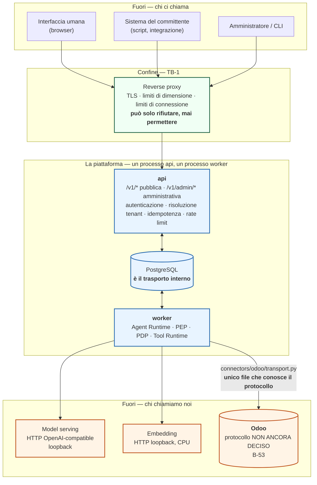
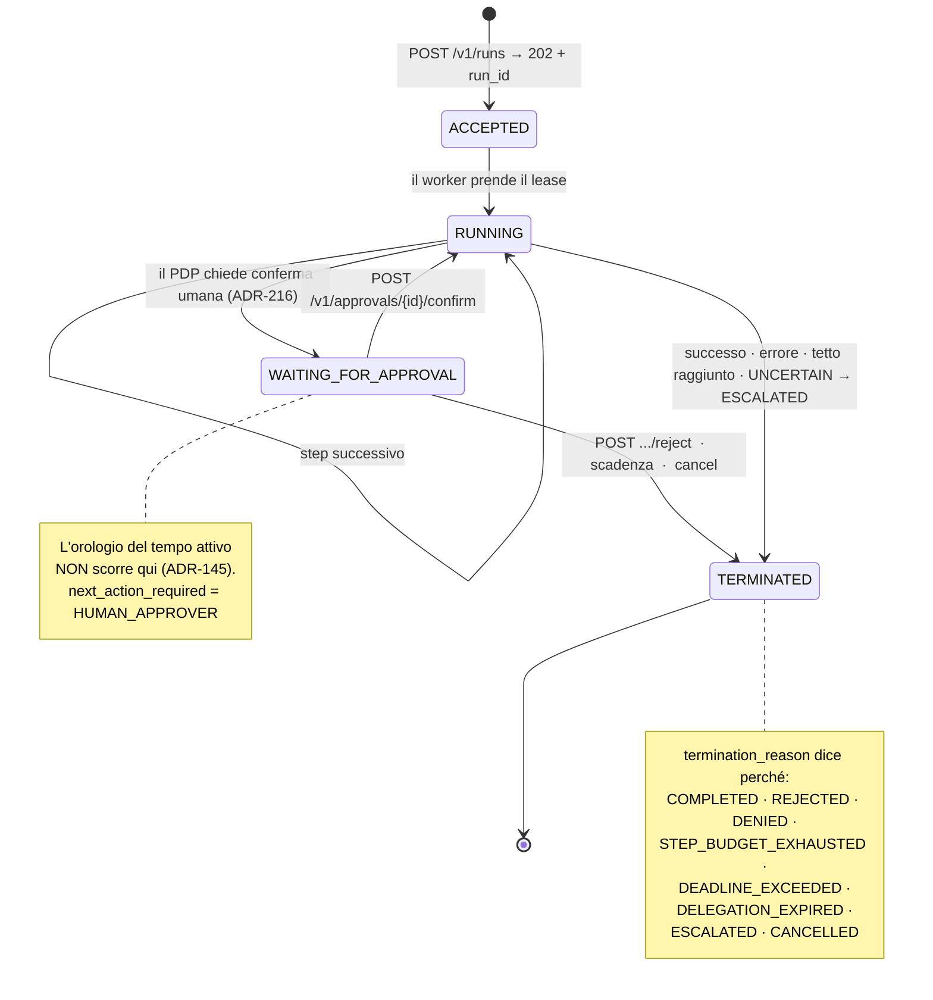
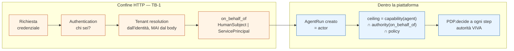
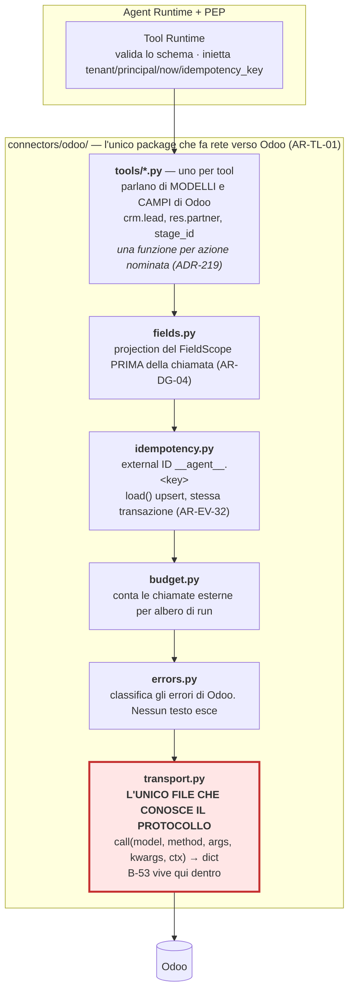
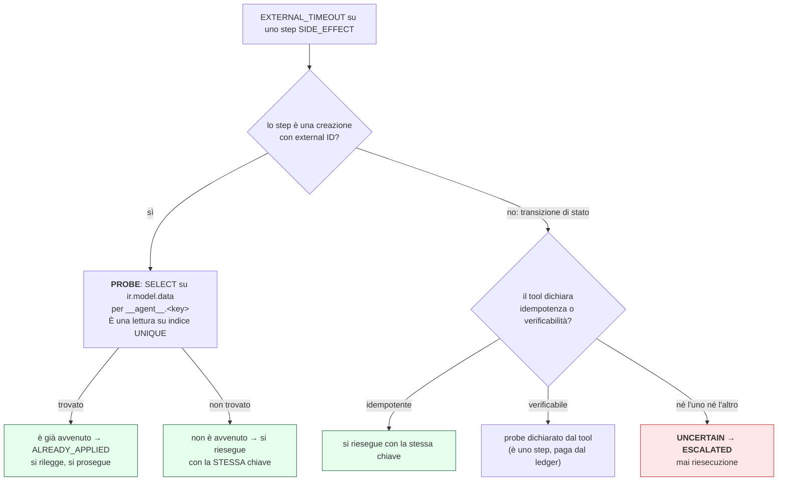
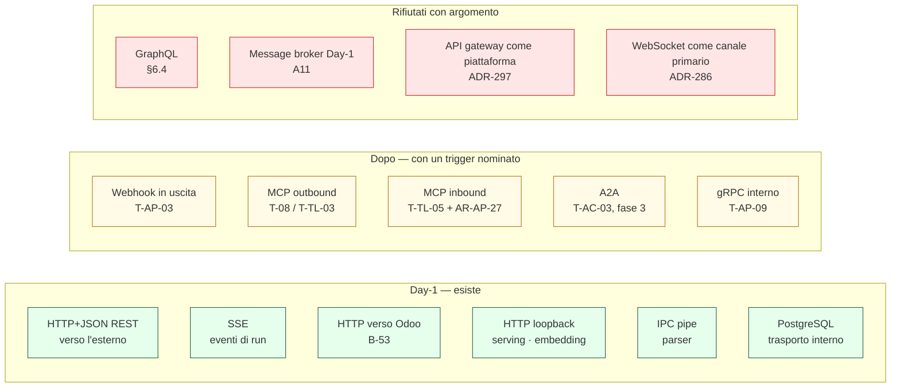
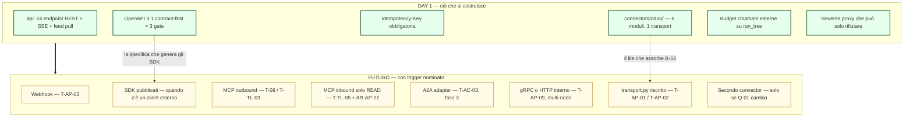

# 18 — API, Integration & External Interface Architecture

> **Documento**: `A18` — quattordicesimo documento di Level A.
> **Data**: 2026-08-23.
> **Stato**: proposta architetturale completa, con un bloccante dichiarato (`B-53`) che
> **non viene risolto per assunzione**.
> **Dipende da**: `A01` (principi), `A02` (Control Plane), `A03` (governance e policy),
> `A04` (Agent Runtime), `A05` (model e inference), `A06` (tool), `A07` (knowledge),
> `A08` (memory), `A09` (identity), `A10` (agent communication), `A11` (eventing e durable
> execution), `A12` (observability), `A13` (security), `A14` (data governance), `A17` (testing).
> **Manda mandati a**: `A15` (deployment), `A16` (CI/CD), `C24` (business continuity),
> `C26` (conformità), `C27`, `C29`, `C31`.

---

## 0. In breve, per chi legge per la prima volta

Questa piattaforma è un **agent** che lavora su un CRM/ERP. Un agent è un programma che riceve
un compito in linguaggio naturale, decide da solo quali operazioni fare, e le esegue chiamando
dei **tool** — funzioni con un contratto dichiarato.

Perché funzioni servono due tipi di "presa elettrica", e sono profondamente diverse:

1. **La presa verso l'esterno.** Qualcuno deve poter dire alla piattaforma *"fai questa cosa"*
   e poi chiedere *"com'è andata?"*. Quel qualcuno è, Day-1, l'interfaccia umana che usano le
   persone del committente. Domani potrebbe essere un sistema del committente, o un client di
   terzi. Questa presa **la disegniamo noi**: decidiamo noi la forma, le regole, gli errori.

2. **La presa verso il CRM.** La piattaforma deve parlare con Odoo per leggere e scrivere i
   dati. Questa presa **non la disegniamo noi**: esiste già, l'ha fatta Odoo, e noi possiamo
   solo adattarci. È una presa **subita**.

Tenere separate queste due superfici è il compito principale di questo documento, e sarà
ripetuto ossessivamente. Sono governate da regole opposte:

| | Superficie esterna (northbound) | Superficie verso Odoo (southbound) |
|---|---|---|
| Chi decide la forma | **noi** | **Odoo** |
| Chi può cambiarla | noi, con una politica di deprecazione | Odoo, senza chiedercelo |
| Chi paga il cambiamento | i nostri client | **noi** |
| Rischio principale | esporre troppo | costruire su qualcosa che scompare |
| Difesa | contratto esplicito, versioning, test negativi | isolamento del punto di contatto |

**Analogia.** La superficie esterna è la **porta d'ingresso di casa nostra**: decidiamo noi
com'è fatta, chi ha la chiave, cosa può entrare. La superficie verso Odoo è la **presa a muro
di un edificio che non è nostro**: possiamo scegliere la spina, non la presa. Se il proprietario
decide di cambiare le prese, tocca a noi rifare le spine.

---

## 1. Responsabilità e non responsabilità di `A18`

### Responsabilità

* Definire **quali interfacce esistono**, chi le produce, chi le consuma, con quale protocollo.
* Definire il **contratto** della superficie esterna: risorse, operazioni, errori, paginazione,
  versioning, idempotenza, rate limiting, autenticazione al confine.
* Definire il **modello asincrono**: come un client scopre l'esito di un `run` che sta aspettando
  un umano.
* Definire il **connector verso Odoo**: dove passa il confine, quale file conosce il protocollo,
  come si gestiscono errori, idempotenza, rate limiting **in uscita**.
* Nominare le **sette classi negative** che `AR-QA-02` (la regola di `A17` per cui ogni endpoint
  pubblico e ogni tool ha un test per ciascuna classe negativa) richiede e che nessuno aveva
  ancora definito.
* Dichiarare **cosa la superficie esterna non deve permettere di fare**, con il motivo.

### Non responsabilità

* **Non** decide quali tool esistono. È `A06`, e dipende da `Q-01` (la domanda aperta: il CRM
  target è Odoo o un CRM generico?). `A18` dice come si parla a un tool, non quali tool ci sono.
* **Non** decide le policy di autorizzazione. È `A03`. `A18` dice dove il PDP (`Policy Decision
  Point`, il componente che risponde alla domanda «questa azione è permessa?») viene interrogato
  sul percorso di una richiesta HTTP, non cosa risponde.
* **Non** decide il modello di identità. È `A09`. `A18` consuma il **dual principal** (chi agisce
  è sempre la coppia `(agent, per conto di chi)`) e lo porta al confine HTTP.
* **Non** decide il deployment, il reverse proxy concreto, i certificati TLS. È `A15`.
* **Non** decide la pipeline di CI. È `A16`. `A18` dichiara **quali gate** devono esistere;
  `A16` dice dove girano.
* **Non** decide la retention dei dati che passano dall'API. È `A14`, e i numeri sono `DEF-13`,
  aperta.
* **Non** progetta l'interfaccia utente. `A18` si ferma al contratto HTTP.

---

## 2. Cosa `A18` eredita e non ridiscute

Questa sezione è un elenco di vincoli **consumati**. Nessuno di essi viene riaperto. Ogni sigla
è glossata alla prima occorrenza.

### 2.1 Dal committente e dal dominio

| Vincolo | Cosa significa | Conseguenza diretta su `A18` |
|---|---|---|
| `ADR-104` | Nessun task CRM supera **50 step** o **10 minuti di tempo attivo**. L'attesa di un umano **non conta** nel tempo attivo | Un'operazione che aspetta un umano **non può** essere una richiesta HTTP tenuta aperta. Il modello asincrono non è un lusso: è obbligatorio |
| ~90 % dei casi | è una **singola chiamata a tool** (3-5 step) seguita da codice applicativo deterministico | Esiste una fascia larga di run brevi. Ma non abbastanza da giustificare due forme di API (§9.3) |
| `ADR-216` | Conferma umana su **ogni** `Insert`, `Update`, `Archive`, su **ogni** entità, senza eccezioni configurabili (`INV-32`, l'invariante per cui nessuna scrittura esterna avviene senza un'approvazione umana registrata) | Ogni run che scrive **si sospende**. La sospensione è il caso normale, non l'eccezione |
| `ADR-217` | **Capability floor**: Day-1 l'agent è in sola lettura sull'ERP e scrive solo su una superficie CRM dichiarata | L'API esterna non espone nessuna operazione di scrittura contabile |
| `ADR-218` | Nessun tool di cancellazione, solo `archive` (`INV-33`) | Nessun `DELETE` su un'entità di dominio, mai |
| `ADR-219` | Tool **per campo**, non per record | Un `ActionBinding` (l'oggetto tipizzato che una persona approva) nomina un campo, non un oggetto generico |
| `ADR-220` | Cardinalità dichiarata, default **1** | Un endpoint non accetta liste di record da modificare se il tool non dichiara cardinalità > 1 |
| `ADR-221` | Lettura prima della scrittura; il valore precedente va nel journal **prima** (`INV-34`) | Ogni scrittura costa almeno due chiamate a Odoo. Conta per il rate limiting in uscita (§21) |
| `ADR-223` | I campi amministrativi del contatto (P.IVA, C.F., sede, coordinate bancarie) sono fuori dal perimetro Day-1 | Non compaiono in nessuno schema di richiesta o risposta |
| `ADR-121` | Credenziali aziendali, **nessun OAuth**, al massimo LDAP. Vale sia verso le persone sia verso il CRM | Niente OAuth 2.0 / OIDC al confine esterno Day-1, e niente OAuth verso Odoo (che comunque non ce l'ha) |
| `AS-29` **confermata** | Se il PDP si guasta, il sistema **si ferma**. Nessun percorso di degrado | Un guasto di autorizzazione sull'API esterna non diventa mai un permesso (§14.6) |

### 2.2 Dagli altri documenti

| Vincolo | Cosa significa | Conseguenza su `A18` |
|---|---|---|
| `INV-07` | Nessun componente accede al database CRM se non attraverso un `Tool` con schema dichiarato. Unica eccezione `AR-QA-19` (il test harness, solo sotto test) | **Non esiste** un endpoint che restituisce un record Odoo grezzo |
| `ADR-049` / `AR-TL-05` | Nessun argomento di tool può essere un programma. `execute_kw` (il metodo generico di Odoo che esegue qualunque metodo su qualunque modello) **è stato rifiutato** come modello di tool | Nessun endpoint accetta un linguaggio di query. E GraphQL va valutato contro questa regola (§6.4) |
| `ADR-161` + `AR-EV-32` | L'idempotenza verso Odoo **la costruiamo noi**, con un external ID nel namespace `__agent__`; record e riga `ir.model.data` **nella stessa transazione** | L'idempotenza verso Odoo esiste già. Quella sulla superficie esterna è un'**altra cosa** (§12) |
| `AR-SE-11` | Nessun tool accetta un URL senza allowlist di host **dichiarata nello schema** | Una subscription webhook è un URL fornito dal client: cade sotto questa regola (§11) |
| `INV-03` | Il modello non è un enforcement point: la sua uscita è input **non fidato** | Nessun campo di risposta dell'API è generato dal modello senza essere marcato `advisory` |
| `INV-29` | L'oggetto di ogni approvazione è un `ActionBinding` tipizzato. **Nessun testo generato dal modello è mai l'oggetto di un'approvazione** | Conseguenza forte sul token streaming (§10.3) |
| `INV-26` | Nessun record di telemetria contiene testo di dominio, prompt, risposta del modello, valori di campo del CRM | Forma riusata per gli errori esterni (§22) e per i payload webhook (§11) |
| `INV-13` / `INV-18` | L'autorità di un run non cresce dopo l'avvio; i tetti sono proprietà dell'**albero** di run | Nessun endpoint alza un budget o un ceiling a run avviato |
| `AR-TL-01` | Solo `connectors/` fa rete | Il rate limiting verso Odoo ha **un solo punto** dove vivere |
| `AR-TL-15` | `limit` obbligatorio su ogni tool che restituisce liste | Necessario, **non sufficiente** per non saturare Odoo (§21) |
| `A11` | Il trasporto interno **è il database**. Non esiste il comando `ResumeRun` | Non esiste un endpoint `POST /v1/runs/{id}/resume` (§18) |
| `A10` | Nessuna comunicazione agent→agent Day-1. «Due run in sequenza» è il sostituto del multi-agent, ed è **`A18`** che deve renderlo esprimibile | Il client compone i run, la piattaforma no (§8.4) |
| `AR-QA-02` | Per ogni endpoint pubblico e per ogni tool, un test per ciascuna delle **sette classi negative** più «valido e ostile» | `A18` deve **nominarle** (§30) |
| `ADR-266` / `INV-42` | Ogni gate vive in un registro verificato in CI; ogni voce bloccante ha un **caso negativo provato** | Ogni gate che `A18` dichiara deve dire cosa blocca e quale caso negativo lo prova (§29.4) |
| `ADR-262` / `AS-56` | L'`OdooFake` di CI riproduce **otto comportamenti** di Odoo | Se `A18` sceglie un protocollo diverso da quello assunto, quegli otto vanno rinegoziati e `T-QA-02` scatta (§20) |

---

## 3. I FATTI su Odoo che questo documento usa

Provengono da `R-10` e `R-12` del `research-log.md`, ricerche già fatte il 2026-08-23. **Non
sono stati rifatti.** Sono riportati qui con la loro qualifica originale, perché `A18` è il
documento che ci costruisce sopra.

### 3.1 Fatti verificati

> **FATTO (`R-10`).** Odoo **non offre OAuth per l'API esterna**. Gli OAuth presenti riguardano
> il login inbound (Google/Microsoft sign-in) e la posta, non l'accesso programmatico.

> **FATTO (`R-10`).** Odoo 14+ ha **API key per singolo utente**. È la cosa più vicina a una
> credenziale per-utente che il prodotto offra, e porta i permessi e le record rule di quella
> persona.

> **FATTO (`R-10`).** `res_users.id` è un `SERIAL` PostgreSQL: gli ID utente **non vengono
> riusati**. Caveat: un amministratore *può* forzarlo con `setval()`, e in Odoo la pratica
> normale è **archiviare** gli utenti (`active = False`), non cancellarli.

> **FATTO (`R-10`).** Esiste il modulo `auth_ldap` nelle addons base, anche Community. Non
> mappa i gruppi LDAP sui gruppi Odoo senza il modulo OCA `users_ldap_groups`.

> **FATTO (`R-12`).** L'API esterna di Odoo **non ha** un meccanismo nativo di idempotency key.
> Due `create` producono due record.

> **FATTO (`R-12`).** La tabella **`ir.model.data`** mappa un identificatore esterno **scelto
> dal chiamante** — la coppia `(module, name)`, cioè l'XML ID — sulla coppia `(model, res_id)`
> del record reale. Su quella coppia esiste un **vincolo UNIQUE a livello di PostgreSQL**, non
> un controllo applicativo. **L'arbitro è il database, non Python.**

> **FATTO (`R-12`).** Il metodo ORM **`load(fields, rows)`**, se `fields` include la colonna
> speciale `id` contenente l'external ID, esegue un **upsert**.

> **FATTO (`R-12`).** Gli external ID **non** vengono creati automaticamente per i record nati
> da una `create()` normale né dall'interfaccia utente.

> **FATTO (`R-14.7`, citato da `ADR-221`).** In Odoo **nessun campo è tracciato per default**:
> dopo un `UPDATE` il valore precedente non esiste più.

> **FATTO (citato da `ADR-218`).** `unlink()` **non passa da `write()`**: aggira le automazioni.
> È il motivo per cui non esiste nessun tool di cancellazione.

### 3.2 Il fatto NON verificato, che è il problema di questo documento

> **DA VERIFICARE (`R-10`) — deprecazione.** Secondo i risultati di ricerca sulla documentazione
> Odoo, XML-RPC e JSON-RPC sono deprecate, con rimozione prevista in **Odoo 22 (autunno 2028)**,
> sostituite da una **External JSON-2 API** con `Authorization: bearer <api_key>` e header
> `X-Odoo-Database`. **Non confermato in originale**: la pagina primaria ha restituito solo la
> navigazione. **Va confermato prima di scegliere il connector.**

Questo è **`B-53`**, ed è il problema aperto più grave di `A18`. La §20 lo tratta per intero.
Anticipo la tesi, perché condiziona tutto il resto:

> **Non si costruisce su un protocollo con una data di scadenza. Ma non si può nemmeno
> costruire su un protocollo che non abbiamo verificato esistere.** L'unica risposta
> architetturalmente onesta è rendere la scelta del trasporto **la cosa più isolata del
> sistema**, così che chiuderla dopo costi poco.

### 3.3 Cosa questi fatti implicano già adesso

| FATTO | INFERENZA |
|---|---|
| Odoo non ha OAuth per l'API esterna | La catena di autenticazione verso Odoo sarà **API key**, non token delegati. Coerente con `ADR-121`, che vietava OAuth per scelta del committente: qui il vincolo è **doppio**, di prodotto e di scelta |
| API key per singolo utente dalla v14 | Esiste la via d'uscita da `R-41` (il rischio per cui le azioni dell'agent compaiono nei log di Odoo con un utente tecnico condiviso invece che con la persona). È `B-54`, aperta sulla **operatività** di quelle chiavi: chi le genera, dove stanno, come si ruotano |
| `ir.model.data` con UNIQUE di PostgreSQL + `load()` upsert | L'idempotenza verso Odoo è **costruibile e già decisa** (`ADR-161`). `A18` non la reinventa: la implementa e ne definisce il punto esatto nel connector |
| Nessun campo tracciato per default | Ogni scrittura è preceduta da una lettura (`ADR-221`). **Il costo verso Odoo raddoppia**, e va contato nel budget di chiamate esterne |
| `unlink()` aggira le automazioni | La superficie esterna non deve avere nemmeno la *forma* di una cancellazione, per non invitare qualcuno a implementarla |

---

## 4. Inventario delle interfacce

Prima di scegliere qualunque protocollo, l'inventario. Il prompt ne chiede una lista minima;
qui c'è quella lista, con l'aggiunta della colonna che conta di più: **esiste Day-1?**

### 4.1 La tabella

| # | Interfaccia | Producer | Consumer | Protocollo | Sync/Async | Auth | Classificazione dato | Day-1 |
|---|---|---|---|---|---|---|---|---|
| I-01 | **Public API** `/v1/*` | `api` | interfaccia umana, sistemi del committente | HTTP + JSON, REST, OpenAPI 3.1 | **async per i run**, sync per le letture | sessione (browser) o API key (client) | fino a `CONFIDENTIAL`; mai `SPECIAL_CATEGORY` (`INV-39`) | **Sì** |
| I-02 | **Admin API** `/v1/admin/*` | `api` | amministratori, CLI | HTTP + JSON, `ETag`/`If-Match` | sync | sessione + ruolo admin, classe di credenziale separata | configurazione + identità | **Sì** |
| I-03 | **Control Plane CRUD** | Control Plane | Admin Console / CLI | è I-02, non un'interfaccia distinta | sync | come I-02 | configurazione | **Sì** (già in `A02`) |
| I-04 | **Run event stream** `/v1/runs/{id}/events` | `api` | interfaccia umana | **SSE** su HTTP | streaming | come I-01 | identificatori + stati; **mai** testo del modello | **Sì** |
| I-05 | **Tenant event feed** `/v1/events` | `api` | sistemi del committente | HTTP + JSON, cursore keyset | polling | come I-01 | **solo identificatori** | **Sì** |
| I-06 | **Health / readiness** | `api`, `worker` | reverse proxy, dead man's switch di `A12` | HTTP, testo minimo | sync | **nessuna**, su porta separata | nessun dato | **Sì** |
| I-07 | **`ModelProvider.complete()/.stream()`** | Model Provider | Agent Runtime | in-process → HTTP OpenAI-compatible su loopback | sync | secret interno (`AS-06`) | prompt e context | **Sì** (già in `A05`) |
| I-08 | **`ToolRuntime.invoke()`** | Tool Runtime | Agent Runtime via PEP | **in-process** | sync | contesto del run | dipende dal tool | **Sì** (già in `A06`) |
| I-09 | **`PDP.decide()`** | PDP | PEP | **in-process, funzione pura** | sync | — | — | **Sì** (già in `A03`) |
| I-10 | **`OdooTransport.call()`** | connector Odoo | Tool Runtime | **HTTP verso Odoo**, formato `NON ANCORA DECISO` (`B-53`) | sync | **API key** in header o parametro, secondo `B-53` | dato di dominio del CRM | **Sì** |
| I-11 | **`EmbeddingProvider.embed()`** | Embedding Provider | Ingestion + Retrieval | in-process → HTTP su loopback, **CPU** | sync | secret interno | testo di documento | **Sì** (già in `A07`) |
| I-12 | **`DocumentSource.list_changes/fetch`** | connector documentale | Ingestion Pipeline | in-process → rete verso la sorgente | async (job) | credenziale del connector | documenti | **Sì** (già in `A07`) |
| I-13 | **Parser isolato** | processo parser | Ingestion | IPC su pipe, **nessuna rete** (`AR-SE-12`) | sync | — | contenuto non fidato | **Sì** (già in `A13`) |
| I-14 | **Trasporto interno `api` ↔ `worker`** | — | — | **PostgreSQL** (`A11`) | async | ruoli PostgreSQL | tutto | **Sì** |
| I-15 | **Webhook in uscita** | `api` | endpoint del cliente | HTTP + JSON firmato | async, at-least-once | HMAC per subscription | **solo identificatori** | **No** (§11) |
| I-16 | **MCP inbound** (esporre i nostri tool) | `api` | agent di terzi | MCP | — | — | — | **No** (§27) |
| I-17 | **MCP outbound** (consumare server MCP) | Tool Runtime | server MCP di terzi | MCP | — | — | — | **No** (§27) |
| I-18 | **A2A** | — | agent di altre organizzazioni | A2A | — | — | — | **No** (`A10`, fase 3) |
| I-19 | **Agent-to-agent interno** | — | — | — | — | — | — | **No** (`A10`, `ADR-123`) |
| I-20 | **Export API** | `api` | data subject, revisori | HTTP + file | async (job) | sessione, autenticazione forte | fino a `CONFIDENTIAL` | **Parziale** — l'`Erasure Coordinator` di `A14` è Day-1 minimo; il formato è `DEF-08`, aperta |
| I-21 | **Observability API** | — | — | — | — | — | — | **No**: `A12` ha deciso PostgreSQL + due cruscotti, non un'API |
| I-22 | **Workflow API** | — | — | — | — | — | — | **No**: `WorkflowDefinition` non esiste Day-1 (`A11`, `T-EV-09`) |
| I-23 | **Memory API** (8 endpoint) | Control Plane API | UI / admin | HTTP, sottoinsieme di I-01 e I-02 | sync | come I-01/I-02 | `PERSONAL_DATA` | **Sì** (già in `A08`) |
| I-24 | **Knowledge / ingestion API** | `api` | admin | HTTP, sottoinsieme di I-02 | async (job) | come I-02 | documenti | **Sì**, ridotta (§18, punto 14) |

### 4.2 Il risultato dell'inventario, in una frase

**Day-1 esistono tre protocolli e mezzo**: HTTP+JSON verso l'esterno, HTTP verso Odoo, HTTP su
loopback verso serving ed embedding, e PostgreSQL come trasporto interno. Il "mezzo" è SSE,
che è HTTP con un `Content-Type` diverso.

Nessun broker. Nessun gRPC. Nessun GraphQL. Nessuna service mesh. Nessun API gateway come
piattaforma. Le motivazioni sono nelle sezioni che seguono, e nessuna è «perché è semplice»:
la semplicità è la **conseguenza**, non l'argomento.

---

## 5. La mappa completa: le due superfici, viste da fuori



### Come leggerlo

* **I tre blocchi in azzurro sono nostri.** Il contratto lo scriviamo noi, e cambiarlo costa a
  chi ci chiama. Sono `api`, `worker` e PostgreSQL.
* **I tre blocchi in arancione non sono nostri.** Odoo, il model serving, l'embedding. Il
  contratto lo subiamo. Di questi, **Odoo è l'unico che sta su una rete che non controlliamo**
  e l'unico il cui protocollo è in discussione.
* **Il blocco verde è il confine.** Il reverse proxy fa TLS, limita la dimensione delle
  richieste e il numero di connessioni. **Non autentica e non autorizza.** Questa è una regola,
  non un'omissione: §28 spiega perché.
* **Il flusso principale**: una richiesta entra da `RP`, arriva ad `api`, che la autentica,
  risolve il tenant, verifica l'idempotenza, e **scrive una riga**. Il `worker` la prende dal
  database. Non c'è mai una chiamata HTTP fra `api` e `worker`.
* **Il confine importante è l'ultima freccia**: `connectors/odoo/transport.py`. È l'unico file
  del sistema che sa se stiamo parlando XML-RPC, JSON-RPC o JSON-2. Tutto il resto del codice
  parla di *modelli e campi di Odoo*, non di *formato sul filo*.

### 5.1 I Trust Boundary di `A18`

`A18` non inventa confini nuovi: usa quelli di `A01` e ne rende espliciti due sotto-confini.

| # | Confine | Controllo | Novità di `A18` |
|---|---|---|---|
| TB-1 | Utente → Piattaforma | autenticazione, sessione o API key, tenant resolution | **Precisato**: la tenant resolution non legge **mai** un campo della richiesta (`AR-AP-06`) |
| TB-4 | Agent Runtime → Tool | PEP: policy + schema validation + idempotenza | invariato |
| TB-5 | Tool → Sistema esterno | credenziale del tool, mai il token dell'utente | **Precisato**: il confine è `transport.py`, e ci passa anche il budget di chiamate (§21) |
| **TB-8** | **Reverse proxy → `api`** | il proxy può **solo togliere**; `api` riautentica sempre | **nuovo**, §28 |
| **TB-9** | **Errore di Odoo → nostro errore** | nessun testo di errore esterno esce o viene persistito verbatim | **nuovo**, §22 |

---

## 6. La superficie esterna: quale stile di API

### 6.1 La domanda vera

Non è «REST o GraphQL?». È: **cosa deve poter esprimere un client, e cosa non deve poter
esprimere?**

Questa piattaforma ha una caratteristica insolita: gran parte della sua architettura di sicurezza
consiste nel **togliere potere espressivo**. `ADR-049` vieta che un argomento di tool sia un
programma. `AR-TL-03` vieta SQL. `ADR-219` impone tool per campo invece di tool generici.
`INV-07` vieta l'accesso diretto al database del CRM. `ADR-220` mette la cardinalità a 1 di
default.

> **Il filo conduttore di tredici documenti è: chi chiama deve poter nominare azioni, non
> comporle.**

Uno stile di API che permette al client di comporre la propria richiesta è quindi in tensione
con tutto ciò che precede. Questo è il criterio di selezione, e viene prima della performance,
della moda e dell'ergonomia.

### 6.2 Le alternative reali

| Stile | Cosa dà davvero | Perché qui perde o vince |
|---|---|---|
| **REST su HTTP + JSON** | risorse nominate, verbi fissi, contratto enumerabile in OpenAPI | Il contratto è una **lista chiusa di endpoint**. Si può scrivere «cosa non esponiamo» e verificarlo in CI. **Vince** |
| **RPC su HTTP + JSON** (stile `POST /rpc` con `method`) | una porta, N metodi | Perde per un motivo preciso: **il metodo diventa un argomento**. È la forma di `execute_kw`, cioè esattamente la cosa che `ADR-049` respinge, trasportata al confine esterno |
| **GraphQL** | il client compone la query, un solo endpoint | **Perde contro `ADR-049`** (§6.4). Motivo strutturale, non estetico |
| **gRPC** | contratto forte in Protobuf, streaming bidirezionale, efficienza | Perde su tre punti concreti (§6.5) |
| **Event-driven / broker** (il client pubblica un comando su una coda) | disaccoppiamento, backpressure naturale | Perde: introduce un secondo system of record e un secondo modello di autenticazione per risolvere un problema che Day-1 non abbiamo. `A11` ha già rifiutato il broker per motivi analoghi |
| **WebSocket come canale primario** | bidirezionale, persistente | Perde: nessun caso d'uso richiede che il *server* inizi una conversazione con effetti. Vedi §10.2 |

### 6.3 Decisione

> ## Decisione `ADR-284` — La superficie esterna è **REST su HTTP con JSON, contract-first su OpenAPI 3.1**
>
> Un endpoint per risorsa, verbi HTTP standard, corpo JSON, errori in
> `application/problem+json`, specifica OpenAPI 3.1 **autoritativa** e scritta prima del codice.

**Perché, con l'argomento vero.**

1. **Il contratto è enumerabile, e questo è un requisito di sicurezza, non di documentazione.**
   `AR-QA-02` chiede sette test negativi *per ogni endpoint pubblico*. Quella regola presuppone
   che «endpoint pubblico» sia un insieme finito e conoscibile. Con REST + OpenAPI lo è: si
   confronta la specifica con le route registrate dall'applicazione e si fa fallire la build se
   divergono. Con GraphQL «l'endpoint» è uno e la superficie vera è il grafo dei tipi, che non
   si enumera allo stesso modo. **`AR-QA-02` sarebbe inapplicabile.**

2. **La lista di ciò che non esponiamo (§18) diventa verificabile.** Una regola come «non esiste
   nessun endpoint che invoca un tool direttamente» è una `grep` sulla specifica. Con un endpoint
   generico non lo è.

3. **`ADR-104` (50 step / 10 minuti) rende ogni run una risorsa con un ciclo di vita.** Una
   risorsa con un ciclo di vita è esattamente ciò che REST modella bene: `POST` per crearla,
   `GET` per osservarla, sotto-risorse per gli eventi e le approvazioni.

4. **Coerenza con ciò che tredici documenti hanno già scritto.** `A02` ha dichiarato
   `/v1/admin/*` con `ETag`/`If-Match`, `A03` ha dichiarato `POST /v1/approvals/{id}` e
   `GET /v1/runs/{id}/decisions`, `A08` ha dichiarato otto endpoint REST di memoria, il registro
   delle interfacce ha `POST /v1/runs` e `GET /v1/runs/{id}`. Cambiare stile ora significherebbe
   riscrivere pezzi di quattro documenti **senza un guadagno dimostrato**. Questo argomento da
   solo non basterebbe — la coerenza non è una virtù se la scelta è sbagliata — ma sommato ai
   tre precedenti chiude la questione.

**Trade-off accettato.** REST costa **verbosità**: un client che vuole run + approvazioni +
eventi fa tre richieste dove GraphQL ne farebbe una. Su una macchina sola, con l'interfaccia
umana che gira accanto, questo costo è invisibile. Lo diventerà se e quando ci saranno client
mobili su rete lenta → trigger `T-AP-08`.

**Cosa la invertirebbe.** Un requisito reale di client mobili con budget di round-trip stretto,
**e** un numero di risorse correlate abbastanza alto da rendere il problema misurabile. In quel
caso la risposta non è GraphQL: sono **endpoint di composizione dichiarati** (`GET /v1/runs/{id}?
expand=approvals,events`) con una lista chiusa di espansioni. Si mantiene l'enumerabilità.

### 6.4 GraphQL contro `ADR-049`: l'analisi che il brief richiede

`ADR-049` dice: **nessun argomento di tool può essere un programma.** Il divieto nasce da un
ragionamento preciso, che vale la pena ripetere perché è la spina dorsale di `A06`: se il modello
può scrivere una query, allora il perimetro di ciò che il modello può fare non è più
enumerabile, e non è più autorizzabile *prima* dell'esecuzione — bisognerebbe autorizzare il
significato della query, che è un problema aperto.

**La domanda per `A18` è: una query GraphQL scritta da un client umano è la stessa cosa?**

**Non è la stessa cosa, ma il problema è imparentato, e in due punti è peggiore.**

**Le differenze che assolverebbero GraphQL:**

* Il client non è il modello. Un client è autenticato, ha un'identità stabile, e le sue query
  sono scritte da uno sviluppatore, non generate a runtime.
* Esistono le **persisted query**: si registra in anticipo un insieme chiuso di query, il client
  ne invoca una per hash. Questo *ripristina* l'enumerabilità.

**I due punti in cui GraphQL sta peggio, e sono quelli che decidono:**

1. **L'autorizzazione per campo di GraphQL è nel posto sbagliato rispetto a `ADR-228`.**
   `A14` ha introdotto il **`FieldScope`**: il PDP produce l'insieme di campi ammessi, e il PEP
   **restringe la chiamata prima che parta verso Odoo**. La verifica sul risultato è la seconda
   linea, mai l'unica (`AR-DG-04`). GraphQL è costruito sul modello opposto: i resolver girano,
   producono i campi, e l'autorizzazione filtra *dopo* — o, nella migliore delle
   implementazioni, dentro ogni resolver.
   Nel nostro caso questo non è un dettaglio di efficienza: **significa che il dato sarebbe già
   uscito da Odoo prima di essere autorizzato.** `INV-09` («il filtro di autorizzazione sta
   nella query; gli strati successivi possono solo togliere») diventerebbe inesprimibile.

2. **GraphQL amplifica il traffico verso Odoo in modo che il client controlla.**
   Questo è il punto che mi preoccupa di più, ed è specifico di questa architettura. Il problema
   N+1 di GraphQL è noto: una query che chiede 50 opportunità e per ciascuna il contatto produce
   51 letture. Nel nostro caso quelle letture **atterrano su un'istanza Odoo di produzione del
   committente**. Il rate limiting verso Odoo (§21) diventerebbe una funzione della forma della
   query del client, cioè di qualcosa che noi non scriviamo.
   **Un client potrebbe far male all'ERP del committente senza avere nessun permesso di
   scrittura**, semplicemente scrivendo una query annidata. È esattamente il modo di far danno
   che §21 esiste per prevenire.

**INFERENZA.** Con le persisted query GraphQL recupera l'enumerabilità, ma a quel punto una
persisted query *è* un endpoint REST con più cerimonia: ha un nome stabile, una forma fissa,
una lista chiusa. Si paga il runtime GraphQL e non si compra niente.

> **DECISIONE ARCHITETTURALE.** **GraphQL è rifiutato**, e il motivo primario non è la
> complessità: è che l'autorizzazione per campo di `ADR-228` e il controllo del traffico verso
> Odoo di §21 sono **entrambi incompatibili con il modello di esecuzione di GraphQL**. Il motivo
> secondario è che le persisted query, che sarebbero l'unica forma accettabile, degenerano in
> REST.
>
> **Cosa lo invertirebbe**: se il `FieldScope` diventasse applicabile dentro un resolver in modo
> dimostrabile (cioè se il PDP potesse essere consultato *prima* di ogni resolver senza sfondare
> il budget di latenza — vedi `AS-27` e `T-GP-01`, che dicono che già oggi non è scontato), e
> se esistesse un limite di profondità e di costo di query **verificabile staticamente**. Sono
> due condizioni forti, e la prima è già in dubbio per il PDP che abbiamo.

### 6.5 Perché non gRPC

Tre motivi concreti, in ordine di peso.

1. **Non c'è una rete interna da ottimizzare.** `A01` ha deciso quattro piani in pochi processi;
   `A10` ha chiuso con «zero componenti, zero protocolli, zero servizi»; `A11` ha stabilito che
   il trasporto interno **è PostgreSQL**. gRPC brilla fra servizi. Noi abbiamo `api` e `worker`
   che non si parlano, e tre processi esterni che parlano già HTTP. **gRPC risolverebbe un
   problema che l'architettura ha deciso di non avere.**

2. **Il consumer Day-1 è un browser.** gRPC-Web richiede un proxy di traduzione. Introdurremmo
   un componente di infrastruttura per parlare con l'unico client che esiste.

3. **Il vantaggio del contratto forte ce l'abbiamo già.** OpenAPI 3.1 usa JSON Schema, e questa
   architettura è **già** costruita su JSON Schema: il payload tipizzato che il modello emette è
   validato contro uno JSON Schema (`A06`), gli schemi dei tool sono JSON Schema, le annotazioni
   `x-entity-ref` di `A08` vivono lì. Un secondo sistema di tipi (Protobuf) accanto al primo è
   **debito, non rigore**.

**Cosa lo invertirebbe**: un deployment multi-nodo con componenti nostri che si chiamano su
rete, **e** un profilo di latenza in cui la serializzazione conta. Nessuna delle due condizioni
esiste oggi. → `T-AP-09`.

### 6.6 La matrice di selezione

| Criterio | REST+SSE (scelto) | REST puro | GraphQL | gRPC | Event-driven |
|---|---|---|---|---|---|
| Semplicità Day-1 | **Alta** | Alta | Media | Bassa | Bassa |
| Compatibilità browser | **Alta** | Alta | Alta | Bassa (serve proxy) | Media |
| Streaming di eventi | **Alta** (SSE) | Bassa (solo polling) | Media (subscription = WebSocket) | Alta | Alta |
| Operazioni asincrone lunghe | **Alta** | Alta | Media | Media | Alta |
| Comunicazione interna | non serve | non serve | non serve | Alta (ma inutile) | Media |
| Integrazioni esterne | **Alta** | Alta | Bassa (pochi client lo parlano) | Media | Bassa |
| **Enumerabilità del contratto** (`AR-QA-02`) | **Alta** | Alta | **Bassa** | Alta | Bassa |
| **Compatibilità con `FieldScope`** (`ADR-228`) | **Alta** | Alta | **Bassa** | Alta | Media |
| **Controllo del traffico verso Odoo** | **Alta** | Alta | **Bassa** | Alta | Media |
| Versioning | Alta | Alta | Media (evoluzione senza versioni) | Alta | Media |
| Observability | **Alta** (un endpoint = uno span) | Alta | Bassa (un endpoint per tutto) | Alta | Media |
| Complessità operativa | **Bassa** | Bassa | Media | Alta | Alta |
| **Raccomandazione** | **✅ scelto** | manca lo streaming | ✗ | ✗ Day-1 | ✗ |

Le tre righe in grassetto centrale sono quelle che decidono, e sono tutte e tre proprie di
**questa** architettura. Su un progetto diverso GraphQL potrebbe vincere.

---

## 7. Resource model e operation model

### 7.1 Cosa è una risorsa di prima classe

Una risorsa di prima classe ha un identificatore stabile, un ciclo di vita, e un URL. Non tutto
ciò che esiste nel sistema lo merita.

| Concetto | Risorsa pubblica? | Motivo |
|---|---|---|
| **`Run`** | **Sì** | è l'unità di lavoro, ha un ciclo di vita, è ciò che il client crea e osserva |
| **`Approval`** | **Sì** | è ciò che una persona deve fare perché il run prosegua. `ADR-216` la rende il caso normale |
| **`Conversation`** | **Sì** | esiste in `A08` come tabella; raggruppa i run e porta il contesto |
| **`Memory`** | **Sì**, con 8 endpoint già definiti da `A08` | ispezione, correzione, cancellazione, explanation sono **diritti**, non funzionalità |
| **`Event`** | **Sì**, in sola lettura, con cursore | è come un client scopre le cose senza polling stretto |
| **`Agent`** | **Sì**, in sola lettura dalla superficie pubblica | il client deve poter nominare `agent_id` su `POST /v1/runs` (`A10`) |
| **`Tool`** | **Sì**, in sola lettura, **catalogo** | il client deve sapere quali tipi di `ActionBinding` possono comparire. **Non invocabile** (§18.1) |
| **`Tenant`, `Subject`, `Policy`, `Model`, `Prompt`, `ToolBinding`** | **Solo su `/v1/admin/*`** | sono configurazione, non prodotto |
| **`Document`** | **Solo su `/v1/admin/*`** | l'ingestion è amministrativa (§18.14) |
| `Step` | **No** | dettaglio interno. Compare in forma aggregata dentro `Run`, e nel dettaglio solo sotto `/v1/admin/*` |
| `Artifact` | **No** | `A10` ha esplicitamente rifiutato l'entità `Artifact` |
| `Workflow` | **No** | `WorkflowDefinition` non esiste Day-1 (`A11`) |
| `Task` / `AgentTask` | **No** | `A10`: nessuna comunicazione agent→agent Day-1 |
| `Evaluation` | **No** dalla superficie pubblica | è un artefatto interno di `A12`/`A17` |

### 7.2 Le tre forme di operazione

Il prompt chiede di non forzare tutto in CRUD. Giusto. Ci sono tre forme, e vanno distinte
perché hanno **semantiche di errore e di retry diverse**.

| Forma | Esempio | Verbo | Idempotente? | Semantica di retry |
|---|---|---|---|---|
| **CRUD su risorsa** | `GET /v1/runs/{id}`, `PATCH /v1/memories/{id}` | `GET`/`PATCH`/`PUT` | `GET` sì; `PATCH` sì con `If-Match` | ritentabile liberamente sui `GET`; sui `PATCH` il retry senza `If-Match` può sovrascrivere una modifica concorrente |
| **Command** (azione che non crea una risorsa duratura) | `POST /v1/approvals/{id}/confirm`, `POST /v1/runs/{id}/cancel` | `POST` su sotto-risorsa nominata | **reso** idempotente da `Idempotency-Key` | il retry restituisce l'esito originale |
| **Long-running operation** | `POST /v1/runs` | `POST`, risposta `202` | **reso** idempotente da `Idempotency-Key` **obbligatoria** | il retry restituisce lo stesso `run_id` |

> **Nota di stile.** Un command è `POST` su una sotto-risorsa con un nome verbale
> (`/confirm`, `/cancel`). Non è REST purista, ed è la scelta giusta: la purezza direbbe di
> modellare la conferma come un `PATCH` sullo stato dell'approvazione, e questo renderebbe
> possibile scrivere `{"status": "APPROVED"}` — cioè trasformare un'approvazione in un
> aggiornamento di campo. Un command nominato **non ha quella forma**, e quindi non ha quella
> tentazione. `INV-29` (l'oggetto di un'approvazione è un `ActionBinding` tipizzato) è più
> facile da difendere su un endpoint che si chiama `/confirm`.

### 7.3 La superficie pubblica Day-1, per intero

```text
# Run
POST   /v1/runs                          crea un run. 202. Idempotency-Key OBBLIGATORIA
GET    /v1/runs/{id}                     stato del run. Supporta ?wait=<s> (long-poll)
GET    /v1/runs/{id}/events              SSE. Supporta Last-Event-ID
GET    /v1/runs/{id}/decisions           decisioni del PDP per questo run (già in A03)
POST   /v1/runs/{id}/cancel              command. Cancella l'albero (A11)
GET    /v1/runs                          lista, cursore keyset

# Approval
GET    /v1/approvals                     approvazioni pendenti per il chiamante
GET    /v1/approvals/{id}                dettaglio: l'ActionBinding tipizzato
POST   /v1/approvals/{id}/confirm        command. Idempotency-Key obbligatoria
POST   /v1/approvals/{id}/reject         command. Idempotency-Key obbligatoria

# Conversation
POST   /v1/conversations
GET    /v1/conversations/{id}
GET    /v1/conversations/{id}/runs

# Memory  (gli 8 endpoint di A08, qui elencati per completezza)
GET    /v1/memories                      ispezione
GET    /v1/memories/{id}
PATCH  /v1/memories/{id}                 correzione, con If-Match
DELETE /v1/memories/{id}                 cancellazione: tombstone + purge (AR-ME-17)
GET    /v1/memories/{id}/explanation     perché questa memoria è nel context
GET    /v1/memories/{id}/audit           chi l'ha scritta, quando, con quale run
POST   /v1/memories                      scrittura amministrativa (authority = ADMIN)
GET    /v1/memories/usage                quante memorie attive, quanto budget

# Catalogo, sola lettura
GET    /v1/agents                        quali agent posso nominare
GET    /v1/agents/{id}
GET    /v1/tools                         catalogo. NON invocabile
GET    /v1/tools/{name}                  schema del tool, per capire gli ActionBinding

# Eventi
GET    /v1/events?after={cursor}         feed per tenant, keyset

# Servizio
GET    /v1/whoami                        chi sono, quale tenant, quale autorità
```

Ventiquattro endpoint pubblici. `AR-QA-02` chiede otto classi di test per ciascuno: sono
**192 test negativi**. Il numero è alto ed è voluto: è il prezzo dichiarato di avere una
superficie enumerabile. `A17` aveva già messo in conto la voce; `A18` la rende contabile.

### 7.4 La rappresentazione di un `Run`

È l'oggetto più importante del contratto. Vale la pena scriverlo.

```json
{
  "run_id": "0195f2c1-...",
  "tenant_id": "...",
  "agent_id": "crm-assistant",
  "agent_version": 7,
  "conversation_id": "...",
  "status": "WAITING_FOR_APPROVAL",
  "next_action_required": "HUMAN_APPROVER",
  "termination_reason": null,
  "created_at": "2026-08-23T10:12:03Z",
  "updated_at": "2026-08-23T10:12:31Z",
  "deadline_at": "2026-08-23T10:22:03Z",
  "budget": {
    "steps_consumed": 4,
    "steps_max": 50,
    "active_ms_consumed": 8140
  },
  "pending_approvals": [
    { "approval_id": "...", "expires_at": "...", "action_kind": "UPDATE_FIELD" }
  ],
  "result": null,
  "last_event_id": 41
}
```

**Il campo che non esiste in nessun documento fratello e che serve davvero**:
`next_action_required`. Vale `PLATFORM` · `HUMAN_APPROVER` · `CLIENT` · `NOBODY`. Risponde alla
sola domanda che un client si pone davvero guardando un run fermo: **«sto aspettando io, o state
lavorando voi?»**. Senza quel campo, un client deve dedurlo incrociando `status` e
`pending_approvals`, e lo dedurrà male.

**Il campo `result`** è `null` finché il run non è terminato. Quando c'è, è il payload tipizzato
prodotto dal codice applicativo, **non testo del modello**. Se il caso d'uso richiede una
risposta in linguaggio naturale, quel testo è un campo dichiarato con `trust_class = model` e
il client sa che è `advisory` (`INV-03`, `AR-SE-02`).

**Il campo `budget`** è esposto deliberatamente. Un client che vede `steps_consumed: 49` capisce
perché il run sta per fermarsi. Nascondere il tetto renderebbe `ADR-104` un mistero per chi lo
subisce.

---

## 8. Il modello asincrono — il cuore di `A18`

### 8.1 Perché non c'è scelta

Metto in fila due vincoli ereditati e la loro conseguenza.

* **`ADR-216`**: conferma umana su **ogni** `Insert`, `Update`, `Archive`, su ogni entità, senza
  eccezioni configurabili.
* **`ADR-104`**: nessun run supera 50 step o 10 minuti di tempo attivo; **l'attesa di
  approvazione umana non conta nel tempo attivo**.

Il secondo vincolo è la prova che il primo produce attese lunghe: se l'attesa contasse, non
avrebbe senso escluderla. `A09` ha già dichiarato `AS-25` («la finestra di approvazione umana
sta dentro una sessione di lavoro», confidenza Media) e `A11` ha già costruito lo stato
`WAITING_FOR_APPROVAL` con `wakeup_at` e ledger di albero.

> **INFERENZA, e vale la pena dirla esplicitamente.** Un run che scrive **si ferma sempre** ad
> aspettare una persona. La persona può essere in riunione, a pranzo, o in ferie. La durata
> dell'attesa non è governata da noi. **Un'operazione che aspetta un umano non può essere una
> richiesta HTTP che resta appesa**: nessun timeout di client, di proxy o di load balancer
> sopravvive a un pranzo.

**Analogia.** È la differenza fra ordinare un caffè al bancone e ordinare un mobile su misura.
Al bancone aspetti in piedi. Per il mobile ti danno un numero d'ordine e te ne vai: se il
falegname deve chiamare il cliente per confermare la misura, non ha senso che tu resti lì fermo.
La nostra API dà **sempre** il numero d'ordine, anche per il caffè. §9.3 spiega perché anche
per il caffè.

### 8.2 Il ciclo di vita, visto dal client



### Come leggerlo

* **Il client vede quattro stati, non tredici.** `A04` ha una state machine a 13 stati; il
  contratto pubblico ne espone quattro più il motivo di terminazione. È una decisione: gli stati
  interni sono implementazione, e cambiarli non deve rompere un client.
* **`WAITING_FOR_APPROVAL` è lo stato normale**, non un'eccezione. Ogni run che scrive ci passa.
* **Il ritorno da `WAITING_FOR_APPROVAL` a `RUNNING` non è un comando del client sul run**: è la
  conferma su un'**approvazione**, che è una risorsa diversa e appartiene a una persona diversa.
  Questa separazione è deliberata: chi lancia il run e chi approva possono non essere la stessa
  persona, e `AR-DG-24` valuta i conflitti SoD (`Segregation of Duties`, la regola per cui chi
  richiede un'operazione non è chi la approva) su `on_behalf_of`.
* **Non esiste `ResumeRun`.** `A11` lo ha escluso: se una delega scade, il rimedio è un run
  nuovo. `A18` non lo reintroduce da una porta laterale.

### 8.3 Come un client scopre l'esito: tre meccanismi, in ordine di impegno

| Meccanismo | Day-1 | Per chi | Garanzia |
|---|---|---|---|
| **Polling** `GET /v1/runs/{id}` | **Sì, sempre** | tutti | funziona sempre, non perde niente, non richiede niente |
| **Polling con attesa** `GET /v1/runs/{id}?wait=<s>` | **Sì** | client che vogliono latenza bassa senza SSE | la richiesta resta aperta al massimo `<s>` secondi e torna lo stato corrente |
| **SSE** `GET /v1/runs/{id}/events` | **Sì** | interfaccia umana | eventi in tempo reale, riprendibili con `Last-Event-ID` |
| **Feed per tenant** `GET /v1/events?after={cursor}` | **Sì** | sistemi del committente | ordine totale per tenant, riprendibile, replay per la retention dichiarata |
| **Webhook** | **No** | client su un'altra rete | §11 |

> **Il polling non è il fallback: è il contratto.** SSE e il feed sono **ottimizzazioni della
> latenza di scoperta**. Se cadono, un client che sa fare polling continua a funzionare. Questa
> è la ragione per cui non c'è un webhook Day-1 (§11) e per cui l'SSE non ha garanzie di
> consegna: **la fonte di verità è sempre una `GET` sulla risorsa.**

**Il parametro `wait`.** `GET /v1/runs/{id}?wait=20` tiene la richiesta aperta fino a 20 secondi
o fino al primo cambio di stato, quello che arriva prima. Non è "il run sincrono": è polling con
i round-trip collassati. Tre vincoli:

1. Il valore massimo di `wait` è **sotto** il timeout del reverse proxy (`A15` lo fisserà; il
   numero qui è `NON ANCORA DECISO`).
2. `wait` non estende mai la vita del run: se il run è in `WAITING_FOR_APPROVAL`, la risposta
   arriva comunque a scadenza dell'attesa, con `next_action_required = HUMAN_APPROVER`.
3. Ogni richiesta con `wait` occupa una connessione. Conta contro il limite di concorrenza per
   tenant (§17), altrimenti diventa un modo per esaurire il pool di connessioni con richieste
   apparentemente innocue — è la classe negativa `NEG-7`.

### 8.4 «Due run in sequenza»: il mandato che `A10` ha lasciato

`A10` ha rifiutato la comunicazione agent→agent Day-1 (`ADR-123`) e ha scritto che il sostituto
è **«due run in sequenza», composti dal codice applicativo**. `A18` è il documento che deve
rendere questa frase eseguibile.

**Come si esprime.** Il client fa:

```text
POST /v1/runs                  { agent_id: "estrattore", input: ... }   → run_A
GET  /v1/runs/run_A?wait=...   → status TERMINATED, result { ... }
POST /v1/runs                  { agent_id: "redattore",
                                 conversation_id: <stesso>,
                                 input: <derivato dal result di run_A> } → run_B
```

**Cosa la piattaforma non fa, e perché è giusto.** La piattaforma **non** offre un endpoint
`POST /v1/pipelines` che concatena i due run. Tre motivi:

1. Concatenare significa che il `result` del primo run diventa **input del secondo senza
   passare da un occhio umano o da codice applicativo**. Il `result` contiene, in generale,
   testo prodotto dal modello. Passarlo direttamente come input di un altro agent è la porta
   attraverso cui una prompt injection nel primo run governa il secondo. `INV-08` marca i
   contenuti recuperati come `trust_class = retrieved`; una pipeline della piattaforma
   perderebbe quella marcatura al confine.
2. `INV-16` dice che l'unione dell'autorità di un albero di run è un sottoinsieme di quella
   della radice. Due run creati dal client non formano un albero: sono due radici distinte, ognuna
   col proprio tetto di 50 step. Una pipeline della piattaforma dovrebbe decidere se sono un
   albero o due, e qualunque risposta desse creerebbe un caso nuovo. **Il client che li compone
   li sta dichiarando come due**, e questo è esplicito.
3. Non abbiamo evidenza che serva. `AS-30` («nessun caso d'uso Day-1 richiede due contesti di
   ragionamento indipendenti e simultanei») è Media, e `T-AC-02` la sorveglia.

> **`AR-AP-01`.** La piattaforma non offre nessuna primitiva di composizione di run. Comporre
> run è responsabilità del codice applicativo del client, che così dichiara esplicitamente il
> confine di fiducia fra un run e il successivo.

**Cosa lo invertirebbe**: `T-AC-09` (`A13` conclude che serve separazione dei privilegi dentro
un compito) o `T-AC-02`. In quel caso arriva il `child run` di `A10`, non una pipeline dell'API.

### 8.5 Il flusso completo, con un esempio concreto

Scenario: una persona chiede all'agent di **aggiornare lo stage di un'opportunità** in Odoo.

```mermaid
sequenceDiagram
    autonumber
    participant C as Client (UI)
    participant A as api
    participant DB as PostgreSQL
    participant W as worker (Runtime+PEP+PDP)
    participant O as Odoo
    participant H as Approvatore umano

    C->>A: POST /v1/runs (Idempotency-Key: k1)
    A->>A: autentica · risolve tenant · verifica k1
    A->>DB: INSERT run (ACCEPTED) + idempotency_record
    A-->>C: 202 { run_id, status: ACCEPTED }
    Note over C,A: la richiesta HTTP è finita. Nessuno resta appeso.

    W->>DB: prende il lease (INV-22)
    W->>W: OBSERVE → DECIDE (modello propone payload tipizzato)
    W->>W: AUTHORIZE — PDP.decide()
    W->>O: READ del valore precedente (ADR-221, INV-34)
    O-->>W: valore precedente
    W->>DB: journal: valore precedente PRIMA della scrittura
    W->>DB: ActionBinding + approval PENDING; run → WAITING_FOR_APPROVAL

    C->>A: GET /v1/runs/{id}?wait=20
    A-->>C: 200 { status: WAITING_FOR_APPROVAL,<br/>next_action_required: HUMAN_APPROVER,<br/>pending_approvals: [...] }

    H->>A: GET /v1/approvals/{aid}
    A-->>H: ActionBinding tipizzato (INV-29) con etichette da lettura autoritativa (AR-SE-03)
    H->>A: POST /v1/approvals/{aid}/confirm (Idempotency-Key: k2)
    A->>DB: approval CONFIRMED + modified_fields[] + approval_decision_time
    A-->>H: 200

    W->>DB: PENDING → IN_FLIGHT committato (INV-21)
    W->>O: write con external ID __agent__.<idempotency_key> (ADR-161)
    O-->>W: ok
    W->>DB: esito + audit + consumo budget, una transazione
    W->>DB: run → TERMINATED (COMPLETED)

    C->>A: GET /v1/runs/{id}
    A-->>C: 200 { status: TERMINATED, termination_reason: COMPLETED, result: {...} }
```

### Come leggerlo

1. **Chi lo inizia**: il client, con una `POST` che ritorna subito. La riga 5 è il punto in cui
   la richiesta HTTP muore. Tutto il resto avviene senza nessuno appeso.
2. **Chi decide**: il PDP, al passo 8, **dentro il worker**, non nell'`api`. L'`api` autentica e
   risolve il tenant; **non autorizza l'azione di dominio**, perché quell'azione non esiste
   ancora quando la richiesta arriva.
3. **Dove si applicano le Policy**: passo 8 (autorizzazione dello step) e passo 11
   (`ActionBinding`, cioè `ADR-216`).
4. **Dove si applica la Security**: passo 2 (autenticazione, tenant, idempotenza), passo 8
   (intersezione delle autorità), passo 15 (l'approvazione è su un oggetto tipizzato, non su
   una narrazione).
5. **Quali dati passano**: verso Odoo passa **solo** ciò che il `FieldScope` ammette
   (`ADR-228`); verso il client passa lo stato del run e l'`ActionBinding`, mai il prompt.
6. **Dove vengono persistiti**: `run`, `run_step`, `audit_event`, `idempotency_record`,
   `approval`. Il valore precedente sta nel journal (passo 10), ed è l'unica copia di dato di
   dominio che teniamo (`ADR-241`, `AR-DG-05`).
7. **Cosa succede in caso di errore**: se Odoo fallisce al passo 19, il protocollo a tre
   scritture di `ADR-144` decide: `IN_FLIGHT` + external ID presente → **è già successo**, si
   rilegge; `IN_FLIGHT` + external ID assente → si riesegue con la stessa chiave. Il client vede
   `status` che resta `RUNNING` e poi termina.
8. **Cosa viene osservato**: uno span HTTP per la richiesta (trace separato da quello di
   esecuzione, `A12`), gli span di esecuzione sotto il `run_id`, e le metriche di §31.

---

## 9. Perché una sola forma di API, e non due

### 9.1 La tentazione

Il 90 % dei casi d'uso è una singola chiamata a tool (3-5 step). Gran parte di questi sono
letture, che non richiedono approvazione. Per quei casi, un endpoint sincrono
`POST /v1/runs?sync=true` che restituisce il risultato in un secondo sarebbe ergonomico.

### 9.2 Perché è una trappola

Tre argomenti, in ordine di forza.

1. **Il client implementerebbe solo il percorso facile.** Se l'API offre due forme, uno
   sviluppatore che prova con una lettura vede funzionare quella sincrona e la usa. Il giorno in
   cui l'agent decide di *scrivere* — e lo decide il modello, non lo sviluppatore — la richiesta
   sincrona incontra `ADR-216` e non ha nessuna risposta da dare. Si dovrebbe inventare una
   semantica per «sincrono che è diventato asincrono», che è il peggiore dei due mondi.

2. **Non sappiamo in anticipo se un run scriverà.** È un agent: la traiettoria la sceglie il
   modello. `ADR-028` ha `AGENTIC` come modo Day-1 proprio perché le traiettorie non sono ancora
   stabili. **La sincronia sarebbe una promessa che dipende da una decisione del modello.**
   `INV-03` dice che il modello non è un enforcement point; qui diventerebbe il decisore del
   contratto HTTP.

3. **Due forme = due volte i test negativi.** `AR-QA-02` chiede otto classi per endpoint.
   Duplicare la superficie duplica il conto, e i due percorsi divergerebbero.

### 9.3 Decisione

> ## Decisione `ADR-285` — **Una sola forma: ogni run è asincrono. Nessun endpoint sincrono di esecuzione.**
>
> La latenza dei casi brevi si recupera con `?wait=<s>` su `GET /v1/runs/{id}`, che è polling
> con i round-trip collassati, **non** un'esecuzione sincrona.

**Trade-off, dichiarato senza sconti.** Paghiamo un round-trip in più sul 90 % dei casi. Su
rete locale è invisibile; su rete geografica è un round-trip. **Guadagniamo** che il contratto
non dipende da cosa il modello decide di fare, e che c'è un solo percorso da testare, da
osservare e da difendere.

**Cosa la invertirebbe.** Un caso d'uso interattivo con requisito di latenza dichiarato che il
round-trip aggiuntivo viola in modo misurato. Non un'impressione: una misura. → `T-AP-08`.

### 9.4 Cancellazione, deadline, backpressure

**Cancellazione.** `POST /v1/runs/{id}/cancel` marca l'albero per la cancellazione. Non è
sincrona e non è forzata: `A04` ha rifiutato la cancellazione forzata, `A11` ha il `tree_reaper`.
Il client riceve `202` e osserva `status`. **La cancellazione di una richiesta HTTP (client che
chiude la connessione) non cancella il run**: sono due cose diverse, e confonderle produrrebbe
run cancellati da un timeout di rete. Regola:

> **`AR-AP-02`.** La chiusura di una connessione HTTP non produce mai un effetto sul dominio.
> L'unico modo di fermare un run è il command `cancel`, che è autenticato, autorizzato e
> auditato.

**Deadline.** Ogni run ha `deadline_at`, che è **assoluta e copiata**, mai «10 minuti freschi»
(`ADR-128`). Il client la vede nella rappresentazione. Un client può proporre una deadline più
stretta di quella di sistema, mai più larga: `min(deadline_richiesta, deadline_di_sistema)`.

**Timeout, i cinque livelli.** Devono essere **annidati**, dal più stretto al più largo, e la
regola è che **nessun livello interno ha un timeout più lungo di quello che lo contiene**:

```text
timeout del tool verso Odoo   <   timeout dello step   <   deadline del run (10 min attivi)
timeout della richiesta HTTP  <   timeout del reverse proxy
```

I due gruppi sono **indipendenti**: la richiesta HTTP non contiene il run. È la conseguenza
diretta di `ADR-285`, e risolve la gerarchia incompatibile che il prompt teme. I valori
numerici sono **`NON ANCORA DECISO`** — dipendono da `A15` per il proxy e da misure che non
abbiamo.

**Backpressure.** Quattro casi, quattro comportamenti dichiarati:

| Cosa è saturo | Comportamento | Perché |
|---|---|---|
| **Il modello** (GPU) | il run resta in coda, `status = ACCEPTED`. Nessun errore al client | il lavoro è già accettato e pagato; rifiutarlo dopo sarebbe peggio |
| **I worker** | come sopra. Metrica `queue_wait_p95`, allarme, `T-EV-01` | idem |
| **Il database** | `503` con `Retry-After` sulle nuove richieste. **`GET` di stato hanno priorità** su `POST /v1/runs` | un client che non riesce a leggere lo stato è cieco; uno che non riesce a creare un run è solo in attesa |
| **Odoo** (rate-limited o giù) | lo **step** fallisce con un errore classificato e visibile. **Mai** una degradazione silenziosa | `AR-SE-16`: fail-closed con stato visibile |

> **`AR-AP-03`.** In condizione di saturazione, le letture di stato non vengono mai rifiutate
> prima delle scritture. Un client deve poter sempre scoprire cosa sta succedendo ai propri run.

---

## 10. Streaming

### 10.1 Cosa si trasmette, e cosa no

Distinguo tre cose che vengono confuse:

* **Eventi di run**: «lo step 3 è iniziato», «serve un'approvazione», «il run è terminato».
  Sono fatti, hanno un ordine, e sono utili.
* **Token del modello**: il testo che il modello genera, parola per parola. È cosmetico
  (`AR-MD-13`: lo streaming non produce effetti).
* **Risultati di tool**: possono essere grandi, e non vanno nel context intero (`AR-TL-15`).

`A18` fa streaming **solo della prima categoria**, Day-1.

### 10.2 SSE contro WebSocket

| | SSE | WebSocket |
|---|---|---|
| Direzione | server → client | bidirezionale |
| Protocollo | **è HTTP** | upgrade, protocollo distinto |
| Autenticazione | la stessa dell'API: cookie o header | va progettata a parte (il browser non manda header su `ws://`) |
| Riconnessione | **nativa**, con `Last-Event-ID` | da implementare |
| Reverse proxy | funziona con la configurazione HTTP normale | serve configurazione dedicata |
| Cosa ci serve | ✅ | bidirezionalità che non usiamo |

> ## Decisione `ADR-286` — **SSE per lo stream di run, non WebSocket**
>
> Motivo primario: **l'autenticazione**. SSE riusa esattamente il modello di autenticazione
> dell'API (§14) senza inventarne un secondo. Un secondo modello di autenticazione è un secondo
> posto dove si può sbagliare, e `A13` ha stabilito che l'architettura di sicurezza è
> **l'invariante**, non il controllo aggiunto.
>
> Motivo secondario: la bidirezionalità non serve. Il client non ha niente da dire al server
> durante un run che non sia già un command autenticato (`cancel`, `confirm`).

**Riconnessione.** Ogni evento SSE porta un `id` che è la sequenza monotona del run
(`last_event_id` nella rappresentazione). Alla riconnessione il browser manda `Last-Event-ID`
automaticamente e riceve gli eventi mancanti. La finestra di replay è quella della tabella
degli eventi del run, che segue la retention del run (`DEF-13`, aperta).

**Se lo stream cade e non torna**: il client fa `GET /v1/runs/{id}`. Non perde niente. Questo è
il punto di §8.3: la fonte di verità è la risorsa.

### 10.3 Token streaming: la decisione contro-intuitiva

Sembra ovvio volerlo: le interfacce di chat lo fanno tutte.

**Non lo facciamo verso la superficie di approvazione, e non è una questione di costo.**

`A13` ha chiuso `ASI09` (`Human-Agent Trust Exploitation`, la voce OWASP secondo cui la persona
che approva è essa stessa una superficie d'attacco) con `INV-29`: *l'oggetto di ogni approvazione
è un `ActionBinding` tipizzato; nessun testo generato dal modello è mai l'oggetto di
un'approvazione*. E `AR-SE-03`: *le etichette mostrate in approvazione provengono da una lettura
autoritativa, mai dal modello*.

> **INFERENZA.** Mostrare a una persona il ragionamento del modello che scorre, e poi chiederle
> di approvare, **rende il testo del modello parte de facto dell'oggetto approvato**, anche se
> nel tipo non lo è. La persona approva ciò che ha letto. Un modello sotto injection scriverebbe
> una narrazione persuasiva mentre l'`ActionBinding` fa un'altra cosa, e l'attrito differenziato
> di `ADR-191` lavorerebbe contro un lettore già convinto.

> ## Decisione `ADR-287` — **Nessun token streaming sulla superficie che presenta un'approvazione**
>
> È un'estensione operativa di `INV-29`. Il flusso di approvazione mostra l'`ActionBinding`
> tipizzato con etichette da lettura autoritativa, e **nient'altro**. Se la giustificazione del
> modello va mostrata, è mostrata **dopo** la decisione, mai prima, e marcata `advisory` nel
> tipo (`AR-SE-02`).
>
> Il token streaming su una superficie puramente conversazionale in sola lettura — un run che
> non ha proposto nessuno step `SIDE_EFFECT` — è **`DEF-20`**, rimandata: non serve Day-1 e la
> sua sicurezza dipende da una separazione delle superfici che oggi non esiste.

**Contro-argomento onesto.** Il token streaming migliora la percezione di reattività, e
`AS-45`/`R-75` dicono che l'attrito viene disattivato quando le persone si lamentano. Un sistema
che sembra lento accumula pressione per rimuovere proprio le difese che `A13` ha costruito.
**Risposta**: la reattività si dà con gli **eventi di run** (`step iniziato`, `sto leggendo
l'opportunità X`), che sono fatti, non narrazione, e che si possono mostrare in tempo reale
senza violare `INV-29`. Un evento «lettura di `crm.lead` id 4412» è informativo quanto una frase
generata, e non è persuasivo.

### 10.4 Risultati di tool grandi

`AR-TL-15` impone `limit` su ogni tool che restituisce liste. `A18` aggiunge il confine sul
lato API:

* Un `ToolResult` che supera una soglia dichiarata **non entra nel context** e non entra nella
  risposta API: viene sostituito da un **riferimento** più un riassunto strutturato generato da
  codice (mai dal modello, per la stessa logica di `AR-ME-11`).
* Il riferimento è recuperabile con una `GET` autorizzata. Non è un `Artifact` — `A10` ha
  rifiutato quell'entità — è una riga di risultato di step, leggibile sotto RLS.
* La soglia è **`NON ANCORA DECISO`**: dipende dal budget di context di `ADR-091` e da misure
  che non abbiamo. Il **criterio** è scritto: la soglia è quella oltre la quale il risultato
  spinge fuori dal context un blocco incomprimibile di `AR-ME-13`.

**Nessun pre-signed URL, nessun object storage Day-1.** `A07` ha già messo i blob su filesystem
locale (`ADR-073`) e `T-KN-08` sorveglia il momento in cui serve S3.

---

## 11. Eventi in uscita e webhook

### 11.1 L'envelope canonico

`A11` ha già un'**outbox minimale a riferimenti**: una tabella, righe che puntano a fatti,
niente payload grasso. `A18` la usa e non la ridisegna. Definisce però l'envelope pubblico, che
è ciò che un consumatore vede.

```json
{
  "event_id": "01JB...",
  "sequence": 8814,
  "event_type": "run.waiting_for_approval",
  "schema_version": 1,
  "tenant_id": "...",
  "occurred_at": "2026-08-23T10:12:31Z",
  "subject": { "kind": "run", "id": "0195f2c1-..." },
  "correlation_id": "<run_id della radice>",
  "causation_id": "<event_id che l'ha causato, o null>",
  "producer": "api|worker"
}
```

**Non c'è il campo `payload`, ed è una decisione.**

> ## Decisione `ADR-288` — **Un evento è un riferimento, non una consegna**
>
> L'envelope contiene identificatori, tipo, sequenza, tempo e correlazione. **Nessun dato di
> dominio, nessun testo, nessun valore di campo.** Chi riceve l'evento fa una `GET`
> autenticata sulla risorsa per sapere cosa è successo.

**Perché.** È la stessa forma di `INV-26` (nessun contenuto in telemetria) applicata agli
eventi, e risolve quattro problemi in un colpo:

1. **Autorizzazione.** Se l'evento portasse il contenuto, l'autorizzazione andrebbe valutata al
   momento della **produzione**. Ma i permessi cambiano, e `A09` ha stabilito che l'autorità è
   viva (le revoche hanno effetto). Con il riferimento, l'autorizzazione si valuta alla `GET`,
   cioè **adesso**. Un evento vecchio non diventa mai una fuga di dati.
2. **Retention.** Un evento senza contenuto ha una retention indipendente da quella del dato.
   `INV-35` (la telemetria non sopravvive all'audit) non viene stressata.
3. **Versioning.** Un evento senza payload è quasi impossibile da rompere: i campi
   dell'envelope sono nove e stabili. Il churn di schema si sposta sulla rappresentazione della
   risorsa, dove esiste già una politica (§16).
4. **Cancellazione.** `INV-38` chiede che dopo una cancellazione nessuna riga risolva il
   soggetto. Un evento che porta un nome dovrebbe essere cancellato anche lui; un evento che
   porta un `run_id` no.

**Trade-off**: il consumatore fa una richiesta in più per ogni evento che gli interessa. È il
costo giusto, e in più lo rende **selettivo**: sceglie di quali eventi gli importa davvero.

**I tipi di evento Day-1** (lista chiusa, in `AR-QA-02` ognuno ha i suoi test):

```text
run.accepted            run.started            run.waiting_for_approval
run.resumed             run.terminated         approval.created
approval.confirmed      approval.rejected      approval.expired
```

Notare **cosa non c'è**: nessun evento per singolo step (sarebbero fino a 50 per run, e `A12`
ha già tagliato lo span per step per motivi di volume), nessun evento di sicurezza sulla
superficie pubblica (gli eventi di sicurezza vanno all'operatore, non al tenant — con l'unica
eccezione di `AR-SE-14`, la notifica al tenant quando si attiva `DebugCapture`).

### 11.2 Il feed per tenant

`GET /v1/events?after={cursor}&limit={n}`

* **Ordine totale per tenant.** La `sequence` è monotona crescente **dentro un tenant**, non
  globalmente. `A11` ha esplicitamente rifiutato un ordine globale degli eventi, e aveva
  ragione: un ordine globale è un punto di serializzazione.
* **Cursore keyset** sulla `sequence`. Opaco, firmato o comunque legato al tenant: un cursore
  di un altro tenant è la classe negativa `NEG-3` e produce `404`, non `403`.
* **Replay**: rileggere dallo stesso cursore restituisce gli stessi eventi finché la retention
  li conserva. Non c'è nessuna nozione di «consumato».
* **Nessuna garanzia di consegna da inventare**: è una `GET`. O risponde o no.

### 11.3 Webhook: non Day-1, e il motivo non è la pigrizia

> ## Decisione `ADR-289` — **Nessun webhook in uscita Day-1**
>
> Il feed pull di §11.2 copre il caso d'uso. I webhook arrivano quando esiste un consumatore
> che **non può fare polling**, cioè che sta su una rete da cui non ci raggiunge.

**I quattro motivi, in ordine di peso:**

1. **Un webhook è un URL fornito dal client, e `AR-SE-11` esiste.** La regola dice: *nessun tool
   accetta un URL senza allowlist di host dichiarata nello schema*. La regola nasce per i tool,
   ma il pericolo è identico: un endpoint di subscription che accetta `https://<qualunque cosa>`
   è **SSRF con il consenso dell'architettura**. E `AR-SE-10` dice che ogni uscita di rete passa
   per l'allowlist del container — che è per-container, quindi **un URL fornito da un cliente
   non può starci dentro per costruzione**. Day-1 la regola e la funzionalità sono
   incompatibili, e la regola vince.

2. **Il primo consumatore reale sta sulla stessa macchina.** L'interfaccia umana fa polling e
   SSE. Costruire consegna, retry, backoff, dead letter, firma, rotazione dei segreti e replay
   per un consumatore che potrebbe fare una `GET` è complessità senza destinatario.

3. **L'outbox è nuova e già sorvegliata.** `T-EV-08` guarda `outbox_lag` e
   `approval_undeliverable_rate`. Aggiungere il suo primo consumatore serio prima che abbia
   girato in produzione significa scoprire i suoi difetti attraverso i webhook.

4. **`AS-41` è Bassa.** L'assunzione «esiste una rete in uscita» dipende da `Q-03` (SaaS,
   on-prem, o entrambi?), che è aperta. In un deployment on-prem senza egress, i webhook
   **non funzionano proprio**.

### 11.4 Quando arriveranno: il contratto già scritto

Perché non si improvvisi al momento, il contratto è definito adesso, ma non implementato.

| Aspetto | Decisione |
|---|---|
| **Trigger di attivazione** | `T-AP-03`: primo consumatore che non può fare polling verso di noi |
| **Firma** | HMAC-SHA256 su `timestamp + "." + body`, header `X-Signature` e `X-Timestamp`, segreto per subscription dal `SecretStore` (`INV-14`: nessun `SecretMaterial` fuori dal broker) |
| **Anti-replay** | finestra di skew sul timestamp; il consumatore rifiuta fuori finestra. Valore `NON ANCORA DECISO` |
| **Payload** | l'envelope di `ADR-288`. **Nessun dato di dominio**, per gli stessi quattro motivi |
| **Consegna** | at-least-once. `event_id` per la deduplica lato consumatore |
| **Retry** | backoff esponenziale con jitter, tetto di tentativi dichiarato, poi **dead letter visibile**, mai scarto silenzioso (`INV-24`) |
| **Replay** | `POST /v1/admin/webhooks/{sub}/replay?from={sequence}`. Amministrativo, auditato, e **idempotente**: rigenera consegne degli stessi `event_id` |
| **Validazione dell'endpoint** | prova di possesso: la subscription è attiva solo dopo che l'endpoint ha risposto correttamente a una challenge firmata |
| **Allowlist** | l'host della subscription entra in una allowlist **per tenant**, approvata da un amministratore. Non è auto-servizio |
| **Circuit breaker** | una subscription che fallisce oltre soglia viene **sospesa** con stato visibile e notifica, non silenziata |

> **`AR-AP-04`.** Nessun payload di webhook contiene dato di dominio, testo libero o valore di
> campo del CRM. Stessa forma di `INV-26`, verificata da allowlist di campi in CI.

> **`AR-AP-05`.** Nessun endpoint di webhook è registrabile senza che il suo host sia in una
> allowlist per tenant approvata da un amministratore. Un URL fornito dal client non è mai
> sufficiente da solo.

### 11.5 Callback URL per singola richiesta: rifiutato

Il prompt chiede di valutare se il client possa fornire un `callback_url` dentro la
`POST /v1/runs`. **No**, e per una ragione precisa: sposterebbe l'autorizzazione dell'egress
dal piano amministrativo (una allowlist approvata) al piano di runtime (un campo in un body).
Diventerebbe possibile far generare al sistema una richiesta HTTP verso un host arbitrario
**per ogni run**. È SSRF con un moltiplicatore.

---

## 12. Idempotenza sulla superficie esterna

### 12.1 È una cosa diversa da `ADR-161`, e confonderle è pericoloso

Ci sono **due** idempotenze in questo sistema, a due livelli, e nessuna sostituisce l'altra.

| | Idempotenza esterna (`A18`) | Idempotenza verso Odoo (`ADR-161`) |
|---|---|---|
| Protegge da | **due run** creati dallo stesso intento | **due record** creati dallo stesso step |
| Chi la fornisce | il **client**, con `Idempotency-Key` | **noi**, con l'external ID `__agent__` |
| Dove vive | tabella `idempotency_record` nostra | `ir.model.data` di Odoo, vincolo UNIQUE PostgreSQL |
| Chiave | scelta dal client | derivata da `(run_id, step_index)` (`AR-EV-09`) |
| Se manca | **due run indipendenti** | due record in Odoo |

**Il punto che dimostra che non si sostituiscono**, con un esempio concreto:

> Un client fa `POST /v1/runs` per creare un contatto. La rete perde la risposta. Il client
> ritenta **senza** `Idempotency-Key`. Ora esistono `run_A` e `run_B`, indipendenti, ciascuno
> con il proprio `run_id`. Il primo step di ciascuno genera un `idempotency_key` da
> `(run_id, step_index)` — e siccome i `run_id` sono diversi, **le chiavi sono diverse**.
> L'external ID `__agent__.<chiave>` è diverso. Il vincolo UNIQUE di `ir.model.data` non scatta.
> **Si creano due contatti.** `ADR-161` ha funzionato perfettamente e il disastro è avvenuto lo
> stesso.

### 12.2 Decisione

> ## Decisione `ADR-290` — **`Idempotency-Key` è obbligatoria, non opzionale, su ogni `POST` che crea un run o conferma un'approvazione**
>
> Una `POST /v1/runs` senza `Idempotency-Key` è **`400 IDEMPOTENCY_KEY_REQUIRED`**, non un run.
> Idem per `POST /v1/approvals/{id}/confirm` e `/reject`.

**Perché obbligatoria e non «consigliata».** Perché l'esempio sopra non è un caso limite: è il
comportamento normale di ogni libreria HTTP con retry automatico. Rendere opzionale una difesa
significa che si applicherà esattamente nei casi in cui lo sviluppatore ci ha pensato, cioè non
in quelli che contano. `ADR-216` esiste perché una scrittura sbagliata sul CRM è cara; un run
duplicato produce **due approvazioni identiche**, e una persona che ne vede due uguali ne
approva due.

**Costo**: rompe i client pigri, e la rottura è al primo tentativo, non in produzione a sei
mesi. È il momento giusto per rompersi.

### 12.3 Il contratto della chiave

| Aspetto | Decisione |
|---|---|
| **Formato** | stringa opaca scelta dal client, `[A-Za-z0-9_.:-]`, lunghezza massima dichiarata nello schema. Raccomandiamo UUIDv4 o ULID, non lo imponiamo |
| **Scope** | `(tenant_id, subject_id, method, path, key)`. **Non globale**: due tenant possono usare la stessa stringa senza collidere, e un soggetto non può replay-are la richiesta di un altro |
| **Fingerprint del corpo** | si memorizza un hash del corpo canonicalizzato |
| **Stessa chiave + stesso fingerprint** | si restituisce la **risposta originale**, con `Idempotency-Replayed: true`. Stesso status, stesso body |
| **Stessa chiave + fingerprint diverso** | **`409 IDEMPOTENCY_KEY_REUSED`**. Non si esegue nulla |
| **Richiesta ancora in corso** | **`409 IDEMPOTENCY_IN_PROGRESS`** con `Retry-After`. Non si esegue una seconda volta |
| **Storage** | tabella `idempotency_record` in PostgreSQL, con `tenant_id` e RLS come tutto il resto (`INV-02`) |
| **Concorrenza** | l'inserimento della riga di idempotenza e la creazione del run avvengono **nella stessa transazione**, con vincolo UNIQUE sullo scope. È la stessa forma di `ADR-161`: l'arbitro è il database, non il codice |
| **Lifetime** | vedi §12.4 |

### 12.4 Il criterio di durata, senza inventare un numero

Non fisso una durata. Fisso un **criterio**, e il criterio è più stringente di quello che si usa
di solito:

> **`AR-AP-06`.** `retention(idempotency_record) ≥ retention(run)`. Un record di idempotenza non
> può scadere prima del run che ha creato.

**Perché è più stretto del solito.** La pratica comune è tenere le chiavi 24 ore, perché si
assume che un retry avvenga entro pochi minuti. Qui l'assunzione non regge: `ADR-216` fa
aspettare i run per ore, `AS-25` è Media, e un client che ha visto il proprio run fermo in
`WAITING_FOR_APPROVAL` per un giorno potrebbe ragionevolmente ritentare la creazione, credendo
che sia andata persa. Se la chiave è scaduta, ne crea un secondo.

Il numero concreto dipende da `DEF-13` (retention, aperta, `il committente` con parere legale).
Il criterio è scritto e non aspetta nessuno.

### 12.5 Retry: quali errori sono ritentabili

Il campo `retryable` dell'error model (§13) è **parte del contratto**, non un suggerimento.

| Classe | Ritentabile? | Nota |
|---|---|---|
| `AUTHENTICATION_FAILED` | **No** | ritentare con la stessa credenziale non cambia niente |
| `AUTHORIZATION_DENIED` (il `DENY` del PDP) | **No** | e ritentare è un segnale di abuso: conta per `NEG-7` |
| `AUTHORIZATION_UNAVAILABLE` (il PDP è guasto) | **Sì**, con `Retry-After` | è disponibilità, non risposta. Vedi §13.4 |
| `VALIDATION_FAILED` | **No** | |
| `NOT_FOUND` | **No** | |
| `CONFLICT` (`If-Match` stantio, idempotency reuse) | **No** senza rileggere | il client deve rileggere e ricomporre |
| `RATE_LIMITED` | **Sì**, dopo `Retry-After` | |
| `TIMEOUT` | **Sì**, **con la stessa `Idempotency-Key`** | è il caso ambiguo classico |
| `DEPENDENCY_FAILED` (Odoo, serving) | **Sì**, con backoff | |
| `INTERNAL_ERROR` | **Sì**, con backoff | |

**Backoff.** Esponenziale con jitter. Il numero di tentativi e le costanti sono **del client**,
non nostre: le raccomandiamo nella documentazione, non le imponiamo. **Noi imponiamo il
`Retry-After`** dove ha senso, e il rate limiting (§17) protegge da chi lo ignora.

**Regola che vale la pena isolare:**

> **`AR-AP-07`.** Il Tool Runtime non ritenta mai (`AR-TL-10`, già esistente), e **l'`api` non
> ritenta mai verso il `worker`**: non c'è niente da ritentare, perché la comunicazione è una
> riga di database. L'unico retry che esiste sulla superficie esterna è quello del **client**, ed
> è reso sicuro dall'idempotenza obbligatoria.

---

## 13. Error model

### 13.1 La forma

`application/problem+json` (RFC 9457, *Problem Details for HTTP APIs*). È uno standard, e
scegliere uno standard qui ha un valore concreto: un client generato da OpenAPI sa già leggerlo.

```json
{
  "type": "https://<host>/errors/authorization-denied",
  "title": "Authorization denied",
  "status": 403,
  "code": "AUTHORIZATION_DENIED",
  "detail": "L'azione richiesta non è consentita per questo principal.",
  "instance": "/v1/runs",
  "request_id": "01JB...",
  "retryable": false,
  "decision_id": "0195..."
}
```

**Sette campi, e la lista è chiusa.** `type`, `title`, `status`, `code`, `detail`, `instance`,
`request_id`, più `retryable` e, quando esiste, un identificatore di correlazione
(`decision_id` o `incident_id`).

* **`code`** è il campo che i client leggono: un enum stabile, versionato con l'API. `title` e
  `detail` sono per gli umani e **possono cambiare senza essere un breaking change**; `code` no
  (§16.3).
* **`request_id`** è sempre presente, anche sulle risposte di successo (header `X-Request-Id`).
  È ciò che una persona cita quando apre un ticket, ed è la chiave con cui l'operatore trova la
  riga di audit senza vedere il contenuto.
* **`detail`** è una frase **fissa per codice**, non generata e non composta con dati della
  richiesta. Vedi §13.3.

### 13.2 La tassonomia

| `code` | HTTP | Significato | Ritentabile |
|---|---|---|---|
| `AUTHENTICATION_REQUIRED` | 401 | nessuna credenziale | No |
| `AUTHENTICATION_FAILED` | 401 | credenziale non valida, scaduta, revocata | No |
| `AUTHORIZATION_DENIED` | 403 | il PDP ha risposto `DENY` | **No** |
| `AUTHORIZATION_UNAVAILABLE` | 503 | il PDP non ha potuto rispondere | **Sì** |
| `VALIDATION_FAILED` | 400 | il corpo non rispetta lo schema | No |
| `IDEMPOTENCY_KEY_REQUIRED` | 400 | manca `Idempotency-Key` dove è obbligatoria | No |
| `IDEMPOTENCY_KEY_REUSED` | 409 | stessa chiave, corpo diverso | No |
| `IDEMPOTENCY_IN_PROGRESS` | 409 | stessa chiave, richiesta ancora in volo | Sì |
| `NOT_FOUND` | 404 | la risorsa non esiste **o non è visibile a questo principal** | No |
| `CONFLICT` | 409 | `If-Match` stantio, transizione di stato non ammessa | No |
| `RATE_LIMITED` | 429 | tetto di richieste o di concorrenza | Sì |
| `QUOTA_EXCEEDED` | 429 | tetto di consumo nel periodo | No (fino al reset) |
| `PAYLOAD_TOO_LARGE` | 413 | | No |
| `TIMEOUT` | 504 | scadenza lato server | Sì |
| `DEPENDENCY_FAILED` | 502 | Odoo, serving o embedding non hanno risposto | Sì |
| `INTERNAL_ERROR` | 500 | difetto nostro | Sì |
| `NOT_IMPLEMENTED` | 501 | endpoint dichiarato ma non attivo in questo deployment | No |

**`NOT_FOUND` che copre due casi diversi è deliberato**, ed è la difesa contro l'enumerazione:
un identificatore di un altro tenant e un identificatore inesistente danno la **stessa** risposta,
byte per byte, con lo stesso tempo di risposta entro il rumore. Vedi `NEG-3` in §30.

### 13.3 Cosa non esce mai da un errore

Questa è la parte che `A13` e `A14` rendono obbligatoria.

> **`AR-AP-08`.** Il campo `detail` di un errore è una **costante per `code`**. Non è composto
> con valori della richiesta, non è generato dal modello, non contiene testo proveniente da un
> sistema esterno. Verificabile staticamente: l'insieme delle stringhe `detail` è un enum.

**La lista di ciò che non esce mai:**

| Cosa | Perché |
|---|---|
| Quale **policy** ha negato | rivelerebbe la struttura delle regole a chi le sta sondando. Esce solo `decision_id`, risolvibile da chi ha il diritto di vederlo con `GET /v1/runs/{id}/decisions` |
| Il **nome di un campo** che il chiamante non può vedere | altrimenti l'errore di validazione diventa una mappa dello schema riservato (`FieldScope`, `ADR-228`) |
| Il nome di un campo `SPECIAL_CATEGORY` | `INV-39`: non compare in nessun `ToolInvocation`, `ToolResult`, context, journal, audit. `A18` estende: **né in un errore** |
| Il **testo di errore di Odoo** | è una traceback Python che può contenere valori di campo. §22 |
| Stack trace, nome di file, numero di riga, versione di libreria | superficie di ricognizione |
| **Prompt, context, output del modello** | `ADR-171`: il prompt si ricostruisce, non si conserva. L'unica porta è `DebugCapture` |
| `SecretMaterial`, anche parziale o offuscato | `INV-14` |
| L'**esistenza** di una risorsa in un altro tenant | `INV-28`, e §13.2 |
| Il conteggio totale su una lista filtrata | un `total_count` su una query filtrata è un oracolo di enumerazione. Le liste danno una pagina e un cursore, non un totale |

### 13.4 `DENY` contro guasto: entrambi fail-closed, e vanno distinti

Il brief pone la domanda giusta, ed è una domanda seria: **`AS-29`** dice che se il PDP si
guasta il sistema si ferma, e **non esiste percorso di degrado**. Quindi sia un `DENY` sia un
guasto producono «non si fa». Come li distinguiamo, e per chi?

**Per l'attaccante: non li distingue**, nel senso che in nessuno dei due casi ottiene un
permesso, e nessuno dei due gli dice *perché*.

**Per il client e per l'operatore: devono essere distinguibili**, e per un motivo operativo
preciso:

* `AUTHORIZATION_DENIED` (403) significa **«la risposta è no»**. Ritentare è inutile per sempre.
  Un client che ritenta un 403 sta sbagliando, e le sue ripetizioni contano come segnale di
  abuso.
* `AUTHORIZATION_UNAVAILABLE` (503) significa **«non c'è stata una risposta»**. È lo stato
  `INDETERMINATE` di `A03`, che quel documento ha già dichiarato **retryable**. Ritentare è
  corretto. E soprattutto: **deve accendere un allarme**, perché il sistema si è fermato.

> **`AR-AP-09`.** `AUTHORIZATION_DENIED` e `AUTHORIZATION_UNAVAILABLE` sono codici distinti, con
> status HTTP distinti e metriche distinte. **Nessun percorso di codice converte l'uno
> nell'altro**, in nessuna direzione. In particolare: un guasto del PDP non viene mai presentato
> come un `DENY` (nasconderebbe un'indisponibilità), e un `DENY` non viene mai presentato come
> un guasto (inviterebbe a ritentare).

**Cosa NON succede mai, e vale la pena scriverlo perché è il cuore di `AS-29`:**

> **`INV-45`.** Nessun percorso di codice sulla superficie esterna produce un esito di
> autorizzazione positivo in assenza di una decisione del PDP registrata. Non esiste un
> `default allow`, non esiste una cache di decisioni consultabile quando il PDP è giù, non
> esiste un flag di configurazione che salti l'autorizzazione, e non esiste una modalità
> «manutenzione» che esegua senza autorizzare. *Verifica: statica, più il caso negativo di
> `G-AP-02`.*

Il caso negativo che prova `INV-45` (`INV-42` lo richiede): si inietta un guasto nel PDP e si
verifica che **ogni** endpoint che porterebbe a un'azione risponda 503 e **nessuno** risponda
2xx. Se si rimuove il fail-closed da un solo percorso, il test deve diventare rosso nominando
quel percorso. È imparentato con `B-114` (fault injection su componenti fail-closed), già in
backlog da `A17`.

### 13.5 Fallimento parziale

Il prompt chiede come l'API rappresenta i fallimenti parziali. Qui la risposta è insolitamente
netta, e viene da vincoli già presi.

* **Non ci sono batch API** (§13.6), quindi non c'è fallimento parziale di batch.
* **Non c'è multi-agent** (`ADR-123`), quindi non c'è fallimento parziale di albero Day-1.
* **La cardinalità di default è 1** (`ADR-220`), quindi un `ActionBinding` tocca un record.
* **Resta un solo caso reale**: un run che ha completato alcuni step con effetti e poi fallisce.
  Rappresentazione: `status = TERMINATED`, `termination_reason` che dice perché, e il `result`
  che **dichiara cosa è già stato fatto**. `A11` lo aveva già imposto per `DELEGATION_EXPIRED`
  («il messaggio include cosa è già stato fatto»); `A18` lo generalizza a ogni terminazione
  non riuscita.

> **`AR-AP-10`.** Ogni terminazione non riuscita di un run che abbia eseguito almeno uno step
> `SIDE_EFFECT` espone nel `result` l'elenco tipizzato degli effetti già prodotti. Un run che
> fallisce non è un run che non ha fatto niente, e il contratto non deve suggerirlo.

**Non esiste compensazione automatica.** `A04` e `A11` l'hanno rifiutata. L'API non offre
`POST /v1/runs/{id}/rollback`. `ADR-221` mette il valore precedente nel journal, il che rende
un `UPDATE` **reversibile da una persona**, con un'approvazione, in un run nuovo. Reversibile
non significa automatico.

### 13.6 Batch API: no

Non ci sono. Tre motivi:

1. `ADR-220` mette la cardinalità a 1 di default, con `T-SE-09` che sorveglia il momento in cui
   diventa impraticabile. Una batch API contraddirebbe la decisione dal lato HTTP.
2. Un batch produce fallimenti parziali, che sono la fonte più comune di client scritti male.
3. Il caso d'uso vero del batch — «sto per mandare 4.000 email, confermi?» — è già registrato
   come **`DEF-12`** (forma delle proposte di lavoro in blocco), rimandata e dipendente da
   `Q-01`. Costruire la batch API prima che `DEF-12` sia decisa significherebbe **decidere
   `DEF-12` implicitamente**, ed è esattamente ciò che il registro delle decisioni rimandate
   vieta.

---

## 14. Autenticazione e autorizzazione al confine esterno

### 14.1 Cosa `A09` ha già deciso, e che `A18` porta al confine HTTP

* **Dual principal** (`ADR-105`): chi agisce è sempre la coppia `(actor, on_behalf_of)`, dove
  `actor` è l'`AgentRun` e `on_behalf_of` è un `HumanSubject` o un `ServicePrincipal`.
* **L'autorità è l'intersezione**: l'agent può fare al massimo ciò che è permesso sia a lui sia
  alla persona per cui agisce.
* **Tetto congelato, autorità viva**: il capability set non cresce dopo l'avvio (`INV-13`), ma
  le revoche hanno effetto.
* **Nessun IdP Day-1**, sessione come riga di database, `subject_id` opaco (`ADR-107`).
* **`ADR-121`**: credenziali aziendali, nessun OAuth, al massimo LDAP.

### 14.2 Il fatto che il confine HTTP autentica **una sola metà** della coppia

Questa è la cosa che vale la pena dire chiaramente, perché non è ovvia e non è scritta altrove.

> **INFERENZA.** Quando arriva una richiesta HTTP, l'`AgentRun` **non esiste ancora**. Quindi al
> confine esterno noi autentichiamo **solo `on_behalf_of`**. L'altra metà — l'`actor` — viene
> **creata dalla piattaforma** quando il run parte, con il ceiling che risulta dall'intersezione.
>
> **La superficie esterna autentica una persona. Il dual principal nasce dopo.**

Conseguenza pratica, e importante: **non esiste nessun parametro dell'API che permetta a un
chiamante di scegliere o influenzare l'`actor` oltre a nominare l'`agent_id`.** Il ceiling non
è negoziabile dal client. Se lo fosse, l'intersezione di `ADR-105` diventerebbe un massimo
proposto dal chiamante.



### Come leggerlo

La catena si legge da sinistra a destra e **non torna mai indietro**. La parte arancione è ciò
che il chiamante controlla: presenta una credenziale. Da `SUBJ` in poi il chiamante non
controlla più niente: il tenant è risolto da noi, l'`actor` è creato da noi, il ceiling è
calcolato da noi come intersezione. **Non c'è nessuna freccia che dal chiamante arrivi a
`CEIL`.** Se ci fosse, `ADR-105` sarebbe finzione.

### 14.3 I meccanismi Day-1

| Consumer | Meccanismo | Nota |
|---|---|---|
| **Browser** | cookie di sessione (`HttpOnly`, `Secure`, `SameSite=Strict`), la sessione è una riga (`ADR-110`) | il login è locale Day-1, con LDAP come primo passo di evoluzione (`ADR-121`, `T-ID-04`) |
| **Client non-browser** (script, integrazione del committente) | **API key** in `Authorization: Bearer <key>`, risolta a un `ServicePrincipal` o a un `HumanSubject` | la chiave è materiale del `SecretStore` (`INV-14`); nel database sta l'hash con l'algoritmo di `R-09` |
| **Amministratore** | sessione + ruolo admin, **classe di credenziale separata** | §14.5 |
| **Servizi interni** | non esiste autenticazione HTTP fra `api` e `worker`: **non si parlano**. L'identità di servizio è il ruolo PostgreSQL (`A09`) | |
| **Model serving, embedding** | secret interno condiviso su loopback (`AS-06`) | `T-ID-09` sorveglia il momento in cui serve mTLS |

**Nessun OAuth, nessun OIDC, nessun JWT Day-1.** Il committente ha escluso OAuth (`ADR-121`).
E c'è un secondo argomento indipendente: un JWT è un'asserzione **congelata** al momento
dell'emissione, mentre `A09` ha deciso che l'autorità è **viva** e le revoche hanno effetto. Un
token autoportante reintrodurrebbe la finestra di revoca che `ADR-110` (sessione come riga) ha
tolto. `T-ID-05` sorveglia il momento in cui la lettura della sessione costa troppo.

### 14.4 Il divieto che manca in `A09` e che `A18` deve scrivere

`A09` ha respinto l'«inoltro del token utente» e i «token universali». `A18` aggiunge il divieto
speculare, sul lato API:

> **`AR-AP-11`.** Non esiste nessun parametro di richiesta — header, query, body — che
> **allarghi** l'autorità del chiamante. In particolare non esistono `impersonate`, `as_user`,
> `on_behalf_of`, `elevate`, `override`, `skip_approval`, `admin=true`. L'unica forma di
> elevazione è l'**elevazione dichiarata** di `A09`: a tempo, autorizzata, auditata, e su un
> endpoint amministrativo distinto.

Questa regola è verificabile staticamente: si enumera l'insieme dei nomi di parametro nella
specifica OpenAPI e si fa fallire la build se compare uno di una lista vietata, o se un
parametro nuovo entra in una posizione che influenza il calcolo del ceiling.

### 14.5 L'API amministrativa

`A02` ha già dichiarato `/v1/admin/*` con `ETag`/`If-Match` e concorrenza ottimistica, e
`T-CP-02` sorveglia il momento in cui l'amministrazione diventa raggiungibile da rete non
fidata. `A18` aggiunge tre cose:

1. **Prefisso distinto e verificabile.** Ogni endpoint amministrativo sta sotto `/v1/admin/`.
   Un endpoint che tocca configurazione, identità, policy o tenant e **non** sta lì fa fallire
   la build. È la stessa forma di `AR-DG-27` (registro `data_asset` verificato in CI).
2. **Classe di credenziale separata.** Un'API key emessa per un `ServicePrincipal` applicativo
   **non può** autenticare su `/v1/admin/*`, nemmeno se il soggetto avesse i permessi. Motivo:
   `R-61` (`A11`) aveva già notato che i job sono una porta di servizio; una credenziale
   applicativa rubata non deve aprire l'amministrazione. La separazione è nel tipo della
   credenziale, non in una policy.
3. **Nessuna operazione amministrativa senza `reason`.** `A02` lo impone già su
   rollout/rollback/kill switch; `A18` lo estende a ogni `POST`/`PATCH`/`DELETE` amministrativo,
   perché è ciò che rende l'audit leggibile a un revisore sei mesi dopo.

### 14.6 Il fail-closed sull'API esterna

`AS-29` è confermata: se il PDP si guasta, il sistema si ferma. Sull'API questo significa:

* Ogni endpoint che porta a un'azione con conseguenze consulta il PDP. Se il PDP non risponde:
  **503**, mai 200.
* Gli endpoint di sola lettura sulle **nostre** risorse (stato di un run, lista delle
  approvazioni) sono autorizzati con RBAC + RLS, che non dipendono dal PDP: continuano a
  funzionare. **Questo non è un percorso di degrado**: è che quelle letture non richiedevano il
  PDP nemmeno prima. La distinzione è importante e va tenuta stretta:

> **`AR-AP-12`.** Un endpoint può funzionare durante un guasto del PDP **solo se il PDP non era
> sul suo percorso in condizioni normali**. Nessun endpoint cambia percorso di autorizzazione in
> funzione della disponibilità del PDP. *Verifica: statica — l'insieme degli endpoint che
> consultano il PDP è dichiarato e confrontato con il codice.*

* Il `KillSwitch` di `A13` passa dal PDP (`AR-SE-18`). Quindi se il PDP è giù, **non si può
  nemmeno spegnere il sistema attraverso il KillSwitch**. Questo suona come un difetto ed è
  invece la conseguenza voluta di `INV-31` (nessun percorso di contenimento bypassa il PDP): se
  il PDP è giù, il sistema è già fermo, quindi non c'è niente da spegnere. Vale la pena averlo
  scritto, perché è il tipo di ragionamento che qualcuno «correggerà» nel modo sbagliato.

---

## 15. Tenant, request context, e cosa viaggia con una richiesta

### 15.1 Il tenant non arriva mai dal client

> **`AR-AP-13`.** Il `tenant_id` è risolto **esclusivamente** dall'identità autenticata. Un
> `tenant_id` presente in un body, in una query string o in un header è un **`400
> VALIDATION_FAILED`**, non un override e non un campo ignorato.

Perché `400` e non «ignora silenziosamente»: ignorare significa che un client può credere di
star scrivendo su un tenant e scrivere su un altro. Un errore esplicito trasforma un bug
silenzioso in un fallimento al primo tentativo. Ed è testabile: è parte della classe negativa
`NEG-3`.

`INV-02` (ogni riga ha un `tenant_id`, nessuna query lo omette) e `INV-28` (ogni lettura di
telemetria avviene sotto un `tenant_id` risolto) reggono già la parte dentro. Questa regola
regge la porta.

### 15.2 Il request context

Cinque campi viaggiano con ogni richiesta, e sono la base dell'audit e dell'observability.

| Campo | Da dove viene | Note |
|---|---|---|
| `request_id` | **generato da noi**, sempre. Se il client ne manda uno, è `client_request_id`, tenuto separato | non ci fidiamo di un identificatore fornito dall'esterno per correlare i nostri log |
| `tenant_id` | dall'identità | mai dal client (`AR-AP-13`) |
| `subject_id` | dall'identità | UUIDv4 opaco (`ADR-107`) |
| `deadline` | dalla richiesta, ristretto al massimo di sistema | `min(richiesto, sistema)` |
| `traceparent` | dal client se presente, altrimenti generato | **e non entra mai in una decisione**: `INV-25` vieta al PDP di leggere campi di telemetria |

**Il `correlation_id` e il `causation_id`** vivono sugli **eventi**, non sulle richieste HTTP:
`A12` ha stabilito che il trace HTTP è separato dal trace di esecuzione, e mescolarli
riporterebbe il volume che quel documento ha tagliato.

### 15.3 Il confine fra trace HTTP e trace di esecuzione

`A12` ha derivato un tetto: **≤ 252 span per albero di run, sempre**, e lo ha derivato da
`ADR-104`, non stimato. `A18` non lo tocca. Aggiunge una sola regola:

> **`AR-AP-14`.** Una richiesta HTTP produce **uno** span. La creazione di un run non produce
> gli span del run: quelli nascono nel `worker`, sotto il `run_id`. I due trace si correlano
> attraverso il `run_id`, non attraverso una relazione padre-figlio di span.

Motivo: se fossero un unico trace, un run che dura dieci minuti terrebbe aperto uno span HTTP
di dieci minuti dopo che la richiesta è finita. È l'errore classico quando si mette lo streaming
su un modello asincrono.

---

## 16. Versioning, breaking change, compatibilità

### 16.1 Dove vive la versione

> ## Decisione `ADR-291` — **Versione maggiore nell'URL (`/v1/`). Evoluzione minore additiva, senza numero.**

**Alternative reali, e perché perdono:**

| Alternativa | Perché perde qui |
|---|---|
| **Header** (`Accept-Version: 2`) | La versione **sparisce dall'access log e dall'URL nell'audit**. In un sistema in cui l'audit è il prodotto (`A12`, `A14`), una versione invisibile nella riga di log è un difetto operativo. E si può dimenticare l'header, ottenendo un default implicito |
| **Content negotiation** (`Accept: application/vnd.x.v2+json`) | stesso problema, più cerimonia |
| **Nessuna versione, solo evoluzione additiva** | è la scelta di chi controlla tutti i client. Noi non li controlleremo (`A18` §6 del prompt: clienti esterni, integrazioni enterprise, SDK di terzi) |
| **Versione per risorsa** (`/runs/v2`, `/memories/v1`) | produce una matrice di combinazioni che nessuno testa |

**Trade-off**: l'URL nell'audit cambia quando cambia la versione maggiore, quindi le query
storiche devono prevederlo. È un costo piccolo e visibile, contro un beneficio ricorrente.

### 16.2 La politica di deprecazione

| Fase | Cosa succede |
|---|---|
| **Annuncio** | header `Deprecation` e `Sunset` (RFC 8594 per `Sunset`; `Deprecation` è un draft IETF — **DA VERIFICARE** lo stato di standardizzazione al momento dell'implementazione) sulle risposte della versione deprecata, più una voce nella specifica OpenAPI |
| **Finestra** | almeno una finestra dichiarata durante cui **entrambe** le versioni funzionano. La durata è **`NON ANCORA DECISO`**: dipende dal contratto col committente, non da noi |
| **Metrica** | uso della versione deprecata per client. Senza questa metrica non si può spegnere niente in sicurezza, e `AR-035` (ogni trigger ha la sua metrica) la richiede comunque |
| **Sunset** | la versione risponde `410 Gone` con il `code` che nomina la versione successiva |
| **Promessa** | **non promettiamo compatibilità indefinita.** Promettiamo la finestra dichiarata e nient'altro |

**Non manteniamo mai più di due versioni maggiori contemporaneamente.** È una decisione, non
un'aspirazione: tre versioni significano tre volte i test negativi di `AR-QA-02`, e il conto
diventa insostenibile per un team di 1-3 persone (`AS-04`).

### 16.3 Che cosa è un breaking change — inclusa la parte difficile

**La parte facile**, che vale per ogni API:

| Breaking | Non breaking |
|---|---|
| rimuovere un campo di risposta | **aggiungere** un campo di risposta |
| rimuovere o rinominare un `code` di errore | aggiungere un `code` nuovo **a un endpoint che già poteva fallire in quel modo** |
| rendere obbligatorio un campo di richiesta | aggiungere un campo di richiesta **opzionale** |
| stringere un tipo (da `string` a enum) | allargare un enum di **richiesta** |
| **allargare un enum di risposta** ⚠️ | |
| cambiare lo status HTTP di una condizione esistente | cambiare `title`/`detail` (sono per gli umani) |
| cambiare la semantica di `retryable` su un codice | |
| cambiare lo scope o il comportamento di conflitto dell'idempotenza | |
| cambiare chi è autorizzato a chiamare un endpoint | |

⚠️ **Allargare un enum di risposta è breaking**, e viene sottovalutato sempre. Un client che fa
`switch` sui valori di `status` e ha un `default: throw` si rompe quando aggiungiamo uno stato.
Regola: gli enum di risposta sono chiusi e cambiarli richiede una versione maggiore. È il motivo
per cui §8.2 espone **quattro** stati al client invece dei tredici interni: meno stati esposti
significa meno probabilità di doverne aggiungere uno.

**La parte difficile: cosa succede quando parte del comportamento è un modello?**

Il prompt pone la domanda giusta. Rispondo con una separazione netta.

> **DECISIONE ARCHITETTURALE.** **Il comportamento del modello non fa parte del contratto
> dell'API.** Il contratto copre l'**envelope**: gli stati del run, la forma degli errori, la
> forma dell'`ActionBinding`, i tipi di evento, la semantica di idempotenza. **Non copre** quale
> traiettoria l'agent sceglie, quali tool invoca, quale testo produce.

Un client che dipendesse da «l'agent chiama sempre il tool X al secondo step» starebbe
dipendendo da qualcosa che non gli abbiamo mai promesso. `INV-03` lo dice già in altra forma:
l'uscita del modello è input non fidato — anche per il client.

**Ma questo lascia scoperte due cose reali, e vanno nominate:**

1. **L'insieme dei tipi di `ActionBinding` che possono comparire in un'approvazione è
   contratto-adiacente.** Un client che costruisce un'interfaccia di approvazione deve saper
   renderizzare ogni tipo. Aggiungere un tipo nuovo rompe quel client.
   **Soluzione**: il catalogo `GET /v1/tools` è versionato **insieme all'API**, e i tipi di
   `ActionBinding` sono derivati dagli schemi dei tool. Aggiungere un tool con un tipo di
   binding nuovo è una **modifica additiva alla specifica**, e i client sono tenuti a gestire il
   caso «tipo sconosciuto» mostrando la forma generica invece di fallire. Lo **imponiamo nella
   documentazione e lo verifichiamo con un test di contratto** che manda un tipo sconosciuto.

2. **Restringere ciò che l'agent può fare non rompe l'API, ma rompe il flusso di lavoro.**
   Togliere un tool è additivo dal punto di vista HTTP e distruttivo dal punto di vista di chi
   lo usava. **Allargarlo è peggio**: allargare la superficie di scrittura è un cambiamento di
   **sicurezza**, e `T-SE-10` + `AR-SE-26` (nessuna `agent_version` è rilasciata senza l'albero
   delle azioni nel caso peggiore, approvato) lo governano già.

> **`AR-AP-15`.** Un cambiamento al capability set di un agent è classificato e comunicato con
> lo stesso rigore di un breaking change dell'API, **anche quando non lo è tecnicamente**.
> Restringere → annuncio e finestra. Allargare → gate di `AR-SE-26`, non una nota di rilascio.
>
> Questa è una **classe di breaking change nuova**, che nessun documento fratello aveva
> nominato, e che esiste solo perché parte del sistema è un agent.

### 16.4 Versioning degli eventi

`schema_version` è un intero nell'envelope. Ma vedi `ADR-288`: **l'envelope non ha payload**,
quindi la superficie di rottura è minuscola. Le regole:

* Aggiungere un `event_type` è **additivo**. Un consumatore deve ignorare i tipi che non conosce
  — lo imponiamo nella documentazione e lo verifichiamo con un test di contratto.
* Cambiare il significato di un `event_type` esistente è **breaking**: non si fa, si crea un
  tipo nuovo e si deprecano entrambi insieme.
* Rimuovere un `event_type` segue la stessa finestra dell'API.
* `schema_version` sale solo se cambia l'**envelope**, il che dovrebbe non succedere mai.

### 16.5 OpenAPI, contract-first, SDK

> ## Decisione `ADR-292` — **OpenAPI 3.1 è autoritativa e contract-first per la superficie esterna**

**Perché contract-first e non code-first**, con l'argomento vero: la specifica è un **artefatto
di sicurezza**, non di documentazione. La lista di §18 («cosa non esponiamo») è verificabile
solo contro una lista di ciò che esponiamo. Se la specifica è generata dal codice, la lista
descrive ciò che c'è, non ciò che deve esserci, e un endpoint aggiunto per sbaglio si
auto-documenta invece di far fallire la build.

**Dove code-first va benissimo**: le interfacce interne (`ToolRuntime.invoke()`, `PDP.decide()`)
sono firme di funzione Python. Il loro contratto è il type system. Non serve un'altra
rappresentazione.

**AsyncAPI**: non Day-1. Serve quando ci sono webhook o subscription, cioè dopo `T-AP-03`.
Il feed pull di §11.2 è descritto in OpenAPI come qualunque altra `GET`.

**Protobuf**: no. §6.5.

**SDK**: **nessuno pubblicato Day-1.** Generiamo un client Python da OpenAPI **per i nostri
test di integrazione**, il che ha il beneficio collaterale di provare che la specifica è
sufficiente a costruire un client. Quando arriveranno client esterni: generati, non scritti a
mano, perché uno scritto a mano diverge dal contratto e nessuno se ne accorge.

---

## 17. Rate limiting e quote verso di noi

### 17.1 Rate limit contro quota

* **Rate limit**: quante richieste al secondo. Protegge la **disponibilità**.
* **Quota**: quanto consumo in un periodo. Protegge il **costo**.
* **Concorrenza**: quante cose contemporaneamente. **Qui è la più importante**, e viene di
  solito dimenticata.

### 17.2 Perché la concorrenza conta più del rate

Un `POST /v1/runs` è la richiesta più economica da fare e la più costosa da servire nel sistema:
occupa uno slot di GPU, che è **una** (`AS-08`: un solo modello sulla GPU). Un client che
manda 10 richieste al secondo per un secondo ha fatto 10 richieste — niente, come rate — e ha
messo in coda 10 run che occuperanno la GPU per minuti.

> **`AR-AP-16`.** Il tetto primario sulla superficie esterna è il numero di **run concorrenti
> non terminati per tenant**, non il numero di richieste al secondo. L'ammissione avviene
> **prima** che la riga di `run` sia creata, così che un run rifiutato non consumi ledger, non
> produca audit di esecuzione e non lasci stato.

### 17.3 Le dimensioni

| Dimensione | Che tipo | Applicato a |
|---|---|---|
| **Run concorrenti per tenant** | concorrenza | `POST /v1/runs` |
| **Run concorrenti per `subject_id`** | concorrenza | idem — impedisce che una persona monopolizzi il tenant |
| **Richieste/s per credenziale** | rate, token bucket | tutti gli endpoint |
| **Richieste/s per tenant** | rate | tutti |
| **Connessioni SSE aperte per tenant** | concorrenza | `/v1/runs/{id}/events` e le `GET` con `wait` |
| **Tentativi di autenticazione falliti per IP e per credenziale** | rate, con backoff crescente | endpoint di login. Difesa contro brute force |
| **Run per periodo per tenant** | quota | `POST /v1/runs` |
| **Chiamate esterne verso Odoo per albero di run** | quota, **in uscita** | §21 — è l'altra direzione |

**Tutti i valori numerici sono `NON ANCORA DECISO`.** Dipendono da `AS-01` (decine di run
concorrenti, Media), da `Q-04`, e da misure su hardware reale che non abbiamo. Inventarli qui
sarebbe esattamente il tipo di numero che la convenzione vieta. Quello che è deciso è **quali
dimensioni esistono** e **dove sono applicate**.

### 17.4 La forma della risposta

`429` con `Retry-After`, più la famiglia di header `RateLimit` (`RateLimit-Limit`,
`RateLimit-Remaining`, `RateLimit-Reset`). **DA VERIFICARE**: la standardizzazione IETF di
questi header era in draft; il nome esatto dei campi va confermato al momento
dell'implementazione. La semantica che vogliamo è chiara comunque.

Distinguiamo due codici perché l'azione del client è diversa:

* `RATE_LIMITED` → **riprova dopo `Retry-After`**.
* `QUOTA_EXCEEDED` → **non riprovare**: il periodo deve passare, o serve un intervento
  commerciale. Ritentare non aiuterà mai.

### 17.5 Dove vive l'enforcement

**Nel processo `api`, non nel reverse proxy.** Motivo: il rate limiting per tenant richiede di
sapere **chi è** il chiamante, cioè richiede l'autenticazione, che avviene in-process (§28). Un
rate limiting nel proxy può solo essere per IP, che è utile contro il flooding grezzo e inutile
contro l'abuso autenticato.

Quindi due strati, con responsabilità dichiarate:

| Strato | Cosa limita | Cosa non può limitare |
|---|---|---|
| Reverse proxy | connessioni per IP, dimensione del corpo, richieste/s per IP | qualunque cosa richieda un'identità |
| `api` in-process | tutto ciò che è per tenant, per soggetto, per credenziale | il flooding pre-autenticazione |

Lo stato dei token bucket sta in PostgreSQL Day-1, coerente con `A01` (niente Redis) e `A11`
(niente componenti nuovi). **`ASSUNZIONE`**: il costo di una lettura-scrittura per richiesta è
trascurabile rispetto al resto. Non è misurata → `T-AP-10` e `B-119`.

### 17.6 Cost control esposto al client

`ADR-104` è un tetto di dominio, non solo tecnico. Il client deve poterlo vedere, altrimenti un
run che si ferma a 50 step sembra un guasto.

* La rappresentazione del run espone `budget` (§7.4).
* `termination_reason = STEP_BUDGET_EXHAUSTED` o `DEADLINE_EXCEEDED` è esplicito.
* `GET /v1/whoami` espone i tetti correnti del chiamante: concorrenza, quota residua.

Non esponiamo il **costo in token**. Motivo: sarebbe una metrica che invita a ottimizzare la
cosa sbagliata, e `A12` ha già rifiutato di trasformare misure di comportamento in SLO.

---

## 18. Cosa l'API esterna NON deve permettere di fare

Questa è la sezione più importante del documento per chi dovrà mantenerlo. Ogni voce ha il
motivo, e ogni motivo è ancorato a una decisione precedente. La lista è **chiusa e verificata
in CI** contro la specifica OpenAPI.

| # | Non esiste | Perché |
|---|---|---|
| **1** | **`POST /v1/tools/{name}/invoke`** — nessun endpoint che esegue un tool direttamente | Sarebbe un proxy verso Odoo che salta il run, il journal, il PDP a livello di step e `ADR-216`. E siccome i tool sono decine, l'insieme degli endpoint di invocazione **è** il mega-tool generico che `ADR-049` respinge, trasportato sull'HTTP. Se qualcuno vuole leggere un dato di Odoo, apre un run |
| **2** | **Nessun parametro che sia un linguaggio di query.** Niente `filter=<espressione>`, niente domain Odoo, niente SQL, niente JSONPath | `AR-TL-03` e `ADR-049` al livello API. Il filtraggio è una **lista chiusa di parametri nominati per endpoint**, ciascuno con il proprio indice |
| **3** | **Nessun endpoint restituisce un record Odoo grezzo** | `INV-07`. Tutto ciò che viene da Odoo è passato attraverso lo schema dichiarato di un tool, quindi attraverso il `FieldScope` del PDP (`ADR-228`) |
| **4** | **Nessun endpoint restituisce prompt, context o output grezzo del modello** | `ADR-171`: il prompt si ricostruisce, non si conserva. L'unica porta è `DebugCapture` (`ADR-172`): opt-in del tenant, a tempo, autorizzato, auditato, off by default, con notifica (`AR-SE-14`) |
| **5** | **Nessuna approvazione per conto di terzi, nessun «approva tutto»** | `ASI09`. Un endpoint di approvazione massiva è la forma perfetta dell'approvazione riflessa che `ADR-191` combatte. `ADR-194` ha già un tetto sul numero di approvazioni |
| **6** | **Nessun endpoint, parametro o campo di configurazione che disattivi una conferma** | `INV-32`, `AR-SE-19`. L'uscita dalla conferma esiste **solo** via `T-GP-02` riformulato (`ADR-196`), che è una revisione architetturale, non una chiamata HTTP |
| **7** | **Nessun `DELETE` su un'entità di dominio del CRM** | `INV-33`, `ADR-218`. Esiste solo `archive`, e passa da un run con approvazione. Nota: `DELETE /v1/memories/{id}` esiste, ma è **nostro** dato, non del CRM, ed è un diritto dell'interessato (`A14`) |
| **8** | **Nessun `tenant_id` che cambi il tenant** | `AR-AP-13` |
| **9** | **Nessuna risposta che riveli l'esistenza di una risorsa di un altro tenant** | `404`, mai `403`, con tempo di risposta indistinguibile. `INV-28` |
| **10** | **Nessun endpoint di embedding** | `AR-KN-18`: nessun embedding esce da un'API. Un vettore è invertibile (`B-101`) |
| **11** | **Nessun endpoint restituisce `SecretMaterial`**, nemmeno mascherato o parziale | `INV-14`. Una chiave API si vede **una volta** alla creazione e poi mai più: nel database c'è l'hash |
| **12** | **Nessun `POST /v1/runs/{id}/resume`** | `A11`: il comando `ResumeRun` **non esiste**. Se una delega scade, il rimedio è un run nuovo, che riparte da un'autorità viva |
| **13** | **Nessun endpoint che alzi un budget, un ceiling o una deadline a run avviato** | `INV-13`, `INV-18`, `INV-04`. L'autorità non cresce dopo l'avvio, e i tetti sono proprietà dell'albero |
| **14** | **Nessun upload libero di documenti nell'indice dalla superficie pubblica** | Un documento entra solo da una **sorgente dichiarata** (`AR-DG-26`), passa dal parser isolato (`AR-SE-12`) e dalla quarantena (`ADR-197`). L'ingestion sta su `/v1/admin/*` |
| **15** | **Nessun `total_count` su una lista filtrata** | è un oracolo di enumerazione. Una lista restituisce una pagina e un cursore |
| **16** | **Nessun parametro di ordinamento scelto dal client** | ordinamento fisso e dichiarato per endpoint. Un ordinamento arbitrario su una colonna non indicizzata è un DoS, e rompe la determinismo della paginazione keyset |
| **17** | **Nessun callback URL per singola richiesta** | §11.5. SSRF con moltiplicatore |
| **18** | **Nessun endpoint di simulazione che tocchi un sistema esterno** | `INV-30`: nessun percorso di calcolo di un'anteprima raggiunge un tool con `side_effects ≠ READ`. L'anteprima esiste (`/v1/admin/policies/simulate`, `A03`) ed è pura |
| **19** | **Nessuna scrittura su contabilità o su campi amministrativi del contatto** | `ADR-217`, `ADR-223`, `AR-SE-24`, `AR-SE-28`. Non è nemmeno nello schema |
| **20** | **Nessun endpoint amministrativo raggiungibile con una credenziale applicativa** | §14.5 |

### 18.1 Il caso n. 1 merita un paragrafo in più

L'endpoint «invoca un tool» è la richiesta che arriverà, ed è ragionevole: se la piattaforma sa
leggere un'opportunità da Odoo, perché non offrire `GET /v1/crm/opportunities/{id}`?

**Perché quella sarebbe una seconda architettura.** Sarebbe un percorso verso Odoo che:

* non passa dal PDP a livello di step (passerebbe da un'autorizzazione HTTP, che è un'altra cosa);
* non produce un journal, quindi non è ricostruibile (`A12`);
* non consuma il ledger di `ADR-104`, quindi non ha tetto;
* non conta nel budget di chiamate verso Odoo di §21, quindi è **il modo più semplice per
  saturare l'ERP del committente**;
* e crescerebbe. Un endpoint diventa dieci, dieci diventano «facciamo un endpoint generico».

**INFERENZA.** Se il committente ha bisogno di leggere dati da Odoo via API, la risposta giusta
non è la nostra piattaforma: è **Odoo**, che ha già un'API. Noi non siamo un gateway per Odoo.
Siamo un agent che usa Odoo. Confondere le due cose è il modo in cui questa architettura
diventerebbe un middleware con un LLM attaccato.

> **`AR-AP-17`.** Nessun endpoint della superficie esterna produce una chiamata verso il sistema
> CRM/ERP al di fuori dell'esecuzione di un `run`. *Verifica: statica — l'insieme dei chiamanti
> di `connectors/` è dichiarato, e `api` non è fra questi.*

---

# PARTE SECONDA — LA SUPERFICIE VERSO IL CRM

> Da qui in poi si cambia mondo. Tutto ciò che precede era **nostro**: la forma, le regole, gli
> errori. Tutto ciò che segue è **subito**: la forma la decide Odoo, e le regole cambiano senza
> chiedercelo.

---

## 19. Il connector: dove passa il confine

### 19.1 Il principio, prima della struttura

`A06` ha scritto una frase che vale la pena ripetere perché è il criterio di progetto di tutta
questa parte:

> **Il valore del Tool Layer verso Odoo è restringere, non astrarre.**

`execute_kw` — il metodo generico di Odoo che permette di chiamare qualunque metodo su qualunque
modello con qualunque argomento — **è già un'astrazione**, ed è ottima. È anche esattamente il
mega-tool generico che `ADR-049` respinge. Non abbiamo bisogno di astrarre sopra di lui: abbiamo
bisogno di **impedire** che la sua generalità arrivi a chi sta sopra.

### 19.2 La struttura, in tre strati e un file



### Come leggerlo

* **Lo strato alto (`tools/*.py`) parla il linguaggio di Odoo come dominio**: modelli
  (`crm.lead`), campi (`stage_id`), metodi (`write`, `search_read`). **Non parla il linguaggio
  del filo**: non sa se stiamo mandando XML o JSON, non conosce l'URL, non conosce l'header di
  autenticazione.
* **`transport.py` è il punto rosso.** È l'unico file che sa **come** si parla a Odoo. `B-53`
  vive interamente dentro quel file. Se domani XML-RPC sparisse e arrivasse JSON-2, si
  riscrive quel file e nient'altro.
* **L'ordine degli strati intermedi non è casuale.** `fields.py` viene **prima** di tutto,
  perché `AR-DG-04` dice che la projection dei campi si applica prima che la chiamata parta.
  `budget.py` viene appena prima del trasporto, perché deve contare le chiamate vere, incluse
  quelle che una `load()` genera internamente.
* **Non c'è nessuna interfaccia astratta in questo diagramma.** Nessun `CRMConnector`, nessun
  `AbstractTransport`, nessun registry di connector, nessun plugin loader. La prossima sezione
  spiega perché, ed è la risposta a `AR-020`.

### 19.3 Perché non c'è una `CRM Adapter Interface` — la risposta ad `AR-020`

`AR-020` (la regola per cui non si costruisce un'astrazione generica senza avere **due
implementazioni reali**) è la ragione per cui questo documento **non** progetta un'interfaccia
`CRMConnector` con Odoo come prima implementazione.

**L'argomento contro l'astrazione prematura, applicato qui:**

Un'interfaccia `CRMConnector` scritta guardando solo Odoo erediterebbe le assunzioni di Odoo
senza saperlo. Tre esempi concreti, tutti presi dai `FATTI` di §3:

1. **`ir.model.data` con vincolo UNIQUE**. L'interfaccia esporrebbe qualcosa come
   `upsert_by_external_id()`. Ma quel metodo esiste perché **Odoo ha una tabella di mapping
   degli external ID**. Salesforce ha gli External ID sui campi custom, che è un'altra cosa;
   un CRM qualsiasi potrebbe non avere niente. L'interfaccia prometterebbe una garanzia che solo
   Odoo può mantenere.
2. **`res_users.id` monotono** (`AS-24`, `ADR-072`). La projection delle ACL poggia sul fatto
   che gli ID utente non tornano indietro. Un'interfaccia astratta lo darebbe per scontato.
3. **Nessun campo tracciato per default** (`ADR-221`). L'obbligo di leggere prima di scrivere
   nasce da un difetto di Odoo. Un CRM che tracciasse i campi renderebbe quella lettura inutile,
   e l'interfaccia la imporrebbe comunque.

> **DECISIONE ARCHITETTURALE.** **Non esiste una `CRM Adapter Interface` Day-1.** Esiste
> `connectors/odoo/`, concreto, che sa di parlare con Odoo e lo dice nel nome. La sostituibilità
> futura non è comprata con un'astrazione: è comprata con **due proprietà strutturali**, che
> costano quasi niente adesso.

### 19.4 Il confine minimo che rende Odoo sostituibile **più tardi**

Le due proprietà, e sono l'unica cosa che paghiamo oggi:

**Proprietà 1 — Il nome di Odoo non compare sopra `connectors/odoo/`.**

Nessun modulo fuori da quel package importa una libreria XML-RPC, nomina `crm.lead`, o costruisce
un domain Odoo. Il Tool Runtime conosce **schemi di tool**, non modelli Odoo.

Verificabile staticamente, ed è cheap: un test di CI che fa fallire la build se un import o una
stringa `odoo` compare fuori dal package dichiarato. Stessa forma di `AR-DG-27`.

> **`AR-AP-18`.** Nessun modulo fuori da `connectors/odoo/` nomina Odoo, i suoi modelli, i suoi
> campi o le sue librerie client. *Verifica: statica, lista di import e di letterali.*

**Proprietà 2 — Il portabile è lo schema del tool, non il connector.**

Un tool si chiama `aggiorna_stage_opportunita`, non `crm_lead_write_stage_id`. Il suo schema
JSON nomina concetti di business — «opportunità», «stage» — e non concetti Odoo. `ADR-219`
(tool per campo) e `ADR-049` (niente programmi come argomento) rendono naturale questa forma:
un tool per campo **deve** nominare il campo in termini di dominio, altrimenti il modello non
saprebbe sceglierlo.

> **INFERENZA, ed è il punto che rende `Q-01` meno spaventosa di quanto sembri.** L'artefatto
> costoso da produrre non è il connector: è l'**insieme degli schemi dei tool**, con le loro
> descrizioni, i loro vincoli, i loro esempi, e la calibrazione che serve perché un modello 9B
> li scelga bene (`AS-10`, Bassa). Quello **sopravvive** a un cambio di CRM. Il connector, che
> è la parte che si butterebbe, è la parte meccanica.

**Cosa NON paghiamo oggi**: nessuna interfaccia, nessuna classe astratta, nessun registry,
nessuna configurazione «quale CRM», nessun caricamento dinamico, nessun test di conformità
generico. Il costo delle due proprietà è **due test statici in CI**.

---

## 20. `B-53`: il protocollo con una data di scadenza che non abbiamo verificato

### 20.1 Lo stato del problema, senza addolcirlo

> **`B-53` — BLOCCANTE DICHIARATO.**
>
> **DA VERIFICARE (`R-10`)**: le API RPC di Odoo (XML-RPC e JSON-RPC, la famiglia di
> `execute_kw`) risulterebbero **deprecate con rimozione annunciata in Odoo 22, autunno 2028**,
> sostituite da una *External JSON-2 API* con header `Authorization: bearer <api_key>` e
> `X-Odoo-Database`.
>
> **Il dato non è stato verificato sulla fonte primaria.** La pagina ha restituito solo la
> navigazione.

Ci sono quindi **due** problemi, e vanno tenuti separati perché hanno risposte diverse:

| | Problema | Risposta |
|---|---|---|
| **P1** | Il protocollo che useremmo ha (forse) una data di scadenza | isolare, e programmare la migrazione |
| **P2** | Il protocollo che lo sostituirebbe **non l'abbiamo visto** | **non progettarci sopra**. Punto |

Il secondo è quello che decide. Progettare su una specifica che non abbiamo letto è peggio che
progettare su una che scade: nel primo caso non sappiamo nemmeno cosa stiamo assumendo.

### 20.2 Cosa NON facciamo

* **Non** assumiamo che JSON-2 esista e ne progettiamo il client. Sarebbe inventare.
* **Non** assumiamo che la deprecazione sia falsa e ignoriamo il problema. Sarebbe ottimismo.
* **Non** costruiamo un'astrazione a due implementazioni «per essere pronti». Una delle due non
  esiste, quindi violerebbe `AR-020` esattamente come la `CRM Adapter Interface` di §19.3, e in
  più sarebbe modellata su una specifica immaginata.

### 20.3 Cosa facciamo Day-1

> ## Decisione `ADR-293` — **Day-1 si usa il protocollo RPC verificabile sulla versione di Odoo che deployiamo, e `transport.py` è l'unico file che lo sa**
>
> La firma di `transport.py` è deliberatamente **la più stretta** che serve a tutti i tool, non
> la più espressiva che il protocollo permette:
>
> ```python
> def call(model: str, method: str, args: list, kwargs: dict, *, ctx: OdooContext) -> Any: ...
> ```
>
> **Questa firma è esprimibile in XML-RPC `execute_kw`, in JSON-RPC, e in qualunque successore
> ragionevole**, perché è il minimo comune denominatore di «chiama un metodo su un modello».
> Non è un'astrazione sui CRM: è la forma di una singola chiamata a Odoo.

**E qui c'è un'ironia che vale la pena nominare.** La firma di `call()` **è** `execute_kw`. È
letteralmente il mega-tool generico che `ADR-049` respinge. Siamo costretti a chiamarlo, perché
è ciò che Odoo espone.

> **La differenza fra chiamare `execute_kw` e esporlo è tutta l'architettura di `A06`.**
> `call()` è `private` al package: nessun modulo sopra `connectors/odoo/` lo raggiunge, nessun
> tool lo espone al modello, nessun endpoint HTTP ci arriva. Ogni funzione in `tools/*.py`
> costruisce **una** chiamata con `model` e `method` **letterali nel codice**, mai da un
> parametro.

> **`AR-AP-19`.** In `connectors/odoo/tools/*.py`, gli argomenti `model` e `method` di `call()`
> sono **letterali**. Nessun percorso di codice li deriva da un input del modello, del client o
> della configurazione. *Verifica: statica — è una regola su una AST, e questo è precisamente
> il tipo di regola che `A17` conta nel 55 % verificabile staticamente.*

Questa regola è la traduzione operativa di `ADR-049` al confine con Odoo. Senza di lei, il
tool layer sarebbe una facciata: basterebbe un tool con un parametro `model` per riavere
`execute_kw` in mano al modello.

### 20.4 Autenticazione verso Odoo

**FATTO**: Odoo non ha OAuth per l'API esterna. **FATTO**: ha API key per singolo utente dalla
v14. **`ADR-121`**: niente OAuth comunque.

Day-1: **una credenziale di servizio** (utente tecnico Odoo con API key), risolta dal
`Credential Broker` (`ADR-108`), mai vista dal codice del tool (`AR-TL-13`, `INV-14`).

**Il residuo dichiarato è `R-41`**: le azioni compaiono nei log di Odoo con l'utente tecnico
condiviso, non con la persona. `A09` ha già segnato `T-ID-08` come il trigger che lo risolve, e
`ADR-114` amendata dice che la via è **l'API key per singolo utente**, non OAuth. **`B-54`**
resta aperta sull'operatività: chi genera quelle chiavi, dove stanno, come si ruotano, cosa
succede quando la persona è archiviata invece che cancellata (`FATTO` di `R-10`: in Odoo si
archivia).

`A18` aggiunge una sola cosa a questo quadro: **la forma dell'header di autenticazione è dentro
`transport.py`**, quindi il passaggio da una credenziale di servizio a una credenziale per
persona **non tocca nessun tool**. È lo stesso beneficio dell'isolamento di `B-53`, su un altro
asse.

### 20.5 I trigger

> **`T-AP-01` — Verifica di `B-53` sulla fonte primaria.**
> **Condizione osservabile**: si ottiene conferma o smentita dalla documentazione o dal sorgente
> di Odoo per la versione target.
> **Riapre**: `ADR-293`, e potenzialmente gli otto comportamenti di `ADR-262`.
> **Verso**: se confermata → si pianifica la riscrittura di `transport.py` e si rinegoziano gli
> otto comportamenti dell'`OdooFake`, il che fa scattare **`T-QA-02`**. Se smentita → `B-53` si
> chiude e `ADR-293` diventa definitiva.
> **Scadenza dichiarata**: **prima che `A15` fissi la versione di Odoo del deployment.** Questa
> è la scadenza vera, perché è il momento in cui la scelta smette di essere reversibile a costo
> zero.

> **`T-AP-02` — La versione di Odoo deployata entra nella finestra di rimozione.**
> **Condizione osservabile**: la versione major di Odoo in produzione è a una release di
> distanza da quella che rimuove il protocollo che usiamo (se `B-53` è confermata).
> **Riapre**: `ADR-293`.
> **Verso**: migrazione programmata di `transport.py`, con il contract test bidirezionale di
> `ADR-262` come rete.

### 20.6 Cosa succede all'`OdooFake` se il protocollo cambia

`ADR-262` dice che l'`OdooFake` di CI riproduce **otto comportamenti** di Odoo, e `AS-56`
(confidenza Media) dice che quegli otto sono quelli che contano. `R-98` (probabilità **Alta**)
dice che il fake diverge dal reale.

**`A18` può peggiorare `R-98`, e lo dichiaro.** Se il fake fosse costruito **sul filo** — cioè
se simulasse XML-RPC — allora un cambio di protocollo lo butterebbe via interamente. Se invece
il fake è costruito **sulla firma di `call()`**, un cambio di protocollo non lo tocca: cambia
solo l'implementazione di `transport.py`, e il contract test bidirezionale verso l'Odoo reale
è la cosa che verifica il nuovo trasporto.

> **`AR-AP-20`.** L'`OdooFake` implementa la firma di `call()`, **non** il protocollo sul filo.
> Il contract test bidirezionale di `ADR-262` è l'unico artefatto che tocca il protocollo reale.
>
> **Conseguenza dichiarata**: il fake **non può** rilevare una divergenza di protocollo. Quella
> classe di difetti è coperta **solo** dal contract test notturno, e questo è precisamente ciò
> che rende `T-QA-02` («previsto come il primo trigger a scattare», secondo `A17`) ancora più
> probabile dopo `A18`.

**Non sto risolvendo `R-98`. Sto dichiarando che `A18` la rende un po' peggiore** — aggiunge una
classe di divergenza, quella di protocollo — **e sto dicendo dove quella classe viene presa**.

### 20.7 La conclusione onesta su `B-53`

Non chiudo `B-53` per assunzione. La lascio aperta con:

* un **file solo** che la contiene;
* una **firma** che sopravvive a entrambi gli esiti;
* una **regola statica** (`AR-AP-19`) che impedisce alla generalità di `execute_kw` di salire;
* **due trigger** con condizioni osservabili;
* una **scadenza** ancorata a una decisione di `A15`, non a una data;
* e la dichiarazione esplicita che l'`OdooFake` non copre quella classe di difetti.

Il costo di chiuderla dopo, con questa struttura, è **un file riscritto e un contract test
rieseguito**. Il costo di chiuderla adesso per assunzione sarebbe progettare contro una
specifica che non abbiamo letto.

---

## 21. Rate limiting verso Odoo — il modo di far danno che non richiede permessi

### 21.1 Il problema, che non è ipotetico

Un agent che itera può saturare un'istanza Odoo di produzione. **Non serve nessun permesso di
scrittura.** Basta leggere tanto.

Tre moltiplicatori che rendono il problema più concreto di quanto sembri, e vengono tutti da
decisioni già prese:

1. **`ADR-221`**: ogni scrittura è preceduta da una lettura. Il traffico raddoppia sulle
   scritture.
2. **`ADR-219`**: tool per campo. Aggiornare tre campi sono tre tool, quindi tre letture più tre
   scritture, dove un'applicazione normale farebbe una `write` sola.
3. **50 step** (`ADR-104`) è il tetto degli **step**, non delle chiamate. Un singolo step può
   fare molte chiamate: un `search_read` paginato internamente, una `load()` che tocca più
   tabelle, una lettura di campi correlati.

**INFERENZA.** `AR-TL-15` (`limit` obbligatorio sui tool che restituiscono liste) è
**necessaria ma non sufficiente**: limita quanto torna indietro da una singola chiamata, non
quante chiamate si fanno.

### 21.2 La decisione

> ## Decisione `ADR-294` — **Budget di chiamate esterne per albero di run, enforced dentro `connectors/`, con la stessa forma del ledger di `ADR-146`**
>
> 1. Ogni tool **dichiara** nel proprio manifesto il numero massimo di chiamate esterne che una
>    sua invocazione può produrre (`max_external_calls`). Il default è **1**, come la
>    cardinalità di `ADR-220`.
> 2. `budget.py` conta le chiamate vere, per `run_tree_id`, e **fallisce lo step** quando il
>    tetto dell'invocazione o quello dell'albero è superato.
> 3. Il tetto per albero è una colonna su `run_tree`, accanto a `steps_consumed` e
>    `active_ms_consumed`, consumata dallo **stesso meccanismo** che `ADR-146` usa per gli step:
>    un trigger di database, inaggirabile da qualunque percorso applicativo.
> 4. Il superamento è un **errore visibile e classificato**, mai un rallentamento silenzioso
>    (`AR-SE-16`).

**Perché la stessa forma del ledger di `ADR-146` e non un contatore in memoria.** Perché
`A11` ha già dimostrato che serve: `R-50` (la catena che compra budget) è stata disinnescata
mettendo il consumo in un trigger di database e rendendolo una query verificabile (`INV-20`).
Un budget di chiamate esterne tenuto in memoria nel processo si perde a ogni crash e non è
verificabile. **Riusare una forma già provata costa meno che inventarne una seconda.**

> **`INV-46`.** Per ogni albero di run, `run_tree.external_calls_consumed` è **esattamente** il
> numero di chiamate uscite da `connectors/` per quell'albero. Nessuna chiamata senza consumo,
> nessun consumo senza chiamata. *È la forma falsificabile di `ADR-294`, ed è la stessa di
> `INV-20`.*

**Il caso negativo che prova il gate** (`INV-42` lo richiede): un tool che dichiara
`max_external_calls = 1` e che internamente ne fa due deve **far fallire il test**. Se si
rimuove il conteggio da `budget.py`, il test diventa verde: quindi il test misura davvero il
controllo.

### 21.3 Concorrenza e le altre due dimensioni

Il budget non basta da solo. Tre dimensioni, tre motivi:

| Dimensione | Cosa protegge | Dove vive |
|---|---|---|
| **Chiamate per albero di run** (`ADR-294`) | dall'agent che itera | `budget.py` + trigger DB |
| **Connessioni concorrenti verso una istanza Odoo, per tenant** | dai 20 run paralleli che diventano 20 connessioni | pool nel connector |
| **Richieste al secondo verso una istanza Odoo** | dall'agent veloce, e dai limiti di Odoo che **non conosciamo** | token bucket nel connector |

**Tutti i valori sono `NON ANCORA DECISO`**, e questa volta il motivo è più forte del solito:

> **`RICHIEDE RICERCA` — `B-116`.** Non sappiamo quali limiti di rate imponga Odoo, né sulla
> versione self-hosted né su Odoo Online, né come li segnali (uno status HTTP, un errore
> applicativo, o un rallentamento). **Senza questo, il nostro token bucket è un numero
> inventato.** Il `FATTO` collaterale di `R-10` — su Odoo Online l'API esterna è disponibile
> solo sui piani Custom — suggerisce che l'argomento sia governato, ma non ci dice come.

### 21.4 Il comportamento quando Odoo dice di no

**Non ritentiamo automaticamente dentro il connector.** `AR-TL-10` dice già che il Tool Runtime
non ritenta mai: è l'executor a farlo, secondo la policy di retry di `A11`, che **consuma tempo,
non step**. Il connector classifica e restituisce; chi decide se ritentare è più in alto.

**Circuit breaker**: sì, per istanza Odoo, e con una regola precisa:

> **`AR-AP-21`.** Un circuit breaker aperto verso il CRM produce un errore classificato e
> visibile su ogni step che lo attraversa. **Non produce mai un percorso alternativo, una
> risposta da cache, o uno step saltato.** Un `READ` che non è avvenuto non è un `READ` vuoto.

Motivo: `AR-KN-13` (nessuna cache dei risultati di retrieval) e `AR-SE-16` (fail-closed con
stato visibile) hanno già stabilito la postura. Un agent che riceve una lista vuota perché Odoo
è giù concluderebbe che non ci sono opportunità, e agirebbe su quella conclusione.

---

## 22. Gli errori di Odoo: classificarli senza farli uscire

### 22.1 Il problema specifico

Odoo restituisce errori che contengono, tipicamente, una **traceback Python**. Quella traceback
può contenere:

* valori di campo (il messaggio di una `ValidationError` spesso cita il valore rifiutato);
* nomi di modelli e di campi interni;
* frammenti di query SQL;
* percorsi di file e versioni di moduli.

`INV-26` vieta il contenuto in telemetria. `INV-39` vieta i campi `SPECIAL_CATEGORY` ovunque.
`AR-AP-08` vieta il testo variabile negli errori dell'API.

> ## Decisione `ADR-295` — **Nessun testo di errore proveniente dal sistema esterno è persistito, loggato o restituito verbatim**
>
> `errors.py` classifica l'errore in un enum chiuso e produce:
> `(code, external_error_hash, external_error_class)`.
> Il testo originale **non viene salvato da nessuna parte**.
>
> Se serve per il debug: passa da `DebugCapture` (`ADR-172`) — opt-in del tenant, a tempo,
> autorizzato, auditato, con notifica (`AR-SE-14`) — che è già il meccanismo per guardare il
> contenuto quando è indispensabile.

**Il `external_error_hash`** permette di rispondere alla domanda operativa più comune («è sempre
lo stesso errore?») senza leggere niente. È la stessa tecnica che `A07` usa per l'audit del
retrieval (`AR-KN-12`: identificatori e hash, mai il testo).

> **`INV-47`.** Nessuna riga di database, di log o di telemetria, e nessun campo di risposta
> dell'API, contiene testo di errore proveniente da un sistema esterno. *Verifica: statica,
> allowlist di campi, nella stessa forma di `INV-26`.*

### 22.2 La tassonomia degli errori di Odoo

| Classe nostra | Da cosa nasce | Cosa fa il runtime | Note |
|---|---|---|---|
| **`ALREADY_APPLIED`** | violazione UNIQUE sul nostro external ID `__agent__.<key>` | **non è un errore: è un successo**. Si rilegge il record e si marca lo step come replay | §22.3 |
| `EXTERNAL_ACCESS_DENIED` | le record rule o i gruppi di Odoo hanno negato | errore terminale dello step, **con un codice distinto dal nostro `DENY`** | §22.4 |
| `EXTERNAL_VALIDATION` | `ValidationError`, vincolo di dominio, campo obbligatorio | errore terminale. Il **motivo** non esce, il codice sì | il modello lo vede come osservazione (`AR-TL-04`) |
| `EXTERNAL_NOT_FOUND` | il record non esiste o è archiviato | osservazione, non guasto | in Odoo «archiviato» ≠ «cancellato» (`FATTO`, `R-10`) |
| `EXTERNAL_CONFLICT` | concorrenza, record modificato da altri | errore terminale; il rimedio è un run nuovo che rilegge | |
| `EXTERNAL_RATE_LIMITED` | Odoo ci sta limitando | retry secondo la policy di `A11`, **consuma tempo non step** | forma esatta `DA VERIFICARE`, `B-116` |
| `EXTERNAL_UNAVAILABLE` | connessione rifiutata, 5xx, DNS | retry con backoff | |
| `EXTERNAL_TIMEOUT` | nessuna risposta entro il timeout | **il caso ambiguo**: `ADR-144` decide, §22.5 | |
| `EXTERNAL_AUTH_EXPIRED` | la credenziale non è più valida | **fail-closed immediato + evento di sicurezza**, mai retry | una credenziale scaduta che si ritenta è un modo di bloccare un account |
| `EXTERNAL_UNKNOWN` | tutto il resto | → `UNCERTAIN` → `ESCALATED`. **Mai riesecuzione** | `ADR-144` |

### 22.3 `ALREADY_APPLIED`: l'errore che è un successo

È il caso più importante della tabella, e quello che si sbaglia più facilmente.

Quando scriviamo con l'external ID `__agent__.<idempotency_key>` e Odoo restituisce una
violazione del vincolo UNIQUE su `ir.model.data`, **significa che quella scrittura è già
avvenuta**. È `ADR-161` che funziona.

Se `errors.py` lo classificasse come `EXTERNAL_CONFLICT`, il run fallirebbe dopo aver fatto la
cosa giusta, e il rimedio umano sarebbe rifarla — creando il duplicato che l'intero meccanismo
esisteva per prevenire.

> **`AR-AP-22`.** Una violazione di unicità sull'external ID nel namespace `__agent__` è
> classificata come **`ALREADY_APPLIED`** e produce la rilettura del record esistente, mai un
> fallimento. È l'unico caso in cui un errore del sistema esterno è un esito positivo.

**Il caso negativo che prova il gate**: un test che invoca due volte lo stesso step con la stessa
`idempotency_key` e asserisce che (a) esista **un solo** record in Odoo, (b) il secondo step sia
marcato come replay nel journal, (c) **entrambi** i tentativi compaiano nell'audit. Se si rimuove
la classificazione `ALREADY_APPLIED`, il test deve diventare rosso.

**`AR-EV-32` resta il vincolo portante**: record e riga `ir.model.data` **nella stessa
transazione Odoo**, via `load()`, mai con due chiamate RPC separate. `AS-35c` lo qualifica
correttamente come **vincolo sul nostro codice**, non come speranza su Odoo. `A18` lo mette nel
file `idempotency.py` e lo copre con un test di integrazione.

### 22.4 Il `DENY` di Odoo non è il `DENY` nostro

Odoo ha il proprio sistema di autorizzazione: gruppi, `ir.model.access`, record rule. Quando la
nostra credenziale di servizio non ha accesso a un record, Odoo dice di no.

**Questo è un `DENY` di un secondo sistema di autorizzazione, sotto il nostro.** Se lo
confondessimo con il `DENY` del nostro PDP, un operatore che indaga un rifiuto non saprebbe se
guardare le nostre policy o i gruppi di Odoo. Sono due indagini completamente diverse.

> **`AR-AP-23`.** `AUTHORIZATION_DENIED` (il nostro PDP) e `EXTERNAL_ACCESS_DENIED` (il CRM)
> sono codici distinti, con metriche distinte. Nessun percorso di codice li unifica.

**E c'è una conseguenza architetturale meno ovvia.** Un `EXTERNAL_ACCESS_DENIED` frequente su
un tool significa che il nostro PDP ha detto **sì** a qualcosa che Odoo rifiuta, cioè che i due
modelli di autorizzazione sono **disallineati**. È un segnale di configurazione, non un errore
runtime, e merita una metrica: `external_authz_divergence_rate`. Trigger `T-AP-04`.

### 22.5 Il timeout: il caso ambiguo, già risolto da `ADR-144`

`R-12.1` lo descrive esattamente: *«un timeout di rete è il caso ambiguo classico — la richiesta
è partita, il server l'ha eseguita, il commit è avvenuto, la risposta si è persa al ritorno.»*

`ADR-144` (`A11`) ha il protocollo a tre scritture e quattro esiti al recovery. `A18` aggiunge
la parte concreta lato connector:



### Come leggerlo

* **Il ramo sinistro è quello risolto**, ed è il caso dominante. Grazie a `ADR-161` il probe è
  una `SELECT` su un indice unico: **c'è oppure non c'è**. `R-12.3` lo dice bene: «la
  verificabilità smette di essere una speranza e diventa una `SELECT`».
* **Il ramo destro è il residuo dichiarato**, ed è `AS-35b` (confidenza **Media**): le
  transizioni di stato del dominio — confermare un ordine, validare una fattura — non sono
  `create`, e la loro idempotenza va dichiarata **tool per tool** (`AR-RT-04`).
* **Il rettangolo rosso è dove finisce chi non ha dichiarato niente.** `UNCERTAIN → ESCALATED`
  significa: una persona deve guardare. È caro, ed è voluto: `ADR-144` vieta esplicitamente la
  riesecuzione in questo caso.
* **`T-EV-03`** (`uncertain_after_crash_rate` sopra soglia) è il trigger che misura quanto
  spesso finiamo nel rosso, ed è già registrato.

`ADR-217` (Day-1 sola lettura sull'ERP) ha come effetto collaterale che il ramo destro
**Day-1 è quasi vuoto**: le transizioni di stato pericolose stanno sull'ERP, che non tocchiamo.
Il ramo si popola quando `T-SE-10` scatta, e allora `T-QA-11` chiede di rieseguire il
protocollo `AS-40` sulla superficie ERP. Il quadro è coerente.

### 22.6 Contract drift: come ci accorgiamo che Odoo è cambiato

Un modulo aggiornato può rinominare un campo, cambiare un vincolo, aggiungere un'automazione.
Tre difese, in ordine di quando scattano:

| Quando | Meccanismo | Cosa trova |
|---|---|---|
| **All'avvio del processo** | **probe di schema**: per ogni modello e campo che i nostri tool dichiarano, si verifica che esista e sia del tipo atteso | campi rinominati o rimossi. **Il deployment fallisce**, non parte degradato |
| **Ogni notte** | contract test bidirezionale `OdooFake` ↔ Odoo reale (`ADR-262`) | divergenze di comportamento sugli otto comportamenti dichiarati |
| **A runtime** | `EXTERNAL_VALIDATION` in aumento su un tool specifico | vincoli nuovi, automazioni nuove |

> **`AR-AP-24`.** All'avvio, ogni campo dichiarato negli schemi dei tool è verificato per
> esistenza e tipo contro l'istanza CRM configurata. Un campo mancante **impedisce l'avvio**;
> non produce un errore al primo uso.

**Perché all'avvio e non al primo uso.** Un campo mancante scoperto al primo uso si manifesta
come un run fallito, davanti a un utente, in un momento imprevedibile. Scoperto all'avvio si
manifesta come un deployment che non parte, davanti a chi sta rilasciando. È lo stesso
ragionamento di `AR-DG-27` (registro `data_asset` verificato in CI): **spostare il fallimento
dove c'è qualcuno che può ripararlo.**

**Il costo**: il probe è N letture di metadati all'avvio, dove N è il numero di modelli toccati.
Va contato nel budget di `ADR-294`? **No**: non appartiene a nessun albero di run. È un costo
di avvio, e come tale va nella allowlist di eccezioni dichiarate di `INV-46`.

### 22.7 `AR-SE-25` e le automazioni: il campo che fa partire una email

`AR-SE-25` dice: *ogni campo che innesca un'automazione nel sistema esterno è marcato nello
schema del tool.* `ADR-224` lo aveva già stabilito. `A18` aggiunge il lato connector:

> **`AR-AP-25`.** Un campo marcato come `triggers_automation` nello schema del tool compare
> **nell'`ActionBinding`** con quella marcatura, e l'interfaccia di approvazione la mostra. Una
> persona che approva una modifica di stage deve sapere che quella modifica manda una email.

Questo salda un debito reale: `ADR-216` chiede conferma su ogni scrittura, ma una conferma che
non dice **cosa succederà oltre alla scrittura** è una conferma male informata, ed è esattamente
il tipo di attrito inefficace che `AS-44` (Bassa) mette in dubbio.

---

## 23. Se `Q-01` rispondesse con un CRM diverso: cosa cambia, file per file

`Q-01` («il CRM target è Odoo o un CRM generico?») è aperta e blocca `A06` e `A18`. `A06` ha
raccomandato: **se la risposta tarda, si comincia da Odoo**. `A18` segue quella raccomandazione
e la rende contabile.

### 23.1 La tabella del danno

| Artefatto | Cosa succede | Costo | Perché |
|---|---|---|---|
| `connectors/odoo/transport.py` | **buttato e riscritto** | basso — è un file, la firma è già la più stretta possibile | è il punto rosso di §19.2, e serve a questo |
| `connectors/odoo/tools/*.py` | **buttati e riscritti**, uno per tool | **medio-alto** — è il grosso del lavoro meccanico | ogni funzione nomina modelli e campi Odoo. È lavoro ripetitivo, non lavoro difficile |
| `connectors/odoo/idempotency.py` | **buttato**, e **questo è il pezzo pericoloso** | **alto, e non è codice** | §23.2 |
| `connectors/odoo/fields.py` | riscritto | basso | la `projection` è concettuale; cambia il modo di esprimerla |
| `connectors/odoo/errors.py` | riscritto | basso-medio | la tassonomia nostra sopravvive; cambia la mappatura |
| `connectors/odoo/budget.py` | **sopravvive quasi intatto** | ~zero | conta chiamate, non sa cosa contengono |
| **Schemi dei tool** (`tools/*.json`) | **sopravvivono**, con ritocchi | ~basso | nominano concetti di business, non concetti Odoo (§19.4, Proprietà 2). È il vero investimento |
| Descrizioni e calibrazione dei tool per il modello | **sopravvivono** | ~zero | è l'artefatto più caro e non è legato al CRM |
| `acl_subject` / projection dei grant (`ADR-072`) | **da riverificare** | **medio, e rischioso** | §23.3 |
| `OdooFake` + gli otto comportamenti di `ADR-262` | **buttati** | medio | `T-QA-02` scatta |
| Generatore `crm_seed` a tre livelli (`ADR-263`), incluso `hostile` | **da rifare** | medio | i dati sporchi sono specifici del prodotto |
| **La superficie esterna** (§6-§18) | **invariata** | **zero** | è il motivo per cui questo documento tiene separate le due superfici |
| **Il modello asincrono, l'idempotenza esterna, l'error model, il versioning** | **invariati** | **zero** | idem |

### 23.2 Il pezzo pericoloso: l'idempotenza

`ADR-161` non è una scelta di implementazione: è **una scoperta su Odoo**. `ir.model.data` con
vincolo UNIQUE di PostgreSQL e `load()` che fa upsert sono `FATTI` specifici di quel prodotto.

Se il CRM cambiasse:

* **`AS-35a`** («le scritture di creazione verso Odoo sono rese idempotenti e verificabili
  dall'external ID con vincolo UNIQUE») è oggi **Alta**. Tornerebbe **Bassa e indistinta**, cioè
  esattamente dov'era prima di `R-12`.
* Il ramo sinistro del diagramma di §22.5 — quello risolto — **si spegnerebbe**. Il probe
  tornerebbe a essere «una ricerca euristica sul dominio», che è ciò che `R-12.3` festeggiava di
  aver eliminato.
* `T-EV-03` (`uncertain_after_crash_rate`) diventerebbe **molto** più probabile.
* `ADR-144` avrebbe il caso ambiguo aperto sulle **creazioni**, non solo sulle transizioni di
  stato.

> **Questo è il costo reale di `Q-01`, e non è nel connector: è nell'idempotenza.** La domanda
> da fare al committente non è «Odoo o no». È: **«il CRM target ha un identificatore esterno
> scelto dal chiamante con un vincolo di unicità applicato dal database?»**. Se sì, `ADR-161` si
> trasporta. Se no, `AS-35a` crolla e va rifatto il ragionamento di `R-12` da capo.
>
> → **`B-117`**, e la metto in backlog con priorità **ALTA** condizionata all'apertura di `Q-01`.

### 23.3 Il secondo pezzo, meno visibile: le identità

`AS-24` («il CRM target offre un identificatore utente stabile e non riusato») è passata da
Bassa ad **Alta** grazie a `B-49`/`R-10`: `res_users.id` è un `SERIAL` PostgreSQL. Su quel fatto
poggiano `ADR-072` (ACL per riferimento) e `ADR-122`.

Con un CRM diverso, `AS-24` torna **da verificare**, e con lei la projection dei grant. È lo
stesso tipo di problema dell'idempotenza: **un'assunzione che sembrava generica ed era una
proprietà del prodotto**.

### 23.4 La lettura complessiva

Il danno di un cambio di CRM è concentrato in **tre punti**: il connector meccanico (costoso ma
banale), l'idempotenza (poco codice, molto ragionamento), le identità (poco codice, molta
verifica). Il resto — la superficie esterna, gli schemi dei tool, il modello asincrono, il
runtime, il PDP, la memoria, l'audit — **non si accorge di niente**.

**Questo è ciò che compra la separazione delle due superfici**, ed è per questo che questo
documento la ripete così spesso.

---

## 24. API interne, service-to-service, gateway

### 24.1 L'API interna è PostgreSQL

`A11` lo ha già deciso: «trasporto = database». `A18` lo rende esplicito come scelta di
interfaccia, perché è il tipo di cosa che qualcuno «migliorerà» aggiungendo HTTP.

> ## Decisione `ADR-296` — **Non esiste nessuna API HTTP fra componenti nostri**
>
> `api` e `worker` **non si parlano**. `api` scrive righe, `worker` le legge con un lease
> (`INV-22`). Le altre interfacce interne (`ToolRuntime.invoke()`, `PDP.decide()`,
> `RetrievalLayer.retrieve()`, `render_working_set()`) sono **firme di funzione**, non endpoint.

**Perché non è pigrizia.** Un confine di rete fra `api` e `worker` porterebbe: un secondo
modello di autenticazione, un secondo error model, timeout annidati, retry con la loro
idempotenza, tracing distribuito, e — il punto vero — **una seconda superficie da testare con le
otto classi negative di `AR-QA-02`**. Contro un beneficio zero: girano sulla stessa macchina
(`A01`, `AS-04`), e non scalano indipendentemente perché la GPU è una (`AS-08`).

**Cosa lo invertirebbe**: `T-04` (team > 8 persone con ownership separate) o un deployment
multi-nodo con `api` e `worker` su macchine diverse. Il secondo è governato da `Q-03`, aperta.
→ `T-AP-09`.

### 24.2 I tre veri confini di processo, e i loro protocolli

| Confine | Protocollo | Perché quello | Auth |
|---|---|---|---|
| runtime → **model serving** | HTTP OpenAI-compatible su loopback | `A05` l'ha scelto: è il contratto che sia vLLM sia llama.cpp parlano, il che soddisfa `AR-020` con **due implementazioni reali** | secret condiviso (`AS-06`) |
| ingestion/retrieval → **embedding** | HTTP su loopback, CPU | `A07`, `ADR-068` | secret condiviso |
| ingestion → **parser** | **IPC su pipe, nessuna rete** | `AR-SE-12`: il parsing di contenuto esterno avviene in un processo senza rete e senza credenziali. Dargli una porta HTTP contraddirebbe la ragione per cui è isolato | nessuna: non ha rete |

Il terzo è il più interessante: **è un caso in cui il protocollo giusto è "non un protocollo"**.
Un processo che esiste per non avere rete non deve avere un server HTTP.

### 24.3 API gateway ed edge

> ## Decisione `ADR-297` — **Un reverse proxy, non un API gateway. E il proxy può solo rifiutare, mai permettere.**

| Responsabilità | Dove sta | Perché |
|---|---|---|
| TLS termination | **proxy** | è il suo mestiere |
| Limite di dimensione del corpo | **proxy** | si deve rifiutare prima di leggere |
| Limite di connessioni per IP | **proxy** | difesa grezza contro il flooding |
| Compressione | **proxy** | |
| Generazione del `request_id` | **`api`** | non ci fidiamo di un identificatore esterno per correlare i nostri log |
| **Autenticazione** | **`api`** | serve per il rate limiting per tenant, e §14 |
| **Autorizzazione** | **`api` e PDP** | il prompt lo dice e ha ragione: non ci si affida all'autorizzazione a livello di gateway |
| Routing | non serve: un solo backend | |
| Rate limiting per tenant | **`api`** | richiede l'identità |

> **`AR-AP-26`.** Il reverse proxy non prende **nessuna** decisione di autorizzazione. Ogni
> richiesta che lo attraversa è autenticata e autorizzata da capo nel processo `api`. Il proxy
> può solo **togliere** traffico, mai aggiungerne di autorizzato.

Questa regola ha la stessa forma di `INV-09` (il filtro sta nella query, gli strati successivi
possono solo togliere) e di `INV-31` (nessun percorso di contenimento bypassa il PDP). **È lo
stesso pattern applicato tre volte**, ed è il pattern che `A13` ha identificato come la tesi
dell'architettura: *togliere il potere invece di giudicare il contenuto*.

**Perché non Kong/Envoy/Traefik come piattaforma.** Un gateway diventa un secondo posto dove
vivono regole di sicurezza, con una sua configurazione, un suo ciclo di rilascio, e — il punto
peggiore — **una sua nozione di identità**, che diverge dalla nostra. `A05` ha già rifiutato un
Model Gateway per la stessa forma di argomento, e `A13` ha registrato che quel rifiuto è stato
**confermato da un incidente reale** (LiteLLM/TeamPCP, ~500.000 identità esposte).

---

## 25. MCP e A2A

### 25.1 Dove stanno oggi

`A06` ha già collocato MCP **al confine, non come transport interno**. `A10` ha rifiutato A2A
Day-1 e lo ha messo in fase 3, con `T-AC-03` come trigger. `A01` ha rifiutato MCP come transport.

`A18` non riapre niente. Aggiunge una distinzione che non era stata fatta: **le due direzioni di
MCP non hanno lo stesso rischio.**

### 25.2 MCP outbound (noi consumiamo server MCP di terzi)

* Un server MCP di terzi è **un tool il cui schema non abbiamo scritto**. `AR-TL-11` vieta
  l'import automatico di tool di terzi, e `AR-TL-12` vieta di trattare come innocuo un `READ`
  verso terzi.
* Farebbe scattare `T-TL-03` (primo tool non nostro), che a sua volta specializza `T-07`,
  `T-ID-06`, `T-SE-05` e `T-QA-08`. **`AS-12`** («Day-1 tutti i tool sono nostri») regge tre
  difese, e `A13` ha nominato `T-SE-05` **il trigger di sicurezza più importante**.
* `B-64` ha già registrato il problema dei Multi Round-Trip di MCP, che potrebbero erodere
  `ADR-064` dalla porta dei tool.

**Non Day-1.** Trigger esistente: `T-08`.

### 25.3 MCP inbound (i nostri tool esposti a un agent di terzi) — e perché è peggio

Questa direzione sembra innocua — «esponiamo solo ciò che già esponiamo» — e non lo è.

> **INFERENZA.** I nostri tool di scrittura sono utilizzabili **solo** attraverso il flusso di
> approvazione di `ADR-216`, in cui una persona vede un `ActionBinding` tipizzato con etichette
> da lettura autoritativa (`AR-SE-03`). Esporli via MCP significa che l'agent di qualcun altro
> li invoca, e che **l'approvazione la raccoglie la sua interfaccia**, con le sue etichette, la
> sua narrazione, il suo attrito.
>
> **`INV-29` non attraversa quel confine.** Noi possiamo garantire che l'oggetto approvato sia
> tipizzato; non possiamo garantire cosa la persona ha letto sullo schermo di qualcun altro.
> Ed è precisamente `ASI09`, la voce che `A13` ha chiuso con sette decisioni.

> **`AR-AP-27`.** Nessun tool con `side_effects ≠ READ` è esponibile attraverso un'interfaccia
> in cui l'approvazione umana è raccolta da un sistema che non controlliamo. Se MCP inbound
> arriva (`T-TL-05`), espone **solo** tool `READ`, oppure la superficie di approvazione resta
> nostra e l'agent esterno riceve un rimando ad essa.

Questo è un contributo che `A18` aggiunge al lavoro di `A13`: **la catena di custodia
dell'approvazione è una proprietà di confine, e MCP inbound la spezza.**

### 25.4 A2A

Invariato: fase 3, `T-AC-03`, adapter di confine, mai transport interno, mai meccanismo di
delega (`R-57`: assumere che A2A dia l'attenuazione dell'autorità è un rischio registrato).
`AS-32` («il committente non ha requisiti di interoperabilità prima della fase 3») è **Bassa** e
richiede conferma esplicita.

### 25.5 Il diagramma dei confini di protocollo



### Come leggerlo

* **Verde: sei protocolli Day-1**, e tre di questi sono HTTP con vestiti diversi. La
  proliferazione di protocolli è contenuta non per disciplina ma perché ogni aggiunta ha dovuto
  passare da una decisione.
* **Giallo: cinque cose che arriveranno**, ciascuna con un **trigger nominato** e osservabile.
  Nessuna è «da valutare in futuro»: ognuna ha una condizione che la fa scattare.
* **Rosso: quattro cose rifiutate con un argomento**, non con un gusto. Ognuna ha la sua sezione.
* **Il confine importante**: nulla passa da giallo a verde senza il proprio trigger. È la stessa
  disciplina di `AR-035` (ogni trigger ha la sua metrica).

---

# PARTE TERZA — CONTRATTO, PROVA, AUDIT

---

## 26. Paginazione, filtraggio, ordinamento

Tre dettagli che sembrano banali e che invece hanno conseguenze di sicurezza.

### 26.1 Paginazione: keyset, mai offset

| Strategia | Perché perde qui |
|---|---|
| **Offset** (`?page=3&size=50`) | Con inserimenti concorrenti produce **duplicati e salti**. Peggio: `OFFSET 10000` costringe il database a scartare 10.000 righe già filtrate da RLS, e diventa un DoS a costo zero per il chiamante |
| **Cursor opaco su `id`** | funziona solo se l'ordine è per `id`, che raramente è quello che serve |
| **Keyset su `(created_at, id)`** ✅ | ordine stabile, nessun duplicato, nessun salto, e il database usa l'indice |

Il cursore è **opaco e legato al tenant**. Un cursore di un altro tenant produce `404`, non un
errore di parsing: è la classe negativa `NEG-3`.

Nessun `total_count` (§18, punto 15). La risposta ha `items` e `next_cursor`, e `next_cursor`
è `null` quando non c'è altro.

### 26.2 Filtraggio: lista chiusa di parametri nominati

Nessuna espressione, nessun linguaggio, nessun operatore scelto dal client. `?status=RUNNING`,
`?created_after=<ts>`, `?agent_id=<id>`. Ogni parametro:

* è dichiarato nella specifica OpenAPI con il proprio tipo e i propri valori ammessi;
* ha un indice che lo supporta, **altrimenti non esiste**;
* è verificato in CI contro lo schema del database.

> **`AR-AP-28`.** Ogni parametro di filtro della superficie esterna corrisponde a una colonna
> indicizzata. Un filtro senza indice **fa fallire la build**. *Motivo: un filtro non indicizzato
> è una scansione completa disponibile a chiunque abbia una credenziale, ed è la forma più
> economica di attacco alla disponibilità.*

### 26.3 Ordinamento: fisso per endpoint

Nessun `?sort=` scelto dal client. Ogni endpoint ha un ordinamento dichiarato che coincide con
la chiave di paginazione. Due motivi: la paginazione keyset richiede che ordine e cursore siano
la stessa cosa, e un ordinamento arbitrario riapre il problema di `AR-AP-28`.

**Cosa lo invertirebbe**: un caso d'uso reale che richiede un secondo ordinamento. Si aggiunge
**quello**, con il suo indice e la sua chiave di cursore, non un parametro generico.

---

## 27. Osservabilità e audit dell'API

### 27.1 Cosa emette una richiesta HTTP

`A12` ha un budget di cardinalità e ha già tagliato `run_id` e `tenant_id` come **label di
metrica**. `A18` rispetta il taglio.

| Segnale | Cosa contiene | Dove va |
|---|---|---|
| **Uno span HTTP** per richiesta | metodo, route **templata** (`/v1/runs/{id}`, mai l'id concreto), status, durata, `request_id` | telemetria |
| **Metriche** | per route e status: conteggio, latenza. **Nessuna label ad alta cardinalità** | telemetria |
| **Riga di audit** | solo per gli eventi che vincolano qualcuno: §27.2 | **audit**, mai campionato |

> **`AR-AP-29`.** La route in uno span o in una metrica è **sempre templata**. Un identificatore
> di risorsa non compare mai in una label. *Motivo: cardinalità (`A12`) e `INV-26` (nessun
> contenuto in telemetria).*

**Nessun log del corpo della richiesta o della risposta.** `INV-26` lo vieta per la telemetria;
`A18` lo estende ai log di accesso. Un corpo di richiesta contiene il testo che una persona ci
scrive, che `A14` ha identificato come **il maggior serbatoio di dato personale** (`R-87`,
Alta).

### 27.2 Cosa va nell'audit

`A12` ha fissato il confine: l'**audit** registra le decisioni che vincolano qualcuno, è
completo, non è mai campionato, e la sua perdita è un difetto **legale**. La **telemetria**
registra il comportamento ed è scartabile.

Sull'API, vanno in audit:

| Evento | Perché |
|---|---|
| Autenticazione riuscita e **fallita** | il fallito conta più del riuscito: è il segnale di brute force |
| Ogni decisione di autorizzazione, con **entrambe** le identità | `INV-15` |
| Creazione, cancellazione e uso di ogni credenziale | `A09` |
| Ogni operazione amministrativa, con il suo `reason` | §14.5 |
| Ogni approvazione, con `modified_fields[]` e `approval_decision_time` | richiesti da `A12` e `A13`; `AR-DG-25` dice che seguono la retention dell'**audit** |
| Ogni export | `R-94`: l'export DSAR è un canale di esfiltrazione |
| Attivazione di `DebugCapture` | `AR-SE-14`, più notifica al tenant |
| **Superamento del budget di chiamate esterne** (`ADR-294`) | è un evento di contenimento |

**Non vanno in audit**: le `GET` di stato, che sono migliaia e non vincolano nessuno. Vanno in
telemetria.

### 27.3 Le metriche nuove che `A18` chiede ad `A12`

`A12` ha un registro di 86 voci (`M-OB-01`…`M-OB-86`) verificato in CI. `A18` ne aggiunge nove,
e per ciascuna dice **quale decisione diventerebbe infalsificabile senza di lei** — che è la
disciplina che `ADR-176` impone.

| Metrica | Serve a | Senza di lei |
|---|---|---|
| `api_request_duration` per route e status | igiene | — |
| `api_error_rate` per `code` | igiene | — |
| **`authorization_unavailable_rate`** | distinguere il guasto del PDP dal `DENY` | `AS-29` non è osservabile: il sistema si ferma e nessuno lo sa |
| **`idempotency_replay_rate`** | sapere se i client ritentano | `ADR-290` (chiave obbligatoria) resta una regola senza evidenza di utilità |
| **`external_calls_per_run_tree` (p50, p95, max)** | dimensionare `ADR-294` | il budget di chiamate è un numero inventato |
| **`external_authz_divergence_rate`** | rilevare il disallineamento fra il nostro PDP e i permessi Odoo | `T-AP-04` non può scattare |
| **`deprecated_version_usage`** per client | spegnere una versione in sicurezza | non si può deprecare niente |
| **`sse_reconnect_rate`** | sapere se lo stream regge | `ADR-286` non è falsificabile |
| **`admin_credential_misuse_attempts`** | rilevare il tentativo di usare una credenziale applicativa sull'admin | §14.5 resta una regola senza sensore |

**Nota di coerenza con `A12`**: nessuna di queste porta `run_id` o `tenant_id` come label. Le
tre che avrebbero bisogno della dimensione tenant (`external_calls_per_run_tree`,
`deprecated_version_usage`, `admin_credential_misuse_attempts`) vivono come **righe in una
tabella**, non come metriche, coerentemente con `ADR-174` e i cruscotti per tenant.

---

## 28. OpenAPI, contract test, matrice di compatibilità

### 28.1 Su quale contratto si applicano i contract test che `A17` ha chiesto

`A17` ha dichiarato di volere **contract test OpenAPI** e una **matrice di compatibilità**, e ha
lasciato ad `A18` il compito di dire su quale contratto si applicano. Ecco la risposta.

| Contratto | Chi lo possiede | Come si testa | Cosa blocca |
|---|---|---|---|
| **OpenAPI 3.1 della superficie esterna** | noi, contract-first | (a) le route dell'app == la specifica; (b) ogni risposta di ogni test valida contro lo schema; (c) il diff verso la release precedente è classificato additivo/breaking | `G-AP-01` |
| **Schemi JSON dei tool** | noi (`A06`) | i payload prodotti dal modello validano; gli argomenti iniettati non sono nello schema del modello (`AR-TL-14`) | gate esistente di `A06`/`A17` |
| **Firma di `call()` verso Odoo** | noi | `OdooFake` la implementa (`AR-AP-20`) | `G-AP-03` |
| **Comportamento reale di Odoo** | **Odoo** | contract test bidirezionale notturno `OdooFake` ↔ Odoo reale (`ADR-262`, otto comportamenti) | gate esistente di `A17`, `T-QA-02` |
| **Envelope degli eventi** | noi | schema fisso a nove campi; test che un consumatore ignori un `event_type` sconosciuto | `G-AP-01` |

**Il punto che vale la pena isolare**: i primi tre contratti sono **nostri** e si testano contro
una specifica che scriviamo. Il quarto è **subito**, e si testa contro il sistema reale. **Un
contract test contro un fake che abbiamo scritto noi non prova niente sul mondo esterno** — è
esattamente `R-98`, probabilità Alta.

### 28.2 La matrice di compatibilità

Quattro assi. Il quarto è quello che si dimentica.

| Asse | Valori | Cosa rompe |
|---|---|---|
| **Versione maggiore dell'API** | `v1`, e `v2` durante una finestra di deprecazione | client vecchi |
| **Versione del client generato** | quella corrente e la precedente | deserializzazione |
| **Capability set dell'`agent_version`** | quelle attive | l'interfaccia di approvazione, se compare un `ActionBinding` nuovo (`AR-AP-15`) |
| **Versione maggiore di Odoo** ⚠️ | quella deployata, e la successiva quando esce | **tutto il connector**, e potenzialmente `B-53` |

Il quarto asse è quello che nessuno mette in una matrice di compatibilità di API, e che qui è il
più pericoloso: **noi non controlliamo quando cambia**. È anche la ragione per cui `AR-AP-24`
(probe di schema all'avvio) esiste.

### 28.3 I gate che `A18` dichiara

`ADR-266` chiede che ogni gate viva in un registro verificato in CI; `INV-42` chiede che ogni
voce bloccante abbia un **caso negativo provato**. Ecco i tre gate, con il loro caso negativo.

| Gate | Cosa verifica | Classe | **Caso negativo** (cosa si rimuove per provare che il gate funziona) |
|---|---|---|---|
| **`G-AP-01`** — contratto dell'API | (a) nessuna route fuori dalla specifica; (b) nessuna route nella specifica senza le 8 classi di test di `AR-QA-02`; (c) nessun diff breaking senza bump di versione; (d) nessun parametro nella lista vietata di `AR-AP-11`; (e) ogni filtro ha un indice (`AR-AP-28`) | **BLOCCANTE** | si aggiunge una route non documentata → il gate deve fallire **nominando la route**. Si toglie il test `NEG-2` da un endpoint → deve fallire nominando l'endpoint |
| **`G-AP-02`** — fail-closed della superficie | con il PDP guasto, **nessun** endpoint che porta a un'azione risponde 2xx | **BLOCCANTE** | si rimuove il fail-closed da **un** percorso → il test deve fallire nominando quel percorso. Imparentato con `B-114` |
| **`G-AP-03`** — confine del connector | (a) nessun import o letterale Odoo fuori da `connectors/odoo/` (`AR-AP-18`); (b) `model` e `method` di `call()` sono letterali (`AR-AP-19`); (c) `api` non chiama `connectors/` (`AR-AP-17`); (d) il budget di chiamate è conteggiato (`INV-46`) | **BLOCCANTE** | si sposta un letterale `crm.lead` in un modulo di runtime → deve fallire. Si passa `model` da un parametro → deve fallire |

**Il messaggio di errore di ogni gate nomina la decisione architetturale che resta
incontrollata**, non un mismatch tecnico. È la forma di `ADR-176`, `ADR-233` e `ADR-266`, e a
questo punto è un pattern del progetto: *l'errore di build deve dire cosa si sta perdendo, non
cosa non torna.*

---

## 29. Le sette classi negative di `AR-QA-02`

`AR-QA-02` dice: *per ogni endpoint pubblico e per ogni tool esiste un test per ciascuna delle
sette classi negative, più la classe «valido e ostile»*. Le sette classi **non erano state
definite**. Questa sezione le definisce, ed è il debito che `A17` ha lasciato ad `A18`.

### 29.1 Il criterio con cui sono state scelte

Non sono sette categorie generiche di testing. Sono sette **modi diversi in cui una richiesta
può essere sbagliata**, scelti perché ciascuno esercita una **difesa diversa** di questa
architettura. Se due classi esercitassero la stessa difesa, sarebbero una classe sola.

### 29.2 Le sette classi

> ## `NEG-1` — Non autenticato
>
> **Cosa prova**: che nessun endpoint sia raggiungibile senza credenziale.
> **Varianti obbligatorie**: nessuna credenziale · credenziale malformata · credenziale scaduta ·
> credenziale **revocata** · credenziale di un soggetto cancellato · credenziale valida per un
> deployment diverso.
> **Atteso**: `401`, corpo identico in tutte le varianti, **nessuna informazione su quale
> variante sia**.
> **Difesa esercitata**: l'autenticazione al confine (§14).
> **Trappola che cattura**: l'endpoint aggiunto dimenticando il decoratore di autenticazione. È
> il difetto più comune e il più caro.

> ## `NEG-2` — Autenticato ma non autorizzato
>
> **Cosa prova**: che l'intersezione di `ADR-105` sia applicata davvero.
> **Varianti obbligatorie**: identità valida e azione fuori dal ceiling dell'agent · fuori
> dall'autorità dell'`on_behalf_of` · dentro entrambe ma negata da policy · azione su
> un'entità fuori dalla superficie CRM dichiarata (`AR-SE-28`) · azione di scrittura sull'ERP
> (`ADR-217`).
> **Atteso**: `403 AUTHORIZATION_DENIED`, **e la riga di decisione nel journal**.
> **Difesa esercitata**: il PDP e il dual principal.
> **Obbligo di `ADR-282`**: il test asserisce anche che **il tentativo sia avvenuto**. Un test in
> cui il `DENY` non compare nel journal non ha misurato niente — potrebbe aver fallito prima di
> arrivare al PDP.

> ## `NEG-3` — Confine di tenant
>
> **Cosa prova**: che un identificatore di un altro tenant sia indistinguibile da uno
> inesistente.
> **Varianti obbligatorie**: `run_id` di un altro tenant · cursore di paginazione di un altro
> tenant · `Idempotency-Key` di un altro tenant · `approval_id` di un altro tenant ·
> `tenant_id` esplicito nel body · `tenant_id` in un header.
> **Atteso**: `404 NOT_FOUND` per i primi quattro (**mai** `403`), `400 VALIDATION_FAILED` per
> gli ultimi due, e **nessuna differenza osservabile** — corpo, header, tempo di risposta entro
> il rumore — fra «di un altro tenant» e «inesistente».
> **Difesa esercitata**: `INV-02`, `INV-28`, RLS, `AR-AP-13`.
> **Nota**: `AR-QA-09` ha già una lista chiusa di **nove superfici** di isolamento fra tenant.
> `NEG-3` è la loro proiezione sull'API, e le due liste devono restare allineate: una superficie
> nuova non registrata fa fallire la build.

> ## `NEG-4` — Malformato rispetto allo schema
>
> **Cosa prova**: che la validazione dello schema sia applicata **prima** di qualunque
> elaborazione.
> **Varianti obbligatorie**: tipo sbagliato · campo obbligatorio mancante · **campo sconosciuto
> in più** (deve essere rifiutato, non ignorato) · `Content-Type` sbagliato · JSON non valido ·
> UTF-8 non valido · chiavi JSON duplicate · annidamento profondo · corpo vuoto su un `POST` ·
> corpo enorme.
> **Atteso**: `400 VALIDATION_FAILED` o `413`, **senza** che il nome del campo riservato compaia
> nel messaggio (§13.3).
> **Difesa esercitata**: la validazione di schema, e `AR-AP-08` sul contenuto degli errori.
> **Perché «campo sconosciuto» va rifiutato e non ignorato**: ignorare significa che un client
> che scrive `skip_aproval` (con il refuso) crede di aver disattivato qualcosa. Rifiutare rende
> impossibile credere di aver fatto qualcosa che non si è fatto.

> ## `NEG-5` — Ben formato ma fuori dai limiti del dominio
>
> **Cosa prova**: che i vincoli di dominio siano applicati e non solo documentati.
> **Varianti obbligatorie**: `limit` oltre il massimo · `wait` oltre il massimo · cardinalità
> maggiore di quella dichiarata dal tool (`ADR-220`) · deadline oltre quella di sistema ·
> transizione di stato non ammessa (confermare un'approvazione già confermata, cancellare un run
> terminato) · `agent_id` che esiste ma non è disponibile a questo tenant.
> **Atteso**: `400` o `409`, mai un troncamento silenzioso.
> **Difesa esercitata**: `AR-TL-15`, `ADR-220`, la state machine.
> **Trappola che cattura**: il `limit` che viene silenziosamente ridotto al massimo. Sembra
> gentile, e nasconde al client che sta ricevendo meno di quello che ha chiesto.

> ## `NEG-6` — Replay e abuso dell'idempotenza
>
> **Cosa prova**: che il meccanismo di §12 regga sotto uso ostile e sotto concorrenza.
> **Varianti obbligatorie**: stessa chiave, stesso corpo (→ replay della risposta originale) ·
> stessa chiave, corpo diverso (→ `409`) · stessa chiave in volo (→ `409 IN_PROGRESS`) · **due
> richieste identiche in parallelo** (→ **un solo run**) · chiave riusata dopo la scadenza del
> record · `If-Match` stantio · cursore riusato dopo che i dati sono cambiati · approvazione
> confermata due volte.
> **Difesa esercitata**: `ADR-290`, e il vincolo UNIQUE che fa da arbitro.
> **La variante che conta davvero è la quarta**: due richieste in parallelo. È l'unica che prova
> che l'arbitro è il **database** e non un `if` nel codice, che è lo stesso ragionamento di
> `R-12.2` su `ir.model.data`.

> ## `NEG-7` — Esaurimento di risorse
>
> **Cosa prova**: che i tetti esistano e che il superamento sia **visibile**.
> **Varianti obbligatorie**: oltre il rate per credenziale · oltre la concorrenza di run per
> tenant · oltre la quota del periodo · connessioni SSE oltre il tetto · richiesta che
> supererebbe il budget di chiamate esterne verso Odoo (`ADR-294`) · corpo oltre il limite ·
> corpo inviato lentamente (slow body) · molte richieste con `wait` per esaurire le connessioni.
> **Atteso**: `429` o `413`, con `Retry-After` dove ha senso, e **le letture di stato continuano
> a funzionare** (`AR-AP-03`).
> **Difesa esercitata**: §17 e §21.
> **La variante che manca in ogni test suite**: la penultima. Molte richieste con `wait=<max>`
> sono richieste perfettamente legittime che esauriscono il pool di connessioni.

### 29.3 L'ottava: «valido e ostile»

`AR-QA-02` la chiede a parte, ed è la più importante perché è l'unica che assomiglia a un
attacco vero: una richiesta **perfettamente valida** il cui **contenuto** è l'attacco.

**Varianti obbligatorie sulla superficie esterna:**

* **Prompt injection nel campo di input** del run: istruzioni che chiedono di ignorare le regole,
  di rivelare il prompt di sistema, di scrivere su un'entità fuori superficie, di approvarsi da
  solo.
* **Injection attraverso un documento** già indicizzato o attraverso un campo di Odoo letto
  durante il run (`INV-08`: un frammento recuperato è dato, mai istruzione).
* **Identificatore plausibile ma altrui**: un `run_id` ben formato, appartenente a un altro
  tenant, presentato come proprio.
* **Omoglifi e caratteri di controllo** in un nome: due contatti che sembrano lo stesso.
  `R-100` dice che i difetti reali stanno nello sporco, e il livello `hostile` di `ADR-263`
  esiste per questo.
* **`ActionBinding` che diverge dall'anteprima**: si approva l'approvazione `X` dopo che il
  contenuto è cambiato. Deve fallire: l'approvazione è legata all'oggetto che è stato mostrato.
* **`purpose` che tenta di allargare lo scope**: `AR-DG-06` dice che il `purpose` può solo
  restringere; il test lo prova.
* **Testo che chiede di disattivare una conferma**: deve produrre `DENY` e comparire nel journal.

**Atteso, in tutti i casi**: nessun effetto sul dominio, un `DENY` o un rifiuto strutturale, **e
l'evidenza nel journal** che il tentativo è avvenuto (`ADR-282`).

> **Nota su `ADR-282`, che è la scoperta più utile di `A17` e vale anche qui.** Questi test sono
> **bloccanti anche col modello dentro**, perché l'esito atteso è **strutturale** (`DENY`), non
> statistico. La stocasticità del modello non lo cambia: se il modello propone l'azione ostile,
> il PDP la nega comunque; se non la propone, il test non ha misurato niente — ed è per questo
> che l'asserzione sul journal è obbligatoria.

### 29.4 Il conto

24 endpoint pubblici × 8 classi = **192 test negativi** sulla sola superficie esterna, più
8 classi per ogni tool. Il numero è alto. **`R-97`** (i gate bloccanti migrano fuori dal percorso
che bloccano, perché la CI diventa lenta) è a probabilità **Alta** e questo conto la peggiora.

`T-QA-01` impone che lo spostamento verso nightly avvenga in un **ordine dichiarato**, coi gate
deterministici **ultimi**. `A18` aggiunge una precisazione, perché queste sono tutte
deterministiche:

> **`AR-AP-30`.** I test delle classi `NEG-1`, `NEG-2` e `NEG-3` non sono mai spostati fuori dal
> percorso che blocca una PR. Sono i tre che coprono autenticazione, autorizzazione e confine di
> tenant: se migrano nightly, un difetto in una di quelle tre aree resta in `main` per un giorno.

---

## 30. Data governance sulla superficie API

`A14` ha stabilito sei famiglie di dati personali che restano da noi, e ha identificato **il
testo che le persone ci scrivono** come il serbatoio più grande e meno controllabile (`R-87`,
Alta/Alto). Quel testo entra **da qui**: dal campo `input` di `POST /v1/runs`.

### 30.1 Classificazione dei payload

| Payload | `confidentiality_class` | `personal_data_class` | Note |
|---|---|---|---|
| Corpo di `POST /v1/runs` (testo libero) | `CONFIDENTIAL` | **`PERSONAL_DATA`** | è `R-87`. Retention 30 giorni (`ADR-256`) |
| Rappresentazione di un `Run` | `CONFIDENTIAL` | `PERSONAL_DATA` se contiene identificatori di record | |
| `ActionBinding` in un'approvazione | `CONFIDENTIAL` | `PERSONAL_DATA` | contiene valori di campo del CRM, per costruzione |
| Envelope di evento | `INTERNAL` | **nessuno** | `ADR-288`: solo identificatori |
| Errore | `INTERNAL` | **nessuno** | `AR-AP-08`: `detail` è una costante |
| Log di accesso | `INTERNAL` | pseudonimo (`subject_id` opaco) | nessun corpo, mai (§27.1) |

> **`AR-AP-31`.** Ogni schema di richiesta e di risposta della superficie esterna è mappato a
> una voce del registro `data_asset` di `A14`. Uno schema nuovo senza voce **fa fallire la
> build**, con lo stesso meccanismo di `AR-DG-27`.

### 30.2 Il `FieldScope` al confine dell'API

`ADR-228` fa produrre al PDP un `FieldScope` che il PEP applica **prima** che la chiamata parta
verso Odoo. Sulla superficie esterna la conseguenza è:

> **`AR-AP-32`.** Nessuna risposta dell'API contiene un campo del CRM che il `FieldScope` del
> chiamante non ammette, **e la mancanza non è distinguibile dall'assenza del dato**. Un campo
> negato non compare come `null`, come `"***"` o come chiave con valore vuoto: **non c'è la
> chiave**.

Motivo: una chiave presente con valore mascherato dice a chi guarda che il campo **esiste e ha
un valore**, il che è già informazione. È la stessa logica del `404` invece del `403` di §13.2.

### 30.3 Export e trasferimento esterno

* `AR-DG-28`: nessun export attraversa il confine di tenant; l'export si costruisce sotto RLS
  con l'identità del **richiedente**.
* `R-94`: l'export DSAR è un canale di esfiltrazione — «in un file ciò che le policy davano a
  pezzi». Difese sull'API: autenticazione forte, notifica all'amministratore, rate limiting
  dedicato, contenuto limitato al richiedente, e **audit obbligatorio**.
* `AR-DG-15`: nessun trasferimento esterno esiste se non è nel registro `ExternalTransfer` **e**
  nell'allowlist di rete. Un webhook, quando arriverà, è un `ExternalTransfer` e va registrato
  come tale.
* `AR-DG-16` / `AR-DG-32`: nessun percorso di codice invia prompt, context o output a un
  fornitore di modello esterno. L'API non offre nessun modo di chiedere che ciò accada.

### 30.4 Retention di ciò che l'API produce

| Artefatto | Retention | Fonte |
|---|---|---|
| Testo libero della richiesta | **30 giorni** | `ADR-256`, già deciso |
| `idempotency_record` | `≥ retention(run)` | `AR-AP-06`, criterio; numero da `DEF-13` |
| Eventi del feed | dichiarata, e determina la finestra di replay | `DEF-13`, aperta |
| Log di accesso (telemetria) | **< retention(audit)** | `INV-35` |
| Audit dell'API | il più lungo | `INV-35`, `AR-DG-25` |

**Nessun numero inventato.** `DEF-13` è aperta, ha un owner (il committente, con parere legale)
e una scadenza dichiarata (*prima dello schema del database*). `A18` aggiunge una voce a quella
lista, non una risposta.

---

## 31. Day-1 / Prepare / Scale / Enterprise

| Capability | **Day-1** | **Prepare** | **Scale** | **Enterprise** |
|---|---|---|---|---|
| **Public API** | REST/JSON, 24 endpoint, `/v1/` | — | rollup di lettura | tenant multipli con SLA |
| **Admin API** | `/v1/admin/*`, credenziale separata | — | processo separato (`T-CP-02`) | console |
| **Internal API** | **PostgreSQL**, nessun HTTP | — | HTTP o gRPC se multi-nodo (`T-AP-09`) | service identity SPIFFE (`D-04`) |
| **Streaming** | **SSE** sugli eventi di run | — | — | token streaming su superficie read-only (`DEF-20`) |
| **Eventi** | envelope a 9 campi, **feed pull** | AsyncAPI scritto | consumatore dedicato dell'outbox | event bus se mai (`A11` lo ha rifiutato) |
| **Webhook** | **no** | contratto scritto (§11.4) | attivazione a `T-AP-03` | dead letter, replay, allowlist per tenant |
| **Polling** | **sì, è il contratto** | `wait` calibrato | — | — |
| **Idempotenza esterna** | **obbligatoria** su run e approvazioni | — | — | — |
| **Idempotenza verso Odoo** | `ADR-161`, external ID `__agent__` | — | — | — |
| **Retry** | del client, guidato da `retryable` | — | — | — |
| **Rate limiting** | concorrenza run + rate per credenziale, in `api` | valori calibrati su misura | stato fuori da PostgreSQL se contende | per piano commerciale |
| **Rate limiting verso Odoo** | **budget per albero** (`ADR-294`) | valori da `B-116` | pool e token bucket calibrati | per istanza CRM |
| **Quote** | per tenant, per periodo | — | — | commerciali |
| **Versioning** | `/v1/`, additivo | politica di deprecazione pubblicata | `v2` durante la finestra | mai più di due versioni |
| **SDK** | client Python **solo per i test** | generato e pubblicato | TypeScript | Go se richiesto |
| **OpenAPI** | **autoritativa, contract-first** | pubblicata | — | portale |
| **MCP** | **no** | — | outbound a `T-08` | inbound a `T-TL-05`, con `AR-AP-27` |
| **A2A** | **no** | — | — | fase 3, `T-AC-03` |
| **Connector** | `connectors/odoo/`, concreto | `B-53` chiusa, `transport.py` eventualmente riscritto | pool per istanza | secondo CRM **solo se** `Q-01` cambia |
| **API gateway** | **reverse proxy**, solo rifiuta | — | — | mai come piattaforma (`ADR-297`) |
| **Service discovery** | **non esiste**: un backend | — | quando c'è più di un nodo | — |
| **Contract testing** | `G-AP-01`, `G-AP-02`, `G-AP-03` | matrice a 4 assi | Odoo effimero (`T-QA-02`) | — |

**Zero servizi nuovi in produzione Day-1.** L'unico componente nuovo che `A18` introduce è
`connectors/odoo/`, che è un package, non un processo. Il reverse proxy è di `A15`.

---

## 32. Analisi di reversibilità

| Decisione | Reversibilità | Perché |
|---|---|---|
| REST come stile esterno (`ADR-284`) | **Costosa** | i client sono già scritti. Reversibile solo con una versione maggiore e una finestra |
| OpenAPI 3.1 autoritativa (`ADR-292`) | **Facile** | è un file. Passare a code-first costa una scelta, non un lavoro |
| Solo asincrono (`ADR-285`) | **Moderata** | aggiungere un percorso sincrono dopo è additivo. **Toglierlo dopo averlo dato è costoso**: ed è precisamente il motivo per cui non lo diamo |
| SSE invece di WebSocket (`ADR-286`) | **Facile** | è un endpoint accanto agli altri. Un WebSocket si aggiunge senza togliere l'SSE |
| Niente token streaming in approvazione (`ADR-287`) | **Facile ad allentare, difficile a stringere** | come `ADR-217`. Una volta che le persone hanno visto il testo scorrere, toglierlo è una regressione percepita |
| Envelope di evento senza payload (`ADR-288`) | **Facile ad aggiungere, costosa a togliere** | aggiungere un payload dopo è additivo; toglierlo rompe i consumatori |
| Niente webhook Day-1 (`ADR-289`) | **Facile** | il contratto è scritto, l'implementazione è nuova |
| Idempotency-Key obbligatoria (`ADR-290`) | **Costosa a rendere opzionale**, facile il contrario | rendere opzionale un obbligo non rompe nessuno; rendere obbligatorio un opzionale rompe tutti. **È il motivo per cui parte obbligatoria** |
| Versione nell'URL (`ADR-291`) | **Costosa** | i client hanno l'URL scritto |
| **Trasporto verso Odoo** (`ADR-293`) | **Facile — ed è tutto il punto di §20** | un file. È l'unica decisione che abbiamo deliberatamente reso reversibile perché **sappiamo di non sapere** |
| Budget di chiamate esterne (`ADR-294`) | **Moderata** | è una colonna e un trigger; toglierla è facile, ma i tool avrebbero già dichiarato `max_external_calls` |
| Errori esterni mai verbatim (`ADR-295`) | **Facile ad allentare** | e non lo faremo: `INV-47` |
| Niente HTTP interno (`ADR-296`) | **Facile** | aggiungere un confine di rete dopo è lavoro noto |
| Reverse proxy, non gateway (`ADR-297`) | **Facile** | il gateway si aggiunge; il difficile è **togliergli** l'autorizzazione una volta che ce l'ha |
| **Niente `CRM Adapter Interface`** (§19.3) | **Moderata** | l'interfaccia si estrae quando ci sono due implementazioni reali, che è esattamente quando `AR-020` la permette |

**La lettura**: le tre decisioni **costose** (REST, versione nell'URL, idempotenza obbligatoria)
sono le tre su cui la confidenza è più alta, perché poggiano su vincoli interni già stabiliti.
La decisione **più incerta** (`B-53`, il trasporto) è quella deliberatamente più economica da
invertire. Questo allineamento non è casuale: è il criterio con cui il documento è stato
scritto.

---

## 33. Tentativo di falsificazione

Il prompt chiede di provare a dimostrare sbagliata l'architettura scelta. Ecco i numeri che la
rompono, e **quale trigger scatta per primo**.

| Domanda | Risposta | Cosa cede per primo |
|---|---|---|
| **Quanti client la rompono?** | Non i client: le **credenziali**. Ogni richiesta legge una riga di sessione o di chiave (`ADR-110`). Il collo è il database, non l'HTTP | `T-ID-05` (la lettura della sessione diventa una quota visibile della latenza) |
| **Quanti run concorrenti la rompono?** | **La GPU è una** (`AS-08`). Il numero è deciso da `A05`, non da `A18`. L'API non è il collo: la coda lo è | `T-AC-05` / `T-09` |
| **Quale volume di eventi la rompe?** | ≤ 9 tipi × ~10 eventi per run. `ADR-104` limita i run a 50 step, quindi il volume di eventi è **derivato**, non stimato. A rompersi prima è la telemetria, che `A12` ha già visto | **`T-OB-03`** (la telemetria è una quota significativa delle scritture) |
| **Quale durata di stream la rompe?** | Un run dura al massimo 10 minuti attivi ma può stare in `WAITING_FOR_APPROVAL` per ore. **Uno stream SSE aperto per ore è il caso normale**, ed è il punto più fragile dell'SSE | `T-AP-05`, §33.1 |
| **Quale volume di webhook la rompe?** | Non esistono | — |
| **Quante integrazioni esterne la rompono?** | Una: Odoo. La seconda (un sistema di ticketing, la posta) obbligherebbe a decidere se `connectors/` ha una forma comune — **ed è lì che `AR-020` verrebbe soddisfatta davvero** | `T-AP-06` |
| **Quante versioni di API la rompono?** | **Due.** Con tre, il conto di `AR-QA-02` triplica e `AS-58` (il team tiene la CI sotto la soglia ergonomica) cede | `T-QA-01` |
| **Quanti tenant la rompono?** | Il rate limiting con stato in PostgreSQL: una riga per bucket per tenant, letta e scritta a ogni richiesta | `T-AP-10` |
| **Quanti tool la rompono?** | È `A06`, non `A18`. `GET /v1/tools` restituisce una lista; a decine è una risposta grande ma paginabile | `T-AC-01` / `B-20` |
| **Quale carico multi-agent la rompe?** | Non c'è multi-agent | — |

### 33.1 Il primo trigger a scattare: la mia previsione

**`T-AP-05` — le connessioni SSE aperte in attesa di approvazione.**

Il ragionamento, che porta a una previsione non ovvia:

1. `ADR-216` fa sospendere ogni run che scrive.
2. Un'interfaccia umana ragionevole apre un SSE quando l'utente guarda un run.
3. `AS-25` (la finestra di approvazione sta dentro una sessione di lavoro) è **Media**.
4. Quindi il caso normale è **una connessione SSE aperta per decine di minuti, che non trasmette
   niente**.
5. Una connessione inattiva viene chiusa dai proxy e dai firewall intermedi, che non hanno
   alcun motivo di sapere che ci interessa.

**Quindi il primo problema di questa architettura non sarà il carico: sarà che gli stream si
chiudono da soli** durante l'attesa, e i client si riconnetteranno in loop. La metrica è
`sse_reconnect_rate`, e la mitigazione è un keepalive (un commento SSE periodico) — che è banale
**se ci si è pensati**, e produce un mistero se non ci si è pensati.

È la stessa forma delle previsioni di `A09` (`T-ID-04`), `A10` (`T-AC-03`) e `A17` (`T-QA-02`):
**il primo trigger scatta per natura del sistema, non per carico.**

### 33.2 Le assunzioni che invaliderebbero l'architettura

| Assunzione | Se fosse falsa |
|---|---|
| **`AS-63`** (nuova): l'unico consumatore Day-1 dell'API è l'interfaccia umana sulla stessa macchina | webhook e SDK diventano Day-1, e `ADR-289` cade con tutto ciò che regge |
| **`AS-64`** (nuova): il committente accetta che ogni interazione passi da un `run` asincrono | serve un percorso sincrono, e `ADR-285` cade |
| **`AS-65`** (nuova): il costo per richiesta del rate limiting in PostgreSQL è trascurabile | serve uno store dedicato, cioè Redis, che `A01` ha rifiutato |
| `AS-29` (confermata) | tutto il §14.6, e con esso metà di `A13` |
| `AS-35a` (Alta) | §22.3 e §22.5 ramo sinistro |
| `AS-56` (Media) + `R-98` (Alta) | i contract test provano una finzione, incluso il nuovo protocollo |
| `Q-01` risponde con un CRM diverso | §23 |
| `B-53` confermata | `transport.py` riscritto, `T-QA-02` scatta |
| `Q-03` (SaaS/on-prem) | i webhook non funzionano proprio in on-prem senza egress (`AS-41`, Bassa) |

---

## 34. Autocritica architetturale

Rispondo alle venti domande del prompt in forma compatta, e poi dico le debolezze vere.

| # | Domanda | Risposta |
|---|---|---|
| 1 | Public e internal API separate? | **Sì**, e in modo radicale: l'internal API **non esiste come rete** (`ADR-296`) |
| 2 | I contratti sono espliciti? | Sì per l'esterno (OpenAPI contract-first). **Per Odoo no, ed è `B-53`** |
| 3 | Le operazioni lunghe sono modellate bene? | Sì, ed è l'unica forma (`ADR-285`) |
| 4 | Lo streaming è affidabile? | **No, e non deve esserlo**: il polling è il contratto, l'SSE è un'ottimizzazione |
| 5 | Gli stream si riconnettono? | Sì, `Last-Event-ID`. E §33.1 dice che sarà il primo problema |
| 6 | I retry sono sicuri? | Sì, per costruzione: `Idempotency-Key` obbligatoria |
| 7 | L'idempotenza è esplicita? | Sì, **due volte**, a due livelli distinti (§12.1) |
| 8 | Gli errori sono standardizzati? | Sì, RFC 9457 con enum chiuso |
| 9 | I confini di tenant sono espliciti? | Sì, e `NEG-3` li prova |
| 10 | L'autorizzazione è applicata? | Sì, in-process, mai nel proxy (`AR-AP-26`) |
| 11 | I webhook sono sicuri? | **Non esistono.** Il contratto è scritto per quando esisteranno |
| 12 | Gli eventi sono versionati? | Sì, e la superficie di rottura è minima perché non hanno payload |
| 13 | Le integrazioni esterne possono evolvere? | **Solo una esiste**, e il suo punto di evoluzione è un file (`transport.py`) |
| 14 | MCP/A2A usati solo dove giustificati? | Non sono usati. Con trigger nominati e, per MCP inbound, un vincolo nuovo (`AR-AP-27`) |
| 15 | Il Day-1 è semplice? | Sì: sei protocolli, tre dei quali sono HTTP, zero servizi nuovi |
| 16 | La proliferazione di protocolli è evitata? | Sì, e §25.5 la rende una figura |
| 17 | Il sistema può evolvere senza rompere i client? | Sì per l'envelope. **`AR-AP-15` nomina la classe che non può**: il capability set dell'agent |
| 18 | Le API sono osservabili e auditabili? | Sì, con nove metriche nuove e un confine audit/telemetria che riusa quello di `A12` |
| 19 | Le operazioni costose sono controllabili? | Sì, e il tetto primario è la **concorrenza**, non il rate |
| 20 | Quali assunzioni la invaliderebbero? | §33.2 |

### 34.1 Le debolezze reali, senza attenuanti

**1. La superficie esterna è progettata per un consumatore che non esiste ancora.**
Day-1 il solo client è l'interfaccia umana, sulla stessa macchina. Versioning, politica di
deprecazione, matrice di compatibilità e OpenAPI contract-first sono apparato per client che
non conosciamo. Se non arriveranno mai, è **complessità pagata a vuoto**. La difesa è che tre
dei quattro (versioning, OpenAPI, error model) costano quasi niente se fatti dall'inizio e
molto se fatti dopo; ma **la difesa non è una prova**.

**2. `B-53` non è risolta, ed è la cosa più importante del documento.**
Ho isolato bene la decisione, ma isolare non è decidere. Se JSON-2 esiste e ha una forma diversa
da `(model, method, args, kwargs)` — per esempio se fosse orientata alle risorse invece che ai
metodi — allora `transport.py` non basta e la firma stessa va rifatta, e con lei una parte di
`tools/*.py`. **Non ho modo di sapere se questo sia il caso, e non fingo di averlo.**

**3. Il budget di chiamate esterne (`ADR-294`) è progettato senza conoscere i limiti di Odoo.**
So *che* serve, so *dove* metterlo, so *quale forma* dargli. Non so **contro cosa lo sto
tarando**, perché `B-116` è aperta. Un budget tarato male fa fallire step legittimi (troppo
stretto) o non protegge niente (troppo largo). E l'errore in una direzione è invisibile.

**4. Le sette classi negative sono una tassonomia mia.**
Non vengono da uno standard. Le ho derivate dalle difese di questa architettura, il che le rende
pertinenti ma anche **potenzialmente incomplete nello stesso modo in cui l'architettura lo è**:
se una difesa manca, manca anche la classe che la proverebbe. `R-13` dice che nessun framework
copre più del 65,3 % di una singola categoria di minaccia; non ho ragione di credere che la mia
lista faccia meglio.

**5. `ADR-287` (niente token streaming in approvazione) poggia su `AS-44`, che è Bassa.**
L'intero ragionamento presuppone che l'attrito differenziato funzioni e che una narrazione
persuasiva sia pericolosa. `A13` ha già dichiarato `AS-44` **Bassa** e non verificata. Se
l'attrito non funziona, `ADR-287` è **costo senza beneficio**: toglie una funzione utile in
nome di una difesa che non difende.

**6. La CI paga il conto, e `R-97` è Alta.**
192 test negativi sulla sola superficie esterna, più tre gate bloccanti nuovi, in un progetto
dove `AS-58` (il team tiene la CI sotto la soglia ergonomica) è già una condizione **sociale**.
`AR-AP-30` protegge tre classi su otto. Le altre cinque migreranno.

**7. Non ho fatto ricerca esterna.**
Per vincolo di metodo. `B-116`, `B-117`, `B-118` e le due verifiche `DA VERIFICARE` sugli header
(`RateLimit`, `Deprecation`) sono il prezzo. La più grave è `B-116`, perché `ADR-294` è tarata
sul nulla.

### 34.2 Il contro-argomento forte, e la mia risposta

Il contro-argomento migliore che riesco a costruire contro questo documento non riguarda un
dettaglio. Riguarda la tesi.

> **L'obiezione.** *Hai progettato un'API pubblica di livello enterprise — versioning, politica
> di deprecazione, error model standard, idempotenza obbligatoria, matrice di compatibilità a
> quattro assi, tre gate bloccanti, 192 test negativi — per un sistema che Day-1 ha **un solo
> client, sulla stessa macchina**, e che ha come vero collo di bottiglia **una GPU** e come
> vero rischio **la scrittura sbagliata su un ERP**.*
>
> *Nessuno di questi due problemi si risolve con una buona API. Li risolvono `A05` e `A13`.*
>
> *Nel frattempo hai imposto al team di 1-3 persone (`AS-04`) un carico di test e di gate che
> `R-97` dice — a probabilità Alta — che verrà aggirato. E quando verrà aggirato, verranno
> aggirate anche le tre classi che proteggono autenticazione, autorizzazione e tenant, perché
> nessuno distingue fra i test che contano e quelli che ci sono.*
>
> ***Un'API più piccola, con meno regole e meno gate, sarebbe più sicura di questa, perché i
> suoi controlli sopravvivrebbero.***

**È l'obiezione giusta, e non la liquido.** `R-75` (l'attrito viene disattivato per lamentele) e
`R-97` (i gate migrano) sono entrambe **Alta**, e sono entrambe forme dello stesso fenomeno:
*una difesa che costa troppo viene rimossa, e la rimozione è invisibile.* Questo documento
aggiunge costo. Non lo nego.

**La mia risposta, in tre punti.**

**Primo: gran parte del costo è nella specifica, non nei test, e la specifica non si stanca.**
`G-AP-01` — l'insieme delle route == OpenAPI, nessun parametro vietato, ogni filtro indicizzato —
gira in secondi e non usa la GPU. `G-AP-03` — nessun letterale Odoo fuori dal connector, `model`
e `method` letterali — è analisi statica. **Sono controlli che appartengono al 55 %
verificabile staticamente che `A17` ha identificato come il dividendo dell'architettura a
invarianti.** Il costo pesante sta nei 192 test negativi, ed è lì che `R-97` morde. Che è il
motivo di `AR-AP-30`.

**Secondo, ed è il punto che ribalta l'obiezione: l'API piccola non è più sicura, è meno
verificabile.** L'obiezione assume che «meno regole = meno da aggirare». Ma le regole di questo
documento sono in larghissima parte **divieti enumerabili** — §18 è una lista di venti cose che
non esistono — e un divieto enumerabile è più economico di una difesa attiva, non meno. Un'API
«piccola» senza specifica autoritativa non è un'API con meno superficie: è un'API la cui
superficie **nessuno conosce**. E allora `AR-QA-02` non ha un dominio su cui applicarsi, §18 non
è verificabile, e l'endpoint aggiunto in fretta un venerdì non fa fallire niente.

**Terzo, e questo è dove l'obiezione ha davvero torto: il rischio vero — la scrittura sbagliata
sull'ERP — passa da qui.** L'obiezione dice che lo risolve `A13`. Lo risolve `A13` **a condizione
che non esistano percorsi verso Odoo fuori dal run**. `AR-AP-17` (nessun endpoint chiama
`connectors/` fuori da un run), il divieto n. 1 di §18 (nessun endpoint invoca un tool),
`ADR-294` (budget di chiamate esterne) e `AR-AP-19` (`model` e `method` letterali) **sono
esattamente le regole che tengono chiusa quella porta**. Toglierle non renderebbe il sistema più
snello: lo renderebbe un gateway per Odoo con un LLM attaccato, e a quel punto `ADR-216`,
`ADR-217` e `ADR-049` proteggerebbero **un** percorso su due.

**Dove l'obiezione mi lascia un residuo che non chiudo.** Ha ragione che il versioning, la
politica di deprecazione e la matrice di compatibilità a quattro assi sono apparato per client
che non esistono. Su quelli **non ho una difesa forte**: sono scommesse sul futuro, e le
dichiaro come tali in `AS-63`. Se `AS-63` fosse falsa nel verso opposto — cioè se i client
esterni non arrivassero mai — quella parte del documento sarebbe stata sbagliata.

---

## 35. Diagramma finale: Day-1 contro il futuro



### Come leggerlo

* **Sei cose Day-1**, tutte dentro un processo e un package. Nessun servizio nuovo, nessun
  broker, nessun gateway.
* **Otto cose future**, ognuna con un **trigger osservabile**. Nessuna è «vedremo».
* **Le due frecce tratteggiate sono l'investimento vero**: `transport.py` è il file che assorbe
  `B-53` senza propagarla; la specifica OpenAPI è ciò che genera gli SDK senza scriverli.
* Se una sola cosa di questo documento deve sopravvivere, è la freccia da `d1d` a `f7`: **la
  scelta che non sappiamo fare è stata messa nel posto dove costerà meno rifarla.**

---

# PARTE QUARTA — REGISTRI

---

## 36. ADR candidati

| ID | Decisione | Alternative respinte | Reversibilità | Scadenza |
|---|---|---|---|---|
| **`ADR-284`** | La superficie esterna è **REST su HTTP+JSON, contract-first su OpenAPI 3.1** | RPC su una porta, GraphQL, gRPC, event-driven | Costosa | prima del primo client |
| **`ADR-285`** | **Una sola forma: ogni run è asincrono.** Nessun endpoint sincrono di esecuzione. `?wait=` collassa i round-trip | endpoint sincrono per i run brevi; due forme | Moderata | Day-1 |
| **`ADR-286`** | **SSE**, non WebSocket, per lo stream degli eventi di run | WebSocket, long-polling puro, gRPC streaming | Facile | Day-1 |
| **`ADR-287`** | **Nessun token streaming sulla superficie che presenta un'approvazione**. Estensione operativa di `INV-29` | streaming completo; streaming con disclaimer | Facile ad allentare | Day-1 |
| **`ADR-288`** | **Un evento è un riferimento, non una consegna**: envelope a 9 campi, nessun payload di dominio | evento con payload; evento con payload parziale | Facile ad aggiungere | Day-1 |
| **`ADR-289`** | **Nessun webhook in uscita Day-1**; il contratto è scritto e non implementato | webhook Day-1; callback per richiesta | Facile | `T-AP-03` |
| **`ADR-290`** | **`Idempotency-Key` obbligatoria** su creazione di run e conferma di approvazione | opzionale; deduplica lato server per fingerprint | Costosa a rendere opzionale | Day-1 |
| **`ADR-291`** | **Versione maggiore nell'URL** (`/v1/`); evoluzione minore additiva senza numero | header, content negotiation, nessuna versione, versione per risorsa | Costosa | Day-1 |
| **`ADR-292`** | **OpenAPI 3.1 autoritativa e contract-first** per la superficie esterna; code-first per le interfacce interne | code-first ovunque; AsyncAPI Day-1; Protobuf | Facile | Day-1 |
| **`ADR-293`** | **Day-1 si usa il protocollo RPC verificabile sulla versione di Odoo deployata**, con `transport.py` come unico file che lo conosce e firma `call(model, method, args, kwargs, ctx)` | progettare su JSON-2 non verificato; astrazione a due trasporti; rimandare la scelta | **Facile — deliberatamente** | **`T-AP-01`, prima che `A15` fissi la versione di Odoo** |
| **`ADR-294`** | **Budget di chiamate esterne per albero di run**, dichiarato per tool (`max_external_calls`, default 1), consumato da trigger di database come `ADR-146` | solo `AR-TL-15`; contatore in memoria; rate limit globale | Moderata | Day-1 (valori da `B-116`) |
| **`ADR-295`** | **Nessun testo di errore esterno persistito, loggato o restituito verbatim**: solo `(code, hash, class)` | logging completo per debug; troncamento; redazione | Facile ad allentare | Day-1 |
| **`ADR-296`** | **Nessuna API HTTP fra componenti nostri**: il trasporto interno è PostgreSQL, le interfacce interne sono firme di funzione | HTTP interno; gRPC interno; coda in memoria | Facile | Day-1 |
| **`ADR-297`** | **Reverse proxy, non API gateway.** Il proxy può solo rifiutare, mai permettere | Kong/Envoy/Traefik come piattaforma; autenticazione nel gateway | Facile | Day-1 |

## 37. Regole architetturali nuove — `AR-AP-01` … `AR-AP-32`

| ID | Regola | Verifica |
|---|---|---|
| `AR-AP-01` | Nessuna primitiva di composizione di run. Comporre run è del codice applicativo del client | statica (assenza di endpoint) |
| `AR-AP-02` | La chiusura di una connessione HTTP non produce mai un effetto sul dominio | test |
| `AR-AP-03` | In saturazione, le letture di stato non sono mai rifiutate prima delle scritture | test |
| `AR-AP-04` | Nessun payload di webhook contiene dato di dominio o testo libero | statica (allowlist di campi) |
| `AR-AP-05` | Nessun endpoint di webhook è registrabile senza allowlist per tenant approvata | statica + test |
| `AR-AP-06` | `retention(idempotency_record) ≥ retention(run)` | statica sulla policy |
| `AR-AP-07` | L'`api` non ritenta mai verso il `worker`; l'unico retry esterno è quello del client | statica |
| `AR-AP-08` | Il `detail` di un errore è una **costante per `code`** | statica (enum) |
| `AR-AP-09` | `AUTHORIZATION_DENIED` e `AUTHORIZATION_UNAVAILABLE` sono distinti; nessun percorso converte l'uno nell'altro | statica + `G-AP-02` |
| `AR-AP-10` | Ogni terminazione non riuscita con almeno uno step `SIDE_EFFECT` espone gli effetti già prodotti | test |
| `AR-AP-11` | Nessun parametro di richiesta allarga l'autorità del chiamante | statica (lista vietata su OpenAPI) |
| `AR-AP-12` | Un endpoint funziona durante un guasto del PDP solo se il PDP non era sul suo percorso | statica |
| `AR-AP-13` | Il `tenant_id` è risolto solo dall'identità; se presente nella richiesta è `400` | statica + `NEG-3` |
| `AR-AP-14` | Una richiesta HTTP produce **uno** span; i due trace si correlano per `run_id` | `REVIEWED` |
| `AR-AP-15` | Un cambiamento al capability set di un agent è classificato e comunicato come un breaking change | `REVIEWED` (gate `AR-SE-26`) |
| `AR-AP-16` | Il tetto primario è la **concorrenza di run per tenant**; l'ammissione precede la creazione della riga | test |
| `AR-AP-17` | Nessun endpoint produce una chiamata al CRM fuori dall'esecuzione di un `run` | statica (`G-AP-03`) |
| `AR-AP-18` | Nessun modulo fuori da `connectors/odoo/` nomina Odoo, i suoi modelli, i suoi campi o le sue librerie | statica (`G-AP-03`) |
| `AR-AP-19` | In `connectors/odoo/tools/*`, `model` e `method` di `call()` sono **letterali** | statica su AST (`G-AP-03`) |
| `AR-AP-20` | L'`OdooFake` implementa la firma di `call()`, non il protocollo sul filo | statica |
| `AR-AP-21` | Un circuit breaker aperto verso il CRM produce un errore visibile, mai un percorso alternativo o una cache | statica + test |
| `AR-AP-22` | Violazione di unicità sull'external ID `__agent__` → **`ALREADY_APPLIED`**, mai fallimento | test (con caso negativo) |
| `AR-AP-23` | `AUTHORIZATION_DENIED` e `EXTERNAL_ACCESS_DENIED` sono distinti; nessun percorso li unifica | statica |
| `AR-AP-24` | All'avvio, ogni campo dichiarato negli schemi dei tool è verificato contro il CRM; un campo mancante **impedisce l'avvio** | test di avvio |
| `AR-AP-25` | Un campo `triggers_automation` compare nell'`ActionBinding` con quella marcatura | statica + `REVIEWED` |
| `AR-AP-26` | Il reverse proxy non prende nessuna decisione di autorizzazione | `REVIEWED` (configurazione) |
| `AR-AP-27` | Nessun tool `side_effects ≠ READ` è esponibile dove l'approvazione è raccolta da un sistema che non controlliamo | statica (quando MCP inbound esisterà) |
| `AR-AP-28` | Ogni parametro di filtro corrisponde a una colonna indicizzata | statica (`G-AP-01`) |
| `AR-AP-29` | La route in uno span o in una metrica è sempre templata | statica |
| `AR-AP-30` | I test `NEG-1`, `NEG-2`, `NEG-3` non migrano mai fuori dal percorso che blocca una PR | registro (`ADR-266`) |
| `AR-AP-31` | Ogni schema di richiesta/risposta è mappato a una voce del registro `data_asset` | statica (`G-AP-01`) |
| `AR-AP-32` | Un campo negato dal `FieldScope` **non compare come chiave**, né come `null` né mascherato | statica + test |

**Debito noto: 26 su 32 con verifica automatica.** Le sei `REVIEWED` (`AR-AP-14`, `-15`, `-25`,
`-26`, e le parti di `-05` e `-21` che dipendono da configurazione) contano al gate di Level A.

## 38. Invarianti nuovi

| ID | Invariante | Verifica |
|---|---|---|
| **`INV-45`** | Nessun percorso di codice sulla superficie esterna produce un esito di autorizzazione positivo in assenza di una decisione del PDP registrata. Non esiste `default allow`, cache consultabile a PDP guasto, flag di bypass o modalità manutenzione | statica + `G-AP-02` (caso negativo: si rimuove il fail-closed da un percorso, il test nomina quel percorso) |
| **`INV-46`** | Per ogni albero di run, `run_tree.external_calls_consumed` è **esattamente** il numero di chiamate uscite da `connectors/` per quell'albero. Eccezioni dichiarate: il probe di schema all'avvio (`AR-AP-24`) | query + `G-AP-03` (caso negativo: un tool che dichiara 1 e ne fa 2 deve far fallire il test) |
| **`INV-47`** | Nessuna riga di database, di log o di telemetria, e nessun campo di risposta dell'API, contiene testo di errore proveniente da un sistema esterno | statica (allowlist di campi, forma di `INV-26`) |

## 39. Rischi nuovi

| ID | Rischio | Categoria | Prob. | Impatto | Mitigazione |
|---|---|---|---|---|---|
| **`R-109`** | **`B-53` si conferma e la *forma* di JSON-2 non è `(model, method, args, kwargs)`**: non basta riscrivere `transport.py`, va rifatta la firma e con lei parte di `tools/*.py` | Correctness | **Media** | **Alto** | `T-AP-01` con scadenza ancorata a `A15`. **Non mitigabile oltre: non abbiamo visto la specifica** |
| **`R-110`** | **Il budget di `ADR-294` è tarato sul nulla** (`B-116` aperta): troppo stretto fa fallire step legittimi, troppo largo non protegge. L'errore verso il largo è **invisibile** | Reliability | **Alta** | Medio | `external_calls_per_run_tree` p95/max misurata **prima** di fissare il tetto; `B-116` |
| **`R-111`** | **Gli stream SSE si chiudono da soli durante l'attesa di approvazione** e i client si riconnettono in loop | Reliability | **Alta** | Basso | keepalive periodico; `sse_reconnect_rate`; `T-AP-05`. **È la previsione di §33.1** |
| **`R-112`** | **I 192 test negativi migrano nightly** e con loro le classi che coprono authn/authz/tenant | Process | **Alta** | **Alto** | `AR-AP-30` protegge tre classi su otto. **Mitigazione dichiarata parziale**: le altre cinque migreranno |
| **`R-113`** | **Un endpoint viene aggiunto senza passare dalla specifica**, e con lui una superficie senza test negativi | Security | Media | **Alto** | `G-AP-01` controllo (a). Il caso negativo lo prova |
| **`R-114`** | **`ADR-287` è teatro**: se `AS-44` è falsa, aver tolto il token streaming è costo senza beneficio, e produce pressione per rimuovere anche l'attrito che funziona | Process | Media | Medio | dipende da `B-87` e dal red teaming di `ADR-215`. **Non risolvibile da `A18`** |
| **`R-115`** | **L'`OdooFake` non può rilevare una divergenza di protocollo** (`AR-AP-20`): `A18` aggiunge una classe di divergenza a `R-98`, che è già Alta | Correctness | **Alta** | **Alto** | **solo** il contract test notturno di `ADR-262`. Rende `T-QA-02` più probabile. **Dichiarato, non risolto** |
| **`R-116`** | **Il rate limiting con stato in PostgreSQL diventa una quota delle scritture** (una riga per bucket per richiesta) | Performance | Media | Medio | `T-AP-10`, `B-119`. Il rimedio sarebbe Redis, che `A01` ha rifiutato |
| **`R-117`** | **Il nostro PDP e i permessi di Odoo divergono in silenzio**: diciamo sì a ciò che Odoo rifiuta, o peggio, il contrario | Correctness | Media | Medio | `external_authz_divergence_rate`, `T-AP-04`. **Il caso peggiore è il contrario**: Odoo permette ciò che noi vietiamo, e nessuno se ne accorge finché qualcuno non usa Odoo direttamente |

## 40. Assunzioni nuove

| ID | Assunzione | Confidenza | Se falsa | Validazione |
|---|---|---|---|---|
| **`AS-63`** | L'unico consumatore Day-1 della superficie esterna è l'interfaccia umana, sulla stessa macchina | **Media** | webhook, SDK e politica di deprecazione diventano Day-1; `ADR-289` cade | conferma del committente |
| **`AS-64`** | Il committente accetta che ogni interazione passi da un `run` asincrono, incluso il 90 % di casi brevi | **Media** | serve un percorso sincrono; `ADR-285` cade | prima integrazione reale; `T-AP-08` |
| **`AS-65`** | Il costo per richiesta del rate limiting con stato in PostgreSQL è trascurabile rispetto al resto | **Bassa — non misurata** | serve uno store dedicato, cioè Redis, respinto da `A01` | `B-119`, `T-AP-10` |
| **`AS-66`** | La firma `call(model, method, args, kwargs)` è esprimibile in qualunque successore ragionevole del protocollo RPC di Odoo | **Bassa — è un'ipotesi su una specifica non vista** | `R-109` si realizza | **`T-AP-01`** |
| **`AS-67`** | Il committente non ha requisiti di integrazione con sistemi diversi dal CRM (posta, ticketing, calendario) prima che `Q-01` sia chiusa | **Media** | nasce il secondo connector, e con lui la domanda su `AR-020` che oggi evitiamo | conferma del committente; `T-AP-06` |

## 41. Trigger nuovi

| ID | Condizione osservabile | Riapre | Verso |
|---|---|---|---|
| **`T-AP-01`** | **Si ottiene conferma o smentita di `B-53` sulla fonte primaria di Odoo per la versione target.** Scadenza dichiarata: **prima che `A15` fissi la versione di Odoo del deployment** | **`ADR-293`**, `ADR-262`, `AS-66` | se confermata: riscrittura di `transport.py` + rinegoziazione degli otto comportamenti → **`T-QA-02`**. Se smentita: `B-53` si chiude |
| **`T-AP-02`** | La versione di Odoo in produzione è a una release dalla rimozione del protocollo che usiamo | `ADR-293` | migrazione programmata di `transport.py` |
| **`T-AP-03`** | **Primo consumatore che non può fare polling** verso di noi (rete diversa) | `ADR-289` | webhook col contratto di §11.4 |
| **`T-AP-04`** | `external_authz_divergence_rate` sopra soglia | l'allineamento fra il nostro PDP e i permessi Odoo | revisione congiunta di policy e gruppi Odoo. **Prima di allargare la superficie di scrittura** |
| **`T-AP-05`** | `sse_reconnect_rate` alto **con run in `WAITING_FOR_APPROVAL`** | `ADR-286` | keepalive, poi eventualmente WebSocket. **Previsto come il primo trigger di `A18` a scattare** |
| **`T-AP-06`** | **Primo connector verso un sistema esterno diverso dal CRM** (posta, ticketing, storage) | l'assenza di una forma comune per `connectors/` | **è il momento in cui `AR-020` è soddisfatta davvero**: due implementazioni reali, quindi l'astrazione si guadagna |
| **`T-AP-07`** | **`Q-01` risponde con un CRM diverso da Odoo** | **`ADR-161`**, `AS-35a`, `AS-24`, `ADR-262`, tutta la §23 | prima verificare `B-117` (esiste un external ID con vincolo di unicità del database?), poi riprogettare l'idempotenza, poi il connector |
| **`T-AP-08`** | Un caso d'uso interattivo con requisito di latenza **dichiarato e misurato** che il round-trip aggiuntivo viola | `ADR-285` | prima calibrare `wait`, poi eventualmente un percorso sincrono per run che il codice applicativo dichiara `READ`-only |
| **`T-AP-09`** | Deployment multi-nodo con `api` e `worker` su macchine diverse (dipende da `Q-03`), **o** team > 8 (= `T-04`) | `ADR-296` | HTTP prima, gRPC solo se la serializzazione è misurata come collo |
| **`T-AP-10`** | Le scritture del rate limiting sono una quota misurabile delle scritture su PostgreSQL | `AS-65`, la scelta di tenere lo stato nel database | store dedicato in memoria, riaprendo il rifiuto di Redis di `A01` |

## 42. Backlog di ricerca nuovo

| ID | Domanda | Blocca / serve a | Priorità |
|---|---|---|---|
| **`B-116`** | **Quali limiti di rate impone Odoo** sull'API esterna, self-hosted e Online, e **come li segnala** (status HTTP, errore applicativo, rallentamento)? | **`ADR-294`**, `R-110`, `EXTERNAL_RATE_LIMITED`. Senza, il nostro token bucket è un numero inventato | **ALTA** |
| **`B-117`** | Per ogni CRM alternativo plausibile: **esiste un identificatore esterno scelto dal chiamante con vincolo di unicità applicato dal database?** | `ADR-161`, `AS-35a`, `T-AP-07`. **È la domanda vera dietro `Q-01`**, molto più di «quale prodotto» | **ALTA, condizionata all'apertura di `Q-01`** |
| **`B-118`** | La forma concreta della **External JSON-2 API** di Odoo, se esiste: orientata ai metodi o alle risorse? | **`B-53`**, `ADR-293`, `AS-66`, `R-109`. È la stessa ricerca di `T-AP-01` | **ALTA** |
| **`B-119`** | Costo per richiesta di un token bucket con stato in PostgreSQL, sul nostro profilo di carico | `AS-65`, `T-AP-10`, `R-116` | Media |
| **`B-120`** | Stato di standardizzazione IETF della famiglia di header **`RateLimit-*`** e dell'header **`Deprecation`** (`Sunset` è RFC 8594) | §16.2, §17.4. Sono `DA VERIFICARE` nel testo | Bassa |
| **`B-121`** | Pratiche correnti per mantenere aperte connessioni **SSE inattive per decine di minuti** attraverso proxy e firewall aziendali | `ADR-286`, `R-111`, `T-AP-05` | Media |
| **`B-122`** | Tassonomie pubbliche di **test negativi per API** confrontabili con le sette classi di §29: la nostra lista ha buchi noti? | `AR-QA-02`, §34.1 punto 4 | Media |

## 43. Decisioni rimandate nuove

| ID | Decisione | A chi tocca |
|---|---|---|
| **`DEF-20`** | **Se e come fare token streaming su una superficie puramente conversazionale in sola lettura** (un run che non ha proposto nessuno step `SIDE_EFFECT`). Si apre solo se esiste una separazione provata fra la superficie conversazionale e quella di approvazione | dopo `ADR-287`; dipende dal red teaming di `ADR-215` e da `B-87` |
| **`DEF-21`** | **I valori numerici di rate limit, quota, concorrenza, `wait` massimo, timeout dei livelli, budget di chiamate esterne e finestra di deprecazione.** Il **criterio** è scritto per ciascuno; mancano i numeri | dipende da `B-116`, `B-119`, `AS-01`, `Q-04` e da misure su hardware reale. **Scadenza: prima del primo tenant reale** |
| **`DEF-22`** | **La soglia oltre cui un `ToolResult` diventa un riferimento** invece di entrare inline (§10.4). Il criterio è scritto: è la soglia oltre cui il risultato spinge fuori dal context un blocco incomprimibile di `AR-ME-13` | dipende dal budget di context di `ADR-091` |

---

## 44. Impatto sui documenti precedenti

**Nessun ADR precedente è rivisto o contraddetto.** Ci sono però sei punti in cui `A18` cambia
qualcosa, e li dichiaro invece di lasciarli impliciti.

| Documento | Cosa cambia |
|---|---|
| **`A17`** | **Il debito di `AR-QA-02` è saldato**: le sette classi negative più l'ottava sono definite (§29), e sono definite sulla superficie che questo documento progetta. La matrice di compatibilità ha **quattro** assi, non tre: il quarto è la versione maggiore di Odoo, che non controlliamo. **`R-98` peggiora**: `AR-AP-20` dichiara che l'`OdooFake` non può rilevare una divergenza di protocollo → `R-115`, e `T-QA-02` diventa più probabile |
| **`A13`** | **Contributo nuovo**: `AR-AP-27` — la catena di custodia dell'approvazione è una **proprietà di confine**, e MCP inbound la spezza. Nessun documento l'aveva notato. `ADR-287` è un'estensione operativa di `INV-29` sul token streaming |
| **`A11`** | L'outbox riceve il suo primo consumatore dichiarato, ed è **pull**, non push. `ADR-294` riusa la forma del ledger di `ADR-146` (trigger di database, `INV-46` come `INV-20`) su una dimensione nuova: le chiamate esterne |
| **`A12`** | **Nove metriche nuove**, ciascuna con la decisione che diventerebbe infalsificabile senza di lei (§27.3). Tre vivono come righe, non come metriche, per rispettare il budget di cardinalità |
| **`A06`** | Il connector riceve la sua forma concreta (§19.2), e `ADR-049` riceve la sua traduzione al confine con Odoo: **`AR-AP-19`** (`model` e `method` letterali). Senza quella regola il Tool Layer sarebbe una facciata sopra `execute_kw` |
| **`A14`** | `AR-AP-31` estende il registro `data_asset` agli schemi di richiesta e risposta. `AR-AP-32` precisa che un campo negato dal `FieldScope` **non ha la chiave**, non ha un valore mascherato |
| **`A09`** | **Precisazione**: la superficie esterna autentica **una sola metà** del dual principal. L'`actor` nasce dopo, dentro. `AR-AP-11` scrive il divieto speculare a quelli che `A09` aveva già posto |

**Una tensione dichiarata, non risolta in silenzio.** `A17` ha scritto che «`A18` deve dire su
quale contratto si applicano i contract test». La risposta di §28.1 è che i contratti sono
**cinque**, e che **uno solo non è nostro**. Questo significa che il gate di contract test di
`A17` non è un gate, ma **due gate con nature diverse**: uno che verifica noi contro noi
(deterministico, blocca sempre) e uno che verifica noi contro il mondo (notturno, non blocca
una PR perché dipende da un sistema esterno). `A17` li aveva già separati correttamente; `A18`
conferma la separazione e ne dà il motivo.

---

# FINAL API, INTEGRATION & EXTERNAL INTERFACE ARCHITECTURE RECOMMENDATION

## Che cosa costruire davvero

**Due superfici, tenute separate per tutta la vita del sistema.**

**Verso l'esterno** — la superficie che è nostra:

* **REST su HTTP+JSON**, 24 endpoint, `/v1/`, specifica **OpenAPI 3.1 contract-first e
  autoritativa**. Non per gusto: perché il contratto deve essere **enumerabile**, altrimenti
  `AR-QA-02` non ha un dominio e la lista di §18 non è verificabile.
* **Ogni run è asincrono. Una sola forma.** `POST /v1/runs` → `202` + `run_id`. La sincronia
  sarebbe una promessa che dipende da cosa il modello decide di fare.
* **Il polling è il contratto**; SSE e feed pull sono ottimizzazioni della latenza di scoperta.
  La fonte di verità è sempre una `GET` sulla risorsa.
* **`Idempotency-Key` obbligatoria** su creazione di run e conferma di approvazione. Obbligatoria
  perché `ADR-161` non protegge dai run duplicati, e un run duplicato produce due approvazioni
  identiche.
* **Errori RFC 9457** con enum chiuso, `detail` costante per codice, e la distinzione netta fra
  `AUTHORIZATION_DENIED` e `AUTHORIZATION_UNAVAILABLE` — entrambi fail-closed, mai convertibili
  l'uno nell'altro.
* **Autenticazione**: sessione o API key, nessun OAuth (`ADR-121`), nessun JWT. La superficie
  autentica **una metà** del dual principal; l'altra nasce dentro. **Nessun parametro allarga
  l'autorità.**
* **Rate limiting nel processo, non nel proxy**, e il tetto primario è la **concorrenza di run
  per tenant**, non le richieste al secondo.
* **Nessun webhook Day-1**, con il contratto già scritto e un trigger che lo attiva.
* **Venti cose che non esistono** (§18), verificate in CI contro la specifica.

**Verso il CRM** — la superficie che è subita:

* **`connectors/odoo/`, concreto, che dice Odoo nel nome.** Nessuna `CRM Adapter Interface`:
  `AR-020` vieta un'astrazione generica senza due implementazioni reali, e un'interfaccia
  scritta guardando solo Odoo erediterebbe le assunzioni di Odoo senza saperlo.
* **La sostituibilità futura si compra con due proprietà, non con un'astrazione**: nessun nome
  di Odoo sopra il package (`AR-AP-18`), e il portabile è **lo schema del tool**, non il
  connector. Costo oggi: due test statici.
* **`transport.py` è l'unico file che conosce il protocollo.** `B-53` vive interamente lì
  dentro. La firma `call(model, method, args, kwargs, ctx)` è la più stretta che serve, non la
  più espressiva che il protocollo permette — e `AR-AP-19` impedisce che la generalità di
  `execute_kw` salga di un livello.
* **Idempotenza costruita, non ricevuta**: external ID `__agent__.<key>`, `load()` nella stessa
  transazione, e la violazione UNIQUE classificata come **`ALREADY_APPLIED`** — un errore che è
  un successo.
* **Budget di chiamate esterne per albero di run**, dichiarato per tool, consumato da un trigger
  di database. Perché un agent che itera può far male all'ERP del committente **senza nessun
  permesso di scrittura**.
* **Nessun testo di errore esterno esce o viene persistito.** Solo `(code, hash, class)`.
* **Probe di schema all'avvio**: un campo mancante impedisce il deployment, non produce un run
  fallito davanti a un utente.

## Che cosa NON costruire Day-1

Webhook · SDK pubblicati · MCP in entrambe le direzioni · A2A · GraphQL · gRPC · API gateway
come piattaforma · message broker · HTTP fra `api` e `worker` · batch API · endpoint sincrono di
esecuzione · token streaming in approvazione · endpoint che invocano tool · endpoint che
restituiscono record Odoo grezzi · qualunque `CRM Adapter Interface` · qualunque astrazione
sopra un solo sistema reale.

## La cosa più importante di tutto il documento

`B-53` **non è risolta**, ed è giusto così: non si progetta contro una specifica che non si è
letta. Quello che si può fare — e che è stato fatto — è mettere la decisione che non sappiamo
prendere **nel posto in cui rifarla costerà un file**.

> **La scelta del trasporto verso Odoo è la cosa più isolata del sistema. È l'unica decisione
> di questo documento che è stata resa deliberatamente economica da invertire, perché è l'unica
> di cui sappiamo di non sapere.**

## Quale condizione futura innesca la prossima evoluzione

**`T-AP-01`**: la verifica di `B-53` sulla fonte primaria, con scadenza ancorata al momento in
cui `A15` fissa la versione di Odoo del deployment. È lì che la scelta smette di essere
reversibile a costo zero.

Il **primo trigger che scatterà davvero**, però, previsto qui e non per carico: **`T-AP-05`** —
gli stream SSE che si chiudono da soli mentre un run aspetta un'approvazione umana. Come in
`A09`, `A10` e `A17`, il primo problema arriva **per natura del sistema, non per volume**.

---

## Confidenza

**Alta** su:

* la separazione delle due superfici e la sua conseguenza (§23: un cambio di CRM non tocca la
  superficie esterna) — poggia su una decomposizione, non su un fatto esterno;
* il modello asincrono (`ADR-285`) — è **derivato** da `ADR-104` e `ADR-216`, non scelto;
* l'idempotenza a due livelli e il fatto che non si sostituiscano — l'esempio di §12.1 lo
  dimostra;
* l'isolamento del trasporto (`ADR-293`) e `AR-AP-19` — sono la traduzione diretta di `ADR-049`
  al confine con Odoo;
* il rifiuto di GraphQL — poggia su due incompatibilità strutturali (`FieldScope` e controllo
  del traffico verso Odoo), non su una preferenza;
* `INV-45` (nessun permesso senza decisione del PDP) — è `AS-29` confermata, resa falsificabile.

**Media** su:

* le sette classi negative (§29): sono pertinenti perché derivate dalle nostre difese, ma per
  la stessa ragione ereditano i buchi delle nostre difese (`B-122`);
* `ADR-288` (evento come riferimento): l'argomento sull'autorizzazione è forte, ma nessun
  consumatore reale l'ha ancora messo alla prova;
* `ADR-294` nella **forma**; **Bassa nei valori**, che non esistono (`B-116`);
* `ADR-291` e la politica di deprecazione: corretti, ma per client che `AS-63` dice che
  potrebbero non esistere.

**Bassa** su:

* **`B-53` e tutto ciò che ne dipende** — `AS-66` è un'ipotesi su una specifica non vista,
  `R-109` è la sua conseguenza;
* i **valori numerici**, tutti: rate limit, quote, `wait`, timeout, budget di chiamate,
  finestra di deprecazione, soglia di risultato grande. **Nessuno è stato inventato**, ed è per
  questo che `DEF-21` esiste;
* `ADR-287` (niente token streaming in approvazione), che poggia su `AS-44` — dichiarata
  **Bassa** da `A13` e non verificata;
* la tenuta della disciplina di test: 192 test negativi contro `R-97` a probabilità Alta e
  `AS-58` che è una condizione **sociale**;
* la completezza del threat model sulla superficie API, per la stessa ragione per cui `A13` non
  pretendeva di essere completo: `R-13` dice che nessun framework copre più del 65,3 % di una
  singola categoria.

**Nessuna ricerca esterna in questa passata**, per vincolo di metodo. Sette voci di backlog nuove
sono il prezzo, e **`B-116` e `B-118` bloccano rispettivamente la taratura di `ADR-294` e la
chiusura di `B-53`**.


