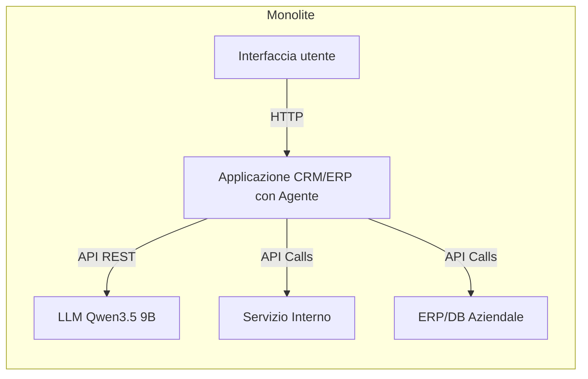

# Sommario esecutivo

L’integrazione di un agente AI (basato su Qwen3.5 9B) in un sistema aziendale richiede architetture mature e flessibili. Dai whitepaper e dai casi pratici emerge che **non esiste un’unica architettura “standard”**: in generale si evolve da sistemi monolitici verso soluzioni modulari e basate su microservizi, con uno strato di orchestrazione agentica e piattaforme di integrazione dedicate. Le architetture di punta accoppiando modelli LLM (anche custom e self‑hosted) con componenti di RAG (vector DB, retriever, indexer), gestori di tool ed eventualmente orchestratori multi‑agente. In pratica si va da un **monolite semplice**, facile da avviare ma poco scalabile, a sistemi a **microservizi** dove ogni agente o componente (retrieval, planner, executor, integrazione CRM, ecc.) è un servizio indipendente. Soluzioni avanzate utilizzano **piattaforme di integrazione** (iPaaS) per gestire chiamate API, webhook ed eventi (utile con Salesforce, Slack, ecc.), e orchestratori multi‑agente per task complessi (pattern “map‑reduce” di agenti). 

Ogni architettura ha vantaggi e compromessi: ad esempio un microservizio agent indipendente è più modulare e scalabile rispetto a un monolite, ma richiede complessità operativa aggiuntiva (container, orchestrazione, monitoring). I sistemi con RAG avanzato garantiscono maggiore accuratezza e contestualità, ma introducono latenza e costi computazionali per gli embedding. I requisiti aggiuntivi (sicurezza/GDPR, affidabilità, observability) impongono controlli sul flusso dei dati e isolamento dei componenti: per esempio l’agente deve **richiamare servizi dedicati** per i dati sensibili (non accedere direttamente al database aziendale) e ogni integrazione va autenticata e loggata in modo granulare. 

Di seguito illustriamo le architetture più accreditate, confrontandole in una tabella, e forniamo per ciascuna diagrammi (Mermaid), pro/contro, passi di implementazione, tool consigliati (open source e commerciali) e considerazioni su costi/latenza/scalabilità. La soluzione finale dipende dalle esigenze: per sistemi piccoli un agente singolo in un’app esistente può bastare, mentre realtà enterprise punteranno su microservizi agentici, RAG avanzato e integrazione tramite piattaforme iPaaS. 

## Confronto delle architetture

| **Tipo di architettura**        | **Vantaggi**                                                                                      | **Svantaggi**                                                                                       |
|--------------------------------|--------------------------------------------------------------------------------------------------|-----------------------------------------------------------------------------------------------------|
| **Monolitico con agente interno**<br>(stack unico)      | Semplicità iniziale; sviluppo rapido in early stage. Integrazione diretta (unica codebase). | Scalabilità limitata; ogni modifica richiede redeploy completo. Manutenibilità ridotta con la crescita. |
| **Microservizi + agente**<br>(servizio agent dedicato)  | Moduli indipendenti: agent, NLP, DB, integrazioni sviluppabili e scalabili separatamente. Maggiore resilienza. | Complessità architetturale: orchestration, CI/CD, networking. Occorrono container/orchestratori e infrastruttura (Kubernetes, API gateway). |
| **Multi-agent orchestrato**<br>(pipelines/flow) | Possibilità di workflow complessi parallelizzabili. Specializzazione di agent (es. classifier leggero vs. agente esperto). Failover tra agent. | Latenza e overhead elevati (più agent = più roundtrip). Coordinamento complesso (negli scenari “map‑reduce”). Difficile debugging senza tracing dettagliato. |
| **Agente *RAG/Memory***<br>(LLM + Retrieval) | Conoscenza *fresca* e specializzata (es. CRM, documenti interni). Alta accuratezza domande specifiche. Riduce richiesta di training continuo. | Richiede pipeline ETL e vector DB: ingegneria dati (chunking, embedding, index). Costo CPU/GPU su embeddings, latenza per retrieval. Potenziali problemi di **drift** e consistenza dati (inserimento, aggiornamento degli indici). |
| **Piattaforma di integrazione (iPaaS)**<br>(agente + tool connector) | Gestione dedicata di auth, token, webhook e sincronizzazioni. Riduce il lavoro custom: copre act/react/retrieve con affidabilità multi-tenant (retry, rate-limit). Aggiunge moduli pronte (CRM, Slack, email). | Dipendenza da fornitori o costi plugin/abbonamenti. Disaccoppiamento utile ma un layer in più può introdurre latenza. Configurazione iniziale complessa. “Vendor lock-in” e gestione degli aggiornamenti dei connector. |

## Architettura monolitica con agente integrato 



**Descrizione:** l’agente AI è integrato come parte di un’unica applicazione. La logica linguistica (Qwen3.5) viene invocata direttamente dal codice del CRM/WebApp, e gli eventuali *tool* (es. servizi interni, database) sono chiamati anch’essi direttamente dall’applicazione. 

**Vantaggi:** avvio semplice, sviluppo rapido in fase di prototipo. Non richiede infrastrutture complesse: basta implementare richieste HTTP all’LLM (e.g. tramite SDK o REST) all’interno del codice esistente. Nessuna overhead da orchestrator o API gateway aggiuntivi. Inizialmente è intuitivo da capire.

**Svantaggi:** **scalabilità limitata**: tutto è in un unico servizio, che cresce in complessità man mano che si aggiungono funzionalità. Ad es. cambiare la logica NLP o aggiornare il modello comporta redeploy dell’intera applicazione. Con l’aumentare delle richieste utente, non è possibile scalarne soltanto il componente agente; inoltre ogni crash dell’agente può causare downtime complessivo. È difficile garantire isolamenti di sicurezza/risorse: l’agente avrà accesso diretto ai database interni, aumentando il rischio di violazioni o errori. L’evoluzione diventa costosa in termini di test e coordinamento.

**Implementazione tipica:** estendere il backend esistente (CRM o app web) con un componente di chiamata al modello. Si utilizza ad esempio un SDK per Qwen3.5 o le API HTTP. Pipeline semplificata: input utente → preprocess (tokenizzazione) → invio a LLM → postprocess e invio risposta. L’eventuale retrieval documentale può essere fatto con query tradizionali su database relazionale. Pochi tool; di solito azioni dirette. 

**Stack consigliato:** linguaggi/framework già in uso (Java, C#, Python), JDK o .NET con libreria HTTP. LLM in locale (GPU on‑prem) o cloud (API) senza wrapper esterni. Database tradizionali (MySQL/PostgreSQL) o sistemi semplici. Logging basilare. Nessuna componente esterna obbligatoria. Esempi open source: un chatbot semplice in Node.js o Python integrato via webhook (es. Rasa sul medesimo server del CRM). 

**Costo/latency:** basso overhead di integrazione, ma ogni richiesta LLM aggiunge latenza (>500 ms tipicamente). Non adatto a carichi elevati; scaling verticale (GPU più potenti) è l’unica opzione. Ideale solo per POC o sistemi interni senza altissime performance richieste.

## Architettura microservizi con agente dedicato

```mermaid
flowchart LR
    subgraph Frontend
        UI(Web/Mobile) -->|REST/SDK| API_Gateway[API Gateway]
    end
    subgraph Backend
        API_Gateway --> AgentSvc[Servizio Agente AI]
        AgentSvc -->|RPC/REST| Planner[Modulo di Pianificazione]
        AgentSvc -->|RPC/REST| Retriever[Modulo RAG/Retrieval]
        AgentSvc -->|RPC/REST| Executor[Modulo Esecuzione]
        AgentSvc --> LLM[Qwen3.5 9B Model Server]
        Retriever --> VectorDB[Database Vettoriale]
        Executor --> CRM[CRM/ERP via tool adapter]
        Executor --> ToolExt[Altri API/Strumenti]
        Monitoring[Logging & Metrics] <-- AgentSvc
    end
```

**Descrizione:** l’agente AI è confezionato come **microservizio indipendente** all’interno di un’architettura a microservizi. A monte c’è un API Gateway (o un servizio orchestration) a cui i client (web, mobile) inviano richieste. Il servizio “Agente AI” coordina internamente più sottocomponenti: un *planner*, un *retriever* (RAG), un *executor*, ecc., ognuno come modulo o container separato. Gli altri servizi aziendali (CRM, ERP, DB documentali) rimangono anch’essi microservizi distinti, raggiunti tramite protocolli sicuri.

**Vantaggi:** **Modularità e scalabilità**: ciascuna funzione dell’agente può scalare autonomamente (ad es. aumentare nodi solo per la componente RAG se necessario). È più facile mantenere e aggiornare: modificando il microservizio agente si riducono i rischi di interferire con altri domini. Le code e i messaggi asincroni tra i servizi (eventi, code Kafka/Rabbit) permettono di isolare carichi di lavoro e gestire picchi. La separazione dei confini (bounded contexts) aiuta a definire ruoli chiari: es. un servizio dedicato alla ricerca documentale, uno al workflow di approvazione, uno alle API esterne. Questo riduce l’accoppiamento: l’agente chiama solo API di servizi esposti, non accede direttamente a DB interni.  

**Svantaggi:** **Complessità operativa**: serve orchestrazione di container (es. Kubernetes), CI/CD automatizzato, gestione dei deploy. Bisogna definire chiaramente i **contratti** tra servizi (API versioning, eventi) e implementare retry, idempotenza, monitoraggio distribuito. Senza adeguata observability il modello si appesantisce di complessità “invisibile”. Vi sono costi maggiori per networking interno e latenza tra servizi (RPC/HTTP) anche per operazioni semplici.  

**Implementazione tipica:** si creano servizi separati per: 

- **NLP Pipeline:** preprocess (tokenizzazione, chiarimenti), eventuale chunking dei prompt.  
- **Retriever/Indexing:** servizio che indicizza dati aziendali in un vector DB (Milvus, Weaviate, Pinecone) e risponde a query semantiche.  
- **Agent Planner:** logica di pianificazione e Ragionamento (può incarnare pattern ReAct o ReWOO).  
- **Executor/Tool Adapter:** gestisce le chiamate ai tool esterni (CRM, slack, funzioni personalizzate) come “tool” selezionabili dal modello. Ad esempio un’estensione MCP (Model Context Protocol) serve a scoprire/invocare strumenti senza codice custom per ogni integrazione.  
- **API Gateway/Auth:** centralizza autenticazione (OAuth2/JWT), autoscala i servizi, applica rate limit.  
- **Monitoring & Logs:** ogni microservizio espone metriche (Prometheus) e log strutturati (per audit e debugging).  

**Stack consigliato:** linguaggi a scelta (Java/Spring, Python/Flask, Node.js), container Docker/Kubernetes. Vector DB (Milvus, Pinecone, Qdrant) per RAG; framework agent (LangChain, Haystack, Semantic Kernel). Usare protocolli standard (OpenTelemetry per tracing, gRPC/REST per API). Strumenti: API Gateway (Kong, Apigee), service mesh (Istio), Identity (Keycloak, OAuth). Come esempio open source si possono citare template in LangChain + FastAPI per agent con tool.

**Costo/latency:** l’overhead di gestione è maggiore (più container/microservizi da mantenere), ma consente migliore scalabilità orizzontale. Un calcolo delle prestazioni deve considerare: latenza cumulativa tra servizi, inferenze LLM (spesso su GPU), e costi di storage dei vettori. In genere si ottiene **miglior throughput** sotto carichi elevati rispetto al monolite, ma il deployment iniziale (infra, devops) richiede più risorse. 

## Architettura multi-agente orchestrato

```mermaid
flowchart TD
    User[Utente] -->|Prompt| Orchestrator[Orchestratore di workflow]
    Orchestrator --> AgentA[Agente A\n(Retrieval)]
    Orchestrator --> AgentB[Agente B\n(Formattazione)]
    Orchestrator --> AgentC[Agente C\n(Chiamata Tool)]
    AgentA --> VectorDB[Vector Database]
    AgentC --> ToolCRM[CRM/API Esterni]
    Orchestrator --> BotResponse[Risposta all'Utente]
```

**Descrizione:** un’architettura multi-agent affianca diversi agenti specializzati coordinati da un orchestratore centrale (o pipeline definita). Ad esempio, un **orchestratore** (un servizio workflow) suddivide il compito in sottotask paralleli, invocando agenti differenti (es. uno per retrieval, uno per business logic, uno per tool specifici). I risultati vengono poi ricomposti e presentati all’utente. Microsoft raccomanda questo pattern quando un singolo agent non basta a coprire compiti complessi. 

**Vantaggi:** *Massima flessibilità*. Ogni agente può essere tarato per un dominio o un modello specifico (e.g. classificare richieste con un modello leggero prima di passare a un LLM costoso). Si possono parallelizzare attività indipendenti e introdurre robustezza: se un agente fallisce, un altro potrebbe gestire parte del workflow. L’orchestratore (o “coach agent”) garantisce auditabilità e rollback dei passi.

**Svantaggi:** overhead elevato di comunicazione e **latenza** (più agent = più roundtrip). Complessità esponenziale nel testing e nel debug: serve un buon tracciamento (OpenTelemetry) per identificare quale agente e quale passaggio hanno fallito. Bisogna gestire la sincronizzazione e lo stato di più agenti; errori o divergenze possono far “loopare” il sistema se non previsti (ad esempio, un agente richiede input a un altro che non arriva). L’implementazione richiede framework agent avanzati (es. LangGraph, un orchestrator come Durable Functions, o soluzioni enterprise come IBM watsonx Orchestrate) e non è necessario per semplici use-case.

**Implementazione tipica:** si crea un “motore di orchestrazione” (ad es. Apache Airflow, Argo Workflows o soluzioni LLM-oriented) che definisce il flusso tra agenti. Si definiscono diversi agenti come microservizi autonomi; l’orchestratore invia dati e raccolta risposte. Ad es.: 

- Un classificatore/Router semantico (potrebbe essere un modello piccolo) determina se usare il percorso A o B.  
- Un agente di **retrieval** estrae contesto da DB o vector store.  
- Un agente di **Tool B** invoca API esterne specifiche (CRM, servizi di terzi) tramite “tool calling”.  
- Un agente di **riformulazione** o validazione controlla la coerenza finale (memory/reference check).  

**Stack consigliato:** strumenti di orchestrazione (Kubernetes, Argo, Orkes Conductor). Framework multi-agent come LangChain con LangGraph o Microsoft Semantic Kernel. Modelli distinti: alcuni potrebbero usare Qwen3.5, altri versioni più leggere (Llama2, Mistral) per compiti diversi. Nel caso Dynamiq/IBM watsonx, viene usato un **classifier** IBM (Granite) a basso costo e solo per casi complessi si passa a un agente LLM più potente. 

**Costo/latency:** tendenzialmente più alto in termini di computazione (token LLM multipli, orchestrazione). Tuttavia permette parallelismo: se un workflow può sfruttare più thread o GPU indipendenti, il tempo totale può ridursi. In compenso, *ogni* passaggio LLM aggiunge costi di elaborazione e tempo. Bisogna ottimizzare i budget token (split delle promesse, parametri model più piccoli) per evitare scostamenti di spesa.  

## Architettura RAG e memoria degli agenti

```mermaid
flowchart LR
    U[Utente] -->|Query| Retriever[Servizio RAG]
    Retriever --> Embedding[Model Embedding]
    Embedding --> VectorDB[(Vector DB)]
    VectorDB -->|Top-k docs| Retriever
    Retriever -->|Context + Prompt| LLM[Qwen3.5 9B (LLM)]
    LLM -->|Risposta| U
    subgraph Memoria
      MemoryStore[(Database di Memoria)]
      LLM --> MemoryStore
      LLM --> MemoryStore
    end
```

**Descrizione:** l’agente integra un **meccanismo di knowledge retrieval** esterno. I dati aziendali (documenti, chat logs, record CRM) vengono preprocessati (tokenizzati, chunkati) e indicizzati in un vector store. A runtime, il testo dell’utente viene convertito in embedding e confrontato con i vettori per recuperare i contenuti pertinenti, che vengono poi passati come contesto all’LLM (Retrieval Augmented Generation). Una variante “agentic” prevede anche memoria conversazionale persistente: le interazioni precedenti vengono salvate e utilizzate per affinare la risposta.

**Vantaggi:** il modello risponde con **informazioni aggiornate e specifiche del dominio**, senza bisogno di retraining. È ideale per rispondere a domande su dati interni (manuali tecnici, regolamenti, record clienti) mantenendo compliance e GDPR (poiché i dati sensibili non sono nei parametri del modello ma in banche dati controllate). L’utilizzo di componenti di memoria avanzati consente all’agente di “ricordare” utenti e contesti, migliorando personalizzazione e coerenza. Architetture di RAG mature usano tecniche ibride (BM25+embedding, cross-encoder re-ranking) per aumentare precisione.

**Svantaggi:** complessità di progettazione: serve un *ingester* (estrazione, pulizia, deduplicazione dei dati) e gestione delle permissions (Chi può vedere cosa). Il vector DB deve scalare con i dati: per piccoli dataset si può usare pgvector, ma su milioni di voci servono DB dedicati (Qdrant, Weaviate, Milvus). Costo di CPU/GPU per embeddings e memoria aggiuntiva. Con l’aumentare del contesto recuperato può aumentare la latenza e diluirsi la pertinenza (bisogna fare chunking e prompt engineering avanzato). Inoltre, l’agente deve gestire la discontinuità tra query e contesto esterno (prompt chaining).

**Implementazione tipica:** utilizzo di framework come LlamaIndex o LangChain: moduli di *document loader* per raccogliere dati, *text splitter*, *embedding model* (OpenAI o HF), e motore di ricerca vettoriale. Spesso si affianca un componente di caching semantico (“semantic cache”) per evitare ricalcoli ripetitivi. I “retriever” richiedono autorizzazione esplicita: possono essere realizzati come microservizi dedicati con permessi gestionati (e.g. un servizio “Knowledge Base” con policy GDPR). Anche qui serve orchestrazione: una query può generare sottotask per retrieval + pianificazione di risposte, come nei pattern ReAct/ReWOO.

**Stack consigliato:** Vector DB (Milvus, Qdrant, Weaviate) a seconda di scala. Embedding model dedicati (OpenAI/Claude, oppure modelli in house con huggingface). Strumenti memory (Cerebras SDK, Oracles di Weaviate, oppure agentic memory layer come Supermemory). Un esempio è il modulo *Retriever* di LangChain, abbinato a Pinecone o Chroma. Bisogna implementare politiche di “refresh” dei dati e strumenti di consulenza (ad es. pipeline di sync incrementale).

**Costo/latency:** l’overhead include sia il calcolo degli embeddings (latency aggiuntiva tipicamente di qualche centinaio di ms) sia la gestione del DB vettoriale. In generale, RAG introduce almeno un salto di round-trip (alla DB + back all’LLM). Tuttavia allevia il carico token sul modello (si invia meno testo per ottenere contesto). Le architetture mature usano re-ranking o retrieval asincrono per minimizzare i tempi per query complesse. A lungo termine, ben progettato riduce costi di fine-tuning (aggiornando solo il DB, non il modello).

## Piattaforma di integrazione e tool calling

```mermaid
flowchart LR
    subgraph Integrazione Agente-App
        Agent[Agente AI] -- Tool API --> CRM[API CRM (Salesforce)]
        Agent -- Tool API --> Slack[Webhooks Slack]
        Agent -- Sync/RAG --> DBInt[(Database interno)]
        Agent -- Trigger --> EventBus[(Message Queue/Webhooks)]
    end
```

**Descrizione:** in ambienti enterprise l’agente AI va fatto *collaborare* con molti sistemi esterni (CRM, ERP, chatbot aziendali, servizi di terzi). Una **piattaforma di integrazione** (o iPaaS) funge da “collante”. Essa gestisce autenticazione multi-tenant (memorizza token OAuth per ogni cliente), fornisce un catalogo centralizzato di “tool” (azioni API) selezionabili dall’agente, gestisce webhook/eventi di sistema e sincronizza dati per RAG. Per esempio Paragon o Nango consentono di collegare senza coding sistemi come Salesforce, Zendesk, Slack: l’agente “sceglie” lo strumento dall’elenco fornito e lo invoca con il giusto contesto, mentre la piattaforma si occupa di logging, retry e sicurezza. 

**Vantaggi:** semplifica enormemente l’integrazione con applicazioni aziendali. Il team non scrive codice per ogni API: esistono connettori predefiniti e un meccanismo di scoperta tool. Si garantisce multi-tenancy in modo sicuro (ogni cliente usa i propri token) e si possono reagire a eventi in real-time (es. “aggiorna il CRM quando l’utente conferma una richiesta” come evento webhook). La piattaforma fornisce anche monitoraggio delle operazioni eseguite dall’agente (event logs filtrabili). 

**Svantaggi:** dipendenza da servizi di terzi (iPaaS). Può aumentare i costi ricorrenti (licenze o fee) e introdurre un singolo punto di fallimento. Se la piattaforma è down, l’agente non può agire sui tool esterni. Inoltre, una soluzione preconfezionata offre flessibilità limitata rispetto a codice custom: uno scenario molto specifico o un API “esotico” potrebbe non essere supportato nativamente. Infine, le chiamate vengono incanalate attraverso un layer intermedio, aumentando la latenza delle operazioni di scrittura/lettura.  

**Implementazione tipica:** si configura il “connector” per ogni applicazione esterna: ad es. Salesforce (OAuth), Slack (Webhook endpoint + verification), Google Workspace, DB esterni. Si mappano azioni (“strumenti”) che l’agente può invocare (ad es. `getCustomerData`, `postMessage`). Quando l’agente decide un’azione, la chiamata passa tramite la piattaforma che la inoltra in produzione sicura. L’agente stesso parla con la piattaforma tramite API, non direttamente con il CRM. Alcune piattaforme (es. Paragon) offrono anche un *MCP Gateway* (Model Context Protocol) per esporre dinamicamente cataloghi di tool. 

**Stack consigliato:** soluzioni SaaS come Paragon, Workato, Zapier aziendale o open-source come Nango, pero anche framework di messaggistica (Kafka, Celery) per eventi. Per conversazioni in app: SDK ufficiali (es. *Bot Framework* di Microsoft, Slack SDK) permettono di integrare l’agente in interfacce esistenti (chatbot, app mobile). È importante supportare eventi “push” (webhook) anziché sole poll: questo trasforma l’agente da entità reattiva a reattiva-event driven. Per RAG, usare soluzioni di **Managed Sync** (sincronizzazione dati) come Paragon Sync o job schedulati (ETL) per mantenere fresh gli indici. 

**Costo/latency:** costo variabile: in-house richiede team per mantenere connettori, refresh, sicurezza. Soluzioni pronte hanno licensing, ma riducono TCO di integrazione. Le latenze di tool-calling dipendono dalla piattaforma (tipicamente pochi decimi di secondo aggiuntivi). È cruciale dimensionare il budget delle API (rate-limit, fair‑share su tenant). L’affidabilità (reti resilienti, retry) è un costo nascosto da considerare.

## Componenti chiave di un sistema agentico

Un’architettura robusta di agente AI contiene diversi componenti:

- **Pipeline NLP:** pre-elaborazione del testo (tokenizzazione, eliminazione stopword, conversazioni stateful). Strumenti come spaCy, HuggingFace Transformers possono essere usati qui. Importante *chunking* in RAG (dividere documenti in blocchi).
- **Modello LLM (Qwen3.5 9B):** il cuore di comprensione linguistica e ragionamento. Può essere ospitato on-prem (usando GPU dedicate, es. server NVIDIA), o chiamato via API cloud (Azure OpenAI, AWS Bedrock). In scenari regolamentati si preferiscono modelli gestiti in-house per maggior controllo sui dati.
- **Vector DB / retriever:** per RAG servono database vettoriali (Milvus, Weaviate, Pinecone). Il *retriever* prende le query utente, genera embedding e interroga il DB semantico. A volte si affianca un motore di ricerca tradizionale (BM25) per hybrid retrieval.
- **Indexer/ingestion:** modulo per importare dati aziendali (ticket, email, documenti) nel DB vettoriale. Prevede scraping, normalizzazione, controllo dei permessi. In produzione si usa un sistema di sync incrementale.
- **Planner / agente di workflow:** componente che decide la sequenza di operazioni (pensiero/azione), usando paradigmi come ReAct o agentic planning. Può suddividere il compito in subtasks e decidere quale tool chiamare.
- **Executor / tool calling:** esegue le API e i tool selezionati dall’agente. In pratica, mappa il *nome* di un tool alla chiamata concreta (con parametri generati dal modello) e gestisce esito, errori e fallback. Framework come **LangChain “tool”** o il citato MCP si occupano di questo. 
- **Tool adapter / connettori:** interfacce verso sistemi esterni (CRM, email, servizi interni). Ogni adattatore si occupa di un dominio (es. `OrderService`, `EmailSender`, `DatabaseQuery`) e applica autorizzazioni e validazioni. L’agente chiama sempre l’API astratta (tool) e non il DB grezzo, isolando la logica business dai permessi diretti.
- **API Gateway:** punto di accesso unificato per i client e per la comunicazione inter-servizio, gestisce autenticazione (OAuth2, JWT), rate limiting e routing. In Kubernetes si può usare ingress + Istio/Kong.
- **Sicurezza/Auth:** gestisce credenziali e token dei servizi. Fondamentale il **token management** (archiviazione criptata, refresh, revoca). Applicare il minimo privilegio: l’agente ha solo permessi sui dati necessari. Spesso si inseriscono filtri di input/output (classificatori anti-prompt-injection) e tecniche di data masking per PII.
- **Observability/monitoring:** log strutturati e metriche custom in ogni servizio. Tracce distribuite (OpenTelemetry) aiutano a seguire le chiamate tra agent, LLM e tool. Dashboard di monitoraggio (Prometheus/Grafana) per latenze, errori, utilizzo token. Senza questo l’architettura agentica diventa “invisibile” e ingestibile.
- **Policy/Compliance:** moduli per audit e politiche di accesso (es. controllare che l’agente rispetti GDPR). Ad es. servizi per Data Loss Prevention (DLP) e Context-Based Access Control (CBAC) sono utili. Devono essere previsti meccanismi di *tracciabilità* di ogni azione (chi ha richiesto cosa, quando) per rispondere ad audit GDPR.
- **Testing/CI:** pipeline di integrazione continua con test automatizzati. A differenza del software tradizionale, per agenti AI si usano *structural tests* con dati di test e mocking delle risposte LLM. Le best practice includono test unitari per i singoli moduli (validator, executor) e test end-to-end simulando flussi utente. L’utilizzo di **OpenTelemetry** per traccia e di set di valutazione “golden” aiuta nel regression testing.

## Integrazione con CRM e app aziendali

Gli agenti AI aziendali devono integrarsi con sistemi esistenti:

- **Webhooks ed eventi:** l’agente può reagire a eventi in real time. Ad es. “nuovo lead su Salesforce” scatenato tramite webhook che innesca un flusso automatizzato. La piattaforma di integrazione deve gestire firma e retry dei webhook. In tal modo l’agente non è più solo “on-demand” ma *reactive* all’ambiente.
- **SDK e API conversazionali:** molte piattaforme CRM/Helpdesk offrono SDK o API chat (es. Microsoft Bot Framework, Slack Bolt, Zendesk Talk) per integrare chatbot/agent nelle interfacce. Si possono usare per creare componenti mobile/web che comunicano con l’agente attraverso message queue o REST.
- **Event-driven architecture:** conviene adottare un approccio orientato ad eventi (Kafka, RabbitMQ) per scollegare l’agente dai servizi. Ad esempio, se l’agente deve aggiornare il CRM, pubblica un messaggio su un bus che poi il microservizio CRM consuma, anziché chiamare direttamente l’API (favorendo resilienza e scalabilità).
- **Permessi applicativi:** ogni integrazione con CRM/ERP deve seguire politiche aziendali: l’agente ottiene token OAuth per l’utente corrente o per l’organizzazione, e ogni chiamata viene registrata (audit trail) come qualsiasi utente umano.
- **Gestione errori:** implementare circuit breaker e fallback; se un’integrazione fallisce (CRM down) l’agente deve saper ripiegare (es. notificare fallimento, riprova ritardata).

## Deployment (On‑premise, Cloud, Hybrid)

Le opzioni di deployment sono flessibili:

- **On-Premise/Hybird:** soprattutto in contesti GDPR o legacy, si può eseguire Qwen3.5 e i servizi agentici in server aziendali (cluster GPU interni). È possibile usare K8s on-prem. Questo garantisce che i dati sensibili non escano dall’infrastruttura aziendale, ma richiede investimenti in hardware e manutenzione. Alcuni modelli open come Qwen, Llama4 possono girare autonomamente.
- **Cloud:** piattaforme come Azure AI, AWS SageMaker/Bedrock o Google Vertex AI offrono LLM managed e infrastruttura scalabile. Es.: Azure offre **Azure OpenAI Service** con versioni di modello addestrabili, e supporta deployment on-prem o ibridi tramite Arc. AWS Bedrock permette di richiamare diversi modelli senza gestire cluster. Il cloud abilita funzionalità automatiche (autoscaling GPU, vector DB SaaS) e sicurezza nativa (VPC, IAM).
- **Edge/Hybrid:** in scenari particolari (applicativi mobili con agent locale), si può pensare di scaricare parti leggere dell’agent sulle edge devices (ad es. un LLM compatto come Falcon) e sincronizzare dati con il server centrale per le operazioni pesanti. Questo è complesso e raro per Qwen3.5 (9B parametri), ma in alcuni contesti di latenza critica si fa.

Su tutte le opzioni, è fondamentale infrastrutturare la CI/CD: script di deployment, testing automatico, rollout canarino. Usare container Docker per i microservizi, infrastruttura IaC (Terraform, Helm) e pipeline CI (GitLab CI, Jenkins). Per il modello LLM, valutare se va confezionato in un servizio (model serving come Triton o RHEL AI Inference Server) o chiamato esternamente tramite API.

## Privacy, sicurezza e compliance

- **GDPR/Data Privacy:** ogni dato personale processato dagli agenti deve essere giustificato. **Minimizzazione:** trasmettere all’agente solo il minimo di informazioni necessarie. Ad es. anonimizzare o mascherare ID prima di qualsiasi chiamata LLM.  
- **Limitazione di finalità:** le richieste all’agente devono avere scopi chiari (nel prompt) e non essere riutilizzati per scopi diversi (non conservare indirizzi ottenuti per altri scopi).  
- **Privacy by design:** implementare controlli come Context-Based Access Control (CBAC) per consentire accesso ai dati condizionato al contesto (ruolo dell’utente, ora del giorno, ecc.). Usare soluzioni di tokenizzazione/mascheramento (p.e. Protecto Privacy Vault) per dati sensibili.  
- **Audit e tracciabilità:** loggare quali dati sono stati usati e chi ha richiesto cosa. Conservare i log delle conversazioni in modo criptato e dare all’utente finale diritto di accesso/cancellazione dei propri dati (implica cancellare dati dall’indice vettoriale e dai log dell’agente).  
- **Sicurezza di esecuzione:** isolare l’agent runtime: eseguire il codice generato in **sandbox** hardware-level (es. Firecracker microVMs o gVisor) con filesystem e rete in modalità *no-new-privileges*. Questo impedisce che codice malformato o prompt-injection attacchi compromettano l’infrastruttura sottostante.  
- **Segregazione dei ruoli e crittografia:** separare chi sviluppa l’agente da chi gestisce il modello (principio di separazione duty). Cifrare dati sensibili a riposo e in transito. In microservizi, usare identità macchina (certs/Kubernetes service accounts) per le chiamate interne.  
- **Testing di sicurezza:** effettuare penetration test e red-teaming (ad es. con strumenti di prompt injection) prima di andare in produzione, seguendo linee guida OWASP AIVSS e NIST CAIS. Prevedere monitoraggio di anomalie (es. spike inattesi di richieste model, uso imprevisto di nuovi tool).

## Test, monitoraggio e metriche di valutazione

Il testing degli agenti AI è critico e complesso. Non si tratta solo di accuracy del modello, ma di performance end-to-end:

- **Testing strutturale:** come suggerito da ricerche accademiche, si usano *tracce* (OpenTelemetry) per catturare il percorso dell’agente (chi ha chiamato cosa e quando) e confrontarlo con un run atteso. Si fanno mocking controllati dell’LLM (per riproducibilità) e si scrivono assert sui risultati intermedi (ad es. “strumento X deve essere chiamato con parametri Y”). Questo permette test CI automatizzati approfonditi.
- **Metriche di fine-run:** includono **tasso di completamento del task**, **correttezza della risposta finale** (requota domain expert/human) e **fedeltà** (evitare hallucinations). Metriche dedicate per agent: percentuale di “tool call” corrette, efficienza del piano (numero di step rispetto al minimo), latenza totale, costo token per conversazione. Queste vanno monitorate nel tempo (drift del modello o dei dati).  
- **Livelli di valutazione:** end-to-end (il task è risolto?), traiettoria (ogni step è sensato?), componente (quale microservizio ha fallito?). Ad esempio, si può tracciare il fallimento di un tool call o di un passaggio di retrieval per isolare bug.  
- **Metrica di sicurezza:** contare tentativi di prompt injection o accessi non autorizzati, e monitorare l’uso di token criptati/dati sensibili.
- **Continuous Monitoring:** in produzione occorre alerting (es. error rate tool > 5%) e retraining/aggiornamento periodico del modello e degli indici. Strumenti come Prometheus + Grafana per metriche tecniche, e OpenTelemetry/Jaeger per trace, sono fondamentali.  

## Esempi e stack tecnologico consigliato

- **Framework Open Source:** LangChain (per agent orchestration con tool calling), LlamaIndex/Haystack (per pipeline RAG), Semantic Kernel (Microsoft) e ZenML (per MLOps). Per vector DB: Milvus, Qdrant, Weaviate, o anche pgvector per carichi moderati. Per orchestrazione multi-agent: LangGraph o Orkes Conductor.  
- **Prodotti Commerciali:** Azure OpenAI Service (modello gestito + integrazione CoPilot), IBM watsonx Orchestrate (workflow agent), Salesforce Einstein GPT per integrazione CRM, AWS Bedrock. iPaaS: Paragon, Workato, Zapier Enterprise, Nango (open).  
- **Esempi concreti:** Dynamiq/IBM ha realizzato un *legal research agent* multi-agente via watsonx; molte aziende costruiscono CoPilot per Salesforce usando l’architettura ibrida LLM+tool. Framework di test: *DeepEval* di Confident AI (open-source) implementa metriche come quelle descritte.  
- **Considerazioni di costo:** i grandi modelli generano costi variabili (token processing, GPU/hours). Ad es. 10k token di prompt + 10k di risposta su Qwen3.5 possono richiedere diversi centesimi di dollaro. Un agent multi-step moltiplica questi costi per ogni step. Il vector DB aggiunge costi di storage/throughput (e.g. Milvus cluster). Occorre bilanciare complessità (più agent, più DB) col valore offerto. Spesso la regola pratica è aggiungere complessità (agenti, integrazione) solo quando il caso d’uso lo giustifica.  

In conclusione, le architetture migliori per un agente AI aziendale sono **modulari, observabili e sicure**. Si consiglia di partire dal costruire un microservizio agente con capacità base (es. solo chat+retrieval) e testarlo su un sottoinsieme di dati. Successivamente, si può evolvere verso orchestrazioni più complesse, multi-agent e integrazioni aggiuntive, assicurando sempre tracciabilità e compliance lungo il processo.

